# 第 1 章 初識 AI Infra

前言介紹了本書的寫作緣起、章節安排和閱讀方法。本章起沿著模型的執行過程，認識支撐這一過程的系統。**AI Infra** 是支撐 AI 訓練和推理的基礎設施，包括計算裝置、儲存與互聯，以及組織這些資源的軟體。訓練透過樣本調整模型參數；推理使用訓練得到的參數處理輸入、產生輸出。

本章先說明應用如何透過程式碼、模型與上下文共同表達任務，再沿一次請求的處理過程認識系統，用容量、算力和頻寬回答具體的設計問題：資料能否放下，回答要等多久，增加加速器或改變資料表示能帶來多少收益。最後回顧幾個真實架構的形成過程，說明需求如何推動系統設計。

## 1.1 AI Infra 為什麼重要

### 1.1.1 程式設計抽象上移：從作業系統到模型上下文

以文件問答服務為例。開發者先規定文件讀取、檢索和結果展示的程式流程，再把使用者問題與檢索到的材料交給語言模型生成答案。**上下文**（context）是本次模型呼叫可以使用的輸入內容，包括任務指令、參考材料和此前的互動結果。保持模型參數不變，改變指令、示例或參考材料，就能改變模型處理的任務及回答方式。

若讓該服務檢查程式碼，可以把程式碼、測試要求和可呼叫的工具一同提供給模型，由模型提出修改方案或發起工具呼叫；應用程式執行測試，把結果加入下一次呼叫的上下文，再由模型繼續判斷。工具是供應用呼叫的程式功能，例如讀取檔案或執行測試。模型負責選擇下一步做什麼，宿主程式負責檢查許可權、執行操作和儲存結果。完成一次任務可能需要多次模型呼叫和工具執行。

**抽象**是把複雜實現封裝在明確的介面之後，讓開發者用較少的概念組織程式。**可程式性**是開發者透過某種介面改變系統行為的能力。傳統應用主要用程式程式碼表達行為，編譯器將程式碼轉換為可執行指令，作業系統管理程式執行所需的資源。模型驅動的應用增加了另一個重要入口：透過選擇模型、組織上下文和提供工具來表達任務。一部分原來需要逐條編寫規則才能實現的行為，現在由模型根據上下文決定；程式碼繼續組織呼叫流程，工具程式繼續透過作業系統訪問檔案、網路和裝置。[^abstraction]

圖 1-1 對照了這兩種組織方式。右側的 Agent 負責組織上下文、呼叫模型，並執行模型選擇的工具。其中，**模型介面**規定應用如何提交輸入、取得輸出。介面背後的執行系統計算模型輸出，並儲存後續步驟需要複用的上下文狀態；加速器是適合並行執行大量模型運算的處理器，記憶體儲存參數與執行狀態，互聯在裝置之間傳遞資料。開發者從上層改變任務，底層要把這些變化落實為具體運算與資料訪問。

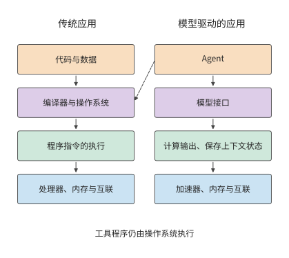

*圖 1-1　應用行為的表達方式與執行路徑。左側透過程式碼組織程式，右側透過上下文呼叫模型；實線表示向下的執行依賴，虛線表示工具執行仍需傳統作業系統。加速器、記憶體與互聯分別承擔模型計算、資料儲存和裝置間傳輸的職責。*

可程式性的變化也改變了模型服務的執行方式。在 AI 系統中，同一個模型為不同應用處理請求時，使用的是同一組參數。系統可以將多條請求合併計算，共用一次讀入的參數，提高加速器利用率。這種方式稱為批處理，每批共同執行的請求數稱為 batch size（批次大小）。與此同時，長文件、長回答和多輪工具呼叫會改變計算量、狀態佔用和等待時間。同一個模型、同一套加速器，處理不同任務時，效能可能相差甚遠。

這種效能差異的背後，是模型與硬體之間的相互影響。從模型設計來看，壓縮儲存的狀態、改變注意力機制或只使用部分模型參數，可以改變硬體需要完成的工作；從硬體條件來看，儲存容量、資料傳輸速度和裝置連線方式，又會影響哪些模型結構和執行方法更合適。理解這種雙向關係，才能同時討論回答質量、響應時間和成本，並解釋為什麼適合一個應用的方案，用於另一個應用時還需重新評估。

在以模型訓練和推理為主要應用的系統中，各層可以圍繞同一個完整的執行過程共同設計。模型結構給出計算和資料依賴，執行時掌握狀態何時產生、何時使用，硬體承擔相應的運算和傳輸。利用這些資訊重新組織執行，可以消除通用實現中的部分開銷。同一模型又能根據不同上下文處理多種任務，既能支援多樣的應用行為，又能讓底層針對模型執行做專門最佳化。**上層可程式性的變化，為跨層聯合最佳化開啟了新的空間。** 本書用量化分析研究這些最佳化機會，解釋原有的設計取捨如何改變，新的實現又如何提高訓練和推理的效能。

### 1.1.2 從任務到硬體的六層分工

一次請求從提出到完成，要依次經過系統的多個層次。使用者提交一段程式碼，請模型找出錯誤。應用把程式碼和問題交給模型服務，服務選定執行請求的加速器，加速器讀入權重與輸入、完成計算，再把生成的回答交回應用。若多個加速器共同執行，還要在加速器之間傳遞中間結果。沿這條路徑，就能逐步找到等待發生在哪裡、哪份資料需要搬移。

華為半導體首席科學家廖恆博士提出 「十八層寶塔」，用來描述從應用、模型與軟體系統，到晶片、製造工藝和底層物理的多個層次。他指出，大多數人只瞭解其中的一層或幾層，因而錯失了許多跨層聯合最佳化的機會。[^panorama] 圖 1-2 借鑑這一方法，將本書內容劃分為六個層次：

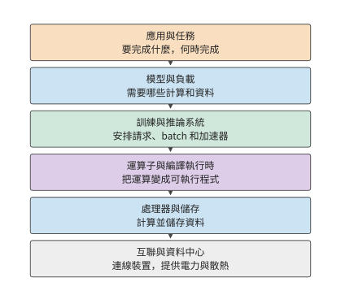

*圖 1-2　從應用到硬體的六層分工。*

最上面是**應用與任務**。對話、程式碼生成、語音互動，以及能夠呼叫工具推進任務的智慧體（Agent），都在這一層提出具體要求：要完成什麼任務，多快返回結果，成本上限是多少。訓練也有自己的任務目標，例如在給定時間內完成一次模型更新或一輪預訓練。

下一層是**模型與負載**。模型結構規定要做哪些計算、保留哪些資料；實際負載則決定這些工作何時到來、持續多久。一句簡短的提問和一篇長文件，即使交給同一個模型，也會形成不同的計算與儲存需求。模型結構在第 2 章展開，訓練與推論負載在第 3 章展開。

**訓練與推論系統**負責把這些需求組織成可執行的工作。這一層接收請求或作業，組織 batch，管理執行狀態，並決定如何使用一個或多個加速器。在推理中，它要協調正在生成的請求和新進入的請求；在訓練中，它還要組織參數更新、通訊和恢復。第 8—10 章討論這一層。

再向下是**運算子與編譯執行時**。模型中的矩陣乘法、歸一化（按統計量調整數值尺度）等操作，需要轉換為處理器能夠執行的程式。本書把矩陣乘法等基本運算稱為運算子；運算子函式庫提供這些運算的實現，編譯器把程式轉換為加速器可執行的形式，執行時負責提交程式和管理執行中的資源。三者共同決定如何分塊、如何使用臨時儲存、何時提交工作。相同的數學表示式，可以有不同的資料訪問和執行方式，第 5 章會具體分析這些差異。這裡還有理解分散式並行的一條線索：矩陣在一張卡內可以分塊執行，模型在多張卡上也可以按樣本、序列、特徵、層或專家（混合專家模型中按輸入逐個選用的子網路）分工。兩者都要先確定每塊由誰計算，再安排輸入到達與結果匯合。區別在於塊之間跨越的是片記憶體儲、視訊記憶體還是網路。第 6 章將沿這條線索解釋各種並行策略，而非將其視為互不相關的技巧。

**處理器與儲存**負責執行計算、儲存資料。CPU 是執行通用程式的中央處理器；GPU 是擅長並行處理大量相似運算的圖形處理器，如今也廣泛用於模型計算；NPU 是面向神經網路運算設計的處理器。主存存放 CPU 使用的資料，視訊記憶體存放 GPU 使用的資料，片上儲存則位於處理器晶片內部，讓計算單元能就近讀取資料。計算單元先讀取輸入，再執行運算，最後寫回結果。第 4 章將從計算能力與資料讀取速度的關係出發，解釋加速器的設計。

最下面是**互聯與資料中心**。裝置之間透過互聯交換資料，伺服器和更大的協作組透過網路連線，供電與散熱決定資源能夠如何部署。第 6、7 章討論超節點與資料中心網路，第 12 章進一步把執行位置擴充套件到端、邊和雲。

六個層次說明了主要分工，但有些能力貫穿多個層次。資源排程、執行環境、觀測和計費需要結合多個層次的資訊來組織；工藝、封裝、供電和散熱則決定裝置能夠如何製造和部署。網路也並非只在最下方發揮作用：需要跨裝置協作的模型、運算子和服務，都要經過具體互聯。

沿這六層向下看，任務逐步變成具體的計算與資料訪問；向上看，加速器的可用儲存容量、算力與頻寬決定系統能執行多大的模型、同時處理多少請求，以及能多快作出響應。這些層次之間的介面，也是聯合最佳化的切入點。模型改變狀態表示，會改變儲存和通訊需求；編譯器將相鄰運算子融合，會改變中間結果的存放位置；執行時讓加速器直接交接，會改變主機參與的次數。

### 1.1.3 一次生成請求的處理過程

**推理例項**是能夠獨立完成模型請求的一組執行資源，可以由一個或多個加速器組成。每次請求交由其中一個例項處理。圖 1-3 展示了請求分配與例項內部執行的分工：服務路由器是選擇請求執行位置的軟體；路由器選定例項後，由例項內部安排加速器執行模型。先分清誰負責執行，才能知道一份權重應放在哪裡、一份中間結果應傳給誰。

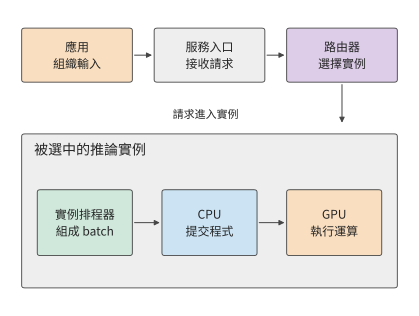

*圖 1-3　一次請求先由路由器選擇推理例項，再由例項內部的排程器安排執行。灰色外框圈出同一個例項，實線表示請求和工作提交的方向。*

上下文包括使用者輸入、已有對話、檢索結果和此前生成的內容。應用把這些資訊組織成請求，交給模型服務入口。入口核驗訪問許可權、檢查配額和請求內容後，路由器依據目標模型、例項負載等條件選擇一個例項；例項可以執行在一張卡上，也可以分佈在多張卡上。選定例項之後，例項內部再安排這些卡協作。

文字隨後轉換成 token 序列。詞元 (Token)（token）是模型處理文字的基本單位，可能對應一個字、詞的一部分或其他片段，具體文字的 token 數由分詞結果確定。文字轉換可以由例項或共享前端完成。例項排程器將請求放入佇列，再編入 batch，併為其狀態分配空間。CPU 上的執行時隨後向 GPU 提交計算任務，GPU 執行相應運算子。[^request]

模型先處理輸入，這一階段稱為預填充 (Prefill)（prefill）；隨後逐步生成新 token，這一階段稱為解碼（decode）。後續步驟會複用此前儲存的狀態，其中的 KV 快取（KV cache）儲存上下文 token 產生的鍵和值兩類向量，供後續位置的注意力計算使用。鍵和值是注意力機制使用的資料表示，第 2 章將結合具體運算說明鍵和值如何產生。生成迴圈由例項內部的排程器持續推進，前一步輸出成為下一步輸入。產生的 token 經輸出處理轉換為文字，沿連線流式返回；如果輸出要求呼叫工具，應用執行工具，把結果加入上下文，再發起後續呼叫。

上述每步計算反覆使用的資料，首先是模型權重。模型權重是訓練得到、用於把輸入變換成輸出的數值參數。權重在例項啟動或模型切換時從儲存載入，隨後持續存放在視訊記憶體中（稱為駐留），供多次請求使用。生成時，GPU 計算單元從視訊記憶體讀取當前層的權重和上下文狀態，完成運算，再將結果交給下一層。同一份資料由此經歷兩種頻率不同的搬移：載入把模型送到加速器，執行則反覆把所需資料送到計算單元。在多卡例項中，一張卡算出的中間結果還要傳給其他卡，後續計算才能繼續。中間張量是運算產生並交給後續運算的多維數值陣列，矩陣就是二維張量。**外部請求可能只有一小段文字，內部搬移的資料卻包括大得多的權重、狀態和中間張量。**

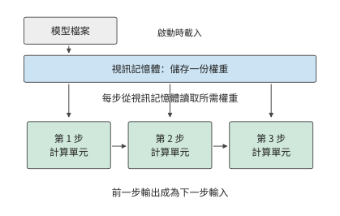

*圖 1-4　權重載入一次，生成時逐步讀取。藍框表示視訊記憶體中持續儲存的同一份權重，三個綠框表示先後發生的計算；箭頭表示讀取或結果依賴，步驟間距不代表耗時。*

圖 1-5 展示這些軟體功能對應的硬體。資料中心包含入口與 CPU 服務、共享儲存，以及由多個超節點構成的加速器資源池。超節點是一組透過高頻寬互聯緊密協作的加速器，可以分佈在多個伺服器或計算托盤（機櫃內裝有 CPU 與加速器的可插拔單元）中。

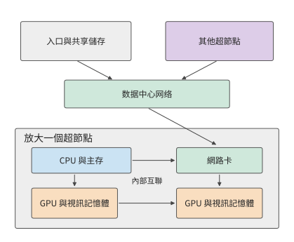

*圖 1-5　物理連線的兩層檢視。上方用資料中心網路連線服務與超節點，下方放大一個超節點，顯示主機、網路卡、GPU 與視訊記憶體；線條展示資料路徑，裝置數量用於示意。*

在伺服器或計算托盤內，CPU 連線主存，負責主機程式和執行控制；GPU 連線各自的視訊記憶體，執行模型計算、儲存執行所需的資料。HBM（高頻寬記憶體）是加速器常用的一類視訊記憶體，透過寬介面持續提供資料。CPU 與 GPU 可以透過 PCIe（高速外設互聯）連線，GPU 之間也可以透過獨立的高速互聯直接交換資料。網路卡把本機連線到網路。在支援直接記憶體存取的系統中，資料可以由傳輸硬體直接寫入指定記憶體區域，CPU 負責發起和管理傳輸；第 7 章會進一步解釋這種交接。

超節點內部的互聯通常稱為 **scale-up**（縱向擴充套件），重點是讓一組加速器以較低的通訊開銷共同計算；多個超節點再透過網路卡與交換網路相連，稱為 **scale-out**（橫向擴充套件），用來擴大叢集範圍。兩者都要考慮頻寬、延遲、擁塞與故障，但協作範圍和代價不同。以 NVIDIA 的 GB200 NVL72 為例，官方設計把 36 個 Grace CPU 和 72 個 Blackwell GPU 組織在一個機櫃中，72 個 GPU 透過 NVIDIA 的 GPU 高速互聯 NVLink 直接協作，形成同一個互聯域，叢集網路則負責對外連線。這種組織方式把緊密協作的範圍從單機擴大到了機櫃，模型可以在更多加速器之間分配權重和狀態，頻繁的交接則由機櫃內互聯完成。[^datacenter]

AI 網路與傳統資料中心網路由此形成了分工。服務入口傳遞請求，共享儲存提供模型檔案，加速器互聯傳遞計算中的中間結果。三種流量的傳輸頻率、資料量和依賴關係不同：模型檔案可以提前載入，當前層的部分結果卻必須及時到達，下一層才能繼續。物理連線因此直接影響模型的執行時間。

> **練習 1-1〔延伸〕：一次請求中的權重讀取、狀態增長與資料傳遞**
>
> 沿圖 1-3 至圖 1-5，補畫 KV 狀態隨輸出增加的過程，再分別標出模型檔案載入、一步權重讀取、KV 追加和卡間結果傳遞。若回答從 100 個 token 增至 1000 個，哪些資料只載入一次，哪些訪問會增加？若把一個例項複製成兩個例項，權重容量與請求路由又怎樣改變？

一次模型執行既受單卡能力影響，也受加速器連線方式影響。單卡的算力和儲存頻寬決定本地計算與讀寫的耗時，多卡協作則增加資料交換和等待。本章先估算單卡執行，後續章節再把同樣的方法用於超節點和網路。

先介紹一組貫穿全書的真實模型。DeepSeek V4 和 V4.1 Flash 提供了一條可以持續追蹤的線索。V4 已經透過上下文壓縮與稀疏訪問改變儲存和讀取需求，V4.1 Flash 則進一步重新劃分模型內部的職責。傳統的 decoder-only（僅解碼器）模型通常讓輸入 token 經過完整主幹，逐層建立生成所需的狀態；V4.1 Flash 採用**因果編碼器—解碼器（Causal Encoder-Decoder，CED）**架構，由編碼器形成上下文表示，解碼器從這些表示取得全域性資訊。大量輸入 token 因此無需經過解碼器主體的計算；生成新 token 時，模型仍依次經過編碼器與解碼器。輸入與輸出的執行路徑並不對稱，模型因此能針對 Agent 輸入多、輸出相對少的負載重新安排計算投入。[^v41-case]

這是一項架構層面的選擇，也會改變系統需要儲存和傳輸什麼。本書將圍繞同一類會話展開討論：Agent 等待工具返回，恢復此前上下文，處理新增輸入，再繼續生成。第 2 章解釋 CED 的結構與狀態，第 3 章分解輸入和生成負載，第 4—7 章追蹤加速器執行和資料路徑，第 8、9 章討論如何快取狀態、分配請求，最後比較完整任務的執行效果。開源模型 Qwen3 提供基礎算例，用於建立計算方法；V4／V4.1 用於檢驗模型與系統如何共同改變。

## 1.2 系統設計的關鍵數字

### 1.2.1 用數量級判斷方案

估算單卡執行之前，先要知道各類基本操作大致耗時多少。Jeff Dean 在 2009 年的一次演講中列出了一張後來被廣泛引用的表，標題是「Numbers Everyone Should Know」。表中既有快取、記憶體的訪問時間，也有磁碟和網路操作的時間。這張表體現了一種實用的工作方式：在寫程式或搭建系統之前，先估算主要操作需要多少時間和資源。[^dean]

下面完整列出原幻燈片的 12 項操作和數值。所有時間統一為 ns（納秒，十億分之一秒）；1 μs（微秒）等於 1000 ns，1 ms（毫秒）等於 1000 μs。資料單位中，1 byte（位元組）等於 8 bit（位元）；bit/s 表示每秒傳送的位元數，Gbit/s 中的 G 表示十億。容量單位 KB、MB、GB、TB 分別表示 $10^3$、$10^6$、$10^9$、$10^{12}$ 位元組；KiB、MiB、GiB 分別表示 $2^{10}$、$2^{20}$、$2^{30}$ 位元組。這組數字對應 2009 年的裝置環境，用於理解不同操作之間的數量級關係。

快取儲存近期可能再次使用的資料；一級快取通常比二級快取更小、更靠近計算核心。分支預測是處理器對接下來執行哪條指令路徑的預判，預測錯誤時要重新安排執行。執行緒是程式中獨立排程和執行指令的單位；互斥鎖限制多個執行緒同時訪問同一份共享資料。磁碟尋道是機械磁碟移動磁頭、定位目標磁軌的過程。Zippy 是 Google 當時使用的壓縮庫。這些操作分別涉及計算、同步、儲存與網路，耗時可能相差多個數量級。

| 操作                    |      時間（ns） |
| --------------------- | ----------: |
| 訪問一級快取                |         0.5 |
| 分支預測錯誤後的恢復            |           5 |
| 訪問二級快取                |           7 |
| 對互斥鎖加鎖或解鎖             |          25 |
| 訪問主存                  |         100 |
| 用 Zippy 壓縮 1K 位元組      |       3,000 |
| 經 1 Gbit/s 網路傳送 2K 位元組 |      20,000 |
| 從主存連續讀取 1 MB          |     250,000 |
| 同一資料中心內往返             |     500,000 |
| 磁碟尋道                  |  10,000,000 |
| 從磁碟連續讀取 1 MB          |  20,000,000 |
| 資料包從加州到荷蘭再返回          | 150,000,000 |

取其中三個歷史數字：主存訪問約 100 ns，同一資料中心內的一次往返約 500,000 ns，磁碟尋道約 10,000,000 ns。換算單位後即 0.1 μs、0.5 ms 和 10 ms，如圖 1-6 所示。

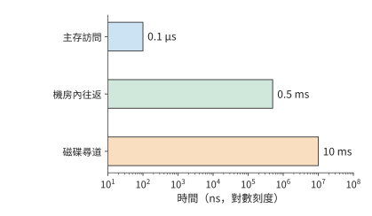

*圖 1-6　Jeff Dean 2009 年演講中的三種操作延遲。橫軸為對數刻度，每相鄰數量級相差十倍；先識別操作，再比較它們在序列等待中的代價。*

按這組數字，一次磁碟尋道所需的時間約為一次主存訪問的十萬倍。若請求需要依次等待多次訪問，這些延遲就會累加，延長請求的完成時間。若請求必須先找到一塊資料，才能確定下一次訪問的位置，處理器在兩次訪問之間即使只做很少的計算，也要等待整個儲存存取過程。

例如，設請求序列執行 20 次尋道，每次 10 ms，全部 CPU 計算為 1 ms，總時間就是 201 ms。把計算速度提高一倍，只能節省 0.5 ms；把相關資料連續放置，將尋道次數從 20 次減為 10 次，則節省 100 ms。兩種最佳化分別作用於計算與等待，收益的差距來自它們在原執行時間中的佔比。

把時間分解後，就能算出最佳化方向：某一部分在原總時間中佔比越大，縮短這一部分對整體的改善越大。在前面的尋道例子中，計算只佔總時間的 $1/201$；即使這一部分完全消失，總時間也只減少約 $0.5\%$。

將上述關係推廣，便得到總加速比的計算公式。若原執行時間中有比例 $f$ 的部分能夠加速 $s$ 倍，其餘工作與執行次序保持不變，則總加速比為：

$$
\mathrm{Speedup}=\frac{1}{(1-f)+f/s}.
$$

這就是 Amdahl（阿姆達爾）定律。即使把這部分加速到耗時可以忽略，總加速比也不超過 $1/(1-f)$。當尋道次數減少時，被縮短的是佔比最大的等待部分，因此這項最佳化對總時間的作用遠大於 CPU 加速。

**例：同樣使用 AI 程式設計工具，為什麼不同團隊的整體加速比不同？** 假設完成一項開發任務，需要依次經歷溝通、編碼、評審和審批等環節，AI 程式設計工具讓編碼速度提高到原來的 5 倍，其他環節的耗時保持不變。在協調層級較多的大公司團隊裡，編碼可能只佔原總耗時的 20%—30%，其餘時間花在開會、跨團隊溝通和審批上。代入公式，整體加速比只有約 1.19—1.32 倍。例如，原來需要 100 小時，其中 20 小時用於編碼；編碼縮短到 4 小時，其他環節仍需 80 小時，總耗時就是 84 小時。

在溝通成本較低的創業團隊裡，假設編碼佔原總耗時的 70%—80%，同樣的編碼加速就能讓整體加速比達到約 2.27—2.78 倍。以編碼佔 80% 為例，原來的 100 小時變成 $20+80/5=36$ 小時。

**Amdahl 定律適用於任何只加速部分環節的完整流程。** CPU、模型推論和軟體開發都可以用同一個問題來分析：被加速的部分原來佔多少時間，剩餘時間花在哪裡？想進一步縮短交付時間，就要繼續改善溝通、評審和審批等環節。區域性速度的提升，最終要放回完整任務中衡量。

這張表體現的方法可以直接用於模型執行：先確定各項工作使用什麼資源，再比較所需時間。

### 1.2.2 分析 AI 系統需要哪些關鍵數字

設某任務同時需要儲存 $M$ 位元組，執行 $F$ 次浮點運算，並透過某個儲存介面讀寫 $R$ 位元組。加速器提供容量 $M_{\mathrm{cap}}$、計算吞吐量 $\Pi$ 和介面頻寬 $\beta$。這三類需求必須分別與加速器提供的資源比較：

$$
M\le M_{\mathrm{cap}},\qquad
T_{\mathrm{compute}}=\frac{F}{\Pi},\qquad
T_{\mathrm{memory}}=\frac{R}{\beta}.
$$

容量決定能否同時儲存所需資料；後兩項把工作量換算為時間。一份資料可以儲存一次、讀取多次，所以 $M$ 與 $R$ 要分別計算。若 $\Pi$ 和 $\beta$ 取峰值，得到的就是完成指定計算與讀寫所需的時間下界。

峰值由晶片的計算單元數量、工作頻率和儲存介面決定，所以這個下界就是硬體的物理極限，軟體無論怎樣組織都不可能更快。下界與實際耗時 $T$ 之比，反映硬體能力被用掉了多少。計算方面的比值 $F/(\Pi T)$ 稱為 **MFU**（model FLOPs utilization，模型 FLOPs 利用率），頻寬方面的比值 $R/(\beta T)$ 稱為 **MBU**（memory bandwidth utilization，頻寬利用率），兩者都不超過 1。全書反覆使用這兩個比值，回答的是同一個問題：設計離硬體的物理極限還有多遠。

除了容量、計算吞吐量和頻寬，還需要認識操作延遲。下面分別說明這四類數字如何進入估算。

**容量**回答能同時放下多少資料。例如，一張加速卡有多少視訊記憶體，決定了能否容納模型權重、上下文狀態和執行時的臨時工作區。容量以 byte（位元組）計量。

**計算吞吐量**回答單位時間內能完成多少運算。常見的 FLOP 表示一次浮點運算，FLOPs 表示運算總次數，FLOP/s 表示每秒的浮點運算數。GFLOPs、TFLOPs 分別表示十億、萬億次浮點運算，GFLOP/s、TFLOP/s 則表示相應的每秒速率。矩陣計算中一次乘法加一次加法通常計為兩次運算。矩陣峰值對應特定的輸入精度、累加精度和稀疏條件。稠密計算按完整矩陣執行；稀疏計算利用零元素或規定的稀疏結構跳過部分運算。

**頻寬**回答單位時間內能傳送多少資料。視訊記憶體頻寬描述視訊記憶體與晶片之間的資料搬移能力，卡間鏈路 (Link)和網路頻寬描述其他路徑的能力。估算哪一段傳輸，就使用該段介面的頻寬。

**延遲**回答發起一次操作以後需要等多久。高頻寬介面也可能有不可忽略的啟動或往返時間。傳輸大資料塊時，耗時主要取決於資料量與頻寬的比值；請求較小且必須逐次等待時，啟動和往返時間就可能佔據主要部分。

以一款真實加速器為例。H100 是 NVIDIA 的一代 GPU，SXM 指本例採用的模組形態。BF16 是每個數佔 16 位（2 位元組）的浮點格式，FP32 是每個數佔 32 位（4 位元組）的浮點格式；矩陣乘法可以讀取 BF16 輸入，用 FP32 儲存累加結果。H100 SXM 的視訊記憶體容量為 80 GB，HBM 頻寬為 3.35 TB/s，BF16 輸入、FP32 累加的稠密矩陣峰值約為 989.4 TFLOP/s。[^h100]

將 H100 與 NVIDIA 的 A100 80GB SXM、GeForce RTX 4090 放在一起，就得到一張 GPU 資源速查表。三者分別採用 Hopper、Ampere 和 Ada 架構。表中的容量使用廠商名義 GB，頻寬使用十進位制 TB/s；矩陣算力統一採用 BF16 輸入、FP32 累加、稠密計算的峰值。最後一行由 1 GB 除以視訊記憶體頻寬得到。[^gpu-numbers]

| 資源或操作 | RTX 4090 | A100 80GB SXM | H100 SXM |
| --- | ---: | ---: | ---: |
| 視訊記憶體容量（GB） | 24 | 80 | 80 |
| 視訊記憶體頻寬（TB/s） | 1.008 | 2.039 | 3.35 |
| BF16 矩陣峰值（TFLOP/s） | 165.2 | 312 | 989.4 |
| 按頻寬峰值讀取 1 GB（ms） | 0.99 | 0.49 | 0.30 |

這張表提供了把工作量換算成時間所需的硬體效能資料。例如，讀寫量保持不變而頻寬增加一倍，$R/\beta$ 減半；計算量保持不變而算力增加一倍，$F/\Pi$ 減半。

### 1.2.3 參數儲存量與鏈路 (Link)頻寬的換算

這四類指標要與具體工作對應起來，才能用於估算。第一步是把模型參數換成儲存位元組數，判斷加速器能否放下；第二步再用位元組數除以頻寬，估算搬移這些資料需要多久。

以真實模型 **DeepSeek-R1-Distill-Llama-70B** 為例。該模型基於 Llama 架構，是稠密模型（每個 token 都使用全部參數計算），公開權重包含約 705.54 億個參數。名稱中的 B 表示十億，70B 是參數規模的約數；後文公式中的變數 $B$ 表示 batch 中的請求數。用 $N$ 表示參數數量，$b_W$ 表示每個權重的儲存位元組數。BF16 每個權重佔 2 位元組，公開權重檔案中的總位元組數為[^real70]

$$
\begin{aligned}M_W&=Nb_W\\&=70{,}553{,}706{,}496\times2\ \mathrm{bytes}\\&\approx141.11\ \mathrm{GB}.\end{aligned}
$$

本節統一使用十進位制 GB，即 $1\ \mathrm{GB}=10^9$ bytes；二進位制單位 GiB 則為 $2^{30}$ bytes。因此，141.11 GB 約為 131.42 GiB。加速器的可用儲存容量與權重大小換成相同單位後，才能相減。

141.11 GB 權重超過一張 H100 SXM 的名義 80 GB 視訊記憶體。將權重均分到兩張卡上，每張約佔 70.55 GB，各剩約 9.45 GB。**切分**即讓不同加速器分別儲存並計算模型的一部分。兩張卡之間需要交換中間結果，第 6 章將討論具體的切分與通訊方法。

還可以改變權重的儲存精度。**量化（quantization）**用較少的位數表示數值，例如用 8 位整數近似表示原來的 16 位浮點權重，並用 scale（縮放因子）將整數還原為相應範圍內的近似值。每個量化後的權重從 2 位元組減為 1 位元組，記憶體佔用因而明顯下降。

本書採用的分組量化方案每 128 個權重共享一個 scale，同時讓部分參數繼續使用 BF16。按真實模型配置計算，8 位元方案的全部權重及量化附加資料約佔 73.73 GB，可以放入一張 H100 SXM，留下約 6.27 GB。圖 1-7 將兩種辦法放在相同的容量刻度上：BF16 權重分到兩張卡，或者量化後放入一張卡。

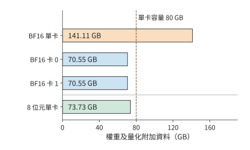

*圖 1-7　DeepSeek-R1-Distill-Llama-70B：BF16 權重共 141.11 GB，兩卡均分後每卡約 70.55 GB；分組 8 位元量化後共 73.73 GB。各條使用相同尺度，虛線表示一張 H100 SXM 的名義 80 GB 容量。柱長只計權重及相應量化附加資料。*

**KV 快取如何增加單請求的視訊記憶體需求。** 生成文字時，視訊記憶體還要儲存 KV 快取，供後續計算直接複用；運算子執行還需要臨時工作區。因此，容量檢查應寫成

$$
M_W+M_{\mathrm{state}}+M_{\mathrm{work}}\le M_{\mathrm{cap}}.
$$

其中 $M_W$ 是權重與量化附加資料，$M_{\mathrm{state}}$ 是請求的上下文狀態，$M_{\mathrm{work}}$ 是工作區，$M_{\mathrm{cap}}$ 是加速器的可用儲存容量。以該模型的一條 8192 個 token 的請求為例，BF16 KV 快取為 2.5 GiB，約 2.68 GB；再預留 2 GiB、約 2.15 GB 給工作區，8 位元方案總共約佔 $73.73+2.68+2.15=78.56$ GB，符合這一容量預算。第 2 章將從模型層數與注意力結構推導 KV 大小，並計算更長上下文和更多並行請求的記憶體需求。

換成名義視訊記憶體為 24 GB 的 RTX 4090，同一份 73.73 GB 權重就超過了三張卡合計的 72 GB。按相同的名義容量預算，僅儲存權重也至少需要四張；還要逐卡檢查 KV 和工作區。模型與精度相同，單卡容量不同，所需加速器數量就會改變。

網路傳輸也要做同樣的單位換算。網路頻寬常以 bit/s 計量，8 bit 為 1 byte，所以一張 400 Gbit/s 的 ConnectX-7 網路卡，線速（鏈路 (Link)的標稱傳輸速率）等於 50 GB/s。按此線速傳輸 1 GB 資料需要 20 ms。每次傳輸還需要啟動時間，協議開銷和共用鏈路 (Link)的其他流量也會影響應用實際獲得的頻寬。沿傳輸路徑計入這些因素，便能更細緻地估算通訊時間。

> **練習 1-2〔核心〕：不同權重精度下的視訊記憶體需求與多卡分配**
>
> DeepSeek-R1-Distill-Llama-70B 的 BF16 權重佔 141.11 GB，8 位元量化權重佔 73.73 GB。部署在 H100 SXM 上，每張卡有 80 GB 視訊記憶體。為每張卡預留 5 GB 狀態與工作區，分別判斷單卡部署和將權重均分到兩張卡的方案能否容納模型。再考慮兩張視訊記憶體容量不同的卡：一張 48 GB 的 RTX A6000 和一張 80 GB 的 H100 SXM，分別判斷兩種精度下能否完成部署，併為可行的方案給出一種權重分配方式。最後將 400 Gbit/s 換成 GB/s，求傳輸 1 GB 的理想時間。

## 1.3 用幾個數字估算一次模型執行

### 1.3.1 生成一個 token，先檢查什麼

**例題 1-1：70B 模型的單步生成如何接近 10 ms 目標？** 給定一張 H100 SXM，能否讓上一節的 DeepSeek-R1-Distill-Llama-70B 在 10 ms 內生成一個新 token？先考慮每參數一位元組儲存，再比較算力翻倍、頻寬翻倍和批內權重複用。

**解：先檢查視訊記憶體容量，再計算運算量和讀取量。**

為便於手算，將該模型的參數量近似取為 $N=70\times10^9$，先按每個參數一位元組估算主要權重的資料量，讀入後轉換為 BF16 參加矩陣運算。單個請求每步處理一個新 token，每步從視訊記憶體讀取一遍這些權重。

**估算條件：權重讀取與矩陣計算充分重疊。** 容量採用上一節計入量化附加資料的 73.73 GB 結果；本節先將主要權重的讀取量近似為 70 GB。時間模型只計主要權重矩陣的乘加和一次完整權重讀取，採用資源表中的 BF16 矩陣峰值與 HBM 頻寬；讀取和計算按充分重疊估算。

單請求的容量預算上一節已經檢查。生成速度方面，權重載入到視訊記憶體之後，每一步仍需將參與計算的權重送到計算單元；按上述近似，每步讀取約 70 GB。

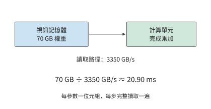

*圖 1-8　本例按每參數一位元組，將主要權重讀取量近似取為 70 GB。權重駐留視訊記憶體，計算單元每步沿同一介面讀取一遍；用讀取量除以介面頻寬，得到 20.90 ms 的讀取下界。*

這 20.90 ms 的讀取開銷會在每個生成步驟重複出現。對單個請求，下一步的輸入由當前輸出確定，後續步驟要沿這條依賴逐次推進。

計算量也可以先做近似。一次矩陣與向量的乘法中，每個權重通常參與一次乘法，所得乘積再累加到結果中；按乘法與加法分別計數，大約對應兩次浮點運算。因此，本例的主要矩陣運算量近似為：

$$
\begin{aligned}\text{每步矩阵运算量}&\approx2\times\text{参数数}\\&\approx2\times70\times10^9\ \mathrm{FLOPs}\\&=140\ \mathrm{GFLOPs}.\end{aligned}
$$

$2N$ 的來源是：在投影（用權重矩陣對特徵向量做的線性變換）中，每個權重與一個 token 特徵向量中的對應分量相乘，再將乘積累加到輸出中。參數矩陣中的權重越多，這部分工作量就越大；一批中參與計算的 token 數增加時，同一權重矩陣處理更多 token 的特徵向量，運算量隨之增加。第 2 章將展開真實模型，在這部分線性工作之外加入隨上下文長度變化的注意力互動。

把 batch size 記為 $B$，並讓這 $B$ 個請求共同使用一次讀入的權重，就得到這一教學模型的三個量：

$$
M_W=b_WN,\qquad R_W=b_WN,\qquad F\approx2BN.
$$

前兩個式子在這一步恰好相等，是因為權重儲存一份、讀取一遍。執行下一步生成時，駐留量仍是 $M_W$，卻會再增加一次 $R_W$ 的讀取。$B$ 增大則增加本次運算量：同一份權重要與更多請求的當前輸入 token 向量做乘加運算。第 2 章將進一步加入各請求獨立的上下文狀態。

### 1.3.2 計算與讀取分別需要多久

把 $F=140\ \mathrm{GFLOPs}$ 與 $R_W=70\ \mathrm{GB}$ 分別除以相應的資源能力，得到單請求的兩項時間下界。

$$
\begin{aligned}\text{纯权重读取时间}&\geq\frac{70\ \mathrm{GB}}{3350\ \mathrm{GB/s}}\approx20.90\ \mathrm{ms},\\\text{矩阵计算时间}&\geq\frac{140\ \mathrm{GFLOPs}}{989400\ \mathrm{GFLOP/s}}\approx0.1415\ \mathrm{ms}.\end{aligned}
$$

權重讀取的時間下界約為矩陣計算的 148 倍。按標稱算力，矩陣運算耗時極短；視訊記憶體把權重送到計算單元卻需要長得多的時間。完成當前步驟之前，這些資料必須全部讀入。[^budget]

原因在於，本例每讀取一個權重只做一次乘加。計算單元迅速處理完已讀入的資料後，又要等待後續資料。提高算力只能縮短乘加耗時，無法加快視訊記憶體讀取。

這兩項時間應當相加，還是取其中較大者，取決於讀取與計算能否重疊。若資料分塊到達，計算當前塊時可以繼續讀取下一塊；在充分重疊的簡化模型中，耗時下界為：

$$
T_{\mathrm{step}}\ge T_{\mathrm{lower}}=\max\!\left(\frac{F}{\Pi},\frac{R_W}{\beta}\right).
$$

進入穩定階段後，每塊資料都要經過讀取和計算，較慢的一項決定處理速度。本例中，讀取權重遠慢於矩陣計算，因此最佳化應首先針對這 20.90 ms 的讀取時間。

**討論：算力、頻寬與批內複用分別能縮短多少生成時間？** 僅權重讀取就至少需要 20.90 ms，已經超過 10 ms 的目標。雖然視訊記憶體能容納這些資料，讀取速度仍然達不到要求。先分別比較增加算力與增加頻寬的效果。

把計算能力翻倍，矩陣計算時間從約 0.1415 ms 變為 0.0707 ms，純權重讀取仍需要約 20.90 ms，決定執行時間的讀取下界保持不變。把 HBM 頻寬翻倍，讀取時間才會降為約 10.45 ms，當前下界隨之下降。兩種改動都提升了一項硬體能力，但對任務耗時的影響不同。

另一種辦法是減少需要讀取的資料。運算量不變時，把權重減半，讀取下界也降到約 10.45 ms。頻寬翻倍讓讀取速度加倍，權重減半則讓待讀取的資料減少一半，兩種辦法在這條算式中取得相同結果。第 2 章和第 5 章將討論低位寬表示的格式和轉換過程。

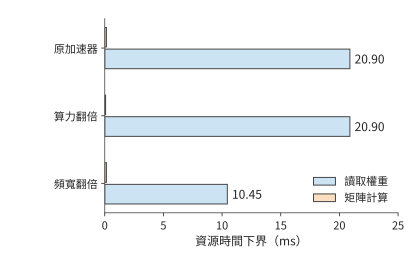

*圖 1-9　保持運算量與讀取量不變，分別把算力或頻寬翻倍。藍條是權重讀取下界，橙條是矩陣計算下界；較長的讀取項決定這組條件下的最佳化方向。各柱分別表示計算或資料讀取的時間下界，完整執行仍須滿足依賴關係。*

接著改變請求組織。假設 8 個請求同時處理並共享一次權重讀取，整批的權重讀取仍是 70 GB，矩陣運算量則約為單請求的 8 倍。這時矩陣計算的時間下界約為 1.13 ms，讀取下界仍為 20.90 ms。若這一批產生 8 個輸出，每個輸出分攤的權重讀取時間約為 2.61 ms。

整批執行產生八個輸出，吞吐量因而從單請求模型的約 47.9 token/s 提高到約 383 token/s，而每個請求仍須等待整批執行完成。**批內複用增加同一時間內生成的輸出數，單請求延遲則取決於它經歷的執行與等待。**

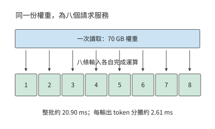

*圖 1-10　一批八個請求共享一次權重讀取，各產生一個輸出。整批讀取仍需約 20.90 ms，除以八得到每輸出分攤的服務時間；每個請求經歷整批執行。「每輸出 token 分攤」是整批耗時除以輸出 token 數，用於換算吞吐量，不是單個請求的響應延遲。*

batch 增大到一定程度後，計算時間將追平權重讀取時間。令 $2BN/\Pi=b_WN/\beta$，得到轉折點

$$
B_* = \frac{b_W\Pi}{2\beta}.
$$

本例取 $b_W=1$、$\Pi=989.4\times10^{12}\ \mathrm{FLOP/s}$、$\beta=3.35\times10^{12}\ \mathrm{bytes/s}$，得到 $B_*\approx147.7$。在這一隻計主要矩陣運算與權重讀取的模型中，batch 較小時，增加請求可以分攤權重讀取開銷；超過約 148 後，計算耗時超過權重讀取耗時，繼續增加 batch 會近似按比例增加整批時間。該轉折點只比較矩陣運算與權重讀取，沒有計入各請求的上下文狀態：按 1.2.3 節的容量預算，一張 H100 SXM 容納 73.73 GB 權重後只剩約 6.27 GB，無法容納 148 條請求的 KV。

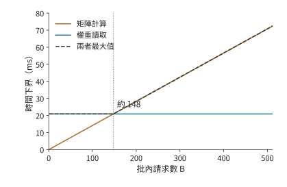

*圖 1-11　批內請求增加時，矩陣運算量按 $2BN$ 增長，權重讀取保持每批 70 GB。約 148 個請求處兩項下界相等，隨後計算耗時決定整體速度。*

把每批輸出數 $B$ 除以上圖中的時間下界，便得到這組題設對應的吞吐量上界。轉折前，共享的讀取由更多輸出分攤；轉折後，計算時間與輸出數一起增長，曲線逐漸趨於平坦。

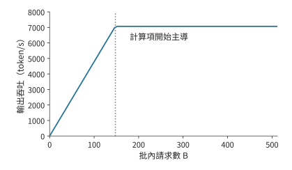

*圖 1-12　上述批處理模型的理想輸出吞吐量率。每批輸出數除以時間下界得到曲線；豎虛線與前圖對應同一個約 148 請求的轉折點。*

同一轉折也可以用算術強度 $I=F/R_W=2B/b_W$ 描述，即每讀取一位元組資料所完成的運算次數。當 $I$ 小於加速器的算力與頻寬之比 $\Pi/\beta$ 時，讀取所需時間更長；超過該比值後，計算所需時間更長。這就是第 4 章 Roofline（屋頂線）模型的出發點。[^roofline]

> **練習 1-3〔核心〕：頻寬與 batch size 如何影響單步生成時限**
>
> 採用例題 1-1 的模型與加速器，將有效頻寬設為標稱值的 70%，有效計算吞吐量率設為峰值的 50%。分別取 $B=1,16,64$，計算整批執行時間的下界、平均每個輸出 token 分攤的執行時間，以及理想吞吐量率。目標是每請求每步不超過 10 ms：哪些 batch size 僅根據時間下界就可以判定無法滿足目標？再把權重讀取量減半、運算量保持不變，重新判斷。求計算時間與讀取時間相等時的 batch size $B_*$，並解釋為什麼每個輸出分攤的執行時間減少，並不意味著每個請求的單步延遲縮短。

### 1.3.3 用實測檢驗估算

前面的模型預測了兩個趨勢：batch 較小時，吞吐量隨 batch 增加；整批時間則受到一次權重讀取的限制。真實程式中，每條新增請求還會增加上下文訪問與計算。圖 1-13、1-14 給出 Qwen3-8B 在 RTX PRO 6000 Blackwell Workstation Edition 上使用 BF16 權重的測量結果。這張卡有 96 GB 視訊記憶體、1.792 TB/s 視訊記憶體頻寬，BF16 輸入、FP32 累加的稠密矩陣峰值為 503.8 TFLOP/s。vLLM 是加州大學伯克利分校等機構的研究者在 2023 年提出的開源推論服務系統，負責組織模型請求並執行推理，最初重點解決的是 KV 快取浪費視訊記憶體、限制 batch size 的問題。本次採用 0.23 版本的 eager 模式，即按程式執行順序逐項向加速器提交工作。每請求輸入 2048 個 token、生成 256 個 token，每檔 batch 測量三次。[^measurement] 吞吐量表示單位時間內產生的輸出數；**每輸出 token 時間**（time per output token，TPOT）在這裡表示客戶端觀察到的平均輸出間隔。

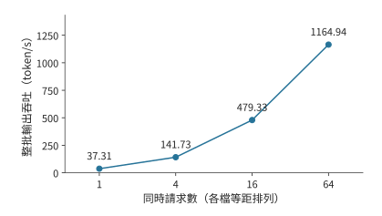

*圖 1-13　Qwen3-8B 實測的整批輸出吞吐量。四檔請求數等距排列，縱軸從零開始；模型、精度、輸入輸出長度和計時範圍保持一致。*

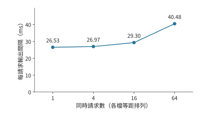

*圖 1-14　同一組實測中的每請求輸出間隔。吞吐量增加的同時，單個請求的平均間隔也在增大；兩張圖分別說明加速器的輸出速度和使用者的等待時間。*

從 1 個請求增到 64 個請求，整批吞吐量約提高 31 倍，單請求輸出間隔則從約 26.5 ms 增至 40.5 ms。兩幅圖合起來描述批處理的取捨：加速器在同樣長的時間內完成更多請求的工作，每個請求完成一步生成所需的時間卻更長。

圖 1-13 的吞吐量按整批輸出數除以處理這批請求的總時間計算，其中包括輸入處理時間，三次測量取中位數。TPOT 則先對每個請求計算首末輸出事件之間的時間，再除以其間的 255 個輸出間隔，然後取同批請求的中位數，最後取三次測量的中位數。前者描述整個例項的輸出速度，後者描述單個使用者經歷的生成節奏。第 3 章將進一步分析請求到達、排隊和少量慢請求對這些指標的影響。

這一趨勢可以用權重與上下文狀態的區別來解釋。多個請求共同使用模型權重，但各自儲存上下文狀態。並行增加時，一次矩陣運算會同時處理更多請求的當前輸入 token 向量，權重得到更多複用；與此同時，注意力計算和上下文訪問也隨請求數增加。

在基本模型中補上這部分隨請求數增加的工作，可先把一步耗時寫成

$$
T_{\mathrm{step}}\approx\max\!\left(\frac{BF_1}{\Pi},\frac{R_W+BR_{\mathrm{state},1}}{\beta}\right),
$$

其中 $F_1$ 是每請求的運算量，$R_{\mathrm{state},1}$ 是每請求的狀態讀寫量。batch 增加時，權重讀取開銷由更多輸出分攤，但各請求的狀態讀寫總量也隨之增加。下一章將根據實際模型計算這些工作量，並預測上下文變長後，計算時間與讀取時間相等的轉折點會移到哪裡。

> **練習 1-4〔核心〕：用實測吞吐量與輸出間隔檢驗批處理模型**
>
> 根據圖 1-13、1-14 標出的四檔並行請求測量值，計算各檔並行相對於單請求的吞吐量率之比，以及 TPOT 的增長比例。假設增加並行後仍只受共享權重讀取限制，計算與上下文訪問都不增加耗時，吞吐量率應怎樣變化？對照實際結果，提出兩個可以透過測量區分的解釋，並設計一次只改變上下文長度的測量來判斷它們。指出測量前需要保持不變的模型、輸出長度與計時起止點。

回看這次估算，全程都在回答五個問題：**搬什麼、搬多少、搬幾次、經過哪裡、誰在等待。** 模型結構決定需要哪些權重，位寬和參數量決定儲存大小，批內複用改變了讀取次數，視訊記憶體介面提供了頻寬，執行依賴決定了等待。這五個問題把模型結構、資料路徑和執行順序連成一份可以逐項計算的預算。

### 1.3.4 實測為何達不到極限：模型漏項還是系統開銷

做系統最佳化，常見的做法是與舊實現比較：新運算子比舊的快了三成，就算成功。可是不知道極限在哪裡，就無法判斷這三成是已經逼近上限，還是離上限仍有一個數量級。正確的起點是先按第一性原理算出硬體允許的上限，再看實測離上限有多遠。以本章的實測為例：按 1.792 TB/s 的視訊記憶體頻寬，一步 decode 讀取權重與舊 KV 至少需要 8.62 ms，而 batch 為 1 時實測的輸出間隔是 26.5 ms，MBU 只有 33%。這樣的差距有兩種來源，處理方式截然不同。第一種是理論模型漏了項：上面的模型只計入權重與 KV 的讀取，沒有計入注意力之外的向量運算和取樣；補上這些項，下界上移，差距隨之縮小，修正的是模型而不是系統。第二種是實現本身的開銷：本次實驗以 eager 模式逐個提交 kernel，每次提交都要經過主機上的 Python 程式碼、驅動和 PCIe，加速器在兩次 kernel 之間空轉；客戶端逐步記錄日誌，又佔用了主機時間。這些開銷與硬體無關，是可以去掉的。要分清兩種來源，只能靠每次只改變一個條件的測量。同一臺卡上關閉逐步日誌後補測，輸出間隔降到 12.1 ms；只按加速器上的事件計時，一步模型執行為 10.7 ms，與 8.62 ms 的下界只差兩成。[^followup] 可見三倍的差距大部分是主機一側的系統開銷。後續各章凡是實測與下界不符，都按這一順序檢查：先問模型有沒有漏項，再問實現有沒有開銷。

## 1.4 需求如何推動架構設計

前面的估算把硬體當作給定條件；反過來，這些硬體本身也是為應對具體需求而設計的。架構設計從需要解決的問題出發。不同年代的業務規模、裝置能力與軟體要求，決定了設計者首先需要改變什麼。本節依次分析 Google 在 2013 年面對的語音推理需求、微軟在 2015—2016 年擴充套件 Azure 雲網路的需求，以及華為在大模型發展過程中組織多裝置計算與儲存的需求。

### 1.4.1 TPU

TPU 是 Google 為神經網路計算設計的張量處理器，其第一代產品記為 TPU v1。介紹這代產品的論文回顧了一次需求判斷。Google 很早就討論過在資料中心使用 GPU、可在部署後配置硬體邏輯的 FPGA，或專用晶片，但在一些早期應用中，既有資料中心的空閒資源已經足以滿足需求。2013 年，一項語音搜尋使用量預測改變了討論：如果每位使用者每天使用三分鐘語音搜尋，滿足這項計算需求可能需要讓資料中心規模翻倍。Google 因而推進專用推理晶片設計，TPU v1 於 2015 年進入資料中心部署，架構論文於 2017 年發表。[^tpu]

這一判斷可以用簡單的算式表示：把每天的請求量記為 $Q$、每請求需要的計算量記為 $F_1$，每日總需求就是 $QF_1$。請求量增加，現有裝置的空閒能力最終會用盡；此時可以增加通用伺服器，也可以開發專用處理器。後者有前期開發成本，卻可能降低每請求的裝置時間和能耗；服務規模越大，累計節省的成本就越容易抵償前期投入。

專用處理器可以為反覆出現的矩陣運算配置更多計算單元，再用片上緩衝和資料通路為計算單元提供輸入。響應時間與功耗要求決定了應如何分配計算、儲存和通訊資源。這樣，應用規模的變化就落實到了晶片設計上。

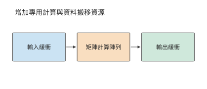

*圖 1-15　專用處理器圍繞反覆出現的矩陣運算組織計算陣列和輸入輸出緩衝。緩衝是臨時儲存待計算或已算完資料的儲存區域；三個方框及其箭頭展示資料搬移方向。*

第 4 章將介紹 TPU 的矩陣陣列、緩衝和資料通路。本例說明的關係是：應用的使用量達到一定規模後，專用處理器就可能比通用處理器更合算。

### 1.4.2 SmartNIC

微軟 Azure 在 2015 年設計新一代 40 Gbit/s 雲伺服器時，面臨另一類增長：網路頻寬提高，虛擬網路策略也日趨複雜。**SmartNIC（智慧網路卡）**是能夠在網路卡上執行部分資料處理的裝置。微軟從 2015 年末起在新部署的 Azure 伺服器中安裝基於 FPGA 的 SmartNIC，2016 年向客戶提供 Accelerated Networking（加速網路）服務。FPGA 的硬體邏輯可以重新配置，網路處理因此能隨策略更新而改變。[^azure]

這項設計要同時滿足兩個要求：既把更多 CPU 核留給租戶的應用，又能快速更新網路隔離、轉發和訪問控制規則。雲伺服器上的網路處理佔用的正是這些 CPU 核：CPU 除了執行應用，還要處理收發的資料包。虛擬機器是在一臺物理主機上劃分出的獨立計算環境。多個虛擬機器共用物理網路時，平臺需要識別資料的歸屬、查詢轉發規則、完成封裝，並維持隔離。

先估算這部分工作佔用多少 CPU。40 Gbit/s 鏈路 (Link)在最小幀條件下每秒約需處理六千萬個包。若單核每秒處理一千萬至兩千萬個包，持續轉發所需核數約為

$$
n_{\mathrm{core}}=\frac{\lambda_{\mathrm{packet}}}{\mu_{\mathrm{core}}}\approx3\text{—}6.
$$

其中 $\lambda_{\mathrm{packet}}$ 為包到達率，$\mu_{\mathrm{core}}$ 為單核處理率。這些核反覆完成相同的包處理流程；將相應工作移到網路卡，就可以把 CPU 時間留給應用。[^nic]

Azure 的做法是讓主機軟體管理複雜策略，把適合重複執行的包處理規則交給 FPGA。資料經過網路卡時就完成這些處理，CPU 可以把更多時間用於客戶應用。設計的關鍵是兼顧軟體更新能力與硬體處理速度。

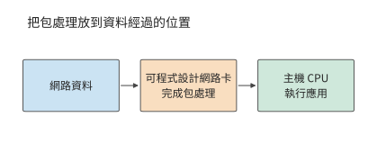

*圖 1-16　可程式設計網路卡在資料進入主機前完成指定的包處理。圖中實線跟蹤資料；網路卡承擔的處理減少主機 CPU 的輔助工作。*

將包處理移到網路卡後，部分操作可以在資料到達時直接完成，CPU 的工作隨之減少。如果網路卡還需要主機記憶體中的資料，就要透過 PCIe 讀取；此時，返回延遲和可同時發出的請求數決定了讀取速度。第 7 章將用 KV-Direct（讓可程式設計網路卡直接處理鍵值儲存請求的系統）分析這種訪問。鍵值儲存按唯一的鍵查詢、讀取或更新對應的值。

### 1.4.3 Unified Bus

SmartNIC 改變了單臺伺服器內部的分工。若問題是單個加速器的資源總量不足，就需要進一步考慮加速器之間如何協作。當單個加速器容納不下模型和執行狀態時，最直接的辦法之一是增加加速器。但「總容量變大」與「任務能夠高效執行」之間，還隔著工作劃分、資料交換和同步。

例如，兩張卡的視訊記憶體總量可能足夠儲存權重，但執行計算的加速器必須能夠訪問所需的資料。若一步計算依賴另一張卡的結果，就要等待交接；若多張卡共同完成一個操作，還要組織相應的協作。加速器數增加帶來了資源，也增加了連線這些資源的工作。

華為面向昇騰等異構計算裝置推進的 **UB（Unified Bus，統一互聯）**，把問題擴大到多裝置協作。根據專案參與者的回顧，相關研究在 OpenAI 於 2020 年釋出自迴歸語言模型 GPT-3 之前已經開始；GPT-3 展現出大模型的能力後，業界更廣泛地認識到多裝置協同的需求，專案投入隨之擴大。

這一時期的核心需求是讓規模不斷增長的模型使用多張加速卡，並使計算裝置更方便地訪問其他裝置上的記憶體和資料。資料一旦跨過主機邊界，軟體就要改用訊息傳遞介面、重新安排緩衝區，再經過網路卡驅動和協議棧，每多一層抽象就多一段時間。UB 讓裝置直接訪問其他裝置的記憶體，把這些抽象層去掉，使一次遠端訪問的耗時逼近線路時延決定的下限，上層也能更靈活地組織資源。統一的訪問機制使裝置能直接使用更大範圍內的資源，拓撲則決定這些訪問的距離與頻寬。模型分工與互聯設計由此緊密相連。第 6.5.5 節從超節點規模的角度討論 UB 的組織方式，第 7.3 節和第 7.4 節沿著一次遠端訪問的路徑推導它的延遲、請求速率和連線狀態，並算出去掉的各層抽象原來各佔多少時間。

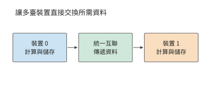

*圖 1-17　統一互聯連線不同裝置的計算與儲存資源。模型分工確定要交換什麼，互聯負責把資料送到後續使用它的裝置。*

從語音推理到雲網路，再到大模型的多裝置執行，這些設計分別著重提高計算效率、減少主機 CPU 佔用和改善跨裝置訪問。需求改變了需要優先解決的瓶頸，也改變了硬體、軟體與互聯之間的分工。

對照開篇的六層圖，三個案例分別從不同問題出發，卻都會改變計算與資料搬移的組織。應用需求推動專用硬體的設計，處理位置改變主機與網路卡之間的工作分配，更大的模型則要求重新安排裝置協作。後續章節將沿這些關係展開本書的主線：**資料搬移塑造了 AI Infra 的架構。**

以本章的兩卡模型部署為例：權重均分可以滿足逐卡容量約束，但每個階段還要等待輸入資料和前序結果。增加加速器改變了 $M_{\mathrm{cap}}$ 和可用算力，也引入新的通訊量與依賴。因此，第一步先檢查每個加速器能否容納所需資料，第二步計算各加速器的運算量與讀寫量，第三步根據執行依賴計算總時間。模型再大、加速器再多，這一分析順序仍然成立。

## 謬誤與陷阱

**誤區：峰值算力翻倍，執行速度就會翻倍。** 先檢查當前執行是否受計算能力限制。例題 1-1 中，權重讀取的時間下界遠大於矩陣計算的時間下界，提高矩陣峰值算力幾乎不改變執行時間的下界；若最佳化的是完整任務的一部分，還要用 Amdahl 定律檢查收益的上限。

**誤區：視訊記憶體能容納權重，就能支援目標並行數。** 權重只是常駐資料的一部分。上下文狀態、工作區和執行時預留的空間共同佔用視訊記憶體，多加速器還必須逐卡核算。

**誤區：比舊實現快了三成，最佳化就算成功。** 不知道硬體允許的極限，就無法判斷這三成是逼近了上限，還是離上限仍有一個數量級。應當先算出極限，再按第 1.3.4 節的順序查明差距來自模型漏項還是系統開銷。

**誤區：吞吐量率提高，每個使用者的等待時間就會縮短。** 批內複用減少每個輸出分攤的讀取開銷，但每個請求仍須經歷排隊和整批執行。吞吐量與響應時間應同時報告。

## 本章數字速查

本表用第 1.3.3 節實測採用的 Qwen3-8B 彙總模型側的關鍵數字。prefill 一次處理已有輸入，並得到首個輸出；decode 每次把一個新 token 送入模型，利用已經儲存的 KV 繼續生成。本表固定 BF16 權重、啟用和 KV，並行為 1；prefill 的輸入為 2048 個 token，decode 則在已有 2048 個 token 的上下文後執行一步。[^model-numbers]

| 模型需求 | 數值 | 如何使用 |
| --- | ---: | --- |
| 完整 BF16 權重 | 16.38 GB | 判斷模型載入所需的視訊記憶體 |
| 每個上下文 token 的全模型 KV | 144 KiB | 上下文長度乘以此數，得到單請求 KV 容量 |
| 2048 個 token 的上下文的 KV | 288 MiB | 約 0.302 GB，隨獨立請求數增加 |
| 2048 個 token 的 prefill 的矩陣運算 | 29.69 TFLOPs | 除以相應矩陣算力，得到計算時間下界 |
| 一步 decode 的矩陣運算 | 16.34 GFLOPs | 輸入為一個 token，另訪問已有上下文 |
| 一步 decode 的主要權重讀取 | 15.14 GB | 權重讀一次；嵌入層（把 token 編號對映為向量的查詢表）只讀取當前 token 對應的一行 |
| 一步 decode 的舊 KV 讀取 | 0.302 GB | 每份上下文 KV 讀一次時的位元組數 |

**用計算量與讀取量估算執行時間下界。** 這裡採用圖 1-13、1-14 實測所用的 RTX PRO 6000 Blackwell Workstation Edition，先單獨計算矩陣運算和資料讀取：按 503.8 TFLOP/s 矩陣峰值換算，prefill 的矩陣運算約需 58.9 ms，decode 約需 0.0324 ms；按 1.792 TB/s 視訊記憶體頻寬，一步 decode 的主要權重與舊 KV 讀取約需 8.62 ms。實測 batch 為 1 時的輸出間隔約 26.5 ms，約為該讀取下界的三倍，差距的來源見第 1.3.4 節。這裡分別估算計算與讀取所需的最短時間，完整執行還要沿運算子順序加入其他運算、實際訪存和啟動時間。第 2—5 章將逐項建立這些計算。

這組數字解釋了兩階段的差別：prefill 在一次呼叫中處理大量輸入，矩陣工作量較大；單請求 decode 每次只處理一個 token，卻仍要讀取大量權重和上下文。提高計算吞吐量、提高頻寬和增加批內複用，分別作用於不同的時間項。

[^panorama]: 「十八層寶塔」由華為半導體首席科學家廖恆博士在 2026 年 7 月的一次公開長訪談中提出，用來描述從應用到製造工藝的層層依賴。

[^dean]: Jeff Dean，LADIS 2009 演講，[本地 PDF](../references/outline-checks/2026-09-07/scaling-history/jeff-dean-ladis2009.pdf)，「Numbers Everyone Should Know」及紙筆估算部分。尋道算例設連續執行 20 次隨機讀取。

[^h100]: NVIDIA，[H100 架構白皮書](../references/files/specs/nvidia-h100.pdf)與[規格頁面快照](../references/files/specs/nvidia-h100-spec.md)。本章採用 SXM 形態與 BF16 稠密矩陣運算規格；原始輸入版本和校驗值見[配圖來源清單](ch01/sources.json)。

[^budget]: [70B 近似預算復算](../calculations/results/decode-budget-base.md)及配套場景；[單位與逐卡容量復算](../calculations/results/basics-70b-bf16-balanced.md)。1.3 的時間估算圖讀取這組固定的 70B 近似結果；1.2.3 的容量圖使用真實權重索引與分組量化結果。

[^roofline]: Williams、Waterman、Patterson，[Roofline 論文](../references/files/papers/roofline.pdf)。

[^followup]: [補測記錄](../experiments/ch01/01-04/FOLLOWUP.md)與[加速器事件計時](../experiments/ch01/01-04/results/step-summary.json)。補測同時關閉了字首快取並重新構造了輸入，逐步日誌的影響無法與這些條件完全分開；加速器事件只覆蓋模型執行，不含取樣與輸出。

[^measurement]: [練習 1-4 記錄說明](../experiments/ch01/01-04/README.md)、[結構化分析結果](../experiments/ch01/01-04/results/analysis.json)及[後續補測](../experiments/ch01/01-04/FOLLOWUP.md)。正文和圖 1-13、圖 1-14 採用最初記錄的短輸入組。

[^tpu]: Jouppi 等，[TPU v1 論文](../references/files/papers/tpu-v1.pdf)，第 2 節關於起源、架構與實現的說明。三分鐘語音搜尋是論文記載的歷史需求預測。

[^nic]: [筆者博士論文](../references/files/papers/bojieli-phd-thesis.pdf)，第 4.2.1 節簡單轉發基線；[核數預算復算](../calculations/results/nic-budget-book.md)。約六千萬包每秒來自 40 Gbit/s 與每幀佔用 84 位元組線時的計算，3 至 6 核對應簡單轉發基線。

[^abstraction]: 相關研究見[抽象邊界調研](../research/system-abstraction-boundary/report.md)；基礎模型承接多種下游任務的討論見 [Stanford CRFM](https://crfm.stanford.edu/report.html)。

[^request]: 請求圖是通用職責示意；排程與狀態管理的職責劃分可參照 v0.26.0 的 [vLLM Scheduler 檔案](https://docs.vllm.ai/en/v0.26.0/api/vllm/v1/core/sched/scheduler/)；1.3.3 節的實測使用 vLLM 0.23.0。路由策略、tokenizer 位置以及 prefill／decode 是否分離屬於部署選擇。

[^datacenter]: 具體產品例子見 [NVIDIA GB200 NVL72](https://www.nvidia.com/en-us/data-center/gb200-nvl72/)、[硬體指南](https://docs.nvidia.com/dgx/dgxgb200-user-guide/hardware.html)與[網路指南](https://docs.nvidia.com/dgx/dgxgb200-user-guide/networking.html)。圖 1-5 使用一般化連線。

[^real70]: 參數與 BF16 位元組數來自 [DeepSeek-R1-Distill-Llama-70B 公開權重索引](../calculations/sources/deepseek-r1-distill-llama-70b/model.safetensors.index.json)及[固定版本配置](../calculations/configs/models/deepseek-r1-distill-llama-70b/config.json)。分組量化的權重總量採用[逐項計算記錄](../calculations/results/dense-quant-deepseek-r1-distill-llama-70b-tp1-pp8-80gb-8192.json)中的全模型彙總，每組 128 個參數、scale 佔 2 位元組。RTX 4090 的 24 GB 名義規格見[官方頁面存檔](../calculations/sources/hardware/nvidia-rtx4090-page.txt)。本節用規格標稱 GB 作統一容量預算。

[^azure]: Firestone 等，微軟，[Azure Accelerated Networking: SmartNICs in the Public Cloud](https://www.usenix.org/conference/nsdi18/presentation/firestone)，NSDI 2018；[原論文文字](../references/editorial-context/2026-09-10/azure-smartnic-nsdi2018.txt)。摘要給出 2015 年末部署、2016 年向客戶提供服務的時間，第 3 節說明減少 CPU 佔用、保持可程式性與支援更高頻寬的設計目標。

[^gpu-numbers]: 數字取自[固定 GPU 規格與逐項出處](../calculations/configs/hardware.json)，對應 `rtx4090`、`a100-80gb-sxm`、`h100-sxm`；各精度、累加方式與稠密條件分別核對。GB 與 TB 在本表均為十進位制單位。

[^model-numbers]: [速查數字復算原始碼](ch01/reference_numbers.py)根據固定 Qwen3-8B 配置統計 prefill 與 decode 的矩陣運算，讀取量來自[批內權重複用計算](../calculations/results/batch-reuse-h100-2k.md)。權重佔用包含完整嵌入表，逐步生成時只讀取當前 token 對應的嵌入行；讀寫時間採用每份主要資料訪問一次的理想條件。

[^v41-case]: [DeepSeek V4.1 官方技術報告](../calculations/sources/deepseek-v4.1-flash/DeepSeek_V41_Tech_Report.pdf)，第 1、2、3 節與第 6 節；[跨章會話的固定條件與復算](../calculations/results/v41-throughline.json)。

## 本章小結

應用用模型與上下文表達行為，許多工因此共享相近的底層計算。掌握模型中的計算依賴和狀態駐留時間，就能統籌考慮原來分屬不同層次的設計選擇：改變資料表示、合併執行步驟、複用準備工作，或縮短加速器間資料傳遞和同步的時間。後續各章將量化這些改動的收益，說明哪些設計取捨因此改變，再根據新的約束選擇模型與系統方案。

分析系統時，先檢查資料能否放下，再用運算量和讀寫量估算耗時，最後根據執行順序分析重疊與等待。按峰值算出的下界就是硬體的物理極限，下界與實測之比就是利用率；兩者的差距不是模型漏了項，就是系統有可以去掉的開銷。在 70B 算例中，權重讀取比矩陣計算慢約 148 倍，因此增加頻寬、減少讀取和提高複用更有助於縮短時間。批內共享可以提高吞吐量，而每個請求的響應時間還要包括整批執行和排隊。

本章核心練習為 1-2、1-3、1-4，分別練習單位換算與可行性判斷、條件改變後的資源估算，以及預測與實測結果的比較。下一章將根據真實模型配置，細化 $2N$ 計算量與權重讀取量的估算，為這些計算提供具體的矩陣尺寸與狀態大小。
