# 第 2 章 模型架構

第 1 章從儲存容量、運算量和資料讀取量三個方面分析了一次模型執行，並藉助硬體的關鍵數字估算時間下界。這樣的估算可以迅速排除一些方案，卻還留下一個問題：所代入的計算量和資料量從哪裡來？「一個 8B 模型」（參數量字尾 B 表示十億，8B 即約 80 億個參數）只說明參數數量的大致範圍，沒有說明每個 token 使用哪些參數、上下文儲存在什麼地方，也沒有說明不同工作之間的先後關係。

本章從一個 token 的數值表示開始，逐步分析它經過網路各層後，如何得到下一個 token 的分數，再計算這一過程所需的儲存容量 $M$、運算量 $F$ 和讀寫量 $R$。計算圖用節點表示運算，用邊表示運算之間傳遞的資料。先認識圖中的運算和資料，才能知道資源預算中的每個數字來自哪裡。

這張計算圖也提供了最佳化實現所需的資訊。哪些權重在不同請求間保持不變，哪些狀態後續生成會反覆用到，哪些結果只供緊接著的運算使用，都可以從模型結構中找到。後續章節設計儲存、編譯和排程時，將利用資料用途上的這些差異，決定哪些資料可以共享、哪些需要長期儲存、哪些只需暫存。

本章選擇五個典型模型：DeepSeek V4.1 Flash、Qwen3-8B、Qwen3.6-35B-A3B（名稱中的 35B 指總參數約 350 億，A3B 指每個 token 實際啟用的參數約 30 億；下文簡稱 Qwen3.6）、DeepSeek V4-Flash 與 Kimi K3。2026 年 9 月釋出的 V4.1 Flash 用 CED 架構分開輸入處理與生成，並結合跨層 KV 共享、分層索引與 Engram（按 n-gram，即連續 n 個 token 組成的片段，查表取得附加表示的模組），為理解模型架構如何改變系統需求提供了新的案例。

推導從 Qwen3-8B 開始：它約含 81.9 億參數，透過 36 層網路處理文字。理解這一稠密模型的執行過程後，再逐步改變上下文的儲存方式、每個 token 使用的參數集合和層間連線，最後把五個模型放在相同輸入條件下比較。

開始推導前，先約定本章的計數口徑。統計運算量時，一次乘法加一次加法計為 2 FLOPs。儲存量採用 GB 和 GiB：$1\ \mathrm{GB}=10^9\ \mathrm{bytes}$，$1\ \mathrm{GiB}=2^{30}\ \mathrm{bytes}$。BF16 每個元素佔 2 位元組，因此將張量的元素數乘以 2，就得到它的儲存大小。

## 2.1 計算圖與前向執行

張量是按一個或多個維度排列的數值陣列：向量只有一個維度，矩陣有兩個維度。模型用向量表示每個 token 的特徵，把多個 token 的向量按行排成矩陣。理解模型資源需求，首先要把計算節點和資料依賴分開。一個節點執行矩陣乘法或其他變換，一條邊表示後續節點需要前面的結果。節點的運算量決定計算需求，邊上的張量決定傳遞的資料量，邊的方向則表明哪些運算必須先後執行。理解模型的執行過程，需要同時考慮這三個方面。

本章的計算圖先描述數學運算和資料依賴。實際執行時，框架會把這些運算交給加速器程式；一個運算可能拆成多個程式，多個運算也可能合在一起執行。計算圖中表示張量的一條邊，只說明後續運算需要這份資料，不表示它一定要在 CPU 與 GPU 之間複製。第 4 章說明資料放在哪裡，第 5 章再解釋程式如何提交、資料如何傳入傳出。

### 2.1.1 序列依賴與因果計算圖

要計算執行時間，先要知道哪些運算能夠同時開始。考慮四個 token、三層網路，橫軸是 token 在序列中的位置索引，縱軸是層數。本章用「詞元 (Token)」指詞表中的一個條目，用 token 指它在序列中的一次出現；同一個詞元 (Token)在序列中出現多次時，位置索引用來區分它們。迴圈神經網路（RNN）把前一 token 位置的狀態傳給後一 token 位置，token 狀態滿足 $h_t=f(x_t,h_{t-1})$。其中 $x_t$ 是當前輸入，$h_t$ 是處理到當前 token 位置時儲存的狀態，$f$ 是用模型權重做的變換。當前結果依賴前一 token 位置，所以同一層按位置順序執行。即使四個輸入已經全部到達，第 $t$ 個 token 仍要等待第 $t-1$ 個 token。

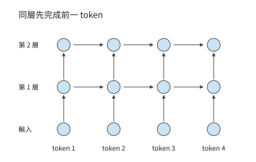

*圖 2-1　迴圈神經網路的依賴。相同顏色的圓點表示各 token 位置的計算，箭頭指向需要前一結果的節點；同層 token 位置沿橫向逐次推進。*

Transformer 用注意力機制讓一個 token 讀取其他位置的資訊；「因果」表示當前 token 位置只能使用自身及此前位置的資訊。因果 Transformer 的依賴形式不同。第 $l$ 層計算某個位置時，透過注意力讀取上一層中該位置及其之前各 token 位置的表示。只要輸入 token 已知，並且上一層的相應表示已經完成，同一層不同位置的計算就不需要再等待本層前一個 token 的輸出。因果掩碼用來規定各 token 位置允許訪問哪些資訊，遮蔽當前 token 位置之後的資訊。按查詢與被查詢 token 位置排列，掩碼呈三角形；掩碼限制資訊來源，卻不要求所有已知 token 逐個執行。網路深度方向的依賴仍然存在：下一層使用這一層的結果。

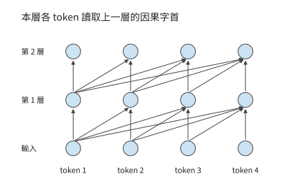

*圖 2-2　因果 Transformer 的層間依賴。各查詢讀取上一層中允許訪問的位置；上一層完成後，同一層的已知輸入 token 可以平行計算。*

沿圖中的箭頭追蹤，便能區分兩種等待：RNN 在同層等待前一 token 位置，因果 Transformer 在下一層等待所需的上一層結果。已知輸入能否並行，取決於這些依賴，而非「序列」這一名稱。生成新的 token 又增加了另一條依賴：下一次呼叫的輸入由本次輸出確定。

處理已知輸入與逐步生成是兩類不同的工作。編碼器把已知輸入轉換為表示，解碼器根據允許訪問的資訊逐步產生輸出。現代因果語言模型常用 decoder-only 結構，本章先用這一結構建立基礎，再討論 V4.1 Flash 如何透過 CED 架構重新劃分輸入處理與生成的工作。處理已知輸入時，同層 token 位置可以並行；生成時，第一個輸出確定後才能成為下一次輸入。因此，輸入處理沿網路深度推進，生成還增加了跨呼叫的序列依賴。[^source-10]

> **練習 2-1〔延伸〕：RNN 與 Transformer 的依賴如何限制平行計算**
>
> 對於含四個已知輸入 token 的序列，分別畫出三層 RNN 和三層因果 Transformer 的計算依賴圖。再增加一個待生成的輸出位置，指出計算該位置之前必須等待哪個節點完成。設每層每 token 的計算耗時為一個單位、並行資源充足，分別求處理全部已知輸入時的最長依賴鏈長度；解釋增加計算單元可以縮短哪些等待、不能縮短哪些等待。

### 2.1.2 模型配置與張量結構

先把一個計算節點展開。設本次對 $m$ 個輸入 token 執行投影，每個 token 用包含 $k$ 個特徵的向量表示。把這些向量逐行排成輸入矩陣 $X$，就得到 $m$ 行、$k$ 列的矩陣。設輸出寬度為 $n$，則有：

$$
X\in\mathbb R^{m\times k},\qquad W\in\mathbb R^{k\times n},\qquad Y=XW\in\mathbb R^{m\times n}.
$$

每個輸出元素是長度為 $k$ 的點積，輸出共有 $mn$ 個元素，因此

$$
N_W=kn,\qquad F=2mkn,\qquad M_W=b_Wkn.
$$

$N_W$ 是權重參數的數量，$b_W$ 是每個參數佔用的位元組數。行數 $m$ 翻倍，運算量翻倍，權重大小保持不變；輸出寬度 $n$ 翻倍，權重數量與運算量都翻倍。這兩個變化分別對應「同一模型處理更多輸入」與「模型的一層變得更寬」。下面的模型表都可以用這條規則逐行計算。

先只看 Qwen3-8B 的一條資料路徑。一次**前向執行**是使用當前權重從輸入算到輸出的過程；隱藏向量是網路內部傳遞的特徵表示，其維度即每個 token 的向量含多少個數。**前饋網路**（feed-forward network，FFN）對每個 token 分別做特徵變換；**注意力**則在 token 之間選擇並彙總資訊。這兩類運算交替組成網路的一層。

Qwen3-8B 包含 $L=36$ 層，隱藏維度為 $d=4096$，FFN 中間維度為 $f=12288$；注意力把特徵分成多組並分別建立 token 之間的關係，每一組稱為一個頭。這裡有 32 個查詢頭和 8 個供查詢使用的 KV 頭，每頭 128 維；第 2.1.3 節將沿查詢、鍵和值的路徑解釋它們。詞表包含 151936 個 token，詞嵌入是一張把 token 編號對映為向量的查詢表，輸出頭則把末層向量變成每個候選 token 的分數。兩者各自儲存一份權重。各層參數與這兩份詞表矩陣相加，模型共有約 81.9 億個參數。[^source-1]

一次前向執行從 token ID 開始。詞嵌入為每個 ID 查出一個 4096 維向量，向量依次經過 36 層注意力與 FFN，最後經過歸一化和詞表投影產生 logits，即尚未轉換為機率的候選 token 分數。歸一化使逐層計算的數值保持在適當範圍內。詞嵌入按 ID 選擇行，一個 token 取出一條向量，整個詞表則作為常駐資料供不同 token 查詢。詞表輸出頭將隱藏向量與詞表矩陣相乘；只生成下一個 token 時，通常只需要最後一個輸入 token 的 logits。

設同時處理 $B$ 條等長請求，每條本次輸入 $P$ 個已知 token。投影和 FFN 的輸入可以表示為 $X\in\mathbb{R}^{BP\times4096}$，每一行是一個 token 在當前層的表示，共有 $m=BP$ 行。已有上下文 token 的鍵和值從快取讀取，不計入這裡的 $m$。每條請求只補入一個 token 時，$m=B$。第一種情形容易形成行數較大的矩陣，第二種在小 batch 下接近矩陣與向量的乘法。權重相同，輸入形狀卻明顯不同。

下面比較兩種輸入形狀：一條請求一次處理 8192 個輸入 token，以及一條已有 8192 個上下文 token 的請求再處理一個新 token。用 $B$ 表示請求數，$S$ 表示呼叫前已有的上下文長度，$P$ 表示本次輸入長度，$d$ 表示隱藏維度。前者取 $B=1,S=0,P=8192$，後者取 $B=1,S=8192,P=1$。

| 配置項 | Qwen3-8B 參數 | 對資源需求的直接影響 |
| --- | ---: | --- |
| 層數 $L$ | 36 | 重複的計算、逐層狀態與深度依賴 |
| 隱藏維度 $d$ | 4096 | 子層輸入輸出與投影尺寸 |
| FFN 中間維度 $f$ | 12288 | 三個 FFN 矩陣的權重與計算 |
| $Q$／KV 頭數 | 32／8 | 查詢向量與上下文表示的寬度 |
| 頭維度 $d_h$ | 128 | 每個頭的點積與狀態寬度 |
| 詞表大小 $V$ | 151936 | 嵌入和輸出頭規模 |

**例題 2-1：從矩陣尺寸求一層的參數量與運算量。** Qwen3-8B 的查詢和輸出投影寬度為 4096，鍵和值投影寬度為 1024，FFN 中間維度為 12288。求四個注意力投影與三個 FFN 矩陣的參數量，以及為本次輸入的 $m$ 個 token 完成這些投影和 FFN 計算所需的運算量。每個 token 在這一層都有一個 4096 維向量，作為輸入矩陣的一行；$m$ 統計本次實際參與計算的 token 數。同一個詞元 (Token)出現兩次，就算作兩個 token。若有 $B$ 條等長請求、每條本次處理 $P$ 個 token，則 $m=BP$。例如，一條請求處理 128 個輸入 token 時 $m=128$；八條請求各推進一個 token 時 $m=8$。

解：查詢與輸出各使用一個 $4096\times4096$ 矩陣，鍵和值各使用一個 $4096\times1024$ 矩陣，三個 FFN 矩陣各有 $4096\times12288$ 個參數。因此，

$$
\begin{aligned}
N_{\mathrm{proj}}&=2\times4096^2+2\times4096\times1024=41{,}943{,}040,\\
N_{\mathrm{FFN}}&=3\times4096\times12288=150{,}994{,}944,\\
F_{\mathrm{linear}}&=2m(N_{\mathrm{proj}}+N_{\mathrm{FFN}})=385{,}875{,}968m.
\end{aligned}
$$

此處尚未使用上下文長度：這些投影對每個 token 的特徵向量做相同的變換。下一節將介紹查詢與上下文之間的注意力計算，其運算量與查詢—鍵配對的數量有關。將兩類工作分開，就能看出「增加本次參與計算的 token 數」和「讓每個 token 讀取更長的上下文」的代價為什麼不同。

| 符號 | 含義與使用範圍 |
| --- | --- |
| $B,P,S$ | 請求數、本次每請求輸入 token 數、已有上下文長度 |
| $m=BP$ | 本次參與投影的 token 總數，也就是輸入矩陣行數；普通 decode 時 $P=1$，故 $m=B$ |
| $d,f$ | 主幹隱藏寬度、前饋網路中間寬度 |
| $n_Q,n_{\mathrm{KV}},d_h$ | 查詢頭數、KV 頭數、每頭維度 |
| $N_{\mathrm{pair}}$ | 每層所有請求合計的有效因果查詢—鍵配對數，不含頭數 |
| $t_e$ | 分派給專家 $e$ 的 token 數（見第 2.4 節），每個 token 的特徵向量佔該專家輸入矩陣的一行；$k_{\mathrm{top}}$ 為每個 token 選中的專家數，路由過程中不丟棄分派給專家的 token 時 $\sum_e t_e=mk_{\mathrm{top}}$ |
| $m_{\mathrm{out}}$ | 實際執行詞表投影的 token 數；只用每條請求的末尾 token 預測下一個 token 時為 $B$，它不等於本次生成的全部輸出長度 |

計算整個模型的資源需求時，先按表格中每項操作的矩陣尺寸求一次呼叫的運算量，再乘這一類層的數量。詞表頭另外按實際輸出 token 數 $m_{\mathrm{out}}$ 計算；生成下一 token 時，每條請求只需最後一個 token 的分數。歸一化、啟用與查表操作各有自己的運算方式，後文沿資料流分別說明。

### 2.1.3 注意力計算與位置編碼

先跟蹤單個 token 的計算。模型從該 token 的隱藏向量產生三種表示：**查詢** $Q$ 用來提出「當前需要什麼資訊」，**鍵** $K$ 用來與查詢計算匹配分數，**值** $V$ 是被選中後彙總到輸出的資訊。三者都由同一個 token 的輸入經過不同權重矩陣產生。線性投影就是這樣的矩陣乘法：把輸入特徵變換到另一組座標。

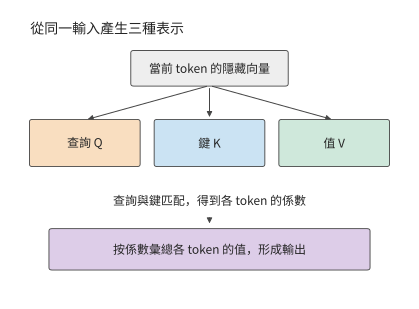

*圖 2-3　同一個 token 的輸入經不同投影產生查詢、鍵和值。注意力先用查詢與鍵計算 token 之間的關係，再用這些關係彙總值。*

採用數學右乘記號，輸入 $X$ 分別乘三個權重矩陣，得到 $Q$、$K$、$V$。$Q$ 的總寬度為 $32\times 128=4096$，$K$ 和 $V$ 的總寬度各為 $8\times 128=1024$。因此，$W_q$ 為 $[4096,4096]$，$W_k$ 和 $W_v$ 各為 $[4096,1024]$。程式碼中的線性層常以 $(d_{\mathrm{out}},d_{\mathrm{in}})$ 儲存權重；換成數學右乘記號後，輸入寬度在前、輸出寬度在後，便可逐項對照下面的表格。

上述投影產生了 $Q$、$K$、$V$，但尚未讓當前 token 位置與上下文交換資訊。接下來將 $Q$ 拆成 32 個頭，把 $K$、$V$ 拆成 8 個頭。每組四個 $Q$ 頭共用一個 KV 頭。對一個 $Q$ 頭，查詢向量與允許訪問位置的 $K$ 做點積，將點積除以頭寬的平方根，避免分數的數值尺度隨頭寬增大而過度增長，然後遮蔽未來 token 位置。Softmax 把允許位置的分數 $s_j$ 變成正數並歸一化，係數為 $a_j=e^{s_j}/\sum_i e^{s_i}$；這些係數之和等於一，決定各上下文 token 貢獻多少資訊。這裡的「注意力權重」是本次輸入算出的係數，區別於訓練後儲存的模型參數。隨後用這些權重對 $V$ 加權求和。各 $Q$ 頭的結果拼接後，經 $[4096,4096]$ 的輸出投影 $W_o$ 轉回隱藏向量。

用矩陣記號寫出一個頭的計算：

$$
A=\operatorname{Softmax}\!\left(\frac{QK^{\mathsf T}}{\sqrt{d_h}}+\mathcal M\right),\qquad O=AV.
$$

$A$ 是各查詢對上下文 token 的權重，$\mathcal M$ 是因果掩碼，$d_h$ 是頭維度。點積決定哪些位置與當前查詢相關，Softmax 將分數轉成加權係數，再用這些係數彙總值向量。Qwen3 在點積前還要做**查詢與鍵歸一化（QK Norm）**和**旋轉位置編碼（Rotary Position Embedding，RoPE）**：前者調整各頭查詢與鍵的數值尺度，後者透過隨位置變化的旋轉，使點積包含相對位置資訊。

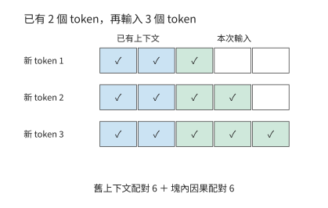

*圖 2-4　兩段上下文形成長方形加三角形。藍色為三個新 token 分別讀取兩個舊 token，綠色為新輸入內部的因果訪問，空白為被遮蔽的未來 token 位置。每個有色格表示一次查詢—鍵配對；橫軸對應被讀取的 token，縱軸對應新輸入的查詢 token。*

下面計算點積的數量。輸入 $P$ 個新 token、已有 $S$ 個上下文 token 時，第 $i$ 個新 token 可訪問 $S+i$ 個 token，其中 $i=1,\ldots,P$。將各查詢可以訪問的上下文 token 數相加，就得到一個長方形加一個三角形：

$$
N_{\mathrm{pair}}=B\left(PS+\frac{P(P+1)}{2}\right)
$$

對每一對查詢與上下文 token，一個 $Q$ 頭的 $QK^{\mathsf T}$ 點積約需 $2d_h$ FLOPs，隨後 $AV$ 的貢獻又約需 $2d_h$ FLOPs。合計所有 $Q$ 頭，$QK^{\mathsf T}$ 與 $AV$ 的有效矩陣運算量為：

$$
F_{\mathrm{attn}}=4n_Qd_hN_{\mathrm{pair}}=16384N_{\mathrm{pair}}
$$

在此前沒有快取上下文的 prefill 中，序列長度加倍時，投影的輸入行數變為兩倍，全注意力的查詢—鍵配對數則約為原來的四倍，因為新加入的 token 也要與此前的上下文互動。計算這些查詢—鍵配對有兩種常見路徑：完整矩形乘法先產生所有分數再遮蔽上三角，因果分塊則跳過上三角。分塊還可以把評分、歸一化和 $V$ 彙總接在一起，讓分數在片上用完即釋放。第 5 章將沿這條資料流解釋如何減少中間結果的視訊記憶體讀寫。

因此，保持 $BP$ 不變只能保持投影行數不變，不能保持上下文互動不變。例如，把一條長輸入拆成兩條彼此獨立的短輸入，原來跨越分界的那些查詢—鍵配對就消失了。相反，僅在同一請求前面增加上下文，會增加每個新 token 的點積數，輸入投影的行數卻保持不變。

### 2.1.4 前饋網路與前向計算量

注意力負責不同 token 之間的資訊互動，FFN 則對每個 token 的特徵執行非線性變換。SwiGLU 是一種帶門控的前饋結構：一條分支變換輸入特徵，另一條分支為它生成逐元素的調節量。SwiGLU 採用 SiLU 啟用函式 $\operatorname{SiLU}(x)=x/(1+e^{-x})$，用非線性變換改變特徵間的組合方式。Qwen3-8B 使用這種結構：輸入分別經過 gate 與 up 兩條升維投影，gate 分支經過 SiLU 後，再與 up 分支逐元素相乘，最後透過 down 投影降回隱藏維度：

$$
\operatorname{FFN}(X)=\left[\operatorname{SiLU}(XW_{\mathrm{gate}})\odot(XW_{\mathrm{up}})\right]W_{\mathrm{down}}
$$

式中 $\odot$ 表示對應元素相乘；gate 是門控分支，up 是升維分支，down 是降維投影。三者產生的中間向量稱為啟用。gate 與 up 將每行從 $d$ 維升到 $f$ 維，down 再降回 $d$ 維。三個矩陣因此合計 $3df$ 個參數，處理 $m$ 個 token 的特徵向量需 $6mdf$ FLOPs。Qwen3-8B 取 $d=4096,f=12288$，FFN 約有 1.51 億個參數，BF16 權重佔 288 MiB。升維後較寬的啟用也需要臨時空間，但只需在相應計算期間保留。

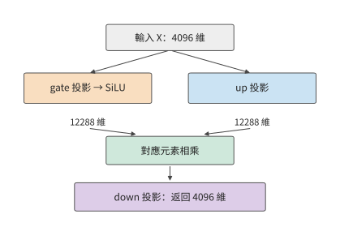

*圖 2-5　SwiGLU 的兩條升維分支。gate 經 SiLU 後調節 up 的對應元素，乘積再由 down 投影降回主幹維度。*

把兩類投影放在一起比較：注意力的 QKV 與輸出投影合計約有 4194 萬個參數。加上 FFN 的約 1.51 億個參數後，FFN 佔這些主要投影參數的約 78%，因此短上下文的計算中，三個 FFN 矩陣佔據較大份額。隨著輸入變長，FFN 的運算量隨 token 數線性增長，全注意力的運算量則隨 $P(P+1)/2$ 增長。兩者增長速度不同，因此各部分計算量的佔比會隨上下文長度變化。

除矩陣變換外，一層之內還有子層之間的連線。殘差連線把子層的輸入保留下來，在該子層完成變換後，與輸出逐元素相加。這樣，一條路徑執行新變換，另一條路徑直接傳遞已有表示。下面把注意力、前饋和兩次殘差連線連成完整的一層。

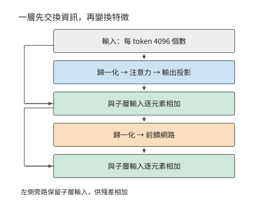

*圖 2-6　Qwen3-8B 一層的骨架。先完成注意力子層，再完成前饋子層；左側的殘差連線保留子層輸入，再與變換結果相加。*

**表 2-1　Qwen3-8B 的單層模組與輸出介面**

注意力和前饋各行按 36 個主幹層累計；詞嵌入根據 token 編號讀取詞表中對應的行，不再按一次詞表矩陣乘法（GEMM，通用矩陣乘法）計算。注意力的 $K$、$V$ 只各有 1024 維，而查詢仍有 4096 維。

**模型入口**

| 模組及作用 | 輸入 → 輸出（行數 × 寬度） | 權重矩陣（輸入寬 × 輸出寬） | 矩陣 FLOPs | 層／呼叫數 |
| --- | --- | --- | --- | ---: |
| 詞嵌入查行 | $m$ 個 ID → $m\times4096$ | 查表 $151936\times4096$ | 0；查行訪問另計 | 1 |

**注意力**

| 模組及作用 | 輸入 → 輸出（行數 × 寬度） | 權重矩陣（輸入寬 × 輸出寬） | 矩陣 FLOPs | 層／呼叫數 |
| --- | --- | --- | --- | ---: |
| $Q$ 投影：形成查詢 | $m\times4096\to m\times4096$ | $4096\times4096$ | $2\times m\times4096\times4096$  | 36 |
| $K$、$V$ 投影：形成可複用上下文 | $m\times4096\to m\times1024$ | $4096\times1024$，共 2 個 | $2\times 2\times m\times4096\times1024$  | 36 |
| $QK^{\mathsf T}$ 與 $AV$：按內容彙總上下文 | $32$ 個查詢頭，每頭 $128$ 維 | 無新增投影權重 | $4\times32\times128\times N_{\mathrm{pair}}$  | 36 |
| 輸出投影：合併各頭 | $m\times4096\to m\times4096$ | $4096\times4096$ | $2\times m\times4096\times4096$  | 36 |

**前饋與連線**

| 模組及作用 | 輸入 → 輸出（行數 × 寬度） | 權重矩陣（輸入寬 × 輸出寬） | 矩陣 FLOPs | 層／呼叫數 |
| --- | --- | --- | --- | ---: |
| SwiGLU：逐 token 特徵變換 | $m\times4096\to m\times12288\to m\times4096$ | $4096\times12288$ 兩個；$12288\times4096$ 一個 | $6\times m\times4096\times12288$  | 36 |
| 歸一化、RoPE、啟用與殘差 | 保持或逐元素變換上述張量 | 歸一化向量等 | 按元素計算  | 36 |

**輸出介面**

| 模組及作用 | 輸入 → 輸出（行數 × 寬度） | 權重矩陣（輸入寬 × 輸出寬） | 矩陣 FLOPs | 層／呼叫數 |
| --- | --- | --- | --- | ---: |
| 詞表頭：轉為 token 分數（整模型末端一次） | $m_{\mathrm{out}}\times4096\to m_{\mathrm{out}}\times151936$ | $4096\times151936$ | $2\times m_{\mathrm{out}}\times4096\times151936$  | 1 |

表中有兩種增長方式：投影與 FFN 的工作隨 $m$ 增長，上下文互動隨 $N_{\mathrm{pair}}$ 增長。FFN 的三次大投影解釋了它為什麼在短上下文中佔有較大的計算份額；上下文變長後，上下文互動的佔比逐漸提高。

將每層的線性變換與上下文互動相加，再加入詞表頭，得到 Qwen3-8B 的主要矩陣運算量：

$$
F_{\mathrm{matrix}}=36\left(385{,}875{,}968m+16{,}384N_{\mathrm{pair}}\right)+2m_{\mathrm{out}}\times4096\times151936.
$$

式中第一項隨輸入行數增長，第二項隨查詢—鍵配對數增長，最後一項隨實際執行詞表投影的 token 數增長。對包含 8192 個 token 的輸入，按有效因果查詢—鍵配對計算注意力，詞表頭只處理最後一個 token，共需 133.6 TFLOPs；已有 8192 個上下文 token、再補入一個 token 時，共需 20.0 GFLOPs。[^source-11]

prefill 同時處理 8192 個輸入 token，每個 token 都要經過投影和 FFN。decode 只對新 token 執行這些運算，舊 token 的 $K$、$V$ 則從快取讀取。因此，快取省去了舊 token 的投影和 FFN 重算，當前查詢與上下文的注意力計算仍要執行。下一節計算這份快取的容量和訪問量。

> **練習 2-2〔核心〕：輸入行數相同，注意力計算量為何不同**
>
> 使用表 2-1，取 $B=4,S=4096,P=1024$，分別計算投影與 FFN、有效因果注意力，以及對每條序列的最後一個 token 執行詞表投影所需的 FLOPs。保持 $BP=4096$，改為 $B=1,S=4096,P=4096$，先預測哪些項相同，再計算差異。最後以一條含 8K 輸入的請求為例，比較完整處理輸入與複用字首兩種方式。複用時保留前 6144 個 token 的 KV，只處理新增的 2048 個 token。求後一種方式相對於完整處理輸入，節省了多大比例的矩陣運算量。

## 2.2 自迴歸生成的資源消耗計算

要計算生成完整回答所需的資源，除一次前向包含的運算外，還需要知道模型呼叫多少次，以及狀態儲存多久。同一份權重在一條請求中可能使用數百次，KV 則一邊讀取一邊增長。最終儲存的位元組數與累計訪問的位元組數因此可以相差幾個數量級。

### 2.2.1 Prefill、Decode 與狀態複用

在 prefill 階段，模型收到一段已知輸入，可以同時計算多個 token 的表示。由最後一個輸入 token 的 logits 選擇首個輸出 token 後，進入 decode 階段：下一次呼叫把該 token 作為新輸入，得到再下一個輸出，如此逐步擴充套件。兩者使用同一個模型，但前者有多個已知輸入 token，後者在普通序列生成中每條請求只增加一個 token。

如果每生成一個 token 都把整個字首重新送入模型，舊 token 的投影與 FFN 會重複執行。因果模型中，舊 token 不能看到後來加入的 token；在權重、token 位置索引與相關計算條件不變時，舊 token 產生的 $K$、$V$ 可以保留。後續查詢讀取這些上下文 $K$、$V$，並補入當前 token 位置的新 $K$、$V$，就避免了舊 token 的大量重算。

快取把「重新計算舊 token 的表示」變成「儲存並訪問舊 token 的狀態」。未來 token 位置會產生自己的 $Q$，用它對舊 token 的 $K$ 評分，再根據評分得到的權重彙總 $V$，所以長期儲存的是 $K$ 和 $V$。舊查詢已經完成了自己的任務，下一步使用新的查詢。第 8 章將進一步討論如何在不同請求之間共享這些狀態。

Qwen3-8B 的 BF16 KV 每個上下文 token 佔：

$$
\begin{aligned}c_{\mathrm{KV}}&=2L n_{\mathrm{KV}}d_h b_{\mathrm{KV}}\\&=2\times36\times8\times128\times2\ \mathrm{bytes}\\&=144\ \mathrm{KiB}.\end{aligned}
$$

第一個 2 分別對應鍵和值；$L$ 層各儲存 $n_{\mathrm{KV}}$ 組寬度為 $d_h$ 的向量，每元素佔 $b_{\mathrm{KV}}$ 位元組。因此，儲存 $H$ 個上下文 token 需 $M_{\mathrm{KV}}=c_{\mathrm{KV}}H$。Qwen3-8B 的 $H=8192$ 對應 1.125 GiB，再處理一個新輸入 token 就追加 144 KiB。層數或 KV 頭數減半，增長速度也減半；batch 增加時，每條獨立請求各增加一份上下文。[^source-13]

### 2.2.2 記憶體佔用與資料訪問量

KV 快取儲存已經算出的結果，省去後續生成中的重複計算。為了分析節省的計算與增加的儲存開銷，按用途和生命週期把資料分為權重、上下文狀態和臨時資料三類。

| 資料類別 | 儲存與複用 | 本章計算的主要專案 |
| --- | --- | --- |
| 權重 | 通常在多次呼叫間保持不變 | 常駐位元組、被訪問的權重集合、批內複用 |
| 上下文狀態 | 隨請求保留，持續追加或更新 | 實際佔用的容量、每步讀寫量及更新所需的計算 |
| 臨時資料 | 在相應運算子或階段中產生，使用後釋放 | 張量尺寸、經過相應儲存介面的資料量、需要同時儲存的部分 |

首先是權重。Qwen3-8B 全部 BF16 權重約佔 16.38 GB，即 15.26 GiB。模型載入後，這份資料供多個請求反覆使用。一次前向中，嵌入按 token ID 查行，層內投影與 FFN 使用對應矩陣，末端詞表頭計算輸出分數。因此，訪問哪些權重由計算圖中的具體操作決定。

對 $[m,d]\times[d,f]$ 的矩陣乘，輸入的每一行都使用同一個權重矩陣。將權重塊讀入片上儲存後，可以依次用於多行輸入，讓一次讀取的資料參與更多乘加運算。處理行數 $m$ 增加，計算量隨之增加，整份矩陣的容量保持不變。第 5 章將進一步解釋片上容量與分塊如何決定一份權重能夠複用多少次。

上下文狀態已在第 2.2.1 節計算；臨時資料佔用多少記憶體，則取決於哪些張量同時存在。前一層釋放緩衝後，後一層可以複用同一塊空間；運算子融合（把相鄰的幾個運算合成一個程式執行）還可以讓部分中間值只儲存在暫存器或片上儲存中。因此，計算讀寫量時要數清每次訪問，計算記憶體峰值時則要找出同一時刻仍需儲存的張量。第 5 章將結合具體程式分析。

儲存量取決於某一時刻需要保留哪些資料，訪問量則取決於執行過程中讀寫了多少次資料。例如，一步 decode 若將整段舊上下文讀一遍，邏輯讀取量為 $c_{\mathrm{KV}}H$；連續執行多步，就要逐步累計。確定這些訪問實際經過哪一級儲存後，才能將相應的 $R$ 除以該介面的頻寬。

**例題 2-2：增加 batch 後，上下文讀取量何時超過權重讀取量？** Qwen3-8B 每批將所需共享權重讀取一遍，資料量約為 15.14 GB，嵌入按請求查行另計。每請求的 8K BF16 上下文為 1.125 GiB，假定各請求獨立、舊上下文各讀一次。

解：每批共享權重讀取量記為 $R_W$，各請求的上下文獨立，則上下文讀取量為 $Bc_{\mathrm{KV}}H$。兩者相等時

$$
B_* = \frac{R_W}{c_{\mathrm{KV}}H}.
$$

以 $R_W=15{,}136{,}811{,}008$ 位元組、$c_{\mathrm{KV}}=147456$ 位元組代入，$H=8192$ 時最小整數 batch 為 13；$H=2048$ 時為 51。上下文長度縮短到原來的四分之一，上下文讀取量超過權重讀取量所需的請求數就約增至四倍。上下文越長，批內權重複用的收益就越早受到限制，因為每個新增請求都會增加一份獨立上下文的讀取。[^source-12]

沿第 1 章的資料路徑看，載入把權重從儲存送到 GPU 視訊記憶體，執行再把所需權重送到計算單元。KV 和層間啟用也可在加速器內部儲存與使用。相同的邏輯訪問因此可以留在片上、經過 HBM，或跨加速器傳輸；第 4 章將分別分析這些路徑的儲存容量與傳輸頻寬。

### 2.2.3 生成完整回答的計算量與狀態讀寫量

完整回答會重複執行許多步，同一份上下文也隨之讀取許多次。下面固定一條普通序列生成請求：$B=1$，已恢復字首為 $S$，本次輸入 $P\ge1$ 個 token，最終返回 $G\ge1$ 個 token。令 $H=S+P$。prefill 處理新輸入併產生首個輸出，隨後執行 $n_d=G-1$ 次 decode。最後返回的 token 尚未重新送入模型，所以請求結束時並不自動為它儲存 KV。

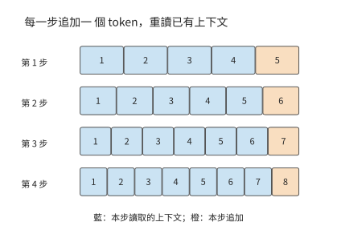

*圖 2-7　四步生成的上下文讀寫。每一步讀取藍色的已有位置，再追加一個橙色新 token；本圖初始上下文為 4 個 token，四步後共保留 8 個。*

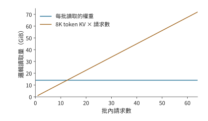

*圖 2-8　同一 batch 的主要投影權重可共享讀取，各請求則各有一份上下文。圖中固定每請求 8K 上下文，分別累計共享權重與獨立 KV 的邏輯讀取量。權重項按整個 decode batch 讀取一次計量；KV 項累加各獨立請求在本步讀取的上下文狀態。*

圖 2-7 中的每一行都比上一行多一個已填色方塊：先前追加的位置現在也成為上下文。第 $j$ 次 decode（$j$ 從 0 開始）執行前，上下文長度為 $H+j$。因此，若每次 decode 將此前的上下文各讀取一遍，累計讀取量為：

$$
R_{\mathrm{old}}=c_{\mathrm{KV}}\sum_{j=0}^{n_d-1}(H+j)=c_{\mathrm{KV}}\left[n_dH+\frac{n_d(n_d-1)}{2}\right]
$$

decode 新增的狀態大小為 $c_{\mathrm{KV}}n_d$；若保留整個上下文，最終有效 KV 為 $c_{\mathrm{KV}}(H+n_d)$。本次請求的全部新增 KV 還應包含 prefill 寫入的 $c_{\mathrm{KV}}P$。已有字首的恢復與傳輸單獨核算。求和中的每一項都對應一次 decode 開始時已有的上下文：早出現的位置參與更多後續查詢，晚出現的位置參與較少查詢。

**例題 2-3：逐步生成為何使 KV 累計讀取量遠超儲存量？** 求請求結束時儲存的 KV 大小，以及生成期間讀取已有 KV 的總量。

解：取 $S=0$、$P=8192$、$G=1025$，則 $n_d=1024$，全過程累計讀取上下文 token 的 KV 達 8,912,384 次。每個 token 的 KV 佔 144 KiB，因此累計讀取約 1224 GiB。生成期間只新增 144 MiB KV，結束時共儲存約 1.27 GiB。累計讀取量是最終儲存量的近千倍，因為已經進入上下文的 token，後面的每次 decode 都要再讀一遍；本例中絕大部分上下文是 prefill 寫入的 8192 個輸入 token。

這組呼叫也決定了總運算量。線性投影和 FFN 在每次 decode 中處理一行，上下文互動則隨 $H+j$ 增長。設每步固定的矩陣運算量為 $F_0$、與每個上下文 token 互動所需的運算量為 $a$，便有

$$
F_{\mathrm{decode,total}}=n_dF_0+a\left[n_dH+\frac{n_d(n_d-1)}2\right].
$$

輸出變長時，各步固定部分的累計工作量隨 $n_d$ 線性增長，生成過程中新增的上下文還會使一部分累計運算量按生成步數的平方增長。返回一個 token 時 $G=1$、$n_d=0$，只有 prefill；這一特殊情形也說明為什麼完整回答包含 $G-1$ 次後續 decode。

圖 2-7 沿生成步數累加讀取，圖 2-8 沿請求數累加讀取。多條獨立請求的狀態容量與上下文訪問分別相加，批內權重則共同使用。長度不同時，逐請求代入各自的 $H$ 與 $n_d$：輸出越長，已有上下文被讀取的次數就越多；輸入越長，第一次 decode 要訪問的上下文就越多。對實際對話，可先根據每輪輸入長度、快取命中情況和返回的 token 數，還原這條呼叫鏈；[已儲存的 Chat 長度核算](../calculations/results/sealed-chat-known-prefill.md)給出了具體代入過程。

> **練習 2-3〔延伸〕：輸出變長後，KV 容量與累計讀取量如何增長**
>
> 取 Qwen3-8B、$B=1,S=0,P=8192$，分別返回 $G=513$ 和 $G=1025$ 個 token。求後續 decode 次數、最終 KV 大小和累計舊上下文讀取量。解釋輸出數量接近翻倍時，生成階段新增的 KV 容量、最終 KV 總容量與累計讀取量為何按不同的比例增長。再將 KV 位寬減半，指出這三項中哪些隨之減半。

## 2.3 上下文狀態表示與訪問機制

模型繼續生成時，需要利用前面已經讀過的內容。先比較兩種記錄辦法：一種逐頁留下記錄，要查哪一頁就取哪一頁；另一種只保留一張定長摘要，每讀到新內容，就改寫這張摘要。前一種記錄隨歷史增長，後一種大小固定，但不能保證找回每個 token 的全部細節。

對應到模型，一類機制為每個 token 位置儲存鍵和值，有限狀態遞推則把歷史貢獻匯入固定大小的狀態。逐 token 記錄與遞推摘要都以數值向量或矩陣儲存。模型處理上下文後儲存下來、供後續計算複用的這些表示，稱為上下文狀態。上下文長度按 token 數計量，狀態容量按實際儲存的位元組數計量。

比較這些機制時，先看歷史留下了什麼，再看新一步如何取得所需資訊：可以用更少的維度表示每個 token，也可以只直接訪問近期位置、將多個位置彙總為較少條目，或先篩選再讀取。另一類機制持續更新固定大小的狀態，查詢從中取得結果。這些安排分別改變表示寬度、條目數量和訪問方式；節省的儲存與讀取，要同新增的選擇、壓縮和更新工作一起計算。

### 2.3.1 多頭注意力與 KV 共享

逐 token 記錄最直接的節省辦法，是減少每個 token 儲存的 $K$、$V$ 份數。多頭注意力讓不同的查詢頭分別學習上下文中的關係。在多頭注意力（Multi-Head Attention，MHA）中，每個 $Q$ 頭對應自己的 $K$、$V$ 頭；多查詢注意力（Multi-Query Attention，MQA）讓所有 $Q$ 頭共用一組 $K$、$V$；分組查詢注意力（Grouped-Query Attention，GQA）則把 $Q$ 頭分組，每組共享一組 $K$、$V$。共享後，每個上下文 token 需要儲存的 $K$、$V$ 組數減少，上下文 token 的數量保持不變。

以只有四個查詢頭的單層為例。MHA 為四個查詢頭各存一份 $K$、$V$；GQA 可以讓前兩個查詢頭共享第一份 $K$、$V$，後兩個共享第二份；MQA 則讓四個查詢頭共用一份。若上下文長度和頭寬相同，需要儲存的 KV 份數依次為四、二、一。因此，GQA 在此例中把上下文儲存量減半。四個查詢頭仍可給同一段上下文打出四組不同的分數，這正是「共享上下文表示」與「合併查詢」之間的區別。

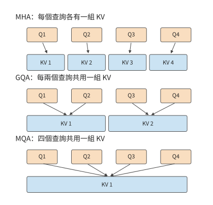

*圖 2-9　固定四個查詢頭，分別為每頭、每組和全部查詢儲存 KV。連線表示使用關係；共享上下文後，各查詢仍分別產生自己的評分與輸出。*

Qwen3-8B 採用這種共享方式，讓每四個查詢頭共用一組 KV，總計 32 個查詢頭、8 個 KV 頭。如果給每個查詢頭單獨儲存 KV，容量會是當前配置的四倍；如果全部查詢共享一組，則會是當前配置的八分之一。實際 GQA 配置儲存 8192 個 token 需要 1.125 GiB。本節末的容量圖固定上下文長度與頭寬，只改變 KV 組數，因此柱高之比直接呈現共享比例。

共享 $K$、$V$ 改變了被查詢的資料，但 32 個 $Q$ 頭仍分別計算分數和加權輸出。因此，KV 投影和儲存量按組數減少，$QK^{\mathsf T}$ 與 $AV$ 互動仍按查詢頭數累計。一次讀入的 $K$、$V$ 還可以供同組的多個查詢頭使用，實際計算中就複用了同一份資料。

可以直接由組數預測資源變化。將 $n_{\mathrm{KV}}$ 減半，鍵值投影參數和上下文狀態容量都減半；查詢頭數 $n_Q$ 不變，查詢與上下文互動的運算量仍按原來的頭數累計。

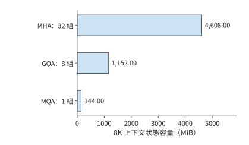

*圖 2-10　固定 Qwen 層數、頭寬、8192 個上下文 token 與 BF16，只改變 KV 組數。實際模型採用 GQA；其餘兩柱是用於分析共享比例的結構變體。*

KV 共享也說明，基礎設施的限制會影響模型設計。MQA 的原論文直接把增量推理中的記憶體頻寬開銷作為動機；GQA 則在 MHA 的質量與 MQA 的速度之間尋找折中。[^codesign] 減少 KV 頭數既改變模型可表達的注意力關係，也減少服務端必須儲存和讀取的狀態。

### 2.3.2 潛變數壓縮與 MLA 執行路徑

GQA、MQA 靠減少 KV 組數節省空間，多頭潛變數注意力（Multi-head Latent Attention，MLA）則靠降低上下文表示的維度節省空間。可以先把輸入投影為低維潛變數 $c$，再透過上投影得到用於注意力的 $K$、$V$。模型在訓練中學習這些低維表示與上投影，生成時將上下文以 $c$ 的形式儲存。

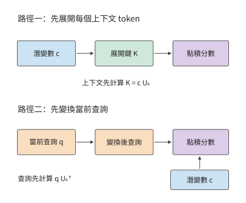

*圖 2-11　兩種計算路徑改變上投影的位置。展開路徑先恢復上下文鍵，緊湊路徑先變換當前查詢，再直接讀取潛變數；結合律保證對應點積可以按這兩種次序計算。*

只儲存潛變數的依據如下。設鍵的上投影為 $U_k$，上下文潛變數按行組成矩陣 $c$，展開鍵為 $K=cU_k$。矩陣乘法的結合律給出

$$
qK^{\mathsf T}=q(cU_k)^{\mathsf T}=(qU_k^{\mathsf T})c^{\mathsf T}.
$$

左邊先為每個上下文 token 恢復鍵，右邊先變換當前查詢。對單個新查詢，右邊只需做一次查詢變換，隨後直接與潛變數點積。值向量也可在加權彙總後再上投影：先彙總低維向量，再恢復輸出維度。這樣，原來針對每個上下文 token 執行的升維操作，改為針對當前查詢和彙總結果執行。

本章採用 Kimi K3 的 **Gated MLA（門控多頭潛變數注意力）**作例項；門控用學習得到的係數調節注意力輸出。緊湊路徑儲存 512 維潛變數和參與 $QK^{\mathsf T}$ 點積的 64 維額外分支。Kimi K3 的全部 MLA 層採用 NoPE（No Position Encoding），查詢和鍵都不施加 RoPE，位置資訊由 KDA 層（第 2.3.4 節）的遞推門控與衰減提供；參考實現仍投影並快取這 64 維分支，只是不對它做旋轉，所以每個 token 儲存 $512+64$ 維。24 個 MLA 層、8192 個 token 的上下文、BF16 下，儲存量為 $24\times8192\times(512+64)\times2$，即 216 MiB。

展開快取將潛變數先恢復為各頭的 $K$、$V$，再儲存這些向量；同樣的 8192 個 token 需要約 11.25 GiB。緊湊快取則儲存上投影之前的潛變數。兩者的容量差異因此來自快取位於線性變換的哪一側：緊湊快取每步變換當前查詢，展開快取直接讀取各頭的上下文向量。[^source-2]

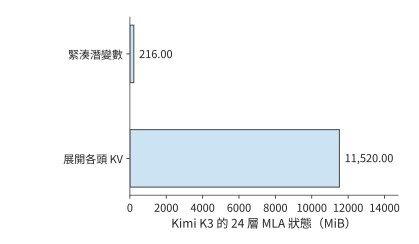

*圖 2-12　Kimi K3 的 24 層 MLA 在相同 8K 上下文、BF16 下的兩種儲存量。緊湊路徑儲存上投影前的表示，展開路徑儲存各頭的鍵和值。*

這一變換減小了每個上下文 token 的表示寬度，但仍需為每個 token 儲存一個潛變數向量。因此，儲存量和點積運算量仍隨上下文長度增長。上下文越長，緊湊表示節省的讀取量越可觀；上下文越短，查詢變換本身的開銷佔比越高。

### 2.3.3 區域性視窗、上下文壓縮與稀疏索引

假設模型已經讀過一段長文字，現在要處理一個新 token。模型可以直接讀取最近一段位置，也可以讀取由多箇舊 token 匯成的條目，還可以先找出與當前查詢相關的條目，再讀取這些條目的主注意力狀態。這三種動作分別引出區域性視窗、上下文壓縮與稀疏選擇。三者可以組合使用，但要分別計量：視窗限制近期範圍，壓縮減少長期條目，索引選擇當前要讀哪些條目。篩選本身也要讀取索引表示並計算分數，不能只統計最後選中的主注意力狀態。

先區分三個物件。**區域性滑動視窗注意力（Sliding-Window Attention，SWA）**直接讀取最近的一段位置；視窗長 128 時，較早位置退出這一區域性視窗。**全域性主 KV**是供主注意力讀取的長期表示，可能已將多個位置合併；「全域性」說明它覆蓋較長曆史，不表示每次都讀取全部條目。**索引 K**是用於檢索的另一份較小表示：索引器先用它給條目打分，再讓主注意力讀取選中的主 KV。索引分數用於選擇快取條目，主注意力另用自己的查詢計算最終彙總權重。

模型透過訓練學會把一段輸入彙總為共享表示。一條 512 維主 KV 記錄兼作注意力中的鍵和值，供多個查詢頭共享，容量按一份記錄計算。SWA 儲存近期細節，全域性分支提供較早資訊，兩者共同供當前查詢使用。

DeepSeek V4-Flash 把這套機制組合在同一個模型中，有 43 個主幹層、4096 隱藏維度、64 個注意力頭，每頭維度 512。$Q$ 先從 4096 維投影到 1024 維，再得到 $64\times 512$ 維查詢；共享 KV 從 4096 維投影到 512 維；輸出採用分 8 組的低秩投影，即先投影到較窄的中間維度，再投影到目標維度。各投影的輸入、輸出維度分別確定矩陣形狀。

DeepSeek V4-Flash 使用兩種壓縮注意力：**壓縮稀疏注意力（Compressed Sparse Attention，CSA）**先壓縮上下文，再透過索引選取相關條目；**高壓縮注意力（Heavily Compressed Attention，HCA）**把更多位置匯成較少的粗粒度條目，供查詢訪問。兩者都用於減少長上下文的儲存與訪問量，區別在於壓縮程度和是否進一步篩選條目。其主幹包含 2 個純視窗層、21 個 CSA 層和 20 個 HCA 層，視窗長度為 128。CSA 按壓縮比 4 儲存上下文，並維護索引；HCA 按壓縮比 128 儲存更粗的上下文。採用 BF16 作為參考儲存格式，CSA 每個完成的壓縮條目含 512 維主注意力狀態，另有 128 維索引條目。已有 $S$ 個 token 時，已生成的條目數按 $\lfloor S/4\rfloor$ 計算；尚未完成的壓縮塊還需獨立緩衝。

壓縮比描述輸出條目數，不一定等於一個條目的全部輸入範圍。V4 的 CSA 每四個新 token 生成一條記錄，但採用相鄰塊重疊：除首塊的邊界處理外，一個條目用兩組不同的投影彙總相鄰兩塊、共八個 token 的資訊；每個 token 還使用學習得到的逐通道權重。HCA 每 128 個 token 生成一條記錄，不採用這種相鄰塊重疊，也不使用 top-k 索引（只取索引分數最高的 k 個條目），而是讀取所有已完成的粗粒度條目。V4.1 的 CSA2（第二版 CSA）才取消了 V4 CSA 的重疊壓縮。

一次 CSA 查詢的主注意力最多讀取視窗加 512 個壓縮條目，但索引打分仍掃描已儲存的壓縮索引條目。在 $S=8192$ 時，一個 CSA 層保留 2048 個壓縮條目：主注意力狀態約 2 MiB、索引約 0.5 MiB，視窗約 0.125 MiB；主注意力選中的壓縮條目合計最多約 0.5 MiB，索引掃描卻仍需處理那 2048 個索引條目。HCA 則有 64 個已生成的條目，主注意力狀態約 0.0625 MiB，並訪問視窗狀態與這組粗粒度壓縮條目。

將 43 層相加，按上述 BF16 參考格式，在 8192 個 token 的上下文下，視窗、壓縮上下文和索引共 59.125 MiB；另有約 11.641 MiB 的 FP32 壓縮器緩衝，合計約 70.8 MiB。最後一次查詢的主注意力（含視窗）與索引讀取量合計 27.625 MiB。[狀態分解](../calculations/results/state-deepseek-v4-flash-n8192-b1-native.md)逐項列出了這些資料，因此能看出選中的條目數、儲存的狀態大小和每步讀取量分別代表什麼。

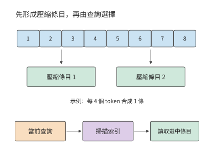

*圖 2-13　上下文壓縮與索引選擇的先後關係。上方只示意八個 token 產生兩條記錄的數量關係，省略 V4 CSA 的重疊投影與加權彙總，下方展示一次查詢先掃描索引再讀取主注意力狀態的過程。*

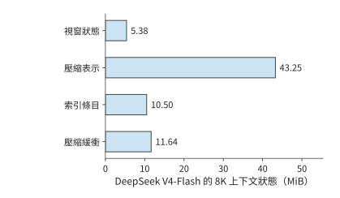

*圖 2-14　DeepSeek V4-Flash 在 8K 上下文下的四項狀態。視窗、壓縮上下文和索引儲存已處理的上下文資訊；壓縮緩衝儲存尚在彙總或更新中的資料，單獨計入容量。*

壓縮還引入一種與查詢不同的更新節奏。新 token 到達時，先更新當前壓縮塊；累計處理的 token 數達到壓縮比要求後，再生成一個長期條目。CSA 每四個 token 完成一塊，HCA 每 128 個 token 完成一塊。因此，在處理同一個輸入 token 時，主注意力訪問多少條目、索引掃描多少條目、壓縮器是否完成一塊，需要分別計算。處理到第 128 個 token 時，兩種壓縮塊可能同時完成。[^source-14]

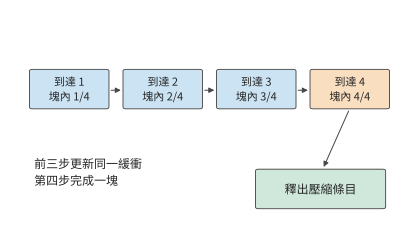

*圖 2-15　壓縮比為四時的一個壓縮塊的生成過程。前幾次輸入更新同一塊內緩衝，第四個 token 到來後形成可供後續查詢使用的壓縮條目。*

> **練習 2-4〔延伸〕：KV 頭共享與上下文壓縮如何改變儲存和訪問量**
>
> 先把 Qwen3-8B 的 KV 頭數從 8 改為 4，保持 32 個查詢頭不變，分別計算 KV 容量、KV 投影參數量，以及查詢與上下文互動所需運算量的變化。再對 DeepSeek V4-Flash 的 CSA 層，把上下文從 8192 增至 16384，按壓縮比 4、每次最多選擇 512 個壓縮條目，計算儲存條目數、索引掃描條目數和選中條目上限。解釋三者為何不按同一比例增長。

### 2.3.4 線性注意力與有限狀態遞推

第 2.3.1 至 2.3.3 節的機制仍能區分儲存下來的各個上下文條目。有限狀態遞推採用另一種過程：每來一個新 token，就把它的貢獻合入已有狀態，當前查詢直接使用更新後的狀態；下一步繼續改寫這份狀態。這對應第 2.3 節開頭不斷改寫定長摘要的圖景。這類線性注意力重新組織查詢、鍵和值的計算次序，不再顯式算出所有查詢—鍵配對的注意力分數。在特徵維度固定時，狀態矩陣大小不變，處理整段序列的運算量隨序列長度線性增長。

構造狀態的基本運算是外積，即把一個鍵向量與一個值向量的每對元素相乘，組成二維的關聯表。考慮由鍵值外積累加得到的矩陣 $\mathcal S_t$。每個新 token 到來時，先讀取舊狀態，再寫入本位置的貢獻，當前查詢直接從狀態矩陣讀出結果：

$$
\mathcal S_t=\mathcal S_{t-1}+k_tv_t^{\mathsf T},\qquad o_t=q_t^{\mathsf T}\mathcal S_t.
$$

若鍵寬為 $d_k$、值寬為 $d_v$，狀態始終有 $d_kd_v$ 個元素。新增 token 改變的是矩陣內容，而不是矩陣大小。逐 token 的上下文列表因此變成了一組累積的鍵值關聯；查詢從這組關聯中取得輸出。

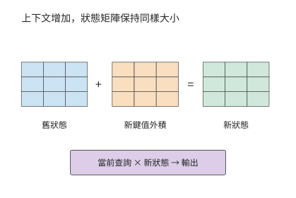

*圖 2-16　固定矩陣的遞推更新。新鍵和值的外積加入舊狀態，矩陣形狀保持不變；查詢使用更新後的狀態計算輸出。本圖採用簡單累加遞推。*

實際的遞推注意力在簡單累加之外，還加入門控與修正。**Kimi Delta Attention（KDA）**是 Kimi 使用的一種門控遞推注意力，用固定大小的關聯矩陣儲存上下文資訊。KDA 使用門控與 delta 更新；delta 在這裡指依據當前預測誤差寫入修正量。每次更新不只寫入新資訊，還用當前鍵檢驗既有狀態的預測，據此寫入修正；舊資訊以彙總後的關聯形式儲存，當前鍵決定修正落在哪裡，衰減門決定保留多少舊資訊。KDA 更新的是一張固定大小的關聯矩陣，而非向逐 token 儲存的列表追加條目。

Kimi K3 每個 KDA 層有 96 個頭，每頭遞推矩陣為 $128\times128$。按 FP32 儲存，單層為 6 MiB，69 層為 414 MiB。一次 decode 讀取舊矩陣、融合新資訊並寫回，理想情況下，各讀寫一次的總量就是 828 MiB。這一讀寫量不隨上下文長度增長：短上下文時是一筆顯著的固定開銷，長上下文時則避免了掃描量隨上下文 token 數持續增加。

prefill 與 decode 的實現方式也不同。decode 使用單步遞推；一段已知輸入可以用塊式演算法平行計算，再在塊之間傳遞狀態。塊內中間量和塊間狀態會佔用臨時空間，因此僅憑最終遞推狀態的大小，還無法預測 prefill 期間的記憶體佔用峰值。第 5 章根據緩衝區從分配到釋放的過程分析這一問題。[^source-15]

### 2.3.5 混合注意力的狀態構成

實際模型常把有限狀態層與全域性注意力層混合使用。這樣既利用遞推結構的上下文壓縮，也保留部分直接訪問全域性上下文的能力。整個模型的狀態由多個部分組成：有的大小固定，有的隨上下文長度增長。

Kimi K3 共 93 層，其中 69 個 KDA 層、24 個 MLA 層。8192 個 token 的上下文、緊湊 BF16 MLA、FP32 遞推狀態及 BF16 短卷積槽位下（短卷積沿序列方向混合相鄰幾個位置的輸入，槽位儲存下一步更新要用的近期輸入），三項分別為 216 MiB、414 MiB 與 19.4 MiB，合計約 649.4 MiB。若使用參考展開快取，MLA 一項就變為 11.25 GiB，整體隨之改變。[^source-16]

Qwen3.6-35B-A3B 同樣需要分別計算線性注意力層和完整注意力層的狀態佔用。其 30 個線性注意力層加 10 個完整注意力層，每請求每個上下文 token 的全域性 KV 為 20 KiB，另有 60 MiB 的固定 FP32 遞推狀態，以及 1.875 MiB 的 BF16 短卷積槽位。上下文為 8192 個 token 時，三項合計 221.9 MiB。這些狀態來自注意力分支。隨後的混合專家（Mixture of Experts，MoE）分支提供多個前饋子網路，由路由器為每個 token 選擇其中一部分來執行，決定同一主幹中實際使用哪些權重。這些供選擇的子網路稱為路由專家，所有 token 都執行的一支稱為共享專家。注意力與 MoE 兩類機制共同組成完整模型。

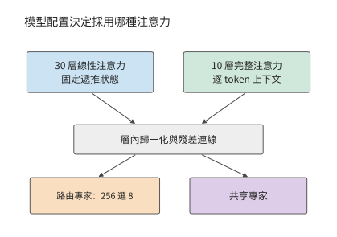

*圖 2-17　Qwen3.6 的兩類層。配置決定每層採用線性或完整注意力，隨後都執行路由專家和共享專家；上方兩個分支分別表示線性注意力和完整注意力，模型分別有 30 層與 10 層。*

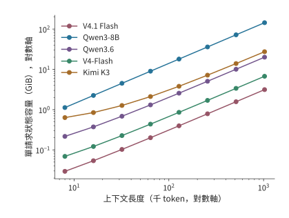

*圖 2-18　上下文增長時的狀態容量。橫縱軸均為對數刻度；五個模型分別透過逐 token 追加、遞推、壓縮和跨層共享組織狀態。縱軸為單請求的狀態容量，橫軸按上下文 token 數計量。*

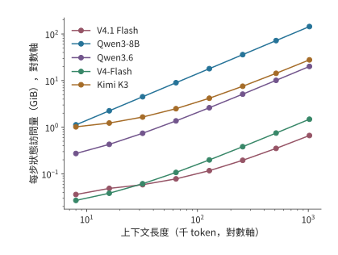

*圖 2-19　同一組模型每步計入的狀態訪問。逐 token 上下文計讀取，遞推矩陣計一讀一寫；這些是指定路徑的邏輯資料量，用於比較容量與訪問的不同增長方式。每步指為一個請求生成下一個 token 的一次 decode；縱軸不包含模型權重讀取。*

這五條狀態曲線的形狀來自不同表示。Qwen3-8B 每增加一個 token，所有 GQA 層都追加 $K$、$V$；Kimi K3 只有 MLA 部分追加上下文，KDA 部分保持固定矩陣；DeepSeek V4-Flash 則在壓縮塊完成時增加條目。V4.1 Flash 進一步讓多層讀取同一份全域性快取，Qwen3.6 則將遞推層與全注意力層組合。對長上下文，增長速度決定新增容量；對短上下文，遞推矩陣等固定部分決定起始佔用。

將固定遞推狀態與逐 token 上下文相加，就得到混合結構的容量模型：

$$
M_{\mathrm{state}}(H)=M_{\mathrm{fixed}}+c_{\mathrm{state}}H,\qquad H_* = \frac{M_{\mathrm{fixed}}}{c_{\mathrm{state}}}.
$$

$c_{\mathrm{state}}$ 為每個上下文 token 增加的狀態位元組數，$H_*$ 表示兩部分佔用相等的上下文長度。Qwen3.6 的固定部分為 $61.875$ MiB，每 token 增加 20 KiB，因此 $H_*=3168$；Kimi K3 的緊湊表示每 token 增加 27 KiB，固定部分約為 433.4 MiB，交點約在 16.4K 個上下文 token。低於交點時，縮短上下文只能節省較小一部分空間；遠高於交點時，減小每個 token 的表示寬度能更有效地節省容量。DeepSeek V4-Flash 則按完成的壓縮塊增加條目，曲線呈階梯增長。

這些狀態支援不同的資訊訪問方式：全域性 KV 允許查詢直接選擇舊 token，遞推矩陣靠逐步更新保留上下文關係，壓縮索引則在較少條目中尋找相關內容。第 2.6.3 節將結合具體檢索任務比較資源需求。[^source-17]

> **練習 2-5〔核心〕：上下文多長時，KV 容量會超過固定狀態？**
>
> 對 Qwen3.6，取固定狀態 61.875 MiB、每個上下文 token 20 KiB；對 Kimi K3 的緊湊表示，遞推狀態佔 414 MiB，卷積狀態佔 20,348,928 位元組，每個上下文 token 另佔 27 KiB。分別求隨上下文增長的狀態與固定狀態容量相等時的上下文長度，以及 32K、128K 上下文的狀態總容量。若只有 256 MiB 狀態預算，兩個模型各自最多能儲存多少個上下文 token？說明容量預算小於固定狀態大小時，為什麼縮短上下文仍無法容納模型狀態。

### 2.3.6 每個 token 存多少，每次 decode 讀多少

比較模型的上下文成本，需要同時給出三個量：全域性歷史每增加一個 token 的平均儲存增量、長度為 $N$ 時實際儲存的狀態，以及一次 decode 查詢需要讀取的歷史。全域性 KV 會隨上下文增長；滑動視窗只保留最近一段；遞推狀態的大小固定，卻仍要在每一步讀寫。把三者都除以上下文長度，會掩蓋它們不同的增長規律。

下面考慮一條請求，當前查詢可訪問的上下文共 $N=8192$ 個 token，包含查詢 token 位置自身。表中按各行指定的精度和快取路徑計算全域性歷史容量，以及一次查詢的邏輯讀取量：每層選中的 K/V 或共享潛變數讀取一次，供各查詢頭的 QK 評分與 PV 計算（即前文的 $AV$，用注意力權重彙總值）複用，再加上區域性 SWA 視窗與索引掃描。遞推矩陣、卷積和壓縮器的狀態更新在表後分別討論。

| 模型與快取路徑 | 全域性歷史平均增長（B/token） | 8K 全域性歷史（MiB） | 每次 decode 注意力 KV＋索引讀（MiB） |
| --- | ---: | ---: | ---: |
| Qwen3-8B，BF16 GQA | 147,456 | 1,152 | 1,152 |
| Qwen3-32B，BF16 GQA | 262,144 | 2,048 | 2,048 |
| Qwen3-30B-A3B，BF16 GQA | 98,304 | 768 | 768 |
| Qwen3-235B-A22B，BF16 GQA | 192,512 | 1,504 | 1,504 |
| Qwen3.5-397B-A17B，BF16 全注意力部分 | 30,720 | 240 | 240 |
| Qwen3.6，BF16 全注意力部分 | 20,480 | 160 | 160 |
| Kimi K3，BF16 緊湊 MLA 路徑 | 27,648 | 216 | 216 |
| DeepSeek V4-Flash，生產混合格式 | 3,514.25 | 27.455 | 12.556 |
| DeepSeek V4.1 Flash，生產混合格式 | 890 | 6.953 | 11.375 |

Kimi K3 的兩種 MLA 表示展示了快取路徑對容量的影響：表中的緊湊路徑每個 token 增加 27,648 B，本書採用的 Hugging Face 參考實現將 K/V 展開，每個 token 增加 1,474,560 B。[跨模型快取計算](../calculations/results/kv-comparison-n8192-b1.md)列出了兩種路徑的精確位元組數。

兩代 Flash 的行採用生產混合格式：V4-Flash 的主記錄為 FP8/BF16 混合、每條 584 B，索引為 MXFP4（每 32 個 4 位值共用一個 scale 的格式）；V4.1 Flash 的格式見下文。第 2.3.3 節的 V4-Flash 數字則按 BF16 參考格式計算，同一 8K 上下文下，全域性歷史為 53.75 MiB（另有 5.375 MiB 視窗），一次查詢讀取 27.625 MiB。表中 V4-Flash 的 27.455 MiB 是生產格式下的全域性歷史駐留量，與 BF16 參考格式的讀取量 27.625 MiB 只是數值接近。

混合注意力還要加固定狀態。在本章 FP32 遞推、BF16 短卷積的條件下，Qwen3.5 的遞推矩陣與卷積槽合計 184.219 MiB，Qwen3.6 為 61.875 MiB，Kimi K3 為 433.406 MiB。這些固定狀態與表中的上下文快取共同決定當前的記憶體佔用；一次 decode 還要讀寫遞推矩陣並更新卷積槽。

除了逐層各自儲存，狀態還可以在層之間共享。長期以來，decoder-only 是通用生成式語言模型的主流架構：輸入處理與逐 token 生成使用同一套主幹層，各層通常根據自己的隱藏狀態產生 KV。V4.1 Flash 對這種分工做了重要調整，將上下文表示的構建與後續查詢分開，使輸入處理只需較少的主幹計算。技術報告將這一設計稱為 CED，並說明其受到 YoCo 跨層複用 KV 的思路啟發。[^v41-case]

這裡的「編碼器負責理解、解碼器負責生成」，具體指兩部分在上下文表示與生成計算中的不同職責。編碼器遵守因果約束，並非傳統序列到序列模型中可以雙向訪問整個輸入的編碼器；生成新 token 時也仍然需要編碼器參與。這種不對稱體現在資訊在哪裡產生、各階段要執行哪些層，而不是把輸入與輸出交給兩個互不參與對方計算的模型。

理解這套結構時，可以先把「生成全域性表示」和「查詢全域性表示」分開。V4.1 Flash 的 CED 把 40 層文字主幹按順序分成前 20 層因果編碼器和後 20 層解碼器。兩部分屬於同一個自迴歸模型，編碼器中的每個 token 只訪問當前 token 位置及其之前的資訊。

編碼器先處理輸入。解碼器需要的全域性 KV 由編碼器末層表示投影生成，不必讓每個輸入 token 都先經過全部解碼器層。解碼器每層的區域性 SWA 則仍依賴該層自己的輸入表示，因此要把提示末尾最多 128 個 token 的編碼器輸出送入解碼器，構建區域性狀態，下文稱為末尾視窗重放。開始逐 token 生成後，新 token 依次經過編碼器和解碼器的全部 40 層。第 3 章再計算節省了哪些輸入工作，第 8 章區分編碼器和解碼器的兩種重放。

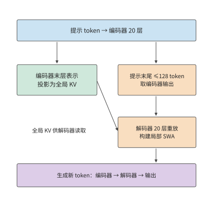

*圖 2-20　CED 把全域性 KV 的生成與解碼器區域性狀態的構建分開。大部分提示 token 只執行編碼器主體及全域性 KV 投影；末尾視窗的編碼器輸出還經過解碼器，近似構建區域性 SWA。生成的新 token 仍透過全部 40 層。*

長上下文的成本還取決於同一段資訊在多少層中重複儲存。V4.1 的技術報告直接把 HBM、SSD 與主機記憶體容量，以及 KV 遷移頻寬列為設計約束。V4.1 沒有繼續提高 V4 的序列壓縮比：V4 使用 4:1 的 CSA 和 128:1 的 HCA，V4.1 取消 HCA，編碼器的全域性條目按 2:1 壓縮，解碼器按 1:1 保留。V4.1 縮小快取主要靠跨層共享與更低精度，同時保留了更細的歷史 token 粒度。[^v41-case]

共享也改變了各層能夠獨立選擇的資訊。複用層不再生成自己的全域性 K/V，但每層仍保留獨立的查詢 Q 和區域性 SWA，因而可以對共享條目計算不同的注意力權重，形成新的輸出。快取共享減少了一類逐層獨立表示，卻沒有把所有層的計算變成相同操作。

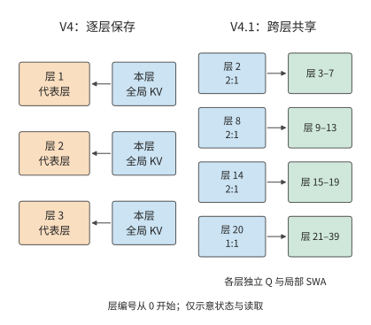

*圖 2-21　V4 與 V4.1 的全域性 KV 儲存方式。左側以三個代表層示意逐層儲存；右側顯示 V4.1 四個獨立儲存全域性 KV 的層及共享關係。實線表示資料讀取；各使用層仍有自己的 Q 與區域性 SWA，圖中省略其他計算。*

把上述共享關係代入容量計算。2026 年 9 月釋出的 DeepSeek V4.1 Flash 有 40 層文字主幹，但只有 4 層擁有獨立的全域性 KV：按從零開始的編號，第 2、8、14 層每兩個 token 生成一條壓縮記錄，第 20 層每個 token 生成一條記錄，其餘全域性注意力層共享這些快取。主記錄的 512 個值採用 FP4（每個值佔 4 位的浮點格式），每 16 個值另有一個位元組的 scale，因此每條記錄佔 $512/2+512/16=288$ 位元組；索引記錄佔 $128/2+128/32=68$ 位元組。全域性 KV 的平均儲存增量為

$$
\left(\frac{3}{2}+1\right)(288+68)=890\ \mathrm{B/token}.
$$

作為對照，舊 V4-Flash 有 21 層 4:1 壓縮和 20 層 128:1 壓縮。按官方 FlashMLA（DeepSeek 開源的 MLA 注意力計算庫）的格式（主記錄 584 B、索引記錄 68 B），其全域性 KV 的平均儲存增量為

$$
21\frac{584+68}{4}+20\frac{584}{128}=3514.25\ \mathrm{B/token}.
$$

兩者的全域性 KV 平均增量相差約 3.95 倍，對應官方圖中取整後的 3,514 與 890 B/token。除全域性上下文快取外，V4.1 的區域性視窗每層最多儲存 128 條記錄，每條 FP8（每個值佔 1 位元組的浮點格式）+scale 記錄佔 528 B，40 層合計 2.578 MiB。全域性歷史隨上下文增長，區域性視窗則在填滿後保持固定容量。

沿生成過程逐步觀察，還能看出全域性快取的增長節奏。對 V4.1，全域性快取從偶數長度增長到下一個奇數長度只增加 356 B，即第 20 層每 token 一條的記錄；到下一個偶數長度時，第 2、8、14 層的三個 2:1 壓縮器各再完成一條記錄，本步合計增加 $4\times356=1{,}424$ B。視窗填滿後，後續寫入會覆蓋舊槽位，容量不再增長，但仍然產生寫入：40 層 SWA 每步合計寫入 $40\times528=21{,}120$ B，壓縮器更新另計。

共享同一份全域性快取的各層仍需讀取資料，部分層還會重新索引；8K 場景下，按表中的生產混合格式，V4-Flash 與 V4.1 Flash 的注意力 KV（含區域性 SWA）與索引邏輯讀取量分別為 12.556 和 11.375 MiB，跨層共享主要減少了重複儲存的空間。

快取複用與條目選擇還可以分別安排。V4.1 的 CSA2 把層分成三種模式。**Full**（完整）層完整執行「生成全域性 KV、索引、選取和注意力」的流程。**Reindex**（重索引）層共享 KV，用自己的索引查詢重新選取 top-k；**Reuse**（複用）層連同所選快取條目一起復用。V4.1 的 38 個全域性注意力層中，有 4 個 Full、4 個 Reindex 和 30 個 Reuse；另外兩個層僅使用 SWA。解碼器的首個 Full 層掃描全域性，並選出最多 $2048\times8=16{,}384$ 個候選條目；技術報告第 2.3.2 節將這一集合稱為**候選池（candidate pool）**，其中的候選是可供注意力檢索的快取條目。後續 Reindex 層只在池內各自選取最多 512 個條目。[^v41-candidate] 後續層的搜尋量因此有了上限，但初始全域性掃描仍隨上下文增長。

例如，某次查詢面對 131,072 個全域性快取條目，將它們按每塊 8 個分成 16,384 塊。首個解碼器 Full 層先為所有快取條目評分，以塊內最高分作為塊分數，再選出 2,048 塊，形成 16,384 個候選條目。該層仍從全域性分數選取 top-512；後續 Reindex 層在候選內用新的索引查詢重算分數，各自選出 512 個快取條目。候選池限定後續層的搜尋範圍，各層的 top-512 決定本層最終讀取哪些條目。

候選池讓後續層的搜尋量有了上限，也使首輪篩選影響後續選擇：某個快取條目一旦落在候選池之外，本次查詢的後續 Reindex 層便無法再選入該條目。模型訓練需要適應這一搜尋範圍，第 10 章將說明 V4.1 如何把候選限制納入後訓練。

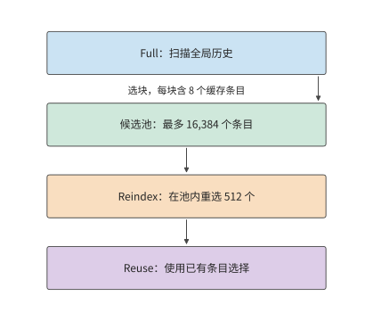

*圖 2-22　V4.1 解碼器的分層快取條目選擇。首個 Full 層先掃描全域性，選出最多 16,384 個候選條目；後續 Reindex 在候選內重新選 512 個，Reuse 使用已有選擇。示意條目數量不按比例；各層獨立 Q 與區域性 SWA 未畫出。*

## 2.4 條件計算與專家權重複用

第 2.3 節透過共享、壓縮和遞推減少上下文狀態。另一個主要資料來源是模型權重：每個 token 是否必須使用模型中的全部參數？本節從 FFN 出發分析這一問題。

稠密 FFN 對每個 token 使用同一組矩陣；MoE 把參數分配給多個專家，由路由器為每個 token 選擇少數專家。這樣，「模型儲存多少參數」與「一個 token 啟用多少參數」就可以分別調整，batch 內各 token 的選擇也會影響實際訪問的權重集合。

### 2.4.1 稠密前饋網路與專家路由

典型的 MoE 分支先從輸入計算路由分數，按 top-k 選擇路由分數最高的 k 個專家，再把 token 送入選中專家，最後按路由權重合並輸出。有共享專家時，還會有一條所有 token 都參與的分支。專家本身通常仍由 gate、up、down 三個矩陣構成，因此可以按第 2.1.4 節的 SwiGLU 計算逐個展開。

以 Qwen3.6-35B-A3B 為例。其文字主幹包含 40 層，隱藏維度 2048；每層 256 個路由專家，每 token 選 8 個，專家中間維度為 512，另有共享專家。一個路由專家包含 $3\times 2048\times 512=3,145,728$ 個參數，以 BF16 儲存為 6 MiB。每層全部路由專家佔 1.5 GiB，一個 token 選中的八個專家佔 48 MiB。

設專家 $e$ 實際收到 $t_e$ 個 token，其 gate/up 是 $[t_e,2048]\times [2048,512]$，down 是 $[t_e,512]\times [512,2048]$，主要矩陣運算量為 $6t_e\times 2048\times 512$。將各專家的運算量相加，就得到全部路由專家的矩陣運算量。路由器先決定各個 $t_e$，選中專家執行三次投影，隨後收集並加權合併結果；共享分支對全部輸入行執行。

用 $E$ 表示路由專家總數、$k_{\mathrm{top}}$ 表示每 token 選中的專家數，單個專家有 $N_e$ 個參數，則每層儲存 $EN_e$ 個路由專家參數，單 token 執行的專家矩陣工作約為 $2k_{\mathrm{top}}N_e$。增大 $E$ 擴充了可選擇的參數集合；只有實際選中數或專家尺寸增加，才會直接增加這部分單 token 運算。Qwen3.6 的 A3B 名稱體現啟用規模，全部文字參數約為 346.6 億，BF16 權重約為 69.321 GB。

### 2.4.2 實際運算量與批內權重讀取量

第 2.4.1 節的 $2k_{\mathrm{top}}N_e$ 只統計單個 token 的專家工作；一批 token 同時路由時，還要看它們落到多少個不同的專家上。

**例題 2-4：相同專家計算量，權重讀取為何相差 32 倍？** 對 Qwen3.6 的同一層，比較均勻分派和集中分派。

解：即使啟用參數相同，batch 內的權重讀取也可能不同。假設同時為 $B=64$ 條請求各執行一步 decode，每條請求本次輸入一個 token，因此 $m=B=64$。每個 token 選擇 8 個專家，總共有 512 次 token 到專家的分派。若均勻分到 256 個專家，每個專家平均接收 2 個 token，當前 batch 會訪問全部路由專家；若所有 token 都集中到同一組 8 個專家，則每個專家接收 64 個 token，當前 batch 只訪問 8 份專家權重。

設本批實際訪問的不同專家數為 $U$。若路由過程中不丟棄任何分派給專家的 token，則有 $\sum_e t_e=Bk_{\mathrm{top}}$，因此

$$
F_{\mathrm{expert}}=2N_e\sum_e t_e=2N_eBk_{\mathrm{top}},\qquad R_{\mathrm{expert}}=b_WN_eU.
$$

第一式按分派的總行數累計，第二式按實際讀入的不同權重累計。例中兩種路由方式都產生 512 次 token 到專家的分派；一個 token 發給八個專家，會在八個專家的輸入矩陣中各佔一行。這 512 行來自 64 個原始 token，矩陣運算量相同；但 $U$ 分別為 256 和 8，每層讀取量分別為 1.5 GiB 和 48 MiB，相差 32 倍。40 層所有路由專家合計儲存 60 GiB，集中路由每批選中的權重合計只有 1.875 GiB。

| $B=64$ 的路由情形 | 每層訪問的不同專家 | 每專家 token 數 | 每層路由專家理想讀取 |
| --- | ---: | ---: | ---: |
| 均勻分派 | 256 | 2 | 1.5 GiB |
| 集中分派到同一組 8 個專家 | 8 | 64 | 48 MiB |

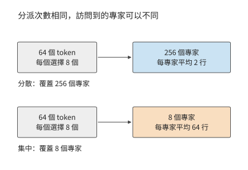

*圖 2-23　64 個 token 各選八個專家，總計 512 次分派。分散時可覆蓋 256 個專家，集中時只訪問八個；每專家處理的行數隨之改變。*

讀取量的差別來自每份權重供多少輸入行使用：均勻分派時每個專家處理兩個 token，集中分派時每個專家處理 64 個 token。同一份權重參與的計算量增至原來的 32 倍，理想權重訪問量便降至原來的三十二分之一。與此同時，原來要執行許多輸入只有兩行的矩陣乘法，現在只需執行少數輸入為 64 行的矩陣乘法；權重複用和計算效率因此都會受到影響。[^source-18]

把各層累加成整模型再來比較：Qwen3.6 在已有 8192 個 token 上下文、$B=1$ 的 decode 中約需 7.33 GFLOPs，小於 Qwen3-8B 的約 20.0 GFLOPs。整個模型的計算量差異來自幾項結構上的變化：2048 維主幹縮小投影，30 個線性層使用遞推狀態，MoE 每次只執行選中的專家及共享分支。專家數量增加使總參數量增大，而每次呼叫的工作量取決於實際執行了哪些運算。

稀疏啟用讓總參數量與每個 token 實際使用的參數量可以分別調整，模型就能用較少的計算訪問較大的參數集合。服務時，路由結果決定每份專家權重供多少 token 複用，例題 2-4 展示的正是這兩種訪問方式的差別。

### 2.4.3 共享專家與潛空間計算

上述差距由專家接收的輸入行數決定。還要考慮專家本身的尺寸：共享專家處理全部輸入，潛空間專家則先縮小輸入維度。兩者都會改變單個專家需要多少權重、執行多少運算。

DeepSeek V4-Flash 每層有 256 個路由專家，每 token 選 6 個，另有 1 個共享專家；路由專家中間維度為 2048。單專家的 gate/up 為 $[t_e,4096]\times [4096,2048]$，down 將寬度從 2048 變回 4096；三個投影合計包含 25,165,824 個參數。前三層採用雜湊路由，後續採用評分路由：雜湊路由按 token 確定專家，評分路由根據當前表示選擇專家。

共享專家處理本次全部 $m$ 個 token 的特徵向量，路由專家 $e$ 只處理分派給它的 $t_e$ 個 token。若共享專家有 $N_s$ 個參數，一層的專家矩陣運算量為 $2mN_s+2\sum_e t_eN_e$。普通單步 decode 中，每條請求輸入一個新 token，此時 $m=B$；prefill 則要累計各請求本次處理的全部 token。DeepSeek V4-Flash 每 token 選擇六個路由專家並執行一個共享專家，運算量正是這兩部分之和；容量則需要儲存全部 256 個路由專家和共享分支。

Kimi K3 每個 MoE 層有 896 個路由專家，每個 token 選擇其中 16 個。輸入先從 7168 維主幹空間投影到 3584 維潛空間，再經過中間維度為 3072 的專家變換，合併後投影回主幹空間。共享專家直接處理主幹表示。降維減少了路由專家的矩陣尺寸，同時增加了進入和離開潛空間的兩次投影。[^source-3]

如果專家分佈在不同的卡上，就要把輸入 token 傳送到專家所在的卡，專家算完後再把結果合併。通訊量因此取決於專家放在哪裡、輸入儲存在哪裡。第 6 章討論多卡劃分，第 9 章介紹 CPU／GPU 放置，以及將注意力（Attention）與 FFN 交給不同資源的 AF 分離。

> **練習 2-6〔延伸〕：專家數量與分派方式如何影響計算和權重讀取**
>
> 對 Qwen3.6 的一層，取 $B=64$、256 個路由專家、每 token 選 8 個。分別考慮均勻分派和集中分派到同一組 8 個專家的情況，寫出各專家接收的 token 數 $t_e$，再計算 FLOPs、被訪問的專家數量與 BF16 權重讀取量。再將專家總數減半、中間維度加倍、每個 token 選中的專家數減半，判斷專家總參數量與實際執行的專家矩陣運算量是否變化。最後說明如何在上述計算中加入共享專家的參數量與運算量；對於採用潛空間專家的模型，再說明如何計入進入和離開潛空間的投影。

## 2.5 網路形狀與計算組織

上下文狀態與專家選擇改變了主要資料集合，網路的深度、寬度和連線方式則進一步決定這些工作使用多大的矩陣、按什麼順序執行。參數量相近的模型也可以有不同的計算圖；矩陣 FLOPs 相近的模型，緩衝區的佔用時間和序列步驟也可能不同。

### 2.5.1 深度、寬度與專家粒度

先忽略詞表和小向量參數。若 FFN 寬度與隱藏維度保持固定比例，稠密主幹的參數量大致正比於 $Ld^2$。把隱藏維度減半、層數增至四倍，可以保持這部分參數量相近，但逐層依賴鏈的長度也增至原來的四倍。每個矩陣更小，但計算要經過更多層；每層還要儲存相應的上下文狀態。層數與寬度由此在相近參數預算下改變了計算粒度和依賴深度。

專家結構也可以作類似調整，同時保持參數量和運算量不變。單層路由專家的總參數為 $3Edf$，單 token 專家運算量為 $6k_{\mathrm{top}}df$。將專家數 $E$ 減半、中間維度 $f$ 加倍、選中數 $k_{\mathrm{top}}$ 減半，這兩個量都不變。Qwen3-235B-A22B 的 128 個寬度 1536 的專家、每 token 選 8 個，可以與 64 個寬度 3072 的專家、每 token 選 4 個作這一對照。路由輸出維度與每專家接收行數仍會改變，從而改變分組矩陣乘法（把多個專家的矩陣乘法組織成一次執行）的形狀。

用算例核對基線與兩個變體。在 16 個 token 的算例中，三種專家粒度的專家矩陣運算量保持相同，基線與 64 專家變體均約為 454 GFLOPs。專家數減半、單專家寬度加倍時，同樣多的權重分成更少的大矩陣；專家數加倍、寬度減半時，則成為更多的小矩陣。路由器要為每個專家計算路由分數，因此其參數也隨專家數變化。[專家粒度計算](../calculations/results/qwen235-granularity-baseline.md)將路由與專家矩陣分別累計，說明專家參數總量相同時，矩陣形狀為何仍會不同。

矩陣和狀態的形狀也決定多卡分工的最小單位。128 個專家可分成八組，每組 16 個；四個 KV 頭按完整頭分工時只能形成四份，八卡執行就需要複製部分 KV 或調整分組。第 5 章從矩陣分塊分析執行效率，第 6 章將進一步把這些矩陣和狀態分配到各張卡。

### 2.5.2 殘差連線與跨層狀態

除了層數和寬度，還要看各層如何連線。殘差連線把子層輸入直接加到變換結果上，讓原始資訊和梯度有一條跨層直通的路徑。普通殘差計算 $x_{\ell+1}=x_\ell+f_\ell(x_\ell)$，其中 $f_\ell$ 是第 $\ell$ 個子層的變換，因此子層計算期間要保留輸入 $x_\ell$，等變換結果產生後才能相加。若後續多個層還會引用同一表示，就必須將它儲存到最後一次使用結束。連線方式由此直接決定哪些張量需要同時儲存。

普通殘差把不同深度的資訊不斷相加到同一條通路中。為了讓層間資訊有更多組合方式，同時保持深層網路中的訊號傳播穩定，DeepSeek V4-Flash 使用 **mHC（Manifold-Constrained Hyper-Connections，流形約束超連線）**。mHC 把一條殘差通路擴充套件成多條，並約束通路之間的混合係數；這裡的「流形約束」，具體是把殘差混合矩陣的元素限制為非負，且各行與各列的和接近 1。[^architecture-motivation]

該模型儲存 4 路殘差狀態，每一路都是當前 token 的一份 4096 維中間表示。保留四路表示，是為了讓後續層學習如何組合不同通路的資訊。每個子層先將四路表示混合為 4096 維子層輸入，執行注意力或 FFN，再把結果寫回殘差通路。因此，主體矩陣保持 4096 維輸入，新增工作集中在進入和離開子層的混合與匯合。四路狀態讓層間可以傳遞更多組表示，混合操作將這些表示與原有子層連線起來。

處理 8192 個輸入 token 時，mHC 的混合投影約需 555 GFLOPs，非矩陣運算約需 149 GFLOPs。殘差混合矩陣先經 **Sinkhorn 迭代**歸一化，即交替將每行、每列除以各自的和，使行和與列和逐漸接近 1；這使多層混合中的數值尺度更穩定。歸一化後的係數再用於組合各條殘差通路；末端匯合這些通路，形成送入詞表頭的表示。因此，多路殘差不僅增加要儲存的表示，還增加每層的混合與歸一化計算。[^source-4]

Kimi K3 希望當前層能夠按需要選取不同深度的資訊，而不只是接收逐層相加後的單一混合結果。為此，Kimi K3 使用 **Attention Residuals（AttnRes，注意力殘差連線）**，對較淺層的表示計算權重，再加權求和，形成當前層的輸入。這種注意力沿網路深度選擇資訊，前面的序列注意力則在不同 token 之間選擇資訊。為減少儲存和讀取所有層輸出的開銷，塊式實現把若干層組織成一塊，保留供後續塊選擇的表示。[^architecture-motivation]

後續層還要使用這些塊表示，本次前向中要繼續儲存，前向結束後即可釋放。上下文 KV 則要保留到後續生成步驟。兩者需要儲存的時間範圍不同：AttnRes 增加一次前向中的臨時儲存，KV 隨請求跨多次呼叫保留。[^source-19]

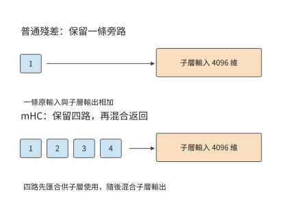

*圖 2-24　普通殘差與四路 mHC 的連線範圍。普通殘差保留一條子層輸入旁路；mHC 匯合多路狀態供子層計算，再混合輸出。兩種圖中的子層輸入均為 4096 維。*

### 2.5.3 多 token 預測與輔助計算

前兩節改變的是主幹內部的形狀與連線；另一類設計在主幹末端附加預測模組，改變一次前向能給出多少個 token。普通自迴歸主幹根據當前上下文預測下一個 token。**多 token 預測（Multi-Token Prediction，MTP）**在此基礎上增加後續多個 token 的預測目標或輔助預測模組。訓練時，這些額外目標促使當前表示包含對更遠後續內容有用的資訊；推理時，輔助模組可以先提出多個候選 token，再由主模型驗證，以減少生成同樣數量 token 所需的序列輪數。

**推測解碼（speculative decoding）**先用較低開銷生成候選序列，再讓目標模型驗證這些候選。用於推測解碼時，MTP 根據當前主幹特徵預先生成後續 token，再交給目標模型驗證。如果多個 token 透過驗證，一輪就能產生多個有效輸出；否則從最後一個透過驗證的位置繼續生成。因此，加速效果取決於草稿生成、目標模型驗證各需多久，以及每輪有多少 token 透過驗證。第 8 章將計算這三者的關係。

以 DeepSeek V4-Flash 為例計算一次輔助預測。其 MTP 輔助塊接收主幹特徵和 token ID，預測後續位置。對單個 token，即 $B=1,P=1$，一次輔助計算約需 1.80 GFLOPs，其中共享詞表頭約需 1.06 GFLOPs。共享詞表頭佔這次計算的一半以上：雖不增加獨立權重，每次呼叫仍要執行詞表投影。[^source-5]

輔助預測使一次前向執行能夠提供多個候選，經驗證和取樣後形成有效輸出。第 3 章將把編碼、生成、迭代及即時輸出組織成完整負載。

設一次普通 decode 耗時為 $T_d$，一輪推測解碼的草稿和驗證合計耗時為 $T_s+T_v$，平均得到 $\bar g$ 個有效輸出。每輸出分攤時間為 $(T_s+T_v)/\bar g$，有收益的條件是

$$
\bar g>\frac{T_s+T_v}{T_d}.
$$

例如，普通 decode 為 20 ms，草稿與驗證合計為 30 ms，平均每輪得到兩個有效輸出時，每輸出分攤 15 ms；若只能得到一個，則需要 30 ms。多預測幾個位置會增加單輪工作量，只有採用的輸出足夠多，才能抵消新增的計算開銷。

## 2.6 整個模型的資源需求與比較

第 2.3 至 2.5 節介紹了三類結構變化：上下文表示決定狀態大小和訪問方式，專家選擇決定每次使用哪些權重，網路深度與連線方式決定計算順序。本節將這些部分合起來，比較完整模型在相同輸入條件下的計算量與儲存需求，再用具體任務檢查模型輸出。

### 2.6.1 各元件的資源需求與全模型彙總

**五種模型的注意力結構與專家配置。** 本章選擇一個稠密基線和四個結構不同的 MoE 模型，用相同的矩陣規則比較其資源需求。表 2-A 中參數量的字尾 T 表示萬億。

**表 2-A　五個模型的總體架構（文字部分）**

| 架構參數                | DeepSeek V4.1 Flash |  Qwen3-8B | Qwen3.6-35B-A3B |  DeepSeek V4-Flash |       Kimi K3 |
| ------------------- | ---: | --------: | --------------: | -----------------: | ------------: |
| 邏輯參數總數，約            | 551.57B＋196.93B Engram |     8.19B |          34.66B |            284.33B |         2.78T |
| 主幹層數 $L$            | 40（20＋20） |        36 |              40 |                 43 |            93 |
| 主幹隱藏維度 $d$          | 5120 |      4096 |            2048 |               4096 |          7168 |
| 注意力組成               | 2 SWA＋38 CSA2 |    36 GQA |   30 線性＋10 全注意力 | 2 視窗＋21 CSA＋20 HCA | 69 KDA＋24 MLA |
| 前饋組成                | 40 層 MoE | 稠密 SwiGLU |        40 層 MoE |           43 層 MoE | 首層稠密＋92 層 MoE |
| 每 MoE 層路由專家數 $E$    | 384 |         — |             256 |                256 |           896 |
| 每 token 選擇數 $k$     | 6 |         — |               8 |                  6 |            16 |
| 路由專家計算寬度 $d_e$      | 5120 |         — |            2048 |               4096 |          3584 |
| 稠密 FFN／路由專家中間寬度 $f$ | 2304 |     12288 |             512 |               2048 |          3072 |
| 共享專家中間寬度            | 2304 |         — |             512 |               2048 |       合計 6144 |
| 跨層連線                | Single-Pass mHC，4 路 |      普通殘差 |            普通殘差 |            mHC，4 路 |       AttnRes |

表中列出五個模型的文字部分。V4.1 Flash 的約 551.57B 主幹參數與 196.93B Engram 參數分別列出；後者包含約 196.61B 查表參數及其投影、門控參數，兩者共同計入後文的完整文字權重。V4.1 的 Single-Pass mHC 是 mHC 的改進：每層沿用上一層算出的輸入混合係數，使殘差狀態只需讀取一遍。Kimi K3 將不同的前饋結構用於不同層：首層是中間維度為 $33792$ 的稠密 FFN，後續層則使用中間維度為 $3072$ 的路由專家。稠密層讓每個 token 經過同一組寬矩陣，MoE 層則讓每個 token 使用多組較窄的專家矩陣。

V4.1 Flash 的執行階段如下：40 層分成 20 層因果編碼器和 20 層解碼器，只有第 2、8、14、20 層儲存獨立全域性 KV，第 2、8、14、20、24、28、32、36 層執行索引器，層號從零開始。Full 層生成快取和索引，Reindex 層重算索引，Reuse 層複用已有選擇；每層仍儲存自己的區域性視窗。因此，層數不再等於獨立全域性快取的份數，輸入長度也不再等於每層實際處理的查詢 token 數。

表中還有三個關係。Qwen3.6 的總參數比 Qwen3-8B 多，主幹寬度卻只有一半：它把大量參數放進可選擇的專家，每個 token 只呼叫其中八個。Qwen3-8B 與 DeepSeek V4-Flash 的主幹同為 4096 維，DeepSeek V4-Flash 透過每層 256 個專家形成更大的參數集合。Kimi K3 又將專家計算移到 3584 維潛空間，使專家輸入不必與主幹採用相同的寬度。這些差異說明，「儲存多大的模型」和「一個 token 做多少工作」需要分別計算。表 2-1、2-2、2-4、2-5、2-6 將逐個展開這五個模型，DeepSeek-V3 的表 2-3 用作 MLA 的歷史參照。

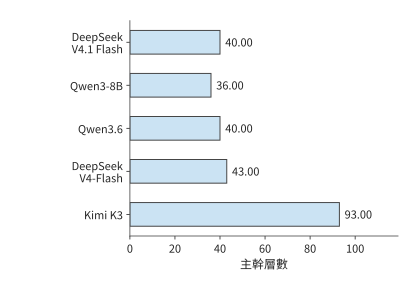

*圖 2-25　五模型的主幹層數，使用同一線性尺度。層數決定同類工作沿網路深度重複多少次。*

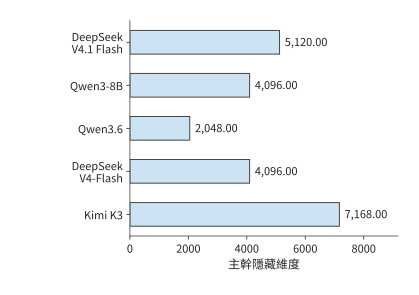

*圖 2-26　同一線性尺度下的主幹隱藏維度。每個 token 的特徵寬度決定投影的輸入或輸出尺寸。*

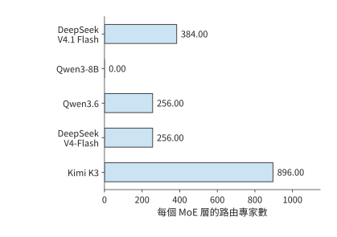

*圖 2-27　每個 MoE 層儲存的路由專家數量。Qwen3-8B 使用稠密前饋層，其路由專家數為零；每個 token 實際選中數見表 2-A。*

有了一類層的參數、一次呼叫的運算和一條請求的狀態，整模型只需把這些項按各類層的實際數量加權求和：

$$
M_W=b_W\sum_gL_gN_g+M_{\mathrm{embedding}}+M_{\mathrm{head}},\qquad
F_{\mathrm{model}}=\sum_gL_gF_g+F_{\mathrm{head}}.
$$

$g$ 表示模型層的類別，同一類層採用相同的注意力、前饋網路與連線結構；$L_g$ 為第 $g$ 類層的數量。MoE 的 $N_g$ 包含全部專家，$F_g$ 則使用各專家實際接收的行數。表 2-1 已建立 Qwen3-8B 的稠密基線；章末查閱表按同樣方式展開 Qwen3.6、DeepSeek-V3、DeepSeek V4-Flash、Kimi K3 和 DeepSeek V4.1 Flash，方便讀者查明總量中的每一項來自哪個矩陣。

閱讀時可以按資料流走一遍：輸入進入哪類注意力層，隨後經過哪類前饋網路，最終如何得到詞表分數；累加時還要加入嵌入查行、末端歸一化和詞表頭。每張表按注意力、前饋與連線、輸出介面分組；「層／呼叫數」給出整模型累計倍數，「矩陣 FLOPs」仍是該行對應操作執行一次的浮點運算量。

將同樣的累加規則用於其他模型，可以逐項列出各模型的計算分支。下表按模型列出要累計的上下文狀態、權重與附加計算，以及合計時最容易遺漏的部分；MTP、DSpark（V4.1 的推測解碼模組）與視覺模組按本次執行範圍單獨加入。

| 模型分支 | 上下文狀態 | 權重與附加計算 | 合計時最容易遺漏的部分 |
| --- | --- | --- | --- |
| DeepSeek V4.1 Flash | 4 份共享全域性 KV／索引＋各層 SWA＋壓縮緩衝與 token 歷史 | CED、CSA2、Engram、專家、Single-Pass mHC | 編碼器全輸入、解碼器末尾重放與全域性投影的不同位置數 |
| Qwen3-8B | GQA KV | 稠密 SwiGLU、輸出頭 | 非矩陣算術、輸出頭位置範圍 |
| Qwen3.6 | 全域性 KV＋遞推與卷積狀態 | 路由／共享專家 | 線性層儲存固定大小的遞推狀態 |
| DeepSeek-V3 | MLA 潛變數或展開 KV，隨執行路徑變化 | 前三層稠密 FFN、後續 MoE 與共享專家 | 上投影執行位置、兩種快取路徑的區別 |
| DeepSeek V4-Flash | 視窗＋壓縮＋索引＋緩衝 | 專家、壓縮器、mHC | 索引掃描、塊邊界更新、共享分支 |
| Kimi K3 | MLA＋KDA＋卷積 | 潛空間專家、AttnRes | 展開路徑、跨層臨時狀態、首層差異 |

先依次比較完整權重、單步計算量和上下文狀態大小，再透過各模型的分項表說明差異分別來自哪些矩陣和狀態。

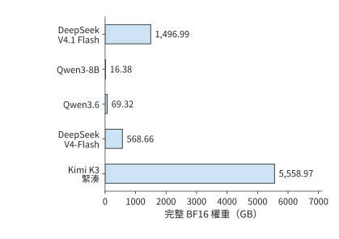

*圖 2-28　五模型完整權重統一用 BF16 表示時的容量，使用同一線性尺度。這裡累計全部參數，包括每次僅選中部分的路由專家。*

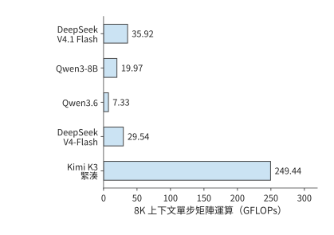

*圖 2-29　相同單請求、已有 8K 上下文時的單步矩陣運算量。按各模型在表 2-C 說明的執行路徑累計，Kimi K3 採用緊湊 MLA。*

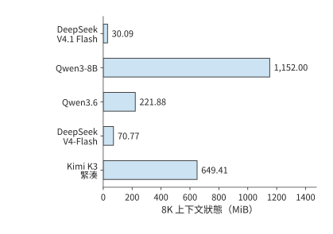

*圖 2-30　相同 8K 上下文下的每請求狀態。上下文表示採用 BF16，遞推矩陣和壓縮緩衝採用相應實現的精度；各項合計為一條請求儲存 8192 個上下文 token 的容量。*

五個模型的逐矩陣展開見本章末的[模型矩陣查閱表](#model-matrix-tables)。下面用分項合計解釋資源差異。

將矩陣尺寸相乘並按層數累計，DeepSeek V4-Flash 主幹約有 2843 億個邏輯參數，統一 BF16 表示約為 568.7 GB。

Kimi K3 文字主幹約有 2.78 萬億個參數，絕大多數位於 92 個 MoE 層的路由專家中。每個 token 在每層只選擇 16 個專家，因此完整模型的儲存容量與單 token 的計算量取決於不同的因素：前者由全部專家決定，後者由選中的專家及共同執行的注意力、共享專家和投影決定。[^source-7]

下面將各模型的參數劃分為互不重疊的六類：嵌入與輸出、注意力投影、稠密或共享 FFN、路由專家、Engram、其餘元件。將各類參數相加即為模型總參數量，再按每個參數 2 位元組換算，就得到圖 2-28 的權重容量。這種分解能直觀展示參數的分佈，也是解釋下一張表的依據。

<!-- MODEL-COMPARISON:START -->

**表 2-B　參數由哪些部分構成（單位：十億個邏輯參數）**

| 模型 | 嵌入與輸出頭 | 注意力投影 | 稠密／共享 FFN | 路由專家 | Engram | 其他 |
| --- | ---: | ---: | ---: | ---: | ---: | ---: |
| DeepSeek V4.1 Flash | 1.324 | 5.126 | 1.416 | 543.582 | 196.929 | 0.118 |
| Qwen3-8B | 1.245 | 1.510 | 5.436 | 0.000 | 0.000 | $<0.001$ |
| Qwen3.6 | 1.017 | 1.283 | 0.126 | 32.212 | 0.000 | 0.022 |
| DeepSeek V4-Flash | 1.059 | 5.085 | 1.082 | 277.025 | 0.000 | 0.081 |
| Kimi K3（緊湊 MLA） | 2.349 | 36.180 | 12.882 | 2722.741 | 0.000 | 5.333 |

其他包含路由器、潛空間進出投影、歸一化、卷積和連線等參數；注意力投影包括 DeepSeek V4-Flash 的壓縮與索引投影。Qwen3-8B 的主要參數集中在處理每個 token 時都要執行的稠密 FFN，Qwen3.6、V4-Flash 和 Kimi K3 則將大部分參數放進路由專家。V4.1 Flash 還儲存了較大的 Engram 表，表中單列它的查表、投影與門控參數；查表參數增加了完整模型容量，卻不意味著每個 token 都要遍歷整個表。Qwen3.6 的路由專家佔約 93%，DeepSeek V4-Flash 與 Kimi K3 約為 97%—98%。因此，三者的總容量主要由專家集合決定，單 token 的專家運算量則取決於每層選中的專家。

**表 2-C　相同輸入條件下的 prefill 計算與選中專家權重**

| 模型 | 8K prefill（TFLOPs） | 單 token 選中路由專家的 BF16 權重（GiB） |
| --- | ---: | ---: |
| DeepSeek V4.1 Flash | 143.95 | 15.820 |
| Qwen3-8B | 133.59 | — |
| Qwen3.6 | 52.09 | 1.875 |
| DeepSeek V4-Flash | 231.13 | 12.094 |
| Kimi K3（緊湊 MLA） | 1863.46 | 90.562 |

兩種呼叫均取 $B=1$，prefill 為 $S=0,P=8192$，decode 為 $S=8192,P=1$，詞表頭均只處理末尾 token；圖 2-29 的單步矩陣運算量按同一組條件累計。圖 2-30 的狀態是儲存 8192 個上下文 token 所需的空間：上下文表示採用 BF16，遞推狀態和壓縮緩衝按相應實現採用 FP32。V4.1 Flash 還計入參考實現的 int64（64 位整數）token 歷史快取，供 Engram 構造跨呼叫 n-gram；生產 FP4 全域性快取與 FP8 視窗的容量見第 2.3.6 節。表中最後一列將一個 token 在各層選中的路由專家權重相加，再按 BF16 換算為位元組數。把這張表與圖 2-28 至圖 2-30 對照，就能分別比較完整模型佔用的空間、一次呼叫的運算量，以及請求上下文佔用的空間。

各模型按自己的執行路徑累計：V4.1 Flash 採用論文 CED＋末尾視窗重放及候選集內索引，Qwen3-8B 為有效因果注意力，Qwen3.6 為逐項執行的矩形注意力實現（eager）與塊式線性分支，DeepSeek V4-Flash 為有效主注意力及參考索引，Kimi K3 為緊湊 MLA 與塊式 KDA。對照圖 2-28 至圖 2-30：Qwen3.6 儲存的權重約為 Qwen3-8B 的四倍，單步矩陣運算量卻更少；DeepSeek V4-Flash 權重繼續擴大，8K 狀態反而因壓縮與選擇縮小；Kimi K3 擁有更多專家，隱藏維度更大、層數也更多，因此需要儲存更多權重，完成更多運算。這些差異說明，總參數量、單次運算量和上下文狀態大小需要根據各自對應的結構分別計算。

**由上下文狀態大小推算單步讀取量。** Qwen3-8B 每步使用 1152 MiB 舊 KV；DeepSeek V4-Flash 按圖 2-30 採用的 BF16 參考格式，主注意力讀取與索引掃描合計 27.625 MiB，並更新壓縮器；換成第 2.3.6 節的生產混合格式則為 12.556 MiB。Kimi K3 緊湊 MLA 使用 216 MiB 上下文狀態，414 MiB 遞推矩陣還要一讀一寫，讀寫量合計 828 MiB；Qwen3.6 對應 160 MiB 全域性注意力的 KV 快取和 120 MiB 遞推矩陣讀寫。遞推狀態每步都要讀出並更新，上下文表示則要供當前查詢使用。因此，即使狀態大小固定，每步也仍有相應的讀寫開銷。

**量化編碼與後設資料共同決定權重容量。** 統一按 BF16 計算時，每個參數佔 2 位元組，權重大小可以直接反映參數量的差異。實際釋出的模型 checkpoint（檢查點 (Checkpoint)，儲存參數的檔案集合）使用各自的儲存格式，DeepSeek V4-Flash 主幹約為 156.02 GB，Kimi K3 文字約為 1559.97 GB。檔案大小由低位寬矩陣、採用較高精度的參數以及格式後設資料共同決定；統一精度反映參數規模，檔案大小則反映這些參數實際佔多少位元組。模型載入後，還需要為格式轉換和計算分配空間。第 5 章將分析儲存格式與執行時實現如何影響視訊記憶體佔用。

比較兩張表時，還要注意 V4.1 Flash 各階段的分工。V4.1 的完整文字權重包含 Engram；prefill 的全部矩陣計算則由編碼器、解碼器全域性 KV 投影、末尾視窗重放和輸出頭共同組成。生成新 token 時，兩部分網路都需要執行，因此不能把 prefill 節省的比例直接用於 decode。

表 2-B 的參陣列成解釋了權重容量，表 2-C 則展示這些參數如何參與一次呼叫。二者結合起來，可以區分「儲存整個模型需要多少空間」與「處理一個 token 要使用多少資源」。[^comparison-data]

<!-- MODEL-COMPARISON:END -->

表 2-C 中 V4.1 Flash 的 8K prefill 只需 143.95 TFLOPs。表 2-D 把這筆計算拆到各執行階段，並與參考全層前向對照。

**表 2-D　V4.1 Flash 的 8K 輸入如何分配到執行階段（TFLOPs）**

| 階段 | 參考全層前向 | CED＋末尾視窗重放 |
| --- | ---: | ---: |
| 20 層編碼器 | 142.139 | 141.727 |
| 解碼器共享全域性 KV 與索引鍵投影 | 0.044 | 0.044 |
| 20 層解碼器的查詢與前饋等計算 | 140.202 | 2.175 |
| 末尾 token 詞表頭 | 0.001 | 0.001 |
| 合計 | 282.386 | 143.947 |

參考路徑執行全部 8192 個 token 的 40 層，並按公開實現先計算矩形索引分數再遮蔽；CED 路徑的編碼器處理全部輸入，解碼器全域性 KV 與索引鍵仍為全部輸入生成，解碼器主體只處理末尾 128 個 token，後續索引限制在候選集合內。表中分別包含各路徑的全部文字矩陣工作，差異同時來自執行位置數與索引演算法。

兩條路徑均包含注意力、路由評分、路由及共享專家、Engram 投影、Single-Pass mHC 投影和詞表頭。把解碼器的全域性投影與查詢計算分開，就能看出 CED 如何縮短長提示經過的計算鏈。[^v41-forward]

**上下文從 8K 增至 1M 時的運算量與狀態增長。** 長文件問答和多輪任務會放大上下文訪問的成本。下面保持單請求、一次新增一個 token 和末尾 token 詞表頭不變。8K 場景有 8192 個歷史 token；1M 場景有 1,048,575 個歷史 token，加上當前查詢正好為 1,048,576 個可見位置。

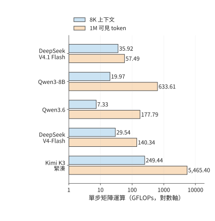

*圖 2-31　8K／1M 上下文下再處理一個 token 的矩陣運算量。沿用表 2-C 的執行路徑，橫軸為對數刻度；1M 包含當前查詢。*

表 2-E 單獨累計當前查詢的注意力評分與值彙總；V4-Flash 與 V4.1 Flash 再加入索引點積。狀態列列出呼叫前的上下文和固定狀態，精度與圖 2-30 一致。Qwen3-8B 與 Qwen3.6 的釋出配置分別支援 40,960 和 262,144 個位置，表中兩者的 1M 行按同一結構外推，用於比較增長規律。[^long-context-data]

**表 2-E　長上下文下的互動運算與狀態容量**

| 模型 | 8K 上下文互動（GFLOPs） | 1M 上下文互動（GFLOPs） | 8K 狀態（GiB） | 1M 狀態（GiB） |
| --- | ---: | ---: | ---: | ---: |
| DeepSeek V4.1 Flash | 3.66 | 25.23 | 0.029 | 3.138 |
| Qwen3-8B | 4.83 | 618.48 | 1.125 | 144.000 |
| Qwen3.6 | 1.34 | 171.80 | 0.217 | 20.060 |
| DeepSeek V4-Flash | 3.00 | 113.80 | 0.069 | 6.735 |
| Kimi K3（緊湊 MLA） | 41.08 | 5257.04 | 0.634 | 27.423 |

V4.1 Flash 的全域性 KV 只有四份獨立來源，增加上下文時不會為所有 40 層各增一份。主注意力每層最多使用 128 個區域性 token 和 512 個全域性條目；解碼器首個 Full 層生成候選集合，後續四個 Reindex 層各掃描至多 16384 個候選條目。編碼器的三個索引器和解碼器首個索引器仍需掃描增長的全域性歷史，因此計算量繼續上升；跨層共享和分層索引改變了增長幅度。1M 下，其上下文互動為 25.23 GFLOPs，完整單步矩陣工作為 57.49 GFLOPs。

V4-Flash 則沿用 CSA 與 HCA 的兩種壓縮粒度：CSA 的主注意力選擇上限保持不變，但索引掃描隨歷史增長；HCA 會讀取全部已完成的粗粒度條目。1M 下，其上下文互動為 113.80 GFLOPs，完整單步矩陣工作為 140.34 GFLOPs。較短上下文時，V4.1 Flash 更大的主幹會增加投影和專家計算；歷史足夠長時，較少的索引器與分層候選選擇才會抵消這部分新增工作。

Kimi K3 的 69 個 KDA 層保持固定遞推狀態，24 個 MLA 層繼續訪問隨上下文增長的歷史。緊湊 MLA 減少了快取容量，卻沒有取消查詢與歷史 token 之間的計算；1M 下，這部分互動達到 5257.04 GFLOPs，整模型達到 5465.40 GFLOPs。評估長上下文設計，應分別檢查儲存了多少狀態、訪問哪些位置，以及為索引和更新狀態增加了多少工作。

統一計算還保留了 200K 場景：V4.1 Flash 的完整單步矩陣工作為 40.21 GFLOPs，V4-Flash 為 50.48 GFLOPs。到 1M 時，兩者的計算量差異進一步擴大，所以正文選用 1M 展示長上下文下的設計價值。

### 2.6.2 參數規模、數值精度與容量約束

把分項計算得到的模型權重和每條請求狀態放進同一張視訊記憶體容量表，就可以判斷一張卡能同時容納多少條請求，以及量化權重能釋放多少空間。

對一張卡，先從總容量中扣除權重、工作區和其他固定預留空間，剩餘空間才能放請求狀態。在請求等長、各自獨立儲存 KV 的簡化情形下，可寫為：

$$
B_{\max}=\left\lfloor\frac{M_{\mathrm{device}}-M_{\mathrm{weight}}-M_{\mathrm{workspace}}}{M_{\mathrm{state/request}}}\right\rfloor
$$

分子是扣除固定駐留資料後可用於請求的空間，分母是每條請求的狀態大小。每增加一條請求，都要為它分配相應的狀態空間；剩餘空間無法容納完整的一份狀態時，就無法再增加請求，因此結果要向下取整。遞推與卷積狀態同樣屬於每請求資料，與 KV 一起計入分母。

以一張 24 GB 視訊記憶體的 RTX 4090 執行 Qwen3-8B BF16 為例，權重佔 $16{,}381{,}470{,}720$ 位元組，工作區預留 2 GiB，每條請求的 8K 上下文佔 1.125 GiB。可容納請求數為

$$
B_{\max}=\left\lfloor\frac{24\times10^9-16{,}381{,}470{,}720-2\times2^{30}}{1.125\times2^{30}}\right\rfloor=4.
$$

上下文變為 16K 時，每條請求佔 2.25 GiB，同一空間只能放兩條；變為 4K 時，則能放九條。請求數按整數跳變，是因為剩餘空間必須容納一條請求的完整狀態，容納一部分並無意義。

保留多少歷史，由此成為既影響應用、也影響系統的決定。應用多保留一段材料，模型就能繼續參考它；服務卻要為每條請求分配更多狀態空間。第 2.3 節的 GQA、MLA 和遞推表示進一步改變了儲存這些資訊的方式。模型結構、上下文組織與並行容量可以放在同一份預算裡比較，再用實際任務測試，確定哪些方案能達到所需的回答質量。

量化能釋放多少空間，以更大的 DeepSeek-R1-Distill-Llama-70B 為例。第 1.2.3 節已給出該模型的 BF16 權重 141.107 GB、8-bit 分組量化權重 73.726 GB，以及一條含 8192 個 token 請求的 2.5 GiB BF16 KV。同一分組方案下，讓嵌入、輸出頭和歸一化等部分繼續使用較高精度，並計入 scale 及打包時尾部填充的空間後，4-bit 方案約為 39.500 GB。

4-bit 方案的 39.500 GB 包括低位寬矩陣、仍採用高精度的參數，以及 scale 與打包開銷，比把所有參數一律按半位元組折算的結果更大。換到一張視訊記憶體 80 GB（十進位制）的 H100 SXM、固定預留 2 GiB 時，8-bit 方案可放 1 條 8K 請求，4-bit 方案可放 14 條。上下文從 8K 增至 32K 時，每請求 KV 增至四倍，4-bit 方案可同時容納的請求數降到 3 條。壓縮權重釋放的空間可以儲存更多請求的上下文，但每條上下文越長，能同時容納的請求就越少。[^source-23]

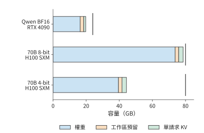

*圖 2-32　權重、固定預留和一條請求 KV 的逐項容量。短豎線標出 RTX 4090 的 24 GB 與 H100 SXM 的 80 GB 容量；KV 採用 BF16、上下文長度 8192，固定預留為 2 GiB。「工作區預留」指執行所需的臨時空間，「單請求 KV」指一條 8192 個 token 的上下文的快取。*

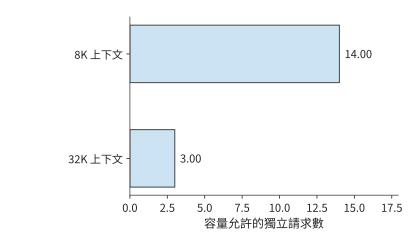

*圖 2-33　70B 的 4-bit 方案在同一張 80 GB 的 H100 SXM 上，上下文長度從 8K 增至 32K 時可同時容納的獨立請求數。每請求狀態增加，使剩餘空間容納的請求數減少。*

同樣方法也能分析更大的部署。235B 的 BF16 權重約 470 GB，超過八張 RTX 4090 合計的 192 GB，而一臺 HGX 伺服器的八張 H100 SXM 合計為 640 GB。後者扣除權重後約剩 170 GB，要容納各請求的狀態、工作區，以及切分到多卡後需要在幾張卡上重複儲存的資料，例如每張卡各存一份的歸一化參數與路由器，以及 4 個 KV 頭分到八張卡時，每個頭在兩張卡上各存一份的 KV。第 6 章將根據模型在各卡上的分工，計算每張卡的這幾項預算。

容量決定一個例項至少需要多少張卡，請求長度與並行數則決定例項要處理多少工作。更低位寬釋放空間，較短上下文允許更多請求同時駐留，批內複用則改變這些請求的執行成本。因此，選擇部署方案時需要依次考慮容量、訪問量與運算量，第 3 章將進一步加入請求的到達與時限。

> **練習 2-7〔核心〕：由視訊記憶體容量決定可容納請求數**
>
> 使用視訊記憶體為 24 GB 的 RTX 4090，工作區預留 2 GiB，Qwen3-8B BF16 權重採用表中的精確值。分別求 4K、8K、16K 上下文下最多可同時容納多少條請求；在 8K 情形下，將工作區預留增至 3 GiB，重新計算。再使用表中的 70B 4-bit 權重 39.500 GB，換成視訊記憶體為 48 GB 的 RTX 6000 Ada、預留仍為 2 GiB，分別求 8K 與 32K 上下文的請求數。先比較權重、工作區與 KV 的容量需求，再用剩餘視訊記憶體計算可容納的請求數。

反過來，給定加速器和服務目標，也可以求留給模型的空間。設每卡可用容量為 $C$，固定預留工作區為 $M_0$，每條請求的 KV 為 $K$，並行為 $B$，每參數佔 $b_W$ 位元組。忽略其他駐留物件，單卡容量給出的參數上界為

$$
N_{\max}=\frac{C-M_0-BK}{b_W}.
$$

先確定服務所需的狀態大小，再計算留給權重的空間。取 RTX 4090 的 24 GB 容量、2 GiB 工作區、4 條各 8192 個 token 的請求，每請求 KV 沿用 Qwen3-8B 的 1.125 GiB。BF16 每參數 2 位元組，剩餘空間最多容納約 85.1 億參數。[^core-calculation] 圖 2-34 先扣除服務狀態，再劃出權重預算。

改變模型結構時，權重預算與狀態預算會一起變化。增加層數或 KV 頭數會增大每請求的 $K$，留給權重的空間隨之減少；跨卡部署則擴大總容量，同時增加通訊。Llama 3 報告中的 405B BF16 推理使用兩臺、共 16 張 H100，其所需容量超出了單臺伺服器能提供的視訊記憶體。[^codesign] 模型規模、狀態結構與卡數因此需要一起選擇。

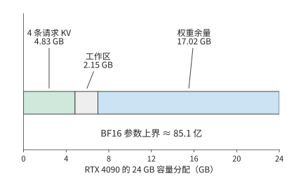

*圖 2-34　從加速器反推權重預算。RTX 4090 的 24 GB 中先為 4 條 8K 請求的 KV 和 2 GiB 工作區預留空間，餘量給出 BF16 參數上界；圖中容量均為十進位制 GB。*

### 2.6.3 不同請求條件下的模型比較

最後把容量、呼叫鏈和任務質量合在一起。先根據每張卡的容量排除容量不足的配置，再沿每個模型的實際計算方式累計請求工作，最後檢查模型能否完成目標任務。

比較完整模型時，可以從兩種輸入出發。固定 $S,P,G,B$，得到相同呼叫長度下的資源需求，便於觀察結構差異；固定文字和任務，則先經各模型的分詞器得到輸入長度，再檢查輸出。這兩種對照分別回答「同樣多的位置如何計算」和「同一個任務需要如何執行」。

先比較相同輸入、輸出長度下的資源需求。取 $S=0,P=128,G=4,B=1$，模型執行一次 prefill 和三次 decode，最終儲存 131 個已處理位置。將這些呼叫的矩陣運算量相加，得到下表。[^source-8]

| 模型 | 完整請求矩陣運算量（TFLOPs） | 本次計算採用的實現方式 |
| --- | ---: | --- |
| DeepSeek V4.1 Flash | 4.14 | CED＋末尾視窗重放，候選集內索引 |
| Qwen3-8B | 1.83 | 有效因果注意力 |
| Qwen3.6 | 0.66 | 矩形全注意力與塊式線性分支 |
| DeepSeek V4-Flash | 3.40 | 有效主注意力與參考索引 |
| Kimi K3（緊湊 MLA） | 27.16 | 緊湊 MLA 與塊式 KDA；decode 採用遞推 KDA |

這張表與表 2-C 保持同一執行路徑，Kimi K3 均使用緊湊 MLA，把上投影移到查詢和彙總一側。V4.1 Flash 的輸入恰好為 128 個 token，全部落在解碼器重放視窗內，因此這次短請求沒有長提示那種跳過大量解碼器位置的收益。完整請求沿同一條選定路徑累計 prefill 與三次 decode，上下文從 128 增到 131；這一路徑的矩陣形狀與狀態表示共同決定各項運算量。

從一次呼叫擴充套件到完整請求之後，輸入和輸出的作用更加清楚。增加 $P$，主要增加一次輸入處理的工作量，以及後續 decode 開始時的上下文長度；增加 $G$，則反覆執行投影、專家與輸出頭，並多次讀取上下文。長輸入、短輸出與短輸入、長輸出由此對各類資源提出不同的需求，第 3 章將分析這兩類請求持續到達時的系統負載。

> **練習 2-8〔延伸〕：字首複用與輸入改寫如何改變模型計算量**
>
> 一輪輸入總長 1443 個 token，其中前 1392 個命中快取，返回 128 個 token。求 $S,P,G,n_d$ 的值、請求結束時的上下文長度，以及本輪新增 KV 的大小。相對於完全重算，複用快取後投影行數與有效因果查詢—鍵配對數分別減少多少？若在第 501 個輸入 token 修改了內容，重新求最長可複用字首與新輸入長度。

再看第二種對照，即固定文字。此時不同分詞器會產生不同的輸入長度。例如，在八道短語檢索題中，Qwen3-8B 與 DeepSeek V4-Flash 都正確找到了目標短語，但短文在 Qwen 中對應 523 或 524 個 token，在 DeepSeek V4-Flash 中對應 501 個；較長文字分別對應 2121 或 2122 個和 2036 個。使用相同文字可以保持任務內容一致，模型各自的 token 數則決定了實際輸入形狀。

因此，比較模型需要同時回答兩個問題：能否完成同一任務，以及完成任務需要多少資源。先按相同標準判斷答案，再將各自的輸入長度代入模型表，才能把結構差異與實際用途聯絡起來。[^source-9]

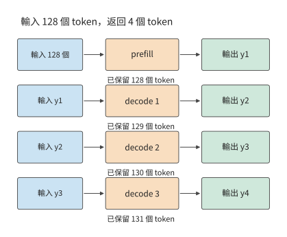

*圖 2-35　生成四個輸出的呼叫順序。prefill 處理 128 個輸入併產生首輸出，隨後三次 decode 各將前一輸出送回模型；最終保留 131 個 token。*

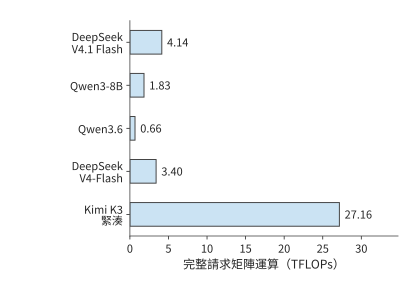

*圖 2-36　輸入 128 個 token、輸出四個 token 時，各模型處理同一請求所需的矩陣運算量。模型執行範圍與快取路徑見本節題設；這是逐呼叫累計的計算量。*

> **練習 2-9〔延伸〕：根據容量、計算需求與任務質量選擇模型**
>
> 使用圖 2-28 至圖 2-30 與表 2-C，為每個模型分別列出完整權重、8K 狀態、單步 decode 與 8K prefill 的需求。部署在視訊記憶體為 80 GB 的單張 H100 SXM 上，預留 2 GiB 工作區，並採用 BF16 權重。先判斷哪些模型能完整放入單卡；再把問題改為多卡部署，說明還需從後續章節獲得哪些時間與通訊參數。將輸出 token 數 $G$ 改為 1，重新計算 prefill 與 decode 的呼叫次數。最後為一個短語檢索任務寫出質量標準，說明同 token 數比較與同文字比較分別回答什麼問題。

本章從計算圖出發，逐步算出了完整請求的資源需求。注意力決定如何儲存和訪問上下文，MoE 決定每次選擇哪些權重，網路深度與連線方式決定計算順序和臨時儲存。下一章將加入請求長度分佈、到達時間、工具呼叫、訓練與強化學習（RL），分析這些計算如何隨時間累積成系統負載。

## 謬誤與陷阱

**誤區：參數更多，每個 token 的計算量就一定更大。** 總參數決定完整模型的容量；MoE 的選中專家、注意力機制的型別和呼叫形狀決定當前工作。對照表 2-A、表 2-B 與圖 2-29，分別解釋參數量和計算量由哪些因素決定。

**誤區：KV 容量降至四分之一，注意力計算量也會同比下降。** GQA 共享上下文表示，查詢頭仍分別評分；MLA 改變上下文寬度，也改變上投影的執行位置。先找被改變的矩陣與狀態，再計算其餘工作。

**誤區：狀態大小固定，訪問開銷就可以忽略。** 固定遞推矩陣仍需更新；prefill 還可能產生臨時塊狀態。容量、累計訪問與峰值工作區分別回答不同問題。

**誤區：輸入 token 數相同，就能公平比較模型能力。** 輸入和輸出的 token 數適合比較資源結構；同文字任務還需固定評分、質量與執行條件，並允許不同分詞器產生不同長度。

## 本章練習與復現

練習 2-2、2-5、2-7 為核心；其餘練習用於分析特殊情況，並將方法應用於其他模型。先獨立完成預測與推導，再用配套計算核對。計算命令在倉庫根目錄執行，完整變體參見[第 2 章擴寫資料](../archive/outlines/extensions/02-模型架構.md)。

| 對應內容 | 本地復算入口 |
| --- | --- |
| 序列依賴與快取等價性 | `python3 calculations/calc.py sequence-dependencies --format md` |
| Qwen3.6 前向與專家 | `python3 calculations/calc.py qwen36-forward --format md` |
| DeepSeek V4.1 Flash 完整矩陣計算 | `python3 calculations/calc.py v41-forward --tokens 8192 --execution ced --format md` |
| DeepSeek V4.1 Flash 參考全層路徑 | `python3 calculations/calc.py v41-forward --tokens 8192 --execution reference --format md` |
| 五模型比較與完整請求 | `python3 calculations/reproduce_ch02.py` |
| DeepSeek V4-Flash 狀態分解 | `python3 calculations/calc.py state --model deepseek-v4-flash --length 8192` |
| Kimi K3 狀態與塊式執行 | `python3 calculations/calc.py k3-kda-chunk --tokens 8192` |
| 專家粒度 | `python3 calculations/calc.py qwen235-expert-granularity --format md` |
| 單次 MTP | `python3 calculations/calc.py v4-mtp-forward --format md` |
| 已知軌跡欄位代入 | `python3 calculations/calc.py trace-resource-bridge --format md` |
| 五模型請求比較 | `python3 calculations/calc.py request-model-comparison --format md` |

本章配圖、計算資料與重建方法見[配圖目錄](ch02/README.md)。章末資料介紹了各模型的結構與設計。

## 模型矩陣查閱表

這組表用於從整模型合計追溯到具體矩陣。查閱時先確定模型與執行分支，再用單次矩陣 FLOPs 乘層數；路由專家還要按實際接收的輸入行數累計。表 2-1 的 Qwen3-8B 基線見第 2.1.4 節。

**表 2-2　Qwen3.6-35B-A3B：混合注意力與 MoE 各模組的資源消耗計算**

主幹共 40 層：10 層選完整注意力分支，30 層選線性注意力分支；兩類層隨後都執行 MoE。每 token 從 256 個路由專家中選 8 個，另有一個共享專家。線性分支的 QKV 輸出拆為 2048、2048、4096 維；其 $Q$、$K$ 會按值頭的分組關係複用。

**模型入口**

| 模組及作用 | 輸入 → 輸出（行數 × 寬度） | 權重矩陣（輸入寬 × 輸出寬） | 矩陣 FLOPs | 層／呼叫數 |
| --- | --- | --- | --- | ---: |
| 詞嵌入查行 | $m$ 個 ID → $m\times2048$ | 查表 $248320\times2048$ | 0；查行訪問另計 | 1 |

**完整注意力分支**

| 模組及作用 | 輸入 → 輸出（行數 × 寬度） | 權重矩陣（輸入寬 × 輸出寬） | 矩陣 FLOPs | 層／呼叫數 |
| --- | --- | --- | --- | ---: |
| 完整注意力：$Q$ 與輸出門控 | $m\times2048\to m\times8192$ | $2048\times8192$ | $2\times m\times2048\times8192$  | 10 |
| 完整注意力：$K$、$V$ | $m\times2048\to m\times512$ | $2048\times512$，共 2 個 | $2\times 2\times m\times2048\times512$  | 10 |
| 完整注意力：上下文互動 | $16$ 個 $Q$ 頭、$2$ 個 KV 頭，頭寬 $256$ | 無新增權重 | $4\times16\times256\times N_{\mathrm{pair}}$  | 10 |
| 完整注意力：輸出投影 | $m\times4096\to m\times2048$ | $4096\times2048$ | $2\times m\times4096\times2048$  | 10 |

**線性注意力分支**

| 模組及作用 | 輸入 → 輸出（行數 × 寬度） | 權重矩陣（輸入寬 × 輸出寬） | 矩陣 FLOPs | 層／呼叫數 |
| --- | --- | --- | --- | ---: |
| 線性注意力：QKV 聯合投影 | $m\times2048\to m\times8192$ | $2048\times8192$ | $2\times m\times2048\times8192$  | 30 |
| 線性注意力：輸出門控 $z$ | $m\times2048\to m\times4096$ | $2048\times4096$ | $2\times m\times2048\times4096$  | 30 |
| 線性注意力：$a$、$b$ 控制量 | $m\times2048\to m\times32$ | $2048\times32$，共 2 個 | $2\times 2\times m\times2048\times32$  | 30 |
| 線性注意力：卷積與 delta 遞推 | $Q,K$ 各 $16\times128$；$V$ 為 $32\times128$ | 卷積：8192 通道、核寬 4 | 遞推為 $O(m\times32\times128^2)$；塊式演算法另計  | 30 |
| 線性注意力：輸出投影 | $m\times4096\to m\times2048$ | $4096\times2048$ | $2\times m\times4096\times2048$  | 30 |

**各層共同的專家分支**

| 模組及作用 | 輸入 → 輸出（行數 × 寬度） | 權重矩陣（輸入寬 × 輸出寬） | 矩陣 FLOPs | 層／呼叫數 |
| --- | --- | --- | --- | ---: |
| 每層：路由評分 | $m\times2048\to m\times256$ | $2048\times256$ | $2\times m\times2048\times256$  | 40 |
| 路由專家 $e$：在選中分支變換 | $t_e\times2048\to t_e\times512\to t_e\times2048$ | $2048\times512$ 兩個；$512\times2048$ 一個 | $6\times t_e\times2048\times512$  | 40 |
| 共享專家：所有 token 的共同變換 | $m\times2048\to m\times512\to m\times2048$ | $2048\times512$ 兩個；$512\times2048$ 一個 | $6\times m\times2048\times512$  | 40 |
| 共享專家門控 | $m\times2048\to m\times1$ | $2048\times1$ | $2\times m\times2048\times1$  | 40 |

**輸出介面**

| 模組及作用 | 輸入 → 輸出（行數 × 寬度） | 權重矩陣（輸入寬 × 輸出寬） | 矩陣 FLOPs | 層／呼叫數 |
| --- | --- | --- | --- | ---: |
| 詞表頭（末端一次） | $m_{\mathrm{out}}\times2048\to m_{\mathrm{out}}\times248320$ | $2048\times248320$ | $2\times m_{\mathrm{out}}\times2048\times248320$  | 1 |

累計時，用各行公式乘最後一列的層數；路由專家部分還需對各專家實際接收的行數 $t_e$ 求和。末端歸一化執行一次，層內歸一化、啟用、位置處理和狀態更新沿相應分支執行。

讀這張表時，先根據這一層使用線性注意力還是完整注意力，選擇對應的一組表格行，再加 MoE 的共同部分。線性注意力決定上下文如何儲存，MoE 決定當前 token 使用哪些權重；兩種機制可以同時存在。A3B 描述名義啟用規模，全部專家仍共同構成常駐模型。[^source-20]

**表 2-3　DeepSeek-V3：MLA 與稠密／專家前饋網路**

DeepSeek-V3 共 61 層，前三層使用稠密 FFN，後 58 層每 token 選擇 8 個路由專家並執行一個共享專家。下面按展開路徑計算 MLA：每個 token 的潛變數經上投影形成各頭的 $K$、$V$，64 維位置表示與 $K$ 拼接。查詢與鍵共同參與位置相關的評分，$V$ 則用於彙總內容。

**模型入口**

| 模組及作用 | 輸入 → 輸出（行數 × 寬度） | 權重矩陣（輸入寬 × 輸出寬） | 矩陣 FLOPs | 層／呼叫數 |
| --- | --- | --- | --- | ---: |
| 詞嵌入查行 | $m$ 個 ID → $m\times7168$ | 查表 $129280\times7168$ | 0；查行訪問另計 | 1 |

**MLA 注意力**

| 模組及作用 | 輸入 → 輸出（行數 × 寬度） | 權重矩陣（輸入寬 × 輸出寬） | 矩陣 FLOPs | 層／呼叫數 |
| --- | --- | --- | --- | ---: |
| 查詢下投影：形成低秩查詢 | $m\times7168\to m\times1536$ | $7168\times1536$ | $2\times m\times7168\times1536$  | 61 |
| 查詢上投影：展開 128 個頭 | $m\times1536\to m\times24576$ | $1536\times24576$ | $2\times m\times1536\times24576$  | 61 |
| KV 下投影：512 維潛變數及 64 維位置分支 | $m\times7168\to m\times576$ | $7168\times576$ | $2\times m\times7168\times576$  | 61 |
| KV 上投影：展開每頭 $K$、$V$ | $m\times512\to m\times32768$ | $512\times32768$ | $2\times m\times512\times32768$  | 61 |
| 展開 MLA：評分與值彙總 | $128$ 頭；Q/K 寬 $192$，$V$ 寬 $128$ | 無新增權重 | $2\times128\times(192+128)N_{\mathrm{pair}}$  | 61 |
| 注意力輸出投影 | $m\times16384\to m\times7168$ | $16384\times7168$ | $2\times m\times16384\times7168$  | 61 |

**前饋分支**

| 模組及作用 | 輸入 → 輸出（行數 × 寬度） | 權重矩陣（輸入寬 × 輸出寬） | 矩陣 FLOPs | 層／呼叫數 |
| --- | --- | --- | --- | ---: |
| 前三層：稠密前饋網路 | $m\times7168\to m\times18432\to m\times7168$ | $7168\times18432$ 兩個；$18432\times7168$ 一個 | $6\times m\times7168\times18432$  | 3 |
| 後 58 層：路由評分 | $m\times7168\to m\times256$ | $7168\times256$ | $2\times m\times7168\times256$  | 58 |
| 路由專家 $e$ | $t_e\times7168\to t_e\times2048\to t_e\times7168$ | $7168\times2048$ 兩個；$2048\times7168$ 一個 | $6\times t_e\times7168\times2048$  | 58 |
| 共享專家 | $m\times7168\to m\times2048\to m\times7168$ | $7168\times2048$ 兩個；$2048\times7168$ 一個 | $6\times m\times7168\times2048$  | 58 |

**輸出介面**

| 模組及作用 | 輸入 → 輸出（行數 × 寬度） | 權重矩陣（輸入寬 × 輸出寬） | 矩陣 FLOPs | 層／呼叫數 |
| --- | --- | --- | --- | ---: |
| 詞表頭（末端一次） | $m_{\mathrm{out}}\times7168\to m_{\mathrm{out}}\times129280$ | $7168\times129280$ | $2\times m_{\mathrm{out}}\times7168\times129280$  | 1 |

累計時，用各行公式乘最後一列的層數；路由專家部分還需對各專家實際接收的行數 $t_e$ 求和。末端歸一化執行一次，層內歸一化、啟用、位置處理和狀態更新沿相應分支執行。

V3 將兩種節省資源的方法組合起來：MLA 用低秩潛變數表示上下文，MoE 讓一個 token 只執行部分專家。DeepSeek V4-Flash 進一步改變上下文的組織方式，用視窗儲存近期位置，再用不同壓縮比例儲存長期上下文。下面的模組表將這幾類上下文分別展開。[^source-6]

**表 2-4　DeepSeek V4-Flash：選擇性上下文訪問與專家計算**

43 層包含 2 個純視窗層、21 個 CSA 層和 20 個 HCA 層；每 token 選 6 個路由專家，另有一個共享專家。$A$ 是該層跨全部請求的主注意力有效查詢—鍵配對數，$I$ 是索引實際掃描的查詢—鍵配對數，兩者均不含頭數。分組輸出投影的八組處理八份不同切片。CSA 的壓縮投影先產生包含重疊分支的 1024／256 維表示，再分別形成 512 維的主注意力上下文表示和 128 維的索引條目。

**模型入口**

| 模組及作用 | 輸入 → 輸出（行數 × 寬度） | 權重矩陣（輸入寬 × 輸出寬） | 矩陣 FLOPs | 層／呼叫數 |
| --- | --- | --- | --- | ---: |
| 詞嵌入查行 | $m$ 個 ID → $m\times4096$ | 查表 $129280\times4096$ | 0；查行訪問另計 | 1 |

**所有層的注意力投影**

| 模組及作用 | 輸入 → 輸出（行數 × 寬度） | 權重矩陣（輸入寬 × 輸出寬） | 矩陣 FLOPs | 層／呼叫數 |
| --- | --- | --- | --- | ---: |
| 所有層：查詢下投影 | $m\times4096\to m\times1024$ | $4096\times1024$ | $2\times m\times4096\times1024$  | 43 |
| 所有層：查詢上投影 | $m\times1024\to m\times32768$ | $1024\times32768$ | $2\times m\times1024\times32768$  | 43 |
| 所有層：共享 KV | $m\times4096\to m\times512$ | $4096\times512$ | $2\times m\times4096\times512$  | 43 |
| 主注意力：視窗及所選壓縮上下文 | $64$ 頭，每頭 $512$ 維 | 無新增權重 | $4\times64\times512\times A$  | 43 |
| 所有層：分組輸出低秩投影 | $m\times4096\to m\times1024$ | $4096\times1024$，共 8 個 | $8\times 2\times m\times4096\times1024$  | 43 |
| 所有層：拼接後輸出投影 | $m\times8192\to m\times4096$ | $8192\times4096$ | $2\times m\times8192\times4096$  | 43 |

**CSA 專有工作**

| 模組及作用 | 輸入 → 輸出（行數 × 寬度） | 權重矩陣（輸入寬 × 輸出寬） | 矩陣 FLOPs | 層／呼叫數 |
| --- | --- | --- | --- | ---: |
| CSA：主注意力的上下文壓縮與門控 | $m\times4096\to m\times1024$ | $4096\times1024$，共 2 個 | $2\times 2\times m\times4096\times1024$  | 21 |
| CSA：索引查詢 | $m\times1024\to m\times8192$ | $1024\times8192$ | $2\times m\times1024\times8192$  | 21 |
| CSA：索引頭權重 | $m\times4096\to m\times64$ | $4096\times64$ | $2\times m\times4096\times64$  | 21 |
| CSA：索引壓縮內容及門控 | $m\times4096\to m\times256$ | $4096\times256$，共 2 個 | $2\times 2\times m\times4096\times256$  | 21 |
| CSA：索引掃描及選擇 | $64$ 個索引頭，每頭 $128$ 維 | 無新增權重 | 點積 $2\times64\times128\times I$；加權與 top-k 另計  | 21 |

**HCA 專有工作**

| 模組及作用 | 輸入 → 輸出（行數 × 寬度） | 權重矩陣（輸入寬 × 輸出寬） | 矩陣 FLOPs | 層／呼叫數 |
| --- | --- | --- | --- | ---: |
| HCA：主注意力的上下文壓縮與門控 | $m\times4096\to m\times512$ | $4096\times512$，共 2 個 | $2\times 2\times m\times4096\times512$  | 20 |

**各層專家與連線**

| 模組及作用 | 輸入 → 輸出（行數 × 寬度） | 權重矩陣（輸入寬 × 輸出寬） | 矩陣 FLOPs | 層／呼叫數 |
| --- | --- | --- | --- | ---: |
| 路由評分 | $m\times4096\to m\times256$ | $4096\times256$ | $2\times m\times4096\times256$  | 43 |
| 路由專家 $e$ | $t_e\times4096\to t_e\times2048\to t_e\times4096$ | $4096\times2048$ 兩個；$2048\times4096$ 一個 | $6\times t_e\times4096\times2048$  | 43 |
| 共享專家 | $m\times4096\to m\times2048\to m\times4096$ | $4096\times2048$ 兩個；$2048\times4096$ 一個 | $6\times m\times4096\times2048$  | 43 |
| mHC：殘差匯合與混合 | $m\times4\times4096\leftrightarrow m\times4096$ | 混合投影與歸一化參數 | 混合矩陣、純量與特殊函式獨立累計  | 43 |

**輸出介面**

| 模組及作用 | 輸入 → 輸出（行數 × 寬度） | 權重矩陣（輸入寬 × 輸出寬） | 矩陣 FLOPs | 層／呼叫數 |
| --- | --- | --- | --- | ---: |
| 詞表頭（末端一次） | $m_{\mathrm{out}}\times4096\to m_{\mathrm{out}}\times129280$ | $4096\times129280$ | $2\times m_{\mathrm{out}}\times4096\times129280$  | 1 |

累計時，用各行公式乘最後一列的層數；路由專家部分還需對各專家實際接收的行數 $t_e$ 求和。末端歸一化執行一次，層內歸一化、啟用、位置處理和狀態更新沿相應分支執行。

這張表說明，「每步只選少量上下文」不等於總工作量固定：主注意力使用 $A$，索引掃描使用 $I$，壓縮投影則對新輸入持續執行。這三類工作量的增長規律不同。[^source-21]

**表 2-5　Kimi K3：KDA、緊湊 MLA 與潛空間專家**

93 層包含 69 個 KDA 層、24 個 MLA 層；首層使用稠密 FFN，其餘層從 896 個路由專家中選 16 個，並執行合計寬度 $2\times3072=6144$ 的共享分支。表內 MLA 採用直接對潛變數計算注意力的緊湊路徑，96 路小投影分別使用每頭參數。共享專家直接處理 7168 維主幹向量，路由專家才進入 3584 維潛空間。

**模型入口**

| 模組及作用 | 輸入 → 輸出（行數 × 寬度） | 權重矩陣（輸入寬 × 輸出寬） | 矩陣 FLOPs | 層／呼叫數 |
| --- | --- | --- | --- | ---: |
| 詞嵌入查行 | $m$ 個 ID → $m\times7168$ | 查表 $163840\times7168$ | 0；查行訪問另計 | 1 |

**KDA 分支**

| 模組及作用 | 輸入 → 輸出（行數 × 寬度） | 權重矩陣（輸入寬 × 輸出寬） | 矩陣 FLOPs | 層／呼叫數 |
| --- | --- | --- | --- | ---: |
| KDA：$Q$、$K$、$V$ | $m\times7168\to m\times12288$ | $7168\times12288$，共 3 個 | $3\times 2\times m\times7168\times12288$  | 69 |
| KDA：衰減低秩投影 $a$ | $m\times7168\to m\times128$ | $7168\times128$ | $2\times m\times7168\times128$  | 69 |
| KDA：衰減低秩投影 $b$ | $m\times128\to m\times12288$ | $128\times12288$ | $2\times m\times128\times12288$  | 69 |
| KDA：更新門控 | $m\times7168\to m\times96$ | $7168\times96$ | $2\times m\times7168\times96$  | 69 |
| KDA：輸出門控 | $m\times7168\to m\times12288$ | $7168\times12288$ | $2\times m\times7168\times12288$  | 69 |
| KDA：有限狀態更新 | $96$ 個 $128\times128$ 狀態矩陣 | 短卷積及衰減參數 | 遞推 $O(m\times96\times128^2)$；塊式實現另計  | 69 |
| KDA：輸出投影 | $m\times12288\to m\times7168$ | $12288\times7168$ | $2\times m\times12288\times7168$  | 69 |

**MLA 分支**

| 模組及作用           | 輸入 → 輸出（行數 × 寬度）              | 權重矩陣（輸入寬 × 輸出寬）       | 矩陣 FLOPs                                    | 層／呼叫數 |
| --------------- | ----------------------------- | --------------------- | ------------------------------------------- | ----: |
| MLA：查詢下投影       | $m\times7168\to m\times1536$  | $7168\times1536$      | $2\times m\times7168\times1536$             |    24 |
| MLA：查詢上投影       | $m\times1536\to m\times18432$ | $1536\times18432$     | $2\times m\times1536\times18432$            |    24 |
| MLA：潛變數及額外分支    | $m\times7168\to m\times576$   | $7168\times576$       | $2\times m\times7168\times576$              |    24 |
| MLA：將鍵的上投影與查詢變換合併 | $m\times128\to m\times512$    | $128\times512$，共 96 個 | $96\times 2\times m\times128\times512$      |    24 |
| 緊湊 MLA：潛空間評分與彙總 | $96$ 頭；評分寬 $576$，彙總寬 $512$    | 使用緊湊的上下文表示                | $2\times96\times(576+512)N_{\mathrm{pair}}$ |    24 |
| MLA：彙總後恢復值表示    | $m\times512\to m\times128$    | $512\times128$，共 96 個 | $96\times 2\times m\times512\times128$      |    24 |
| MLA：輸出門控        | $m\times7168\to m\times12288$ | $7168\times12288$     | $2\times m\times7168\times12288$            |    24 |
| MLA：輸出投影        | $m\times12288\to m\times7168$ | $12288\times7168$     | $2\times m\times12288\times7168$            |    24 |

**前饋與專家分支**

| 模組及作用          | 輸入 → 輸出（行數 × 寬度）                                  | 權重矩陣（輸入寬 × 輸出寬）                           | 矩陣 FLOPs                          | 層／呼叫數 |
| -------------- | ------------------------------------------------- | ----------------------------------------- | --------------------------------- | ----: |
| 首層：稠密前饋網路      | $m\times7168\to m\times33792\to m\times7168$      | $7168\times33792$ 兩個；$33792\times7168$ 一個 | $6\times m\times7168\times33792$  |     1 |
| 其餘層：路由評分       | $m\times7168\to m\times896$                       | $7168\times896$                           | $2\times m\times7168\times896$    |    92 |
| 進入專家潛空間        | $m\times7168\to m\times3584$                      | $7168\times3584$                          | $2\times m\times7168\times3584$   |    92 |
| 路由專家 $e$：潛空間變換 | $t_e\times3584\to t_e\times3072\to t_e\times3584$ | $3584\times3072$ 兩個；$3072\times3584$ 一個   | $6\times t_e\times3584\times3072$ |    92 |
| 合併後離開潛空間       | $m\times3584\to m\times7168$                      | $3584\times7168$                          | $2\times m\times3584\times7168$   |    92 |
| 共享專家：兩個專家寬度合併  | $m\times7168\to m\times6144\to m\times7168$       | $7168\times6144$ 兩個；$6144\times7168$ 一個   | $6\times m\times7168\times6144$   |    92 |

**深度連線**

| 模組及作用 | 輸入 → 輸出（行數 × 寬度） | 權重矩陣（輸入寬 × 輸出寬） | 矩陣 FLOPs | 層／呼叫數 |
| --- | --- | --- | --- | ---: |
| AttnRes：深度方向混合 | 可供選擇的塊表示 → 當前主幹表示 | 深度混合參數 | 按每層參與混合的塊數計，不作為上下文 KV  | 按參與混合的塊數累計 |

**輸出介面**

| 模組及作用 | 輸入 → 輸出（行數 × 寬度） | 權重矩陣（輸入寬 × 輸出寬） | 矩陣 FLOPs | 層／呼叫數 |
| --- | --- | --- | --- | ---: |
| 詞表頭（末端一次） | $m_{\mathrm{out}}\times7168\to m_{\mathrm{out}}\times163840$ | $7168\times163840$ | $2\times m_{\mathrm{out}}\times7168\times163840$  | 1 |

累計時，用各行公式乘最後一列的層數；路由專家部分還需對各專家實際接收的行數 $t_e$ 求和。末端歸一化執行一次，層內歸一化、啟用、位置處理和狀態更新沿相應分支執行。

閱讀 Kimi K3 的表時，需要分別看注意力和前饋網路的層數：69 層採用 KDA，24 層採用 MLA；第一層採用稠密 FFN，後 92 層採用潛空間 MoE。共享專家保持 7168 維主幹輸入，路由專家先經過降維投影，處理 3584 維輸入。表中的層數、寬度與 $t_e$ 因而分別控制重複次數、單次尺寸與實際呼叫量。[^source-22]

**表 2-6　DeepSeek V4.1 Flash：CED、共享上下文與 Engram**

本表覆蓋普通文字生成的全部矩陣投影。輸入行數 $m_l$ 表示第 $l$ 層本次處理的查詢 token 數；$u_l$ 表示需要生成全域性 KV 的位置數，$n_{\mathrm{cmp},l}$ 表示本次新完成的壓縮條目數。參考全層 prefill 中 $m_l=P$；CED 中編碼器 $m_l=P$、解碼器 $m_l=\min(P,128)$，但解碼器全域性 KV 來源層仍有 $u_{20}=P$。所有行數還需乘請求數 $B$。

| 模組及作用 | 權重矩陣（輸入寬 × 輸出寬） | 執行行數 | 層／呼叫數 |
| --- | --- | --- | ---: |
| 注意力 Single-Pass mHC 投影 | $20480\times24$ | $m_l$ | 40 |
| FFN Single-Pass mHC 投影 | $20480\times24$ | $m_l$ | 40 |
| 查詢下投影 | $5120\times1280$ | $m_l$ | 40 |
| 查詢上投影 | $1280\times32768$ | $m_l$ | 40 |
| 區域性 SWA KV 投影 | $5120\times512$ | $m_l$ | 40 |
| 分組輸出投影 | $4096\times1024$，共 8 組 | $m_l$ | 40 |
| 輸出拼接投影 | $8192\times5120$ | $m_l$ | 40 |
| 路由評分 | $5120\times384$ | $m_l$ | 40 |
| 共享專家 gate | $5120\times2304$ | $m_l$ | 40 |
| 共享專家 up | $5120\times2304$ | $m_l$ | 40 |
| 共享專家 down | $2304\times5120$ | $m_l$ | 40 |
| 路由專家 gate | $5120\times2304$ | $\sum_e t_e=6m_l$ | 40 |
| 路由專家 up | $5120\times2304$ | $\sum_e t_e=6m_l$ | 40 |
| 路由專家 down | $2304\times5120$ | $\sum_e t_e=6m_l$ | 40 |
| Engram 查詢結果的 KV 投影 | $6144\times25600$ | $m_l$ | 2 |
| 全域性 KV 投影 | $5120\times512$ | $u_l$ | 4 |
| 2:1 壓縮門控 | $5120\times512$ | $u_l$ | 3 |
| 全域性索引鍵投影 | $512\times128$ | $n_{\mathrm{cmp},l}$ | 4 |
| 索引查詢投影 | $1280\times4096$ | $m_l$ | 8 |
| 索引頭權重投影 | $5120\times32$ | $m_l$ | 8 |
| 末尾 token 詞表頭 | $5120\times129280$ | 末尾 token 一次 | 1 |

每個二維投影的矩陣運算量為輸入行數乘輸入寬、輸出寬，再乘 2；分組輸出投影只在各組內部運算，不能把組間不存在的連線計入。路由專家的三行按各專家接收的行數相加，共享專家處理全部查詢 token 位置。

注意力互動沒有新增權重：每個查詢有 64 個頭、每頭 512 維，QK 與 PV 共同按實際訪問位置累計。索引器有 32 個頭、每頭 128 維，Full、Reindex、Reuse 的掃描範圍和是否執行索引各不相同。壓縮器僅在相應塊完成後產生索引鍵，不能把鍵投影的行數寫成每次輸入的位置數。

Engram 首先從 n-gram 對應的 24 個桶各取一個 256 維向量，拼成 6144 維輸入，再經表中的投影形成四路鍵和一個共享值；歸一化點積與門控將其寫入四路殘差。查表不計作矩陣乘法，讀取載荷、門控和加權歸約分別列在計算記錄中。查表地址只由 token 序列決定，與啟用無關，因此可以在該層執行之前預取，第 6.7.4 節比較表放在主機記憶體、HBM 或 ROM 的代價。最後的 mHC 加權匯合與 RMSNorm（均方根歸一化）不引入另一份詞表權重。[^v41-forward]

[^comparison-data]: [五模型比較資料](ch02/model-comparison.json)；[表格生成程式](ch02/compare_models.py)；[五模型統一計算](../calculations/src/infra_calc/topics/chapter2_models.py)；[Qwen3.6 末尾 token 輸出頭計算](../calculations/results/qwen36-prefill-last-head.md)。

[^source-1]: [Qwen3-8B 配置與參數計算](../calculations/results/qwen3-8b-prefill-8192.md)，參數總數為 $8{,}190{,}735{,}360$。

[^source-2]: [Kimi K3 MLA 展開計算](../calculations/results/k3-mla-expanded-b1-t8192-s0.md)。

[^source-3]: [Kimi K3 專家計算](../calculations/results/experts-kimi-k3-b64-balanced.md)。

[^source-4]: [mHC 運算量](../calculations/results/hc-deepseek-v4-flash-b1-t8192.md)。

[^source-5]: [DeepSeek V4-Flash MTP 計算](../calculations/results/v4-mtp-first-call.md)。

[^source-6]: [V3 前向計算](../calculations/results/v3-forward-prefill.md)。

[^source-7]: [Kimi K3 模型配置說明](../case-studies/model-resource-accounting.md)；[Kimi K3 前向計算](../calculations/results/forward-kimi-k3-b1-t8192-s0-compact.md)。

[^source-8]: [五模型完整請求與逐呼叫計算](../calculations/results/chapter2-model-comparison.json)；執行 `python3 calculations/reproduce_ch02.py`。五個模型統一使用本章表 2-C 的路徑；Kimi K3 使用緊湊 MLA，舊的展開路徑與 V4-Pro 對照保留在[歷史請求記錄](../calculations/results/request-four-models-book.json)。

[^source-9]: [配對檢索實驗](../experiments/ch02/02-09/paired-retrieval/README.md)。Qwen 使用 BF16／vLLM；DeepSeek V4-Flash 使用 MXFP4 專家、FP8 KV／SGLang，並將部分權重放在 CPU 記憶體。

[^source-10]: [序列依賴計算記錄](../calculations/results/sequence-dependencies-book.md)。

[^source-11]: [逐層記錄](../calculations/results/qwen3-8b-decode-b1-s8192.md)。

[^source-12]: [跨章核對](../research/2026-infra-survey/qa/qwen-cross-chapter-review.md)。

[^source-13]: [快取累計計算](../calculations/results/cache-sequence-qwen3-8b-b1.md)。

[^source-14]: [快取字尾續算記錄](../calculations/results/v4-prefix-flash-6144-2048.md)。

[^source-15]: [塊式狀態與緩衝記錄](../calculations/results/k3-kda-chunk-t8192-c64.md)。

[^source-16]: [混合狀態計算](../calculations/results/state-kimi-k3-n8192-b1-compact.md)。

[^source-17]: [完整模型實驗](../experiments/ch02/02-05/full-model-run/README.md)。

[^source-18]: [均勻路由](../calculations/results/qwen36-decode-b64.md)；[集中路由](../calculations/results/qwen36-decode-b64-concentrated.md)。

[^source-19]: [逐層排程記錄](../calculations/results/k3-attn-res-b1-t8192.md)。

[^source-20]: [Qwen3.6 前向記錄](../calculations/results/qwen36-prefill-8192.md)。

[^source-21]: [DeepSeek V4-Flash 完整前向記錄](../calculations/results/forward-deepseek-v4-flash-b1-t8192-s0.md)。

[^source-22]: [完整前向記錄](../calculations/results/forward-kimi-k3-b1-t8192-s0-compact.md)。

[^source-23]: [8K 容量表](../calculations/results/llama70-capacity-8k.md)；[32K 對照](../calculations/results/llama70-capacity-32k.md)。

[^long-context-data]: [8K／200K／1M 比較資料](ch02/long-context-comparison.json)；[統一計算實現](../calculations/src/infra_calc/topics/chapter2_models.py)。計算檢查 8K 數值與圖 2-29、圖 2-30 一致，並核對壓縮塊邊界、候選上限和逐層運算。

[^architecture-motivation]: [DeepSeek V4 技術報告](../references/text/deepseek-v4.txt)第 2.2 節說明 mHC 的多路表示與穩定傳播，第 2.3 節說明 CSA／HCA；[Kimi K3 技術報告](../references/text/kimi-k3.txt)說明 Attention Residuals 沿深度選擇資訊的動機與塊式實現。

[^codesign]: [MQA 原文](../references/text/mqa.txt)摘要；[GQA 原文](../references/text/gqa.txt)摘要；[Llama 3 報告](../references/text/llama3.txt)第 6.1 節。容量示例按題設的服務狀態推導。

[^core-calculation]: 本章條件比較的[逐項復算](../calculations/results/core-principles.json)與[計算程式](../calculations/core_principles.py)。

[^v41-case]: [DeepSeek V4.1 官方技術報告](../calculations/sources/deepseek-v4.1-flash/DeepSeek_V41_Tech_Report.pdf)，第 1、2、3 節與第 6 節；[跨章會話的固定條件與復算](../calculations/results/v41-throughline.json)。

[^v41-candidate]: [DeepSeek V4.1 技術報告](../calculations/sources/deepseek-v4.1-flash/DeepSeek_V41_Tech_Report.pdf)，第 2.3.2 節 Hierarchical Sparse Indexer 使用 candidate pool 和 candidate positions；Figure 5 展示共享候選池與後續 top-k 的區別。

[^v41-forward]: [V4.1 Flash 完整文字矩陣計算實現](../calculations/src/infra_calc/topics/v41_forward.py)；[CED 8K 輸入](../calculations/results/v41-forward-prefill-8192-ced.md)、[參考全層輸入](../calculations/results/v41-forward-prefill-8192-reference.md)、[8K decode](../calculations/results/v41-forward-decode-8192-ced.md)、[1M decode](../calculations/results/v41-forward-decode-1m-ced.md)。[計算與複核記錄](../research/ch02-five-models-2026-09-10/README.md)。

## 本章小結

設計模型時，也可以先從加速器容量中扣除服務所需的狀態和工作區，再比較剩餘空間能夠容納的模型規模與結構。MQA、GQA 與稀疏啟用說明，提高系統效率也是選擇模型結構的重要依據；在容量允許的範圍內，還要比較質量、時延與成本，才能確定設計方案。

本章把第 1 章的三個資源量展開為可計算的物件。矩陣尺寸決定權重容量與線性運算量，查詢—鍵配對數決定注意力互動的運算量，快取的駐留時間與模型呼叫次數決定狀態的儲存量和讀取量，專家分派決定每批使用多少份權重。面對新條件，先指出它改變了哪一個物件，再重新代入相應公式：增加 batch、延長上下文、擴大專家集合和增加選中專家數，會作用於不同的項。

讀完本章，應能根據新的模型配置，列出一次前向、一次 decode 和完整生成各自的資源需求，並解釋長度或 batch 改變時哪些項增長。第 3 章將進一步考慮請求的到達過程與工具呼叫的依賴關係，使這些需求成為隨時間變化的負載。
