# 第 3 章 推論與訓練負載

假設某服務平均每秒收到四個請求，每個請求輸入 4,608 個 token、輸出 1,152 個 token。第 2 章已經說明如何按輸入和輸出長度計算模型工作量。把平均工作量乘以每秒請求數，是否就能確定需要多少資源？

兩種服務的平均請求率和平均輸入、輸出長度可以完全相同：一種始終均勻接收請求，另一種前一分鐘集中處理長文件，後一分鐘集中生成長回答。前者各階段的資源需求較為穩定，後者則在不同時段分別需要更多輸入處理能力或生成能力。到達順序之外，任務內部的往返與等待同樣影響負載。Agent 在模型與工具之間往返，等待工具結果時模型暫停生成，上下文狀態卻仍要保留，供後續呼叫使用。訓練中的序列長度、有效標籤（參與損失計算的 token）和更新次數，也會影響運算量和狀態需要駐留的時間。

第 2 章給出了單次呼叫的容量、運算量和讀取量。本章再加入三個問題：工作何時到達，哪些步驟必須等待，什麼結果才算任務完成。由此依次建立排隊、狀態駐留時間、關鍵路徑和成功任務成本的模型，再綜合計算訓練和長期服務的成本。

## 3.1 從單次請求到持續到達的負載

### 3.1.1 Prefill 與 Decode

負載是一定時間內到達系統、等待和執行的工作集合。先按時間順序分析單個請求。恢復 $S$ 個上下文 token，處理 $P$ 個新輸入，返回 $G$ 個 token，呼叫鏈由一次 prefill 和 $n_d=G-1$ 次 decode 構成。把後續 decode 從 $j=0$ 開始編號，第 $j$ 次開始時，已有上下文為 $S+P+j$。因此，每次呼叫的資源需求可以用第 2 章的方法算出，呼叫之間的順序則由生成依賴確定。[^model]

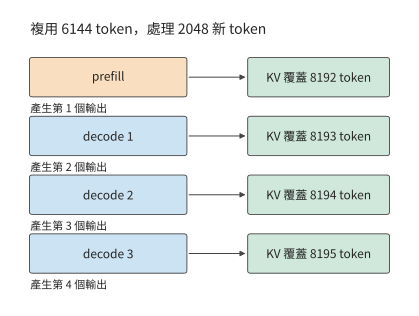

*圖 3-1　恢復 6144 個上下文 token，處理 2048 個新輸入並生成 4 個輸出。首輸出來自 prefill，後續 3 次 decode 各追加一個 token；縱向表示呼叫次序，間距用於示意。*

兩個階段使用同一套權重，對資源的需求卻不同。以一組權重矩陣為例，prefill 的輸入包含 $BP$ 行，單步 decode 只有 $B$ 行。輸入 token 較多時，一次讀入的權重可以參與更多乘加運算；低並行 decode 則可能只為少數幾個 token 讀取整組權重。這就是「prefill 通常受算力限制、decode 通常受記憶體頻寬限制」這種說法的由來。

單個請求之外，不同請求之間也能形成新的複用機會。多個 decode 同時執行時，共同使用權重，各自讀取上下文；一條長輸入到來時，prefill 可以同時處理較多已知 token，它們的特徵向量組成行數更大的輸入矩陣。服務系統需要在這些不同形狀的工作之間分配時間。僅把總 token 數相加，會丟失這些 token 分別屬於哪個階段、何時能夠執行的資訊。

> **練習 3-1〔延伸〕：相同輸出總量下，請求數量如何改變模型呼叫次數**
>
> 分別考慮一條請求輸出 1024 個 token，以及八條請求各輸出 128 個 token。每條請求的輸入均為 1024 個 token。求兩種情況下的 prefill 次數、後續 decode 總步數，以及各請求結束時的上下文長度。假設八條請求同步生成，比較每批共享一次權重時的讀取輪數，再解釋總輸出相同為什麼不足以判斷完成時間。

### 3.1.2 任務目標與評價指標

模型請求與使用者任務通常不是一一對應的。回答問題可能只需一次生成，修複函式卻可能需要讀檔案、改程式碼、執行測試、根據錯誤再修改。評估系統時，先寫出什麼算完成，再決定統計什麼。

先在時間線上標出三個事件：請求到達 $t_a$、首個 token 返回 $t_1$、最後一個 token 返回 $t_G$。由此得到

$$
T_{\mathrm{TTFT}}=t_1-t_a,\qquad T_{\mathrm{request}}=t_G-t_a,\qquad
\overline T_{\mathrm{token}}=\frac{t_G-t_1}{G-1}\quad(G>1).
$$

TTFT（time to first token）是從請求到達到首個 token 返回的時間，本書也稱首響應。首響應衡量多久開始輸出，完整請求延遲衡量多久生成完，平均 token 間隔衡量輸出節奏。把某一段時間縮短，只會直接改變包含這段時間的指標。例如，減少請求開始執行前的排隊會改善 TTFT，卻不會自動縮短已經開始生成後的 token 間隔。

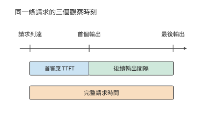

*圖 3-2　請求到達、首輸出與末輸出決定三個計時區間。首響應包含開始生成前的等待，輸出間隔描述生成過程，完整請求時間從到達累計到結束。*

首個 token 到達客戶端之前，請求要依次經過排隊、輸入準備、加速器計算和結果返回等階段。輸入最初儲存在主機還是加速器上，決定資料傳輸發生在哪裡；計算完成後，結果還要經過主機處理和連線傳送。記錄同一請求在各階段的開始和結束時間，就能看出 TTFT 主要消耗在哪些環節。第 5 章將展開加速器提交、傳輸與完成的具體時序。

客戶端按塊接收多個 token 時，可以直接記錄每塊的到達時間與 token 數，再統計輸出節奏。reasoning 模型還會多出一個觀察點：它在給出可見回答前先生成中間思考內容（稱為思考 token），首個內部 token 出現時，使用者未必已看到答案。因此，內部生成、使用者可見輸出和任務完成分別對應不同的時間點。語音的首次播放還要再經過解碼與裝置緩衝，第 3.3.3 節再討論。

| 要回答的問題 | 需要的指標或記錄 |
| --- | --- |
| 多久開始回應？ | TTFT；reasoning 另記首個有用輸出 |
| 輸出是否連續？ | 逐 token／逐塊間隔及其分佈 |
| 多久把事情做完？ | 完整請求時間、完整任務時間 |
| 每秒完成多少合格任務？ | 在質量與時限要求下的有效吞吐量 |
| 得到一個成功結果花多少？ | 全部嘗試的模型、工具和環境成本／成功任務數 |
| 等待期間還佔著什麼？ | 狀態所屬的請求與模型版本、大小、存放位置和駐留時間 |

只看平均值會掩蓋較慢的一部分請求。p95 是第 95 百分位數，用來描述所選指標中較慢的一部分觀測。本章採用最近秩法：把 $n$ 個觀測從小到大排列，取第 $\lceil0.95n\rceil$ 個。四條請求的 p95 是最大值，480 條請求的 p95 是第 456 個。將請求完成、排隊與首響應的耗時分別排序，就能看出長等待發生在哪一段；完整請求的 p95 則直接由各請求的全程耗時排序得到。

除響應時間外，等待期間的狀態佔用也需要度量。狀態駐留得越久，同樣的容量能同時服務的任務就越少。令任務狀態大小為 $M(t)$，狀態佔用空間對時間的積分為

$$
A_M=\int_{t_{\mathrm{start}}}^{t_{\mathrm{end}}}M(t)\,\mathrm dt.
$$

將各時間段佔用的空間乘以持續時間再相加，就得到佔用空間隨時間變化的曲線下面積。其單位為 byte·s：1 GiB 狀態持續佔用空間 10 秒，對應 10 GiB·s。狀態沒有變大，但這段時間裡這塊空間不能供其他請求使用。若任務以平均每秒 $\lambda$ 個的速度持續到達，每個任務都佔用 $M_0$ 位元組、平均等待 $\tau$ 秒，穩定情況下僅這些等待任務的平均佔用就約為 $\lambda M_0\tau$。工具等待由此也會成為容量問題。

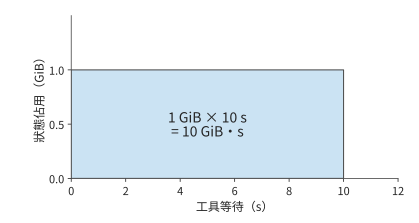

*圖 3-3　1 GiB 狀態持續佔用空間 10 秒，對應面積為 10 GiB·s。橫軸為狀態駐留時間，縱軸為佔用空間；面積描述這段等待期間的累計儲存佔用。*

時間與狀態之外，還要核算完成任務的代價。成功任務成本把所有嘗試的成本相加，再除以成功任務數。這樣，失敗生成、工具測試和環境執行都進入分子，分母對應使用者得到的合格結果。batch 零成功時，記錄其總消耗與失敗原因；取得成功結果後，再用全部嘗試的總成本除以成功任務數。[^cost]

### 3.1.3 請求分佈

前一分鐘加速器有空閒，後一分鐘突然到達許多需要長時間生成的請求，後到的請求仍然要排隊：先前空閒的計算時間無法留到現在使用。TTFT 和輸出間隔描述單個請求的體驗；多個請求陸續到達時，這些指標還取決於各請求是否爭用同一時段的處理能力。

負載描述應保留到達時間、輸入與輸出長度的聯合分佈。長請求既增加自身服務時間，也可能延長狀態駐留；短請求提前完成，則可能讓後續請求較早開始。因此，即使平均工作量相同，等待時間、完成時間和狀態佔用峰值也可能不同。下面保持章首兩分鐘負載的請求總量與平均長度不變，先計算到達順序如何改變積壓，再觀察真實系統。

實際請求往往來自不同客戶。某個客戶主要提交長文件，另一個主要生成長回答；即使各自的請求形狀穩定，各客戶請求到達速率的變化也會改變整體負載。ServeGen 對生產服務的研究觀察到了這種現象，並用客戶組成與時間變化重建請求分佈。[^servegen]

**例題 3-1：平均處理能力足夠，為什麼仍會積壓？** decode 由兩張 RTX PRO 6000 Blackwell Workstation Edition 承擔，判斷它們能否持續處理章首的負載。

解：定義兩類請求：長輸入類輸入 8192、輸出 256 個 token；長輸出類輸入 1024、輸出 2048 個 token。兩分鐘內各到達 240 條，合計平均每秒四條。一種負載中，兩類請求始終各佔一半；另一種前一分鐘兩類佔比為 $9:1$，後一分鐘為 $1:9$。每條請求的首輸出由 prefill 產生，後續 decode 步數為輸出數減一，於是有：

| 時間窗 | 新輸入 token/s | 後續 decode 步/s |
| --- | ---: | ---: |
| 均勻混合 | 18,432 | 4,604 |
| 時段變化，前一分鐘 | 29,900.8 | 1,736.8 |
| 時段變化，後一分鐘 | 6,963.2 | 7,471.2 |

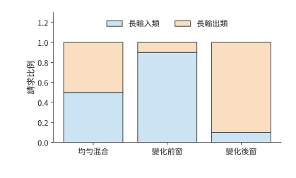

*圖 3-4　兩分鐘總量相同的三個時間窗中的請求組成。長輸入類為 8192 輸入、256 輸出，長輸出類為 1024 輸入、2048 輸出；兩類混合比例改變階段需求。各類請求的輸入、輸出長度均以 token 為單位。*

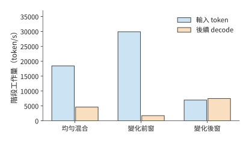

*圖 3-5　三個時間窗中，請求組成對應的輸入與後續生成需求。輸入數按 token 計，後續生成按每請求的一次 decode 步計；每請求首輸出已計入 prefill。輸入項統計每秒新處理的輸入 token；decode 項統計所有請求每秒需要執行的後續 decode 步，每步推進一個 token。*

**佇列假設：視窗內均勻到達、處理率固定。** 使用流體佇列模型，把離散的生成工作近似為連續流量；每個視窗內均勻到達，處理率固定，初始佇列為空。單位是一條請求的一次後續 decode 步，prefill 能力單獨核算。

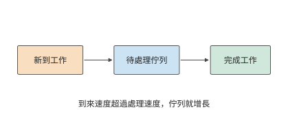

*圖 3-6　工作先進入佇列，再由處理資源完成。到來快於處理時差額留在佇列中；處理快於到來時，資源逐步消化已有積壓。*

以時間窗為步長，積壓可按下式逐窗計算：

$$
Q_{k+1}=\max(0,Q_k+A_k-\mu_k\Delta t).
$$

其中 $Q_k$ 是視窗開始時的待處理工作，$A_k$ 是視窗內新到達的工作，$\mu_k\Delta t$ 是可完成量。到達速度低於處理速度時，積壓逐漸減少，直至佇列排空；到達速度超過處理速度時，未完成的工作留到下一視窗。

遞推式中的處理率 $\mu_k$ 要從硬體參數求出。每秒四個請求的首個輸出由 prefill 產生，所以 4,608 個輸出中有 4,604 步屬於後續 decode。decode 的處理率由視訊記憶體頻寬決定。RTX PRO 6000 Blackwell Workstation Edition 有 96 GB 視訊記憶體、1792 GB/s 頻寬，每張卡各放一份完整的 Qwen3-8B BF16 權重，最多同時執行 64 條序列。每步 decode 至少要把 15.14 GB 共享權重讀一遍，再讀出每條序列的全部舊 KV，每個上下文 token 佔 144 KiB。decode 期間，長輸入類的平均上下文為 $8192+127=8319$ 個 token，長輸出類為 $1024+1023=2047$ 個；均勻混合時按 decode 步加權，平均上下文為 $(255\times8319+2047\times2047)/2302\approx2742$ 個 token。64 條序列同時執行時，一步至少讀寫 41.02 GB，耗時 22.89 ms，所以一張卡每秒最多完成約 2,795.66 步，兩張卡約 5,591.33 步。這一處理率是視訊記憶體頻寬允許的物理極限，實測只會更低。三個時間窗都沿用這一處理率。

令 decode 佇列初始為空，先把請求的生成工作均勻匯入各視窗。均勻混合和前一分鐘的處理能力都足夠；後一分鐘每秒多到來 $7471.2-5591.33\approx1879.87$ 步，60 秒便留下約 112,792 步；停止到達後，按 $112792/5591.33$ 計算，還需約 20.17 秒才能排空。前一分鐘未使用的能力無法儲存到後一分鐘，這正是全域性均值掩蓋積壓的原因。[^workload]

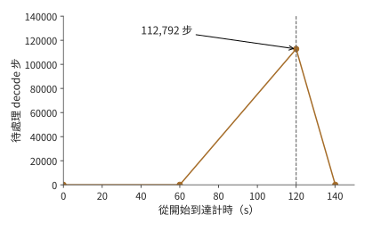

*圖 3-7　兩張 RTX PRO 6000 每秒最多完成約 5,591 個 decode 步時的流體模型。後一分鐘積壓至 112,792 步，120 秒後停止到達，再經過約 20.17 秒排空。*

**KV 容量限制如何影響排隊與首響應。** 在 Qwen3-8B／vLLM 0.23 上執行這兩種到達序列，可以觀察到上述差異如何影響使用者等待。加速器為一張 96 GB 視訊記憶體的 RTX PRO 6000 Blackwell Workstation Edition，KV 池是專門留給請求鍵值上下文的視訊記憶體區域，本次容量為 24 GiB，同時最多執行 64 條序列；字首快取指跨請求複用相同開頭的已有 KV，本次關閉這一功能，每條請求生成指定數量的 token。KV 空間不足時，排程器可以暫停某條已開始的請求、釋放它佔用的 KV 空間，之後再恢復或重算，這種行為稱為搶佔。兩組負載都在 120 秒內到達 480 條請求，全部完成後的結果如下。[^arrival]

| 實際觀察 | 均勻混合 | 前 9:1、後 1:9 |
| --- | ---: | ---: |
| 完整請求 p95 | 約 299.4 s | 約 299.4 s |
| TTFT p95 | 242.9 s | 258.9 s |
| 初次排程等待 p95 | 242.4 s | 258.4 s |
| 最後一條請求完成時距起點的時間 | 419.8 s | 418.7 s |
| 搶佔事件 | 62 | 24 |

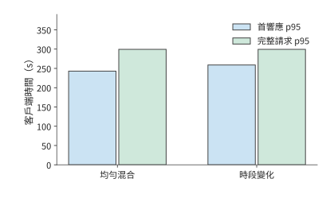

*圖 3-8　同一實際例項回放兩種到達序列的結果。完整請求 p95 接近，首響應 p95 則相差約 16 秒；模型、加速器、KV 池與並行上限均按正文實驗條件固定。*

兩次回放都出現了大量積壓，這在例題 3-1 的頻寬下界中已經可以預見：一張卡每秒最多完成約 2,796 個 decode 步，低於均勻混合時 4,604 步的平均需求，而且同一張卡還要執行 prefill。480 條請求共需 552,480 個後續 decode 步，單是這部分工作就至少需要 197.6 秒，而全部請求在 120 秒內就已到達。

兩次回放的完整請求 p95 與最後完成時間接近，TTFT 和初次排程等待卻相差約 16 秒。取樣記錄顯示，兩次實驗的 KV 池佔用都達到過 100%，請求在進入執行前經歷了長時間等待。輸入與輸出的時段組合改變了何時釋放狀態、何時接納新請求，所以即使整批請求的完成時間接近，使用者開始收到響應的時間仍可不同。KV 池填滿時發生的搶佔，還會改變請求的等待和後續執行次序。

排隊因此既可能來自處理速度不足，也可能來自已有請求的狀態尚未釋放：狀態池填滿後，即使部分計算單元空閒，新請求也要等待已有請求釋放空間。[^serve-replay]

例題 3-1 中的積壓遞推式還能預測其他突發條件下的積壓。若工作到達速率 $\lambda_w$ 連續 $\tau$ 秒高於處理率 $\mu$，初始佇列為空，則積壓為 $(\lambda_w-\mu)\tau$；停止到達後的排空時間為 $(\lambda_w-\mu)\tau/\mu$。突發持續時間加倍，積壓與排空時間都加倍。

> **練習 3-2〔核心〕：突發請求與工具等待如何增加積壓和狀態佔用**
>
> 採用例題 3-1 中第二分鐘的負載強度，即每秒新增 7,471.2 步 decode 工作。將這一突發負載的持續時間改為 30 秒，decode 資源分別取兩張和三張 RTX PRO 6000 Blackwell Workstation Edition，每張卡的處理率沿用例題 3-1 求得的約 2,796 步/秒。初始佇列為空，求這 30 秒內積壓量隨時間的變化，以及請求停止到達後清空積壓所需的時間。隨後考慮另一種負載：每秒有兩個任務進入工具等待階段，每個任務等待 10 秒，期間狀態佔用 1 GiB 空間。求穩定狀態下的平均等待任務數與狀態佔用；將等待延長到 30 秒後重新計算。

## 3.2 多輪互動與 Agent 任務

### 3.2.1 多輪對話與字首增長

第 3.1 節把每個請求當作一次獨立呼叫；在對話和 Agent 任務中，同一任務的多次呼叫前後相連。多輪對話的下一次請求通常帶著上下文。第一輪輸入系統提示和使用者問題；第二輪除了新問題，還可能包含上一輪迴答；之後每輪繼續累積。若只看使用者新寫了多少字，就會低估送入模型的輸入長度。

設第 $i$ 輪輸入長度為 $I_i$，可複用的字首長度為 $K_i$，則本輪需要重新處理的輸入為

$$
P_i=I_i-K_i,\qquad S_i=K_i.
$$

將 $P_i$ 與 $S_i$ 代入第 2 章的公式，投影和 FFN 只處理新增 token，注意力仍要讓新查詢訪問完整字首。快取複用因而減少了重算，卻沒有把舊上下文從後續計算中刪除。

以一次包含四輪模型呼叫的程式碼修復任務為例，計算快取的收益。四輪累計輸入 5,297 個 token，其中命中 4,480 個，未命中 817 個。第二輪輸入 1,443 個、命中 1,392 個，只需處理 51 個未快取 token；但後續 decode 仍然要訪問其上下文狀態。如果每輪都重新計算全部輸入，prefill 的矩陣運算共需 76.196 TFLOPs；複用已命中的字首後，共需 11.976 TFLOPs。因此，快取命中既減少了舊輸入的重算，也要求系統繼續保留舊狀態。[^agent-calc]

修改上下文會改變可複用的字首長度。末尾追加新內容時，原有字首保持不變；摘要替換一段舊上下文時，替換位置之後的表示要從新的字首重新計算；工具定義或模板變化則可能更早改變輸入。這些操作決定下一輪有多少 token 命中、多少 token 重新進入 prefill。

上下文策略還會改變未來負載。把新內容持續追加在上下文末尾，有利於複用原有字首，卻會讓陳舊內容繼續佔據上下文；替換前面的內容可以縮短上下文，但其後的快取可能需要重建。保留、淘汰和重算的代價取決於重建計算量、狀態大小與複用間隔（第 8 章）。[^context]

用本節的字首複用關係比較兩種編輯方式：在末尾追加 100 個 token，只增加 100 行新輸入；若改動已有 2000 個 token 中的第 501 個，其後的表示都會變化，最長可直接複用的字首只剩 500 個 token。快取收益不僅取決於改了多少字，還取決於改動發生在哪裡。

從應用看，上下文是編排任務的介面；從系統看，上下文的組織方式決定了計算量和狀態駐留時間。追加工具返回的內容、替換早期內容、生成多個候選分支，分別改變新增計算、可複用字首和私有狀態。讓服務系統掌握這些關係，就能根據複用情況安排快取，在分支間共享歷史，並利用工具等待時間換出狀態。因此，負載記錄還應包含穩定字首、改寫位置、分支依賴和複用間隔。第 8 章將使用這些資訊選擇上下文與快取策略，第 9 章再加入狀態位置和傳輸時間。

### 3.2.2 推理與驗證：完成一個任務需要多少成本

字首快取減少的是已有輸入的重複計算。另一類方法則主動增加生成計算，希望提高答案的正確率。增加推論階段的計算量，主要有三種方式：延長一條回答中的思考過程，同時生成多份回答並從中選擇，或者根據題目難度分配生成次數和長度。延長思考會增加序列生成時間與上下文狀態；生成多份回答會增加計算和驗證次數；按難度分配則需要決定每道題何時停止。

是否值得增加生成計算，需要比較每個成功任務的成本。設每次嘗試的平均成本為 $c$、成功率為 $p$，相同策略下重複嘗試的期望次數為 $1/p$，則

$$
C_{\mathrm{success}}=\frac{c}{p}.
$$

新方法的成本和成功率分別為 $c_2,p_2$，舊方法為 $c_1,p_1$，成本下降要求 $p_2/p_1>c_2/c_1$。因此，延長思考或增加取樣的依據，是正確率的相對提升能否超過成本的相對增長。所有生成、驗證和失敗嘗試的成本都計入 $c$。

**例子：延長生成仍未提高數學題解答成功率。** 生成速度只有與任務正確率一起考察，才能反映系統是否有用。一次數學題實驗中，對四道題分別生成多份回答，將輸出上限從 1024 提高到 4096 個 token，兩輪嘗試仍未得到透過評分的最終答案。生成已經消耗資源，任務卻沒有完成；增加輸出長度也沒有自動帶來有效解答。[^reasoning]

答案檢查應區分介面格式和內容正確性。格式正確的回答可能算錯，數值正確的回答也可能缺少任務要求的欄位。把兩類錯誤分開，才能判斷應調整生成方式、輸出約束還是解題過程。[^reasoning-off]

核算成本時，還要考慮價格本身的變化。token 單價降低後，仍需計算完成任務的總成本。用簡單假設說明：新系統 token 單價降到原來的 1/10，每任務用量卻增加到 20 倍，成功率由 50% 提高到 80%。只計模型成本，並假定重複嘗試的分佈穩定，每個成功任務的成本比為 $2\times\frac{0.5}{0.8}=1.25$。價格下降、質量提高和成功任務成本上升可以同時發生。對帶上下文的 Agent，可以沿實際軌跡累加各次嘗試，再以透過檢查的任務數作分母。[^cost]

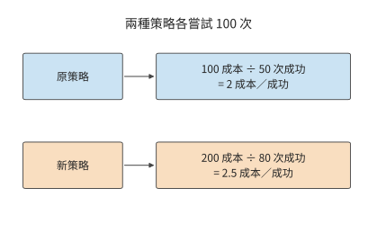

*圖 3-9　各嘗試 100 次的教學比較。所有嘗試的成本都進入分子，透過檢查的成功任務數進入分母；兩種策略的成功任務成本分別為 2 和 2.5 單位。*

> **練習 3-3〔延伸〕：成功率提高能否抵消單次嘗試成本的增加**
>
> 舊方法每次嘗試成本為 1 單位、成功率為 50%；新方法成本為 2 單位、成功率為 80%。計算平均每完成一個成功任務所需的成本，並判斷新方法是否更省。若新方法成本降到 1.5 單位，成功率至少應達到多少，才能使每個成功任務的平均成本不高於舊方法？對需要多次取樣的任務，說明生成、驗證和失敗嘗試的開銷應怎樣計入總成本。
>
> 沿用第 3.2.4 節末的決策請求算例：決策模型處理一條請求花費 0.000081 美元，轉交 LLM 每條花費 0.013880 美元。設轉交前後的成功率分別為 $p_1,p_2$，求轉交比例為 1% 和 5% 時每條請求的平均費用；$p_2/p_1$ 至少達到多少，轉交才能降低每個成功任務的費用？

### 3.2.3 智慧體工作負載

反饋還可以改變後續的計算過程。程式碼 Agent 先生成修改方案，工具寫入程式碼並執行測試，模型再讀取測試結果決定下一步。每個迴圈既有模型計算，也有工具執行；工具返回的日誌又成為下一輪輸入。因此，減少無關日誌能降低下一輪的 prefill 計算量和上下文狀態佔用，減少無效修改則能直接減少迴圈次數。

本章的實測任務是修復區間合併函式，檢查返回結果是否正確、輸入是否保持不變。模型負責決定修改並呼叫工具，工具負責寫入檔案和執行測試。下面按四輪內成功完成原定檢查的那條軌跡，分開統計模型時間、工具時間和等待期間儲存的狀態。工具呼叫明細見章末[程式碼任務軌跡](#agent-trace-detail)。[^agent]

檢索增強問答也包含類似的處理過程：檢索器找到文件，再將文件交給語言模型生成答案。回答質量相同時，檢索內容越少，後續 prefill、KV 儲存和上下文讀取的開銷就越小。因此，檢索器返回的內容會直接影響模型負載。第 8 章將結合具體任務比較不同檢索方案。[^retrieval]

### 3.2.4 分支、工具等待與狀態駐留

模型呼叫與工具執行之間的先後關係可以畫成一張依賴圖。沿一條序列路徑，階段時間相加；互不依賴的分支可以同時開始，匯合點等待較慢的分支。一張依賴圖中，從開始到結束累計耗時最長的路徑稱為關鍵路徑，它決定任務最早何時能夠完成。先用真實程式碼任務觀察模型和工具各佔多少時間，再改變依賴關係，預測並行能節省多少。下表比較同一任務在思考模式關閉與開啟時的兩次執行；思考模式決定模型是否先生成第 3.1.2 節所說的思考 token。

| 觀察 | 思考模式關閉 | 思考模式開啟 |
| --- | ---: | ---: |
| 模型呼叫輪數 | 12 | 4 |
| 總輸出 token | 765 | 2,733 |
| 模型呼叫實際耗時之和 | 13.156 s | 76.294 s |
| 工具執行實際耗時之和 | 0.476 s | 0.078 s |
| 返回值正確性與輸入不變檢查 | 315/1013 | 1013/1013 |
| 額外檢查：返回的子列表無別名 | 1/1013 | 710/1013 |

關閉思考模式時，快取命中率約為 83.4%，仍未修好程式碼；開啟後，模型時間增加，返回值正確性和呼叫後輸入不變兩項原定檢查全部透過。額外的無別名檢查要求返回子列表與原輸入相互獨立，開啟思考模式的程式透過了其中 710 個用例，另 303 個仍共享了子列表。[^agent] 兩組檢查對應兩種不同的程式性質，這說明任務的完成標準必須具體到可執行的驗證。

開啟思考模式後，任務共輸出 2,733 個 token，其中 2,553 個在思考結束符（標誌思考內容結束的記號）之前，3 個為結束符，177 個在之後。思考佔據絕大多數生成工作，工具呼叫則把模型的決策轉化為檔案修改與測試操作。沿執行順序累計模型呼叫與工具執行的實際耗時，再加上控制和交接時間，就得到使用者等待整個任務完成的時間。

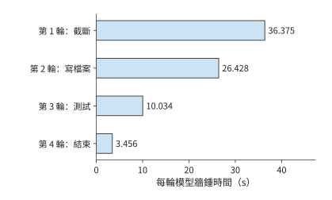

*圖 3-10　程式碼任務中四輪模型呼叫的實際耗時，各輪從自己的起點計時。模型時間合計 76.294 秒，工具合計約 0.078 秒，整任務另含控制與交接時間。*

**例題 3-2：加速首輪模型計算能縮短多少程式碼任務時間？** 用第 1 章的 Amdahl 定律分析，假設後續行為與質量不變。

解：以同一條執行軌跡為基準，將首輪耗時 36.375 秒的模型計算縮短一半，其餘階段、輸出、工具行為和質量都不變，總時間便從 76.510 秒降到 58.323 秒。此時 $f=36.375/76.510$，$s=2$，總加速比約為 1.31。首輪佔總時間約 47.5%，將這一段減半節省約 23.8% 的總時間；其餘階段仍合計耗時約 40.1 秒。最佳化的收益取決於縮短的那一段原來佔多大比例。[^agent-speedup]

工具之間的依賴關係也影響總時間。設模型先計算 2 秒，隨後呼叫兩個工具，耗時分別為 6 秒和 10 秒，最後再計算 3 秒。若第二個工具依賴第一個的結果，總時間為 $2+6+10+3=21$ 秒；若工具相互獨立，總時間為 $2+\max(6,10)+3=15$ 秒。並行減少了 6 秒，但兩個工具的總執行工作仍為 16 秒。

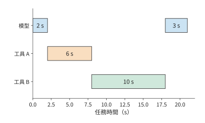

*圖 3-11　兩個工具存在前後依賴時的任務時間線。模型先執行 2 秒，工具 A 用 6 秒，工具 B 用 10 秒，模型最後執行 3 秒，總計 21 秒。*

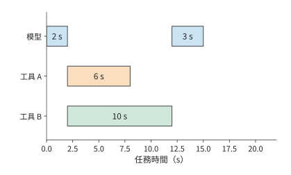

*圖 3-12　兩個工具獨立時可以同時開始，模型在較慢的工具 B 完成後繼續，任務共 15 秒。與前圖使用相同時間尺度；工具工作總量仍為 16 秒。*

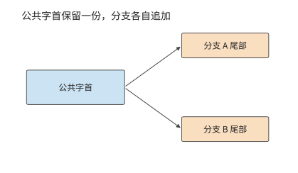

*圖 3-13　兩個生成分支指向同一份公共字首，並各自儲存新增尾部。箭頭表示引用關係，共享字首只計一份容量。*

並行與分支改變的不只是時間，還有狀態佔用。若分支還要分別生成文字，公共字首可以共享，分支尾部獨立增長。設共享字首長 $H_0$，第 $i$ 個分支新增 $h_i$ 個 token，每 token 狀態為 $c_{\mathrm{KV}}$，則總狀態為 $c_{\mathrm{KV}}(H_0+\sum_i h_i)$。並行縮短了關鍵路徑，也讓更多分支的狀態同時佔用記憶體。

第 3.2.3 節程式碼修復任務的實測記錄中，工具呼叫耗時極短，大部分時間都消耗在模型計算上。若工具操作改為耗時 10 秒的編譯，模型暫停的同時，下一輪所需上下文仍佔據容量；若多個任務同時等待，駐留量按任務累加。工具執行時間越長，狀態保留得越久，系統能同時處理的請求數就越少。第 8、9 章將在這條時間線上安排快取與交接。

> **練習 3-4〔核心〕：工具並行與區域性加速能節省多少任務時間**
>
> 一次任務先由模型計算 2 秒，然後呼叫兩個相互獨立的工具，分別耗時 6 秒和 10 秒。兩個工具都完成後，模型再計算 3 秒，任務結束。分別計算兩個工具依次執行和同時執行時的任務總耗時。假設僅在等待工具返回期間狀態佔用 1 GiB 空間，求兩種執行方式下狀態佔用量與佔用時長的乘積，單位為 GiB·s。
>
> 本節的程式碼任務實測記錄顯示，任務總耗時為 76.510 秒，其中首輪模型計算耗時 36.375 秒，所有工具執行合計耗時 0.078 秒。保持其餘階段不變，分別計算兩種最佳化能節省多少任務時間：將首輪模型計算速度提高到原來的四倍；將所有工具的執行速度提高到原來的兩倍。根據計算結果，解釋為什麼區域性加速倍數不能單獨決定一項最佳化對完整任務的收益。

負載需求還會反過來推動模型結構的變化。把同一條會話換成 DeepSeek V4.1 Flash，可以看到具體例子。設 Agent 已有一段公共上下文，工具隨後返回新材料；如果字首未命中，服務要重新處理較多輸入，而本輪輸出可能較短。為這樣的輸入密集場景降低 prefill 成本，比只最佳化單步生成更有價值。V4.1 因而採用第 2 章介紹的 CED 結構，使用 20 層因果編碼器和 20 層解碼器：大部分輸入只執行編碼器主體，解碼器的全域性 KV 從編碼器末層表示投影得到；為了構建解碼器的 SWA 狀態，把提示末尾最多 128 個 token 的編碼器輸出重新送入解碼器，近似恢復這部分區域性狀態。輸出 token 繼續經過全部 40 層。[^v41-case]

先比較專家矩陣計算這部分工作，以各 token 經過的專家層數之和衡量工作量。設一次從空狀態開始的輸入為 $P$ 個 token，則普通 40 層路徑為 $40P$，報告中的 CED 排程為 $20P+20\min(P,128)$。當 $P=8192$ 時，兩者為 327,680 與 166,400，後者約為前者的 50.8%；當 $P\leq128$ 時，該子項沒有減少。

已有字首時，輸入處理的工作量由追加長度與恢復方式共同決定。若編碼器 SWA 命中快取，編碼器主體便可以繼續處理追加的輸入；編碼器 SWA 缺失，則先重放字首末尾視窗。兩條路徑隨後都要構建本輪的解碼器 SWA。第 8 章將用 8K 與 128K 上下文的教學算例，比較儲存狀態和重新執行的成本。

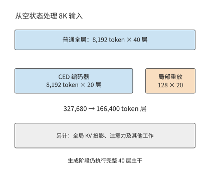

*圖 3-14　同一批 8K 輸入中，各 token 經過的專家層數之和。普通全層路徑執行 40 層；CED 路徑執行 20 層編碼器，併為最近 128 個 token 重放 20 層解碼器。灰色說明項仍需另外計算；生成階段執行完整主幹。*

**算例：Jev 為什麼一眨眼就給出答案。** 2026 年 9 月，前 OpenAI 研究員 Diogo Almeida 創辦的 TypeSafe AI 釋出了 Jev 模型。按創始人在釋出文章中的說法，他在 OpenAI 參與了讓語言模型學會遵循指令、與人對話的方法，這些工作後來成了 ChatGPT 背後的研究。[^jev] Jev 的官方演示相當吸睛：同一條客服請求，GPT-5.6 Terra 用了 8.566 秒，Jev 只用 0.114 秒，費用也只有前者的 1/171。不少人的第一反應是：這還是 Transformer 嗎？是不是用了什麼了不起的 infra？讀過本書就會發現，這其實沒有什麼秘密，讀者也可以輕鬆實現。

Jev 不生成文字。呼叫方提交一段狀態（例如一張工單）和若干問題，每個問題的選項事先給定，模型返回各選項的機率。回到第 3.1.1 節的呼叫鏈，這類請求只有 prefill，沒有 decode。狀態和所有問題拼在一起做一次前向，每個問題末位置的輸出分佈就是答案，好比圖 3-13 中從同一字首分出的幾條分支，每條只走一步就停下。問題之間互不依賴，請求結束後也不必保留 KV。至於這些機率能否直接當作置信度，靠的是訓練：TypeSafe 稱其方法為 RLCD，思路與學術界的 RLCR 相同，都在獎勵中加入 Brier 分數，讓模型給出的機率與實際正確率相符。[^rlcr]

下面用本書的條件驗證這一點。Jev 只按輸入收費，每百萬 token 0.042 美元；演示中 Jev 花費 0.000081 美元，折算下來輸入約 1929 個 token。把這條請求放到 Qwen3-8B 上，一次前向約 28 TFLOPs，H100 SXM 按 40% 的算力效率計算約需 70 ms，與演示中的 0.114 秒相當。換成 DeepSeek V4.1 Flash 並走 CED 路徑，運算量也只多出約四分之一。如果交給普通 LLM，prefill 之後還要逐個生成 token，每一步受記憶體頻寬限制，約需 9 ms。生成 64 個 token，延遲就增至 0.65 秒，是決策請求的 9 倍；由於 decode 可以合批，GPU 時間卻只多 28%。圖 3-15 把兩種執行方式畫在同一條時間軸上：一眨眼給出答案，靠的是省掉了序列生成。[^decision-calc]

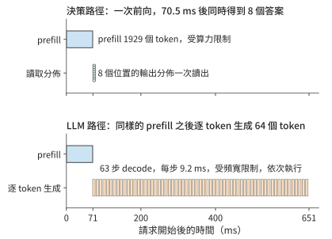

*圖 3-15　同一條 1929 個 token 的請求在 H100 SXM 上的兩種執行方式。上圖為決策請求，一次前向後同時讀出 8 個問題的答案；下圖為普通 LLM，prefill 之後逐個生成 64 個 token。模型為 Qwen3-8B，算力效率取 40%，頻寬效率取 50%。*

價格同樣不神秘。按 DeepSeek 推論系統報告的口徑，每 GPU 小時租金取 2 美元，則 8B 稠密模型或 V4.1 Flash 每處理一百萬個輸入 token，算力成本約為 0.02 至 0.025 美元，Jev 的價格是這一成本的 1.7 至 2 倍。也就是說，這一檔模型只靠普通的 prefill 就能做到這個價格；反過來，若價格要覆蓋成本，Jev 每個 token 的運算量大致不會超過 8B 稠密模型的兩倍。演示中 171 倍的費用差距，只有一小部分來自省去生成：在同一模型上，省去 64 至 512 個輸出 token，GPU 時間只減少到原來的 1/1.3 至 1/3.4。其餘差距來自前沿模型本身的價格，以及推理時生成的大量 token。

實際使用時，決策模型沒有把握的請求還要轉交 LLM 重新處理。設轉交比例為 $e$，每條請求的平均費用為 $c_{\mathrm{dec}}+e\,c_{\mathrm{LLM}}$。按演示中的兩個費用計算，$e$ 只要超過約 0.58%，轉交 LLM 的費用就會超過決策模型本身的費用。因此，第 3.2.2 節成功任務成本中的 $c$ 也要計入轉交費用。決策模型是否更省錢，要看有多少請求需要轉交，以及接手的 LLM 價格多高。

## 3.3 多模態與即時互動

Agent 的工具結果通常以文字進入下一輪輸入。若輸入換成圖片或連續語音，呼叫模型之前還需要編碼輸入，輸出端也可能需要持續播放。本節先分析資料在階段之間如何改變形狀，再分析各階段必須在何時完成。

### 3.3.1 視覺編碼、語言生成與狀態

圖片進入語言模型之前，還要經過預處理、視覺編碼和投影。用 $\mathrm E$ 表示視覺編碼，$\mathrm P$ 表示語言 prefill，$\mathrm D$ 表示後續 decode，一次視覺問答便有 $\mathrm E\to\mathrm P\to\mathrm D$ 這條基本依賴。圖片大小影響 $\mathrm E$ 的工作量，編碼後的視覺 token 數影響語言部分的工作量；這兩項工作應分別計算。

先數視覺 token，再數每個向量的特徵維度。設預處理後的圖片高、寬為 $H_{\mathrm{img}},W_{\mathrm{img}}$，將圖片分成方形影象塊（patch），每塊邊長為 $p_{\mathrm{patch}}$，每邊再合併 $r$ 個 patch，則視覺 token 數為

$$
n_v=\frac{H_{\mathrm{img}}W_{\mathrm{img}}}{p_{\mathrm{patch}}^2r^2}.
$$

以具體配置為例。視覺語言模型 Qwen3-VL-4B 的 $640\times640$ 圖片，按 $16\times16$ patch 劃分得到 1600 個 patch，再作 $2\times2$ 合併，得到 400 個視覺 token。最終特徵寬度為 2560，每元素佔兩位元組的 BF16 張量 $[400,2560]$ 佔 $400\times2560\times2=2{,}048{,}000$ 位元組。

但編碼結果不止這一份。為向語言模型提供不同深度的視覺資訊，DeepStack 將視覺編碼器中間層的特徵送入相應語言層。模型還取三個中間視覺層的這類特徵，將它們與最終層特徵拼接，完整張量為 $[400,10240]$，佔 8,192,000 bytes，即 7.8125 MiB。四組特徵對應同一組 400 個視覺 token：特徵寬度變為四倍，語言序列仍增加 400 個視覺 token。視覺編碼的矩陣運算量約為 1.310 TFLOPs；圖片解碼與縮放發生在編碼之前，語言計算則在編碼之後。[^vision]

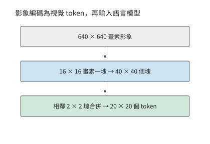

*圖 3-16　影象從畫素網格變為視覺 token。640×640 的方形圖片切成 40×40 個塊，相鄰 2×2 塊合併成一個 token，形成 20×20、共 400 個視覺 token。*

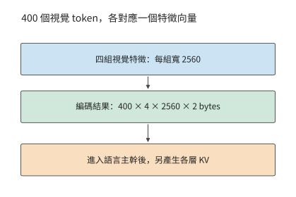

*圖 3-17　視覺 token 數與每 token 特徵寬度分別計量。四組 2560 維 BF16 編碼特徵佔 7.8125 MiB；這些視覺 token 進入語言模型後，另產生各層的 KV 狀態。*

圖 3-16 與圖 3-17 中，視覺編碼改變了視覺 token 數和特徵寬度；進入語言模型後，還會產生另一種表示。編碼快取（encoder cache，EC）儲存視覺編碼器的輸出，語言主幹則產生 KV 快取。該配置的語言 KV 每 token 佔 144 KiB，400 個視覺 token 對應 56.25 MiB。因此，同一張教學截圖在三個處理階段對應不同的資料量：原始壓縮檔案 0.8 MB、完整 BF16 EC 7.8125 MiB、視覺 token 的邏輯 KV 56.25 MiB。[^epd]

| 物件 | 本例大小 | 決定它能否複用的條件 |
| --- | ---: | --- |
| 壓縮截圖 | 0.8 MB，給定輸入 | 同一檔案內容 |
| 完整編碼結果 EC | 7.8125 MiB | 圖片、預處理、編碼器與輸出格式一致 |
| 視覺 token 的語言 KV | 56.25 MiB | 還依賴先前上下文、順序、位置與模型狀態 |

圖片及編碼配置相同時，EC 可以複用。語言 KV 還依賴圖片之前的上下文：問題放在圖片之前時，更換問題會改變視覺 token 的 KV；問題放在圖片之後時，因果注意力使此前視覺 token 的 KV 保持不變。

**多模態輸入的編碼狀態與 KV 容量預算。** 設輸入包含四張圖片與 400 個文字 token，計算這些輸入 token 的 EC 與邏輯 KV。四張相同規格圖片的 EC 為 31.25 MiB，視覺 token KV 為 225 MiB；再加 400 個文字 token，輸入邏輯 KV 為 281.25 MiB。

原圖、EC 和 KV 這三種資料表示，對應三個不同的交接位置。傳送原圖，接收方還要執行視覺編碼；傳送 EC，接收方從語言 prefill 開始；傳送 KV，則交接已經完成的語言上下文。第 8 章安排同卡執行，第 9 章比較階段交接，第 12 章把相同資料流放到端、邊、雲鏈路 (Link)上。

保持 patch 與合併方式不變，把圖片的高度和寬度都加倍，視覺 token 數變為四倍。因此 EC 和視覺 token 的語言 KV 都變為四倍；視覺編碼內部 token 之間的互動則還要按注意力結構計算。特徵拼接增加的是寬度，圖片變大增加的是視覺 token 數，二者在語言主幹中產生不同後果。

### 3.3.2 音訊與影象生成的計算過程

視覺問答仍透過語言模型逐 token 生成文字。若輸出本身是聲音或影象，一次迭代處理的資料和迭代次數也會改變。

音訊輸出還有幀內迴圈。以 Fish Audio 的語音生成模型 S2 Pro 為例，慢速（slow）路徑每次推進一個音訊幀，快速（fast）路徑在幀內補齊多個碼本的編號。碼本是離散聲音表示的候選向量集合，編解碼器（codec）把這些編號還原為波形。每幀先用一次快速路徑前向建立狀態，再用九次預測補齊碼本，因此生成一幀需要十次快速路徑前向計算。由此可見，語言 token/s、聲學幀/s 與每秒生成的音訊時長，衡量的是不同的生成速度。[^source-1][^media]

影象生成又換了一種迴圈。潛在表示（latent）是壓縮後的連續影象表示；去噪逐步把含噪表示變為目標影象。擴散 Transformer（DiT）執行每步變換，無分類器引導（CFG）組合帶條件與無條件兩路預測；變分自編碼器（VAE）負責畫素與壓縮表示之間的轉換。以影象生成模型 Qwen-Image-2512 為例，$1024\times1024$ 影象形成 4096 個 latent 位置，執行 50 個去噪步，true CFG 路徑每步有兩支 DiT 前向，總共執行 100 次 DiT 前向計算。去噪矩陣運算量約 $7.830\times10^{15}$ FLOPs；文字編碼器與 VAE 還有各自的工作。latent 的位置集合在去噪期間保持固定，各步持續更新其內容，累計工作隨去噪步數增加。[^image]

把每步去噪的運算量記為 $F_{\mathrm{step}}(n_v)$，去噪步數為 $n_s$，每步引導分支數為 $n_b$，總運算量為 $n_sn_bF_{\mathrm{step}}(n_v)$。步數加倍，運算量也加倍；解析度提高會增加影象潛在表示中的空間位置數，單步內部的矩陣行數和位置間互動也隨之增加。文字生成不斷追加上下文，每步訪問量隨之增長；影象去噪反覆更新同一組 latent，在固定解析度下，累計運算量隨去噪步數線性增長。

### 3.3.3 連續感知、首段響應與打斷

工作總量決定平均處理需求，即時播放還要求每塊資料都按時到達。令 $A(t)$ 表示截至時刻 $t$ 已到達的可播放音訊時長，$P(t)$ 表示已播放的音訊時長，緩衝中剩餘音訊為

$$
B_{\mathrm{audio}}(t)=A(t)-P(t).
$$

連續播放期間，每經過一秒，已播放音訊時長 $P(t)$ 就增加一秒，$A(t)$ 則隨資料塊到達跳躍增加。兩條曲線之間的距離就是緩衝餘量；餘量降到零而下一塊尚未到達，聲音就會中斷。預緩衝增加初始餘量，同時推遲開始播放。

時間要求同時作用於輸入和輸出。在輸入端，截圖 Agent 如果只在動作結束後觀察螢幕，就可能漏掉中途出現又消失的彈窗。持續觀察與互動研究 AOI 針對的正是這類場景：它把螢幕觀測與動作執行分開，持續收集影象、音訊和事件，再篩選出供模型使用的記錄。增加觀測頻率可以發現更多短暫事件，但儲存更多關鍵幀也會佔用上下文；過多關鍵幀還可能擠佔重要資訊，使任務效果下降。[^aoi] 因此，持續觀測還要配合篩選，決定哪些內容值得保留並交給模型處理。

語音的時間約束更直接。使用者停止說話後，系統要採集或確認輸入，經過識別／編碼、推理、語音生成和播放。開始播放後，後續音訊還必須及時到達，才能避免中斷。

音訊塊到達應用之後，還要經過解碼、排隊和播放。兩次語音互動測量中，使用者停止說話到首塊音訊到達的時間分別約為 400 ms、370 ms，後續音訊塊的到達間隔中位數均約為 94 ms。[^audio-real] 到達時間說明資料何時可用，播放時鐘則決定音訊何時播出。

用下面這組參數安排一條時間線，說明兩者之間的緩衝如何避免聲音中斷。輸入每 20 ms 形成一塊，24 kHz、單聲道、每樣本 2 bytes，每塊資料量為：

$$
24{,}000\times0.020\times1\times2=960\ \mathrm{bytes}.
$$

每塊採集結束後，模型處理耗時 12 ms、傳送耗時 1 ms，網路傳播通常再需 5 ms。第一塊在 38 ms 到達，在抖動緩衝區（先暫存到達的音訊、吸收到達時間波動的緩衝區）中等待 40 ms 後，於採集開始後的第 78 ms 播放。第三塊的傳播延遲設為 50 ms，直到 123 ms 才到，錯過 118 ms 的播放計劃，造成額外 5 ms 的停頓。後續塊雖已到達，也要按聲音順序等待。

將緩衝改為 60 ms，這次停頓消失，首播卻推遲到 98 ms。增加緩衝可以避免這次到達時間波動造成的播放中斷，代價是更晚開始；若音訊的平均到達速度長期低於播放速度，有限緩衝終究會耗盡。[^audio]

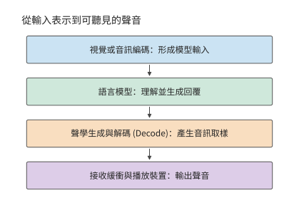

*圖 3-18　可組合的多模態階段。編碼形成模型輸入，語言模型生成回覆，聲學模組將回復轉成音訊，接收方的緩衝與播放裝置決定何時真正發聲。*

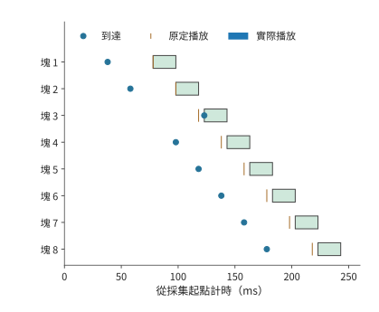

*圖 3-19　八塊音訊的教學播放時間線。每塊長 20 ms，圓點標到達，短豎線標原定播放時刻，色條標實際播放；第三塊晚到 5 ms，後續播放隨之順延。*

播放連續性之外，還要單獨檢查打斷響應。圖 3-20 從使用者發出打斷計時，追蹤本地播放何時真正停止；遠端生成是否停止需要沿另一條控制路徑判斷。

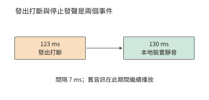

*圖 3-20　同一教學場景中的本地打斷。123 ms 發出操作，130 ms 裝置靜音；遠端計算是否停止屬於另一條控制路徑。*

打斷涉及幾項操作：應用發出取消指令，播放裝置靜音，後端停止生成，並釋放緩衝與狀態。教學時序在 123 ms 發出打斷，控制延遲 5 ms，裝置每 10 ms 檢查並執行一次控制指令，於是 130 ms 靜音，使用者感受到的打斷延遲為 7 ms。裝置靜音、後端停止生成和釋放緩衝與狀態，分別對應停止播放、停止計算和釋放儲存三個時刻：後端停止生成決定後續計算何時結束，緩衝釋放決定容量何時可供其他任務使用。[^audio-interrupt]

並非所有任務都要求連續輸出。RAW 是保留相機感測器原始取樣資訊的影象表示。RAW 圖片精修關注的是何時能得到完整成片，無需像語音那樣連續輸出。精修還需要保留原始影象資訊，視覺理解使用的 EC 無法替代原圖。由此可見，任務不同，時間要求也不同：有的要儘快開始，有的要持續流暢，有的要儘早全部完成。

> **練習 3-5〔延伸〕：影象解析度與音訊緩衝如何影響資源需求**
>
> 將 Qwen3-VL-4B 輸入圖片的解析度從 $640\times640$ 改為 $1280\times1280$，保持影象塊大小、合併方式和特徵精度不變，求視覺 token 數、完整編碼快取 EC 的大小，以及這些視覺 token 對應的 KV 大小。再根據本節音訊時間線，比較初始緩衝為 40 ms 和 60 ms 時的首次播放時刻與停頓情況。如果每秒收到的音訊只能播放 0.9 秒，開始播放時已快取 0.3 秒音訊，求連續播放多久後會耗盡緩衝，並解釋增加有限緩衝能解決什麼問題。

## 3.4 訓練的計算與狀態需求

### 3.4.1 前向計算、反向傳播與參數更新

推理用權重求輸出，訓練還要利用輸出與目標的差異來調整權重。以最簡單的一次乘法為例：輸入 x 乘以權重 w 得到 y。後一層傳回損失對 y 的敏感度後，要算損失對 w 的敏感度，就還需要當時的 x；要把敏感度傳給前一步，則需要 w。因此，前向把結果交給下一層以後，某些輸入還要保留，等反向用完才能釋放。

對線性層 $Y=XW$，輸入 $X$ 為 $[m,k]$，權重 $W$ 為 $[k,n]$。損失 $\mathcal L$ 是衡量模型輸出與訓練目標差異的數值，訓練的目標是降低損失；梯度描述損失對某個輸入或參數的小變化有多敏感。反向傳播從輸出端沿依賴逆向傳遞這些敏感度。設後一層反向傳來 $\partial\mathcal L/\partial Y$，當前層需要計算兩種梯度：

$$
\frac{\partial\mathcal L}{\partial X}=\frac{\partial\mathcal L}{\partial Y}W^{\mathsf T},\qquad\frac{\partial\mathcal L}{\partial W}=X^{\mathsf T}\frac{\partial\mathcal L}{\partial Y}.
$$

前向計算輸出，反向分別計算輸入梯度和權重梯度。三次矩陣乘法的運算量相同，因此這一線性層的訓練矩陣運算量約為前向的三倍。下表將一次乘加計為兩個 FLOPs。

| 操作 | 要解決的問題 | 左、右輸入的形狀 | 輸出形狀 | 矩陣 FLOPs |
|---|---|---|---|---|
| 前向 $Y=XW$ | 根據輸入求輸出 | $[m,k]$ 與 $[k,n]$ | $[m,n]$ | $2mkn$ |
| 輸入梯度 $\mathrm dX=\mathrm dY W^{\mathsf T}$ | 將誤差傳回前一層 | $[m,n]$ 與 $[n,k]$ | $[m,k]$ | $2mkn$ |
| 權重梯度 $\mathrm dW=X^{\mathsf T}\mathrm dY$ | 求這層權重的調整方向 | $[k,m]$ 與 $[m,n]$ | $[k,n]$ | $2mkn$ |

輸入梯度把誤差訊號傳給前一層，權重梯度決定本層參數的調整。觀察三組矩陣尺寸：雖然乘法順序不同，三次運算都含有相同的 $mkn$ 個乘加，因此合計約為 $6mkn$ FLOPs。若所有訓練 token 都經過同一組主要參數矩陣，累計便得到常見近似 $F_{\mathrm{train}}\approx6ND$，其中 $N$ 為參數量，$D$ 為訓練 token 總數。[^training]

結構變化也可以按這一推導處理。凍結某個權重矩陣後，可省去它的權重梯度計算；若更早的層仍需要梯度，則仍要計算輸入梯度。MoE 按選中專家累計兩類梯度，注意力則按查詢—鍵配對累計。沿反向依賴逐項累加，就得到各訓練方法需要執行的計算量。

除計算量外，訓練還帶來新的狀態儲存需求。除了計算 $\mathrm dW$ 要用的 $X$，對非線性運算求梯度也需要相應的中間結果。參數梯度在反向傳播中產生，再由最佳化器用來計算參數更新量。最佳化器的狀態記錄多次更新積累的資訊，因此需要保留到下一次更新。每類資料的保留期限取決於最後一次使用它的操作：某層啟用通常在該層反向計算用完後釋放，最佳化器動量則需要跨越多次更新持續保留。

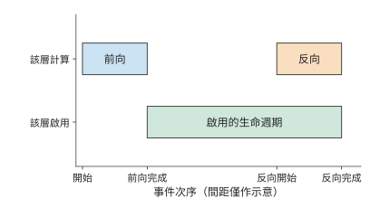

*圖 3-21　啟用的生命週期：一層啟用從前向完成後保留到相應反向用完。橫軸按事件排列，間距僅表示過程順序；相應反向計算用完這些啟用後，即可釋放其佔用的空間。*

**例題 3-3：梯度與最佳化器狀態為何使訓練記憶體需求成倍增加？**

解：以 Qwen3-8B 的 8,190,735,360 個參數為例，儲存 BF16 權重、FP32 梯度、一份獨立的 FP32 主權重（master weight），以及 Adam 的兩個 FP32 矩估計。Adam 是根據梯度及梯度平方的移動平均調節更新幅度的最佳化器，兩個矩估計分別儲存這兩種平均量。不做分片（把這些狀態切開，分給多張卡儲存）時，每參數需要 $2+4+4+4+4=18$ bytes，共 147.433 GB，約 137.308 GiB。尚未計入啟用，這些狀態就已超過一張 H100 SXM（80 GB）、RTX PRO 6000 Blackwell Workstation Edition（96 GB）乃至 H200（141 GB）的標稱視訊記憶體。BF16 權重用於前向和反向計算，梯度用於計算更新量，FP32 主權重用於高精度更新，Adam 的兩個矩估計則累計梯度及其平方的統計量。這些資料合計佔用的空間，是推理 BF16 權重的九倍。[^train-matrix]

明確狀態需求之後，再分析資料如何分批進入訓練。micro-batch（微批次）是一次前向和反向實際處理的資料子集；完整的訓練 batch 可以由多個 micro-batch 組成。micro-batch 與參數更新也要區分。視訊記憶體無法容納完整的訓練 batch 時，可以分多個 micro-batch 累計梯度，最後再更新一次參數。保持目標、有效標籤和歸一化一致時，將同一訓練 batch 拆成更多 micro-batch，會改變執行順序與啟用的生命週期，而總訓練資料量保持不變。第 10 章將據此討論分片和流水。

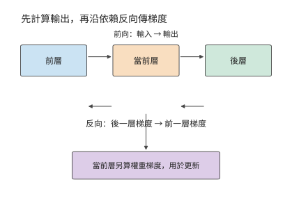

*圖 3-22　訓練沿前向依賴計算輸出，再沿反向依賴傳遞梯度。當前層既向前層傳輸入梯度，也計算自己的權重梯度，供最佳化器更新。*

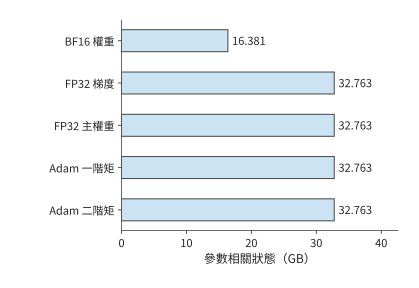

*圖 3-23　Qwen3-8B 全參數訓練的參數相關狀態。每參數包括 2 位元組計算權重和 4 組 4 位元組狀態，共 18 位元組；啟用和工作區的容量需求按各自的生命週期單獨計算。*

訓練過程中還要不斷準備下一批輸入。CPU 讀取、解碼、分詞並組成 batch，再把張量送到加速器。雙緩衝可以在計算當前 batch 時準備下一個 batch：一個緩衝供計算讀取，另一個接收新資料，交替使用。計算用完已準備的資料後，就必須等待新輸入；取回加速器結果時又會等待相應計算完成。第 5 章將結合前向、反向和參數更新的執行順序，分析資料準備與計算如何重疊。

### 3.4.2 預訓練、中期訓練與 SFT

訓練階段的名稱不同，系統仍要回答同樣的問題：輸入有多少 token，哪些 token 參與損失，多少個 micro-batch 後更新一次參數。預訓練通常對連續文字做下一 token 預測；中期訓練調整資料組成或上下文長度；監督微調（SFT）使用給定輸入與目標回答繼續訓練模型，常把指令與回答放在一起輸入，只對回答計算損失。估算資源時，要把這些差異落實為輸入形狀、參與監督的 token 數和更新頻率。

Qwen3 的訓練過程體現了這些變化：通用階段使用長度為 4096 的序列訓練超過 30 萬億 token，隨後增加科學、技術、工程與數學（STEM）、程式碼、reasoning 與合成資料，再訓練約 5 萬億 token；長上下文階段將長度擴至 32768。[^qwen] 資料組成改變學習內容，序列長度還直接改變每個 token 可以訪問多少前文，因此需要分別觀察。

系統需求隨長度改變。假設兩組獨立文件都含 8192 個 token：一組為 $4096+4096$，另一組為 $7168+1024$。參數投影的行數相同，因果注意力的有效查詢—鍵配對卻分別為 16,781,312 和 26,218,496。在 Qwen3-8B 一層上，$QK^{\mathsf T}$ 與 $AV$ 前向工作約從 0.275 增到 0.430 TFLOPs，增加約 56%。較長文件中的 token 可以看到更多前文，所以在總行數不變時，上下文互動增加；投影與 FFN 仍處理同樣的 8192 個 token 表示。整層運算量的增幅取決於這部分新增互動佔原有工作量的比例。[^training]

SFT 中，模型讀取的 token 與參與損失計算的 token 往往不同。一條樣本可以包含系統提示、使用者問題、工具結果和回答，但訓練只對回答部分計算損失。其餘 token 仍要經過主幹網路，為回答提供上下文。實現還可以只對參與監督的 token 計算詞表投影；如果只在計算損失時遮蔽不參與監督的 token，卻沒有跳過這些 token 的詞表投影，這部分矩陣乘法仍會照常執行。

除了只對部分 token 計算損失，微調還可以只訓練部分參數，這時需要儲存梯度和最佳化器狀態的參數也相應減少。凍結模組的權重保持不變，但梯度仍需穿過它們傳到較早的可訓練模組，因此仍須計算相應的輸入梯度。沿反向圖逐層判斷是否求輸入梯度、是否求權重梯度，就能把訓練狀態與計算分別算出。

micro-batch 與更新數則控制工作的重複次數。設每個 micro-batch 有 $B_\mu$ 條長度為 $P$ 的序列，累計 $a$ 個 micro-batch 後更新一次，則每次更新讀取 $aB_\mu P$ 個輸入 token。若每條只有 $P_{\mathrm{label}}$ 個參與監督的 token，損失歸一化使用的有效 token 數為 $aB_\mu P_{\mathrm{label}}$。增大累計次數可以擴大每次更新的 batch，同時讓一次更新分多次前反向執行；參數狀態一直保留，每個 micro-batch 的啟用可以在反向完成後釋放。

### 3.4.3 從 $6ND$ 估算到逐項計算訓練開銷

確定訓練資料和有效 token 數之後，就可以累計總運算量。先用線性層「訓練約為前向三倍」的關係作粗算，再把注意力、詞表頭和狀態更新逐項補回，便能看出粗算與完整模型之間的差距。

以一次完整訓練前向和反向為例：Qwen3-8B，$B=1,\ P=8192$，全參數訓練，所有輸入 token 執行詞表頭，沒有重計算（為少儲存啟用，在反向時重新執行部分前向）。逐層累計投影、FFN、$QK^{\mathsf T}$、$AV$ 和輸出頭，矩陣運算量如下。[^train-matrix]

| 矩陣計算 | TFLOPs |
| --- | ---: |
| 前向矩陣 | 143.789 |
| 反向矩陣 | 287.579 |
| 前向加反向 | 431.368 |
| 其中因果注意力 $QK^{\mathsf T}$ 與 $AV$ 前反向 | 59.381 |
| 總參數代入 $6ND$ | 402.591 |

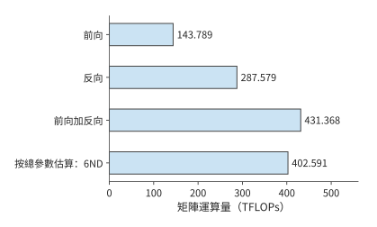

*圖 3-24　Qwen3-8B、8192 個 token 輸入的全參數訓練。全部輸入 token 執行詞表頭、沒有重計算；按矩陣逐項累計，前向加反向為 431.368 TFLOPs。*

把 402.591 TFLOPs 的粗算修正到 431.368 TFLOPs，需要先說明哪些工作漏算了、哪些多算了。查詢與上下文之間的矩陣乘法不對應一份模型參數，卻在前反向中貢獻 59.381 TFLOPs；另一方面，詞嵌入等模組雖然包含參數，但並不對每個 token 執行完整矩陣乘法，不能一律按 $6ND$ 計入。兩項修正相抵後，矩陣運算總量比粗算高約 7.15%。這屬於第 1.3.4 節所說的第一類差距：粗算漏掉了注意力的二次項，又多算了不參與完整矩陣乘法的參數，要改的是模型本身，與實現無關。只有修正後的下界，才能用來衡量系統的利用率。

將有效標籤數減到 4096，如果仍對全部 token 計算詞表投影，矩陣運算量就不變。如果先取出參與監督的 token 的隱藏向量，再只對它們執行詞表投影，總量則降到 416.074 TFLOPs。主幹網路仍處理全部輸入，節省的是不參與監督的 token 的詞表投影；反向時再把梯度放回對應位置。[^mask]

歸一化、啟用、損失與最佳化器也需要計算和讀寫。以參數更新為例，即使序列較短，仍要讀寫權重、梯度和最佳化器狀態；序列越短，這部分成本在總量中的佔比往往越高。因此，訓練預算既要考慮隨 token 數增長的矩陣計算，也要考慮由參數量決定的更新開銷。[^nonmatrix]

模型新增的前向操作，也會增加對應的反向計算。上下文壓縮需要對投影、池化和狀態更新求梯度，mHC 需要向各殘差通路傳播梯度，MoE 則要對實際選中的專家求梯度。[^v4-training] 第 2 章的計算圖因而也能用於判斷：訓練時要儲存哪些中間結果，反向又要執行哪些運算。

因此，序列長度變化時可以先判斷各項開銷的變化趨勢：參數投影隨輸入行數增長，注意力隨查詢—鍵配對數增長，最佳化器更新隨參數量和更新次數增長。若採用重計算，容量需求下降，但重做的前向運算還要加回 $F_{\mathrm{train}}$。這些變化都能沿同一張前向—反向圖逐項解釋。

> **練習 3-6〔延伸〕：一次參數更新需要多少計算、訓練狀態和監督 token**
>
> 從 $Y=XW$ 推導輸入梯度和權重梯度的尺寸，說明三次矩陣乘法的運算量為何相同。對 Qwen3-8B，按每參數 18 位元組計算長期訓練狀態的總容量，再將梯度改為 BF16，求節省的容量。設每個 micro-batch 含 2 條序列，每條有 4096 個輸入 token，其中 1024 個 token 參與監督。累計 8 個 micro-batch 後更新一次參數，求每次更新處理的輸入 token 總數和有效監督 token 總數。解釋僅遮蔽不參與監督的 token 的損失，與只對參與監督的 token 執行詞表投影，在計算量上有何區別。

## 3.5 強化學習（RL）

### 3.5.1 Rollout、獎勵與環境驗證

推理從外部請求開始，預訓練從已有文字開始。強化學習（RL）用行動得到的反饋來改進後續行動。在語言模型中，策略是給定上下文時選擇下一個 token 的機率分佈。RL 把兩條路徑連線起來：當前策略先生成回答，再由反饋決定如何更新參數，更新後的策略繼續產生下一批資料。生成過程通常稱為 rollout。

這條訓練路線已有公開實踐：DeepSeek-R1 給出了從 reasoning 任務和可驗證獎勵出發的做法。對程式碼、數學等容易檢查的任務，反饋可以來自規則或測試；對需要實際操作的任務，則要執行工具與環境。獎勵是用來評價一次回答或行動效果的數值。獎勵若由另一個模型生成，還會產生額外推理。一次「訓練迭代」因此可能包含多個模型、CPU 測試、沙箱等待和梯度更新。[^r1]

更近的模型把 RL 與其他訓練階段組合起來。DeepSeek V4-Flash 先透過 SFT 和 RL 訓練領域專家，再以多教師的同策略蒸餾（on-policy distillation，OPD）將多個專家的能力整合到同一個模型中。蒸餾讓學生模型學習教師模型給出的輸出資訊；OPD 由當前學生自己生成軌跡，教師在這些 token 位置提供候選輸出的機率分佈，學生據此學習。教師前向因此成為生成與更新之間的一項模型工作；規則驗證則以測試或程式執行提供反饋，需要另一組計算資源。[^v4]

沿這一迴圈分析資源時，先找資料的生產者和消費者：策略生成 token，獎勵函式或教師讀取回答，學習器讀取訓練樣本併產生新權重，負責生成的模型副本再使用新權重。某一角色變慢，後繼角色就要等待；增加教師模型則需要額外的前向計算和權重儲存空間。後續的並行安排都必須建立在這張依賴圖上。

### 3.5.2 有效樣本、策略更新與權重同步

生成回答和計算獎勵之後，還要決定哪些樣本用於學習。關鍵是區分已經生成的樣本與最終進入更新的樣本：前者決定生成開銷，後者決定訓練 batch，兩者的數量未必相同。

設一輪需要保留 $n_{\mathrm{keep}}$ 條樣本，生成樣本的平均保留比例為 $a$，則所需生成數的期望為

$$
n_{\mathrm{generate}}\approx\frac{n_{\mathrm{keep}}}{a}.
$$

保留 16 條樣本，比例為一半時平均需要生成 32 條，降為四分之一時平均需要 64 條。生成和評分處理全部回答，參數更新只處理保留樣本；保留比例下降會增加前兩個階段的工作，而不會按同樣比例擴大更新 batch。第 3.5.3 節將採用等長樣本，給定具體的生成數量，比較這兩種情況。

是否保留一條樣本，由訓練方法及篩選規則決定。有的方法把失敗回答作為負反饋，有的方法排除截斷或獎勵無效的回答。優勢表示某個回答相對於比較基準更好或更差的程度。採用組內相對優勢時，還要比較同一道題多份回答的獎勵。因此，保留樣本數決定更新時處理多少資料，獎勵和損失函式則決定這些資料產生何種梯度。

**例子：相同獎勵如何消除組內學習訊號。** 在使用組內相對獎勵的策略更新中，如果同組回答得到相同獎勵，減去組內平均獎勵後，每條回答的優勢都為零，相應的策略梯度也為零。回答全部正確就可能出現這種情況。模型完成了生成、評分和更新流程，卻沒有從這一組回答中獲得區分優劣的訊號。只有獎勵差異提供了非零優勢，策略損失才會推動參數沿相應方向調整。[^verl]

損失的求平均方式也會影響訓練。若目標是對整個 batch 的有效 token 求平均，累計各 micro-batch 梯度時就要使用整個 batch 的有效 token 總數作為分母。若先分別計算每個 micro-batch 的均值，再對這些均值求平均，有效 token 較少的 micro-batch 裡，token 就可能獲得更大權重。第 10 章將用具體訓練方法解釋這種差別。[^verl-loss]

更新後還要把策略權重送給生成端。若生成端繼續使用舊版本，下一批資料就仍由舊策略產生。同步迴圈可以等權重就緒後再生成；非同步方案允許部分階段重疊，卻要處理樣本版本與滯後。本章先明確這一依賴關係，第 10 章再討論交接、搶佔、恢復和資源配比。

### 3.5.3 有效樣本數固定時，各階段需要多少計算

這種區分可以用固定目純量化：每輪都要保留 16 條樣本用於更新。如果回答更難透過篩選，就必須先生成更多回答。

**例題 3-4：樣本保留比例下降時，為保持更新樣本數需要增加多少計算？**

解：以 Qwen3-8B 為例，設有八道題，每題生成四份回答，$P=1024,\ G=256$，共保留 16 條樣本用於一次策略更新。參考模型（reference model，權重保持固定、用來約束策略偏離程度的模型）與策略模型結構相同，分別儲存權重；參考模型對全部 32 份回答各執行一次前向，本例不呼叫教師模型。各樣本長度相同，生成時不提前停止，也不共享字首。[^rl]

生成時每條先做一次 prefill，再做 255 次 decode。訓練與評分時，軌跡已經確定，可以採用教師強制（teacher forcing）執行前向：每個預測步驟使用軌跡中已經確定的前一個 token，而不是等待模型重新生成它。因此，這些已知 token 可以一同計算。輸入長度 $P+G-1=1279$，256 個輸出標籤位於相應位置。16 條保留樣本每輪更新的輸入 token 共 20,464，監督輸出共 4096。輸入 token 決定上下文計算，參與監督的 token 決定損失作用於哪些輸出，二者分別進入訓練預算。

| 階段 | 處理樣本 | 矩陣運算量（TFLOPs） |
| --- | ---: | ---: |
| Rollout prefill | 32 | 465.143 |
| Rollout decode，255 步／條 | 32 | 129.056 |
| 參考模型，一次前向 | 32 | 634.944 |
| 教師評分，設為零次 | 0 | 0 |
| 策略更新，一次遍歷 | 16 | 952.416 |
| 合計 | 保留 16 條 | 2,181.559 |

將一條回答的生成與參考模型前向合計運算量記為 $f_g+f_r$，一次固定更新 batch 的運算量記為 $F_u$，則

$$
F_{\mathrm{cycle}}(n)=n(f_g+f_r)+F_u.
$$

參考模型讀取完整回答，可以一次處理多個已知 token；生成則逐 token 推進。上式雖然把運算量相加，仍需分別記錄各階段的矩陣形狀，才能根據對應的執行效率估算時間。

如果樣本保留比例從 1/2 降到 1/4，但仍要求得到 16 條保留樣本，教學對照改為生成 64 條。生成與參考模型計算翻倍，更新量不變，總矩陣運算量增到 3,410.701 TFLOPs，約增加 56.3%。每個保留樣本分攤的矩陣運算量從 136.347 增到 213.169 TFLOPs。增加的 1229.142 TFLOPs 全部來自額外回答的生成與參考模型計算；進入更新的 16 條樣本保持不變。[^rl-low]

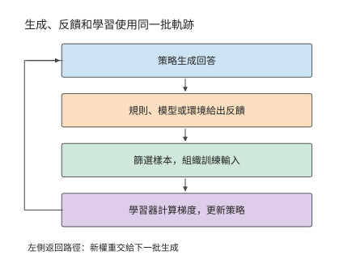

*圖 3-25　強化學習中的角色和資料流。生成端產生回答，反饋環節評價結果，篩選後送給學習器更新；新權重再用於下一批生成。*

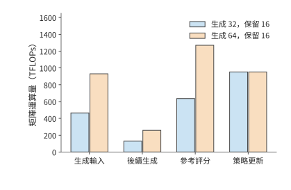

*圖 3-26　保持 16 條有效樣本的目標，生成數由 32 增到 64。生成時的輸入處理、後續 decode 和參考模型評分隨回答總數增加，策略更新處理的樣本數保持相同。*

更新完成後，生成副本需要獲得新權重。設有 $r$ 個副本，逐個獨立傳送大小為 $M_W$ 的完整權重，則傳輸量為 $rM_W$。Qwen3-8B BF16 的一份權重約為 16.381 GB，四個副本共需約 65.526 GB。最佳化器狀態留在學習器，用於下一次更新；生成副本只需要執行前向所需的權重。廣播或分層分發則可以讓多個副本共用部分傳輸路徑，減少重複傳送。

為各階段分配資源時，既要看運算量，也要看計算方式。生成階段的 decode 每步通常只處理各請求的一個新 token，在小 batch 下同時處理的 token 較少；評分和訓練則能一起處理已知回答中的多個 token，工具驗證還需要 CPU 和執行環境。分別估算各階段的耗時，再按生成、反饋、更新和權重同步的順序排列，才能得到完整週期。第 4 至 10 章將逐步介紹相應的硬體和排程方法。

> **練習 3-7〔核心〕：更新樣本數不變時，多生成回答會增加多少 RL 開銷**
>
> 保持一次更新使用 16 條等長樣本。利用例題 3-4 中分別生成 32 條和 64 條回答時的週期總運算量，求每多生成一條回答所增加的生成與參考模型運算量，以及一次更新所需的固定運算量。保持更新樣本數不變，據此預測生成 48 條回答時的週期總運算量。再用與生成模型結構相同的教師模型，對全部 48 條回答各執行一次前向計算，求新增的運算量。若將更新後的 BF16 權重分別傳送給四個副本，每個副本獨立接收一份，求總傳輸量。最後畫出生成、反饋、更新與同步的依賴，指出哪些階段可以在不同 batch 之間重疊。

## 3.6 從負載需求到訓練與服務預算

### 3.6.1 Scaling Law：模型規模與資料量的關係

單次更新的計算可以逐項求出，訓練多少參數、使用多少資料則需要另行決定。設總訓練計算預算為 $C$，參數量為 $N$，訓練 token 數為 $D$，主要計算近似滿足 $C=6ND$。增加 $N$ 就必須減少 $D$。要在兩者之間作選擇，就要知道參數與資料分別如何影響質量。Scaling Law（規模規律）用實驗擬合模型規模、訓練資料和損失之間的關係。下面採用冪律模型，其中參數與資料兩項都為正，訓練配置和損失評估方式固定：

$$
L(N,D)=E+\frac{A}{N^{\alpha}}+\frac{B}{D^{\beta}}.
$$

$L$ 是驗證損失，$E$ 是漸近損失，$A/N^\alpha$ 描述參數規模不足的影響，$B/D^\beta$ 描述資料量不足的影響。這裡的 $A,B,\alpha,\beta$ 都是擬合係數。單獨增加參數或資料會降低對應項；固定計算預算時，兩項卻向相反方向變化。

用 $D=C/(6N)$ 消去資料量，再對 $N$ 求導。最優點滿足

$$
\alpha A N^{-\alpha-1}=\beta B\left(\frac6C\right)^\beta N^{\beta-1}.
$$

左側是增加參數帶來的損失下降，右側是減少資料造成的損失上升；兩者相等時，再小幅改變參數量已經沒有淨收益。整理得到：

$$
N_{\mathrm{opt}}=\left(\frac{\alpha A}{\beta B}\right)^{1/(\alpha+\beta)}\left(\frac{C}{6}\right)^{\beta/(\alpha+\beta)}.
$$

由此得到的 $N_{\mathrm{opt}}$ 是連續取值的結果，實際設計時可在它附近選擇合適的層數和寬度。這一最優解只在固定訓練計算預算下最小化驗證損失，不含部署後的推理成本，也不考慮資料供給是否充足。模型上線後還要服務大量請求時，最優選擇可能偏向更小、訓練更充分的配置；第 3.6.2 節將用公開模型的訓練記錄，檢查實際投入與這裡的預測相差多少。

不同研究擬合出的分配指數並不一致。Kaplan 等人的早期研究給出約 $N\propto C^{0.73},\ D\propto C^{0.27}$ 的分配關係；Chinchilla 研究用不同的實驗和擬合得出：模型規模與資料量應隨預算更接近等比例增長。前一種分配更快增加模型參數，後一種把更多新增預算分給訓練資料；曲線及其擬合指數因此直接改變參數與資料的選擇。[^scaling]

**例題 3-5：訓練規模擬合關係能否預測更大模型的損失？** 從公開訓練記錄中選定六個較小模型的觀測值用於擬合，另將兩個較大模型的觀測留出。先選定擬合方法，再比較留出模型的預測值與實際觀測值。

解：datablations 是研究模型與資料規模變化的公開實驗記錄，C4 是這些記錄使用的一套文字語料。以其中八個模型為例，用六個較小模型擬合曲線，將 $N\ge2\times10^9$ 的兩個模型留作檢驗。兩個大模型的實際損失分別約為 2.574、2.337，擬合曲線預測為 2.583、2.363。預測略高於實際值，均方根誤差約為 0.0193 nats/token。nat 是使用自然對數時的資訊量單位，nats/token 表示每個 token 的平均損失。圖 3-27 用不同標記區分擬合點與檢驗點。[^fit]

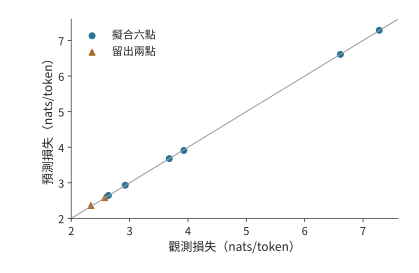

*圖 3-27　八個公開 C4 觀測的預測與實際損失。6 點用於擬合，2 點預先留出作檢驗；對角線表示預測等於觀測，點到線的偏差反映誤差。*

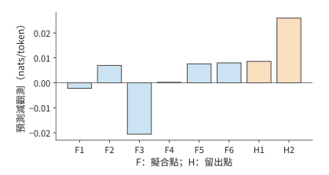

*圖 3-28　同一組預測誤差的放大檢視。F1—F6 為擬合點，H1—H2 為留出點；縱軸是預測減觀測，保留正負號。*

留出檢驗之所以必要，是因為擬合只保證曲線儘量貼近用於求係數的資料。將較大模型排除在擬合之外，再比較預測與實際損失，才能檢查這條關係能否預測新規模。這裡的兩個誤差分別約為 $0.009$ 和 $0.026$；將它們平方、取平均再開方，便得到均方根誤差。

預測出驗證損失之後，還要判斷模型能否完成實際任務。Llama 3 報告先根據訓練計算量預測損失，再建立損失與任務表現的關係。[^llama3] 這樣，程式碼、檢索和工具使用等任務的品質要求，才能進一步轉化為訓練規模與計算量的選擇。

擬合和預測都建立在單次訓練的觀測上，而訓練本身也有波動。同樣的資料與模型規模，改變隨機初始化就可能得到不同的學習曲線；較大模型在訓練尚未充分時，也未必優於較小模型。使用多個隨機種子重複訓練，可以區分規模變化帶來的趨勢與單次訓練的偶然波動。[^local-train]

長期服務會把每次呼叫的成本累積到訓練預算之上。較小模型可以靠更長的訓練達到目標質量：前期投入更多，之後每次呼叫讀取的權重更少、執行的運算也更少。Beyond Chinchilla-Optimal 將這種推理需求納入分析，47 個模型覆蓋 150M–6B；其中 150M 模型的訓練量最高達到每個參數 10,000 個 token，較大模型最高達到 1,000 個。[^beyond] 訓練預算與服務次數共同決定較小模型何時能收回額外訓練的成本。

**固定目標損失下的訓練投入與累計服務成本。** 固定擬合目標損失為 2.9，用矩陣運算量估算訓練與服務成本，再統一折算為 H100 SXM 的 GPU 時間（GPU 數量與使用時長的乘積，以 GPU 秒或 GPU 小時計）。請求取 $P=512,G=128$，訓練運算量為 $6ND$，每個完整請求的運算量為 $2N[P+(G-1)]$。H100 SXM 的 BF16 稠密峰值為 989.4 TFLOP/s；Llama 3 在 H100 上預訓練時報告的 BF16 MFU（定義見第 1.2.2 節）為 38%–43%，訓練與服務都取 40%，折算後每 GPU 秒完成 395.76 TFLOP。[^llama3] 0.1B 模型需要約 298.6B 訓練 token，超過擬合所用資料量的上界，因此成本圖用虛線標註這條外推曲線。按這條外推曲線計算，0.1B 模型訓練約需 125.7 H100 GPU 小時，比 0.5B 模型多 73.5 GPU 小時；每次呼叫則少用約 0.00129 GPU 秒。呼叫約 2.048 億次時，兩者總成本相等。在此之前，0.1B 模型多付的訓練成本尚未收回；在此之後，每次服務節省的成本累計超過了前期投入。訓練與服務按同一係數折算，所以該交點只取決於運算量，與 MFU 的取值無關。[^lifecycle]

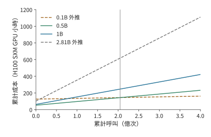

*圖 3-29　訓練與服務累計成本的題設比較。截距是訓練投入，斜率是單次呼叫成本；虛線標出超出擬合參數或資料範圍的方案，豎線為約 2.048 億次的成本交點。圖例中的 B 表示十億個模型參數；縱軸為按 40% MFU 折算的 H100 SXM GPU 小時。*

回到參數與資料的分配，還可以直接預測預算增加後的結果。由最優解表示式可得 $N_{\mathrm{opt}}\propto C^{\beta/(\alpha+\beta)}$，再代回計算約束，得到 $D_{\mathrm{opt}}\propto C^{\alpha/(\alpha+\beta)}$。若兩個指數相等，預算增至四倍，參數和訓練資料各增至兩倍。擬合指數的意義由此變得具體：指數決定新增計算應如何分給模型與資料。

> **練習 3-8〔延伸〕：如何在模型參數與訓練資料之間分配計算預算**
>
> 採用損失模型 $L=E+A/N^\alpha+B/D^\beta$ 和計算預算約束 $C=6ND$，推導使損失最小的參數量 $N$ 與資料量 $D$ 分別如何隨計算預算 $C$ 增長。取 $\alpha=\beta$，當計算預算分別增至原來的四倍和九倍時，最優參數量和資料量應各增至原來的多少倍？再使用例題 3-5 的八個 C4 觀測點，用其中六個擬合、另外兩個檢驗，計算兩個檢驗點的預測誤差，並解釋為什麼擬合點上的誤差不能替代留出檢驗的誤差。

### 3.6.2 從 Llama 到 Qwen 的訓練投入

第 3.6.1 節的擬合說明了模型規模與訓練資料之間如何取捨。本節用公開模型的訓練記錄分析開發者實際採用的訓練投入：先比較每個參數對應的訓練 token 數，再將演算法運算量與具體硬體上的訓練時間區分開。

從各報告披露的階段和規模，可以看到一種趨勢：在相近的 7–8B 參數規模下，訓練 token 數持續增加。[^history]

| 模型與報告範圍 | 訓練 token | $D/N$ 粗略估算 | $6ND$ 粗略估算 |
| --- | ---: | ---: | ---: |
| Llama 1，6.7B | 1T | 149 | $4.02\times10^{22}$ FLOPs |
| Llama 2，約 7B | 2T | 286 | $8.40\times10^{22}$ FLOPs |
| Llama 3.1，約 8B | 約 15T | 約 1,875 | 約 $7.20\times10^{23}$ FLOPs |
| Qwen2.5，約 7B，模型系列披露 | 約 18T | 約 2,571 | 約 $7.56\times10^{23}$ FLOPs |
| Qwen3，約 8B，模型系列披露 | 約 36T | 約 4,500 | 約 $1.728\times10^{24}$ FLOPs |

$D/N$ 將資料投入換成「每個參數對應多少訓練 token」。表中約 7–8B 的稠密模型，$D/N$ 從約 149 增至約 4,500，說明參數量相近的模型，訓練資料量也可以相差懸殊。前期訓練成本隨資料增加，部署後每次呼叫的權重容量卻仍主要由參數數量決定。因此，更充分訓練的小模型可能增加一次性投入，同時降低長期服務成本。

這組數字也澄清了第 3.6.1 節的擬合結果與實際訓練投入的關係。按 Chinchilla 的等比例分配，約 8B 模型的計算最優資料量約為每參數 20 個 token，即約 160B token；表中實際投入從 1T 增至約 36T，超出這一基準一至兩個數量級。兩者回答的問題不同：擬合在固定訓練計算預算下最小化驗證損失，開發者則把上線後的服務成本計入目標，在資料供給充足、預期呼叫量大時選擇更小、訓練更充分的模型。第 3.6.1 節引用的 Beyond Chinchilla-Optimal 和第 3.6.3 節的成本交點公式給出了這種選擇的定量條件。訓練預算最優與全生命週期最優是不同的目標，實際投入超出前者並不表示前者算錯了。

更長訓練、資料篩選、蒸餾和後訓練，都是用更多前期工作提高給定規模模型的任務能力。Llama 3 模型卡的基礎模型評測中，Llama 3 8B 與 Llama 2 70B 在覆蓋多學科選擇題的 MMLU 基準上分別為 66.6／69.7，使用維基百科證據的問答基準 TriviaQA-Wiki 為 78.5／87.5。[^llama3-card] 兩項差距不同，說明部署方要按自己的任務選擇品質要求；達到質量門檻的小模型，才有機會把較小權重帶來的容量與讀取收益轉成服務收益。

分析大模型和 MoE 時，則要分別列出總參數量與啟用參數量。DeepSeek-V3 報告為總參數 671B、每 token 啟用約 37B、預訓練 14.8T；DeepSeek V4-Flash 為 284B／約 13B、32T，DeepSeek V4-Pro 為 1.6T／約 49B、33T。總權重影響容量，啟用參數只提供計算量的粗略估計。DeepSeek V4-Flash 主幹專家的三個投影可單獨計算：

$$
C_{\mathrm{expert/token}}=18n_Lhf(k_{\mathrm{routed}}+k_{\mathrm{shared}})=18n_Lhf(6+1).
$$

式中 $n_L$ 為主幹層數，$h$ 為隱藏維度，$f$ 為專家中間維度，$k_{\mathrm{routed}}$ 與 $k_{\mathrm{shared}}$ 為每 token 選中的路由專家數與共享專家數；係數 $18=3\times2\times3$，依次對應三個投影、每次乘加計 2 FLOPs、前反向合計為前向的三倍。DeepSeek V4-Flash 的主幹專家約 45.4495 GFLOPs/token，按 32T 累計約 $1.45438\times10^{24}$ FLOPs；DeepSeek V4-Pro 約 169.2465 GFLOPs/token，按 33T 累計約 $5.58513\times10^{24}$ FLOPs。整步訓練計算由這些專家矩陣與注意力、路由、MTP、最佳化器和重計算共同組成。報告的損失權重也不是執行比例，例如 MTP 權重為 0.3，不表示只執行 30% 的輔助計算。[^training]

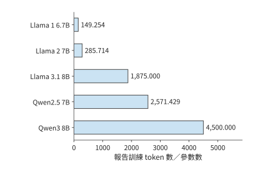

*圖 3-30　相近參數規模的模型投入不同數量的訓練 token。柱值為報告訓練資料量除以參數量，Qwen 採用模型系列披露的資料預算。*

> **練習 3-9〔延伸〕：增加訓練資料或專家數量會改變哪些資源需求**
>
> 根據 Llama／Qwen 表重算 $D/N$ 與 $6ND$。若參數量保持不變、訓練資料量增至四倍，預測訓練計算與上線後的純權重容量分別如何變化。對 MoE，說明總專家數加倍、每 token 選中數不變時，參數容量與專家訓練計算能否都按兩倍估算。

除運算量外，訓練投入還常用 GPU 小時計量。若持續使用 $n_{\mathrm{GPU}}$ 張卡，總 GPU 小時為 $H_{\mathrm{GPU}}$，實際歷時為

$$
T_{\mathrm{calendar}}=\frac{H_{\mathrm{GPU}}}{n_{\mathrm{GPU}}}.
$$

Llama 1 65B 的訓練消耗 1,022,362 A100 GPU 小時。持續使用 2048 張卡，對應約 499.2 小時，即 20.80 天；在相同加速器效率下只使用一半卡數，則需要約 41.60 天。GPU 小時體現總投入，卡數決定完成這些工作需要多少實際時間。

DeepSeek-V3 報告預訓練 2.664M H800 GPU 小時；14.8T token 只對應預訓練階段；按持續使用 2048 卡計算，約需 54.20 天。後續的上下文擴充套件與後訓練另有用量，但各階段統計範圍不同，不能一併除以預訓練 token 數。[^history]

用 GPU 小時換算實際歷時，要除以同期使用的卡數。對 Llama 3.1 405B，取公開的 30.84M H100 GPU 小時，並假設這項工作全部使用最大規模 16,384 卡，實際歷時約為 $30.84\times10^6/(16384\times24)\approx78.43$ 天。某個階段使用的卡數更少時，相同 GPU 小時需要更長的實際時間；訓練資源的分配時序因此決定訓練完成時間。

上述用量來自三種加速器，GPU 小時不能直接跨裝置比較投入規模。按 BF16 稠密峰值算力折算：A100 80GB 為 312 TFLOP/s，H100 與 H800 同為 989.4 TFLOP/s（H800 只是互聯頻寬更低），一個 H100 或 H800 GPU 小時約相當於 $989.4/312\approx3.17$ 個 A100 GPU 小時。圖 3-31 把三組公開用量統一折算為 A100 80GB 等效小時；折算假定各裝置的實際利用率相近，用於比較投入規模，不表示效率或成本差異。

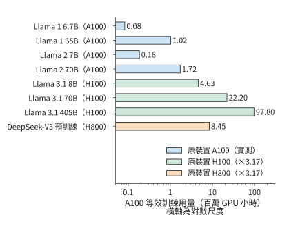

*圖 3-31　Llama 與 DeepSeek-V3 的公開訓練用量統一折算為 A100 80GB 等效 GPU 小時。Llama 1／Llama 2 為 A100 實測小時；H100 與 H800 小時按 BF16 稠密峰值之比 $989.4/312\approx3.17$ 折算，DeepSeek-V3 只計預訓練階段。橫軸為對數尺度；折算假定各裝置實際利用率相近，不表示效率或成本差異。*

以上幾組用量都屬於預訓練，後訓練的投入同樣可以用 GPU 小時比較。Qwen3 技術報告的表 21 把同一個 8B 模型的 RL 與 OPD 兩條後訓練路線並列，投入分別為 17,920 與 1,800 GPU 小時。兩條路線可以二選一，各自包含生成、反饋與學習工作。把 GPU 小時對應到具體階段和加速器，再結合各階段的執行過程，就能解釋訓練投入主要消耗在哪裡。

### 3.6.3 滿足品質要求的全生命週期成本

現在把第 2 章與本章的分析合在一起。模型結構決定每次呼叫所需的儲存容量、運算量和讀取量，負載決定呼叫次數與等待，訓練決定上線前的投入。設模型 $m$ 的前期成本為 $C_0(m)$，未來有 $Q$ 個任務，第 $j$ 類佔比為 $w_j$、完成一個任務的平均成本為 $c_j(m)$，則

$$
C_{\mathrm{life}}(m)=C_0(m)+Q\sum_jw_jc_j(m).
$$

比較之前，各模型都要滿足相同質量、時限與完成條件。若任務成功率不同，$c_j$ 中還需包含失敗和重試；價格變化、模型壽命、維護與貼現等假設也應在給出預算時說明。專用硬體若需要較長部署週期，模型版本能使用多久也會成為這一選擇的條件。

考慮都滿足任務質量和時限的兩個模型。若較小模型需要額外訓練成本 $\Delta C_0$，但每個成功任務能節省 $\Delta c>0$，累計成本相等的呼叫量為

$$
Q_* = \frac{\Delta C_0}{\Delta c}.
$$

若較小模型額外訓練 10 萬 H100 GPU 小時，即 $3.6\times10^8$ GPU 秒，每個任務節省 0.72 H100 GPU 秒，則 $Q_*=3.6\times10^8/0.72=5\times10^8$，即五億次任務。預期需求低於此數，額外訓練成本尚未收回；高於此數，較小模型累計節省更多。容量、延遲、質量和呼叫量共同決定選擇，單看模型大小或 token 單價無法完成這一判斷。

> **練習 3-10〔延伸〕：訓練完成時間與累計服務成本**
>
> 假設完成訓練共需 1,022,362 A100 GPU 小時，即 Llama 1 65B 的公開用量。分別持續使用 2048 張和 1024 張 A100，並假設加速器數量改變後總 GPU 小時不變，求兩種配置下完成訓練所需的天數。再比較兩個滿足相同質量與時限的模型：小模型多投入 10 萬 H100 GPU 小時訓練，每個成功任務節省 0.72 H100 GPU 秒。預計完成兩億項和十億項成功任務時，分別應選擇哪個模型？計算總成本差，並說明若實際任務量發生變化，選擇會在何處反轉。

後續章節將使用本章整理出的三類負載資訊。下表列出各類負載需要記錄的內容，以及這些資訊將用於哪些系統設計問題。

| 負載 | 必須保留的欄位 | 後續使用 |
| --- | --- | --- |
| Chat／Agent | 任務檢查、模型與版本、每輪輸入／命中／輸出、到達、工具依賴、分支與複用間隔 | 第 8 章安排批處理與狀態；第 9 章交接與路由；第 11 章管理工具環境 |
| 視覺／即時 | 原圖位元組、$\mathrm E/\mathrm P/\mathrm D$、EC/KV、幀或塊到達、首響應／連續播放要求、打斷後不再需要的計算 | 第 8、9 章安排編碼和交接；第 12 章加入鏈路 (Link)與執行位置 |
| 訓練／RL | 資料與質量、長度和標籤、micro-batch／更新、生成樣本數／保留樣本數、獎勵計算與模型呼叫、權重版本、完成期限 | 第 4–7 章分析算力、儲存與通訊需求；第 10 章安排學習；第 11 章配置環境與資源池 |

這三類例子都說明，描述負載需要記錄具體的執行過程。兩分鐘請求中，各時段的輸入輸出比例決定積壓何時出現；程式碼 Agent 中，工具依賴決定等待時間，以及狀態需要儲存多久；RL 中，篩選前後的樣本數決定生成與更新階段各處理多少資料。掌握這些資訊，才能為各階段安排資源。

第 4 章將結合晶片的算力、儲存容量與頻寬，分析這些負載如何在加速器上執行。本章算出的矩陣尺寸、狀態大小和訪問次數，將用於判斷計算需要多久、資料能否容納，以及讀寫能否及時完成。各階段的依賴關係則決定哪些工作可以重疊，哪些必須等待。

## 謬誤與陷阱

**誤區：平均請求率和長度相同，負載就相同。** 少量超長請求、輸入與輸出長度的組合、請求到達順序，都會影響短時間內的資源需求。例題 3-1 中，處理能力足以應付平均到達量，後一分鐘卻仍會積壓。

**誤區：token 單價降低，成功任務成本就會降低。** 額外思考、未透過檢查的回答、工具與環境都應進入分子，合格任務數進入分母。零成功的 batch 只能報告消耗與失敗，不能估計成功成本。

**誤區：訓練 token 總數相同，系統工作量就相同。** 序列分佈改變注意力查詢—鍵配對的數量，標籤與詞表頭策略改變輸出工作，更新次數改變最佳化器成本；RL 還要為沒有采用的回答付出生成與反饋的開銷。

**誤區：Scaling Law 擬合出的計算最優規模，就是應該採用的訓練規模。** 計算最優只在固定訓練預算、不計推理成本時成立。公開模型的每參數訓練 token 數超出這一基準一至兩個數量級，是把長期服務成本計入目標後的選擇；目標函式不同，不表示擬合結果被推翻。

## 程式碼任務軌跡

任務是修復區間合併函式，使巢狀區間和端點相接的區間正確合併，同時不修改輸入及其巢狀列表。模型可以讀取指定檔案、改寫它、執行固定測試並結束任務，控制器不替模型修改程式碼。關閉思考模式時，模型在 12 輪內讀檔案一次、改寫五次、執行測試六次，仍未完成；開啟後，四輪分別是輸出截斷、寫檔案、執行測試和結束。首輪截斷產生的等待同樣計入任務總時間。[^agent]

[^model]: [第 2 章模型架構](02-模型架構.md)，§2.2 的請求呼叫約定和 Qwen3-8B KV 計數；[四模型請求計算](../calculations/results/request-four-models-book.md)。

[^cost]: [2023—2026 年 token 成本調研](../research/token-cost-2023-2026/report.md)，§2、§4、§11；API 價格、生產成本與成功任務成本分開。

[^servegen]: [ServeGen，NSDI 2026](../references/proceedings/NSDI/2026/selected/nsdi26-xiang-servegen.pdf)，§2–7；[資料與原始碼閱讀筆記](../case-studies/workload-and-provisioning.md)。

[^workload]: [請求分佈與資源配置](../case-studies/workload-and-provisioning.md)，兩分鐘固定輸入和首 token 修正後的階段需求；[RTX PRO 6000 上 64 條序列的 decode 頻寬下界](../calculations/results/batch-reuse-rtxpro6000-mix.md)，平均上下文取 2742 個 token。

[^arrival]: [練習 3-2：真實兩分鐘回放](../experiments/ch03/03-02/README.md)，完整輸入、傳送與完成記錄、KV 取樣及執行範圍。

[^serve-replay]: [ServeGen 視窗的實際回放](../experiments/ch03/03-02/servegen-replay/README.md)。

[^agent-calc]: [開啟思考模式的真實軌跡復算](../calculations/results/agent-thinking-on.md)。

[^context]: [上下文組織與 Agent 案例](../case-studies/author-context-and-design.md)，連線作者 AI Agent 書第 2 章與實驗記錄。

[^reasoning]: [練習 3-3：1024 預算](../experiments/ch03/03-03/README.md)與[4096 預算](../experiments/ch03/03-03/wide-budget/README.md)；理論背景見[Test-Time Compute](../references/files/papers/test-time-compute.pdf)。

[^reasoning-off]: [關閉思考模式的診斷](../experiments/ch03/03-03/no-thinking/README.md)，分別記錄按預定標準評分的結果、事後從輸出中提取答案的結果，以及並行程序的觀測資料。

[^agent]: [練習 3-4：兩條程式碼 Agent 軌跡](../experiments/ch03/03-04/README.md)，含獨立檢查與額外別名條件。

[^retrieval]: [檢索與生成算例](../case-studies/retrieval-and-generation.md)。

[^agent-speedup]: [僅將首輪模型段加速兩倍](../calculations/results/agent-thinking-on-double-first.md)。

[^jev]: [TypeSafe AI 首頁](../references/text/typesafe-home.txt)的定價與並排演示；[釋出部落格](../references/text/typesafe-jev-blog.txt)含創始人自述，並說明並行取樣、RLCD 與評測口徑；[介面檔案](../references/text/typesafe-docs-intro.txt)說明問題在同一狀態上並行求值。

[^rlcr]: [Beyond Binary Rewards: Training LMs to Reason About Their Uncertainty](../references/files/papers/rlcr.pdf)，§3 的 RLCR 獎勵。

[^decision-calc]: [決策請求的執行路徑與定價比較](../calculations/results/decision-request-book.md)，含 V4.1 Flash 全層路徑、512 個輸出 token 的 LLM 路徑與 DeepSeek 價目對照，可用 `python3 calculations/calc.py decision-request --format md` 復算；[DeepSeek 推論系統概述](../references/text/deepseek-serving-report.txt)的每 GPU 小時 2 美元口徑；[DeepSeek 模型與價格](../references/text/deepseek-pricing-zh.txt)。

[^vision]: [視覺編碼矩陣與張量計數](../calculations/results/vision-encoding-single.md)。

[^epd]: [多模態輸入的位元組、狀態與階段放置](../case-studies/multimodal-stage-placement.md)，固定 Qwen3-VL-4B 配置、預處理與完整 DeepStack EC。

[^media]: [生成模型取材與執行路徑](../case-studies/generative-multimodal-models.md)；[Omni 音訊](../calculations/results/omni-audio-book.md)、[Fish 音訊](../calculations/results/fish-audio-book.md)、[FLUX 影象](../calculations/results/image-generation-flux.md)、[H3 影片](../calculations/results/video-generation-book.md)、[Wan 影片](../calculations/results/video-generation-wan.md)。

[^image]: [Qwen 影象生成請求計數](../calculations/results/image-generation-book.md)。

[^aoi]: [AOI 論文與關鍵幀案例](../case-studies/author-context-and-design.md)。

[^audio-real]: [兩份歷史語音記錄](../experiments/ch03/03-05/historical-arrivals/README.md)。

[^audio]: [40 ms 緩衝教學時序](../calculations/results/audio-timing-base.md)與[60 ms 緩衝](../calculations/results/audio-timing-large-buffer.md)。

[^audio-interrupt]: [打斷與靜音的教學算例](../calculations/results/audio-timing-interrupt.md)。

[^training]: [訓練計算量筆記](../case-studies/training-compute.md)，線性層前反向、序列分佈與 DeepSeek V4-Flash 專家分項計算。

[^train-matrix]: [Qwen3-8B 的 8K 訓練矩陣](../calculations/results/training-qwen3-8b-t8192.md)。

[^qwen]: [Qwen3 技術報告](../references/files/papers/qwen3.pdf)，§3.2 的三階段預訓練及表 21 的後訓練分支。

[^mask]: [標籤減半](../calculations/results/training-qwen3-8b-mask-half.md)與[顯式壓縮詞表頭](../calculations/results/training-qwen3-8b-compact-half.md)。

[^nonmatrix]: [訓練非矩陣補算](../calculations/results/training-nonmatrix-book.md)，與[8K 變體](../calculations/results/training-nonmatrix-8192.md)分別計量。

[^v4-training]: [DeepSeek V4-Flash 線上壓縮器](../calculations/results/v4-online-r4-tail-emits.md)、[注意力反向](../calculations/results/v4-attention-training-window128.md)、[MoE 單層訓練](../calculations/results/v4-moe-training-balanced.md)、[mHC 包裝反向](../calculations/results/v4-hc-training-128.md)、[最佳化器分組](../calculations/results/v4-optimizer-flash-base-unresolved.md)。

[^r1]: [DeepSeek-R1 報告](../references/files/papers/deepseek-r1.pdf)。

[^v4]: [DeepSeek V4 報告](../references/files/papers/deepseek-v4.pdf)，§5.1 的領域專家與多教師 OPD、§5.2 的教師排程、rollout 與沙箱。

[^verl]: [實驗 10-8：固定 verl 最小訓練流程](../experiments/ch10/10-08/README.md)。本章用這一實驗區分任務質量與參數更新，完整系統的組織方式見第 10 章。

[^verl-loss]: [固定 verl 訓練配置的損失歸一化與參數更新過程](../research/2026-infra-survey/qa/verl-recipe-loss-closure.md)，繫結原配置、原始碼與匯出張量。

[^rl]: [Qwen 教學 RL batch](../calculations/results/rl-qwen8-base.md)。

[^rl-low]: [降低樣本保留比例、保持保留樣本數](../calculations/results/rl-qwen8-low-acceptance.md)。

[^scaling]: [Kaplan Scaling Laws](../references/files/papers/scaling-laws.pdf)，§6；[Chinchilla](../references/files/papers/chinchilla.pdf)，計算最優分配與擬合方法。

[^fit]: [公開 C4 八點擬合](../calculations/results/datablations-real-c4-eight-point-fit.md)，來源日誌、排除項和四項敏感性隨報告儲存。

[^llama3]: [Llama 3 報告](../references/files/papers/llama3.pdf)，訓練預算、損失預測與下游任務表現；§3.3.2 與表 4 給出 H100 上 38%–43% 的 BF16 MFU。

[^llama3-card]: [Meta Llama 3 模型卡](../references/token-cost/2026-09-07/llama3-card.md)，Base pretrained models 表中 Llama 3 8B 與 Llama2 70B 兩列。

[^local-train]: [練習 3-8：固定文字上的六次小模型實訓](../experiments/ch03/03-08/README.md)，儲存 checkpoint 與兩個 seed 的完整結果。

[^beyond]: [Beyond Chinchilla-Optimal，ICML 2024 正式版](../references/outline-checks/2026-09-07/beyond-chinchilla-icml24.pdf)，推理需求、實驗範圍與長訓練外推。

[^lifecycle]: [根據 C4 擬合結果估算生命週期成本](../calculations/results/real-c4-lifecycle-512-128.md)，費用按 H100 SXM GPU 秒計。

[^history]: [訓練投入與 Scaling Law 歷史筆記](../case-studies/scaling-history.md)及[鎖定公開欄位的復算](../calculations/results/training-history-published.md)。

[^source-1]: [多模態計算資料](../case-studies/generative-multimodal-models.md)。

[^v41-case]: [DeepSeek V4.1 官方技術報告](../calculations/sources/deepseek-v4.1-flash/DeepSeek_V41_Tech_Report.pdf)，第 1、2、3 節與第 6 節；[跨章會話的固定條件與復算](../calculations/results/v41-throughline.json)。

## 本章小結

持續服務的負載既取決於每次請求要做多少工作，也取決於請求何時到達、各步驟之間有哪些依賴。用平均速率可以粗略估算所需資源；分析短時間內的積壓和狀態駐留時間，則能發現平均值未體現的資源壓力。多輪任務還包含工具等待與失敗嘗試，即時任務要保證資料及時到達，訓練則增加反向、參數更新和權重同步。

比較不同方案的資源與成本時，應採用相同的品質要求和任務完成標準。Scaling Law 為訓練分配提供可檢驗的統計模型，長期服務需求又可能改變前期投入的選擇。核心練習 3-2、3-4、3-7 分別把這些方法用於持續請求、互動任務和 RL 迴圈。

