# 第 6 章 超節點

上一章把矩陣分成小塊，讓輸入在計算單元附近多用幾次。現在把其中一塊交給另一張加速卡：這張卡需要哪些輸入，算完得到的是完整輸出還是部分和，結果又由誰接著使用？數學沒有變，但原來經過共享記憶體的資料，現在可能要穿過加速器互聯甚至機房網路。同一種分塊方式，由此變成了多卡並行方案。

給定八張卡，可以讓各卡分別處理請求，也可以合力加速一個請求；切分方式既要容納模型，又要達到延遲與成本目標。本章從運算子的維度與依賴出發，逐步推導各種並行方式產生的通訊，最後用給定的模型、八卡硬體和會話期限篩選方案。讀完本章，讀者應當能夠為自己的模型和硬體列出可選的方案，排除不可行的，再根據瓶頸和測量結果做出選擇，而不只是記住幾個並行方式的縮寫。

上一章研究單個加速器內的計算、資料複用與任務執行。多卡並行面對的仍是同一組問題：沿哪些維度切分，每一塊放在哪裡，各塊需要哪些輸入、結果在哪裡匯合，以及按什麼順序執行。本章把單卡運算子的分塊與排程擴充套件到多張卡：先把矩陣和狀態分到多張卡，推導由此產生的通訊，再把通訊放到實際連線上，最後決定一個例項使用多少張卡、同時部署多少個例項。本章的硬體是常見的 HGX H100 八卡伺服器，貫穿推導的模型有兩個：Qwen3-235B-A22B 的權重要佔滿整臺伺服器，用來說明容量、專家分工和 MoE 通訊；Qwen3-32B 的權重可以放入一張卡，長上下文的 KV 卻迫使模型跨卡，用來比較張量並行的卡數與例項數。其他模型和系統則用來說明結構變化對設計的影響。

## 6.1 從單卡到多卡

### 6.1.1 八張卡的獨立部署與協作

第 1 章介紹的推理例項可以佔用一張卡，也可以把模型分佈在多張卡上。超節點則為例項內的頻繁協作提供物理資源：其中的加速器經高頻寬、低延遲的互聯緊密相連。

推理例項描述模型如何部署和執行，超節點描述加速器如何互聯。八卡超節點可以放八個單卡例項，也可以放兩個四卡例項。前者的八個請求彼此獨立；後者每個請求要在四張卡之間交換中間結果。伺服器和機櫃是安裝與供電的單位；同一例項的各張卡可以都在同一臺伺服器內，也可以分佈在多臺伺服器上。

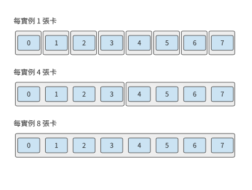

*圖 6-1：相同八張卡上的三種例項分組。每個外框表示一個獨立推理例項，內部連線表示完成請求所需的協作。各例項一次處理一個請求時，三種部署方式分別能同時處理八個、兩個和一個請求。*

用更多的卡，通常出於三種需求：模型權重超過單卡記憶體，要分散儲存；單個請求執行過慢，要把計算分給多張卡；同時到來的請求過多，要增加能獨立處理請求的例項。這三種需求分別對應容量、延遲和吞吐量三個目標。

### 6.1.2 貫穿算例：Qwen3-235B-A22B 的容量與單步時間

本章的貫穿算例是：在一臺 HGX H100 伺服器上執行 Qwen3-235B-A22B，模型已處理完輸入，快取中有 8192 個上下文 token，需要繼續生成。HGX H100 是常見的八卡伺服器：八張 H100 SXM 各有 80 GB HBM，峰值頻寬 3350 GB/s，BF16 稠密矩陣運算的峰值為 989.4 TFLOP/s；八張卡經 NVSwitch（組織 NVLink 交換網路的交換晶片）用第四代 NVLink 互聯，每張卡每個方向 450 GB/s；每張卡另配一張 400 Gbit/s（50 GB/s）的 ConnectX-7 網路卡，用來連線其他伺服器。[^hgx]

多卡設計首先要確定資料放在哪裡。第 $i$ 張卡同時儲存的權重 $W_i$、KV 狀態 $K_i$、啟用 $A_i$ 和其餘工作區 $U_i$，應滿足

$$
W_i+K_i+A_i+U_i\le C_i. \tag{6-1}
$$

這裡 $C_i$ 是該卡可供任務使用的記憶體。權重隨模型確定，KV 隨會話上下文增長，啟用和工作區隨執行方式變化。這四項在同一時刻共用該卡的實體記憶體。

**Qwen3-235B-A22B 的模型規模。** 模型用 BF16 儲存權重與 KV，共 94 層，隱藏維為 4096；每層有 64 個查詢頭、4 個 KV 頭，頭維為 128。FFN 由 128 個路由專家組成，每個 token 選其中 8 個，每個專家的中間維為 1536。GB、TB 使用十進位制，MiB、GiB 使用二進位制。

先求容量。全模型 BF16 權重約為 470.2 GB。每個上下文 token 需要儲存每層的 K 和 V，因此全模型每 token 的 KV 為

$$
2\times94\times4\times128\times2=188\ \mathrm{KiB}.
$$

8192 個 token 的 KV 共約 1.58 GB。為啟用和其餘工作區預留 2 GiB，即約 2.15 GB，單卡總需求約為 473.9 GB，接近一張 H100 容量的六倍。

要容納模型，就必須把這些資料分到八張卡：權重按矩陣的行或列分成八份，每張卡各儲存一份；工作區仍然每卡各留一份。KV 按注意力頭劃分，而該模型只有 4 個 KV 頭：八張卡時，每兩張卡共用一個 KV 頭，各自儲存一份，所以每卡儲存全部 KV 的四分之一。這種分法如何保證計算結果不變，見第 6.2.2 節。每卡記憶體需求變為：

| 放置 | 權重 | KV | 啟用與工作區預留 | 合計 |
|---|---:|---:|---:|---:|
| 單卡 | 470.2 GB | 1.58 GB | 2.15 GB | 473.9 GB |
| 八卡中的每卡 | 58.96 GB | 0.39 GB | 2.15 GB | 61.50 GB |

每卡約需 61.50 GB，低於 H100 的 80 GB；整臺伺服器合計約 492.0 GB，640 GB 中還剩約 148 GB。每卡權重比 470.2 GB 的八分之一略多，因為歸一化參數和路由器在每張卡上都有一份副本。每卡剩下的約 18.5 GB 可以儲存更多會話：按這種分法，一個 8192 token 的會話在每卡佔 0.39 GB，整臺伺服器最多同時儲存 47 個這樣的會話。分散儲存降低了每卡的記憶體需求；例項的總記憶體佔用則是各卡佔用量之和。[^dense]

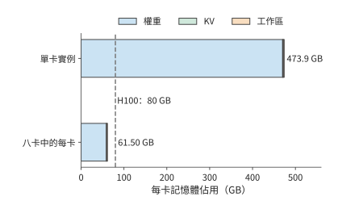

*圖 6-2：單卡例項與分到八張卡後的每卡記憶體需求。單卡需要約 473.9 GB，遠超 H100 的 80 GB（虛線）；分到八張卡後每卡約 61.50 GB。2 GiB 工作區在每張卡分別預留。*

接著求執行時間。記憶體容量決定能否儲存這些資料，訪問量決定一次執行需要讀取或寫入多少資料。以一層的專家計算為例：生成一個 token 時，路由器選中 8 個專家，每個專家有三個矩陣，權重共 $8\times3\times4096\times1536\times2=288$ MiB，都要從 HBM 讀一遍。按 3350 GB/s 讀取一次，約需 90.1 μs；矩陣乘法約有 3.02 億 FLOPs，按 989.4 TFLOP/s 執行只需約 0.31 μs。權重讀取時間比計算時間長兩個多數量級，因此，要縮短這次呼叫的時間，首先應減少每卡讀取的權重。整個模型生成一個 token 要讀取約 43.1 GB 權重和 1.58 GB KV，若全部由一張卡讀取，約需 13.3 ms；按上面的分法均分到八張卡，每卡約讀 5.79 GB，約需 1.73 ms。

運算子的計算與記憶體存取重疊執行時，執行時間可以用下式估計：

$$
T_{\mathrm{op}}=\max\left(\frac{F}{P},\frac{V}{B_{\mathrm{HBM}}}\right). \tag{6-2}
$$

$F$ 是運算量，$P$ 是矩陣運算效能，$V$ 是 HBM 訪問量，單位為位元組。計算和記憶體存取同時進行，耗時較長的一項決定運算子的執行時間。後一個運算子要等前一個運算子的輸出，因此依次執行的各段時間要相加。式 (6-2) 就是第 4.8.1 節的 Roofline 模型。按第 1.2.2 節的定義，單個 token 呼叫的 MFU 不會超過 $0.31/90.1$，即約 0.3%。這是 batch 為 1 時硬體允許的上限，與實現好壞無關；本章討論的各種並行方式，都是在這一約束下重新組織權重的讀取與複用。第 6.2 節將說明如何把這一層的權重和計算分配到多張卡，第 6.4 節再計算各卡交換結果所需的時間。

### 6.1.3 Prefill、Decode 與訓練對資源的不同要求

第 6.1.2 節的 90.1 μs 與 0.31 μs 對應單 token 呼叫。若一次處理更多 token，同一份權重就能供多行輸入使用，計算與讀取時間的比例也會改變。一次呼叫處理 $m$ 個 token 時，專家的運算量與 $m$ 成正比，被選中專家的權重卻可以在這些 token 之間複用。把上例從單 token 改為 8192 個 token 的 prefill，128 個專家全部被選中，一層專家權重的讀取量增到 4.5 GiB，按 3350 GB/s 約需 1.44 ms；矩陣運算量則增長到約 2.47 TFLOPs，按 989.4 TFLOP/s 約需 2.50 ms，超過了讀取時間。batch 大時，一份權重供許多輸入行使用，執行時間的主要限制隨之從權重讀取轉為矩陣計算。

通訊也隨形狀變化。BF16 的隱藏張量為 $m\times4096$，單 token 佔 8 KiB，8192 個 token 佔 64 MiB。兩次呼叫經歷相同的層數，交換次數相同，每次傳輸的資料量卻相差 8192 倍。小資料量的傳輸更容易受啟動開銷影響，大資料量的傳輸更依賴持續頻寬。

Decode 還有時間上的依賴：當前輸出 token 決定下一步輸入。單個會話必須逐步推進；多個會話則可以同時提供已經就緒的輸入。會話越多，權重複用的機會越多，KV 容量和讀取量也越大，因而會同時改變計算時間、記憶體存取時間和排隊時間。

訓練在前向之後還要反向傳播，計算輸入梯度和權重梯度，再用梯度更新參數；前向啟用要一直保留到反向用完為止。多卡訓練因此還要同步梯度、儲存更多狀態。本章先介紹模型切分及其產生的資料交換，第 10 章再討論這些操作如何組成完整的訓練步。

### 6.1.4 並行方式一覽：切分哪個維度

第 6.1.1 節的三種需求都要把工作分給多張卡，分法卻各不相同。分法取決於模型處理的資料和模型本身的結構。一層的輸入啟用有三個維度：一次處理的樣本數 $B$，推理時就是同時處理的請求數；每個樣本的序列位置數 $S$；每個位置的隱藏特徵數 $H$。第 5 章的矩陣乘把 $B$ 和 $S$ 合成了行數 $M$，注意力卻要區分同一序列內的不同位置，所以這裡把兩者分開。模型本身還有兩個可以切分的結構：層 $L$，以及 MoE 模型中每層的專家集合 $E$。圖 6-3 把這五個維度畫在一起，並標出六種常用並行方式各自切在哪裡。

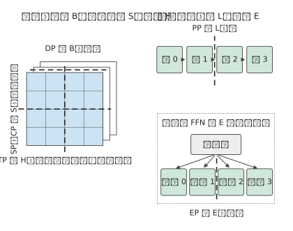

*圖 6-3：左側是一層的輸入啟用，三個維度分別對應資料並行、序列並行與上下文並行、張量並行的切分位置；右側是模型結構，管線 (Pipeline)並行切在層與層之間，專家並行切在同一層的專家之間。粗虛線表示切分位置，不表示資料流向。*

按切分的維度，六種並行方式可以概括為下表。表中的「交換」指卡與卡之間必須傳遞的資料，第 6.2 節各小節將逐一算出其大小。

| 並行方式 | 切分的維度 | 每張卡儲存和計算什麼 | 卡之間必須交換什麼 |
|---|---|---|---|
| 資料並行（DP） | 樣本 $B$ | 一份完整模型，不同的樣本 | 推理時不交換；訓練時匯合各卡的梯度 |
| 張量並行（TP） | 特徵 $H$：權重的列或行、注意力頭 | 同一層矩陣的一部分 | 輸出分片按需收集；部分和必須相加 |
| 序列並行（SP） | 逐 token 運算子的序列位置 $S$ | 同一序列在這些運算子上的一段位置 | 進入矩陣乘前收集全部位置；部分和求和後重新按位置分片 |
| 上下文並行（CP） | 注意力的序列位置 $S$ | 同一序列一段位置的 Q、K、V | 遠端的 K、V，或各段注意力的統計量 |
| 管線 (Pipeline)並行（PP） | 層 $L$ | 一段連續的層 | 相鄰階段之間交接啟用；訓練時再反向交接梯度 |
| 專家並行（EP） | 專家 $E$ | 一部分專家 | 把 token 送到所選專家所在的卡，再把結果送回 |

表中隱含著一項貫穿全章的區別。切樣本、序列位置、層或專家時，每張卡得到的是不同資料或不同層的完整結果，需要時收集或交接即可；切特徵時，各卡往往只得到同一個輸出的一部分貢獻，必須把這些部分和相加，結果才能使用。第 5.2.4 節在單卡內區分過輸出維與歸約維的切分，跨卡時區別相同，只是相加部分和要經過卡間互聯。

這些方式不是互斥的。序列並行通常和張量並行使用同一組卡，專家並行可以和注意力部分的資料並行共用同一批卡；管線 (Pipeline)並行劃分的是有先後依賴的計算圖，不是把某個矩陣再切出一個維度。第 6.3 節將說明如何組合這些方式並給每張卡編號。

> **實驗 6-1 · 延伸：上下文長度與輸入行數如何影響容量和執行瓶頸**
>
> （a）求 Qwen3-235B-A22B 在 4096、8192、16384 個上下文 token 時的單請求 KV 容量。
>
> （b）按本節的八卡分法，每卡預留 2 GiB 工作區，求一臺 HGX H100 最多能同時儲存多少個 32768 token 的會話，權重精確值見註釋。
>
> （c）對 1、64、8192 個 token，分別計算一層專家計算的矩陣運算量與被選中專家的權重讀取時間（64 個 token 時被選中的專家數用第 6.3.2 節的式（6-8）估計），使用 H100 的參數判斷執行時間主要受計算還是記憶體存取限制。
>
> （d）把 HBM 頻寬減半，比較上述三種 token 數下的呼叫耗時增幅。

## 6.2 六種並行方式

本節按圖 6-3 的順序逐一介紹六種並行方式。為了看清分工，每一小節都先用兩張卡說明，再推廣到更多卡。

### 6.2.1 資料並行：複製模型，切分樣本

**資料並行**（data parallelism，DP）讓每張卡儲存一份完整模型，各自處理不同的樣本。圖 6-4 中，兩張卡分別處理 batch 的前四個和後四個樣本，各自得到自己那部分輸出。

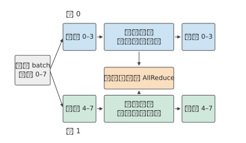

*圖 6-4：兩張卡各儲存一份完整模型，分別處理不同樣本。推理時兩張卡互不等待；訓練時兩張卡的梯度要先匯合，再各自更新參數副本。*

推理中的資料並行就是部署多個例項。模型能放進單卡、又有多個獨立請求時，最直接的辦法是把不同請求分給不同例項。每個例項儲存自己的權重和會話狀態，獨立完成輸出。若一張卡每秒能處理 $r$ 個請求，八個單卡例項在始終有請求可處理時，每秒就能處理 $8r$ 個請求。

把八張卡合成一個例項後，設單個請求的加速比為 $S(8)$，該例項每秒能處理 $S(8)r$ 個請求。兩種部署用的是同樣八張卡，吞吐量之比為 $S(8)/8$：只有單個請求恰好加速八倍，兩者的吞吐量才相同。一旦有通訊和無法並行的工作，協作例項就是用一部分總吞吐量換取更短的單請求時間。

訓練的資料並行也在多張卡上放置同一套參數，但各卡的梯度共同決定下一次更新。例如兩卡分別處理四個樣本，求出各自的平均梯度 $g_0,g_1$，全部八個樣本的平均梯度為 $(g_0+g_1)/2$。兩卡各算一半樣本，再匯合梯度，就完成了同一次更新。推理例項之間沒有這種依賴。

### 6.2.2 張量並行：切分一層內的矩陣

多例項能同時處理更多請求，卻不會縮短某個請求在單張卡上的執行時間，也無助於單卡無法容納的會話。要讓兩張卡共同承擔一個請求，就要把一層內部的計算和狀態分開。**張量並行**（tensor parallelism，TP）把同一層內的矩陣分給多張卡，每卡各算一部分，再交換結果。圖 6-5 標出一層裡的兩處切分位置。

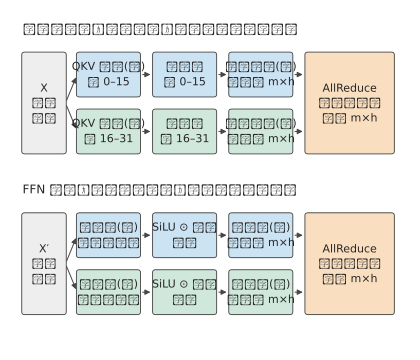

*圖 6-5：注意力按頭分給兩張卡，前饋網路按中間維分給兩張卡；兩處的最後一個投影都只得到部分和，各需要一次 AllReduce 把兩卡的部分和相加。m 為一次處理的 token 數，h 為隱藏維。*

**長上下文如何迫使稠密模型跨卡。** 稠密的 Qwen3-32B BF16 權重約 65.52 GB，一張 80 GB 的 H100 可以容納。該模型原生支援 32K token 的上下文，用 YaRN 把位置編碼外推四倍後可達 128K。[^qwen3-context] 每個 token 的 KV 為 $2\times64\times8\times128\times2=256$ KiB，一個 128K 會話要儲存約 34.36 GB。單卡部署時，權重、一個 128K 會話的 KV 和 2 GiB 工作區合計約 102.03 GB，超過了 80 GB；分到兩張卡，每卡約 52.09 GB，能容納兩個這樣的會話；四卡每卡約 27.12 GB，能容納七個；八卡能容納十六個。這時採用張量並行首先是為了容量：TP1（TP 後的數字表示張量並行的卡數，TP1 即單卡）連一個 128K 會話都無法容納。

但有些模型採用了新型注意力機制，可以減少長上下文下的 KV 儲存需求。KV 容量由注意力設計決定：層數、KV 頭數和頭維，以及各層是否都要儲存 KV。下表比較三個規模相近的模型：稠密的 Qwen3-32B；同一代的 MoE 模型 Qwen3-30B-A3B，仍用普通的 GQA，48 層，4 個 KV 頭，頭維 128；以及採用混合注意力的 MoE 模型 Qwen3.6-35B-A3B，40 層中只有 10 層是完整注意力，每層 2 個 KV 頭、頭維 256，其餘 30 層是線性注意力，只儲存固定大小的遞推狀態。

| 專案                       |   Qwen3-32B | Qwen3-30B-A3B |                 Qwen3.6-35B-A3B |
| ------------------------ | ----------: | ------------: | ------------------------------: |
| 常駐 BF16 權重               |    65.52 GB |      61.06 GB |                        69.32 GB |
| 每 token 的 KV             |     256 KiB |        96 KiB |            20 KiB（僅 10 個完整注意力層） |
| 每請求的固定狀態                 |           — |             — | 62.9 MB 遞推狀態（FP32）＋ 2.0 MB 卷積狀態 |
| 一個 128K 請求的狀態            |    34.36 GB |      12.88 GB |                         2.75 GB |
| 每步權重讀取（batch 1，32K 上下文）  |    63.97 GB |       6.08 GB |                         5.89 GB |
| 每步權重讀取（batch 64，32K 上下文） |    63.97 GB |      60.44 GB |                        68.30 GB |
| 每步矩陣運算（batch 64，32K 上下文） | 8.49 TFLOPs |   2.04 TFLOPs |                     0.73 TFLOPs |
| 每步狀態讀取（batch 64，32K 上下文） |    549.8 GB |      206.2 GB |                         47.1 GB |
| 一張 H100 能容納的 128K／32K 請求 |         0／1 |           1／5 |                            3／11 |
| 兩張 H100 能容納的 128K／32K 請求 |        2／10 |          7／29 |                          31／117 |

這張表說明了三點。第一，batch 為 1 時，兩個 MoE 模型每步只讀約十分之一的權重；batch 為 64 時，64 個 token 選中的專家幾乎覆蓋全部專家，權重讀取回到 60～68 GB，與稠密模型的 64 GB 相當。第二，矩陣運算量始終只有稠密模型的 1/12～1/4，這是 MoE 一直保留的優勢。第三，上下文長、batch 大時，狀態讀取成為每步的主要部分：按 3350 GB/s，batch 64、32K 上下文時三個模型讀取狀態分別約需 164、62 和 14 ms，讀取權重只需 18～20 ms。這一項的差距來自注意力設計，而不是 MoE：Qwen3-30B-A3B 同樣是 MoE，每 token 仍要儲存 96 KiB 的 KV。

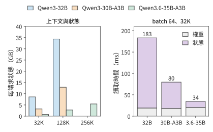

*圖 6-6：左圖為單個請求在 32K、128K 與 256K 上下文下的狀態，Qwen3-32B 與 Qwen3-30B-A3B 的上下文上限為 128K。右圖為 batch 64、32K 上下文時一次 decode 讀取權重和狀態的時間，按 H100 的 3350 GB/s 計。三種模型的權重讀取相近，狀態讀取相差十倍以上。*

容量隨之不同。每卡預留 2 GiB 工作區時，一張 H100 能容納的 128K 請求分別為 0、1、3 個；兩張 H100 時分別為 2、7、31 個。Qwen3.6-35B-A3B 原生支援 262,144 個 token，這樣一個請求的狀態也只有約 5.43 GB。因此，30B 級別的服務在 128K 上下文下是否需要多卡 TP，主要取決於注意力設計，而不是稠密還是 MoE。DeepSeek V4-Flash 等模型進一步壓縮了 KV，第 2.6.1 節在 8K、200K 與 1M 上下文下比較了五個模型的狀態與計算，這裡不再展開。[^dense-moe]

回到圖 6-5 標出的一層內兩處切分：兩處的最後一步都只得到部分和，要用 AllReduce 把各卡的部分和相加，再讓每張卡都得到總和。Qwen3-32B 每層都要做兩次，64 層共 128 次，後文計算執行時間時將反覆用到這一次數。要理解為什麼一種切法只需拼接、另一種卻必須求和，考慮一個最小的矩陣乘。兩張卡共同完成時，先要決定各算什麼：可以讓兩張卡分別算出不同的輸出元素，也可以讓它們各算同一個輸出的一部分。前一種結果需要拼接，後一種需要相加。

下面用完整的例子說明這兩種切法。輸入為 $x=[2,3]$，權重矩陣為 $W=\begin{bmatrix}1&4\\2&5\end{bmatrix}$，輸出是 $xW=[8,23]$。按權重矩陣的列切分，也就是把輸出特徵分給不同的卡：卡 0 儲存第一列，得到輸出的第一個元素 8；卡 1 儲存第二列，得到第二個元素 23。兩個元素並排拼接，就得到完整輸出。

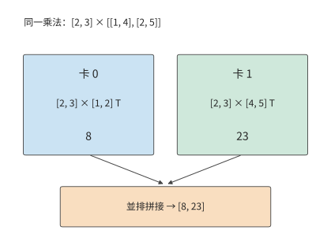

*圖 6-7：按權重矩陣的列切分時，每張卡使用完整輸入，計算不同的輸出元素。格內的轉置符號 T 表示把方括號中橫排的數當作列向量。*

改為按權重矩陣的行切分，也就是把同一個 token 的輸入特徵分給不同的卡：卡 0 用輸入 2 乘第一行，得到 $[2,8]$；卡 1 用輸入 3 乘第二行，得到 $[6,15]$。兩張卡各得到一個含兩個元素的向量，但每個向量只包含一行權重的貢獻；對應位置相加後，才得到完整輸出 $[8,23]$。

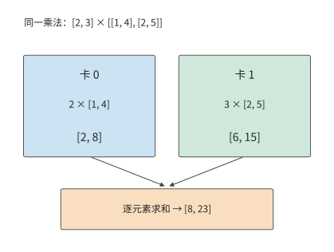

*圖 6-8：按權重矩陣的行切分時，兩卡產生形狀相同的輸出部分和。對應位置相加，恢復完整乘法的結果。*

兩種切法在 FFN 中可以首尾相接，即圖 6-5 下半部分的切法。這裡採用第 2 章介紹的 SwiGLU：將輸入送入門控投影與上投影，門控結果經過啟用函式 SiLU，再與另一支逐元素相乘，最後執行下投影。設本次一起處理 $m$ 個 token，隱藏寬度為 $h$，中間寬度為 $f$。輸入為 $X\in\mathbb{R}^{m\times h}$，上投影為 $W_g,W_u\in\mathbb{R}^{h\times f}$，下投影為 $W_d\in\mathbb{R}^{f\times h}$：

$$
Y=\left[\operatorname{SiLU}(XW_g)\odot(XW_u)\right]W_d.
$$

把中間寬度 $f$ 分成左右兩半。卡 0 儲存兩個上投影矩陣左半部分的列與下投影矩陣上半部分的行，卡 1 則儲存兩個上投影矩陣右半部分的列與下投影矩陣下半部分的行。兩張卡都儲存完整輸入 $X$，分別得到中間啟用 $Z_0,Z_1$。SiLU 和乘法逐元素執行，各卡可以直接處理自己的半段。

下投影沿同一個中間維相接：

$$
Y=[Z_0\ Z_1]\begin{bmatrix}W_{d,0}\\W_{d,1}\end{bmatrix}
=Z_0W_{d,0}+Z_1W_{d,1}. \tag{6-3}
$$

右側兩個乘積的形狀都是 $m\times h$，各自只包含中間維一半分量的貢獻，相加後才是下一層要用的輸入。

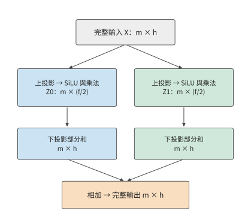

*圖 6-9：SwiGLU 的兩卡切分。上投影按權重矩陣的列劃分輸出特徵，逐元素運算留在本地；下投影按權重矩陣的行劃分輸入特徵。兩步均保留全部 $m$ 個 token，切分的是每個 token 的特徵維度。每卡中間啟用為 $m\times(f/2)$，輸出部分和仍為 $m\times h$，最後逐元素求和。*

若兩張卡都需要完整結果，就執行 AllReduce。若下一個運算子可以繼續使用分片，則執行 **ReduceScatter（歸約後分散）**：先求和，再把求和結果的不同片段留在不同的卡上。要從分片恢復完整資料，則執行 **AllGather（全收集）**，把各卡持有的片段拼起來。

**例題：四卡切分減少多少權重讀取，又增加多少通訊？** 取 Qwen3-32B 的 $h=5120,f=25600$，將中間維均分到四卡。

解答：每卡上投影為 $5120\times6400$，下投影為 $6400\times5120$。三個矩陣共佔 187.5 MiB，是原來 750 MiB 的四分之一。按 3350 GB/s，單 token 的讀取時間從約 234.8 μs 降到 58.7 μs，每卡少讀 562.5 MiB，節省約 176.1 μs。代價是要把四張卡各自的 10 KiB 輸出部分和相加。第 6.4 節將用具體演算法求出這次匯合的時間。

注意力也可以按頭切分：Q、K、V 投影只產生本卡負責的頭，各卡獨立計算這些頭的注意力；輸出投影把各頭的結果對映回隱藏維，各卡得到的仍是部分和，相加後才是完整輸出。因此 Qwen3-32B 每層要對注意力輸出和 FFN 輸出各做一次歸約，64 層共 128 次。詞嵌入按詞表切分，詞表輸出投影也按詞表分到各卡。

頭不能再拆，是分配的最小單位。Qwen3-32B 有 8 個 KV 頭，TP8 時每卡一個；TP16 時，共用同一個 KV 頭的查詢頭被分到兩張卡，兩張卡都要儲存該 KV 頭的狀態。上下文為 128K 時，每個 KV 頭的狀態佔 4 GiB，八卡合計 32 GiB，十六卡合計 64 GiB。Qwen3-235B-A22B 只有 4 個 KV 頭，第 6.1.2 節的八卡分法已經讓每個 KV 頭在兩張卡上各存一份。TP 卡數一旦超過 KV 頭數，繼續增加就會複製 KV。

本章用「例項數」表示獨立推論服務的數量，用 $p$ 表示單個例項的 TP 卡數。共有八張卡時例項數為 $8/p$。後文先求單個例項生成一個 token 的時間 $T(p)$，再換算成一組請求的完成時間。

**從單層計算推導完整 decode 步的耗時。** 以 Qwen3-32B 的一個 128K 會話為例。各投影權重每步從 HBM 讀一次，舊 KV 讀一次，並寫入一個新 token。注意力投影的 BF16 權重為

$$
2\left(2\times5120\times8192+2\times5120\times1024\right)=180\ \mathrm{MiB}.
$$

其中兩個 $5120\times8192$ 對應 Q 與輸出投影，兩個 $5120\times1024$ 對應 K 與 V。每層再加 750 MiB FFN 權重，共 930 MiB。上下文有 131,064 個 token 時，每層讀取的 KV 約為 512 MiB。詞表有 151936 項，輸出投影權重約為 1.56 GB。因此全步 HBM 訪問量可寫成

$$
V(s)=64\times930\ \mathrm{MiB}
+256\ \mathrm{KiB}\times(s+1)
+151936\times5120\times2\ \mathrm{bytes}, \tag{6-4}
$$

$s$ 為這一步開始前的上下文長度。代入 131,064，約為 98.32 GB，其中權重 63.97 GB，KV 34.36 GB。按 H100 的 3350 GB/s 讀完約需 29.35 ms；同一步的矩陣運算約 0.34 TFLOPs，按 989.4 TFLOP/s 只需約 0.34 ms，所以每層注意力和 FFN 的執行時間都受記憶體頻寬限制。採用 $p$ 路 TP（$p\le8$）時，權重和 KV 都均分到各卡，這部分時間為 $29.35/p$ ms。歸一化、逐元素運算和取樣只讀寫幾個隱藏向量，這裡不計。[^continuous]計算與歸約依次執行，就得到後文各節使用的執行時間模型：

$$
T(p)=\frac{T_{\mathrm{local}}}{p}+128\,T_{\mathrm{AR}}(p),
\qquad T_{\mathrm{local}}\approx29.35\ \mathrm{ms}. \tag{6-5}
$$

其中 $T_{\mathrm{AR}}(p)$ 是 $p$ 張卡做一次 AllReduce 的時間。式（6-5）把增加 TP 卡數的影響分成兩項：本地執行時間隨卡數增加而下降，通訊時間則取決於演算法和連線方式。將卡數從 $p$ 翻倍到 $2p$，節省的本地時間為 $T_{\mathrm{local}}/(2p)$。因此，增加卡數能夠縮短執行時間的條件是

$$
128\left[T_{\mathrm{AR}}(2p)-T_{\mathrm{AR}}(p)\right]
<\frac{T_{\mathrm{local}}}{2p}. \tag{6-6}
$$

$p$ 越大，右側越小。即使每次歸約只增加同樣一小段時間，累積起來也會抵消本地執行時間的縮短。

卡更多時，線性層還可以同時切分兩個矩陣維度，把卡排成行、列兩個方向的通訊組。以 $[8192,4096]\times[4096,12288]$ 的投影為例，把輸出分成 16 片放在 16 張卡上，每張卡起初只有 4 MiB 的輸入分片和 6 MiB 的權重分片。排成 4×4 網格時，每張卡要橫向收集同一行另外三張卡的輸入分片，傳送 12 MiB；縱向收集同一列另外三張卡的權重分片，傳送 18 MiB。改成 2×8 網格，兩個方向分別為 28 MiB 和 6 MiB；改成 8×2 則為 4 MiB 和 42 MiB。兩個方向的鏈路 (Link)獨立且等速時，傳輸時間由較大的一方決定，因此 4×4 最快。MeshSlice 沿這種佈局繼續分塊，讓收集與矩陣乘流水執行；推論系統 Arctic 則在不同執行階段切換分工，其狀態遷移在第 9 章展開。[^variants]

### 6.2.3 序列並行：逐 token 運算子沿序列分片

張量並行讓每張卡只儲存矩陣的一部分，但層內還有一些運算子不做矩陣乘，例如 LayerNorm（層歸一化）、Dropout 和殘差相加。這些運算子逐 token 工作：每個 token 的結果只依賴自身的隱藏向量。**序列並行**（sequence parallelism，SP）讓這些運算子沿序列位置分片：TP 組內的每張卡只處理一段位置，不再各自儲存一份完整啟用。本書採用大模型訓練框架 Megatron 的這一常見定義。[^sequence-context]

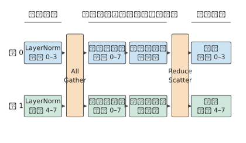

*圖 6-10：LayerNorm 和殘差只用到本 token 的資料，兩張卡各處理一半位置；進入列並行線性層前用 AllGather 收集全部位置，行並行線性層的部分和用 ReduceScatter 求和並重新按位置分片。*

列並行線性層需要完整的輸入行，進入它之前先用 AllGather 收齊各卡的序列分片；行並行線性層產生部分和之後，用 ReduceScatter 一邊求和、一邊重新按位置分片。AllReduce 本來就等於 ReduceScatter 加 AllGather，序列並行只是把這兩半放到了不同的運算子邊界上，中間的逐 token 運算子就不必每張卡都儲存一份完整啟用。

例如 $[8192,4096]$ 的 BF16 啟用為 64 MiB，四卡各保留連續的 $[2048,4096]$ 分片時，每卡只佔 16 MiB，總計 64 MiB；四卡各存完整張量則總計 256 MiB。這一節省只發生在保持序列分片的區間，不是模型的所有啟用與權重都縮小四倍。歸約維和輸出維的關係仍與圖 6-9 相同，變化的只是下一個運算子接收哪種佈局。配套的實驗在 JAX（支援自動求導和編譯執行的數值計算框架）中展示了保持分片和重新收集兩條 FFN 路徑。[^tp-experiment]

### 6.2.4 上下文並行：切分同一序列的注意力

序列並行只處理逐 token 的運算子，注意力卻要讓每個位置看到序列中的其他位置。**上下文並行**（context parallelism，CP）把同一個長序列的位置分給多張卡，每張卡儲存自己那段位置的 Q、K、V，並計算這段位置的注意力輸出。圖 6-11 用八個位置說明兩張卡的分工。

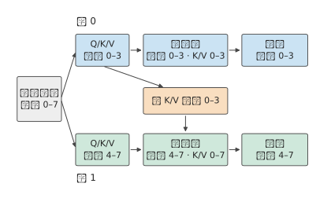

*圖 6-11：每張卡儲存自己那段位置的 Q、K、V。因果注意力下，卡 1 的查詢還要用到卡 0 的 K、V，所以 K、V 必須跨卡傳遞；非因果注意力時兩個方向都要傳。*

本卡的查詢仍要用到掩碼允許範圍內的遠端 K、V。可以一次收齊全部 K、V，也可以讓 K、V 塊在各卡之間環形傳遞，邊到達邊用第 5.3.3 節的線上 softmax 累計最大值、指數和與加權輸出。環形注意力（Ring Attention）是一種排程和傳輸的實現方式，上下文並行是工作劃分方式，兩者不是同義詞。[^sequence-context]

圖 6-12 把這種依賴畫成八個位置之間的可見關係。

*圖 6-12：八個 token 的因果注意力，橫軸為鍵的位置、縱軸為查詢的位置。實色格是必須計算的查詢—鍵配對；前四行歸卡 0，後四行歸卡 1。虛線只是裝置邊界，左下區域的遠端依賴並不因此消失。*

按位置連續切半還會造成計算不均。八個位置的因果注意力共有 $1+\cdots+8=36$ 個查詢—鍵配對；前四個位置只有 10 對，後四個有 26 對，兩張卡的 token 數相同，工作量卻相差 2.6 倍。把靠前和靠後的位置搭配起來，例如卡 0 持有位置 $1,2,7,8$，卡 1 持有 $3,4,5,6$，兩張卡就各承擔 18 對。實際實現常用分塊交錯的「之」字形佈局，但必須保留原始位置和因果掩碼，並重新安排通訊；遠端上下文不能當作 padding 丟棄。

Decode 時新 token 的查詢很少，歷史 K、V 卻很長。沿歷史位置切分後，每張卡先算出本段的最大值 $m_r$、指數和 $l_r$ 與未歸一化的加權向量 $u_r$，再合併為

$$
m=\max_r m_r,\qquad
l=\sum_r e^{m_r-m}l_r,\qquad
u=\sum_r e^{m_r-m}u_r,\qquad o=u/l.
$$

$o$ 即新 token 在全部歷史位置上的注意力輸出。這與第 5 章 tile 之間合併 softmax 的做法相同，只是統計量和向量要跨卡傳輸。不能各卡先分別做完 softmax，再簡單平均各卡的輸出。上下文並行減少了每張卡儲存的上下文狀態和本地的注意力計算，代價是 K、V 的交換或統計量的歸約；生成時前後 token 之間的依賴並不因此消失。序列並行和上下文並行在不同框架裡的名稱有交疊，判斷一種配置時，應看切了哪些運算子、哪些張量、用了哪個通訊組，而不只看縮寫。

### 6.2.5 管線 (Pipeline)並行：按層劃分階段

上述幾種方式都在一層內部分工。**管線 (Pipeline)並行**（pipeline parallelism，PP）改為按層分工：把模型的層按順序分成若干階段，每個階段由一張或一組卡負責。圖 6-13 把 Qwen3-32B 的 64 層分成兩個階段。

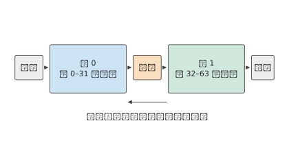

*圖 6-13：兩個階段各儲存自己那些層的權重。相鄰階段之間只交接啟用；訓練時梯度沿同一邊界反向傳遞。*

前一個階段算完自己負責的層，把啟用傳給下一個階段接著算。每個階段只儲存自己那些層的權重，階段之間只傳遞中間結果。

送入管線 (Pipeline)的輸入按 micro-batch 組織：一個 batch 拆成多個 micro-batch，不同階段就能同時處理不同的 micro-batch。設模型分成 $q$ 個階段，每個階段的執行時間（含傳遞啟用）為 $t$，輸入是 $b$ 個已經就緒、互不依賴的 micro-batch。考慮四個階段、每階段 1 ms 的情形。micro-batch 0 在 0 ms 進入階段 0，經過四個階段，在 4 ms 完成；階段 0 在 1 ms 就能接收 micro-batch 1，後者在 5 ms 完成。其餘 micro-batch 依次跟進，每隔 1 ms 完成一個。

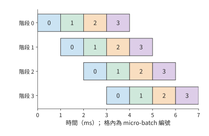

*圖 6-14：四個等時階段處理四個獨立 micro-batch。每格為 1 ms，同色表示同一 micro-batch。第一項結果在 4 ms 產生，最後一項在 7 ms 產生；左上到右下的空白來自流水填充與排空。*

第一個 micro-batch 花費 $qt$，其後每增加一個 micro-batch 只增加 $t$，所以

$$
T_{\mathrm{PP}}=(q+b-1)t,\qquad
\eta_{\mathrm{PP}}=\frac{qb\,t}{q(q+b-1)t}=\frac{b}{q+b-1}. \tag{6-7}
$$

分子是所有階段實際工作的時間總和，分母是階段數乘以處理全部 micro-batch 所需的時間。四階段、四個 micro-batch 的利用率為 $4/7$，約 57%；增加到 16 個 micro-batch 時為 $16/19$，約 84%。獨立 micro-batch 越多，流水填充與排空造成的空閒時間佔比就越小。

各階段執行時間不均也會讓卡空閒。若四個階段分別需要 1、1、2、1 ms，第一個 micro-batch 在 5 ms 完成，此後最快每 2 ms 完成一個。送到耗時 2 ms 階段的輸入到達速度超過其處理速度，佇列逐漸積壓；緩衝用滿後，上游階段只能暫停。按各層的實際執行時間劃分階段，可以讓各階段的耗時更接近，減少積壓。[^pipeline]

自迴歸會話的下一步輸入，要等當前 token 生成後才就緒。四個獨立會話可以提供四個 micro-batch，同一會話未來的四個 token 則是一條先後依賴鏈。流水利用率因此直接取決於同時有多少 micro-batch 可以開始執行。

### 6.2.6 專家並行：切分專家集合

最後一種方式切分的是 MoE 特有的專家集合。稠密模型的每個 token 使用同一組 FFN 權重；MoE 模型準備多個前饋網路作為專家，由路由器計算選擇分數，為每個 token 選出要執行的專家。每個 token 只用到被選中的專家，但整個專家集合都要儲存在加速器上，供後續 token 選擇。MoE 由此增加了一種分工方式：**專家並行**（expert parallelism，EP）把不同專家放到不同的卡上，由各卡處理發給自己的輸入。圖 6-15 把八個專家分給兩張卡。

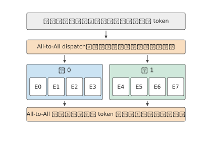

*圖 6-15：注意力和路由器在 token 所在的卡完成；輸入按所選專家的所在卡傳送，專家算完後結果送回原卡，按路由權重合並。兩次交換都是 All-to-All（全交換），即每張卡向其他各卡分別傳送不同的資料。*

專家並行首先要解決專家權重放在哪裡，然後才是當前 token 如何執行。

先用四張卡、八個專家說明這種分工。卡 0 儲存專家 0 和 1，卡 1 儲存專家 2 和 3，依次類推。卡 0 當前持有 token A，路由器為 A 選中專家 1 和 6：專家 1 就在本卡，專家 6 在卡 3。卡 0 既要執行本卡的專家 1，也要把 A 的輸入送到卡 3，最後收回兩份輸出，按路由權重合並。

把專家輸入送往專家所在卡的過程稱為 **dispatch（派發）**，把輸出送回原卡併合並的過程稱為 **combine（合併）**。繼續看 token A：若兩個專家的輸出分別為 $y_1,y_6$，路由權重為 $a_1,a_6$，完整的 MoE 輸出為 $a_1y_1+a_6y_6$。傳送方的卡儲存 token 的編號和路由資訊，接收方的卡執行專家，返回的結果再歸到同一個 token 名下。

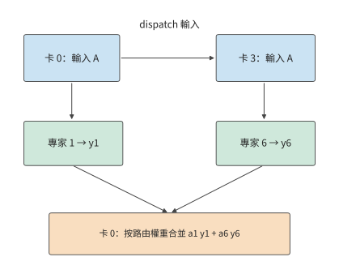

*圖 6-16：卡 0 持有 token A，選擇本地專家 1 與卡 3 上的專家 6。dispatch 沿上方路徑傳送輸入，combine 沿下方送回專家輸出並加權合併。每個 token 選中幾個專家，就要算幾次；專家在哪張卡，決定輸入要送到哪裡。*

多個專家在同一張卡上時，可以只發一份輸入。若一個 token 選中的八個專家兩兩分佈在四張遠端卡上，4096 維的 BF16 輸入為 8 KiB：按專家逐個傳送要 64 KiB，按目的卡傳送只要 32 KiB，同一張卡上的兩個專家共用這份輸入。

多個 token 一起處理時，每張卡要向不同的卡傳送數量不等的資料，這就是圖 6-15 中的 All-to-All。接收方先按專家把收到的輸入行重新排列，做矩陣乘，再按 token 編號把輸出排回原序。收到輸入最多的卡，通常也要做最多的專家計算。

Qwen3-235B-A22B 將這一例子擴大為每層 128 個路由專家，每 token 選 8 個，共 94 層。每個專家包含三次投影，隱藏維 4096，中間維 1536，BF16 權重為 $3\times4096\times1536\times2=36$ MiB。單層全部專家佔 4.5 GiB，94 層約佔 423 GiB。把專家均分到八卡，每卡約為 52.9 GiB，此外每張卡還要儲存注意力層、路由器和輸入輸出層的權重、KV 和工作區。專家集合可以分散到各卡，注意力的頭和狀態則按注意力自己的分工儲存。

> **實驗 6-2 · 核心：張量切分與 micro-batch 流水如何改變執行時間**
>
> （a）寫出兩卡 SwiGLU 的六個權重分片和兩個輸出部分和的形狀，用式（6-3）說明為什麼需要將兩張卡的輸出部分和相加。
>
> （b）對 TP1、TP2、TP4、TP8，計算 Qwen3-32B 一個 128K 會話的本地記憶體存取時間，暫不計通訊開銷；求卡數每次翻倍所節省的時間。
>
> （c）採用第 6.4 節的歸約時間，將其代入式（6-5），重新計算加速比，解釋差距從哪裡產生。
>
> （d）畫出四階段處理八個 micro-batch 的時序，分別考慮四個階段均耗時 1 ms，以及耗時依次為 1、1、2、1 ms 的情況；比較兩種情況下的完成時間，並指出 micro-batch 會在哪個階段之前積壓。
>
> （e）進階：對同一個 FFN，比較輸出完整張量與保留輸出分片兩種方式下，相鄰運算子之間需要傳遞的資料；也可選擇配套二維網格方案，進一步推導通訊資料的分塊方式。

## 6.3 組合並行與模型規模

六種方式很少單獨使用。本節先說明如何組合這些方式並給每張卡編號，再討論 MoE 特有的兩個問題：一批 token 的專家選擇如何改變權重讀取和各卡負載，以及模型繼續增大時組合如何變化。

### 6.3.1 組合方案與裝置座標

張量並行和管線 (Pipeline)並行可以組合：例如把八張卡分成四個流水階段，每個階段內兩張卡做張量並行。每層的兩卡歸約在階段內完成，相鄰階段之間傳遞啟用。若階段內兩張卡各自持有完整的 8 KiB 隱藏向量，並分別交給下一階段對應的卡，兩個階段之間總共要傳送 16 KiB；若階段之間傳遞的是分片，則由下一階段按計算需要重新拼合。因此組合兩者時，要寫清每個階段輸出的是哪些分片，下一階段每張卡接收哪些分片。

組合多種方式時，先給每張卡標出座標，再對每個運算子寫出其輸入、權重和輸出分片，以及需要通訊的卡組。例如資料並行 2、管線 (Pipeline)並行 2、張量並行 4 的方案記作 DP2×PP2×TP4，佔 $2\times2\times4=16$ 張卡；若在同一 TP4 組內啟用序列並行，卡數不變，不再乘一個 SP4。切分確定每份工作歸誰，排程確定就緒、執行、通訊與回收的順序，兩者合起來才是完整的並行方案。

專家並行也可以和專家內部的張量並行組合。例如四個專家組各擁有 32 個專家，每組再用兩張卡切分專家的中間維，每張卡處理 768 維。整個例項仍是八張卡，每張卡用兩個編號標識：專家組編號說明該卡負責哪些專家，組內張量並行編號說明負責這些專家矩陣的哪一半。後文沿這一 TP2×EP4 佈局推導通訊。

專家輸入的來源如下：讓四個專家組都對同一個請求執行注意力，各自儲存該請求的 KV；注意力算完後，每個組都持有完整的專家輸入，直接選出本組專家需要的行即可，不必跨組 dispatch 輸入；各組的結果最後再歸約匯合。

| 專家組 | 卡 | 專家編號 | 每卡專家中間維 | 每卡 KV 頭 |
|---|---|---|---:|---|
| 0 | 0、1 | 0—31 | 768 | 偶數卡 0、1；奇數卡 2、3 |
| 1 | 2、3 | 32—63 | 768 | 同上 |
| 2 | 4、5 | 64—95 | 768 | 同上 |
| 3 | 6、7 | 96—127 | 768 | 同上 |

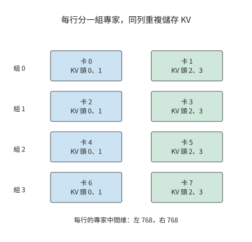

*圖 6-17：八張卡排成四個專家分組，每組兩卡沿專家中間維分工。同一列的注意力頭與 KV 重複四份；每組因此都能在本地得到相同的專家輸入。*

資料位置確定後，再跟蹤輸出如何匯合。組內兩張卡各算專家中間維的一半，先在組內相加，得到本組專家的完整貢獻；再把四個組的貢獻相加。

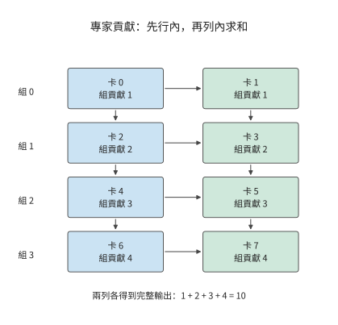

*圖 6-18：橫向箭頭表示組內兩卡求和，縱向箭頭表示四個組求和。格內數字是某個輸出元素經組內求和後的值，兩列各自都得到相同的完整結果 10。*

第二步的求和發生在編號相同的卡之間。例如四個組對某個輸出元素的貢獻分別為 1、2、3、4，四張偶數卡一組歸約得到 10，四張奇數卡另一組也得到 10。此時每張卡都持有相同的完整輸出，可以繼續算下一層。

省去 dispatch 要付出儲存與計算的代價。按這份佈局，每張卡的權重約 64.8 GB，八卡共 518.6 GB，比每個參數只儲存一份的 470.2 GB 多約 48.4 GB。上下文 8192 個 token 時每卡 KV 為 752 MiB，八卡共 5.875 GiB，是該請求實際 KV 的四倍。每個組都重複執行一遍注意力，換來的是專家輸入就在本組。[^ownership]

**例題：注意力複製與專家切分的佈局需要多少歸約通訊？** 歸約採用 FP32，單個 token 的完整隱藏向量為 $4096\times4=16$ KiB。用第 6.4.2 節的環形演算法在兩張卡之間歸約，每張卡傳送一個完整向量的大小；四張卡歸約則傳送 1.5 倍。每層有注意力的組內歸約、專家的組內歸約、四個專家組之間的歸約三次匯合，所以每張卡傳送

$$
16+16+24=56\ \mathrm{KiB}.
$$

八卡合計 448 KiB；8192 個 token 的 prefill 採用同樣的分工，每張卡傳送 448 MiB。

### 6.3.2 批內複用與負載不均

上一小節確定了專家放在哪些卡上，還沒有確定每一步哪些卡最忙，這取決於當前 batch 選中了哪些專家。一個 token 只選八個專家，一個 batch 卻可能覆蓋整個專家集合。設 64 個 token 各選八個專家，共 512 次 token 到專家的分派。

若這些分派恰好均勻覆蓋 128 個專家，每個專家處理四個 token 的特徵向量；若所有 token 選擇同樣的八個專家，每個專家處理 64 個 token 的特徵向量。兩種分派的有效矩陣運算量相同。假定在一個 batch 內，每個被選中專家的權重只從 HBM 讀取一次，前者需要 $128\times36$ MiB，即 4.5 GiB；後者需要 $8\times36$ MiB，即 288 MiB，讀取量相差 16 倍。

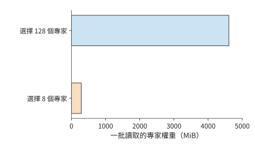

*圖 6-19：64 個 token、每 token 八個專家，共 512 次分派。均勻覆蓋與集中選擇的有效計算量相同，被選中專家的權重讀取相差 16 倍。每個專家 BF16 權重為 36 MiB，批內讀取一次。*

活躍專家越少，每個專家的權重就能供更多輸入行復用，既減少重複讀取，也讓矩陣乘的行數變大。但是，這些行由哪張卡執行，同樣影響完成時間。在 TP2×EP4 佈局中，均勻覆蓋時每組承擔 $32\times4=128$ 次分派；若八個活躍專家全都在一個專家組，該組要承擔全部 512 次，計算量是均勻時的四倍，其餘三組只能等待。

因此，分析執行時間需要同時計算整批的權重讀取量，以及負載最重的專家組的計算量。Decode 的小矩陣運算容易受權重讀取速度限制，prefill 的大矩陣運算則更容易受負載最重的專家組的計算時間限制。把熱點專家分散到不同的 EP 組，既保留了批內複用，又減輕了單個專家組的計算負擔。

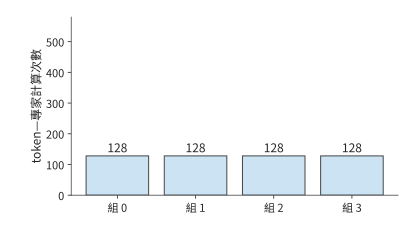

*圖 6-20：均勻使用 128 個專家時，四個 EP 組各處理 128 次 token—專家計算，合計讀取 4.5 GiB 權重。*

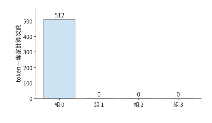

*圖 6-21：所選八個專家都在組 0：權重讀取降到 288 MiB，512 次計算卻全部壓在同一組。*

*圖 6-22：把同樣的八個專家分散到四組，將讀取量維持在 288 MiB，同時讓四組各承擔 128 次計算。三圖縱軸範圍相同。*

圖中後兩種佈局讀取同樣多的權重，完成時間卻可能不同，因為參與計算的卡數不同。因此，批內複用應與專家在各卡上的分佈一起分析。

除上述均勻覆蓋與集中選擇兩種情況外，還可以計算均勻隨機選擇專家時的平均結果。設每 token 從 $E$ 個專家中選 $k$ 個，各 token 獨立。一個專家被單個 token 跳過的機率為 $1-k/E$，被整批 $m$ 個 token 跳過的機率為 $(1-k/E)^m$。對每個專家定義一個指示變數：該專家在批內被選中時取 1，否則取 0。將這些變數相加，再取期望，可得批內被選中專家數的期望：

$$
\mathbb{E}[E_{\mathrm{active}}]=E\left[1-\left(1-\frac{k}{E}\right)^m\right]. \tag{6-8}
$$

取 $E=128,k=8,m=8$，期望約有 52 個活躍專家，理想讀取約 1.8 GiB；八個 token 全部選擇同樣八個專家時仍只讀 288 MiB。隨著 batch 增大，被選中的專家數逐漸接近專家總數，繼續增加輸入行主要提高每份權重的複用。[^moe-tax]

真實的路由結果由輸入和模型共同決定。配套資料中的 DeepSeek V4-Flash 路由記錄覆蓋四個輸入、43 層，共約 131 萬次專家選擇，各專家被選中的頻率各不相同。把每個專家收到的 token 數換算成矩陣行數，再按每張卡上的專家集合相加，就能從這份記錄得到各卡的計算量分佈。逐層熱圖見配套資料。[^routes]

### 6.3.3 從數千億到萬億參數：並行組合如何變化

第 6.3.2 節的複用與負載分析，建立在整個專家集合已經能夠存入加速器的前提下。模型繼續增大時，首先需要重新檢查總儲存容量，再決定 TP、PP 和 EP 如何組合。Qwen3-235B-A22B 的全部 BF16 權重約為 470 GB，這裡每個參數只計一次；DeepSeek V4-Flash 約 284B 參數，按同樣格式約為 568 GB。一臺 HGX H100 的八張 H100 共有 640 GB，留給狀態和工作區的空間已經不多。DeepSeek V4-Flash 每層有 256 個路由專家，每個 token 選擇其中 6 個，另外還執行共享專家，專家集合更大，分配權重時需要同時考慮共享專家和路由專家。[^models]

DeepSeek V4-Pro 約 1.6T 參數，即使按每個參數半位元組計算，權重也約為 800 GB；Kimi K3 的約 2.8T 參數對應約 1.4 TB。這些模型的儲存需求已經超過一臺 HGX H100 的總容量。增加 EP 分組數，可以把專家分到更多的卡上；增加專家內部的 TP 卡數，可以減小每卡儲存的專家矩陣；增加 PP 階段數，則可以減少每個階段儲存的模型層數。

專家輸入如何表示，也會改變跨卡通訊量。Kimi K3 的路由專家在 3584 維的潛空間裡工作，主幹隱藏向量則是 7168 維。先投影再傳送，BF16 向量從 14 KiB 降到 7 KiB；先傳送再投影，傳的就是未降維的輸入。同樣的專家計算，投影放在傳送前還是接收後，決定了跨卡傳輸的向量維度。模型每層從 896 個路由專家中選擇 16 個，另有兩個處理完整主幹向量的共享專家，分別承擔不同的計算；93 層中，69 個 KDA 層用固定大小的矩陣遞推彙總上下文，24 個 MLA 層用低維表示儲存上下文。KDA 狀態的儲存需求主要由其固定維度決定，MLA 狀態的儲存需求還隨會話上下文增長。[^models]

模型的變化因此從兩個方面影響系統設計：權重增多會擴大所需的總儲存容量，計算圖不同會改變需要交換的資料。前者確定至少要動用多少資源，後者決定這些資源應如何連線。

> **實驗 6-3 · 核心：專家分派與放置如何改變各卡負載和通訊量**
>
> （a）沿圖 6-16 寫出 token A 的輸入傳送、兩次專家執行和加權合併順序。
>
> （b）復算 64 個 token 的兩種專家分派，求權重讀取量與負載最重的 EP 組的任務數。
>
> （c）把八個熱點專家均分到四個 EP 組，比較總讀取量與負載最重的專家組的計算量，解釋變化來自哪裡。
>
> （d）採用本節 TP2×EP4 表，求上下文長度為 8192 與 16384 時，每張卡需要儲存的 KV 容量，並推導三次結果匯合的傳送量。
>
> （e）進階：對 DeepSeek V4-Flash、DeepSeek V4-Pro 或 Kimi K3，選擇一個具體儲存格式，逐項放置路由專家、共享專家、注意力狀態與工作區。

## 6.4 集合通訊的實現與執行代價

### 6.4.1 根據模型切分方式確定通訊需求

第 6.2 節定義了 AllReduce、All-to-All 等集合通訊操作，本節討論其實現與執行代價。先考慮四張卡如何彙總一個四元素向量。每張卡都有四個元素的本地貢獻，目標是讓每張卡得到完整的逐元素和。可以分兩步完成：先求和，並讓卡 0 留元素 0 的完整和、卡 1 留元素 1 的完整和，依次類推；再交換這些已求和的元素，讓四張卡都取得完整向量。

第一步就是 ReduceScatter，第二步就是 AllGather，兩步合起來完成一次 AllReduce。兩步分別改變數值和數值所在的位置。稠密模型和 MoE 還需要拼接分片、把專家輸入發給不同的卡；按通訊開始和結束時各卡持有什麼資料，可以區分下面四種集合通訊。

| 操作 | 開始時各卡持有 | 完成時各卡持有 | 用途 |
|---|---|---|---|
| AllReduce | 同一張量的部分結果 | 完整歸約結果 | TP 部分和、訓練梯度 |
| ReduceScatter | 同一張量的部分結果 | 歸約結果的不同分片 | 分片輸出、梯度分片 |
| AllGather | 一個張量的不同分片 | 完整拼接結果 | 恢復完整輸入 |
| All-to-All | 發往不同目的地的資料 | 各源卡發給本卡的資料 | 專家輸入的 dispatch 與結果回傳 |

Broadcast（廣播）把某一張指定卡的資料發給全組，Reduce（歸約）只把歸約結果交給指定的一張卡，兩者都不像表中的操作那樣讓全組持有結果。AllGather 按 rank（通訊組內每張卡的編號）拼接資料，不做求和；All-to-All 按目的地重新分配資料，也不會自動按路由權重合並專家輸出。MoE 的 combine 因此包括結果回傳、恢復 token 順序和按路由權重求和三步，不能只憑名字把它當成 AllReduce。[^nccl-basics]

操作名稱規定了計算什麼、結果落在哪些卡上，具體演算法則規定資料分幾輪、如何傳遞。下一小節跟蹤其中一塊沿環傳遞的過程。

演算法決定交換本身要多久，各卡發起通訊的時刻則決定每張卡要等多久：全組要等最後一張卡發起之後才能開始交換，先到的卡都在等待該卡完成前面的計算，所以發起時刻相差越大，加快交換本身的收益就越小。第 7.6.1 節用同一組資料展開這一比較。[^collective-path]

### 6.4.2 環、樹與通訊輪次

**環形 AllReduce** 把參與的卡排成一個有向環，每輪每卡向下一卡傳送一塊，並接收上一卡發來的塊。設參與的卡數為 $n$，每卡的完整部分和為 $M$ bytes，把它分成 $n$ 塊，每塊 $M/n$。

以四卡環 0→1→2→3→0 為例。每卡最初都有塊 0、1、2、3 的本地貢獻。第一輪，卡 $r$ 傳送塊 $r$；接收方將收到的塊與自己的對應貢獻相加。第二輪轉發剛剛形成的部分和，第三輪繼續轉發並加入最後一份貢獻。

跟蹤塊 0：該塊從卡 0 發出，經卡 1、卡 2，最後到卡 3。如果四卡對塊 0 某元素的貢獻為 1、10、100、1000，沿途數值依次為 1、11、111、1111。第三輪結束時，卡 3 擁有塊 0 的完整和；同時，卡 0、1、2 分別擁有塊 1、2、3 的完整和。

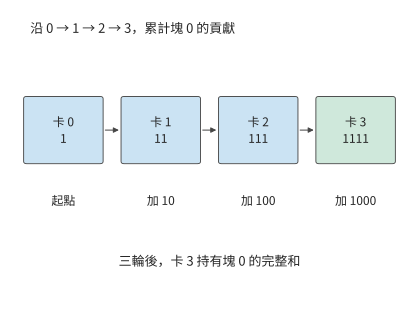

*圖 6-23：僅跟蹤塊 0 的一個元素：每經過一張卡，就加入該卡的貢獻。三輪後得到 1111，儲存在卡 3。其他三個塊同時沿環推進。*

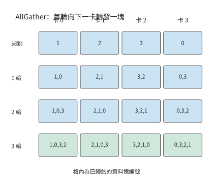

*圖 6-24：ReduceScatter 結束時，卡 0、1、2、3 分別持有塊 1、2、3、0。接下來每輪轉發一塊，三輪後每卡都擁有四塊完整結果。*

只需三輪，是因為一個塊已經含有起點的一份貢獻，再經過其餘三卡，就包含全部四份。一般地，ReduceScatter 需要 $n-1$ 輪。接下來每卡將自己完成的塊向下一卡轉發，每輪多獲得一塊；再經過 $n-1$ 輪，每卡收齊全部塊。因此每卡總髮送量為 $2(n-1)M/n$，共 $2(n-1)$ 輪。

令每輪固定開銷為 $\alpha$，各有向邊的有效頻寬為 $B$，各卡等本輪傳送完成後才進入下一輪，時間模型為

$$
T_{\mathrm{ring}}=2(n-1)\alpha+\frac{2(n-1)M}{nB}. \tag{6-9}
$$

第一項隨卡數增長，第二項逐漸接近 $2M/B$。環形演算法把大塊資料分成小塊，讓各卡同時傳輸；資料量小時，逐輪啟動的時間反而佔主要部分。

**例題：計入歸約通訊後，增加 TP 卡數還能加速多少？** 仍用 Qwen3-32B 的 128K 會話。每次歸約的輸入是一個 token 的 BF16 隱藏向量，$M=10$ KiB；HGX H100 中每張卡經 NVSwitch 的頻寬為每方向 $B=450$ GB/s；每輪固定開銷 $\alpha$ 取 MSCCL++ 論文在同樣的 H100 八卡伺服器上測得的 NVLink 單向延遲 0.822 μs。求 TP2、TP4、TP8 的單次歸約以及式（6-5）的時間。

解答：TP8 共十四輪，啟動開銷合計為 11.51 μs，每卡傳送 17.5 KiB，傳輸約 0.04 μs，單次約 11.55 μs。其餘規模同樣代入式（6-9）。TP1 一行只作比較，單卡連一個 128K 會話都無法容納：

| TP 卡數 | 本地記憶體存取 | 128 次歸約 | 單步時間 |
|---|---:|---:|---:|
| 1 | 29.35 ms | 0 | 29.35 ms |
| 2 | 14.68 ms | 0.21 ms | 14.89 ms |
| 4 | 7.34 ms | 0.64 ms | 7.97 ms |
| 8 | 3.67 ms | 1.48 ms | 5.15 ms |

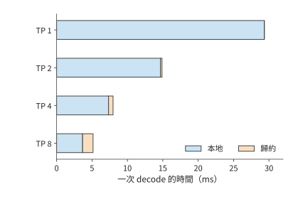

*圖 6-25：根據式（6-5）和環形歸約模型繪製的單步時間。本地記憶體存取隨卡數增加而減少，歸約時間則增加；條形總長度為單步執行時間。本地項包括權重與 KV 讀取，歸約項是卡間集合通訊。*

圖中，藍色部分隨卡數增加而縮短，橙色部分卻逐漸變長。兩卡到四卡，本地記憶體存取時間減少約 7.34 ms，通訊增加約 0.42 ms，淨省約 6.92 ms。四卡到八卡，本地記憶體存取時間只再減少約 3.67 ms，通訊增加約 0.84 ms，淨省降至約 2.83 ms。式（6-6）的左右兩項逐漸接近，但八卡仍然更快。

這時提高頻寬幾乎沒有收益。八卡一次歸約中，11.51 μs 來自啟動；即使傳輸時間降為零，仍要等待這十四輪。把頻寬翻倍，整步只節省約 2.5 μs；把每輪固定開銷減半，128 次歸約卻能節省約 0.74 ms。[^ring]

樹形演算法從輪數入手。四張卡先兩兩歸約，再由根節點合併結果，歸約需要兩輪；廣播再用兩輪，合計四輪。當 $n$ 為二的整數次冪時，未分段二項樹共有 $2\log_2n$ 輪，關鍵路徑上每輪都傳輸完整張量：

$$
T_{\mathrm{tree}}=2\log_2n\left(\alpha+\frac{M}{B}\right). \tag{6-10}
$$

八卡、10 KiB 時約為 5.07 μs，比環形演算法的 11.55 μs 短。資料量增大到 8192 個 token 的 80 MiB，環形演算法約需 0.34 ms，樹形約需 1.12 ms：減少輪次節省的時間，抵不過在關鍵路徑上反覆傳遞完整大張量增加的時間。令兩式相等，交點約在 680 KiB；資料量越過該值，更快的演算法就換成另一個。

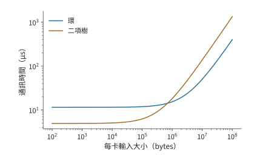

*圖 6-26：八卡環形演算法與未分段二項樹的時間模型，每輪 0.822 μs、每方向 450 GB/s。交點約為 680 KiB；10 KiB 的 decode 輸入位於主要受啟動開銷影響的一側，80 MiB 的 prefill 輸入位於主要受資料傳輸時間影響的一側。*

> **實驗 6-4 · 延伸：資料量多大時，環形歸約比樹形歸約更快？**
>
> （a）按圖 6-23 的傳送規則，跟蹤塊 1 的三輪歸約，寫出每輪由哪張卡持有該塊，以及其中已經累加了哪些卡的貢獻。
>
> （b）求四卡和八卡環形歸約的每卡傳送量，再推導相同資料量下樹形歸約的耗時。
>
> （c）求八卡部署下兩種歸約演算法耗時相等時的資料量；將 $\alpha$ 減半後重算，解釋兩種演算法耗時相等時的資料量為何變化。
>
> （d）將樹形演算法歸約 10 KiB 資料所需的時間代入本章 Qwen3-32B 算例，求八卡單步時間，比較演算法選擇與頻寬翻倍的收益。

### 6.4.3 通訊庫與計算的資源競爭

環形和樹形演算法都要由軟體在各卡上實際執行。**通訊庫**是實現集合通訊操作的軟體，例如 NVIDIA 集合通訊庫（NVIDIA Collective Communications Library，NCCL）。昇騰上的對應實現是華為集合通訊庫（Huawei Collective Communication Library，HCCL）。應用先建立通訊組（communicator），給組內每張卡分配一個 rank，再提交操作，說明緩衝區、元素數量、資料型別、歸約運算和所在的 CUDA stream。組內各卡的呼叫必須按介面要求相互匹配，包括呼叫順序和資料數量；呼叫返回通常只表示操作已提交到 stream 中，並不意味著可以複用仍在傳輸的緩衝區。使用結果的一方要靠同一 stream 的順序或顯式的 event 依賴來等待。集合通訊也不能當作任意主機程式碼都能用的全域性同步點。

在 MoE 中，每對卡之間 dispatch 的 token 數隨 batch 變化。等長的 All-to-All 表達不了這種不等長的交換，執行時還要自己組織計數、偏移、打包和接收空間。NCCL 可以用成組的點對點 Send／Recv（傳送／接收）表達任意兩卡之間的交換；每個傳送必須有對應的接收，需要一起推進的通訊要放進同一個組，否則會序列等待對方尚未發起的操作。專門的專家並行通訊庫進一步結合路由資訊實現 dispatch 和 combine。無論選哪種實現，都應記錄庫的版本與具體介面，不能把固定大小的 All-to-All 測試當作實際的 MoE 通訊。[^nccl-basics]

測量 NCCL 時，還要分清它報告的兩種頻寬：**algbw** 是測試定義的資料量除以時間，**busbw** 則按集合操作的實際傳輸量換算。對 $n$ 卡 AllReduce，若每卡輸入為 $M$，則 $\mathrm{algbw}=M/T$，$\mathrm{busbw}=2(n-1)M/(nT)$。例如實驗 7-3 儲存的公開記錄中，兩臺 HGX H100 共 16 個 rank，每卡 64 MiB 的 AllReduce 用時 466.1 μs，algbw 為 143.99 GB/s，busbw 為其 1.875 倍，即 269.98 GB/s。busbw 是歸一化指標，不能直接當作每張網路卡的實際吞吐量；分層通訊、交換機內歸約、鏈路 (Link)複用仍要按第 7 章的物理路徑逐項計數。資料量小時看延遲，資料量大時看持續頻寬，放到模型執行裡還要看從資料就緒到用完的整段時間。[^nccl-basics]

第 6.4.2 節比較環和樹時，把一次通訊當作獨立操作。實際執行中，通訊常與另一個 micro-batch 的計算重疊，兩者會爭用加速器資源。歸約需要讀取部分和、執行加法、寫回結果並推進通訊。這些工作會佔用 SM、HBM 和加速器互聯；同一時刻執行的矩陣乘也需要這些資源。通訊與計算重疊後，原來獨佔資源時的速度便會改變。

配套的實驗 6-5 測量了這種影響。實驗用 Gloo（支援 CPU 等執行環境的集合通訊庫）在四個 CPU 程序之間做 AllReduce，同時讓每個程序做一次矩陣乘，分別記錄兩者單獨執行和同時執行的時間，取五組的中位數：

| 歸約資料量 | 通訊單獨執行 | 計算單獨執行 | 同時執行時的通訊 | 同時執行時的計算 | 同時執行的整組完成 |
|---|---:|---:|---:|---:|---:|
| 4 MiB | 2.67 ms | 11.53 ms | 6.14 ms | 11.52 ms | 11.58 ms |
| 64 MiB | 36.92 ms | 11.03 ms | 45.21 ms | 12.89 ms | 45.24 ms |

4 MiB 時，通訊與矩陣乘同時執行後慢了一倍多，卻仍在矩陣乘結束前完成，整組用時 11.58 ms，與只做矩陣乘幾乎相同，通訊被計算掩蓋了。64 MiB 時，通訊從 36.92 ms 增至 45.21 ms，矩陣乘也從 11.03 ms 增至 12.89 ms；兩者分開執行共需約 48.0 ms，同時執行只節省約 2.7 ms，而不是矩陣乘的全部 11 ms。評價重疊執行，要比較兩者同時執行時的時間，不能把各自單獨測得的時間直接相減。[^comm-experiment]

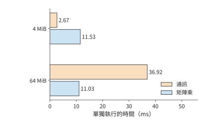

*圖 6-27：實驗 6-5 中通訊與矩陣乘單獨執行的時間，四個 CPU 程序，五組中位數。4 MiB 通訊約 2.67 ms，64 MiB 通訊約 36.92 ms，矩陣乘約 11 ms。*

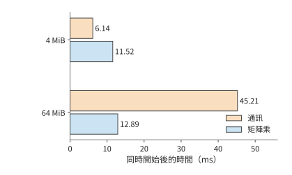

*圖 6-28：同一實驗中兩者同時開始。橙色為通訊，藍色為計算；後續工作等待兩者都完成。4 MiB 的通訊增至 6.14 ms，仍藏在計算之內；64 MiB 的通訊增至 45.21 ms，計算也增至 12.89 ms。*

GPU 上的道理相同。增加通訊執行緒數和通道數能夠加快單獨執行的傳輸，同時也會佔用計算所需的執行資源，所以只看單獨執行的通訊頻寬來選擇配置，可能讓整體變慢。集合通訊自動調優系統 AutoCCL 因此在訓練過程中記錄實際的通訊時間，讓反饋包含並行干擾；它先選演算法、協議與傳輸實現，再搜尋執行緒、通道和分塊。論文報告，在重計算干擾下，AllGather 的頻寬從 18.26 GB/s 提高到 32.44 GB/s。搜尋和切換本身也要時間：若搜尋額外耗時 $S$，此後每次呼叫節省 $\Delta$，至少要呼叫 $S/\Delta$ 次才能收回。[^tuning]

### 6.4.4 通訊融合、加速器發起與專用解除安裝

單獨加快通訊不一定能加快整體執行，因此要區分兩種改進：減少通訊啟動與資料讀寫次數，以及減少通訊對計算資源的佔用。在 Qwen3-32B 的八卡算例中，128 次歸約的啟動開銷約為 1.47 ms。圍繞這項開銷，可以改變三個不同環節：一次啟動做多少工作、由誰發起，以及由誰執行搬移和歸約。

**融合**讓相鄰操作在一個 kernel 中銜接。例如歸約後還要加殘差並做 RMSNorm，分開執行會把結果寫回再讀入，並經過多次啟動；融合後可以在資料仍靠近計算單元時繼續處理。歸一化必須等歸約得到完整輸入之後再做：忽略用於避免除零的小常數 epsilon 和可學習縮放參數，$\operatorname{RMSNorm}([1,0]+[0,1])=[1,1]$，分別歸一化再相加卻得到 $[\sqrt2,\sqrt2]$。融合必須保持這一執行順序，才能得到相同的計算結果。

**加速器發起**省去主機提交與加速器執行之間的往返：一個 kernel 算出資料後，可以直接發起後續通訊，縮短從計算完成到通訊開始的等待。**專用解除安裝**把搬移、歸約或同步交給複製引擎、通訊處理單元或交換機內的邏輯，把通用計算單元騰出來做矩陣計算。

昇騰的集合通訊單元（CCU）將搬移、歸約、同步和完成處理集中到通訊單元；NCCL 的部分路徑用節點內複製引擎（Copy Engine）與節點間 CPU 代理執行緒（替 GPU 向網路卡提交請求的主機執行緒）承擔資料搬移。這些機制改變的是由誰來做這些工作。若計算慢在與通訊爭用 SM，把 SM 讓出來就能縮短計算；若瓶頸在共用的網路出口，出口要傳的位元組數並沒有減少。[^ub][^tuning]

通訊請求由誰發起，決定控制路徑要穿越幾次 PCIe，也決定佔用誰的核。圖 6-29 比較三種位置。**CPU 代理執行緒**：GPU 算完資料後在主機記憶體裡寫一個就緒標誌，CPU 執行緒輪詢到它，構造請求描述符（描述一次傳輸的記錄）、敲響網路卡的門鈴（寫網路卡的一個暫存器，通知它有新請求），網路卡再從主機記憶體讀取請求描述符；完成記錄也寫回主機，由 CPU 轉告 GPU。控制路徑要穿越 PCIe 三次，每次都是幾百納秒；一個 CPU 執行緒每秒能處理的請求也有限，大批小請求會在這裡排隊。**GPU 的 SM**：GPU 直接在自己的記憶體裡構造請求描述符並敲門鈴，網路卡從 GPU 記憶體讀取請求描述符，完成記錄寫回 GPU 記憶體供 SM 輪詢。CPU 退出了關鍵路徑，控制路徑仍要穿越 PCIe 兩次；代價是要分出一部分 SM 來構造請求和輪詢完成，這些 SM 不能同時做矩陣計算。NVIDIA 的 GPUDirect Async 和專家並行通訊庫 DeepEP 的低延遲 kernel 採用的是這條路徑。**網路卡上的處理器**：BlueField 這類網路卡內建多核多執行緒的資料通路處理器，構造請求描述符、敲門鈴、取請求描述符都可以留在網路卡內部，主機只需為一批操作發一次觸發；控制路徑不再穿越 PCIe，也不佔用 SM 和 CPU 核。三種位置下，發起端的載荷從 GPU 記憶體搬出、完成記錄寫回 GPU 記憶體，各穿越 PCIe 一次，這兩項不隨發起位置改變；對端網路卡讀寫它所在主機的記憶體，還要在對端再穿越一次 PCIe。取捨因此是：由誰提供核、控制路徑多長、每秒能發起多少請求。第 7.3.3 節將累加每次穿越的時間，第 7.3.4 節再把發起速率納入吞吐量模型。[^initiator]

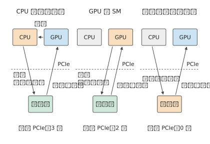

*圖 6-29：三種發起位置。橙色是構造請求描述符的部件；虛線是 PCIe 邊界。CPU 代理執行緒的控制路徑穿越 PCIe 三次，GPU 發起兩次，網路卡上的處理器零次；發起端的載荷與完成記錄在三種方式下都各穿越一次。*

回到本節開頭的 128 次小資料量歸約。框架會按資料量和連線方式選擇通訊實現。Qwen3-32B 一次處理 1、4、16 個 token 時，歸約輸入分別為 10、40、160 KiB，vLLM 等框架可以為這些小資料量選用專門的實現。由此，式（6-5）中的 $T_{\mathrm{AR}}$ 有了兩個改進方向：減少演算法輪次，或縮短每輪的軟體與執行開銷。[^collective-path]

> **實驗 6-5 · 延伸：通訊最佳化能節省多少時間，何時抵消準備開銷？**
>
> （a）用圖 6-27 與圖 6-28 的實測值，分別求 4 MiB 與 64 MiB 時同時執行比分開執行省下多少時間，指出每種情況下是計算還是通訊決定了整體完成時間。
>
> （b）設一次調優需要額外花費 $S$ 的搜尋與切換時間，此後每次呼叫節省 $\Delta$。寫出累計節省首次超過 $S$ 所需的最少呼叫次數；以 64 MiB 實測的重疊收益作為 $\Delta$，求 $S=1$ s 時的次數。
>
> （c）用兩個各含兩個元素的向量，比較先歸約後執行 RMSNorm 與先分別執行 RMSNorm 後歸約的結果，判斷兩者能否交換順序。
>
> （d）加速器選做：比較同一形狀的獨佔與並行執行，記錄就緒、開始和完成事件，說明共享後哪一段改變最多。

## 6.5 超節點的物理組織

### 6.5.1 直連、交換與分層拓撲

第 6.4 節的演算法和通訊庫決定了每一輪誰發給誰、發多少，但沒有涉及資料經過哪些物理連線。集合演算法規定邏輯上的傳送方和接收方，物理拓撲決定資料實際經過哪些裝置與鏈路 (Link)。兩張卡可以直連，也可以經交換機、其他卡或主機記憶體中轉。多次傳輸共用一個介面時，要排隊使用同一份頻寬。

**例題：再加一臺伺服器，TP16 能否比 TP8 更快？** 兩臺 HGX H100 共 16 張卡，伺服器之間由每張卡自己的 ConnectX-7 網路卡相連。把 Qwen3-32B 的一個 128K 會話改用 TP16，一個張量並行組橫跨兩臺伺服器，每層的 AllReduce 都要經過網路。

解答：本地記憶體存取方面，權重再減半，但 Qwen3-32B 只有 8 個 KV 頭，TP16 時每個 KV 頭在兩張卡上各存一份，每卡讀取的 KV 與 TP8 相同，本地時間只從 3.67 ms 降到 2.48 ms。通訊方面，若 16 張卡排成一個環，每輪都要等經過網路卡的那一跳；取 MSCCL++ 論文在同一平臺上測得的 InfiniBand（伺服器之間所用的低時延交換網路）單向延遲 3.76 μs，一次歸約要 30 輪，約 113 μs。實際的通訊庫不會這樣做。實驗 7-3 儲存的 nccl-tests（NCCL 的集合通訊效能測試程式）公開記錄恰好是兩臺 HGX H100、16 個 rank 的 AllReduce，10 KiB 的訊息取記錄中 16 KiB 一檔，實測 32.74 μs：

$$
T(16)\approx2.48\ \mathrm{ms}+128\times32.74\ \mu\mathrm{s}\approx6.67\ \mathrm{ms}.
$$

單臺伺服器內的 TP8 為 5.15 ms，TP16 反而慢約 1.52 ms。增加的卡減少了每卡的權重讀取，卻換來了更貴的跨伺服器同步；即使用上實際通訊庫的分層演算法，每次歸約仍要約 33 μs，接近機內環形歸約 11.55 μs 的三倍。

要讓更多的卡高效協作，就要有足夠的埠和交換容量。一張卡若與其他 $N-1$ 張卡都直連，就需要 $N-1$ 條連線。交換機把連線集中起來：卡先接到交換層，再由交換層轉發到目的地。一顆交換晶片提供的埠數稱為**基數**（radix）。

以 HGX H100 使用的第三代 NVSwitch 為例，一顆晶片有 64 個 NVLink 4 埠，每個埠每方向 25 GB/s。把這顆晶片用作一臺**葉交換機**（leaf）：32 個埠向下接 GPU，另外 32 個埠向上接**脊交換機**（spine），GPU 一側的總頻寬和上聯總頻寬都是 800 GB/s。若改成 48 個下聯、16 個上聯，接入的 GPU 鏈路 (Link)多了，但它們一起向上最多隻能送出 400 GB/s，只有下聯總頻寬的三分之一。埠總數不變時，多接 GPU 就少了上聯埠和上聯頻寬。DGX H100（NVIDIA 以 HGX H100 為基礎的整機）的 NVLink Switch System 把多臺伺服器接入同一個 NVLink 交換網路，正是這樣的取捨：每個節點只把全部 NVLink 頻寬的一半引出節點，即 2:1 收斂。[^nvswitch]

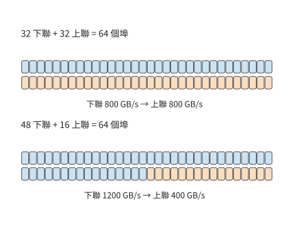

*圖 6-30：同一顆 64 埠 NVSwitch 的兩種分配，每個埠每方向 25 GB/s。上聯鏈路 (Link)是所有跨交換機流量的共同出口；32／32 分配提供 800 GB/s 上聯頻寬，48／16 分配只提供 400 GB/s。顏色條的格數與埠數一致。*

把交換層擴充套件到一顆晶片之外：四顆葉交換晶片各有 32 個下聯埠，共 128 個下聯埠。再配 32 顆脊交換晶片，每顆各用一條鏈路 (Link)連到這四顆葉交換晶片，正好用滿每顆葉交換晶片的 32 條上聯。把系統分成兩部分，所有連線這兩部分的鏈路 (Link)合起來稱為一個**割集**。若某一階段有 $V_{A\to B}$ bytes 必須從 A 側穿過割集到 B 側，而割集在該方向的總頻寬為 $B_{A\to B}$，傳輸至少需要 $V_{A\to B}/B_{A\to B}$。交換機的埠分配決定了割集的總頻寬。

埠數決定一共有多少鏈路 (Link)，路由決定資料集中到哪些鏈路 (Link)。即使每張卡傳送的資料量相同，走不同的路徑也會形成不同的瓶頸。把 16 張卡連成一個雙向物理環，觀察 8 MiB 輸入的 ReduceScatter 前三輪。遞迴演算法每輪把對端的距離翻倍；Swing 是為環面拓撲設計的集合通訊演算法，透過改變各輪的對端來分散鏈路 (Link)負載。兩種演算法每張卡每輪同樣傳送 4、2、1 MiB，但對端不同：

| 前三輪 | 遞迴路徑 | Swing 路徑 |
|---|---|---|
| 每次傳輸經過的物理跳數 | 1、2、4 | 1、1、3 |
| 最大單向鏈路 (Link)傳輸量 | 4、4、4 MiB | 4、2、2 MiB |
| 全網物理鏈路 (Link)累計傳輸量 | 64、64、64 MiB | 64、32、48 MiB |

第三輪，遞迴演算法的資料要走四跳，最忙的鏈路 (Link)同時承載四份 1 MiB 資料；Swing 的資料走三跳，最忙的鏈路 (Link)只承載兩份。按 TPU v4 每條 ICI（晶片間互聯）鏈路 (Link)每方向 50 GB/s 計，前三輪由瓶頸鍊路決定的傳輸時間分別約為 252 與 168 μs。傳輸時間少了三分之一，是因為共享鏈路 (Link)上的資料少了。[^swing]

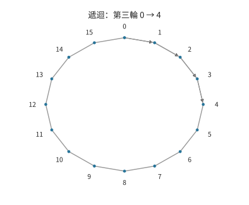

*圖 6-31：遞迴演算法第三輪，卡 0 發往卡 4。細線為 16 張卡組成的物理環，箭頭標出經過的四條鏈路 (Link)。*

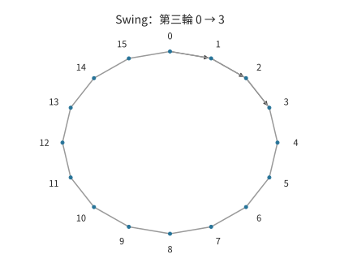

*圖 6-32：同一物理環上，Swing 第三輪卡 0 發往卡 3，經過三條鏈路 (Link)。每張卡這一輪的傳送量仍為 1 MiB。*

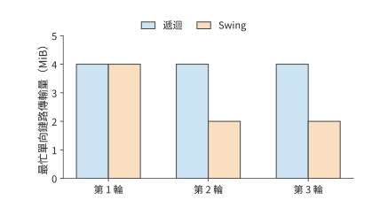

*圖 6-33：把所有傳送方的資料累加到各條有向鏈路 (Link)上，取每輪的最大值。遞迴前三輪均為 4 MiB，Swing 為 4、2、2 MiB。*

經主機記憶體中轉是同一個問題的另一種形式。非統一記憶體存取（NUMA）結構把主機記憶體分在不同 CPU 附近，跨 CPU 讀取要經過處理器之間的介面。設卡 0、1 接在 NUMA 節點 A，卡 2、3 接在節點 B，四張卡做環形歸約共傳送 48 MiB。把全部中轉緩衝放在 A，CPU 之間每個方向要承擔 24 MiB；把緩衝放到傳送卡附近，並讓同一 NUMA 節點的卡在環中相鄰，每個方向降到 12 MiB；若把環改成交替跨越 NUMA 節點，每個方向又回到 24 MiB。DGX H100 的主機就是兩路結構：兩顆 Xeon 8480C 各帶一個 NUMA 節點，兩顆 CPU 之間最多有 4 條 UPI（Intel 處理器之間的互聯）鏈路 (Link)，每條 16 GT/s；每張 GPU 經 PCIe Gen5 x16 連到主機，每方向 64 GB/s。三種方案中每張卡經 PCIe 進出主機的資料量相同，經過 UPI 的資料量卻按 2:1:2 變化，跨 CPU 的傳輸時間也隨之變化。緩衝的位置和卡在環中的次序共同決定資料的搬移路徑。[^numa]

**設計案例：直連環面還是交換網路？** 上述例子中，資料要麼直接走一條鏈路 (Link)，要麼經過一臺交換機。把 64 張卡連成一個超節點時，有兩條常見的路線。一條是讓每張卡直接和鄰居相連：把 64 張卡排成 $4\times4\times4$ 的立方體，每張卡沿三個維度各接兩個鄰居，每一維首尾相連，這就是**三維環面**（torus）。環面是超級計算機長期使用的一類拓撲，TPU 沿用了它。另一條是讓每張卡只接交換晶片，由交換層轉發到目的地，NVL72 和 CloudMatrix384 採用這一路線。兩條路線給每張卡同樣的六個埠，每埠每方向 50 GB/s，這正是 TPU v4 每顆晶片的 ICI 配置；差別在埠的另一端接的是鄰居還是交換晶片。圖 6-34 畫出在這兩種連線方式下，一次傳輸經過的路徑。

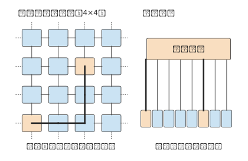

*圖 6-34：左側是三維環面的一層，每張卡與四個鄰居直連，虛線表示每一維首尾相連；從角上的卡到中心的卡要經過四跳，加上第三個維度最多六跳。右側是交換網路，任意兩張卡之間都是兩條鏈路 (Link)加一次交換。橙色是相距最遠的一對卡，粗線是它們之間傳輸經過的路徑。*

先比較**跳數**。環面裡最遠的兩張卡在每個維度上相距兩跳，三個維度共六跳；交換網路裡任意兩卡都是兩條鏈路 (Link)加一次轉發。設資料每經過一顆晶片的路由器或一顆交換晶片要增加 200 ns，這是開放加速器互聯標準 UALink 2.0 規範為 128 lane（序列通道）交換晶片設定的空載延遲目標；鏈路 (Link)上的傳播時間忽略不計。環面上最遠的兩張卡之間要經過 5 顆中間晶片，交換網路只經過 1 顆交換晶片，環面每次傳輸多耗時 0.8 μs。單次差距不大，但 decode 每層要做兩次歸約，Qwen3-32B 的 64 層就是 128 次；若每次都要等最遠的卡，環面共多等約 0.10 ms，約為八卡 TP 全部歸約時間 1.48 ms 的 7%。卡數增加到 $8^3=512$ 時，環面最遠變成十二跳；交換網路只需再加一級交換，變成四條鏈路 (Link)加三次轉發。

再比較**流量模式**。第一種是沿維度的歸約：把 AllReduce 拆成沿 x、y、z 三個方向的環形 ReduceScatter 與 AllGather，每一步只在相鄰卡之間傳輸，六條鏈路 (Link)同時工作。這時環面把每張卡的全部埠頻寬都用上了，和交換網路一樣快。TPU 的編譯器正是把資料並行和模型並行的分組對應到環面的維度上。第二種是均勻的 All-to-All：每張卡向其他 63 張卡各發一份，MoE 的 dispatch 就是這種模式。環面上每份資料平均要走三跳（每個維度平均一跳）；64 張卡各發 $M$ 位元組，全部鏈路 (Link)一共要承載 $3\times64M$，分攤到 384 條有向鏈路 (Link)，每條 $M/2$。交換網路裡每張卡的六個埠各分 $M/6$。取 $M=32$ MiB，環面至少需要約 336 μs，交換網路約 112 μs，相差三倍；512 卡的環面平均六跳，差距變成六倍。圖 6-35 把兩種模式放在一起。

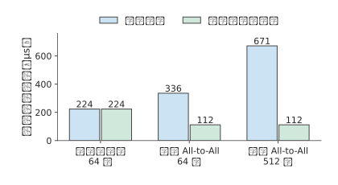

*圖 6-35：每張卡六個 50 GB/s 埠、每卡傳送 32 MiB。沿維度歸約時兩種拓撲都用滿埠頻寬；均勻 All-to-All 時環面上的資料平均要走三跳，共享鏈路 (Link)承載的資料隨之增加，512 卡時增至六跳。圖中是鏈路 (Link)負載給出的下界，不含啟動開銷與排隊；交換網路按無阻塞計，即交換層不限制各埠同時滿速收發。*

最後比較**硬體代價**。64 卡環面需要 $64\times6/2=192$ 條鏈路 (Link)，不需要任何交換晶片，路由器做在每顆晶片內；交換網路需要 384 條鏈路 (Link)和六顆 64 埠的交換晶片。卡數超過一顆交換晶片的埠數之後，交換網路還要再加一級：CloudMatrix384 為 384 個 NPU 在 48 個節點內各放 7 顆一級交換晶片，再用 7 個子平面各 16 顆二級交換晶片相連，共 448 顆交換晶片，其中的二級交換晶片裝在 4 個通訊機櫃裡。環面則在任何規模下每卡都只需六條鏈路 (Link)，代價是跳數隨規模增加，每卡分到的割集頻寬隨規模下降，第 6.5.4 節將計算這一點。

三個比較合起來，就是選擇拓撲的判斷依據：負載以規則的集合通訊為主，還是有大量目的地任意的小資料傳輸和 All-to-All；協作域需要多少張卡；是否願意用交換晶片和更多線纜換取任意兩卡等距。第 6.5.3 至 6.5.5 節將看到 NVIDIA、Google 和華為在這三個問題上各自作了什麼選擇。[^topology-choice]

> **實驗 6-6 · 延伸：通訊拓撲與緩衝位置如何影響傳輸耗時**
>
> （a）復算兩臺 HGX H100 上 TP16 的單步時間，再求跨伺服器的一次 AllReduce 降到多少時，TP16 與單臺伺服器內 TP8 的單步時間恰好相同。
>
> （b）對 64 埠的 NVSwitch，比較下聯／上聯埠分別為 32／32 與 48／16 的兩種分配，計算所有 GPU 鏈路 (Link)同時向上傳送時每條鏈路 (Link)的平均可用頻寬。
>
> （c）根據圖 6-31，累加第三輪經過同一條有向鏈路 (Link)的資料量，說明跳數與鏈路 (Link)傳輸量的區別。
>
> （d）在 NUMA 例中先移動緩衝，再改變環的次序，分別畫出新增與消失的跨 CPU 訪問。
>
> （e）把設計案例中的 64 卡改為 $8\times8\times8$ 環面，求最遠跳數、均勻 All-to-All 時每條有向鏈路 (Link)的負載，以及兩級無阻塞交換網路需要多少顆 64 埠交換晶片；說明哪一項隨卡數增長得最快。

### 6.5.2 互聯介質、供電與物理規模

第 6.5.1 節把鏈路 (Link)看成給定頻寬和延遲的連線；在實際系統中建成這些連線，還要解決傳輸距離、佈線和供電問題。把低延遲協作延伸到更遠處，連線介質也要隨之變化。短距離銅線可以直接傳送高速電訊號；距離增大後，訊號衰減和串擾加重，接收端更難恢復資料與時鐘，因此需要更強的均衡或重定時電路。更粗的線纜和更多連線又佔用機箱與佈線空間。選擇連線介質時，需要同時考慮傳輸距離、訊號損耗和佈線密度。

光連線把資料調製到光載波上，適合跨越更長距離；同時也增加了光電轉換、器件供電和維護的成本。可插拔光模組將轉換放在可更換模組中，**共封裝光學**（CPO）則把光學引擎移到交換或計算晶片附近，縮短高速電通路。後者提高封裝內的連線密度，但光學器件與計算或交換晶片共同封裝後，散熱、測試和部件更換也需要一併設計。連線介質決定在給定距離和頻寬下的實現成本，拓撲決定這些連線如何組成通訊路徑。[^physical]

供電能力進一步限制可以安裝的卡數。卡按整臺伺服器安裝，設系統預算為 $P_b$，交換機、儲存等固定配套功率為 $P_0$，每臺伺服器裝 $g$ 張卡、功率為 $P_s$，則

$$
N\le g\left\lfloor\frac{P_b-P_0}{P_s}\right\rfloor. \tag{6-11}
$$

DGX H100 的八張 H100 連同 CPU、NVSwitch、網路卡和風扇，系統功率上限為 10.2 kW，平均每張卡 1.275 kW；單張 H100 SXM 本身的功耗上限是 700 W，其餘來自伺服器內的配套部件。[^dgx-power] 設一組機櫃的供電預算為 120 kW，本例只計伺服器，$P_0$ 取 0，最多可以安裝 11 臺伺服器、88 張卡。64 卡（8 臺）用 81.6 kW，72 卡（9 臺）用 91.8 kW，96 卡（12 臺）要 122.4 kW，超過功率預算；64 卡和 72 卡方案還需根據交換埠數量與安裝空間確定具體配置。

散熱給出另一條上限。風冷機櫃靠風扇把熱量帶進機房空氣：ASHRAE 的液冷白皮書指出，一個 40 至 50 kW 的機櫃需要多達 5,000 cfm（立方英尺每分鐘）的風量，而最好的地板送風口只能提供 1,900 cfm；在 50 kW 機櫃裡，風扇本身至少消耗 5 kW。本例取 40 kW 作為風冷機櫃的閾值，一個機櫃最多放 3 臺 DGX H100，即 24 張卡、30.6 kW；放 4 臺就要 40.8 kW；DGX SuperPOD H100 參考架構給出的示例機櫃佈置中，每個機櫃的功率都超過 40 kW。64 卡的 81.6 kW 與 72 卡的 91.8 kW 若要集中在少數機櫃裡，都遠超這一閾值，要改用液冷，把熱量直接交給冷卻液而不是機房空氣。[^ashrae]

如果一個交換單元只能連線 64 個端點，接入第 65 張卡就可能要增加一整套交換裝置。卡數逐步增加時，配套交換裝置的成本不是平滑上升，而是在跨過這樣的整組邊界時突然跳升。用式（6-11）求出大致範圍之後，再按交換機、托盤、機櫃這些安裝單位組合，才能得到可以建造的系統。

> **實驗 6-7 · 延伸：功率預算與整組擴容要求如何限制加速器數量**
>
> （a）分別復算安裝 64、72、96 張卡時的總功率，按式（6-11），求功率預算增加到 150 kW 時最多可以安裝多少張卡。
>
> （b）若超過 64 卡後要為第二級交換裝置預留相當於一臺伺服器的 10.2 kW，求 120 kW 功率預算下最多可以安裝多少張卡。
>
> （c）沿用（b）的功率預算和額外交換裝置條件，假設只能按四臺伺服器（32 張卡）整組增加，求最多可以安裝多少張卡，並解釋（a）至（c）的上限為何不同。
>
> （d）用前面得到的單例項服務時間比較其中兩種加速器配置的服務能力。

### 6.5.3 NVIDIA：從八卡伺服器到機櫃

埠、距離和功率共同限制了系統規模。在這些條件下，NVIDIA 的幾代系統把互聯從機箱內直連發展到了機櫃級交換網路。DGX-1 用八張 GPU 組成 NVLink 混合立方體網格，部分 GPU 直接相連，其他 GPU 之間的通訊需要中轉。把頻繁通訊的計算任務放到相鄰的 GPU 上，就能減輕中轉和共享鏈路 (Link)的壓力。

DGX-2 使用 16 張 V100 和 NVSwitch。交換結構把「某對 GPU 是否直接相連」轉化為「交換層能同時轉發多少資料」，擴大了可用協作範圍。DGX A100 又以八卡伺服器為基本單元，配備 NVLink／NVSwitch。這些系統採用不同的 GPU 數量與互聯結構，以適應晶片介面、機箱空間和應用需求。[^nvidia]

GB200 NVL72 將 72 張 GPU 和 36 個 Grace CPU 放進機櫃級 NVLink 系統。機櫃內更多的 GPU 由此能透過 NVLink 頻繁交換資料。回到第 6.5.1 節的例題：Qwen3-32B 的 TP16 橫跨兩臺 HGX H100 時，128 次歸約經網路約需 4.19 ms，單步約 6.67 ms。若這 16 張卡處在同一個 NVLink 交換域內（DGX H100 的 NVLink Switch System 最多連線 256 張 H100），按每輪 0.822 μs 算，16 卡環形歸約共 30 輪，128 次約 3.16 ms，單步約 5.64 ms，仍慢於單臺伺服器內 TP8 的 5.15 ms。該模型只有 8 個 KV 頭，TP16 時每卡讀取的 KV 不再減少，環的輪數卻多了一倍。對這類模型，更大的互聯域的價值不在於把一個會話切得更碎，而在於容納更多例項，或者容納超出單臺伺服器容量的模型。[^nvl]

機櫃級互聯讓更多 GPU 能參與同一個例項。單卡可以容納的小模型，可以按延遲和吞吐量要求選擇例項數；權重超過八卡總容量的大模型，則可以用更多 GPU 儲存權重，各層的通訊走機櫃內互聯。

### 6.5.4 TPU：拓撲與負載協同

NVIDIA 的路線是用交換層擴大 GPU 的連線範圍。Google 的張量處理器 TPU 則沿用第 6.5.1 節設計案例中的環面，讓模型切分、編譯器的佈局和物理通訊互相對應。二維環面沿兩個維度連線晶片，每一維首尾相連；三維環面再加一個維度，資料可以沿更多方向傳輸。

TPU v4 以 $4\times4\times4$ 的 64 晶片電互聯單元為基礎，再用光路交換機（OCS，透過改變光路連線裝置埠）連線多個單元。這一劃分同時考慮了網路拓撲和裝置安裝：64 顆晶片與 16 臺 CPU 主機能夠放入一個機櫃，更大的 $8^3$ 單元包含 512 顆晶片，需要跨櫃連線。[^tpu]

用割集頻寬可以分析這種規則拓撲擴充套件後的通訊能力。將一個 $k\times k\times k$ 的三維環面沿某一維等分，穿過兩個切面的物理鏈路 (Link)（即該割集，稱為二分鏈路 (Link)）共 $2k^2$ 條。$k$ 從 4 增到 8，晶片數由 64 增到 512，增加到原來的八倍，割集鏈路 (Link)卻只由 32 增到 128，增加到原來的四倍。若每顆晶片都要向另一半傳送同樣多的資料，平均每顆晶片分到的割集頻寬就減半。晶片數與割集頻寬增長速度的差別，決定了哪些並行佈局適合這種形狀。

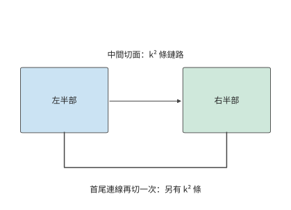

*圖 6-36：沿一個維度把三維環面網路分成兩半，需要切斷中間連線和首尾連線。每處包含 k² 條鏈路 (Link)，合計 2k² 條。*

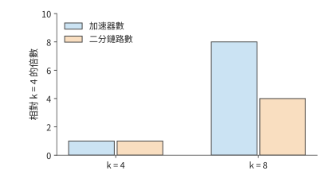

*圖 6-37：k 從 4 增到 8 時，晶片數從 64 增到 512，二分鏈路 (Link)從 32 增到 128。兩種增長均以 k = 4 時為基準。k 表示三維環面每個維度的節點數，總節點數為 k³。*

固定拓撲決定了跨分割槽的頻寬，空閒晶片的位置還決定作業能否獲得所需的形狀。OCS 在更大尺度上重新連線這些電互聯單元，為不同作業分配形狀合適的晶片子集，這樣的子集稱為切片。以一個 4×4 的晶片網格為例：若有連續兩行空閒，可以放下兩個各需要相鄰 2×2 晶片的作業；同樣八顆空閒晶片若呈棋盤狀分佈，就找不出一組相鄰的 2×2。重新連線可以改變可分配的形狀。

重新連線節省的執行時間要超過重連本身的耗時才值得。Morphlux 研究按任務重構光互聯拓撲，讓連線適合任務的通訊需求。設八顆 TPU v4 晶片做 8 MiB 輸入的環形 AllReduce，每顆晶片傳送 14 MiB。若該切片原來每顆晶片只有一條 50 GB/s 的 ICI 鏈路 (Link)可用於該通訊組，重連後有三條，傳輸項就從約 293.6 μs 降到約 97.9 μs，每次節省約 195.7 μs。TPU v4 的 OCS 切換光路需要毫秒級時間：若重連需要 1 ms，重複 6 次就能收回；若需要 100 ms，則要 511 次。作業持續得越久，建立更合適的連線越值得。[^swing]

### 6.5.5 Unified Bus 與 CloudMatrix

NVIDIA 與 TPU 兩種系統主要從加速器互聯出發。華為的 UB 進一步把問題擴充套件到資源訪問：連線兩臺主機之後，一臺主機上的裝置能否直接使用另一臺主機的記憶體。筆者對 Unified Bus 的早期思考來自主機內匯流排與主機間網路的分界。同樣是讀取一塊資料，跨過主機邊界後，軟體往往要改用訊息傳遞介面，重新安排緩衝區，每多一層抽象就多一段時間。UB 希望去掉這些抽象層，擴大資源直接訪問的範圍，使計算、記憶體和儲存能夠按任務重新組合。

本書在兩處討論 UB。本節把 UB 看作一種超節點互聯，回答三個與規模有關的問題：控制器接在哪裡，片上快取能容納多大的互聯，建立全部連線需要多長時間。第 7 章則沿著一次遠端訪問的路徑展開：第 7.1.3 節說明統一介面的設計動機，第 7.3.3 節逐階段推導一次讀取的延遲，第 7.3.4 節計算請求速率，第 7.4.2 節推導連線狀態的增長和片上快取的溢位點，第 7.4.3 節討論按需指定的順序。兩處使用同一組參數和同一個計算指令碼，推導結果都與筆者的 UB 實現 OpenURMA 在模擬中測得的數值對照。[^ub-fabric]

這種統一首先要回答兩個不同的問題：一次操作要訪問誰、讀寫什麼、何時可以使用結果；這次操作的資料如何經過網路並可靠送達。UB 將前一類職責放在**事務層**，後一類職責放在**傳輸層**。這裡的「事務」是一次通訊操作，不是資料庫中具有提交與回滾語義的事務。

事務層的 Jetty 為應用提供提交、接收和完成通知的端點抽象，保留應用身份與操作所需的上下文；傳輸層的傳輸通道（UB 中稱為 TP Channel，其中 TP 是 Transport Protocol 的縮寫，與張量並行無關）維護報文序號、確認、重傳和擁塞控制狀態。多個應用端點訪問同一遠端時，可以共用底層的傳輸通道，不必讓每條應用關係都各帶一份完整的可靠傳輸狀態。圖 6-38 展示了這一分離。傳統遠端直接記憶體存取（RDMA，讓網路卡直接讀寫已授權的遠端記憶體）的可靠連線 QP（queue pair，佇列對，由傳送佇列和接收佇列組成的通訊端點）把應用端點關係與傳輸狀態繫結得較緊；UB 則允許分別安排兩類狀態的數量、壽命與共享範圍。[^ub-design]

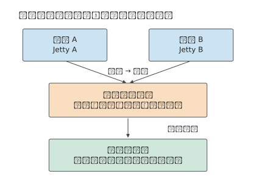

*圖 6-38：兩個本地應用保留各自的 Jetty，經共享傳輸通道訪問遠端端點。事務層區分操作及其完成歸屬，傳輸層處理報文的可靠交付；共享通道不取消許可權檢查，也不自動建立跨應用的全域性順序。*

另一項關鍵選擇是**記憶體語義**。單邊操作由發起方直接指定已經授權的遠端記憶體地址，遠端應用不必為每次操作準備一個匹配的接收請求。UB 支援兩種發起方式：Load／Store 由處理器指令發起，Read／Write 由顯式提交的請求發起。兩種方式都能訪問遠端記憶體，但都不意味著跨裝置的快取自動保持一致。第 7.3.3 節比較這兩種方式，第 7.4.1 節說明資料何時可見、操作何時算完成。

**控制器的位置。** 傳統網路卡是一個 PCIe 外設，第 6.4.4 節已經跟蹤過這條發起路徑。處理器發起一次遠端讀取時，門鈴、讀描述符、目標端讀資料、寫回資料、寫完成記錄一共五次穿越 PCIe，每次都要幾百納秒。UB 把控制器接在處理器的片上匯流排上：處理器執行一條 Load 指令，請求經片上匯流排直接到達控制器，返回的資料直接寫入暫存器。圖 6-39 對比了這兩條發起路徑。第 7.3.3 節把兩條路徑逐階段相加：線路單程時延為 100 ns 時，經 PCIe 外設網路卡的一次 64 B 讀取約需 2.2 μs，其中五次 PCIe 穿越佔約 1.65 μs；經片上匯流排控制器的讀取約需 0.42 μs。節省的時間不是把原有階段壓縮得到的，而是因為處理器與控制器共用一個地址空間，那些階段不復存在。去掉抽象層，讓處理器像訪問本地記憶體一樣訪問遠端記憶體，正是 UB 收益的來源；剩下的 0.42 μs 主要由線路時延和遠端訪存決定，已經接近硬體允許的下限。

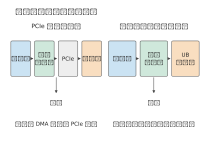

*圖 6-39：左圖的網路卡接在 PCIe 之後，門鈴、請求描述符、返回資料和完成記錄在發起端的處理器與網路卡之間各穿越 PCIe 一次，目標端網路卡讀取資料時再穿越一次；右圖的控制器接在片上匯流排上，處理器的指令直接到達控制器。兩條路徑從控制器到網路的部分相同。*

**互聯規模與片上狀態容量。** 網路卡把每個通訊關係的上下文快取在片上，這裡取快取容量為 256 KiB。設互聯內有 $H$ 臺主機，每臺主機有 $A$ 個應用端點，任意兩臺主機的端點之間都可能通訊。連線狀態有兩種組織方式。第一種是**逐對連線**，以 RoCE（在乙太網上承載的 RDMA）的可靠連線為代表：本機的每個端點與其餘 $H-1$ 臺主機上的每個端點各建立一條連線，每條連線儲存 512 B 的上下文。第二種是 UB 的**端點加通道**：本機每個端點儲存一份 20 B 的 Jetty 記錄和 32 B 的記憶體段記錄，每臺遠端主機對應一條 56 B 的傳輸通道。兩種方式下每個網路卡儲存的狀態分別為

$$
S_{\mathrm{pair}}(H)=512A^{2}(H-1)+32A,\qquad
S_{\mathrm{UB}}(H)=52A+56(H-1).
$$

取 $A=8$。逐對連線每增加一臺主機，狀態增加 32 KiB，256 KiB 的快取只能容納 8 臺主機；端點加通道每增加一臺主機只增加 56 B，同樣的快取可以容納四千多臺主機。以 CloudMatrix384 的 192 臺主機計，逐對連線需要約 6 MiB，是快取容量的 24 倍；端點加通道只需約 11 KiB。快取無法容納的狀態，每次操作都要從主機記憶體重新讀取，代價在第 7.4.2 節計算：逐對連線的每次操作要增加兩次 PCIe DMA 讀取，約 1 μs。

第三種組織方式是快取一致的互聯，NVLink 屬於這一類：加速器可以把對端記憶體中的資料放進自己的快取。為了讓各個副本保持一致，需要一個目錄記錄每個快取行被哪些對端持有，每行至少要為每個對端留 1 bit。設目錄跟蹤 $W=2^{20}$ 個快取行（64 MiB 資料），每行另有 8 B 標籤，則目錄佔用 $W\,((H-1)/8+8)$ B：兩臺主機時約 8 MiB，1024 臺時約 136 MiB。每次寫入還要向所有持有副本的對端傳送失效訊息，訊息數隨 $H$ 線性增長。這兩項開銷把快取一致互聯的規模限制在幾十個對端，NVL72 的 72 張 GPU 正處在這一範圍。UB 不維護跨主機的快取一致，資料何時對其他裝置可見由應用自己安排（第 7.4.1 節），所以三條狀態曲線中只有它能延伸到上千臺主機。圖 6-40 畫出了這三條曲線。

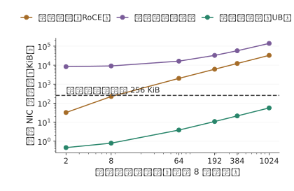

*圖 6-40：每臺主機 8 個端點時，三種組織方式下每個網路卡的狀態隨互聯內主機數的變化。虛線是 256 KiB 的片上快取。逐對連線在 8 臺主機時超出快取，目錄式快取一致互聯從兩臺主機起就遠超快取，端點加通道到上千臺主機仍在快取之內。*

**連線建立時間。** 狀態的數量也決定了作業啟動時要執行多少控制操作。逐對連線的每條連線要經過建立和三次狀態遷移，共 4 次系統呼叫，還要與對端交換一次連線編號，需要一次帶外往返（經資料通路以外的通道往返一次）。取一次系統呼叫 5 μs、一次帶外往返 500 μs，建立一條連線約需 0.52 ms。$N$ 個本地端點訪問 $M$ 個遠端端點，需要建立 $NM$ 條連線。端點加通道只需為 $N$ 個端點各執行 1 次系統呼叫，為 $M$ 臺遠端主機各執行 1 次系統呼叫和 1 次往返。$N=M=1024$ 時，逐對連線要建立 1,048,576 條連線，序列約需 545 s，32 個核並行也要約 17 s；端點加通道只需建立 2048 個物件，並行後約 16 ms。圖 6-41 畫出了 $N$ 從 1 到 1024 的全過程。作業每次重啟或擴縮容都要重複這一過程，所以它直接影響第 6.7.2 節討論的故障恢復時間。

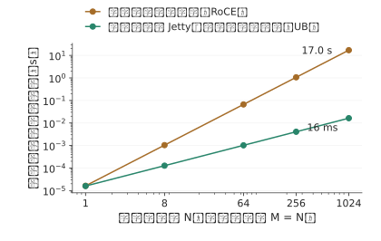

*圖 6-41：在 N 個本地端點與 N 個遠端端點之間建立全部連線所需的時間，32 個核並行執行。逐對連線的時間隨 N² 增長，端點加通道隨 N 增長；N = 1024 時二者相差約一千倍。*

這些 UB 機制在具體系統上的體現是華為的 CloudMatrix384：該系統將 384 個昇騰 910C NPU 與 192 個鯤鵬（Kunpeng）CPU 透過 UB 交換結構組織起來，超節點外使用 RDMA 網路；業務接入由虛擬私有云（VPC）網路承擔，用於隔離和連線租戶資源。若 384 個 NPU 兩兩各鋪一條直連，需要 $384\times383/2=73\,536$ 條連線；交換層透過埠連線和路由轉發實現裝置間通訊。[^cloudmatrix]

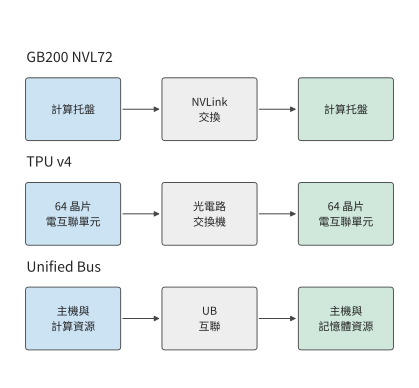

*圖 6-42：三個公開系統的連線層次。NVIDIA 用 NVLink 連線裝置，TPU v4 用 OCS 連線電互聯單元，Unified Bus 將主機側計算和記憶體資源接入統一互聯。*

這些系統都可以採用第 6.3.1 節的 TP2×EP4 並行方案，但分組與物理邊界的對應方式不同。張量並行組內的頻繁歸約適合放在低延遲連線內，不同專家組之間交換專家結果時，則需要足夠的跨組頻寬。把演算法上的通訊組對映到物理交換層，才能確定每次匯合佔用了哪些埠。

用介面頻寬計算傳輸時間時，要分清單向頻寬和雙向合計頻寬。例如昇騰 950 的 UB 雙向合計線速為 2016 GB/s，按 72 條 lane、每條 112 Gbit/s 計，單向為 1008 GB/s。UBoE 是在乙太網上承載 UB 通訊的方式，UB Link 是 UB 自己的鏈路 (Link)方式。兩者按預先配置共用同一組序列器／解串器（SerDes，把晶片內的並行資料與鏈路 (Link)上的序列訊號互相轉換的電路），所以要把同一組物理通道分配給兩種用途。分配方式決定任務實際可用的頻寬。[^ub]

> **實驗 6-8 · 延伸：用通訊需求解釋超節點的互聯結構**
>
> （a）選擇 DGX-1、DGX-2 或 DGX A100，畫出一個通訊組經過的直連或交換層。
>
> （b）復算 4³ 與 8³ 環面的晶片數和均衡二分鏈路 (Link)數，解釋為什麼每晶片可用的跨分割槽頻寬下降。
>
> （c）將 TP2×EP4 放到兩臺各有四張卡的主機上，標出跨主機的專家組歸約。
>
> （d）把每臺主機的端點數改為 64，求 256 KiB 快取在逐對連線方式下還能容納幾臺主機；再把快取擴大到 1 MiB，判斷 CloudMatrix384 的 192 臺主機是否放得下。
>
> （e）把一次帶外往返改為 50 μs，重新計算 N = M = 1024 時兩種方式的連線建立時間，說明哪一種對往返時延更敏感。
>
> （f）選擇 UB 或 TPU 的一個設計，說明安裝、通訊或資源訪問中的哪項需求促成了這種系統結構。

## 6.6 記憶體池

### 6.6.1 區域性容量不足與全域性空閒

UB 把資源訪問擴充套件到主機之間後，就有了具體用途：讓記憶體不足的節點借用其他節點的空閒記憶體。第 6.2 節的張量並行、管線 (Pipeline)並行和專家並行把計算和權重分到不同的卡上，降低每張卡的記憶體需求。另一種辦法是計算位置不變，只把一部分資料放到別的節點。這就是記憶體池的基本用途：把分散的空閒容量交給需要它的任務。

考慮四個節點，每個節點用一張 80 GB 的 H100，任務需求分別為 100、60、40、40 GB。總需求 240 GB，小於總容量 320 GB，但任務 0 的需求比所在節點的容量多出 20 GB。其餘節點的空閒分別為 20、40、40 GB，合計 100 GB。

把任務 0 整體搬到另一節點，其需求仍超過單節點的 80 GB 容量。若將它的 20 GB 資料放到節點 1 的空閒區，則物理佔用變為 80、80、40、40 GB。任務 0 的工作集仍是 100 GB，其中 80 GB 本地、20 GB 遠端。這樣，任務 0 就能利用其他節點原本空閒的記憶體。

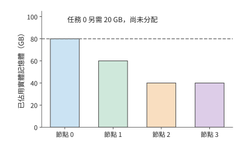

*圖 6-43：借用前的物理佔用。每節點容量為 80 GB，任務 0 的需求為 100 GB，其中 20 GB 尚未找到儲存位置。顏色表示資料所屬任務。*

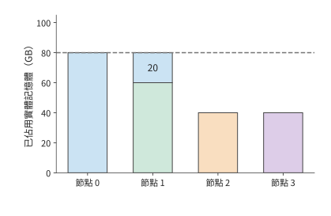

*圖 6-44：把任務 0 的額外 20 GB 放在節點 1。節點 1 的綠色 60 GB 屬於任務 1，藍色 20 GB 屬於任務 0；每個節點都沒有超過 80 GB。*

需要區分借用前後的空閒容量：其他節點原有 100 GB 空閒記憶體，其中 20 GB 借給任務 0 後，四個節點合計還剩 80 GB。借用沒有增加實體記憶體，只是讓任務能夠使用其他節點的空閒空間。筆者早期關於 UB 記憶體池的構思，關注的正是這種伺服器之間的不均衡；KV 的儲存與複用後來成為它的具體用途。

### 6.6.2 記憶體借用與訪問邊界

圖中的 20 GB 已經有了存放位置，下一步是讓節點 0 正確訪問這段記憶體。借用首先要明確一段記憶體由誰提供、由誰使用。提供記憶體的節點開放一段區域，借用節點建立相應的地址對映，系統負責管理訪問許可權，並記錄這段記憶體何時可以釋放和重新分配。獨佔借用期間，使用權交給借用者，原持有者等待歸還後再使用；共享訪問則允許多個使用者按約定的一致性與同步規則訪問。[^ub]

例如節點 1 把一段記憶體借給節點 0，節點 0 要先寫入新 KV，再開始注意力計算。只有確認寫入完成、能夠讀到新的 KV，才能開始計算；節點 1 重新分配這段區域，則要等待借用結束。地址回答「訪問哪裡」，許可權回答「誰能訪問」，操作完成與記憶體釋放的順序回答「什麼時候可以使用」。地址、許可權和訪問順序三者合在一起，遠端記憶體才能用得正確。

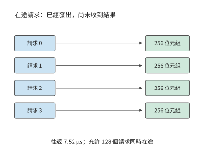

*圖 6-45：一批讀取請求發出後，要經過往返時間 L 才能收到結果。最多有 u 個請求在途、每個返回 q 位元組時，在一個往返時間內最多返回 uq 位元組。圖中四個請求僅用於展示過程；正文算例採用 128 個請求，每個 256 位元組，往返時間為 7.52 μs。*

許可權和完成順序保證資料正確，圖中的等待過程則決定讀取速度。請求發出後要過一段時間才有結果；要讓鏈路 (Link)在等待期間保持忙碌，就要同時發出多個請求。設每個讀事務返回 $q$ bytes，從發出到完成需要 $L$，最多允許 $u$ 個事務同時在途（已發出、尚未完成），則每 $L$ 秒最多返回 $uq$ bytes。把路徑頻寬和在途事務數的限制放在一起，可得

$$
B_{\mathrm{window}}=\frac{uq}{L},\qquad
B_{\mathrm{usable}}=\min\left(B_{\mathrm{path}},\frac{uq}{L}\right). \tag{6-12}
$$

設兩個節點經 ConnectX-7 網路卡的 RDMA 路徑相連，路徑頻寬為 50 GB/s。一次讀請求從發出到完成要走一個來回，取 MSCCL++ 在 H100 與 ConnectX-7 平臺上測得的 InfiniBand 單向延遲 3.76 μs 的兩倍，即 $L=7.52$ μs。每個讀事務取 $q=256$ bytes，恰好是 Qwen3-32B 一個 KV 頭在一層、一個 token 上的 K 向量（128 維 BF16）。若 $u=128$，每批在途資料為 32 KiB，在途事務數量決定的頻寬上限約為 4.36 GB/s。要達到路徑的 50 GB/s，至少需要

$$
u\ge\left\lceil\frac{50\times10^9\times7.52\times10^{-6}}{256}\right\rceil=1469.
$$

只提高線速而仍只允許 128 個事務在途，有效讀取頻寬仍受在途事務數限制；放寬到 4096 個事務，在途事務數決定的上限約為 139 GB/s，超過路徑頻寬，瓶頸就轉到 50 GB/s 的路徑本身。路徑頻寬、事務大小和往返時間透過在途資料量聯絡起來。

### 6.6.3 共享容量與 KV 快取

能否用遠端記憶體替代本地記憶體，還要把第 6.6.2 節求出的讀取頻寬與應用的讀取需求比較。同樣是 20 GB 遠端資料，讀取頻率決定所需的平均頻寬。每分鐘完整讀取一次，平均約需 0.33 GB/s；每秒一次需要 20 GB/s；每秒二十次需要 400 GB/s。容量相同，所需的平均讀取頻寬相差上千倍。

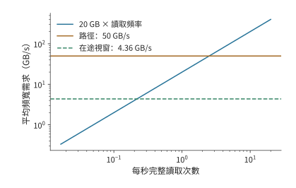

*圖 6-46：完整讀取 20 GB 的頻率與平均頻寬需求。路徑頻寬為 50 GB/s；每事務返回 256 bytes、往返 7.52 μs 時，128 個在途事務將有效頻寬限制到約 4.36 GB/s。*

在途事務數量充足時，經 50 GB/s 的路徑完整讀取一次約用 0.40 s。每秒發起一次讀取，兩次讀取之間有約 0.60 s 的空閒時間；每 0.05 s 發起一次，上一次尚未結束，新工作已經到來，佇列不斷增長。若最多隻能同時發出 128 個事務，讀取變為約 4.59 s，每秒一次也會逐漸積壓。[^pool]

KV 的使用方式決定其適合放在哪裡。會話等待使用者下一輪輸入時，可以長時間不讀 KV，這時遠端記憶體主要用來儲存狀態，會話恢復時再取回；活躍會話每一步都要讀上下文狀態，反覆從遠端掃描會持續佔用頻寬。狀態本身有多大則取決於模型的上下文表示：第 9.2.2 節將並列比較同樣 8192 個 token 的上下文在 Qwen3-8B 的 GQA 和 DeepSeek-V3 的緊湊 MLA 兩種設計下的位元組數與取回時間，後者約為前者的一半。

也可以先取回，再在本地重複使用。若同一份 20 GB 快照要讀十次，逐次經 50 GB/s 路徑讀取需要約 4.0 s；先取回一次用 0.40 s，再按 H100 本地 HBM 的 3350 GB/s 掃描十次約用 0.06 s，共約 0.46 s。後者佔用 20 GB 本地記憶體空間，節省了約 3.54 s 的訪問時間。因此，對需要反覆讀取的資料，還要比較遠端讀取與本地快取的時間，決定什麼時候把資料取回本地。

> **實驗 6-9 · 延伸：遠端記憶體何時應直接讀取，何時應快取到本地**
>
> （a）復算四節點借用前後的物理佔用，分別計算其他節點在借用前的空閒容量，以及全部節點在借用後的剩餘容量。
>
> （b）每個事務傳輸 256 bytes，往返時間分別為 7.52 μs 和 15.04 μs。求兩種情況下達到 50 GB/s 頻寬所需的最少在途事務數。
>
> （c）比較 128 與 4096 個在途事務時的單次讀取時間，假設前一次讀取完成後才發起下一次，求連續讀取時每秒最多能完成多少次完整讀取。
>
> （d）採用本節遠端與本地頻寬，求重複讀多少次時，先取回本地的總訪問時間更少；同時說明所需本地容量。

## 6.7 從並行方案到超節點規模

### 6.7.1 更大的協作組與更多推理例項

本節用前幾節的結果，在一臺 HGX H100 的八張卡上安排多個 Qwen3-32B 會話。四個會話都已完成 prefill，各自儲存了 131,064 個上下文 token 的 KV。每個會話還有一個已經生成、尚未寫入 KV 的 token，用作下一步輸入。四個會話同時請求再生成八個 token，正好寫滿 YaRN 支援的 131,072 個位置。一個例項一次服務一個會話，完成這八步後再接下一個會話；請求按例項輪轉分配。八張卡都在同一臺伺服器內，一直分配給這組任務，直到四個會話都完成。

每步時間來自式（6-5）。續寫時，式（6-4）的上下文長度依次為 131,064 到 131,071，KV 訪問量逐步增加。將八步相加，就得到會話的服務時間。等待中的會話只儲存各自的 KV，同一例項中的會話共享模型權重。容量先排除了八個單卡例項：一張卡連一個 128K 會話都無法容納。按第 6.2.2 節的演算法，兩卡例項最多能容納兩個會話，四卡例項能容納七個，八卡例項能容納十六個；三種部署中每個例項分到的會話分別為一、二、四個，均可容納。

| 部署方式 | 一個會話的八步 | 四會話完成時刻 | 全部會話完成 |
|---|---:|---|---:|
| 八個單卡例項 | 無法容納 | — | — |
| 四個兩卡例項 | 119.1 ms | 119.1、119.1、119.1、119.1 ms | 119.1 ms |
| 兩個四卡例項 | 63.8 ms | 63.8、63.8、127.6、127.6 ms | 127.6 ms |
| 一個八卡例項 | 41.2 ms | 41.2、82.4、123.5、164.7 ms | 164.7 ms |

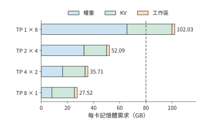

*圖 6-47：四種部署在 128K 會話下的每卡記憶體需求，包括權重、例項內全部排隊會話的 KV 和 2 GiB 工作區。單卡例項每卡要 102.03 GB，超過 H100 的 80 GB（虛線）；兩卡、四卡、八卡例項分別約為 52.09、35.71、27.52 GB。*

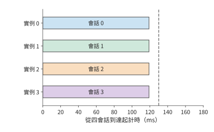

*圖 6-48：四會話同時推進，每個約 119.1 ms 完成。顏色與相鄰配置圖中的會話一致。本圖使用四個 TP2 例項，每例項兩張卡，每個會話續寫八個 token；虛線為 130 ms 期限。*

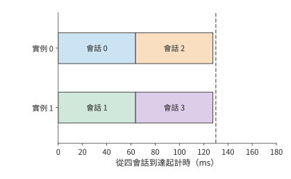

*圖 6-49：每個例項順序處理兩個會話，分別在約 63.8 ms 和 127.6 ms 完成。本圖使用兩個 TP4 例項，每例項四張卡，每個會話續寫八個 token；虛線為 130 ms 期限。*

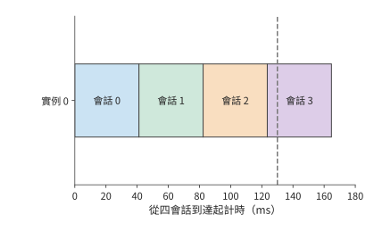

*圖 6-50：單會話縮短到約 41.2 ms，四會話依次執行，最後一個約 164.7 ms 完成。三圖橫軸使用同一尺度。本圖使用一個 TP8 例項，共八張卡，每個會話續寫八個 token；虛線為 130 ms 期限。*

八卡協作使單個會話的續寫時間從約 119 ms 縮短到 41 ms，但四個會話排成一隊，所有會話約 165 ms 才完成。採用四個兩卡例項時，單個會話的續寫時間較長，卻能同時推進四個會話，約 119 ms 全部完成。單卡例項本可以開八個，卻連一個會話都無法容納。

這裡同時用到了兩種並行：模型內部的平行計算和不同請求之間的並行執行。層內矩陣可以切給多張卡，獨立會話可以分給多個例項，兩者競爭的是同一批八張卡。分清這兩層關係，才能按請求的完成期限選擇協作組的大小。服務排程給出同時推進的會話數，模型切分給出每步通訊量，互聯拓撲決定資料交換與同步的耗時，三者共同決定表中的完成時刻。

圖中色塊的橫向長度表示單個會話的執行時間，縱向軌道數表示多少會話可以同時推進。完成期限決定了這兩者如何取捨。只有一個會話、要求 50 ms 完成，八卡例項滿足目標；四個會話、要求 130 ms 內全部完成，兩卡和四卡部署方式都滿足，兩卡更早完成。單會話期限越短，越需要更大的協作組；獨立會話足夠多時，則可以利用更多例項。

連線方式改變後，仍沿原式計算。若像第 6.5.1 節那樣用兩臺伺服器的 16 張卡組成 TP16，每步約 6.67 ms，八步約 53.3 ms，50 ms 的目標就無法達到。第二臺伺服器更適合執行其他例項；若一定要讓一個會話用上更多的卡，就要降低新增的通訊開銷：改善伺服器之間的連線、改變集合通訊演算法，或者把這些卡放進更緊密的互聯域。

第 4 章的固定權重架構會改變上述取捨。權重由獨立的 ROM 提供後，原來分攤給多卡的 HBM 權重讀取減少，TP 的同步時間在單步耗時中佔比上升。減少 TP 卡數能夠省去一部分同步，騰出的卡可以組成更多獨立例項；每張卡則要容納更大份額的請求狀態。本節的逐卡容量表與會話時間表，可以繼續用來比較這兩項變化；第 6.7.4 節給出具體數值。

把同樣的分析用於狀態更緊湊的模型。計算 DeepSeek V4.1 需要多少張卡時，除了每 token 890 B 的邏輯狀態容量，還要看狀態如何分佈在各卡上。該數值對跨層共享的狀態只計一份；如果各層放在不同的卡上，後面的層仍要訪問生成這些狀態的層所儲存的資料。可以把相關的層放在相近的卡上，在目標卡上覆制狀態，或者建立遠端訪問路徑。第一種限制了層的放置，第二種增加儲存和更新開銷，第三種增加通訊依賴，所以要按每張卡實際儲存和訪問的資料分別計算資源需求。[^v41-case]

### 6.7.2 功率、成本與故障範圍如何改變選擇

時間線給出了每個會話何時完成，也給出了八張卡需要佔用多久，因此可以直接據此計算成本，並比較按時完成同一組請求要佔用多少資源。成本以 H100 的 GPU·s 計，即一張卡佔用一秒。八張卡從四個會話同時到達時開始計費，直到所有會話完成。完成期限為 130 ms，要求四個會話中至少三個按時完成。

四個兩卡例項的總成本約為 $8\times0.1191\approx0.953$ GPU·s，四個會話全部按時完成，平均每個按時完成的會話約 0.238 GPU·s。兩個四卡例項的總成本約為 1.021 GPU·s，四個會話也都按時完成，平均每個約 0.255 GPU·s。一個八卡例項在期限內完成三個會話，剛好達到最低比例，但八張卡要佔用到 164.7 ms，總成本約 1.318 GPU·s，平均每個按時完成的會話約 0.439 GPU·s。八個單卡例項無法容納會話。

以按時完成的會話數為分母，平均成本定義為

$$
C_{\mathrm{on\ time}}=
\frac{C_{\mathrm{occupied}}}
{N_{\mathrm{on\ time}}}. \tag{6-13}
$$

佔用成本按全部工作持續的時間計，其中包括故障停頓與重做的時間；分母只數期限內完成的會話。失敗、重做和超時請求的成本都在分子裡，所以都分攤到了按時完成的會話上。

以上比較假定各卡一直正常執行。若一張卡發生故障，包含這張卡的例項會暫停，分配給該例項的後續會話也會推遲。沿同一時間線注入一次故障：20 ms 時卡 0 失效，包含它的例項停頓 40 ms，60 ms 恢復後從該會話八步續寫的起點重做；其他例項繼續執行，不受這次故障影響。

四個兩卡例項中，另外三個會話仍在約 119 ms 完成，受影響的會話在 $60+119.1\approx179.1$ ms 完成，按時比例為 75%。兩個四卡例項中，未受影響的例項在約 64 和 128 ms 完成兩個會話，受影響的例項在約 124 和 188 ms 完成另外兩個會話，按時比例同樣是 75%。八卡例項的四個會話依次在約 101、142、184、225 ms 完成，130 ms 內只完成一個。

四個兩卡例項繼續滿足最低比例，成本增為 $8\times0.1791\approx1.433$ GPU·s，平均每個按時完成的會話約 $1.433/3\approx0.478$ GPU·s，是無故障時的 2.0 倍；兩個四卡例項約為 0.500 GPU·s。故障被隔離在一個例項內，另外三個會話仍能按時完成；但佔用時間延長、按時完成的會話減少，每個會話的成本仍翻了一倍。

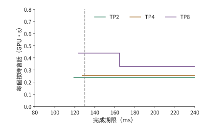

*圖 6-51：無故障時，按時完成會話的平均成本隨期限變化。八卡計費至所有會話結束；曲線從至少三個會話按時完成處開始。TP 數值為每例項使用的卡數；成本以 H100 的 GPU·s 計。TP1 放不下 128K 會話，沒有曲線。*

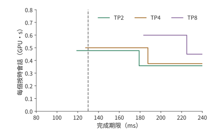

*圖 6-52：20 ms 時卡 0 故障，受影響例項在 60 ms 從當前會話起點重新執行。採用與無故障圖相同的計費方法和縱軸範圍。TP 數值為每例項使用的卡數；成本以 H100 的 GPU·s 計。*

故障影響範圍取決於例項是否共用裝置。兩個例項若共用同一電源或交換機，這臺共用裝置發生故障時，兩個例項都會受到影響；拆分例項只有配合資源隔離，才能保留其他例項的進度。一個例項使用的裝置越多，請求執行就依賴越多裝置正常工作。因此，劃分例項時也需要考慮電源和交換機的共用情況。

還可以用功率計算這些部署方式的能耗。按第 6.5.2 節的 DGX H100 系統功率上限 10.2 kW 計，無故障時，四個兩卡例項執行約 119.1 ms，消耗約 1.21 kJ；兩個四卡例項執行約 127.6 ms，消耗約 1.30 kJ。硬體相同、功率相同時，越早完成任務，消耗的電能就越少。

模型的記憶體需求會限制可用的部署方式。本例中先被排除的是 TP1：128K 會話的 KV 讓單卡需求達到 102.03 GB。上下文縮短到 32K 時，單卡可以容納一個會話，但八步續寫要 173.3 ms，仍超過 130 ms 的期限，這時 TP1 是被時間排除的。先找出記憶體容量足夠的部署方案，再比較這些方案的執行時間和成本。[^cost]

> **實驗 6-10 · 核心：按會話完成期限與成本選擇並行配置**
>
> （a）從式（6-4）、（6-5）逐步求四種 TP 配置的八步續寫時間，再計算四個會話各自的完成時刻。
>
> （b）分別採用 100、130、170 ms 期限，要求至少 75% 會話按時完成，找出滿足要求的部署方案並比較成本。
>
> （c）改用兩臺 HGX H100 上的 TP16，跨伺服器的 AllReduce 取實驗 7-3 的實測值，重新計算單會話續寫時間，判斷能否滿足 50 ms 的完成期限。
>
> （d）復算故障後的會話完成情況和成本；將停頓從 40 ms 改為 10 ms，解釋滿足要求的部署方案怎樣變化。
>
> （e）把上下文改為 32K，加入功率條件，說明容量、時間和功率各自先排除了哪種部署方案。

### 6.7.3 給定模型與硬體，如何選擇切分策略

回到章首的問題。切分策略的選擇可以寫成有輸入、有約束的最佳化問題：可選方案 $\pi$ 包括並行度、物理放置、通訊演算法、micro-batch 劃分和區域性運算子實現，先確定目標 $J$，再尋找

$$
\pi^*=\arg\min_{\pi\in\mathcal P_{\mathrm{feasible}}}J(\pi).
$$

可行集 $\mathcal P_{\mathrm{feasible}}$ 裡的每個方案都要滿足每卡容量、模型切分的資料依賴、kernel 支援和服務期限。目標 $J$ 可以是單個請求的延遲，也可以是上一節的每個按時完成會話的成本；若目標是吞吐量，就在相同的服務目標（SLO）下比較能持續接納的請求率。負載和目標不固定，「最優並行度」就沒有唯一的答案。

**第一步，記錄模型、負載與資源。** 模型側需要層數、矩陣維度、注意力頭與 KV 頭、專家數和每 token 選中的專家數、精度、共享權重及跨層狀態。負載側需要 prefill 長度、decode 上下文、同時就緒的請求、路由分佈、目標延遲與到達過程。硬體側需要逐卡可用 HBM、不同形狀下的有效算力和頻寬，以及節點內、節點間每方向的路徑、啟動開銷與共享瓶頸。第 4 章給出硬體參數，第 5 章給出實際形狀與區域性執行時間；不能把叢集的總頻寬平均分給每個通訊組。

**第二步，按瓶頸列出可選方案，而不是先選一個縮寫。** 下表列出各種瓶頸下應當考慮哪些方案；它只用來縮小搜尋範圍，最終仍要比較完成時間。

| 當前約束或瓶頸 | 優先考慮的方案 | 必須補算的代價 |
|---|---|---|
| 權重無法容納，或小 batch 重複讀權重過慢 | TP、PP；MoE 可用 EP | 歸約、階段序列、專家流量與工作區 |
| 獨立請求多，完整模型已能容納 | 更多 DP／服務副本，較小 TP 組 | 排隊、批內複用、每副本 KV 容量 |
| 特定區間的啟用重複儲存 | 同一 TP 組內啟用 SP | 佈局邊界的收集與歸約，kernel 支援 |
| 長上下文的 KV 與注意力佔主導 | CP 與 TP 的組合 | K、V 交換、統計量歸約、因果注意力的負載不均 |
| 多層權重容量大，跨節點歸約昂貴 | 節點內 TP＋跨節點 PP | micro-batch 是否足夠、最慢階段與流水空檔 |
| 專家集合大、路由熱點突出 | EP、專家副本、專家分離（路由專家放到獨立的專家資源池） | dispatch／combine 兩個方向的流量、最忙的卡與專家池的佇列 |

**第三步，為每個方案寫出資料歸屬和時間表。** 給每張卡標出該卡儲存哪些層、頭、專家、啟用和 KV；算峰值記憶體時還要加上集合通訊緩衝、雙緩衝、padding、在途 micro-batch 和副本遷移的空間。然後為每個運算子求本地計算與訪存時間，為每次跨卡操作求輪數、位元組數與共享路徑，把兩者按依賴關係排到時間線上。同一個 token 的前後層不會因為管線 (Pipeline)並行而同時完成，同一個 token 選中的專家結果也不會因為網路空閒而提前就緒。MoE 要代入最忙的專家組而不是平均值，第 9.4 節給出具體的 skew（負載偏斜）模型。

**第四步，在可行方案之間按同一目標排序。** 本章的八卡例子固定為稠密的 Qwen3-32B 與 128K 會話，每個例項一次只處理一個會話；首輪比較的是 TP1、TP2、TP4、TP8，其餘卡組成獨立例項。專家並行不適用於稠密模型；序列並行只改變一段啟用的儲存，在這一逐 token、工作區固定的算例裡沒有額外收益；管線 (Pipeline)並行若不交錯多個會話，單個會話仍要依次經過全部階段，所以沒有把它當作縮短單會話時間的首選。上下文並行、跨會話流水和連續批處理（在每步迭代的邊界重新安排活躍請求）可以進入擴充套件搜尋，但要分別補上上下文歸約、階段排程和 batch 變化的時間模型，不能套用張量並行的 $1/p$ 縮放。

前兩節已經給出逐會話時間線和成本。按這些完整數值篩選，可以直接得到下面的選擇；改變目標、物理邊界或容量後，選擇也隨之改變。[^parallel-choice]

| 給定條件 | 約束內的選擇 | 為什麼 |
|---|---|---|
| 四會話、128K、130 ms 內至少完成 75% | 四個 TP2 例項 | TP1 無法容納；TP2 全部約 119.1 ms 完成，每個按時會話約 0.238 GPU·s，低於 TP4 的 0.255 與 TP8 的 0.439 |
| 單會話、128K、50 ms 期限 | 一個 TP8 例項 | 約 41.2 ms；TP4 約 63.8 ms，已超過期限 |
| 兩臺 HGX H100 共 16 卡，單會話、128K、50 ms | 仍選一個 TP8 例項 | 跨伺服器的 TP16 按實測 AllReduce 約 53.3 ms，超過期限；另一臺伺服器可以執行其他例項 |
| 四會話、32K、130 ms 內至少完成 75% | 四個 TP2 例項 | TP1 可以容納，但八步要 173.3 ms；TP2 約 88.3 ms 全部完成，每個按時會話約 0.177 GPU·s |

**第五步，用測量修正估算，不把估算的排名當作結論。** 對排在前面的方案，用相同的請求、路由和質量條件做測量，記錄峰值記憶體、各階段的就緒與完成時刻、各埠的收發量和服務的尾延遲。若實際的矩陣效率、通訊爭用或排隊與估算不同，換上實測參數後重新排序；若兩個方案的差距小於測量波動，就都保留，再用更有代表性的負載驗證。最後交付的應包括選定的方案、被排除的方案、會讓結論翻轉的閾值和實測範圍。配套指令碼可以復算表中的四組條件，但只列舉宣告過的方案，不是覆蓋任意模型和框架的全域性規劃器。

不同設計選擇影響不同的時間開銷。改變 TP 主要改變每卡計算量、記憶體存取量和參與歸約的卡數；改變演算法主要改變輪數與傳送量；改變拓撲主要改變共享路徑與固定等待；增加例項主要改變獨立會話的排隊順序。將這些變化代入同一個執行時間模型，就能比較不同設計的效能。

進一步最佳化時，可以對式（6-5）作敏感性分析。在 HGX H100 八卡、小資料量的算例中，NVLink 頻寬翻倍只節省約 2.5 μs，而每輪啟動開銷減半節省約 0.74 ms；因此，應優先減少每輪通訊的啟動開銷。MoE 若受負載最重的專家組限制，均衡分派直接減少該組的計算量；讀取遠端 KV 時，若頻寬受在途事務數量限制，增加事務並行才能充分利用已有鏈路 (Link)頻寬。這樣就能判斷應當優先減少哪項開銷、增加哪種資源。

### 6.7.4 超節點擴大與權重、Engram 表、KV 的放置：V4.1 Flash 的綜合算例

前三節討論的是一臺伺服器內的八張卡如何分給幾個例項。本節轉而改變超節點本身：先看把超節點放大能換來什麼，再按第 4.7.3 節的思路把權重固定進 ROM，最後討論 Engram 表和 KV 應當放在哪裡。算例仍以第 2 章的 DeepSeek V4.1 Flash 為物件，任務是 200K 上下文的 decode。硬體為 256 張 H100 SXM，超節點分別取 8、64、128、256 卡，每個推理例項恰好佔用一個超節點。例項內部，注意力按資料並行放置，每張卡只處理並儲存自己會話的注意力與 KV；路由專家和 Engram 表按專家並行均分到各卡，每層各做一次 dispatch 和 combine。[^supernode-inference]

**超節點大小與每卡會話數。** 每張卡上的權重分兩部分：注意力、共享專家和輸出頭每卡各存一份，共 9.5 GB；路由專家 288.8 GB 與 Engram 表 203.1 GB 由例項內的 $S$ 張卡分擔。扣除權重和工作區 $U$，其餘 HBM 全部留給 KV，每個會話佔 $K=180.7$ MB，於是

$$
W_{\mathrm{card}}=9.5\ \mathrm{GB}+\frac{288.8\ \mathrm{GB}+203.1\ \mathrm{GB}}{S},\qquad
N_{\mathrm{session}}=\left\lfloor\frac{C-W_{\mathrm{card}}-U}{K}\right\rfloor. \tag{6-14}
$$

步時間仍按式（6-2）估算：本卡的權重和本卡全部會話的 KV 各讀一遍，讀取與計算取時間較長的一項，再加上每層一次 dispatch 與一次 combine，共 80 次 All-to-All。四種超節點的結果見下表。

| 超節點 | 每卡權重 | 每卡會話 | 步時間 | 每卡吞吐量 |
|---|---:|---:|---:|---:|
| 8 卡 | 71.0 GB | 37 | 14.1 ms | 2,632 token/s |
| 64 卡 | 17.2 GB | 335 | 17.3 ms | 19,420 token/s |
| 128 卡 | 13.4 GB | 356 | 18.4 ms | 19,392 token/s |
| 256 卡 | 11.5 GB | 367 | 18.9 ms | 19,378 token/s |

超節點只有 8 卡時，每張卡儲存每層 48 個專家，一步之內幾乎全部會被選中，讀取專家權重佔去了步時間的絕大部分。擴大到 64 卡，每卡分到的專家減為八分之一，專家讀取時間降到原來的十分之一以下，騰出的 HBM 又能多容納九倍的會話，每卡吞吐量因此提高 7.4 倍。再往上擴大就沒有收益：專家讀取已經很小，而 KV 讀取、計算和 All-to-All 都隨會話數同比例增長。這 7.4 倍主要來自容量。若把 Engram 表移到主機記憶體，8 卡超節點每卡也能容納 178 個會話，與 64 卡的差距縮小到 1.9 倍。

單個使用者的速度則與超節點大小無關。batch 為 1 時，一個 token 的關鍵路徑是所在卡讀一遍 8.2 GB 每卡各存一份的權重，再逐層讀取一個專家，共 2.76 ms，即 362 token/s，8 卡與 256 卡完全相同。放大超節點得到的是容量和總吞吐量，不是單個會話的速度；要縮短單個會話的時間，只能像第 6.7.1 節那樣把注意力也做張量並行。反過來，同樣 64 張卡若分散在八臺 HGX H100 上，dispatch 和 combine 有八分之七的位元組要經過網路卡，通訊時間從 3.7 ms 增至 29.2 ms，每卡吞吐量降到 7,828 token/s。超節點省下的正是這一段。

*圖 6-53：V4.1 Flash 在 256 張 H100 上的每卡 decode 吞吐量隨超節點大小的變化，服務目標為每 token 50 ms。藍線：例項都在一個超節點內，8 卡到 64 卡提高約 7.4 倍，此後不再增長；橙點：同樣 64 張卡分散在八臺伺服器上組成專家並行組。*

**把權重固定進 ROM。** 圖 6-54 畫出權重與 KV 的三种放置方式。GPU 把兩者都放在 HBM，每一步都要重新讀一遍權重；第 4.7.3 節的架構把部署期間不再變化的權重寫進掩模 ROM，HBM 只儲存 KV；KV 還可以進一步放進片上 SRAM。

*圖 6-54：權重與 KV 的三种放置方式。左：GPU 的權重與 KV 共用 HBM；中：權重在製造時寫入 ROM，KV 放 HBM；右：權重在 ROM，KV 放片上 SRAM，容量小得多。箭頭是每步都要讀取的資料，方框高度示意容量。*

後兩種方式按 OpenTallas 對 V4.1 Flash 的分析結果計算：兩片 N5 工藝的 ROM 晶圓，同樣是 200K 上下文、batch 為 1。權重與 KV 各有自己的通路，兩項讀取和計算可以重疊，集合通訊則要等三者都完成才能開始：

$$
T_{\mathrm{token}}=\frac{\max(T_{\mathrm{weight}},T_{\mathrm{KV}},T_{\mathrm{compute}})}{0.9}+T_{\mathrm{comm}}+T_{\mathrm{fixed}}. \tag{6-15}
$$

0.9 是因為兩片晶圓分到的層數不可能完全均勻，$T_{\mathrm{fixed}}$ 是每層固定的流水延遲。GPU 一行的權重與 KV 共用 HBM，兩項讀取時間相加。

| 機器 | 儲存與計算 | 集合通訊 | 單使用者速度 | 通訊佔比 |
|---|---:|---:|---:|---:|
| 8 張 H100，權重在 HBM | 2,689 μs | 76 μs | 362 token/s | 3% |
| 58 張 B200 張量並行，權重在 HBM | 165 μs | 562 μs | 1,357 token/s | 76% |
| 兩片 ROM 晶圓，權重在 ROM | 77 μs | 159 μs | 4,070 token/s | 65% |

權重離開 HBM 之後，權重讀取從 2.7 ms 縮短到 69 μs，但 80 次片上 AllReduce 仍需 159 μs，佔每個 token 時間的 65%。換成 58 張 B200 做張量並行，權重讀取也能壓到 148 μs，通訊卻增至 562 μs。權重讀取一旦不再是最長的一項，單使用者速度就由集合通訊決定，第 6.5.1 節按跳數和每跳延遲估算通訊的方法在這裡成了關鍵。

*圖 6-55：三種機器上 V4.1 Flash 單使用者每 token 時間的構成，200K 上下文，batch 為 1。權重在 HBM 時儲存讀取佔絕大部分，權重進 ROM 之後集合通訊成為最長的一項。*

**Engram 表放在哪裡。** V4.1 Flash 有兩個 Engram 模組，各帶一張 3.84 億行的表，每行 256 個 FP8 值加 8 位元組 scale，兩張表共 203.1 GB。每生成一個 token，兩個模組各查 24 行，共 12.7 KB。這兩張表同樣是權重，部署後不再改變；要查哪些行只取決於 token 序列，與啟用無關，因此每一步開始時就能預取。只要在第一個 Transformer 塊算完之前把這些行取回，查表就不佔用時間；可用於取回的時間在 H100 上是 69 μs，在 ROM 晶圓上只有 6.1 μs。圖 6-56 畫出三种放法，代價如下。

*圖 6-56：Engram 表的三种放置方式。要查哪些行在第一個 Transformer 塊計算之前就已確定，三种放法的差別在於取回這 48 行要走什麼路徑，以及表佔用哪一種儲存。*

| 放置 | 佔用的容量 | 取回 48 行 |
|---|---|---|
| 主機記憶體，經 PCIe 或 RDMA 預取 | 不佔 HBM | 一次往返 1.05 μs |
| 超節點各卡的 HBM 分片 | 8 卡每卡 25.4 GB，相當於 140 個會話；64 卡每卡 3.2 GB，相當於 18 個會話 | 一輪 NVLink 交換 0.83 μs |
| 掩模 ROM | 21,651 mm²，約半片晶圓 | 片內讀取 |

在 H100 上，兩條取回路徑都遠短於 69 μs，放在哪裡只需看容量。8 卡超節點容納不下這張表，移到主機記憶體後每卡的會話數從 37 個增加到 178 個；64 卡起每卡只分到 3.2 GB，放在 HBM 也只減少 5% 的會話。批次服務時主機記憶體也不是瓶頸：64 卡例項每卡每步 16,080 次隨機讀，按第 7.3.4 節實測的每秒 6100 萬次計只需 0.26 ms，佔步時間的 1.5%。DeepSeek 的部署正是把表放在主機記憶體，在第一個 Transformer 塊計算的同時用 RDMA 預取。

到了 ROM 晶圓上，取捨隨之改變。第一個塊只有 6.1 μs，一次主機往返就佔去六分之一，步時間一旦短於 42 μs 便無法掩蓋；把表刻進 ROM 要多用半片晶圓，換來的只是每個 token 讀 12.7 KB；放在晶圓邊緣的 HBM 只佔 1,124 個會話的空間，讀取也不經過互聯。表移出 ROM 之後，checkpoint 一片晶圓即可容納，單使用者速度反而升到 5,037 token/s。機器越快，這張表越應當放在離計算最近的可寫儲存裡。

**把 KV 放進 SRAM。** 片上 SRAM 比 HBM 快得多，但容量先要足夠。V4.1 Flash 的 checkpoint 有 510.3 GB，即使用第 4.7.2 節 WSE-3 那樣 44 GB 的片上 SRAM，僅權重就需要 12 片晶圓，權重放 SRAM 的方案首先被容量排除。權重進了 ROM，晶圓上剩餘的 SRAM 只夠儲存一個 200K 會話的 KV；KV 改放 HBM，同樣兩片晶圓可以同時駐留 9,637 個會話。兩種設計的單使用者速度相同，總吞吐量卻相差三個數量級。單個會話的速度由關鍵路徑上的儲存和通訊決定，能同時服務多少會話由可寫狀態的容量決定，這正是第 6.7.1 節區分的兩層並行。

三步用的是同一套方法：先按式（6-1）檢查容量，再按式（6-2）逐項估算時間，最後找出關鍵路徑上最長的一項。放大超節點提高的是吞吐量，單個會話不會更快；權重固定之後，互聯的每跳延遲成了單使用者速度的上限；Engram 表這樣只讀不寫的大表，機器越快越要放在離計算近的地方；SRAM 的容量決定能同時服務多少會話。

> **實驗 6-11 · 延伸：超節點、ROM 與 SRAM 的綜合算例**
>
> （a）按式（6-14）復算表中各行的會話數，把服務目標改為每 token 20 ms，求各超節點大小下每卡能服務的會話數。
>
> （b）把例項內的注意力改為 TP8，其餘不變，重算 batch 為 1 的單使用者速度，與 362 token/s 比較。
>
> （c）把跨伺服器的每輪啟動開銷從 5 μs 改為 2 μs，並給每卡配兩張網路卡，判斷跨伺服器的 64 卡例項能否追平超節點內的例項。
>
> （d）把片上每跳延遲減半，按式（6-15）重算 ROM 晶圓一行的單使用者速度和通訊佔比。
>
> （e）把上下文改為 1M，重算 KV 放 SRAM 時能駐留的會話數，以及 KV 放 HBM 時的會話數。
>
> （f）把主機記憶體的一次往返改為 2 μs，求 H100 和 ROM 晶圓各在多快的單使用者速度下，Engram 查表開始佔用步時間。

權重、狀態或服務需求繼續擴大時，單個超節點可能不足以支撐一個例項的執行。下一章沿著本章分析的資料傳輸路徑和依賴關係，加入網路卡、資料中心交換網路、遠端操作的完成通知與網路擁塞，繼續計算擴大協作範圍所帶來的收益和代價。

[^dense]: 單卡完整 BF16 權重為 470,187,269,120 bytes，8192 個 token 的 KV 為 1,577,058,304 bytes；八卡 TP 時每卡權重為 58,959,617,024 bytes（含每卡各存一份的歸一化參數與路由器），每卡 KV 為 394,264,576 bytes，每卡最多儲存 47 個 8192 token 的會話。表中 GB 為十進位制，GiB／MiB 為二進位制，合計先用精確值求和再取近似；2 GiB 包含啟用與其餘工作區預留。詳見[Qwen3-235B-A22B 八卡放置](../calculations/results/qwen235-placement-tp8-kv-replica.md)及其 JSON，讀取固定官方配置與權重索引。單步讀取量與運算量見[單請求 8K decode](../calculations/results/qwen3-235b-a22b-decode-b1-s8192.md)與[8192 token prefill](../calculations/results/qwen3-235b-a22b-prefill-8192.md)。

[^models]: [具體模型的並行推算](../case-studies/model-parallelism.md)，[Qwen3-235B-A22B 配置](../references/outline-checks/2026-09-07/scaling-history/qwen3-235b-config.json)，[DeepSeek V4 報告](../references/files/papers/deepseek-v4.pdf)，[Kimi K3 報告](../references/files/papers/kimi-k3.pdf)表 1 與 §2.3。DeepSeek-V3 的 671B 為歷史對照模型。

[^tp-experiment]: 八個正式配置透過 FP64 參考檢查，配對 TP/SP 輸出逐位相同；完整形狀與驗收見[實驗 6-2：JAX TP/SP 實際 FFN 路徑](../experiments/ch06/06-02/jax-tp-sp/README.md)。實驗在 CPU 邏輯裝置上執行。

[^variants]: [MeshSlice 的矩陣形狀與流水推算](../case-studies/mesh-shape-and-slicing.md)、[Shift Parallelism 的狀態與額外駐留](../case-studies/parallel-switching-and-state.md)。MeshSlice 的部分重疊為預測，Arctic 的 SP 定義及動態切換邊界按固定實現說明。

[^pipeline]: [有限槽位與背壓計算](../calculations/results/pipeline-finite-1-slots.md)、[基礎 TP／PP 通訊路徑](../calculations/results/dense-comm-qwen8-tp8-pp1-t1.md)。

[^ownership]: [Qwen235 所有權連線練習](../research/2026-infra-survey/parallel-moe-ownership/NOTES.md)及[獨立核對結果](../research/2026-infra-survey/parallel-moe-ownership/results.json)。本例採用正文給定的 TP2×EP4 佈局。

[^moe-tax]: [專家複用與 MoE Serving Tax 閱讀](../case-studies/moe-and-startup.md)。式（6-8）假設各 token 獨立、均勻地選擇專家；原論文分別以啟用 FLOPs 和總參數匹配稠密對照模型。

[^routes]: 圖形與樣本說明見[路由熱圖](ch06/route-observation.png)和[配套圖說明](ch06/README.md)。記錄覆蓋 43 層，每題四個實際 decode 輸入，包含排程器提前執行的 EOS forward。來源：[DeepSeek V4-Flash 路由觀測](../experiments/ch06/06-03/README.md)及[原始計數分析](../experiments/ch06/06-03/runs/routes-001/route-analysis.json)。

[^ring]: [Ring 逐輪結果](../calculations/results/ring-qwen3-32b-t1-p8-h100.md)、[未分段二項樹結果](../calculations/results/tree-qwen3-32b-t1-p8-h100.md)，按無爭用計算。頻寬為 H100 的 18 條 NVLink 4 每方向合計 450 GB/s，見 [H100 架構白皮書](../references/files/specs/nvidia-h100.pdf)第 47 頁；每輪開銷取 C. Hwang 等，[MSCCL++: Rethinking GPU Communication Abstractions for AI Inference](../references/proceedings/ASPLOS/2026/paper-034.pdf)，ASPLOS 2026，表 1 與表 2：在每節點 8 張 H100、NVLink 4、每卡一張 400 Gbit/s ConnectX-7 的平臺上，nvbandwidth 測得 NVLink 延遲 822 ns、吞吐量 397.5 GB/s，RDMA perftest 測得 InfiniBand 延遲 3.76 μs、吞吐量 48.94 GB/s。

[^collective-path]: [集合通訊路徑與診斷](../case-studies/collective-paths-and-diagnosis.md)，涵蓋固定框架原始碼、custom AllReduce 分派、就緒偏差和測量範圍。

[^tuning]: AutoCCL 採用 16／32 張 A40 與 NCCL 2.18.3，八卡 NVLink 為四對連線；其直接搜尋目標仍是通訊效能，18.26→32.44 GB/s 為論文表 6 的 AllGather 在重計算干擾下的測量。NCCL 2.31.2 跨網路零 CTA 的 AllGather／AlltoAll 路徑涉及對稱註冊視窗、節點內 CE 和節點間 CPU proxy。詳見[通訊調優、計算爭用與解除安裝](../case-studies/communication-tuning.md)。

[^comm-experiment]: [實驗 6-5：四程式實際通訊與計算並行](../experiments/ch06/06-05/README.md)。實驗在一臺 M2 Max 上用 PyTorch CPU 版執行，四個程序經本機 TCP 通訊。正式測量分五組，每組把單獨通訊、單獨計算、同時執行三種方式各跑一次，組內順序隨機；表中每項先取組內最慢程序的時間，再取五組的中位數。通訊時間從提交非同步 AllReduce 算起，到主機收到完成回撥為止，可能略晚於資料實際傳完。

[^swing]: [集合通訊的物理路徑與作業錯峰](../case-studies/network-planning-and-collectives.md)、[96 條訊息的物理路徑計算](../calculations/results/collective-paths-book.md)、[NSDI 2024 選讀](../research/2026-infra-survey/reading-nsdi-2024.md)、[Morphlux 版本與閱讀記錄](../research/2026-infra-survey/reading-asplos-2026.md)。TPU v4 的 OCS 基於 MEMS 反射鏡，切換需要毫秒級時間，見 [TPU v4 論文](../references/files/papers/tpu-v4.pdf) §2。

[^numa]: [PCIe 中轉與 NUMA 放置](../case-studies/pcie-staging-and-numa.md)、[傳送端附近緩衝的計算](../calculations/results/staging-local-grouped.md)（本章只用其中的位元組計數）。HGX H100 主機的 CPU 型號見 [DGX H100 使用者指南](../references/files/specs/nvidia-dgx-h100-user-guide.md)；Xeon 8480C 是 Xeon Platinum 8480+ 的定製版本，後者最多 4 條 UPI 鏈路 (Link)、每條 16 GT/s，見 [Intel 產品規格](../references/files/specs/intel-xeon-8480plus-ark.md)與 [第四代至強技術概覽](../references/files/specs/intel-xeon-4th-gen-overview.md)表 1。Intel 未公開 UPI 每方向的 GB/s，這裡不換算傳輸時間；PCIe Gen5 x16 每方向 64 GB/s 見 [H100 架構白皮書](../references/files/specs/nvidia-h100.pdf)第 48 頁。

[^physical]: [埠數量與互聯介質分析](../research/draft11-outline-audit/report.md#radix)。埠與功率算例採用題設輸入。

[^ashrae]: ASHRAE TC 9.9，[Emergence and Expansion of Liquid Cooling in Mainstream Data Centers](../references/files/documents/ashrae-liquid-cooling.pdf)，2021，第 14、28 頁：白皮書沒有給出單一的風冷上限，40 kW 是本例按其風量對比選取的閾值；[DGX SuperPOD H100 參考架構](../references/files/documents/dgx-superpod-h100-ra.pdf)第 10 頁的示例機櫃佈置中每機櫃功率超過 40 kW。按伺服器計的功率上限見[第 6 章計算結果](ch06/continuity-model.json)的 `rack` 欄位。

[^nvidia]: [V100 架構白皮書](../references/files/specs/nvidia-v100.pdf)，NVLink 拓撲與 DGX-1 附錄；[A100 架構白皮書](../references/files/specs/nvidia-a100.pdf)，NVLink／NVSwitch 與 DGX A100 附錄；DGX-2 的 16 卡歷史配置亦見[ZeRO 論文](../references/files/papers/zero.pdf)平臺說明。

[^topology-choice]: 設計案例每晶片 6 個埠、每埠每方向 50 GB/s 取自 TPU v4：[TPU 多代綜述](../references/files/papers/google-tpu-generations.pdf)表 1 列出 TPU v4 每晶片 6 條 ICI 鏈路 (Link)、每條 50 GB/s，腳註 4 說明按每方向計（TPU v5p 與 Ironwood 為每條 100 GB/s）；[TPU v4 論文](../references/files/papers/tpu-v4.pdf)表 4 同為 6 條 50 GB/s 鏈路 (Link)。每次轉發 200 ns 取 [UALink 2.0 規範](../references/files/specs/ualink-common.pdf) §9.9.2 為 128 lane 交換晶片設定的空載延遲目標，把它同時用於環面晶片內的路由器。32 MiB 為題設的每卡傳送量；均勻 All-to-All 的鏈路 (Link)負載按維序路由的平均跳數計算。其餘系統資料來自 TPU v4 論文 §2（光鏈路 (Link)成本、OCS 佔比、3D 環面的割集）、[NVLink 官方規格](../references/text/nvidia-nvlink-spec.txt)（每 GPU 18 條鏈路 (Link)、72 GPU 無阻塞）、[CloudMatrix384 論文 v2](../references/files/papers/cloudmatrix384-v2.pdf) §3.3.2–3.3.3（一級、二級交換晶片數量與無阻塞設計）。

[^nvl]: [GB200 NVL72 官方歸檔](../references/files/specs/nvidia-gb200.md)，固定快照中 72 GPU／36 CPU 與機櫃級 NVLink 組織；NVLink Switch System 最多連線 256 張 H100，見 [H100 架構白皮書](../references/files/specs/nvidia-h100.pdf)第 48 頁。16 卡環形歸約的時間見[第 6 章計算結果](ch06/continuity-model.json)的 `two_servers.nvlink_domain_tp16` 欄位。

[^tpu]: [TPU v4 論文](../references/files/papers/tpu-v4.pdf)、[TPU 多代系統綜述](../references/files/papers/google-tpu-generations.pdf)，電互聯 cube、OCS、切片與故障隔離的設計。

[^ub]: [UB 與昇騰 950 資料核對](../references/UB-ASCEND-NOTES.md)、[UB OS 參考設計](../references/files/specs/UB-Software-Reference-Design-for-OS-2.0-zh.pdf)§4、[950 官方白皮書](../references/files/specs/ascend-950-official.pdf)§4.6。

[^cloudmatrix]: [CloudMatrix384 論文 v2](../references/files/papers/cloudmatrix384-v2.pdf)§3.2、圖 2、表 1；論文表中的部分 NPU 測量按 die 計，系統 384 則按 NPU 計。

[^pool]: [第 6 章記憶體池計算](ch06/continuity-model.json)的 `memory_pool` 欄位：四個 80 GB 節點的借用前後佔用、視窗頻寬 $uq/L$、讀取時間與重複讀取的比較。路徑頻寬取 ConnectX-7 的 400 Gbit/s，往返時間取 MSCCL++ 表 1 的 InfiniBand 單向延遲 3.76 μs 的兩倍，本地頻寬取 H100 的 3350 GB/s。

[^cost]: [逐會話時間線、故障與 GPU·s](ch06/continuity-model.json)的 `candidates` 與 `candidates_32k` 欄位，由[計算指令碼](ch06/continuity_model.py)生成；四組部署條件的篩選見[切分選擇結果](../calculations/results/parallel-choice-book.md)。能耗按 DGX H100 系統功率上限 10.2 kW 計，見[第 6 章計算結果](ch06/continuity-model.json)。

[^continuous]: 貫穿模型與逐步計算見[模型說明](ch06/continuous-example.md)、[計算指令碼](ch06/continuity_model.py)和[完整結果](ch06/continuity-model.json)。Qwen3-32B 形狀取自已鎖定配置，H100 的 HBM 容量、頻寬與矩陣峰值取自[硬體表](../calculations/results/hardware.md)。矩陣運算子的時間取記憶體存取與計算時間的較大值，均按峰值計；通訊按層序列，上下文 KV 每步增長。

[^v41-case]: [DeepSeek V4.1 官方技術報告](../calculations/sources/deepseek-v4.1-flash/DeepSeek_V41_Tech_Report.pdf)，第 1、2、3 節與第 6 節；[跨章會話的固定條件與復算](../calculations/results/v41-throughline.json)。

[^ub-design]: 李博傑，〈[Unified Bus 背後的思考](../references/files/documents/ub-reflection.md)〉，Jetty、事務序與 Load/Store 各節；[OpenURMA 論文](../references/files/papers/openurma.pdf)，2026-06-02 修訂版（arXiv:2605.28717），§3 設計、§7–§9 狀態與延遲、§11 全系統驗證、§13 結果彙總。[本次整合的來源與適用範圍](../research/ub-ep-integration-2026-09-10/README.md)。
[^ub-fabric]: 主機數與連線建立時間的參數和結果見[UB 互聯計算](../calculations/results/ub-fabric-book.md)，執行 `python3 calculations/calc.py ub-fabric --format md` 可以復算；記錄尺寸、階段延遲和快取條目數取自 OpenURMA 論文表 3、表 7 與 §7.2。目錄式快取一致互聯按每個快取行為每個對端保留 1 bit 的公式計算；NVL72 的 72 張 GPU 是該代產品的公開配置，不是本書推導的結果。

[^initiator]: NVIDIA 技術部落格 [Improving Network Performance of HPC Systems Using NVIDIA Magnum IO NVSHMEM and GPUDirect Async](https://developer.nvidia.com/blog/improving-network-performance-of-hpc-systems-using-nvidia-magnum-io-nvshmem-and-gpudirect-async/)（CPU 代理執行緒與 GPU 發起兩條路徑的步驟）；[NVIDIA DOCA DPA 檔案](https://docs.nvidia.com/doca/sdk/doca-dpa/index.html)（把通訊程式碼解除安裝到 BlueField-3 網路卡內處理器的程式設計模型）；[DeepEP README 快照](../research/ub-ep-integration-2026-09-10/sources/deepep.md)。三種位置的穿越次數按各自的控制路徑計，具體實現可能合併或增加步驟；抓取快照見[來源記錄](../research/ub-ep-integration-2026-09-10/sources.json)。

[^nccl-basics]: NVIDIA，[NCCL 集合通訊語義](https://docs.nvidia.com/deeplearning/nccl/user-guide/docs/usage/collectives.html)、[點對點與不等長交換](https://docs.nvidia.com/deeplearning/nccl/user-guide/docs/usage/p2p.html)、[nccl-tests 頻寬口徑](https://github.com/NVIDIA/nccl-tests/blob/master/doc/PERFORMANCE.md)；閱讀快照與雜湊見[來源記錄](../research/ub-ep-integration-2026-09-10/sources.json)。

[^sequence-context]: Korthikanti 等，[Reducing Activation Recomputation in Large Transformer Models](../references/files/papers/activation-recompute.pdf)，§3 的 tensor 與 sequence parallelism；[Megatron Core 的 Context Parallelism 檔案](https://github.com/NVIDIA/Megatron-LM/blob/main/docs/user-guide/features/context_parallel.md)；Liu 等，[Ring Attention with Blockwise Transformers for Near-Infinite Context](https://arxiv.org/abs/2310.01889)。本節 SP 採用 Megatron 的特定含義，CP 的八位置例子為本書推導。

[^parallel-choice]: [切分選擇輸入](../calculations/scenarios/parallel-choice-example.json)、[方案篩選指令碼](../calculations/parallel_choice.py)、[完整結果](../calculations/results/parallel-choice-book.md)。使用本章的執行時間模型，按例項內全部排隊會話的峰值上下文計算 KV 容量；只在明示的 TP 與例項陣列合內排序。

[^supernode-inference]: [固定場景](../calculations/scenarios/supernode-inference-example.json)、[計算指令碼](../calculations/supernode_inference.py)與[完整結果](../calculations/results/supernode-inference-book.md)。權重按鎖定的 V4.1 Flash checkpoint 分片頭逐張量累加；KV 與矩陣運算量分別由 `kv-comparison` 與 `v41-forward` 在 200,000 上下文下算出；H100 參數取自[硬體表](../calculations/results/hardware.md)；NVLink 與網路卡的每輪啟動開銷與第 7.6.3、7.6.4 節相同。ROM 晶圓與 58 張 B200 兩行取自作者的 [OpenTallas](https://github.com/bojieli/OpenTallas) 倉庫 commit c7093ba 中 DeepSeek-V4.1-Flash 的 roofline 分析，所用分析點儲存在[摘錄](../calculations/sources/opentallas/v41-flash-roofline-n5-vs-b200.json)中。這些是等矽面積下的分析結果：OpenTallas 尚無流片的晶片，其 ROM 密度與讀取頻寬在 N5 工藝上也未經測量。Engram 表的行數、每行位元組與兩個模組的查錶行數取自同一 checkpoint 與配置；DeepSeek 的部署把表放在主機記憶體並用 RDMA 預取，見 [V4.1 技術報告](../calculations/sources/deepseek-v4.1-flash/DeepSeek_V41_Tech_Report.pdf)§2.4.2 與 §3.1.3；主機記憶體一次往返與在途標籤限制的讀取率取第 7.3.4 節 KV-Direct 的測量；ROM 面積按 OpenTallas 的 N5 掩模 ROM 密度換算，表移出 ROM 後的一片晶圓設計取自同一 commit 的 engram-host 分析。WSE-3 的 44 GB 片上 SRAM 見第 4.7.2 節。

[^hgx]: [HGX H100 資料手冊](../references/files/specs/nvidia-hgx-h100-datasheet.pdf)：八張 GPU 經 NVSwitch 互聯，GPU 間 NVLink 900 GB/s，網路速率至 400 Gbit/s；[NVIDIA H100 規格](../references/files/specs/nvidia-h100-spec.md)列出 H100 SXM 的 80 GB、3.35 TB/s、NVLink 900 GB/s 與 PCIe Gen5 128 GB/s，後兩項為收發兩個方向的合計；[H100 架構白皮書](../references/files/specs/nvidia-h100.pdf)第 47 頁：18 條第四代 NVLink，每條每方向 25 GB/s；[ConnectX-7 資料手冊](../references/files/specs/nvidia-connectx7-datasheet.pdf)：單埠至 400 Gbit/s；[DGX H100 使用者指南](../references/files/specs/nvidia-dgx-h100-user-guide.md)：8 張 H100、640 GB GPU 記憶體。每卡一張 400 Gbit/s 網路卡的配置也見[實驗 7-3 的公開執行記錄](../experiments/ch07/07-03/README.md)。HBM 頻寬與 989.4 TFLOP/s 取自[硬體表](../calculations/results/hardware.md)的 `h100-sxm` 行。

[^qwen3-context]: [Qwen3 技術報告](../references/files/papers/qwen3.pdf)表 1 列出 Qwen3-32B 為 64 層、64／8 個查詢／KV 頭、上下文 128K；§3.2 說明預訓練序列長 32,768，推理時用 YaRN 與 DCA 把可處理的序列長度提高到四倍。

[^dense-moe]: [Qwen3-32B batch 1](../calculations/results/qwen3-32b-decode-b1-s32768.md)與[batch 64](../calculations/results/qwen3-32b-decode-b64-s32768.md)、[Qwen3-30B-A3B batch 1](../calculations/results/qwen3-30b-a3b-decode-b1-s32768.md)與[batch 64 均勻路由](../calculations/results/qwen3-30b-a3b-decode-b64-s32768-balanced.md)、[Qwen3.6-35B-A3B batch 1](../calculations/results/qwen36-decode-b1-s32768.md)與[batch 64](../calculations/results/qwen36-decode-b64-s32768.md)、[Qwen3.6 的 128K 狀態](../calculations/results/qwen36-capacity-b1-n131072.md)與[256K 狀態](../calculations/results/qwen36-capacity-b1-n262144.md)。能放下的請求數按 $\lfloor(n\times(80\ \mathrm{GB}-2\ \mathrm{GiB})-W)/S\rfloor$ 計，$n$ 為卡數，$W$ 為常駐權重，$S$ 為每請求狀態，彙總見[第 6 章計算結果](ch06/continuity-model.json)的 `dense_moe` 欄位。Qwen3.6 的狀態讀取包括完整注意力層的 KV、線性注意力層的遞推狀態與卷積狀態。

[^nvswitch]: [H100 架構白皮書](../references/files/specs/nvidia-h100.pdf)第 47–48 頁：第三代 NVSwitch 每顆提供 64 個第四代 NVLink 埠，每條 NVLink 每方向 25 GB/s；NVLink Switch System 中每個節點以 2:1 收斂引出節點內全部 NVLink 頻寬。

[^dgx-power]: [DGX H100 使用者指南](../references/files/specs/nvidia-dgx-h100-user-guide.md)表 3：系統功率 10.2 kW max；H100 SXM 的 700 W 見[硬體表](../calculations/results/hardware.md)。按伺服器計的功率上限見[第 6 章計算結果](ch06/continuity-model.json)的 `rack` 欄位。

## 本章小結

多卡並行延續了單卡運算子的分塊與排程。沿樣本、序列位置、特徵、層和專家切分，每張卡持有的資料和依賴各不相同，資料並行、張量並行、序列並行、上下文並行、管線 (Pipeline)並行和專家並行就是這些切法的常見組織方式。切分產生交換，排程決定何時發起、何時匯合，演算法和物理路徑共同決定代價。選方案時先檢查容量和執行的合法性，再用完整負載下的延遲、吞吐量或成本比較各方案。

並行收益隨規模遞減：每卡承擔的計算量與記憶體存取量逐漸減少，序列處理的耗時仍然存在，歸約輪次和伺服器間通訊等待繼續消耗時間。批內複用、熱點分佈、在途事務和物理割集又分別改變資料傳輸速度與最慢階段的執行時間。分析這些因素時，從資料的產生、持有和下一次使用入手，就能說明每項開銷如何影響後續計算。UB 的算例說明：連線狀態按端點數相加還是按端點對相乘，決定了片上快取能容納多少臺主機、建立全部連線要多長時間；控制器接在片上匯流排上還是 PCIe 之後，決定了每次訪問要穿越多少層。

在本章的 128K 續寫任務中，單卡無法容納一個會話，八卡例項的單會話續寫時間最短，四個兩卡例項則能更早完成全部四個會話；故障、上下文長度和跨伺服器路徑又改變可用的部署方案。超節點規模最終服務於明確的任務：提供足夠的記憶體容量，在期限內完成請求，並降低單位請求的資源成本。
