# 第 7 章 資料中心網路

上一章把矩陣、層和專家分給不同的卡，並按通訊代價選擇例項規模。現在模型和總卡數都不變，只把一部分卡移到另一個超節點：原來的切分還合適嗎？原本走節點內高速互聯的部分和，可能要改走 InfiniBand 或 RoCE；同一次同步因此佔用不同的頻寬、佇列和故障域。要重新算的是切分的放置和執行代價，不是重新學一套並行概念。

模型分到多臺伺服器之後，訓練要繼續推進，第一項共同工作就是匯合各副本的梯度。多個資料並行副本處理不同樣本後，要匯合梯度，再按同一批樣本更新參數。先在超節點內合併各副本的梯度，再跨節點交換，與第 5 章先在區域性累加部分和、減少外部搬移的做法相同。區域性合併本身也需要時間，只有節省的遠端傳輸和等待多於這些時間，這樣安排才划算。

本章沿著資料離開一臺伺服器的路徑，研究分到多臺伺服器上的卡如何共同完成工作。全章圍繞兩臺伺服器、每臺八張卡展開：先決定梯度如何跨伺服器歸約，再討論如何連續提交和處理通訊請求，隨後說明資料何時可讀、緩衝區何時可複用，以及如何處理共享網路中的擁塞，最後把這套分析推廣到固定 1024 卡的訓練任務，比較不同超節點大小下的通訊分層、吞吐量與恢復成本。本章還會比較低並行推理中的小資料量傳輸，說明同一個網路在不同負載下應當優先最佳化什麼。

全章使用三種分析模型。**流量與資源模型**計算資料經過各條鏈路 (Link)和介面時需要的時間，找出瓶頸；**並行與吞吐量模型**解釋充分利用頻寬需要同時處理多少請求；**依賴與關鍵路徑模型**用來判斷哪些操作可以同時執行，以及縮短哪項操作能夠減少總耗時。書中的幾個設計案例來自筆者參與的工作：KV-Direct 讓可程式設計網路卡直接處理鍵值儲存請求；1Pipe 用網路提供全域性操作順序，簡化分散式程式的協作；UB 提供統一的裝置互聯。筆者參與這些研究和設計時，一直在思考三個問題：如何減少資料搬移，如何在等待一次操作時執行其他工作，如何在簡化程式設計的同時不讓系統停擺。

本章用 GB/s 表示十進位制頻寬，用 KiB、MiB、GiB 表示二進位制容量，$1\ \mathrm{GiB}=2^{30}$ bytes。

## 7.1 從超節點走向叢集

### 7.1.1 儲存需求如何引出跨伺服器協作

模型需要的儲存空間超過單機容量，是跨伺服器協作的直接原因之一。以採用混合精度 Adam 訓練的 8B 參數模型為例。**混合精度**是在訓練中為不同物件選用不同數值精度。若參數、梯度、FP32 主權重以及最佳化器的一階矩和二階矩合計佔用 16 bytes／參數，就需要 128 GB。一張 80 GB 卡無法容納，兩張卡合計 160 GB，扣除這些狀態後剩下 32 GB 留給啟用和工作區。參數增加到 284B 時，採用相同的資料表示，這些狀態共需約 4.5 TB，必須分散到更多的卡上儲存和處理。[^capacity]

推理不需要儲存梯度和最佳化器狀態，但大模型的權重仍可能需要多臺伺服器才能容納。將約 1.6T 參數的 DeepSeek V4-Pro 和約 2.8T 參數的 Kimi K3 按每參數 0.5 byte 存放，權重分別約為 800 GB 和 1.4 TB。一臺八卡、每卡 80 GB 的伺服器合計 640 GB，僅存放權重就至少分別需要兩臺和三臺伺服器。MoE 的路由器為每個 token 只選一部分專家來執行，減少的是這一次前向的計算量；未被選中的專家，權重仍需存放。

將權重分開存放之後，程式還要把各部分計算連線起來。按層切分，需要在階段之間交接啟用；在一層內部切分，需要匯合區域性計算結果；讓多份模型處理不同樣本，需要匯合梯度。因此，即使模型相同，採用不同的切分方式，也會產生不同的通訊需求。

為了比較這些通訊方式，本章用兩臺 HGX 規格的 H100 伺服器組成十六張卡的通訊組，每張卡上執行一個通訊程序。這些程序共同執行集合通訊，下文稱為參與者，用 rank 區分。參與者 0 到 7 在伺服器 A，8 到 15 在伺服器 B。伺服器內的八張卡經 NVSwitch 用 NVLink 全連線。每張 H100 的 NVLink 總頻寬為 900 GB/s，這是收發兩個方向的合計，即每個方向 450 GB/s。每張卡配一張 400 Gbit/s 的網路卡（network interface card，NIC），每個方向 50 GB/s，經 PCIe 交換晶片與這張卡相連，不與其他卡共用。兩臺伺服器上編號相同的網路卡接到同一臺交換機，這樣一條從網路卡到網路卡的路徑稱為一條 **rail**。交換網路能承載兩臺伺服器之間的雙向流量。集合通訊每輪的啟動時間取 0.83 μs：公開的 nccl-tests 記錄顯示，在兩臺這樣的伺服器上，十六張卡對 16 B 到 128 B 的資料做一次 AllReduce 約需 25 μs；資料量如此之小，傳輸時間可以忽略，把 25 μs 平均到下一節環形 AllReduce 的 30 輪上，每輪約 0.83 μs。[^hgx]

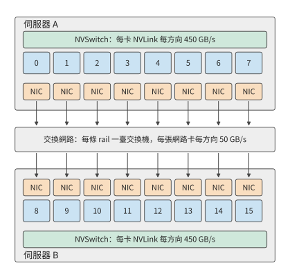

*圖 7-1：固定兩臺伺服器，每臺八張卡。伺服器內的卡經 NVLink 與 NVSwitch 互聯，每張卡各有一張網路卡；跨伺服器的資料從傳送方的網路卡經交換網路到達接收方的網路卡，每張網路卡每個方向提供 50 GB/s。*

圖 7-1 中的伺服器邊界，也是本章反複分析的通訊邊界。選擇 192 MiB 的梯度張量，要求十六個參與者都得到其歸約結果。例題 7.6（第 7.6.2 節）的訓練步計算 20 ms，梯度在 17 ms 就緒，要讓通訊完全藏在計算後面，就要在 3 ms 內完成；本章把 3 ms 作為這次通訊的預算。這一算例便於逐輪計算，也能說明跨伺服器協作的主要困難：本地計算結果必須經過頻寬遠低於 NVLink 的網路卡，才能傳給另一臺伺服器。

網路卡比 NVLink 慢得多，所以要先決定哪類通訊放在伺服器之間。本章沿用第 6.1.4 節的並行方式一覽表，不再逐一定義。把頻繁的張量並行歸約留在較快的互聯內，把資料並行的梯度同步或管線 (Pipeline)並行的階段交接放到伺服器之間，是應當首先計算的一類候選方案；若本地容量不夠，上下文並行需要更大範圍的上下文，或者專家並行的路由跨越多個節點，通訊範圍就必須擴大。是否這樣放置，要由實際流量和關鍵路徑決定。

跨越超節點邊界本身不會改變需要交換的資料量；演算法、放置、精度和接收方是否去重決定要傳多少位元組，路徑決定這些位元組經過哪個出口、要等多久。只知道網路是 InfiniBand 還是 RoCE，推不出有效頻寬、傳輸延遲、超售比（交換機下聯與上聯頻寬之比）、在途視窗和故障恢復時間。後文用明確給定的網路參數計算，實際部署時換成對應系統的測量值。

> **實驗 7-1 · 延伸：八卡伺服器之間的模型切分**
>
> 計算上述兩個推理模型的最低伺服器數量，再加入每卡 8 GB 的 KV 與工作區。分別畫出伺服器內張量並行或專家並行、伺服器間管線 (Pipeline)並行的分工，以及跨伺服器張量並行的分工，標出一次 prefill 與一次 decode 需要跨伺服器交接的位置。

### 7.1.2 流量與資源模型

確定卡的位置和梯度大小後，再計算資料經過路徑上每一段需要多久。一塊資料從 GPU 記憶體出發，經加速器介面到達網路卡，再經過交換網路，最後寫入接收方的記憶體。同一塊資料要依次經過這些介面和鏈路 (Link)，而不同資料塊可以在各段上同時傳輸，形成管線 (Pipeline)。持續傳送大量資料時，頻寬最低的一段決定總吞吐量率。例如，一張卡經 NVLink 每個方向能送出 450 GB/s，其網路卡每個方向只能傳送 50 GB/s，這張卡向另一臺伺服器的持續傳送速率就受網路卡的 50 GB/s 限制。

從單條路徑擴充套件到整個叢集時，可以先選擇要分析的網路邊界，再統計所有穿過它的資料。將網路節點分成兩組，連線這兩組節點的鏈路 (Link)就是第 6 章的割集。若一次任務需要沿某個方向跨越割集傳送 $V_{\mathcal C}$ bytes，而該方向的有效頻寬為 $B_{\mathcal C}$，傳輸時間至少為

$$
T_{\mathcal C}=\frac{V_{\mathcal C}}{B_{\mathcal C}}.
$$

該式給出傳輸時間的下界：無論如何排程，鏈路 (Link)每秒傳的位元組數都不會超過它的頻寬。全雙工鏈路 (Link)的兩個方向分別計算；若多個埠共享內部介面，再對該介面計算合計流量。同一份資料必須依次透過串聯的各段鏈路 (Link)，因此端到端頻寬受最慢的一段限制，不能將各段頻寬相加。

割集有多寬，取決於交換網路如何組織。**Clos 網路**由多層交換機構成，透過中間交換層為端點提供多條路徑。在分層 Clos 網路中，葉交換機連線伺服器，上層交換機提供葉交換機之間的多條路徑。以 DGX SuperPOD 參考架構所用的 NVIDIA Quantum QM9700 InfiniBand 交換機為例，其每個埠按 InfiniBand 的 NDR 速率等級執行，為 400 Gbit/s，即每方向 50 GB/s；若一臺葉交換機用 48 個埠接伺服器、16 個埠接上層，下聯總頻寬為 2.4 TB/s，上聯總頻寬為 0.8 TB/s，兩者之比 3:1 稱為**超售比**。這些合計 0.8 TB/s 的上聯鏈路 (Link)，就是離開這臺葉交換機的流量必須經過的割集。連線在同一葉交換機上的伺服器可以直接交換資料；只有跨葉交換機的通訊才佔用上聯頻寬。

**例題 7.1：增加卡數的收益何時受跨伺服器通訊限制？** 把十六個參與者排成一個環做歸約（第 7.2.1 節逐輪計算），每臺伺服器向另一臺傳送 360 MiB，這些位元組全部經過一張網路卡，每方向 50 GB/s。原來的卡數下計算時間為 20 ms。增加卡數時計算均勻分攤，跨伺服器的傳輸量和路徑不變。求完全序列和完全重疊兩種安排的完成時間。

解答：一個方向的傳輸下界為

$$
T_{\mathcal C}=\frac{360\times2^{20}}{50\times10^9}
\approx7.5\ \mathrm{ms}.
$$

令卡數相對原來的倍數為 $x$，計算時間變為 $20/x$ ms。序列安排需要 $20/x+7.5$ ms；計算與通訊完全重疊時，總時間等於兩者中的較大值。卡數翻倍，兩個結果分別從約 27.5、20.0 ms 降至 17.5、10.0 ms。增加到四倍，序列安排約為 12.5 ms，完全重疊安排約為 7.5 ms。圖 7-2 畫出兩種安排隨卡數變化的曲線。

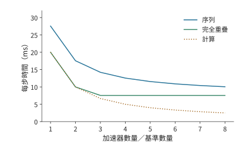

*圖 7-2：跨伺服器傳輸量固定時增加卡數的效果。每方向傳送 360 MiB，經一張 50 GB/s 網路卡；計算時間從 20 ms 開始，隨卡數增加按反比縮短。曲線分別按計算與通訊序列、完全重疊計算，通訊項取割集傳輸時間。*

計算時間與傳輸時間相等時，$20/x=7.5$，得到 $x\approx2.6$。越過這一點後，計算時間已經短於傳輸時間，繼續加卡也不能縮短完全重疊安排的時間。要繼續縮短時間，就應減少穿過割集的資料量，或讓更多網路卡同時工作以提高割集的有效頻寬。第 7.2 節將說明，重新組織同一次歸約怎樣同時做到這兩點。

這種總任務固定、增加卡數的做法稱為**強擴充套件**；**弱擴充套件**則隨卡數增加而增加任務量。例如，若每個方向的傳輸量也翻倍而出口不變，通訊時間就翻倍。擴充套件曲線的形狀，取決於計算量和跨伺服器傳輸量各自如何隨卡數變化。

> **實驗 7-2 · 延伸：通訊量與出口頻寬如何限制擴容收益**
>
> 沿用例題 7.1，分別考慮每個方向的流量減半，以及讓兩張網路卡同時工作使出口頻寬翻倍這兩種改動，分別畫出序列與完全重疊兩種安排下，完成時間隨卡數倍數變化的曲線，並求計算耗時與通訊耗時相等時的卡數倍數。再令流量隨卡數倍數線性增長，求完全重疊安排下使完成時間最短的卡數倍數。

**Clos 網路的層數與半分頻寬。** 前文把葉交換機的上聯當作割集。整個叢集的割集有多寬，要從一臺交換機的埠數算起。設每臺交換機有 $k$ 個埠，每個埠每方向 50 GB/s，QM9700 的 $k=64$。葉交換機（leaf）用 $d$ 個埠接伺服器、$u$ 個埠接上層的脊交換機（spine），$d/u$ 就是超售比。無阻塞時 $d=u=k/2$。兩層 Clos 中，每臺脊交換機用 $k$ 個埠各接一臺葉交換機，每臺葉交換機的 $k/2$ 條上聯分別接到 $k/2$ 臺脊交換機，因此最多有 $k$ 臺葉交換機、$k^2/2$ 個端點；三層按 fat-tree（胖樹，各層總頻寬不收窄的多層 Clos）的 pod 結構（若干葉交換機與一組中間層交換機組成一個 pod，pod 之間經頂層交換機相連）最多接 $k^3/4$ 個端點。$k=64$ 時，兩層接 2048 個端點、用 96 臺交換機，正是 DGX SuperPOD 參考架構中 2048 張 GPU 所用的 64 臺葉交換機加 32 臺脊交換機；三層接 65536 個端點、用 5120 臺交換機。[^clos-cut]

把叢集分成端點數相等的兩半，連線兩半的鏈路 (Link)頻寬合計稱為**半分頻寬**（bisection bandwidth）。無阻塞網路的半分頻寬等於一半端點的頻寬合計：兩層 2048 個端點為 $1024\times50=51.2$ TB/s，三層為 1638.4 TB/s。超售比為 3 時，葉交換機 48 下行、16 上聯，兩層能接 3072 個端點，只用 80 臺交換機；64 臺葉交換機共 1024 條上聯，半分頻寬為其中一半的合計 25.6 TB/s，只有無阻塞網路中同樣 3072 個端點所得 76.8 TB/s 的三分之一，每個端點穿過半分割集的份額從 50 GB/s 降到 16.7 GB/s。圖 7-3 畫出兩層 Clos 網路及其半分割集。

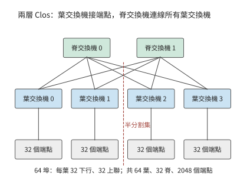

*圖 7-3：兩層 Clos 網路。每臺葉交換機一半埠接伺服器、一半接脊交換機，任意兩臺葉交換機之間經任一脊交換機相通；虛線把端點分成兩半，穿過它的葉—脊鏈路 (Link)就是半分割集。圖中畫出四臺葉交換機和兩臺脊交換機作代表，64 埠時實際為 64 臺葉交換機、32 臺脊交換機。*

第 7.6.4 節的 1024 卡訓練作業佔用整數臺葉交換機時，其割集就是這些葉交換機的全部上聯：

| 超售比 | 每葉下行／上聯 | 1024 卡佔用的葉交換機 | 割集鏈路 (Link)數 | 割集頻寬 | 每卡份額 |
|---|---:|---:|---:|---:|---:|
| 1:1 | 32／32 | 32 | 1024 | 51.2 TB/s | 50 GB/s |
| 3:1 | 48／16 | 22 | 352 | 17.6 TB/s | 17.2 GB/s |

超售比也改變第 7.6.4 節表中「出口隨卡數增長」一列的取值。那一列把每超節點出口取為卡數乘 50 GB/s，隱含交換網路無阻塞；超售比為 3 時，出口只剩三分之一，跨域傳輸時間變為三倍：

| 超節點卡數 | 每節點跨域傳送 | 無阻塞出口 | 3:1 超售出口 | 跨域傳輸時間（無阻塞 → 3:1） |
|---:|---:|---:|---:|---:|
| 8 | 127 GB | 400 GB/s | 133 GB/s | 0.318 → 0.953 s |
| 64 | 120 GB | 3.2 TB/s | 1.07 TB/s | 37.5 → 112.5 ms |
| 128 | 112 GB | 6.4 TB/s | 2.13 TB/s | 17.5 → 52.5 ms |
| 256 | 96 GB | 12.8 TB/s | 4.27 TB/s | 7.5 → 22.5 ms |

表中是純傳輸時間。第 7.6.4 節的跨域項還含 $2(H-1)$ 輪各 0.83 μs 的啟動，128 卡超節點時 $H=8$，啟動共約 12 μs，對錶中的毫秒級時間幾乎沒有影響。

**討論：超售的割集何時成為瓶頸？** 超售比 $r$ 把每張卡穿過割集的份額降到 $50/r$ GB/s。若一張網路卡發出的位元組中只有比例 $f$ 要離開本葉交換機，上聯不成為瓶頸的條件是 $f\le1/r$：無阻塞時任何 $f$ 都不受限，$r=3$ 時只有不到三分之一的位元組跨葉才不受限。分層歸約的跨伺服器階段，配對的兩臺伺服器若不在同一臺葉交換機下（在第 7.2.5 節的多軌拓撲裡，各伺服器編號相同的網路卡接同一臺葉交換機，每 32 臺伺服器為一組，這種情況就是兩臺伺服器不在同一組內），每張網路卡的全部位元組都要跨葉，$f=1$，超售的割集直接把這一階段拉長到 $r$ 倍；兩臺伺服器在同一組內時，第 7.2.5 節的對齊配對讓每一對的位元組只經過一臺葉交換機，$f=0$，上聯不承載這次歸約的任何位元組。把同一同步組的伺服器放進同一個組，就是降低 $f$ 的辦法。

> **實驗 7-3 · 延伸：交換機埠數與超售比如何決定割集**
>
> 把交換機埠數改為 128，分別求無阻塞兩層與三層 Clos 的端點數、交換機數和半分頻寬。保持 64 埠，把超售比改為 2:1，求 1024 卡分割槽的割集頻寬和每卡份額，並求第 7.6.4 節 128 卡超節點的跨域傳輸時間。最後求超售比為 3 時，分層歸約跨伺服器階段的每張網路卡需要有多大比例的位元組留在本葉交換機內，割集才不再是瓶頸。

### 7.1.3 統一互聯

上述下界說明了物理鏈路 (Link)的限制。程式還面臨另一個問題：同一份資料在機內傳輸和跨伺服器傳輸時，往往要用不同的訪問介面。這和匯流排與網路長期以來的分工有關：緊耦合的互聯把裝置接到處理器和記憶體系統上，適合頻繁、細粒度的協作；叢集網路連線大量獨立的節點，還要處理節點和鏈路 (Link)故障。模型跨越伺服器之後，同一項計算就同時用到這兩類機制。一次本地訪存和一次遠端傳輸，在程式裡表達的是相似的資料依賴，走的卻是不同的提交和完成路徑。

筆者參與 UB 早期設計時，核心問題之一就是如何為本地和遠端協作提供統一介面。應用希望表達的是「讀取這份資料」「把結果交給下一階段」「等它完成後複用空間」。統一互聯為定址、資料訪問和裝置間通訊提供共同的介面，讓 CPU、加速器和其他裝置都能參與其中。

理解這種統一，需要區分兩件事。介面決定程式如何表達工作，物理路徑決定工作經過哪些資源。一次遠端讀取可以用一條指令發起，但資料仍要經過網路卡的 50 GB/s 出口；非同步寫入可以提前提交，接收方則要等資料就緒後才能開始使用。因此，本章將先求必需的流量，再求充分利用頻寬所需的並行請求數，最後分析應用要求的操作順序。統一介面的收益也在這三個層次上體現：減少搬移，縮短髮起路徑，簡化協作。第 6.5.5 節已經從超節點規模的角度討論了 UB 的兩項設計選擇：把控制器接在片上匯流排上，把連線狀態拆成端點記錄和傳輸通道分別儲存。本章沿著一次遠端訪問的路徑，逐階段計算這兩項選擇帶來的效果。

## 7.2 跨節點流量與物理路徑

### 7.2.1 資料並行的跨伺服器流量

統一介面不能省去必需的傳輸，但歸約演算法可以改變哪些資料需要跨伺服器。先從資料並行開始：每個參與者算出區域性梯度，再把對應元素相加，最後每個參與者都要得到完整的歸約結果。算例選 Qwen3-8B 第一層 FFN 中 gate 投影的梯度，形狀為 $[12288,4096]$，按每元素 4 位元組的 FP32 存放，每個參與者的輸入為

$$
M=12288\times4096\times4=192\ \mathrm{MiB}.
$$

第 6.4.2 節推導過環形 AllReduce：先做 ReduceScatter，讓每卡持有歸約結果的一片，再做 AllGather 把這些分片收集到每卡；張量均分為 $p$ 份，兩步各 $p-1$ 輪，每輪向下一個參與者傳送一份 $M/p$。因此，每個參與者傳送

$$
V_{\mathrm{rank}}=2\frac{p-1}{p}M.
$$

十六個參與者各傳送 360 MiB，共傳送 5760 MiB，執行三十輪。演算法決定總髮送量，參與者在伺服器上的分佈則決定其中多少需要跨伺服器傳輸、經過哪些網路卡。

**例題 7.2：哪種歸約演算法能在 3 ms 內完成傳輸？** 使用第 7.1 節的兩臺伺服器，比較不分層的連續環、交錯環和分層歸約。

**解答：計算各歸約方案的跨伺服器傳輸量。** 連續環按 0、1、…、15 排列。十六條有向邊只有 7→8 和 15→0 跨伺服器。每輪每邊傳送 12 MiB，三十輪每方向各傳送 360 MiB，兩方向合計 720 MiB；這些位元組在伺服器 A 只經過參與者 7 的網路卡，在伺服器 B 只經過參與者 15 的網路卡，其餘十四張網路卡閒置。若改成 0、8、1、9、…、7、15 的交錯排列，十六條邊全部跨伺服器，每輪每張網路卡各傳送 12 MiB，跨伺服器總量增至 5760 MiB。

分層歸約先在各伺服器內由八個參與者執行 ReduceScatter。七輪之後，每個參與者儲存本伺服器歸約結果的八分之一，即 24 MiB。兩臺伺服器上負責同一分片的兩個參與者，再執行一次 AllReduce：各自把 24 MiB 分成兩份，用一輪交換並歸約其中一份，再用一輪交換得到另一份。每一對在兩個方向合計傳送 48 MiB，八對共傳送 384 MiB；每一對各走自己的一條 rail，八張網路卡同時工作。最後各伺服器內用七輪 AllGather 得到完整結果。圖 7-4 至圖 7-6 分別畫出三種方案的路徑，圖 7-7 比較三者跨伺服器的位元組數。

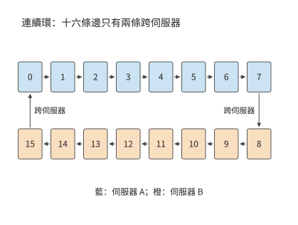

*圖 7-4：連續環將同一伺服器內的參與者排在一起。十六條有向邊中只有 7→8 與 15→0 跨伺服器，跨伺服器流量集中在兩張網路卡上。顏色表示參與者所在伺服器。*

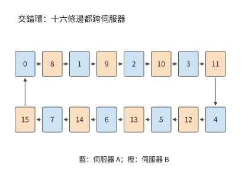

*圖 7-5：按 A、B 兩伺服器交替排列參與者，十六條有向邊都跨伺服器，十六張網路卡都在工作。每個參與者的總髮送量保持不變。*

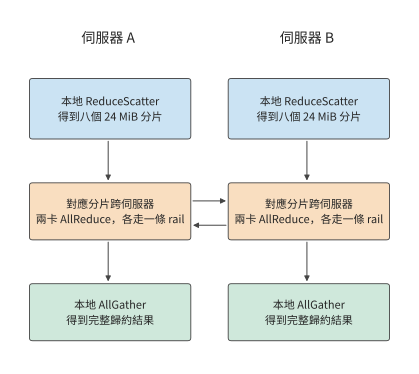

*圖 7-6：每臺伺服器先把本機八份貢獻歸約成分片，再和另一臺伺服器交換對應的分片，最後在本機收集完整結果。每列從上向下執行，橫向箭頭表示跨伺服器交換，每對參與者各用一條 rail。*

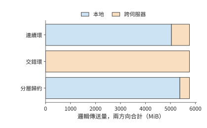

*圖 7-7：三方案的邏輯傳送總量均為 5760 MiB；橙色跨伺服器部分分別為 720、5760、384 MiB。兩個方向合計。*

**解答：由各輪鏈路 (Link)負載計算歸約時間。** 各輪依次執行，同一輪中的不同傳輸並行進行。設第 $r$ 輪經過資源 $e$ 的資料量為 $V_{r,e}$，該資源頻寬為 $B_e$，每輪啟動時間為 $\alpha$，則傳輸模型為

$$
T_{\mathrm{comm}}=\sum_r\left(\alpha+\max_e\frac{V_{r,e}}{B_e}\right).
$$

沿上述三種方案的箭頭逐輪計算，就能把流量換算成時間。該式分開了兩種關係：一輪之內由最慢的傳輸決定，各輪之間依次相加。這裡只算資料傳輸和每輪啟動的時間。[^gradient]

連續環每輪在每個方向上經一張網路卡傳送 12 MiB，需要約 0.25 ms；同一輪的其餘十四條邊走 NVLink，每條 12 MiB 只需約 0.03 ms，都要等這一條邊。因此三十輪約需 7.6 ms。交錯環每輪十六條邊各經自己的網路卡傳送 12 MiB，每輪同樣約需 0.25 ms，三十輪也約需 7.6 ms：交錯環讓所有網路卡都在工作，卻把跨伺服器流量增加到八倍，時間沒有縮短。

分層歸約的兩個跨伺服器輪次，每張網路卡每輪傳 12 MiB，共約 0.50 ms。本地 ReduceScatter 和 AllGather 合計十四輪，每輪每個參與者經 NVLink 傳送 24 MiB，在 450 GB/s 下合計約 0.78 ms。十六輪啟動共約 13 μs，得到

$$
T_{\mathrm{hier}}=
14\frac{24\ \mathrm{MiB}}{450\ \mathrm{GB/s}}
+2\frac{12\ \mathrm{MiB}}{50\ \mathrm{GB/s}}
+16\times0.83\ \mu\mathrm{s}
\approx1.3\ \mathrm{ms}.
$$

連續環的傳輸已超過 3 ms 的預算，分層歸約則為歸約計算、傳播和排隊留出約 1.7 ms。分層歸約使跨伺服器傳輸量減少約 47%，通訊時間減少約 83%。兩者比例相差懸殊，原因不在位元組數，而在路徑：連續環三十輪中的每一輪都要等跨伺服器的邊經網路卡傳完 12 MiB，其餘十四條邊走 NVLink，約 0.03 ms 傳完後就在等這條邊，另外十四張網路卡則整輪沒有資料可傳；分層歸約把跨伺服器傳輸壓縮成兩輪，每輪八張網路卡同時各傳 12 MiB，割集的有效頻寬從 50 GB/s 變成 400 GB/s。

**討論：本地互聯要多快，分層才合算？** 把本地頻寬寫成 $B_L$，網路卡仍為每方向 50 GB/s。分層歸約的本地十四輪共傳送 336 MiB，跨伺服器兩輪共約 0.5 ms；只要 $B_L$ 不低於網路卡頻寬，連續環的時間就始終由那一條跨伺服器邊決定，約為 7.6 ms。令兩者相等，$336\ \mathrm{MiB}/B_L+0.5\ \mathrm{ms}=7.6\ \mathrm{ms}$，得到 $B_L\approx50$ GB/s：只要本地互聯不慢於一張網路卡，分層歸約就更快，NVLink 的 450 GB/s 遠高於該界限。分層歸約在這臺伺服器上沒有代價，因為每個參與者的本地傳送量（336 MiB）不比連續環的（360 MiB）多，跨伺服器階段又用上了全部八張網路卡。

分層歸約並不總是免費的。作為對照，考慮一種常見的 PCIe 伺服器（下文稱對照配置）：每臺四張 A100 80GB PCIe，卡與卡之間經 PCIe Gen4 x16 點對點傳輸，每方向 32 GB/s；每臺配一張雙埠 ConnectX-7，兩個 200 Gbit/s 埠各 25 GB/s，共用這張網路卡的 PCIe Gen4 x16 插槽，每方向也只有 32 GB/s。八個參與者的連續環十四輪各傳送 24 MiB，本地邊受點對點鏈路 (Link)限制，跨伺服器邊受網路卡插槽限制，每輪都按 32 GB/s 計，約需 11.0 ms。分層歸約的兩個跨伺服器輪次每方向各要透過插槽傳送 96 MiB，共約 6.3 ms，加上六輪本地通訊約 9.4 ms，合計約 15.7 ms，反而比連續環慢。令兩者相等，本地頻寬約為 64 GB/s，約是網路卡插槽頻寬的兩倍。[^two-nic] A100 PCIe 的 NVLink 橋接器每方向 300 GB/s，遠高於該界限，但一座橋只連兩張卡，四卡環上仍有兩條邊走 PCIe；若四卡環的每條邊都有這樣的頻寬，分層歸約降到約 7.3 ms，才快於連續環。差別的來源是共享介面：跨伺服器階段把八個參與者的分片集中到兩輪裡，這兩輪的流量都要經過同一個 32 GB/s 的插槽，本地歸約節省的遠端位元組被更長的遠端輪次抵消了一部分；本地鏈路 (Link)又不比該插槽快，本地歸約增加的時間也就無法補回。

分層歸約先在較快的本地互聯上完成部分歸約，再把結果經網路卡發出。它減少跨伺服器的位元組，更重要的是讓每張網路卡都有自己要傳的分片。跨伺服器頻寬由多張獨立網路卡提供時，分層幾乎沒有代價；跨伺服器頻寬是共享介面時，只有本地歸約增加的時間少於其節省的遠端傳輸時間，分層歸約才更快。

**第四種方案：在網歸約。** 前三種方案都讓參與者之間兩兩傳資料，交換機只負責轉發。**在網歸約**讓交換機在轉發的同時做加法：NVIDIA 的 SHARP（Scalable Hierarchical Aggregation and Reduction Protocol，可擴充套件分層聚合與歸約協議）在交換晶片裡沿聚合樹歸約來自多個埠的資料，再把結果分發回去，端點不必把同一份資料多次傳送。[^in-network] 沿用分層歸約的本地 ReduceScatter 與 AllGather，只把跨伺服器階段換成：每個參與者把自己的 24 MiB 分片發給交換機一次，收回歸約結果一次，只有一輪。兩臺伺服器時，每張網路卡每個方向仍傳 24 MiB，跨伺服器總量仍是 384 MiB，與分層歸約相同；時間從兩輪的 0.505 ms 變為一輪的 0.504 ms，只節省一次 0.83 μs 的啟動。

差別出現在伺服器數增加時。設持有同一分片的伺服器有 $S$ 臺。環形 AllReduce 讓每張網路卡傳送 $2\frac{S-1}{S}\times24$ MiB、經過 $2(S-1)$ 輪；在網歸約讓每張網路卡始終只傳送一次、接收一次。跨伺服器階段的時間見下表和圖 7-8：

| 伺服器數 | 環：每網路卡傳送 | 環：輪數 | 環：時間 | 在網歸約：每網路卡傳送 | 在網歸約：時間 |
|---:|---:|---:|---:|---:|---:|
| 2 | 24 MiB | 2 | 0.505 ms | 24 MiB | 0.504 ms |
| 4 | 36 MiB | 6 | 0.760 ms | 24 MiB | 0.504 ms |
| 8 | 42 MiB | 14 | 0.892 ms | 24 MiB | 0.504 ms |
| 16 | 45 MiB | 30 | 0.969 ms | 24 MiB | 0.504 ms |
| 32 | 46.5 MiB | 62 | 1.027 ms | 24 MiB | 0.504 ms |

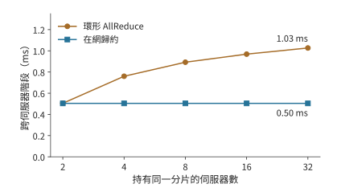

*圖 7-8：持有同一分片的伺服器從 2 臺增至 32 臺時，跨伺服器階段的時間。環的每網路卡傳送量趨近兩個分片、輪數按 $2(S-1)$ 增長；在網歸約保持一個分片、一輪。兩臺伺服器時兩者只差一次啟動。*

**討論：在網歸約何時明顯更快？** 兩臺伺服器時兩者只差一次啟動；從 $S=3$ 起，環的位元組數是在網歸約的 $2(S-1)/S>1$ 倍，還多出 $2S-3$ 輪啟動，伺服器越多差距越大，32 臺時在網歸約的時間只需環的 49%。該模型只計網路卡的序列傳送與啟動；交換機歸約引擎每秒能歸約多少位元組、支援哪些資料型別，是要另外給定的輸入，流量超過它時瓶頸從網路卡轉到交換機。SHARP 論文在 128 臺主機上測得 8 位元組 AllReduce 從 6.01 μs 降到 2.83 μs，4096 位元組從 46.93 μs 降到 14.48 μs：小訊息節省的主要是輪數帶來的啟動時間。[^in-network]

> **實驗 7-4 · 延伸：在網歸約何時值得**
>
> 把梯度改為 BF16（每參與者 96 MiB），重算兩臺與八臺伺服器的環形與在網歸約跨伺服器時間。設交換機歸約引擎每方向的歸約吞吐量為 200 GB/s，求八條 rail 同時歸約時它是否成為瓶頸，並求使在網歸約仍快於環的最小引擎吞吐量。最後按第 7.6.3 節的 8 KiB 輸入，比較 36 層、每層兩次歸約的總啟動時間在兩種方案下相差多少。

### 7.2.2 張量並行與管線 (Pipeline)並行的通訊需求

資料並行透過歸約匯合各參與者的梯度。張量並行把一層的計算分給多個參與者，後面的運算子往往要等區域性結果匯合後才能開始，所以層內通訊會直接推遲後續計算。管線 (Pipeline)並行按階段切開模型，把跨伺服器的交接集中在階段邊界。兩種方式下，資料跨越伺服器邊界的次數不同。

先計算一次層間交接的資料量。Qwen3-8B 的隱藏寬度為 4096，一個 BF16 隱藏向量是 8 KiB。prefill 中 8192 個 token 的同類張量為 64 MiB，單請求 decode 則為 8 KiB。鏈路 (Link)頻寬 $B$ 取本章網路卡的 50 GB/s，每次傳送的啟動時間 $\alpha$ 設為 5 μs，傳送 $M$ bytes 耗時為

$$
T_{\mathrm{msg}}=\alpha+\frac{M}{B}.
$$

64 MiB 約需 1.3 ms，8 KiB 約需 5.2 μs。前者的時間主要花在傳輸資料上，後者約 97% 的時間花在啟動上。啟動時間與傳輸時間相等時，$M=\alpha B=250000$ bytes，約為 244 KiB。資料量遠大於該值時，傳輸時間佔主導，提高頻寬更有效；遠小於該值時，減少傳輸次數更有效。

上式給出了每次交接的代價；對管線 (Pipeline)並行還要看多次交接如何與計算穿插。管線 (Pipeline)並行把連續若干層放在同一階段，階段之間傳遞啟用。前一階段處理下一個 micro-batch 時，後一階段可以處理上一個 micro-batch。取四個前向階段，每階段 1 ms。一個 micro-batch 從第一階段依次走到第四階段，4 ms 後完成。連續放入八個獨立 micro-batch，第一階段每毫秒將一個 micro-batch 的結果傳給下一階段，最後一個 micro-batch 在第 11 ms 完成。

沿圖 7-9 中相同的編號看，一個 micro-batch 必須走完四個階段；沿同一行看，一個階段可以連續處理八個 micro-batch。左下和右上的空白，就是管線 (Pipeline)啟動和結束時的空閒。

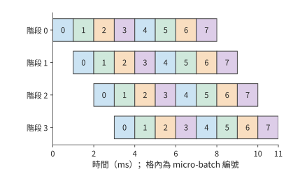

*圖 7-9：四個前向階段如何處理八個 micro-batch。每格為 1 ms，數字表示 micro-batch 編號；同一編號沿右下方移動，表示該 micro-batch 依次透過各階段。每個階段計算 8 ms，在 11 ms 的總時間中各空閒 3 ms。階段耗時相同，圖中忽略額外交接開銷。*

一般地，$p$ 個等時階段、$m$ 個獨立 micro-batch、每階段耗時 $\tau$，總時間與各階段的利用率分別為

$$
T_{\mathrm{pipe}}=(m+p-1)\tau,\qquad
U_{\mathrm{pipe}}=\frac{m}{m+p-1}.
$$

四階段、八個 micro-batch 時利用率約為 73%。若希望達到 90%，由 $m/(m+3)\ge0.9$ 得到至少 27 個獨立 micro-batch。要讓管線 (Pipeline)各階段持續工作，就需要足夠多的獨立 micro-batch。低並行 decode 中，同一請求的下一個 token 依賴前一個 token 的輸出，增加伺服器並不會創造新的獨立 micro-batch；增加並行請求才會增加流水中的獨立工作。

因此兩種並行產生不同的等待：張量並行要頻繁匯合區域性結果，管線 (Pipeline)並行在啟動和結束時有一部分卡空閒。Prefill 的張量較大，應優先減少跨伺服器傳輸的資料；低並行 decode 逐個生成 token，應優先減少每層通訊的啟動次數。並行請求數則決定管線 (Pipeline)利用率。

### 7.2.3 專家並行的通訊負載

張量並行和管線 (Pipeline)並行的通訊由切分方式確定；MoE 還多一個變數：每個 token 選的專家可能不同，傳送目標也隨之改變。專家並行把專家放在不同的卡上，token 按路由去相應的專家。取 1024 個 token，每個選八個專家，共 8192 次 dispatch。每份啟用 8 KiB，一半跨伺服器，dispatch 到遠端專家的輸入就有 4096 份，共 32 MiB；combine 返回同樣大小的結果，再傳 32 MiB。[^parallel]

設 token 數為 $n$、每 token 選擇數為 $k$、每份啟用佔 $d$ bytes、跨邊界比例為 $f$。若每次 dispatch 單獨傳送，dispatch 的傳輸量為 $nkfd$，加上 combine 返回的專家結果共 $2nkfd$。把熱門專家放到傳送方所在的伺服器，降低的是 $f$；改變啟用的資料型別或編碼，改變的是 $d$。

這 32 MiB 如何分配到接收方，同樣影響傳輸時間。全部發給一張 50 GB/s 的網路卡，接收至少需約 0.67 ms（圖 7-10）；平均分給接收伺服器的八張網路卡，每張接收 4 MiB，接收時間降至約 0.08 ms（圖 7-11）。對照配置的雙埠網路卡兩個埠共用一個 32 GB/s 的 PCIe 插槽，無論如何分到兩個埠，接收 32 MiB 都至少需要約 1.05 ms。將流量均勻分給網路卡，消除了單張網路卡的瓶頸；埠共用插槽時，共享的插槽隨後成為新的瓶頸。

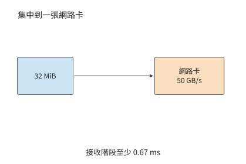

*圖 7-10：將全部 32 MiB 送入一張 50 GB/s 網路卡，接收至少需要約 0.67 ms。*

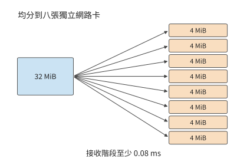

*圖 7-11：八張獨立網路卡各接收 4 MiB，接收階段縮短到約 0.08 ms。*

把接收目標分散到多個網路卡之後，還要繼續向前追蹤共同經過的介面。圖 7-12 把對照配置的共享插槽單獨畫出：無論後面如何分到兩個埠，這 32 MiB 都必須先透過同一個插槽。

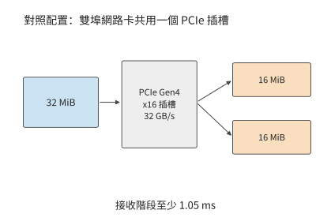

*圖 7-12：對照配置中，32 MiB 都需要先經過網路卡 32 GB/s 的 PCIe 插槽，接收階段受限於約 1.05 ms。這裡各圖均只計算接收載荷的傳輸。*

比較這三張路徑圖，分散目標減少了每張網路卡上的資料量；沿最後一張圖的共同入口看，32 MiB 仍須全部透過它。計算不規則通訊時，也可以先分別統計這些位置的流量。

把從卡 $i$ 發往卡 $j$ 的載荷記為 $V_{ij}$。同一行相加是傳送方的傳送量，同一列相加是接收方的接收量；把跨越某個割集的元素相加，就是該割集的傳輸量。把這些量各自除以對應的頻寬，再取最大值，就是第 7.1 節的資源模型在不規則交換上的應用。

從該矩陣還能看出 dispatch 與 combine 的熱點如何對應。若按 token 到專家逐份傳送、返回同樣大小的向量，且接收方不做合併，返回矩陣就是傳送矩陣的轉置：dispatch 的熱點接收方，就是 combine 的熱點傳送方。兩次通訊的總位元組數相同，不代表兩段耗時相同：返回的資料要等專家算完才就緒，兩個方向的可用頻寬、資料格式和歸約位置也可能不同。若 dispatch 用 FP8、combine 用 BF16，返回的載荷約為 dispatch 的兩倍，量化 scale 等後設資料另計。第 9.4 節會把這些流量與計算就緒時間放進同一個算例。

專家放置因此有兩項互相聯絡的目標：讓更多 dispatch 留在本地，讓遠端 dispatch 分散到有餘量的接收方。複製熱門專家是用額外的容量換少走遠端；發往同一張卡上多個專家的輸入可以只傳一次啟用，到了那張卡再分給各個專家。兩種辦法都減少了相應路徑上的傳輸量。

### 7.2.4 多網路卡

專家 dispatch 說明了多入口並行的收益和共享入口的限制。同樣的分析也適用於傳送方：增加網路卡，只有當它確實提供額外的可用頻寬、並且有資料分配給它時，才會縮短傳輸時間。第 7.2.1 節的連續環就是一例：伺服器上八張網路卡各連一張卡，連續環卻只讓其中一張有資料可傳，分層歸約才把分片分給八對參與者，跨伺服器階段從 7.6 ms 降到約 0.5 ms。有網路卡不等於用上了網路卡，通訊演算法決定每張網路卡分到多少位元組。

對照配置說明另一種限制。其雙埠網路卡有兩個 25 GB/s 埠，共用 32 GB/s 的 PCIe 插槽。只用一個埠時，八個參與者的連續環十四輪約需 14.1 ms；把每次要傳的資料拆成兩段，分別交給兩個埠，吞吐量只升到插槽允許的 32 GB/s，時間降到約 11.0 ms，而不是兩個埠合計 50 GB/s 對應的約 7.1 ms。即使換成四埠的 ConnectX-7，把第三個埠也用上，插槽仍是同一個 PCIe Gen4 x16，這段傳輸不能再縮短。共享介面的頻寬用盡之後，再加埠也不提高吞吐量。[^nic-count]

另一種情況是某張 GPU 直連的網路卡正忙，相鄰 GPU 的網路卡卻空閒。借用相鄰的出口要先把資料經 NVLink 送到相鄰 GPU，多了一段本地傳輸。多網路卡通訊系統 FuseLink 採用的就是這條路徑：藉助機內的 GPU 互聯，把網路緩衝區重新對映到空閒的網路卡上。[^fuselink]

下面比較直接傳送和經相鄰 GPU 中繼兩種方式。直連網路卡每方向 50 GB/s，兩張可借用的相鄰網路卡也各為 50 GB/s；通往相鄰 GPU 的 NVLink 每方向 450 GB/s。

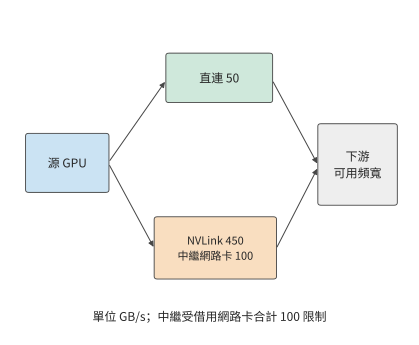

*圖 7-13：借用相鄰網路卡的路徑。直接路徑最多傳輸 50 GB/s；兩張中繼網路卡合計 100 GB/s，資料要先經過 450 GB/s 的 NVLink 到達相鄰 GPU。兩路在下游匯合，最後還受外部網路和接收方可用頻寬限制。箭頭表示傳輸方向。*

沿圖 7-13 的分叉計算：直接路徑與中繼路徑可以同時傳輸，但資料必須依次經過中繼路徑內部的兩段。因此，直接和中繼路徑合計可提供 $50+\min(450,100)=150$ GB/s。設外部網路與接收路徑共同允許的頻寬為 $B_D$，實際的傳送能力為

$$
B_{\mathrm{eff}}=\min\bigl(B_D,\ 50+\min(450,100)\bigr)\ \mathrm{GB/s},
$$

其中 $B_D$ 也以 GB/s 計。$B_D\le50$ 時直連網路卡已能用滿下游頻寬，中繼沒有收益；$50<B_D<150$ 時，中繼收益隨下游可用頻寬增加；超過 150 後，兩張借用網路卡的合計頻寬成為新的瓶頸。若 NVLink 同時在承擔本機歸約的流量，留給中繼的本地頻寬低於 100 GB/s 時，限制中繼路徑的就換成本地這一段。1.125 GiB 載荷在直接 50 GB/s 路徑上約需 24.2 ms，下游支援 100 GB/s 時降至 12.1 ms，支援 150 GB/s 時降至 8.1 ms。

上述按頻寬借用網路卡的分析，前提是每次傳輸的資料量足夠大。MoE decode 的 dispatch 和 combine 要讓每張卡發幾千條小訊息，這時還要檢查網路卡每秒能發起多少項請求，也就是第 7.3.4 節的 $1/\delta$。按該節 RoCE 可靠連線實現的 $\delta\approx18.6$ ns 計，網路卡每秒約發起 5400 萬項請求；在 50 GB/s 的鏈路 (Link)上，只有訊息小於約 0.93 KB 時，發起速率才先於頻寬成為瓶頸。MoE dispatch 的一條訊息是一個 token 的隱藏向量，隱藏維 7168 時 FP8 約 7 KiB、BF16 約 14 KiB，都遠大於該交叉點，所以熱點專家所在的卡先用盡的仍是頻寬，借用相鄰網路卡按位元組分配即可。只有每條訊息不到 1 KB 時，例如逐條傳送的控制訊息，發起速率才會先於頻寬用盡；第 9.4.2 節討論專家副本放置時，把這種情況下網路卡的報文處理能力也計入需要預留餘量的資源。[^nic-rate]

無論是分層歸約、專家放置還是多網路卡中繼，分析步驟相同：畫出路徑，計算每條鏈路 (Link)和介面傳輸的資料量，再找出耗時最長的一項。

> **實驗 7-5 · 核心：本地頻寬與共享出口如何影響歸約演算法選擇**
>
> 完整復算例題 7.2，再改用對照配置（每臺四張 A100 80GB PCIe，卡間經 PCIe Gen4 點對點每方向 32 GB/s，雙埠 ConnectX-7 的兩個 25 GB/s 埠共用 32 GB/s 的 PCIe 插槽）重算連續環和分層歸約。在對照配置下把本地頻寬從 32 GB/s 提高到 NVLink 橋接器的 300 GB/s（設四張卡之間的每條邊都有這樣的頻寬），解釋為什麼歸約演算法的選擇會翻轉，而在本章配置下不會。再將對照配置每臺伺服器使用的埠數從一個增為兩個、三個，保持 32 GB/s 的插槽不變，畫出歸約時間隨埠數變化的曲線，指出增加到多少個埠後，繼續增加已無法縮短時間。

### 7.2.5 多軌拓撲

第 7.2.1 節的分層歸約讓八對參與者各走一條 rail。DGX SuperPOD 參考架構把計算網路組織成**多軌拓撲**（rail-optimized）：每臺伺服器的八張網路卡分別接到八臺不同的葉交換機，所有伺服器的第 $i$ 張網路卡都接第 $i$ 臺葉交換機，這臺葉交換機連同接在它上面的所有網路卡就是第 $i$ 條 rail；同一組 32 臺伺服器內，同一條 rail 上的流量經葉交換機一跳到達，不同 rail 之間的流量要經過脊交換機。[^rail] 圖 7-1 裡「每條 rail 一臺交換機」的交換網路就是這種組織。

分層歸約的跨伺服器階段讓 rank $i$ 與 rank $i+8$ 配對：rank $i$ 用伺服器 A 的第 $i$ 張網路卡，rank $i+8$ 用伺服器 B 的第 $i$ 張網路卡，兩張網路卡都接在第 $i$ 臺葉交換機上。因此八對參與者的流量各自留在一條 rail 內，都只經過一臺葉交換機，沒有一個位元組經過脊交換機。每條 rail 每個方向承載 24 MiB，兩輪共 0.505 ms；這 192 MiB 若集中在一張網路卡上需要 4.03 ms，八條 rail 同時工作將其縮短到約八分之一。[^rail] 圖 7-14 的上半圖畫出這種對齊配對，下半圖是下文討論的錯位配對。

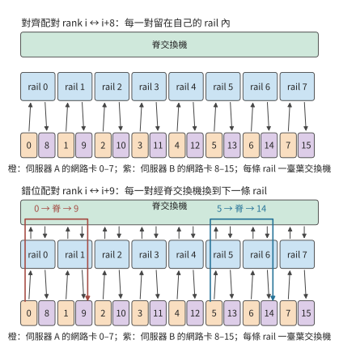

*圖 7-14：八條 rail 畫成八條豎直車道，每條車道里是一臺葉交換機和兩臺伺服器上編號相同的網路卡。上半圖按 rank $i$ 與 rank $i+8$ 配對，每一對的位元組留在自己的車道里，只經過一臺葉交換機；下半圖按 rank $i$ 與 rank $i+9$ 配對，每一對都要從第 $i$ 條 rail 經脊交換機換到第 $i+1$ 條 rail，每個方向 192 MiB 全部經過脊層。*

把配對改成 rank $i$ 與 rank $i+9$（rank 7 與 rank 8），rank $i$ 仍用第 $i$ 條 rail，對端卻用第 $i+1$ 條 rail。每一對的位元組要先進入第 $i$ 臺葉交換機，再經脊交換機到第 $i+1$ 臺葉交換機，八對無一例外，每個方向 192 MiB 全部經過脊層。每張網路卡的傳送量沒有變，跨伺服器階段的下界仍是 0.505 ms；變的是這些位元組佔用了脊交換機的鏈路 (Link)，要與其他作業的跨 rail 流量共用，還要經過第 7.5.3 節討論的多路徑雜湊。配對是否對齊，只取決於兩端 rank 在各自伺服器內的編號是否相同：$i \bmod 8$ 相等就在一條 rail 內，不相等就經過脊層。交錯環（圖 7-5）在多軌拓撲上也要付出這一代價：它的十六條邊都跨伺服器，邊 $i\to i+8$ 對齊，邊 $i+8\to i+1$ 不對齊，一半的位元組要經過脊層。

把這一規則用於第 7.6.4 節的 128 卡超節點。十六臺伺服器各八張卡，張量並行組佔一臺伺服器的八張卡，張量並行座標為 $t$ 的卡在每臺伺服器裡都是第 $t$ 張卡，用第 $t$ 條 rail；同一座標上的十六個資料並行成員在超節點內歸約後，跨超節點交換的就是這一座標的梯度分片。八個座標的分片一樣大（每張卡 $G=8$ GB），所以八條 rail 各承載跨超節點傳送量的八分之一，即 112 GB 中的 14 GB，沒有哪條 rail 更忙。只有當分片大小不同（例如不均勻的張量切分），或者一張網路卡故障、其流量經 NVLink 借用相鄰網路卡（第 7.2.4 節）時，才會出現更忙的 rail。

> **實驗 7-6 · 延伸：rail 對齊與脊層流量**
>
> 在兩臺伺服器上把配對改為 rank $i$ 與 rank $((i+4)\bmod 8)+8$，求經過脊層的位元組數。再讓伺服器 B 的網路卡 3 故障，rank 11 的流量經 NVLink 借用網路卡 2 和網路卡 4 各一半，求各條 rail 承載的位元組與跨伺服器階段的時間。最後在第 7.6.4 節的 128 卡超節點裡改用 TP16（一組跨兩臺伺服器），說明每條 rail 承載哪些座標的分片、負載是否仍然均勻。

## 7.3 遠端訪問的路徑與並行

### 7.3.1 資料傳輸與完成通知

第 7.2 節只計算了位元組經過哪些鏈路 (Link)、要傳多久，還沒有說明這些位元組如何交接。分層歸約的跨伺服器階段中，卡 0 已經得到本地歸約後的分片，需要交給卡 8。一次資料交接包含兩項工作：把分片寫到卡 8 可以讀取的位置，以及讓卡 8 知道資料已經就緒。前一項改變資料所在的位置，後一項告訴接收方何時可以開始計算。

第 6.5.5 節的單邊讀寫由發起方直接訪問預先授權的遠端記憶體，例如卡 0 把分片寫進卡 8 的接收區域：發起端網路卡從本地記憶體讀出分片，目標端網路卡把它寫入卡 8 的記憶體，對端程式不參與這次搬移。**雙邊訊息**要傳送方和接收方配合：接收方預先提交接收請求並提供緩衝區，通訊系統把到達的訊息與相應的請求配對。已知目標位置的大塊分片適合直接讀寫；來自多個傳送方的通知則適合放進訊息佇列，由佇列區分各條通知並交給相應的資料使用方，下文稱為消費者。

大塊資料與通知由此可以分工：先寫分片，再發一個短訊息說明分片可以使用。把寫入和通知合併成一次提交，還能少發起一次。消費者收到通知後開始歸約；寫入與通知的先後關係在第 7.4 節展開。

寫入和通知完成了資料交接。若還要接收方按指定方式處理資料，就用**遠端過程呼叫**（remote procedure call，RPC）：請求對端執行指定的函式，一次呼叫包括傳參數、遠端執行和返回結果。參數的編碼方式直接影響這條路徑的開銷：JSON 是文字形式的資料交換格式；base64 把每 3 個二進位制位元組編碼為 4 個文字字元。將 1 MiB 二進位制資料放進 JSON 的 base64 欄位，編碼載荷約增加三分之一。改用二進位制請求，就同時減少傳送位元組和編碼工作。

本書配套的一組跨主機 RPC 測量中，請求大小從約 1.33 MiB 降至 1.00 MiB，客戶端 CPU 處理時間中位數從約 9.8 ms 降至 1.1 ms。20 對正式呼叫中有 11 對整體變快，網路傳輸和轉發等待的耗時波動更大。[^rpc] 這些測量區分了兩類耗時：減少編碼可以節省本地 CPU 時間；要縮短整個呼叫，還要減少網路、轉發和遠端執行中的等待。

> **實驗 7-7 · 延伸：去掉編碼轉換能縮短多少遠端呼叫時間**
>
> 從配套記錄選取同一載荷的成對呼叫，畫出客戶端編碼、傳送、等待、解碼和服務端執行的時間線。解釋為什麼服務端的執行時間已經包含在客戶端的等待時間中。計算省去 base64 編碼後減少的傳輸位元組數，並分析編碼耗時佔比如何影響完整呼叫的加速收益。

### 7.3.2 由產生資料的加速器直接發起通訊

第 7.3.1 節從接收方的角度區分了讀寫、訊息與 RPC。傳送方一側的問題是：誰最先知道資料已經就緒，誰負責提交請求。卡 0 的分片在 GPU 上產生。若由 CPU 提交通訊，GPU 先報告就緒，CPU 構造請求交給網路卡，完成後再把狀態交還 GPU。這條控制路徑要交接多次，即使載荷從不經過 CPU 記憶體，交接本身也要花時間。

RDMA 網路卡已經能訪問授權的遠端記憶體；NVIDIA 的 **GPUDirect RDMA** 進一步讓網路卡直接訪問已註冊、已授權的 GPU 記憶體，載荷不必經主機記憶體中轉。由 CPU 發起通訊時，提交請求和處理完成通知仍由 CPU 負責；由加速器發起通訊，則讓 GPU 自己構造或觸發請求並讀取完成狀態，資料一算完就能發出。URMA 是 UB 提供的統一遠端記憶體存取介面。GPU 經 NVLink 訪問對端記憶體、裝置經 UB 發起非同步訪問，都是這種直接協作在各自路徑上的實現。圖 7-15 到圖 7-18 依次畫出主機 RPC、CPU 提交的 GPUDirect RDMA、GPU 經 NVLink 訪問和裝置發起的 URMA 訪問。

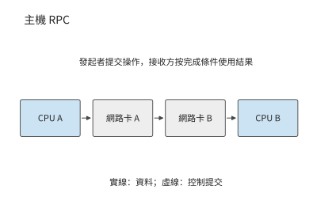

*圖 7-15：主機 RPC 的參數從 CPU A 所在主機出發，經網路卡和網路到達 CPU B 所在主機，由遠端執行請求。箭頭表示參數資料路徑，返回結果沿反方向傳送。*

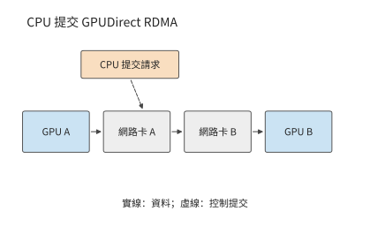

*圖 7-16：資料從 GPU 記憶體直接經過網路卡到達遠端 GPU 記憶體；虛線表示 CPU 提交請求，資料載荷無需經過 CPU 記憶體。對映和訪問許可權預先建立。*

資料繞過主機記憶體之後，還可以進一步改變由誰發起。圖 7-17 中 GPU 自己發起對端記憶體存取，省去了每次都由 CPU 提交的交接。

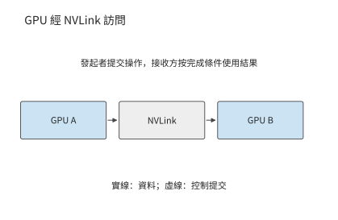

*圖 7-17：GPU 透過 NVLink 訪問對端 GPU 記憶體，由發起的 GPU 執行已授權的訪問。*

圖 7-18 把同樣的發起與完成關係放到 UB 的非同步訪問介面上。沿實線追蹤載荷，沿提交與完成關係追蹤控制，便能區分資料傳輸和請求管理各自的開銷。

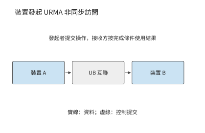

*圖 7-18：裝置透過 URMA 提交非同步讀寫，載荷經過 UB 互聯到達目標裝置；請求完成後按介面規定檢查完成狀態和結果。*

這一變化可以用第 7.2 節的傳輸時間公式解釋。沿用第 7.2.2 節 50 GB/s 鏈路 (Link)的算例，8 KiB 資料的傳輸時間約為 0.16 μs；若啟動時間從 5 μs 縮到 2 μs，總時間就從約 5.2 μs 降到 2.2 μs，節省一半以上。64 MiB 的載荷本身要傳約 1.3 ms，同樣節省的 3 μs 就微不足道。因此，小資料量的傳輸應優先減少提交開銷，大資料量的傳輸應優先提高頻寬。

由主機統一組織通訊，好處是能為各種程式提供通用的提交和完成處理機制。模型執行中，資料的生產者、消費者和就緒條件都很明確，因此可以把頻繁的發起和完成處理放到裝置一側：系統預先建立地址對映和訪問許可權，之後由裝置連續發起計算與通訊，不必每次都經主機中轉。收益就是上例中啟動時間的縮短。

作業系統負責建立對映、設定許可權和分配資源；裝置負責已經授權的快速操作；完成通知把操作結果交回執行時。職責這樣劃分之後，裝置上發起通訊的執行緒本身也會限制吞吐量。要分析這種限制，先要分清一次請求要等多久、等待期間能否發起其他請求，再計算單位時間內能處理多少項請求。

### 7.3.3 記憶體語義：Load／Store 與 Read／Write

要分清這兩項，先區分訪問的表達方式。遠端訪問有兩種常見表達：處理器的讀取／寫入指令（Load／Store），以及顯式的非同步讀取／寫入請求（Read／Write）。兩種方式都需要記錄尚未完成的請求，區別在於由誰管理這些記錄。

Load 的結果可以直接成為後續指令的輸入。處理器記錄這條依賴，並在等待期間執行其他獨立指令。非同步請求則把目標地址、長度和完成條件放入佇列，軟體可以連續提交多項工作，在使用結果之前等待相應請求完成。前者把依賴交給指令執行機制，後者把依賴交給事件和執行時。本書把 Load／Store 稱為同步訪問，是強調指令依賴由硬體管理，並非指處理器每次只能有一個訪存在途；現代處理器可以並行執行多個獨立 Load，Store 也可以先進入緩衝區。

| 比較項 | Load／Store | 非同步 Read／Write |
|---|---|---|
| 發起與路徑 | 處理器指令，經地址對映到可達記憶體；UB 可由片上控制器承接 | 提交地址、長度等請求；經佇列、門鈴或裝置發起介面推進 |
| 依賴與完成 | 硬體跟蹤 Load 的消費者；Store 的遠端可見性另需順序保證 | 執行時等待規定的完成事件，再使用結果或回收緩衝 |
| 常見適用範圍 | 細粒度讀取、指標訪問、訪問頻繁且需要低提交開銷的資料 | 啟用、KV、權重等批次搬移及顯式流水 |
| 並行限制 | 指令依賴、未完成訪存槽位、地址轉換與硬體資源 | 請求佇列、完成佇列、註冊記憶體、軟體或裝置的提交能力 |
| 故障處理 | 依賴平臺的超時、異常及記憶體故障機制 | 可按請求報告錯誤；仍須處理超時、部分寫入和緩衝回收 |

兩種介面都可以採用記憶體語義，但不能僅憑介面名稱推斷快取一致性。單邊 Read／Write 不要求遠端應用逐次提交接收請求（Receive）來配對，仍需要事先授權和記憶體有效期；Load／Store 也不保證跨節點共享快取自動一致。OpenURMA 實現的 Load／Store 路徑不維護跨節點的快取一致，寫入、釋出、讀取之間的依賴由應用自己安排。其省去的 PCIe 往返來自控制器位置和請求路徑的改變，把軟體介面改名為 Load 並不能得到同樣的收益。[^ub-design]

**一次遠端讀取的延遲分解。** 把一次 64 B 遠端讀取的關鍵路徑拆成若干階段，為每個階段給定延遲，各階段之和就是這次讀取的總時間。這裡比較三條路徑：經 PCIe 外設網路卡的非同步讀取，經片上匯流排控制器的非同步讀取（UB 的 URMA 介面），以及經片上匯流排控制器的 Load 指令。給定條件如下：一次片上匯流排穿越 30 ns；一次 PCIe 門鈴寫 150 ns，一次 PCIe DMA 讀 500 ns、寫 250 ns；線路單程 100 ns；目標端記憶體行命中（要讀的資料所在的 DRAM 行已經開啟）30 ns；網路卡管線 (Pipeline)按 322 MHz 時鐘的週期數換算，外設網路卡 9 個週期，UB 非同步路徑 25 個週期，Load 路徑 8 個週期；介面庫提交、構造請求描述符和輪詢完成記錄屬於軟體開銷。下表按關鍵路徑的先後列出各階段，空格表示該路徑沒有這個階段。

| 階段 | 類別 | PCIe 外設網路卡 | UB 非同步讀取 | UB Load |
|---|---|---:|---:|---:|
| 介面庫提交 | 軟體提交 | 50 | 50 | |
| 構造請求描述符 | 軟體提交 | 30 | 30 | |
| 門鈴寫 | PCIe 穿越 | 150 | | |
| 網路卡 DMA 讀取描述符 | PCIe 穿越 | 500 | | |
| 片上匯流排提交 | 片上匯流排 | | 30 | 30 |
| 網路卡傳送管線 (Pipeline) | 網路卡管線 (Pipeline) | 28 | 78 | 25 |
| 線路去程 | 線路 | 100 | 100 | 100 |
| 目標端網路卡接收管線 (Pipeline) | 網路卡管線 (Pipeline) | 28 | 78 | 25 |
| 目標端網路卡 DMA 讀主機記憶體 | PCIe 穿越 | 500 | | |
| 目標端片上匯流排訪存 | 片上匯流排 | | 30 | 30 |
| 目標端記憶體行命中 | 記憶體與完成 | 30 | 30 | 30 |
| 目標端網路卡傳送響應 | 網路卡管線 (Pipeline) | 28 | 78 | 25 |
| 線路回程 | 線路 | 100 | 100 | 100 |
| 網路卡接收響應 | 網路卡管線 (Pipeline) | 28 | 78 | 25 |
| 響應載荷 DMA 寫 | PCIe 穿越 | 250 | | |
| 完成記錄 DMA 寫 | PCIe 穿越 | 250 | | |
| 片上匯流排完成 | 片上匯流排 | | 30 | 30 |
| 完成佇列輪詢 | 記憶體與完成 | 70 | 5 | |
| 介面庫輪詢 | 記憶體與完成 | 30 | 30 | |
| 序號分配序列化 | 記憶體與完成 | 50 | | |
| **合計（推導）** | | **2222** | **746** | **419** |
| 模擬測得 | | 2236 | 757 | 500 |

表中網路卡管線 (Pipeline)的時間已經取整，合計按取整前的值相加。經 PCIe 外設網路卡的路徑合計 2222 ns，其中五次 PCIe 穿越佔 1650 ns；UB 非同步路徑沒有 PCIe 階段，合計 746 ns；Load 路徑連軟體提交和輪詢也省去了，合計 419 ns。圖 7-19 把三條路徑按階段類別畫成堆疊條形。筆者的 OpenURMA 實現在兩節點週期級模擬中、相同條件下測得 2236、757 和 500 ns，與推導值相差 14、11 和 81 ns。差值來自模擬器在模組之間傳遞資料的固定開銷；Load 路徑的階段最少、總時間最短，這項開銷所佔的比例也就最大。[^ub-fabric]

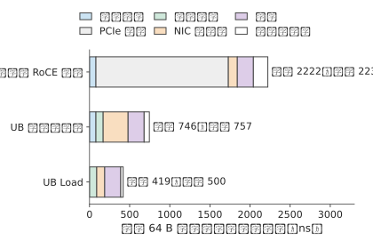

*圖 7-19：三條路徑的關鍵路徑按階段類別堆疊。經 PCIe 外設網路卡的路徑中，淺灰色一段是五次 PCIe 穿越；兩條片上匯流排路徑沒有這一段，Load 路徑還省去了軟體提交和完成輪詢。條形右側標出推導值和模擬值。*

PCIe 外設網路卡多出的階段，不是九處各自可以最佳化的低效環節，而是三個結構性原因造成的。第一，請求必須先寫成主機記憶體裡的描述符，再由網路卡讀取，因此有介面庫提交和構造描述符兩個階段；第二，網路卡和處理器各有自己的地址空間，因此有門鈴寫、描述符 DMA 和目標端 DMA 三個階段；第三，操作完成後必須跨地址空間通知處理器，因此有響應 DMA、完成記錄 DMA 和兩次輪詢。控制器接到片上匯流排上以後，第二類階段合併成一次片上匯流排穿越；改用 Load 指令以後，處理器自身的依賴跟蹤取代了完成通知機制，第一類和第三類階段隨之消失。

還有第四條路徑：網路卡仍是 PCIe 外設，但請求描述符由網路卡內的處理器構造並取用，即第 6.4.4 節的第三種發起位置。按同一張表推算，這條路徑省去門鈴寫和網路卡 DMA 讀取描述符兩次穿越，共 650 ns；軟體提交與構造請求描述符的 80 ns 改在網路卡處理器上完成，按同樣取值計；載荷 DMA 寫、完成記錄 DMA 寫和目標側的 DMA 讀仍然保留。合計約 1572 ns，落在外設式的 2222 ns 與片上匯流排路徑的 746 ns 之間。省去的是控制路徑上的穿越，省不去的是資料和完成通知必須跨越兩個地址空間。這條路徑沒有做模擬，只按表中取值推導。

線路時延變化時，三條路徑的差距也隨之變化。每條路徑的總時間都等於固定開銷加上兩倍的線路單程時延 $L$：PCIe 外設網路卡為 2022 ns 加 $2L$，UB 非同步路徑為 546 ns 加 $2L$，Load 路徑為 219 ns 加 $2L$。圖 7-20 畫出 $L$ 從 50 ns 到 500 ns 的情形：三條直線斜率相同、截距不同，絕對差距始終約為 1.8 μs，相對差距則從 $L=100$ ns 時的 5.3 倍縮小到 $L=500$ ns 時的 2.5 倍。線路越短，控制器位置帶來的相對收益越大，所以這項收益在超節點內部最明顯；在跨越資料中心的長鏈路 (Link)上，線路時延本身成為總時間的主要部分。這兩部分性質不同。$2L$ 由訊號傳播速度決定，任何路徑都省不掉，是一次遠端讀取的物理下限；截距中高出 Load 路徑的部分是抽象層的代價，其中五次 PCIe 穿越就佔 1650 ns。推導值與模擬值相差的 14、11 和 81 ns，則屬於第 1.3.4 節所說的第一類差距：模型漏計了模擬器模組之間的固定開銷，補上這一項差距就消失了，不必再去找實現開銷。

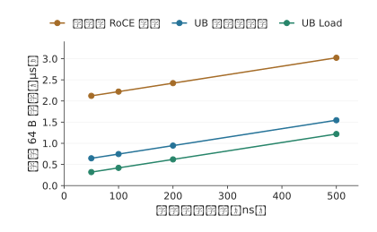

*圖 7-20：一次 64 B 讀取的總時間隨線路單程時延的變化。三條直線的斜率都是 2，截距是各自的固定開銷；路徑之間的差距來自固定開銷，不隨線路時延變化。*

下面用相同的存取延遲比較並行和依賴，再討論資料複用。前者適用於兩類介面，後者是「按需遠端訪問還是預先搬回本地」的放置選擇；直接遠端讀取不等於 Load，預先搬回也不對應某一種特定介面。

考察八個互不依賴的遠端讀取，硬體能同時處理八項，每項按上表經 PCIe 外設網路卡的路徑要等約 2.2 μs，提交開銷已計在其中。逐個「發出、等待、使用」要約 17.8 μs；八項一起發出，結果約 2.2 μs 後一起到達。若第一次讀取返回的是第二次的地址，第二次又返回第三次的地址，就只能等上一次返回後再發下一次。能同時發起多少次讀取，取決於有多少個地址已知且互不依賴的請求。

並行讀取利用了不同請求之間的獨立性。如果多次請求訪問的是同一份資料，還可以利用另一種關係：第一次訪問時將資料搬到本地，後續讀取反覆使用該副本。假設消費者將完整讀取一個 144 MiB 的不變 KV 快照，本地有足夠空間容納它。遠端讀取和搬回都經過本章的網路卡，每方向 50 GB/s；本地讀取按 H100 的 HBM 頻寬 3350 GB/s 計。計入啟動與目的端寫入，一次遠端讀取約為 3.02 ms，一次搬回的固定成本約為 3.07 ms，之後每次本地讀取約為 0.046 ms。[^remote]

令複用次數為 $r$，兩條路徑的時間近似為

$$
T_{\mathrm{remote}}=3.02r\ \mathrm{ms},\qquad
T_{\mathrm{stage}}=(3.07+0.046r)\ \mathrm{ms}.
$$

搬回後讀取更快的條件是 $r>3.07/(3.02-0.046)\approx1.03$，即從第二次完整讀取開始獲益。只讀取一次時，直接遠端讀取略快（3.02 ms 對 3.12 ms）；讀取四次時，先搬回本地可將總時間從約 12.1 ms 縮短至 3.3 ms，網路只需傳一次快照，傳輸量從 576 MiB 降至 144 MiB。圖 7-21 畫出兩種使用路徑，圖 7-22 畫出累計耗時的交點。

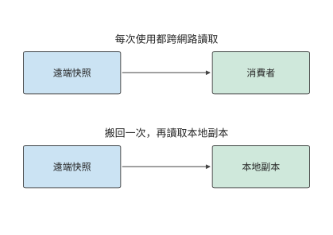

*圖 7-21：每次使用都訪問遠端，會重複傳送同一份資料；下半圖先搬回本地，再多次複用。兩種路徑處理同一份不變快照。*

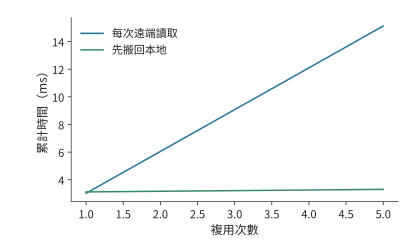

*圖 7-22：每次讀取完整 144 MiB 快照時，兩種方法的累計耗時。先搬回本地需要一次固定成本，從第二次讀取開始節省時間。*

兩條曲線的差別來自「先付一次搬移成本，還是每次都跨網路讀取」。接下來改變每次讀取的範圍。若一次呼叫只訪問快照的少量位置，就可以按引用傳遞，讓遠端函式按需讀取資料。設每次僅訪問快照的 10%，而搬回方案仍復制全部快照。此時，按需遠端讀取的成本變為約 $0.302r$ ms，搬回後每次本地訪問約為 0.0046 ms，交點約在 10.3 次，因而從第 11 次讀取開始，先搬回本地的方案才會節省總讀取時間（圖 7-23）。

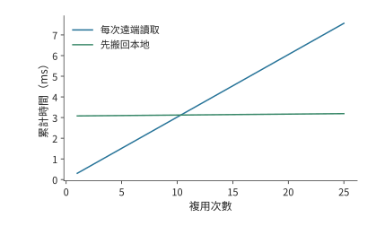

*圖 7-23：每次遠端讀取和本地讀取都只訪問 10%，但搬回時仍復制全部快照；因此需要更多複用才能抵消固定成本。*

因此，應根據訪問範圍和複用次數，決定按需遠端讀取還是將整個快照搬回本地。URPC 是統一互聯上的遠端過程呼叫介面，以函式呼叫的形式提供遠端訪問，支援這種方式；按引用傳遞讓被呼叫方只取實際需要的資料。第 7.4 節將說明何時通知其他裝置使用這些物件，以及何時釋放物件佔用的空間。[^ub]

### 7.3.4 並行與吞吐量模型

第 7.3.3 節用複用減少遠端讀取的次數；仍要經過網路的請求，則要讓鏈路 (Link)始終有資料可傳。本節分析本章算例中一張網路卡每方向 50 GB/s 的路徑需要多少個並行請求。**請求槽位**是儲存一項未完成請求的地址、長度和狀態的記錄：提交時分配，完成狀態處理完後釋放，釋放前不能供新請求使用。假設每次遠端訪問傳輸 256 B，從發起請求到釋放請求槽位需要 2 μs。鏈路 (Link)在這 2 μs 內可以傳送 100,000 B，相當於 390.6 次訪問的資料量。為了讓等待期間始終有資料可傳，至少要維持 391 個在途事務，即已發出但尚未處理完的請求。圖 7-24 畫出一個槽位從分配到釋放的過程。

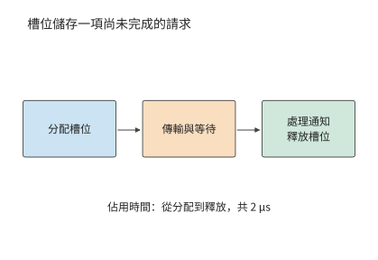

*圖 7-24：一項請求從分配記錄開始佔用槽位，經歷傳輸與等待，完成狀態被處理後歸還記錄。這裡的 2 μs 覆蓋完整佔用區間。*

一般地，每事務載荷為 $m$，槽位佔用時間為 $T$，目標頻寬為 $B$，所需並行為

$$
N\ge\left\lceil\frac{BT}{m}\right\rceil.
$$

**頻寬—時延積**是目標頻寬與等待時間的乘積，表示在等待期間持續利用鏈路 (Link)所需的在途資料量。再除以每事務載荷，就得到請求數量。鏈路 (Link)越快，等待越長，每次返回的資料越少，系統就需要同時記錄更多尚未完成的請求。

**例題 7.3：遠端讀取的在途槽位不足，為何無法用滿出口頻寬？** 每個事務傳輸 256 B，佔用槽位 2 μs，路徑頻寬為 50 GB/s。求使用 128 個活躍槽位時的有效讀取頻寬；再設請求處理單元連續兩項事務的最短啟動間隔為 18.6 ns（本節後文 RoCE 可靠連線實現的取值），求同時受槽位數量與啟動速率限制時的有效頻寬上界。

解答：128 個槽位每 2 μs 週轉一次，提供的載荷為 $128\times256$ B，因此最多約為 16.4 GB/s。若只讓一個事務在途，則為 0.128 GB/s。分配了多少槽位與實際同時使用多少槽位，是兩個不同的數量。

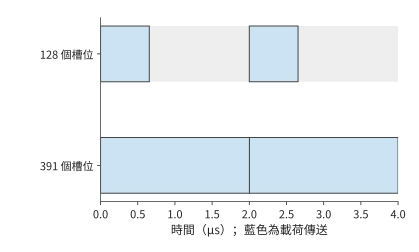

*圖 7-25：128 個槽位在約 0.66 μs 內全部用完，要等最早的槽位在 2 μs 釋放後繼續提交。391 個槽位足以覆蓋等待。藍色表示載荷傳送，灰色表示鏈路 (Link)空閒。*

圖 7-25 的灰色區間來自槽位尚未釋放；即使槽位足夠，請求也可能來不及提交。請求處理單元若每 18.6 ns 啟動一項事務，每秒最多啟動約 5400 萬項，256 B 事務只能提供約 13.7 GB/s，比 128 個槽位給出的 16.4 GB/s 還低。即使增加到 391 個槽位，請求處理單元也來不及按這個速度提交請求。將路徑頻寬、在途請求數與啟動速率三項約束合併，得到

$$
B_{\mathrm{eff}}\le
\min\left(B_{\mathrm{path}},\frac{Nm}{T},\frac{m}{\delta}\right),
$$

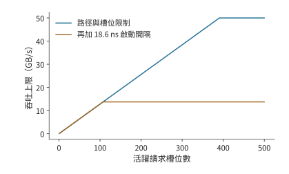

*圖 7-26：藍線只考慮鏈路 (Link)和槽位，橙線再加入每 18.6 ns 發起一次請求的約束。增加槽位使藍線升高，橙線仍受約 13.7 GB/s 的提交速率限制。*

其中，$T$ 是一項請求佔用槽位的時間，$\delta$ 是連續兩項請求之間的最短啟動間隔。前者決定槽位多久可以複用，後者決定每秒最多能發起多少請求。圖 7-26 對比了只考慮槽位與再加上發起速率約束時的有效頻寬。[^window]

**討論：遠端讀取需要多少並行才能達到 50 GB/s？** 保持 256 B 事務，啟動間隔需縮至 $256/(50\times10^9)=5.12$ ns，比下文 UB 實現的 6.2 ns 還短，並至少維持 391 項在途工作。另一條路是合併相鄰訪問：每次傳輸改為 4 KiB 後，啟動間隔只要不超過 82 ns 就能達到 50 GB/s，18.6 ns 的間隔對應約 220 GB/s，遠超鏈路 (Link)；在等待時間為 2 μs 時，只需 25 個槽位就能支援 50 GB/s。前者提高事務率，後者讓每次請求傳輸更多資料，降低單位位元組的提交開銷。

啟動間隔 $\delta$ 的一個具體來源見 OpenURMA 的實現：傳送管線 (Pipeline)中最慢的一級每 2 個時鐘週期接受一項請求，在 322 MHz 下 $\delta\approx6.2$ ns，每秒最多約 1.61 億項請求。用同一工具鏈實現的 RoCE 可靠連線對照中，每條連線的序號分配存在先後依賴，每項請求要佔 6 個週期，$\delta\approx18.6$ ns，每秒約 0.54 億項。模擬用 256 項的連續突發測得的持續速率分別為每微秒 150 項和 54 項：RoCE 與推導的 53.7 項一致，UB 比推導的 161 項低約 7%；突發加長到 1000 項時，UB 升到每微秒約 159 項，與推導值相差約 1%。代入 $m/\delta$：每項 64 B 時兩者分別為 10.3 GB/s 和 3.4 GB/s，每項 4 KiB 時為 660 GB/s 和 220 GB/s，後兩個數都遠高於本章 400 Gbit/s 網路卡每方向的 50 GB/s。即小載荷時瓶頸在請求速率，大載荷時瓶頸才線上路。[^ub-fabric]

**讀與寫為什麼受不同限制。** 式中的 $N$ 和 $\delta$ 在 PCIe 上有明確的來源。PCIe 是分組交換的匯流排，每次 DMA 讀或寫都是一個事務層報文（TLP）。寫是 posted 事務：報文帶著地址和資料發出，發出即完成，不等回應。讀是 non-posted 事務：請求報文帶一個標籤發出，資料由一個或多個完成報文帶回，靠標籤對應到原來的請求。發起方同時在途的讀請求數受兩項限制：接收方為每類事務預先發放的信用，以及發起方能分配的標籤數。圖 7-27 畫出兩種事務。

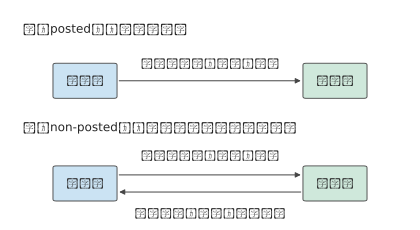

*圖 7-27：寫是 posted 事務，一個報文發出即完成；讀要先發帶標籤的請求報文，再等帶同一標籤的完成報文把資料送回，在途的讀不能超過標籤數和信用數。*

信用與標籤的限制在實際平臺上就能觀察到。筆者在 KV-Direct 中測量過這兩項限制。所用的可程式設計網路卡經 PCIe Gen3 x8 訪問主機記憶體，理論頻寬 7.87 GB/s；每個 64 B 的 DMA 讀寫都要帶 26 B 的報文頭和填充，按報文開銷算的上限是 5.6 GB/s，即每秒 8700 萬次操作。隨機 DMA 讀的往返約 1050 ns，要用滿鏈路 (Link)需要 92 個讀同時在途；但主機端為 DMA 讀發放的信用只有 84 個，FPGA 的 DMA 引擎又只支援 64 個標籤，於是在途讀最多 64 個，除以 1050 ns 的往返，上限約為每秒 6100 萬次；實測 64 B 隨機讀每秒 6000 萬次，與這個上限基本一致。寫不需要回應、不佔標籤，實測接近報文開銷給出的上限。圖 7-28 把這幾道上限畫在一起：讀受在途數限制，寫受報文處理速率限制，正是式中 $Nm/T$ 與 $m/\delta$ 兩項分別起作用的例子。讓網路卡自己流水式地完成地址計算、訪存和結果處理，就是為了在等待一個讀結果時繼續發出其他請求。這組數字也體現了第 1.3.4 節的檢查順序：先後用鏈路 (Link)頻寬、報文開銷、在途標籤三道上限修正模型，直到與實測只差約 1.6%；到這一步，模型已無漏項，餘下的差距不必再追究。[^kv-direct]

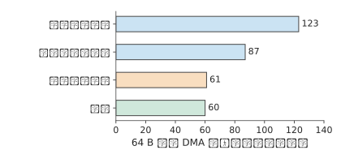

*圖 7-28：KV-Direct 平臺上 64 B 隨機 DMA 讀的上限與實測。鏈路 (Link)頻寬換算為每秒 1.23 億次，報文頭開銷把上限壓到 8700 萬次，64 個標籤除以 1050 ns 往返只允許 6100 萬次；實測 6000 萬次，說明在途標籤數是這個平臺上讀的瓶頸。*

同一條 PCIe 鏈路 (Link)被兩類流量共用時，這一差別會變成不對稱的爭用。設 GPU 的 PCIe 鏈路 (Link)在進入 GPU 的方向上同時有兩路流量：網路卡把遠端資料以 posted 寫直接送進 GPU 記憶體；GPU 的複製引擎正在把主機記憶體的資料複製到 GPU，它發出的是讀請求，資料以完成報文回到 GPU。鏈路 (Link)一旦飽和，posted 寫按協議必須持續推進，而讀這一方的在途標籤用完後就發不出新請求，只能等完成報文回來，分到的頻寬遠小於一半。離開 GPU 的方向則不同：GPU 向主機的複製是 GPU 發出的 posted 寫，遠端讀 GPU 記憶體則要 GPU 回覆完成報文，兩路都要先從 HBM 取出資料、再經 GPU 的傳送通路送上鍊路，瓶頸在 GPU 內部而不在鏈路 (Link)，兩路的退化更接近。圖 7-29 畫出兩個方向。判斷這類爭用時，先分清每一路是 posted 寫還是帶完成的讀，再看它們在鏈路 (Link)的哪一側、經過哪個共用部件匯合。後來的 PCIe 效能測試工具 rPCIeBench 對共享 PCIe 路徑的研究也顯示，在途工作量與入口競爭會改變頻寬分配。[^pcie] 可以用上式判斷瓶頸：是鏈路 (Link)頻寬已用盡，是請求槽位尚未釋放，還是請求發起速率太低。

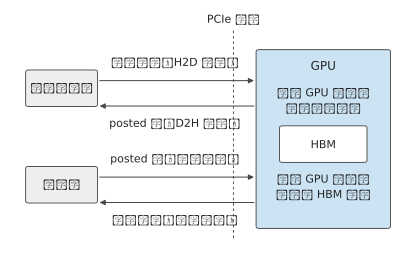

*圖 7-29：進入 GPU 的方向上，網路卡的 posted 寫與主機記憶體返回給複製引擎的完成報文爭用鏈路 (Link)，前者不等回應，後者受在途標籤限制。離開 GPU 的方向上，D2H 複製的 posted 寫與遠端讀取的完成報文都要先從 HBM 取數，共用 GPU 內部的傳送通路。*

分層歸約減少了跨伺服器載荷，並行提交讓網路連續傳輸；程式還需要知道何時可以使用這些資料，以及何時可以釋放佔用的空間。

> **實驗 7-8 · 延伸：用滿遠端讀取頻寬需要多少在途事務**
>
> 在例題 7.3 中，將槽位的佔用時間從 2 μs 增為 4 μs；該時間從請求發出算起，到槽位可以複用為止。分別求每次傳輸 256 B 和 4 KiB 時，維持目標頻寬所需的在途事務數。固定 18.6 ns 啟動間隔，求達到 50 GB/s 所需的最小事務大小；再換成 UB 實現的 6.2 ns 重算。最後將獨立地址改成指標鏈，解釋完成整條指標鏈的讀取所需時間如何隨鏈長增長。

## 7.4 資料交接、順序與狀態管理

### 7.4.1 資料分片的生成、使用與緩衝區複用

資料送到以後，接收方可能還沒開始用，也可能正在使用。這像把裝有材料的托盤交給下一道工序：托盤已經送到，對方仍需要時間處理其中的材料，在用完之前不能把托盤中的材料換成下一批。對應到通訊，傳送完成、資料對接收方可見、接收方消費完成，需要分別判斷。第 7.3.4 節把槽位佔用時間當作已知條件，本節沿這些事件確定緩衝區何時可以釋放。

在分層歸約中，卡 0 將本地分片交給卡 8，卡 8 把它與自己的分片相加。傳送方要知道源緩衝何時可以改寫，接收方要知道目的緩衝何時可以讀取，下一次寫入還要知道這塊目的緩衝何時可以覆蓋。三者對應不同的事件。

一份分片從生成到釋放，要經過以下過程：生成資料、寫入遠端、使資料對接收方可見、發出就緒通知、讀取並處理資料，最後釋放空間。源緩衝能否複用，要看介面的完成語義是否保證傳輸不再讀它；接收方要開始用資料，先要保證寫入對它已經可見，並按約定釋出和檢視就緒通知；目的緩衝能否覆蓋，還要等接收方用完其中的資料。網路傳輸完成本身不能代替「用完了」的通知。

例如，傳送在 5 μs 完成，消費者在 8 μs 開始讀取、12 μs 結束。傳送方在傳送完成後就可以複用源緩衝，目的緩衝則要到 12 μs 才能覆蓋。如果下一次寫入在 6 μs 覆蓋目的地址，消費者讀到的就是下一份資料；網路傳輸的每個位元組都正確，接收程式卻使用了錯誤的資料。

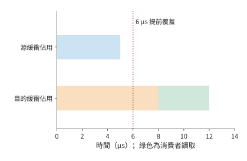

*圖 7-30：源緩衝佔用到 5 μs 傳送完成；目的緩衝持續佔用到 12 μs 消費者用完。綠色為 8–12 μs 的讀取區間。虛線標出 6 μs 提前覆蓋目的地址的錯誤操作。*

圖 7-30 中兩條佔用區間結束於不同事件。把「必須等哪個事件發生」畫成箭頭，就得到描述正確交接的依賴圖：節點表示工作，邊 $u\to v$ 表示 $v$ 必須在 $u$ 完成後開始。對每個節點，取所有前驅的最晚完成時刻，再加自身執行時間，就得到其完成時刻；從起點到終點耗時最長的那條鏈就是關鍵路徑。

這一模型同時解釋正確性與效能。缺少「資料可見→發出通知」的依賴會讓消費者讀到未釋出的資料；多出「無關傳輸也必須等待」的邊會增加等待。狀態管理的任務，是記錄哪些節點已經完成、哪些依賴已經滿足，以及哪些資源可以歸還。

緩衝區的歸屬也影響複製次數。通訊庫若為傳送另設一塊已註冊的緩衝區，計算結果就要先複製進去，後設資料還要與資料打包，接收方再拆開、搬到連續的區域，這些複製和打包都佔用 SM 時間。讓計算直接寫入已註冊的緩衝區可以省去這一步，但本節的事件順序隨之變嚴：計算寫完並對網路卡可見之後才能發起傳送，傳送真正結束之前不能覆蓋這塊緩衝，接收方也要按同樣的規則判斷何時可以讀、何時可以回收。[^ep-buffer]

### 7.4.2 事務層與傳輸層分離：Jetty 與共享狀態

這些依賴和完成狀態需要由系統儲存。每增加一條通訊關係，是否都要再儲存一套相同的傳輸記錄？十六個參與者之間的歸約只涉及少量通訊關係。系統擴充套件後，一個程序有多個執行緒，每個執行緒又訪問多個遠端目標，關係數量便按乘積增長。應用需要記錄誰提交了請求、完成通知應傳送給誰；傳輸層需要維護序號、確認、重傳和擁塞狀態。前者標識應用，後者保證資料可靠傳輸。

**應用端點**是程式提交通訊和接收完成通知的邏輯身份；**傳輸狀態**則儲存序號、確認、重傳與傳送速率等通訊進度。取 64 個應用端點，每個訪問 128 個遠端目標，共有 8192 條關係。如果為每條關係單獨儲存一份 1 KiB 的傳輸狀態，僅傳輸部分就佔 8 MiB。若指向同一目標的關係共享一份傳輸狀態，只需 128 份，共 128 KiB。節省的是為同一目標的不同通訊關係分別儲存的傳輸狀態。

應用身份仍需保留。每個端點佔 256 B，共 16 KiB；每條關係的繫結資訊佔 64 B，共 512 KiB。加上這些部分，逐關係獨佔的狀態總量約為 8.52 MiB，按目標共享約為 0.64 MiB。傳輸狀態的份數降至原來的 1/64，狀態總量降至原來的約 1/13。[^states]

設端點數為 $L$、目標數為 $P$，每個端點、每條關係的繫結資訊和每份傳輸狀態分別佔 $e,r,t$ bytes，則

$$
S_{\mathrm{private}}=Le+LP(r+t),\qquad
S_{\mathrm{shared}}=Le+LPr+Pt.
$$

OpenURMA 論文用另一種口徑描述這種分離：一個本地介面上有 $L$ 個應用端點、要訪問 $P$ 臺遠端主機時，核心的端點記錄和傳輸上下文按 $O(L+P)$ 增長；如果每條應用關係都獨佔一條可靠連線，這部分就按 $O(LP)$ 增長。這一結論只針對可以共享的核心硬體狀態，軟體對映、許可權、未完成請求和快取並不都只佔加法量級的空間。上式保留了 $LPr$ 一項，因為本教學方案顯式計入了逐關係的繫結記錄；本小節末尾再用實現中的記錄尺寸重新計算一次。[^ub-design]

兩個式子直接給出了共享節省的空間：$LPt$ 變成 $Pt$，應用關係的 $LPr$ 仍在。UB 把 Jetty 與傳輸通道分開（第 6.5.5 節），採用的就是這種設計：同一份傳輸狀態可以服務多條應用關係。[^ub]

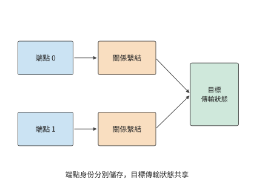

*圖 7-31：兩個應用端點分別儲存身份與繫結記錄，關係繫結指向同一目標的共享傳輸狀態。共享部分維護傳輸進度，端點仍能區分各自請求。*

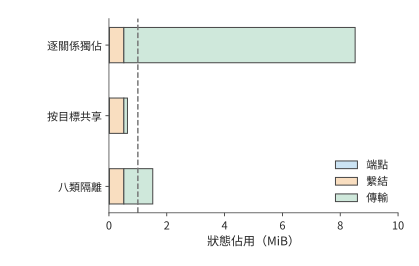

*圖 7-32：64 個端點訪問 128 個目標。藍色為端點記錄，橙色為關係繫結，綠色為傳輸狀態。虛線為 1 MiB 容量；劃分八個隔離組時，為各目標儲存八份獨立的傳輸狀態。*

圖 7-31 中多條關係複用同一份傳輸狀態，節省了儲存，也可能爭用這條通道的傳送視窗、排程機會和恢復資源。分層不要求所有事務排進一條全域性有序的佇列，應用事務的執行順序、完成順序與報文到達順序仍要分別規定。若實現裡用共享的先進先出佇列或順序等待，丟包和長請求就會造成隊頭阻塞（head-of-line blocking，隊首的請求停住時，排在後面的無關請求也只能等待）；讓獨立的事務繼續推進可以縮小影響，但消不掉對共享頻寬和視窗的競爭。一條通訊關係的大量未完成請求佔用共享佇列，其他關係的短請求就必須等待。若為不同業務建立 $K$ 組獨立的傳輸狀態，總狀態變成

$$
S(K)=Le+LPr+KPt.
$$

按上述配置計算，固定部分為 528 KiB，每增加一組獨立傳輸狀態，就增加 128 KiB。1 MiB 的儲存空間最多容納三組獨立傳輸狀態；四組需要 1040 KiB，已經超出容量；八組約需 1.52 MiB。圖 7-32 畫出這幾種共享策略的狀態容量。因此，業務隔離需要在儲存容量內安排：為關鍵業務單獨分配傳輸狀態，讓其他業務共享，可以減少關鍵業務受到的干擾。

除了在不同關係之間共享，狀態還可以分層儲存。完整狀態放在主存，頻繁使用的部分快取在網路卡片上。共享可以減少重複記錄，使同樣大小的快取容納更多通訊關係。經常使用的狀態留在快取中，也就減少了從主存讀取狀態的次數。這樣，節省狀態空間還可以降低請求處理開銷。

**實現中的記錄尺寸與狀態總量。** 前述 256、64 和 1024 B 是本節給定的取值。OpenURMA 實現的狀態結構給出了一組可以核對的尺寸：每個 Jetty 20 B，每個已註冊的記憶體段 32 B，每條傳輸通道 56 B；作為對照的 RoCE 可靠連線實現為每條連線儲存 512 B 的 QP 上下文。設本地 $N$ 個端點訪問 $M$ 個遠端端點，兩種組織方式下網路卡儲存的狀態為

$$
S_{\mathrm{pair}}=512NM+32N,\qquad
S_{\mathrm{UB}}=52N+56M.
$$

與前面的公式對照，這裡 $e=52$、$t=56$，而 $r=0$：該實現把關係繫結放在軟體對映裡，網路卡不為每條關係儲存硬體狀態。$N=M=1024$ 時，逐對連線需要約 512 MiB，端點加通道只需 108 KiB，相差約 4855 倍；即使把 Jetty 記錄補齊規範中的全部欄位（48 B），比值仍在三千倍以上。圖 7-33 用對數座標畫出兩條曲線：一條斜率為 2，一條斜率為 1，二者的比值隨 $N$ 線性增長。

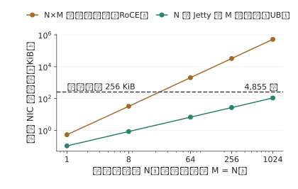

*圖 7-33：N 個本地端點訪問 M = N 個遠端端點時，兩種組織方式下網路卡儲存的狀態。逐對連線在 N 略大於 20 時就超過 256 KiB 的片上快取，端點加通道到 N = 1024 時仍不到快取的一半。*

**狀態總量與片上快取溢位。** 網路卡把上下文快取在片上，容納不下的部分留在主機記憶體。取快取容量 256 KiB，逐對連線在 $512N^2+32N>262144$、即 $N\ge23$ 時溢位；端點加通道在 $108N>262144$、即 $N\ge2428$ 時溢位。溢位以後每次操作都要重新讀取上下文，代價取決於上下文放在哪裡：PCIe 外設網路卡從主機記憶體讀取，發起端和目標端各做一次 PCIe DMA 讀，每次操作增加約 1000 ns；片上匯流排控制器從本地記憶體讀取，兩端各做一次片上匯流排穿越和一次記憶體存取，增加約 200 ns。圖 7-34 把第 7.3.3 節推導的兩條路徑的延遲畫成活躍端點數的函式。訓練中的全交換通訊通常涉及幾十到幾千個端點，正好落在這一區間；在這一區間裡，逐對連線的每次讀取都要付出重新讀取上下文的代價。筆者的模擬器按條目數而不是位元組數判斷溢位（RoCE 512 條，UB 2048 條），因此把 UB 的溢位點放在 1024 個端點；兩種口徑下結論相同：端點加通道的溢位點晚一個數量級以上，溢位後的代價也小一個數量級。[^ub-fabric]

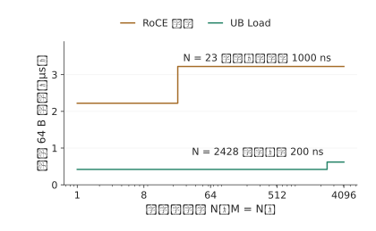

*圖 7-34：一次 64 B 讀取的延遲隨活躍端點數的變化，片上快取 256 KiB。逐對連線在 23 個端點處上升 1000 ns，端點加通道在 2428 個端點處上升 200 ns。橫軸為對數座標。*

> **實驗 7-9 · 延伸：共享傳輸狀態能支援多少隔離組**
>
> 保持 64 個端點，只訪問一個遠端目標，分別計算獨佔與共享傳輸狀態時所需的總儲存空間。再將活躍目標數量改為 128 個，將可用儲存空間提高到 2 MiB，求最多容納多少個完整的隔離組。比較增加端點數和增加目標數對固定狀態與傳輸狀態的影響。最後改用實現中的記錄尺寸（Jetty 20 B、傳輸通道 56 B、連線上下文 512 B），求片上快取為 1 MiB 時兩種組織方式各自的溢位端點數。

### 7.4.3 操作依賴與故障隔離

第 7.4.2 節透過獨立傳輸組減少不同業務之間的干擾。同一組操作內部也可能出現不必要的等待，這取決於系統強制哪些操作依次完成。以卡 0 釋出分片的過程為例。操作 A 寫資料 D，操作 B 釋出「D 已就緒」的通知，操作 C 傳送另一塊無關資料。要正確使用 D，必須保持 A→B 的順序，C 可以使用另一條獨立傳輸通路。

**例題 7.4：減少順序約束能讓哪些操作更早完成？** A 寫入需 20 μs，隨後恢復需 80 μs，恢復結束後 D 可見；B 需 2 μs；C 需 10 μs。比較兩種安排：A、B、C 依次完成，以及僅要求 A 完成後才能執行 B。

解答：寫入、恢復和通知這一依賴鏈的耗時是 $20+80+2=102$ μs。序列安排讓 C 等到 102 μs 才開始，全組在 112 μs 完成。保留必要依賴時，C 從起點開始，10 μs 完成；釋出鏈仍到 102 μs 才結束。全組提前 10 μs，C 卻提前 102 μs。圖 7-35 和圖 7-36 分別畫出這兩種安排。

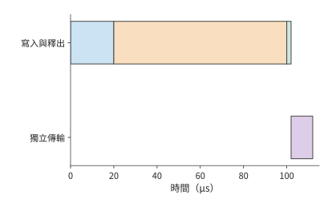

*圖 7-35：將獨立傳輸也排在釋出之後：先寫入 20 μs，恢復並使資料可見 80 μs，通知 2 μs，再執行獨立傳輸 10 μs。*

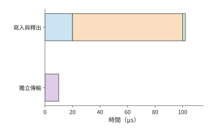

*圖 7-36：寫入、恢復、通知仍依次進行；使用獨立資源的傳輸從 0 μs 開始。藍色為寫入，橙色為恢復，綠色為通知，紫色為獨立傳輸。*

恢復時間若增至 200 μs，序列安排中的 C 要到 232 μs 才完成，獨立安排中的 C 仍在 10 μs 完成。去掉多餘的依賴，就把恢復造成的停頓限制在真正需要這份資料的那條鏈上。對等著 C 的下游任務來說，這種隔離比全組提前 10 μs 重要得多。[^ordering]

全域性順序讓上層容易描述操作的先後關係，也把獨立工作放進了同一條等待鏈。計算圖已經明確 A→B 的釋出依賴後，介面和執行時可以圍繞這條依賴提供順序保證，讓 C 獨立推進。應用提供更準確的依賴資訊，網路據此只為相關操作保證順序，既能保證接收方收到通知後讀到已經寫入的資料，也能減少不必要的等待。

再假設所有操作共用一個處理單元：從 A 開始寫入到 B 完成通知，該單元一直被佔用，C 只能隨後執行。此時資源使用本身增加了釋出鏈到 C 的順序邊，兩種安排都到 112 μs 完成。程式依賴和資源依賴因此要畫在同一張圖裡：減少程式中的順序約束後，資源約束仍會限制並行程度。

**設計案例：按需指定順序的硬體開銷。** 筆者的 OpenURMA 實現把 UB 的四種順序服務模式和三種執行標籤放在同一條傳送管線 (Pipeline)上實現。週期級模擬顯示：不論請求要求哪一種順序，從提交到第一個報文出線都是 24 個週期；只有當請求明確要求等待前序操作完成時，順序跟蹤器才會讓它等待，前序未完成的操作最多四項時，等待不超過 50 個週期，約 155 ns；不要求順序的請求不承擔這筆開銷。更重要的是隔離效果：把一個發起方的請求停在等待前序操作的位置，另外四個發起方提交的 8 個不要求順序的請求仍然在 78 個週期（約 242 ns）內全部發出，被停住的請求沒有拖累其他發起方。作為對照，RoCE 可靠連線中同一個 QP 裡的請求必須嚴格按序執行，一個請求等待，後面的請求就全部等待。這正是例題 7.4 裡把 C 排在 A、B 之後的那種安排在硬體上的表現。[^ub-design]

> **設計背景：全域性順序如何簡化複製與協作？**
>
> 筆者在 1Pipe 研究中探索過由網路提供全域性全序的設計。所有參與者按同一順序觀察操作，上層的複製和協作就能使用更簡單的順序模型。進一步處理故障時，順序與交付需要分別解決：傳送方發到一半退出，系統要確定哪些節點已經收到；接收方永久退出，系統要決定哪些工作繼續執行。這些問題要求把順序保證與交付、恢復機制分開，並把應用真正需要的依賴清楚地表達出來。

上述例子要求寫入完成後才能發出通知。接收方還必須在正確的時刻讀取資料，否則即使通知順序正確，也可能使用舊值。設 D 初值為 0，在 2 μs 更新為 1；就緒標誌在 3 μs 可見。消費者在 1 μs 提前讀 D，在 4 μs 讀標誌。此時它儲存的是新標誌和舊資料。即使到 5 μs 再按「標誌、資料」順序返回讀取結果，儲存下來的 D 仍是 0。

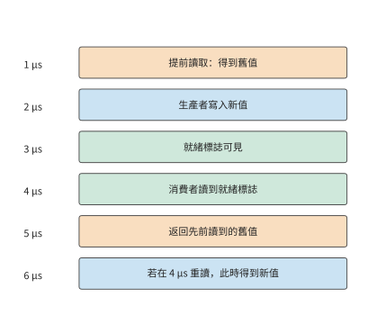

*圖 7-37：按時間依次列出實際讀取、資料更新、就緒通知和結果返回。5 μs 返回的仍是 1 μs 讀到的舊值；若在 4 μs 發現衝突並重讀，6 μs 得到新值。*

圖 7-37 中，把表示結果返回時刻的空心點向後移動，並不會移動表示實際取值時刻的實心點。這一反例說明，順序要求必須落實到讀取資料的時刻。消費者可以在觀察標誌之後再讀 D，也可以提前讀、檢查衝突並重讀。若在 4 μs 發現衝突後重讀需要 2 μs，就在 6 μs 得到正確資料。在接收方排序是把等待挪到了接收一側，衝突檢查則負責判斷哪些提前讀到的結果仍然有效。要靠順序保證來簡化程式設計，就必須儲存這些狀態並做相應的檢查。

### 7.4.4 請求槽位的釋放與背壓

第 7.3.4 節的請求槽位要等軟體處理完完成通知才釋放，新請求才能使用它。第 7.4.1 節討論的資料緩衝區有另外的使用期限：接收方尚未用完資料時，該緩衝區仍需保留。如果傳輸加快，完成通知卻處理得不夠及時，就會出現大量「操作已完成、槽位未釋放」的請求。

取 16 次操作，每次傳 8 KiB，最多每 1 μs 提交一次，提交後 5 μs 完成。若有 16 個槽位，最後一次在 15 μs 提交，20 μs 時全部傳完。軟體每 20 μs 讀取並處理四條完成通知，16 條通知需要四輪，對應的槽位到 80 μs 才全部釋放。

若只有八個槽位，最初八次提交迅速佔滿槽位。第九次提交要等到 20 μs 時軟體處理完成通知、釋放槽位之後，後續請求繼續分批提交，全部傳輸到 48 μs 才結束。把槽位加倍，傳輸完成時刻從 48 提前到 20 μs，所有槽位釋放完畢仍要到 80 μs。[^reclaim]

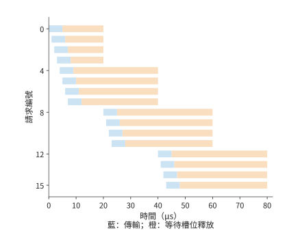

*圖 7-38：藍色表示提交到傳輸完成，橙色表示等待軟體處理完成通知，橙色結束才釋放槽位。所有請求的時刻取自事件記錄。*

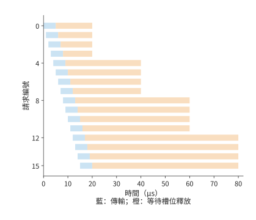

*圖 7-39：增加槽位後，後續請求更早提交。完成通知仍每 20 μs 批次處理四項，最後一個槽位仍在 80 μs 釋放。兩圖時間軸相同。*

對比圖 7-38 和圖 7-39，增加槽位讓藍色傳輸條帶提前了，右側較長的橙色等待卻仍然存在。決定持續吞吐量的，是這些槽位最終釋放得有多快。用並行與吞吐量模型看，處理完成通知的執行緒每秒只處理 $4/(20\times10^{-6})=200000$ 項；每項 8 KiB，對應約 1.64 GB/s 的持續處理能力。採用這樣的操作大小，要達到一張網路卡的 50 GB/s，平均每秒需處理約 610 萬項，約每 0.164 μs 一項。增加槽位只能容納短時間內突然增多的請求，持續負載需要提高完成通知的處理速率或擴大每項操作的載荷。

完成通知處理速度不足時，上游提交就要受到約束，這就是第 5 章的背壓：請求槽位用滿後，端點就暫停或放慢提交，直到有槽位釋放；背壓靠限制未完成請求數來控制上游，防止未完成的工作無限增長。若緩衝區要等遠端程式用完資料才能釋放，背壓就會跨裝置傳播；許多工作共享傳輸狀態時，傳播範圍還會更大。

發生故障後，也必須先結束舊請求，再釋放它們佔用的空間。取消請求之後，系統先停止新提交，再等待或隔離舊的在途訪問，最後釋放空間。否則，遲到的舊寫入會覆蓋新物件。給每次複用的物件分配新的版本號、撤銷訪問權、隔離失聯端點，都是為了防止舊請求訪問已經重新分配的空間。超時觸發恢復後，系統要先確認舊請求已經結束，或阻止其繼續訪問，再複用空間。多個端點共享網路時，同樣的到達速度與處理速度之差，會變成交換機裡的佇列。

> **實驗 7-10 · 核心：放寬操作順序如何減少等待並保持資料正確**
>
> 將例題 7.4 中獨立操作 C 的耗時改為 50 μs，求兩種安排的整組操作和獨立操作的完成時間。再假設消費者收到通知後需要 30 μs 處理資料，標出目的緩衝區最早可以寫入新資料的時刻。對舊值反例分別畫出等待後讀取、提前讀取後重讀兩條執行路徑。

## 7.5 共享網路中的擁塞與可靠性

### 7.5.1 從固定流量到隨時間變化的需求

在前幾節的配置上再增加一項使用兩臺伺服器的訓練作業，並把兩項作業放到第 7.2.5 節的多軌拓撲上：每項作業的兩臺伺服器分屬不同的組（每組 32 臺伺服器），同一條 rail 上的跨伺服器流量不再一跳到達，要經葉交換機的上聯鏈路 (Link)走脊層；兩項作業在這條 rail 上的流被雜湊到同一條 400 Gbit/s 的上聯鏈路 (Link)，每方向 50 GB/s。分層歸約的跨伺服器階段讓每張網路卡以 50 GB/s 傳送，兩項作業的高峰重疊時，需求就超過了這條鏈路 (Link)的傳輸能力。

**例題 7.5：平均只用掉 40% 的鏈路 (Link)頻寬，為什麼仍然排隊？** 兩項作業每 100 ms 各有 20 ms 的通訊高峰，高峰速率均為 50 GB/s，其他時間不傳送。假設佇列初始為空，作業按上述時間表傳送資料，緩衝區足夠大，可以儲存所有積壓。

解答：兩項作業的平均總需求為

$$
\bar\lambda=2\times50\times\frac{20}{100}=20\ \mathrm{GB/s}.
$$

與 50 GB/s 相比，平均利用率只有 40%。但兩個高峰同時開始時，到達速率比出口速率高出 50 GB/s，20 ms 內積壓增長到

$$
Q_{\max}=(100-50)\ \mathrm{GB/s}\times20\ \mathrm{ms}=1\ \mathrm{GB}.
$$

高峰結束後，還需 $1\ \mathrm{GB}/50\ \mathrm{GB/s}=20$ ms 排空。兩項作業在 20 ms 時停止傳送，但出口還要再傳輸 20 ms 才能發完這些資料。把第二項作業推遲 20 ms，高峰完全錯開，任意時刻只有 50 GB/s 到達，佇列保持為空。兩種安排傳送同樣多的資料，差別在於兩項作業開始傳送的相對時刻。圖 7-40 畫出不同重疊程度下的到達速率，圖 7-41 畫出對應的積壓。[^queue]

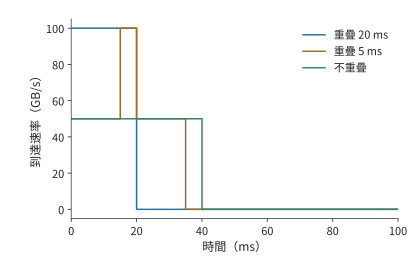

*圖 7-40：兩作業每 100 ms 各傳送 20 ms，單作業速率 50 GB/s。不同高峰重疊程度產生不同的總到達速率，共享出口為 50 GB/s。*

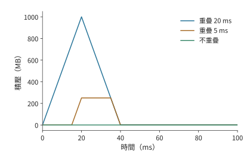

*圖 7-41：把到達速率與出口速率的差額隨時間累積，得到 1000、250、0 MB 三種峰值。此算例按無限緩衝計算積壓。*

**討論：傳送時刻偏移多少會使共享出口產生積壓？** 重疊時間為 $h$ 時，新增積壓為 $(100-50)h$。重疊 5 ms 就積壓 250 MB。若只給這次突發留出 512 KiB 緩衝，從空佇列出發，允許的重疊時間約為 $512\ \mathrm{KiB}/50\ \mathrm{GB/s}=10.5$ μs。即使傳送時刻的誤差只造成毫秒級重疊，也遠遠超過這份緩衝所能容忍的範圍。

錯開高峰的思路已經有系統實現。CASSINI 利用訓練通訊的週期性，安排作業的放置和通訊時刻來錯開高峰，並監測漂移、重新調整。[^cassini] 本書配套實驗用兩個在 CPU 上執行的分散式資料並行（DDP）訓練作業做過一次性錯峰的對照：把其中一項推遲 50 ms 後，兩者的相位在執行中繼續漂移，三輪測量中整組作業的完成時間反而多了約 2% 到 3%。[^phase] 週期排程要持續維護相位；擁塞控制則根據即時反饋調整偏離預期的傳送速率。

### 7.5.2 反饋延遲與緩衝容量

錯峰減少了高峰重疊，但實際傳送仍會偏離安排。因此，還需要在佇列開始增長時，及時讓傳送方減速。資料到達的速度超過出口傳送的速度時，多出的資料就會在佇列中積壓。記佇列長度為 $Q$、到達速率為 $\lambda(t)$、出口速率為 $B$，佇列非空且未滿時，

$$
\frac{dQ}{dt}=\lambda(t)-B.
$$

到達速率高於傳送速率，佇列增長；到達速率低於傳送速率，積壓減少。

及時降低到達速率，有兩類機制。**鏈路 (Link)流控**讓相鄰的接收方在緩衝不足時暫停上游，防止接收緩衝區溢位。**端到端擁塞控制**把瓶頸資訊送回傳送方，降低傳送速率。前者迅速阻止區域性溢位，後者讓源頭的傳送速率適應整條路徑的傳輸能力。

沿用 100 GB/s 到達與 50 GB/s 出口，設緩衝總量為 512 KiB，已經佔用 256 KiB。每微秒多到達的 50 KB 資料會佔用剩餘空間，這些空間只能支撐約 5.2 μs。反饋若到 20 μs 才使傳送減速，會新產生 1 MB 超額資料，扣除剩餘空間，約 738 KB 被丟棄。[^feedback]

將剩餘緩衝記為 $Q_{\mathrm{free}}$，從發現擁塞到降速的時延為 $T_f$，避免這次溢位需要

$$
T_f\le\frac{Q_{\mathrm{free}}}{\lambda-B}.
$$

因此，在到達和傳送速率給定時，可以根據緩衝大小推算允許的反饋時延。剩餘空間加倍，可容忍的反饋時延加倍；到達與出口的差額加倍，可容忍的反饋時延減半。在上述速率下，若經過 50 μs 才降速，就會多積壓 2.5 MB 資料。

反饋後還要消除積壓。只把傳送降到 50 GB/s，到達速率恰好等於出口傳送速率，已有佇列保持不變；降到 40 GB/s 後，每秒有 10 GB 餘量用於排空，512 KiB 約需 52 μs。從起點算，佇列約在 72 μs 回到零。擁塞控制既要阻止佇列繼續增長，也要為排空積壓留出餘量。圖 7-42 畫出這條反饋迴路，圖 7-43 畫出緩衝的填滿與排空。

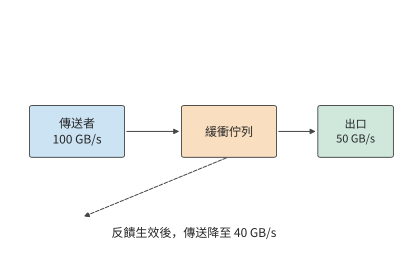

*圖 7-42：資料沿實線進入佇列並由出口傳送；虛線表示擁塞反饋返回傳送方。反饋到達並生效前，原傳送速率繼續填充佇列。*

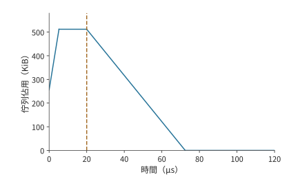

*圖 7-43：反饋生效之前，緩衝區還會繼續填滿。到達速率為 100 GB/s，出口為 50 GB/s，512 KiB 緩衝初始佔用一半。5.2 μs 時填滿，到 20 μs 降速前持續丟棄超額到達的資料；降至 40 GB/s 後，出口以 10 GB/s 的淨速率排空積壓。反饋時刻與降速幅度為給定條件。*

圖 7-43 中，反饋生效時刻決定佇列滿載狀態持續多久，降速幅度決定下降段有多陡。各種擁塞控制機制改變佇列，靠的都是這兩個量。**顯式擁塞通知**（ECN）由交換機在報文上打標記，把佇列資訊帶回傳送方；**DCQCN** 是利用這種通知調節 RDMA 傳送速率的演算法；基於時延的方法從往返時間的變化觀察排隊；UB 的 **C-AQM** 讓端點與交換網路協同做主動佇列管理（在佇列溢位之前就依據佇列狀態讓傳送方減速）。理解這些機制，先分清各自縮短了哪一段反饋路徑、傳送方收到資訊後改變了什麼。閾值、更新步長和反饋頻率共同決定佇列響應的速度與幅度。

**多對一匯聚與鏈路 (Link)流控。** 上述 100 GB/s 到達來自兩項作業。集合通訊自身也會製造更陡的到達速率。ReduceScatter 若按直接方式實現，每個參與者把第 $j$ 片直接發給持有者 $j$，一輪就完成。$N$ 個參與者若按同一順序逐個目標傳送，每個目標都以網路卡的全速 $B$ 發出，那麼輪到持有者 $j$ 的時段，另外 $N-1$ 個傳送方同時向它傳送，通向它的交換機出口以 $(N-1)B$ 的速率收到資料；傳送順序若按 rank 錯開，每個目標在任一時刻只收到一條流。多個傳送方同時向同一個出口傳送的情形稱為 **incast**。把 $\lambda=(N-1)B$ 代入上面的式子，每個傳送方 $B=50$ GB/s，出口也是 50 GB/s，剩餘緩衝 1 MiB；$N=8$ 時到達速率不是一條流的 50 GB/s，而是七條流合計的 350 GB/s：[^incast]

| $N$ | 傳送方數 | 到達速率 | 超額速率 | 允許的反饋時延 |
|---:|---:|---:|---:|---:|
| 8 | 7 | 350 GB/s | 300 GB/s | 3.50 μs |
| 16 | 15 | 750 GB/s | 700 GB/s | 1.50 μs |
| 64 | 63 | 3150 GB/s | 3100 GB/s | 0.34 μs |

鏈路 (Link)流控和端到端擁塞控制這兩類機制，在這裡對應兩段反饋距離。鏈路 (Link)流控的一種實現是 IEEE 802.1Qbb 的**基於優先順序的流控**（Priority-based Flow Control，PFC）：接收埠的佇列超過閾值就向上遊相鄰埠發暫停幀，按優先順序暫停一條鏈路 (Link)。它的反饋距離只有一跳：30 m 線纜按 5 ns/m 計，暫停幀上行 150 ns、已線上上的資料下行 150 ns，再加一個 1500 B 報文在 50 GB/s 上序列化的 30 ns，共 0.33 μs。這 0.33 μs 內繼續到達的超額資料必須有緩衝容納，這塊預留的空間稱為 headroom（緩衝餘量）：$N=8$ 時為 $300\ \mathrm{GB/s}\times0.33\ \mu\mathrm{s}=99$ KB，$N=16$ 時 231 KB，$N=64$ 時 1.02 MB，都不超過 1 MiB；DCQCN 論文按 1500 B 的最大傳輸單元（MTU）給出的一例是每埠每優先順序 22.4 KB。端到端擁塞控制（ECN 標記與 DCQCN 降速）的反饋距離是一個 20 μs 的往返，這 20 μs 內湧入的超額資料為 6.0、14、62 MB，即 5.7、13.4、59.1 MiB，沒有一個能放進 1 MiB 緩衝。圖 7-44 畫出三種 $N$ 下的佇列增長與這兩段反饋距離。

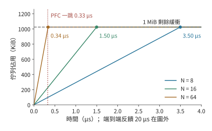

*圖 7-44：$N=8$、16、64 時佇列以 300、700、3100 GB/s 的超額速率增長，圓點標出 1 MiB 剩餘緩衝被填滿的時刻 3.50、1.50、0.34 μs。豎直虛線是 PFC 的一跳反饋距離 0.33 μs，三條線在這之前都沒有填滿；端到端反饋的 20 μs 在圖的橫軸之外。*

兩段距離決定了分工：PFC 在 0.33 μs 內擋住相鄰一跳，讓緩衝在 DCQCN 需要的 20 μs 裡不溢位；DCQCN 再把源頭的傳送速率降到出口能承受的水平，暫停才能解除。只靠端到端反饋不丟包的條件是 $(N-2)\times50\ \mathrm{GB/s}\times20\ \mu\mathrm{s}\le Q_{\mathrm{free}}$：1 MiB 緩衝只允許 $N\le3$，4 MiB 也只到 $N\le6$。把緩衝放大到 4 MiB，允許的反饋時延變為 13.98、5.99、1.35 μs，仍遠小於 20 μs。[^incast] PFC 的代價留到第 7.5.4 節：暫停會沿上游逐跳傳播，形成迴圈依賴時就是死鎖。

> **實驗 7-11 · 延伸：緩衝大小與降速幅度如何影響積壓消退**
>
> 設到達速率為 100 GB/s，出口速率為 50 GB/s，初始積壓為 256 KiB，求總緩衝為 512 KiB、1 MiB 時可以容忍的反饋時延。假設反饋在緩衝剛好用滿時生效，將降速後的到達速率分別設為 50、45、40 GB/s，求從反饋生效到積壓清空所需的時間，並解釋其中一個條件為何無法排空。

> **實驗 7-12 · 延伸：incast 的緩衝與反饋距離**
>
> 把出口改為 100 GB/s（兩張網路卡）而每個傳送方仍為 50 GB/s，重算 $N=8$、16、64 的允許反饋時延與 PFC 的 headroom。再把線纜改為 100 m，求一跳反饋距離，以及 $N=64$ 時 headroom 是否仍在 1 MiB 內。最後求往返時間為 5 μs 時，只靠端到端反饋就不丟包的最大 $N$。

### 7.5.3 多路徑與重傳

反饋控制透過降低傳送速率緩解擁塞；如果其他路徑尚有頻寬，還可以把流量分過去。Clos 網路提供多條可選路徑。把不同連線分到不同路徑，能分散熱點鏈路 (Link)上的流量；把同一次傳輸的報文分到多條路徑，能同時用上多條鏈路 (Link)的頻寬。後一種做法也把不同路徑的時延差帶到了接收方。

取四個 token 的 BF16 隱藏向量，共 32 KiB，拆成八個 4 KiB 報文，輪轉到兩條獨立的 50 GB/s 路徑。每個報文序列傳送約 82 ns，每條路徑傳送四個報文約需 0.33 μs。兩條路徑的傳播時延都為 1 μs 時，整份資料約在 1.33 μs 交付；同樣八個報文只走一條路徑則約需 1.66 μs。兩條路徑各承擔了一半傳送工作，並行完成傳輸。[^packets]

把第二條路徑的傳播時延改為 9 μs，這條路徑上的最後一個報文在約 9.33 μs 才到達。快路徑上提前到達的後續報文要等前面缺失的報文補齊，接收方最多要快取 12 KiB 亂序資料。總位元組數相同，多用一條路徑卻比單路徑慢得多，因為節省的序列傳送時間只有約 0.33 μs，遠小於新增的 8 μs 路徑時延。

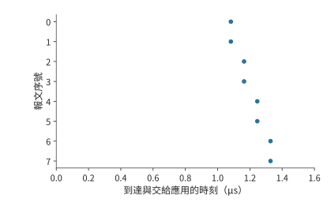

*圖 7-45：兩路徑傳播時延均為 1 μs，八報文約在 1.33 μs 全部到齊。圓點表示到達；到達後因缺口等待的區間用橫線表示。*

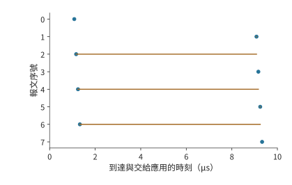

*圖 7-46：第二條路徑傳播時延增加到 9 μs。快路徑後續報文先到，仍需等待前方缺口；約 9.33 μs 全部可交付。圓點表示報文到達，橫線表示到達後等待缺口補齊的時間，縱軸是報文序號。*

圖 7-45 和圖 7-46 中的橫線說明，快路徑發完並不等於整份資料可以交給應用。兩條路徑節省了傳送時間，卻可能增加等待缺失報文的時間。可以直接求出雙路徑傳輸更快的條件。單路徑需要傳送八個報文，雙路徑每條傳送四個。每報文序列傳送時間約為 82 ns，雙路徑節省約 0.33 μs。第二條路徑比第一條多出的傳播時延若超過這 0.33 μs，平均分配便失去時間優勢。在 50 GB/s 的鏈路 (Link)上，這一餘量只有 30 m 線纜傳播時延（約 150 ns）的兩倍多，路徑之間稍有差別就會抵消它；把一次幾十 KiB 的傳輸均分到時延不同的路徑上很少划算，路徑選擇或不均勻分配應減少慢路徑承擔的報文，使兩條路徑的最後一個報文儘量同時到達。只有每條路徑分到的序列傳送時間遠大於路徑時延差，多路徑才有收益，下文 8 MiB 的逐包噴灑就是這種情形。

傳播慢之外，報文丟失是另一種情形，造成的等待也不同。讓序號 0 丟失，在它原來傳送結束的 20 μs 後重傳，整份資料約在 21.2 μs 才能交付：交付要等缺口補齊，不取決於其餘報文多早到達。此時其他七個報文都已到達，接收方快取了 28 KiB 載荷，只需重傳缺失的 4 KiB；若從缺失報文開始重發它及其後的所有報文，則要再傳輸 32 KiB。**選擇性重傳**用記錄接收進度的狀態，換來更少的重複傳輸，圖 7-47 畫出了這種只補發序號 0 的情形。OpenURMA 的兩節點模擬也給出了同樣的對照：UB 傳輸層採用選擇性確認，只補發缺失的報文，吞吐量隨丟包率上升而平緩下降；回退 N 步重傳在同樣的丟包率下要把整個視窗重發一遍。[^ub-design]

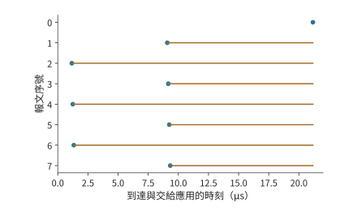

*圖 7-47：序號 0 丟失後按算例等待時間重傳，其他七個報文保留在接收方。只補發缺失報文後，約 21.2 μs 全部可交付。圓點表示報文到達，橫線表示到達後等待缺口補齊的時間，縱軸是報文序號。*

重傳還有一個獨立的問題：什麼時候認定缺口需要恢復。等太久，真丟包後的停頓就長；慢路徑上的報文只是還沒到就重發，又會增加重複流量。路徑時延的分佈決定檢測要容忍多大的亂序，接收方記錄的狀態決定能快取多少在缺失報文之後到達的資料。可靠交付與第 7.4 節的應用依賴共同決定哪些已經到達的操作可以繼續執行。

**多條路徑上的雜湊衝突。** 前文把同一次傳輸的報文分到多條路徑；本節開頭的另一種做法是按連線（流）分配路徑，不會亂序，卻可能讓幾條流集中到同一條鏈路 (Link)。跨組的流離開葉交換機時，要從該葉的上聯中選一條。交換機通常按報文頭的地址與埠欄位雜湊來選擇上聯，稱為**等價多路徑**（equal-cost multipath，ECMP）：同一條流的所有報文走同一條路徑，不同的流按雜湊值分到不同上聯。雜湊是隨機的，兩條流落到同一條上聯的機率不為零。會彼此衝突的是同一臺葉交換機上的跨組流：第 7.2.5 節裡錯位的配對雖然把八條流送進脊層，但它們從八臺不同的葉交換機出發，每臺葉上只有一條跨組流，彼此不會在同一臺葉的上聯上相遇。rail 對齊把每臺葉上的跨組流壓到最少，正是為了避開這裡的衝突。把同一臺葉上的 $n$ 條等速流獨立、均勻地雜湊到該葉的 $m$ 條上聯——$k=64$ 的無阻塞葉有 32 條，3:1 超售葉有 16 條——最忙的一條上聯分到的流數記為 $L_{\max}$。沒有衝突時，最忙的上聯承載 $\lceil n/m\rceil$ 條流；各流公平共享所在鏈路 (Link)的頻寬、整組要等最慢的流傳完時，整組的速度只有無衝突時的 $\lceil n/m\rceil/\mathrm{E}[L_{\max}]$。精確計算最大負載的分佈，表中 p99 是 $L_{\max}$ 的第 99 百分位數，即 99% 的雜湊結果中最忙上聯的流數不超過該值：[^ecmp]

| 流數 $n$ | 上聯數 $m$ | 無衝突時最忙上聯的流數 | $\mathrm{E}[L_{\max}]$ | p99 | 無衝突機率 | 相對無衝突的速度 |
|---:|---:|---:|---:|---:|---:|---:|
| 8 | 32 | 1 | 1.66 | 3 | 38.6% | 60.1% |
| 8 | 16 | 1 | 2.06 | 4 | 12.1% | 48.5% |
| 32 | 32 | 1 | 3.53 | 6 | $1.8\times10^{-13}$ | 28.3% |
| 32 | 16 | 2 | 4.83 | 8 | 0 | 41.4% |
| 128 | 16 | 8 | 13.36 | 18 | 0 | 59.9% |

一臺葉上只有八條跨組流時，無阻塞葉有 38.6% 的機率完全不衝突；一旦衝突，兩條流集中在一條上聯上，各得一半頻寬，最忙的一條上聯平均分到 1.66 條流，整組平均只剩無衝突時 60.1% 的速度。超售葉的上聯減半，無衝突機率降到 12.1%，速度降到 48.5%。整組 32 臺伺服器各出一條跨組流、無阻塞葉恰好 32 條上聯時最差：流數與上聯數相等，幾乎必然有若干條上聯空著、另一些擠了三四條，整組只剩 28.3%。流數遠多於上聯數時，隨機分配的波動相對變小：32 條流分到 16 條上聯為 41.4%，128 條流分到 16 條上聯為 59.9%。圖 7-48 畫出這幾組配置的最忙鏈路 (Link)負載。**翻轉條件**：流數與上聯數接近時衝突代價最大，流數遠少於或遠多於上聯數時代價較小；要避開這一代價，一是用 rail 對齊減少同一臺葉上的跨組流，二是不再按流分配，改用下文的逐包噴灑。

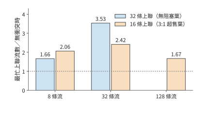

*圖 7-48：同一臺葉交換機上的 $n$ 條跨組流雜湊到該葉的 $m$ 條上聯時，最忙上聯的期望流數與無衝突時最忙上聯流數之比，比值的倒數就是整組相對無衝突的速度。無阻塞葉有 32 條上聯，3:1 超售葉有 16 條；32 條流分到 32 條上聯時比值最大，為 3.53；128 條流分到 16 條上聯時降到 1.67。*

**逐包噴灑。** 把同一條流的報文分到多條路徑，就消除了流級雜湊的衝突，代價是本節開頭算過的亂序。把 8 MiB 的 prefill 啟用（1024 個 token 的 BF16 隱藏向量）拆成 2048 個 4 KiB 報文，輪轉到八條 50 GB/s 的路徑，八條路徑的傳播時延為 1 到 8 μs。每條路徑承擔 1 MiB，序列傳送 20.97 μs，最慢路徑再加 8 μs，全部到達 28.97 μs，約 29.0 μs；同樣 8 MiB 走一條路徑要 167.8 μs 加 1 μs 傳播，共 168.8 μs。噴灑節省的是序列傳送時間，多出的是路徑時延差；按本節開頭的條件，只要最慢路徑的時延小於 $168.8-21.0=147.8$ μs，噴灑就更快，這裡的最慢路徑只有 8 μs。亂序的代價是接收方要快取先到的報文：快路徑的報文要等慢路徑上序號更小的報文，接收方最多同時保留 339 個報文、1.39 MB。[^ecmp]

超乙太網（Ultra Ethernet，面向 AI 與高效能運算的乙太網規範）把這兩件事寫進了傳輸層：報文按熵值（entropy，報文頭中供交換機雜湊選路的欄位）噴灑到多條路徑，典型配置有 64 到 256 個熵值，反饋顯示某條路徑擁塞時就減少放到它上面的報文；丟失的報文按選擇性確認只補發缺失的那些，而不是回退 N 步重發整個視窗。[^ecmp] 這正是圖 7-47 的模型：噴灑換來所有鏈路 (Link)的頻寬，選擇性重傳把丟包的代價限制在缺失的報文上，接收方為此儲存亂序狀態。

> **實驗 7-13 · 延伸：路徑時延差與重傳如何推遲按序交付**
>
> 讓第二條路徑的傳播時延在 1 μs 至 9 μs 之間變化，求均分到兩條路徑與僅使用第一條路徑的完成時間相等時，第二條路徑的傳播時延。再令兩條路徑分別承擔五個和三個報文，求第一條路徑傳播時延為 1 μs、第二條為 9 μs 時的完成時間。保持首包丟失，把恢復等待從 20 μs 增為 40 μs，計算首次能夠按序交付資料的時刻，以及此前需要快取的資料量。

> **實驗 7-14 · 延伸：雜湊衝突與噴灑的邊界**
>
> 求 16 條流分到 32 條上聯時最忙鏈路 (Link)的期望負載與相對無衝突的速度，與表中同樣 $n/m=1/2$ 的 8 條流分到 16 條上聯比較。把噴灑的路徑時延改為 1 到 30 μs 均勻間隔，求完成時刻與峰值亂序快取；再求使噴灑不再快於單路徑的最慢路徑時延。最後把報文改為 1 KiB，說明峰值亂序快取的報文數和位元組數怎樣變化。

### 7.5.4 死鎖

第 7.5.3 節中，已經到達的報文要保留到缺口補齊後才能釋放空間。端點背壓和鏈路 (Link)流控還會讓這種等待向上遊傳播：接收方沒有空位，上游便不能繼續傳送。若釋放某項資源的動作也需要這項資源，就會形成迴圈。考慮兩項請求分別佔用資源 A 和 B；第一項還需要獲得 B 才能完成，第二項還需要獲得 A 才能完成。二者都在等待對方先釋放。

在歸約系統裡，這種迴圈可以跨越多個層次：請求佔滿接收緩衝，完成響應等待傳送佇列，傳送佇列又等待遠端釋放請求所佔的空間。把「持有前一項資源、申請後一項資源」畫成邊，就得到資源依賴圖。環上的每項資源都被持有時，所有釋放條件就同時停滯。圖 7-49 畫出這種迴圈，圖 7-50 畫出下文為響應預留通路的解法。

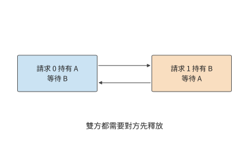

*圖 7-49：兩項請求分別持有 A、B，各自等待對方持有的資源。箭頭表示等待關係，兩個請求都無法完成並釋放資源。*

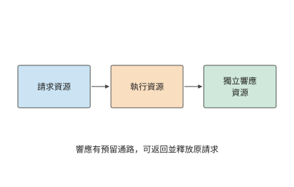

*圖 7-50：請求、執行、響應使用獨立資源並按順序申請。響應有預留緩衝和傳送機會，能夠返回並釋放原請求。*

一種解決方法是給資源規定嚴格申請次序，例如所有工作先申請 A 再申請 B。這樣，持有 B 的工作不再回頭等待 A，環便被打斷。另一種方法是給完成響應預留獨立緩衝區和傳送機會。設接收方八個資料槽已滿，傳送方等待釋放；若響應也要佔用這些資料槽，就一起停住。增加獨立響應槽，使處理資料後的釋放訊息可以返回，至少一項請求所佔的空間得以釋放，資料佇列便能繼續週轉。

虛擬通道用邏輯上分開的佇列來劃分資源。把請求與響應分入不同通道，再規定資源申請方向，可以建立無環的依賴結構。這裡真正發揮作用的是獨立容量和使用次序。

記憶體存取還可能要做地址轉換、讀頁表。原請求等待地址轉換，地址轉換又要發起一次遠端訪問，二者若爭用已耗盡的同一組槽位，也會形成相同的環。筆者參與 UB 設計時，需要一併分析事務處理、記憶體存取和鏈路 (Link)傳輸之間的依賴。為完成通知、地址轉換和故障恢復預留資源，才能避免系統在擁塞或故障時陷入停滯。

## 7.6 從通訊改進到任務完成

### 7.6.1 關鍵路徑從資料就緒開始

第 7.2 至 7.5 節沿一份資料追蹤了傳輸、等待、完成通知和空間釋放。要判斷這些改進能節省多少訓練時間，還要把產生和使用這份資料的計算過程一併計入，並確定通訊何時開始。一張卡很早就進入集合通訊呼叫，另一張卡的梯度還沒算出來，前者就在呼叫裡等後者。這段等待記在通訊呼叫的耗時裡，根源卻在前面的計算或資料準備。

考慮四個要做本地歸約的參與者，分別在 0、0、0、2 ms 就緒，全部到齊後執行 0.4 ms 的交換。按第 7.4 節的依賴圖，交換的開始時刻等於四個就緒時刻中的最大值，全組在 2.4 ms 完成。將交換耗時減半，完成時間變為 2.2 ms；如果四個參與者都在起點準備好，完成時間就變為 0.4 ms。兩個最佳化分別作用於依賴圖上的不同節點，圖 7-51 至圖 7-53 依次畫出這三種情形。[^tail]

*圖 7-51：原安排中，前三個參與者等第四個在 2 ms 就緒，再交換 0.4 ms。灰色為尚未就緒，橙色為等待其他參與者，藍色為交換。*

*圖 7-52：就緒時刻相同，交換從 0.4 ms 減到 0.2 ms，全組從 2.4 ms 提前到 2.2 ms 完成。灰色表示尚未就緒，橙色表示等待其他參與者，藍色表示交換。*

*圖 7-53：四個參與者在起點同時就緒，交換仍需 0.4 ms，全組在 0.4 ms 完成。三圖時間軸相同。藍色表示交換；各行分別對應一個參與者。*

這種就緒偏差在大規模訓練系統中同樣存在。大規模分散式訓練系統 MegaScale 在診斷訓練效能時發現，網路頻寬保持穩定，但各參與者開始通訊的時間差越來越大，ReduceScatter 中的等待也隨之增長。進一步分析發現，這一差異與前向計算期間的主機操作有關。[^megascale] 本書配套實驗用集合通訊庫 Gloo 在 CPU 上做的四程序測量也顯示同樣的關係：4 KiB 輸入下，當一個參與者晚到約 25.1 ms 時，全組完成時間的中位數從約 1.6 ms 增至 26.6 ms；最後一個參與者到達之後的尾段仍約為 1.6 ms。[^readiness]

因此，任務時間線應從資料生成時刻畫起。把梯度分成多個桶，每個桶的梯度生成後即可開始歸約；下一桶仍在計算時，上一桶可以傳輸。不同桶的通訊會競爭網路卡和鏈路 (Link)，參數更新要等最後一個桶歸約完成。分桶讓通訊提早開始，與後續梯度計算同時進行。

### 7.6.2 分層網路的通訊耗時計算

**例題 7.6：歸約演算法、執行順序與鏈路 (Link)頻寬應先最佳化哪一項？** 沿用前述算例中的 192 MiB 梯度。梯度在計算開始後 20 ms 就緒，歸約後執行 2 ms 更新。比較連續環與分層歸約，再考察並行不足、提前通訊和鏈路 (Link)退化。

**解答：先計算歸約與計算序列時的訓練步耗時。** 計算→歸約→更新形成一條序列鏈。使用第 7.2 節的傳輸模型，連續環總時間約為 $20+7.6+2=29.6$ ms，分層歸約約為 $20+1.3+2=23.3$ ms。通訊時間減少約 83%，整步只減少約 21%。20 ms 計算和 2 ms 更新佔據了其餘時間。

一般地，不受最佳化影響的時間為 $T_c$，通訊為 $T_n$，通訊加速 $s$ 倍，則總加速比為

$$
S=\frac{T_c+T_n}{T_c+T_n/s}.
$$

接下來考慮第 7.3 節的並行請求數限制。若每張網路卡僅有 128 個 256 B 事務在途、槽位週轉時間為 2 μs，先不計發起速率，每張網路卡的遠端吞吐量受限於 16.4 GB/s。分層歸約跨伺服器每張網路卡共傳送 24 MiB，遠端傳輸便需約 1.5 ms；加上本地通訊和啟動，總通訊約為 2.3 ms，整步約為 24.3 ms。增加到 391 項活躍事務並使發起速率足夠，才恢復到約 23.3 ms。換了歸約演算法之後，還要讓請求提交和處理速度足以發揮演算法的優勢。

再考慮重疊。假設計算開始後 17 ms，需要通訊的資料已經準備好，而其他計算還需 3 ms。這 3 ms 的計算可以與通訊同時執行。兩者使用互不爭用的硬體資源，更新要等兩者都完成。此時

$$
T_{\mathrm{step}}=\max\bigl(20,\ 17+T_n\bigr)+2\ \mathrm{ms}.
$$

圖 7-54 至圖 7-59 依次畫出六種安排，每張圖使用相同時間尺度。灰色計算區間保持不變，藍色通訊區間的長度由傳輸量和吞吐量決定，起點則由資料何時就緒決定。

*圖 7-54：連續環序列安排：計算 20 ms，通訊約 7.6 ms，更新 2 ms。灰為計算，藍為通訊，綠為更新；圓點為通訊資料就緒。*

*圖 7-55：本圖改用分層歸約，仍按計算、通訊、更新序列執行。通訊縮短到約 1.3 ms，整步約 23.3 ms。灰色為計算，藍色為通訊，綠色為更新；圓點為通訊資料就緒。*

*圖 7-56：本圖採用分層歸約，其他計算與更新時間不變。每張網路卡 128 個在途事務限制遠端吞吐量，通訊拉長到約 2.3 ms，整步約 24.3 ms。灰色為計算，藍色為通訊，綠色為更新；圓點為通訊資料就緒。*

*圖 7-57：本圖把連續環的通訊提前到 17 ms 開始，與尚未完成的計算重疊。通訊 7.6 ms 超出計算區間，更新等通訊結束；整步約 26.6 ms。灰色為計算，藍色為通訊，綠色為更新；圓點為通訊資料就緒。*

*圖 7-58：本圖把分層歸約的通訊提前到 17 ms 開始。通訊在 18.3 ms 結束，早於計算，更新從 20 ms 開始，整步 22 ms。灰色為計算，藍色為通訊，綠色為更新；圓點為通訊資料就緒。*

*圖 7-59：本圖從提前通訊的分層配置出發，只把可用網路卡減為一張。跨伺服器兩輪各要擠過 96 MiB，通訊約 4.8 ms，超出計算區間，整步約 23.8 ms。上述時間線採用同一橫軸範圍。灰色為計算，藍色為通訊，綠色為更新；圓點為通訊資料就緒。*

資料在 17 ms 就緒並與計算重疊時，連續環整步約為 26.6 ms，分層歸約約為 22.0 ms：分層通訊約在 18.3 ms 結束，早於 20 ms 的計算結束時刻，更新緊接在計算之後開始。資料最晚在 18.7 ms 就緒，分層通訊仍能藏在計算後面。繼續縮短通訊不再改變這條關鍵路徑，此時需要縮短計算或更新，才能進一步減少總時間。

**討論：網路卡減少後，歸約是否重新成為訓練步的瓶頸？** 若八條 rail 只剩一條可用，每臺伺服器的八份分片都要經過剩下的這一張網路卡，每輪每個方向 96 MiB，兩輪共 192 MiB，遠端傳輸從約 0.5 ms 增加到約 4.0 ms，通訊約為 4.8 ms。資料在 17 ms 就緒時，通訊到 21.8 ms 才結束，整步約為 23.8 ms。通訊耗時增加後，其中更多部分要到計算結束後才能完成。

再按順序比較這些時間線：減少通訊量會縮短藍色條帶，並行不足會將其延長，資料提早就緒則讓它向左移動。綠色更新要等計算和通訊都結束後才能開始。流量、並行與依賴這三個模型也給出了清楚的改進順序。先用分層歸約減少跨伺服器傳輸並讓每張網路卡都有分片可傳，再靠並行提交和處理請求用滿鏈路 (Link)頻寬；到了頻寬上限，就找可以提早開始的通訊；通訊時間被計算完全蓋住之後，再最佳化此時決定完成時間的計算或更新。

### 7.6.3 訓練與推論的通訊瓶頸

圖 7-54 中藍色條帶能夠顯著縮短，是因為大梯度的資料傳輸佔了大部分通訊時間。低並行 decode 中，一個 8 KiB 隱藏向量要在層間反覆交接，實際傳送資料只需極短時間，每次啟動反而佔了大部分耗時。取一個由八個參與者組成的環，每輪啟動 5 μs，每個參與者有效頻寬為 $B$，輸入為 $M$ 時一次歸約為

$$
T_{\mathrm{AR}}=14\times5\ \mu\mathrm{s}+\frac{1.75M}{B}.
$$

十四輪啟動共 70 μs。鏈路 (Link)取本章網路卡的 50 GB/s，令載荷項等於啟動項，得到 $M=2$ MB，約為 1.91 MiB。輸入大於這一數量級時，資料傳輸耗時所佔的比例增大；8 KiB 遠小於它，主要耗時來自啟動。

*圖 7-60：原配置每輪啟動 5 μs、頻寬 50 GB/s。綠色將頻寬增至三倍的 150 GB/s，橙色將每輪啟動減至 2 μs；資料量小時主要受啟動影響，資料量大時主要受傳輸影響。*

沿圖 7-60 的橫軸從左向右看，資料量小的一段總時間接近水平，資料量大的一段隨載荷增大而上升。提高頻寬主要放緩右側的斜坡，縮短啟動時間主要使左側平坦區的曲線下移。

對 8 MiB 輸入，頻寬由 50 增至 150 GB/s，一次歸約從約 364 μs 降至 168 μs；對 8 KiB 輸入，則只從約 70.3 μs 降至 70.1 μs。假設執行一個 36 層模型，每層注意力與 FFN 各有一次這樣的歸約，72 次序列歸約在兩種頻寬下均約為 5.1 ms，差值約 14 μs。把每輪啟動從 5 μs 降到 2 μs，72 次歸約卻能減少約 3.0 ms。[^planning]

因此，訓練和大 batch prefill 更容易從減少位元組、增加頻寬和重疊中獲益；低並行 decode 更需要減少層內跨伺服器同步、縮短髮起與完成路徑。這也解釋了第 7.2 節討論的管線 (Pipeline)並行方案：把一個階段放在本地，可以減少階段內部的遠端通訊；同時處理多少個獨立請求，則決定管線 (Pipeline)利用率。

平均耗時之外，偶發的長時間等待也會推遲任務完成。取 100 次通訊，其中 98 次為 0.4 ms，一次因晚就緒而多等 2 ms，一次因恢復而多等 10 ms。平均約為 0.52 ms；p99 取由小到大排序的第 99 項，得到 2.4 ms。將正常傳輸時間減半，p99 降至 2.2 ms；若恢復事件增加為兩次，p99 就由包含故障恢復的那次通訊決定，變為 10.4 ms。[^tail]

正常傳輸、資料準備延遲和故障恢復，都可能成為決定任務完成時間的主要因素。頻繁的小資料量傳輸需要降低每次的啟動開銷；耗時較長的故障恢復則需要縮小故障影響範圍。訓練中發生通訊故障後，還需要重建通訊組並恢復訓練狀態；第 10 章將進一步說明這一過程。

頻寬與啟動開銷的比較都保持通訊模式不變。通訊模式本身也可以改變：調整並行方案與專家分佈，可以減少交接次數；由加速器直接發起通訊，或把發起與完成處理交給解除安裝單元，可以縮短每次交接。MoE 的路由、dispatch 與 combine 對網路操作提出要求；網路能否高效完成這些操作，又反過來影響專家的粒度和跨節點部署。若模型計算因專用硬體變快，通訊時間本身沒變，它在關鍵路徑上的佔比卻會上升。

同樣的流量分析也適用於推理中的狀態遷移。繼續分析貫穿本書的同一個 DeepSeek V4.1 會話，設這條請求要遷移到一個不持有其全域性 KV 的例項上。先計算全域性歷史這一段載荷的傳輸時間：上下文為 128K，傳輸走一張以 200 Gbit/s 執行的 ConnectX-7，有效頻寬 25 GB/s。V4-Flash 的 439.281 MiB 需要約 18.425 ms，V4.1 的 111.250 MiB 需要約 4.666 ms。狀態壓縮使這條路徑的傳輸時間減少了約 13.759 ms。[^v41-case]

這 13.759 ms 是遷移方案在傳輸環節可以節省的時間。若請求依次經歷排隊、快取查詢、傳輸和區域性 SWA 狀態的重建，恢復時間就是四段之和；傳輸縮短多少，總時間就縮短多少。第 9 章會把這條恢復路徑與留在原例項等待、從輸入重新計算放在一起比較，決定請求該去哪裡執行。

### 7.6.4 固定 1024 卡，超節點變大後如何重新選擇

前幾節用十六個參與者分析了路徑，本節把規模擴充套件到 1024 張卡：保持總卡數不變，超節點大小從 8 改成 64、128、256 卡，考察哪些時間會改變。先固定計算工作量與並行方案，再分別改變網路條件，最後重新比較並行度。[^supernode-scaling]

**固定模型與訓練工作。** 採用 Qwen3-32B 的形狀：64 層、隱藏維 5120，參數量取 $P=32\times10^9$。1024 張 H100 SXM 80 GB 按張量並行 8、資料並行 128 組織，記作 TP8×DP128，每個八卡張量並行組都在一個超節點內。每次更新固定處理 $2^{20}$ 個 token，每個資料並行副本處理一個含 8192 個 token 的 micro-batch；全域性 batch size、精度和最佳化器更新的含義都不變。訓練狀態按每參數 16 bytes 計，每卡 64 GB，另假設 8 GB 的啟用與工作區足夠，暫不用 ZeRO（Zero Redundancy Optimizer，零冗餘最佳化器，把最佳化器狀態、梯度和參數分片存放到各資料並行副本上）。

梯度按 BF16 傳輸，每張卡持有的分片為 $G=2P/8=8$ GB。設超節點有 $S$ 張卡，則超節點數 $H=1024/S$，每個超節點內同一張量並行座標上有 $q=S/8$ 個資料並行成員。圖 7-61 畫出 64 卡超節點內的分組：同一行的八張卡是一個模型副本，同一列的卡屬於同一個梯度同步組。

*圖 7-61：64 卡超節點由八個張量並行組組成。同一行的八張卡處理同一 micro-batch 的不同模型分片；同一列的八張卡先在節點內匯合對應的梯度，再與其他超節點交換同一分片。一個訓練作業用上全部的卡，不等於全部的卡組成一個張量並行組。*

**跨超節點的傳輸量。** 節點內的 $q$ 個資料並行成員先做 ReduceScatter，每張卡留下 $G/q$ 的梯度分片；持有同一分片的 $H$ 個超節點之間再做 AllReduce；最後節點內做 AllGather。按環形演算法，每張卡跨節點傳送 $2(H-1)G/(Hq)$，乘以節點內的 $8q$ 張卡，得到每個超節點每個方向的傳送量

$$
V_{\mathrm{out}}=2\frac{H-1}{H}\,8G.
$$

節點從 8 卡擴大到 128 卡時，$q$ 從 1 增至 16，每卡的跨節點位元組減少，但每超節點合計傳送量只從 127 GB 降到 112 GB。因此，超節點擴大 16 倍，並不意味著經過出口的位元組也減少 16 倍。

節點內按 NVLink 每卡每方向 450 GB/s 計：8 卡就是一臺 HGX H100；64 到 256 卡對應 NVLink Switch System，它最多把 256 張 Hopper GPU 連成一個 NVLink 域，全交換頻寬 115.2 TB/s，正是 256 張卡各 450 GB/s。跨節點每卡一張 ConnectX-7，每方向 50 GB/s。節點內外每輪啟動 $\alpha_L$、$\alpha_R$ 都取第 7.1.1 節的 0.83 μs。記節點內每卡每方向頻寬為 $B_L$、每張網路卡每方向頻寬為 $B_{\mathrm{NIC}}$、整個超節點的可用單向出口為 $B_{\mathrm{out}}$，分層梯度時間為

$$
T_{\mathrm{grad}}=
2(q-1)\alpha_L+\frac{2(q-1)G}{qB_L}
+2(H-1)\alpha_R+
\max\left(\frac{2(H-1)G}{HqB_{\mathrm{NIC}}},
\frac{V_{\mathrm{out}}}{B_{\mathrm{out}}}\right).
$$

式中依次是本地歸約與收集、跨節點的啟動，以及網路卡與共享出口兩者中較慢的一項。真實系統還可能受交換網路割集和本地並行通訊的影響；本例假設網路能提供所列頻寬，各階段不重疊。

**訓練步的總時間。** 每卡的有效算力取 H100 SXM 的 BF16 稠密峰值 989.4 TFLOP/s 乘 41%，約 405.7 TFLOP/s；41% 是 Llama 3 405B 在 16384 張 H100 上以 TP8、PP16（管線 (Pipeline)並行 16 段）、DP128 訓練時報告的 BF16 MFU。按第 1.2.2 節的定義，41% 意味著有 59% 的峰值算力沒有轉化為模型計算。其中一部分是這類一階估算沒有計入的工作，例如注意力的二次項，以及訓練中為節省視訊記憶體而重複的計算；另一部分是可以減少的等待，例如第 7.6.1 節的就緒偏差和第 7.3.4 節的在途請求不足。計算用 $6P\times2^{20}/(1024\times405.7\ \mathrm{TFLOP/s})\approx0.485$ s 估計，忽略注意力的二次項。每層前向與反向合計按四次張量並行 AllReduce 計，8192 個 token 的 BF16 隱藏張量為 80 MiB，64 層合計約 0.086 s；最佳化器更新另計 0.050 s。於是固定排程下的步時間與吞吐量 $\Theta$（每秒處理的 token 數）為

$$
T_{\mathrm{step}}=0.485+0.086+T_{\mathrm{grad}}+0.050,\qquad
\Theta=2^{20}/T_{\mathrm{step}}.
$$

這是把計算、張量並行通訊、梯度同步和更新串起來的固定排程估算；真實系統沿梯度就緒的時間線扣掉已經重疊的部分。作為對照，再算一個不分層的連續資料並行環：每個張量並行座標只有一條跨節點的環邊，不把這條邊分攤到其他網路卡。下表在兩種演算法中取較快者。

| 每超節點卡數 | 超節點數 | 本地 DP 成員 $q$ | 每節點跨域傳送 | 出口隨卡數增長：步時間／吞吐量 | 出口固定 400 GB/s：步時間／吞吐量 |
|---|---:|---:|---:|---:|---:|
| 8 | 128 | 1 | 127 GB | 0.939 s／111.7 萬 token/s | 0.939 s／111.7 萬 token/s |
| 64 | 16 | 8 | 120 GB | 0.690 s／152.0 萬 token/s | 0.939 s／111.7 萬 token/s |
| 128 | 8 | 16 | 112 GB | 0.672 s／156.0 萬 token/s | 0.935 s／112.2 萬 token/s |
| 256 | 4 | 32 | 96 GB | 0.663 s／158.1 萬 token/s | 0.896 s／117.1 萬 token/s |

「出口隨卡數增長」取 $B_{\mathrm{out}}=S\times50$ GB/s，即每張卡的 400 Gbit/s 網路卡都接入交換網路，意味著為更大的節點配置更多可同時工作的外部埠和足夠的交換網路；出口不會隨節點變大而自動變寬。「出口固定」則讓每個超節點只有 8 條 400 Gbit/s 鏈路 (Link)接入 QM9700 交換網路，共 400 GB/s，與一臺 HGX 伺服器相同。後者的 64 卡方案中，分層歸約需約 $31.1+300.0=331.1$ ms，反而比連續環約 317.7 ms 慢，因而表中選擇連續環。這和第 7.2 節關於本地歸約是否合算的判斷相同。「出口隨卡數增長」一列還隱含交換網路無阻塞：第 7.1.2 節算過，3:1 超售把每超節點出口降到三分之一，128 卡節點的跨域項從約 17.5 ms 增至約 52.5 ms，步時間增加約 35 ms；第 7.2.5 節說明了這些跨域位元組在多軌拓撲上均勻落在八條 rail 上。

*圖 7-62：全域性 token 數與總卡數固定。藍線增加每節點外部出口，橙線將出口封頂在 400 GB/s，綠線在出口擴充套件的基礎上將本地頻寬從 450 翻倍到 900 GB/s。每點在宣告的連續環與分層歸約之間選擇較快者；縱軸為固定排程估算的正常執行吞吐量。*

圖 7-62 畫出三種網路條件下吞吐量隨超節點大小的變化。從 8 卡增至 64 卡，在出口隨卡數增長時吞吐量提高約 36%。8 卡超節點只有一臺伺服器，每張卡要把自己的整份 8 GB 梯度分片經網路卡同步，要 0.318 s，佔步時間的三分之一；64 卡時先在 NVLink 上把它歸約成八分之一，每張卡跨節點只交換這一小片，梯度同步降到約 69 ms。從 128 卡增至 256 卡只提高約 1.3%，因為此時計算與張量並行通訊已佔步時間的 86%。若內部頻寬另從 450 增到 900 GB/s，即第五代 NVLink 的每方向頻寬，128 卡節點約為 0.614 s、170.9 萬 token/s；這部分收益來自內部頻寬的提高，不能歸功於節點大小本身。

**並行度的重新比較。** 更大的高速域可以容納更大的張量並行組，但不必填滿。對 128 卡超節點，在出口擴充套件的條件下列舉張量並行 8、16、32、64，對應的資料並行為 128、64、32、16，全域性 token 數不變。每個資料並行副本要處理的序列數隨之增加，每條序列仍是 8192 個 token，區域性矩陣的行數和張量並行的傳輸量都要重算；假設這些形狀都能達到本例的有效算力，步時間分別約為 0.672、0.753、0.942、1.333 s。此時 TP8 仍然最好：張量並行組越大，每個副本要交換的啟用越多，節省的本地梯度同步抵不過增加的啟用交換。張量並行超過八個 KV 頭時還要支援複製 KV 等佈局，本例假定 kernel 支援且餘量足夠。

這次篩選說明，1024 張卡可以一起訓練一個模型，但不是把模型的每一層都切到 1024 張卡上。若改為推理，多個較小的例項還能各自處理請求、隔離故障，第 6.7.4 節用同樣的方法算過超節點大小對 decode 吞吐量的影響。真實訓練中區域性矩陣效率、記憶體或重疊能力不同時，張量、上下文、管線 (Pipeline)並行的組合可能更好；應像第 6.7.3 節那樣擴充套件方案重算，而不是把本例的 TP8 當作通用答案。

**故障恢復的開銷。** 上面的吞吐量都假設作業從不中斷。同步訓練中，一張卡故障可能讓整個作業停下；資料並行副本也不能像獨立的推理例項那樣隨意丟棄，因為那會改變這次更新用到的樣本和梯度。除非系統提供不改變訓練含義的區域性恢復或彈性方案，否則要回退到一致的 checkpoint。設每隔 $I$ 秒有效計算暫停 $C$ 秒儲存 checkpoint，作業中斷率為 $\lambda$，恢復用時為 $R$。故障率較低、故障時刻在 checkpoint 間隔內近似均勻分佈時，開銷比例可以粗略估計為

$$
\epsilon\approx C/I+\lambda(I/2+R),\qquad
\Theta_{\mathrm{effective}}\approx\Theta/(1+\epsilon).
$$

這裡只估計平均有效進度，不保證尾延遲。獨立卡故障可按卡數合計中斷率，超節點公共裝置故障則按實際故障域統計，不能把所有故障都當作獨立。中斷率取 Meta 研究叢集的統計：1024 卡作業平均 7.9 小時中斷一次，中斷率與卡數成正比，相當於每卡平均約 337 天（約 8090 小時）一次，第 10 章也用這組資料。這組統計已經包含公共裝置的故障，本例不再另加超節點公共故障項，因此中斷率不隨超節點大小變化；任一中斷都觸發全作業恢復。每 600 秒有效計算暫停 10 秒儲存 checkpoint。恢復取固定 60 秒，再加受影響超節點每卡 64 GB 狀態經一條 PCIe Gen5 x16（每方向 64 GB/s）讀回的時間。128 與 256 卡節點的恢復時間分別為 188、316 秒，附加開銷約為 3.4% 與 3.8%，出口擴充套件條件下有效吞吐量約為 150.9 萬與 152.3 萬 token/s：256 卡節點恢復更慢，多出的開銷仍小於其正常吞吐量的提高。

中斷率來自一個叢集的統計，checkpoint 間隔與恢復通道是給定輸入。節點變大可能減少公共裝置的數量，也可能擴大一次故障的損失和恢復流量；有備用卡、區域性恢復或不同故障率時應重新代入。因此，比較方案時要同時給出正常執行的吞吐量、恢復模型和目標時間內的有效訓練進度，第 10 章再展開 checkpoint 與恢復協議。

### 7.6.5 部署與常見誤區

大梯度、小資料量傳輸和故障恢復分別突出了頻寬、啟動開銷和依賴等待。部署方案的比較也應從這些工作負載出發。InfiniBand、RoCE 和 UB 分別提供具體的連線與通訊機制；選擇部署方案時，先用本章的三個模型比較各方案的通訊路徑。GPU 到網路卡的連線、共享介面和交換拓撲決定可用頻寬；請求提交與完成處理機制決定實際吞吐量；應用的同步與恢復機制決定執行順序。

計算可用頻寬時，需要先明確物理埠的連線方式。例如，昇騰 950 中的 UBoE 與 UB Link 鏈路 (Link)按預先配置的方式共用 SerDes，一組 SerDes 的用途由埠配置確定。選擇埠用途之後，才能計算該方向實際可用的鏈路 (Link)頻寬。[^ubspec] 介面統一後，程式可以用共同的方式訪問，埠配置則決定資料經過哪些鏈路 (Link)，以及這些鏈路 (Link)有多少頻寬。

公開 AllReduce 執行記錄可以用來分析這些因素的共同影響。16 GiB 輸入、輸入與輸出分別使用不同緩衝區時，兩臺與本章算例同規格的八卡 H100 伺服器約需 68.7 ms，四臺約需 91.0 ms。[^allreduce] 增加伺服器帶來了更多參與者和更長的協作路徑。

本章的推導也能澄清四種常見誤區。

**誤區：傳送總量相同，通訊耗時就相同。** 連續環、交錯環、分層歸約都傳送 5760 MiB，跨伺服器部分卻分別為 720、5760、384 MiB，用到的網路卡分別為一張、八張、八張。傳輸時間取決於資料經過哪些資源，參與者的排列改變了每張網路卡分到的位元組。

**誤區：鏈路 (Link)平均利用率低，就足以應對通訊高峰。** 兩項週期作業平均只需 20 GB/s，通訊高峰重疊時卻達到 100 GB/s，在 50 GB/s 出口積壓 1 GB。緩衝儲存的是一段時間內的差額，相位和反饋決定這個差額積累多久。

**誤區：按序返回，就一定讀到了正確資料。** 在資料更新之前讀取到的舊值，不會因為延後返回而變成新值。釋出與讀取之間的依賴必須約束實際讀取的時刻，提前執行則需要檢查和重讀。

**誤區：通訊加速比就是任務加速比。** 分層歸約把通訊從約 7.6 ms 降至 1.3 ms，序列訓練步從約 29.6 ms 降至 23.3 ms；資料提前就緒又把分層方案降至 22.0 ms。同一種通訊最佳化，在不同執行順序下節省的總時間也不同。

筆者理解統一互聯的出發點，是讓裝置能夠直接訪問遠端資料、發起通訊，讓上層明確表達依賴，讓底層複用相同的傳輸狀態。評價這些設計，需要回答三個問題：少搬了哪些位元組，少等了哪段時間，為此需要額外儲存哪些請求狀態、執行哪些處理。

> **實驗 7-15 · 核心：通訊最佳化能縮短多少訓練與推論時間**
>
> 先復算 1024 卡算例，保持全域性 token 數不變，將超節點大小、出口上限、本地頻寬逐項改變，記錄哪種通訊演算法和張量並行候選更好；再把恢復通道頻寬減半，比較有效進度。最後復算例題 7.6，畫出連續環、分層歸約、在途請求數不足、提前通訊與只剩一張網路卡的整步時間線。求分層通訊恰好被 20 ms 計算覆蓋時的資料最晚就緒時刻。再換成 36 層、每層兩次 8 KiB 歸約，分別考慮將頻寬提高到原來的三倍，以及將每次啟動開銷降至 2 μs，解釋兩類負載的改進順序為何不同。

[^capacity]: 模型規模與狀態大小的計算方法見[模型資源計算](../case-studies/model-resource-accounting.md)及[第 7 章擴寫資料](../archive/outlines/extensions/07-資料中心網路.md#detail-7.1)。混合精度 Adam 算例按每參數 16 bytes 儲存訓練狀態；萬億參數推理例子按每參數 0.5 byte 計算權重容量。

[^ub]: [UB 規範與作業系統參考設計核對記錄](../references/UB-ASCEND-NOTES.md)。

[^gradient]: [兩級梯度歸約計算](../calculations/results/gradient-fp32-hierarchical-nic8.md)、[連續環](../calculations/results/gradient-fp32-flat-contiguous-nic8.md)、[交錯環](../calculations/results/gradient-fp32-flat-interleaved-nic8.md)。固定模型形狀；各輪以屏障同步，所列時間為無爭用條件下的載荷傳輸與啟動時間之和：NVLink 每方向 450 GB/s、每卡一張 NIC 每方向 50 GB/s、每輪啟動 0.833 μs。執行 `python3 calculations/calc.py hierarchical-gradient --inputs calculations/scenarios/hierarchical-gradient-example.json --format md` 可以復算。

[^two-nic]: [對照配置的分層歸約](../calculations/results/gradient-fp32-hierarchical-two-nic.md)、[連續環](../calculations/results/gradient-fp32-flat-contiguous-two-nic.md)、[交錯環](../calculations/results/gradient-fp32-flat-interleaved-two-nic.md)：每臺四張 A100 80GB PCIe，卡間 PCIe Gen4 x16 點對點每方向 32 GB/s；一張雙埠 ConnectX-7，兩個 200 Gbit/s 埠各 25 GB/s，共用 PCIe Gen4 x16 插槽的每方向 32 GB/s；每輪啟動 0.833 μs。[A100 80GB 資料手冊](../references/files/specs/nvidia-a100-80-spec.pdf)列出 PCIe 4.0 為 64 GB/s、兩卡 NVLink 橋接器為 600 GB/s，均為收發兩個方向的合計；[ConnectX-7 資料手冊](../references/files/specs/nvidia-connectx7-datasheet.pdf)列出 1／2／4 埠配置、單卡合計至 400 Gbit/s，主機介面為 PCIe Gen5 x16／x32；對照配置按這張卡裝在 PCIe Gen4 x16 插槽上計算。本地頻寬為 300 GB/s 的數字把 `local_bytes_per_second` 改為 300 GB/s 重算得到。

[^nic-count]: 對照配置下[一個埠](../calculations/results/gradient-fp32-flat-contiguous-one-nic.md)、[兩個埠](../calculations/results/gradient-fp32-flat-contiguous-two-nic.md)、[三個埠](../calculations/results/gradient-fp32-flat-contiguous-three-nic.md)的連續環：跨伺服器訊息按埠條帶化，PCIe Gen4 x16 插槽每方向 32 GB/s 不隨埠數增加。第 7.6.2 節只剩一張網路卡的分層歸約見[單網路卡分層歸約](../calculations/results/gradient-fp32-hierarchical-nic1.md)。

[^hgx]: [HGX H100 資料手冊](../references/files/specs/nvidia-hgx-h100-datasheet.pdf)：八張 GPU 經 NVSwitch 互聯，GPU 間 NVLink 900 GB/s，網路速率至 400 Gbit/s；[NVIDIA H100 規格](../references/files/specs/nvidia-h100-spec.md)列出 H100 SXM 的 NVLink 900 GB/s 與 PCIe Gen5 128 GB/s，均為收發兩個方向的合計；[NVLink 規格頁](../references/files/specs/nvidia-nvlink-spec.md)按代給出每 GPU 的 NVLink 頻寬；[ConnectX-7 資料手冊](../references/files/specs/nvidia-connectx7-datasheet.pdf)：單埠至 400 Gbit/s，主機介面 PCIe Gen5 x16；[DGX H200 資料手冊](../references/files/specs/nvidia-dgx-h200-datasheet.pdf)：八張 GPU 配八張 400 Gbit/s ConnectX-7。每卡一張 400 Gbit/s 網路卡的配置取自 [experiments/ch07/07-03 的公開執行記錄](../experiments/ch07/07-03/README.md)：兩臺 HGX 伺服器各有 8 張 H100 與 8 張 ConnectX-7 400 Gbit/s InfiniBand 網路卡。編號相同的網路卡接同一臺交換機的 rail 組網見 [DGX SuperPOD H100 參考架構](../references/files/documents/dgx-superpod-h100-ra.pdf)。PCIe Gen5 x16 每方向 64 GB/s 高於網路卡的 50 GB/s，網路卡是這條路徑的限制。每輪 0.833 μs 的啟動時間由同一份公開記錄推得：[原始日誌](../experiments/ch07/07-03/raw/hgx2.txt)中 16 rank 非原位 AllReduce 在 16 B 到 128 B 為 24.93–25.68 μs，取 25 μs，除以十六個參與者環形 AllReduce 的 30 輪；NCCL 在小訊息上實際選用的演算法未隨日誌公開，這裡只按本章的環模型折算。

[^parallel]: [模型並行案例](../case-studies/model-parallelism.md)、[第 6 章正文](06-超節點.md)。本章 EP 算例使用 1024 個 token、每 token 八次 dispatch、每份 8 KiB、跨邊界比例二分之一，路由為教學構造。

[^fuselink]: Ren 等，*Enabling Efficient GPU Communication over Multiple NICs with FuseLink*，OSDI 2025；[正式會議稿](../references/proceedings/OSDI/2025/selected/osdi25-ren.pdf)、[通訊路徑推算](../case-studies/resource-sharing-and-placement.md)。本文中繼路徑按本章配置取值：網路卡每方向 50 GB/s、NVLink 每方向 450 GB/s；外掛實現與實驗平臺見原論文。

[^allreduce]: [experiments/ch07/07-03 的公開執行記錄核驗](../experiments/ch07/07-03/README.md)。資料來自官方專案中的使用者提交記錄。

[^rpc]: [RPC 階段與配對復算](../calculations/results/rpc-trace-1048576.md)、[264 次呼叫原記錄](../experiments/ch07/07-04/README.md)。CPU 階段與請求位元組的變化、配對呼叫變化分別統計。測量路徑為 Mac 經 SSH 轉發到 Linux 主機，含加密、轉發與網路波動；配對完整呼叫節省中位數約 10.1 ms。

[^window]: [遠端讀取視窗](../calculations/results/remote-window-book.md)、[逐次等待](../calculations/results/remote-window-source-wait.md)：路徑 50 GB/s、每事務 256 B、槽位佔用 2 μs。啟動間隔 18.6 ns 與 6.2 ns 取自[UB 互聯計算](../calculations/results/ub-fabric-book.md)的請求速率一項（OpenURMA 工具鏈中 RoCE 可靠連線每項請求 6 個週期、UB 每項 2 個週期，時鐘 322 MHz）。公式中的請求等待與服務啟動間隔分別定義。

[^kv-direct]: 李博傑等，[KV-Direct: High-Performance In-Memory Key-Value Store with Programmable NIC](../references/files/papers/kv-direct-sosp17.pdf)，SOSP 2017，§2.4 與圖 3；PCIe 信用與標籤的說明另見[筆者博士論文](../references/files/papers/bojieli-phd-thesis.pdf)第 5 章。數字按原平臺（PCIe Gen3 x8、FPGA 網路卡）引用，其他平臺的信用數、標籤數和延遲不同，但讀受在途數限制、寫受報文速率限制的結構相同。

[^nic-rate]: 報文速率與頻寬的交叉點按第 7.3.4 節 RoCE 可靠連線的啟動間隔 18.63 ns 和本章網路卡的 50 GB/s 推得，約 931 B；FuseLink 的頻寬借用見 [^fuselink]，MoE dispatch 的隱藏維 7168、FP8 dispatch 與 BF16 combine 見 [DeepEP README 快照](../research/ub-ep-integration-2026-09-10/sources/deepep.md)。

[^ep-buffer]: [DeepEP README 快照](../research/ub-ep-integration-2026-09-10/sources/deepep.md)中為 NVLink 與 RDMA 分別預留的緩衝區大小說明；複製與打包的開銷按本節的事件模型推斷，不是對某一版本的測量。

[^pcie]: Hou 等，*Understanding Routable PCIe Performance for Composable Infrastructures*，NSDI 2024，實驗使用 PCIe Gen3 平臺；[PCIe 路徑與診斷](../case-studies/collective-paths-and-diagnosis.md)。

[^remote]: [不變 KV 快照的遠端讀取與取回](../calculations/results/remote-state-reused.md)。快照為 Qwen3-8B 的 1024 個 token、BF16 全層 KV，共 144 MiB；遠端讀取與搬回按 ConnectX-7 每方向 50 GB/s、391 個 256 B 事務在途，本地讀寫按 H100 SXM 的 HBM 3350 GB/s；一次搬回固定成本約 3.075 ms、每次遠端讀取約 3.025 ms、本地讀約 0.046 ms。10% 訪問反例按相同比例縮放每次訪問成本，仍按整份快照計算搬回成本。

[^ordering]: [必要依賴與舊值反例](../calculations/results/operation-ordering-book.md)、[共享資源變體](../calculations/results/operation-ordering-shared.md)、[遠端排序研究與固定 NVSHMEM 實現閱讀](../case-studies/remote-ordering-and-completion.md)。目標端排序屬於需要新增硬體支援的設計；當前網路卡的參照實驗用於觀察請求與完成時序。釋出鏈的 20＋80＋2 μs 與舊值反例的 1–6 μs 是兩組獨立輸入。「全部依次執行」作為序列對照策略。

[^states]: [活躍關係與傳輸狀態](../calculations/results/connection-states-full.md)、[八類隔離](../calculations/results/connection-states-isolated.md)。模型分別計入端點、關係繫結和傳輸狀態三類容量。

[^reclaim]: [完成通知處理與槽位釋放](../calculations/results/completion-reclaim-book.md)、[增加槽位](../calculations/results/completion-reclaim-more-slots.md)。輪詢週期、每次輪詢處理的完成通知數量與槽位佔用時間為教學條件。

[^queue]: [週期需求與佇列](../calculations/results/periodic-queue-aligned.md)、[錯峰](../calculations/results/periodic-queue-staggered.md)、[相位漂移](../calculations/results/periodic-queue-drift.md)。算例的到達速率按給定週期變化。

[^cassini]: Rajasekaran 等，*CASSINI: Network-Aware Job Scheduling in Machine Learning Clusters*，NSDI 2024；[作業放置與相位排程](../case-studies/network-planning-and-collectives.md)。論文主實驗為 24 臺單 A100 40 GB 伺服器、50 Gbps 網路卡及 2:1 超售邏輯網路；各作業獨佔訓練裝置、共享網路。

[^phase]: [experiments/ch07/07-08：真實 CPU 訓練與一次性錯峰](../experiments/ch07/07-08/README.md)。三輪結果計入初始 50 ms 延遲，模型與最佳化器狀態核驗一致；這一對照用於分析 CPU 執行順序。環境為共享 CPU、Gloo loopback，三輪完成時間增加 2.27%–3.32%。

[^feedback]: [有限緩衝與反饋延遲](../calculations/results/feedback-queue-overflow.md)。反饋時刻設為 20 μs，反饋後的傳送速率按題設調整。

[^packets]: [兩路徑均延遲](../calculations/results/packet-reorder-balanced.md)、[路徑時延不等](../calculations/results/packet-reorder-skewed.md)、[指定丟包恢復](../calculations/results/packet-reorder-loss.md)。位元組數按應用載荷統計。兩條路徑各 50 GB/s，報文 4 KiB，採用固定載荷與輪轉分配，恢復時刻由題設給定；從缺失報文起重發的 32 KiB 資料用於計算額外載荷。

[^megascale]: Jiang 等，*MegaScale: Scaling Large Language Model Training to More Than 10,000 GPUs*，NSDI 2024；[正式論文](../references/proceedings/NSDI/2024/selected/nsdi24-jiang-ziheng.pdf)、[集合通訊診斷](../case-studies/collective-paths-and-diagnosis.md)。

[^tail]: [就緒偏差教學記錄](../calculations/results/collective-tail-book.md)、[100 條混合記錄](../calculations/results/collective-tail-mixed.md)、[兩條恢復記錄](../calculations/results/collective-tail-fault-heavy.md)。p99 取排序後第 $\lceil0.99N\rceil$ 項。

[^readiness]: [experiments/ch07/07-10/rank-readiness：四程式 Gloo 就緒偏差](../experiments/ch07/07-10/rank-readiness/README.md)。Apple M2 Max、本機 CPU，180 組正式記錄；全組完成從最早屏障返回到最晚呼叫返回，最後到達後尾段仍包含歸約、排程與喚醒。正文采用不同樣本統計的中位數，逐樣本時間線見原記錄。

[^planning]: [網路規劃與集合通訊案例](../case-studies/network-planning-and-collectives.md)。小訊息算例設每輪啟動 5 μs、每個參與者有效頻寬為本章網路卡的 50 GB/s 及其三倍 150 GB/s，環形模型計載荷傳輸與啟動，數值見[本章教學算例](ch07/teaching-data.json)的 `small_messages` 項；前述大塊歸約用由 nccl-tests 記錄推得的每輪 0.833 μs。

[^ubspec]: [UB 與昇騰 950 原件核對](../references/UB-ASCEND-NOTES.md)，包含 UB 基礎規範 2.0.1、作業系統參考設計 2.0 及[昇騰 950 官方白皮書](../references/files/specs/ascend-950-official.pdf)。域、傳輸模式、雙向頻寬與 SerDes 複用分別核算。

[^v41-case]: [DeepSeek V4.1 官方技術報告](../calculations/sources/deepseek-v4.1-flash/DeepSeek_V41_Tech_Report.pdf)，第 1、2、3 節與第 6 節；[跨章會話的固定條件與復算](../calculations/results/v41-throughline.json)。

[^ub-design]: 李博傑，〈[Unified Bus 背後的思考](../references/files/documents/ub-reflection.md)〉，Jetty、事務序與 Load/Store 各節；[OpenURMA 論文](../references/files/papers/openurma.pdf)，2026-06-02 修訂版（arXiv:2605.28717），§3 設計、§7–§9 狀態與延遲、§10 順序、§12 傳輸、§13 結果彙總。[本次整合的來源與適用範圍](../research/ub-ep-integration-2026-09-10/README.md)。

[^ub-fabric]: 階段延遲、請求速率和狀態增長的參數與結果見[UB 互聯計算](../calculations/results/ub-fabric-book.md)，執行 `python3 calculations/calc.py ub-fabric --format md` 可以復算。各階段延遲取自 OpenURMA 論文表 7 給定的值，記錄尺寸取自表 3，模擬對照值取自 §8.1 與 §8.3。推導把所有階段序列相加，不考慮並行請求之間的重疊。

[^supernode-scaling]: [1024 卡固定場景](../calculations/scenarios/supernode-scaling-example.json)、[完整計算與候選比較](../calculations/results/supernode-scaling-book.md)、[指令碼](../calculations/supernode_scaling.py)。形狀來自 [Qwen3-32B 配置](../calculations/configs/models/qwen3-32b/config.json)，參數總量用 32B 近似。H100 SXM 的 BF16 稠密峰值見[硬體表](../calculations/results/hardware.md)；41% MFU 取自 [Llama 3 論文](../references/text/llama3.txt)表 4；NVLink Switch System 最多連線 256 張 GPU、全交換頻寬 115.2 TB/s 見 [Grace Hopper 架構文章快照](../references/files/documents/nvidia-grace-hopper-blog.md)；第五代 NVLink 每 GPU 1800 GB/s（雙向合計）見 [NVLink 規格頁](../references/files/specs/nvidia-nvlink-spec.md)；1024 卡作業平均 7.9 小時中斷一次、中斷率與卡數成正比見 [Meta 叢集可靠性論文](../references/text/meta-cluster-reliability.txt)圖 7。checkpoint 間隔與暫停、固定恢復時間為給定輸入。

[^clos-cut]: [64 埠無阻塞 Clos](../calculations/results/clos-cut-k64-nonblocking.md)、[3:1 超售](../calculations/results/clos-cut-k64-oversub3.md)：葉交換機 $d$ 下行、$u$ 上聯，上層對葉上聯不阻塞，三層沿 fat-tree 的 pod 結構；半分頻寬按頂層鏈路 (Link)的一半計；1024 卡分割槽按佔用整數臺葉交換機計割集；超節點出口取[1024 卡場景](../calculations/scenarios/supernode-scaling-example.json)的每卡 50 GB/s 乘卡數再除以超售比，跨域位元組取自[1024 卡計算](../calculations/results/supernode-scaling-book.md)。交換機取 [DGX SuperPOD H100 參考架構](../references/files/documents/dgx-superpod-h100-ra.pdf)所用的 NVIDIA Quantum QM9700（NDR 400 Gbit/s），其表 3 中 2048 張 GPU 用 64 臺葉交換機、32 臺脊交換機，與 64 埠兩層 Clos 的數目一致。執行 `python3 calculations/calc.py clos-cut --inputs calculations/scenarios/clos-cut-example.json --format md` 可以復算。

[^in-network]: [在網歸約對照](../calculations/results/clos-cut-in-network.md)：本地階段與分層歸約相同，跨伺服器階段每張網路卡傳送分片一次、接收結果一次；$S$ 臺伺服器的環按每網路卡 $2(S-1)/S$ 個分片、$2(S-1)$ 輪計，每輪啟動 0.833 μs；交換機歸約引擎的吞吐量不在模型內。SHARP 的定義取自 [NVIDIA SHARP 檔案](../references/files/documents/sharp-docs-intro.md)，測量值取自 [SHArP 論文](../references/files/papers/sharp-paper.pdf)摘要。

[^rail]: [對齊配對](../calculations/results/clos-cut-rail-aligned.md)、[錯位配對](../calculations/results/clos-cut-rail-shifted.md)：兩臺伺服器各八張網路卡，第 $i$ 張網路卡接第 $i$ 條 rail 的葉交換機，跨伺服器階段為兩 rank 的 ReduceScatter 加 AllGather，只計網路卡序列傳送與每輪 0.833 μs 啟動。多軌拓撲、32 臺伺服器一組內同一 rail 一跳到達、跨 rail 經脊層，取自 [DGX SuperPOD H100 參考架構](../references/files/documents/dgx-superpod-h100-ra.pdf) PDF 第 8、14 頁。

[^incast]: [incast 反饋](../calculations/results/incast-feedback-book.md)、[4 MiB 緩衝](../calculations/results/incast-feedback-4mib.md)：$N-1$ 個傳送方各 50 GB/s 向 50 GB/s 出口傳送，流體模型；一跳反饋距離為 30 m 線纜的往返傳播加一個 1500 B 報文的序列化，端到端反饋距離取 20 μs 往返。PFC 按流量類別暫停全雙工鏈路 (Link)的定義取自 [IEEE 802.1Qbb 條目](../references/files/standards/ieee-802-1qbb-entry.md)；1500 B MTU 與每埠每優先順序 22.4 KB 的 headroom 取自 [DCQCN 論文](../references/files/papers/dcqcn.pdf)§4。

[^ecmp]: [8 流 32 上聯](../calculations/results/hash-collision-8-on-32.md)、[8 流 16 上聯](../calculations/results/hash-collision-8-on-16.md)、[32 流 32 上聯](../calculations/results/hash-collision-32-on-32.md)、[32 流 16 上聯](../calculations/results/hash-collision-32-on-16.md)、[128 流 16 上聯](../calculations/results/hash-collision-128-on-16.md)：同一臺葉交換機上的每條流獨立均勻地雜湊到該葉的上聯，最大負載的分佈按截斷指數多項式精確計算，相對無衝突的速度為 $\lceil n/m\rceil$ 除以最大負載的期望（$n\ge m$ 時即結果檔案中的有效割集）。逐包噴灑沿用本節的報文亂序模型：8 MiB 拆成 4 KiB 報文輪轉到八條 50 GB/s 路徑，路徑時延 1 到 8 μs 為給定輸入。噴灑與熵值取自 [Ultra Ethernet 規範 v1.0.1](../references/files/standards/uec-spec-10.pdf)§3.6.5.2，回退 N 步的代價取自 [UEC 概述](../references/files/standards/uec-overview.pdf)第 5 頁。

## 本章小結

從單卡運算子到超節點，再到資料中心，切分與排程始終圍繞同一組資料依賴。分析跨伺服器任務，可以先跟蹤一份資料：沿演算法求它必須交給哪些參與者，再沿拓撲找它經過哪些資源。兩臺伺服器的算例先做本地歸約，把跨伺服器傳送量從 720 MiB 降至 384 MiB，並讓八張網路卡同時工作，縮短了瓶頸鍊路上的傳輸時間。交換網路本身也是一項要計算的資源：超售比決定割集有多寬，rail 是否對齊決定位元組走一跳還是經脊層，雜湊衝突與 incast 決定有效頻寬和緩衝，在網歸約則把跨伺服器階段壓成一輪。

選定通訊路徑後，還要連續提交和處理請求。頻寬—時延積決定需要多少在途位元組，每次請求的資料量和啟動間隔決定每秒能提交多少資料，完成通知的處理速度決定請求槽位多久可以複用。共享狀態節省容量，隔離狀態控制干擾；資料何時可讀、何時可以釋放，決定這些狀態需要保留多久。把一次遠端訪問逐階段相加可以看出，控制器接在 PCIe 之後還是片上匯流排上，決定了每次訪問的固定開銷；連線狀態按端點數相加還是按端點對相乘，決定了它能否留在片上快取裡。

1024 卡算例進一步說明，超節點大小、節點內頻寬和外部出口是不同條件。高速域從一臺八卡伺服器擴到 64 卡，更多歸約留在本地，梯度同步從佔步時間的三分之一降到一成左右，吞吐量提高約 36%，再往上收益迅速變小；高速域擴大後也可以重新比較張量並行與資料並行的組合，但出口受限、本地歸約的成本或恢復開銷都可能改變選擇。一個作業用上全部的卡，不等於每種通訊都要覆蓋全部的卡。

最後，將資料準備、傳輸、使用和恢復的先後關係畫成依賴圖。減少資料傳輸量和請求處理工作量、提早開始獨立操作、縮短關鍵路徑，是網路最佳化轉化為任務收益的三種方式。下一章將以這些執行與互聯能力建立單例項推論服務，第 9 章進一步組織跨例項的資料交接。
