# 第 8 章 推理最佳化

同一個模型執行在同一臺加速器上，單個使用者每秒可能只收到幾十個 token，所有使用者合計每秒卻能收到上千個 token。這是因為多個請求可以合併計算，共用一次讀取的權重。與此同時，每條請求的上下文長度、排隊時間和執行順序又決定了使用者何時能收到答案。本章討論如何組織這些請求，在給定時間內返回更多正確答案。

推理例項可以使用一張卡，也可以由多張卡、多臺伺服器協同執行。第 6、7 章已經說明模型計算如何切分，以及加速器如何通訊。本章以給定加速器組合為基礎，研究批處理、請求排程、記憶體管理、壓縮、解除安裝和推測解碼，比較不同執行配置的執行效率。第 9 章再討論計算和狀態應分佈在哪裡，如何組織完整副本、階段服務池和運算子分工，並據此確定服務規模。

本章從具體的設計問題出發。示例中的 Qwen3-8B 例項執行在一張 RTX PRO 6000 Blackwell 工作站版顯示卡上：視訊記憶體 96 GB，頻寬 1792 GB/s，BF16 輸入、FP32 累加的稠密峰值為 503.8 TFLOP/s，功耗上限 600 W。[^device]除了在 Apple M2 Max 上執行的實驗 8-7，本章實驗都在這張卡上完成。模型權重採用每元素 2 位元組的 BF16 浮點格式，約佔 15.3 GiB。KV 快取儲存上下文 token 的鍵（K）和值（V），供後續注意力計算讀取。與實驗 8-9 的設定相同，本例項分到 32 GiB 視訊記憶體，為 KV 快取及輔助緩衝區預留 12 GiB，其餘約 4.7 GiB 用於啟用、計算圖重放（第 5.5 節）的固定緩衝，以及其他執行工作區。

例項處理兩類請求：短對話輸入 2048 個 token，長上下文請求輸入 8192 個 token，二者都輸出 256 個 token。長請求的前 6144 個 token 是相同的系統提示和工具定義。要求每條請求從到達到返回完整的正確答案，耗時不超過 7 秒。一條短請求在這張卡上單獨執行約需 6.95 秒（第 8.1.1 節），該時限只留出約 0.05 秒的餘量。後文將反覆使用這組條件。

| 設計條件 | 短對話 | 長上下文 |
|---|---:|---:|
| 輸入長度 | 2048 token | 8192 token |
| 輸出長度 | 256 token | 256 token |
| 公共字首長度 | 0 | 6144 token |
| 完成時限 | 7 s | 7 s |

首先計算例項能夠同時儲存多少條請求的 KV 快取，再計算增大 batch 能為每個輸出 token 減少多少權重讀取。隨後引入分頁、字首共享、壓縮、解除安裝和推測解碼，分別分析各自節省了什麼、增加了什麼。章末將這些分析用於同一個問題：16 條長請求同時到達時，應選擇哪種配置？

## 8.1 推理請求的執行過程與資源需求

### 8.1.1 執行資源與請求生命週期

**請求**是一條有獨立輸入、輸出和結束條件的推理工作。本章所說的 batch，指在同一次加速器執行中一起計算的一組輸入 token；**排程迭代**是排程器選擇本輪工作、提交執行並處理結果的一個週期。請求可以跨越許多迭代，每輪與它合批的其他請求可能不同。

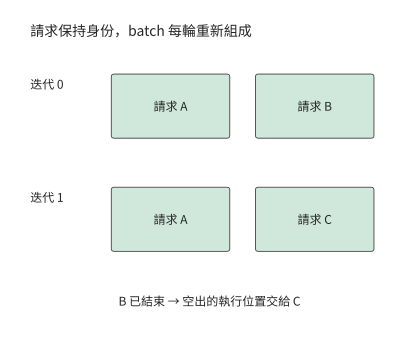

*圖 8-1：A 跨越兩個迭代繼續執行。B 在第一輪結束，下一輪由 C 接替其執行位置（每輪為一條活躍請求預留的一行計算）；請求狀態仍按各自身份儲存。*

請求到達後，先進入等待佇列。排程器將請求加入 batch、分配 KV 空間後，模型才開始處理輸入，即 prefill 階段。由於輸入 token 已經全部給定，模型可以同時計算多個 token，並儲存各層的鍵和值。提示的最後一個 token 計算完成後，模型生成第一個輸出 token。

隨後進入 decode 階段。模型將剛生成的 token 作為下一次前向計算的輸入，讀取上下文 KV，再生成下一個 token。同一條請求必須依次完成這些步驟，不同請求的當前步驟則可以一起計算。因此，即使單條請求只能逐個生成 token，例項仍能透過合批提高總吞吐量。

在這張卡上，實驗 8-1 單獨執行一條 2K 輸入的短請求：prefill 並返回首個 token 用時約 0.096 秒，此後平均每隔 26.5 ms 返回一個 token。假設這條請求先排隊 0.1 秒，使用者便在到達後的第 0.196 秒收到第一個 token。總共輸出 256 個 token，需要經歷 255 個輸出間隔，因此請求總耗時為

$$
0.1+0.096+255\times0.0265=6.95\ \mathrm{s}.
$$

這條請求能在 7 秒內完成。如果生成期間插入另一條短請求的 prefill，某個輸出間隔就要多等約 0.096 秒，從 26.5 ms 延長到約 123 ms，總耗時增加到 7.05 秒。每個 token 的計算內容沒有改變，僅僅調整執行順序，就可能使請求超時。

圖 8-2 把這 6.95 秒畫成一條時間線。首個 token 的返回時刻將時間線分成兩段：此前的排隊和輸入處理決定使用者何時看到響應，此後的 255 個間隔決定使用者何時收到完整答案。後續所有排程最佳化，都可以理解為改變這條時間線上某一段的長度。

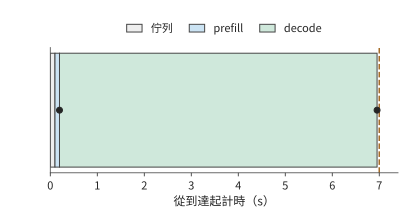

*圖 8-2：一條輸出 256 個 token 的請求。排隊 0.1 秒、prefill 0.096 秒，後續 255 個輸出間隔各為 26.5 ms（實驗 8-1 的 batch 1 實測）。橫條按實際時間比例繪製，點標出首、末 token；7 秒虛線是完成時限。*

請求完成後，排程器不再為它安排計算，狀態管理器則決定如何處理留下的 KV。該請求獨有的 KV 隨請求結束而釋放，公共字首的 KV 則可以保留下來供後續請求複用，由快取策略繼續管理。第 8.3 節將進一步說明這些快取何時共享、何時釋放。

### 8.1.2 權重、KV 與執行時緩衝的儲存容量需求

要讓多條請求沿各自的時間線向前執行，例項必須同時儲存權重、請求狀態和計算中間結果。本節的算例只用一張卡，因此只列出這張卡上的記憶體佔用。多卡例項則要按各卡儲存的權重分片、KV 和緩衝區分別列式：某張卡上的空閒記憶體，只有改變資料放置，才能用於另一張卡的計算。

用 $M_w$ 表示常駐權重的容量，$M_{\mathrm{KV}}$ 表示去除重複引用後的物理 KV 塊總容量（KV 按固定大小的塊分配，多條請求共用的塊只計一次），$M_a$ 表示啟用與普通工作區的容量，$M_u$ 表示計算圖重放等其他緩衝區的容量。這些記憶體佔用之和必須小於或等於加速器可用容量 $C$：

$$
M_w+M_{\mathrm{KV}}+M_a+M_u\le C.
$$

在這幾項記憶體佔用中，權重在請求到達前就已載入到記憶體，KV 則隨著請求到達和生成不斷增長。要算出例項能同時處理多少請求，先求每個 token 要儲存多少 KV。Qwen3-8B 有 36 層，每層有 8 個 KV 頭，每個頭的維度為 128。每個 token 在每層都需要儲存 K 和 V，BF16 每個元素佔 2 bytes，因此每個 token 所需的 KV 容量為

$$
k=2\times36\times8\times128\times2
 =147\,456\ \mathrm{bytes}=144\ \mathrm{KiB}.
$$

輸入 2048 個 token 後，KV 佔 288 MiB；輸入 8192 個 token 後，KV 佔 1152 MiB。所有請求共用約 15.3 GiB 權重，但每增加一條上下文獨立的長請求，就要增加 1.125 GiB KV。16 條長請求僅儲存輸入的 KV 就需要 18 GiB，超過預留的 12 GiB。[^batch]

生成輸出時，KV 還會繼續增長。prefill 產生第一個輸出 token，此後將前 255 個輸出 token 依次送回模型，生成剩餘的 255 個 token。短請求共計算 $2048+255=2303$ 個 token，長請求共計算 $8192+255=8447$ 個 token。若每塊容納 16 個 token，分別需要分配能容納 2304 和 8448 個 token 的空間。

| 獨立請求 | prefill 後 KV | 輸出 256 個 token 後的 KV 分配量 | 12 GiB 可同時容納的請求數 |
|---|---:|---:|---:|
| 短對話 | 288 MiB | 324 MiB | 37 |
| 長上下文 | 1152 MiB | 1188 MiB | 10 |

表中最後一列分別由 $\lfloor12288/324\rfloor$ 和 $\lfloor12288/1188\rfloor$ 得到。如果只按 prefill 結束時的 KV 大小計算，12 GiB 能容納 42 條短請求；但這些請求都生成 256 個輸出 token 後，所需空間會增加到 13,608 MiB。接收請求時就預留生成階段所需的空間，可以避免執行到一半才發現記憶體不足。

共享公共字首可以進一步節省記憶體。長請求的前 6144 個 token 佔 864 MiB KV，其餘輸入佔 288 MiB。如果 16 條請求各自儲存字首，就會儲存 16 份相同的 KV；如果引用同一份 KV，節省的空間便可用於各自的字尾。第 8.3 節將說明具體的塊對映方式，並計算生成結束時的總容量。

### 8.1.3 從單請求時間到服務目標

把第 8.1.1 節時間線的兩段寫成可以設定時限的指標。設請求到達時刻為 $t_a$，共輸出 $G$ 個 token，第一個與最後一個 token 返回給使用者的時刻分別為 $t_1$、$t_G$。於是

$$
\mathrm{TTFT}=t_1-t_a,
$$

第 $j$ 個輸出間隔為 $\mathrm{ITL}_j=t_{j+1}-t_j$。將首輸出之前與之後的時間相加，完整請求時間為

$$
T_{\mathrm{request}}=\mathrm{TTFT}+\sum_{j=1}^{G-1}\mathrm{ITL}_j.
$$

第 8.1.1 節的例子中，TTFT 為 0.196 秒，後續 255 個輸出間隔合計 6.76 秒。較短的 TTFT 讓使用者儘早看到響應，均勻的輸出間隔便於連續閱讀，而總耗時決定完整答案何時可用。SLO 將這些要求量化為時限。章首算例要求總耗時不超過 7 秒，排程算例還會比較最長輸出間隔。

這些指標針對單條請求；例項整體的產出，還取決於一次同時處理多少請求，即 batch size（下文簡稱 batch）。吞吐量表示單位時間內完成的工作量。實驗 8-1 同時處理 16 條 2K 請求時，引擎每輪 decode 約 27.44 ms，每輪共輸出 16 個 token，生成吞吐量約為 $16/0.02744\approx583$ token/s；單條請求每 26.26 ms 輸出一個 token 時，該值只有約 38。增加每輪輸出數或縮短每輪時間，都能提高吞吐量；使用者實際等待多久，還取決於請求開始執行前的排隊時間。

衡量服務效果還要檢查答案是否正確。固定輸出長度，便於在相同工作量下比較執行時間；讓模型自然停止，則可以觀察答案正確率、回答長度和重試次數。第 8.6 節將計算單位時間內正確且按期完成的請求數，同時評價速度與質量。

## 8.2 批處理與請求排程

### 8.2.1 權重複用如何提高批處理效率

考慮矩陣乘法 $Y=XW$，輸入矩陣 $X$ 有 $b$ 行。同一個權重元素參與所有行的計算，因此將多行一起處理，可以在讀取一次權重後完成更多乘加。假設每個權重元素在批內只讀取一次，每次乘加計為兩次運算，權重元素佔 $s_w$ bytes。只計權重讀取時，算術強度為

$$
I_{\mathrm{weight}}\approx\frac{2b}{s_w}.
$$

BF16 的 $s_w=2$。把同時執行一步 decode 的請求數從 1 增至 16，每條請求都提供一個新 token，各 token 的特徵向量分別佔輸入矩陣的一行；矩陣便從一行增至 16 行，同樣一次權重讀取對應的運算量增至原來的 16 倍。不同請求共用權重矩陣，但注意力計算仍要分別讀取各自的上下文 KV。

共用的前提是這一批請求用的是同一份權重。**低秩適配（LoRA）**放寬了這一前提：用兩個小矩陣的乘積表示權重的調整量，基礎權重原樣保留，於是不同任務可以共用一個基礎模型，各自只附加一份小的 adapter（介面卡，即附加在基礎模型上的可訓練參數模組）。對 Qwen3-8B 的 Q、V 投影取低秩維度 16、BF16，一套 adapter 佔 14.6 MiB，100 套合計 1.43 GiB，遠小於 14.1 GiB 的矩陣權重。

一批請求若來自不同 adapter，共用的就只剩基礎權重這一部分。低秩計算要按 adapter 分組，每組的行數是本批中屬於該 adapter 的請求數；adapter 分得越散，每組行數越少，這部分的權重複用就越差。因此，一批裡放幾種 adapter 和放多少條請求，是兩個要分開決定的量。

容量上同樣要分開算。100 套 adapter 佔 1.43 GiB，而 100 條互不共享的 8K 上下文，KV 合計 112.5 GiB。能容納多少套 adapter 由小矩陣決定，能同時服務多少條請求仍由 KV 決定；前者寬裕，不等於後者也寬裕。[^lora]

設每輪只需讀取一次的矩陣權重大小為 $D_w$，每條請求有 $L$ 個上下文 token，彼此不共享 KV，每個 token 的 KV 容量為 $k$。一輪的讀取總量，以及平均每個輸出 token 分攤的讀取量，分別為

$$
D(b,L)=D_w+bLk,\qquad
d(b,L)=\frac{D_w}{b}+Lk.
$$

在每個輸出 token 的讀取量中，第一項是分攤後的權重讀取，第二項是本請求的上下文 KV 讀取。Qwen3-8B 的 $D_w$ 約為 14.1 GiB，2K 上下文的 KV 為 0.28125 GiB。當 batch 從 1 增加到 16 時，每個輸出 token 分攤的權重讀取降至約 0.88 GiB；batch 增至 64 時，再降至約 0.22 GiB。此時，每個輸出 token 讀取的 KV 已經比權重更多。[^batch]

圖 8-3 展示了這一變化。橫軸上相鄰的刻度表示 batch 加倍，因此權重項每次減半；KV 項保持不變，兩項之和逐漸接近 KV 對應的水平線。上下文為 2K 時，batch 從 1 增至 64，每個輸出 token 的讀取量從約 14.38 GiB 降至 0.50 GiB，約為原來的 1/29。上下文長度增至 8K 後，KV 容量變為原來的四倍，合批後的每個輸出 token 仍需讀取更多資料。

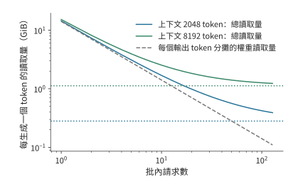

*圖 8-3：批處理怎樣減少每生成一個 token 所需的讀取量。橫軸為同時生成的請求數，縱軸為整批讀取位元組數除以本輪輸出 token 數。藍、綠實線分別對應每條請求已有 2048、8192 個 token 的上下文，包含權重與 KV 讀取；同色水平點線僅表示該長度下的 KV 讀取量。灰色虛線表示批內共用的權重讀取量除以請求數。模型為 Qwen3-8B，使用 BF16；每份矩陣權重每輪讀取一次，各請求的 KV 獨立。兩軸均為對數刻度。*

隨著 batch 增加，分攤權重帶來的節省逐漸減少。可以用權重讀取量與 KV 讀取量相等時的 batch 描述這一變化。使整批 KV 讀取量達到或超過共享權重讀取量的最小 batch 為

$$
b_{\mathrm{KV}}=\left\lceil\frac{D_w}{Lk}\right\rceil.
$$

用未經四捨五入的權重位元組數計算，2K 上下文的結果為 51，8K 上下文為 13。上下文長度增至四倍後，KV 讀取在小得多的 batch 下就超過了權重讀取。與此同時，更大的 batch 也需要更多記憶體：64 條 2K 請求的權重和一步 decode 後的 KV 合計約佔 35.7 GB。合批減少了每個輸出 token 的讀取量，卻增加了同時駐留的資料量。

再估算這些讀取所需的時間。設每條請求的運算量為 $F$，加速器每秒完成 $P$ 次運算，記憶體頻寬為 $\beta$。分別計算運算與讀取所需的時間，再取較大者估計一輪執行時間：

$$
T_{\mathrm{step}}\approx\max\left(\frac{bF}{P},\frac{D_w+bLk}{\beta}\right).
$$

令兩項相等並整理，得到 $b(F/P-Lk/\beta)=D_w/\beta$。每增加一條請求，計算時間增加 $F/P$，KV 讀取時間增加 $Lk/\beta$。前者更大時，計算時間會隨著 batch 增長而追上讀取時間；否則讀取始終耗時更長。上述 51 和 13 比較的是兩類資料的讀取量，這裡的方程比較的是計算與記憶體頻寬對執行時間的限制。

兩項分別按峰值算力和峰值頻寬計算，得到的是這張卡在這組條件下的物理下界。下界與實測一輪時間之比，就是第 1.2.2 節定義的 MFU 和 MBU；第 8.6.3 節將用逐輪記錄校準這兩個比值，再用於本章其餘算例。

落實到請求時間上，還要看更大的 batch 是否延遲了首個 token，以及相鄰輸出之間是否等得更久。batch 掃描實驗同時記錄了這兩項變化。Qwen3-8B 輸入 2K、輸出 256 個 token 時，batch 從 1 增至 64，總吞吐量從約 37 增至 1165 token/s；但首個 token 的返回時間從約 96 ms 延後到 3.29 秒，平均輸出間隔從約 27 增至 40 ms。每輪輸出雖然更多，但處理更多輸入、執行更大的 batch 也花了更多時間。該實驗中每批請求同時提交；線上服務若額外等待 batch 集滿，這段時間還要計入首 token 延遲。[^batch-measure]

> **練習 8-1 · 計算：batch 增大時的讀取量變化。** 取 $D_w=15,136,811,008$ bytes、$k=144$ KiB，計算 2K 與 8K 上下文在 batch 為 1、4、16、64 時每個輸出 token 的讀取量，並分別求兩種上下文長度下，KV 讀取量首次達到或超過分攤權重讀取量的最小整數 batch。再用 12 GiB KV 可用記憶體、每塊 16 個 token 和 256 個輸出，分別求兩種上下文長度下最多可以接納多少條獨立請求。比較可容納請求數的上限與兩類讀取量相等時的 batch，判斷容量限制是否會先阻止 batch 繼續增大。

如果權重改由足夠快的獨立儲存提供，讀取耗時減少，批處理的收益就需要重新計算。沿用第 4 章的 8K 示例，設 $W$ 為整批讀取的權重位元組數，$B$ 為批內請求數，$K$ 為單請求本步讀取的 KV 位元組數。傳統方案中，每個輸出 token 分攤的 HBM 讀取量為 $W/B+K$；權重由足夠快的獨立 ROM 提供時，HBM 每輸出一個 token 仍需讀取 $K$。[^core-calculation] 圖 8-4 中兩條曲線的距離隨 batch 增大而縮小，說明原先依靠 batch 攤薄權重讀取的收益正在消失。

不過，batch 仍會影響矩陣計算對計算單元的利用率，以及 batch 內的 KV 讀取量。將新的讀取量代入上述時間模型，就能求出計算與 KV 讀取的交點，再按首 token 延遲和輸出間隔選擇 batch。

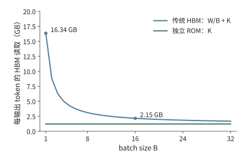

*圖 8-4：每輸出 token 分攤的 HBM 讀取量。固定 8K 上下文，傳統路徑為 W/B+K，獨立快速 ROM 路徑為 K；縱軸按上述公式計算讀取量。W 是整批讀取的權重位元組數，B 是批內請求數，K 是單請求本步讀取的 KV 位元組數；W/B+K 為每個輸出 token 分攤的讀取量。*

### 8.2.2 從固定 batch 到連續批處理

兩條請求同時開始生成，一條需要八個 token，另一條只需要兩個。短請求結束以後，長請求還要繼續六步。如果一定要等這兩條請求都結束才接下一組，短請求空出的執行位置就會一直閒置。**固定批處理**按整組接收、整組結束；連續批處理則在迭代邊界重新安排活躍請求，空出位置後即可接納新請求。

第 8.2.1 節的 batch 分析假定一輪中有 $b$ 條請求參與計算，實際行數會隨請求結束和新請求加入而變化。圖 8-1 中的執行位置對應這裡的一行計算，與第 7 章記錄通訊請求的槽位是不同的資源。能否及時補入新請求，決定了下一輪還能有多少行參與計算。

新請求更早進入，也意味著其輸入計算更早佔用加速器。若新請求帶有較長的提示，prefill 就會延長已有請求兩次 decode 之間的等待。排程器因此要在兩件事之間分配加速器時間：處理新請求的輸入，以及讓已有請求繼續生成。[^schedule-survey]

**算例：連續批處理為何縮短總時間，卻延長輸出間隔？** 最多同時執行兩條請求。r0、r1 在零時刻到達，各輸入 2048 個 token，分別輸出 8、2 個 token；r2 在 20 ms 到達，輸入 8192 個 token、輸出 2 個 token；r3 在 30 ms 到達，輸入 2048 個 token、輸出 4 個 token。每輪耗時由實驗 8-1 的 batch 1 實測擬合：固定 26.22 ms，每個新 token 加 30.4 μs，每對滿足因果關係的查詢與鍵加 3 ns。這組參數復現了 2K 請求單獨執行時一輪 decode 的 26.26 ms 和 prefill 的 94.8 ms。固定部分是一輪中與 token 數無關的時間，包括讀取整份權重（按 1792 GB/s 的峰值頻寬約需 8.4 ms）和逐個提交 kernel 等開銷。[^schedule]

固定 batch 讓 r2、r3 等待 r0、r1 整組結束，總時間約 870 ms。連續批處理在 r1 結束後接納 r2，總時間降到約 766 ms；但 r0 的下一次輸出要等 r2 的 8K prefill，最大輸出間隔從約 26 ms 增至 376 ms。總時間節省約 12%，一次輸出停頓卻增長到原來的 14 倍。

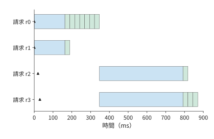

*圖 8-5：固定 batch 等待整組結束，再接納 r2、r3。藍色為 prefill，綠色為 decode，三角為到達時刻。各色頻寬度為整次排程迭代耗時，時間按 RTX PRO 6000 上的實測擬合計算。*

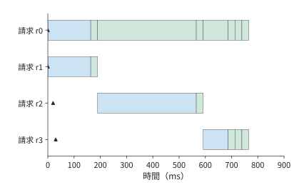

*圖 8-6：連續批處理在 r1 結束後接納 r2。每行是一條請求；藍色為處理輸入（prefill），綠色為生成輸出（decode），三角形為請求到達時刻，色頻寬度為所在排程迭代的耗時。r0 等待 r2 的 8K 輸入處理，最長輸出間隔增至約 376 ms；全部請求約 766 ms 完成。*

進一步把 r2 的 prefill 分成每塊 2048 個 token，每輪最多處理 4096 個 token（與實驗 8-1 的設定相同），每次先讓已有請求繼續 decode，再執行一段輸入。最大輸出間隔降到約 133 ms，所有請求的總完成時間約為 844 ms。分塊後，排程器能更頻繁地安排已有請求繼續生成，使輸出間隔更均勻。

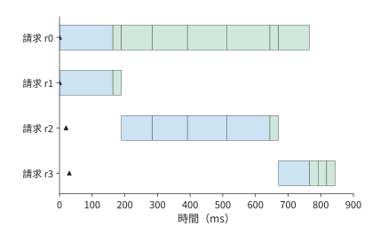

*圖 8-7：將長輸入分塊處理，每輪先安排已有請求生成，再處理一塊新輸入。每行是一條請求；藍色為輸入處理，綠色為輸出生成，三角形為到達時刻。分塊使最長輸出間隔降至約 133 ms，全部請求約 844 ms 完成。橫軸與圖 8-5、8-6 使用相同時間尺度。*

### 8.2.3 長 prefill 對生成的干擾與分塊執行

一次處理的 prefill 塊越大，新請求所需的輸入處理輪數越少；塊越小，已有請求就越早得到下一次執行機會。排程器通常先安排正在 decode 的請求，再用本輪 token 上限中剩下的部分處理 prefill。這樣，長輸入就分散到多個輸出間隔裡計算。

塊長相同，注意力的工作量仍會隨著上下文增長。設本塊包含 $c$ 個新 token，已有上下文長度為 $h$。第一個新 token 關注 $h+1$ 個 token，第二個關注 $h+2$ 個，最後一個關注 $h+c$ 個。把這些配對逐項相加：

$$
N_{\mathrm{pair}}=(h+1)+(h+2)+\cdots+(h+c)
=ch+\frac{c(c+1)}{2}.
$$

$ch$ 來自新 token 對舊上下文的訪問，三角形項來自塊內的因果注意力。取 $c=512$，首塊的 131,328 個配對全部來自塊內；8K 輸入的末塊已有 7680 個上下文 token，配對數增至 4,063,488，約為首塊的 31 倍。

圖 8-8 將配對數畫成面積：每個新 token 都要訪問全部舊上下文，形成左側矩形；塊內只能關注當前 token 位置及其之前的位置，形成右側三角形。塊長固定時，右側三角形不變，左側矩形隨上下文增長而變寬。這就是末塊需要更多注意力計算的原因。

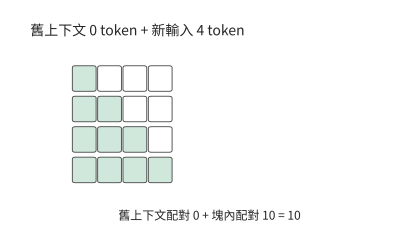

*圖 8-8：首次處理 4 個 token 時，沒有舊上下文，只有新 token 之間的因果注意力配對，形成 1 + 2 + 3 + 4 = 10 個綠色格。白格表示未來 token，不參與當前查詢。*

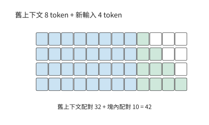

*圖 8-9：已有 8 個 token 的上下文時，4 個新 token 與舊上下文形成 4 × 8 = 32 個藍色格，塊內仍為 10 個綠色格。塊長相同，總配對從 10 增至 42。*

模型還要執行投影和 FFN，這些對各 token 分別做特徵變換的計算每塊都處理 512 個新 token，工作量基本相同。在已有逐塊記錄中，末塊的模型主幹矩陣運算量比首塊多約 32%，執行時間中位數從約 25.3 ms 增至 35.1 ms，增加約 39%。整塊執行時間因此由兩部分共同決定：一部分主要隨新增 token 數變化，另一部分還隨已有上下文長度增長。[^chunk]

上下文增長解釋了同樣大小的塊為何越來越慢；縮小塊長則會帶來另一種開銷。把一個 256 個 token 的塊拆成兩個 128 個 token 的塊，排程機會增加一次，矩陣行數減半，每個小塊都要使用同一份權重。以一層 FFN 的 288 MiB 權重為例，設兩次執行分別從視訊記憶體讀取它們，這部分讀取就從 288 增至 576 MiB。小塊讓已有請求更早獲得執行機會，也增加了執行次數；排程器應選擇能滿足輸出間隔要求的較大塊，使新增啟動與讀取儘量少。[^nanoflow]

### 8.2.4 Token 預算、動態形狀與執行時間

排程器通常設定每輪處理的 token 數量上限，稱為 token 預算；第 8.2.2 節分塊算例中每輪最多處理的 4096 個 token 就是一例。實際執行則要把這些 token 的特徵向量組成矩陣，並選用 kernel 或預先捕獲的 CUDA Graph（第 5.5.2 節）。實際執行的矩陣可能比本輪需要的更大，因此少處理一個 token，並不一定能少做一份計算。

例如，預先捕獲 16 行和 32 行兩種計算圖，將 17 到 32 行的輸入都填充到 32 行。把工作從 18 行減為 17 行，仍執行 32 行圖；再從 17 行減為 16 行，才能使用較小的圖。若為 17 行另捕獲一個圖，就省去 15 行填充，但捕獲該圖需要準備時間，重放所用的緩衝區還要長期佔用記憶體。因此，選擇 CUDA Graph 的預設形狀時，也要計入第 8.1 節的執行時記憶體開銷。

執行形狀決定一輪的耗時，token 上限則決定這一輪分給新請求多少工作。增加上限能讓長輸入更早處理完，但已有請求要等這輪結束才能繼續輸出。在六條請求的回放記錄中，請求每隔 80 ms 到達。每輪 token 上限從 512 增至 8192，後到請求在引擎中排隊的時間從約 149 ms 降到不足 0.1 ms，最長輸出間隔卻從約 32 增至 183 ms。上限越高，一輪完成的輸入越多，新請求越早離開佇列，已有請求等待下一次輸出的時間也越長。[^replay]

因此，可以分兩步確定每輪處理多少 token。先根據允許的輸出間隔確定一輪最多執行多久，再結合上下文長度和預設執行形狀，換算為可處理的新 token 數。在相同時間內，上下文較長的請求能處理的新 token 較少，上下文較短的請求則可以使用更大的塊。確定執行安排後，還要為這些請求分配 KV 空間；下一節將討論如何分配和複用這部分記憶體。

> **練習 8-2 · 核心 · 分析：由輸出間隔限制確定 prefill 分塊大小。** 採用第 8.2.2 節的四條請求與執行時間模型，手算 r0、r1 的初次 prefill 和下一步 decode 各需多久，再計算連續批處理接納 r2 時該輪的耗時。解釋最長輸出間隔的來源。固定新塊長度 $c=512$，分別計算已有上下文長度 $h=0$ 與 $h=7680$ 時的注意力配對數。最後分析配套的六條請求回放記錄，在「最長間隔小於 50 ms」和「後到請求儘快接納」兩種目標下分別選擇每輪 token 上限，並指出哪一項耗時決定了選擇。

## 8.3 KV 快取的分配、複用與釋放

### 8.3.1 預留、碎片與分頁分配

第 8.1 節按最大輸出長度為每條請求預留空間，保證它能持續生成。如果請求提前結束，預留空間的尾部就一直沒有使用。另一種辦法是隨生成過程逐步擴充套件記憶體，但若必須保持空間連續，鄰接區域被其他請求佔用時，就需要搬移資料或等待。

可以把這種分配比作活頁冊：閱讀順序由頁碼確定，各頁不必放在相鄰位置，只要記得每一頁在哪裡。序列增長時，在任意空位放入新頁並記錄其位置，就不必為了連續排列而搬動整冊內容。

**分頁分配**將序列分成固定大小的塊。**邏輯塊**按序列中的 token 位置編號，相當於頁碼；**物理塊**是實際儲存 KV 的記憶體區域；每條請求維護的**塊表**記錄邏輯塊對應哪個物理塊。序列增長到需要新塊時，引擎從空閒池分配一個物理塊，並增加對映。注意力計算根據塊表找到所需位置的 KV，因此物理塊可以分散存放。這裡討論的是 KV 在記憶體中的分塊定址，多級儲存之間的換入換出留到第 8.3.4 節和第 8.4.3 節討論。

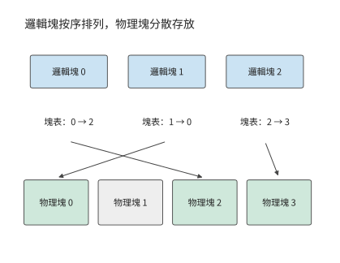

*圖 8-10：邏輯塊 0、1、2 按順序組成序列，塊表分別指向物理塊 2、0、3。物理塊 1 為空閒，注意力按塊表恢復邏輯順序。*

設每塊可儲存 $p$ 個 token 的 KV，當前長度為 $L$，需要 $\lceil L/p\rceil$ 個塊。只有最後一塊存在尾部未使用的 KV 槽位，浪費為

$$
p\left\lceil\frac{L}{p}\right\rceil-L,
$$

最多浪費 $p-1$ 個 token 的 KV 空間。塊越小，這一上限越低，塊表項和分配次數也越多。2023 年，伯克利等機構的研究者在 vLLM 中提出 PagedAttention，將作業系統分頁管理的思路用於 KV 快取，減少預留空間與記憶體碎片對服務並行的限制。PagedAttention 將這種對映帶入注意力執行；FlashAttention 則在運算子內部組織分塊計算與中間結果，兩者分別作用於狀態分配和計算訪存。

**算例：KV 分頁分配能減少多少預留空間？** 設 A、B、C、D 當前長度分別為 9、13、5、15，每條最大允許 16 個 token。整段預留時，四條請求共預留可儲存 64 個 token 的 KV 空間；取 $p=4$，分頁分別分配 12、16、8、16，共可儲存 52 個 token 的 KV 空間。其中實際儲存的 KV 仍對應 42 個 token，未用容量從 22 個 token 減到 10 個 token。

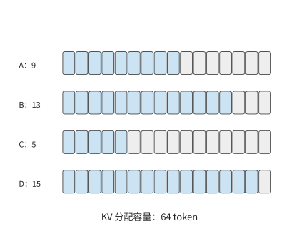

*圖 8-11：四條請求分別含 9、13、5、15 個 token，每條預留可儲存 16 個 token 的 KV 空間，共分配可儲存 64 個 token 的 KV 空間。藍色已用，灰色預留未用。*

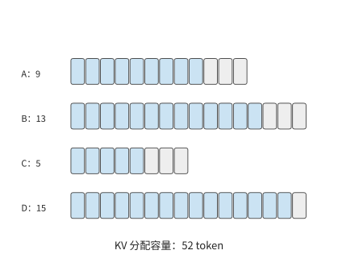

*圖 8-12：按每塊儲存 4 個 token 的 KV 分配空間，四條請求分別獲得 12、16、8、16 個 token 的容量，合計 52 個。灰色表示塊尾未用容量，由 22 個 token 減到 10 個 token。*

若 A、B 的前八個 token 相同，還可以讓它們共用兩個完整塊，使總分配量進一步降至 44 個 token。分頁減少了尚未使用的預留空間，共享消除了重複儲存的上下文，兩者節省的是不同部分的記憶體。

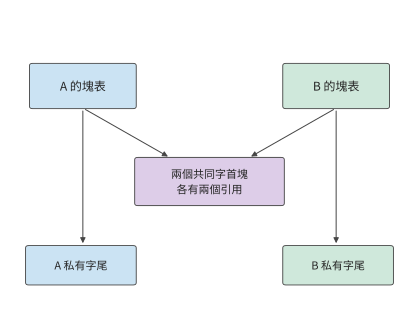

*圖 8-13：A、B 的兩個共同字首塊只儲存一次，各自塊表都指向它們。A、B 保留各自的私有尾塊；四條請求實際分配的 KV 容量進一步降至 44 個 token。*

### 8.3.2 分支共享、寫時複製與記憶體釋放

字首共享圖中，B 與 A 引用相同的兩個物理塊。如果 A 先結束，這兩個塊仍要留給 B；如果 B 要修改其中的內容，又不能影響 A。要實現共享，就需要確定何時釋放共享塊，以及如何避免不同請求互相覆蓋資料。每張塊表中指向某個物理塊的記錄稱為一個**引用**，共享塊由多個塊表引用；**引用計數**記錄還有多少使用者需要它。每當一條請求獲得引用，引用數加一；請求結束時釋放引用。最後一個引用釋放後，該塊才能回到空閒池；此時還要確認加速器操作不再訪問它。這樣，同一份共同上下文既能服務多個分支，也能在其中一條分支結束後繼續服務其餘分支。

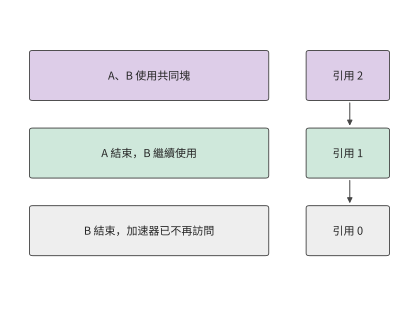

*圖 8-14：A 結束後引用數從 2 降到 1，B 仍可使用；最後一個引用釋放且加速器已用完，塊才能回到空閒池。*

寫入共享尾塊需要取得獨立副本。例如，可存 4 個 token 的塊中已寫入三個共同 token 的 KV，兩個分支接下來分別寫入不同 token。如果寫到原塊，兩條分支會爭用塊中的第四個 token。**寫時複製**是在修改共享內容之前取得私有副本的機制。此時先複製這三個 token，兩條分支分別追加；此前已填滿的只讀塊繼續共享。隨著分支增長，公共字首保持一份，各分支分別儲存自己新增的字尾。

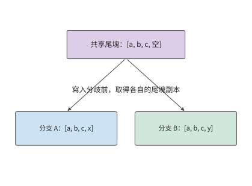

*圖 8-15：每塊 4 個 token 的尾塊已有共同的 a、b、c。分支分別追加 x、y，需要不同物理尾塊；此前已填滿的塊繼續共享。*

在已有的四分支實驗中，公共字首佔 95 塊，每條分支另有 9 個私有塊。四張塊表共有 $4(95+9)=416$ 次引用，但實際物理塊數只有

$$
95+4\times9=131.
$$

獨立儲存需要 416 塊，共享後減少約 69%。這項節省來自對公共字首的去重，36 個私有尾塊仍隨分支數增長。[^pages]

服務系統知道哪些 token 屬於共同字首，哪些 token 會在分支後獨立寫入，因此可以把模型的複用關係落實為物理塊共享。塊表負責地址對映，字首關係決定共享範圍，分支寫入時才建立私有副本。原來按整條請求獨立預留的空間，由此改為按實際產生與複用的狀態分配。

**公共字首共享後的整批 KV 容量。** 16 條長請求共享前 6144 個輸入 token，其 KV 共佔 864 MiB。每條請求的私有部分包含 $8192-6144+255=2303$ 個 token。按每塊 16 個 token 分配，需要容納 2304 個 token，即 324 MiB。因此，整組請求生成完畢時所需的 KV 空間為

$$
M_{\mathrm{KV}}=864+16\times324=6048\ \mathrm{MiB}.
$$

這組請求原來需要 $16\times1188=19008$ MiB，共享後約為 5.91 GiB，可以放入預留的 12 GiB 記憶體。一般地，$b$ 條同類長請求佔 $864+324b$ MiB，因此容量上限從 10 條獨立請求增加到 35 條共享請求。

塊用完之後，還要正確釋放才能交給後續請求。釋放記憶體需要同時滿足兩個條件：沒有使用者繼續持有引用，已提交的加速器操作也不再訪問該塊。使用者取消請求後，排程器停止安排新計算，等待已提交的操作完成，隨後釋放私有塊。一次觀察中，取消呼叫約 1.6 ms 就返回了，而對應的 104 個塊直到約 31 ms 才釋放。後續請求在釋放之後使用這些塊，便不會覆蓋舊請求仍在讀取的資料。[^cancel]

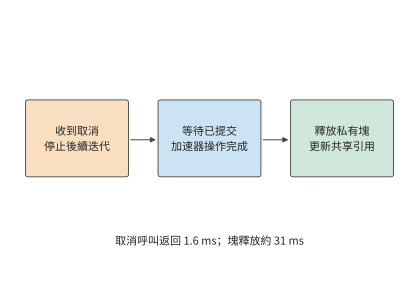

*圖 8-16：取消介面返回表示已接收取消請求。已提交的加速器操作完成後，再釋放私有塊和相關引用；觀測中的 1.6 ms 與 31 ms 對應不同事件。*

除了請求結束或取消後的正常釋放，記憶體不足時，引擎還可以搶佔一條請求：暫停該請求並釋放其 KV，之後再根據已儲存的輸入和輸出重新計算狀態。同一組實驗使用 1 GiB KV 池時發生了一次搶佔，比正常執行多排程 1805 個 token；使用 2 GiB 池時則沒有這次重算。搶佔暫時把記憶體讓給其他請求，代價是恢復執行時需要重複計算。[^pages]

> **練習 8-3 · 計算：KV 塊大小與字首共享如何影響容量。** 將四條長度 9、13、5、15 的序列分別按 2、4、8 個 token 分頁，計算四條序列各自尾塊中未使用的 KV 槽位數，並分別求出未使用 KV 槽位和塊表項的總數。再按章首算例計算 8、16、32 條長請求在獨立與共享狀態下的完整容量。保持每條請求的總長度不變，將一個原本私有的完整塊改為公共字首的一部分，求 $b$ 條請求合計可以少分配多少物理塊。

### 8.3.3 對話與智慧體的字首複用

第 8.3.2 節計算了同時執行的請求如何共用物理塊。這種共享還可以跨越請求的結束時刻：舊請求留下的字首 KV，能讓後來的請求免去同一段輸入的計算。如果後續請求的字首完全相同，並使用相同的模型、位置編碼規則、adapter 和狀態格式，就能直接使用快取中的 KV，從字首末端繼續 prefill。章首算例的公共字首有 6144 個 token，命中快取後，每條長請求只需處理剩餘 2048 個輸入 token，再開始生成。

這種複用沿字首連續發生。假設兩條提示前 100 個 token 相同，第 101 個不同，即使後面的文字又相同，它們從第 101 個 token 起所依賴的上下文已經不同。把動態時間戳放在提示最前面，會使後面較長的共同工具定義失去複用機會；把穩定的系統提示與工具定義放在前面，再追加本輪變化，就能保留較長的公共字首。[^context]

字首樹把這種結構直接表達出來：從根到分叉點是共同上下文，從分叉點到葉子是私有字尾。圖 8-17 的前四輪輸入首先共享 206 個 token，後三輪又沿同一條路徑延伸。樹上的邊按新增 token 數標記，葉子給出完整輸入長度。

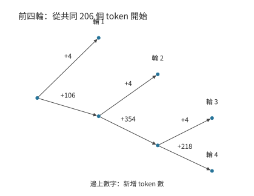

*圖 8-17：前四輪程式碼 Agent 輸入的壓縮字首樹。根部已有 206 個共同 token，邊上是新增數量，葉子是輸入輪次。分叉表示後續內容不同。*

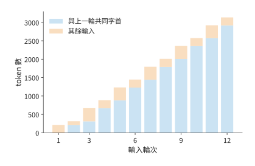

*圖 8-18：藍色為與上一輪逐 token 相同的字首，橙色為其餘輸入。此圖描述輸入內容的可複用程度，實際快取命中還取決於狀態是否保留。*

每輪在末尾追加內容，可以保留已有的公共字首，但上下文越長，KV 佔用和後續讀取量也越大。

**擴充套件：混合注意力模型如何確定可恢復的字首位置。** 全注意力保留逐 token KV，遞推模型通常只保留當前狀態。設文字匹配到第 10,752 個 token，遞推快照分別儲存在第 4096 和第 8192 個 token；系統從 8192 恢復，再計算到 10,752，重算 2560 個 token。增加快照可以減少重算的 token 數，但要儲存更多狀態。以第 2 章的 KDA 為例，一種實現將層內張量分到八張卡（TP=8），此時每卡每份快照約 53.6 MiB，儲存 2 份約 107 MiB，儲存 32 份約 1714 MiB。快照儲存得越密，恢復時需要重算的 token 就越少，保留的狀態也越多。[^hybrid]

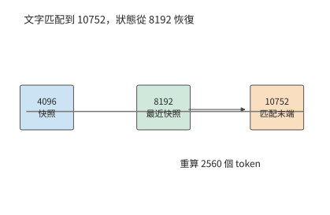

*圖 8-19：文字匹配到 10752，最近狀態快照在 8192。恢復後仍需重算 2560 個 token，才能得到匹配末端的遞推狀態。圖中 10752 和 8192 是從序列起點累計的 token 數。*

**上下文編排還可以主動改變複用機會。** 假設已有 8K token 的上下文，下一輪追加 1K 工具結果，最多可複用原來的 8K 字首，只需處理新增部分；如果改寫最前面的指令，後面的內容即使文字相同也不能繼續複用。另一種方案是把歷史總結為 2K，再追加 1K。摘要替換原始歷史後，後續計算使用更短的上下文，但多出一次總結與重新處理的開銷。因此，組織上下文時，需要同時考慮記憶體佔用、重算時間和後續讀取量。

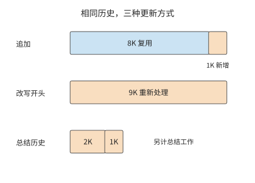

*圖 8-20：同一歷史的三種更新方式。藍色表示可複用字首，橙色表示需要重新處理的輸入；總結方案先生成摘要，再重建快取。長度以 K token 示意。*

模型側的字首複用還涉及更細的狀態區分。DeepSeek V4.1 在複用字首時，對兩類區域性狀態分別處理。第 2 章介紹的 CED 結構包含因果編碼器和解碼器，兩者各有 SWA 的區域性狀態：**編碼器 SWA**可以在主機 DRAM 池中短期保留，供下一輪沿已有字首繼續處理新輸入；**解碼器 SWA**只為本輪後續生成使用，論文中的部署不把它作為字首快取儲存。全域性 KV 則進入可較長期複用的快取。因此，生成期間駐留的 40 層 SWA 與跨輪次保留的字首快取，需要分別計算容量。[^v41-case]

這兩類狀態是否命中，決定了下一輪續算時編碼器要恢復多少字首。設工具返回後，恢復所需的 token 或輸入表示仍可取得，模型版本、token 位置索引與輸入保持一致。全域性 KV 和編碼器 SWA 都命中時，編碼器直接處理追加輸入；僅全域性 KV 命中時，編碼器重放已快取字首的最近最多 128 個 token，並與未快取字尾一起執行。重放段重建編碼器 SWA，繼續使用既有全域性 KV；新增字尾產生新的全域性 KV 和 SWA。全域性 KV 也未命中時，則重算缺失字首。

隨後，每次 prefill 都有共同的一步：取完整提示末尾最多 128 個 token 的編碼器輸出，經過 20 層解碼器，近似構建解碼器 SWA，為第一步 decode 準備區域性狀態。因此，編碼器快取全部命中時，可以省去編碼器的字首恢復，但解碼器仍需執行視窗重放。

短視窗重放得到的是近似恢復的狀態，誤差來自更早的區域性依賴被截斷。每層雖然只訪問最近 128 個 token，多層疊加後，區域性狀態仍可透過前一層間接依賴更早的輸入。從視窗邊界重新執行，會改變這部分歷史資訊。技術報告第 3.2.2 節因此將編碼器重建的狀態定義為近似狀態；這一狀態又參與後續計算，使新增字尾的全域性 KV 和 SWA 隨恢復起點變化。

兩類狀態的區分最終體現在快取容量上。在 DeepSeek V4 技術報告採用的工作負載與快取策略下，SWA 約佔長期快取的一半。V4.1 將這部分移出持久化快取，再將全域性 KV 壓到約四分之一，長期儲存量因此約為原來的 $1/2\times1/4=1/8$。短期保留的編碼器 SWA 放在 DRAM 中，解碼器 SWA 則在本輪生成時駐留加速器。快取按使用時段分層儲存，進一步降低了長期容量需求。

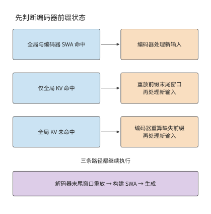

*圖 8-21：編碼器的三條字首恢復路徑與共同的解碼器重放。快取命中狀態中的 SWA 專指編碼器；所有路徑在 prefill 中仍構建解碼器 SWA，再開始生成。箭頭表示執行先後，框大小不代表耗時。*

### 8.3.4 快取准入、淘汰、換出與重計算

請求結束後保留字首，是為了將來再次使用時省去重算。設字首再次用到的機率為 $p_h$，重算時間為 $T_r$，從快取取回並準備好狀態的時間為 $T_f$，維護快取所需時間為 $T_m$。每次命中能節省 $T_r-T_f$；乘以命中機率，再減去維護時間，就得到期望淨節省：

$$
V_h=p_h(T_r-T_f)-T_m.
$$

以章首長請求的 6144 個 token 公共字首為例，它的 KV 佔 864 MiB（0.906 GB）。在 RTX PRO 6000 上重算這段字首要做 96.5 TFLOP 的矩陣運算，按實驗 8-1 中 batch 1 prefill 達到的 BF16 峰值的 62%（第 8.6.3 節）計，約需 307.9 ms。把這段字首換出到主機記憶體後，經這張卡的 PCIe Gen5 x16 鏈路 (Link)（每方向 64 GB/s）取回約需 14.2 ms；[^pcie]維護開銷取換出時寫回主機的一次傳輸，也是 14.2 ms。命中機率為 50% 時平均節省 132.7 ms。要讓保留字首節省時間，需滿足

$$
p_h>\frac{T_m}{T_r-T_f}=\frac{14.2}{293.7}=4.8\%.
$$

若主機鏈路 (Link)換成 PCIe Gen4 x16（每方向 32 GB/s），取回和換出各增至 28.3 ms，每次命中只省 279.6 ms，所需的最低命中機率升至 10.1%。換出釋放了加速器空間，但只有字首足夠常用，才能抵消取回和維護所需的時間。

字首值得保留，並不意味著應該優先保留。空間緊張時，大字首會佔用原本能儲存多個小字首的空間。設 A 為上述 6144 個 token 字首；每個 B 類字首含 2048 個 token，佔 288 MiB，同樣按 PCIe Gen5 取回與換出，重算 94.7 ms、取回和維護各 4.7 ms，命中機率同為 50%，期望節省 40.3 ms。圖 8-22 將兩者放進同樣大小的快取：儲存一個 A 能節省 132.7 ms，儲存三個 B 合計節省 120.9 ms。重算時間隨字首長度超線性增長，6144 個 token 的 prefill 是 2048 個 token 的 3.25 倍，因此同一塊記憶體用於儲存長字首的收益更高。

這種比較也可以換算成單位容量的收益：A 每 MiB 約節省 0.154 ms，B 約節省 0.140 ms。按該數值排序，可以比較大小不同的字首。

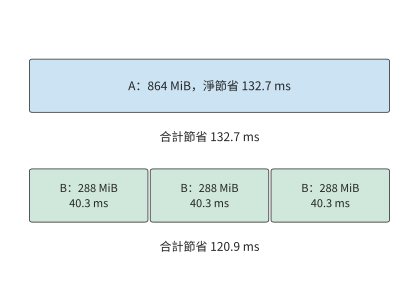

*圖 8-22：快取容量均為 864 MiB。A 佔 864 MiB，期望淨節省 132.7 ms；三個 B 類字首各佔 288 MiB、各節省 40.3 ms，合計 120.9 ms。圖中寬度表示容量；時間按 RTX PRO 6000 上的重算時間和 PCIe Gen5 取回時間計算，命中機率均為 50%。*

上述選擇有一個前提：字首必須保留到下一次使用時。快取容量不足時，即使下一輪輸入保留了相同字首，也可能因為狀態已經淘汰而要重新計算。一次 12 輪 Agent 輸入回放包含 19,556 個輸入 token。在相同干擾請求下，6 GiB 快取池命中 16,304 個 token，只需重新處理 3252 個；1 GiB 池則沒有命中，需要重新處理全部輸入。將相鄰兩輪之間的等待時間增加 0.2 秒後，命中數量沒有改變。這組對照中，增加容量保留了可複用的字首，單純延後下一輪請求沒有產生同樣的效果。[^prefix]

**快取准入**決定請求結束後是否保留其字首；淘汰策略決定空間不足時先刪除哪個字首；換出策略決定將狀態移到哪一級儲存；重計算策略決定重新執行多少輸入 token。對於章首的 16 條長請求，保留一份公共字首只需 864 MiB，卻能同時節省重複儲存和後續請求的 prefill 計算。

> **練習 8-4 · 核心 · 分析：有限快取應保留哪些字首，才能節省最多時間？** 快取可用空間為 864 MiB。字首 A 含 6144 個 token、佔 864 MiB；三個相互獨立的 B 類字首各含 2048 個 token、佔 288 MiB。在 RTX PRO 6000 上，按 BF16 峰值 503.8 TFLOP/s 的 62% 由矩陣運算量求重算時間，按 PCIe Gen5 x16 每方向 64 GB/s 求取回時間，維護時間取一次換出，與取回相同；命中機率均為 50%。比較保留一個 A 字首與保留三個 B 類字首的期望淨節省時間。保持 B 類字首的命中機率不變，求 A 的命中機率低於多少時，應改為保留三個 B。再把鏈路 (Link)換成 PCIe Gen4 x16（每方向 32 GB/s），重新比較。資料分析部分讀取配套 12 輪輸入與快取回放，分別計算共同字首比例和實際命中比例，解釋其他請求佔用快取空間為何會影響實際命中比例。

## 8.4 壓縮與解除安裝

### 8.4.1 權重量化後的記憶體佔用

字首共享透過去除重複的 KV 節省空間。即使請求之間沒有相同字首，也可以用量化減少權重和 KV 的儲存量。量化通常將數值分組編碼，每組儲存較低位寬的編碼值，以及 scale 等後設資料；計算時再根據這些資訊恢復近似數值。

**Q2_K** 是張量計算庫 GGML 系列實現中的一種分組量化格式，主編碼使用 2 bit，併為組內的 scale 儲存額外資訊。以該格式為例，每組有 256 個值，2-bit 編碼佔 $256\times2/8=64$ bytes，scale 和最小值等後設資料另佔 20 bytes。因此，一組共需 84 bytes，平均每值為 $84\times8/256=2.625$ bit。位寬降低後，後設資料在總容量中的比重相應提高，在該格式中約佔 24%。[^gguf]

**擴充套件算例：量化權重載入到記憶體後，還能容納多長的上下文？** Qwen3-235B-A22B 的一個 Q2_K 檔案變體採用以 2 位元為主的分組量化，並混合使用多個位寬，量化編碼與未量化的浮點資料約 64.43 GiB、量化後設資料約 15.37 GiB，加上檔案頭與填充，共約 79.81 GiB。另一個 `UD-Q2_K_XL` 變體約 81.97 GiB。以實驗 8-7 所用的 Apple M2 Max 為例，它的統一記憶體標稱 96 GB（十進位制），給系統與工作區預留 8 GiB，剩餘約 81.41 GiB。[^files]

將前一個檔案載入到記憶體後，還剩 1.60 GiB；後一個檔案則已經超出可用空間約 0.56 GiB。該模型一條 8K 上下文的 BF16 KV 約佔 1.47 GiB，因此前一種方案還能處理一條請求，並剩餘約 0.13 GiB。若上下文長度增至 32K，KV 就需要約 5.88 GiB，必須增加記憶體或改變權重的存放方式。兩個檔案的大小隻相差 2.16 GiB，已經足以決定能否容納請求。

在統一記憶體系統中，CPU 和 GPU 共用實體記憶體。將權重檔案對映到地址空間後，訪問相應資料時，檔案頁面才需要駐留在實體記憶體中。如果執行時要訪問的資料總量超過記憶體容量，就會不斷換入頁面。因此，要解決容量不足的問題，可以減少資料本身的位元組數，也可以只保留當前需要的資料，其餘資料在使用前搬入。下面先計算 KV 壓縮的收益，再分析權重搬入所需的時間。

### 8.4.2 KV 壓縮與讀取成本

把同樣的分組方法用於 KV，可以計算節省的空間能多容納多少請求。權重由許多請求共享，KV 卻持續隨輸入與輸出增長。對本章模型，一條 8K 上下文的 BF16 KV 為 1152 MiB。量化改變每個值的位寬，上下文表示則改變每個 token 要儲存多少個值：第 9.2.2 節把同一 8K 上下文的 GQA 與緊湊 MLA 狀態並列，後者只有 549 MiB。每 32 個 BF16 值佔 64 bytes。**q8_0** 是每 32 個值共用一個 scale 的 8 bit 量化格式。改成 q8_0 時儲存 32 bytes 碼值和 2 bytes scale，變為原來的 $34/64$；**q4_0** 採用同樣的分組方式、將碼值降至 4 bit，儲存 16 bytes 碼值和 2 bytes scale，變為 $18/64$。

因此，同一條上下文所需容量為

$$
M_{q8}=1152\times\frac{34}{64}=612\ \mathrm{MiB},
\qquad
M_{q4}=1152\times\frac{18}{64}=324\ \mathrm{MiB}.
$$

與 BF16 相比，q8_0 節省 540 MiB，q4_0 節省 828 MiB。計入 scale 後，兩種格式平均每值分別佔 8.5 bit 和 4.5 bit。由於每組都要儲存 scale，後設資料也會隨 KV 長度一起增長。[^kv-format]

圖 8-23 將這一步還原為位元組佈局。每行都儲存相同的 32 個值：編碼部分縮短了，scale 仍要留下。因此，q8_0 和 q4_0 的總長度分別是 34 和 18 bytes，而不是隻看編碼位寬得到的 32 和 16 bytes。

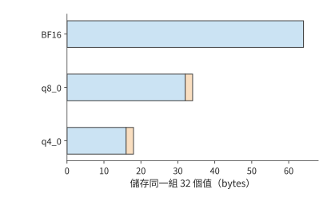

*圖 8-23：BF16、q8_0、q4_0 儲存同一組 32 個數值所需的空間。橫條按位元組數成比例繪製；橙色為每組 2 bytes 的 scale。把每組總長度乘以組數，就得到整條上下文的 KV 容量。*

章首算例中的長請求生成完畢後，BF16 KV 按塊分配共佔 1188 MiB。改用同一佈局的 q8_0 後，需要 $1188\times34/64=631.125$ MiB，16 條獨立長請求合計約 9.86 GiB，可以放入預留的 12 GiB 記憶體。由此可見，共享和壓縮節省空間的方式不同：共享去除重複字首，壓縮減少每個數值所佔的位元組。

用壓縮 KV 做注意力計算時，讀取量減少了，但格式轉換需要額外時間。設一次計算少讀 $\Delta D$ bytes，有效頻寬為 $\beta$，轉換增加的序列執行時間為 $T_c$，則淨節省時間為

$$
\Delta T=\frac{\Delta D}{\beta}-T_c.
$$

例如，在 RTX PRO 6000 上將一條 8K 上下文從 BF16 改為 q8_0，少讀 540 MiB。按讀取受限時的有效頻寬約 1.16 TB/s 計（第 8.6.3 節，峰值 1792 GB/s 的 65%），約節省 0.487 ms。若轉換增加 0.2 ms，最終節省約 0.287 ms；若轉換增加 0.8 ms，反而增加約 0.313 ms。同樣的壓縮格式是否能加快執行，取決於轉換時間是否少於節省的讀取時間。

上下文越長，減少讀取所節省的時間越多。一項早期評估在 H100 上執行 Llama-3.1-8B，分別用 $6.44+4.37\times10^{-5}L$ 和 $6.58+2.37\times10^{-5}L$ ms 擬合 BF16 與 FP8 的輸出間隔。FP8 固定項多 0.14 ms，每個上下文 token 的增長項少 $2\times10^{-5}$ ms。用固定開銷之差除以每增加一個上下文 token 的耗時之差，得到交點約為 7000 個 token；在 2K 時 BF16 約 6.53 ms、FP8 約 6.63 ms，在 16K 時則分別約 7.16 和 6.97 ms。上下文較長時，讀取節省的時間超過了新增的固定開銷。[^kv-format]

本節開頭提到，上下文表示決定每個 token 要儲存多少個值；混合注意力模型的區域性與全域性兩類狀態，也可以按這種方式比較容量。在 8K 上下文基線下，把全域性歷史與有效 SWA 的容量相加。DeepSeek V4.1 的兩項分別為 6.953 MiB 與 2.578 MiB，共 9.531 MiB；V4 的對應兩項合計為 30.521 MiB，約為 V4.1 的 3.20 倍。區域性視窗占固定空間，因此短上下文下的合計容量差距小於全域性歷史的 3.95 倍。

### 8.4.3 權重解除安裝、預取與每步搬移

壓縮減少了資料本身的大小。另一種擴充套件容量的方法是讓資料輪流駐留在 GPU 上：只在計算需要時搬入，用完後複用這塊空間。權重解除安裝將部分原本常駐 GPU 的權重移到主存，並在計算相應層之前搬回 GPU。節省的加速器記憶體可以用於 KV，但每次前向計算都需要重新搬入這些權重。請求逐步生成輸出時，搬移也隨每輪 decode 重複。

Qwen3-8B 一層 FFN 的三個 BF16 矩陣共佔 288 MiB。36 層中每四層解除安裝一層，共解除安裝九份 FFN 權重，釋放 2592 MiB。GPU 上還要為預取（在計算某層之前，提前把它的權重複制到 GPU）預留緩衝區：一組緩衝佔 288 MiB，淨省 2304 MiB；兩組佔 576 MiB，淨省 2016 MiB。以一條 8K 輸入的 1152 MiB KV 為單位，前者能多容納兩條，後者只能多容納一條。若按生成完畢時所需的 1188 MiB 預留空間，兩種方案均只能增加一條完整請求。[^offload]

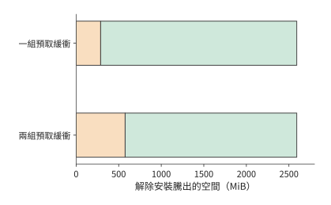

*圖 8-24：解除安裝九份 FFN 共騰出 2592 MiB。橙色為留在加速器上的預取緩衝，綠色為可重新分配的淨空間；一組緩衝淨省 2304 MiB，兩組淨省 2016 MiB。*

預取必須遵守兩個先後關係：權重複制完成後，計算才能讀取；計算不再使用這組權重後，緩衝區才能寫入下一組。使用一組緩衝時，同一緩衝區依次用於複製、計算和下一次複製；使用兩組緩衝時，可以一邊計算當前層，一邊把後續層的權重複制到另一組緩衝區。這樣能夠重疊複製與計算，但緩衝區本身也會佔用更多記憶體。

先計算搬移的鏈路 (Link)成本。這張卡經 PCIe Gen5 x16 連線主機，每方向標稱 64 GB/s。每輪要搬入 2592 MiB，即 2.72 GB，需要

$$
T_{\mathrm{copy}}\ge\frac{2.72\ \mathrm{GB}}{64\ \mathrm{GB/s}}\approx42.5\ \mathrm{ms}.
$$

這已經超過 batch 1 一輪 decode 的 26.26 ms。即使其餘計算都能與複製同時完成，每輪仍至少需要約 42.5 ms。若每輪為四條請求各生成一個 token，總輸出吞吐量最多約為 $4/0.0425\approx94$ token/s，每條請求的輸出間隔也至少約為 42.5 ms。生成 256 個輸出 token 需要 255 次後續前向計算，僅權重搬移就要約 10.8 秒。因此，經 PCIe 解除安裝這部分權重，無法滿足 7 秒的完成時限。

CPU 與 GPU 之間也有快得多的鏈路 (Link)。GH200 用 NVLink-C2C 連線 Grace CPU 與 Hopper GPU，每方向 450 GB/s。同樣的 2.72 GB 每輪至少約需 6.0 ms，255 輪合計約 1.54 秒。每輪複製短於一輪 decode 的計算，預取就能用計算掩蓋複製。

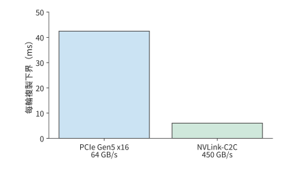

*圖 8-25：每輪複製量保持為 2592 MiB（2.72 GB）。經 PCIe Gen5 x16（每方向 64 GB/s）至少需要約 42.5 ms，經 GH200 的 NVLink-C2C（每方向 450 GB/s）至少需要約 6.0 ms。*

這裡起決定作用的是每輪搬移的資料量與有效頻寬之比。預取可以讓搬移與計算同時進行，但每輪需要傳輸的位元組數仍然相同。

若先壓縮權重再搬移，還要加上解壓時間。設原始資料為 $S$ 位元組，壓縮後為 $rS$ 位元組，鏈路 (Link)頻寬為 $B_{\mathrm{link}}$，解壓吞吐量為 $R_{\mathrm{dec}}$（按輸出的原始位元組計）。先傳完再解壓需要 $rS/B_{\mathrm{link}}+S/R_{\mathrm{dec}}$，直接傳輸需要 $S/B_{\mathrm{link}}$，因此只有當

$$
R_{\mathrm{dec}}>\frac{B_{\mathrm{link}}}{1-r}
$$

時，壓縮後搬移才更快。把 96 MiB 權重壓縮到四分之一，經 PCIe Gen5 x16 直接傳輸約需 1.57 ms，傳輸壓縮資料只需 0.39 ms；要保留這 1.18 ms 的節省，解壓器每秒必須輸出超過 85.3 GB 的原始資料。鏈路 (Link)越快，對解壓吞吐量的要求就越高。[^codec]

這一節的解除安裝中，模型計算始終由 GPU 執行，主存負責儲存暫不使用的權重。第 9.3 節將進一步改變計算位置：專家權重已在主存時，可由 CPU 直接計算，只向 GPU 傳回較小的啟用，屆時需要比較每個專家的輸入行數、CPU 計算時間與權重傳輸時間。

> **練習 8-5 · 計算：權重解除安裝節省的容量與增加的搬移。** 設解除安裝九份 FFN 權重，每份佔 288 MiB。設每組預取緩衝可以容納一份 FFN 權重，分別計算使用一組和兩組緩衝時淨節省的加速器記憶體，並求這些空間能多容納多少份 1152 MiB 的輸入狀態，或多少份 1188 MiB 的完整請求狀態。再分別取 PCIe Gen5 x16 的每方向 64 GB/s 與 GH200 NVLink-C2C 的每方向 450 GB/s，求每步複製以及累計 255 步複製的時間下界。若留給所有複製的總時間為 1 秒，求所需的最低單向頻寬。

### 8.4.4 質量約束下的容量與速度選擇

第 8.4.2 節算出了壓縮節省的空間和增加的轉換時間，但尚未回答改變數值格式後答案是否相同。這裡的執行後端指實際完成注意力計算的 kernel 實現。壓縮 KV 改變儲存的數值，更換執行後端還可能同時改變 Q 的計算格式、轉換過程和歸約運算的數值精度。逐項比較張量的儲存格式與計算精度，能夠找出輸出差異的來源。

下面用八道固定任務做這種逐項比較，三幅圖按相同順序排列這些任務。八道任務來自兩種長度的文件：每份文件含 128 或 512 條六位數字記錄，兩種長度各有四份獨立文件，實驗記錄裡分別標為 n128-r0 至 n128-r3 和 n512-r0 至 n512-r3，圖中依次記為任務 1 至 8。每道任務在兩種並行數下各執行兩次，用相同任務逐一比較不同數值格式的影響。

一組 Qwen3-8B 實驗保持 BF16 權重不變，比較了三種注意力計算方式。32 次自然生成中，使用 BF16 KV 時答對 28 次；改用原 FP8 實現後答對 26 次；保留 FP8 KV、將 Q 恢復為 BF16 後，又答對 28 次。最後一種配置只改變 Q 的精度，結果就發生了變化，說明需要分別考察 KV 的儲存格式和 Q 的計算精度。[^quality]

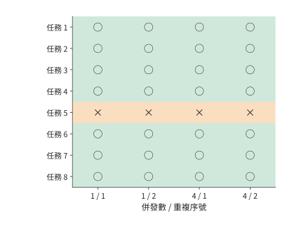

*圖 8-26：BF16 KV 基線。每行是一道固定任務，四列為並行 1、4 下各兩次自然生成。綠色圓圈正確，橙色叉號錯誤，共 28/32 正確。*

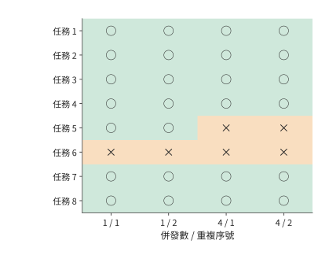

*圖 8-27：同一任務與執行順序，原 FP8 實現共 26/32 正確。這一比較包含實現選擇對 Q 精度的影響。圓圈表示回答正確，叉號表示回答錯誤；每行對應同一道題，列表示並行數與重複執行序號。*

圖 8-28 進一步只恢復查詢 Q 的 BF16 精度，KV 仍保持 FP8。按同一列比較三幅圖，就能看出改變的是哪些題目的結果，而不只是總正確數。

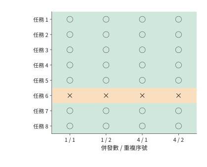

*圖 8-28：將查詢 Q 保持為 BF16，KV 仍用 FP8，共 28/32 正確；答錯的題目與 BF16 基線不同。三幅圖使用相同任務和列順序，模型權重均為 BF16。圓圈表示回答正確，叉號表示回答錯誤；每行對應同一道題，列表示並行數與重複執行序號。*

圖中任務 5（實驗記錄裡的 n512-r0，即含 512 條記錄的第一份長文件）在 BF16 KV 下四次均錯，在「FP8 KV＋BF16 Q」下四次均對；任務 6（n512-r1）則恰好相反。兩種配置都答對 28 次，但答錯的任務不同。將同一任務的結果排在一起，就能看出差異發生在哪裡，以及重複執行時是否一直如此。

錯誤還會增加完成任務的時間。第一次回答失敗後重試，得到正確答案的總時間應包括首次生成、檢查答案和再次生成。已有實驗中，兩次重試修正了錯誤，但額外增加了約 2.0 秒生成時間和 92 個 token。如果第一次回答雖然更快，卻也更容易出錯，完成整個任務反而可能更慢。[^retry]

比較前述兩種 KV 容量方案：16 條獨立長請求採用 q8_0 後約佔 9.86 GiB，共享 BF16 字首後約佔 5.91 GiB。要判斷哪種方案更合適，還需將轉換、生成和重試的時間計入請求的總耗時。第 8.6 節的綜合例題將完成這一步。

> **練習 8-6 · 資料分析：KV 壓縮如何影響容量、答案正確性與重試成本。** 設每組包含 32 個值，另用 2 位元組儲存 scale，復算 8K 輸入和完整長請求在 q8_0、q4_0 格式下的 KV 容量。再讀取配套三種 KV／Q 精度配置的逐題結果，列出 BF16 KV 與「FP8 KV＋BF16 Q」中正確性改變的題目。最後讀取重試記錄，對每個成功任務合計首答與重試時間，並與只計入最後一次成功生成時間的結果比較。

## 8.5 推測解碼

### 8.5.1 草稿、驗證、回退與正確性

前兩節主要改變資料的存放和讀取方式，每條請求仍要逐輪生成。若能讓一次目標模型計算確定多個輸出，生成 256 個 token 就不必再執行同樣多的輪次。普通 decode 中，目標模型每次前向計算生成一個 token。第 8.2 節將不同請求合併計算，使一次權重讀取用於更多行。推測解碼採用另一種辦法：先為同一請求生成一段**草稿序列**，再由目標模型同時驗證其中的多個 token。若目標模型接受了多個草稿 token，一次計算就能確定多個輸出。

先考慮**貪心生成**：每一步都選擇目標模型給出的機率最高的 token。假設草稿序列包含四個 token，目標模型分別計算各 token 位置應當輸出哪個 token。前兩個與草稿相同，第三個不同，那麼最終保留前兩個草稿 token，並在第三處輸出目標模型選出的 token。第四個草稿 token 是在錯誤的第三個 token 之後生成的，也隨之丟棄。下一輪從修正後的序列繼續生成。若四個草稿 token 全部匹配，目標模型通常還能在它們之後再生成一個 token。

圖 8-29 展示了第三個 token 發生分歧時的處理順序。目標模型雖然已經計算了後續 token 的驗證結果，但第四個 token 依賴錯誤的第三個草稿 token，不能繼續採用。一次驗證最終留下兩個匹配的草稿 token 和一個修正 token，共三個輸出。

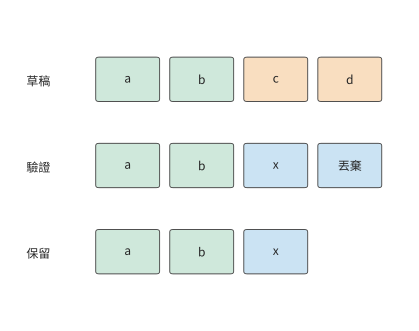

*圖 8-29：貪心驗證的過程。a、b、c、d、x 表示 token；目標模型在第三個 token 選出 x，與草稿 c 不同。第四個 token 及其後的驗證結果作廢，下一輪從 a、b、x 繼續生成。方框表示序列中的 token 位置，不表示執行耗時。*

隨機取樣時，需要使最終輸出仍服從目標模型的機率分佈。設目標分佈為 $p(x)$，草稿分佈為 $q(x)$。先從 $q$ 中取樣得到草稿 token $x$，再以如下機率接受它：

$$
\alpha(x)=\min\left(1,\frac{p(x)}{q(x)}\right).
$$

取樣到 $x$ 並直接接受它的機率為 $q(x)\alpha(x)=\min(p(x),q(x))$。要達到目標機率 $p(x)$，還差 $[p(x)-q(x)]_+$。這裡 $[z]_+=\max(z,0)$，表示只保留正的差額。因此，拒絕草稿 token 後，將這一正差額歸一化，再從得到的分佈中重新取樣。直接接受和拒絕後重新取樣兩種情況合起來，最終輸出 $x$ 的機率就是 $p(x)$。[^spec]

用只有 A、B 兩個符號的例子說明這一過程。目標分佈為 $p(A)=1/4$、$p(B)=3/4$。若草稿總是生成 A，就以 $1/4$ 的機率接受 A，其餘 $3/4$ 的情況拒絕 A、改為輸出 B。若草稿總是生成 B，則以 $3/4$ 的機率接受 B，其餘情況改為輸出 A。兩種方法最終都得到目標分佈，但草稿的接受機率不同，因而執行效率也不同。

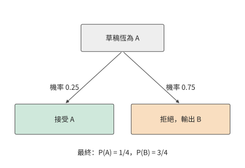

*圖 8-30：接受 A 的機率為 1/4，拒絕後輸出 B 的機率為 3/4。兩條路徑合起來給出目標分佈。*

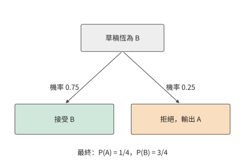

*圖 8-31：接受 B 的機率為 3/4，拒絕後輸出 A 的機率為 1/4。目標分佈相同，草稿的接受機率更高。*

驗證之後，KV 的有效長度調整到已經確定的輸出位置，丟棄的草稿 token 對應的 KV 不再參與後續計算。分頁器按已經確定的輸出長度更新塊引用，取樣器和語法檢查器（按指定輸出格式限制可選 token 的元件）也恢復到對應的狀態。下一輪便從修正後的序列繼續計算。

### 8.5.2 每輪耗時與輸出數量

推測解碼既改變每輪耗時，也改變每輪最終輸出的 token 數。設第 $r$ 輪耗時為 $T_r$，輸出 $N_r$ 個 token，那麼連續執行多輪後，平均每個輸出 token 的耗時為

$$
\bar t_{\mathrm{spec}}=\frac{\sum_r T_r}{\sum_r N_r}.
$$

例如，兩輪各耗時 1.5 ms，分別輸出 1 個和 5 個 token，總計 3 ms、6 個 token，平均每個 token 耗時 0.5 ms。如果先算每輪的平均值，再將 1.5 和 0.3 ms/token 等權平均，就會得到 0.9 ms。這相當於讓只輸出一個 token 的輪次與輸出五個 token 的輪次佔相同權重。直接用總時間除以總 token 數，才能得到每個 token 的平均耗時。

**算例：草稿接受率如何決定每輪的平均輸出數？** 沿用兩符號目標分佈，並假設各 token 位置獨立。每輪草稿生成四個相同符號，最終輸出還包括拒絕時的修正 token，或全部接受後的額外 token。設前面的草稿 token 都已接受時，當前位置的接受機率為 $a$。每輪至少輸出一個 token；要輸出第二個，需接受第一個草稿 token，機率為 $a$；要輸出第三個，需接受前兩個，機率為 $a^2$。依次相加，平均每輪輸出數為

$$
\mathbb E[N]=1+a+a^2+a^3+a^4.
$$

上式每一項都表示「最終至少輸出這麼多個 token」的機率。草稿為 AAAA 時，$a=1/4$，平均每輪輸出約 1.33 個 token；為 BBBB 時，$a=3/4$，平均輸出約 3.05 個。在 RTX PRO 6000 上，batch 1、2K 上下文的普通 decode 一輪 26.26 ms（實驗 8-1）。驗證 5 個位置時，讀取的權重和 KV 與普通 decode 相同；多出的 4 行矩陣運算約 65 GFLOP，按 BF16 峰值的 62% 計只需約 0.2 ms，因此一輪驗證仍按 26.26 ms 計。實驗 8-5 也觀察到同樣的現象：DFlash（一種前向一次就並行生成整段草稿的草稿網路）每輪生成 7 個草稿 token 並驗證 8 個位置，中位耗時 15.2 ms，與同一配置下普通 decode 一步的 16.9 ms 相當。再加上查詢草稿的 0.1 ms，一輪共 26.36 ms，兩種草稿對應的平均每 token 耗時分別約為 19.8 和 8.64 ms，都快於 26.26 ms/token 的普通 decode。驗證幾乎不增加一輪的時間，即使草稿大多被拒絕，每輪也至少得到一個 token，所以接受率低的 AAAA 同樣能加速。[^history]

接受更多草稿 token 所節省的時間，也可能被查詢開銷抵消。要優於普通 decode，一輪總耗時須小於平均輸出數乘以 26.26 ms。扣除驗證所需的 26.26 ms，AAAA 留給草稿查詢的時間約為 8.7 ms，BBBB 約為 53.9 ms。圖 8-32 把這兩個交點畫在查詢成本軸上。

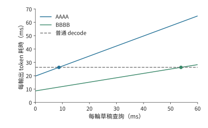

*圖 8-32：兩符號目標分佈，每輪生成四個草稿 token。每輪驗證 26.26 ms，查詢時間沿橫軸變化；每個輸出 token 的耗時用一輪耗時除以平均輸出數。普通 decode 為 26.26 ms/token（RTX PRO 6000，batch 1，2K 上下文）。沒有提前停止，額外 token 計入輸出數。圖中的點標出查詢耗時為 0.1 ms 的算例；AAAA、BBBB 分別在查詢約 8.7、53.9 ms 處與普通執行相交。*

使用草稿前的準備工作也要計入總時間。若建立上下文索引需要 2 秒，而 BBBB 草稿每個輸出 token 能節省約 $26.26-8.64\approx17.6$ ms，生成約 114 個 token 就能抵消這 2 秒開銷。輸出 256 個 token 的請求用普通 decode 約需 6.72 秒；先用 2 秒建立索引再用 BBBB 草稿，期望約 4.22 秒完成。如果索引可以提前建立並由多個請求共用，這項開銷還能由更多輸出分攤。

### 8.5.3 草稿來源與序列、並行生成方式

四個草稿 token 能節省多少時間，既取決於其中有多少透過了驗證，也取決於生成這段草稿需要多長時間。實際系統可以從上下文中查詢草稿，也可以呼叫額外的網路生成草稿；兩種選擇會帶來不同的準備時間與記憶體佔用。

上下文查詢從輸入或已有回答中找出重複片段，主要開銷是匹配和建立索引。獨立小模型逐步生成草稿，需要額外儲存自己的權重和 KV。EAGLE 類方法將目標模型的中間表示送入較小的預測網路；DFlash 類方法則並行生成多個草稿 token。模型自帶的 MTP 頭則利用聯合訓練得到的預測能力生成草稿。[^spec]

將每輪分為生成草稿、準備驗證、目標驗證和確定輸出四個階段，就能逐項比較這些方法。以實驗 8-5 的 DFlash 草稿網路為例，其權重約 1.95 GiB（2.10 GB）。按 batch 1 的有效頻寬計（26.26 ms 讀取 15.44 GB，約 588 GB/s），該網路前向一次約需 3.57 ms。若用它逐個生成四個草稿 token，要前向四次，共 14.28 ms；像 DFlash 那樣並行生成整段草稿，只需前向一次，約 3.57 ms。目標驗證都需 26.26 ms，若最終每輪都平均輸出 3 個 token，序列方式每個 token 約需 $(14.28+26.26)/3\approx13.5$ ms，並行方式約需 $(3.57+26.26)/3\approx9.9$ ms。此時，加速來自草稿生成時間的縮短。

再設並行生成的草稿接受率較低，平均輸出數降為 2 個，平均每個輸出 token 的耗時就升至 $(3.57+26.26)/2\approx14.9$ ms，反而慢於序列方式。更快的草稿生成節省了 10.7 ms，但每輪輸出減少，每個輸出 token 分攤的時間隨之增加，整個請求因而變慢。

### 8.5.4 草稿長度的動態選擇與並行競爭

確定草稿來源之後，還需要決定每輪生成多長。草稿越長，一輪能夠輸出的 token 上限越高。但只有前面的 token 全部接受，後面的才有機會進入最終輸出。設前面的草稿 token 都已接受時，第 $j$ 個 token 的條件接受機率為 $a_j$，則長度為 $m$ 的草稿對應的平均輸出數為

$$
\mathbb E[N_m]=1+\sum_{j=1}^{m}\prod_{i=1}^{j}a_i.
$$

草稿長度從 $m-1$ 增至 $m$ 時，平均多輸出 $\Delta N=\prod_{i=1}^{m}a_i$ 個 token。設為此增加 $\Delta T$ 時間；原先一輪耗時為 $T$、平均輸出 $N$ 個 token，平均每個輸出 token 的耗時為 $T/N$。要使增加草稿長度後平均每個輸出 token 的耗時更短，需要滿足 $(T+\Delta T)/(N+\Delta N)<T/N$，整理得

$$
\frac{\Delta T}{\Delta N}<\frac{T}{N}.
$$

也就是說，為新增輸出付出的平均時間，必須低於原來的平均每 token 耗時。由於接受機率需要逐項相乘，越靠後的草稿 token 保留下來的機率越低，增加它們就越難獲得足夠的時間收益。

預設執行形狀也會影響新增時間 $\Delta T$。如果本次驗證四個或五個 token，都把各 token 的特徵向量補齊為八行矩陣，使用預先準備的八行計算圖，增加一個 token 所需的額外計算較少；若待驗證的 token 從八個增至九個，需要補齊為十六行矩陣並改用相應計算圖，計算量便會突然增加。並行請求數也影響推測解碼的收益：低負載時，多行驗證可以利用閒置算力；高負載時，普通批處理已經充分共享權重，草稿生成和驗證還要與其他請求爭用加速器和記憶體。

一組實測比較了不同草稿長度。K7 和 K15 分別表示每輪生成 7 個和 15 個草稿 token 的配置。Qwen3-8B／DFlash 的短提取任務在並行 1 時，普通 decode、K7、K15 的完整耗時中位數約 90.0、30.6、29.4 ms。普通執行改為 K7 節省約 59 ms，從 K7 改為 K15 只再節省約 1.2 ms。逐輪記錄中還出現兩種塊長都只接受一個草稿 token 的輪次：K7 丟棄六個草稿 token，K15 丟棄十四個，最終輸出長度相同。更大的驗證塊增加了計算量，卻沒有在這一輪帶來更多輸出。[^spec-measure]

因此，動態調整草稿長度時，可以使用上述判斷條件：對接受機率高、增加驗證位置所需時間短的請求，生成更長的草稿；對草稿前幾個位置就經常通不過驗證，或需要改用更大執行形狀的請求，縮短塊長。確定草稿長度時，還要給目標模型和草稿模型的 KV 留出空間，再按第 8.3 節的方法決定接收多少請求。

> **練習 8-7 · 推導：多長的草稿能使平均每個輸出 token 的耗時最短？** 固定草稿接受機率 $a=3/4$，計算草稿塊長為 1、2、4、8 時，每輪平均輸出的 token 數。沿用第 8.5.3 節 RTX PRO 6000 上的資料並保留一位小數：一輪驗證 26.3 ms，草稿網路逐個生成、每個草稿 token 3.6 ms，即 $T_m=26.3+3.6m$ ms，求每種塊長的平均每個輸出 token 的耗時。再設草稿按每組 4 個位置執行，不足一組也按整組計時，即 $T_m=26.3+3.6\times4\lceil m/4\rceil$ ms，比較塊長 4 與 5，並用邊際條件解釋選擇。

## 8.6 請求負載下的效能與配置選擇

### 8.6.1 到達率、排隊、准入與取消

第 8.2 至 8.5 節討論瞭如何改變例項的記憶體佔用和執行方式。線上服務還要處理請求不斷到達的情況：一條請求尚未完成，下一條就已經進入佇列；一條請求等待工具返回時，模型計算暫停，KV 卻仍需保留。排程器因此既要安排當前計算，也要為正在生成或等待繼續執行的請求保留狀態。

儲存這些未完成請求的狀態需要多少空間，取決於系統內平均有多少條請求。在穩定服務中，系統內的平均請求數滿足 Little 定律

$$
\bar n=\lambda\bar T,
$$

其中 $\lambda$ 為平均到達率，$\bar T$ 為請求在系統中的平均停留時間。把觀察期間每條請求的停留時間相加，再除以觀察時長，就得到系統內的平均請求數。例如，每秒到達 4 條請求、每條平均停留 0.5 秒時，系統內平均有 2 條請求；平均停留時間增至 2 秒時，就有 8 條。

這些請求有的在排隊，有的正在計算，還有的僅保留狀態。增大 batch 可以提高輸出吞吐量，但 KV 讀取、計算和其他開銷會逐漸限制這種增長。當處理速度無法繼續隨到達率提高時，新請求就會在佇列中累積，等待時間也隨之延長。

**准入控制**決定是否開始處理新請求。接收請求之前，先檢查可用的 KV 空間和距離截止時間還剩多久。對第 8.1 節的短請求，0.196 秒首輸出加 6.76 秒生成已用掉 6.95 秒；再多排隊 0.1 秒就會超時。提前識別這種請求，可以拒絕、轉交其他例項，或使用更快的執行配置。取消則在請求失去使用價值時停止安排後續迭代，並在加速器操作完成後釋放空間。

這些最佳化會相互影響。KV 壓縮讓例項能同時接收更多請求，較大的 batch 又讓普通 decode 更有效地共享權重，推測解碼的相對收益也就隨之改變。下面將這些變化應用於同一組請求，計算組合後的執行時間和記憶體佔用。

### 8.6.2 質量與 SLO 約束下的有效吞吐量

只看佇列長度和完成速度，還不能判斷使用者是否得到了可用的答案。第 8.4.4 節的質量實驗出現過錯誤答案，排隊則會造成正確但遲到的回答。把這兩種損失一起計入，才能評價服務效果。設觀察視窗長為 $T_{\mathrm{obs}}$，第 $i$ 條請求正確時 $Q_i=1$，按期完成時 $D_i=1$。按完成的請求數計量，有效吞吐量為

$$
R_{\mathrm{good}}=\frac{\sum_i Q_iD_i}{T_{\mathrm{obs}}}.
$$

分子只計正確且按期完成的請求。若改用全部完成的請求數作為分子，就得到完成吞吐量。兩者的差距說明，有多少處理能力花在了錯誤或遲到的答案上。

一組實測顯示了這兩項損失的大小。Qwen3-8B 檢索實驗使用相同的八道題，要求請求在到達後 3 秒內正確完成，比較逐個接收請求、連續批處理和一次提交全部請求三種方式。每次實驗提交 16 條請求，全部實驗共生成 336 次回答，其中 294 次正確，只有 155 次同時滿足時限。其餘 139 次正確回答因為太晚返回，仍未滿足服務要求。[^service]

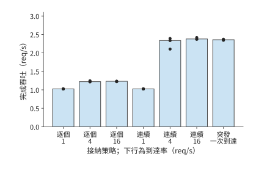

*圖 8-33：每種接納與到達條件使用三個 16 請求視窗。柱為全部完成請求的吞吐量中位數，圓點為各視窗結果。時間從計劃到達起計算。*

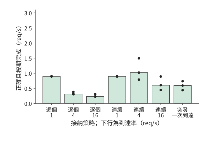

*圖 8-34：分子僅計正確且在 3 秒內完成的請求。兩圖採用相同橫軸順序和縱軸範圍，差額來自錯誤或遲到的回答。*

到達率為 1/s 時，兩種線上策略的有效吞吐量均約 0.90 req/s。每批工作較少，逐個接納也能及時處理大部分正確請求。到達率升至 4/s，逐個接納的完成吞吐量約 1.22 req/s，有效吞吐量卻降至 0.31 req/s；佇列變長，許多正確輸出越過了期限。連續批處理把完成吞吐量提高到約 2.33 req/s，有效吞吐量達到約 1.02 req/s，更多請求在期限內完成。

再把連續模式的到達率推至 16/s，完成吞吐量只增至約 2.38 req/s，有效吞吐量反而降到約 0.60 req/s，減少約 41%。完成吞吐量已基本不再增長，更多請求到達主要增加了排隊時間。對這組視窗，4/s 比 16/s 按時返回了更多正確答案。選擇服務配置時，要先找出有效吞吐量開始下降的到達率，再限制新接收的請求數，避免排隊時間過長。

逐個接收請求時，其他請求雖然沒有進入引擎，卻仍在應用佇列中等待。因此，應從請求原定的到達時刻開始計時，把引擎外的等待也計入。結合本節的幾組測量，加速器每秒輸出多少 token、單條請求等待多久，以及每秒有多少請求正確且按期完成，需要分別計算。

### 8.6.3 配置、加速器與完整任務成本

比較配置之前，先把實測換算成處理速度。確定批處理、精度和快取設定後，用完成的工作量除以佔用加速器的時間，就得到各階段的實際處理速度：prefill 速度 $r_P$ 按每秒處理的新輸入 token 計，decode 速度 $r_D$ 按每秒完成的 decode 呼叫計。批內多條請求共享一次執行時，每條請求都算完成了一次呼叫，佔用時間只計一次。一條請求有 $L$ 個新輸入 token、輸出 $G$ 個 token，它佔用加速器的時間（以 GPU 秒計）為

$$
t_{\mathrm{GPU}}=\frac{L}{r_P}+\frac{G-1}{r_D}.
$$

沒有同條件的測量時，可以用規格乘以效率來估計：prefill 時間取矩陣運算量除以峰值算力與算力效率之積，decode 一輪的時間取讀取的權重與 KV 位元組數除以峰值頻寬與頻寬效率之積。下表給出實驗 8-1 在 RTX PRO 6000 上測得的效率。一輪 decode 取引擎逐輪記錄中不含 prefill 的輪次；客戶端看到的輸出間隔還包括交付時間，略長一些，例如第 8.1.1 節的 26.5 ms。

| 2K 上下文、無共享字首 | batch 1 | batch 4 | batch 16 | batch 64 |
|---|---:|---:|---:|---:|
| 每輪讀取的權重與 KV | 15.44 GB | 16.34 GB | 19.97 GB | 34.46 GB |
| 按 1792 GB/s 讀取所需時間 | 8.62 ms | 9.12 ms | 11.14 ms | 19.23 ms |
| 實測一輪 decode | 26.26 ms | 26.62 ms | 27.44 ms | 29.63 ms |
| decode 頻寬效率 | 33% | 34% | 41% | 65% |
| prefill 算力效率 | 62% | 61% | 61% | 58% |

decode 效率隨 batch 上升，並不是因為讀取變快了。這組實驗關閉了 CUDA Graph，每輪都要逐個提交 kernel：讀取量從 15.44 GB 增至 34.46 GB，一輪只從 26.26 ms 增至 29.63 ms，batch 越大，這段幾乎固定的時間分攤到的位元組越多。prefill 效率則穩定在 BF16 峰值的 58%–62%；8K 輸入、前 6K 已快取時為 52%–58%。

表中的頻寬效率就是第 1.2.2 節的 MBU，算力效率就是 MFU。batch 為 1 時，一輪 decode 比 8.62 ms 的讀取下界多出約 17.6 ms，而且這段時間基本不隨讀取量變化。按第 1.3.4 節的判據，這不是模型漏項，而是逐個提交 kernel、主機側排程與同步造成的開銷，用 CUDA Graph 和更好的排程可以去掉；第 5.5.1 節的 vLLM v0.6.0 案例說明了主機側開銷能減少到什麼程度。

**綜合算例：在記憶體與時限約束下選擇字首共享、壓縮和推測配置。** 有效吞吐量給出了服務的評價標準，容量和時間分析則能在執行之前排除不合適的配置。採用章首給定的推理例項：RTX PRO 6000 分給本例項 32 GiB，扣除權重和基本工作區後，留給 KV 及輔助緩衝區的空間為 12 GiB。16 條長請求同時到達，每條輸入 8192 個 token、輸出 256 個 token，前 6144 個輸入 token 相同，完成時限為 7 秒。下面比較四種方案，並假設四種方案都能給出正確答案。共享方案在請求到達前已經快取了公共字首。推測方案使用實驗 8-5 的 DFlash 草稿模型。啟用後程序視訊記憶體峰值增加約 3.1 GiB（從 17,706 MiB 增至 20,894 MiB），其中草稿模型權重約 1.95 GiB。草稿模型還要處理輸入，實驗 8-5 中輸入約 2300 個 token 時，首 token 時間從 129.4 ms 增至 141.6 ms，多出 9.4%。設這組請求平均每輪輸出 3 個 token。

這組請求的共享方案，正是實驗 8-1 測過的條件：8K 輸入、前 6K 已快取、batch 16。prefill 階段處理 32,768 個新 token 用時 2.04 s，$r_P\approx16{,}059$ 新 token/s，達到峰值算力的 58%；此後每輪 decode 用時 27.35 ms，$r_D=16/0.02735\approx585$ 呼叫/s。每條請求佔用 $t_{\mathrm{GPU}}=2048/16059+255/585\approx0.563$ GPU 秒，16 條合計約 9.01 GPU 秒。其餘方案由這張表和同一條件的實測推出，下表給出整批 16 條請求各階段的時間。[^service-plan]

| 方案 | 狀態組織 | 首 token 返回前（整批 prefill） | 首 token 返回後的執行 |
|---|---|---:|---|
| A | BF16，獨立上下文 | 7.34 s | 255 輪，每輪 29.63 ms |
| B | BF16，共享字首 | 2.04 s | 255 輪，每輪 27.35 ms |
| C | q8_0，獨立上下文 | 7.34 s | 255 輪，每輪約 28.26 ms |
| D | BF16，共享字首與推測 | 2.23 s | 85 輪，每輪輸出 3 個 token，每輪 27.35 ms |

A、C 不共享字首，每條請求都要完整處理 8192 個 token，整批矩陣運算量為 2137.5 TFLOP，按同一條件 58% 的算力效率計，約需 7.34 s。A 每輪讀取 34.46 GB，與 64 條 2K 請求相同，取表中的 29.63 ms；C 的 KV 按 $34/64$ 壓縮，每輪讀取 25.40 GB，在表中 19.97 GB 與 34.46 GB 兩列之間按讀取量插值，約 28.26 ms，這裡還沒有計入格式轉換的時間。D 的 prefill 比 B 多 9.4%，約 2.23 s。D 每輪讓 16 條請求各驗證 8 個位置，矩陣運算約 2.56 TFLOP，按 58% 的效率約需 8.8 ms，短於 B 一輪的 27.35 ms；按第 8.2.1 節取兩者中的較大值，每輪仍為 27.35 ms。草稿網路的前向也在同一輪內完成，實驗 8-5 中 DFlash 一輪的中位耗時並不長於普通 decode 一步（第 8.5.2 節），因此這裡不另加時間。

先檢查記憶體是否足夠。A 需 $16\times1188=19008$ MiB，超出 12 GiB，無法同時接納這組請求。B 只需一份字首加 16 份私有狀態，共 6048 MiB，約 5.91 GiB。C 的狀態按 $34/64$ 壓縮，共約 9.86 GiB。D 在 B 的基礎上增加 3188 MiB，共 9236 MiB，約 9.02 GiB。B、C、D 都能放入記憶體，再比較三者完成請求所需的時間。

B 的總耗時為 $2.04+255\times0.02735=9.01$ 秒，與實驗 8-1 實測的請求耗時中位數 9.02 秒一致，但超過了 7 秒的時限。在這張卡上，僅 255 輪 decode 就要 6.97 秒，16 條請求一起逐 token 生成 256 個輸出，無法按期完成。C 失去了字首複用，prefill 從 2.04 s 增至 7.34 s，總耗時達到 $7.34+255\times0.02826=14.55$ 秒。D 每輪輸出 3 個 token，用 85 輪生成剩餘的 $85\times3=255$ 個 token，總耗時為

$$
T_D=2.23+85\times0.02735=4.56\ \mathrm{s}.
$$

記憶體不足的 A 和超時的 B、C 都已排除，只有 D 能按時返回 16 個正確答案。這一比較依次使用了字首共享後的容量、壓縮格式的大小、每輪耗時和每輪輸出數量。在這張卡上，一輪 decode 的時間幾乎不隨 batch 和上下文變化，只有減少輪數，才能明顯縮短生成階段。

圖 8-35 將這兩項檢查畫在同一張平面圖上。橫向越過虛線，表示 KV 和輔助緩衝區超過 12 GiB；縱向越過虛線，表示完成時間超過 7 秒。只有 D 同時落在兩個限制以內。

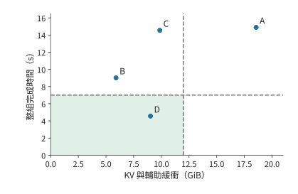

*圖 8-35：16 條長請求在 RTX PRO 6000 上的配置比較。橫軸為 KV 和輔助緩衝區佔用，已扣除共同的權重與基本工作區；縱軸為整批請求總耗時，由實驗 8-1、8-5 的實測推出。A 記憶體不足，不能在本例項上執行，圖中是它所需的時間。陰影區域同時滿足 12 GiB 和 7 秒限制。A 為 BF16 獨立上下文，B 為 BF16 共享字首，C 為 q8_0 獨立上下文，D 為 BF16 共享字首加推測解碼。*

最後比較成本。每個合格結果佔用這張卡的時間，等於整批從到達到全部完成的時間除以合格結果數。D 為 $4.56/16\approx0.285$ GPU 秒；按 600 W 的功耗上限計，每個合格結果的能耗不超過約 171 J。B 佔用這張卡 9.01 秒，在 7 秒時限下卻沒有一個合格結果，這些時間和能量全部浪費。

**記憶體減少或輸出縮短時，選擇如何變化？** 如果 KV 和輔助緩衝區的可用記憶體從 12 GiB 減至 6 GiB，D 所需的約 9.02 GiB 無法容納；B 所需的約 5.91 GiB 雖能容納，卻會超時。這組請求沒有可行方案，只能放寬時限、縮短輸出，或者改用不佔視訊記憶體的草稿來源（見練習 8-9）。如果記憶體不變，只把輸出縮短到 16 個 token，B 需要 $2.04+15\times0.02735=2.45$ 秒，D 需要 $2.23+5\times0.02735=2.37$ 秒。兩者都能按期完成，D 只快 0.08 秒：草稿模型多做的 0.19 秒 prefill，幾乎抵消了少執行 10 輪 decode 節省的時間。

以上分析的都是例項內的執行時間。計算完整 Agent 任務的耗時，還要加上工具執行和外部等待。假設一次任務耗時 100 秒，其中 decode 佔 50 秒；將 decode 加速四倍後，總耗時變為 $50+50/4=62.5$ 秒，整體加速 1.6 倍。如果 decode 原本只佔 20 秒，總耗時則變為 $80+20/4=85$ 秒，整體只加速約 1.18 倍。一般地，設 decode 佔原總時間的比例為 $f$，該階段加速 $s$ 倍，其他階段耗時不變，則由 Amdahl 定律得到

$$
S_{\mathrm{task}}=\frac{1}{(1-f)+f/s}.
$$

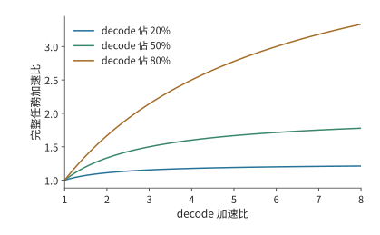

*圖 8-36：其他階段時間固定、沒有新增準備工作的 Amdahl 加速比曲線。三條曲線分別取 decode 佔基線時間 20%、50%、80%。該階段原有的耗時佔比越高，區域性加速帶來的收益就越大。*

圖 8-36 中，decode 佔比越低，曲線越早變平：即使生成階段繼續加速，工具呼叫和其他等待仍佔據原來的時間。比較加速器佔用和能耗時，也要覆蓋這些階段，並按最終得到的合格請求數計算。設觀察期間佔用加速器的總時間為 $T_{\mathrm{GPU}}$，總能耗為 $E_{\mathrm{obs}}$，合格結果數為 $N_g$，則每個合格結果平均佔用 $T_{\mathrm{GPU}}/N_g$ 的 GPU 時間，消耗 $E_{\mathrm{obs}}/N_g$ 的能量。實驗 8-9 在同一張卡上讀取了 GPU 與 CPU package（整個處理器封裝）的能量計數：連續批處理在到達率 1、4、16 req/s 下，每個合格結果分別消耗 615.0、652.0、1083.7 J；逐個接納在 4 req/s 下為 1982.3 J。16/s 時連續批處理的完成吞吐量與 4/s 相近，遲到的回答卻更多，每個合格結果的能耗高出約 66%。即使答案錯誤或返回太晚，已經消耗的能量也必須計入總成本。[^service]

> **練習 8-8 · 計算：階段加速與草稿準備如何改變任務總時間。** 一個 100 秒任務由 prefill 20 秒、decode 50 秒、工具及等待 30 秒組成。分別將三個部分的耗時單獨減半，求每種情況下的任務總耗時。另從原始任務出發，將 decode 耗時降為原來的四分之一，並增加 8 秒草稿準備時間，求淨加速比，並計算準備時間達到多少時這項改動不再節省時間。

> **練習 8-9 · 核心 · 綜合設計：在容量與時限內減少每個合格結果佔用的 GPU 時間。** 沿用綜合算例在 RTX PRO 6000 上的容量與時間，以 B 為基礎構造方案 E：共享 BF16 字首，草稿改為從上下文中查詢（第 8.5.2 節），索引放在主機記憶體，不佔視訊記憶體，也不增加 prefill；每條請求平均每輪輸出 2 個 token，後續執行 128 輪，整批每輪 27.35 ms 加 0.1 ms 查詢。計算 E 的視訊記憶體佔用、總耗時和每個合格結果佔用的 GPU 秒，與 B、D 比較；再分別把 KV 和輔助緩衝區的可用記憶體改為 6 GiB、把輸出長度改為 16 個 token，重新選擇。開放實驗部分使用相同題集和到達軌跡執行兩種配置，記錄全部請求的到達、首輸出、結束、正確性與狀態峰值，按本節公式計算有效吞吐量。

## 歷史與延伸閱讀

每輪迭代接納新請求、分頁注意力與字首樹快取分別推動了請求排程、狀態分配和計算複用。Orca、PagedAttention 與 SGLang 的相關設計可沿這些機制閱讀；Sarathi-Serve 和 NanoFlow 進一步研究分塊、流水及不同資源之間的重疊。[^schedule-survey][^nanoflow]

第 8.2.1 節的多 adapter 服務可沿 Punica 與 S-LoRA 繼續閱讀，兩者分別管理 adapter 與請求狀態，在共用基礎模型的同時執行各 adapter 的低秩計算。[^lora]

混合注意力與遞推模型把快取索引擴充套件為狀態恢復問題，Marconi 等工作討論恢復機會和快取價值。權重解除安裝、張量編碼以及統一記憶體執行，則將加速器容量與鏈路 (Link)成本聯絡起來；配套 M2 Max 記錄展示了小模型的真實 KV 分配與輸入處理。[^hybrid][^codec][^mac]

推測取樣的接受與修正規則為保持目標分佈奠定了基礎，後續從上下文查詢草稿、依據中間特徵預測草稿以及並行生成草稿的方法，主要改變每輪開銷與接受的草稿長度。完整 Agent 任務還包含工具和外部階段，公開速度與任務記錄可結合第 8.6 節的階段分解閱讀。[^spec][^task]

[^batch]: 固定模型在 RTX PRO 6000 上的[批處理計算](../calculations/results/batch-reuse-pro6000-2k.md)及[8K 對照](../calculations/results/batch-reuse-pro6000-8k.md)。完整 BF16 權重為 16,381,470,720 bytes，一步理想共享矩陣權重讀取為 15,136,811,008 bytes；embedding 按請求查行，記憶體中仍需儲存完整的 embedding 矩陣。讀取表先用精確位元組計算，再舍入各項。

[^device]: [NVIDIA RTX Blackwell PRO 規格](../references/files/specs/nvidia-rtx-blackwell-pro.pdf)附錄 A 表 4，整理在[硬體參數列](../calculations/results/hardware.md)的 rtx-pro6000-blackwell-ws 一行。

[^batch-measure]: [batch 掃描原始記錄](../experiments/ch08/08-01/README.md)。RTX PRO 6000、vLLM 0.23.0、BF16，三輪；正文報告中位數，吞吐量覆蓋剩餘 prefill 和生成，排除載入與預熱；8K 條件先建立共享字首。

[^schedule-survey]: [Orca 原文](../references/files/papers/orca.pdf)與[分塊計算和版本說明](../case-studies/chunking-and-state-transfer.md)。

[^schedule]: [固定 batch](../calculations/results/iteration-batching-pro6000-fixed.md)、[連續批處理](../calculations/results/iteration-batching-pro6000-continuous.md)、[分塊策略](../calculations/results/iteration-batching-pro6000-chunked.md)。每輪耗時參數由[實驗 8-1 的逐輪記錄](../experiments/ch08/08-01/efficiency.json)擬合：batch 1 的 2K decode 一輪 26.26 ms、prefill 94.8 ms；最後一個輸出 token 在請求結束時尚未寫入 KV。

[^chunk]: [逐塊計算和封存測量](../calculations/results/chunk-history-book.md)。11 次請求、每次 16 塊，首末塊時間中位數 25.30、35.07 ms；CUDA event 區間包括完整模型路徑和可能的主機間隙，不含外部 logits／取樣。各塊按原始順序執行，輸入 token 與內容逐塊變化。

[^nanoflow]: [OSDI 2025 調研](../research/2026-infra-survey/reading-osdi-2025.md)、[NanoFlow 正式稿](../references/proceedings/OSDI/2025/selected/osdi25-zhu-kan.pdf)與[資源共享算例](../case-studies/resource-sharing-and-placement.md)。

[^replay]: [六請求實測](../experiments/ch08/08-02/README.md)及[圖執行取捨](../case-studies/graph-execution-tradeoffs.md)。實驗在共享 GPU 上按固定順序執行六條合成文字請求。

[^pages]: [分頁、取消與搶佔](../experiments/ch08/08-03/README.md)、[四分支共享](../experiments/ch08/08-03/branch-sharing/README.md)、[冷分支對照](../experiments/ch08/08-03/cold-branches/README.md)。共享分支的輸出相同；冷、熱分支具有相同的塊峰值，但 prefill 量不同。

[^lora]: [MLSys 2024 調研](../research/2026-infra-survey/reading-mlsys-2024.md)與[多 LoRA 計算](../case-studies/multi-lora-serving.md)。

[^context]: [上下文工程案例](../case-studies/author-context-and-design.md)。

[^hybrid]: [混合狀態恢復與 checkpoint 計算](../case-studies/hybrid-prefix-state.md)、[MLSys 2025 調研](../research/2026-infra-survey/reading-mlsys-2025.md)。Kimi K3 的容量按指定儲存格式和並行配置計算。

[^prefix]: [12 輪實際輸入的快取回放](../experiments/ch08/08-04/README.md)。回放採用原任務的輸入序列，序列執行請求，每輪生成一個 token。

[^files]: [固定模型檔案與業務預算](../case-studies/inference-training-scenarios.md)及[235B 分片後設資料](../references/outline-checks/2026-09-07/systems-cases/qwen235-gguf-metadata.json)。精確位元組、GB 與 GiB 分別報告。

[^kv-format]: [KV 格式和執行成本](../case-studies/kv-quantization-and-execution.md)。資料包含 GGML 分組格式、FP8 scale 粒度及 H100 上的擬合結果。

[^offload]: [權重解除安裝與預取計算](../case-studies/weight-offload-execution.md)；[PCIe Gen5](../calculations/results/weight-offload-pcie5.md)與[NVLink-C2C](../calculations/results/weight-offload-gh200-c2c.md)兩檔鏈路 (Link)的複製與預取排程，每層計算時間取 batch 1 一輪 decode 的 26.26 ms 除以 36 層；[GH200 架構說明](../references/files/documents/nvidia-grace-hopper-blog.md)：NVLink-C2C 合計 900 GB/s，每方向 450 GB/s。

[^codec]: [張量壓縮與傳輸](../case-studies/tensor-codec-and-transfer.md)。資料包含 LLM.265 的影片引擎實現、專用硬體設計與效能估計。

[^mac]: [M2 Max 小模型容量記錄](../experiments/ch08/08-07/README.md)及[32K 補測](../experiments/ch08/08-07/context32k/README.md)。各槽依次執行 prefill。

[^quality]: [KV 與 Q 精度對照](../experiments/ch08/08-08/README.md)、[固定 FP8 權重的 Q 控制](../experiments/ch08/08-08/quantized-q-control/README.md)、[並行容量記錄](../experiments/ch08/08-08/concurrency/README.md)。正文采用 BF16 權重組。另一組固定 FP8 權重時，BF16 Q 與預設路徑分別為 32/32、28/32。

[^retry]: [自然輸出與重試成本](../experiments/ch08/08-08/retry-cost/README.md)。實驗使用已知答案校驗，重試成本包含錯誤首答的生成成本。

[^spec]: [推測取樣原文](../references/files/papers/speculative-sampling.pdf)、[推測解碼原文](../references/files/papers/speculative-decoding.pdf)、[框架計數與預算筆記](../case-studies/speculative-execution.md)、[調研中的框架覆蓋](../research/2026-infra-survey/framework-coverage.md)。基礎機率演算法、草稿路線和具體實現分別引用。

[^history]: [上下文草稿的分佈與成本計算](../case-studies/history-drafts-and-rollout.md)及[有理數窮舉結果](../research/2026-infra-survey/history-speculation-arithmetic.json)。算例採用二符號目標分佈；RTX PRO 6000 上的每輪時間見 [AAAA](../calculations/results/speculative-round-pro6000-aaaa.md)、[BBBB](../calculations/results/speculative-round-pro6000-bbbb.md) 與[含 2 秒索引的 256 token 請求](../calculations/results/speculative-budget-pro6000-index.md)；普通 decode 一輪 26.26 ms 取自[實驗 8-1 的逐輪記錄](../experiments/ch08/08-01/efficiency.json)，DFlash 的每輪耗時取自[實驗 8-5](../experiments/ch08/08-05/README.md)的逐步記錄。

[^spec-measure]: [DFlash 同執行器對照](../experiments/ch08/08-05/README.md)及[逐請求階段觀測](../experiments/ch08/08-05/kernel-trace/README.md)。實驗在低並行下，按固定順序執行給定短題集。並行 1 透過短題的普通、K7、K15 時間中位數分別為 90.02、30.58、29.43 ms；配對輸出共 32 對。

[^service]: [服務與能量原始記錄](../experiments/ch08/08-09/README.md)。同一裝置、八道題、七條件各三個 16 請求視窗；同題跨條件輸出一致，42 個錯誤來自同一道題。吞吐量表為各視窗指標中位數。每視窗包含 16 條請求，按排序後向上取整的位置計算 p95，得到的就是最大值。NVML 與 RAPL 元件計數視窗略寬於請求視窗，其他服務仍在執行。

[^service-plan]: [實驗 8-1 的效率表](../experiments/ch08/08-01/efficiency.json)由[計算指令碼](../experiments/ch08/08-01/efficiency.py)從[batch 掃描的逐輪記錄](../experiments/ch08/08-01/README.md)匯出，峰值取硬體表中 RTX PRO 6000 的 1792 GB/s 與 503.8 TFLOP/s；DFlash 的視訊記憶體峰值、首 token 時間與每輪耗時取自[實驗 8-5](../experiments/ch08/08-05/README.md)。各方案的記憶體與時間由[算例檢查](ch08/teaching-check.py)復算。

[^task]: [生成實驗與 Agent 執行記錄](../experiments/ch08/08-06/README.md)。Agent 記錄採用非流式呼叫；階段時間圖採用題設參數。

[^gguf]: [Q2_K 的逐張量佈局](../calculations/results/gguf-layout-q2k.md)、[8K 檔案容量](../calculations/results/gguf-inventory-8k.md)與[32K 對照](../calculations/results/gguf-inventory-32k.md)。檔案總量 85,691,002,112 bytes，碼值／浮點載荷 69,178,275,840 bytes，量化後設資料 16,506,720,256 bytes，檔案頭與填充 6,006,016 bytes。上述檔案大小按已歸檔檔案頭與釋出後設資料計算。

[^pcie]: [RTX PRO 6000 Blackwell 工作站版規格](../references/files/specs/nvidia-rtx-pro6000-spec.pdf)：系統介面 PCIe 5.0 x16，頻寬為 PCIe Gen4 的兩倍；[A100 80GB 規格](../references/files/specs/nvidia-a100-80-spec.pdf)：PCIe 4.0 為 64 GB/s（收發合計），即 x16 每方向 32 GB/s。由此 PCIe Gen5 x16 每方向 64 GB/s。正文按標稱值計算，得到的是傳輸時間的下界。字首的重算時間按[實驗 8-1 的效率表](../experiments/ch08/08-01/efficiency.json)計算。

[^cancel]: 取消觀察來自[狀態實驗](../experiments/ch08/08-03/README.md)。記錄值約 1.55 ms 與 31.41 ms，計時包含觀察器開銷。

[^core-calculation]: 本章條件比較的[逐項復算](../calculations/results/core-principles.json)與[計算程式](../calculations/core_principles.py)。

[^v41-case]: [DeepSeek V4.1 官方技術報告](../calculations/sources/deepseek-v4.1-flash/DeepSeek_V41_Tech_Report.pdf)，第 1、2、3 節與第 6 節；[跨章會話的固定條件與復算](../calculations/results/v41-throughline.json)。

## 本章小結

本章從單條請求的執行過程出發，逐步分析了記憶體容量、計算安排和服務效果之間的關係。不同請求共用權重，KV 則隨各自的上下文增長。合批能減少每個輸出 token 分攤的權重讀取，但每條請求仍要讀取自己的上下文。這一收益取決於底層資源的效能：權重改由更快的獨立儲存提供後，合批不再能攤薄權重讀取，不同 batch 和推測解碼方案都要重新比較。連續批處理及時使用短請求釋放的執行位置，分塊 prefill 則減少長輸入對已有請求生成過程的干擾。

KV 的管理方式決定了例項能同時處理多少請求。分頁按需分配空間，共享只儲存一份公共字首，字首快取還省去了重複計算。上下文的追加、改寫和總結會改變快取複用以及後續狀態儲存與讀取的開銷，比較這些上下文組織方式與其他服務最佳化方案時，應採用相同的任務品質要求。壓縮排一步減少儲存量，解除安裝將部分權重移出加速器，代價是反覆搬移。推測解碼增加了草稿生成和驗證的開銷，卻能讓一次目標模型計算確定多個輸出。這些變化都可以透過記憶體佔用、每輪耗時和每輪輸出數來比較。

章末的綜合算例先檢查記憶體是否足夠，再判斷能否按期完成，最後比較每個合格結果佔用的 GPU 時間。有了字首共享，原先無法容納的 16 條長請求就能同時執行；但在 RTX PRO 6000 上，逐 token 生成 256 個輸出仍會超時，推測解碼減少了 decode 輪數，才讓它們按期完成。可用記憶體減少時，這組請求找不到可行方案；輸出縮短時，推測解碼的優勢幾乎消失。選擇改變的原因，都能從本章推導的資料量、執行時間和輸出數量中找到。

完成本章的配置比較後，應記錄三類結果：在給定加速器、精度和請求長度下能同時儲存多少條請求的狀態，prefill 與 decode 分別以多快的速度處理工作，以及請求延遲如何隨 batch 和到達率變化。這些結果已經包含排程、快取和 kernel 效率的影響。

下一章以這些結果為基礎，決定各類加速器承擔什麼工作、需要多少執行單元，以及 KV 如何傳輸和共享。多個加速器既可以共同執行一個例項，也可以組成多個完整副本或分別排程的階段服務池。批處理決定已有資源如何處理請求，部署方式決定這些資源如何分工，兩者共同影響完整服務的效能。
