# 第 9 章 分散式推論

第 8 章討論瞭如何用批處理、請求排程、快取和推測解碼，提高一組給定計算資源的推理效率。這些方法既適用於單卡，也適用於多卡協同執行的例項。本章進一步研究計算與狀態放在哪裡：不同計算資源分別承擔哪些階段和運算子，權重與 KV 如何分佈，執行位置之間如何傳輸資料、分配工作並處理故障。

本章用 **P** 表示 prefill 階段，用 **D** 表示 decode 階段。**PD 分離**把這兩個階段交給不同資源。**AF 分離**把每層的注意力與前饋網路（包括專家網路）交給不同資源。

圍繞計算與狀態的放置，本章考察四種基本的組織方式。增加完整副本，可以讓不同資源組分別處理請求。將 prefill 與 decode 分開，可以為兩個階段分別配置計算資源；將注意力與專家計算分開，可以利用不同計算資源的計算和儲存能力；共享 KV 則讓請求使用其他執行位置留下的狀態。這些組織方式可能出現在一個推理例項內部，也可能連線多個獨立排程的服務池。

本章的設計問題是：一臺伺服器裝有四張 A100 80GB SXM，另一臺裝有四張 H20 SXM5 96GB，這八張卡如何處理每秒到達的 3.5 個請求？每個請求輸入 8192 個 token、輸出 1025 個 token，屬於帶推理過程的請求：模型先生成較長的思考內容，再給出回答。模型採用 Qwen3-8B，權重和 KV 都使用每元素 2 位元組的 BF16 格式。每張卡都能容納完整模型，因此一張卡就是一個執行單元（worker）。兩臺伺服器之間沒有 NVLink，只能經 RDMA 網路卡通訊。後文依次決定計算如何分工、上下文在哪裡交接、快取何時值得保留，以及啟動後的積壓多久能夠消退。第 9.7 節將綜合這些結果，為這組資源確定部署方案。作為對照，第 9.2 節還會分析八張 A100 組成的同構叢集。

貫穿第 9.3、9.4 節的另一個算例採用 Qwen3-235B-A22B，研究專家權重放在哪裡。同樣是 512 次專家分派，分派結果不同時，可能需要讀取許多專家的權重，也可能反覆使用少數熱點專家的權重。據此判斷專家計算應放在 CPU 還是 GPU 上，再考察熱點集中到一張卡後，為什麼需要專家副本。兩個算例採用相同的分析方法：先確定每個請求需要的工作和狀態，再估算各類處理器完成這些工作、儲存系統提供所需資料的速度。

## 9.1 計算與狀態的分佈方式

### 9.1.1 計算資源、推理例項與服務副本

先區分硬體組織與服務組織。GPU、NPU 等加速器和 CPU 提供計算能力與相應的儲存資源，程序在這些裝置上執行模型和通訊邏輯；通訊組內的每個程序有一個 rank。推理例項可以由多個這樣的程序協同執行。完整服務副本則擁有完成整個模型推論所需的權重和執行能力，可以和其他副本分別處理請求。

圖 9-1 至圖 9-4 畫出四種組織方式。前兩種都執行完整模型，區別是八卡協作組共同處理同一批請求，多個完整副本則各自接收請求。後兩種進一步改變分工：PD 按生成階段劃分，AF 按層內運算子劃分。每種組織方式都有自己的排程器管理所負責的計算。

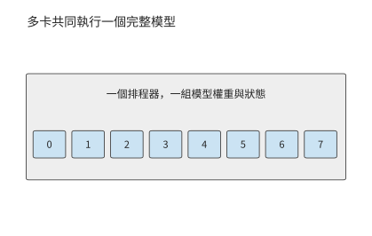

*圖 9-1：八張卡共同執行一個完整推理例項，接收同一批請求。卡號表示協作組成員。*

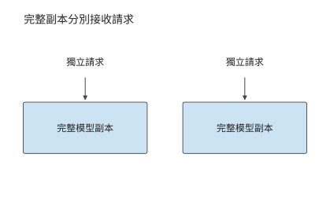

*圖 9-2：每個副本都能完成整次推理，可以分別接收獨立請求。副本自身也可以由多張卡組成。*

完整副本按請求分工；圖 9-3 中，同一請求先後經過兩個服務池。沿 P 到 D 的箭頭看，交接的是輸入處理留下的上下文 KV，兩個池仍各自執行相應階段的完整模型。

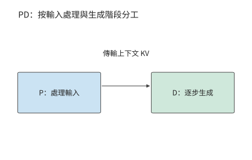

*圖 9-3：P 處理輸入，D 繼續生成。兩個服務池分別排程，上下文 KV 從 P 交給 D。*

圖 9-4 將分界移到模型層內部：注意力一側產生的啟用交給前饋一側，結果再返回。與一次階段交接相比，這條資料通路要在每一層、每一步生成中反覆走過。

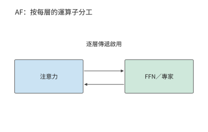

*圖 9-4：注意力與 FFN／專家分別執行，隱狀態作為啟用在兩側往返。每層都需要這次交接。*

比較這些部署方式時，先使用第 8 章得到的執行配置和處理速度，再改變計算資源之間的分工。P、D 由同一組執行資源處理的方式稱為**共置**。考慮已經調優的共置例項。請求的輸入長度為 $L$，總輸出長度為 $G$，prefill 計算最後一個輸入 token 的 logits，並由此取樣首個輸出。在本章採用的生成約定下，後續 decode 呼叫為 $G-1$ 次：最後一個返回的 token 尚未送入模型，所以輸出數比後續 decode 呼叫數多一。

對給定請求分佈，記每個請求在資源 $r$ 上消耗的平均服務時間為 $d_r$，同類資源共有 $n_r$ 個可獨立工作的單元。到達率與資源佔用時間需要滿足

$$
\lambda d_r < n_r,
$$

其中 $\lambda$ 是到達率。若多個操作使用同一資源，應先將它們的資源佔用時間相加；若操作分別使用相互獨立的資源，則為每種資源單獨列出約束。資源佔用量按「資源數 × 佔用秒數」計算；本章的資源是 GPU，這一乘積記為 GPU 秒。例如，每秒到達四個請求，每個佔用 0.5 個 GPU 秒，就需要兩張持續工作的 GPU。若恰好只有兩張卡，突發到達的額外請求就會一直積壓，因為兩張卡都忙於處理源源不斷的後續請求；只有增加 GPU，才能消化突發。

設每個請求在某類副本上的 prefill 和 decode 分別佔用 $d_P$、$d_D$ 秒，兩個階段在該副本上序列執行，那麼 $N$ 個相同共置副本的請求率上限為

$$
\mu_{\mathrm{co}}=\frac{N}{d_P+d_D}.
$$

第 9.2.3 節將從資料表峰值推出開篇兩類卡在各階段的服務時間。一張 A100 處理一次 8192 個 token 的 prefill 約需 0.86 秒，一條請求的 1024 次 decode 合計佔用約 1.76 GPU 秒；一張 H20 的 prefill 約需 1.81 秒，decode 只佔約 0.88 GPU 秒。每個完整副本都要承擔兩個階段，所以一張 A100 每請求佔 2.62 GPU 秒，一張 H20 佔 2.68 GPU 秒。八張卡合計每秒約完成 3.02 個請求，低於每秒 3.5 個請求的到達率，每秒積壓約 0.5 個請求。問題由此變得明確：同樣八張卡，重新分工能否補上這 0.5 請求/s 的缺口。

副本可以由多張卡共同構成。例如，Qwen3-235B-A22B 的一種 TP2×EP4 部署方式（TP 將專家矩陣二分，EP 將專家分成四組）用八張卡處理同一批請求：每兩張卡分擔專家矩陣，四個 EP 組分別持有不同的專家。注意力和 KV 在四個 EP 組間各複製一份，因此一條請求 8192 個 token 的上下文在整個例項內佔 5.875 GiB，是單份邏輯 KV 的四倍。這八張卡共同組成一個推理例項；要增加能獨立處理請求的副本，還要另外安排一套完整的權重與狀態。[^ownership]

### 9.1.2 計算分工與狀態共享

增加完整副本改變請求的分配；PD 分離改變 prefill、decode 的執行位置；AF 分離改變 attention 與 FFN、專家的執行位置；共享 KV 改變上下文狀態的儲存與讀取範圍。這些部署方式改變了系統的不同部分，可以逐項引入，也可以組合使用。

| 部署方式 | 希望獲得的收益 | 新增的主要約束 |
| --- | --- | --- |
| 增加完整副本 | 處理更多獨立請求，分散排隊 | 模型複製、快取分散、啟動及保持例項執行 |
| PD 分離 | 分別配置兩個階段的能力 | KV 交接、兩端同時佔用記憶體、兩個佇列 |
| AF 分離 | 讓運算子使用適合的計算與儲存資源 | 逐層啟用往返、同步、管線 (Pipeline)各階段的負載平衡 |
| 共享 KV | 跨例項複用上下文，減少重複 prefill | 快取標識、讀取、就緒通知、失效與空間釋放 |

選擇部署方式，先分析當前負載的資源需求。如果兩個階段的資源需求相近，完整副本已經能夠均衡服務，分離可能只會增加交接開銷。如果許多請求共享長字首，跨例項快取可能比進一步拆分計算更有價值。分別計算資源佔用和交接時間，就能判斷當前應增加副本、分離階段還是共享狀態。

### 9.1.3 同一請求的執行路徑與狀態駐留時間

確定分工方式之後，再沿一條請求的時間線考察它經過哪些階段、留下哪些狀態。圖 9-5 把一次多輪請求的計算階段與狀態駐留時間放在同一時間線上。帶視覺輸入時，編碼階段 E 將影象轉換為模型使用的特徵，EC 儲存這些編碼結果供複用。P 處理這些編碼結果與文字，D 逐步生成輸出；工具返回後，新一輪 P 處理新增資訊。權重通常跨請求保留，啟用主要跨相鄰運算子傳遞，KV 隨已處理的位置增長。工具等待期間計算可以暫停，但上下文狀態仍可能佔據記憶體。

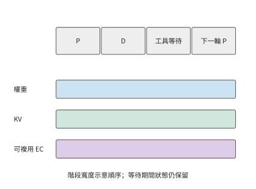

*圖 9-5：計算暫停期間，狀態仍需保留。示意同一請求從 prefill、decode 到工具等待和下一輪的狀態駐留時間；橫軸按階段排列，不表示相等時長，EC 僅在有視覺輸入時出現。E 為視覺編碼，EC 為儲存的視覺編碼結果，P 為 prefill，D 為 decode。*

以本章的 Qwen3-8B 為例，一份包含 8192 個 token 的 BF16 上下文 KV 佔 1.125 GiB。工具執行 10 秒時，GPU 可以處理其他請求，但這份上下文 KV 仍需佔用 1.125 GiB 記憶體，容量與佔用時長的乘積為 11.25 GiB·s；十個這樣的會話同時等待，就佔 11.25 GiB。計算暫停後，狀態仍需保留，這正是共享快取和換出策略要解決的問題。

這條請求若隨後返回 1025 個 token，P 先產生第一個輸出，1024 次 decode 再處理前 1024 個生成 token。此時連續 KV 覆蓋 $8192+1024=9216$ 個 token，最後一個返回 token 尚未送回模型。下一輪在這 9216 個 token 之後繼續，先處理該尚未寫入 KV 的末尾 token 和新增輸入；恢復生成時從此處繼續計算。

## 9.2 Prefill–Decode 分離與資源配比

### 9.2.1 Prefill 與 Decode 為什麼需要分離

Prefill 可以在一次呼叫中處理許多新 token，較大的矩陣計算往往能更充分地複用權重。在 decode 階段，每個請求每步通常只處理一個新 token，需要反覆讀取權重與上下文狀態。兩者混合執行時，較長的 prefill 可能推遲已有請求的下一個輸出；過度優先 decode 又會延長新請求的等待。

第 8.2 節已經用分塊 prefill 縮短了長輸入對 decode 的阻塞。本節保持相同模型和請求，進一步改變執行位置。PD 分離把兩個階段放入不同的服務池，使它們擁有獨立的佇列、批處理和資源配比。DistServe 與 Splitwise 是研究 P、D 分離部署的推論系統。在八張 A100 組成的同構叢集裡，分離靠獨立佇列消除兩個階段之間的排程干擾。在 A100 與 H20 組成的異構叢集裡，每類卡還能只承擔自己擅長的階段。[^pd]

這種分工像是先由一個人讀完材料，再交給另一個人繼續處理：接手者需要已有的工作記錄，才能繼續處理。對本例模型，這份需要交接的記錄就是上下文 KV。P 和 D 分別處理同一請求的不同階段，每個階段都要執行完整的前向計算。Qwen3-8B 的 P 處理 8192 個輸入 token，D 隨後呼叫 1024 次；每次都經過注意力和前饋網路。因此兩個池都需要完整的模型權重，KV 則從 P 交給 D。獨立批處理帶來的收益，首先要抵得過這次新增的交接。

應用透過一次呼叫請求完整的模型推論，服務內部則可以按階段安排不同資源。模型的資料依賴確定了階段之間的切分位置，KV 給出了兩階段之間需要交接的狀態，負載比例決定各池需要多少資源。利用這些資訊，服務可以在統一呼叫介面之下，為輸入處理和逐步生成分別選擇 batch 與計算資源。

### 9.2.2 KV 傳輸與兩端記憶體佔用

P 完成輸入處理後，D 需要得到上下文 KV 才能繼續生成。GQA 讓多個查詢頭共享一組鍵和值，為每個上下文 token 儲存完整的鍵和值。設層數為 $n$，上下文長度為 $L$，KV 頭數為 $h_{kv}$，每頭維度為 $d_h$，每元素為 $b$ bytes，則邏輯狀態大小為

$$
V_{KV}=2nLh_{kv}d_hb.
$$

係數 2 分別對應 K 與 V。Qwen3-8B 的固定配置為 36 層、8 個 KV 頭、每頭 128 維。BF16 狀態每個 token 的 KV 佔 144 KiB；8192 個 token 佔

$$
V_{KV}=8192\times144\ \mathrm{KiB}=1.125\ \mathrm{GiB}.
$$

**例 9.1　prefill 與 decode 之間的 KV 交接需要多久？** A100 伺服器與 H20 伺服器之間經 200 Gbit/s 的 RDMA 網路卡相連，單向載荷頻寬按 25 GB/s 計，採用整份狀態直接交接。純載荷傳輸時間為

$$
T_{\mathrm{payload}}=\frac{1.125\times2^{30}}{25\times10^9}
\approx48.3\ \mathrm{ms}.
$$

再加一次 5 μs 的啟動與同步，總時間仍約 48.3 ms：對這份完整 KV 資料，固定開銷只佔萬分之一左右，提高載荷頻寬更有助於縮短等待時間。而在 AF 逐層交接的小資料量傳輸中，固定開銷會佔更大的比例。[^handoff]

上述狀態大小來自 GQA 的儲存方式。MLA（第 2.3.2 節）不儲存展開後的鍵和值，而儲存上投影之前的潛變數：每個 token 每層只有一條 $d_c$ 維潛變數和一條 $d_r$ 維位置分支，狀態大小為

$$
V_{KV,\mathrm{MLA}}=nL(d_c+d_r)b.
$$

DeepSeek-V3 的固定配置為 61 層、$d_c=512$、$d_r=64$，BF16 下每個 token 佔 $61\times576\times2=70{,}272$ bytes，約 68.6 KiB；同樣 8192 個 token 的上下文佔 549 MiB。沿用例 9.1 的 25 GB/s 鏈路 (Link)，純載荷傳輸約 23.0 ms；鏈路 (Link)提高到 50 GB/s 時為 11.5 ms；同一條鏈路 (Link)上，GQA 狀態需要 24.2 ms。

| 交接狀態 | 每 token | 8192 個 token | 25 GB/s | 50 GB/s |
| --- | ---: | ---: | ---: | ---: |
| Qwen3-8B，BF16 GQA | 144 KiB | 1.125 GiB | 48.3 ms | 24.2 ms |
| DeepSeek-V3，BF16 緊湊 MLA | 68.6 KiB | 549 MiB | 23.0 ms | 11.5 ms |

MLA 的狀態更小，是因為快取放線上性變換的另一側：GQA 為每個 KV 頭儲存展開後的 $K$、$V$，MLA 只儲存上投影之前的潛變數，按結合律，上投影可移到當前查詢一側執行。若把 DeepSeek-V3 的 128 個頭也展開儲存，每個 token 要佔 $61\times128\times(192+128)\times2$ bytes，約 4.77 MiB，是緊湊表示的 71 倍；與 Qwen3-8B 只有 8 個 KV 頭的 GQA 相比，緊湊 MLA 仍只有其 0.48 倍。後文凡是 KV 位元組進入公式的地方，都並列給出這兩種狀態的結果。[^mla-handoff]

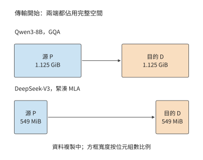

*圖 9-6：源 P 保留完整狀態，目的 D 同時分配同樣大小的接收空間。GQA 狀態兩端各 1.125 GiB，傳輸過程共佔 2.25 GiB；緊湊 MLA 狀態兩端各 549 MiB，共佔 1.07 GiB。方框寬度按位元組數比例繪製。*

採用整份雙緩衝交接時，傳輸結束前源端保留完整狀態，目的端分配完整接收緩衝。圖 9-6 至圖 9-8 依次畫出交接開始、傳輸完成和釋放源端三個時刻。載荷全部寫入目的端後，P 發出完成標記，D 看到標記才讀取狀態（圖 9-7）；執行權交給 D 之後，P 才釋放源緩衝（圖 9-8）。採用分塊傳輸時，目的端確認收到某一塊後，源端就可以提前釋放這一塊，縮短兩端重複駐留的時間；目的端靠完成標記確定哪些連續的塊已經可用。若經主存中轉，狀態則依次佔用源端、主存和目的端的緩衝，主存到 GPU 的複製成為新的依賴邊。

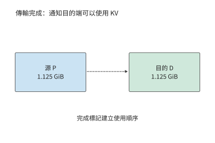

*圖 9-7：完整的 1.125 GiB 載荷已經寫入目的端，P 隨後發出完成標記。標記本身不再搬移資料，只規定先寫完、後使用的順序：D 看到標記才讀取狀態。*

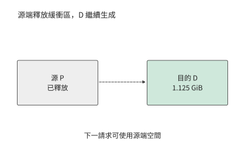

*圖 9-8：本算例將執行權交給 D 後釋放 P 的源緩衝，D 保留上下文並繼續生成。源端空間用於後續請求。*

請求持續到達時，鏈路 (Link)頻寬既限制每秒能交接多少份狀態，也影響每份狀態需要傳輸多久。每秒 8 次上述交接需要約 9.7 GB/s 的傳輸頻寬；每秒 16 次則需要約 19.3 GB/s。100 GbE（100 Gbit/s 乙太網）埠每方向 12.5 GB/s，能滿足前者的平均需求，但每個請求仍要等傳輸完成；後者則不同：即使兩池有空閒計算能力，網路佇列也會持續增長。前一種情形下每份狀態要約 96.6 ms 才能傳完，後一種情形每秒還會積累約 6.8 GB 待傳資料。傳輸時間決定了單個請求至少要等待多久，而資料到達速率與傳輸速率之差決定了佇列增長多快。換成 549 MiB 的緊湊 MLA 狀態，每秒 8 次和 16 次交接只需約 4.6 和 9.2 GB/s，同一個 100 GbE 埠能滿足兩者的平均需求，每份狀態約 46.1 ms 傳完。佇列是否增長由狀態位元組數與鏈路 (Link)頻寬共同決定，模型換了上下文表示，同一條鏈路 (Link)的結論就會翻轉。

### 9.2.3 階段處理能力與例項數量配比

比較各階段的處理速度前，應先算出單個請求在各階段分別需要多少工作。設請求有 $L_{new}$ 個需要 P 新處理的 token、$G-1$ 次 decode 呼叫。某類 worker 的有效能力分別為 $r_P$ 個新 token/s 與 $r_D$ 次 decode/s，則該 worker 的每請求資源需求為

$$
d_P=\frac{L_{new}}{r_P},\qquad d_D=\frac{G-1}{r_D}.
$$

這裡的資源佔用時間可以直接相加；輸入 token/s 與輸出 token/s 則要先換算成同一個請求的需求。批內多個請求共享一次 decode 呼叫時，完成的 decode 步要計入所有請求，但資源佔用時間只按這一次批執行計一次。

兩類卡的 $r_P$ 與 $r_D$ 可以從資料表推出。第 4 章的 Roofline 模型給出各階段耗時的下界：計算時間與訪存時間中的較大者。下表列出兩種卡的峰值。H20 的算力不到 A100 的一半，視訊記憶體頻寬卻約為 A100 的兩倍，這正是 H20 適合 decode、不適合 prefill 的原因。

| 卡 | BF16 稠密算力 | 視訊記憶體頻寬 | 視訊記憶體容量 |
| --- | ---: | ---: | ---: |
| A100 80GB SXM | 312 TFLOP/s | 2039 GB/s | 80 GB |
| H20 SXM5 96GB | 148 TFLOP/s | 4096 GB/s | 96 GB |

實際 kernel 達不到峰值。第 8.6.3 節用 RTX PRO 6000 上的逐輪記錄校準了兩項效率：decode 的頻寬效率隨 batch size 從 batch 1 的 33% 升到 batch 64 的 65%，batch size 為 32 時按兩側實測插值約為 49%；prefill 的算力效率穩定在 58%–62%。本章兩項都取為峰值的 50%，decode 一側與 batch size 32 的插值相當，prefill 一側比實測低約一成。按此取值，A100 的有效算力和頻寬為 156 TFLOP/s、1020 GB/s，H20 為 74 TFLOP/s、2048 GB/s。

取 50%，就是把第 1.2.2 節的 MFU 和 MBU 都取為 0.5，意味著一半的硬體能力沒有轉化為模型計算。按第 1.3.4 節的判據，這一半有兩類來源：一類是本章一階模型沒有計入的工作，例如 kernel 按 tile 補齊的零行、沒有與計算重疊的通訊；另一類是可以去掉的主機側開銷，例如逐個提交 kernel、切換前重建通訊組和執行圖。第 9.4.3 節和第 9.6.2 節各舉一例。

把這兩組有效能力代入章首的請求。Prefill 處理 8192 個輸入 token，需要 133.6 TFLOPs 矩陣運算，卻只讀一次約 15 GB 權重，受計算能力限制。A100 需要 0.856 秒，每秒約處理 9570 個新 token；H20 需要 1.81 秒，每秒約處理 4540 個。Decode 一步為批內 32 條請求各生成一個 token。取生成過程中的平均上下文 $8192+512=8704$ 個 token，這一步讀約 15.1 GB 權重和 41.1 GB KV，矩陣運算只有 0.65 TFLOPs，受視訊記憶體頻寬限制。A100 每步需 55.1 ms，每秒約完成 580 次 decode 呼叫；H20 每步只需 27.4 ms，每秒約完成 1166 次。兩種卡的強弱恰好相反：A100 的 prefill 比 H20 快一倍多，H20 的 decode 比 A100 快一倍。batch size 為 32 時，請求生成到最後，KV 共佔 43.5 GB，加上權重約 59.9 GB，兩種卡都能容納。[^rates]

先考慮同構場景：八張 A100 執行同樣的模型。共置時每張卡每請求佔 $0.856+1.764=2.62$ GPU 秒，八張合計 3.05 請求/s。分離後兩池只能按整數張卡劃分：三張做 P 提供 3.50 請求/s，五張做 D 提供 2.83 請求/s，上限為 2.83 請求/s，比共置低 7%。每個請求在分離前後消耗同樣的 GPU 秒，所以同構分離不能提高吞吐量；整數劃分還使兩池能力無法恰好相等，多出的能力只能閒置。[^pool]

同構分離換來的是延遲的穩定。共置且不分塊時，一次 8192 個 token 的 prefill 獨佔 A100 約 0.86 秒，這張卡上所有在途請求都停止生成，相當於錯過約 16 個 55 ms 的 decode 步。若這八張卡每秒接收 2.5 個請求，每張卡平均每 3.2 秒就要插入一次這樣的 prefill。分離後，D 卡每步穩定在 55 ms；P 卡專門處理輸入，首 token 時間是 0.86 秒的 prefill 加上 KV 交接。

第 8.2 節的分塊 prefill 是分離之外的另一條路。A100 上一步 decode 的訪存需要 55.1 ms，矩陣計算只需 4.2 ms，其餘時間算力空閒。按 156 TFLOP/s 計，這段空閒足以處理約 490 個 prefill token。一次 8192 個 token 的輸入分成 17 塊，捎帶在 17 個 decode 步中完成，首 token 時間約 0.94 秒，與分離相當，而在途請求的輸出間隔不變。若捎帶的計算完全藏在訪存時間裡，八張 A100 共置的上限升到 4.50 請求/s，遠高於分離的 2.83。實際能藏住多少，取決於分塊與 decode 同時執行時能否同時佔滿算力和頻寬，要用實測的混合步時間判斷。因此在同構叢集上，通常先採用分塊 prefill；分離的價值在於兩個階段可以分別選擇並行方式與 batch size，並徹底隔開彼此的排隊。

**例 9.2　異構叢集的階段配比如何決定吞吐量上限？** 使用 8192 個輸入 token、1025 個輸出 token。四張 A100 與四張 H20 的階段能力按上述方法推出，如下表所示；後續改變請求組成時，同樣按新的工作量重新推算。

| 卡 | P 能力，新 token/s | D 能力，呼叫/s | 每請求 P GPU 秒 | 每請求 D GPU 秒 |
| --- | ---: | ---: | ---: | ---: |
| A100 80GB SXM | 9566 | 580 | 0.856 | 1.764 |
| H20 SXM5 96GB | 4538 | 1166 | 1.805 | 0.878 |

共置時，一張 A100 每請求佔 2.62 GPU 秒，一張 H20 佔 2.68 GPU 秒，八張合計 3.02 請求/s。把四張 A100 分給 P、四張 H20 分給 D，P 池提供 $4/0.856\approx4.67$ 請求/s，D 池提供 $4/0.878\approx4.55$ 請求/s。每請求交接 1.125 GiB。兩臺伺服器之間按一張 200 Gbit/s 網路卡計，25 GB/s 的頻寬每秒可交接約 20.7 份，於是總體吞吐量率上限為

$$
\mu_{PD}=\min\left(\mu_P,\mu_D,\frac{B_{net}}{V_{KV}}\right)\approx4.55\ \text{请求/s}.
$$

其中 $\mu_P$、$\mu_D$ 是 P 池與 D 池的請求率上限，$B_{net}$ 是兩池之間交接鏈路 (Link)的頻寬。

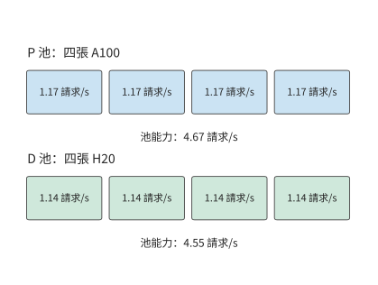

*圖 9-9：每張 A100 在 P 階段提供約 1.17 請求/s，每張 H20 在 D 階段提供約 1.14 請求/s。P 池 4.67 請求/s，D 池 4.55 請求/s，均低於網路卡約 20.7 請求/s 的交接能力。*

分離後，兩類卡都避開了各自較慢的階段，請求率上限從 3.02 增至 4.55 請求/s，是共置的 1.51 倍，高於每秒 3.5 個請求的到達率。模型仍處理同樣的 8192 個輸入 token 與 1024 次 decode，差別在於由誰執行。把角色對調，讓 H20 做 P、A100 做 D，P 池只剩 2.22 請求/s，吞吐量上限不到正確分工的一半。

上文在同構叢集上比較過的分塊捎帶，放到 H20 上效果有限：H20 一步 decode 的空閒算力只夠處理約 85 個 prefill token。按理想捎帶計，四張 A100 加四張 H20 共置的上限為 4.17 請求/s，仍低於分離的 4.55。異構叢集的收益來自硬體本身的差異，分塊無法替代。

另一個可以改變的條件是交接狀態本身。把交接狀態換成緊湊 MLA，$\mu_{PD}$ 的鏈路 (Link)項從 20.7 增至 43.4 請求/s，50 GB/s 鏈路 (Link)下則從 41.4 增至 86.9 請求/s；上限仍由 D 池的 4.55 請求/s 決定，四張 A100 做 P、四張 H20 做 D 的配比不變。鏈路 (Link)成為約束項的條件是 $B_{net}<\mu V_{KV}$：在 4.55 請求/s 下，GQA 狀態要求鏈路 (Link)至少約 5.5 GB/s，緊湊 MLA 狀態只要約 2.6 GB/s。高於此值，再提高頻寬不會改變吞吐量上限；低於此值，圖 9-10 中所有高於 $B_{net}/V_{KV}$ 的格子都會被鏈路 (Link)壓平到同一個值。[^pool-mla]

緊湊路徑節省的是位元組，不是全部工作。按第 2.3.2 節的結合律，上投影移到了查詢一側：DeepSeek-V3 每層每個查詢 token 要多做一次 $128\times128\times512$ 的查詢變換和一次同樣大小的值恢復，合計 33.5 MFLOPs，61 層為 2.05 GFLOPs，與表 2-3 中 KV 上投影（kv_b_proj）對單個 token 的展開運算量相同。這部分計算量隨批內請求數線性增加：一次 decode 呼叫服務 $B$ 條請求，就多 $2.05B$ GFLOPs。按 H20 的 74 TFLOP/s 有效算力，每條請求每步多 27.7 μs，1024 步合計 28.3 ms。若這部分計算不能藏進訪存時間，D 池每請求的 GPU 秒從 0.878 增至約 0.907，D 池能力從 4.55 降到約 4.41 請求/s，仍高於 3.5 的到達率；每條請求每步的額外計算超過約 258 μs，才需要第五張 D 卡。緊湊路徑改變的是 D 例項的瓶頸位置：每 token 讀取從展開狀態的 4.77 MiB 降到 68.6 KiB，計算項卻隨 batch size 增長，於是 D 例項在更小的 batch size 上就從讀取受限轉為計算受限。例 9.2 的 $r_D$ 是在 batch size 32 下推出的，換成緊湊 MLA 後要按新的轉折 batch size 重新推算。

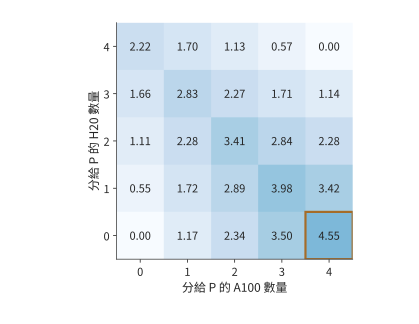

*圖 9-10：階段配比如何限制請求率。四張 A100 與四張 H20，階段能力見例 9.2；橫軸為分給 P 的 A100 數，縱軸為分給 P 的 H20 數，其餘分給 D。每格取兩池能力與 25 GB/s 網路卡交接能力的最小值，不含排隊；顏色深淺表示可持續的請求率，單位為請求/s，框出的格子為最優配比。*

圖 9-10 還給出了偏離最優配比後的吞吐量率變化。把一張 A100 從 P 調到 D，P 從 4.67 降為 3.50 請求/s，D 從 4.55 增為 5.12 請求/s，結果受 P 限制而降至 3.50。把一張 H20 從 D 調到 P，P 增為 5.22 請求/s，D 卻降為 3.42 請求/s，同樣變慢。最優配比使兩池能力接近相等。改變配比後，一個池即使有富餘能力，也無法替另一個池完成工作。

### 9.2.4 不同請求與負載下的收益邊界

例 9.2 固定了請求組成，現在只改變其中一個條件：字首命中。P 已經快取了前 6144 個 token，只需處理剩下的 2048 個。新 token 減到四分之一，A100 的 prefill 時間從 0.856 秒降到 0.238 秒，一張 A100 的 P 能力從 1.17 增至 4.20 請求/s；若仍給 P 四張 A100，它們合計能處理 16.8 請求/s，D 卻仍只能處理 4.55 請求/s。

把兩張 A100 調到 D，留下的兩張提供 8.41 請求/s 的 P 能力；D 則由兩張 A100 與四張 H20 提供 $2/1.764+4/0.878\approx5.69$ 請求/s。總體吞吐量率上限提高到 5.69 請求/s。再調走一張 A100，P 只剩 4.20 請求/s，反而更慢。假定 D 沒有快取這段字首，因此兩種配比仍須交接完整的 1.125 GiB；P 的計算量減少了七成多，但傳給 D 的 KV 大小沒有變化。

再恢復原始輸入，把輸出縮短到 129 個 token，即不帶推理過程的普通對話。D 呼叫數從 1024 降到 128，一張 H20 的 D 能力增至約 9.46 請求/s，D 幾乎不再是瓶頸。最優配比變成四張 A100 加三張 H20 做 P、一張 H20 做 D，P 池提供 $4\times1.168+3\times0.554\approx6.33$ 請求/s。共置此時已有 5.84 請求/s，分離只提高 8.5%。

圖 9-11 將三次調整畫在同一組計算資源上。每個方塊都是原來的一張卡，變化的只是它承擔的階段。字首命中後 P 的工作減少，可以讓出兩張 A100；輸出變短後 D 的工作減少，三張 H20 轉去做 P。

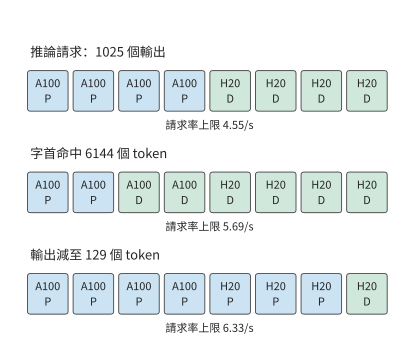

*圖 9-11：請求組成改變資源分配。四張 A100 與四張 H20，階段能力按例 9.2 的方法推出；第一行為 8192 輸入、1025 輸出的推理請求，第二行只減少 P 的新輸入，第三行恢復完整輸入並將輸出減至 129 個 token。方塊表示卡，每行下方為對應的吞吐量率上限。P 為 prefill 池，D 為 decode 池。*

這三種請求最合適的 P 卡數分別是四張、兩張和七張。字首命中減少 P 的新工作，把資源推向 D；輸出變短減少 D 的重複工作，把資源推向 P。推理請求的輸出越長，D 的比重越大，H20 這類頻寬強、算力弱的卡越有價值。由此可以把排程分成兩個時間尺度：請求到達時選擇進哪個佇列，負載分佈持續變化時調整池的規模。佇列分配決定眼前等待，池規模決定積壓能否長期消退。

## 9.3 Attention–FFN 分離與異構執行

### 9.3.1 Attention、FFN 與專家的執行邊界

AF 指注意力與前饋網路的分工。與 PD 一次劃分兩個生成階段不同，AF 在模型層內劃分計算：注意力產生隱狀態，前饋網路或被選中的專家處理該隱狀態，再把結果送回，供後續運算子使用。下一層通常要等待該結果，因此小資料量傳輸的啟動與同步會重複多次。

MoE 特別適合這種分工：總專家權重較大，但每個 token 只選擇其中一部分。若大多數專家儲存在主存，可以將被選中的權重搬給 GPU，也可以讓 CPU 使用本地權重完成計算，再傳遞較小的啟用。前一條路徑花鏈路 (Link)頻寬換 GPU 算力，後一條路徑花 CPU 算力換較少的鏈路 (Link)流量。如何選擇取決於本次分派給同一個專家的 token 數：每個 token 的特徵向量佔該專家輸入矩陣的一行，這些行復用同一份專家權重。

### 9.3.2 CPU／GPU 協作

上一小節的兩條路徑交付同一份輸出，區別在於跨鏈路 (Link)傳什麼：圖 9-12 傳權重，圖 9-13 傳輸入和輸出。第 8.4.3 節採用第一條路徑，將權重暫存主存，使用時搬到 GPU。KTransformers 是採用第二條路徑的實際系統：GPU 處理注意力和部分常駐專家，CPU 處理分給自己的專家；把分給 CPU 的工作提交後，GPU 繼續執行可以並行的分支，最後同步併合並結果。熱點專家、共享專家以及 prefill 階段可以採用不同的計算資源分工。分支匯合時，下一層必須等兩側都完成後才能開始。[^kt]

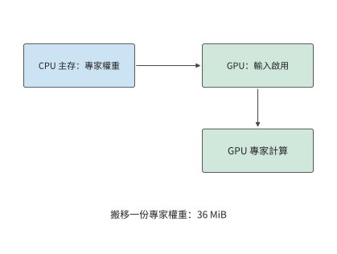

*圖 9-12：把一份 36 MiB 專家權重從主存送到 GPU，再由 GPU 讀取本地輸入完成計算。*

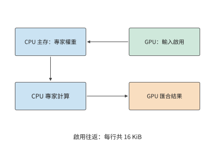

*圖 9-13：輸入從 GPU 交給 CPU，CPU 使用主存權重執行專家，結果回到 GPU。每次 token 到專家的分派，傳入和傳出的特徵向量合計 16 KiB；並行的 GPU 常駐專家分支完成後再匯合。*

兩條路徑的開銷都取決於一份專家權重的大小。對 Qwen3-235B-A22B，一個專家包含三個矩陣，參數數量為 $3\times4096\times1536=18874368$。BF16 權重為 36 MiB。

**例 9.3　專家權重複用如何改變 CPU 與 GPU 的執行選擇？** 採用 KTransformers 論文的實驗機：兩顆 Intel Xeon Platinum 8452Y，每顆 36 核、配 1 TB DDR5，經 PCIe 4.0 連線一張 A100 40GB PCIe。論文用 Intel 的記憶體測試工具 MLC 測得同一 CPU 插槽內的記憶體頻寬為 220 GB/s。在單顆 CPU 上執行 MoE 層時，PyTorch 基於 AVX-512（512 位向量指令集）的 kernel 最高達到 1.8 TFLOP/s；KTransformers 基於 AMX（高階矩陣擴充套件）矩陣指令的 kernel 最高達到 21.3 TFLOP/s。GPU 取 A100 40GB PCIe 峰值 312 TFLOP/s 與 1555 GB/s 的 50%，即 156 TFLOP/s 與 778 GB/s。PCIe 4.0 x16 的理論頻寬為 32 GB/s，交接按 25 GB/s 計，每次啟動 5 μs，BF16 啟用寬度為 4096。八個專家依次執行，總時間為各專家耗時之和，權重每批讀取一次。每個專家只收到一個 token 的特徵向量時，CPU 直接讀本地主存裡的權重，省去了在較慢鏈路 (Link)上搬 36 MiB；隨著每個專家的輸入行數增加，搬一次權重的開銷由更多行的計算分攤，CPU 卻更早達到算力上限。

先考慮八個熱點專家各處理一個 token：權重合計 288 MiB。在 220 GB/s 主存上讀取約 1.37 ms，加啟用交接後 CPU 路徑約 1.46 ms；搬到 GPU 的路徑僅傳權重就約 12.1 ms，連同啟動與 GPU 計算約 12.5 ms。低複用時，避免大塊權重搬移比提高矩陣算力更有價值。

若這八個專家各處理 128 個 token，權重仍是 288 MiB，計算量卻增至原來的 128 倍。用 AVX-512 kernel，CPU 路徑增至約 22.2 ms，GPU 路徑約 12.5 ms，此時在 GPU 上計算更快。圖 9-14 畫出了中間過程：每個專家的輸入從 71 個 token 增到 72 個時，GPU 開始比 CPU 快。換成 AMX kernel，128 個 token 時 CPU 路徑只需約 2.57 ms，約為搬權重路徑的五分之一，交點推遲到每專家 689 個 token。同一臺機器處理同一批請求，CPU 用哪套指令就決定了專家該放在哪一側。每個專家每多處理一個 token，CPU 增加的計算時間都多於 GPU，而權重搬移的開銷不變，所以過了交點 GPU 就佔優。[^locality]

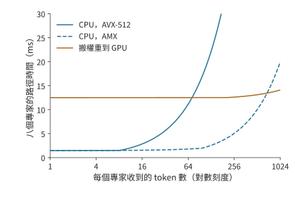

*圖 9-14：專家複用改變執行位置的選擇。八個專家各有 36 MiB BF16 權重。CPU 為單顆 Xeon Platinum 8452Y，AVX-512 與 AMX kernel 分別按論文實測的 1.8 與 21.3 TFLOP/s、同插槽記憶體 220 GB/s 計；GPU 為 A100 40GB PCIe，按峰值的 50% 計為 156 TFLOP/s、778 GB/s；PCIe 交接 25 GB/s，每次啟動 5 μs。橫軸為對數刻度，曲線按例 9.3 計算單層專家路徑，未含格式轉換。*

將上述數字寫成一般形式。記專家參數數量為 $P_e$、權重位元組數為 $W_e$，輸入寬度為 $h$、每元素位元組數為 $b$。若同一個專家本批收到 $m$ 個 token，其矩陣計算量為 $F_e(m)=2mP_e$ FLOPs，權重至少要讀取一次。設有效 CPU 算力、DRAM 頻寬分別為 $C_C,B_D$，GPU 算力、HBM 頻寬為 $C_G,B_H$，交接頻寬為 $B_L$。假定權重與啟用已經轉換為執行所需的格式，交接與專家計算序列發生，運算子時間取計算與權重讀取兩項中的較大值，則單個專家在兩種執行方式下的耗時分別為

$$
T_C(m)=2\alpha+\frac{2mhb}{B_L}
+\max\left(\frac{2mP_e}{C_C},\frac{W_e}{B_D}\right),
$$

$$
T_G(m)=\alpha+\frac{W_e}{B_L}
+\max\left(\frac{2mP_e}{C_G},\frac{W_e}{B_H}\right).
$$

前式將輸入傳輸、CPU 上的專家計算和輸出傳輸三段時間相加；後式先搬一份權重，再執行 GPU 計算。公式中的 $\alpha$ 是每次交接的固定代價。輸入啟用先到 CPU，輸出啟用在計算後返回，式中的兩次啟動和往返載荷正對應這兩條依賴邊。

硬體變化可以用同一組公式估計。在 NUMA 結構下，執行緒讀另一顆 CPU 上的記憶體要經過處理器間互聯。論文測得這臺機器的跨插槽頻寬只有 125 GB/s。CPU 路徑的時間取權重讀取與矩陣計算中較長的一項，圖 9-15 把每專家 128 個 token 時的這兩項並排畫出。用 AVX-512 kernel 時，計算遠長於讀取，記憶體放在哪個插槽幾乎無關緊要；換成 AMX kernel，計算縮短到略長於同插槽讀取，一旦跨插槽讀取，讀取反而成了較長的一項。就地計算是否划算，由當前的主要瓶頸決定：讀取受限時提高主存頻寬有用，計算受限時提高矩陣吞吐量有用。量化格式同時改變這兩項：權重位元組數減少，矩陣 kernel 的有效吞吐量也隨之改變。[^kt-audit]

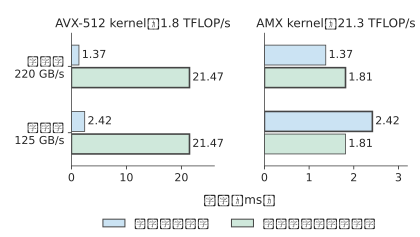

*圖 9-15：八個 Qwen3-235B-A22B 專家各處理 128 個 token 時，單顆 Xeon Platinum 8452Y 上的兩項時間：讀取八份 BF16 權重共 288 MiB，矩陣計算共 38.7 GFLOPs。粗框標出較長的一項，即這條路徑的耗時下界。左右兩圖橫軸刻度不同；AVX-512 與 AMX kernel 的算力、同插槽與跨插槽頻寬均為論文實測值。*

### 9.3.3 容量、並行與專家複用對服務能力的影響

能否裝下權重和能否及時完成請求，是兩個不同的問題。Qwen3-235B-A22B 每層 128 個 BF16 專家共佔 4.5 GiB。若每層固定 32 個專家駐留 GPU，單層為 1.125 GiB，94 層合計約 106 GiB。即使把一張 A100 80GB 的全部 80 GB（約 74.5 GiB）視訊記憶體都給專家，也無法容納這組常駐專家；還需在多卡間切分，或減少每層駐留數量。把每層駐留數減到 16，這部分權重降到約 53 GiB，但也把更多專家的執行交給了主存一側。容量選擇由此直接改變請求的執行路徑。

一個 token 選擇八個專家，並不意味著一個 batch 也只訪問八個專家。第 6.3.2 節已經算過這批分派：64 個 token 各選八個專家共 512 次分派，均勻覆蓋 128 個專家時每專家處理四行，集中到八個專家時每專家處理 64 行，兩種情況下專家矩陣的有效計算量都是 $512\times2\times18874368$，約 19.3 GFLOPs；若批內每份專家權重只讀取一次，權重讀取則是 4.5 GiB 與 288 MiB，相差 16 倍。在例 9.3 的 220 GB/s 主存上，單看權重讀取分別約為 22.0 ms 與 1.37 ms：計算量相同，讀取時間卻相差一個數量級。

總專家數決定需要安排多少權重，分派次數決定這一批的有效矩陣計算量，批內專家集合決定需要訪問哪些權重。圖 9-14 已說明，輸入行數決定 CPU 與 GPU 哪一側更快。還要補上另一個量：一批請求究竟會訪問多少個專家。知道該數量，才能將單專家的結果擴充套件到整個 batch。

除完全均勻和完全集中這兩種情況外，還可以分析隨機路由平均會訪問多少個專家。按第 6.3.2 節的推導，每個 token 獨立、均勻地從 $E$ 個專家中選擇 $K$ 個不同專家時，批內 $M$ 個 token 下的活躍專家數期望值為

$$
\mathbb{E}[U]=E\left[1-\left(1-\frac{K}{E}\right)^M\right].
$$

代入 $E=128,K=8,M=64$，期望約 126 個專家，理想權重讀取約 4.43 GiB，接近上述均勻覆蓋情形。隨著 batch size 繼續增長，被訪問的不同專家數最多到 128 就不再增加，分派次數卻繼續線性增加，新增的 token 於是越來越多地複用已經讀入的權重。

這一分析也說明，配備大容量主存和少量 GPU 的伺服器，更適合每個專家輸入行數較少的負載。DeepSeek V4-Flash 公開的單張 RTX 5090 配置要配至少 200 GB 主存，Kimi K2 採用 Q4_K_M 分組量化的配置（以 4 位元為主，部分張量採用更高位寬）需要約 600 GB 主存。主存解決了總權重的容納問題；請求的 batch size 增大後，瓶頸仍可能從權重讀取轉到 CPU 矩陣計算。圖 9-14 的交點正對應這種變化：增加並行，既攤薄讀取權重的代價，也逐漸耗盡 CPU 計算能力。[^capacity]

### 9.3.4 跨機 AF、專家分離與 micro-batch 流水

前兩小節的分工仍在同一臺伺服器的 CPU 與 GPU 之間。在 MoE 中，還可以把路由專家放到獨立的專家資源池，由保留注意力與 KV 的 worker 傳送啟用並接收專家結果。這稱為**專家分離**（Expert Disaggregation），也常叫 EP 分離；本書用「專家分離」指部署邊界，用 EP 指專家並行度。專家分離是本節注意力與專家計算分工的一種形式，具體系統還要說明共享專家、路由器和前後投影分別放在哪一側。

以第 7 章的兩臺 HGX H100 伺服器為例，考察一層 MoE 在專家分離下如何執行（圖 9-16）。伺服器 A 的四張卡 A0–A3 執行注意力，儲存各自請求的 KV；伺服器 B 的四張卡 B0–B3 各持有四分之一的路由專家。一層之內依次發生四步。第一步，A 卡算完注意力，路由器為每個 token 選出 8 個專家。第二步是第 6.2.6 節介紹的 dispatch：A 卡把每個 token 的隱狀態按所選專家的所在卡分組，發往對應的 B 卡。四張 A 卡都要向四張 B 卡各發一份數量不等的資料，構成一次 All-to-All。第三步，B 卡收到各來源的輸入後，按專家重新排列輸入行，執行專家矩陣乘。第四步是 combine：專家輸出沿原路送回 token 所在的 A 卡；A 卡收齊一個 token 的 8 份輸出，按路由權重加權求和，才能進入下一層的注意力。

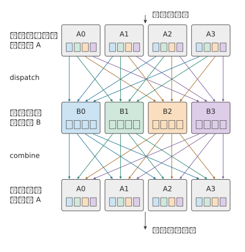

*圖 9-16：一層 MoE 在兩臺伺服器間的執行順序，時間從上到下。A0–A3 執行注意力與路由，B0–B3 執行專家。小方塊表示一張 A 卡發往一張 B 卡的一組輸入，顏色標出它去往哪張 B 卡；dispatch 把各色方塊送到同色的 B 卡，combine 再把結果送回原來的 A 卡。兩次交換都是 4×4 的 All-to-All。*

圖中有兩處等待。B 卡通常要等各來源的輸入到齊才開始計算，A 卡要等一個 token 的所有專家輸出都返回才能求和。一張 B 卡收得多、算得慢，就會同時推遲自身的計算與返回，以及所有等待其結果的 A 卡。第 9.4 節討論的 skew，正是經過這兩處等待影響整層耗時。

**大 EP** 則指一個專家並行組跨越較多的卡。大 EP 讓每張卡只儲存少量專家，並匯聚多個 attention worker 的輸入，使專家獲得足夠大的矩陣 batch。大 EP 不必採用獨立專家池：同一張卡也可以同時執行注意力和自己持有的專家；獨立專家池也不必只有一個大 EP 組。DeepSeek-V3/R1 的公開推理報告分別給出 prefill EP32 與 decode EP144（專家並行度分別為 32 與 144），並採用冗餘專家（為高負載專家額外放置的副本）和多類負載平衡；這說明大 EP 確有實際用途，但這組規模本身不能證明注意力與專家已經分到兩套裝置上。[^ep-system]

擴大 EP 並不自動擴大每個專家的 batch size。若本批有 $n$ 個 token、每 token 選擇 $k$ 個專家、共有 $E$ 個邏輯專家，均勻路由下每專家平均只有 $nk/E$ 行。例如 $n=1024,k=8,E=256$ 時為 32 行；只把同樣的 256 個專家從 32 張卡攤到 128 張卡，該平均值仍是 32，減少的只是每卡的專家數。匯聚更多輸入才能增大每個專家的 batch，卻也會擴大通訊範圍與同步範圍：圖 9-16 中的兩處等待要覆蓋 EP 組裡的每一張卡。每卡專家數變少還會讓卡間 skew 變大，第 9.4.1 節用同一組 $n,k,E$ 計算其如何隨 EP 增大。

專家池可以獨立增加副本、選擇不同算力／記憶體配比，並從多個 attention worker 匯聚任務。代價是原本可以在本地執行的專家輸入也要跨池傳送，網路成了兩池共享的資源。只有多個獨立 EP 組各儲存一套完整的專家集合，它們才是可以分別接收任務的服務副本；只新增儲存部分專家的卡，並不能讓每條請求隨意繞開繁忙的專家。共享專家池的佇列、視訊記憶體、模型版本和接納策略要當作一個整體來管理。

把 AF 從同一臺伺服器擴充套件到跨伺服器後，每次傳輸的啟動時間、鏈路 (Link)頻寬以及各節點開始執行的時間差都會有更大影響。MegaScale-Infer 是採用注意力與專家計算分離的分散式推論系統。該系統讓 micro-batch 在注意力節點與專家節點之間交錯執行，形成交替的流水：一個 micro-batch 執行注意力時，另一個 micro-batch 執行專家計算。理想情況下，若兩個階段每個 micro-batch 需要 $t_A,t_F$，忽略交接，處理 $q$ 個獨立 micro-batch 的雙階段流水需要 $t_A+t_F+(q-1)\max(t_A,t_F)$。其中首個 micro-batch 花費 $t_A+t_F$，之後每隔較慢階段的一個服務週期完成一個 micro-batch。跨層時，返回啟用將上一層的結束連線到下一層的開始。

MegaScale-Infer 的實驗為這種部署提供了實際證據。其 2025 年論文使用 Mixtral-8×22B、DBRX 與 317B 的 Scaled-MoE，權重、啟用和 KV 均為 BF16，生產請求的輸入／輸出長度中位數為 571／159 個 token。評估約束是 TPOT 不超過 150 ms；在八個節點、每節點八張 80 GB Ampere GPU 的同構叢集上，Scaled-MoE 的每 GPU decode 吞吐量達到 NVIDIA 推理框架 TensorRT-LLM 的 1.90 倍。這一結果包含分離放置、並行選擇、流水和通訊庫的共同效果，不能當作「只開啟 EP 分離」的通用加速比。論文也明確按專家熱度配置冗餘副本並最小化最忙節點的成本，說明獨立專家池仍要處理 skew。[^ep-papers]

用具體例子計算這條流水：設注意力與專家階段每個 micro-batch 分別需要 2 ms、3 ms。四個 micro-batch 依次執行共需 20 ms，任一時刻只有一個節點在工作；理想雙階段流水只需 $2+3+3\times3=14$ ms，節省 6 ms（圖 9-17）。若拆小 micro-batch 後每階段的實際服務時間變長，或者無法與計算重疊的往返通訊超過 6 ms，這項收益便消失。因此，通訊和計算效率下降帶來的額外耗時合計必須小於 6 ms，流水執行才更快。[^af]

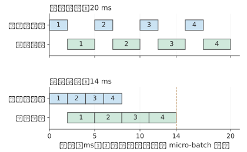

*圖 9-17：四個 micro-batch 在注意力節點與專家節點間執行，每個 micro-batch 注意力 2 ms、專家 3 ms，忽略交接。上圖依次執行，兩個節點輪流空閒；下圖交錯執行，micro-batch 1 做專家計算時 micro-batch 2 做注意力。流水穩定後，專家節點連續工作，每 3 ms 完成一個 micro-batch。*

**例 9.4　注意力與前饋網路逐層交接會增加多少通訊開銷？** 在 Qwen3-8B 的示例部署中，把 36 層稠密前饋網路放在另一側，每層傳送一個完整 BF16 隱狀態向量，並返回同樣大小的結果。單向傳輸一次的資料量為 $4096\times2=8192$ bytes；一步 decode 合計 72 次、576 KiB。沿用例 9.1 的 25 GB/s 網路卡，純載荷約 23.6 μs，72 次 5 μs 啟動合計 360 μs，序列交接約 0.384 ms。

這段時間短於例 9.1 中的一次 PD 交接，但兩者對應的工作範圍不同：PD 每個請求只交接一次，AF 每步 decode 都要交接。8192 個輸入 token 的 prefill 若也按整批稠密 AF 交接，啟用載荷為 4.5 GiB，約需 193 ms 純傳輸，再加啟動。PD 的一次搬移隨上下文長度增長，AF 的逐層往返還隨生成步數反覆發生；前者先受大塊 KV 搬移的影響，後者更容易受小資料量傳輸的啟動開銷和操作間依賴的影響。

AF 的逐層交接不隨 KV 表示改變：它傳的是 4096 維隱狀態，與 KV 頭數或潛變數寬度無關，一步 decode 仍是 72 次、576 KiB。改變的是 PD 一側。令一次 PD 交接與一步 AF 交接的序列時間相等，

$$
\frac{V_{KV}}{B}+\alpha=\frac{V_{AF}}{B}+72\alpha
\quad\Longrightarrow\quad
\alpha^*=\frac{V_{KV}-V_{AF}}{71B},
$$

其中 $V_{AF}$ 是一步 AF 交接的總載荷（576 KiB），$B$ 是鏈路 (Link)頻寬。啟動時間低於 $\alpha^*$ 時，一步 AF 交接比一次 PD 交接快；高於 $\alpha^*$ 時，72 次啟動的累計開銷已超過整份狀態的傳輸。GQA 狀態在 25 GB/s 下 $\alpha^*\approx680$ μs，50 GB/s 下為 340 μs；緊湊 MLA 狀態分別為 324 與 162 μs。狀態越小、鏈路 (Link)越快，留給每次啟動的預算越少。5 μs 的啟動遠低於這四個臨界值，單看一步交接，AF 都更快。放到整條請求上比較，結論則不同：1024 步 AF 交接累計約 393 ms，是 GQA 一次 PD 交接 48.3 ms 的 8.1 倍，是緊湊 MLA 一次 PD 交接 23.0 ms 的 17 倍。PD 只交接一次，MLA 把這一次的代價減半；AF 每步都要交接，隱狀態寬度不變，沒有節省任何位元組。輸出越長，差距越大。

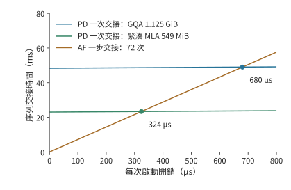

*圖 9-18：一次 PD 交接與一步 AF 交接的序列時間隨每次啟動開銷的變化，25 GB/s 鏈路 (Link)。PD 只啟動一次，斜率為 1；AF 一步 72 次啟動，斜率為 72。兩條 PD 線分別對應 GQA 狀態 1.125 GiB 與緊湊 MLA 狀態 549 MiB，與 AF 線的交點即臨界啟動時間 680 與 324 μs；50 GB/s 鏈路 (Link)下交點移到 340 與 162 μs。*

下一節考察 MoE 中的啟用傳輸：每個輸入可能發往多個執行位置，完成時還要等它選中的各個專家都返回結果再匯合。

## 9.4 專家放置、複製與負載平衡

### 9.4.1 大 EP 中的計算與通訊 skew

上一節中，集中複用減少了權重讀取。但這些熱點專家如果都放在同一張卡上，其他卡便無法分擔。本節繼續跟蹤同樣的 512 次分派，考察各張卡何時完成計算。即使全系統的總計算量不變，最忙的那張卡也可能讓整層推遲完成。對卡 $r$，記矩陣計算量為 $F_r$、需要讀取的權重位元組數為 $W_r$，有效算力和頻寬分別為 $C_r$、$B_r$。該卡完成計算與權重讀取的時間至少為 $\max(F_r/C_r,W_r/B_r)$；合併各卡的結果時，必須等耗時最長的卡完成。

把上一節的 512 次分派放到八張卡上，可以看到集中路由的另一面。若各卡恰好分到 64 次任務，每卡處理約 2.42 GFLOPs；若八個熱點專家都位於一張卡，該卡處理全部約 19.3 GFLOPs。八張卡取第 7 章的 HGX H100 伺服器，每張 H100 SXM 按 BF16 稠密峰值 989.4 TFLOP/s 的 50% 計，即 494.7 TFLOP/s。只看計算，最忙卡的服務時間從約 4.9 μs 增到 39.1 μs，為原來的八倍。

圖 9-19 中，橫條的長度表示各卡完成計算所需的時間。所有結果合併後才能進入下一層，因此決定完成時刻的是最長的一條，而不是八條的平均長度。

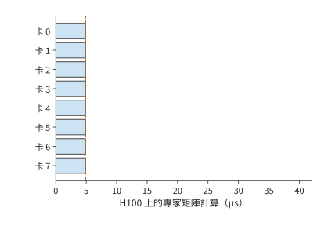

*圖 9-19：總計 512 次專家分派均分到八張卡，每卡 64 次；虛線表示全部計算結束、可以匯合的時刻。*

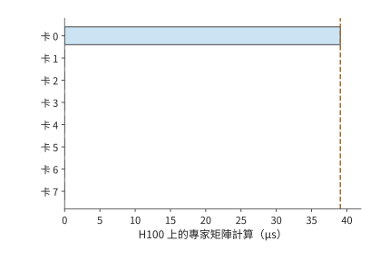

*圖 9-20：512 次全部落在卡 0，其他卡空閒。相同總計算量，需要等待卡 0 完成；兩圖使用相同時間尺度。*

集中路由將需要讀取的權重從 4.5 GiB 減少到 288 MiB，卻可能把最忙卡的計算量增至原來的八倍。前者有利於讀取受限的執行，後者不利於計算受限的執行。均衡策略因此要先確定瓶頸所在，再決定是追求複用還是分散工作。

即使總工作量不變，大 EP 也會放大這種等待。沿用第 9.3.4 節的 $n=1024,k=8,E=256$（DeepSeek-V3 每層也是 256 個路由專家、每 token 選 8 個）：一批共 8192 次分派，平均每個專家 32 行。設其中一個專家較熱，收到 128 行，是平均值的 4 倍；其餘 8064 行均分給另外 255 個專家，每個約 31.6 行。把 256 個專家按編號均分到 EP 組的各張卡，熱點專家所在的卡要處理它自己的 128 行，再加上同卡其他專家的行。EP8 時每卡 32 個專家，熱點卡約 1108 行，只比每卡平均的 1024 行多 8%；EP32 時每卡 8 個專家，熱點卡約 349 行，比平均的 256 行多 36%；EP256 時每卡只剩這一個專家，熱點卡 128 行，是平均 32 行的 4 倍。同一個熱點專家，在小 EP 中被同卡的其他專家沖淡，在大 EP 中獨佔一張卡，專家之間的不均原樣變成了卡之間的不均（圖 9-21）。

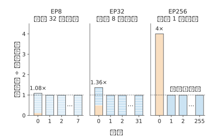

*圖 9-21：同一個熱點專家在三種 EP 規模下造成的卡間 skew。256 個專家，1024 個 token 各選 8 個，專家 0 收到平均值 4 倍的 128 行。每根柱是一張卡，柱內每一段是這張卡上的一個專家，橙色為熱點專家；縱軸為該卡行數除以每卡平均行數。每幅圖只畫卡 0、1、2 和最後一張卡，其餘各卡與卡 1 相同。*

一張卡的行數同時決定三項工作：dispatch 階段要接收的位元組數，combine 階段要傳送的位元組數，以及專家計算受算力限制時的矩陣時間。按每行 8 KiB、每卡 50 GB/s 網路卡計，EP256 的熱點卡要接收 1 MiB，約 21 μs，一張平均的卡只收 256 KiB，約 5.2 μs。若 batch 較小、專家計算受權重讀取限制，一張卡的矩陣時間主要取決於它要讀幾份專家權重，與行數關係不大，但兩次交換的位元組數仍與行數成正比。從 EP8 到 EP256，每卡平均行數縮小到 1/32，最忙卡的行數卻只從 1108 降到 128，約為原來的 1/8.7。整層按最忙的卡計時，EP256 中一張平均的卡在這一階段有四分之三的時間在等待。

沒有熱點時，EP 增大同樣會放大 skew。設每個 token 獨立、均勻地隨機選擇 8 個專家，各專家的行數仍會在 32 附近隨機波動。一張卡上的專家越多，這些波動越能相互抵消；卡越多，一批中出現一張特別忙的卡的機會也越大。按固定隨機種子模擬 1000 批，EP8 的最忙卡平均只比每卡平均多 4%，EP256 多 52%（圖 9-22）。兩種效應來自同一個原因：EP 越大，每卡上可以相互抵消的專家越少，要等待的卡卻越多。DeepSeek 公開的 decode 部署採用 EP144，每張卡只放 2 個路由專家，位於曲線右端附近；它為此增加 32 個冗餘專家，並按負載調整副本，這正是第 9.4.2 節討論的手段。[^ep-scale]

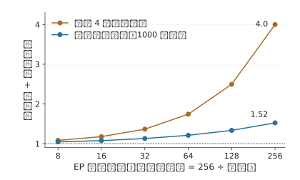

*圖 9-22：最忙卡行數與每卡平均行數之比隨 EP 組卡數的變化。橙線為一個 4 倍熱點專家，不含隨機波動，可以直接手算；藍線為均勻隨機路由，是固定種子模擬 1000 批的平均值。256 個專家按編號均分，不設副本；橫軸為對數刻度。*

通訊量也取決於 token 最初在哪張卡上。在第 9.1 節的 TP2×EP4 佈局中，各 EP 組處理同一批請求，每個 EP 組的成員已經持有相同的隱狀態輸入，跨 EP 組的 dispatch 可以為零，結果透過部分和歸約合併。另一種佈局讓各張卡持有各自不同的輸入 token，這時就要把啟用 dispatch 給遠端專家，圖 9-16 就是這種情形。輸入已複製時，通訊集中在結果合併；輸入分屬不同的卡時，執行前還多出一次遠端 dispatch。通訊量由 token 的起點、專家的位置與結果的歸屬共同決定。

大 EP 中的 skew 至少要分三個層次觀察。邏輯專家的選擇頻率決定每個專家的有效行數；專家放置與副本選擇把這些行數變成每卡負載；token 的來源、目標和網路路徑再把每卡負載變成每個方向的流量。專家熱度不均未必造成卡間不均，卡間計算均勻也未必讓共享鏈路 (Link)均勻。第 6.3.2 節的批內複用解釋權重讀取，本節繼續核算逐卡計算、通訊與完成時間。

設 $a_{ij}$ 是來源 $i$ 發給專家組 $j$ 的 token—專家分派次數，每份輸入與輸出分別為 $d_D,d_C$ bytes。在按分派傳送、無去重與預歸約的方案下，

$$
V^D_{ij}=a_{ij}d_D,\qquad V^C_{ji}=a_{ij}d_C,\qquad
m_j=\sum_i a_{ij},\qquad
s_{\mathrm{expert}}=\frac{\max_j m_j}{nk/R}.
$$

這裡 $R$ 是接收專家組數，$\sum_jm_j=nk$。$s_{\mathrm{expert}}=1$ 表示組間有效任務均衡；同型專家、相同精度且忽略 padding 時，它才近似等於計算量 skew。對通訊階段 $X\in\{D,C\}$，把矩陣按傳送方、接收方和物理割集統計，有

$$
T_X\ge\max\left(
\max_i\frac{\sum_jV^X_{ij}}{B^{\mathrm{send}}_i},
\max_j\frac{\sum_iV^X_{ij}}{B^{\mathrm{recv}}_j},
\max_{\mathcal C}\frac{V^X_{\mathcal C}}{B_{\mathcal C}}
\right).
$$

其中 $V^X_{\mathcal C}$、$B_{\mathcal C}$ 分別是穿過物理割集 $\mathcal C$ 的載荷與鏈路 (Link)頻寬。這是載荷傳輸下界，不含啟動、排隊與資料晚到；同一物理方向的並行流量需要相加，不能把多條流各自除以一份完整頻寬後假定同時完成。頻寬 skew 在這裡指各張卡、各條鏈路 (Link)的需求或佔用不均，硬體的額定頻寬並沒有變。

**例 9.5　總通訊量相同，為什麼熱點讓兩次交換都變慢？** 沿用第 7.2.3 節的 1024 個 token、每 token 選 8 個專家與 8 KiB 向量，放到圖 9-16 的兩臺 HGX H100 伺服器上：四個來源是伺服器 A 上執行 attention 的四張卡，四個專家組各由伺服器 B 上的一張卡執行，全部分派都跨伺服器。每張卡經自己的 400 Gbit/s ConnectX-7 網路卡收發，每方向 50 GB/s；交換網路在兩臺伺服器之間每方向可承載 $4\times50=200$ GB/s。四個來源各傳送 2048 份，dispatch 總計 64 MiB，combine 也是 64 MiB。均衡時每組接收 2048 份，即 16 MiB；熱點分佈為 $[5120,1024,1024,1024]$ 時，組 0 接收 40 MiB，另外三組各 8 MiB。兩種分佈的總通訊量和總有效計算量相同，專家 skew 卻從 1 變為 2.5。

每份專家計算按 Qwen3 MoE 示例的 $6\times4096\times1536$ FLOPs 計，每張 H100 的有效算力取 494.7 TFLOP/s。暫不計權重讀取、padding、啟動與排隊，得到下表。最後一列僅適用於三個階段之間設整批屏障的執行，是三個下界之和；有重疊時須另算關鍵路徑。[^ep-calc]

| 分佈與路徑 | dispatch 下界 | 最忙卡計算下界 | combine 下界 | 階段屏障總下界 |
|---|---:|---:|---:|---:|
| 四組均衡，跨伺服器 | 0.336 ms | 0.156 ms | 0.336 ms | 0.827 ms |
| 熱點組，跨伺服器 | 0.839 ms | 0.391 ms | 0.839 ms | 2.068 ms |
| 四組均衡，兩池間只剩一條 400 Gbit/s 鏈路 (Link) | 1.342 ms | 0.156 ms | 1.342 ms | 2.841 ms |
| 熱點組，dispatch 改為 FP8 | 0.419 ms | 0.391 ms | 0.839 ms | 1.649 ms |
| 熱點組，兩池同在一臺 HGX（NVLink） | 0.093 ms | 0.391 ms | 0.093 ms | 0.577 ms |

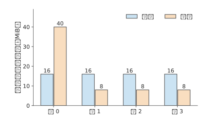

*圖 9-23：四個專家組在 dispatch 階段接收、combine 階段傳送的載荷。均衡與熱點分佈總計均為每方向 64 MiB；熱點組在兩個階段都承擔 40 MiB。柱高表示位元組需求，不表示測得的瞬時頻寬。*

跨伺服器時，兩次交換佔階段屏障總下界的八成，最忙卡的計算只佔兩成：H100 算一份專家任務約需 76 ns，網路卡傳一份 8 KiB 啟用卻要約 164 ns。熱點同時延長接收、計算與返回，三段都變為原來的 2.5 倍。把熱點分散後，若兩池之間只剩一條 400 Gbit/s 鏈路 (Link)，仍需每方向至少 1.342 ms，說明增加專家卡不能替代跨池頻寬。只把 dispatch 改為 FP8，也不會同比縮短 BF16 combine 或專家計算；表中假設量化不改變計算時間，並忽略尺度後設資料，以便分別觀察這幾項影響。把兩池放進同一臺 HGX，每方向 450 GB/s 的 NVLink 把兩次交換都壓到 0.093 ms，熱點卡 0.391 ms 的計算就成了最長的一段；這時減少熱點卡的計算比再提高頻寬更有效，下一節的專家副本針對的正是這種情形。

### 9.4.2 專家副本、放置與動態調整

圖 9-20 中集中在少數卡上的工作提示了改進方向：把熱點專家的副本放到空閒卡上，讓這些卡也能處理熱點任務。專家複製讓同一個邏輯專家擁有多個物理副本，排程器可以把任務分給這些副本。只要副本的權重相同、路由權重用得正確、結果合併無誤，複製就不必改變每個 token 選分數最高的 k 個專家這條規則（top-k）；修改專家選擇規則會改變模型行為，兩者要分開評價。vLLM、SGLang 的專家負載平衡機制（EPLB）根據路由統計，調整各邏輯專家的副本位置和任務分配。

專家副本佔用視訊記憶體，也會擠佔 KV 和緩衝。每卡每層增加一個 36 MiB 專家，94 層共需 3384 MiB，約 3.30 GiB；若只為八個最擁擠的層各增加一個副本，則只需 288 MiB。兩者相差近 12 倍。CRAFT 是研究專家副本與視訊記憶體分配的服務系統，要解決的正是各層視訊記憶體如何分配的問題：把空間花在最能縮短等待的層，而不是機械地給每層同樣多的副本。[^moe]

**例 9.6　熱點專家副本需要多少批才能收回複製成本？** 八張卡是一臺 HGX H100 伺服器，一批 128 個 token 都選中卡 0 上的八個熱點專家，共 1024 次分派。把其中七個專家各複製一份到卡 1 至卡 7，共 252 MiB；七張接收卡各增加 36 MiB，都能放入 64 MiB 的額外可用空間。每張 H100 按峰值的 50% 計，有效算力 494.7 TFLOP/s、視訊記憶體頻寬 1675 GB/s。卡 0 按 tile 排程，每批要從視訊記憶體讀寫約 921 MB，受視訊記憶體頻寬限制；複製後卡 0 只剩 576 次分派，每批從約 0.550 ms 縮短到 0.309 ms，節省約 0.240 ms。七份副本都從卡 0 經 NVLink（每方向 450 GB/s）依次發出，每份另計 5 μs 啟動，複製約需 0.622 ms。按未經四捨五入的執行時間，節省時間超過複製時間所需的最少批數滿足

$$
N\Delta t>T_{copy},\qquad
N_{min}=\left\lfloor\frac{T_{copy}}{\Delta t}\right\rfloor+1=3.
$$

在同一臺伺服器內，副本到第 3 批就收回了複製成本：熱點持續 16 批淨省約 3.2 ms，持續 64 批淨省約 14.8 ms。若熱點專家的原副本在另一臺伺服器上，複製要經 400 Gbit/s 的 ConnectX-7 網路卡（每方向 50 GB/s），準備時間增至約 5.32 ms，要到第 23 批才回本：熱點只持續 16 批時反而淨損失約 1.5 ms，持續 64 批才淨省約 10.1 ms。圖 9-24 把一次投入與逐批收益畫在同一張圖上。若接收卡只有 32 MiB 空間，連一份 36 MiB 專家也無法容納，此時無論熱點持續多久，都應先改變放置或釋放容量。[^replica]

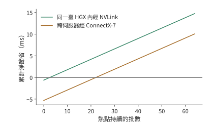

*圖 9-24：熱點持續多久，專家複製才值得。每批節省約 0.240 ms；同一臺 HGX H100 內經 NVLink 複製一次約 0.622 ms，第 3 批開始淨獲益；跨伺服器經 ConnectX-7 網路卡複製約 5.32 ms，第 23 批開始淨獲益。曲線使用例 9.6 中未經四捨五入的時間計算；七張接收卡各需額外 36 MiB，假設熱點不變。*

CRAFT 的實測進一步表明，複製收益與層有關。該研究基於 SGLang v0.4.8，在八個 AWS p4de.24xlarge 節點組成的 A100 80GB 叢集上執行 BF16 的 DeepSeek-R1 和 Kimi K2，比較視訊記憶體預算內按層分配專家副本與既有複製策略的效果。論文報告端到端吞吐量平均達到對照的 1.14 倍、最高 1.2 倍。這說明應把副本預算優先給收益大的層，但不表示任意熱點複製都能得到這一增幅；其輸入按 4096 個 token 分塊、輸出固定為 256 個 token 等實驗條件，以及按有效吞吐量（goodput）定義的容量拐點，也不能直接替代線上的 p99 指標。[^ep-papers]

副本策略要預測的是熱點還會持續多久。跨伺服器複製時，每次重新複製都需要 5.32 ms，所以頻繁跟著熱點遷移副本，會推遲收回複製成本的時間。同一臺伺服器內複製只要 0.622 ms，時間幾乎構不成約束，限制副本數量的是每張卡還能釋放多少視訊記憶體。將容量優先分給持續擁擠的層，才能讓累計節省的等待時間超過準備耗時。

均衡策略還要沿完整路徑選擇控制物件。來源側要平衡 token 數與注意力的就緒時間；專家側要平衡有效行數、實際 GEMM 時間和接收量；網路側要檢查共享出口、跨機架流量與返回方向。DeepSeek 的公開報告把 prefill、decode 與 EP 負載平衡分別處理，原因就在這裡。長上下文 decode 即使每卡請求數相同，注意力的 KV 讀取量仍可能不同，最終形成不同的 dispatch 發起時刻。[^ep-system]

在獨立專家池中，還要控制跨來源的排隊。多個 attention worker 可能同時選中同一個熱點專家，即使它們各自的小 batch 看起來均衡，匯合後的流量也可能超過該專家的服務能力。若池每秒接納 $\lambda$ 批，每批平均在專家卡 $j$ 上產生 $\mathbb E[F_j]$ FLOPs，則穩定執行至少需要 $\lambda\mathbb E[F_j]<C_j$；每條鏈路 (Link) $\ell$ 還需滿足 $\lambda\mathbb E[V_\ell]<B_\ell$。平均負載滿足這些條件只是必要條件，突發和重尾輸入仍會造成較長的佇列。共享池有時能匯聚 batch、平滑各來源的波動，有時會放大相關的熱點，不能直接假定分離會消除 skew。

熱點副本應放到同時有計算餘量和鏈路 (Link)頻寬餘量的位置。本節的 dispatch 訊息是一個 token 的隱狀態向量，BF16 為 8 KiB、FP8 為 4 KiB，遠大於第 7.2.4 節在 50 GB/s 網路卡上求出的約 0.93 KB 交點，熱點卡先用盡的是頻寬，而不是網路卡發起請求的速率；只有逐條傳送不到 1 KB 的控制訊息時，才需要為網路卡每秒約 5400 萬項的請求發起能力一併留出餘量。動態選擇副本時要計入佇列和路徑，並保留當前 batch 使用的路由對映直至 combine 完成；遷移或回收舊副本前要排空在途任務。對熱點設定接納額度、限制單個來源的在途量，可以避免它耗盡整個池的緩衝；增加池容量時，也要相應調整接納額度與背壓。丟棄溢位 token、改變 top-k 或替換邏輯專家會改變模型行為，不能當作透明的資源均衡。

### 9.4.3 輸入分發、計算與結果合併的重疊

前兩小節的核算沒有區分 prefill 與 decode，而分派集中對這兩個階段的影響並不相同。《Demystifying the Mixture of Experts Serving Tax》用各階段的微基準解釋這種差異：prefill 的計算不均會讓最慢的卡拖住整批，decode 的專家集中卻可能透過減少活躍權重和 padding 降低訪存成本。這與第 6.3.2 節的複用分析一致。論文的 Mixtral／Qwen2 MoE 使用八張 A100，DeepSeek-V3 使用八張 B200，通訊微基準另有 8／16 張 H200；這些結果不能合成一個跨叢集的端到端加速比。論文提供的證據說明，路由、實際矩陣形狀、通訊和記憶體存取要一起測量。[^ep-papers]

實際矩陣形狀的影響主要來自補齊。Grouped GEMM 把多個專家的矩陣乘法放進同一次 kernel 執行，kernel 按 tile 大小補齊各矩陣的行數。例如八個本地專家收到 $[32,16,8,4,2,1,1,0]$ 個 token，合計 64 次 token 到專家的分派，對應輸入矩陣中的 64 個有效行。若每個非空專家補齊到 32 行，需要 224 行；若八個專家都按最大值補齊，需要 256 行。實際執行的行數分別為有效行數的 3.5 倍和 4 倍。這解釋了為什麼有效任務數相同，矩陣時間仍可能不同：硬體執行的是補齊後的矩陣，模型所需的專家計算只對應其中 64 個有效行；補齊的零行沒有對應的真實 token。

補齊影響的是計算一項；三個階段的總時長還取決於它們能否重疊。以第 9.4.1 節跨伺服器的均衡分佈為例：dispatch、專家計算與 combine 的下界分別為 0.336、0.156、0.336 ms，完全序列為 0.827 ms。若能均分成兩個 micro-batch，各階段時間減半，理想三階段流水等於一個 micro-batch 三段之和再加一次最長的一段，即 0.581 ms，節省 0.246 ms。這裡最長的一段是通訊，流水的節奏由網路卡決定。若網路卡的 DMA 與同時執行的 GEMM 爭用 HBM，使每個 micro-batch 的 dispatch 與 combine 各慢約 49%，同一流水就回到 0.827 ms：通訊確實重疊了，整批卻沒有變快。反過來，專家計算要慢到原來的 3.1 倍，才會抵消同樣的收益。[^expert-exp]

補齊和爭用正是 MFU 達不到峰值的兩大來源：補齊讓矩陣單元去算沒有對應 token 的零行，爭用讓通訊和計算互相拖慢。兩者都出在實現層，硬體峰值並沒有變；選用更貼合實際行數的 tile，錯開 DMA 和 GEMM 對 HBM 的訪問，就能收回其中一部分。

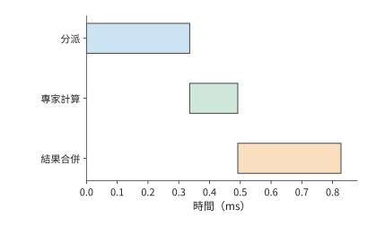

*圖 9-25：整批依次分派 0.336 ms、計算 0.156 ms、合併 0.336 ms，總時間 0.827 ms；數值取自第 9.4.1 節表中跨伺服器的均衡分佈。*

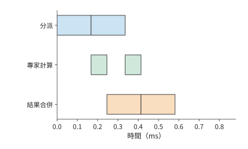

*圖 9-26：每個 micro-batch 的各階段時間減半，三條軌道使用獨立資源。第一個 micro-batch 計算時可以 dispatch 第二個 micro-batch，總時間降到 0.581 ms。*

沿圖 9-26 的時間線看，第一個 micro-batch combine 時，第二個 micro-batch 已經開始計算。第一批的 dispatch 負責填充流水，最後一批的 combine 負責收尾，這兩段是流水之外的序列時間。

上述流水假設兩個 micro-batch 大小均勻。真實的專家分離中，一個 token 的路徑仍然是「dispatch → 所選專家計算 → combine」，**兩次通訊階段**夾著專家計算。dispatch 的資料就緒 skew 來自注意力的完成時間和傳送佇列；專家計算的 skew 又變成 combine 的傳送就緒 skew。即使兩次交換的位元組數完全對稱，返回階段也可能因為資料晚到而拖長。

對 token $t$，令所選專家集合為 $\mathcal E(t)$，從當前層起點到專家 $e$ 的排隊、分派、計算與返回的累計路徑長度為 $L_{t,e}$。其合併完成時刻滿足

$$
T_t=\max_{e\in\mathcal E(t)}L_{t,e}+T_{\mathrm{merge},t}.
$$

這裡每條路徑都包含共享資源上的排隊，不能把各階段單獨執行的時間直接代入並假定互不干擾。若某 token 的兩條分支分別在 0.5 ms 和 1.4 ms 返回，它要等到 1.4 ms 後才能合併；只把快的那條分支降到 0.3 ms 不會改變它的完成時刻。逐 token 或逐塊推進時，沒有選中慢專家的 token 可以更早繼續；整批屏障則讓它們一起等。執行時是否真正支援細粒度推進、後續矩陣是否還要求湊批，決定了等待會傳播多遠。

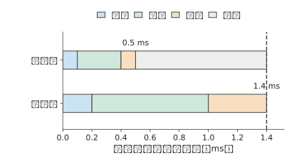

*圖 9-27：一個 token 選中的兩條專家分支，教學時長分別為 0.5 ms 與 1.4 ms。每條都依次經過 dispatch、計算與 combine；同一個 token 要等兩份結果，圖中忽略本地加權合併的時間。灰色表示快分支的結果到達之後等待的時間。*

這也解釋了為什麼不能總用 $\max(t_A,t_F)$ 預測專家池的流水週期。該式要求各階段耗時穩定、資源獨立、工作能持續供給；實際週期還受最忙專家、往返鏈路 (Link)、返回緩衝和跨層依賴的約束。同一個專家池若為多個層或多個模型服務，必須合計它們佔用的資源。第一個 micro-batch 仍要承受完整的往返延遲，提高穩態吞吐量並不等於縮短單個 token 的響應時間。

dispatch 與 combine 這兩次通訊由通訊庫實現。NCCL 提供通用的集合通訊與點對點原語，專用的 EP 通訊庫則把路由、打包、傳輸和合並放在一起實現。DeepEP 提供 MoE dispatch／combine 和低精度傳輸支援；V2 的公開介面使用 ElasticBuffer，底層採用 NCCL Gin（NCCL 由 GPU 發起網路通訊的後端），並移除了 V1 中不佔用 SM、直接經 RDMA 收發的低延遲 EP 通訊路徑。這說明庫名相同也不能省略版本條件。比較實現時，應固定版本、資料形狀、精度和拓撲，分別記錄傳送／接收位元組數、expert GEMM 行數、padding、每階段的就緒與完成事件，再統計整個層和整條請求耗時的 p50／p99。單獨測得的通訊頻寬只能解釋其中一部分。[^ep-system]

復算本節時，可先保持總分派數不變，只改變專家分佈；再固定分佈，改變共享出口和 dispatch 精度；最後在跟蹤記錄中改變一個來源或專家的就緒時間。前三項由配套計算直接重現，最後一項要在執行時間線中觀察等待如何傳播。這樣才能區分流量 skew、計算 skew 和單純晚到造成的等待，不會把所有慢通訊都歸咎於網路頻寬不足。[^ep-calc]

## 9.5 KV 的分佈、共享與請求路由

### 9.5.1 快取標識、共享範圍與可用狀態

前兩節靠改變執行位置和任務分配，減少了當前請求的耗時。另一種節省計算的方法，是讓後續請求直接使用前一次計算留下的 KV。第 8.3 節已經說明分頁、字首匹配、共享和淘汰的機制。本節接著考慮狀態分佈在不同執行位置時，如何確認匹配、找到資料並完成傳輸。字首快取的價值來自避免重複執行，但「相同文字」不足以唯一確定所有可複用狀態。模型與 adapter 版本、token 序列、位置索引、狀態格式以及必要的編碼配置都可能參與快取標識的計算。例如，同樣的 token 配上不同的 adapter，投影后會得到不同的 K、V；同樣的字尾接在不同的前文後面，注意力看到的上下文也不同。快取鍵需要沿字首鏈標識出生成這份狀態的整個計算。滑動視窗狀態或遞推狀態則還要攜帶對應的 token 位置索引與更新時刻，才能從同一個狀態繼續。

確認兩份狀態可以相互替代之後，還要確定狀態存放在哪裡、其他例項如何讀取。容量相加並不會自動形成共享快取。兩個例項各有 4 GiB 私有的主機記憶體快取時，同一份 1.125 GiB 字首會在兩邊各存一份，共佔 2.25 GiB，而兩個例項都無法使用對方那一份。若兩者連線到同一個共享儲存後端（接收和提供快取物件的儲存服務），一份物件就能服務兩邊，但每一邊在生成前可能還要把它取回本地。SGLang 的分層快取 HiCache、vLLM 的多級快取路徑和 KV 快取管理系統 LMCache 提供了不同的組織方式；取回是否經過 CPU，決定下一節的路徑時間。[^cache]

狀態產生後，需要先儲存並行布，其他例項才能查詢、取回並使用它。路由器用到的快取事件通常只有儲存位置和快取標識這類後設資料，不帶完整的 KV。GPU 上的副本被淘汰時，CPU 上的副本可能還在。**目錄**儲存快取標識與位置的對映，**物件**儲存實際 KV 位元組；恢復時分別確認目錄對映和物件資料。事件遺漏、延遲或快取空間被釋放，都可能使原先記錄的位置不再可用。

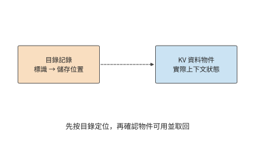

*圖 9-28：虛線表示按標識查詢物件位置。目錄用於定位，實際 KV 物件用於恢復計算；路由前還需確認物件版本與可用性。*

### 9.5.2 多級儲存

第 8.3.4 節在一張卡上比較了保留、換出和重算。放大到整臺伺服器，同一份 KV 可以存放在四個位置：HBM、主機記憶體、本地 SSD 和遠端儲存池，越往下容量越大，離 GPU 也越遠。以一臺 DGX A100 為例：8 張 A100 80GB、2 TB 主機記憶體、8 塊 3.84 TB U.2 NVMe SSD、8 張 200 Gbit/s 網路卡，按每張 GPU 分到的一份計算。SSD 選用 Solidigm D7-P5520 3.84 TB，順序讀、寫頻寬最高分別為 7.1 GB/s 和 4.2 GB/s。存放的物件仍是 Qwen3-8B 的 8192 個 token 字首，共 1.125 GiB。[^tiers]

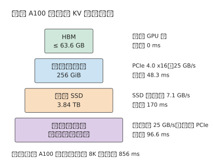

*圖 9-29：DGX A100 中每張 A100 分到的四級儲存。方框寬度只表示容量次序；右側是這一級到 GPU 的路徑，以及取回 1.125 GiB 字首所需的時間。遠端取回先經網路卡到主機記憶體，再經 PCIe 到 GPU，兩段序列。*

| 層級 | 每張 GPU 的容量 | 到 GPU 的路徑 | 取回 8K 字首 |
| --- | ---: | --- | ---: |
| HBM | ≤ 63.6 GB | 已在 GPU 上 | 0 |
| 主機記憶體 | 256 GiB | PCIe 4.0 x16，25 GB/s | 48.3 ms |
| 本地 SSD | 3.84 TB | SSD 順序讀，7.1 GB/s | 170 ms |
| 遠端儲存池 | 隨節點數增加 | 網路卡 25 GB/s，再經 PCIe | 96.6 ms |
| 對照：在 A100 上重算 | — | 按峰值的 50% 計 | 856 ms |

HBM 一欄是 80 GB 減去 16.4 GB BF16 權重後的上限，尚未扣除啟用與工作區。四級的取回時間都遠小於 856 ms 的重算時間，因此單就一次取回而言，狀態放在哪一級都比重算快。真正的限制來自另外三個方面：快取能否儲存到下一次使用，讀取能否與計算重疊，以及寫入各級要付出多大代價。

**容量決定快取能存放多久。** 一張 A100 連續對無命中的 8K 請求執行 prefill，每 0.856 s 產生一份 1.125 GiB 的 KV，產生速率 $r\approx1.41$ GB/s。如果新產生的 KV 全部寫入某一級、並按寫入先後淘汰，容量為 $C$ 的一級大約能存放最近 $C/r$ 秒內產生的 KV：HBM 約 45 s，主機記憶體約 195 s，SSD 約 2722 s，即 45 分鐘。反過來，設同一字首兩次使用的間隔為 $T$，要讓間隔 $T$ 以內再次到達的請求都能命中，這一級的容量至少要滿足

$$
C\ge rT.
$$

阿里雲基於線上請求記錄（trace）的一項研究統計了兩類負載的複用時間：面向個人使用者的對話負載中，80% 的複用發生在 10 分鐘以內；面向企業的 API 負載中，80% 的複用發生在 10 秒以內。間隔為 10 秒時只需 14.1 GB，HBM 即可容納；間隔為 10 分鐘時需要 846 GB，超過每卡 275 GB 的主機記憶體，需要加上 SSD 才能覆蓋。[^wild]

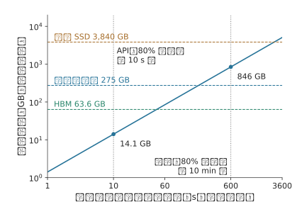

*圖 9-30：所需容量隨複用間隔線性增長。斜線為 $C=rT$，其中 $r\approx1.41$ GB/s 是一張 A100 連續執行無命中 8K prefill 時產生 KV 的速率；三條虛線是每張 GPU 在三級儲存中的容量；兩條豎線標出兩類負載 80% 複用所在的時間範圍。兩軸均為對數刻度。*

$C\ge rT$ 也說明了什麼時候不需要 SSD。同一研究在它的對話負載上發現，Llama3-70B 所需的快取容量約為可用 HBM 的 4 倍；8 卡 A100 伺服器配 1 TB 主機記憶體時，每卡分到 128 GB，已經足夠，不必再增加 SSD 或遠端層。差別在於 $r$：該研究按每個例項的實際請求率計算，請求也更短，單輪請求平均 973 個 token，多輪請求平均 5953 個；這裡則假設 GPU 一直在對 8K 請求執行 prefill。字首命中越多、每 token 的 KV 越小（例如 MLA），$r$ 就越低。$T$ 取決於由誰發起下一輪：人工對話的間隔以分鐘計，程式呼叫的間隔以秒計。

**容量越大，命中率提高得越慢。** 容量只能保留將來會被複用的狀態，而有些狀態不會再被使用。Mooncake 公開了 Kimi 線上服務一小時的取樣 trace，每塊 512 個 token。按最近最少使用（LRU，先淘汰最久未被訪問的塊）的規則淘汰時，快取從 1000 塊增加到 50,000 塊，命中率從 30% 升到 50%；容量不受限制時也只有 51%。按 Qwen3-8B 換算，50,000 塊約 3.77 TB，與一塊 3.84 TB 的 SSD 相當。這份 trace 中超過一半的塊從未被再次使用，另一些塊卻被訪問上萬次；阿里雲的 trace 也同樣集中，10% 的塊貢獻了 77% 的複用。[^moontrace]

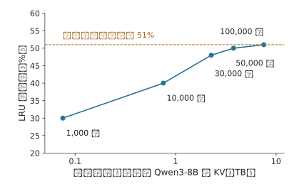

*圖 9-31：命中率隨容量增加而趨於飽和。資料為 Mooncake 一小時取樣 trace 在 LRU 淘汰下的命中率，每塊 512 個 token；橫軸按 Qwen3-8B 每 token 144 KiB 換算為位元組。這只是取樣得到的一段流量，真實服務所需的容量按流量同比例放大。*

**只取回一次，還是每一步都遠端讀取。** 共享 KV 有三種典型用法：本地重新 prefill、從遠端取回一次後在本地駐留、每一步 decode 都從遠端讀取。三者使用同樣的上下文，傳輸頻率卻完全不同。

沿用 1.125 GiB 字首和本章的 200 Gbit/s 網路卡（25 GB/s），一次載荷取回約 48.3 ms。若 100 次 decode 呼叫都重新從遠端讀取這份不變的字首，累計佔用鏈路 (Link)約 4.83 s。若這 100 次讀取要在一秒內完成，僅這份上下文就要求約 121 GB/s，是給定鏈路 (Link)能力的 4.8 倍。把讀取與計算並行安排，也無法讓 25 GB/s 的鏈路 (Link)在一秒內傳完這些位元組。換成 549 MiB 的緊湊 MLA 字首，一次取回約 23.0 ms，100 次累計約 2.30 s，一秒內完成仍要約 57.6 GB/s，是鏈路 (Link)能力的 2.3 倍：狀態減半隻把倍數減半，每步都從遠端讀取仍然不可行。

取回一次並駐留把傳輸頻次從「每步一次」降到「每次複用一次」，代價是佔用本地 HBM。設一份狀態佔 $V$ bytes、在本地儲存 $\tau$ 秒，佔用的容量與時間之積為 $V\tau$，單位為位元組·秒。同樣儲存 10 秒，物件越大，佔用越多；同樣大小的物件，儲存越久，這一乘積越大。第 9.1.3 節的會話在工具執行 10 秒期間，GQA 狀態佔 11.25 GiB·s，緊湊 MLA 狀態佔 5.36 GiB·s，同樣的本地容量能容納約兩倍的等待會話。因此可以把不活躍的會話放到遠端，會話恢復時取回，在連續 decode 期間留在本地。這樣，資料傳輸主要發生在會話恢復和暫停時。

假定狀態將在未來複用 $k$ 次，暫不考慮排隊時間，也不考慮其佔用空間後對其他快取內容的擠佔。儲存後再取回比重新計算更快的條件為

$$
T_{write}+kT_{read}<kT_{recompute}.
$$

以 Qwen3-8B 的 8192 個 token 字首為例：在 A100 上重算一次約需 0.856 秒（第 9.2.3 節的 prefill 時間），經 25 GB/s 網路卡儲存和取回各約 48.3 ms。複用一次時，儲存加取回共約 96.6 ms，不到重算的八分之一，只要這份狀態還會再使用一次，儲存就是值得的。鏈路 (Link)變慢後結論會變：頻寬介於約 1.41 與 2.82 GB/s 之間時，至少要複用兩次才能抵消儲存的代價，越接近 1.41 GB/s 所需的次數越多；低於約 1.41 GB/s 時，取回一次就比重算還慢，複用次數越多，損失越大。10 GbE 每方向只有 1.25 GB/s，取回一次約需 966 ms；這時應該重算，或者設法把取回移出關鍵路徑，提前完成。狀態大小隻進入 $T_{write}$ 與 $T_{read}$，$T_{recompute}$ 由模型的 prefill 代價決定。換成緊湊 MLA 狀態，同一個網路卡上寫入加取回一次只要約 46.1 ms，不等式左邊隨 KV 位元組數減少而縮小。

1.41 GB/s 這一臨界頻寬恰好就是上文的 KV 產生速率 $r$：取回 $V$ 位元組需要 $V/B$，重算需要 $V/r$，只要鏈路 (Link)頻寬 $B$ 高於 GPU 產生這份 KV 的速率，取回就比重算快。本地 SSD 的寫、讀頻寬都高於 $r$：寫入約 288 ms，讀出約 170 ms，複用一次合計約 458 ms，仍然少於重算的 856 ms。

**讓讀取與計算重疊。** 命中之後，請求只需計算 256 個新 token，按第 9.2.3 節的約定取 A100 峰值的 50%，約需 30.9 ms。歷史 KV 在主機記憶體中時，如果先整份讀入再開始計算，共需 48.3 + 30.9 = 79.2 ms，讀取比計算還長。CachedAttention 採用逐層預載入：Transformer 逐層計算，第 $i$ 層只用到第 $i$ 層的 KV，所以 GPU 計算第 $i$ 層時，PCIe 可以同時讀取後面的層。Qwen3-8B 每層的歷史 KV 為 32 MiB，讀取一層需要 1.34 ms，而新 token 計算一層只需 0.857 ms。每層的計算都要等待讀取，總時間約 49.2 ms，仍由讀取決定。要進一步縮短，就需要在該請求開始執行之前先讀入若干層：利用上一個 batch 的執行時間，把前 14 層（448 MiB）讀入 HBM 中預留的緩衝區，其餘 22 層的讀取就能被計算完全掩蓋，總時間降到計算本身的 30.9 ms。緩衝區要容納的正是讀取比計算多出的那部分位元組：

$$
S_{buf}=B\,(T_{read}-T_{new}),
$$

其中 $B$ 是鏈路 (Link)頻寬，$T_{read}$ 是讀取全部歷史 KV 的時間，$T_{new}$ 是計算新 token 的時間。代入 25 GB/s、48.3 ms 與 30.9 ms，得到約 437 MB，略多於 13 層，按整層向上取整為 14 層。$T_{new}\ge T_{read}$ 時不需要緩衝區：新輸入達到約 400 個 token，計算就能掩蓋從主機記憶體的讀取；遠端儲存池的序列路徑需要約 800 個，本地 SSD 需要約 1400 個。CachedAttention 在 LLaMA-13B 上的測量中，1K 個歷史 token、100 個新 token 時，逐層預載入讓 prefill 時間縮短 35%，再設定一個 15 層的緩衝區後，縮短 61%。[^cachedattention]

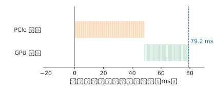

*圖 9-32：先把 1.125 GiB 歷史 KV 整份從主機記憶體讀入，再計算 256 個新 token，共 79.2 ms。橙色為 PCIe 讀取，綠色為 GPU 計算，每一小段對應一層。*

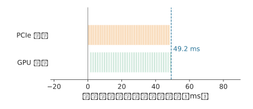

*圖 9-33：逐層預載入。GPU 計算某一層時，PCIe 讀取後面的層；每層讀取 1.34 ms、計算 0.857 ms，每層的計算都要等待讀取，總時間 49.2 ms 由讀取決定。*

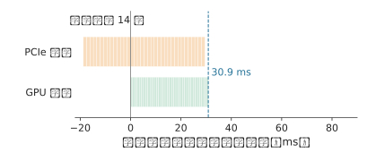

*圖 9-34：在這個請求開始執行之前，利用上一個 batch 的執行時間先讀入前 14 層（448 MiB）；其餘 22 層的讀取被計算完全掩蓋，總時間等於計算本身的 30.9 ms。三幅圖的橫軸相同。*

**利用排隊時間從 SSD 預取。** 從本地 SSD 讀一層需要 4.73 ms，是計算一層的 5.5 倍，逐層預載入只能掩蓋一小部分。請求開始執行時，狀態若仍在 SSD 上，即使逐層讀取，這一步也需要約 171 ms，而計算本身只需 30.9 ms。可以利用排隊時間：請求仍在佇列中時，排程器已經知道它需要哪份字首，可以先把這份字首從 SSD 讀到主機記憶體。只要排隊時間不短於 170 ms，這次讀取就不在關鍵路徑上，開始執行時再按上述方式從主機記憶體逐層讀入。這與第 9.5.4 節的 $T_{first}=\max(Q,R)+C$ 是同一個關係：預取讓狀態就緒時間 $R$ 與排隊時間 $Q$ 重疊。

主機記憶體能容納多少份會話，決定了排程器最多能為佇列中前多少個請求提前讀取：256 GiB 可容納約 227 份 8K 字首，所以只需為佇列最前面的 227 個請求預取。主機記憶體不足、需要換出時，也按佇列判斷：這些請求即將使用的狀態不能換出；其餘狀態中，下次使用最晚的先換出。LRU 和 FIFO 只依據過去的訪問，無法利用佇列中即將到來的請求。CachedAttention 在 4 張 A100、128 GB 主機記憶體和 10 TB SSD 上回放 ShareGPT（使用者分享的 ChatGPT 對話資料集）中的多輪對話：按佇列預取和換出時，總命中率為 86%，其中 99.6% 以上的命中來自主機記憶體；LRU 與 FIFO 的命中率分別只有 58% 和 48%，來自主機記憶體的命中都不到 1%，幾乎每次命中都要從 SSD 讀取。[^cachedattention]

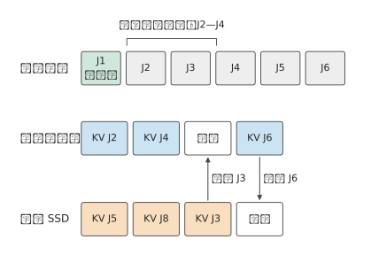

*圖 9-35：主機記憶體有四個存放位置，其中一個留作空位，用於接收讀入的資料，其餘三個留給佇列中接下來的 J2—J4。J3 的狀態仍在 SSD 上，在它排隊期間讀入空位；J6 排在這三個請求之後，下次使用最晚，先換出到 SSD。*

**SSD 的寫入受壽命限制。** 寫入同樣要避開關鍵路徑。prefill 逐層產生的 KV 可以在計算的同時寫回，decode 每步只追加一個 token 的 KV。以 $r\approx1.41$ GB/s 寫入，只佔 PCIe 頻寬的 5.6%，也只佔 SSD 順序寫頻寬的 34%。SSD 真正的限制是寫入壽命：D7-P5520 標稱五年內每天可寫滿一次（1 DWPD），3.84 TB 的盤平均每秒只能寫入 44.4 MB。如果把全部新 KV 都寫入 SSD，寫入量是這一額度的 31.7 倍，五年的寫入壽命在不到兩個月內就會耗盡。長期來看，只有約 3.2% 的新 KV 能夠寫入 SSD。前面兩份 trace 中，複用都集中在少數塊上，Mooncake trace 中一半以上的塊從未被再次使用，因此寫入 SSD 之前需要先做准入判斷，例如只寫入已經被複用過的字首，或者尚未結束的多輪會話。按這一額度寫入時，SSD 中恰好能存放最近一天產生的 KV。

容量與命中之間的這種關係在實驗中也能觀察到。在一組同卡雙引擎實驗中，12 次字首複用機會里，4 GiB 共享 CPU 池完整命中 5 次，8 GiB 池完整命中 12 次。多出的 4 GiB 保留了七次原本會被淘汰的完整字首；再次請求所需的狀態若已經在本地，就不必重複取回。所以共享容量的收益要按「儲存多久、避免幾次重算、增加幾次搬移」來比較。[^shared]

### 9.5.3 持久化、checkpoint 與部分重算

上一節假定儲存下來的狀態能完整取回。例項重啟後，目錄記錄、磁碟資料和可連續複用的字首可能並不一致，恢復過程需要重新確認哪些計算結果已經儲存。持久化讓狀態在例項重啟或任務暫停後仍然可用。完整儲存減少恢復時的重算，週期性 checkpoint 減少寫入但增加恢復工作，部分重算則用已保留的字首補齊缺的部分。checkpoint 要儲存繼續計算所需的全部狀態：完整 GQA 儲存上下文 K、V；DeepSeek V4 的狀態還涉及壓縮結果、視窗以及未完成的壓縮塊。恢復時從 checkpoint 所記錄的最後一次完整更新繼續計算。[^v4]

持久化的狀態按頁儲存，恢復時也按頁讀回。先考慮完整的 GQA 頁。Qwen3-8B 每個含 16 個 token 的邏輯頁為 2.25 MiB。若各層的 K、V 分片分別搬移，會形成許多小的連續段；若按頁彙集，傳輸次數和所需的佈局轉換都不同。一個邏輯頁按 36 層的 K、V 分開後有 72 個 32 KiB 的連續段；按頁彙集後則是一個 2.25 MiB 的物件。前者更容易受每秒操作次數的限制，後者把更多時間花在連續載荷的傳輸上。

重啟後的某個請求讀取了 64 頁，覆蓋 1024 個 token，但可複用的連續字首只有 1008 個 token，即 63 頁。多讀的那一頁佔 2.25 MiB，卻沒有省掉相應的重算。對該請求，讀取量為 144 MiB，有效複用量約為 142 MiB；更能說明問題的說法是「讀入 64 頁，用上 63 頁」。這裡的限制發生在讀取之後：只有匹配成功、能連續接到已有上下文上的頁，才能替代計算。把磁碟讀得更快能縮短讀取時間，卻改變不了該請求要處理的末頁。[^restart]

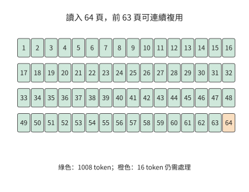

*圖 9-36：讀入的頁不一定全部成為可複用字首。正常重啟後的這一請求讀入 64 個各含 16 個 token 的頁，只複用前 63 頁；末頁仍需處理。每頁 2.25 MiB，該請求的匹配邊界為 1008 個 token。*

頁面缺失時，要比較繼續等待和重新計算各需要多久。在 A100 上重算 8192 個 token 的整段字首約需 0.856 秒（第 9.2.3 節的 prefill 時間）；若為取回一個不可用的物件已經等了 1 秒，這一次等待就已超過整段重算的時間。實際的截斷頁實驗裡，無條件等待的請求在 60 秒觀察視窗內一直沒有完成，改為允許放棄等待後，請求靠重算得到了結果。完成當前請求之後，還要隔離或修復壞頁，否則下一個請求還會遇到同樣的等待。[^fault]

### 9.5.4 快取親和性與請求路由

確認快取可以複用後，仍需決定把請求發給哪臺機器。快取所在的機器可能正忙，另一臺機器雖然需要取回或重算，卻可能先完成。因此路由時要比較的是請求的完成時間。設 GPU 最早可執行時刻為 $Q$，狀態從請求到達起的就緒時刻為 $R$，狀態可用後的剩餘工作為 $C$。在整份狀態到齊後才執行、取回可與 GPU 等待重疊的模型中，首 token 時間為

$$
T_{first}=\max(Q,R)+C.
$$

如果取回要等 GPU 排完隊才能開始，排隊時間與取回時間就要相加；如果逐層流水，就需要更細的執行圖。例如 $Q=80$ ms、取回耗時 60 ms、剩餘計算 10 ms，並行就緒時共需 90 ms；等 GPU 空閒後再啟動取回則需 150 ms。計算量和傳輸位元組數都相同，只是依賴關係不同，耗時就差了 60 ms。

**例 9.7　快取命中與排隊等待如何共同決定請求路由？** A、B 是兩個 A100 例項，請求帶 8192 個 token 的字首和 256 個 token 的新輸入。A 的 HBM 裡有這份字首，但要排隊 250 ms；B 只等 20 ms，卻沒有快取。按第 9.2.3 節的約定取 A100 峰值的 50%，即 156 TFLOP/s：完整重算 8448 個 token 需要約 138.4 TFLOPs 矩陣運算，約 887 ms；命中後只算 256 個新 token，約 4.81 TFLOPs、30.9 ms。B 也可以從遠端儲存取回字首：查詢的固定開銷為 10 ms，整份 1.125 GiB 先經網路到主機記憶體，再經 PCIe 4.0 x16 搬到 GPU，與例 9.3 一樣按 25 GB/s 計，約 48.3 ms。

| 路徑 | 首 token 時間 |
| --- | ---: |
| A：本地命中 | $250+30.9\approx281$ ms |
| B：直接重算 | $20+887\approx907$ ms |
| B：經 50 GbE（6.25 GB/s）遠端取回 | 約 282 ms |
| B：經 200 GbE（25 GB/s）遠端取回 | 約 137 ms |

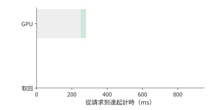

*圖 9-37：A 本地快取已命中，GPU 排隊 250 ms 後再計算 30.9 ms，首 token 在 281 ms 返回。灰為排隊，綠為計算。*

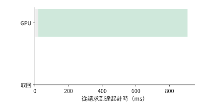

*圖 9-38：B 在 20 ms 空閒，隨後在 A100 上重算 887 ms，首 token 在 907 ms 返回。*

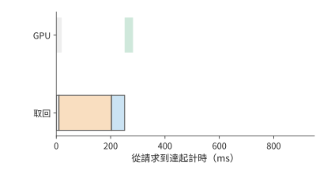

*圖 9-39：取回先查詢 10 ms，再經 50 GbE 以 6.25 GB/s 讀取 1.125 GiB 至主存，最後經 PCIe 以 25 GB/s 搬到 GPU。計算要等資料和 GPU 都就緒，首 token 約 282 ms 返回，比 A 慢約 1.6 ms。*

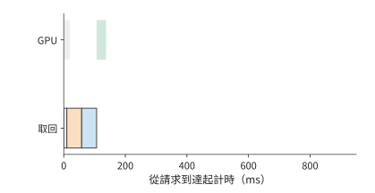

*圖 9-40：遠端鏈路 (Link)換成 200 GbE（25 GB/s）後，首 token 約 137 ms 返回。橙為遠端讀取，藍為主存到 GPU；四圖均從請求到達起計時，橫軸相同。*

第一張路由圖中，A 的資料已經在 GPU 上，但計算要等到 250 ms 才能開始。B 在 20 ms 時空閒；直接重算可以立即開始，但 887 ms 的計算比任何一條取回路徑都長，遠端取回則要繼續等資料。提高遠端頻寬縮短的是橙色條，查詢、主存到 GPU 的傳輸和最後的計算仍然存在。

B 要想比 A 的 281 ms 更早返回，扣除命中後 30.9 ms 的計算，狀態必須在 250 ms 內就緒。再扣除查詢的 10 ms 與主機記憶體到 GPU 的約 48.3 ms，遠端讀取只剩約 191.7 ms。用 1.125 GiB 除以該預算，得到 B 取回與 A 本地命中打平時的頻寬，約為 6.30 GB/s：50 GbE 的 6.25 GB/s 略低於此值，200 GbE 則遠高於此值。取回與重算打平的頻寬只有約 1.48 GB/s，在 A100 上重算 8K 字首幾乎總是最慢的選擇。

同一個會話由此可以按狀態與資源所在的位置重新安排。應用保留連續的上下文，服務在繼續使用本地狀態、遷移狀態和重新計算之間選擇，依據是這三條路徑各自何時能讓後續的模型執行開始。第 8 章根據內容判斷可複用的字首，本節進一步把排隊時間與鏈路 (Link)頻寬納入路由決策。

換成 200 GbE 後，單請求取回明顯佔優；但每秒 16 次取回需要約 19.3 GB/s，已用去這條 25 GB/s 鏈路 (Link)約 77% 的能力。突發請求會增加傳輸排隊時間。因此，按單請求算出所需頻寬後，還要計算持續到達時的總流量。[^route]

上述比較假定快取位置已知且資料可用。路由器通常根據快取事件預測位置，事件延遲或物件被淘汰會讓預測失準。為了看清這種誤差如何影響響應時間，把 A 的排隊改為 80 ms，並設快取只以機率 $p$ 真正可用。命中時為 110.9 ms，所有層次都失效、只能重算時為 967.2 ms，期望為

$$
\mathbb{E}[T_A]=110.9p+967.2(1-p)=967.2-856.3p\ \mathrm{ms}.
$$

平均值要優於 B 直接重算的 907 ms，只需 $p>7.0\%$。取 $p=0.9$，平均約 196.5 ms，但 10% 的請求仍是 967 ms，所以該兩點分佈的 p99 為 967 ms，遠達不到 220 ms 的目標。要讓 p99 達到 220 ms，該兩點時間模型要求命中機率至少 99%；90% 已經大幅改善了均值，卻仍讓十分之一的請求走 967 ms 的慢路徑。[^events]

同時執行兩個任務的負載壓力實驗，更直觀地顯示了快取優先與空閒優先之間的取捨。快取優先時，目標請求約 1.38 秒完成，兩個任務也在這時全部結束；把目標請求移到空閒例項後，它的完成時間縮短到約 0.33 秒，兩個任務卻要到約 1.54 秒才全部完成。目標請求快了約 1.05 秒，全部任務的完成時刻卻推遲了約 0.16 秒。做路由決策之前，必須先確定最佳化的是目標請求的響應時間，還是全部任務的完成時間。[^pressure]

把第 8 章的狀態恢復過程計入路由決策後，要同時比較例項何時空閒與狀態何時準備好。以 DeepSeek V4.1 的會話狀態為例：設例項 A 保留了全域性 KV 與編碼器的 SWA 狀態，但有排隊；例項 B 可以立即執行，卻要取回全域性 KV 並恢復編碼器 SWA 狀態。A 的優勢是能複用狀態，B 的優勢是計算資源可以立即開始執行；路由器要比較的是兩者的預計完成時間，而不是隻看快取命中標誌。

設兩邊後續的新增輸入處理、解碼器視窗重放與生成耗時相同，準備工作序列執行。B 的全域性狀態傳輸按第 7 章的算例為 4.666 ms，編碼器 SWA 狀態的恢復假設為 8 ms，共需 12.666 ms。A 保留了這兩份狀態，準備時間就是排隊時間：排隊 10 ms 時 A 更早開始處理新增輸入；排隊增到 20 ms 時 B 更早。12.666 ms 由此成為本例中路由選擇翻轉的排隊閾值。[^v41-case]

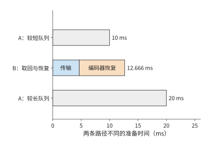

*圖 9-41：快取親和性與空閒執行位置的比較。A 保留全域性 KV 與編碼器 SWA；B 需要 4.666 ms 全域性傳輸和假設的 8 ms 編碼器恢復。兩端共同的解碼器重放等後續工作略去，只比較不同的序列準備時間；A 的排隊時間從 10 ms 增到 20 ms 時，更快的方案由 A 變為 B。灰色為等待佇列，其他色塊分別為全域性狀態傳輸與編碼器區域性狀態恢復。*

## 9.6 服務啟動、擴縮容與故障恢復

第 9.2 至 9.5 節比較的是請求交給誰、狀態放在哪裡。本節轉向例項本身的變化：新副本啟動和預熱要多久，執行中改變並行方式時狀態如何交接，部分卡故障後如何依靠已儲存的狀態和輸出記錄繼續服務。

### 9.6.1 啟動與預熱開銷

第 9.5.4 節的路由比較都從已有可用例項開始。擴容或故障恢復時，新例項要先完成啟動，而等待中的請求還在不斷到達。因此，本節把啟動和狀態恢復納入同一條服務時間線。新副本還要完成程序與分詞器（tokenizer，將文字轉換為 token 編號的元件）初始化、權重讀取與分片、編譯、KV 容量探測和圖捕獲（把執行步驟錄製為第 5.5.2 節的 CUDA Graph）。這些準備的總時間決定新副本何時開始分擔請求。首次試執行觸發編譯時，編譯時間已經包含在試執行裡，應按先後依賴計算總時間。啟動開銷研究 Breaking the Ice 對歷史 vLLM 版本的分階段分析說明了這一問題；把包含關係展開後，啟動總時間由從程序建立到可以接收請求的最長依賴路徑決定。[^startup]

假設準備執行圖使啟動時間增加 $T_s$，但此後每個執行步都能節省 $\delta$，經過 $N$ 步後的淨收益為 $N\delta-T_s$。增加 10 秒、每步節省 0.2 ms，要 50000 步才持平，從第 50001 步起累計節省的時間才超過額外的啟動時間。若每步為 32 個請求各生成一個 token，50000 步對應約 160 萬個輸出 token。每執行一個 batch 省一次時間，所以累計收益要按批執行的次數計算。

啟動期間新到達的請求還會積壓。若原有服務完全不可用、到達率保持 $\lambda$、啟動時間為 $T_s$，啟動結束時積壓約為 $\lambda T_s$。就緒後的服務能力為 $\mu>\lambda$，在理想的連續流量模型中，額外的排空時間為

$$
T_{drain}=\frac{\lambda T_s}{\mu-\lambda}.
$$

以本章的異構叢集為例，啟動需要 10 秒，期間每秒到達 3.5 個請求，就緒時已有 35 個請求積壓。直接 PD 就緒後每秒約能服務 4.55 個，新請求仍佔去 3.5 個，每秒實際只能消化約 1.05 個積壓請求，還要約 33 秒才能排空，從開始啟動算起是第 43 秒。按理想分塊捎帶的共置上限 4.17 請求/s，每秒只能消化約 0.67 個，要到第 63 秒；不分塊的共置只有 3.02 請求/s，積壓會一直增長。三條曲線見圖 9-42。

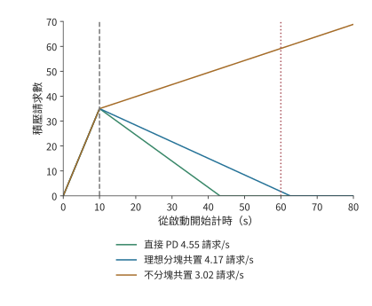

*圖 9-42：服務餘量決定啟動積壓的消退速度。連續流量模型，每秒到達 3.5 個請求，啟動 10 秒後積壓 35 個。就緒後服務率分別為直接 PD 的 4.55、理想分塊共置的 4.17 和不分塊共置的 3.02 請求/s；前兩者從開始啟動算起在第 43 與第 63 秒排空，後者持續積壓。例 9.8 的排空期限為第 60 秒。*

積壓的請求在就緒後往往一起湧入，這時並行預取還可能改變誰先開始執行。某個 1024 個 token 的請求單獨執行時複用了 1008 個 token；八個請求同時到達時，前四個請求各登記了 1024 個 token 的預取，合計佔用 4096 個 token，後面的請求因為超過容量限額而沒有登記。最先完成的請求恰恰來自後者：該請求沒有命中任何快取，直接開始 prefill；正因為沒有等待快取，它更早進入了執行佇列。所以，即使快取物件存在，請求也要先獲得預取所需的空間，才能使用這份快取。預取空間用完後，後面的請求直接重算，而已經開始預取的請求還在等資料。[^branch]

擴縮容還要考慮模型版本與硬體的對應關係。權重固定在不可修改介質上時，增加同型號加速器可以擴充套件同版本服務；部署新權重則要配置支援新版本的加速器。路由器按模型版本分派請求，容量規劃要為新舊版本並存和加速器替換預留資源。固定版本的服務持續得越久、需求越大，部署投入便能由更多請求分擔。

### 9.6.2 執行中重配置與狀態交接

啟動解決的是新例項何時可用；執行中的遷移還要讓目標例項接著源端的進度執行。改變張量並行度、專家並行度或服務池的規模，需要重新安排權重與請求狀態。目標卡獲得參數只是第一步，還可能要建立通訊組、準備新的執行圖、轉換佈局並恢復接收請求。這些準備與資料搬移有先後依賴，共同決定何時能把新請求交給目標。

計劃內的遷移可以利用源端仍在執行這一條件：先在後臺複製不再改變的上下文，源端繼續生成；最後短暫停下，複製完遷移期間新增的狀態，再把執行權交給目標。以遷走一張 H20 上的 D worker 為例：批內 32 條請求的平均上下文為 8704 個 token，KV 共約 41.1 GB。源端每秒完成約 1166 次 decode 呼叫，每次追加一個 token 的 KV（144 KiB），狀態每秒只增長約 0.172 GB。目標經本章的 200 Gbit/s 網路卡以 25 GB/s 複製，積壓以約 24.8 GB/s 減少，約 1.65 秒後完成複製，其間新增的狀態約 0.28 GB；只有一個 50 GbE 埠（6.25 GB/s）時要約 6.76 秒。decode 追加 KV 的速率遠低於網路卡頻寬，追趕時間幾乎全由初始的 41.1 GB 決定；複製速率一旦降到狀態增長速率，積壓便不再縮小。最後的交接點同時確定狀態版本與執行權，防止目標漏掉源端最後的更新。

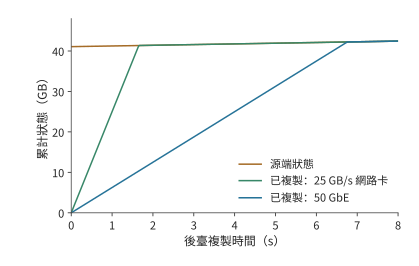

*圖 9-43：後臺複製需要趕上仍在增長的狀態。開始時待複製狀態為 41.1 GB，源端每秒增長約 0.172 GB；目標經 25 GB/s 的網路卡約 1.65 秒趕上，經 6.25 GB/s 的 50 GbE 約 6.76 秒趕上。曲線相交前，垂直距離就是尚未複製的資料量；相交後，目標只需跟隨源端的新增狀態。*

圖 9-43 中，源端曲線也在上升，所以追趕速度是兩條曲線斜率之差；本例 decode 的增長極慢，源端曲線接近水平。複製能力恰好等於狀態增長率時，兩條線平行，初始積壓便不會縮小。最終交接必須安排在目標已追上源端、兩端狀態一致的時刻。

遷移之外的另一種執行中調整是切換並行方式：把同一組卡重新組織成 TP 或 SP×TP。這裡 TP 切分層內矩陣，SP 按 token 位置分配一部分計算與中間狀態。ArcticInference（Snowflake 開源的 vLLM 推理外掛）與 vLLM 的相關案例展示了這種做法：切換改變每一步參與計算的卡與 token 的分佈，也改變所需的權重、KV 佈局和執行圖。預先保留兩種模式的權重與執行圖可以縮短切換的等待，但這些額外儲存的權重與圖會減少 KV 的可用空間。彈性專家並行（Elastic EP，執行中增減專家並行組的卡數）擴大專家組時，新加入的卡要先獲得專家權重，隨後才能承擔分派來的任務；處理完整的請求還需要相應的注意力狀態。[^switch]

目標追上源端的狀態更新後，兩邊的資料才一致。此外，目標還要完成通訊組和執行圖的準備。下面保持資料量不變，只改變傳輸頻寬。Qwen3-8B 從 TP4 切換到 TP8 的遷移例子需要約 16.4 GB 的網路傳輸，在本地構建目標張量還要讀寫約 4.7 GB 資料。把同一份網路載荷放到一個 50 GbE 埠（6.25 GB/s）和本章的 200 Gbit/s 網路卡（25 GB/s）上，單看搬移約需 2.63 秒和 0.66 秒，相差四倍。

但若再假設建立通訊組、準備執行圖與恢復接收請求在傳輸之後序列佔用 9 秒，總時間就約為 11.6 秒和 9.7 秒，只縮短約 17%。若八張卡同在一臺 8×A100 伺服器內，遷移改走 NVLink，每張 A100 每方向 300 GB/s，傳送最多的一張卡要送出約 4.7 GB，只需約 15.7 ms，總時間仍約 9.0 秒。這 9 秒限制了繼續提高頻寬的收益：即使網路傳輸趨近於零，總時間也只能趨近 9 秒。若能提前建立通訊組並準備好執行圖，就能進一步縮短遷移時的等待。[^migration]

此時搬移本身已接近鏈路 (Link)的物理下界，剩下的時間全是軟體準備。按第 1.3.4 節的判據，這類差距靠更快的鏈路 (Link)解決不了，只能重構軟體：提前建立通訊組，預先捕獲執行圖，把程序與排程解耦，讓準備工作和傳輸重疊。

### 9.6.3 部分故障與流式生成恢復

計劃內遷移時源端還能提供最後一次更新；故障發生後，源端的資料可能已無法讀取，只能依靠提前儲存的狀態和輸出記錄。恢復首先要確定使用者已經收到哪一段輸出。故障後有三種目標：恢復足夠的狀態繼續 decode；根據已經確定的 token 重做 prefill；重新取樣一段輸出。前兩種沿使用者已經收到的序列繼續生成，第三種重新做隨機選擇，可能產生不同的字尾。對 RL 的 rollout 來說，這還改變了樣本的生成過程。

假設原輸入有 8192 個 token，已經向使用者返回 1025 個輸出，但最近儲存的 KV 僅覆蓋原輸入。恢復時，若這些輸出已經可靠記錄，只需把前 1024 個輸出作為一次 prefill 補入模型，重建覆蓋 9216 個 token 的 KV，再處理第 1025 個輸出繼續生成。若已經有覆蓋 9216 個 token 的相容 KV，就可以省去這 1024 個 token 的重放。

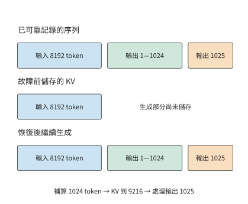

*圖 9-44：輸出記錄決定繼續哪條序列，KV checkpoint 決定從哪裡補算。假定 1025 個輸出均已可靠記錄，但 KV 只儲存了原輸入。下方按輸入、前 1024 個輸出和第 1025 個輸出分段示意，寬度不按 token 數量比例繪製。*

圖 9-44 把兩種記錄的末端分開畫出。輸出已經返回，不表示對應的 KV 已經儲存；恢復時用已記錄的 token 補算，就能重建相同的字首，不必重新取樣這些輸出。

**預寫日誌**（write-ahead log，WAL）在對外確認之前可靠儲存待恢復的操作或結果。這裡的 token 級 WAL 儲存已經確定的輸出序列，KV 儲存的是這段序列已經完成的計算。前者決定恢復後應繼續哪條輸出，後者決定還要重做多少工作。DeepSeek V4 的生成服務採用這類機制；恢復時還要保持權重版本、token 位置索引和 decode 狀態一致。[^v4]

故障的影響範圍由同步組決定。張量並行組或專家並行組丟失一張卡，可能讓整個協作例項上的請求停止；其他完整副本則可以繼續服務。故障恢復依次經過檢測、例項重建與請求恢復；恢復後的處理能力決定積壓的請求還要多久才能完成。第 10 章進一步分析這些選擇對 RL 樣本與訓練進展的影響，第 11 章再處理工具和環境的任務恢復。

## 9.7 部署方案的綜合比較

### 9.7.1 組合副本、PD、AF 與共享 KV

本節把前幾節的結果用於章首的八卡服務，先確定狀態傳輸方式，再比較整個服務能否滿足到達率和恢復期限。P 產生的 KV 可以直接交給 D，也可以先進入共享池再由 D 取回；D 新生成的狀態若要用於下一輪 P，還需確認這些狀態已經儲存並行布。直接交接與經池中轉讀取的可能是相同的內容，佔用的鏈路 (Link)和緩衝卻不同。

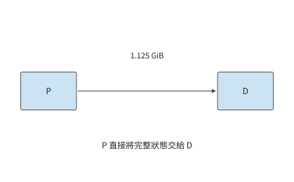

*圖 9-45：P 直接向 D 交接 1.125 GiB 上下文 KV 快取，只經過一次直接傳輸。P 為 prefill，D 為後續逐 token 的 decode。*

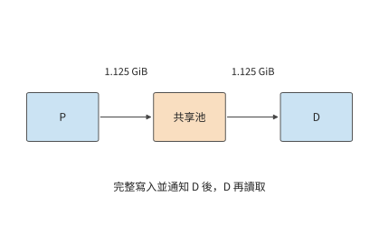

*圖 9-46：P 先向池寫入完整 1.125 GiB 並行布，D 再取回同一物件，共經過寫入和取回兩次傳輸。後續例項還可以複用池中物件。P 為 prefill，D 為後續逐 token 的 decode。*

對本章的 1.125 GiB 上下文 KV 快取，直接 P→D 交接搬一次；經池中轉則在 P→池、池→D 兩條邊各搬一次，總載荷為 2.25 GiB。假設兩條邊都為 25 GB/s，且整份寫入後才能讀取，中轉等待約 96.6 ms，比直接交接多約 48.3 ms。

若 D 只用一次這份狀態，這次中轉就沒有複用收益。若後續還有另一個例項要繼續處理同一會話，就有機會用約 48.3 ms 的讀取替代一次約 856 ms 的重算（第 9.2.3 節的 prefill 時間），節省的計算時間足以抵消額外的搬移時間；第 9.7.3 節按例 9.8 的負載核算這項收益。共享池把一次會話留下的計算成果用於後續請求；AF 則改變當前請求每一層的執行位置，兩者改變的是時間線上不同的部分。

同樣的規則也適用於視覺輸入。E 產生的 EC 與語言 KV 使用不同的快取標識，佔用的空間也不同；影象快取命中可以減少 E 的工作，卻不會自動省去後續語言模型的 P 階段。在 E→P→D 的執行圖中，EC 命中使 E 的需求下降，語言字首命中使 P 的工作減少，資源配比也隨各階段工作量的變化而調整。

### 9.7.2 同質量、同資源約束下的方案比較

**例 9.8　哪種推理部署能持續服務並按期清空啟動積壓？** 採用章首的資源與負載：四張 A100 80GB SXM、四張 H20 SXM5 96GB，每秒到達 3.5 個獨立請求，每個請求輸入 8192 個 token、輸出 1025 個 token。各階段能力沿用例 9.2，兩個階段在同一張卡上執行時依次佔用該卡。兩臺伺服器之間是共享的 25 GB/s 載荷通道，各次搬移佔用同一份鏈路 (Link)頻寬。比較視窗內模型與生成設定相同，請求需要的字首互不復用。服務從停止狀態啟動，三種部署方案都在 10 秒後就緒；就緒後的佇列按連續流量模型處理。設計目標是持續處理新到達的請求，並在開始啟動後的 60 秒內消除啟動積壓。

容量條件也要檢查。每個請求經過 1024 次 decode 後，其 KV 覆蓋 9216 個 token，佔約 1.27 GiB。一張 H20 按 batch size 32 駐留活動請求，狀態共約 40.5 GiB，再預留一份 1.125 GiB 接收緩衝，加上約 15.3 GiB 權重，共約 56.9 GiB，能放入 96 GB（約 89.4 GiB）的視訊記憶體。換成緊湊 MLA 狀態，每份約 618 MiB，32 份加一份 549 MiB 的接收緩衝共約 19.8 GiB。A100 一側只需同時儲存正在計算和正在傳送的兩份狀態，共 2.25 GiB。使用共享池的方案另有 64 GiB 狀態容量。尚未執行的請求只保留輸入，分配到快取空間後再開始計算。

下表比較完整副本、直接交接的 PD 和經共享池交接的 PD。共享池按整份寫入後再讀取，因此每個請求在公共通道上搬兩次；池的讀寫兩側都能達到這條通道的頻寬。

| 部署方案 | P、D 的組織 | 每請求通道載荷 | 計算能力，請求/s | 通道能力，請求/s | 啟動後的總體吞吐量率，請求/s |
| --- | --- | ---: | ---: | ---: | ---: |
| 八個完整副本 | 每張卡都執行 P、D | 0 | 3.02 | — | 3.02 |
| 直接 PD | 四張 A100 做 P，四張 H20 做 D | 1.125 GiB | 4.55 | 20.7 | 4.55 |
| PD 加共享池中轉 | 相同的 P、D 配比，P→池→D | 2.25 GiB | 4.55 | 10.3 | 4.55 |
| 直接 PD，緊湊 MLA 狀態 | 四張 A100 做 P，四張 H20 做 D | 549 MiB | 4.55 | 43.4 | 4.55 |
| PD 加共享池中轉，緊湊 MLA 狀態 | 相同的 P、D 配比，P→池→D | 1.07 GiB | 4.55 | 21.7 | 4.55 |

完整副本每秒只能完成 3.02 個請求，持續低於每秒 3.5 個的到達率，因此首先排除。兩種 PD 方案的通道能力都遠高於 4.55 請求/s，均由計算池限制。在每秒 3.5 個請求的到達負載下，直傳消耗約 4.2 GB/s，中轉消耗約 8.5 GB/s；在 4.55 請求/s 的排空階段，兩者分別需要約 5.5 和 11.0 GB/s。緊湊 MLA 狀態下這四個數分別為 2.0、4.0、2.6 和 5.2 GB/s，通道能力翻倍，判斷不變。

兩種方案的穩態吞吐量率相同，但直接 PD 更適合這組請求。後續請求不會複用這批請求的字首，中轉卻讓通道傳輸量翻倍，每個請求還多等約 48.3 ms。64 GiB 的共享池最多容納 56 份完整的 1.125 GiB 字首，緊湊 MLA 狀態下為 119 份；在這一負載下，保留下來的每一份都不會再用到。直接交接完成同樣的工作，留出更多鏈路 (Link)餘量，交接等待也更短。因此本例選擇四張 A100 做 P、四張 H20 做 D、P→D 直傳。

接著檢查這一方案能否按期處理完啟動期間積壓的請求。按第 9.6.1 節的排空計算，10 秒啟動留下的 35 個積壓請求，直接 PD 從開始啟動算起約 43 秒排空，滿足 60 秒目標。完整副本在就緒後仍每秒增加約 0.5 個請求，到第 60 秒時積壓已從 35 增至約 59 個；即使按理想分塊捎帶的 4.17 請求/s 計，共置也要到第 63 秒才能排空，同樣錯過目標。

反過來，也能求出滿足這一期限所需的最低服務率。啟動佔去 10 秒，剩餘 50 秒要消除 35 個請求，同時繼續處理每秒到達的 3.5 個新請求，因而要求

$$
\mu-3.5\geq\frac{35}{50},\qquad \mu\geq4.2\ \text{请求/s}.
$$

直接 PD 的 4.55 請求/s 高於這一最低要求，餘量約 8%。若實際 kernel 效率只有例 9.2 假設值的九成，D 池能力降到約 4.10 請求/s，穩態仍能處理持續到達的請求，但每秒只能消化約 0.60 個積壓請求，排空要到約第 68.5 秒，錯過目標。圖 9-42 中兩條下降線的斜率，正是服務率減去到達率得到的淨排空能力。

確認能按期排空之後，再比較成本。計算服務成本時，還要考慮資源的計費方式。設八張卡按小時預留，每小時總成本為八元，實際每秒完成 3.5 個請求，則每小時完成 12600 個請求，成本約為每千請求 0.63 元。若到達率仍是每秒 3.5 個，4.55 請求/s 的能力不會憑空多出請求來處理；多出來的能力用於消化突發和啟動積壓。

比較滿負載時的請求處理量，3.02 與 4.55 請求/s 對應每千請求約 0.74 元與 0.49 元。若業務另設完成時限，而後一方案只有四分之一的請求合格，每秒合格的請求數就降到約 1.14 個，每千個合格請求的成本升到約 1.95 元。一般寫成

$$
C_{effective}=\frac{\text{统计期间的总成本}}
{\text{满足质量与时限的请求或任务数}}.
$$

分子隨計算資源、主存、網路和保持執行的備用例項變化，分母隨實際到達與合格完成數變化。以提前退出的 Agent 為例：它可能少生成 token、少佔用資源，但沒有完成任務，這次退出不計入已完成的合格任務數。[^cost-model]

### 9.7.3 負載變化後的部署調整

現在改變例 9.8 中「字首不再複用」這一條件。設另一個例項還會把每次留下的 1.125 GiB 上下文 KV 快取複用一次。在 A100 上重算這 8192 個 token 需要 0.856 秒，取回只要 48.3 ms。先前為中轉多付的 48.3 ms 加上後續取回的 48.3 ms，共約 96.6 ms，遠低於重算的 856 ms，一次後續複用就淨節省約 760 ms。共享池由此獲得了具體用途：用更短的讀取代替重複計算。

這項收益同時增加了通道的需求。每次原始交接寫一次、讀一次，後續複用再讀一次，共搬 3.375 GiB。每秒到達 3.5 組這樣的請求對時，共需約 12.7 GB/s；通道最多支援約 6.9 組請求對/s。緊湊 MLA 狀態三次共搬 1.61 GiB，每秒 3.5 組請求對約需 6.0 GB/s，通道最多支援約 14.5 組請求對/s。與只傳一次相比，後續複用增加了讀取量，佔用了原有的頻寬餘量。共享池省去重算的同時，也降低了通道能支援的請求對吞吐量上限。

共享池改變的是傳輸次數。下面固定 D 沒有快取，只改變 P 要重新計算多少輸入，考察資源分配是否也要調整。假定 P 已在本地命中 6144 個 token，D 仍為空。沿第 9.2.4 節計算，完整副本合計約 4.90 請求/s，原來的四張 A100 做 P、四張 H20 做 D 仍為 4.55 請求/s，改成兩張 A100 做 P、其餘六張卡做 D 則為 5.69 請求/s。若仍採用相同的 10 秒啟動與 3.5 請求/s 到達，三者從開始啟動算起分別約在第 35.1、43.2 和 26.0 秒排空。字首命中後，完整副本反而比原來的 PD 配比排空得更早，原配比已不再合適；兩張 A100 做 P、其餘六張卡做 D 才是這組負載的最佳分工。

再恢復無命中的輸入，把輸出增至 4097 個 token，即推理過程更長的請求。最佳分工變成兩張 A100 做 P、其餘六張卡做 D，也只有約 1.26 請求/s。這時無論如何改變 P、D 的數量比例，原來的八張卡都處理不了每秒 3.5 個請求。複製三組這樣的八卡部署，合計能力約 3.78 請求/s，剛好能持續處理到達的請求；若還要求相同的啟動與排空期限，所需能力至少為 4.2 請求/s，四組提供約 5.04，因此要配置四組。按組擴充套件原有的計算資源組合時，持續處理到達的請求需要 24 張卡，滿足恢復期限需要 32 張。額外計算資源的用途是加快積壓的消退。

這也給出了把本章的推導用於新系統的順序。先把每個請求的工作量換算成各類資源需求；再按整數的資源分配找出最忙的資源池或執行單元；按執行順序計入狀態傳輸時間與記憶體佔用；最後用服務率減去到達率得到的剩餘處理能力，求出突發或啟動積壓持續的時間。若瓶頸是 D，增加 P 不會減少積壓；若瓶頸是共享通道，增加計算副本只會讓更多請求等待取回。

PD 的八卡案例和 MoE 的專家案例在這裡相接。前者把不同階段交給更擅長該階段的計算資源，後者靠批內複用減少權重讀取，再靠專家副本分散最忙執行單元上的工作。共享 KV 則儲存已完成的計算結果供下一次請求複用；啟動與恢復決定這些計算資源何時能提供服務。一次部署選擇的依據，是這些部署方式一共改變了多少計算量和等待時間，以及消除積壓需要多久。

單個階段變快也會改變例項配比。設鏈路 (Link)充足，每個 P 例項每秒處理 20 個請求，每個 D 例項每秒完成 5 個同樣的請求，一個 P 配四個 D 時兩池能力相等。若 D 階段加速四倍，沿用原配比會讓 D 池能力增到 80 請求/s，P 池仍是 20；改為一個 P 配一個 D，兩池都提供 20 請求/s，並釋放三個 D 例項。加速一個階段的收益，由此體現為完成同樣的工作需要的資源變少了。

## 練習

練習按復算、改變條件和獨立設計展開。前兩題建立共同的請求單位，第三至九題分別改變計算、通訊與狀態條件，第十題完成新工作負載的設計，第十一題把交接狀態換成 MLA 重做判斷。帶「核心」的題目貫穿多個資源層次。

**9-1　三種推理部署的呼叫次數與狀態交接。** 對輸入 8192 個 token、輸出 1025 個 token 的請求，畫出完整副本、PD 和共享 KV 三種部署方式，分別列出每請求呼叫數、KV 產生位置和跨例項交接。再將輸出長度改為 1 個 token，指出哪些工作不再需要執行。最後考慮呼叫一次工具後繼續生成的情況，標出最後一個已返回、但尚未生成對應 KV 的 token 位置。

**9-2　鏈路 (Link)瓶頸與請求組成如何改變 PD 配比。** 復算例 9.2 的 25 種整數分配方案，並將鏈路 (Link)的有效頻寬設為每秒恰好傳輸一份 1.125 GiB 快照所需的頻寬（約 1.21 GB/s）。求新的總體吞吐量率上限；到達率恰等於該上限時，再一次性加入十個請求，求積壓隨時間的變化。隨後複核字首命中與 129 個輸出兩個情景。最後把階段能力的效率假設從峰值的 50% 改為 40%，重新推出兩類卡的 prefill 與 decode 能力，判斷四張 A100 做 P、四張 H20 做 D 是否仍高於 3.5 請求/s 的到達率。

**9-3　專家 batch size、指令集與權重位寬如何改變 CPU 執行瓶頸。** 用例 9.3 中的專家形狀，分別按 AVX-512 與 AMX kernel，求 CPU 執行從讀取受限轉為計算受限時，每個專家接收的 token 數；再把記憶體頻寬換成跨插槽的 125 GB/s，重新計算這兩個臨界值。分別比較每個專家接收 1 個和 128 個 token 時的執行時間；將權重改為每元素一位元組、有效 CPU 算力保持不變，重新求解讀取與計算的交點，並解釋它的移動方向。

**9-4　PD 與 AF 的傳輸量、啟動次數與通訊重疊〔核心〕。** 採用 Qwen3-8B，設有效交接頻寬為 25 GB/s，分別取 1、5、20 μs 的啟動開銷，比較一次 1.125 GiB 交接與總位元組數相同的 72 次交接。再採用例 9.4 中 AF 的實際載荷大小，計算輸入 8192 個 token、輸出 1025 個 token 的完整請求所需的累計交接時間。

另考慮四個獨立 micro-batch，每個 micro-batch 在注意力側和前饋側分別計算 2 ms 和 3 ms。比較全部序列執行與理想雙階段流水的總耗時，再求在流水方案仍快於序列方案的前提下，額外通訊和計算效率下降合計最多能增加多少關鍵路徑耗時。

**9-5　異構推理的權重容量與 CPU 處理能力約束。** 從已儲存的 DeepSeek V4-Flash 或 Kimi K2 配置還原權重存放、GPU 緩衝和主存需求。增加請求並行後，分別預測被訪問的專家數量、各專家的任務數，以及負載最重的 NUMA 節點。再構造一組總權重可以容納、但到達率超過 CPU 計算能力的請求條件，推導積壓增長率。

**9-6　專家副本的容量約束與複製成本回收。** 設八個專家分別接收 $[32,16,8,4,2,1,1,0]$ 行輸入，比較只計算有效行、將非空專家的輸入補齊到 32 行，以及將所有專家的輸入補齊到 32 行時的計算量。隨後按例 9.6 的條件，求累計節省時間首次超過複製耗時所需的最少批數；再把每卡額外容量改為 32 MiB，解釋為什麼應先排除不可行的副本方案。如果熱點隨時間變化，說明如何根據觀察視窗內的負載預測複製後的累計收益，並與遷移開銷比較。

**9-7　KV 儲存、取回與重算的收益條件〔核心〕。** 給定一份佔 1.125 GiB 的字首 KV，假設後續請求合計需要使用該字首 100 次，比較重算一次後駐留、取回一次後駐留，以及每次使用時遠端讀取三種方式的總耗時。進一步計入寫入耗時，以及兩次請求之間保留快取的時間，推導何時儲存 KV 比重算更合算；設計一個改變 HBM 可用容量後需要將狀態從 HBM 換出的例子。結合已有雙引擎記錄，解釋共享 CPU 池從 4 GiB 增至 8 GiB 時保住了哪些複用機會。

再按第 9.5.2 節 DGX A100 的每卡配置計算：同一字首兩次使用的間隔為 5 分鐘時，每張 GPU 至少需要多大快取容量，需要用到哪幾級儲存？新輸入分別為 128 與 512 個 token 時，從主機記憶體逐層預載入的總時間是多少，計算開始前至少要讀入幾層，才能讓讀取被計算完全掩蓋？最後按 D7-P5520 的 1 DWPD 額度，求 SSD 可以長期接納的新 KV 比例；若字首命中率為 50%，新 KV 產生速率減半，這一比例變為多少。

**9-8　KV 缺頁與版本不相容時的恢復選擇。** 解釋讀取了 1024 個 token 的 KV、卻只複用其中 1008 個 token 時，兩種計量方式的差異。對缺頁、截斷頁、版本不相容分別提出繼續等待、部分重算與放棄快取的判斷條件。分別說明如何檢查請求能否完成、快取資料是否修復，以及輸出是否與不使用快取時一致。

**9-9　快取路由的頻寬交點與首 token 尾延遲。** 推導例 9.7 中 B 的遠端取回分別與 A 的本地命中、B 的本地重算耗時相等時的頻寬，並計算 $p=0.5,0.9,0.99$ 時，選擇 A 路徑的首 token 時間均值，以及按逆累積分佈定義的 p99。再假設 HBM 副本不可用時，CPU 副本仍可用，且取回過程可以與 80 ms 的排隊時間重疊。檢查原來的兩點分佈模型是否仍然適用。

**9-10　長短輸出混合負載下的 PD 擴容與排隊〔核心〕。** 沿用例 9.8，每秒 3.5 個請求中一半輸出 1025 個 token，另一半輸出 4097 個 token，均輸入 8192 個 token，無字首命中；池內按長期平均工作量分配能力。先按例 9.2 的方法求兩類卡在兩種輸出長度下的 D GPU 秒，得到每請求的平均 D 需求，再列舉將八張卡分配給 P、D 兩階段的所有數量組合。允許複製同樣的八卡組合，分別求兩種目標下所需的最少組數：持續處理新到達的請求；啟動耗時 10 秒，並在開始啟動後的第 60 秒前清空積壓。最後將長輸出請求集中到每分鐘的前十秒到達，畫出佇列變化，並說明平均需求不變時，哪一段時間決定容量選擇。

**9-11　MLA 與 GQA 的 PD／AF 判斷。** 把本章交接的狀態換成 DeepSeek-V3 的緊湊 MLA 表示（61 層、$d_c=512$、$d_r=64$、BF16），保持例 9.2 的階段能力、例 9.4 的 AF 載荷與 5 μs 啟動不變。先求 8192 個 token 的狀態位元組數，以及 25 與 50 GB/s 下的一次 PD 交接時間；再求 $\mu_{PD}$ 的鏈路 (Link)項，並給出鏈路 (Link)成為約束項的頻寬上限。按 $\alpha^*=(V_{KV}-V_{AF})/(71B)$ 求兩種鏈路 (Link)下的臨界啟動時間，說明輸出 1025 與 4097 個 token 時，1024 步與 4096 步 AF 累計交接分別是一次 PD 交接的多少倍。最後把每步 2.05 GFLOPs 的查詢變換計入 D 池，按 H20 的 74 TFLOP/s 有效算力求 D 池能力的變化，判斷四張 H20 是否仍然夠用。

**解題示範：CPU 專家執行在多大 batch size 下由讀取受限轉為計算受限？** 單專家 CPU 路徑的讀取項與計算項相等時，

$$
\frac{2mP_e}{C_C}=\frac{2P_e}{B_D},
\qquad m=\frac{C_C}{B_D}.
$$

這裡 BF16 每參數兩位元組，每行每參數兩次浮點操作，兩個係數恰好約去。AVX-512 kernel 的 1.8 TFLOP/s 與 220 GB/s 給出 $m\approx8.2$：每個專家少於九個 token 時主要等待權重，多於這個數時主要等待計算。AMX kernel 的 21.3 TFLOP/s 把等時點推到約 97 個 token。執行緒讀另一插槽的記憶體時頻寬降到 125 GB/s，兩個等時點分別移到約 14 和 170 個 token；單行執行的權重讀取時間增加約 76%，AVX-512 kernel 在 128 行時仍由計算項主導。

這裡的等時點與圖 9-14 的 71／72、688／689 行邊界回答的是不同的問題。前者是 CPU 從頻寬受限轉為計算受限的分界；後者比較的是包含權重搬移的完整 CPU、GPU 兩條路徑。CPU 過了等時點已經計算受限，但仍能勝過要先搬權重的 GPU 路徑，直到累計的計算代價超過這筆搬移成本。

[^ownership]: [同一 MoE 請求的權重、狀態與通訊歸屬](../research/2026-infra-survey/parallel-moe-ownership/NOTES.md)。其 TP2×EP4、處理同一批請求和 FP32 傳輸格式是明確教學條件，用於具體展示通訊歸屬。

[^pd]: DistServe、Splitwise 與階段放置的已歸檔材料見[本章擴寫資料](../archive/outlines/extensions/09-分散式推論.md#detail-9.2)及[階段分工與狀態交接研究](../case-studies/chunking-and-state-transfer.md)。

[^handoff]: [Qwen3-8B 的 PD／AF 交接計算](../calculations/results/pd-af-handoff-qwen8.md)，固定官方模型形狀、位元組與啟動假設。生成圖讀取同名 JSON。25 GB/s 使用十進位制單位，1.125 GiB 使用二進位制單位；精確載荷為 1207959552 bytes，純傳輸耗時為 48.31838208 ms，加上 5 μs 後為 48.32338208 ms。一條請求 1024 步 decode 的 AF 累計交接見[對應結果](../calculations/results/pd-af-handoff-qwen8-1024.md)。

[^pool]: [異構 P、D 整數分配](../calculations/results/pd-pool-book.md)、[八張 A100 同構對照](../calculations/results/pd-pool-homogeneous.md)、[八張 H20 同構對照](../calculations/results/pd-pool-all-h20.md)、[字首命中](../calculations/results/pd-pool-prefix.md)、[129 個輸出](../calculations/results/pd-pool-short-output.md)、[4097 個輸出](../calculations/results/pd-pool-4k-output.md)。每個結果的 `derived_stage_rates` 欄位逐卡列出 prefill 與 decode 的計算量、讀取量、Roofline 兩項時間和受限資源。

[^rates]: 階段能力由 [pd-pool 計算](../calculations/src/infra_calc/topics/stage_rates.py)從[硬體表](../calculations/results/hardware.md)與 Qwen3-8B 的逐運算子前向賬推出。A100 80GB SXM 的峰值取自 [NVIDIA A100 資料表](../references/files/specs/nvidia-a100-80-spec.pdf)。NVIDIA 沒有公開 H20 資料表，型號與容量取自 [AI Enterprise vGPU 檔案](../references/files/specs/nvidia-h20-vgpu.md)，BF16 算力與視訊記憶體頻寬取自 [MegaScale-Infer](../references/outline-checks/2026-09-07/execution-feedback/megascale-infer.pdf)第 8 頁表 3，同表 A800、H800 兩行與 NVIDIA 資料表一致。50% 的校準來自第 8.6.3 節與[實驗 8-1 的逐輪效率記錄](../experiments/ch08/08-01/efficiency.json)。

[^mla-handoff]: [緊湊 MLA 狀態的 PD／AF 交接計算](../calculations/results/pd-af-handoff-qwen8-mla.md)，以及 50 GB/s 鏈路 (Link)下的 [MLA](../calculations/results/pd-af-handoff-qwen8-mla-50gbps.md) 與 [GQA](../calculations/results/pd-af-handoff-qwen8-50gbps.md) 對照；每 token 位元組數與[跨模型快取計算](../calculations/results/kv-comparison-n8192-b1.md)的 deepseek-v3 行一致。$d_c=512$、$d_r=64$ 取自 [DeepSeek-V2 論文](../references/files/papers/deepseek-v2.pdf)第 12 頁，V3 沿用同一注意力配置。精確載荷為 575,668,224 bytes，25 GB/s 下純傳輸 23.02672896 ms，臨界啟動時間為 23003136/71 ns。

[^pool-mla]: [緊湊 MLA 狀態下的 P、D 整數分配](../calculations/results/pd-pool-mla.md)、[50 GB/s 鏈路 (Link)](../calculations/results/pd-pool-mla-50gbps.md)與 [GQA 狀態 50 GB/s 對照](../calculations/results/pd-pool-50gbps.md)。緊湊路徑每步額外的 2,046,820,352 FLOPs 由 MLA 交接結果的 `mla_compact_path` 欄位給出，與 [V3 單步 decode 運運算子表](../calculations/results/v3-forward-decode.md)的 kv_b_proj 行逐層一致。

[^kt]: [權重解除安裝與執行位置](../case-studies/weight-offload-execution.md)及[實現版本說明](../references/framework-history/2026-09-08/offload-execution/README.md)。

[^locality]: [AVX-512 kernel、每專家 1 個 token](../calculations/results/expert-locality-avx512.md)、[128 個 token](../calculations/results/expert-locality-avx512-128.md)，[AMX kernel、1 個 token](../calculations/results/expert-locality-amx.md)、[128 個 token](../calculations/results/expert-locality-amx-128.md)；各結果的 `locality_reuse_regions` 欄位給出 71／72 與 688／689 兩個交點。CPU kernel 吞吐量見 [KTransformers 論文](../references/files/papers/ktransformers-paper.pdf)第 4 頁與第 6 頁，記憶體頻寬與 PCIe 配置見第 10 頁；A100 40GB PCIe 峰值見[硬體表](../calculations/results/hardware.md)。

[^kt-audit]: [KTransformers 公開實驗記錄](../experiments/ch09/09-03/README.md)。教程平臺為雙 6454S＋4090，論文平臺為雙 8452Y；Expert Deferral 的公開結果包含質量提升與下降兩種情況。

[^capacity]: [DeepSeek V4-Flash 與 Kimi K2 配置記錄](../experiments/ch09/09-05/README.md)。表中並行上限取自部署配置。

[^af]: [跨機執行與框架演進](../case-studies/framework-evolution.md)及[AF 擴寫依據](../archive/outlines/extensions/09-分散式推論.md#detail-9.3.4)。

[^moe]: [MoE Serving Tax、CRAFT 與啟動研究筆記](../case-studies/moe-and-startup.md)。

[^replica]: [同一臺 HGX 內經 NVLink 複製](../calculations/results/replica-payback-hgx-h100-nvlink.md)與[跨伺服器經 ConnectX-7 複製](../calculations/results/replica-payback-hgx-h100-cx7.md)的回本計算。算例固定路由與逐卡額外可用空間，按序列復制計算準備時間。H100 SXM 的 989.4 TFLOP/s 與 3350 GB/s 見[硬體表](../calculations/results/hardware.md)，均取 50%；NVLink 每方向 450 GB/s 見 [NVIDIA H100 規格](../references/files/specs/nvidia-h100-spec.md)，網路卡每方向 50 GB/s 見 [ConnectX-7 資料手冊](../references/files/specs/nvidia-connectx7-datasheet.pdf)。準備耗時分別為 0.62220256 ms 與 5.31982304 ms，每批節省 402784256/1675 ns（約 0.2404682 ms）；最少 3 批與 23 批使用未經四捨五入的數值計算。

[^expert-exp]: [專家執行與後端實驗記錄](../experiments/ch09/09-06/README.md)。

[^cache]: [快取層次、路徑與路由研究](../case-studies/cache-tiers-and-routing.md)。

[^tiers]: [DGX A100 資料手冊](../references/files/specs/nvidia-dgx-a100-datasheet.pdf)（8×A100 80GB、2 TB 主機記憶體、8×3.84 TB U.2 NVMe、8 張單埠 200 Gbit/s 網路卡）與 [Solidigm D7-P5520 產品簡介](../references/files/specs/solidigm-d7-p5520-brief.pdf)（128K 順序讀／寫最高 7,100／4,200 MB/s，5 年內 1 DWPD）。本節的容量、可存放時長、取回與寫入時間、逐層預載入層數和 SSD 寫入額度見 [多級 KV 儲存計算](../calculations/results/kv-tiers-book.md)，執行 `python3 calculations/calc.py kv-tiers` 復算。主機記憶體按 2 TiB 均分給 8 張 GPU，SSD 讀寫按規格上限計。

[^wild]: Wang 等，[KVCache Cache in the Wild](../references/files/papers/kvcache-in-the-wild.pdf)（USENIX ATC 2025），第 3.4 節：Trace A 為面向個人使用者的對話負載，Trace B 為 API 負載；所需容量的結論針對 GQA 模型，並按每個例項的最大請求率估計。

[^moontrace]: [Mooncake 技術報告](../references/files/papers/mooncake.pdf)第 4 節與表 1（一小時取樣 trace，23,608 條請求，平均輸入 7590 個 token）；阿里雲 trace 的集中程度見上一條註釋所引論文。

[^cachedattention]: Gao 等，[Cost-Efficient Large Language Model Serving for Multi-turn Conversations with CachedAttention](../references/files/papers/cachedattention.pdf)（USENIX ATC 2024），第 3.2–3.3 節給出逐層預載入、非同步儲存和按佇列預取與淘汰；第 4.3.2–4.3.3 節給出預載入緩衝區與命中率的測量。

[^shared]: [共享 CPU KV 池容量對照](../experiments/ch09/09-07/shared-kv/README.md)與[真實上下文保留後的 Agent 回放](../experiments/ch09/09-07/history-preserved/README.md)。容量對照採用受控查詢任務；真實 Agent 回放中出現了提前結束及任務質量下降。

[^v4]: [DeepSeek V4 技術報告](../references/files/papers/deepseek-v4.pdf)的狀態持久化與生成服務內容，以及[本章的閱讀筆記](../archive/outlines/extensions/09-分散式推論.md#detail-9.6.3)。

[^restart]: [重啟頁讀取與實際複用核算](../calculations/results/cache-restart-book.md)，讀取量為 144 MiB，有效複用量為 141.75 MiB。讀取 64 頁、共 1024 個 token，其中 63 頁、共 1008 個 token 得到複用。

[^fault]: [截斷頁的預取策略對照](../experiments/ch09/09-08/prefetch-policy/README.md)，實驗觀察視窗為 60 秒。

[^route]: [經 50 GbE 取回](../calculations/results/cache-route-a100-50gbe.md)與[經 200 GbE 取回](../calculations/results/cache-route-a100-200gbe.md)的快取路由計算，包含整份遠端→主機記憶體→GPU 的序列路徑；重算與命中後的計算時間由矩陣 FLOPs 除以 A100 80GB SXM 312 TFLOP/s 的 50% 得到。A100 的 PCIe 4.0 為收發合計 64 GB/s，見 [A100 80GB 資料表](../references/files/specs/nvidia-a100-80-spec.pdf)。

[^events]: [快取事件與路由判斷](../case-studies/cache-events-and-routing.md)、[快取失效兩點分佈](../calculations/results/cache-route-a100-stale.md)。

[^pressure]: [真實路由壓力的配對核算](../calculations/results/router-pressure-book.md)，區分目標請求和完整任務對的完成時間，原始條件隨結果儲存。

[^startup]: [Breaking the Ice 的研究整理](../case-studies/moe-and-startup.md)，研究使用 vLLM v0.10.1.1。

[^branch]: [HiCache 請求分支觀測](../experiments/ch09/09-10/branch-observation/README.md)，使用同一請求 ID 的事件鏈解釋限額和有效命中。原記錄的預取限額為 3289 個 token，已登記佔用 4096 個 token；八個請求由客戶端同時發出，GPU 最多同時執行一個請求。

[^switch]: [動態並行與狀態條件](../case-studies/parallel-switching-and-state.md)、[專家分派與擴縮容](../case-studies/expert-dispatch-and-resizing.md)。

[^migration]: [經 50 GbE](../calculations/results/reconfiguration-ch09-50gbe.md)、[經 200 Gbit/s 網路卡](../calculations/results/reconfiguration-ch09-200g-nic.md)與[經 A100 NVLink](../calculations/results/reconfiguration-ch09-a100-nvlink.md)的序列遷移計算，按載荷、鏈路 (Link)頻寬和九項各 1 秒的序列準備時間給出遷移時間的下界。A100 SXM 的 NVLink 為收發合計 600 GB/s，見 [A100 80GB 資料表](../references/files/specs/nvidia-a100-80-spec.pdf)。後臺複製的 KV 位元組數與 decode 呼叫速率取自[異構 P、D 整數分配](../calculations/results/pd-pool-book.md)中 H20 的 `derived_stage_rates`。

[^cost-model]: 例 9.8 的容量、共享通道、啟動時間、排空目標和成本，以及服務目標（SLO）的透過比例均為教材假設，用於推導條件變化。單位成本用完整小時成本除以（3600×有效請求率）。遷移算例的序列準備時間設為 9 秒。

[^v41-case]: [DeepSeek V4.1 官方技術報告](../calculations/sources/deepseek-v4.1-flash/DeepSeek_V41_Tech_Report.pdf)，第 1、2、3 節與第 6 節；[跨章會話的固定條件與復算](../calculations/results/v41-throughline.json)。

[^ep-system]: [DeepSeek-V3/R1 推論系統工程報告](../references/files/documents/deepseek-serving-report.md)，大 EP、三類負載平衡及通訊精度；[DeepEP V2 閱讀快照](../research/ub-ep-integration-2026-09-10/sources/deepep.md)。[來源與版本邊界](../research/ub-ep-integration-2026-09-10/README.md)。

[^ep-calc]: [大 EP 與專家分離 skew 的固定輸入](../calculations/scenarios/ep-skew-example.json)、[計算指令碼](../calculations/ep_skew.py)、[復算結果](../calculations/results/ep-skew-book.md)。網路卡與 NVLink 頻寬見 [HGX H100 資料手冊](../references/files/specs/nvidia-hgx-h100-datasheet.pdf)、[NVIDIA H100 規格](../references/files/specs/nvidia-h100-spec.md)與 [ConnectX-7 資料手冊](../references/files/specs/nvidia-connectx7-datasheet.pdf)，H100 算力取[硬體表](../calculations/results/hardware.md)峰值的 50%；計算輸出為所列執行模型的下界，第 9.4.3 節兩個 micro-batch 的流水與打平倍數也由同一結果給出。

[^ep-scale]: [EP 規模與最忙卡負載的固定輸入](../calculations/scenarios/ep-scale-skew-example.json)、[計算指令碼](../calculations/ep_scale_skew.py)、[復算結果](../calculations/results/ep-scale-skew-book.md)。熱點情形為精確分數，隨機情形固定隨機種子；只統計有效行數，不含 padding、權重讀取與通訊。DeepSeek decode 部署的 EP144、32 個冗餘專家與每卡 2 個路由專家見 [DeepSeek-V3/R1 推論系統工程報告](../references/files/documents/deepseek-serving-report.md)。

[^ep-papers]: Zhu 等，[MegaScale-Infer](../references/outline-checks/2026-09-07/execution-feedback/megascale-infer.pdf)，arXiv:2504.02263v1，§6 的 Load balance、§7.1–7.2 的實驗條件與吞吐量；[CRAFT](../references/proceedings/MLSys/2026/papers/mlsys2026-3a7f9e485845dac27423375c934cb4db.pdf)，MLSys 2026，摘要、§3–5；[Demystifying the Mixture of Experts Serving Tax](../references/proceedings/MLSys/2026/papers/mlsys2026-42a452cbafa9dd64e9ba4aa95cc1ef21.pdf)，MLSys 2026，§3–5。原文摘取、閱讀範圍與數字適用條件見[本次研究記錄](../research/ub-ep-integration-2026-09-10/README.md)。

## 本章小結

分散式推論把一條請求的計算與狀態分配到多個位置。PD、AF、專家放置和共享 KV 都要比較區域性執行的收益與新增的交接，容量、服務率、啟動和恢復共同決定部署是否合適。路由不僅選擇空閒計算資源，也決定能夠複用哪些狀態。同一套推導對不同的上下文表示給出不同的答案：交接狀態從 GQA 換成緊湊 MLA 後，PD 交接時間減半，$\mu_{PD}$ 的鏈路 (Link)項翻倍，AF 的逐層交接不變，臨界啟動時間隨之縮短。

硬體變化後，先固定請求與部署，找出新的瓶頸，再重新分配各階段資源。下一章將轉向訓練，討論參數與訓練狀態的持續更新，以及訓練進度如何推進。
