# 第 10 章 訓練系統

一個模型能夠在單張加速卡上生成文字，是否意味著它也能在這張卡上訓練？

全參數訓練會更新模型的全部可訓練權重。Qwen3-8B 的 BF16 權重約為 16.4 GB，而用混合精度 Adam 做全參數訓練時，系統除模型權重外，還需儲存梯度、FP32 主權重，以及最佳化器跨步保留的梯度歷史，合計約為 131 GB。這些訓練狀態佔用的空間約為 BF16 權重的八倍。

反向傳播求導時要讀取前向階段保留的啟用；執行期間還需要參數收集和格式轉換用的緩衝區。設計訓練系統，首先要確定這些張量和緩衝區存放在哪裡，以及需要保留多久。

把訓練狀態分到更多卡上，可以減輕單卡的視訊記憶體壓力，但計算往往要等其他卡傳來的資料。把狀態移到主機記憶體，可以騰出視訊記憶體，卻又增加了主機與 GPU 之間的傳輸。訓練持續數週時，等待輸入、儲存 checkpoint 和故障後的重複計算也會影響完成時間。理解這些取捨，需要把三個問題連起來：哪些張量和緩衝區需要同時佔用視訊記憶體，哪些操作決定訓練步何時結束，故障後能夠恢復到哪一步。

訓練計算圖明確了各類資料的產生和使用時機，為這些設計提供了依據。前向產生的啟用在反向時使用，梯度在參數更新前彙集，最佳化器狀態跨步保留。利用這些已知關係，執行時可以提前取回即將使用的參數、重新計算開銷較小的啟用，並讓已就緒梯度的通訊與後續反向計算重疊。模型求導、記憶體管理與加速器排程由此共同決定一步訓練的執行方式。

本章圍繞一項任務展開：使用 Qwen3-8B 處理 100B token，完成特定領域的繼續訓練，期限為 30 天。先估算至少需要多少資源，再比較由 32 張和 48 張 RTX 4090 組成的兩套方案。比較從視訊記憶體需求開始，逐步加入計算、通訊、資料準備和故障恢復的耗時，最後確定哪套方案能夠按期完成。為了講清各項機制，文中穿插較小的張量和管線 (Pipeline)算例。RL 部分則進一步分析生成、驗證和學習如何組成反饋迴圈。

本章的容量數字採用兩套單位：GB、TB 表示十進位制容量，GiB、MiB 表示二進位制容量。

## 10.1 根據訓練任務估算容量與時間需求

### 10.1.1 訓練任務、可訓練參數與完成目標

系統設計從要完成的工作開始。本章任務採用全參數訓練、混合精度 Adam 和 8,192 個 token 的序列，處理 100B 有效 token。每次訓練迭代處理 384 條完整長度的序列，即 3,145,728 個有效 token；最後一次訓練迭代處理剩餘資料，時間預算仍按完整一步安排。比較兩套系統方案時，使用相同的訓練資料、目標函式和評估要求。

有效 token 指任務中實際需要處理的 token，不包括為對齊長度而補入的填充 token。填充使張量形狀更規則，但也佔用計算和儲存資源。統計任務完成量時，只累計有效 token。與全參數訓練相對，LoRA 在原權重旁增加較小的可訓練矩陣，其乘積表示權重調整量。LoRA 減少了需要訓練的參數：基礎權重仍用於前向計算，梯度和最佳化器狀態的大小則主要取決於介面卡參數量。

從時間上看，一次訓練迭代包括前向傳播、反向傳播、梯度歸約和參數更新。持續訓練由多次迭代組成，其間還需要準備輸入資料、儲存 checkpoint。啟動、準備資源和維護也要計入從開始到結束的總時間。本章的設計案例從 30 天中預留 5 天給啟動、評估和計劃性停頓，留下 25 天用於訓練、checkpoint 與故障恢復。平均有效吞吐量的要求因此從約 38,600 token/s 提高到約 46,300 token/s。

完成整個任務需要 $\lceil10^{11}/3\,145\,728\rceil=31\,790$ 次訓練迭代。25 天分攤到每次迭代，只有約 67.9 s。這是貫穿全章的時間預算：每步計算、通訊等待、輸入等待，以及分攤到這一步的 checkpoint 儲存與故障恢復時間，都要算在這 67.9 s 之內。

每步的 batch size 同樣需要確定。全域性 batch 取 384 條序列而不繼續放大，原因在於梯度的訊雜比。batch size $B$ 增大時，梯度估計的噪聲隨之下降；$B$ 足夠大以後，再增加樣本只能略微減少達到同一損失所需的步數，每步的計算量卻成比例增加。發生這一轉折的 batch size 稱為**臨界 batch size**（critical batch size），它可以用**梯度噪聲尺度**（gradient noise scale）來估計。設損失對參數的 Hessian（二階導數矩陣）為 $H$、單樣本梯度的協方差為 $\Sigma$、真實梯度為 $G$，梯度噪聲尺度定義為

$$
B_{\mathrm{noise}}=\frac{\mathrm{tr}(H\Sigma)}{G^{\mathsf T}HG}.
$$

達到給定損失所需的步數 $S$ 與處理樣本數 $E$ 滿足經驗關係

$$
\left(\frac{S}{S_{\min}}-1\right)\left(\frac{E}{E_{\min}}-1\right)=1,\qquad B_{\mathrm{crit}}=\frac{E_{\min}}{S_{\min}},
$$

其中 $S_{\min}$ 為達到該損失的最少步數，$E_{\min}$ 為所需的最少樣本數。臨界 batch size 約等於梯度噪聲尺度；按臨界 batch size 訓練時，步數和樣本數都是各自最小值的兩倍。[^critical-batch]

$B_{\mathrm{noise}}$ 隨模型與訓練階段變化。本例取二百萬個 token：文獻在已訓練的最大模型上測得，收斂時約為一到二百萬 token。把本章的參考執行——48 卡、每步 $384\times8192$ 個 token、31,790 步完成 100B token——視為恰好達到目標，由關係式反推 $S_{\min}\approx19\,434$ 步、$E_{\min}\approx38.9$B token。當前每步 batch size 約為 $B_{\mathrm{noise}}$ 的 1.57 倍，已經越過 batch size 翻倍、步數近似減半的區間；batch size 再放大，步數最多也只能從 31,790 降到 19,434。下表比較卡數增加時弱擴充套件與強擴充套件兩種方式的完成時間。

| 卡數 | 弱擴充套件：每步 token 數 | 弱擴充套件完成時間 / 天 | 強擴充套件完成時間 / 天 |
|---|---:|---:|---:|
| 48（參考） | 3,145,728 | 19.4 | 19.4 |
| 96 | 6,291,456 | 15.7 | 9.8 |
| 192 | 12,582,912 | 13.8 | 5.0 |
| 384 | 25,165,824 | 12.8 | 2.6 |
| 1536 | 100,663,296 | 12.1 | 0.8 |

表中的弱擴充套件讓每卡固定累積 8 個 micro-batch，每步仍為 52.8 s，全域性 batch 隨卡數放大；強擴充套件固定全域性 batch，單卡計算量與卡數成反比，每步 0.58 s 的通訊與輸入等待不變。兩者都不計並行效率的變化。弱擴充套件的加速上限為 $31\,790/19\,434\approx1.64$ 倍：1536 卡把每步 batch size 放大到參考值的 32 倍，完成時間只從 19.4 天降到 12.1 天。強擴充套件不受 $B_{\mathrm{noise}}$ 限制，但固定等待在每步中的佔比隨卡數上升，0.8 天中通訊與輸入等待已佔約四分之一。

弱擴充套件的收益何時翻轉，取決於 $B_{\mathrm{noise}}$ 的取值：若噪聲尺度為兩千萬個 token，弱擴充套件上限升至約 7.36 倍，batch size 隨卡數放大才有明顯收益。因此擴卡後 batch size 能否隨之放大，要先估計 $B_{\mathrm{noise}}$：當前 batch size 遠小於該值時，batch size 可以隨卡數放大；遠大於它時，增加卡數只能按強擴充套件的方式縮短每步時間。384 條序列正是這樣選出的：它在 48 卡的視訊記憶體與每步預算之內，且已略高於噪聲尺度，再放大 batch size 的收益開始遞減。[^critical-batch]

### 10.1.2 參數、梯度、最佳化器與啟用

67.9 s 給出了每步允許花費的時間，但計算開始前還要滿足視訊記憶體要求。設參數數量為 $N$。一次迭代中，前向由輸入算出預測和損失，反向沿計算依賴求出損失對各個中間值和參數的梯度，並讀取前向留下的啟用；最佳化器再用參數梯度計算下一步權重。

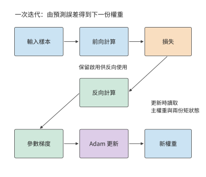

*圖 10-1：從輸入和當前權重出發，前向得到損失，反向得到參數梯度，Adam 生成新權重。前向階段保留的啟用用於反向；更新過程還讀取高精度主權重和梯度歷史。*

具體到本章任務，混合精度 Adam 用 BF16 權重執行矩陣運算，用 FP32 主權重儲存最佳化器計算後的參數值，並儲存兩份 FP32 矩狀態。一階矩和二階矩跨迭代保留，分別記錄梯度方向和大小的歷史；主權重更新後再轉換為 BF16 供矩陣運算使用。梯度以 BF16 累積。逐項相加得到每參數 16 bytes。

| 狀態 | 每個參數所佔位元組數 | Qwen3-8B 容量 / GB | 使用時機 |
|---|---:|---:|---|
| BF16 模型權重 | 2 | 16.4 | 前向與反向矩陣運算 |
| BF16 梯度 | 2 | 16.4 | 反向傳播時產生，計算新參數時使用 |
| FP32 主權重 | 4 | 32.8 | 儲存新參數，隨後生成 BF16 副本 |
| Adam 一階矩 | 4 | 32.8 | 在訓練迭代之間保留梯度歷史 |
| Adam 二階矩 | 4 | 32.8 | 在訓練迭代之間保留梯度平方歷史 |
| 合計 | 16 | 131.1 | 常駐訓練狀態 |

Qwen3-8B 有 $N=8\,190\,735\,360$ 個參數，因此

$$
M_{\mathrm{persistent}}=16N\approx131.1\ \mathrm{GB}\approx122.1\ \mathrm{GiB}.
$$

梯度格式是另一項選擇。將梯度改為 FP32，每參數增加 2 bytes，總量變為 18 bytes。這一變化來自梯度的資料格式，「混合精度」一詞本身並不規定梯度格式。MoE 每次由路由器選擇部分專家子網路執行；各專家同樣擁有待更新參數和最佳化器歷史，所以狀態容量由全部可訓練參數決定。[^state]

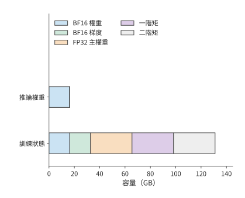

*圖 10-2：五類訓練狀態合計相當於八份 BF16 權重的容量。模型為 Qwen3-8B，採用表中資料格式；橫軸表示各類狀態累計佔用的容量。*

除了各類資料佔多大空間，還要區分各自需要保留多久。前向產生的啟用要等到相應的反向計算結束後才能釋放，而參數收集緩衝區可能只在某個模組執行期間使用。第 $i$ 張卡的視訊記憶體峰值取決於同一時刻駐留的訓練狀態、啟用和臨時緩衝區：

$$
M_{\mathrm{peak},i}=\max_t\left[M_{\mathrm{persistent},i}(t)+M_{\mathrm{activation},i}(t)+M_{\mathrm{temporary},i}(t)\right].
$$

例如，8 GiB 啟用與 4 GiB 收集緩衝若同時出現，就要共同佔用 12 GiB；若先釋放啟用再收集參數，同一片空間可以複用。容量最佳化由此有兩個方向：減少張量和緩衝區的大小，或減少需要同時保留的資料。下一節的分片、重計算與解除安裝分別從這兩個方向改變峰值。

上述容量按 BF16 執行矩陣運算計算。換一種浮點格式，狀態佔用的位元組數和數值風險會同時改變。先看 FP16。第 4.6.1 節已比較 FP16 與 BF16 的指數與尾數：FP16 的五位指數把最小正規數定在 $2^{-14}\approx6.1\times10^{-5}$，小於它的值只能用次正規數表示，有效位隨數值減小而逐位丟失；小於 $2^{-24}\approx6\times10^{-8}$ 的值則直接變為零。混合精度訓練論文給出兩組統計：普通話語音識別模型的權重梯度中，約 5% 的值指數小於 $-24$，在 FP16 中會變為零，該文以此說明需要 FP32 主權重；Multibox SSD 檢測網路的啟用梯度中，大量數值低於 FP16 的可表示範圍而變為零，其中落在 $[2^{-27},2^{-24})$ 的值對訓練仍然重要。

**損失縮放**（loss scaling）解決這一問題：在反向傳播前把損失乘以因子 $S$，梯度隨之放大 $S$ 倍，進入 FP16 可表示的範圍；參數更新前再除以 $S$。該文訓練多種網路時使用的縮放因子在 8 到 32K 之間。因子過小，小梯度仍然下溢；過大，大梯度溢位為無窮大，必須跳過這次更新並調小因子。[^precision]

BF16 的八位指數與 FP32 相同，兩者的表示範圍一致，梯度不需要縮放，這是前述狀態表採用 BF16 的原因之一。代價是尾數只有七位：矩陣運算輸入的舍入誤差大於 FP16，長內積的精度要靠 FP32 累加器保證。

繼續壓低位寬，就要把單一的全域性縮放因子細化成分塊縮放。FP8 的 E4M3 編碼只有四位指數、三位尾數，最大正規數為 448，單一全域性因子無法讓各層啟用同時落入如此窄的範圍。DeepSeek-V3 的 FP8 訓練按塊管理縮放：啟用按 $1\times128$ 小塊（每個 token、每 128 個通道）求 scale，權重按 $128\times128$ 塊求 scale，矩陣單元每累加 128 個元素就把部分和轉為 FP32 繼續累加。與 BF16 的對照訓練相比，相對損失誤差低於 0.25%。[^precision]

FP8 也改變容量賬，但改變的只是送入矩陣單元的那份權重副本：DeepSeek-V3 的 FP8 訓練把矩陣運算的運算子轉成 FP8，主權重、梯度與最佳化器狀態仍以更高精度儲存。這份 FP8 運算子副本每參數 1 byte，每 $128\times128$ 塊附加一個 FP32 scale，合計每參數約 $1+4/16384\approx1.0002$ bytes；對 Qwen3-8B，矩陣運算讀取的權重從 BF16 的 16.4 GB 降為約 8.2 GB，而前述狀態表中每參數 16 bytes 的常駐訓練狀態並不因此降到 1 byte。

| 矩陣運算的權重格式 | 每參數位元組（含 scale） | Qwen3-8B 矩陣運算讀取的權重 | 縮放管理 | 主要數值風險 |
|---|---:|---:|---|---|
| FP16 | 2 | 16.4 GB | 全域性損失縮放 | 梯度下溢、縮放溢位 |
| BF16 | 2 | 16.4 GB | 無需 | 尾數較短，由 FP32 累加補償 |
| FP8（E4M3）運算子副本 | 約 1.0002 | 約 8.2 GB（主權重與最佳化器狀態另存） | 分塊縮放與定期高精度累加 | 塊內舍入、scale 過期 |

精度越低、縮放粒度越粗，節省的容量越多，數值偏離高精度參考的風險也越大。無論起因是縮放失效、資料異常還是硬體錯誤，訓練偏離都表現為損失曲線上的尖峰（loss spike），常見的處理是回滾到上一份 checkpoint 重新訓練。回滾損失多少進度由第 10.4 節的儲存週期模型決定，第 10.4.5 節再把回滾的發生率計入該模型。

### 10.1.3 計算需求、MFU 與資源下界

視訊記憶體決定模型能否開始訓練，計算速度決定能否按期完成。同一個模型的狀態可以分到多張卡上，但究竟需要多少張卡，還要根據總計算量和期限判斷。一條 8,192 個 token 的序列在前向和反向傳播中的矩陣計算量約為 $4.31\times10^{14}$ FLOPs，平均每 token 約 52.7 GFLOPs。處理 100B token 共需約 $5.27\times10^{21}$ FLOPs。這裡的工作量由模型矩陣形狀和前後向運算累計得到。[^deadline]

先假設這 30 天全部用於訓練計算。H100 SXM 的稠密 BF16 矩陣運算峰值為 989 TFLOP/s，達到峰值的 40% 時，一張卡約能處理 7,500 token/s。五張卡合計約 37,600 token/s，低於 30 天所需的約 38,600 token/s；至少需要六張卡才能滿足計算需求。相比之下，兩張 80 GB 卡已能容納理想均分的 131.1 GB 常駐訓練狀態，卻需約 77 天完成計算。

設演算法所需的總計算量為 $F$，卡數為 $p$，單卡峰值為 $P$，統計時段內的平均計算效率為 $\eta$，則

$$
T=\frac{F}{pP\eta},\qquad
p_{\mathrm{compute}}=\left\lceil\frac{F}{P\eta T_{\mathrm{available}}}\right\rceil.
$$

本章按第 1.2.2 節的定義計算 MFU，分母取全部卡的峰值算力。若實際耗時取完整的訓練迭代時間，通訊等待已經計入其中；若只統計加速器執行計算的時間，得到的就是單卡計算效率。本章的設計案例採用後一種分解：單卡計算效率取 40%，隨後把無法與卡內計算重疊的通訊時間，以及等待輸入資料的時間逐項加上。這樣可以直接觀察每項系統設計對完成時間的影響。40% 來自 Llama 3 的公開記錄：405B 模型在 8,192 至 16,384 張 H100 上預訓練，BF16 MFU 為 38%—43%。這組數按整步耗時統計，本身已包含通訊等待，本章再單獨加上通訊，算出的完成時間因此偏長。RTX 4090 沒有 NVLink，卡間資料都要經過 PCIe，這部分代價在第 10.3.3 節按實際鏈路 (Link)單獨計算。圖 10-3 至圖 10-5 保留 30% 與 50% 兩檔，用來觀察效率偏離時卡數如何變化。[^deadline]

另外六成峰值算力去了哪裡，本章各節分別作答：無法與計算重疊的通訊（第 10.3.3 節）、管線 (Pipeline)氣泡（第 10.3.2 節）、受記憶體頻寬限制的參數更新與狀態轉換（第 10.2.3 節）、重計算（第 10.2.2 節）、掉隊者（第 10.4.5 節）和 checkpoint 儲存（第 10.4.3 節）。按第 1.3.4 節的判據，前四項是模型必須計入的工作，漏掉任何一項，估出的完成時間都會偏短；後兩項和通訊中沒有重疊的部分則含有可以減少的開銷，那才是系統設計的最佳化空間。

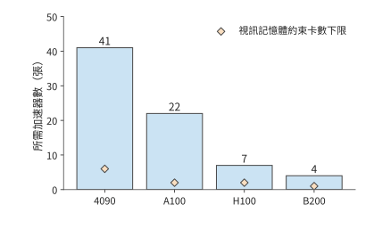

*圖 10-3：矩陣計算效率為 30% 時所需的卡數。任務為 Qwen3-8B 處理 100B token，序列長 8192，全部 30 天用於執行；藍柱為計算需求，橙色菱形為訓練狀態容量下限。A100 為 80 GB SXM，H100 為 SXM。*

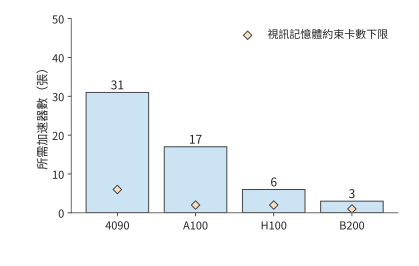

*圖 10-4：矩陣計算效率提高到 40%，同一任務所需的卡數下降；橙色菱形仍表示狀態容量下限。各下限均以卡數計量；容量項是視訊記憶體約束要求的最少卡數。*

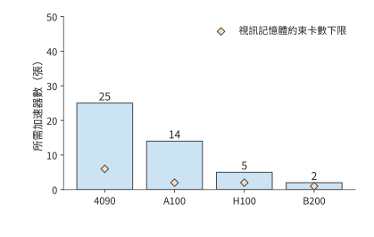

*圖 10-5：矩陣計算效率為 50% 時所需的卡數。三圖使用相同的型號順序、縱軸範圍、任務與 30 天執行期限。各下限均以卡數計量；容量項是視訊記憶體約束要求的最少卡數。*

圖 10-3 將視訊記憶體下限與計算下限放在一起：對本章任務，所需卡數主要由計算決定。下面據此選取兩套具體配置，供後續各節逐步比較。RTX 4090 的對應峰值為 165.2 TFLOP/s。按 40% 效率和 30 天計算，需要至少 31 張卡。採用每臺主機八張卡的配置後，可以先考慮 32 卡方案；再增加兩臺主機得到 48 張。兩套方案中，每張卡分別累積 12 個和 8 個單序列 micro-batch，共同完成一個包含 384 條序列的全域性 batch。增加卡數改變了工作分配，訓練目標保持不變。

每次訓練迭代約有 $1.66\times10^{17}$ FLOPs，使用 32 卡時，每張卡完成所分配的計算約需 78.3 s；使用 48 卡時，約需 52.2 s。相對 67.9 s 的預算，32 卡在加入通訊前已經超時，48 卡則留下約 15.7 s。接下來要判斷兩套方案如何安排狀態，以及哪些等待會消耗這 15.7 s。

## 10.2 訓練狀態的分片、重計算與解除安裝

### 10.2.1 資料並行與 ZeRO／FSDP 狀態分片

狀態如何分配到多張卡上，由並行方式決定。同步資料並行讓各卡處理不同樣本，再用歸約後的梯度更新各自的參數。各卡得到的新參數相同，因此每張卡通常都儲存一份相同的權重與最佳化器狀態；卡越多，複製的狀態越多。ZeRO 由微軟研究者在 2019 年提出、2020 年發表，用跨卡分片來減少大模型訓練中重複儲存的狀態副本。ZeRO 分階段劃分這些狀態的歸屬：每張卡只負責一部分參數的更新，其他卡透過通訊取得執行所需的資料。

完全分片資料並行（Fully Sharded Data Parallel，FSDP）按同樣的分片思路組織執行，參數、梯度與最佳化器狀態都分片儲存。下面用四張卡逐步改變狀態的歸屬，再分析相應的執行方式。圖中每列始終對應同一張卡；「完整」表示該卡儲存整份狀態，「片」表示只儲存該卡負責的四分之一。

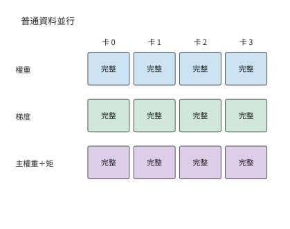

*圖 10-6：普通 DP：每卡儲存完整權重、梯度、主權重和兩份矩狀態。*

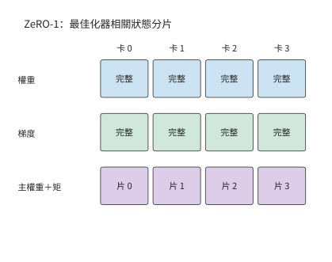

*圖 10-7：ZeRO-1：主權重和兩份矩狀態按參數分片，權重與梯度仍完整複製。*

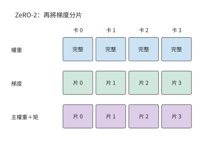

*圖 10-8：ZeRO-2：進一步劃分梯度，每卡只保留歸屬於自己的梯度分片。*

前兩個階段仍為每張卡保留完整模型權重。圖 10-9 再劃分權重的歸屬，長期駐留的空間進一步下降，代價是執行每個模組前要透過通訊取得所需的權重。

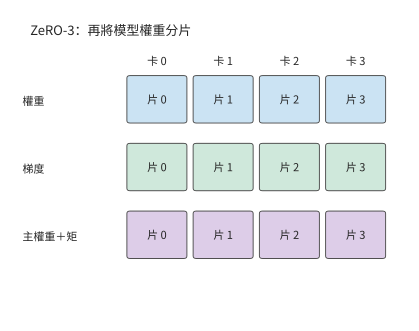

*圖 10-9：ZeRO-3：權重也分片。執行模組時，各卡透過通訊取得所需的完整權重。*

設資料並行組中有 $d$ 張卡。先計算常駐訓練狀態，普通資料並行和 ZeRO 三個階段的每卡容量分別為

$$
\begin{aligned}
M_0&=16N,\\
M_1&=4N+12N/d,\\
M_2&=2N+14N/d,\\
M_3&=16N/d.
\end{aligned}
$$

第一階段分片 FP32 主權重和兩份 Adam 狀態，共 12 bytes/參數，權重與梯度仍各保留一份。第二階段再把梯度分片，完整複製只剩 BF16 權重。第三階段連權重也分片。將 $d=8$ 代入，就得到下面的容量變化。

| 配置 | 每卡常駐訓練狀態 / GiB | 完整複製的訓練狀態 |
|---|---:|---|
| 普通 DP | 122.1 | 權重、梯度與最佳化器狀態 |
| ZeRO-1 | 42.0 | 權重與梯度 |
| ZeRO-2 | 28.6 | 權重 |
| ZeRO-3 | 15.3 | 常駐訓練狀態均已分片 |

分片以後，每個模組按以下順序執行：先透過 AllGather 取得所需參數，執行前向或反向，再透過 ReduceScatter 彙總梯度並分配梯度分片，讓負責該分片的卡得到全部梯度貢獻，最後各自更新所負責的參數。FSDP 的全分片執行也圍繞這條路徑組織。若前向後釋放完整參數，反向前就要再次收集；若保留完整參數，反向可直接使用，但完整參數會與後續啟用同時佔用視訊記憶體。

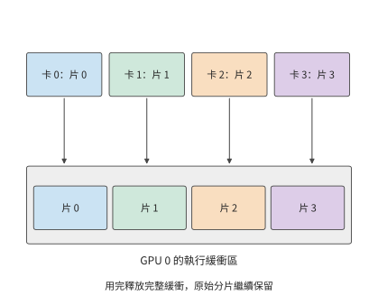

*圖 10-10：同一模組的權重平時分散在四張卡上；執行時，各卡收集完整權重。圖中展開 GPU 0 的收集過程，四種顏色分別表示四份參數分片。完整權重緩衝區用完即可釋放，各卡長期儲存的原始分片仍然保留。*

圖 10-10 中，完整權重緩衝區與原有分片同時存在。增加卡數會縮小每份原始分片，完整權重緩衝區的大小卻由模組本身決定。這就是常駐狀態佔用與執行峰值下降幅度不同的原因。

這一差別可以在小實驗中直接觀察到。一組用 PyTorch 第二代 FSDP 實現（FSDP2）做的 CPU 小模型實驗，把參與的程序從兩個增加到四個：參數更新後保留的狀態從約 18 MiB 減到 9 MiB，執行峰值卻只從約 39 MiB 減到 30 MiB。長期儲存的部分減半，峰值只減少約 23%，因為執行中仍需約 21 MiB 的其他張量和緩衝區。因此，分析分片後的容量需求，還要考察模組執行時參數與啟用各需儲存多久。[^fsdp]

### 10.2.2 啟用的保留與選擇性重計算

前向計算留下的啟用，像草稿紙上記錄的中間步驟：反向計算回到這一層時，還要用到其中一些值。草稿全部保留，取用方便，卻佔空間；只保留部分步驟，缺失的值就要在使用前重新算出。參數分片已經減少了權重和最佳化器狀態的複製，啟用重計算則用額外的計算換取儲存這些中間值所需的空間。

考慮矩陣運算 $Y=XW$，其中 $X$ 為輸入、$W$ 為權重、$Y$ 為輸出。前向計算結束後，$X$ 還要等到求權重梯度時使用。記損失為 $\mathcal L$，$dY=\partial\mathcal L/\partial Y$ 是後續計算傳來的梯度，$dX$ 和 $dW$ 分別是損失對輸入與權重的梯度；上標 $\mathsf T$ 表示矩陣轉置。反向要計算

$$
dX=dY W^{\mathsf T},\qquad dW=X^{\mathsf T}dY.
$$

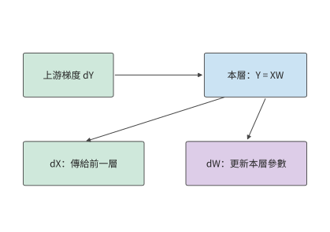

*圖 10-11：矩陣反向產生兩路梯度：dX 交給前一層繼續反向，dW 交給本層的歸約和參數更新。兩路計算都讀取上游梯度 dY。*

計算參數梯度需要前向輸入 $X$。若保留 $X$，就要讓它從前向計算時一直駐留到反向計算用完為止；釋放 $X$，則要在反向使用前從已保留的輸入或中間結果出發，重新執行相應的前向計算。選擇哪些值保留、哪些值重算，要看節省多少空間，以及重新計算需要多少工作。

**例：反向傳播前重算門控乘積能節省多少啟用儲存？** Qwen3-8B 的多層感知機（MLP，即本例的前饋子網路）先得到門控結果 $a$ 和上投影結果 $u$，再形成 $h=a\odot u$，最後計算 $Y=hW_{\mathrm{down}}$。下投影的參數梯度需要 $h$。如果已為非線性運算子的反向計算保留了 $a,u$，可以在下投影反向前重新相乘，就不必一直保留 $h$。

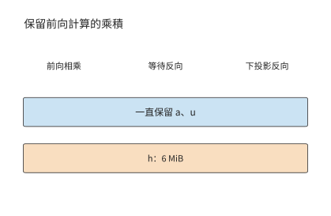

*圖 10-12：保留乘積 h：藍色條表示一直保留的 a、u，橙色條表示從前向持續到下投影反向的乘積 h。128 個 token 的 micro-batch 採用 FP32，h 的形狀為 [128,12288]，佔 6 MiB。*

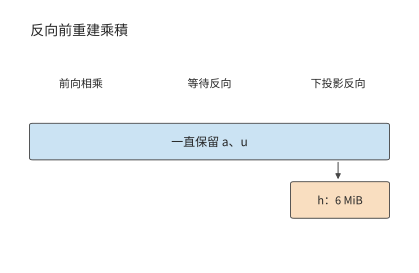

*圖 10-13：保留 a、u，反向使用前重新相乘得到 h。橙色的 6 MiB 緩衝只在使用前後短暫存在；橫軸表示操作順序。*

重建後，只需在下投影反向即將開始時生成 h，並保留到這一步計算結束。這塊緩衝區的大小如下：取 128 個 token 的 micro-batch 和 FP32 啟用，$h$ 的形狀為 $[128,12288]$，佔 $128\times12288\times4=6$ MiB；重建需要約 157 萬次乘法。同一層的兩個歸一化加權輸出形狀均為 $[128,4096]$，每個佔 2 MiB，也可由已儲存的歸一化結果和權重重建。於是，每層省去 $6+2+2=10$ MiB，每個 micro-batch 在九層組成的流水階段中可省去 90 MiB，約 94 MB。

原方案為這些 GEMM 儲存的輸入每層共佔 15 MiB，其中上述三個乘積佔 10 MiB，其餘 Q、K、V 和注意力輸出佔 5 MiB。九層階段因此從 135 MiB 降到 45 MiB，即從約 142 MB 降到 47 MB。重建按層依次發生，最大的乘積工作區為 6 MiB；上一層用完後，下一層複用這塊空間。[^pipeline]

若有四個 micro-batch 同時等待反向計算，需要長期儲存的資料就能減少 $4\times90=360$ MiB，約 377 MB，反向時則逐個 micro-batch 執行重建計算。這裡的收益來自資料生命週期的差別：等待反向計算的 micro-batch 越多，需要長期儲存的資料越多；逐層重建時，卻只需反覆使用同一塊工作區。流水排程若讓反向更早開始，等待反向計算的 micro-batch 數量又會下降。因此，重計算與流水排程共同決定需要儲存多少資料；新增的計算是否延長每步訓練時間，則取決於它在時間線上的位置。

### 10.2.3 CPU／GPU 解除安裝與緩衝區的使用時間

用已儲存的結果重建資料的開銷較小時，適合重計算。另一種辦法是保留資料本身，把它移到容量更大的主機記憶體，使用前再傳回 GPU，這就是**解除安裝**。選擇解除安裝以後，原先的視訊記憶體問題就變成了傳輸能否及時完成的問題。假設一份狀態大小為 $V$，鏈路 (Link)有效頻寬為 $B$，從可以開始傳輸到運算子需要這些資料之間有 $W$ 秒，則超出這段時間的傳輸耗時為

$$
T_{\mathrm{wait}}=\max(0,V/B-W)
$$

相應運算子需要等待這段時間。傳輸和計算能重疊多少，取決於資料何時可發、鏈路 (Link)何時空閒、相應運算子何時需要這些資料。DMA 由裝置發起資料搬移，傳輸期間源資料必須保留。源緩衝在 DMA 結束前保持有效，目標緩衝從開始接收時就佔用記憶體；解除安裝同時改變兩端緩衝區的使用時間。

**例：在 CPU 還是 GPU 上轉換梯度，能更快完成解除安裝？** 門控投影的梯度形狀為 $[12288,4096]$，BF16 大小 $G=96$ MiB，FP32 為 192 MiB。CPUAdam 是在 CPU 上執行 Adam 更新的實現，它使用 FP32 梯度，可以先傳 BF16 再在 CPU 轉換，也可以先在 GPU 轉換再傳 FP32。轉換都要讀 $G$、寫 $2G$，共訪問 $3G$ bytes。轉換受記憶體頻寬限制：GPU 取 RTX 4090 的 1008 GB/s，CPU 取第四代至強單路八通道 DDR5-4800 的 307.2 GB/s。記 CPU、GPU 轉換吞吐量為 $C_c,C_g$，鏈路 (Link)有效頻寬為 $B$，序列路徑時間為

$$
T_c=G/B+3G/C_c,\qquad T_g=3G/C_g+2G/B.
$$

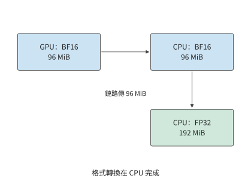

*圖 10-14：先將 96 MiB BF16 梯度傳到 CPU，再在 CPU 轉為 192 MiB FP32。箭頭表示資料流；轉換的輸入與輸出均位於 CPU 一側。*

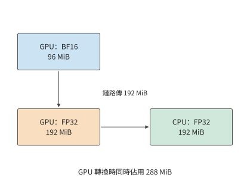

*圖 10-15：先在 GPU 將 96 MiB BF16 梯度轉為 192 MiB FP32，再傳到 CPU。轉換時輸入與輸出共存，GPU 峰值為 288 MiB。*

圖 10-14 與圖 10-15 的差別集中在跨越鏈路 (Link)的箭頭上：GPU 雖然轉換更快，卻要多傳 96 MiB。鏈路 (Link)越慢，這部分額外傳輸越容易抵消轉換收益。

RTX 4090 經 PCIe 4.0 x16 連線主機，每方向 32 GB/s。在這條鏈路 (Link)上，CPU 路徑約為 $3.15+0.98=4.13$ ms，GPU 路徑約為 $0.30+6.29=6.59$ ms。GPU 路徑的轉換少約 0.68 ms，傳輸卻多約 3.15 ms，因此更慢。若鏈路 (Link)換成 GH200 中 CPU 與 GPU 之間的 NVLink-C2C，每方向 450 GB/s，多傳 96 MiB 只增加約 0.22 ms，兩條路徑變為約 1.21 ms 和 0.75 ms，GPU 轉換獲得明顯收益。[^offload]

令兩條路徑耗時相等，可以求出兩種方式快慢互換的頻寬分界點：

$$
B^*=\frac{1}{3(1/C_c-1/C_g)}\approx147\ \mathrm{GB/s}.
$$

該閾值把兩種相反作用放在同一尺度上：GPU 轉換更快，節省了格式轉換時間；FP32 資料更大，增加了傳輸時間。鏈路 (Link)越快，後一項代價越小。147 GB/s 高於 PCIe 5.0 x16 的每方向 64 GB/s，所以經 PCIe 連線的卡在本算例中都應先傳 BF16、在 CPU 上轉換。

視訊記憶體容量還帶來另一項限制。GPU 轉換期間原始 96 MiB 與輸出 192 MiB 共存，峰值為 288 MiB；先傳 BF16 的路徑則只需在 GPU 上保留參與這次轉換的 96 MiB 梯度。選擇 GPU 轉換需要額外 192 MiB 緩衝區。SuperOffload 是面向 GH200 這類 CPU 與 GPU 緊耦合晶片的訓練解除安裝系統，它把轉換位置和主機上的最佳化器執行一起安排，利用的正是轉換速度、傳輸資料量和緩衝區使用時間之間的取捨。整步收益則由最後一桶梯度、CPU 上的參數更新和權重回傳何時完成決定。

### 10.2.4 組合並行方案中的每卡狀態分配與互聯拓撲

分片、重計算和解除安裝分別改變儲存量、計算量和傳輸量。把這些辦法組合成完整系統時，還要確定它們作用於哪些卡和通訊組。第 6、7 章的並行方法在訓練中劃分不同的資料和計算：TP 切分層內矩陣，PP 劃分層，DP 劃分樣本，EP 劃分專家。第 6.1.4 節的一覽表還包括 SP 與 CP：前者讓逐 token 運算子的啟用沿序列分片，通常複用張量並行組；後者把同一條長序列的注意力上下文分到多張卡，保留跨位置的依賴。這些並行方法延續第 5 章「分塊—安排輸入—匯合結果」的方法，訓練再沿相同計算圖逆向傳播梯度。先確定每份參數由誰更新，再沿前向和反向的依賴關係安排收集、交換與歸約，就能同時得到每卡容量和各介面流量。

三種容量最佳化可以用同一組問題比較。

| 方法 | 減少的視訊記憶體佔用 | 增加的工作 | 決定收益的時間關係 |
|---|---|---|---|
| 狀態分片 | 重複儲存的權重、梯度或最佳化器狀態 | 參數收集、梯度歸約並分片 | 收集能否趕在模組執行前完成 |
| 啟用重計算 | 前向到反向之間儲存的中間值 | 重建前向值 | 重建是否延遲關鍵路徑上的反向計算 |
| 狀態解除安裝 | 加速器上暫時不用的狀態 | 主機與加速器間傳輸 | 資料能否在使用前傳回 |

**例：視訊記憶體不足時，應增加分片的卡數還是重計算啟用？** RTX 4090 標稱 24 GB，約合 22.35 GiB；扣除執行時佔用，每卡按 22 GiB 可用視訊記憶體計。Qwen3-8B ZeRO-3 在八卡上每卡儲存約 15.3 GiB，留給其他張量和緩衝區約 6.7 GiB。如果啟用與臨時緩衝區同時需要 10 GiB，總量約 25.3 GiB，超出約 3.3 GiB。此時可以用重計算節省這 3.3 GiB，也可以增至十六卡，將常駐訓練狀態降到約 7.6 GiB，總量降至約 17.6 GiB。

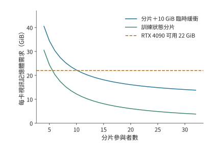

*圖 10-16：給定附加儲存需求時，分片數決定哪些方案滿足容量要求。曲線為 $16N/d+10$ GiB，水平線為 RTX 4090 每卡 22 GiB 可用視訊記憶體。曲線低於預算的區域可以容納這些訓練狀態和緩衝區；縱向距離給出容量餘量。*

兩種選擇對應不同的代價：八卡方案增加重建計算，十六卡方案增加卡數並改變通訊組。可以先從圖中找出滿足視訊記憶體要求的方案，再比較這些方案的每步耗時。

針對本章的訓練任務，32 卡與 48 卡方案均採用全組 ZeRO-3，TP=PP=1，每卡 micro-batch 為一條序列。與上例相同，每卡按 22 GiB 可用視訊記憶體計，併為同時保留的啟用、完整模組參數和工作區安排 10 GiB 上限。兩套方案常駐訓練狀態分別約為 3.8、2.5 GiB，總量約為 13.8、12.5 GiB，容量餘量約為 8.2、9.5 GiB。兩套方案的視訊記憶體都足夠，接下來主要比較完成時間。[^design]

## 10.3 訓練步的流水排程與通訊重疊

容量分析確定視訊記憶體能夠容納所需資料，時間分析確定資料能否及時到達。本節先明確一次訓練迭代所最佳化的目標函式，再把前向、反向與通訊放在同一時間軸上。本章的設計案例採用資料並行；四階段流水單獨作為算例，說明排程會同時改變關鍵路徑和啟用的生命週期。

### 10.3.1 micro-batch、梯度累積與參數更新

全域性 batch 包含一次參數更新使用的全部樣本，可以分成多個 micro-batch 依次執行反向傳播，累積梯度後統一更新參數。設 micro-batch $k$ 中有效 token 的索引集合為 $S_k$，有效 token 總數為 $L=\sum_k|S_k|$，token 平均損失為

$$
\mathcal L=\frac{1}{L}\sum_k\sum_{j\in S_k}\ell_j.
$$

求和與求導可以交換順序，因此可以分別對各個 micro-batch 執行反向傳播；計算每個 micro-batch 的損失時，都用其損失總和除以同一個 $L$。所有 micro-batch 的梯度累積完成後，執行一次梯度裁剪和一次參數更新。這樣劃分 micro-batch 只改變執行順序，不改變各個 token 在損失函式中的權重。

**例：按 micro-batch 還是按 token 求平均，為何會改變梯度？** 八條回答中，四條各含兩個有效 token，四條各含三個，共 20 個。設短回答每 token 的損失為 $\theta/5$，長回答為 $2\theta/5$，則

$$
\mathcal L=\frac{8\theta/5+12(2\theta/5)}{20}=\frac{8\theta}{25},\qquad
\frac{d\mathcal L}{d\theta}=0.32.
$$

若先求每條回答的平均損失，再對八條回答取平均，短回答與長回答各佔一半權重，梯度變成 $(0.2+0.4)/2=0.30$。原先按 token 平均時，長回答佔 $12/20=60\%$，所以結果更靠近 0.4。若已經使用 20 這一共同分母，累積後又除以八，則梯度變為 0.04。分母決定每個 token 對參數梯度的貢獻。[^verl]

回到設計案例：第 10.1.3 節的 384 條完整長度的序列，在 32 卡上每卡累積 12 個 micro-batch，在 48 卡上每卡累積 8 個。每卡一次只處理一條，每張卡執行的矩陣形狀相同；全域性有效 token 數和目標函式也相同。參數收集和梯度通訊則隨執行路徑另行排入時間軸。

### 10.3.2 管線 (Pipeline)排程、氣泡與啟用的生命週期

micro-batch 的劃分保持了訓練目標，卻改變了計算的先後順序。在管線 (Pipeline)並行裡，順序還決定每個階段何時能開始計算，以及有多少份啟用在等待反向。管線 (Pipeline)並行把模型分成多個階段，每個 micro-batch 依次前向，再沿反方向傳播梯度。**填滿排空（fill–drain）排程**先完成所有 micro-batch 的前向傳播，再集中執行反向傳播。**1F1B（one forward, one backward）**在管線 (Pipeline)預熱後交替執行一次前向和一次反向，讓較早的 micro-batch 更快釋放啟用。

啟用釋放的快慢直接決定視訊記憶體峰值。反向傳播要用到前向儲存的啟用，因此每個 micro-batch 的啟用從前向完成起就必須留在視訊記憶體裡，直到對應的反向到達。同一時刻有多少個 micro-batch 在等待反向，視訊記憶體裡就有多少份啟用。填滿排空要等全部 $m$ 個 micro-batch 都完成前向才開始第一個反向，峰值隨 $m$ 線性增長；一旦超出視訊記憶體容量，這一訓練步就無法執行，只能減少同時在管線 (Pipeline)中的 micro-batch、縮短序列，或改用代價更高的重計算換取可行性。提前執行反向就是提前結束啟用的等待：峰值降低後訓練步才能容納，或者釋放的餘量可以留給更大的 micro-batch 和更長的序列。視訊記憶體駐留因此往往不是快慢問題，而是能否執行的問題。

比較任何兩種排程，都要同時考察兩根軸：一根是**完成時間**，取決於管線 (Pipeline)中空閒等待（氣泡）的大小；另一根是**視訊記憶體駐留**，取決於每份啟用要儲存多久才能等到自己的反向。

先設 $p$ 個階段完全平衡，每階段的前向耗時為 $t_f$、反向耗時為 $t_b$，傳輸和參數更新耗時取零。$m$ 個 micro-batch 填滿排空需要

$$
T=(m+p-1)(t_f+t_b),\qquad u=\frac{m}{m+p-1}.
$$

式中的 $m$ 項對應 micro-batch 的實際計算工作，$p-1$ 項來自填充和排空。卡的時間利用率 $u$ 因而隨 micro-batch 數量增加而提高。取 $p=4,m=8$，得到 $u=8/11\approx72.7\%$。若保持全域性 batch size 不變，增加 micro-batch 數量意味著縮小每個 micro-batch；由此減少的管線 (Pipeline)空閒時間，需要與更小矩陣的執行時間一起比較。

**例：氣泡相同，1F1B 換來了什麼？** 將 Qwen3-8B 的 36 層分為四個九層階段，八個 micro-batch 各含一條 128 個 token 的序列。每階段前向 10 ms、反向 20 ms，邊界傳輸每次 1 ms，正反方向鏈路 (Link)獨立，參數更新耗時 1 ms。填滿排空排程無傳輸時為 $(8+4-1)\times30=330$ ms；前向填充經過三條邊界增加 3 ms，反向排空再增加 3 ms，參數更新增加 1 ms，總計 337 ms。

1F1B 更早開始反向，後續的前向也就要等反向釋放計算資源。在階段 0，前四個 micro-batch 於 40 ms 完成前向，第一份傳回的梯度於 106 ms 到達。隨後反向執行到 126 ms，第五個 micro-batch 才開始前向。這種交錯逐級影響下游的到達時間。階段 3 在 93 ms 完成第二個 micro-batch 的反向，但第三個前向輸入到 95 ms 才到，產生 2 ms 空隙；後續相似的等待繼續延長關鍵路徑。按這些依賴關係排定執行順序後，所有梯度在 346 ms 時計算完畢，加上參數更新共為 347 ms。[^pipeline]

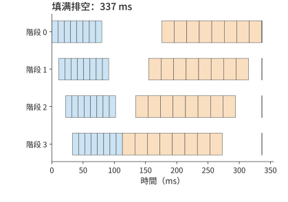

*圖 10-17：填滿排空先完成八個 micro-batch 的前向，再執行反向，最後更新參數。藍色為前向，橙色為反向，綠色為參數更新。四個階段共用同一時間刻度，按正文的計算與傳輸條件共需 337 ms。*

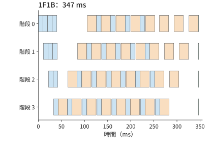

*圖 10-18：1F1B 在預熱後交錯前向和反向，本例完成時間為 347 ms。藍色為前向，橙色為反向，綠色為參數更新；與前圖使用相同時間刻度。*

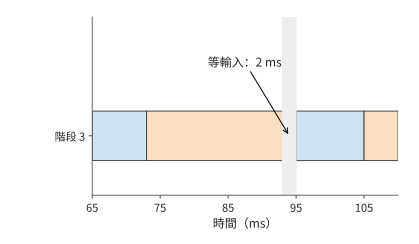

*圖 10-19：放大 1F1B 的階段 3：第二個 micro-batch 在 93 ms 結束反向，下一份前向輸入於 95 ms 到達，形成 2 ms 等待。*

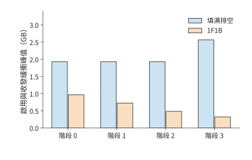

*圖 10-20：兩種排程中各階段的啟用與收發緩衝峰值。提前反向使啟用更早釋放，最大值由約 2.57 GB 降到 0.97 GB。*

兩圖對比可以看出：兩種排程做相同的前後向工作，氣泡時間同為 $(p-1)(t_f+t_b)$；1F1B 反而因交錯引入的依賴等待（圖 10-19）多用約 3% 的時間，收益則體現在圖 10-20——中間結果與緩衝區的最大視訊記憶體佔用從約 2.57 GB 降到 0.97 GB，減少約 62%。因此「1F1B 優於填滿排空」只在視訊記憶體這根軸上成立，在時間軸上反而略慢。若只給這些中間結果和緩衝區留 1 GB，只有提前反向的排程能執行這一訓練步；容量充裕時，337 ms 的填滿排空排程完成得更早。選擇哪種排程方式，由「何時釋放張量」和「何時得到下一份輸入」共同決定。

要縮短完成時間，就必須壓縮氣泡本身：反向拆得更細、同時流動的 micro-batch 更多，空隙就能填得更滿。下面三類排程都建立在上述依賴分析之上，分別用**通訊次數**、**啟用峰值**和**參數量**換取更小的氣泡。三者沿用同一算例（四個階段、前向 10 ms、反向 20 ms、邊界傳輸 1 ms、參數更新 1 ms），各 micro-batch 在每個階段上的執行順序（槽位順序）由事件模型排定，氣泡公式與反向拆分的思路來自已發表的論文。[^schedules]

**交錯式 1F1B**（interleaved 1F1B，又稱虛擬管線 (Pipeline)）把 36 層切成八個塊，輪流分給四張卡，每卡得到 $v=2$ 個不連續的塊，合計仍是九層：前四塊各五層、後四塊各四層，卡 0 執行第 0—4 層與第 20—23 層，其餘各卡依次類推。每個 micro-batch 的前向因此跨越邊界 $2p-1=7$ 次而不是 3 次，氣泡比例則從 $(p-1)/m$ 縮小為

$$
\frac{1}{v}\cdot\frac{p-1}{m}.
$$

八個 micro-batch 時完成時間從 347 ms 降到 298 ms，每卡空閒從約 106 ms 降到約 57 ms。代價有兩項：傳輸次數增加一倍以上（全步前向訊息從 24 次增到 56 次），以及較早階段的啟用要等待更多塊完成前向——階段 0 的啟用與收發緩衝峰值從 921 MiB 升到約 1,329 MiB。

**零氣泡**（zero-bubble）排程把反向拆成兩段：輸入梯度 $dX$（論文記作 B）要傳給上一階段，上一階段的反向在等它，所以 $dX$ 位於關鍵路徑上，應儘早執行；權重梯度 $dW$（論文記作 W）只交給本層的梯度累積，可以放在本階段對應 $dX$ 之後的任意時刻，因而推遲到空隙中執行。設每階段前向、$dX$、$dW$ 的耗時分別為 $T_F$、$T_B$、$T_W$，則 1F1B 的氣泡為 $(p-1)(T_F+T_B+T_W)$；ZB-H1 把 $dW$ 填進空隙，氣泡降為 $(p-1)(T_F+T_B-T_W)$；ZB-H2 再把更多前向提前，氣泡降為 $(p-1)(T_F+T_B-2T_W)$。零氣泡論文的兩種手工排程按 $T_F=T_B=T_W$ 構造，論文表 2 給出上述一般形式。

本例把 20 ms 的反向對半拆成 $T_B=T_W=10$ ms：1F1B 的氣泡為 $3\times30=90$ ms，ZB-H1 的下界為 $3\times(10+10-10)=30$ ms，ZB-H2 的下界為 0。按論文圖 3 的 ZB-H1 槽位順序排定事件模型後，八個 micro-batch 的完成時間為 283 ms，每卡空閒 42 ms；把邊界傳輸取零，空閒恰好是 30 ms 的下界，多出的 12 ms 來自傳輸。階段 0 的啟用與收發緩衝峰值與 1F1B 相同，都是 921 MiB。代價落在靠後的階段：階段 3 的 $dW$ 比 $dX$ 晚三個 micro-batch 執行，事件模型把這段時間裡的啟用按完整一份保留，階段 3 的峰值從 1F1B 的 308 MiB 升到約 1,226 MiB。論文按 $dW$ 實際所需的較小啟用量計算，其表 2 中 ZB-H1 的峰值與 1F1B 同為 $pM_B$（$M_B$ 為一個 micro-batch 的啟用量）。

**DualPipe** 把 micro-batch 分成兩半，從管線 (Pipeline)兩端相向注入，每個階段同時承載兩個方向的塊。沿用 DeepSeek-V3 的記號，它的氣泡為 $(PP/2-1)(F\&B+B-3W)$，其中 $PP$ 為管線 (Pipeline)階段數，$F\&B$ 為前向與反向重疊執行的時段，$B$ 指完整反向 20 ms，$W$ 指其中的 $dW$ 10 ms。本例不模擬前向與反向的計算重疊，取 $F\&B=F+B=30$ ms，氣泡為 $(2-1)\times(30+20-30)=20$ ms，完成時間為 306 ms。代價同樣直接：每卡要儲存兩個方向的參數副本，參數量翻倍，啟用保留 $PP+1$ 份；本例各階段峰值約為 1,228—1,612 MiB。[^schedules]

下表把這五種排程放在同一算例下對照。填滿排空雖然沒有壓縮氣泡，仍是容量充裕時的基準，一併列出：

| 排程（八個 micro-batch） | 完成時間 / ms | 每卡空閒 / ms | 階段 0 峰值 / MiB | 壓縮氣泡的手段 | 主要代價 |
|---|---:|---:|---:|---|---|
| 填滿排空 | 337 | 96 | 1,840（階段 3 為 2,448） | 無 | 啟用駐留最高，容量緊張時不可行 |
| 1F1B | 347 | 106 | 921 | 無（氣泡與填滿排空相同） | 視訊記憶體最省，但比填滿排空慢約 3% |
| 交錯式 1F1B，$v=2$ | 298 | 57 | 1,329 | 每卡層塊拆成 $v$ 段 | 前向訊息 24 → 56 次 |
| 零氣泡（ZB-H1），$T_B=T_W$ | 283 | 42 | 921（階段 3 為 1,226） | $dW$ 延後填入空隙 | 靠後階段的啟用要保留到 $dW$ 執行 |
| DualPipe | 306 | 65 | 1,228（階段 1、2 為 1,612） | micro-batch 從兩端相向流動 | 每卡參數兩份 |

把表中的數字畫到各階段的時間線上，就能看出氣泡在哪裡被填掉。下面三幅圖與圖 10-17、圖 10-18 使用相同的時間刻度和顏色。

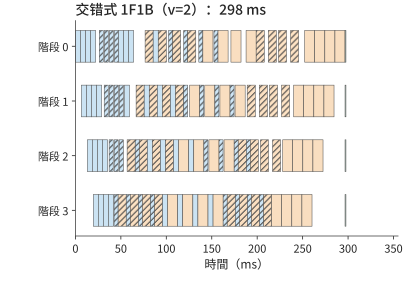

*圖 10-21：交錯式 1F1B（$v=2$）的各階段時間線，完成時間 298 ms。藍色為前向，橙色為反向，綠色為參數更新，斜線塊為每卡的第二個層塊。每個塊約為圖 10-18 中的一半長，預熱與排空階段的空隙被另一個層塊的計算填上，階段 3 的第一個前向從 33 ms 提前到約 20 ms；每個 micro-batch 要多穿過四條邊界。*

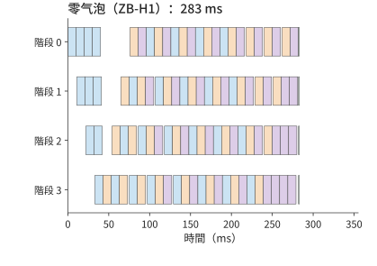

*圖 10-22：零氣泡（ZB-H1）的各階段時間線，完成時間 283 ms。藍色為前向，橙色為 $dX$，紫色為 $dW$，綠色為參數更新。穩態中每個階段按前向、$dX$、$dW$ 輪轉，圖 10-18 裡反向之間的依賴空隙和末尾的排空空隙都被延後的 $dW$ 填上，四個階段幾乎同時結束；階段 3 的 $dW$ 比 $dX$ 晚三個 micro-batch，那裡的啟用保留得最久。*

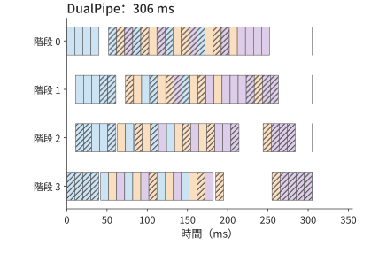

*圖 10-23：DualPipe 的各階段時間線，完成時間 306 ms。顏色同圖 10-22，斜線塊為從階段 3 進入的另一半 micro-batch（反方向）的計算。每個階段同時承載兩個方向，一個方向的預熱和排空空隙由另一個方向的塊填上；代價是每卡儲存兩份參數。*

沒有一種排程在兩根軸上同時佔優。把五種排程分別按兩根軸排序，第一名不是同一種排程：完成時間最短的是零氣泡，最大單階段峰值最低的是 1F1B。三種擴充套件排程壓縮氣泡換來的時間，都以另一種資源的增加為代價，所以選擇排程時要先確定約束在哪一邊：時間還是容量。圖 10-24 把兩根軸並排畫出（未畫填滿排空），可與上表對照。

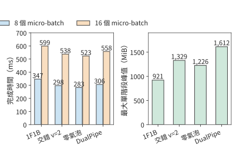

*圖 10-24：四種管線 (Pipeline)排程在八個與十六個 micro-batch 下的完成時間，以及八個 micro-batch 時各排程最大的單階段啟用與收發緩衝峰值。四種排程使用相同的前向 10 ms、反向 20 ms、邊界傳輸 1 ms、參數更新 1 ms 條件。*

micro-batch 翻倍到 16 個時，1F1B、交錯式、零氣泡與 DualPipe 的完成時間分別為 599、538、523、558 ms，排序不變。壓縮氣泡是否值得，取決於節省的氣泡時間與新增代價的相對大小。$m$ 增大時，氣泡比例 $(p-1)/m$ 本身就在下降——16 個 micro-batch 時 1F1B 的氣泡佔比已從 37.5% 降到 18.8%，拆細帶來的相對收益隨之縮小，而交錯式增加的通訊次數、零氣泡增加的啟用駐留、DualPipe 增加的參數量都不隨 $m$ 縮小。第 10.3.3 節的鏈路 (Link)爭用給出另一條邊界：交錯式每個 micro-batch 多出的四次跨界傳輸，在鏈路 (Link)已被梯度歸約佔滿時會直接延長關鍵路徑。容量緊張時，選擇的順序反過來：先按第 10.2.4 節排除峰值不可行的排程，再比較完成時間。

### 10.3.3 反向依賴、梯度分桶與通訊重疊

上一節的 2 ms 空隙來自輸入尚未到達。梯度通訊也受同一條規律支配：傳送之前要等資料產生，傳送時又要等鏈路 (Link)空閒。反向傳播逐層產生梯度，實現中通常把多個梯度張量合併成一個通訊桶，等桶內所有梯度都計算完畢後再傳送。桶越大，越可能等候最後生成的梯度；桶越小，需要啟動通訊的次數就越多。排程要在啟動代價與提前傳送之間取得平衡。

設歸約需要 3 ms，梯度就緒後還有 5 ms 與它無關的計算，歸約可以與這段計算同時進行。若共享鏈路 (Link)此前已安排 4 ms 的專家交換，歸約只能利用餘下 1 ms，另有 2 ms 延伸到計算之後。這部分無法與計算重疊、會延長訓練步的時間，稱為**通訊等待時間**。資料依賴給出最早開始時刻，資源爭用把它推遲，後續運算子的依賴關係決定這段等待是否延長整個訓練步。

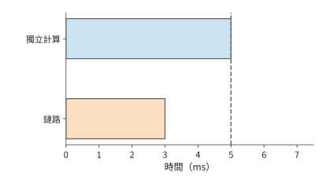

*圖 10-25：鏈路 (Link)空閒時，3 ms 歸約（橙色）可以在 5 ms 獨立計算（藍色）結束前完成。虛線標出計算結束。*

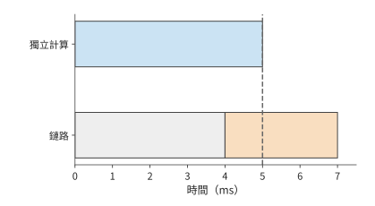

*圖 10-26：鏈路 (Link)先被其他通訊佔用 4 ms（灰色），歸約推遲到 4—7 ms。虛線後多出的 2 ms 延長訓練步。*

圖 10-25 暫時固定了梯度產生的時刻。實際訓練還可以改變計算順序，讓某些梯度更早產生，從而把歸約在時間軸上提前。矩陣反向中，輸入梯度 $dX$ 交給前一層繼續反向，參數梯度 $dW$ 交給本層的歸約。先算 $dX$ 可以讓前一層更早開始反向傳播，先算 $dW$ 則可以更早啟動本層的梯度通訊。兩者爭用同一計算資源時，改變順序會重新分配通訊視窗。這也是訓練排程要同時考慮前後向依賴的原因。

現在用這條規律計算設計案例的通訊等待。兩套方案都採用全組 ZeRO-3，每個 micro-batch 要做三次集合通訊：前向之前用 AllGather 收集一遍 BF16 權重，反向之前再收集一遍，反向之後對 BF16 梯度做一次 ReduceScatter。每次集合通訊中，每張卡收發的位元組為 $(d-1)/d\times2N$，48 卡時約 16.0 GB。每卡累積 $m$ 個 micro-batch，一步的通訊量為

$$
V=3m\cdot\frac{d-1}{d}\cdot2N.
$$

48 卡時 $m=8$，$V\approx385$ GB；32 卡時 $m=12$，$V\approx571$ GB。這些位元組的傳輸路徑由硬體決定。RTX 4090 沒有 NVLink，也不支援卡間 P2P（一張卡經 PCIe 直接讀寫另一張卡的視訊記憶體），同一臺主機裡的兩張卡交換資料也要經過主機記憶體，所以每張卡的全部收發都要穿過各自的 PCIe 4.0 x16，每方向 32 GB/s。按公開的 4090 叢集配置分析，每臺八卡主機配八張 200 Gbit/s 網路卡，每張 25 GB/s；環形集合通訊把跨主機的流量分到八張網路卡上，網路卡不是瓶頸。於是 48 卡每步的鏈路 (Link)時間約為 $385/32\approx12.0$ s，32 卡約為 17.9 s。

鏈路 (Link)時間並不等於通訊等待。ZeRO-3 在執行某一層之前預取它的參數，在一層反向結束後立即歸約它的梯度。48 卡每個 micro-batch 的鏈路 (Link)時間約 1.50 s，而該 micro-batch 的計算約 6.53 s；逐層看，收集一層約 0.39 GB 的參數只需約 12 ms，也遠短於這一層的計算。所以大部分通訊都能落在計算之內。MegaScale 在資料並行中採用同樣的做法，並指出無法隱藏的只剩一步中第一次 AllGather 和最後一次 ReduceScatter。對 Qwen3-8B，這兩次通訊都作用於約 1.24 GB 的詞嵌入：詞嵌入是前向的第一層，也是反向最後求出梯度的一層。兩次合計約 0.08 s，這就是每步的通訊等待。參數更新和卡內的非矩陣運算已包含在單卡計算效率裡，兩套方案在輸入就緒時的每步耗時分別約為 78.4 s 和 52.3 s。[^design]

通訊大多被計算覆蓋，這也給最佳化設定了收益上限。若一段 1.3 s 的歸約中只有 0.2 s 延續到反向計算結束之後，在其餘時間軸不變時，即使消除這段通訊等待，整步至多縮短 0.2 s。若還差 0.5 s 才能滿足目標，就要同時縮短其他關鍵路徑工作。

> **案例：全域性 batch 不變時，卡數增至四倍能加速多少？** 大規模分散式訓練系統 MegaScale 在 175B 模型上保持全域性 batch size 為 6144，把卡數從 3072 增至 12288。原每步耗時約 23.7 s，若卡數增至四倍就能帶來四倍加速，每步應縮短至約 5.9 s，實際約 6.3 s。總加速約 3.7 倍，對應約 93% 的擴充套件效率。卡數增加後，每卡的工作減少，跨組同步和負載不均衡造成的等待，在每步耗時中所佔的比例隨之上升；實際每步比理想值多約 0.4 s，這就是擴充套件後需要進一步分析的額外耗時。按第 1.3.4 節的順序，先把跨組同步和負載不均補進模型：卡數越多，每步等待最慢一組的時間佔整步的比例越大，這是擴充套件本身帶來的工作；補齊之後仍然解釋不了的差額，才歸於實現開銷。[^megascale]

### 10.3.4 MoE 與長上下文的排程變化

稠密模型的每次前向都使用各層全部前饋權重，資料並行時的工作劃分較為規則。MoE 的路由會讓各卡收到數量不同的 token，序列長短不一也會讓相同的 token 數對應不同的計算量。因此，分析每步耗時，要看工作如何分到各張卡上，以及哪張卡最後完成。

**專家 dispatch 不均如何延長最忙那張卡的計算時間。** 設兩張卡上的專家分別接到 96、32 次 token dispatch，每次 dispatch 把一個 token 的特徵向量送給一個專家，在該專家輸入矩陣中佔一行。假定每次 dispatch 的計算時間近似相同。總計 128 次 dispatch，對應 128 個有效行，平均每卡 64 行，但完成時間由 96 行的一側決定。將分配調整為 64、64 行，專家計算時間就從處理 96 行所需的時間降到處理 64 行所需的時間，縮短三分之一。

訓練中的路由均衡機制決定樣本如何選擇專家；專家副本和拓撲對映則決定這些選擇在哪裡執行。

上述調整假定 token 可以在專家之間隨意搬移。實際的 dispatch 由路由器打分決定，均衡機制只能影響 dispatch 的分佈，執行時還需要一條處理不均的明確規則。**容量因子**（capacity factor）$c$ 給出這條規則：每個專家的輸入矩陣最多為

$$
\text{每专家容量}=\left\lfloor c\times\frac{\text{token 数}\times k}{E}\right\rfloor
$$

行，即平均 dispatch 量的 $c$ 倍，其中 $k$ 為每個 token 選擇的專家數，$E$ 為專家數。超出容量的 dispatch 被**丟棄**：該層不處理這些 token，它們的表示經殘差連線直接傳給下一層；容量未用滿的槽位補零，這些行仍佔用計算與通訊。[^capacity]

代入前例：128 次 dispatch、$E=2$、$k=1$，平均每專家 64 行。$c$ 取 1.0、1.25、1.5、2.0 時，每專家容量為 64、80、96、128 行，收到 96 次 dispatch 的專家分別丟棄 32、16、0、0 個 token，兩個專家合計補零 32、48、64、128 行。$c=1.0$ 時總執行量恰好等於 128 次有效 dispatch，卻丟棄了其中四分之一；$c=1.5$ 起不再丟棄，代價是執行行中有三分之一為補零。

再看真實模型的路由規模。Qwen3-235B-A22B 有 $E=128$ 個專家，每個 token 選擇 $k=8$ 個；8,192 個 token 共 65,536 次 dispatch，平均每專家 512 行。設一半專家收到 1.5 倍於均值的 dispatch，與前例 96/32 同為 3:1 的不均衡，熱專家各 768 行、冷專家各 256 行。$c$ 取 1.0、1.25、1.5、2.0 時，每專家容量為 512、640、768、1,024 行，熱專家分別丟棄 256、128、0、0 次 dispatch，合計佔總 dispatch 的 25%、12.5%、0、0；補零行佔全部執行行的 25%、30%、33%、50%。

| 容量因子 $c$ | 每專家容量 / 行 | 丟棄的 dispatch 佔比 | 補零行佔執行量 |
|---|---:|---:|---:|
| 1.0 | 512 | 25% | 25% |
| 1.25 | 640 | 12.5% | 30% |
| 1.5 | 768 | 0 | 33% |
| 2.0 | 1,024 | 0 | 50% |

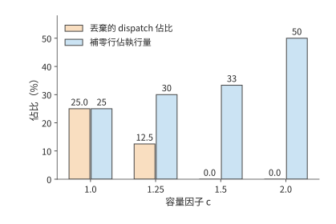

*圖 10-27：Qwen3-235B-A22B 的路由形狀（E=128、k=8、8,192 個 token、一半專家 1.5 倍熱）下，容量因子增大時丟棄的 dispatch 佔比下降、補零行佔比上升。*

翻轉條件由路由分佈決定：上述分佈需要 $c=1.5$ 才把丟棄率降到零；路由越均衡，所需的 $c$ 越接近 1，補零浪費越少。輔助損失（在訓練目標中額外加入的負載平衡項）直接懲罰 dispatch 不均，DeepSeek-V3 的無輔助損失方案按專家負載動態調整路由偏置；兩者都把分佈推向均衡，讓容量因子可以取更小的值。第 2.4 節的專家容量公式假設路由過程中不丟棄任何 token dispatch（$\sum_e t_e=mk_{\mathrm{top}}$），對應的就是容量因子足夠大、丟棄率為零的情形。[^capacity]

均衡專家的計算量以後，資料傳輸仍可能讓卡等待。MoE 的前向 token 交換、反向輸入梯度傳輸和參數梯度歸約會爭用同一條鏈路 (Link)，因此還要利用上一節的通訊時間軸分析。取 72 MiB 的 FP32 專家梯度，由持有該專家的四個資料並行成員做環形 AllReduce，每張卡傳送 $2\times3/4\times72=108$ MiB。每卡配一張 200 Gbit/s 網路卡，每方向 25 GB/s，每次集合呼叫啟動約 0.02 ms。整桶耗時約 4.55 ms，無法在一個 2 ms 空閒時段內完成。若把梯度切成三個 24 MiB 子桶，每桶傳送 36 MiB，約 1.53 ms，可分別在三個這樣的空閒時段內完成；總通訊處理時間卻增加到約 4.59 ms。雖然多啟動了兩次通訊，但每個小桶都能在計算結束前傳完，因此減少了計算之後的等待。換成 400 Gbit/s 網路卡，整桶約需 2.28 ms，仍無法放入 2 ms 空隙，切桶依然必要。[^moe]

專家負載取決於每張卡上的專家接到了多少次 token dispatch。長上下文還有另一層差別：即使 token 總數相同，需要計算的注意力配對數也可能不同。

**相同 token 總數下，序列長度不均如何增加注意力計算量。** 對長度 $s$ 的因果序列，第一個 token 檢視一個 token，第二個檢視兩個，依次相加，得到 $s(s+1)/2$ 個有效注意力配對。兩條長度 4096、4096 的序列合計約 1680 萬對；改為 7168、1024，總 token 數仍為 8192，配對數卻增至約 2620 萬，增加約 56%。注意力配對數隨序列長度近似按平方增長，所以較長的序列增加了總計算量。[^length]

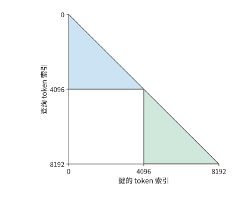

*圖 10-28：兩條 4096 個 token 的序列的因果注意力配對。每個查詢 token 讀取本序列中不晚於自己的位置，形成兩個三角形；兩條序列的注意力計算彼此獨立，總配對數為 16781312。*

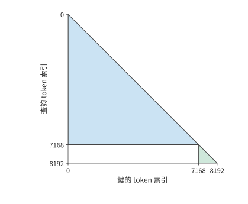

*圖 10-29：相同 8192 個 token 改分為 7168 與 1024，總因果配對數增至 26218496。較長序列對應三角形增加的面積，超過了較短序列對應三角形減少的面積。*

圖 10-29 中，長三角形的額外面積來自真實的注意力關係，無法靠刪除填充 token 消除。打包（把多條較短的序列首尾拼接成一條目標長度的序列）減少填充 token，按長度分組則讓各卡承擔的三角形面積更接近；上下文並行進一步把長序列的計算分到多張卡，並透過交換 K、V 取得其他卡儲存的資料。三者分別改變無效工作、工作分配和資料到達路徑。用相同總 token 數比較方案時，保持長度分佈、可見性掩碼（mask，規定各 token 位置能讀取哪些上下文 token）和損失權重不變，就能將排程收益與任務變化分開。

## 10.4 資料輸入、checkpoint 與故障恢復

第 10.3 節的每步耗時分析假定輸入資料已經準備好，訓練也沒有因故障中斷。持續執行時，資料讀取和預處理要跟上計算速度，還要有 checkpoint 儲存可恢復的訓練狀態。本節把二者加入章首的完成時間：輸入決定卡能否持續工作，恢復決定已經做過的工作有多少需要重做。

### 10.4.1 資料讀取、打包與預取

原始資料經過讀取、解碼或分詞、篩選，再按目標長度拼接成訓練序列，放入主機記憶體緩衝區，最後傳到 GPU。主機緩衝區通常使用鎖頁記憶體，使資料在非同步傳輸期間保持在實體記憶體中。各環節的持續處理速度決定輸入速度，佇列用來緩衝短時間內的速度波動。

GPU 最終收到的資料量小，不意味著此前的準備過程同樣快。25 天預算要求約 46,300 token/s，即每秒約 5.7 條 8,192 個 token 的序列。若以每個編號佔 8 位元組的 int64 格式傳輸 token ID，資料率只有約 0.37 MB/s。設每個 CPU 資料準備程序每秒準備兩條序列，兩個資料準備程序只有四條/s，低於需求；三個資料準備程序達到六條/s。傳輸的資料量雖少，CPU 上的準備過程仍可能拖慢整個叢集。

本章的設計案例為輸入安排四個這樣的資料準備程序，合計八條/s。48 卡輸入就緒時每步約 52.3 s，每步處理 384 條，需求約為 7.3 條/s，低於八條/s。資料準備比訓練消耗更快，短暫變慢之後可以重新補滿預取佇列。設計案例再給每步 0.5 s 的平均輸入等待時間，表示預取沒能消除的等待，32 卡和 48 卡的每步訓練時間由此變為約 78.9 s 和 52.8 s。[^design]

預取佇列讓資料準備與 GPU 計算以不同進度執行。正常訓練時，提前準備的資料可以緩解輸入速度波動造成的等待；儲存 checkpoint 時，則必須分清哪些資料已經用於訓練。假設資料載入器已經為前 108 個 batch 分配了準備任務，而訓練只完成第 100 個，第 101—108 個仍在處理或排隊。若恢復時直接從第 109 個 batch 開始，就會跳過八個 batch。已分配給資料準備程序的 batch 位置反映預取進度，已用於訓練的 batch 位置反映訓練進度；兩者之間的緩衝儲存了尚未訓練的資料。

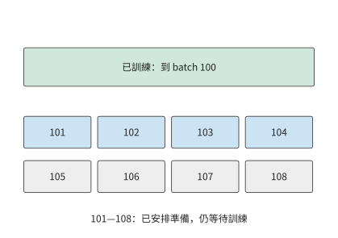

*圖 10-30：訓練已完成 batch 100，預取任務已安排到 108。中間八個 batch 仍需訓練，其中一部分已經準備好，另一部分還在處理。虛線框示意尚在處理的 batch。恢復時應保留這些資料或重新準備它們，從 batch 101 繼續。*

圖 10-30 的佇列只能暫時填補準備速度的下降；若資料長期準備得更慢，佇列終將取空。checkpoint 寫入也受同樣的約束：儲存產生資料的平均速率一旦超過儲存能持續接收的速率，待寫的快照就會越積越多，有限的暫存緩衝終將被佔滿，第 10.4.3 節按具體寫入速率計算這種積壓。對本章的文字任務，輸入端的位元組量很小，瓶頸在 CPU 上的資料準備；checkpoint 的平均寫流量也不大：設計案例採用 1800 s 儲存間隔，約 115 GB 的 checkpoint 平均只有約 64 MB/s。儲存時的停頓在第 10.4.4 節單獨計入。[^supply]

### 10.4.2 可恢復狀態與佈局變換

設訓練剛完成一次參數更新，此時停機。恢復後，要接著訓練，需要知道當時的權重、下一批該讀哪些資料，以及最佳化器已經累積了哪些歷史。僅有權重，可以執行前向推理，卻不足以確定訓練的下一次更新。因此，訓練 checkpoint 要儲存與同一訓練進度對應的全部必要狀態，恢復後才能接著訓練。

本章採用 Adam 的訓練需要儲存權重、一階矩與二階矩、步數、學習率狀態、隨機狀態和下一批資料的組成。學習率控制更新步長，隨機狀態決定後續隨機取樣的序列。權重相同而最佳化器的矩狀態不同，下一次參數更新便可能不同；資料讀取位置相同而打包時剩餘的 token 不同，下一條訓練序列也會改變。第 10.2.2 節的啟用重計算解決的是一次前向、反向之內哪些中間值可以重建；checkpoint 要解決的是中斷之後整個訓練過程如何繼續。

一次訓練迭代結束後，下一批梯度由反向重新產生。此時儲存權重 2 bytes、主權重 4 bytes 和兩份 Adam 狀態 8 bytes，每參數合計 14 bytes。Qwen3-8B 的這部分 checkpoint 約為 115 GB。在一次訓練迭代結束時，把模型狀態和已處理到的資料位置一同儲存，就能確定恢復後該用哪些參數、從哪一批資料繼續訓練。

恢復時還可能需要改變並行佈局，同一份狀態要重新分片。**例：checkpoint 如何從四路張量並行重分片為八路？** 門控投影的權重形狀為 $[12288,4096]$，BF16 大小 96 MiB。沿輸出維四分，每片 3072 行、24 MiB；八分後，每片 1536 行、12 MiB。rank 為 $r$ 的目標卡讀取舊分片 $\lfloor r/2\rfloor$，偶數 rank 取前半，奇數 rank 取後半。全域性行座標將舊佈局和新佈局聯絡起來。

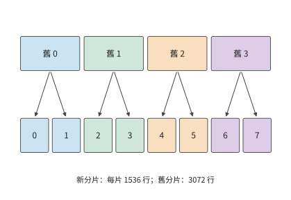

*圖 10-31：橫向位置對應原矩陣的行號，顏色表示舊分片。每份舊分片分成前後兩半後，分別存入兩個新分片。模型權重的內容和順序保持相同，改變的是各卡負責的行範圍；BF16 權重總量始終為 96 MiB。上方「舊」編號標識原分片，下方編號標識重新分配後的分片。*

沿圖 10-31 的箭頭，恢復程式可以找到每個新分片對應的原始行範圍。FP32 主權重與 Adam 兩項狀態也按相同的行範圍拆分，每項為 BF16 權重的兩倍。該矩陣在 checkpoint 中的全部狀態因此為 $96\times(1+2+2+2)=672$ MiB。ByteCheckpoint 一類系統用全域性形狀、偏移和片段長度描述這些張量，使恢復程式按目標佈局讀取需要的範圍。檔案分片是儲存安排，全域性座標標明每個分片屬於哪個張量、位於哪些行列。[^checkpoint]

權重可以憑原矩陣的行號重新拼接，訓練序列也需要保留足夠的資訊，才能重新組成同樣的輸入。圖 10-30 中已經準備好但尚未用於訓練的資料，同樣需要在恢復時重新定位。除了 batch 位置，還要保留資料預處理的中間結果。

打包器若保留 2,000 個 token，下一份資料提供 6,192 個，兩者組成下一條 8,192 個 token 的序列。如果丟失這 2,000 個 token，就只能從後續資料中取出額外的 token 來補齊下一條序列，從而改變它的字首、注意力關係和標籤。將已用於訓練的資料位置、尚未組成完整序列的 token 與參數更新結果一起儲存，恢復後才能繼續構造同一批資料。[^resume]

### 10.4.3 同步、非同步儲存與頻寬競爭

本節討論儲存過程如何與訓練同時進行，以及一份快照何時才真正可用。

同步儲存先生成內容固定的快照，寫入完成後繼續訓練。非同步儲存將快照複製到獨立的記憶體緩衝區，再由後臺寫入，讓訓練較早恢復執行。訓練恢復執行時，快照可能還沒有寫完；只有寫入並提交完成後，這份快照才能用於故障恢復。

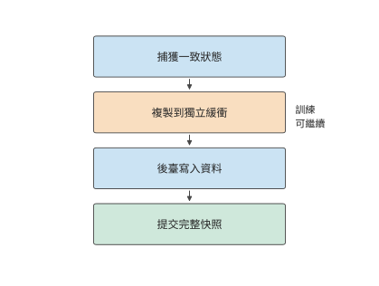

*圖 10-32：捕獲一致的訓練狀態，複製到獨立緩衝後允許訓練繼續；後臺寫完資料並提交完整快照後，恢復程式才使用這份 checkpoint。箭頭表示先後依賴。*

**例：checkpoint 上傳速度如何決定故障後的重做量？** 取每份 112 GB 的快照。DGX SuperPOD 參考架構按工作負載給出儲存效能檔次，NLP 訓練對應 Good 檔，一個 SU（32 臺 DGX 組成的擴充套件單元）的儲存合計寫入為 7 GB/s；按此速率，一份快照要寫 16 s。每 10 s 產生一份時，待寫入資料的產生速率為 11.2 GB/s，佇列持續增長。改為每 20 s 一份，平均需求降到 5.6 GB/s，儲存能在下一份到達前寫完上一份。

在第 20、40 s 捕獲兩份快照，各花 0.5 s 複製到緩衝區後上傳，完成時刻為 36.5、56.5 s。若第 50 s 故障，第二份仍在上傳，只能恢復到第 20 s，重做 30 s。換用 Better 檔的 20 GB/s 合計寫入，每份只需 5.6 s，兩份分別在 26.1、46.1 s 完成；同一故障可恢復到第 40 s，只重做 10 s。

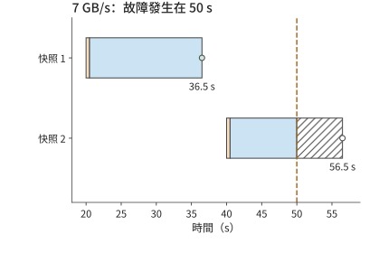

*圖 10-33：兩份 112 GB 快照以 7 GB/s 寫入，各先花 0.5 s 複製到緩衝（橙色），隨後上傳（藍色）。50 s 故障時第一份已提交，第二份尚未提交；斜線為無故障時剩餘上傳，空心點為原定提交時刻。*

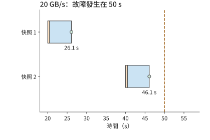

*圖 10-34：相同快照以 20 GB/s 寫入，於 26.1、46.1 s 提交。50 s 故障時可以恢復到 40 s 的訓練狀態，只需重做 10 s。*

兩種方案的前臺暫停都是兩次 0.5 s，合計 1 s。寫入更快，故障後就能恢復到更近的訓練進度，少重做 20 s。非同步儲存的完成點因而直接影響長期進展，後臺寫入速度影響故障後的重做量，儲存時暫停訓練的時長則會延長正常執行時間。

寫入資料檔案之外，實際系統還要提交描述完整快照的後設資料。一組 CPU 實驗中，儲存介面（API）的呼叫約 7 ms 就返回，恢復後設資料約 48 ms 才提交；提交前終止程序，恢復程式選擇上一份完整的 checkpoint。資料檔案與提交記錄共同構成可用快照，恢復程式據此判斷哪一份 checkpoint 已經完整儲存。[^fault]

### 10.4.4 故障規模、儲存週期與有效訓練進度

圖 10-33 固定了兩次儲存的時刻，比較寫入速度的影響。還可以改變儲存間隔：間隔短，故障時離上一份快照更近；間隔長，正常訓練時需要暫停儲存的次數更少。這兩項代價方向相反，因此存在一個折中點。

設每次同步儲存耗時 $c$，儲存之間完成 $\tau$ 秒有用訓練，作業故障率為 $\lambda$，恢復耗時為 $r$。假設故障發生頻率較低且彼此獨立，在一階模型下，單位有用訓練時間的附加成本為

$$
L(\tau)=\frac{c}{\tau}+\lambda\frac{\tau}{2}+\lambda r.
$$

第一項來自每隔 $\tau$ 儲存一次。故障落在兩次儲存之間的任意位置，平均丟失半個間隔，得到第二項。第三項是單位有用訓練時間內的預期恢復次數乘以每次恢復時間。前兩項一減一增，最優點滿足

$$
-\frac{c}{\tau^2}+\frac{\lambda}{2}=0,
\qquad \tau^*=\sqrt{\frac{2c}{\lambda}}.
$$

**例：卡數與故障率如何決定 checkpoint 儲存間隔？** Meta 統計了研究叢集上的訓練作業：1024 卡作業平均 7.9 小時中斷一次，而且中斷率與卡數成正比，相當於每卡平均約 337 天出一次故障。任一卡故障均中斷作業。約 115 GB 的 checkpoint 以 7 GB/s 儲存，$c\approx16.4$ s。設恢復需 120 s，代入得到最優間隔約 965 s，即約 16 分鐘。[^interval]

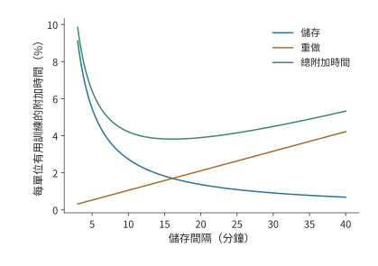

*圖 10-35：藍線為儲存耗時佔比，橙線為故障重做耗時佔比，綠線為兩者加上恢復耗時後的合計。使用 1024 卡作業平均 7.9 小時中斷一次、儲存約 16.4 s 和恢復 120 s 的一階模型。最低點出現在兩項隨間隔變化的代價相互平衡處。*

圖 10-35 中的最低點較平緩，配置時可以選擇附近便於使用的間隔。下表比較五、十五和三十分鐘，觀察偏離最低點後增加的是哪一項成本。

| 有用訓練間隔 | 儲存成本 | 重做成本 | 恢復成本 | 合計 |
|---|---:|---:|---:|---:|
| 300 s | 5.5% | 0.5% | 0.4% | 6.4% |
| 900 s | 1.8% | 1.6% | 0.4% | 3.8% |
| 1800 s | 0.9% | 3.2% | 0.4% | 4.5% |

將儲存間隔從五分鐘延長到十五分鐘，節省的儲存時間多於新增的重做時間；繼續延長到三十分鐘，新增的重做時間就超過了節省的儲存時間。表中合計由未經四捨五入的數值計算。卡數翻倍會使故障率翻倍，最優間隔縮短為原來的 $1/\sqrt2$；儲存速度翻倍也使最優間隔按同樣比例縮短，因為每次儲存耗時更短。

本章設計案例使用的卡數較少，沿用每卡平均約 337 天故障一次（單卡平均故障間隔，MTBF）、恢復耗時 120 s 和儲存耗時約 16.4 s 的條件，取有用訓練間隔 1800 s。32 卡的儲存、重做與恢復合計約增加 1.02% 時間，48 卡約增加 1.08%。48 卡方案被卡故障中斷的機率更高，但附加比例只多約 0.06 個百分點，遠小於縮短單卡計算時間帶來的收益。容量、每步訓練時間和長期附加成本至此齊備，第 10.6 節將彙總計算完成時間。

大規模訓練中，即使一次中斷只耽誤兩三個小時，整組資源的費用也可能達到數萬美元。儲存週期決定一次故障需要重做多少工作，系統的可靠性則決定這樣的損失會發生多少次。

**例：一次訓練中斷會浪費多少錢？** 小米的 MiMo-V2.6 是前沿實驗室中首次直播 RL 過程的。公開執行看板顯示，Pro 與 Flash 兩種尺寸的模型 RL 後訓練分別花費約 260 萬和 90 萬美元，即每小時約 2.06 萬和 1.03 萬美元。

圖 10-36 按日誌畫出兩次執行。Pro 共重啟 14 次，中斷區間累計約 30.1 h（佔總執行時間的 23.6%），摺合約 61.9 萬美元。Pro 第五次重啟前，自上一步完成起已過去 2.76 h，對應約 5.67 萬美元；第六次和第八次分別為 2.63 h 與 2.95 h，對應約 5.41 萬與 6.07 萬美元。這些執行的重啟主要涉及三方面：視訊記憶體雙位元錯誤等硬體故障；容器崩潰、評分服務網路不通等服務故障；以及記憶體不足，例如推理時 KV 快取耗盡、訓練時專家負載不均導致視訊記憶體溢位，或序列打包時主機記憶體不足。此外，一次 infra 錯誤沒有及時被檢出，直到完成第 17 步後才從第 15 步重新訓練。此前第 16、17 步花掉的約 4 h 隨之作廢。[^rl-interrupt]

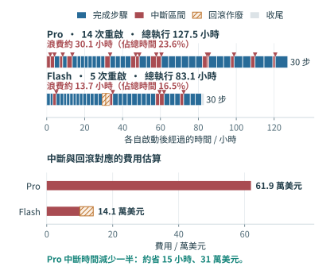

*圖 10-36：兩次執行分別從啟動時刻計時。藍色為完成步驟的區間，紅色為上一個事件至重啟的區間，三角標記重啟；斜線為 Flash 回滾後作廢的兩步。浪費時間按紅色與斜線區間合計估算，括號內為其佔總執行時間的比例；下方按公開費率換算費用。節省金額假設訓練工作不變，減少的中斷時間等量縮短執行。*

若能將 Pro 的中斷總耗時減少一半，同樣的訓練工作就能少用約 15 h，按上述費率節省約 31 萬美元。這可以來自兩方面：一是排除反覆觸發的故障，例如，MiMo 團隊曾調整訓練並行方式，降低啟用視訊記憶體，以容納專家負載峰值。二是更早發現故障、更快恢復，並用較近的 checkpoint 減少重做，縮短恢復時間 $r$ 或丟失的訓練間隔。

### 10.4.5 掉隊者與慢節點

上一節的模型把故障當作中斷作業的事件。還有一類更頻繁的退化不會中斷作業：某張卡在某一步算得慢。同步資料並行的每一步要等最慢的那張卡算完，這張拖慢整步的卡稱為**掉隊者**（straggler），步時間因此由各卡的最大值而不是均值決定。設各卡計算時間獨立同分布，均值為 $\mu$、標準差為 $\sigma$，$N$ 張卡時步時間的計算部分是 $N$ 個樣本的最大值。取 $\mu=52.2$ s（48 卡方案的單卡計算時間）與每步 0.58 s 的通訊與輸入等待，$\sigma$ 分別取均值的 2%（1.04 s）與 5%（2.61 s）。[^straggler]

$N$ 個獨立正態樣本最大值的期望為 $\mu$ 加上若干倍 $\sigma$：$N=8,48,1024$ 時分別約為 1.42、2.23、3.25 倍。代入即得每步的期望耗時：

| 卡數 | $E[\max]-\mu$（倍 $\sigma$） | 每步，$\sigma=2\%$ / s | 每步，$\sigma=5\%$ / s |
|---|---:|---:|---:|
| 8 | 1.42 | 54.3 | 56.5 |
| 48 | 2.23 | 55.1 | 58.6 |
| 1024 | 3.25 | 56.2 | 61.3 |

無波動時每步約為 $52.2+0.58\approx52.8$ s。卡數越多，最大值的期望越大：48 卡、$\sigma=5\%$ 時每步多約 5.8 s，佔去第 10.6 節約 14.4 s 餘量的四成；1024 卡時多約 8.5 s。慢卡可以從通訊等待中檢測出來：每張卡在梯度桶 AllReduce 上的等待，等於步結束時刻減去自己的計算結束時刻；對計算耗時恰為均值的卡，這段等待的期望正是 $E[\max]-\mu$。[^straggler]

發現慢卡以後有三種響應：等待、重分配和驅逐。**等待**：本步按慢卡時間結束。一張慢到 $\mu+3\sigma$ 的卡讓其餘各卡多等的時間，取決於其餘 $N-1$ 張卡的最大值本來有多大：$\sigma=2\%$ 時，8 卡多等約 $1.65\sigma$（1.72 s），48 卡多等約 $0.78\sigma$（0.81 s），1024 卡時其餘卡的最大值本身已超過 $\mu+3\sigma$，多等的時間為零。**重分配**：把慢卡的工作均勻攤給其餘 $N-1$ 張卡，均值變為 $\mu N/(N-1)$。仍取 $\sigma=2\%$、不計遷移成本，48 卡每步約 56.2 s，8 卡升到約 61.6 s，都高於同一 $\sigma$ 下等待的期望步時間 55.1 s 與 54.3 s：攤派讓每張卡多做 $1/(N-1)$ 的工作，這份增量超過了一張慢卡帶來的等待，卡越少差距越大。**驅逐**：把慢卡移出作業，從上一個 checkpoint 重啟，代價為期望丟失工作 $\tau/2$ 加恢復時間 $r$。這裡取比設計案例的 1800 s 更短的儲存間隔 $\tau=600$ s，$r=120$ s，代價為 420 s，按 48 卡方案每步 52.8 s 計約為八步。一次 $\mu+3\sigma$ 的抖動只損失幾秒，只有慢卡持續多步時驅逐才值得。實際叢集中確實存在慢卡：MegaScale 報告約 0.5% 的機器明顯變慢；第 10.4.4 節的 Meta 叢集統計則給出作業規模與中斷的關係——1024 卡作業的平均無故障時間為 7.9 小時，8 卡作業為 47.7 天。[^straggler]

除硬體故障外，還有一種事件需要回滾 checkpoint：第 10.1.2 節的損失尖峰。損失尖峰不損壞硬體，處理方式卻相同，都是丟棄當前參數、回到上一份快照，對儲存週期的影響也與硬體故障相同。把損失尖峰導致的回滾看作整個作業同時受到的衝擊，平均每隔 $1/\lambda_{\mathrm{spike}}$ 發生一次，上一節的一階模型修正為

$$
L(\tau)=\frac{c}{\tau}+(\lambda_{\mathrm{hw}}+\lambda_{\mathrm{spike}})\left(\frac{\tau}{2}+r\right),
\qquad \tau^*=\sqrt{\frac{2c}{\lambda_{\mathrm{hw}}+\lambda_{\mathrm{spike}}}}.
$$

沿用 48 卡的硬體故障率（每卡 MTBF 約 337 天），設損失尖峰平均七天導致一次回滾：同樣取 $\tau=600$ s 時，附加比例從 2.80% 升到 2.87%，最優儲存週期從約 4,458 s 縮到約 3,150 s。本章設計案例的 1800 s 間隔處，附加比例從 1.08% 變為約 1.25%，完成時間增加約 0.03 天，不改變第 10.6 節的方案選擇。翻轉條件由兩個發生率的相對大小給出：尖峰越頻繁，最優週期越短，$\lambda_{\mathrm{spike}}\gg\lambda_{\mathrm{hw}}$ 時儲存週期幾乎只由數值穩定性決定；回滾間隔以月計時，對 1.08% 的附加比例幾乎沒有影響。[^straggler]

## 10.5 強化學習訓練

前四節假定訓練資料已經給定。RL 讓模型參與產生下一批資料：模型生成軌跡，系統計算獎勵或驗證結果，再將軌跡用於訓練，更新後的權重又改變下一輪生成。系統由處理固定資料的訓練流水變成反饋迴圈，新的問題集中在各階段的處理速度、切換時的狀態重疊，以及樣本究竟由哪一版策略產生。生成軌跡的推理端與計算損失的訓練端還必須對同一條軌跡給出可對齊的機率，這就是本節的**訓推一致性**。訓推一致性直接影響參數更新是否遵循演算法預期，也約束階段加速與非同步執行的收益。

### 10.5.1 一輪迴答生成、驗證與參數更新

一輪反饋迴圈的完成過程如下。從四條提示詞（prompt）出發，每題生成兩條回答，得到八條軌跡。獎勵描述這些回答的結果，優勢值衡量回答比所選基準好多少，用來確定調整回答機率的方向和幅度。訓練端按有效 token 構造損失並完成一次參數更新。新權重交給生成端後，下一輪樣本來自更新後的策略。生成、獎勵與學習分別使用不同形式的資料，樣本標識將三者連線起來。

這裡的資料來源與通常採用固定資料集的 SFT 不同。SFT 在給定答案的真實字首上預測下一個 token，即教師強制；部署時模型則根據自己生成的字首繼續回答。一旦前面生成錯誤，後續就可能進入訓練資料較少覆蓋的上下文，誤差隨生成累積。這種訓練與使用時的字首分佈偏移，是固定資料 SFT 的侷限之一。梯度仍可以正確對應當前損失，但訓練覆蓋的情境與模型實際遇到的情境不同。

針對這種字首分佈偏移，OPD 讓當前學生模型自己生成軌跡，再由教師針對學生實際生成的字首提供監督，例如下一 token 的機率分佈。學生因而能在自己容易出錯的位置學習，減少字首分佈偏移；教師的逐 token 反饋也提供了比單個終局獎勵更細的學習訊號。DeepSeek V4 用多教師 OPD 將領域專家的能力合入統一模型，第 3 章已把教師前向列為一項獨立的計算工作。[^opd]

與固定資料的 SFT 相比，OPD 的潛在優勢在於：達到目標能力所需的學習樣本或更新次數可能減少。它同時增加學生線上生成、教師前向與權重同步的成本，是否減少總 GPU 小時或完成時間仍要實測。SFT 描述的是監督目標，離線（offline）描述的是資料是否預先固定；也可以線上收集資料後使用監督損失。線上（online）表示資料隨訓練過程持續產生，on-policy 則進一步要求取樣分佈與所最佳化的策略一致。非同步的線上 RL 可能使用滯後的策略，OPD 也會遇到生成引擎與訓練引擎的計算差異。因此，線上取樣用於緩解資料分佈偏移，而訓推一致性還需要對齊生成與訓練兩端的計算過程。

回到本節開頭那一輪的八條軌跡，考察訓練端如何按有效 token 構造損失。第 10.3.1 節的八條回答例子來自一次小模型實驗的回答長度：回答中的有效 token 共 20 個，包含表示序列結束的 EOS token；輸入計算的有效 token 共 366。提示詞和回答都參與前向計算，損失則按選中的回答 token 歸一化。因此，生成長度影響計算成本；損失掩碼（mask）標明每個 token 是否計入損失，決定哪些 token 參與梯度計算。兩者的作用不同。[^verl]

損失之外，同一提示詞下的相對獎勵還決定優勢。例如兩條回答獎勵均為 1，減去組內均值後都為零；獎勵變為 1、0，中心化後為 0.5、−0.5，策略才獲得區分兩條回答的方向。系統即使完成了前向、反向和最佳化器呼叫，也可能遇到第一種優勢全為零的 batch。統計訓練吞吐量時，應計算每秒實際用於訓練的軌跡或 token 數；模型能力是否提高，則用固定的評估任務檢驗。

> **案例：參數發生變化，模型能力為何沒有提高？** 一次固定的小模型實驗用強化學習訓練框架 verl 和推論引擎 vLLM 協作執行：算術題的精確匹配獎勵讓同組回答得到相同的獎勵，優勢和策略梯度都為零，參數變化只來自 AdamW 的權重衰減。AdamW 在 Adam 的梯度更新之外，單獨按比例縮小權重；即使當前策略梯度為零，這一步也能改變參數。改用固定符號獎勵後，兩步訓練都出現了非零梯度與權重更新，但算術驗證只有 2/4 正確。獎勵構造決定學習方向，系統執行負責把這一方向一致地應用到參數。[^verl]

### 10.5.2 各階段的資源分配與權重同步

明確了樣本如何形成梯度以後，才能討論每秒能訓練多少樣本。RL 的反饋階段可能執行規則驗證或獎勵模型（為回答打分的模型），OPD 則需要教師給出監督；兩者都應按實際反饋工作的處理能力分配資源。生成、驗證和學習像前後相接的三道工序，前一道做得更快，只有後一道能夠消化，才會增加最終產出。先把三者的處理能力換算成同一種工作單位。設三者分別為 $r_g,r_v,r_l$，驗證後符合策略版本要求的比例為 $q$，在獨立資源上穩定流水執行時，每秒可用於訓練的樣本數上限為

$$
r_{\mathrm{effective}}=\min\left(r_l,q\min(r_g,r_v)\right).
$$

**例：RL 生成、驗證與學習三個階段中，應優先擴容哪一個？** 生成每秒提供 12 條等長軌跡，驗證處理六條，學習階段處理八條；驗證後四分之一因版本過舊被丟棄。每秒進入學習的只有 $6\times0.75=4.5$ 條。生成翻倍到 24 條/s，驗證瓶頸仍將進入學習的樣本限制在 4.5 條/s；驗證翻倍到 12 條/s，每秒可送往訓練端的軌跡達到九條，此時訓練端每秒只能處理八條，成為整個管線 (Pipeline)的瓶頸。因此，應把新增資源分配給當前最慢的階段；該階段加速後，再判斷瓶頸轉移到了哪裡。

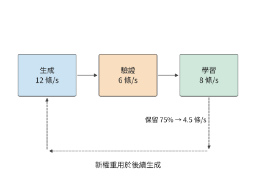

*圖 10-37：三階段分別最多處理 12、6、8 條等長軌跡/s。驗證後保留 75%，所以只有 4.5 條/s 進入學習。返回箭頭表示學習產生的新權重影響後續生成；其同步耗時在後面的階段切換與非同步算例中展開。*

圖 10-37 先把三道工序畫在各自獨立的資源上。若改用同一組卡輪流執行，就能減少所需的卡數，但生成和學習之間要切換整套視訊記憶體裡的資料。

**共享加速器**讓同一組卡輪流訓練和生成，節省重複資源；**獨立部署**讓兩側獨立執行，獲得重疊機會，但要在兩組卡之間傳送權重。共享加速器的關鍵成本發生在切換：舊狀態尚未釋放，新狀態已經開始載入，兩個階段各自執行時視訊記憶體都足夠，切換時卻可能因兩套資料同時佔用視訊記憶體而超出容量。

設共享的卡為 H100 SXM，標稱 80 GB，約合 74.5 GiB。訓練狀態佔用視訊記憶體 40 GiB，生成需要約 15.3 GiB BF16 權重與 24 GiB KV 快取池，另有兩階段共用開銷 4 GiB。訓練獨佔時 44 GiB，生成獨佔時約 43.3 GiB，都低於 74.5 GiB。先恢復生成權重和 KV，再釋放訓練狀態，峰值為 $40+15.3+24+4\approx83.3$ GiB，超出一張 H100 的容量。

改變次序，先載入生成所需的權重，暫不分配 KV，峰值為 $40+15.3+4\approx59.3$ GiB。隨後釋放 40 GiB 訓練狀態，視訊記憶體佔用降為約 19.3 GiB，再分配 KV，進入約 43.3 GiB 的生成狀態。兩條路徑最終狀態相同，峰值差 24 GiB，恰好是一份 KV 池。[^handoff]

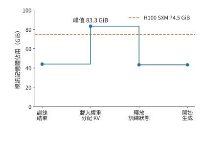

*圖 10-38：先載入生成權重並分配 KV 池，再釋放訓練狀態，峰值約為 83.3 GiB，超過 H100 SXM 的 74.5 GiB。橫軸按操作順序排列。*

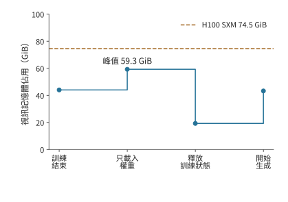

*圖 10-39：先載入生成權重，再釋放訓練狀態，最後分配 KV 池。峰值降為約 59.3 GiB；兩圖共用 74.5 GiB 容量線和同一縱軸。*

獨立部署的代價則由權重傳送範圍決定。Qwen3-235B-A22B 的 BF16 專家權重為 423 GiB，採用 16 路專家並行（EP16）時，每個接收方只需要約 26.4 GiB。逐一向 16 個接收方傳送完整專家集合，共傳送 $16\times423=6768$ GiB；按各自的分片傳送，合計為 423 GiB。先確定每個接收方需要的參數分片，再組織分發，可以同時減少接收緩衝和傳送方的傳送量。

這裡再次用到了本章的兩種分析方法：共享加速器時要分析張量的生命週期，獨立部署時要分析資料傳輸和各階段的處理時間。階段獨立以後，還會產生策略版本差異，下一小節將分析這種版本差異如何影響可用於訓練的樣本數量。

權重同步中還有一類生命週期不同的權重：第 4.7.3 節的固定權重加速器可以執行 RL 流程中權重長期不變的模型。例如，演算法採用固定參考模型時，其權重能夠留在專用儲存中反覆讀取；持續更新的策略模型則使用可寫權重儲存，並將新版本釋出給生成端。圖 10-40 按這兩種生命週期畫出權重路徑。

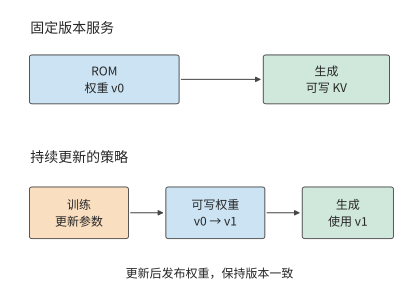

*圖 10-40：固定版本服務與策略訓練的權重生命週期。上方 ROM 重複提供同一版本；下方訓練產生新版本並行布給生成端。KV 寫入與權重更新使用不同的資料通路。*

### 10.5.3 非同步訓練、策略版本與長軌跡恢復

第 10.5.2 節的獨立部署進一步允許不同 batch 交錯進行：學習端處理上一批樣本時，生成端已經開始生成下一批。同步迴圈則等待學習和權重同步完成，再產生下一批樣本。非同步迴圈讓生成與學習重疊，生成端可能仍在使用舊權重。為計算樣本對當前參數更新的貢獻，需要保留實際取樣策略的機率。

權重更新後，模型給出的策略隨之變化。下面沿樣本流轉順序區分三個策略版本。

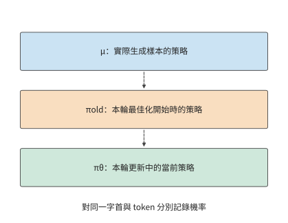

*圖 10-41：μ 產生訓練樣本，πold 標識本輪最佳化的起點，πθ 隨本輪更新變化。虛線表示版本演進順序。三個機率必須針對同一字首與同一 token 計算。*

令實際行為分佈為 $\mu$，本輪最佳化的起點策略為 $\pi_{\mathrm{old}}$，當前最佳化策略為 $\pi_\theta$。起點策略隨最佳化輪次更新，用 KL 散度做正則時所用的參考模型則保持固定。對同一 token 和字首，在三個機率有定義且分母非零的位置，機率比滿足

$$
\frac{\pi_\theta}{\mu}
=\frac{\pi_\theta}{\pi_{\mathrm{old}}}
\frac{\pi_{\mathrm{old}}}{\mu}.
$$

右邊第一項描述本輪參數最佳化帶來的機率變化，第二項描述實際取樣分佈與本輪起點策略之間的差異，其中既可能有策略版本滯後，也可能有采樣配置或跨引擎計算差異。若行為策略和當前策略對該 token 給出的對數機率（logprob）都為 $-3$，總比值為 1；若誤用重新計算得到的對數機率代替行為策略原先記錄的值，將它寫成 $-3.25$，比值就變為 $\exp(0.25)\approx1.28$。參數沒有變化，樣本權重卻增加了約 28%。保留行為機率，訓練端才能區分策略變化與計算差異。[^identity]

即使每輪都先同步權重，第二項也未必等於 1。生成端通常逐 token decode 並讀取 KV 快取，訓練端則把整段軌跡並行輸入，重算各 token 位置的機率後再反向傳播。不同的注意力實現、歸約次序、batch 形狀、權重或 KV 精度，都可能讓相同權重、相同字首下的 logprob 不同。第 5.2.4 節已經測量過其中一項：同一行輸入按不同段數做歸約，平方和相差 166 個 ULP，而切成幾段又取決於當時的 batch 大小。兩端最先出現差異的是前向計算；反向會把訓練前向構造出的損失差異傳入梯度。MoE 的離散路由還會放大這種差異，下一小節將展開。

第二項中還有一部分來自取樣配置：行為機率按實際取樣規則計算。溫度縮放、top-k 或 top-p 截斷會改變模型原始 Softmax 分佈，因此應儲存變換後的機率及取樣配置。訓練端用對應的分詞、對話模板、位置編號、注意力掩碼和 EOS／截斷位置重建輸入，才能對同一事件計算機率比。

在近端策略最佳化（PPO）一類更新中，機率比決定優勢對梯度的權重，也參與裁剪判斷：機率比偏離 1 超過設定範圍時，裁剪截斷它對梯度的貢獻。若把實現差異誤認為參數更新，樣本的貢獻就可能被錯誤地放大或壓低，也可能錯誤地觸發裁剪；若使用序列機率比，各 token 位置的 logprob 之差還會相加。因此，較長軌跡會積累更多機率偏差，使更新更容易波動。[^identity]

重要性加權用機率比調整已取樣事件的貢獻，因此取樣分佈必須覆蓋目標事件。截斷取樣排除的 token 無法透過已有樣本的機率比補回；分佈差異過大時，權重方差也會增大。裁剪可以限制極端權重，但會引入偏差，而且分別裁剪兩個因子與裁剪總比值會產生不同的損失。非同步執行會增加策略版本的時間差，下面將可用樣本比例與執行週期一起計入收益。

**例：非同步流水能承受多高的過期樣本丟棄率？** 每批生成 40 s、學習 16 s、阻塞兩側的權重同步 4 s，同步週期為 60 s。設生成和學習使用獨立資源，權重同步仍獨佔 4 s，則非同步穩態週期為 $\max(40,16)+4=44$ s。

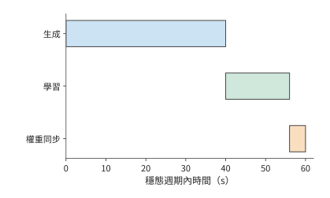

*圖 10-42：同步迴圈依次生成本批樣本、學習本批樣本、同步權重，分別用時 40、16、4 s，共 60 s。*

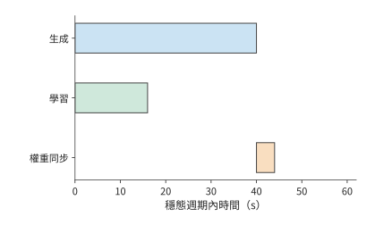

*圖 10-43：穩態中生成下一批與學習上一批在獨立資源上重疊；兩者完成後同步權重，週期為 44 s。橙色同步階段阻塞兩側。*

從圖 10-42 的同步執行改為圖 10-43 的非同步執行後，減少的是學習端與生成端輪流等待的時間。但生成得更早也意味著樣本可能使用較舊的權重，因此還要扣除被丟棄的樣本。

若每批原有 $B$ 條等效軌跡，非同步執行後，其中比例為 $q$ 的軌跡保留下來用於訓練，則同步和非同步執行的有效樣本吞吐量分別為 $B/60$、$qB/44$。非同步更快要求

$$
q>44/60=11/15\approx73.3\%.
$$

當 $q=0.8$ 時，有效樣本吞吐量提高約 9%；當 $q=0.7$ 時，雖然每批更早結束，有效樣本吞吐量反而減少約 5%。因此，計算非同步執行的收益時，還要減去因策略版本過舊而被丟棄的樣本。

圖中的生成階段畫成了一段連續的工作。軌跡越長，這一段越容易跨過參數更新或遇到中斷，於是除了篩選完成的樣本，還要考慮尚未完成的軌跡如何繼續。長軌跡也會延長生成樣本與使用樣本訓練之間的時間差。KV 是給定權重對字首執行的結果：使用相同權重恢復時，可繼續使用已儲存的 KV，換權重後則需重新執行字首來生成對應 KV。Qwen3-8B 的 8K BF16 KV 佔 1.125 GiB，儲存和取回 KV 快取需要儲存空間與傳輸時間，重建 KV 快取則需要重新執行 prefill 計算。恢復方案據此比較取回時間與重建時間。

若總是丟棄中斷軌跡並重新取樣，長軌跡因執行時間更長而更容易被丟棄。設生成期間的中斷率為 $\lambda$，持續 $t$ 的軌跡能不受中斷、完整生成的機率為 $e^{-\lambda t}$；隨著 $t$ 增長，進入學習的資料比例下降。逐 token 記錄生成進度和策略版本，可以在恢復後繼續生成同一條軌跡，減少這種由系統中斷引入的長度偏移。跨角色資源恢復在下一章展開。

讓訓練與部署使用同一條路徑的做法，在實際模型中已經出現。DeepSeek V4.1 把部署時的稀疏訪問與恢復方式納入訓練。稀疏注意力從訓練之初就使用 64K 序列，後訓練加入層級候選限制，使訓練和推理使用相同搜尋域；量化感知訓練（訓練時模擬低精度量化的誤差）讓模型適應 FP4 的主 KV；只重放有限長度的輸入來重建解碼器 SWA 狀態，這一過程也在後訓練中模擬。模型由此學習使用部署路徑實際提供的表示與區域性狀態。[^v41-case]

### 10.5.4 專家路由重放與訓推一致性

MoE 把第 10.5.3 節的數值差異進一步變成離散的路徑差異：即使權重相同，生成端與訓練端的數值計算差異也可能改變專家選擇。由於專家選擇是離散的，小幅數值變化就可能讓 token 進入另一條計算路徑。以選擇分數最高的兩個專家（top-2）為例，前三個專家分數為 0.500、0.301、0.300 時，選擇專家 1、2；第三個分數因計算次序變為 0.302，便改為專家 1、3。很小的分數變化就可能讓計算改用另一個專家的權重矩陣，影響可以沿後續層繼續傳播。

**路由重放**（Routing Replay）記錄生成時選中的邏輯專家 ID，訓練時按這些 ID 選擇專家，再用當前權重計算路由分數、專家輸出和梯度。樣本、token 位置和層號共同定位這一份記錄。這樣，生成與訓練經過相同的離散專家路徑，而數值計算繼續反映當前參數。

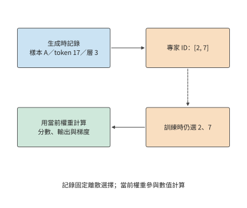

*圖 10-44：離散專家 ID 連線生成端與訓練端，當前權重繼續參與數值計算。示意記錄為樣本 A、token 17、層 3 的 top-2 選擇；虛線表示 ID 重放，實線表示當前計算資料流。*

先計算這份記錄佔多大空間。Qwen3-30B-A3B 的 48 層各記錄分數最高的八個專家（top-8）的編號。對 8,192 個 token，以每個整數佔 2 位元組的無符號整數格式 uint16 儲存每個專家 ID，大小為

$$
8192\times48\times8\times2=6\ \mathrm{MiB}.
$$

使用每個整數佔 4 位元組的 int32 格式則為 12 MiB。記錄還要隨 token 一起移動：序列打包改變 token 的位置，上下文切分改變 token 所在的卡，重計算再次讀取同一層的記錄。讓 ID 與 token 的原始位置共同經過這些變換，訓練端才能選中原先那組專家。[^replay]

> **案例：路由重放對機率誤差、訓練耗時與獎勵的影響。** NVIDIA 公佈的路由重放（R3，即 Rollout Routing Replay）驗證報告有四組開關對照，各訓練 100 步，開啟後日志中記錄的對數機率誤差中位數均下降，每步總耗時中位數略長，訓練獎勵沒有一致提高。重放減少了路由差異，但儲存記錄和執行重放也增加了耗時。比較兩種方案時，分別觀察機率誤差、訓練時間和固定評估任務上的表現。[^replay]

同一份權重、同一批 token 下，生成端與訓練端的 logprob 差異反映計算路徑和取樣定義的影響；MoE 的專家 ID 則標明離散路由是否一致。數值是否一致、取樣策略滯後當前策略多少，由此共同影響有效訓練樣本數。

RL 把生成、環境驗證和參數更新組織成一個完整的反饋過程。生成端提供取樣機率與專家選擇，訓練端據此組織更新，資源排程再安排各階段重疊。貫通這些資訊，可以同時最佳化資料交接、執行一致性與資源利用。本節的非同步週期和路由重放例子分別量化了節省的等待與增加的記錄成本；整個反饋迴圈最終要用有效樣本和訓練進展評價。

## 10.6 從系統方案到完成期限與硬體選擇

### 10.6.1 彙總容量、每步耗時、停頓與恢復

下面綜合計算章首訓練任務的完成時間。兩套方案都處理 100B token，每步 384 條 8,192 個 token 的序列，共 31,790 次訓練迭代。設每步訓練時間 $t_s$ 已包含單卡計算、通訊等待與輸入等待，儲存與恢復的附加時間比例為 $L$，計劃性停頓為 $T_0$，則本章的一階完成時間模型為

$$
T_{\mathrm{finish}}=T_0+\left\lceil\frac{D}{b}\right\rceil t_s(1+L).
$$

各項來自本章不同層次的分析：分析張量的生命週期，可以確認視訊記憶體是否足夠；分析關鍵路徑，可以求得 $t_s$；checkpoint 模型給出 $L$；計劃性停頓為 $T_0=5$ 天。將這些結果彙總，就能比較兩套方案的完成時間；表中合計由未經四捨五入的數值計算。[^design]

| 設計項 | 32 卡方案 | 48 卡方案 |
|---|---:|---:|
| 八卡主機數 | 4 | 6 |
| 全組 ZeRO-3，每卡單序列累積次數 | 12 | 8 |
| 每卡預計視訊記憶體佔用 / GiB | 13.8 | 12.5 |
| 每卡可用視訊記憶體 / GiB | 22 | 22 |
| 每步單卡計算 / s | 78.3 | 52.2 |
| 每步 ZeRO-3 鏈路 (Link)時間（PCIe 4.0 x16）/ s | 17.9 | 12.0 |
| 每步通訊等待 / s | 0.08 | 0.08 |
| 每步等待輸入資料的時間 / s | 0.5 | 0.5 |
| 每步訓練時間（含 0.5 s 輸入等待）/ s | 78.9 | 52.8 |
| 儲存、重做與恢復附加時間 | 1.02% | 1.08% |
| 基礎訓練時間 / 天 | 29.0 | 19.4 |
| 加入儲存恢復和 5 天預留 / 天 | 34.3 | 24.6 |

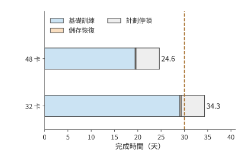

*圖 10-45：每條橫條依次累計基礎訓練時間、儲存與故障恢復的附加時間，以及預留的 5 天計劃性停頓。基礎訓練時間已經包括通訊和輸入等待；橙色小段為 checkpoint 模型得到的額外耗時。兩套方案使用相同任務和全域性 batch，虛線標出 30 天期限。*

圖 10-45 中，兩套方案的計劃停頓相同，儲存與恢復也只佔很小一段。主要差別在藍色的基礎訓練時間：48 卡把 micro-batch 分給更多的卡並行處理，顯著縮短了這一段。

**在這組設計條件下，選擇 48 卡方案。** 兩者都滿足容量要求；32 卡方案完成時間超過 30 天，予以排除；48 卡約 24.6 天完成，剩餘約 5.4 天。增加卡數的主要價值是減少每卡承擔的訓練工作，額外故障成本只抵消很小一部分收益。

### 10.6.2 4090 叢集的可行範圍

圖 10-45 給出了約 5.4 天的剩餘時間。將這部分餘量分攤回每次迭代，就能知道每步還允許增加多少等待，也就得到了可用於實際調優的效能目標。48 卡的每步訓練時間必須滿足

$$
t_s\le\frac{25\times86400}{31\,790\times(1+0.0108)}\approx67.2\ \mathrm{s}.
$$

本方案為約 52.8 s，餘量約 14.4 s/步。固定單卡計算時間約 52.2 s、輸入等待 0.5 s，則總通訊等待最多約 14.5 s；按第 10.3.3 節的重疊分析，當前只有約 0.08 s。即使預取完全失效，12.0 s 的鏈路 (Link)時間全部暴露，每步約 64.8 s，仍在上限之內。

32 卡則需要提高單卡計算效率。扣除恢復、0.08 s 通訊和 0.5 s 輸入後，可留給單卡計算約 66.7 s，而 40% 效率下需要約 78.3 s。相同工作量要求單卡計算效率提高到約 $40\%\times78.3/66.7\approx47\%$，已高於 Llama 3 報告的最高 43%。於是，兩條改進路線可以直接比較：增加兩臺主機，或者在原有的卡上把單卡計算效率從 40% 提高到約 47%。

通訊預算還要落實到物理介面。第 10.3.3 節的 12.0 s 鏈路 (Link)時間以每卡一張 200 Gbit/s 網路卡為前提。若一臺主機的八張卡只共用一張 200 Gbit/s 網路卡，環形集合通訊進出這臺主機的那條邊要承載每卡的全部收發量（第 7 章例題 7.1 的割集），48 卡每步約 385 GB 都要經過這張 25 GB/s 的網路卡，鏈路 (Link)時間約 15.4 s，超過 14.5 s 的通訊上限。每個 micro-batch 的鏈路 (Link)時間約 1.92 s，仍短於 6.53 s 的計算，預取有效時暴露的仍只有首尾兩次通訊；預取一旦失效，每步約 68.1 s，方案超期。每卡配一張網路卡時，12.0 s 即使全部暴露也在上限以內。兩種配置的差別在於：共用網路卡把按期完成押在重疊上，每卡一張網路卡則不依賴重疊。

這樣，效能目標就對應到了具體的執行過程：每步最多允許 67.2 s，其中計算約需 52.2 s，其餘時間留給通訊和輸入等待。調優時首先縮短超出預算的那段關鍵路徑，如果視訊記憶體已經足以儲存所需張量，就不必再為節省視訊記憶體而增加額外工作。

### 10.6.3 替換硬體後的瓶頸與選擇

更換加速器時，可以繼續沿用上一小節的預算，判斷計算變快會縮短哪一段，頻寬變小又會延長哪一段。新的加速器會同時改變單卡計算、容量和互聯。將原有每步耗時分成計算、通訊等待等部分，可以判斷某項硬體變化有多大價值。設某資源佔原每步耗時比例為 $f$，處理能力改為原來的 $r$ 倍，保持其他執行和依賴不變，則

$$
\frac{T'}{T}=1-f+\frac{f}{r}.
$$

這就是根據各項耗時的比例應用 Amdahl 定律。原來 100 ms 中只有 5 ms 通訊等待，頻寬減半後變為 $95+10=105$ ms；若原來通訊佔 50 ms，同樣減半後為 $50+100=150$ ms。前一個任務的耗時增加 5%，後一個增加 50%，因為等待該資源的原有時間佔比相差十倍。

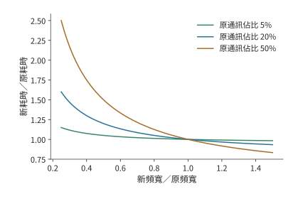

*圖 10-46：資源能力變化的收益由原有等待時間佔比決定。曲線按 $T'/T=1-f+f/r$ 計算，固定單卡計算與依賴，通訊時間與有效能力成反比。*

在本章的 48 卡方案中，暴露的通訊只有約 0.08 s，約佔每步的 0.14%。PCIe 頻寬減半時，每個 micro-batch 的鏈路 (Link)時間升到約 3.0 s，仍短於 6.53 s 的計算，暴露部分翻倍到約 0.15 s，每步從約 52.8 s 增到 52.9 s，幾乎不變。若單卡計算效率從 40% 降到 30%，單卡計算時間變為約 69.6 s，加上通訊與輸入約為 70.2 s，超過 67.2 s 的目標。對這套方案而言，決定能否按期完成的是單卡計算效率；頻寬只有在預取失效、通訊整段暴露時，才成為式中比例 $f$ 較大的那一項。

比較 A100、A800、H20 或其他加速器時，可將其單卡計算時間、介面傳輸時間和容量代入同樣的分析。滿足期限的方案再比較加速器租用、能源和準備成本。更強的單項指標是否值得購買，取決於它能減少多少完成時間或卡數。

### 10.6.4 模型規模、資料量與期限的敏感性

前幾節保持模型不變，比較了卡數和加速器型號。最後把同一方法擴充套件到模型規模，考察模型放大後計算量的增長。採用稠密模型的粗略計算量公式 $F=6ND$，固定資料量 $D=20$T token、40% MFU 和可用於執行的期限 $T$，滿足期限所需卡數為

$$
p\ge\left\lceil\frac{6ND}{P\eta T}\right\rceil.
$$

圖 10-47 把 90 天期限畫成卡數邊界。選擇某個模型規模後，邊界上方的計算資源能夠在該效率下完成工作，邊界下方需要提高效率或延長期限。

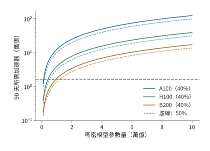

*圖 10-47：固定 90 天執行期限，稠密模型規模增大要求更多的卡。資料量為 20T token，演算法工作為 $6ND$，實線的 MFU 為 40%，虛線為 50%，使用 BF16 稠密矩陣峰值。各線為向上取整前的連續計算邊界；橫線標出 16,384 張卡。*

對 1T 參數，16,384 張 A100、H100、B200 在 40% MFU 下分別約需 679、214、94 天。90 天執行預算下，三者都落在計算邊界下方：B200 也超出約 4 天，需增至約 17,147 張。只有 MFU 達到 50% 時，B200 才降到約 75 天，落進期限，餘下約 15 天可分配給計劃停頓與恢復。MFU 相差 10 個百分點，就決定了 16,384 張 B200 能否在 90 天內訓練完 1T 模型。[^scale]

固定資料量時，模型參數量增至五倍，計算量也增至五倍；若資料量同時取 $D=20N$，則 $F=120N^2$，參數量增至五倍，計算量就增至 25 倍。規模問題的答案由模型和資料共同決定。MoE 則分開計算全部可訓練參數的狀態與被啟用路徑的執行工作，再將專家交換放入關鍵路徑。

設計完成以後，還要檢驗長期執行是否達到預期。公開訓練日誌提供長期執行的觀察視窗。若從 checkpoint 繼續訓練，本次新增 token 等於結束累計值減去恢復起點累計值；用新增工作除以本次時間，得到對應的長期速率。該速率可以直接檢驗整套系統能否保持設計中的有效訓練進度。[^public]

回看全章，圖 10-10 至圖 10-14 解釋了資料如何佔用視訊記憶體和經過鏈路 (Link)；圖 10-17 至圖 10-36 說明這些操作如何形成等待、又如何影響長期訓練；圖 10-45 則把各項耗時匯成了章首任務的完成時間。狀態安排、執行順序和恢復方式由此連成了同一個設計問題。RL 將工作來源改為反饋迴圈，仍透過同一方法比較資源和有效訓練進度。下一章進一步討論這些作業與階段如何共享資源池。

## 常見誤區

**誤區：分片數翻倍，訓練視訊記憶體峰值就減半。** 分片只直接縮小分給各卡的常駐訓練狀態。小模型例中常駐訓練狀態從 18 MiB 減到 9 MiB，執行期間的其他張量和緩衝區仍佔約 21 MiB，峰值從 39 MiB 減到 30 MiB。決定容量需求的是同一時刻的總視訊記憶體佔用。

**誤區：通訊處理時間更短，訓練步耗時就更短。** 三個小桶的總處理時間約 4.59 ms，比整桶 4.55 ms 更長，卻可以分別利用三個計算空閒時段完成傳輸。通訊完成的時刻決定它是否延長訓練步。

**誤區：非同步儲存呼叫返回，就能恢復全部已有進度。** 50 s 故障時，可用恢復點取決於哪份快照已經提交。相同的 1 s 前臺暫停可以對應 30 s 或 10 s 重做，區別來自後臺寫入的完成時刻。

**誤區：提高生成吞吐量率，就能加快 RL 學習。** 生成 12 條/s、驗證六條/s、樣本保留比例 75% 時，學習端每秒只能收到 4.5 條軌跡。增加生成資源無法消除驗證階段的瓶頸，提高驗證能力才會把限制移到訓練端。

**誤區：卡數翻倍且 batch size 隨卡數放大，完成時間就減半。** batch size 超過臨界 batch size 後，達到同一損失所需的步數不再明顯減少。噪聲尺度為二百萬個 token 時，每步 batch size 從 315 萬放大到約一億個 token（1536 卡），完成時間只從 19.4 天降到 12.1 天，加速上限為 1.64 倍。batch size 放大受梯度噪聲尺度限制；保持 batch size 不變、只增加卡數的強擴充套件才不受它限制。

## 習題與實驗

以下十題按基礎計算、機制分析和綜合設計遞進。計算題所需條件均在正文中；實驗部分使用配套記錄或自行測量的資料完成。

> **習題 10-1 · 基礎：訓練狀態分片與每卡峰值記憶體**
>
> 將本章梯度改為 FP32，計算 Qwen3-8B 常駐訓練狀態。再求八卡 ZeRO-1、ZeRO-2、ZeRO-3 的每卡容量。設執行中有 6 GiB 啟用和兩份各 3 GiB 的模組緩衝，分別計算兩份緩衝同時佔用視訊記憶體與順序複用時的峰值。

> **習題 10-2 · 基礎：按期完成訓練需要多高的單卡計算效率**
>
> 採用本章的訓練任務，將全域性 batch size 設為 384 條序列，計算 30 天和 25 天對應的每步預算。給定 32 卡，先按第 10.3.3 節求 ZeRO-3 每步的鏈路 (Link)時間與暴露的通訊等待，再加上 0.5 s 輸入等待；先忽略恢復，求在 25 天內完成訓練所需的最低單卡計算效率；再加入本章恢復成本。最後取梯度噪聲尺度為二百萬個 token，按第 10.1.1 節的關係式求弱擴充套件的加速上限，以及 96 卡和 1536 卡在弱擴充套件與強擴充套件下的完成時間；把噪聲尺度改為兩千萬個 token 後重新計算上限。

> **習題 10-3 · 綜合設計：在容量、期限與加速器成本之間選擇訓練方案**
>
> 比較 32 卡與 48 卡方案的訓練完成時間，以及累計使用的 GPU·小時。將每步啟用與臨時緩衝區的峰值需求從 10 GiB 提高到 20 GiB，重新判斷容量。若 BF16 權重副本改用第 10.1.2 節的 FP8 分塊縮放格式儲存，重算兩套方案的每卡常駐狀態與容量餘量。若只能租用四臺八卡主機，分別計算需要將任務量減少到多少、將期限延長到多久，或將計算效率提高到多少，才能完成訓練。實驗部分選一條路線實際測量，用測得的數值替換本章給定的參數。

> **習題 10-4 · 分析：micro-batch 數與啟用重計算如何改變流水開銷**
>
> 在四階段、前向 10 ms、反向 20 ms 的模型中，求 1、4、8、16 個 micro-batch 的理想利用率。沿圖 10-19 解釋 93—95 ms 的等待來自哪項依賴。再對八個 micro-batch 比較交錯式 1F1B（$v=2$）與零氣泡排程（ZB-H1，$T_B=T_W$）：用正文的氣泡公式分別計算氣泡時間，對照事件模型給出的完成時間 298 ms 與 283 ms，並說明交錯式為什麼增加跨界傳輸次數。假設每層每個 micro-batch 的可重建乘積佔 10 MiB，原方案中，四個 micro-batch 尚未執行反向傳播，每個 micro-batch 都需要保留九層的這些乘積。改為每次只重建一層中一個 micro-batch 所需的乘積，使用後立即釋放。計算新方案可以少保留多少資料，以及逐層序列重建所需的工作區大小；再討論兩層同時執行反向傳播時工作區怎樣變化。

> **習題 10-5 · 分析：資料準備程序暫停時，需要預取多少序列**
>
> 48 卡每步處理 384 條序列，每步訓練時間約 52.8 s，四個資料準備程序每個每秒準備兩條序列。若一個資料準備程序暫停 60 s，按訓練端的平均消耗速率計算，求維持原訓練速度至少需要預存多少條序列，以及四個準備程序全部恢復後，要多久才能把預取佇列補回暫停前的數量。再按第 10.4.3 節 7 GB/s 的儲存合計寫入，求約 115 GB 的 checkpoint 不產生寫入積壓的最短儲存間隔。

> **習題 10-6 · 分析：checkpoint 儲存頻率與故障重做成本**
>
> 根據本章的一階近似模型推導最優儲存週期，計算 1024 卡作業分別採用 300、900、1800 s 儲存間隔時，儲存 checkpoint 與故障重做造成的時間開銷。加入每天一次、會同時影響全作業的共同中斷，重新計算故障率和最優週期。再把平均七天一次的損失尖峰迴滾作為同時影響全作業的衝擊，加入 48 卡的模型，重算最優儲存週期與 600 s 間隔處的附加時間比例。實驗部分在提交前後分別注入故障，比較恢復位置與需要重做的工作。

> **習題 10-7 · 綜合設計：RL 各階段配比與有效樣本吞吐量**
>
> 設生成、驗證與學習階段的處理率分別為 12、6、8 條/s，驗證後樣本的保留比例為 75%，比較只將一個階段能力翻倍的收益。另採用生成 40 s、學習 16 s、權重同步 4 s 的週期模型。設每批生成的樣本數為同一個常數，分別計算非同步執行後樣本保留比例為 80% 和 70% 時的有效樣本吞吐量率，並與不丟棄樣本的同步執行比較；結果可表示為每秒處理的 batch 比例。實驗部分追蹤一批樣本的標識、獎勵、有效損失位置和接收方的權重。

> **習題 10-8 · 分析：路由記錄與樣本對應關係**
>
> 設序列含 8K token，模型有 48 層，每層為每個 token 選擇 8 個專家。分別計算用 uint16 和 int32 編碼專家 ID 所需的記錄容量。將兩條序列打包後，再沿上下文切成四份，描述專家 ID 如何隨 token 重排。構造一個 token 位置錯位的例子，說明訓練端將如何使用錯誤專家，並設計定位這一錯誤的檢查。

> **習題 10-9 · 分析：通訊、計算效率與輸入等待如何影響訓練期限**
>
> 在本章的 48 卡設計案例中，分別將 PCIe 頻寬減半（分預取有效與完全失效兩種情況）、單卡計算效率降至 30%、輸入等待增至 5 s，重新計算訓練完成時間，並判斷能否滿足期限。再給每卡計算時間加上 5% 標準差的獨立波動，求 48 卡每步的期望耗時，並判斷該方案是否仍滿足期限。假設上述退化同時發生，而額外資源只能將其中一項恢復到原值，比較分別恢復各項時可減少的關鍵路徑耗時。再選一份硬體規格或執行記錄，把本章的一個給定輸入替換為有來源的數值。

> **習題 10-10 · 綜合設計：滿足訓練期限需要多少加速器、付出多少成本**
>
> 對於參數量分別為 1T、5T、10T 的稠密模型，用 $6ND$ 分別計算兩種資料規模下的訓練運算量：訓練資料固定為 20T token；訓練 token 數滿足 $D=20N$。再按 40% 與 50% 兩檔 MFU，求各情形下在 90 天和 180 天內完成訓練所需的最少 A100、H100、B200 卡數。以累計 GPU·小時比較兩個滿足期限的方案，並說明準備時間和恢復參數如何改變結論。實驗部分選取一份標明恢復起點的公開日誌，扣除恢復時已經完成的 token 數，計算觀察期間新增訓練 token 的平均處理速率。

[^critical-batch]: [臨界 batch size 復算](../calculations/results/critical-batch-book.md)與[噪聲尺度兩千萬 token 的對照](../calculations/results/critical-batch-noise-20m.md)。梯度噪聲尺度的定義見[大 batch 訓練經驗模型](../references/text/large-batch-empirical.txt)式 (2.8)；步數—樣本關係式 (5.1)、臨界 batch size 定義式 (5.2) 與收斂時約一到二百萬 token 的區間見[縮放定律論文](../references/text/scaling-laws.txt)。$B_{\mathrm{noise}}$ 為本例取值，未對本章模型實測；弱擴充套件與強擴充套件都不含並行效率變化。

[^precision]: [混合精度訓練論文](../references/text/mixed-precision.txt)（損失縮放機制、8 至 32K 的縮放因子、FP16 可表示範圍）、[FP8 格式論文](../references/text/fp8-formats.txt)（E4M3/E5M2 編碼與最大正規數）、[DeepSeek-V3 技術報告](../references/files/papers/deepseek-v3.pdf) §3.3（1×128 啟用與 128×128 權重分塊縮放、每 128 個元素提升為 FP32 累加、相對損失誤差低於 0.25%）。FP16 與 BF16 的指數、尾數比較見[第 4.6.1 節](04-加速器架構.md)。

[^schedules]: [交錯式事件模型](../calculations/results/training-pipeline-interleaved-m8.md)、[零氣泡事件模型](../calculations/results/training-pipeline-zero-bubble-m8.md)、[DualPipe 事件模型](../calculations/results/training-pipeline-dualpipe-m8.md)及十六個 micro-batch 的變體（[交錯式](../calculations/results/training-pipeline-interleaved-m16.md)、[零氣泡](../calculations/results/training-pipeline-zero-bubble-m16.md)、[DualPipe](../calculations/results/training-pipeline-dualpipe-m16.md)）。氣泡公式：1F1B 與交錯式見 [Megatron-LM 論文](../references/text/megatron-scale.txt)（$(p-1)/m$ 與 $(1/v)(p-1)/m$），ZB-H1/H2 見[零氣泡論文](../references/text/zero-bubble.txt)表 2，DualPipe 的參數量與啟用份數見 [DeepSeek-V3 技術報告](../references/files/papers/deepseek-v3.pdf)表 2；1F1B 的穩態定義見 [PipeDream](../references/text/pipedream.txt)。零氣泡按論文圖 3 上半部分的 ZB-H1 槽位順序排定；交錯式與 DualPipe 的歸檔文字只給出分塊與雙向饋入的思路，槽位順序按各結果檔案記錄的 declared_schedule_rule 排定；$T_B=T_W=10$ ms 的拆分比例為本例取值；完成時間由事件模型按依賴關係推出，不是實測。

[^capacity]: [容量因子與丟棄復算](../calculations/results/moe-capacity-book.md)。容量規則見 [Switch Transformer](../references/text/switch-transformer.txt)式 (3)（每專家容量 = 每批 token 數／專家數 × 容量因子）與 [GShard](../references/text/gshard.txt)（容量取 O(N/E)，溢位 token 的表示經殘差連線傳給下一層）；無輔助損失的偏置均衡見 [DeepSeek-V3 技術報告](../references/files/papers/deepseek-v3.pdf)。一半專家 1.5 倍熱的分佈為本例取值，與正文的 96/32 例子同為 3:1。

[^rl-interrupt]: 總成本與故障原因見 [MiMo-V2.6 技術報告](../references/files/papers/mimo-v26-tech-report.pdf) §4.1、§5.5。逐次時間、費率與回滾公告見[歸檔日誌](../references/files/documents/mimo-v26-rl-run-log/README.md)，計算過程見[案例筆記](../case-studies/mimo-v26-rl-interruptions.md)與[復算記錄](../references/files/documents/mimo-v26-rl-run-log/recalculated.json)。金額由日誌事件區間乘看板固定費率估算，不是報告單列的故障賬單；區間內的重做、檢測和等待未單獨拆分，也未扣除可能複用的取樣結果。

[^straggler]: [掉隊者最大值模型（σ 為均值的 2%）](../calculations/results/straggler-max-sigma-2pct.md)與[（σ 為均值的 5%）](../calculations/results/straggler-max-sigma-5pct.md)。約 0.5% 的機器明顯變慢見 [MegaScale](../references/text/megascale.txt)；1024 卡作業平均無故障 7.9 小時、8 卡作業 47.7 天見 [Meta 叢集可靠性論文](../references/text/meta-cluster-reliability.txt)，儲存週期部分的每卡故障率即由 1024 卡的 7.9 小時折算。每卡計算時間的標準差與損失尖峰迴滾間隔為本例取值；最大值期望按階次統計的數值積分求得，未模擬相關性、週期性抖動或持續性慢卡。

[^state]: [官方參數與 Adam／ZeRO 狀態復算](../calculations/results/training-state-book.md)；[FP32 梯度變體](../calculations/results/training-state-fp32-gradient.md)。本章使用規定的五項狀態表示，其他最佳化器與低精度狀態需另算。

[^deadline]: [訓練期限與裝置下界](../calculations/results/training-deadline-book.md)及[日曆時間變體](../calculations/results/training-deadline-calendar.md)。精度、稀疏性與硬體來源在 JSON 中逐項記錄。38%—43% 的 BF16 MFU 見 [Llama 3 報告](../references/files/papers/llama3.pdf) §3.3.2 與表 4；RTX 4090 的 PCIe 4.0、無 NVLink 見 [RTX 4090 規格頁](../references/files/specs/nvidia-rtx4090.md)。

[^fsdp]: [CPU FSDP2 四配置記錄](../experiments/ch10/10-01/fsdp-cpu/README.md)。CPU 小模型四種配置得到的參數與未分片參考結果一致；訓練期間分配的記憶體峰值為 39.16／30.14 MiB。

[^pipeline]: [填滿排空事件模型](../calculations/results/training-pipeline-gpipe-m8.md)、[1F1B 事件模型](../calculations/results/training-pipeline-1f1b-m8.md)、[GEMM 輸入張量的保留關係](../calculations/results/pipeline-gemm-save-1f1b.md)、[選擇性重計算](../calculations/results/pipeline-gemm-recompute-products.md)。GEMM 輸入採用 FP32 參考表示，九層的可重建乘積為 90 MiB，最大逐層重建工作區 6 MiB。流水圖採用 save_nonlinear 策略儲存的中間結果及其收發緩衝。

[^offload]: [梯度轉換復算](../calculations/results/gradient-cast-book.md)、[快鏈路 (Link)變體](../calculations/results/gradient-cast-fast-link.md)、[SuperOffload 閱讀與轉換案例](../case-studies/training-offload-and-casting.md)、[CPUAdam 解除安裝記錄](../experiments/ch10/10-01/deepspeed-offload/README.md)。轉換路徑從 GPU 梯度就緒開始，到 CPU 可讀取 FP32 梯度結束；兩條路徑均使用頁鎖定主機記憶體作為緩衝區。GPU 轉換吞吐量取 RTX 4090 的 1008 GB/s 視訊記憶體頻寬（calculations/configs/hardware.json）；CPU 轉換吞吐量取[至強 Platinum 8480+ 規格](../references/files/specs/intel-xeon-8480plus-ark.md)的八通道 DDR5-4800，$8\times4800\ \mathrm{MT/s}\times8$ B $=307.2$ GB/s；兩者都是按記憶體頻寬計的上限。NVLink-C2C 每方向 450 GB/s 見 [GH200 架構說明](../references/files/documents/nvidia-grace-hopper-blog.md)。

[^megascale]: 論文報告的每步耗時為 23.66／6.34 s，擴充套件效率約 93.3%；對應固定全域性 batch 的整套系統擴充套件實驗。[MegaScale 正式論文](../references/proceedings/NSDI/2024/selected/nsdi24-jiang-ziheng.pdf)及[固定任務、歷史配置與計量筆記](../case-studies/collective-paths-and-diagnosis.md)。

[^moe]: [DeepSeek-V3 技術報告](../references/files/papers/deepseek-v3.pdf)、[專家交換與反向分桶案例](../case-studies/expert-dispatch-and-resizing.md)。72 MiB 分三桶、四成員環形 AllReduce、0.02 ms 啟動和三個 2 ms 空隙為給定輸入；每卡一張 200 Gbit/s 網路卡的配置見 [4090 叢集配置分析](../references/files/documents/h100-vs-4090.md)，400 Gbit/s 見 [ConnectX-7 資料手冊](../references/files/specs/nvidia-connectx7-datasheet.pdf)。專家均衡與路由機制參見 DeepSeek-V3，切塊排程參見連結中的案例。

[^length]: [訓練工作與長度分佈推算](../case-studies/training-compute.md)。

[^supply]: [訓練資料輸入與共享儲存模型](../calculations/results/training-supply-shared-starvation.md)、[輸入與儲存共存實驗](../experiments/ch10/10-06/input-io-contention/README.md)。事件模型以小規模參數演示 checkpoint 與輸入共用儲存時預取佇列被取空的過程；本章的設計案例使用四個各準備兩條序列/s 的資料準備程序。

[^checkpoint]: [checkpoint 佈局、ByteCheckpoint 與後臺儲存閱讀](../case-studies/checkpoint-layout-and-loading.md)、[邏輯重分片計算](../calculations/results/checkpoint-reshard-book.md)、[112 GB 時間線](../calculations/results/checkpoint-async-rounded.md)。

[^resume]: [DCP 恢復記錄](../experiments/ch10/10-06/README.md)、[真實文字管線恢復](../experiments/ch10/10-06/input-state-recovery/README.md)。2,000＋6,192 是說明打包時剩餘 token 的教學例。DCP 小模型將兩份行分片恢復為三份列分片與完整狀態，參數、Adam、隨機狀態和下一次參數更新結果與不中斷訓練一致。

[^fault]: [非同步儲存與提交前故障實驗](../experiments/ch10/10-07/README.md)及[無儲存／同步／非同步對照](../experiments/ch10/10-07/save-baseline/README.md)。原正常路徑 API 為約 7.25 ms、後設資料提交約 48.30 ms；故障實驗在提交前設定屏障並終止程序。

[^interval]: [儲存週期與 Poisson 重試模型](../calculations/results/checkpoint-interval-book.md)。精確資料量為 114,670,295,040 bytes，以 7 GB/s 寫入的儲存成本約 16.381 s；一階最優約 965.29 s，含儲存期故障的 Poisson 重試模型約 954.40 s。7 GB/s 為 [DGX SuperPOD 參考架構](../references/files/documents/dgx-superpod-h100-ra.pdf)表 6 Good 檔的單 SU 合計寫入；1024 卡作業平均 7.9 小時中斷一次、平均無故障時間與卡數成反比見 [Meta 叢集可靠性論文](../references/text/meta-cluster-reliability.txt)。本章的選擇只需要區分五、十五和三十分鐘。

[^verl]: [固定 verl 小模型真實閉環](../experiments/ch10/10-08/README.md)、[loss 與更新的原始碼核對](../research/2026-infra-survey/qa/verl-recipe-loss-closure.md)。固定 Qwen2.5-0.5B-Instruct 訓練配置採用單卡 NO_SHARD、no_sync=False；原始碼和版本鎖定見連結中的記錄。0.32／0.30／0.04 使用真實長度結構與教學純量損失推導。

[^handoff]: [Qwen3-8B 共享裝置峰值](../calculations/results/weight-handoff-qwen8.md)、[Qwen3-235B-A22B 分片權重同步](../calculations/results/weight-handoff-book.md)。40 GiB 為分片／解除安裝後視訊記憶體佔用的給定輸入；兩個切換峰值精確約為 83.256／59.256 GiB，與 H100 SXM 標稱 80 GB（74.506 GiB）比較。

[^opd]: [DeepSeek V4 技術報告](../references/files/papers/deepseek-v4.pdf)，§5.1 的領域專家與多教師 OPD；階段工作劃分參見[第 3 章](03-推論與訓練負載.md)。

[^identity]: [RL 狀態、機率比與版本](../case-studies/rl-state-and-reproducibility.md)、[DeepSeek V4 技術報告](../references/files/papers/deepseek-v4.pdf)。

[^replay]: [路由後設資料預算](../calculations/results/routing-metadata-book.md)、[R3 作者公開的日誌與分析](../experiments/ch10/10-09/source-readiness/README.md)。四對設定共用 seed42；reward 為訓練 batch 指標，logprob 為 R3 作者的日誌級統計。

[^scale]: [Dense 規模與期限](../calculations/results/dense-training-scale-book.md)、[資料量隨參數增長的變體](../calculations/results/dense-training-scale-proportional.md)。16,384 張 H100、DP=128、8K 序列時 41% 的 BF16 MFU 見 [Llama 3 報告](../references/files/papers/llama3.pdf)表 4。

[^public]: [SmolLM3 原始訓練記錄核驗](../experiments/ch10/10-10/public-training/README.md)。SmolLM3 記錄含 384、288、192 rank 階段，最後一次恢復實際執行 14,000 步；終點累計 token 包含此前工作。

[^design]: [本章設計案例的輸入、推導與復算](ch10/design-case.md)。32／48 卡的容量預留、輸入等待和計劃停頓為給定輸入；單卡計算效率取 Llama 3 的 MFU；模型矩陣工作來自既有 training-deadline 計算，ZeRO-3 通訊量由同一份參數列推出。RTX 4090 的 PCIe 4.0、無 NVLink 見 [RTX 4090 規格頁](../references/files/specs/nvidia-rtx4090.md)，卡間不支援 P2P、八卡主機配八張 200 Gbit/s 網路卡見 [4090 叢集配置分析](../references/files/documents/h100-vs-4090.md)；一步中只有第一次 AllGather 與最後一次 ReduceScatter 無法隱藏見 [MegaScale](../references/text/megascale.txt) §3.2。逐項數值與獨立復算儲存在 [design-case.json](ch10/design-case.json)。

[^v41-case]: [DeepSeek V4.1 官方技術報告](../calculations/sources/deepseek-v4.1-flash/DeepSeek_V41_Tech_Report.pdf)，第 1、2、3 節與第 6 節；[跨章會話的固定條件與復算](../calculations/results/v41-throughline.json)。

## 本章小結

訓練所需的記憶體容量由狀態的儲存格式、各卡之間的分配方式和生命週期共同決定。ZeRO 減少狀態複製，重計算減少前向到反向之間需要儲存的資料，解除安裝將暫時不用的訓練狀態移到主機記憶體；三者都以額外的計算或傳輸換取視訊記憶體空間。執行時，資料就緒與資源空閒共同決定開始時刻，沿依賴關係累積到參數更新結束的延遲決定每步耗時。

估算長期完成時間時，還要加上每步耗時中未包含的資料準備、checkpoint 儲存與故障重做時間。checkpoint 既儲存最佳化器狀態，也儲存已完成訓練的資料位置；儲存週期平衡正常執行中的寫入成本與故障後的重做成本。同步訓練還受三類實際因素影響：batch size 能否隨卡數放大由臨界 batch size 決定，每步耗時由最慢的一張卡決定，損失尖峰的回滾率與硬體故障率一起進入儲存週期模型。RL 進一步要求跟蹤樣本標識、策略版本和行為機率，並對齊生成與訓練的數值路徑。線上取樣使資料跟隨策略變化，OPD 讓教師監督覆蓋學生實際生成的字首，跨引擎執行還需要保證訓推一致性。控制資料分佈偏移與執行誤差後，便可以根據有效樣本吞吐量和任務評估，判斷階段重疊如何加快學習。

本章的設計案例中，32 卡與 48 卡 RTX 4090 均能容納訓練狀態，但給定相同訓練目標和執行效率後，完成時間分別約為 34.3 天和 24.6 天。48 卡滿足 30 天期限，每步訓練時間上限約為 67.2 s；ZeRO-3 每步 12.0 s 的鏈路 (Link)時間絕大部分被計算覆蓋，即使完全暴露也不超出這一上限。這一結論來自容量、執行與恢復的連續推導；同一分析模型也給出了效率、通訊和故障條件變化時，方案能否按期完成的臨界值。
