# 第 11 章 資源排程與執行環境

程式碼修復服務收到使用者提交的問題後，先讓模型生成修改，再讓工具改檔案、執行測試，把測試結果交回模型，繼續下一輪，直到得到透過測試的補丁。這項需要交付最終結果的工作稱為**任務**；一次模型請求或一次工具執行只是其中的一個步驟。

**控制器**儲存任務記錄並決定下一步呼叫什麼，**執行器**實際執行工具，**執行環境**承載工具所需的檔案、程序和記憶體。模型呼叫使用推論服務，工具執行使用 CPU，環境中的程序和快取佔用記憶體。沿著每次呼叫、返回和等待的過程，可以分別算出這些資源何時被佔用、佔用多久。

前兩章討論了推理和訓練服務的構建。本章研究如何把模型服務、工具環境和共享資源組織成任務執行系統，從一道平臺設計題出發，逐步討論何時建立和釋放環境、如何安排任務、如何選擇模型，以及如何從失敗中恢復。

**貫穿設計題：程式碼修復平臺的資源容量、完成期限與任務成本。** 本章將圍繞以下條件展開討論。任務均勻到達，每 0.1 秒一項；每項執行三輪，每輪先呼叫模型，再執行工具。工具使用一個 CPU 核，執行 1 秒，包含讀取檔案、執行測試、儲存結果和清理工作狀態。工作目錄與工具結果存放在持久儲存中，工具程序可以在輪間重建。

| 設計輸入 | 給定值 |
| --- | --- |
| 任務到達率 | 10 項/s |
| 每項任務 | 3 次模型呼叫、3 次工具執行 |
| 模型服務 | DeepSeek V4-Flash，每個副本 4 張 B200，同時服務 32 個會話 |
| 普通模型服務的完整呼叫時間 | 每次輸出 355 個 token，每個 token 約 25.3 ms，合計約 9.0 s |
| 模型服務並行容量 | 10 個副本（40 張 B200），最多同時處理 320 次呼叫 |
| 工具執行時間與累計 CPU 時間 | 1 s、1 CPU·秒/次 |
| 活躍工具環境 | 1 vCPU、2 GiB 記憶體的 microVM（微型虛擬機器） |
| 工具平臺 | 一臺 EC2 m5d.metal（亞馬遜雲的裸金屬伺服器）：48 個 CPU 核、384 GB（約 358 GiB）記憶體 |
| 業務目標 | 至少 95% 的提交任務在 24 s 內透過測試 |

每個 token 的時間取自本書對這一部署的服務估算，已計入分攤到每個 token 的輸入處理與上下文重建。m5d.metal 是 Firecracker（亞馬遜開源的輕量虛擬機器監控器）論文評測 microVM 時使用的主機，1 vCPU、2 GiB 是 E2B（面向工具執行的環境平臺）計價頁列出的沙箱規格之一。

先考察一種簡單的方案：任務開始時，從預先準備好的環境池中分配一個環境，直到任務結束才釋放；清理工作狀態後，該環境可以交給下一項任務。後文依次考慮環境建立開銷、請求突發、模型選擇和失敗恢復，在同一組任務條件下比較各方案的資源需求。[^design]

## 11.1 根據任務執行過程計算資源需求

### 11.1.1 一項程式碼任務的執行與等待

以章首的程式碼修復任務為例。每輪先由模型用 9 秒生成工具呼叫，再由工具執行 1 秒。下一輪模型呼叫需要本輪的測試結果，因此三輪必須依次進行，總時間為 $3\times(9+1)=30$ 秒。第一輪結束於第 10 秒，第二輪結束於第 20 秒，第三輪結束於第 30 秒。

等待模型給出下一次工具呼叫時，工具暫時不佔用 CPU，但本方案仍保留其環境。執行停下來，並不自動騰出已佔的空間：留下的是環境的程序與記憶體；工作目錄和工具結果已經在持久儲存中，是否值得銷燬環境、下輪再建，第 11.2 節再比較。

在這 30 秒裡，工具只佔用一個 CPU 核執行三次，每次 1 秒，累計 CPU 時間為 3 秒。這裡的 CPU 時間是各個核實際執行時間的總和，記作 CPU·秒：一個核執行 3 秒，或三個核各執行 1 秒，都是 3 CPU·秒。環境始終佔用 2 GiB 記憶體，記憶體佔用量與時間的乘積為 $2\times30=60$ GiB·秒。

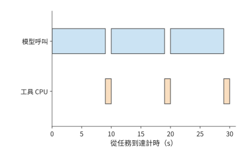

*圖 11-1：三輪序列任務共需 30 s。藍色為三次各 9 s 的模型呼叫，橙色為三次各 1 s 的工具執行；工具累計消耗 3 CPU·秒。*

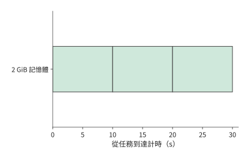

*圖 11-2：同一任務的環境始終佔 2 GiB，持續 30 s，矩形面積為 60 GiB·秒。等待模型時仍保留環境，因而記憶體佔用持續時間長於工具的 CPU 執行時間。*

這種等待來自控制器與執行器之間的交接。模型呼叫結束時，控制器取得完整工具參數，隨後把參數發給執行器。執行器修改檔案、啟動測試、儲存結果，再將結果交回控制器。工具必須等模型給出完整參數才能執行，因此在任務的大部分時間裡都不佔用 CPU。

模型採用流式輸出時，可以更早返回部分文字，但工具仍需等待完整的呼叫參數：收到目標檔案、修改內容和操作型別之後，執行器才能執行這次修改。模板下載和執行時初始化只依賴預先確定的環境型別，可以提前放到模型生成期間。第 11.2 節將利用這段時間準備環境。[^platform]

把該例推廣到 $R$ 輪。各階段依次執行時，任務總時間為

$$
T_{\mathrm{task}}=T_{\mathrm{queue}}+T_{\mathrm{prepare}}+
\sum_{r=1}^{R}(T_{\mathrm{model},r}+T_{\mathrm{tool},r})+T_{\mathrm{commit}}.
$$

上式依次計入排隊、環境準備、各輪模型呼叫與工具執行，以及最終提交結果的時間。模型呼叫時間包括處理請求和返回結果，工具執行時間包括儲存本輪結果，$T_{\mathrm{commit}}$ 則表示最終提交還需花費的時間。如果在模型呼叫期間準備環境，兩者都完成後，工具即可開始執行。原本序列的兩個階段有了重疊，任務總時間和環境佔用時間也隨之改變。

### 11.1.2 CPU 工作量、環境駐留與並行容量

把單項任務的需求彙總到整個平臺，先分別計算任務數、模型呼叫數和環境建立次數。平臺每秒收到 10 項任務，每項需要三次模型呼叫，因此穩定執行時模型服務每秒接收 30 次呼叫；工具也每秒執行 30 次。若每項任務只建立一個環境，建立率是每秒 10 個；若每輪重新建立，則是每秒 30 個。任務量雖然相同，每輪重建環境卻使建立次數增至三倍。

這些需求都來自同一個關係：

$$
\text{资源需求率}=\text{任务到达率}\times\text{每任务的平均资源需求}.
$$

每項任務累計使用 3 秒 CPU 時間，所以每秒到達的任務合計需要 30 秒 CPU 時間，平均有 30 個 CPU 核在執行工具；每項任務的累計記憶體佔用為 60 GiB·秒，所以平臺的環境平均需要 600 GiB 記憶體；每項有三次 9 秒模型呼叫，所以平均有 $10\times3\times9=270$ 次模型呼叫正在執行。

**例 11-1：程式碼修復平臺為何先受環境記憶體容量限制？** 將需求除以章首給定的容量，CPU 佔用為 $30/48=62.5\%$，模型呼叫的並行容量使用率為 $270/320\approx84\%$，記憶體需求卻達到 $600/358\approx168\%$。358 GiB 記憶體最多同時保留 178 個 2 GiB 環境；每個環境要保留 30 秒，平臺每秒最多隻能開始約 5.9 項任務，其餘任務只能排隊。此時 CPU 還空著 18 核，增加 CPU 核數也無法解決環境記憶體不足的問題。

也可以先求環境數量。每項任務佔用環境 30 秒，每秒有 10 項任務開始使用環境，因此係統穩定執行時，平均有 300 個環境正在使用。這就是 Little 定律在本題中的形式：

$$
\overline N_{\mathrm{env}}=\lambda_{\mathrm{env}}\overline T_{\mathrm{env}}
=10\times30=300.
$$

每個環境固定佔用 2 GiB 記憶體，300 個環境便需要 600 GiB。當任務的記憶體佔用隨階段變化時，將每項任務的佔用面積 $A_M=\int M(t)dt$ 代入 $\lambda_{\mathrm{task}}E[A_M]$，仍可得到平均記憶體需求。同樣，CPU 時間 $W_{\mathrm{cpu}}=\int n_{\mathrm{busy}}(t)dt$ 將各個核的實際執行時間相加。

把每次模型呼叫從 9 秒延長到 12 秒，工具執行保持不變。任務時間變成 39 秒，平均記憶體需求升到 780 GiB，同時處理的模型呼叫增至 360 次，工具仍然只需平均使用 30 個 CPU 核。記憶體缺口進一步擴大，模型呼叫並行數也超過了 320 個並行槽，排隊的任務更多了。由此可見，模型響應變慢，也會增加工具平臺的記憶體需求，因為環境需要保留得更久。

圖 11-3 和圖 11-4 將三種資源換算為各自容量的百分比。每次呼叫 9 秒時，記憶體柱已經越過容量線；呼叫變慢後，CPU 柱長不變，模型並行柱也越過了容量線，記憶體柱則更長。問題因此從「有多少空閒 CPU」轉向「能否減少等待期間佔用的記憶體」。

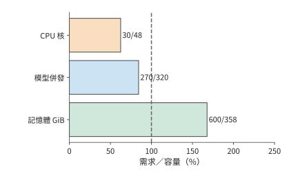

*圖 11-3：每秒 10 項任務、每次模型呼叫 9 s 時，三種資源的需求佔容量比例。柱末給出需求量／可用容量；虛線為 100%。*

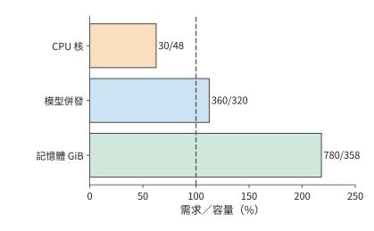

*圖 11-4：每次模型呼叫由 9 s 延長到 12 s，CPU 需求仍為 30 核；並行呼叫增至 360，環境記憶體增至 780 GiB。虛線為 100% 容量。*

除了縮短環境保留時間，還可以錯開工具執行，減少同時佔用記憶體的程序。一組四程序 CPU 工具實驗中，同時啟動與錯開啟動的累計 CPU 時間分別約為 0.29 秒和 0.27 秒，工作量接近。**駐留集大小**（resident set size，RSS）是程序當前駐留在實體記憶體中的頁所佔的容量；取樣得到的 RSS 峰值從約 320 MiB 降到 80 MiB，整組完成時間從約 0.10 秒延長到 0.54 秒。錯開啟動後，同時執行的程序減少，記憶體峰值隨之下降，但整組任務也需要更長時間才能完成。[^environment]

### 11.1.3 任務完成條件與必須保留的狀態

減少等待期間的記憶體佔用，意味著要釋放環境中的一部分狀態。釋放之前，必須先明確丟失這些狀態會導致哪些工作重做。在圖 11-1 的三輪任務中，前兩輪結束時，已經過去了 20 秒，其中工具累計使用的 CPU 時間只有 2 秒。如果丟失工作目錄後必須從頭執行，就要重新花費這 20 秒，而不僅是重做 2 秒工具計算。能保留哪些狀態，決定了故障後哪些階段需要重來。

| 狀態 | 需要記錄的資訊 | 丟失後的恢復方式 |
| --- | --- | --- |
| 模型上下文和生成進度 | 任務、模型版本、輸入字首、已採用的輸出 | 重新提交上下文，重建模型狀態 |
| 工作目錄與檔案 | 倉庫版本、檔案摘要、補丁版本 | 從持久副本取回或重新應用補丁 |
| 程序與記憶體 | 環境例項、程序狀態、執行時條件 | 恢復快照或重新執行工具 |
| 工具結果 | 工具操作、執行嘗試、輸入檔案版本 | 查詢已儲存結果或再次執行 |
| 外部操作 | 目標系統中的操作標識與提交狀態 | 查詢、去重或按業務規則補償 |

記錄這些資訊時，任務、工具操作和每一次執行嘗試需要各自的標識。同一份測試結果可能被傳送兩次；同一項測試也可能實際執行兩次。前一種情況只需對訊息去重，後一種情況已經消耗了兩次資源。檔案版本不相同時，兩次同名測試甚至不是同一個工具操作。

記錄每次嘗試之後，還要區分嘗試失敗的原因。測試結果決定控制器的下一步。如果程式執行結果不正確，控制器就需要修復程式；如果工具程序因資源不足而中止，則需要恢復執行。兩類失敗對應不同的後續工作，完成機率也不同。同樣的區分也出現在模型訓練中。RL 根據樣本的驗證結果更新模型，其驗證也要區分這兩種情況：答案是否正確，用於計算學習反饋；執行故障則先由執行系統處理。

失敗與重試還會帶來額外的成本。一次提交可以觸發多次嘗試。平臺為每次嘗試支付模型、工具和環境成本，使用者得到的是最後完成的任務。第 11.5 節將沿這些分支累積支出，再除以透過測試的任務數。

## 11.2 執行環境的建立、保留與釋放

### 11.2.1 工具執行路徑與隔離邊界

第 11.1.3 節區分了需要保留的檔案、程序和操作結果，本節說明承載這些狀態的環境如何建立和釋放。模型輸出的工具呼叫需要由普通程式執行。執行器將呼叫轉換成檔案操作、程序啟動、瀏覽器動作或裝置任務。執行環境提供程式碼執行所需的作業系統介面、檔案系統、記憶體、網路以及資源限制。執行環境還需要隔離不同任務，防止相互干擾。

圖 11-5 把章首平臺分為模型服務和工具環境兩條路徑。模型服務由 10 個 V4-Flash 副本組成，最多同時處理 320 次呼叫；環境平臺在一臺 m5d.metal 的 48 個 CPU 核和約 358 GiB 記憶體中分配工具資源。控制器協調兩者完成任務：先從模型取得參數，再讓工具執行並返回結果。

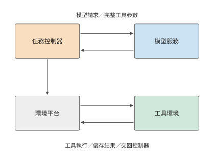

*圖 11-5：程式碼任務經過模型服務與工具環境兩條路徑。控制器從模型取得參數，再向環境平臺發起工具操作；執行結果成為下一輪輸入。虛線框標出工具環境所在的執行節點。*

隔離不同任務有多種實現方式，隔離程度逐級增強。程序通常共享同一個作業系統核心，靠地址空間和許可權做基本隔離。容器增加名稱空間（讓程序看到各自的程序編號、網路等資源檢視）、檔案系統檢視和資源控制，但通常仍共享宿主核心。完整虛擬機器執行自己的作業系統核心，並透過虛擬硬體與宿主隔離；microVM 保留虛擬機器隔離模型，透過精簡虛擬裝置和管理功能來降低開銷。沙箱是對執行約束的描述，不專指某一種實現。

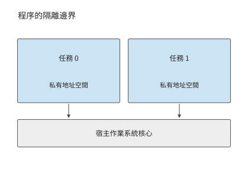

*圖 11-6：程序擁有獨立地址空間，透過許可權限制訪問；同一節點上的程序共享宿主核心。*

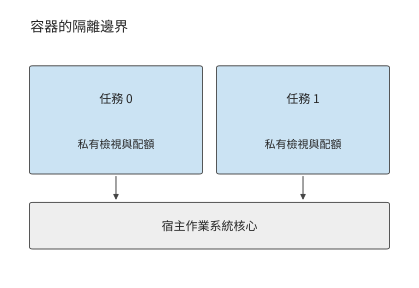

*圖 11-7：容器為任務建立各自的資源檢視和配額，底層仍使用同一宿主核心。*

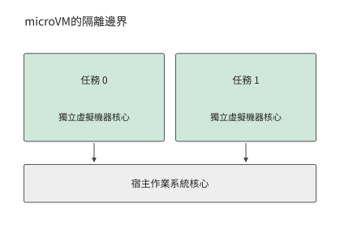

*圖 11-8：microVM 讓每個任務環境執行獨立虛擬機器核心，透過虛擬硬體訪問宿主資源。*

章首平臺選用的正是 microVM 方案。Firecracker 由亞馬遜雲服務（Amazon Web Services，AWS）為無伺服器計算開發，2018 年開源；Firecracker 團隊 2020 年在 NSDI 會議上發表的論文討論瞭如何在大量短時任務之間兼顧硬體虛擬化隔離、啟動速度和記憶體開銷。[^firecracker-history] E2B 使用 Firecracker microVM 執行工具環境，模板可由容器映象構建。建立時，平臺從模板建立環境；執行時，工具透過虛擬機器核心讀寫檔案和啟動程序。容器映象決定環境中有哪些檔案和依賴，microVM 則決定這些程式執行時如何與宿主系統隔離。[^e2b]

兩條路徑在同一個任務控制器處匯合：控制器知道模型呼叫何時開始、工具何時使用環境，以及哪些檔案需要跨輪儲存。平臺據此可以分別安排模型狀態與工具狀態的保留和釋放：模型計算期間可以準備下一輪環境，工具完成後可以儲存檔案並釋放程序。

### 11.2.2 資源分配與環境建立

確定隔離方式以後，平臺還需為環境分配資源並載入程式所需的資料。工具平臺用 CPU 配額、記憶體上限以及檔案和裝置訪問許可權分配資源。給等待模型的環境增加 CPU 配額，並不會改變其檔案和記憶體狀態；銷燬該環境會釋放記憶體，但下一次執行前要重建這些內容。有些工具還需要 GPU，例如驗證 CUDA 程式時，還要向加速器資源池申請 GPU。裝置直通讓虛擬機器直接操作分配給它的物理裝置，可由虛擬機器程式 QEMU 配合 Linux 的 VFIO 裝置訪問介面完成。[^ub]

建立環境需要取得模板、建立私有狀態並準備首次工作所需的資料。最簡單的方式是完整複製模板；另一種方式是共享只讀內容，只複製需要寫入的頁；還可以按訪問需求載入資料。建立環境時少載入資料，可以縮短啟動時間，但程式首次訪問這些資料時仍需等待載入。

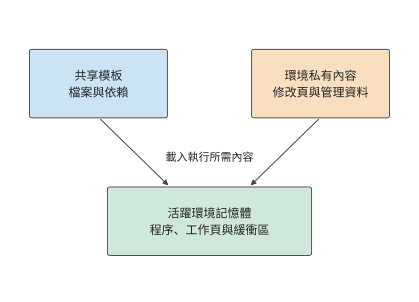

*圖 11-9：模板包含共享的檔案與依賴，私有部分記錄各環境的修改；程式執行時還會佔用程序記憶體和緩衝區。載入模板所需的空間與活躍環境的記憶體佔用分別計算。*

**例 11-2：按需載入與只讀共享能節省多少環境記憶體？** 為分析建立開銷，先取章首 300 個環境中的 100 個，比較將模板內容載入到這 100 個環境中所需的記憶體。每份模板為 2 GiB，工具訪問其中 512 MiB，修改 128 MiB，另有 4 MiB 私有管理開銷。逐份完整複製時，每個環境需佔用 2,052 MiB 本地記憶體，100 份約為 200 GiB；只載入訪問到的內容時，每份為 516 MiB，總量約為 50 GiB。同一組工具任務需要載入到記憶體的資料因此減少約 150 GiB。[^lifecycle]

還可以讓環境共享只讀內容，僅保留 128 MiB 髒頁（相對模板被修改過的記憶體頁）和 4 MiB 管理開銷。此時每份為 132 MiB，100 份約為 13 GiB。尚未載入到本地記憶體的只讀頁在訪問時取得。若每個環境再保留 256 MiB 熱點只讀頁，本地總量回升到約 38 GiB，換來較少的遠端訪問。

四種載入方式依次佔用約 200、50、13 和 38 GiB，並另保留一份共享的 2 GiB 模板。章首為每個活躍環境分配的 2 GiB 記憶體，還包括程序、緩衝區等工具執行所需的空間。共享只讀內容可以減少重複儲存，將常用資料保留在本地則可以減少遠端讀取。具體保留多少，要看工具首次訪問哪些頁，以及此後多久再次訪問。

圖 11-10 展開每個環境本地儲存的內容。少儲存這些資料是否會使工具首次讀取時等待更久，還需要計算。

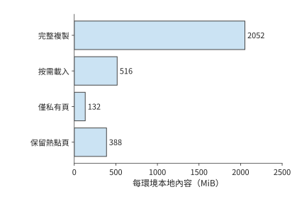

*圖 11-10：四種方案採用相同的橫軸尺度，比較每個環境本地儲存的資料。另有一份共享的 2 GiB 模板，不計入各環境的柱長。數值來自例 11-2；管理開銷為每環境 4 MiB。*

設取回與載入都受同一條 25 GbE 鏈路 (Link)限制，速率為 3.125 GB/s（約 2.91 GiB/s）。模板尚未快取在本機時，需要取回 2 GiB，再將 0.5 GiB 資料載入到記憶體，合計至少需要 0.86 秒；模板已在快取中時，只需載入 0.5 GiB，降至 0.17 秒。約 0.69 秒的差額來自省去的模板傳輸。一般地，這條通路取回與載入資料的時間下界為 $(V_{\mathrm{fetch}}+V_{\mathrm{install}})/B$，其中 $V_{\mathrm{fetch}}$ 和 $V_{\mathrm{install}}$ 分別是取回和載入的資料量，$B$ 是鏈路 (Link)頻寬。

如果工具首次執行時又訪問 1 GiB 尚未載入到記憶體的頁，這條鏈路 (Link)便再工作約 0.34 秒。按需載入讓建立介面更早返回，尚未訪問的資料留到真正需要時再取。E2B 的頁與檔案讀取就是這樣組織的：啟動過程先提供可執行的環境，隨後的訪問逐步補齊內容。首次工具執行的完成時間包含環境啟動，以及首次訪問缺失頁時的等待。按需載入將一部分準備工作推遲到了工具執行期間。[^e2b]

### 11.2.3 暫停、恢復與環境重建

第 11.2.2 節減少了每次建立時複製的資料；另一種節省記憶體的辦法是在兩次工具執行之間暫時釋放整個環境。在章首的三輪任務中，第一輪工具在第 10 秒完成，第二輪工具要到第 19 秒才開始，中間有 9 秒模型呼叫。始終駐留要佔用 $2\times9=18$ GiB·秒。按 E2B 文件，暫停一個沙箱時每 GiB 記憶體約需 4 秒，恢復約需 1 秒，儲存和恢復期間環境仍佔 2 GiB。暫停 2 GiB 環境需要 8 秒：第 10–18 秒儲存狀態，第 18–19 秒恢復。下一次工具仍能在第 19 秒開始，但整個間隔都被儲存和恢復佔滿，佔用仍是 18 GiB·秒，沒有任何節省。[^e2b]

圖 11-11 和圖 11-12 的佔用面積相同。要在等待期間釋放記憶體，必須先儲存下一輪仍需使用的狀態，而儲存時間隨記憶體容量增長；因此，暫停能節省多少，取決於要儲存什麼、如何恢復。

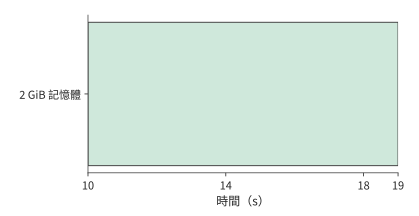

*圖 11-11：第 10–19 s 等待模型時始終保留 2 GiB 環境，佔用 18 GiB·秒。橫軸與下一圖一致。*

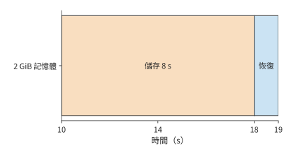

*圖 11-12：第 10–18 s 按每 GiB 4 s 儲存 2 GiB 狀態，第 18–19 s 恢復，整個間隔都沒有釋放記憶體。有色區間仍佔 18 GiB·秒，下一次工具在第 19 s 開始。*

恢復已儲存狀態的方式不止一種。暫停後恢復，是繼續同一個任務的執行；快照派生，是從同一狀態建立多個分支；從初始環境重新建立，則不繼承先前任務的修改。三者都能重新得到可執行的環境，但繼承的狀態不同。

Agent 從執行快照恢復，會繼承先前修改過的檔案和程序。RL 驗證常常要求每條樣本從同一份初始目錄出發，因此從乾淨模板派生。快照中的檔案若包含上一次測試輸出，恢復時也會帶回這份輸出。初始模板用於重複試驗，執行快照用於延續進度，二者儲存的是不同時間點的狀態。

回到章首任務中那段 9 秒的模型等待。環境記憶體更小或間隔更長時，暫停才開始有收益：同樣 9 秒的間隔，512 MiB 的環境約 2 秒即可儲存完畢，可以釋放 6 秒；間隔短於儲存與恢復之和時，恢復還會推遲下一次工具執行。E2B 另外提供只儲存檔案系統的暫停，恢復時重新啟動系統；第 11.2.4 節的每輪重建環境正是沿這一方向，只保留檔案，不保留程序記憶體。

是否暫停，可以比較成本來決定。設釋放的記憶體為 $M$ GiB，釋放後保持空閒的時間為 $G$ 秒，每 GiB·秒價格為 $p_M$，狀態儲存、儲存和恢復的新增成本為 $C_{\mathrm{transition}}$，暫停節省成本的條件是 $p_MMG>C_{\mathrm{transition}}$。左邊隨釋放時間增長，右邊是每次儲存和恢復需要支付的成本；令兩者相等，就能求出暫停開始節省成本所需的空閒時間。

成本比較決定是否暫停；暫停之後，不同狀態要用不同方式恢復。快照儲存檔案和記憶體，連線由客戶端重新建立，外部儲存則繼續保留已經提交的寫入。控制器恢復後先取回操作結果，再接續下一輪，避免把已經完成的修改重新執行一次。[^e2b]

### 11.2.4 始終駐留、按需建立與提前準備

暫停需要儲存程序狀態。如果下一輪只需要已經儲存的檔案和結果，就可以進一步省去程序快照，直接重建環境。對章首程式碼任務，工作目錄和結果已經持久化，每一輪工具都可以啟動新程序。E2B 的模板本身就是預先啟動過的虛擬機器快照，文件給出恢復一個沙箱約需 1 秒。模板已快取在本機時，從模板啟動 microVM，再載入工作目錄並初始化工具執行時，設完整準備時間為 2 秒，稱為熱路徑；模板不在本機時，還要先經 25 GbE 取回 2 GiB 模板，增加約 0.69 秒，冷路徑約需 2.7 秒。下文預設走熱路徑。每次準備累計使用 0.1 秒 CPU 時間，從準備開始到工具完成一直佔 2 GiB。準備只載入已知的工具執行時和工作目錄，檔案修改在收到完整的工具呼叫參數後執行。

已知第一輪模型將在第 9 秒返回，平臺可以在第 7 秒開始準備環境，第 9 秒執行工具，第 10 秒儲存結果並銷燬環境。後兩輪分別在第 17 秒和第 27 秒開始準備。三次準備都在模型呼叫期間完成，任務仍在第 30 秒完成，環境只需在每輪準備和執行的 3 秒內保留。

每項任務的累計記憶體佔用由 60 降到 $3\times(2+1)\times2=18$ GiB·秒，平臺平均記憶體佔用由 600 降到 180 GiB。代價是每秒建立 30 個環境，準備工作平均額外佔用 $30\times0.1=3$ 個 CPU 核，CPU 需求從 30 增到 33 核。Firecracker 論文報告單臺主機每秒最多可建立 150 個 microVM，每秒 30 個仍在這一範圍內。平臺增加少量環境建立工作，就節省了原本要在等待期間保留的 420 GiB 狀態，記憶體需求從這臺主機無法容納的 600 GiB 降到約一半容量。

圖 11-13 和圖 11-14 對照兩種環境管理方式下的完整任務時間線，顯示記憶體佔用如何變化。工具的三個執行時刻沒有改變，消失的是長段模型等待期間的記憶體佔用。這裡能準確安排準備時刻，是因為下一輪使用什麼工具、模型何時返回都已給定。

*圖 11-13：環境從任務開始保留到結束。模型每輪 9 s、工具每輪 1 s，三輪累計佔用 60 GiB·秒。與下一圖使用相同橫軸。*

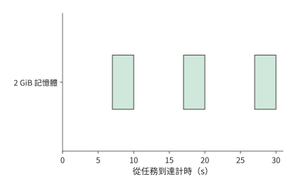

*圖 11-14：每輪只在準備 2 s 和執行 1 s 期間保留環境，三次合計 18 GiB·秒。工作目錄和結果已持久化，三輪仍在第 30 s 完成。*

這項安排的前提是準備能在工具執行前完成。若下一個工具的型別要從流式輸出中預測，那麼呼叫發出後還要等多久，就取決於準備提前了多少，以及預測是否正確。SpecBox 用流式輸出中透露的工具型別和工具切換記錄提前準備相應環境，下面按一次呼叫分析其收益。[^platform]

設一次準備需要 $P$ 秒，提前量為 $L$ 秒，正確預測所需環境的機率為 $h$。假設正確預測不會爭用資源，錯誤預測可以立即取消，猜錯時再按需準備，則發出呼叫後等待環境就緒的平均時間為

$$
E[W]=h\max(P-L,0)+(1-h)P
=P-h\min(P,L).
$$

正確預測時，準備的前 $\min(P,L)$ 秒與模型呼叫重疊，工具呼叫仍需等待剩餘的準備工作完成；猜錯時，實際需要的環境從頭準備。兩條路徑按命中機率加權，就得到上式。當準備工作已經能在模型返回前完成時，再提早開始準備，只會延長環境就緒後等待呼叫的時間。

取 $P=2$ 秒、$h=0.75$。不提前準備時，每次呼叫等 2 秒。提前 1 秒時，四次呼叫平均有三次只等 1 秒，一次因猜錯仍等 2 秒，平均等待為 1.25 秒。提前 2 秒時，正確分支不再等待，平均降至 0.5 秒。提前 3 秒仍是 0.5 秒，卻讓正確分支多保留 1 秒就緒狀態。對 2 GiB 環境，每次預測因此增加 $0.75\times2\times1=1.5$ GiB·秒的平均空閒記憶體佔用。

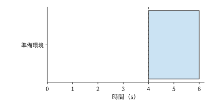

*圖 11-15：按需建立：第 4 s 呼叫到達才開始準備，第 6 s 就緒，等待 2 s。藍色為準備，虛線為呼叫時刻；以下四圖使用相同橫軸。*

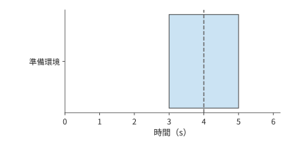

*圖 11-16：預測正確且提前 1 s：從第 3 s 準備到第 5 s，呼叫在第 4 s 到達後仍需等 1 s。藍色為準備環境，虛線標出第 4 s 的呼叫到達時刻。*

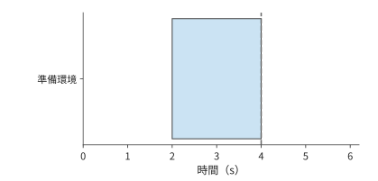

*圖 11-17：預測正確且提前 2 s：準備恰好在第 4 s 呼叫到達時完成。藍色為準備環境，虛線標出第 4 s 的呼叫到達時刻。*

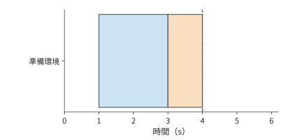

*圖 11-18：預測正確且提前 3 s：準備在第 3 s 完成，橙色部分表示環境已就緒、等待呼叫的 1 s 空閒時間。藍色為準備環境，虛線標出第 4 s 的呼叫到達時刻。*

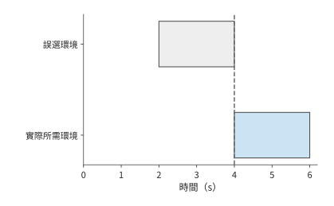

*圖 11-19：預測錯誤：第 2–4 s 準備了不需要的環境（灰色）；第 4 s 取消後，再花 2 s 準備實際所需環境。此圖採用立即取消、無資源爭用的題設。*

由此可以比較三種減少等待的辦法。快取模板可以省去重複獲取資料的開銷；保留已經啟動的環境，可以在呼叫到達後立即執行，但需要持續佔用記憶體；每輪重新建立環境，則可以利用模型呼叫的時間完成準備。章首任務已經知道下一輪所需的執行時，因此在模型呼叫期間準備下一輪環境；多種工具交替出現時，還需在計算中計入預測命中率。

本地工具重放展示了過早準備的後果：從提前 50 ms 準備改為在模型等待一開始就準備後，累計工具呼叫時間仍約為 0.26–0.28 秒，按取樣結果計算的累計記憶體佔用卻從約 0.0193 增到 0.467 GiB·秒，約為原來的 24 倍。增加的記憶體佔用主要發生在環境已經就緒、呼叫尚未到達的區間。只要能在工具呼叫到達前準備好環境，就沒有必要更早建立。[^prewarm]

## 11.3 共享資源池的分配與排程

### 11.3.1 異構資源、成組分配與放置約束

算出單個任務的資源需求後，還要判斷共享資源池能否同時提供這些資源。多卡作業通常需要特定卡型、每卡視訊記憶體、配套 CPU 與主機記憶體，以及適合其通訊模式的位置。空閒 GPU 總數滿足要求，只是作業能夠啟動的必要條件之一。

這些資源還必須落在合適的節點上：章首 CPU 工具每次獨立使用一個核，多卡訓練則必須讓一組加速器共同推進，作業中的所有程序才能一起啟動。因此，多卡作業能否啟動，還取決於空閒資源分佈在哪些節點上。

**例 11-3：GPU、CPU 與節點約束如何造成資源碎片？** 某作業需要四張 H100 和 16 個 CPU 核，並要求這些資源位於同一節點。節點 1 是一臺 DGX H100（8 張 H100 SXM，雙路 Xeon Platinum 8480C 共 112 核），已有作業佔用了四張 H100 和 104 個核，只剩四張 H100 和 8 個空閒核；節點 2 是一臺 DGX A100（8 張 A100，雙路 EPYC 7742 共 128 核），空著四張 A100 和 32 個核。整個資源池既有四張空閒 H100，也有足夠多的 CPU 核，但沒有一個節點滿足全部條件。[^nodes]

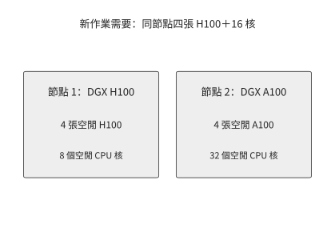

*圖 11-20：整理前：新作業需要同節點四張 H100 與 16 核。節點 1 缺 CPU，節點 2 空著的是 A100。*

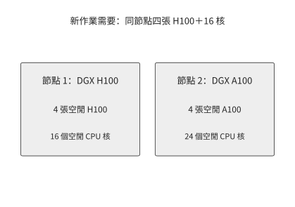

*圖 11-21：將佔用 8 核的 CPU 任務從節點 1 遷到節點 2 後，節點 1 同時擁有四張空閒 H100 和 16 個空閒核，可以啟動新作業。*

假設等待節點 1 的原任務結束需要 12 秒，遷移該任務需要 4 秒，新作業在本地執行需要 20 秒。等待後執行共需 32 秒，遷移後執行共需 24 秒；重新安排資源後，新作業提前 8 秒完成。若另一種相容的跨節點配置準備需 1 秒、執行需 32 秒，則立即分散啟動共需 33 秒，反而更晚。三種方案的完成時間分別為

$$
T_{\mathrm{wait}}+T_{\mathrm{run,local}},\qquad
T_{\mathrm{move}}+T_{\mathrm{run,local}},\qquad
T_{\mathrm{ready,spread}}+T_{\mathrm{run,spread}}.
$$

遷移方案在本例中比等待方案早 8 秒，比分散啟動早 9 秒。隨著狀態增大，遷移耗時也會增長；達到 12 秒時，遷移方案與等待方案同為 32 秒。排程器因此可以把預測的遷移耗時直接與原任務剩餘時間比較，選擇更早備齊全部資源的方案。

資源碎片在生產叢集中同樣存在。香港科技大學、阿里巴巴等機構在 2026 年發表的研究分析了阿里巴巴無伺服器基礎設施（Alibaba Serverless Infrastructure，ASI）的生產 GPU 叢集。研究表明，配套 CPU 不足、作業需要成組啟動以及網路位置限制，都可能使空閒 GPU 無法使用。加入可搶佔的低優先順序作業後，研究中 GPU 分配比例從 68% 提高到 93%。這些低優先順序作業用的是高優先順序作業暫時用不到的加速器；當需要成組啟動的作業到來時，排程器收回這些加速器，並透過遷移任務備齊所需資源。[^platform]

### 11.3.2 佇列、優先順序與搶佔代價

即使節點配置合適，請求同時到達也可能使資源來不及週轉。章首任務均勻到達，每秒需要執行 30 次工具呼叫，48 個 CPU 核足以處理。當呼叫集中到達時，即使總工作量相同，排隊時間也可能不同。

先考慮單個執行程序，每項工具工作需要 1 秒。十項工作在第 0、1、……、9 秒分別到達時，每項到達即可執行，排隊時間都是零。若十項都在第 0 秒到達，執行仍需 10 秒，但各項的排隊時間依次為 0、1、……、9 秒，平均為 4.5 秒。總工作量決定執行程序要工作多久，到達時刻和執行順序決定每個任務先等多久。

圖 11-22 和圖 11-23 對照這兩種到達方式，後者用執行塊前方的灰色條形表示等待時間。同樣 10 秒的執行工作，既可以沒有排隊，也可以產生大量等待。因此，從平均資源需求推到實際響應時間，還必須知道請求是否集中到達。

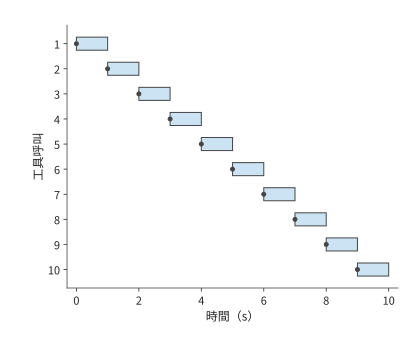

*圖 11-22：十次呼叫每隔 1 s 到達，一個執行程序每次處理 1 s。圓點為到達，藍色為執行，每次均可立即開始。*

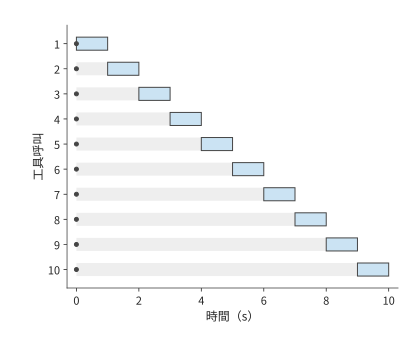

*圖 11-23：十次呼叫同時在第 0 s 到達；灰色為等待、藍色為執行，各行的等待依次為 0–9 s。執行程序仍只工作 10 s，平均排隊為 4.5 s。*

以程式碼修復平臺的突發工具呼叫為例。假設平臺的 48 個核全部空閒，此時同時收到 80 次各需 1 秒的工具呼叫，前 48 項立即執行，其餘 32 項等待 1 秒；平均等待 0.4 秒，全部在 2 秒內完成。若增至兩臺 m5d.metal（96 核），這次突發在 1 秒內完成。增加 CPU 核數提高了處理突發請求的能力；任務均勻到達時，平均仍只需 30 個 CPU 核執行工具。

同一批工具呼叫還需要足夠的環境記憶體。每個環境佔 2 GiB，80 個已準備環境需要 160 GiB。始終駐留的方案需要約 600 GiB，本身就超出了 358 GiB 的記憶體；第 11.2 節的每輪重建環境方案平均只佔 180 GiB，剩下的約 178 GiB 足夠容納這 80 個環境。減少等待期間保留的環境，可以騰出記憶體給新呼叫，空閒的 CPU 也就能及時開始執行。

為突發請求預留容量後，還要決定請求之間的先後順序。優先順序決定誰先使用這份餘量。線上任務要求快速開始，離線任務可以等待，平臺便可以讓離線工作暫借資源，並線上上呼叫到達時收回。設線上任務最多等 2 秒，而離線作業儲存狀態需要 30 秒。這組資源即使可以搶佔，也要在 30 秒後才交還；因此，平臺需要另行預留能在 2 秒內分配給線上任務的資源。

一次搶佔還會丟失未儲存的進度。已執行 20 秒、恢復需 2 秒的作業，從最近的 checkpoint 恢復執行與從頭重做之間相差多少，取決於 checkpoint 之後積累的工作。排程器既要考慮新任務能提前多久開始，也要計入儲存和恢復狀態的開銷，以及原作業因此增加的延遲。

搶佔說明了讓某項任務提前執行的代價。長期執行時，還需要避免同一批任務總被推遲，因此也要明確按什麼標準衡量分配是否公平。兩項任務各得兩張 GPU，看起來份額相同；如果一種卡執行同樣工作所需的時間是另一種卡的兩倍，完成進度就不同。主導資源公平（dominant resource fairness，DRF）把每個任務在各類資源中佔比最高的一類稱為主導資源，並依據主導資源份額公平分配資源；Gavel 和 Pollux 等研究則進一步考慮不同加速器的處理能力或訓練進度。按資源份額分配，關注的是各任務獲得多少資源；按完成進度分配，關注的是各任務推進得多快；限制最長等待時間，則可以避免某些任務長期得不到執行。[^scheduling]

從單次工具呼叫擴大到 RL 訓練，資源需求還會隨階段變化。rollout 生成的互動軌跡既包括模型輸出，也包括工具或環境的反饋。下一節計算，增加生成這類軌跡的加速器，實際能縮短多少訓練時間。

### 11.3.3 RL 生成與訓練的動態資源配比

一輪同步的 RL 迭代需要生成樣本、完成驗證並執行更新。如果每輪所需有效生成量為 $Q$，生成池速率為 $r_g$，簡化的生成階段時間為 $Q/r_g$。增加 rollout 加速器只能縮短可並行的生成部分；每輪仍需完成驗證、更新、權重發布和必要的同步。若這些階段依次執行，則

$$
T_{\mathrm{iter}}=T_{\mathrm{generate}}+T_{\mathrm{verify}}+T_{\mathrm{update}}+T_{\mathrm{publish}}.
$$

例如生成、驗證、更新和釋出分別需 40、10、30 和 5 秒，一輪共需 85 秒。若只把生成速率提高一倍，一輪降至 65 秒，整體僅加速約 1.3 倍；即使生成時間降為零，其餘階段仍需 45 秒，整體加速也不超過約 1.9 倍。隨著生成時間縮短，驗證和更新佔總時間的比例逐漸增大，繼續增加生成加速器所能節省的時間也越來越少。

圖 11-24 中，增加生成加速器只縮短藍色部分。下一步有兩種辦法：改變執行順序，使驗證與生成重疊；或者繼續增加生成加速器，但先計算新加速器加入前的準備開銷。

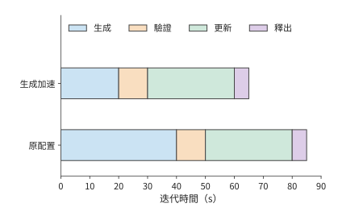

*圖 11-24：四個階段依次執行。生成時間由 40 秒降至 20 秒，其餘三段仍共需 45 秒，因此每輪總時間由 85 秒降至 65 秒。條形長度按時間比例繪製。*

驗證與生成重疊的辦法見第 11.3.4 節。增加臨時生成加速器時，RLBoost 保持訓練組不變，讓臨時例項在完成權重準備後加入生成池。[^rollout]

**例 11-4：共享的傳送出口如何限制多例項的權重分發速度？** Qwen3-8B 的 BF16 完整權重共 16,381,470,720 位元組，約 16.38 GB（十進位制），要向六個 rollout 例項分別傳送。按 RLBoost 的實驗配置，訓練組的八卡 H100 例項經 200 Gbit/s 前端網路卡（接入資料中心通用網路、而非 GPU 間高速互連的網路卡）傳送，每個兩卡 rollout 例項的前端介面為 50 Gbit/s，六路傳輸共用傳送方的出口。向一個接收方傳完權重至少需要

$$
16.38/(50/8)\approx2.62\ \mathrm{s},
$$

而共享出口要傳送約 98.3 GB，向六個例項全部傳完權重至少需要

$$
T_{\mathrm{all}}\geq\max\left(2.62,\frac{6\times16.38}{200/8}\right)\approx3.93\ \mathrm{s}.
$$

六個例項全部收到權重，至少需要 3.93 秒；第一個例項可以更早收到自己的 16.38 GB。隨後接收方把權重載入到 GPU 視訊記憶體並確認版本，排程器再向它分配請求。PolyRL 利用臨時資源擴充套件 RL 生成池，先把完整權重接收到 CPU 緩衝區，再交給採用 TP（見第 6.2.2 節）的 GPU 組。因此，TP=2 只是把例項內部的計算分到兩張卡上，每個例項從外部接收的權重仍是 16.38 GB。

圖 11-25 標出六份權重共同經過的出口。接收例項增加時，需要傳送的總位元組數也增加，傳送方的頻寬卻沒有隨之增加。權重傳完後還要載入到 GPU，這些準備時間都要從臨時例項可用的時間中扣除。

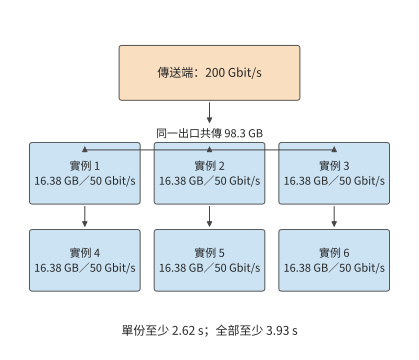

*圖 11-25：每個接收例項都需要一份完整的 16.38 GB Qwen3-8B 權重，六路傳輸共用 200 Gbit/s 傳送出口。每個接收方為 50 Gbit/s，單份傳輸至少 2.62 秒，而傳送方累計傳送 98.3 GB 至少需要 3.93 秒；圖中六個接收框各代表一個獨立例項。*

臨時例項分配到資源後，需要先完成準備，剩餘時間才能用於生成。設例項從獲得資源到開始生成共需 8 秒，可用時間為 20 秒，就只剩 12 秒用於生成；若只能使用 5 秒，則在開始工作之前已經被收回。令可用時間為 $L$、準備與恢復時間為 $T_0$，可工作的視窗就是 $\max(L-T_0,0)$。例項可用的時間越長，準備開銷所佔的比例越小，用於實際生成的時間比例就越大。

臨時例項提前被收回時，損失的不僅是尚未利用的容量，還有已經生成的內容。儲存生成字首可以把已完成工作帶到新例項：新例項讀入「原輸入＋已記錄的輸出」，執行 prefill、建立 KV 快取，然後繼續生成。PolyRL 恢復一組共享取樣參數的請求時，會把組內各條響應截到其中最短的已儲存長度：兩條響應已收到 4,000 和 1,000 個 token 時，各採用 1,000 個 token，共複用 2,000 個 token，較長那條的 3,000 個 token 要重新生成。截到同一長度後，這組請求可以統一安排後續生成。

在一次 Qwen3-8B 4-bit 本地部署的對照中，保留字首省去了 96 個重複取樣 token，請求總耗時卻約為 12.8 秒，而從頭重做約為 11.6 秒。節省的 token 對應生成階段，完整路徑還包含字首重建與重新排程。這組對照中，字首重建與重新排程的額外時間超過了節省的生成時間。[^recovery]

還可以從成本判斷增加臨時例項是否值得。按 RLBoost 使用的歷史價格，訓練例項每小時約 84 美元，六個額外例項各約 5.3 美元，總費率約為每小時 116 美元。全部例項全程計費時，處理同一批訓練任務的吞吐量需達到原來的約 $116/84\approx1.38$ 倍，單位工作成本才下降。若吞吐量只達到原來的 1.2 倍，完成時間縮短，但成本約增至原來的 1.15 倍；達到原來的 1.6 倍，成本則約降至 0.86 倍。[^rollout]

### 11.3.4 驗證 batch、長尾與資源釋放

第 11.3.3 節把驗證視為生成之後的一整段工作；實際上，樣本往往陸續生成，驗證可以更早開始；訓練更新需要等待的，則是整批驗證中的最後一個結果。驗證 CUDA 程式碼時，需要先用 CPU 編譯，再用 GPU 執行。安排驗證任務時，除了 CPU 容量，還要考慮並行執行對 GPU 效能測量的干擾。

若樣本 $i$ 在 $a_i$ 時刻到達，依次需要 $c_i$ 秒編譯和 $g_i$ 秒執行，忽略資源競爭時，整批完成下界為

$$
T_{\mathrm{batch}}\geq\max_i(a_i+c_i+g_i).
$$

執行程序不足會導致排隊，啟動程序和傳輸資料也需要時間，這些開銷都會進一步推遲整批完成的時刻。儘早提交已經生成的樣本，就能讓驗證與後續生成重疊。圖 11-26 和圖 11-27 中的兩種安排都需要 30 秒的驗證處理時間，但完成時刻相差 20 秒；差別只在提交時機。

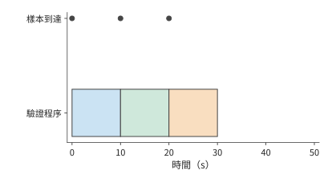

*圖 11-26：三條樣本分別在第 0、10、20 s 到達，立即提交給唯一的驗證程序，每條處理 10 s，整批在第 30 s 完成。圓點標到達時刻。*

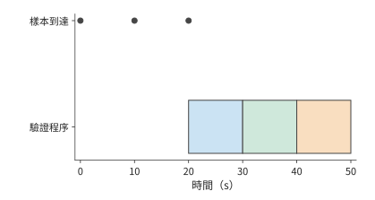

*圖 11-27：先等三條樣本全部在第 20 s 就緒，再依次驗證，結束於第 50 s。與前圖執行相同的 30 s 驗證工作，區別來自提交時機。*

逐條提交消除了等待整批生成的空檔，但整批完成時間仍可能由最慢的一條驗證決定。估計這類長尾任務還要執行多久，需要根據它已經執行的時間更新判斷。設已有測量中九條驗證各需 1 秒，一條需 100 秒，平均為 10.9 秒。若某條驗證已經執行 10 秒仍未結束，用 10.9 減去 10，就會得出只剩 0.9 秒的預測。然而在這一離散分佈中，該驗證必定是那條 100 秒任務，還需 90 秒。因此，應在已知任務尚未結束的條件下估計剩餘時間，即 $E[S-e\mid S>e]$，其中 $S$ 是一項驗證的總執行時間，$e$ 是已經執行的時間，$E[\cdot\mid S>e]$ 表示只在尚未結束的樣本中取平均。DistRS 的排程演算法採用這一類條件剩餘時間，而不是始終使用總體平均數。[^reward]

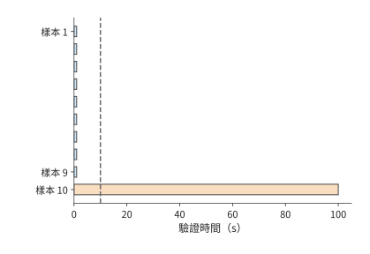

*圖 11-28：九條驗證各用 1 s，一條用 100 s。虛線是已經執行的 10 s；到此時仍未結束的樣本只可能來自 100 s 那一類，剩餘時間為 90 s。*

估計出各條樣本的剩餘時間後，便可以據此安排其他驗證，儘量不延長整批的等待時間。假設 batch 中有一條樣本最早要到第 120 秒才能完成。若要安排一項執行時間不超過 100 秒的工作，該工作最遲在第 20 秒啟動，便能利用前面的空隙而不推遲整批；若其環境準備需要 5 秒，準備最遲在第 15 秒啟動。由整批的完成時刻可以反推出各項工作的最遲開始時間，排程器據此推遲不緊迫的工作，把資源先交給更早到期的 batch。

推遲不緊迫的驗證可以減少驗證資源佔用，但一旦推遲了整批完成，也會讓訓練組繼續等待。假設驗證少用 60 H100·秒，卻使仍持有 64 張 H100（8 臺 HGX H100）的訓練組多等 2 秒。訓練組新增 $64\times2=128$ H100·秒，整個系統淨增 68 H100·秒。若訓練組只有 16 張卡（2 臺），新增等待為 32 H100·秒，系統反而淨省 28 H100·秒。驗證資源是否值得縮減，因而取決於被阻塞的訓練組有多大。

安排好完成時刻以後，還要確認結束或超時的任務確實停止了執行，資源才能交給下一項任務。一次受控驗證中，等待方返回超時後，後臺執行緒仍工作約 130 ms；主動終止子程序後，約 0.8 ms 就觀察到程序退出。如果超時一到就把同一資源交給下一項任務，只報告超時而不終止後臺執行緒，兩項任務就會同時使用資源。對於 CUDA 效能驗證，這種競爭還可能改變測得的執行時間和獎勵。[^validation]

## 11.4 模型服務的選擇與呼叫成本

### 11.4.1 任務質量與思考預算

每輪重建環境已經把章首平臺記憶體需求從 600 GiB 降到 180 GiB，但任務完成時間仍為 30 秒，超過 24 秒目標。因此要改變關鍵路徑上的模型呼叫。把每個 V4-Flash 副本同時服務的會話數從 32 減到 16，每個輸出 token 的時間由 25.3 ms 降到 16.9 ms，355 個 token 的完整呼叫由 9 秒降到 6 秒，三輪便從 30 秒降到 21 秒；模型未變，任務透過率也不變。若環境始終駐留，每項佔用也從 60 降到 42 GiB·秒，整個平臺的記憶體需求從 600 降到 420 GiB，仍超過 358 GiB；如果每輪重建環境，仍只需在各輪準備和執行期間保留環境，累計佔用保持在 18 GiB·秒。模型服務的選擇因此會同時影響任務耗時和環境記憶體需求。[^design]

模型選擇還決定每次呼叫的成本構成。一次模型呼叫的時間和成本，包括處理輸入、生成思考 token 和生成可見輸出三部分。思考預算決定允許生成多長的內部推理，實際用量決定每次呼叫需要支付多少費用。先在輸出都能透過測試的條件下，比較兩種思考長度設定的單次呼叫成本，再比較兩種服務完成三輪任務所需的成本。

**例 11-5：思考長度縮短到十分之一，總成本減少多少？** 設兩種思考長度設定都能透過相同測試，每次輸入 10,000 個 token，可見輸出 200 個 token，實際思考分別為 1,000 和 100 個 token。價格取 Claude Sonnet 5 的標準 API 價格：輸入每百萬 token 2 美元，生成每百萬 token 10 美元，思考 token 按生成計費。那麼單次成本（美元）分別是

$$
C_{1000}=\frac{10000\times2+(1000+200)\times10}{10^6}=0.032,
$$

$$
C_{100}=\frac{10000\times2+(100+200)\times10}{10^6}=0.023.
$$

思考 token 數降為原來的十分之一，總成本卻只減少約 28%。原有成本中的 0.020 用於輸入，0.002 用於可見輸出，這兩項保持不變；下降的是從 0.010 變為 0.001 的思考成本。因而，思考佔原成本的比例決定了壓縮思考能節省多少。[^platform]

圖 11-29 將節省發生的位置單獨標出。這一比較假定兩種設定都能完成任務；如果縮短思考後需要重試，節省的橙色部分就要與重試新增的整次呼叫成本一起比較。

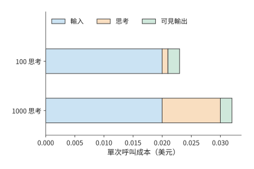

*圖 11-29：兩次呼叫的輸入和可見輸出相同，只改變思考長度。橙色成本縮短到原來的十分之一，藍色和綠色成本保持不變，所以總成本由 0.032 美元降到 0.023 美元，減少約 28%。價格和 token 數見例 11-5。*

假設 100 次呼叫各省 0.009 美元，共節省 0.9 美元；其中 30 次因預算截斷而重試，每次重試花費 0.032 美元，就新增 0.96 美元。總成本反而多出 0.06 美元。縮短思考預算可能增加重試次數。因此，比較任務總成本時，要同時計入單次呼叫的節省和額外重試的開銷。[^thinking]

### 11.4.2 服務路徑、字首快取與實際用量

第 11.4.1 節靠減少生成量降低成本；輸入一側的主要節省機會是重複字首：同一任務的多輪呼叫通常會重複傳送公共提示和此前的對話記錄。一項模型請求從控制器進入統一服務入口，再交給選定的模型後端。這裡的後端指實際執行模型推論的推理例項或服務提供方。入口負責鑑權、路由和限流，後端負責輸入處理與輸出生成。章首每秒 30 次呼叫在這條路徑上形成持續需求；每次呼叫攜帶的公共提示與任務記錄，則決定其中多少輸入可以複用。

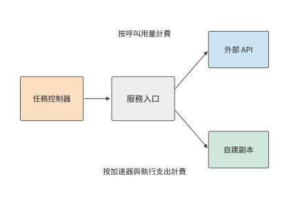

*圖 11-30：同一任務使用模型服務的兩種方式及其計費方法。外部 API 按呼叫用量收費，自建副本按裝置預留及執行支出計價；兩條路徑都將成本歸到任務及嘗試。輸入拆分為普通處理、快取建立和快取讀取，生成單獨計量。*

將一次呼叫的輸入拆為互不重疊的普通輸入 $I_u$、快取建立輸入 $I_w$ 和快取讀取輸入 $I_h$，計費的生成 token 數為 $O$，對應的每百萬 token 價格為 $p_u,p_w,p_h,p_o$，則

$$
C_{\mathrm{call}}=\frac{I_up_u+I_wp_w+I_hp_h+Op_o}{10^6}+C_{\mathrm{storage}}+C_{\mathrm{tool}}.
$$

同一個輸入 token 在一次呼叫中只屬於普通輸入、快取建立或快取讀取中的一類。將服務返回的用量記錄（usage）按這三類整理後，分別乘以對應單價再相加，就得到輸入成本。生成 token 數 $O$ 則是思考 token 數與可見輸出 token 數之和。

**例 11-6：跨輪快取公共字首能節省多少輸入費用？** 每輪有 8,000 個 token 公共字首和 2,000 個 token 不復用的新輸入。按 Claude Sonnet 5 的標準價格，普通輸入每百萬 token 2 美元，5 分鐘快取的首次建立 2.5 美元，快取讀取 0.2 美元。第一次建立，後九次在有效期內全部命中。無快取時十輪輸入成本為 0.20 美元；有快取時（美元）為

$$
\frac{8000\times2.5+2000\times2}{10^6}
+9\frac{8000\times0.2+2000\times2}{10^6}=0.0744.
$$

本例保持十輪生成和工具執行相同，比較的成本差額全部來自輸入。第一次使用快取花費 0.024，比普通處理的 0.020 多出 0.004；此後每輪只花 0.0056，比普通處理少 0.0144。因此第二次訪問就已收回首次建立的溢價。共訪問 $n$ 次時，使用快取更省的條件是 $np_u>p_w+(n-1)p_h$。快取有效期越長，重複讀取就越有機會收回首次建立的額外成本。[^platform]

快取節省多少，還取決於命中的是哪些請求。再看兩次呼叫，一次字首長 1,000 個 token，一次長 9,000 個 token。若只有短字首命中，請求命中率為 50%，快取讀取的 token 數卻只佔兩次呼叫字首總長度的 10%；若只有長字首命中，請求命中率仍為 50%，讀取佔比變成 90%。按 token 收費時，後者節省的輸入處理費用遠多於前者。每次命中的權重，由輸入長度決定。

### 11.4.3 排隊、限流與模型路由

快取只有在請求到達儲存了相應字首的後端時才能複用。因此，選擇後端既影響命中率，也影響排隊時間。為了使用已有的字首快取，有時值得多等待一段時間。設執行同一模型的後端 A 排隊 200 ms，命中後處理字首需 50 ms；後端 B 排隊 20 ms，未命中處理需 500 ms；共同網路時間為 50 ms，後續生成相同。進入生成前，A 用 300 ms，B 用 570 ms，A 領先 270 ms。快取命中節省了 450 ms 的處理時間，但增加了 180 ms 的排隊時間，淨收益恰好為 270 ms。當 A 的排隊時間增至 470 ms 時，兩者在生成開始前花費的時間就相同了。

章首每秒 30 次模型呼叫還受到並行容量的約束。每次呼叫需 9 秒時，平均有 270 次呼叫正在執行；縮短到 6 秒後，降為 180 次。但快速服務的時間是靠減小每個副本的 batch 換來的：每個副本只同時服務 16 個會話，10 個副本只有 160 個並行槽，無法容納 180 次呼叫，需要增至 12 個副本（48 張 B200）。每次呼叫佔用的 GPU 時間也從 $4\times9/32=1.125$ B200·秒增至 $4\times6/16=1.5$ B200·秒。按量 API 則通常分別限制單位時間內的請求數和 token 數；若每次呼叫的輸入或輸出增多，token 額度可能先於請求數額度用完。選擇模型服務時，需要分別比較請求排隊時間、並行呼叫數和 token 處理能力，找出限制任務完成速度的因素。

**例 11-7：快取命中與成功率何時能抵消更高的服務單價？** 向 Claude Haiku 4.5（記為 A）和 Claude Sonnet 5（記為 B）各提交 1,000 項單次呼叫任務。每次輸入 20,000 個 token，其中公共字首 19,000、新輸入 1,000。字首快取已經建立，沒有額外的快取建立、儲存、工具和預熱成本，任務透過驗收的機率與快取是否命中相互獨立。單價取兩者的標準 API 價格，思考 token 數與成功機率為題設。[^routing]

| 參數 | A：Haiku 4.5 | B：Sonnet 5 |
| --- | ---: | ---: |
| 普通輸入單價 / 美元每百萬 token | 1 | 2 |
| 快取讀取單價 / 美元每百萬 token | 0.1 | 0.2 |
| 生成單價 / 美元每百萬 token | 5 | 10 |
| 實際思考 token | 1,800 | 100 |
| 可見輸出 token | 200 | 200 |
| 同一驗收規則下的成功機率 | 0.80 | 0.98 |

A 的字首始終命中，每次成本為 0.0129 美元，成功任務平均成本為 $0.0129/0.8\approx0.0161$ 美元。B 全命中時每次成本為 0.0088 美元，未命中時為 0.0430 美元。令 B 的請求命中率為 $h$，則

$$
C_B(h)=\frac{0.0088h+0.0430(1-h)}{0.98}.
$$

令 B 的平均成本等於 A 的平均成本，得到 $h\approx79.5\%$。B 的各項 token 單價都是 A 的兩倍，卻在高命中率下更省，因為實際生成量較少且成功率較高。命中率降至 50% 時，B 的成功任務成本升至約 0.0264 美元，此時 A 更便宜。

再要求至少 90% 的提交任務在 6 秒內透過驗收。設完整請求時長為：A 10 秒，B 命中 4 秒、未命中 12 秒，均已包含排隊和生成。A 不滿足期限；B 需要 $0.98h\geq0.90$，即 $h\geq91.8\%$。

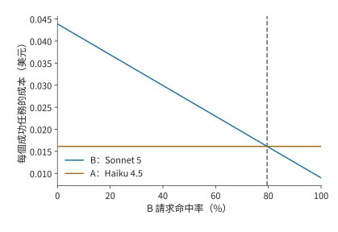

*圖 11-31：B 的成功任務成本隨命中率提高而下降，在約 79.5% 處等於 A。兩者的總成本先分別除以各自成功完成的任務數；本圖只比較成本，下一圖單獨加入期限。*

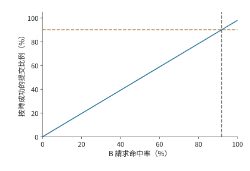

*圖 11-32：只有 B 命中的 4 s 路徑滿足 6 s 期限；再乘 98% 的驗收透過率，按時成功比例為 0.98h。達到 90% 目標要求 h 至少約 91.8%。*

本例每次字首都是 19,000 個 token，所以請求命中率 $h$ 也等於字首內部的 token 命中比例；相對於完整的 20,000 個 token 輸入，快取讀取佔比為 $0.95h$。成本交點約為 79.5%，業務門檻約為 91.8%。從低命中率向右移動，B 先變得便宜，隨後才滿足按時完成目標。把服務目標放到成本曲線上，就能直接讀出最終可選區域。

### 11.4.4 自建服務、按量 API 與訂閱的成本比較

路由比較確定了哪些模型服務同時滿足質量、成本和期限要求。選定服務以後，還要決定是自建部署、按呼叫付費，還是購買訂閱。模型選擇確定每次任務所需的服務，採購方式決定如何為這些服務付費。自建容量先支付裝置與預留成本，再由任務分攤；按量 API 隨呼叫支付；訂閱則按月或其他週期支付成本，取得相應產品的使用許可權。三種方式的共同問題是：滿足相同任務量時，總支出隨使用量如何變化。

設一段固定統計視窗中，自建預留與固定支出為 $F$，每項提交任務的新增成本為 $v$；API 每項平均成本為 $c$。若兩者成功機率相同且處理能力均滿足需求，$N$ 項任務下自建更省的條件為

$$
F+Nv<Nc,\qquad N>\frac{F}{c-v}\quad(c>v).
$$

若 $c\leq v$，API 每項成本已不高於自建新增成本，固定投入又為正，因此 API 在所有使用量下都更省。若兩者成功率不同，分別以 $Np_{\mathrm{self}}$ 和 $Np_{\mathrm{api}}$ 為分母，比較的就變成每個成功任務的成本。

下面用同一模型、同一種 GPU 比較兩種付費方式，兩邊 batch size 相同，任務質量也相同，只差計費方式。預留方式按 GPU 雲平臺 Runpod 公開的 B200 Pod（按小時計費、獨佔使用的 GPU 例項）價格（每卡時 6.79 美元）租 4 張卡一個月（720 小時），$F=4\times720\times6.79=19{,}555.2$ 美元；GPU 已經整月付費，每項任務的新增成本 $v$ 為 0。按量方式使用同一平臺按秒計費的 B200 Serverless worker（每卡時 8.64 美元），與按量 API 一樣隨用量付費，並同樣以 32 個會話為一個 batch 執行。沿用章首任務，每項三次呼叫、每次佔用 1.125 B200·秒，按量成本為 $c=3\times1.125\times8.64/3600=0.0081$ 美元。

成本相等時的任務量為 $19{,}555.2/0.0081\approx241$ 萬項。每項任務佔用一個會話 27 秒，這組 4 張 B200 一個月最多處理 $32\times2{,}592{,}000/27=307.2$ 萬項，交點對應約 78.6% 的利用率，恰好是兩種單價之比 $6.79/8.64$。100 萬項時預留仍要 19,555.2 美元，按量只需 8,100 美元；300 萬項時按量需要 24,300 美元，預留更省。固定投入在低使用量下難以攤薄，高使用量下則被較低的新增成本抵消。

圖 11-33 中，預留成本是一條水平線，高度來自整月租金，右端止於這組 GPU 的處理上限；按量成本從零開始，斜率由每項任務佔用的 GPU 時間決定。執行效率提高後，同樣 4 張 B200 每月能處理更多工，預留線向右延長，按量線的斜率隨之降低；交點仍對應同一個利用率，即兩種單價之比。

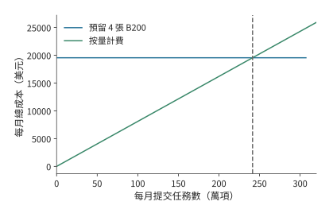

*圖 11-33：4 張 B200 預留一個月共 19,555.2 美元，按量成本為 0.0081N 美元，N 為提交任務數。兩條線在約 241 萬項相交，對應預留 GPU 約 78.6% 的利用率；預留線止於每月 307.2 萬項的處理上限。*

執行效率能提高多少，取決於時間用在哪裡。仍以 4 張 B200 執行 DeepSeek V4-Flash、同時服務 32 個會話、每個會話保留 200K token 上下文的部署為例，會話數和 GPU 租價保持不變。每個輸出 token 約需 25.3 ms，其中逐 token 的 decode 佔 15.9 ms，其餘輸入處理和上下文重建佔 9.4 ms。decode 階段的實際速度提高到兩倍後，每個輸出 token 所需時間降為 $15.9/2+9.4\approx17.4$ ms，總加速約 1.46 倍，每百萬輸出 token 的 GPU 成本由約 6.0 美元降到 4.1 美元。[^purchase]

原先每個輸出 token 所需時間中，約 63% 用於 decode，其餘 37% 保持不變，因而兩倍 decode 加速只能將總時間縮短約 31%。即使把 decode 時間降到零，其餘處理仍需要 9.4 ms。這 9.4 ms 還要按第 1.3.4 節的判據再拆一次：讀取 KV 和重建上下文是必需的工作，按頻寬算出的時間構成新的下界；排程、複製和格式轉換則是可以去掉的軟體開銷，才是最佳化空間。若要突破這一限制，需進一步最佳化輸入處理和上下文重建；同一組加速器在單位時間內生成更多 token，固定租價才能由更多產出分攤。

章首的程式碼修復平臺每秒呼叫模型 30 次。快速服務每次呼叫多佔 0.375 B200·秒，按 Pod 價格約多 0.00071 美元，平臺每秒便多支出約 0.021 美元；這筆額外成本讓任務耗時從 30 秒降到 21 秒，滿足 24 秒期限。章末將同時計算新增模型費用與節省的環境佔用費用，比較各方案的任務總成本。

## 11.5 完整任務的恢復、成本計算與擴容

### 11.5.1 工具失敗後的恢復與模型選擇

第 11.4 節選擇模型時，主要考慮了呼叫正常完成的情況。實際執行中，還需要處理呼叫失敗、結果丟失和工具異常。如果控制器沒有收到測試完成的確認訊息，就無法區分兩種情況：測試尚未完成，或者測試已經完成但確認訊息丟失。

恢復時，控制器先查詢已持久化的結果，核對操作標識和輸入檔案版本。如果結果存在，就可以繼續；如果不存在，再判斷是否允許重試。冪等操作指以同一操作標識重複呼叫時，最終業務效果與呼叫一次相同。只讀查詢或冪等操作重複執行通常不成問題；外部付款、建立資源或傳送訊息重複呼叫，卻可能使同一操作實際發生兩次，需要目標系統支援操作標識、事務或補償。

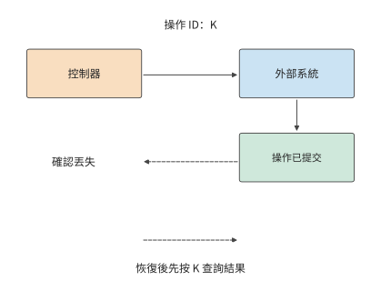

*圖 11-34：外部系統已執行並提交操作 K，確認卻丟失。恢復環境不會撤回外部操作的結果；控制器按同一操作標識查詢結果後接續任務。實線表示請求與執行，虛線表示確認及恢復查詢。*

假設執行一次工具需要 3 CPU·秒，結果被髮送兩次。如果接收方按操作標識去重，累計 CPU 時間仍為 3 秒；如果控制器因確認丟失而再執行一次，累計 CPU 時間就增至 6 秒。兩種情況最後都可能只有一條結果，卻消耗不同資源。訊息去重解決前一種重複；後一種重複要靠持久化的結果和目標系統的冪等協議來避免。環境外已經提交的操作在快照恢復後仍然存在，恢復流程要先查詢其提交狀態。[^records]

不過，請求正常返回，並不意味著恢復時一定能找到它的記錄。傳統作業系統也區分「寫入完成」和「已經持久化」。以普通檔案的緩衝寫入為例，`write()` 返回時，資料可能仍在核心的頁快取中，程式可以繼續計算，由作業系統在後臺寫入。若程式必須等資料存好才能繼續，就需要呼叫 `fsync()`，等待檔案資料和必要的後設資料寫入儲存裝置，並檢查是否成功。[^fsync]

Agent 執行時也需要規定清楚：向呼叫者報告完成時，只保證答案已經生成，還是保證訊息、工具結果和恢復位置都已儲存。這些約定就是永續性語義。僅對聊天日誌呼叫 `fsync()` 還不夠，因為恢復所需的資訊可能分別存放在日誌、工作目錄和外部資料庫中；控制器還要核對訊息中的操作、目錄中的檔案和資料庫中的結果是否一致。

這裡按 ReAct 迴圈的輪次儲存：每輪包括一次模型輸出、由此發起的工具呼叫及其返回結果，可能包含多條訊息。控制器將這一輪的記錄追加到本地 JSONL 檔案，確認整輪儲存成功後才進入下一輪；儲存失敗就立即中止。因此，本地不會在某輪儲存失敗後，還繼續執行並儲存後續輪次。這裡的「儲存成功」還要說明能承受哪種故障：寫入本地頁快取、完成本地 `fsync()`，或收到雲端持久化確認，提供的保證並不相同。本地檔案可以支援程序重啟後的恢復，卻未必能應對整臺機器及其磁碟不可用。

為了減少等待，也可以每輪先儲存到本地，再在後臺上傳該輪新增的記錄。假設上傳失敗後暫不重試，也不中止本地執行：第一輪執行測試、取得失敗結果，第二輪修改程式碼、取得工具確認，第三輪再次測試、取得新結果。三輪記錄都已寫入本地 JSONL，但第二輪上傳失敗，第三輪上傳成功（圖 11-35）。此時本地歷史完整，雲端卻缺少第二輪的模型輸出和工具結果。如果本機隨後不可用，換一臺機器僅憑雲端記錄恢復，就會遇到這個缺口。若每次上傳的是包含此前所有輪次的完整快照，或上傳程式必須補齊失敗記錄才繼續，則不能套用這一例子。

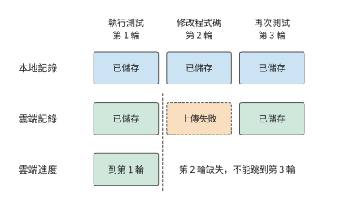

*圖 11-35：初始狀態已在本地和雲端儲存，每列代表一個 ReAct 輪次。每輪先儲存到本地，再非同步上傳該輪新增記錄；本例允許上傳失敗後繼續執行和上傳後續輪次。第二輪上傳失敗後，即使第三輪上傳成功，雲端歷史仍只完整到第一輪。橫向排列表示輪次順序，不表示耗時。*

採用這類非同步儲存方式時，控制器必須分別跟蹤本地和雲端的儲存進度。雲端不僅要記錄收到的最後一輪，還要記下從起點連續儲存到了哪一輪。不能因為第三輪上傳成功，就把連續儲存位置從第一輪改成第三輪；只有補齊第二輪，或用完整的本地副本重建並核對後，才能確認雲端歷史也完整到第三輪。

刪除舊日誌時也一樣。若要刪除前兩輪的記錄，就必須先儲存一份能夠恢復到第二輪結束時的完整狀態，並將狀態與對應輪次一起提交。恢復時若既找不到此前的完整日誌，也找不到這份狀態，即使剩餘日誌全部讀完，也應返回 `incomplete`，表示沒有足夠依據確認歷史完整。如果介面允許按訊息位置恢復，還須確認該位置是否對應一個已儲存的完整輪次，並核對工作目錄版本；輪內位置若沒有單獨儲存，就不能承諾恢復到那裡。已經提交到外部系統的操作，也不會因為訊息回退而撤銷。[^durability]

對本章的程式碼修復任務，可以借用資料庫事務的做法，把一輪「模型決策—工具執行—儲存結果」作為一個整體提交。這一輪的模型訊息、工具結果和相關檔案版本都儲存成功後，控制器才記下這一輪已提交；重啟後，再從最後一輪完整提交的結果接著執行。這也是 **Agent 事務（agent transaction）**研究的一項內容：如何在 Agent 執行中實現原子性、一致性、隔離性和永續性，即資料庫中的 ACID 性質。[^agent-transaction] 如果一輪操作還呼叫了外部服務，就需要對方支援操作標識、冪等介面或補償處理；僅在本地記下「已提交」，不能保證外部操作也恰好完成一次。

儲存得越頻繁，故障後通常需要重做的工作越少，但正常執行時的開銷也越大。用一個小算例比較：100 個請求依次執行，每個用時 200 ms；每次持久化提交需要 8 ms 的固定開銷，另外每寫入一個請求的記錄需要 2 ms。假設提交期間暫停處理請求，忽略其他開銷，結果如下。

| 儲存方式 | 儲存共用時 | 無故障時總用時 | 故障後最多重做的計算時間 |
| --- | ---: | ---: | ---: |
| 每個請求提交一次 | $100(8+2)=1000$ ms | 21 s | 0.2 s |
| 每 10 個請求提交 | $10(8+10\times2)=280$ ms | 20.28 s | 2 s |

每 10 個請求一起提交，正常執行可節省 0.72 s；但若恰好在提交前發生故障，就要重做這 10 個請求，共 2 s 的計算。這裡假定每次提交要麼全部成功，要麼全部不生效，未提交的請求都需重做，工具也允許安全重試；表中未計入重建環境和重新儲存的時間。若改為非同步儲存，控制器就可以一邊處理後續請求，一邊寫入已有結果。故障後需要重做多少，取決於當時還有多少記錄沒有存好。因此，比較儲存方式時，除了任務完成時間，還應記錄已返回但未儲存的請求數，並核對重啟後實際能恢復到哪裡。

這裡仍然需要回答全書反覆討論的兩個問題：資料放在哪裡，誰必須等它。第 11.2 節在模型呼叫期間釋放工具環境，以節省記憶體。這樣做的前提是下一輪所需的狀態已經存到環境之外，或可以在丟失後重新計算。若唯一一份結果還在環境記憶體中，控制器就要等它儲存完成再釋放環境，否則只能在丟失後重做。因此，排程器安排資源時，也要計入儲存狀態的等待時間和故障後的重做成本。

確認能從哪裡繼續後，控制器還可以選擇換用更強的模型。若原模型已完成兩輪，補丁和測試結果也已完整儲存，新模型就能接著求解，無需重做前兩輪。這樣只需支付下一次模型呼叫的成本，並可能提高求解成功率。後續修復有多大把握，取決於此前為什麼失敗。因此，下文計算恢復樹中各分支的機率時，都以任務已經到達該節點為條件。

### 11.5.2 成功任務的完整成本

失敗後重試或換用模型，都要額外付費，因此只看一次呼叫的價格，算不出完成一個任務實際花了多少錢。應把成功和失敗嘗試的支出全部加起來，再除以實際完成的任務數。設統計期間的總支出為 $C_{\mathrm{all}}$，滿足品質要求的任務數為 $N_q$，其中按時完成的任務數為 $N_{q,d}$，則每個成功任務和每個按時成功任務的平均成本分別為

$$
\overline C_q=\frac{C_{\mathrm{all}}}{N_q},\qquad
\overline C_{q,d}=\frac{C_{\mathrm{all}}}{N_{q,d}}.
$$

失敗嘗試也消耗了模型和工具資源，不能從總支出中扣除。例如十項任務共支出 1 美元，五項成功，平臺每完成一項實際支付 0.2 美元。若只統計五項成功嘗試花費的 0.5 美元，就會得到 0.1 美元，恰好漏掉另一半支出。

這項單位成本也可以在部署前用有限重試樹初步估算。對路徑 $\pi$，令路徑機率為 $p_\pi$，各步驟成本之和為 $c_\pi$，則 $E[C]=\sum_\pi p_\pi c_\pi$。成功機率是所有最終成功路徑的機率之和。每個節點的機率都應根據此前經歷的執行結果計算；如果兩類失敗的後續成功率不同，應拆成不同節點。

**例 11-8：區域性修復對成功率與超時比例的影響。** 另取首次嘗試需 10 秒的小例子，比較以下有限恢復策略。首次嘗試用 Claude Sonnet 5，輸入 2,500、輸出 500 個 token，按標準價格花費 0.010 美元，耗時 10 秒；80% 直接成功，12% 進入區域性修復，8% 直接升級，即換用能力更強的模型重試。區域性修復仍用 Sonnet 5，輸入 1,500、輸出 300 個 token，新增 0.006 美元和 4 秒，條件成功率 60%，其餘升級。升級換用 Claude Opus 5（每百萬 token 輸入 5 美元、輸出 25 美元），輸入 3,000、輸出 600 個 token，新增 0.030 美元和 8 秒，條件成功率 98%。20 秒期限只用於評價，不主動終止任務。[^retry]

圖 11-36 中，區域性修復成功時，任務在第 14 秒結束；修復失敗後再升級，就比直接升級多用 4 秒。總成功率提高後仍有一部分成功結果超過期限，原因就在這一額外分支。

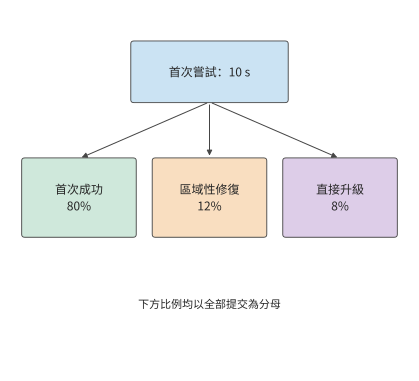

*圖 11-36：首次嘗試在 10 s 後分為成功、區域性修復、直接升級三類。框內比例以全部提交為分母；下一圖展開修復的條件分支。*

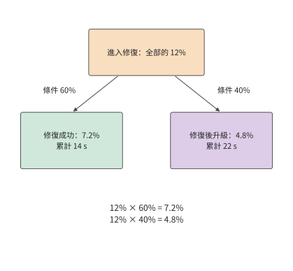

*圖 11-37：把修復節點放大：進入此處的 12% 中，60% 修復成功，佔全部提交 7.2%；40% 轉入升級，佔全部提交 4.8%。升級再用 8 s，因此後一條路徑累計 22 s。*

六種執行結果如下。每行列出的成本都是整個執行過程的總成本，包含此前各次嘗試的支出。

| 執行過程與結果 | 機率 | 完整成本 / 美元 | 時間 / s | 透過測試且按時完成 |
| --- | ---: | ---: | ---: | --- |
| 首次成功 | 0.80000 | 0.010 | 10 | 是 |
| 首次 → 修復成功 | 0.07200 | 0.016 | 14 | 是 |
| 首次 → 修復 → 升級成功 | 0.04704 | 0.046 | 22 | 否 |
| 首次 → 修復 → 升級失敗 | 0.00096 | 0.046 | 22 | 否 |
| 首次 → 升級成功 | 0.07840 | 0.040 | 18 | 是 |
| 首次 → 升級失敗 | 0.00160 | 0.040 | 18 | 否 |

可以用 1,000 項提交任務逐步計算。首次嘗試花費 10 美元，約 800 項直接成功。120 項進入區域性修復，新增成本 $120\times0.006=0.72$ 美元，其中約 72 項成功；餘下約 48 項連同直接升級的 80 項，共有 128 項升級，新增成本 $128\times0.030=3.84$ 美元。總成本約為 14.6 美元，最終約 997 項成功。

先修復再升級的路徑需要 $10+4+8=22$ 秒，超過 20 秒期限。約有 47 項任務透過了測試，但超過了期限，因此按時成功數約為 950。每項透過測試的任務平均花費約 0.0146 美元，每項按時透過測試的任務平均花費約 0.0153 美元；只做首次嘗試時，成本為 $10/800=0.0125$ 美元，但成功率只有 80%。恢復提高了完成比例，也提高了單位完成成本。業務若要求至少 95% 的提交按時成功，就需要這項額外投入；若只比較單次成本，則會遺漏它帶來的完成量。

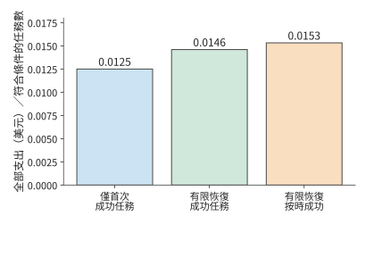

*圖 11-38：同一批提交任務換用恢復策略後的成本與結果。各柱均以相應策略的全部支出為分子，再分別除以透過測試的任務數或按時透過測試的任務數；只做首次嘗試的成功率為 80%，有限恢復策略約為 99.7%，其中約 95.0% 的提交在 20 秒內成功。分支機率、成本和時間見例 11-8，期限用於評價而不強制停止執行。*

採用上述恢復策略後，成功比例從 80% 提高到約 99.7%，但約 4.7% 的提交要到第 22 秒才能完成。按 20 秒期限統計時，這部分任務花費了資源，卻不能計入按時完成數。如果只縮短評價所用的期限，執行過程不變，只是更少的任務會被算作按時成功；如果限制重試次數，控制器則會少執行一些步驟，支出和成功率也會隨之改變。[^records]

恢復策略之外，還要考慮模型加速帶來的影響。模型變快以後，環境準備可能不再能與模型呼叫完全重疊，開始影響任務完成時間。假設下一次工具呼叫必然發生，快速服務還需 6 秒生成，而模板不在本機、走冷路徑建立環境約需 2.7 秒；在模型開始生成時建立環境，這 2.7 秒準備時間就完全與模型生成重疊。若模型階段縮短至 1 秒，同樣時機開始建立仍要再等約 1.7 秒。[^core-calculation] 先只把模型呼叫加快，保持準備策略不變；再比較更早準備、保留已就緒環境和按需等待三種做法的成本，並計入提前佔用的資源，以及提前準備的環境最終沒有用上時的開銷。

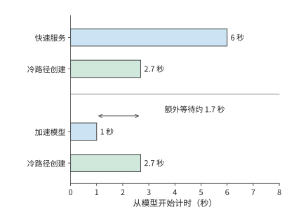

*圖 11-39：模型加速後，環境建立成為工具開始執行前的等待來源。兩種情況都在零時刻開始建立環境；工具須同時等待模型決策與環境就緒。橫軸為秒。*

恢復時要重建的不只是工具環境，還有模型服務一側的狀態。本章設計題用 V4-Flash 計算時間和成本；模型側狀態的恢復則以全書跟蹤的 V4.1 Flash 會話為例，因為其全域性 KV 可以取回，區域性 SWA 狀態則要重放提示末尾的 token 來重建（第 3.2.4 節），兩部分的恢復路徑不同。這樣的會話在等待工具時，同時保留兩組狀態：作業系統管理程序、檔案與環境，模型服務管理全域性 KV 和區域性 SWA 狀態。恢復任務需要分別準備這兩組狀態，再在工具結果進入下一輪模型呼叫時匯合；已執行的外部操作透過查詢目標系統確認結果。[^v41-case] 環境準備與 KV 取回能夠並行時，兩者中較晚完成的一項決定恢復所需的等待時間。

### 11.5.3 CPU、GPU、記憶體與服務額度的擴容選擇

下面根據章首提出的 24 秒完成期限，選擇模型服務與環境管理方案。此前已經得到三項結果：普通服務每次呼叫 9 秒，三輪需要 30 秒；快速服務每次 6 秒，三輪需要 21 秒；每輪重建環境把每項任務的累計環境記憶體佔用降到 18 GiB·秒，準備工作額外使用 0.3 秒 CPU 時間。

**例 11-9：如何選擇模型服務與環境管理方式，才能按期完成且成本最低？** 沿用章首條件：每 0.1 秒到達一項任務，每項執行三輪；工具平臺是一臺 48 核、約 358 GiB 記憶體的 m5d.metal，模型服務現有 10 個 V4-Flash 副本（40 張 B200）。兩種服務執行同一個模型，最終透過測試的機率均為 95%，且任務能否透過測試與到達時刻無關。模型呼叫按每次佔用的 B200 時間計價，每卡時 6.79 美元：普通服務每次 1.125 B200·秒，約 0.00212 美元；快速服務每次 1.5 B200·秒，約 0.00283 美元。CPU 與記憶體按 E2B 公佈的沙箱單價計費，每 CPU·秒 0.000014 美元，每 GiB·秒 0.0000045 美元，均按實際使用量計算。檔案持久化成本已包含在每輪工具執行中；平臺共有的固定支出在四種方案中相同。[^design]

首先排除「只增加 CPU」。三輪工具共 3 秒，即使將工具加速兩倍，普通服務仍需 $27+1.5=28.5$ 秒；把工具時間降到零，仍有 27 秒模型呼叫。CPU 擴容無法把這條序列路徑縮短到 24 秒以內。

接著比較環境策略。每輪重建環境的準備工作與模型呼叫重疊，不改變完成時間：普通服務仍為 30 秒，換快速服務後模型總時間降到 18 秒，加工具 3 秒，共 21 秒。因此在快速服務下，始終駐留與每輪重建環境都滿足期限，需要進一步比較資源與成本。

圖 11-40 先按期限篩選方案：普通模型的最後一輪結束於期限之後，快速模型的三輪則都能在期限內完成。接下來只需在使用快速模型的兩種環境策略之間比較成本，同時檢查是否超過平臺容量。

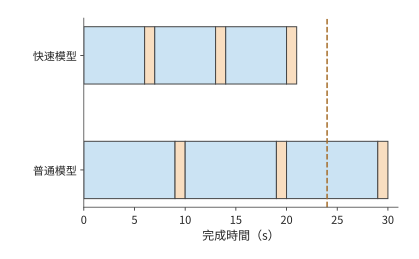

*圖 11-40：兩種方案均在模型呼叫期間準備環境，工具執行均為每輪 1 秒。模型呼叫從每輪 9 秒降至 6 秒，三輪結束時刻從第 30 秒移到第 21 秒，從 24 秒期限之後提前到期限之內。*

| 方案 | 完成時間 / s | 累計 CPU 時間 / CPU·秒 | 每項累計記憶體佔用 / GiB·秒 | 平均記憶體 / GiB | 每千項提交成本 / 美元 | 按時透過測試的比例 |
| --- | ---: | ---: | ---: | ---: | ---: | ---: |
| 普通服務＋始終駐留 | 30 | 3 | 60 | 600 | 6.68 | 0 |
| 普通服務＋每輪重建環境 | 30 | 3.3 | 18 | 180 | 6.49 | 0 |
| 快速服務＋始終駐留 | 21 | 3 | 42 | 420 | 8.72 | 95% |
| 快速服務＋每輪重建環境 | 21 | 3.3 | 18 | 180 | 8.61 | 95% |

以最後一行為例，三次模型呼叫共佔 $3\times1.5=4.5$ B200·秒，花費約 0.0084875 美元；CPU 成本為 $3.3\times0.000014=0.0000462$ 美元，記憶體成本為 $18\times0.0000045=0.000081$ 美元，合計約 0.0086147 美元，即每千項 8.61 美元。模型費用佔 98% 以上，因此每輪重建環境的主要收益不在費用，而在容量。每秒進入 10 項任務，工具執行與環境準備平均使用 33 個 CPU 核和 180 GiB 記憶體，都在 m5d.metal 的容量以內；快速服務＋始終駐留則需要 420 GiB，這臺主機無法容納。模型服務平均同時執行 180 次呼叫，快速服務每個副本只容納 16 個會話，需要 12 個副本，比現有多 2 個。

選中方案的平均需求滿足容量要求，還要確認各階段能否按時安排。任務均勻到達，可以直接寫出一個滿足容量限制的時間表。快速服務下，以每項任務的到達時刻為起點，分別在第 4–6、11–13、18–20 秒準備環境，在第 6–7、13–14、20–21 秒執行工具；準備工作累計使用 0.1 秒 CPU 時間，均勻分佈在兩秒內。任務每 0.1 秒到達一項，穩定執行後，每一輪的工具執行各佔 10 個核，每一輪的準備工作各佔一個核；活躍環境最多約 90 個，共 180 GiB。三個模型呼叫階段各平均有 60 次呼叫正在處理，合計 180 次並行呼叫，12 個快速副本共有 192 個並行槽。按此時間表執行，既滿足各階段的先後依賴，也沒有超過平臺容量。

**因此選擇快速服務，每輪重建環境，在模型呼叫期間完成準備，並把模型副本從 10 個增至 12 個。** 該方案用現有工具主機即可滿足 24 秒要求，是四個方案中唯一既能按期完成、又不超出這臺主機容量的方案。每千項按時透過測試的任務平均花費約 $8.61/0.95\approx9.07$ 美元；快速服務＋始終駐留即使另配記憶體，也要約 $8.72/0.95\approx9.18$ 美元，每輪重建環境只讓這項成本降低約 1.2%。普通服務＋每輪重建環境雖然更便宜，但即使透過測試，也已經超過期限。

第 11.5.2 節還說明，增加重試會改變按時完成的比例。這裡正常任務在第 21 秒完成，剩餘期限只有 3 秒；若最終失敗後再加一次 4 秒區域性修復，結果將到第 25 秒才出現。因此，本題在三輪後結束任務；未透過測試的任務直接返回失敗結果。若業務把期限延長到 25 秒，區域性修復才有機會增加按時成功數，屆時再將條件成功機率和額外資源放入恢復樹。

以上選擇建立在模型每輪呼叫 6 秒的條件下。模型繼續加速時，可以釋放環境記憶體的空閒時段也會縮短，原來的環境策略就需要重新比較。保留環境還是重新建立環境，由兩種方案成本相等時的等待長度即可判斷。設兩次工具執行之間需要等待模型 $G$ 秒。保持 2 GiB 環境，駐留成本為 $2G\times0.0000045$ 美元；銷燬後在下一輪模型呼叫末尾重新準備，記憶體成本為 $2\times2\times0.0000045$ 美元，準備所需的 CPU 成本為 $0.1\times0.000014$ 美元，共 0.0000194 美元。兩者在 $G\approx2.16$ 秒時相等。等待 6 秒時應重建；等待縮短到 2 秒時，保留環境開始更省，準備也佔滿全部可重疊視窗。模型繼續加速，會改變最合適的環境策略。

還可以用第 1 章的 Amdahl 定律概括區域性加速對總時間的影響。令原時間中可加速部分佔比為 $f$，將這部分加速 $s$ 倍，剩餘部分保持原時長，則整體加速比為

$$
S=\frac{1}{(1-f)+f/s}.
$$

章首工具只佔 10% 時間，工具加速兩倍的整體加速為 $1/(0.9+0.1/2)\approx1.05$；模型呼叫佔 90%，若完整呼叫加速兩倍，則為 $1/(0.1+0.9/2)\approx1.82$。同樣加速兩倍，模型呼叫節省的任務時間更多，因為其佔執行時間的比例更高。

第 12 章將在相同任務和完成目標下，進一步比較端側、邊緣和雲端的執行方式，分析傳輸時間對任務完成時間的影響。

## 練習與實驗

以下練習沿用 11-1 至 11-10 的資料編號。核心題 11-1、11-2 和 11-10 構成從需求到設計的完整練習；實驗原始記錄與選做執行入口見[本章配套](ch11/README.md)。

1. **實驗 11-1〔核心〕：從多輪任務推算模型並行、CPU 與環境記憶體。** 平臺每秒接收 8 項任務，其中一半執行兩輪，另一半執行四輪。每輪模型呼叫耗時 6 秒，工具佔用一個 CPU 核執行 1 秒。求模型呼叫率、平均並行模型呼叫數與平均使用的 CPU 核數。若每個環境在任務全程佔用 2 GiB，求平臺的平均環境記憶體佔用。再假設環境只在每輪 2 秒的準備階段和 1 秒的工具執行階段保留，重新計算平均記憶體佔用，以及每秒需要建立的環境數量。
2. **實驗 11-2〔核心〕：重建環境與恢復快照如何影響工具等待和記憶體佔用時長？** 一個環境中有可重新下載的依賴、未儲存的編輯緩衝、已持久化的補丁和已提交的外部寫入。逐項說明發生故障後能從哪裡恢復，以及哪些內容無法直接恢復。

   再比較兩種能夠恢復下一輪所需狀態的方案：走冷路徑完整重建環境需要 2.7 秒；按 E2B 文件，儲存 2 GiB 環境的快照約需 8 秒，從快照恢復約需 1 秒。將上一輪工具執行結束記為計時起點。下一次模型呼叫立即開始，耗時 9 秒，隨後工具執行 1 秒。採用重建方案時，在計時起點釋放原環境；採用快照方案時，在該起點開始儲存快照，儲存完成後釋放原環境。

   兩種方案都在不推遲下一次工具執行的前提下，儘量晚地開始重建或恢復。畫出時間線，並計算從計時起點到下一次工具執行完成期間，各方案累計佔用環境記憶體的時長。重建、儲存快照、恢復和工具執行期間均計入環境駐留時間。
3. **實驗 11-3：提前準備環境能省多少等待，又佔用多少記憶體？** 建立環境需要 2 秒，對下一次呼叫所需環境的預測準確率為 0.6。呼叫到達後取消錯誤預測所對應的環境；每個提前準備的環境從準備開始就佔用 2 GiB。分別在呼叫到達前 1、2、4 秒開始準備，計算呼叫到達後的期望等待時間，以及錯誤準備造成的期望累計記憶體佔用（以 GiB·秒計）。預測錯誤時，在呼叫到達後重新建立所需環境。若準確率提高到 0.9，哪些收益變大，哪些浪費減少？
4. **實驗 11-4：不同作業完成目標下，遷移何時優於等待。** 新作業所需的資源正被已有作業佔用，等待其釋放需要 12 秒。新作業獲得資源後，在本地執行需要 20 秒。也可以將已有作業遷至其他節點，在遷移完成後釋放本地資源；遷移耗時為未知量 $m$，使已有作業的完成時間比不遷移時推遲 $m+2$ 秒。先以新作業最早完成為目標，求遷移優於等待的條件；再以新作業的資源等待時間與已有作業的完成延遲之和最小為目標，重新求解。說明為何在兩個目標下可以作出不同選擇。
5. **實驗 11-5：啟動耗時如何影響短期例項的有效產出。** 每個新例項傳輸與載入共需 8 秒，之後以每秒 100 個有效 token 的速率工作。三個例項從開始啟動到回收的時長分別為 10、20、40 秒。分別求各例項的產出，以及實際工作時間佔這段時長的比例。若準備時間降到 4 秒，比較三個例項各自的產出改善，並解釋可用時間較短的例項為何更敏感。
6. **實驗 11-6：驗證程序數量與長尾樣本如何決定整批完成時間。** 三條樣本在 0、6、12 秒到達，驗證分別需 10、2、8 秒。先求只有一個執行程序時，按到達順序處理各條樣本的開始和完成時刻；再求使用兩個執行程序時，整批最早何時完成。把最後一條樣本的驗證時間改為 80 秒，判斷增加執行程序能否縮短整批完成時間，並解釋哪條樣本決定了這一結果。
7. **實驗 11-7：快取命中與結果正確性相關時，如何計算成本與按時成功率？** 沿用例 11-7 的 B 服務成本，改為命中時成功率 99%、未命中時 90%。推導平均每個成功任務的成本隨命中率變化的關係，以及在 6 秒內透過測試的任務比例。求至少讓 90% 的任務按時透過測試所需的最低命中率，並與原獨立機率模型比較。
8. **實驗 11-8：自建與 API 服務的成功任務成本交點。** 自建方式按 Runpod 價格預留 4 張 B200 一個月，共 19,555.2 美元，執行 V4-Flash，每項任務不再新增成本，任務成功率為 90%；API 方式使用 Claude Sonnet 5，每項任務呼叫三次，每次花費與例 11-7 中 B 命中時相同，為 0.0088 美元，成功率為 98%。按一個月作為成本比較期，固定支出全部計入該月。兩者均有足夠能力滿足期限，並處理相同數量的任務，求它們的平均成功任務成本相等時的任務量。再將自建處理上限設為每月 50 萬項，討論交點怎樣影響購買決定。
9. **實驗 11-9：任務期限與提前停止如何改變重試成本和成功率。** 沿用例 11-8，將期限改為 14、18、22 秒，分別求按時透過測試的比例。再設計一種在剩餘時間不足以完成下一節點時停止的策略，重新計算期望成本，並解釋它與僅改變評價期限的差別。
10. **實驗 11-10〔核心〕：到達率提高後如何擴容並選擇環境駐留策略。** 沿用例 11-9，將到達率增加到每秒 15 項，每次呼叫只輸出 118 個 token，快速服務呼叫時間降到約 2.0 秒，每項任務仍執行三輪，每輪工具執行仍需 1 秒。工具主機、每個副本的會話數和各項單價保持原值。比較始終駐留與每輪重建環境，決定應增加哪項資源、至少增加多少，並說明環境策略是否需要改變。最後將到達方式改為每秒有 15 項任務同時到達，畫出工具執行的時間線，並標出 CPU 並行佔用的峰值。

[^environment]: 本書 [environment-resources 固定計算](../calculations/results/environment-resources-book.md)及[工具子程式記錄](../experiments/ch11/11-01/process-resources/README.md)。工具實驗包含九組、36 個程序，累計記憶體佔用由取樣 RSS 對時間積分得到。

[^lifecycle]: [environment-lifecycle 固定預算](../calculations/results/environment-lifecycle-default.md)區分共享／私有容量、序列傳輸的耗時下界和區域性預熱實測。本章使用固定容量預算比較四種內容載入方式。

[^platform]: [排程、模型路由與雲端環境研究](../case-studies/platform-routing.md)，包含 ASI、RLBoost、DistRS、SpecBox。ASI 研究覆蓋六個月、155,410 張 GPU，其分配比例度量裝置歸屬。token 單價取自 [Claude API 計價頁快照](../references/outline-checks/2026-09-07/platform-routing/claude-api-pricing.md)。

[^e2b]: [E2B 固定架構](../references/outline-checks/2026-09-07/platform-routing/e2b-architecture.md)、[持久化檔案](../references/outline-checks/2026-09-07/platform-routing/e2b-persistence.md)（暫停約每 GiB 記憶體 4 秒、恢復約 1 秒，以及只儲存檔案系統的暫停）、[暫停與快照介面行為核對](../experiments/ch11/11-02/README.md)。E2B 使用 Firecracker。

[^ub]: [UB 作業系統參考設計](../references/files/specs/UB-Software-Reference-Design-for-OS-2.0-zh.pdf)中的裝置虛擬化與交付路徑，作為 QEMU／VFIO 的實現例證；這裡描述支援裝置直通的虛擬機器配置。

[^prewarm]: [本地工具預熱重放](../experiments/ch11/11-06/README.md)。實際呼叫、預測命中與取樣視窗邊界在原記錄中儲存。

[^scheduling]: [DRF](../references/files/papers/drf.pdf)、[Gavel](../references/files/papers/gavel.pdf)、[Pollux](../references/files/papers/pollux.pdf)作為排程機制背景；[資源共享與放置](../case-studies/resource-sharing-and-placement.md)補充資源可用性和狀態交付的區別。

[^rollout]: [權重準備與有效產出調研](../case-studies/preemptible-rollout-and-weight-readiness.md)，記錄 RLBoost 論文條件與 PolyRL 固定原始碼路徑。Qwen3-8B 的權重位元組數取自 [safetensors 索引](../calculations/sources/qwen3-8b/model.safetensors.index.json)；200／50 Gbit/s 前端網路卡與例項價格取自 RLBoost 論文。

[^recovery]: [Qwen3-8B 搶佔恢復實驗](../experiments/ch11/11-04/README.md)，分別記錄生成、客戶端收到和恢復時採用的 token 數量。

[^reward]: [DistRS 驗證排程與 verl 實現分析](../case-studies/reward-deadlines-and-feedback.md)。

[^validation]: [超時與資源釋放實驗](../experiments/ch11/11-05/README.md)、[雙 batch 排程記錄](../experiments/ch11/11-05/batch-scheduling/README.md)。實驗使用受控 CPU 程序。

[^thinking]: [思考預算與質量記錄](../experiments/ch11/11-08/README.md)、[增加思考預算後的檢查](../experiments/ch11/11-08/wide-budget/README.md)。記錄分別檢查生成是否自然結束，以及輸入狀態是否滿足要求。

[^routing]: [routing-cost 固定結果](../calculations/results/routing-cost-book.md)、[交點結果](../calculations/results/routing-cost-crossover.md)及[完整推導](../case-studies/routing-cost-and-completion.md)。Haiku 4.5 與 Sonnet 5 的單價取自 [Claude API 計價頁快照](../references/outline-checks/2026-09-07/platform-routing/claude-api-pricing.md)；計算採用與快取命中相互獨立的驗收透過機率，成功任務數按給定機率計算。

[^purchase]: B200 Pod 每卡時 6.79 美元、Serverless 每卡時 8.64 美元取自 [Runpod 價格頁快照](../experiments/ch13/13-06/single-agent-serving/comparison-sources/gpu-prices.md)。計算結果為 25.317 ms，其中 decode 為 15.918 ms，其餘階段共 9.399 ms。此處逐層固定開銷和週期全量重建為給定輸入，詳見[持續 Agent 比較基線](../experiments/ch13/13-06/single-agent-serving/COMPARISON-RESULTS.md)、[最佳化審計](../experiments/ch13/13-06/single-agent-serving/OPTIMIZATION-AUDIT.md)、[時間歸因與敏感性](../experiments/ch13/13-06/single-agent-serving/AUDIT-RESULTS.md)。

[^records]: [任務記錄與證據範圍](../case-studies/evaluation-and-agent-records.md)、[檔案佇列故障注入](../experiments/ch11/11-09/collector-faults/README.md)、[任務退出狀態記錄](../experiments/ch11/11-09/exit-status/README.md)。這些記錄分別用於說明結果持久化、故障診斷和成本核算。

[^fsync]: Linux 手冊 [write(2)](https://man7.org/linux/man-pages/man2/write.2.html) 與 [fsync(2)](https://man7.org/linux/man-pages/man2/fsync.2.html)。`write()` 成功不保證資料已寫入持久儲存，呼叫者還須檢查實際寫入位元組數與同步錯誤。新建或重新命名檔案時，目錄項的持久化還可能需要對目錄執行 `fsync()`；檔案同步本身不提供多檔案事務。

[^durability]: [Safe to Resume?（2026，預印本）](https://arxiv.org/abs/2608.29381)分析恢復狀態與繼續執行所需依賴不一致的問題。本節的請求缺口與批次提交數字為教學算例，不是論文測量結果。

[^agent-transaction]: [Agentic Transaction（2026，預印本）](https://arxiv.org/html/2608.13900v1)提出面向 Agent 的語義原子性、一致性、隔離性與永續性；其中 §2.2.4 討論已提交狀態、證據與恢復後設資料的持久儲存。本節以程式碼修復說明提交單元的設計，不據此假定任意工具呼叫都具備 ACID 保證。

[^retry]: 精確結果：成功機率 0.99744，透過測試且按時完成機率 0.9504，每項期望成本 0.01456 美元，累計 CPU 時間 3.376 秒，駐留 23.008 GiB·秒。計算結果分別列出資源用量和成本；各節點的給定成本已經是總價，無需再按資源用量重複計費。見[retry-paths 有限條件圖](../calculations/results/retry-paths-book.md)。各節點成本按 Claude 標準價格與題設 token 數計算，機率按題設給定，重試沿有限執行樹展開；超過評價期限的任務仍繼續執行到終點。

[^design]: 貫穿平臺與例 11-9 的輸入、逐階段時間表、成本、成本相等的條件與復算見[貫穿設計資料](ch11/platform-design.json)及[驗證程式](ch11/verify.py)。模型呼叫時間取自本書對 4 張 B200 執行 DeepSeek V4-Flash、每會話 200K 上下文的估算：每副本 32 個會話時每個輸出 token 25.3 ms，16 個會話時 16.9 ms，均含分攤的輸入處理與上下文重建（[比較結果](../experiments/ch13/13-06/single-agent-serving/COMPARISON-RESULTS.md)、[完整資料](../experiments/ch13/13-06/single-agent-serving/comparison.json)）；355 個 token 的呼叫分別約 8.99 s 和 6.01 s，設計取 9 s 和 6 s。B200 每卡時 6.79 美元取自 [Runpod 價格頁快照](../experiments/ch13/13-06/single-agent-serving/comparison-sources/gpu-prices.md)。m5d.metal 的 48 核（關閉超執行緒）與 384 GB 記憶體取自 [Firecracker 論文](../references/text/firecracker.txt)第 5 節的評測環境；1 vCPU、2 GiB 規格與 CPU、記憶體單價取自 [E2B 計價頁快照](../references/files/documents/e2b-pricing.md)。熱路徑準備共 2 秒、0.1 CPU·秒與 95% 驗收透過率為題設，結果儲存與工作狀態清理包含在工具的 1 秒內；模板容量算例單獨說明內容載入。

[^nodes]: [DGX H100 系統規格](../references/text/dgx-superpod-h100-ra.txt)（雙路 Xeon Platinum 8480C，共 112 核）；[DGX A100 系統規格](../references/text/nvidia-a100.txt)（附錄 A 表 10，雙路 EPYC 7742，共 128 核）。

[^firecracker-history]: Agache 等，AWS，[Firecracker: Lightweight Virtualization for Serverless Applications](../references/text/firecracker.txt)，NSDI 2020。

[^core-calculation]: 本章條件比較的[逐項復算](../calculations/results/core-principles.json)與[計算程式](../calculations/core_principles.py)。

[^v41-case]: [DeepSeek V4.1 官方技術報告](../calculations/sources/deepseek-v4.1-flash/DeepSeek_V41_Tech_Report.pdf)，第 1、2、3 節與第 6 節；[跨章會話的固定條件與復算](../calculations/results/v41-throughline.json)。

## 本章小結

章首平臺平均只用 30 個 CPU 核，環境卻需要 600 GiB 記憶體，超出了 m5d.metal 的 358 GiB。原因是三輪任務中有 27 秒在等待模型，而工具環境始終佔用記憶體。在模型呼叫期間準備環境，每項任務的累計記憶體佔用就從 60 降到 18 GiB·秒，能釋放大量記憶體；代價只是準備工作多用 0.3 秒 CPU 時間。

這項改進利用了完整任務的執行關係。環境管理器確定模型呼叫期間可用於準備的時間後，可以提前建立環境，讓程序僅在工具準備和執行期間存在；持久化檔案儲存各輪之間需要保留的狀態。模型服務和環境平臺共同安排準備時機，原本貫穿任務全程的資源佔用就變成了按階段分配。

釋放記憶體以後，任務仍需 30 秒，模型呼叫成為滿足 24 秒期限的關鍵。把每個 V4-Flash 副本的會話數從 32 減到 16，呼叫從 9 秒降到 6 秒，三輪任務從 30 秒降到 21 秒，平均並行模型呼叫數也從 270 次降到 180 次；代價是每次呼叫多佔 0.375 B200·秒，副本要從 10 個增至 12 個。結合每輪重建環境，一臺 48 核、358 GiB 記憶體的 m5d.metal 即可支援給定任務流。最後在滿足質量和期限的方案之間比較成本。

同樣的方法也解釋了 RL 的資源組織：成組作業先取得配套資源，臨時的 rollout 例項先完成權重傳輸和載入，樣本生成後立即提交驗證，可以讓驗證與後續生成同時進行；失敗後重試，則需要累加各次嘗試的工作量。分析資源需求，要計算任務總共做了多少工作；分析完成時間，還要考慮這些工作必須按什麼順序執行、哪些可以同時進行。結合這兩方面，才能判斷一項區域性改進對整個系統是否有益。
