# 第 12 章 端邊雲協同

一張圖片交給雲端精修，模型執行 0.3 秒，使用者卻等待 12.8 秒。將模型加速十倍，只能節省 0.27 秒；把輸入檔案壓縮到原來的一半，卻能節省近 6 秒。決定模型放在哪裡時，需要比較整個任務的完成時間。遠端裝置可以加快模型計算，但呼叫遠端服務也會增加傳輸和等待時間。

第 8—11 章介紹了模型服務、資源排程和任務執行環境。本章討論如何把這些服務和環境部署到不同裝置上。**端側**採集輸入並與使用者互動；**邊緣**是在附近提供計算的工作站或服務節點；**雲端**提供遠端資源池。終端可以在本地執行，也可以呼叫附近工作站或雲端服務，還可以把模型的不同階段分配給不同裝置。

本章先用圖片精修建立時間模型，再用語音解釋管線 (Pipeline)中的先後依賴，最後為根據截圖判斷下一步、再呼叫工具執行操作的截圖 Agent 選擇部署方案。圖片精修需要計算完整成片何時返回，語音需要分析音訊能否連續播放，Agent 則要累計每輪通訊與執行的開銷。三類任務共用一套分析方法：先計算處理和傳輸各需多久，再確定哪些步驟必須等待，最後加入連線建立、排隊和故障恢復等實際開銷。

## 12.1 從模型執行時間到完整互動時間

### 12.1.1 圖片精修

圖片精修需要保留陰影、高光和白平衡等資訊。要為後期編輯保留更多原始資訊，通常就要傳輸更大的檔案。本例上傳一張 30 MB 原圖，處理後返回一張 5 MB 成片，以使用者收到完整成片為任務結束的標誌。[^raw]

先沿一張圖片的路徑看資料在何處停留。本例的具體速率和處理時間標在圖 12-1 中，隨後用通用公式表示這些量之間的關係。

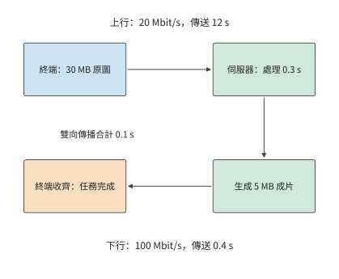

*圖 12-1：原圖經上行到伺服器，伺服器收齊後處理，再經下行返回完整成片。實線箭頭表示資料與處理順序；連線已建立，雙向傳播合計 0.1 s。*

建立模型時，先區分**各步驟所需時間**與**任務完成時間**。檔案大小除以傳送速率，得到傳送所需時間；模型的計算時間則由計算量和處理器的執行速度決定。各步驟依次執行時，總時間等於各步驟耗時之和；部分步驟同時執行時，則要根據它們的先後依賴，計算最後一步何時結束。

把這些關係寫成公式之前，先約定本例的簡化條件：往返時間（round-trip time，RTT）簡化為往返傳播所需的時間，排隊和協議處理的耗時在第 12.3 節單獨討論。連線已經建立，伺服器收齊原圖後開始處理，生成完整成片後再向使用者傳送，上下行以恆定速率傳輸有效載荷。設輸入為 $S_u$ bytes，輸出為 $S_d$ bytes，上下行速率為 $B_u,B_d$ bytes/s，RTT 為 $R$，處理時間為 $T_c$。序列完成時間為

$$
T_{\mathrm{serial}}=\frac{S_u}{B_u}+R+T_c+\frac{S_d}{B_d}.
$$

上傳的最後一個位元組離開傳送方後，還要傳播到伺服器；成片返回也要傳播一次。兩次單向傳播合計為 $R$。傳播時間由路徑決定，傳送時間由檔案大小與速率決定，因此縮小檔案只會縮短髮送時間。這裡的 $B_u,B_d$ 表示有效載荷的傳輸速率，連線啟動和反饋等待將在第 12.3 節單獨加入。

**例：圖片精修的上傳時間如何限制模型加速收益？** 上行 20 Mbit/s，下行 100 Mbit/s，$R=0.1$ s，$T_c=0.3$ s。本章 MB 與 Mbit 使用十進位制；MiB 為 $2^{20}$ bytes。代入得

$$
T_{\mathrm{serial}}=\frac{30\times8}{20}+0.1+0.3+\frac{5\times8}{100}
=12.8\ \mathrm{s}.
$$

上傳佔 12 秒，約為總時間的 94%。將處理階段加速十倍，完成時間縮短至 12.53 秒，只節省 0.27 秒。即使處理瞬間完成，上傳、傳播和下載仍需 12.5 秒。這正是 Amdahl 定律所描述的限制：處理階段只佔總時間的約 2.3%，即使消除這部分耗時，總時間也只能縮短約 2.3%。

模型加速節省的時間有限，另一條路是縮短傳輸。把上行速率提高至 100 Mbit/s，上傳時間降至 2.4 秒，整個任務只需 3.2 秒，速度提高到原來的四倍。另一種辦法是保持上行速率不變，壓縮輸入。假設無失真壓縮將輸入減半，額外的編解碼共需 0.15 秒，則傳送只需 6 秒，完整任務約為 7.0 秒。壓縮之所以值得，是因為增加 0.15 秒編解碼，節省了 6 秒傳輸。

設壓縮後的輸入大小為 $S'_u$，額外的編解碼時間為 $T_e$，壓縮節省的總時間為

$$
\Delta T=\frac{S_u-S'_u}{B_u}-T_e.
$$

令該式的收益為零，就能求出壓縮恰好不再省時的上行速率。上行速率為 20 Mbit/s 時，少傳 15 MB 可節省 6 秒；為 100 Mbit/s 時節省 1.2 秒；達到 800 Mbit/s 時只節省 0.15 秒，收益降至零。同一種壓縮方法的運算量沒有改變，改變的是傳送這些位元組需要多少時間。圖 12-2 顯示了這種關係。

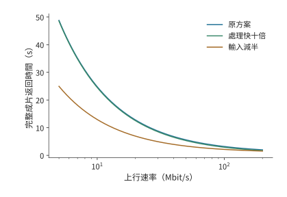

*圖 12-2：壓縮和計算加速對任務完成時間的影響隨上行速率而變化。本例採用原圖 30 MB、成片 5 MB、下行 100 Mbit/s、RTT 0.1 秒，原處理時間 0.3 秒；壓縮方案將輸入減半並增加 0.15 秒編解碼。三種方案的成片質量相同，連線已建立且各階段序列。*

再考慮各步驟能否重疊。假設原圖分成三塊後可以逐塊獨立處理，每塊上傳需 4 秒、處理需 0.1 秒；三塊輸出分別為 1、2、2 MB，回傳依次需 0.08、0.16、0.16 秒。第一塊到達伺服器後，其處理和回傳可以與第二塊上傳重疊；第二塊同理。最後一塊仍要等到第 12 秒才發完，之後再經過處理、回傳和傳播，完整成片約在 12.4 秒返回使用者。與原來的 12.8 秒相比，前兩塊的處理與回傳在後續上傳期間就已完成，不再額外增加等待；但總計 12 秒的上傳時間無法縮短。[^stream]

圖 12-3 和圖 12-4 用相同的時間軸比較兩種安排。

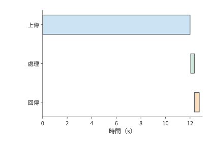

*圖 12-3：整圖序列：30 MB 全部上傳並傳播到伺服器後才處理，隨後回傳 5 MB。上行 20 Mbit/s、下行 100 Mbit/s、單向傳播 0.05 s，任務於 12.8 s 完成。*

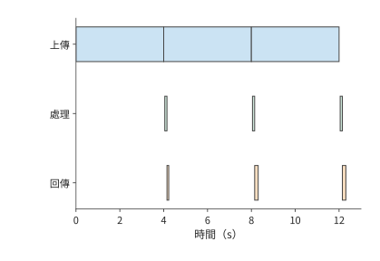

*圖 12-4：三塊各上傳 4 s，每塊到達後獨立處理 0.1 s，隨後回傳 1、2、2 MB。前兩塊的處理和回傳與後續上傳重疊，完整成片於 12.36 s 返回。*

如果處理需要全域性曝光或跨塊資訊，就要等整張圖到齊後才能開始處理，即使分塊傳送，整個任務仍需 12.8 秒。計算量和資料量決定各步驟所需時間，依賴關係決定各步驟能否同時執行。即時語音服務持續接收、處理和播放音訊，更適合用管線 (Pipeline)描述這種依賴。

### 12.1.2 即時語音

自動語音識別（ASR）將音訊轉為文字，文字轉語音（TTS）將文字轉為可播放音訊。流式服務可以一邊接收輸入，一邊產生結果。以 TTS 為例，使用者可以在整段音訊生成完之前開始收聽。因此，除了整段合成何時結束，還需要知道首段何時開始播放，以及後續播放是否連續。

要算出這些時刻，先把管線 (Pipeline)寫成逐塊的遞推關係。考慮一條輸入塊與輸出塊一一對應的音訊處理管線 (Pipeline)。採集端每 20 ms 產生一塊音訊，模型處理後將結果發出，播放器按順序播放。第 $i$ 塊輸入在 $a_i$ 時刻就緒，模型處理耗時為 $m_i$，傳送耗時為 $s_i$，單向傳播為 $d_i$。處理器逐塊處理音訊，網路介面逐塊傳送結果，則

$$
 c_i=\max(a_i,c_{i-1})+m_i,\qquad
 u_i=\max(c_i,u_{i-1})+s_i,\qquad
 r_i=u_i+d_i.
$$

其中，$c_i$、$u_i$、$r_i$ 分別表示處理完成、傳送完成和到達的時刻。第一個最大值表示，處理本塊既要等輸入就緒，也要等處理器完成上一塊；第二個最大值表示，傳送本塊既要等計算完成，也要等出口空閒。這兩處等待分別來自資料依賴和資源競爭。

**例：網路延遲抖動為何會耗盡音訊播放緩衝？** 脈衝編碼調製（PCM）逐次記錄音訊幅值取樣；24 kHz 表示每秒 24,000 次取樣，單聲道表示一條取樣通道，16-bit 表示每個樣本佔 2 位元組。使用 24 kHz、單聲道、16-bit PCM，每塊 20 ms、960 bytes。處理一塊需 12 ms，傳送需 1 ms，通常傳播耗時為 5 ms。第一塊在 20 ms 採集完，於 38 ms 到達；緩衝 40 ms 後在 78 ms 播放（圖 12-5）。第二塊在 58 ms 到達，於 98 ms 接著播放。每塊的處理時間比採集間隔短 8 ms，傳送也只需 1 ms，因此處理和傳送都能跟上採集速度。

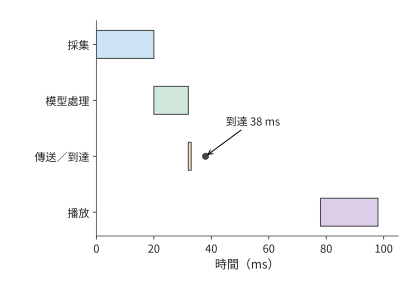

*圖 12-5：第一塊音訊從採集開始計時：20 ms 就緒，32 ms 處理完，33 ms 發完，38 ms 到達；初始緩衝 40 ms 後於 78 ms 播放。圓點標出到達，最後一行是播放裝置的時鐘。*

把第三塊的傳播時間改為 50 ms，該塊在 123 ms 到達，比原定的播放時刻 118 ms 晚了 5 ms。第四塊雖然在 98 ms 已經到達，播放器仍須先播第三塊，因而後續播放一起推遲（圖 12-6）。[^audio]

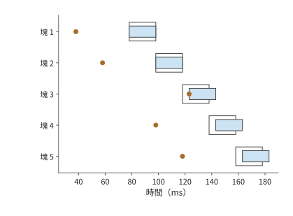

*圖 12-6：第三塊晚到使後續各塊的播放時間都推遲 5 ms。每塊長 20 ms，模型處理 12 ms、傳送 1 ms；通常傳播耗時為 5 ms，第三塊傳播 50 ms，初始緩衝 40 ms。實線段表示實際播放，淺色輪廓表示原定播放區間，圓點表示到達；所有時間均從開始採集第一塊起算。圖為上述管線 (Pipeline)的計算結果，播放器等待缺塊而不丟棄。*

把這條播放規則一般化：令每塊音訊的時長為 $\tau$，初始緩衝為 $J$。首塊開始播放的時刻為 $p_0=r_0+J$，後續各塊的開始時刻滿足

$$
p_i=\max(r_i,p_{i-1}+\tau).
$$

這裡取最大值，是因為播放器既要等待「本塊到達」，也要等待「上一塊播完」。當第一項更大時，差額就是新增停頓。把初始緩衝從 40 ms 增至 45 ms，第三塊的計劃播放時刻也推遲到 123 ms，恰好可以避免晚到 5 ms 造成的播放中斷；代價是首段也要晚 5 ms 開始播放。增加初始緩衝會延長首次播放前的等待，但也能容忍更大的到達時間波動，使後續播放更連續。

長期傳輸速率不足會產生另一種停頓。為便於計算，取 16 kHz、單聲道、16-bit PCM，播放所需的資料速率為 256 kbit/s，20 ms 對應 640 bytes。若網路長期只能以 130 kbit/s 傳輸音訊，緩衝每秒淨減少 126 kbit。初始緩衝儲存的 60 ms 音訊包含 15,360 bits，大約 $15360/(256000-130000)\approx0.12$ 秒就會耗盡。

把尚未播放的資料畫成隨時間下降的曲線，就能看出短時抖動與長期速率不足的區別。圖 12-7 中，增加緩衝只抬高起點，斜率沒有改變。

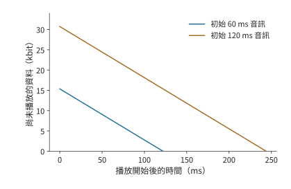

*圖 12-7：緩衝量等於初始資料量加累計接收量，再減累計播放量。PCM 播放需要 256 kbit/s，接收只有 130 kbit/s，兩條直線的下降速率均為 126 kbit/s。初始緩衝分別包含 60 ms 和 120 ms 音訊，約在 0.12 秒和 0.24 秒耗盡；圖畫到各自第一次耗盡為止。*

增大緩衝只會按比例推遲耗盡時刻；提高傳輸速率或降低音訊位元速率，才能讓收到的資料足夠播放。緩衝可以減輕短時延遲波動對播放的影響，長期傳輸速率不足則需要增加頻寬或減少資料量。

### 12.1.3 Computer Use：透過介面操作完成任務

Computer Use（計算機介面操作）讓程式像使用者一樣透過截圖、點選和輸入完成任務。程式在觀察介面、模型判斷、執行操作和再次觀察之間迴圈。這類任務與音訊管線 (Pipeline)的關鍵區別是：只有上一輪操作完成、介面更新後，才能取得下一張有效截圖。模型還沒決定點選哪裡時，就無法取得點選後的介面。因此，一輪中的等待會在任務中重複累積。

圖 12-8 的返回箭頭說明，這一任務難以像音訊那樣逐塊重疊：後續工作必須等待操作產生新的介面。

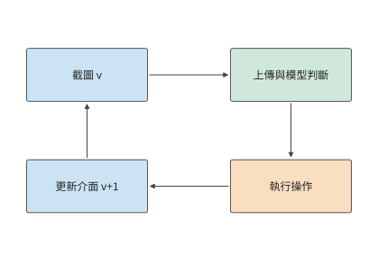

*圖 12-8：截圖 Agent 的一輪執行。箭頭表示先後依賴，方框寬度不表示耗時。底部返回箭頭要經過操作執行與介面更新，才能取得下一輪截圖。*

以需要 30 輪操作的任務為例。使用原有服務時，每輪上傳 0.8 MB 截圖，上行 6.4 Mbit/s，上傳需 1 秒；終端觀測、操作與介面更新合計 0.3 秒，遠端模型 2.0 秒，往返傳播 0.2 秒。連線已建立，控制回覆的傳送時間取零。一輪為 $1+0.3+2.0+0.2=3.5$ 秒，30 輪共 105 秒。

**例：截圖壓縮節省的傳輸時間能否抵消額外操作輪次？** 將截圖壓縮至 0.2 MB，額外編碼需 30 ms，上傳時間降為 0.25 秒，其餘工作仍需 2.5 秒。於是

$$
T'_{\mathrm{round}}=0.25+0.03+2.5=2.78\ \mathrm{s}.
$$

每輪節省 0.72 秒，30 輪節省 21.6 秒，任務從 105 秒降至約 83 秒。

壓縮還可能改變操作輪數。若文字變模糊使 Agent 多執行糾錯操作，壓縮後的總時間應寫為 $2.78N'$，其中 $N'$ 是實際所需輪數。由 $2.78N'<105$ 得 $N'<37.8$，仍能縮短任務時間的最大輪數為 37；38 輪約需 106 秒。壓縮後的影象質量會影響糾錯次數。該任務最多允許增加七輪操作；超過這一數量，糾錯時間就會抵消壓縮節省的時間。

截圖版本也直接影響輪數。假設模型讀到版本 $v$，隨後介面變化，按舊截圖作出的操作就可能出錯，需要恢復介面並重新截圖。把截圖版本與動作編號繫結，讓終端在介面變化時重新截圖，可以避免這類無效工作。[^author]

第 12.5 節將繼續分析該截圖任務：前十輪已完成，剩餘二十輪需要選擇執行位置，屆時保持截圖大小、終端工作和原路徑參數不變，比較更快的模型服務能縮短多少時間。

### 12.1.4 本地、附近裝置與雲端的初步比較

第 12.1.1 至 12.1.3 節的分析可以歸納為三個層次，每層對應不同的計算物件：

| 分析層次 | 計算物件 | 已得到的判斷 |
|---|---|---|
| 各步驟耗時 | 計算、傳送和傳播各需多久 | 原圖上傳佔 12 秒，模型佔 0.3 秒 |
| 執行依賴 | 哪些工作可以重疊，哪些必須等待 | 獨立圖片塊可重疊，下一輪截圖要等上一輪操作完成 |
| 實際執行 | 資料就緒後，計算和傳送何時開始 | 音訊即使平均傳輸速率足夠，一次晚到仍可造成停頓 |

先用各步驟耗時與依賴關係判斷遠端執行能否更快。將整個任務交給遠端服務時，節省的計算時間必須超過上傳、下載、傳播、排隊和準備增加的時間。多輪任務的準備只需做一次，通訊卻每輪都會發生；連續播放的音訊還要保證資料及時到達。模型放在哪裡，會同時改變計算、通訊和準備時間。

最短傳播時間可以儘早排除距離過遠的伺服器。光在光纖中約以 $2\times10^8$ m/s 傳播，單向路徑長 10,000 km 時，往返傳播至少需要約 100 ms。如果要求 50 ms 內收到遠端應答，僅傳播時間就已超過時限。使用更近的伺服器，可以直接縮短這部分等待。

以上比較把端側當作一個執行位置，只計算端側與遠端的時間差；端側裝置本身能算多快、能容納什麼，尚未展開。第 12.1.5 節先定量分析端側的執行資源，第 12.2 節再決定傳什麼：把整項任務交給遠端處理時傳圖片，在端側編碼後傳特徵，遷移會話時則傳狀態；傳輸物件改變後，資料量和所需時間也隨之改變。

### 12.1.5 端側執行資源與本地部署

第 12.5 節比較部署方案時要用到「端側每輪模型計算 2.9 秒」。要說明這一數值的來源和成立條件，就要把端側裝置當作執行資源定量分析：記憶體頻寬決定每生成一個 token 至少要多久，記憶體容量決定能容納什麼模型、留下多長上下文，能耗與電池決定能持續多久。

**手機作為執行資源：頻寬先給出每秒 token 的上限。** 旗艦手機的 SoC 使用 LPDDR5X 記憶體，這是面向手機等移動裝置的低功耗 DRAM 標準。Snapdragon 8 Elite 的產品簡介給出最高 5,300 MHz、最大 24 GB 容量，但未給出匯流排寬度；LPDDR5X 每個時鐘週期傳兩次資料，5,300 MHz 即每引腳 10.6 Gbit/s，略低於 LPDDR5X 器件 10.7 Gbit/s 的最高速率檔；JEDEC 標準器件為 x16 單通道。[^phone] 按 SoC 支援的速率，一條 x16 通道的頻寬為 $16\times10.6/8=21.2$ GB/s；按四條 x16 通道計，合計 84.8 GB/s。[^phone-ledger]

頻寬給定後，每步要多久取決於這一步讀取多少資料。固定工作量沿用第 4.8.2 節的算例：Qwen3-8B、BF16、單請求、8K 上下文，一步 decode 讀取權重 15.14 GB、KV 1.21 GB，合計約 16.345 GB。[^phone-ledger] 只把權重讀一遍需要

$$
\frac{15.14\ \mathrm{GB}}{84.8\ \mathrm{GB/s}}\approx0.179\ \mathrm{s},
$$

即 decode 上限約 5.6 token/s；計入 KV 後每步約 0.193 s，上限約 5.2 token/s。量化直接減少每步讀取的位元組數：按第 8.4 節的 q4_0 分組格式，每 32 個 BF16 值從 64 bytes 變為 18 bytes，權重每步讀取降至約 $15.14\times18/64\approx4.26$ GB，每步合計約 5.47 GB、64.4 ms，上限約 15.5 token/s。MELTing Point 在 iPhone 14 Pro 上實測 Zephyr-3B q4_k 為 14.8 token/s、Llama-2 7B q3_k 為 6.0 token/s（q4_k、q3_k 是與第 8.4.1 節 Q2_K 同屬 GGML 系列的 4-bit、3-bit 分組量化格式），與這裡推導的量級一致。[^melt]

**容量決定能容納什麼模型、留下多長上下文。** 沿用第 2.6.2 節的容量公式：可用記憶體減去權重與固定預留，剩餘部分除以每條請求的狀態大小。手機記憶體取 Micron LPDDR5X 的 6、12、24 GB 三種容量選項，再加旗艦手機常用的 16 GB，系統與工作區預留 4 GB。[^phone] Qwen3-8B 的 BF16 權重共 16.38 GB，比每步讀取的 15.14 GB 多出約 1.24 GB 的詞嵌入表：decode 每步只按 token 查一行，整張表卻要常駐記憶體。按常駐口徑，只有 24 GB 一檔能容納，扣除預留後剩約 3.62 GB，僅夠兩條 8K 請求；量化到 q4_0 後約 4.61 GB：

| 手機記憶體 | 扣除預留與 4.61 GB 權重後 | 可容納的請求與上下文 |
|---|---:|---|
| 6 GB | 約 −2.61 GB | 無法容納 8B；3B 級 q4 模型約 1.7 GB，可以容納 |
| 12 GB | 約 3.39 GB | 兩條 8K 請求，或單條約 2.3 萬 token |
| 16 GB | 約 7.39 GB | 六條 8K 請求，或單條約 5.0 萬 token |
| 24 GB | 約 15.39 GB | 十二條 8K 請求，或單條約 10.4 萬 token |

一條 8K 請求的 BF16 KV 為 1.21 GB，每 token 佔 147,456 bytes，隨上下文長度線性增長；容納模型之後，剩餘記憶體直接決定上下文長度。16 GB 一檔也是 8-bit 量化的分界：q8_0 權重約 8.70 GB，扣除預留後剩約 3.30 GB，可放兩條 8K 請求；更小記憶體的手機無法容納 8-bit 的 8B 模型。

**能耗與續航是端側特有的代價。** 第 4.1.3 節的能耗分賬給出 H100 上單請求 8K decode 每 token 約 0.534 J 的量級估計，只含資料搬移與矩陣計算。手機上的實測則包含整機功耗：MELTing Point 測得每 token 0.16–0.21 mWh，即 0.576–0.756 J；持續功率最高 13.8 W，瞬時超過 18 W。吞吐量與能耗的實測值可以互相核對：14.8 token/s 乘以每 token 0.576 J 約為 8.5 W，在 13.8 W 的持續功率之內。按這組測量推算，一次充電可完成約 490–590 個提示的推理。[^melt] 因此端側的代價不只是時間和費用：持續生成的速率受功率上限約束，累計的工作量受電池容量約束。

**本地部署的三檔裝置。** 比手機高的兩檔可以直接取自第 4.8.2 節，那裡已用同一模型列出 11 款候選裝置的 decode／prefill 時間下界：M3 Ultra 的統一記憶體為 819 GB/s、256／512 GB，每步讀取下界 19.96 ms，約 50.1 token/s，容量足以容納 4-bit 的 235B MoE（第 4.6.3 節）；RTX PRO 6000 為 1,792 GB/s、96 GB，每步 9.12 ms，約 109.6 token/s。圖 12-9 把三檔裝置放進同一條時間軸。

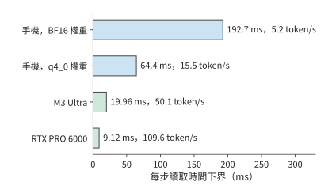

*圖 12-9：三檔本地裝置讀一遍 Qwen3-8B 單請求 8K decode 主要載荷（16.345 GB）的時間下界。手機按四條 x16 LPDDR5X 通道計，合計 84.8 GB/s，BF16 與 q4_0 權重分別成行；M3 Ultra 與 RTX PRO 6000 取自第 4.8.2 節的裝置表。柱端標註對應的 token/s 上限。*

**執行時各解決一層問題。** 裝置給出頻寬與容量下界，實際執行還取決於執行時。llama.cpp 解決權重如何儲存、如何逐塊執行：GGUF（llama.cpp 使用的模型檔案格式）的分組量化佈局決定載入後的容量與每步讀取量，第 8.4.1 節已算過 Q2_K 每組 84 bytes、平均每值 2.625 bit。Ollama 解決模型的分發與本地服務封裝：對應第 12.2.3 節「一次準備、多次複用」的權衡，Ollama 節省的是部署準備時間，而不是每步執行時間。MLX 面向 Apple 統一記憶體（第 4.6.3 節）：CPU 與 GPU 共用同一記憶體池，免去兩者之間的資料複製，模型容量上限即整機記憶體。Unsloth 面向端側與單卡微調：把訓練狀態的容量預算壓進一張卡或一臺整機，量化格式仍來自第 8.4 節。這四個執行時都不改變以上推導的頻寬與容量下界，只決定實際執行能在多大程度上接近下界。衡量這段距離的統一尺度，是實測耗時與下界的倍數。第 12.5.2 節將用實驗 8-1 的記錄說明，RTX PRO 6000 上一步 decode 的實測時間是讀取下界的 2.83 倍，多出的主要是每步的固定開銷；按第 1.3.4 節的判據，這是可以減少的系統開銷，不是裝置能力不足。

其中，Unsloth 節省的容量可以用第 10.1.2 節的每參數位元組數直接算出。全參數混合精度 Adam 每參數 16 bytes：BF16 權重與梯度各 2 bytes，FP32 主權重與兩份矩各 4 bytes。LoRA 凍結基礎權重，只為新增的低秩 adapter 保留梯度與最佳化器狀態：Qwen3-8B 在 Q、V 投影上的 rank-16 BF16 adapter 為 14.6 MiB（第 8 章末尾的多 LoRA 算例），約 765 萬參數。adapter 的權重、梯度、主權重與兩份矩合計每參數 16 bytes，約 0.12 GB；再加上 16.38 GB 的 BF16 基礎權重，共約 16.5 GB。只按常駐狀態比較，啟用與臨時緩衝另計：

| 視訊記憶體 | 全參數混合精度 Adam，16 bytes／參數 | BF16 基礎權重＋rank-16 Q／V LoRA |
|---|---:|---:|
| 24 GB（RTX 4090） | 約 1.5B 參數 | 約 12B 參數；Qwen3-8B 需約 16.5 GB |
| 96 GB（RTX PRO 6000） | 約 6B 參數 | 約 48B 參數 |

一張 RTX 4090 無法容納 Qwen3-8B 全參數訓練的 131.1 GB 狀態，卻能容納其 LoRA 訓練；Unsloth 節省的是這份狀態，而非每步讀取權重的頻寬下界。

**翻轉條件：何時端側足夠，何時必須上雲。** 三個下界各給出一個翻轉條件。頻寬：每輪生成 $G$ 個 token 時，端側模型時間下界為 $G$ 乘以每步時間。第 12.5 節的「端側每輪模型計算 2.9 秒」就是這樣得到的：按 q4_0 的 15.5 token/s，2.9 秒對應每輪生成約 45 個 token；按 BF16 的 5.2 token/s 則只對應約 15 個。反過來從期限推預算：45 秒期限攤到 20 輪，每輪 2.25 秒，扣除 0.3 秒終端工作後剩約 1.95 秒，手機 q4_0 下每輪最多生成約 30 個 token；需求超過該數量，就要換頻寬更高的裝置或上雲。每輪 45 個 token 的需求已超出預算，所以第 12.5.2 節的端側方案需要 64.0 秒，超過期限。容量：權重加所需上下文超過本檔可用記憶體時，本檔不可行——12 GB 手機無法容納 BF16 的 8B 模型，手機一檔無法容納 235B 模型。能耗：連續生成把電池變成約束，一次充電對應約 490–590 個提示，批次或長時間生成應交給接通電源的裝置。這三個條件補全第 12.1.4 節的初步比較：那裡比較各方案的完成時間，這裡先排除端側根本不可行的情形。練習 12-9 用同一組公式復算手機一檔的頻寬、容量與功率上限。

這裡使用的是硬體下界，因此可行性判斷並不對稱：若時間下界已經超過期限，該方案一定不可行；若時間下界低於期限，只能說明該方案尚未被排除。軟體開銷、未達到峰值的有效頻寬和持續負載下的降頻都會使實測時間更長，最終是否達標仍需用目標裝置上的測量結果校準。

## 12.2 跨裝置分工

### 12.2.1 完整模型呼叫與分階段執行

同一張截圖，可以先發給伺服器，由伺服器轉成模型使用的特徵；也可以先在終端生成特徵，再把特徵傳送到伺服器。兩條路徑中，跨網路的物件已經不同。第 12.1.1 節的圖片算例說明，檔案傳輸慢會使計算等待；把一部分計算移到端側以後，真正需要傳送的物件也隨之改變。

將圖片或音訊轉換為模型所用數值特徵的子網路，稱為編碼器。把整個模型放到遠端，需要上傳輸入並下載結果；把編碼器留在端側，需要上傳編碼器的輸出。圖片檔案和特徵張量的資料量由各自的表示方式決定，端側先做了計算，並不保證上傳量隨之減少。

以截圖 Agent 為例，圖片壓縮用較少的位元組表示紋理和重複區域；視覺編碼器卻要把圖片展開成每個視覺 token 的通道值，供語言模型讀取。前者為了緊湊儲存，後者為了後續計算。

比較兩種方案：一種先上傳圖片，再在遠端編碼；另一種先在本地編碼，再上傳特徵。兩者後續的語言模型計算相同，求兩種方案的總耗時之差時，這部分正好抵消。因此，只需比較本地與遠端的編碼時間，以及圖片與特徵的傳送時間。

### 12.2.2 端側編碼的傳輸量與計算開銷

先沿圖 12-10 和圖 12-11 中的箭頭確認兩種方案分別傳什麼，再比較傳輸量和節省的遠端計算時間。

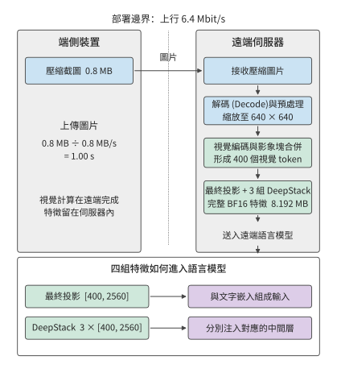

*圖 12-10：遠端編碼的執行路徑。端側上傳 0.8 MB 壓縮截圖，遠端依次完成解碼與預處理、視覺編碼和特徵接入；最終投影與三組 DeepStack 特徵均留在伺服器內。6.4 Mbit/s 上行的圖片傳送時間為 1 秒，編碼和排隊時間另計。*

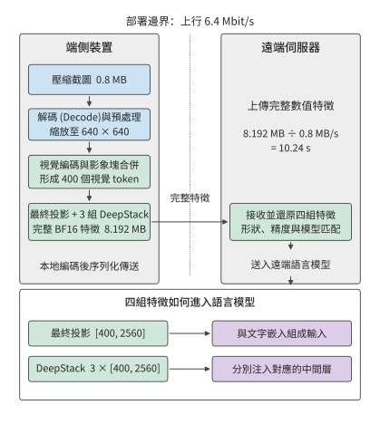

*圖 12-11：端側編碼的執行路徑。預處理和視覺編碼移到終端，跨網路的物件變為最終投影與三組 DeepStack 的完整 BF16 特徵，共 8.192 MB；遠端接收後仍按相同方式接入語言模型。相同上行的特徵傳送時間為 10.24 秒，本地編碼、序列化和轉換時間另計。圖中數值採用下文的 Qwen3-VL-4B 固定配置。*

**例：上傳視覺特徵為何可能比上傳原圖更慢？** 沿用 0.8 MB 截圖與 6.4 Mbit/s 上行。視覺編碼採用 Qwen3-VL-4B 的固定配置：預處理後的影象尺寸為 $640\times640$，影象塊合併後得到 400 個視覺 token；這裡的視覺 token 是表示圖片內容的特徵向量，不是文字詞元 (Token)，也不是原圖的單個畫素。最終投影的每個特徵向量有 2560 個分量，另有三組同寬 DeepStack 特徵（第 3.3.1 節），這些分支輸出要一起傳送。每個視覺 token 共需儲存 $4\times2560=10240$ 個 BF16 數，完整輸出為

$$
S_E=400\times10240\times2=8\,192\,000\ \mathrm{bytes}
\approx7.8\ \mathrm{MiB}.
$$

四組特徵分別輸入語言模型的不同層。如果只傳最終投影，就會漏掉另外三組特徵。完整特徵約 8.2 MB，是壓縮圖片的約十倍；在原有上行鏈路 (Link)上，傳送時間從 1 秒增加到約 10.2 秒（圖 12-12）。[^ec]

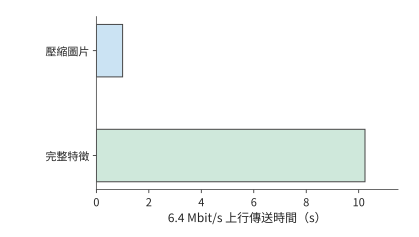

*圖 12-12：同一圖片的完整視覺特徵比壓縮圖片需要更多傳輸時間。壓縮圖片為 0.8 MB；Qwen3-VL-4B 在預處理後 640×640 輸入上產生 400 個視覺 token，最終投影及三組 DeepStack 合計 [400,10240] BF16，共 8,192,000 bytes。上行速率為 6.4 Mbit/s，柱長表示傳送時間；編碼、排隊和轉換時間另計。兩種方案處理同一張圖片，完成相同的視覺理解任務。*

把這一比較寫成一般形式：將本地編碼時間記為 $T_{E,l}$，遠端編碼時間記為 $T_{E,r}$，本地編碼方案額外的序列化和轉換時間記為 $T_x$。兩種方案的時間差為

$$
\Delta T=T_{E,l}-T_{E,r}+T_x+\frac{S_E-S_I}{B_u}.
$$

$\Delta T<0$ 時端側編碼更快。設終端是一臺裝 RTX 4090 的桌上型電腦，遠端是一張 H100 SXM。編碼一張圖需要 1.31 TFLOPs 矩陣運算，按兩者的 BF16 稠密峰值 165.2 與 989.4 TFLOP/s 計，編碼時間下界分別約為 7.9 ms 和 1.3 ms。取 $T_x=0$，本地編碼方案約需 10.25 秒，遠端編碼方案約需 1.00 秒。本地方案在計算和傳輸上都更慢：本地計算多約 6.6 ms，特徵傳送多約 9.2 秒。[^encode-place]

鏈路 (Link)變快後，傳送特徵比傳送圖片多出的時間會減少。若編碼器與語言模型分處同一機房的兩臺伺服器，經一個 400 Gbit/s 的 ConnectX-7 埠相連（每方向 50 GB/s），圖片與特徵的傳送時間只相差約 0.15 ms，已小於上面兩張卡的編碼時間之差。這時，編碼與排隊合計只要減少 0.15 ms 以上，另一臺機器上的編碼方案就更快；在原有的慢速上行鏈路 (Link)上，則要節省超過 9 秒。決定編碼器放在哪裡時，慢鏈路 (Link)上先比傳輸量，快鏈路 (Link)上則更要比編碼和排隊時間。

多輪任務中，重複出現的圖片可以複用 EC，進一步減少編碼次數。相同圖片再次出現時，快取命中就省去一次編碼；介面內容改變後則要重新編碼。一組使用相同尺寸圖片的 CPU 實驗觀察到了同樣的行為。[^ec-test] 計算多輪任務的編碼總時間時，可以用單次編碼時間乘以快取未命中的次數。此前輪次留下的快取由此也計入比較。

視覺特徵只能省去視覺編碼；如果希望複用語言模型已經算出的結果，就要儲存語言模型處理字首時逐層產生的 KV。該配置每個語言模型輸入 token 需要 144 KiB 的邏輯 KV 儲存空間，400 個視覺 token 約為 56.3 MiB。圖片、約 7.8 MiB 的視覺特徵、約 56.3 MiB 的視覺 token KV，分別對應不同重算起點（圖 12-13）。快取越接近模型的最終輸出，再次使用時節省的計算越多，需要傳送的資料也可能越大。第 12.2.3 節比較傳送一次狀態需要多久，以及後續使用這些狀態能節省多少時間。

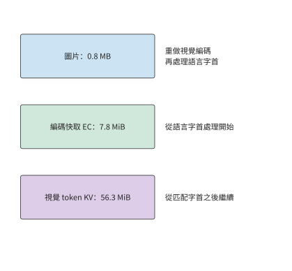

*圖 12-13：三類快取內容對應三個恢復計算的起點。EC 省去視覺編碼；匹配模型權重、字首與 token 位置索引的 KV 進一步省去已處理字首的語言模型計算。容量對應正文固定視覺配置。*

### 12.2.3 會話遷移的準備、複用與恢復

會話遷移將快取和任務進度傳到另一臺裝置，使接收裝置可以接著執行。目的裝置已有相容權重時，需要傳送的是編碼快取、語言 KV、任務記錄和恢復資訊。確認兩端的狀態格式相容後，就可以比較遷移前的準備時間與遷移後每輪節省的時間。

設遷移所需的準備時間為 $M$，新裝置每輪節省的時間為 $\Delta t>0$，任務還剩 $N$ 輪。繼續在原裝置執行與遷移到新裝置執行的時間差為

$$
G(N)=N\Delta t-M.
$$

$G(N)>0$ 表示遷移獲益。每增加一輪，收益增加 $\Delta t$；準備時間 $M$ 則使整條收益曲線向下移動。所以同一遷移對短任務不划算，對長會話卻值得。

**例：至少還需互動多少輪，狀態遷移才能節省時間？** 遷移需透過 80 Mbit/s 的鏈路 (Link)傳輸 64 MiB 狀態，再花 1 秒恢復。遷移準備的總耗時為

$$
M=\frac{64\times2^{20}\times8}{80\times10^6}+1\approx7.7\ \mathrm{s}.
$$

每輪快 0.4 秒時，10 輪淨損失約 3.7 秒，20 輪淨省約 0.3 秒，40 輪淨省約 8.3 秒。用未經四捨五入的 $M$ 求 $N>M/0.4$，得到最少 20 輪。這一輪數說明何時開始抵消遷移開銷，淨收益大小則說明值得為這次切換承擔多少額外成本。

圖 12-14 中，遷移剛開始時淨節省為負，之後每完成一輪就上升 0.4 秒。回本輪數對應曲線越過零線的位置。

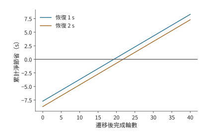

*圖 12-14：遷移 64 MiB 狀態，鏈路 (Link) 80 Mbit/s，遷移後每輪節省 0.4 秒。兩條曲線分別取恢復時間 1 秒和 2 秒，淨節省為 N×0.4 減去傳輸和恢復時間。圓點標出首次獲益的整數輪數；零線以上表示遷移更快，首次獲益分別在第 20、22 輪。*

例如，恢復時間再增加 1 秒，20 輪的淨收益立即變成約負 0.7 秒，回本輪數增至 22。若預計後續還有 40 輪，新增這 1 秒之後仍可節省約 7.3 秒。部署系統因此需要預測剩餘會話長度，併為額外的傳輸和恢復開銷留出時間。

曲線中的「恢復時間」包括新裝置繼續執行前所需的準備工作。新裝置除了要將快取資料載入到記憶體，還要確定任務已經執行到哪一步。語言 KV 繫結模型、字首和 token 位置索引；截圖 Agent 的進度由已經執行的操作決定。一次點選已經改變了介面，即使應答丟失，也應恢復到點選後的狀態。操作編號和提交記錄讓目的裝置可以查到既有結果，從下一輪繼續。儲存這些記錄可以避免重複執行操作，就像複用快取可以避免重複計算。

連線預熱、圖編譯和模型載入也可用 $N\Delta t-M$ 分析：將準備成本放入 $M$，將後續每次減少的等待放入 $\Delta t$。[^survey] 這些準備是否值得，取決於後續呼叫節省的時間能否抵消一次性的準備時間。

### 12.2.4 模型內部切分的通訊邊界

會話遷移只在更換裝置時傳送一次狀態。另一種分工方式是讓多臺裝置一直共同執行模型，這時通訊會在執行中反覆發生。按階段切分模型時，每個輸入通常只需在相鄰階段之間傳輸一次；採用張量並行時，每層計算都要通訊。鏈路 (Link)從卡間互聯換成區域網後，頻繁同步會把微小的單次延遲累積成主要成本。

以 36 層 Qwen3-8B 在兩臺裝置上做張量並行（TP=2）為例，考察每層注意力輸出和 FFN 輸出的兩次歸約；歸約把兩臺裝置的區域性結果相加，使後續計算得到完整輸出。採用兩階段環演算法（第 7 章先做 ReduceScatter、再做 AllGather 的環形實現）時，每次歸約有兩次啟動，每個階段的啟動耗時為 $\alpha$，所以生成一個 token 時，這些歸約的啟動時間合計為

$$
T_{\mathrm{start}}=36\times2\times2\alpha=144\alpha.
$$

當 $\alpha=2$ μs 時，這部分約為 0.29 ms。若兩臺裝置改經第 12.4.1 節那種無聚合的 54 Mbit/s Wi-Fi 相連，每個階段至少要完成一次短幀交換；按該節承載 ACK 的短幀交換 134 μs 計，144 次啟動就要約 19.3 ms，是 RTX PRO 6000 一步 decode 讀取下界 9.12 ms 的兩倍多。即使載荷極小，通訊啟動仍需時間；而下一層需要本層歸約結果，自迴歸的下一個 token 又需要當前 token 的輸出。由於這些步驟必須依次執行，每次通訊的啟動時間都會累加到單個 token 的完成時間中。[^dense]

圖 12-15 和圖 12-16 依次展開一層的注意力輸出與前饋輸出，兩者沿執行方向各經過一次歸約後，才能開始下一層。單次等待雖短，重複的次數卻由模型結構決定。

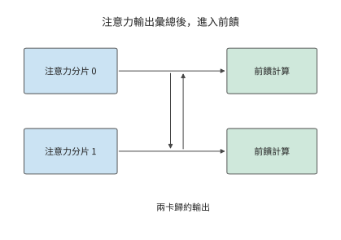

*圖 12-15：張量並行的一次注意力輸出歸約：兩卡先分別計算，再交換並求和，取得完整輸出後進入前饋。橫向箭頭表示執行順序，中間縱向箭頭表示兩卡通訊。*

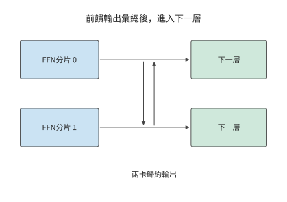

*圖 12-16：前饋網路也分別計算區域性輸出，再做兩卡歸約。完整前饋結果就緒後才能進入下一層，這一結構在 36 層中重複。*

與逐層同步的張量並行不同，管線 (Pipeline)並行把層分成連續的階段，通訊集中在相鄰階段之間的啟用傳輸。對單個請求，一個 token 仍需依次經過各個階段；對多個獨立請求，不同階段可以同時處理不同請求。由此得到兩種收益：減少通訊次數可以縮短單個請求的等待，讓不同階段同時處理請求可以提高總吞吐量。選擇張量並行還是管線 (Pipeline)並行時，先畫出一個 token 的依賴，再安排多個請求佔用各段資源，就能分別計算這兩項變化。

確定模型分工後，傳什麼、傳多少次以及哪些計算要等待傳輸都已明確。第 12.3 節考察實際傳送過程：資料準備好之後，連線是否建立、視窗是否允許傳送、確認是否及時返回。

## 12.3 廣域網傳輸中的額外開銷與等待

### 12.3.1 連線建立與複用

第 12.1 節假設連線已經建立，鏈路 (Link)以恆定速率傳輸資料。實際請求首先要建立連線和安全上下文，即通訊雙方為認證與加密維護的金鑰、身份和會話狀態；隨後取得傳送額度，最後等待接收方把資料交給應用。將這些等待加入第 12.1 節的時間模型，就能分析實際執行過程：資料雖然已經準備好，卻未必能立即計算或傳送。

這些等待涉及以下協議。HTTP 是組織請求和響應的應用層協議。HTTP/1.1 和 HTTP/2 通常使用 TCP（提供可靠有序位元組流的傳輸協議）與 TLS（建立認證與加密上下文的安全協議），HTTP/3 使用 QUIC（在 UDP 資料包上提供可靠多流傳輸和連線管理的協議）。UDP 嚮應用提供獨立的資料包，不自行負責重傳與排序。QUIC 將傳輸握手與 TLS 1.3 結合，減少分別建立傳輸連線和安全上下文所需的往返次數。會話恢復時，客戶端還可以根據儲存的安全狀態傳送早期資料，即 0-RTT 資料。服務端接受後繼續處理，拒絕後由客戶端重發；服務端根據操作編號識別重試，並返回已儲存的結果，同一操作就不會重複執行。[^quic]

把建鏈開銷代入第 12.1 節的截圖任務：沿用 30 輪截圖任務的 200 ms RTT，設建鏈額外需要兩次往返。每輪重建累計需 12 秒，只在第一輪建立則需 0.4 秒，節省 11.6 秒。連線複用之所以有效，是因為後續 29 輪共享了第一輪建立的狀態。第 12.1 節的 105 秒是在連線已經建立的條件下計算的；加上首次建鏈後為 105.4 秒，每輪重建則為 117 秒。

連線建立是一次性開銷，傳輸則每輪都要發生。請求頻繁時，保持連線可以省去下一輪的建鏈時間；兩次請求間隔較長時，空閒連線仍會佔用記憶體等資源。關閉連線可以釋放這些資源，但下次呼叫需要重新建鏈。與會話遷移一樣，這裡也要比較一次準備與後續多次使用的開銷。

### 12.3.2 視窗、反饋與有效吞吐量

複用連線省去了建鏈等待，連續傳送資料還需要足夠的傳送視窗。連線建立以後，傳送方也必須限制在途資料。擁塞視窗限制已經傳送但尚未確認的資料量；接收方的流量控制根據自己的緩衝空間，限制傳送方還能傳送多少資料。ACK 到達後，傳送方可以繼續傳送；接收方從緩衝區讀取資料後，也會通知傳送方新增的可用空間。達到傳送上限時，即使鏈路 (Link)空閒，傳送方仍要等待這些通知。

在途量是已經發出、尚未得到確認的資料位元組數。若允許在途量為 $W$，往返時間為 $R$，每個往返週期最多傳送約一個視窗的資料，因此

$$
B_{\mathrm{useful}}\le\min\left(B_{\mathrm{path}},\frac{W}{R}\right).
$$

式中 $B_{\mathrm{path}}$ 是路徑可提供的載荷速率，$B_{\mathrm{useful}}$ 是實際有效吞吐量。第 12.1.1 節頻寬 20 Mbit/s、RTT 100 ms 的圖片傳輸路徑，要持續填滿鏈路 (Link)，需要約 250 KB 在途資料。若只有 64 KB 額度，速率上限為 $64000/0.1=640000$ bytes/s，約 5.1 Mbit/s，僅傳送這 30 MB 資料就至少需要約 47 秒。鏈路 (Link)每秒本可以傳輸更多資料，傳送方卻要等下一批確認到來才能繼續傳送；只有擴大可用視窗，才能提高這時的實際傳輸速率。

單獨考慮整批確認的模型：接收方收齊 64 KB 後才確認，從這批發完到確認返回固定為 100 ms。因此完整週期包含 25.6 ms 傳送和 100 ms 反饋，共 125.6 ms。圖 12-17 畫出了這段等待。藍色時段確實在傳送，淺色時段鏈路 (Link)雖然空閒，傳送方卻因為視窗已滿而不能繼續。物理頻寬提高，只能縮短藍色部分。

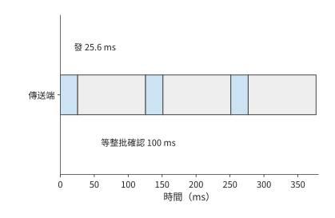

*圖 12-17：固定視窗 64 KB，鏈路 (Link) 20 Mbit/s，一批資料傳送需 25.6 ms。為單獨顯示停等，圖設接收方收齊一批後統一確認，從這批資料全部發出到收到整批確認再需 100 ms；每批完整週期為 125.6 ms。*

圖 12-17 把視窗固定在 64 KB，以便觀察停等過程。新連線通常從更小的視窗開始，隨著確認到達逐步增加；短請求可能在視窗充分增大以前就已結束。設初始視窗為十個 1460-byte 段，每輪反饋後翻倍。前四輪累計可發 $14600(1+2+4+8)=219000$ bytes，第五輪累計可達 452,600 bytes。約 355 KB 的語音請求因此要到第五輪才能發完。RTT 為 200 ms 時，幾輪反饋就是數百毫秒；短請求的大部分時間可能都用於等待確認。第 12.3.5 節將用這一機制解釋一次跨地域語音呼叫的效能觀察。

視窗解釋了傳送為什麼會暫停。請求總耗時還取決於究竟需要傳送多少位元組：網路上傳送的除了圖片，還有包頭和確認。

**例：協議頭與 ACK 如何增加圖片傳輸時間？** 沿用上傳 30 MB、下載 5 MB 的條件，取每包最多 1168 bytes 載荷，協議與網路頭 60 bytes，每個資料包觸發一個 92-byte ACK。合計約三萬個資料包，頭部與確認增加約 $30000\times(60+92)/10^6\approx4.6$ MB，實際傳輸量從 35 MB 增至約 39.6 MB。逐包計算傳送、確認和後續傳送的時刻，完整請求約需 14.4 秒。[^closed]

與 12.8 秒相比，多出的約 1.6 秒來自模型中剛加入的工作與等待。只看實際傳輸的位元組數仍不夠：ACK 一面佔用鏈路 (Link)，一面釋放後續傳送額度，減少 ACK 數量會同時改變鏈路 (Link)佔用和傳送額度釋放的時機。

實際的確認行為由擁塞控制演算法決定。NewReno 是根據丟包與確認調整擁塞視窗的演算法，CUBIC 在擁塞避免階段按時間的立方函式調節視窗；慢啟動是連線初期隨確認快速增加視窗的階段。在相同的資料填充方式與 NewReno 配置下，將立即 ACK 改為每兩包確認或最多等待 10 ms，實際傳輸的資料從約 39.6 MB 降至 38.2 MB，完整請求卻從約 14.52 秒增至 14.56 秒，晚約 43 ms。[^ack] 這組對照揭示了反饋的雙重作用：少發確認縮短傳輸時間，確認晚到則延長視窗等待。最終能否更快完成，要比較節省的傳輸時間與增加的等待時間。

ACK 決定傳送方何時能夠繼續使用視窗傳送資料，擁塞控制則決定視窗本身如何變化。相同路徑的大圖比較中，NewReno 與 CUBIC 的完整響應時間均約為 14.5 秒；視窗軌跡顯示 CUBIC 一直在慢啟動。[^ack] 本次請求在進入 CUBIC 的擁塞避免階段之前就已結束，因此觀察到的是啟動階段的行為。

### 12.3.3 丟包是不是擁塞

第 12.3.2 節的視窗隨確認增長，也要隨丟包收縮。傳統 TCP 擁塞控制不直接測量路徑頻寬，而是把丟包當作擁塞的訊號，用丟包反推可用速率。Mathis 模型是按丟包率估算 TCP 穩態吞吐量的公式，它給出這種反推能得到的速率上界：[^mathis]

$$
B_{\mathrm{TCP}}\le\frac{\mathrm{MSS}}{R}\cdot\frac{C}{\sqrt{p}},
$$

其中 MSS（maximum segment size）為每個報文的最大載荷，$R$ 為往返時間，$p$ 為丟包率；週期性丟包、每包確認時 $C=\sqrt{3/2}\approx1.22$，延遲確認（接收方每兩個報文才確認一次）時 $C<1$，因此論文的式 (4) 去掉常數，給出簡化上界 $\mathrm{MSS}/(R\sqrt{p})$。按該式，吞吐量由丟包率決定：丟包率增至四倍，速率減半。該式的前提是丟包意味著擁塞；無線鏈路 (Link)誤碼和跨地域鏈路 (Link)上的隨機丟包都不滿足這一前提。

跨地域鏈路 (Link)上的實測記錄正屬於後一種情形。筆者開發的廣域網傳輸系統 Queqiao（鵲橋，第 12.3.5 節介紹）的路徑記錄給出了一條丟包不含擁塞資訊的路徑。Irvine 發往貴陽的下載方向，傳送速率從 1 提到 300 Mbit/s，丟包率始終約為 14%，前後丟包相互獨立；反方向貴陽發往 Irvine 的 41,663 個報文一個未丟，同一條路徑的兩個方向表現得像兩條路徑。往返時間的最小值與最大值只差幾毫秒，路徑上沒有排隊。速率提到 600 Mbit/s 時丟包才升至 44%——越過了約 333 Mbit/s 的容量膝點（再提速丟包率就陡增的位置），只有這裡的丟包才來自擁塞。[^queqiao] 代入 MSS 1,448 bytes、$R=0.2$ s、$p=0.14$，按式 (4) 的簡化上界（$C=1$，路徑記錄也按此計算）得

$$
\frac{1448\times8}{0.2\times\sqrt{0.14}}\approx0.155\ \mathrm{Mbit/s},
$$

取 $C=1.22$ 則為 0.189 Mbit/s；兩者都與同一路徑實測的 0.13–0.47 Mbit/s 一致。第 12.3.2 節那份約 355 KB 的語音請求（354,640 bytes）按此速率僅傳送就需要約 18.3 秒。TCP 並沒有出錯：它按規則響應了丟包，只是這條路徑上的丟包不含擁塞資訊。[^wan-loss] 這是第 1.3.4 節所說第一類差距的極端例子：模型前提不成立，算出的上界比路徑實際能承載的速率低了三個數量級。要修正的是模型假設，而不是傳輸實現。

**BBR：直接測量，而不是從丟包反推。** BBR（bottleneck bandwidth and round-trip propagation time，一種基於測量的擁塞控制演算法）不以丟包為訊號，而是持續測量兩個量：瓶頸頻寬估計 BBR.max_bw，取近期交付速率樣本的視窗最大值；往返傳播估計 BBR.min_rtt，取 RTT 樣本的視窗最小值。傳送節奏（pacing）按測得的頻寬設定；在途量按頻寬時延積（bandwidth-delay product，BDP）$\mathrm{BDP}=\mathrm{max\_bw}\times\mathrm{min\_rtt}$ 設定：cwnd_gain 為 2，即擁塞視窗（cwnd）取兩倍 BDP，為 ACK 聚合與重傳留出餘量。啟動階段（Startup）以 $4\ln2\approx2.77$ 的 pacing 增益逐輪探測頻寬上限，ProbeBW_UP 階段以 1.25 的增益週期性探高。[^bbr] 代入同一路徑：$\mathrm{BDP}=333\ \mathrm{Mbit/s}\times0.2\ \mathrm{s}=8.325$ MB，擁塞視窗 16.65 MB；理想有效吞吐量 $(1-p)\times333\approx286$ Mbit/s，是 Mathis 上界的約 1,850 倍。在丟包不含擁塞資訊的路徑上，直接測量頻寬得到的速率，比從丟包反推的上限高出三個數量級。

**測準頻寬之後，重傳的尾部還在。** BBR 回答「發多快」，不回答「丟了怎麼辦」。354,640 bytes 分為 245 個報文，各以 14% 的機率獨立丟失，期望丟失 34.3 個。下面按理想化的逐輪選擇性重傳計算：每輪用一個 RTT 重傳丟失的報文，重傳的報文仍可能再丟；不計視窗收縮與超時重傳，所以結果是有利於 TCP 的下界。無丟包時的序列預算為一次 RTT 加模型 30 ms，再加按膝點速率傳送的 8.5 ms，合計約 238.5 ms；有丟包時期望完成時間為 0.756 s，約為序列預算的 3.2 倍；p99 為 1.24 s，對應 6 輪。[^wan-loss] 即使 BBR 把頻寬測準，高隨機丟包率下重傳造成的尾部延遲依然存在，這不是擁塞控制能解決的問題。

**編碼冗餘：讓接收方不等重傳。** 既然重傳的等待難以接受，就多發冗餘資料，由接收方自行修復缺包。前向糾錯（forward error correction，FEC）在 $k$ 個資料符號之外多發 $r$ 個修復符號，本例一個符號就是一個 MSS 大小的報文；一塊中丟失不超過 $r$ 個符號，接收方就能直接恢復，不需要任何重傳輪次。按二項分佈精確求 99.9% 成功率所需的最小冗餘：丟包率 14% 時，245 個資料包需要 63 個修復包，冗餘 25.7%；傳送量增至 308 個符號，傳送約 10.7 ms，完成時間約 241 ms，貼近 238.5 ms 的序列預算（圖 12-18）。同一路徑另一時段丟包率為 3.6% 時，逐輪重傳的 p99 降為 0.84 s，FEC 只需 20 個修復包，冗餘 8.2%。[^wan-loss] 所以冗餘比例應隨測得的丟包率調整，而不是固定不變。這組數字也是第 12.3.5 節 Queqiao 案例的定量動機：它的前向糾錯與傳送排程，正是按路徑測量結果安排冗餘量與傳送節奏。

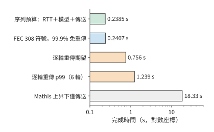

*圖 12-18：同一路徑（RTT 0.2 s、容量膝點 333 Mbit/s、丟包率 14%）傳送 354,640 bytes 的完成時間，橫軸為對數座標。序列預算是 RTT、模型 30 ms 與傳送 8.5 ms 之和，約 238.5 ms；FEC 多發 63 個修復符號（冗餘 25.7%）後 99.9% 不需重傳；逐輪重傳兩行是不計視窗收縮與超時的下界；Mathis 上界對應把丟包當作擁塞的 TCP，僅傳送就需約 18.3 s。*

### 12.3.4 多流傳輸與優先順序

前幾節討論單條資料的傳輸；本節考察多條資料共用出口時的相互影響。圖片、音訊和控制訊息共用出口時，有兩個順序可以改變：傳送排程決定鏈路 (Link)先為誰傳送資料，接收方對資料順序的要求決定已到達的位元組何時交給應用。

先分析資源分配。在一組共享鏈路 (Link)的計算中，FIFO 按入隊順序傳送，圖片第 5 秒完成、音訊第 6 秒完成；音訊優先時，音訊第 3 秒完成、圖片第 6 秒完成。音訊早了 3 秒，圖片晚了 1 秒，原因是音訊資料提前佔用了原先用於傳送圖片的時段。[^media]

再分析接收依賴。保持傳送和丟包恢復的時刻不變，音訊資料在第 3 秒已經齊備，圖片直到第 7 秒才齊備。這裡把接收資料交給應用稱為交付。整個連線共用一個接收順序時，前方缺口會阻塞後續資料，形成隊頭阻塞。整體有序交付時，音訊也要等到第 7 秒才能交給應用（圖 12-19）；逐流交付在第 3 秒就能將音訊交給應用，圖片仍為第 7 秒（圖 12-20）。這裡節省的 4 秒，是因為音訊不必再等圖片的接收進度，傳送的資料量和鏈路 (Link)速率都沒有改變。

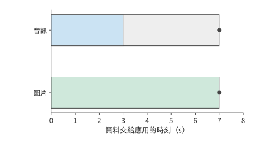

*圖 12-19：整體有序交付：音訊第 3 s 已收齊，卻因圖片缺口繼續等到第 7 s。灰色段表示資料已齊後的等待，圓點表示資料交給應用的時刻。*

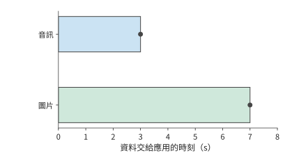

*圖 12-20：逐流有序交付：音訊在第 3 s 收齊後立即交付，圖片仍於第 7 s 交付。兩圖中的傳送、到達與恢復時刻相同；區別在於不同流之間是否需要相互等待。*

整體有序與逐流交付的區別，正對應兩種實際協議的做法。HTTP/2 將多個流放入一個有序 TCP 位元組流，前面的缺口會阻擋後續位元組。QUIC 以流為單位保持有序，其他流已經連續到達的位元組可獨立交付。[^quic] 這與音訊播放的遞推關係屬於同一種分析方法：把一個覆蓋全部資料的等待條件拆成各流自己的等待條件，已經滿足條件的流就能嚮應用交付資料。

這兩種機制分別回答「何時傳送」和「何時交給應用」。第 12.3.5 節用跨地域語音案例說明這些機制如何影響實際請求；第 12.4 節再結合音訊的預定播放時段和截圖版本，討論資料交給應用時是否仍有價值。[^http]

### 12.3.5 案例：Queqiao 如何加速跨地域語音服務

第 8、9 章介紹了模型服務的批處理與資源池化。把各地請求匯聚到少數資料中心，可以讓更多請求共享模型副本與加速器，減少分散部署時各地分別預留卻未充分使用的容量，也更容易集滿 batch。集中部署因此有機會提高加速器利用率、降低單位請求成本，代價是遠方使用者要經過更長的網路路徑。例如，將語音模型集中部署在美東，美西的使用者或接入服務都需要跨地域呼叫。資源池中的模型即使迅速完成計算，使用者仍要等待請求上傳和結果返回。

**Queqiao 是什麼，解決什麼問題？** Queqiao 開源、可自託管，在可控制的客戶端與可信閘道器之間承載 TCP 和 UDP 流量。應用透過本地的 SOCKS5 代理（一種轉發任意 TCP／UDP 連線的通用代理協議）接入客戶端，客戶端跨廣域網連線閘道器，閘道器再將請求轉交目標服務。在這樣的資料中心間部署中，客戶端在呼叫方的伺服器上，閘道器靠近遠端的推論服務，需要最佳化的長距離鏈路 (Link)就集中在客戶端與閘道器之間。應用仍呼叫原有的 ASR、TTS 介面，Queqiao 負責傳送請求與結果。[^queqiao-readme]

專案 README 描述了這一實際需求：模型執行在美國，客戶端分佈在不同地方。ASR 上傳幾百 KB 音訊，返回一句識別文字；TTS 提交一段文字，返回幾百 KB 音訊。README 中的 TTS 場景在模型完成後集中返回音訊，屬於一次突發傳輸；第 12.1 節的流式場景則在生成首塊後開始傳輸，接收與播放隨生成過程持續推進。這類短請求即使能在幾毫秒內發完全部位元組，連線建立、視窗增長和丟包恢復仍可能各自引入一次長距離的反饋等待。

Queqiao 的設計目標是減少這些額外等待，使短請求儘量接近必要傳播、資料傳送和模型處理所需的時間，同時提高長流對可用頻寬的利用。Queqiao 讓多條應用流共享客戶端—閘道器路徑的測量結果與傳輸狀態，複用連線，並根據路徑情況安排傳送和恢復；前向糾錯則多發一些冗餘資料，讓接收方不必等下一輪重傳就有機會恢復缺包。互動流與大檔案共存時，還要靠傳送排程控制互動流的等待。第 12.3.1 至 12.3.4 節討論的連線、視窗和多流機制，在此共同服務於跨地域呼叫。傳播距離本身仍然決定必須付出的時間；最佳化後的完整請求能否滿足業務期限，決定了集中部署是否適合這項任務。

**跨地域語音請求為何遠慢於約 240 毫秒的理想耗時？** 本節使用筆者歸檔的語音測試檢驗這些機制。實際測量路徑是貴陽至美國 Irvine，並非上面的美東—美西部署示例所用路徑。固定音訊檔案約 355 KB，鏈路 (Link) 333 Mbit/s，往返約 200 ms，模型處理約需 30 ms；計時從發起請求開始，到收到結果結束。理想傳送時間約為 8.5 ms，加上傳播與處理約為 238.5 ms。最初的直接呼叫卻超過一秒，而 Queqiao 約需三百毫秒。

這一差距有兩種可能的解釋。一種把優勢歸於傳輸機制本身；另一種認為直接呼叫的大部分時間用於連線準備、視窗增長和等待傳送。兩種解釋給出的預測不同：若連線準備與傳送等待是主要原因，充分調優直接路徑後，請求時間應當接近前面按資料量、計算時間和必要往返算出的最短時間；若協議機制本身仍帶來較大優勢，差距會繼續存在。

檢驗預測先要固定輸入。早期測試輪換使用八個 146–405 KB 的檔案，報告卻只標註了最後一次請求的大小（355 KB）；標註該大小的中位數實際涵蓋整個區間。改為反覆傳送同一份 354,640 bytes 的檔案，並交替執行兩條路徑之後，每次請求都傳送相同數量的位元組。[^queqiao] 固定資料量後，再改變連線和傳送配置，就可以比較兩者如何影響請求時間。

**複用連線並調優後，兩條路徑的耗時差距還剩多少？**

固定檔案的兩組結果如下。

| 連線條件 | 直接路徑的請求中位數 | Queqiao 的請求中位數 | 觀察到的差距 |
|---|---:|---:|---|
| 新建連線 | 約 1.19 s | 約 0.30 s | 直接路徑約為 3.9 倍 |
| 保持連線並調優 | 約 0.24 s | 約 0.24 s | 兩者接近 |

新建連線時兩條路徑相差約 0.89 秒，複用連線並調優後都約為 0.24 秒（圖 12-21、圖 12-22）。[^queqiao-calc] 原來的大部分差距隨著基線配置的改變消失了。這支援第二種解釋：連線準備和傳送方式在最初的差距中起了主要作用。即使使用同一種協議，配置不同，請求完成時間也可能相差甚遠。這個案例的步驟與第 1.3.4 節一致：先由傳播、傳送和模型處理算出約 240 ms 的下界，再與實測比較，最後用只改變連線條件的實驗分辨差距來自模型漏項還是實現開銷。這裡的差距幾乎全部來自實現開銷，下界本身沒有錯。

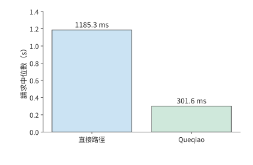

*圖 12-21：新建連線時，354,640 bytes 固定音訊的直接路徑與 Queqiao 請求中位數分別為 1185.3、301.6 ms。計時從發起請求到收齊結果，輸入檔案相同，兩條路徑交替執行。*

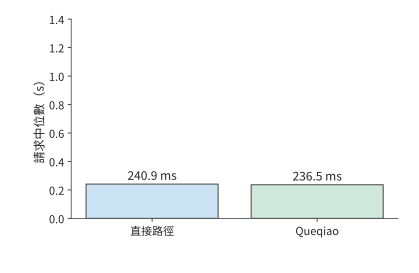

*圖 12-22：保持連線並調優後，同一固定音訊的直接路徑與 Queqiao 中位數分別為 240.9、236.5 ms。與前圖採用相同縱軸，兩條路徑均接近資料傳送、必要往返和處理所需的總時間。*

**單因素實驗如何區分連線、視窗與傳送節奏的影響？** 連線複用改變請求開始時是否需要握手，視窗大小改變確認返回前允許在途的資料量，傳送節奏改變鏈路 (Link)的空閒區間。圖 12-23 將這三類設定與對應事件配對：固定檔案、路徑和其餘設定，每次改變一個因素，記錄受其影響的事件發生時刻與請求總時間。連線實驗比較握手結束和首位元組傳送時刻，視窗實驗比較在途量與 ACK 到達後的傳送，節奏實驗比較兩次傳送之間的空閒時間。

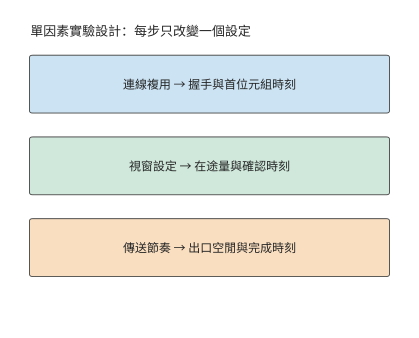

*圖 12-23：單因素實驗方法：保持相同檔案、路徑和其他設定，每次只改變一個因素，對照中間事件與總完成時間。*

視窗耗盡時，傳送一批資料後在途量達到上限，出口空閒，ACK 返回後才繼續傳送。擴大視窗可以縮短這類空閒區間；若請求也相應提前結束，傳送與確認的時間線便說明，總時間的縮短來自視窗變化。

實驗的執行順序也會影響比較結果。交替測試兩條路徑，可以讓一組對比中的兩次請求在相近時間執行，減小網路變化對比較的影響；同期 RTT 約為 197–205 ms，跨度約 8 ms。調優後，兩條路徑的請求耗時中位數相差約 4 ms，小於同期 RTT 的波動幅度。在這組實驗中，兩條路徑的請求時間都已接近 240 ms。

**降低網路往返延遲與加速模型計算，哪個收益更大？** 調優對照方案後，下一步最佳化的重點也會改變。模型從 30 ms 加速到 3 ms，最多節省 27 ms；將 RTT 從 200 ms 降至 20 ms，可節省約 180 ms。只要改在附近執行多出的準備和計算時間少於這 180 ms，就比原來的遠端路徑快。這與第 12.1 節的比較方法相同：先算出更換伺服器可以少等多久，再扣除新增的計算和準備時間。

請求時間之外，還要檢驗播放是否連續：音訊到達後要由播放器連續播出。另一組採用靜音輸出裝置回撥的實驗中，完整 PCM 最終全部收到，播放回撥卻累計有約 0.36–1.44 秒取不到足夠的音訊樣本。[^physical] 請求結束時刻只反映最後一批資料何時到達，播放器則在此之前就要持續讀取音訊。請求總時間與播放停頓時間描述的是兩個問題。

音訊塊的生成、到達、進入播放緩衝和被播放回撥讀取，構成連續播放的時間線。第 12.1 節的遞推式給出緩衝第一次耗盡的時刻：此時若下一塊尚未生成，等待出在模型處理；若已生成但未到達，等待出在傳輸；若已到達卻沒被讀取，等待出在本地緩衝與排程。

這一案例走完了從估算到部署決定的全過程：先算出理想完成時間，再從執行記錄中找出等待，用單因素實驗解釋原因，最後根據還能節省多少時間決定繼續調優還是更換伺服器。第 12.4 節把無線接入中的爭用、波動與恢復加入分析，第 12.5 節彙總完整部署方案。

## 12.4 無線變化下的互動與恢復

### 12.4.1 共享空口與上下行爭用

第 12.3.4 節區分了「何時傳送」和「何時交給應用」。**空口（air interface）**是裝置透過無線訊號通訊的介面。無線網路還改變了傳送本身的代價：上行資料和下行反饋要輪流佔用同一段空口時間。每次交換除了傳送位元組，還要等通道空閒、等幀間間隔，並接收本跳的確認。因此除了應用位元組數，還要計算交換次數。

端到端 ACK 發給遠端傳送方；介質訪問控制（MAC）層組織單條無線鏈路 (Link)的傳送，MAC ACK 確認本跳無線幀。承載端到端 ACK 的無線幀，也要做自己的 MAC 確認。因此，即使端到端 ACK 很短，也需要等待通道空閒，並完成本跳確認。

**例：短 ACK 幀的無線接入與確認開銷有多大？** 正交分頻多工（OFDM）把資料分到多個相互正交的子載波上傳送；PPDU 是物理層協議資料單元，包含物理層前導、頭部和承載的資料，代表一次無線傳送的完整物理層內容；SIFS 是連續交換之間的短幀間間隔。取無聚合的 OFDM 參考交換，資料速率 54 Mbit/s，MAC ACK 速率 6 Mbit/s。資料包交換包含 34 μs 接入等待、208 μs 資料幀、16 μs SIFS 和 44 μs MAC ACK，共 302 μs。承載端到端 ACK 時，資料幀縮至 40 μs，其餘三項保持不變，共 134 μs。[^air]

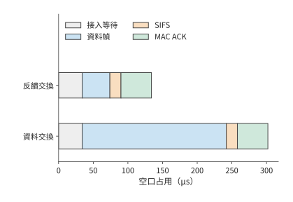

*圖 12-24：報文變短後，固定交換開銷仍然存在，因此空口占用時間不會按相同比例縮短。兩種成功交換採用相同的 34 μs 接入等待、16 μs SIFS、44 μs MAC ACK，區別只在資料 PPDU：208 μs 或 40 μs。條件為 OFDM54／6、無聚合、無重傳的參考模型。*

圖 12-24 中，兩種交換都包含 $34+16+44=94$ μs 固定開銷。資料幀的傳送時間從 208 μs 縮到 40 μs，縮短約八成，整次交換的耗時卻只縮短約 56%。固定項所佔比例越大，繼續縮短載荷的收益越小；把多個小報文合併傳送、減少交換次數，降低開銷更直接。

仍傳送 30 MB 圖片與 5 MB 成片，按該無線配置需要的資料交換和反饋交換各為 30,800 次，累計佔用空口的時間約為

$$
30800\times(302+134)\ \mathrm{\mu s}\approx13.4\ \mathrm{s}.
$$

保持資料與恢復軌跡不變，將端到端 ACK 數減半，能釋放約 $15400\times134\ \mathrm{\mu s}\approx2.1$ 秒空口。第 12.3.2 節已經說明，反饋延遲又會增加視窗停等。因此，需要重新計算各包的傳送與確認時刻：減少 ACK 釋放了空口時間，但等待確認又可能推遲後續傳送。兩者共同決定完整請求何時結束。

實際協議中已有按這一思路設計的機制。TACK 是減少無線確認開銷的一種反饋機制。TACK 將常規的累積確認與需要即時反饋的事件分開：前者合併後傳送以減少交換次數，後者立即返回，讓傳送方儘快繼續傳送或重傳丟失的資料。[^wireless-survey] 這種分工同時減少確認報文的傳送開銷和等待反饋的時間。

### 12.4.2 業務時限、過期資料與取消

第 12.1 節的播放器等待缺塊，以保持全部內容；另一種播放器按固定時鐘播放，晚到的音訊塊不再用於原定的播放時段。前者把網路延遲變成停頓，後者則會使部分聲音缺失。任務的品質要求決定採用哪一種播放規則。

例如，八塊音訊各長 20 ms，計劃從第 0.4 秒開始連續播放，共 0.16 秒。這些音訊與大圖共用鏈路 (Link)時，FIFO 下這些塊最終全部到達，卻都錯過了各自預定的播放時刻；媒體優先時八塊都按時到達。[^mixed] 兩種情況下最終收到的位元組數相同，按時可用的聲音卻分別為零與 0.16 秒。排程時統計按時播放的內容，才能反映使用者實際聽到了多少聲音。

晚到的資料錯過原定播放時段，取消則讓尚未播放的資料立即失去價值。播放器的待播佇列中若已有三塊 20 ms 音訊，即使遠端停止生成，本地仍可繼續播出 60 ms。若控制訊息需要 100 ms 才能到達服務端，那麼在訊息到達前，遠端還會產生新塊。取消過程因此分成兩條並行路徑（圖 12-25）：本地清空待播緩衝，遠端停止生成和傳送後續音訊。前者決定使用者何時不再聽到聲音，後者決定何時停止消耗資源。

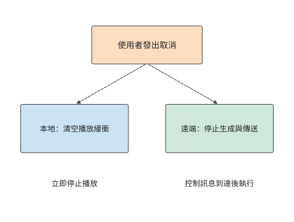

*圖 12-25：一次取消同時觸發兩條路徑：本地清空待播音訊，遠端在控制訊息到達後停止生成和傳送。虛線表示控制流；本地停止播放與遠端資源釋放有各自的完成時刻。*

音訊取消後，丟棄的只是尚未播放的資料；截圖 Agent 的動作則在提交後改變環境。應答丟失時，重試應查詢原操作編號對應的結果；如果再次點選，就把通訊重試變成第二次業務操作。儲存操作結果後，網路恢復時就可以從原有進度繼續，避免增加重複操作。

### 12.4.3 雙路徑選擇、分流與故障切換

此前的分析只考慮單條接入路徑；終端往往同時連線兩條。Wi-Fi 與蜂窩網路提供兩條接入路徑。分流把不同部分的資料交給不同路徑，目標是同時使用資源；複製把同一份資料交給兩條路徑，目標是更早取得一份有效結果。這兩種方法的資料量和完成條件不同，需要分別計算。

**例：雙路徑如何分配圖片資料以縮短傳輸時間？** 兩條獨立恆速路徑分別為 20 和 10 Mbit/s，將比例 $x$ 分給快路，其餘分給慢路。兩部分齊備才完成，因此

$$
T_{\mathrm{split}}=\max\left(\frac{xS}{B_1},\frac{(1-x)S}{B_2}\right).
$$

如果一條路徑先結束，可以把另一條上的部分位元組移給它，讓原本較晚完成的部分提前結束。因此，最優比例應讓兩條路徑同時完成，即 $x=B_1/(B_1+B_2)$。快路傳 20 MB、慢路傳 10 MB，各需 8 秒，比只用快路的 12 秒少 4 秒（圖 12-26）。

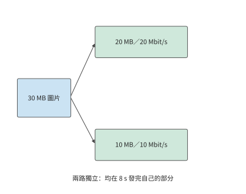

*圖 12-26：兩條獨立路徑按頻寬比例分配輸入，分別傳送 20 MB 和 10 MB，均需 8 s。任務等兩部分都齊備後完成。*

若兩條路徑匯入同一個 24 Mbit/s 的出口，兩條接入路徑仍可同時傳送、各需 8 秒，但所有資料都要經過該出口，出口傳完 30 MB 至少需要 10 秒。瓶頸於是轉移到了共同出口。繼續提高接入速率，只會讓更多資料排隊等待透過該出口。

圖 12-27 中，兩條線在出口重新匯合。這一匯合點既解釋了兩條接入路徑的速率為什麼不能直接相加，也引出另一個問題：出口所在的裝置故障時，另一條接入能否繼續傳輸。

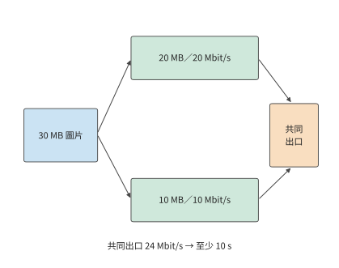

*圖 12-27：30 MB 圖片按 20／10 MB 分到 20／10 Mbit/s 兩條獨立接入，各需 8 秒。兩路再經過同一 24 Mbit/s 出口，全部資料透過該出口至少需 10 秒。箭頭表示資料路徑，不表示傳播距離；容量取恆定值。*

如果希望一條路徑斷連後仍能收到同一份資料，可以採用複製，並檢查兩份資料會在哪些地方同時失敗。設共同端點失敗機率為 $q$；端點正常時，兩條接入的失敗相互獨立，機率為 $p_1,p_2$。失敗包括端點失敗，以及端點正常但兩條接入均失敗，兩類互斥事件相加得

$$
p_{\mathrm{fail}}=q+(1-q)p_1p_2.
$$

取 $p_1=0.1,p_2=0.05$，兩條接入同時失敗的機率為 0.5%；加入 $q=0.02$，總體約為 2.5%。其中 2 個百分點直接來自共同端點。即使把兩條接入做得完全可靠，總體失敗機率仍為 2%；把服務副本放到不同故障域，才會降低這一項。

避開共同故障後，複製還要支付額外頻寬。以八塊 640-byte 音訊為例，一份為 5120 bytes，全量複製為 10,240 bytes。接收方用資料塊編號去重，先到的完整副本進入播放器，後到副本被丟棄。多傳送一份資料，就能在兩條路徑中使用先到的結果；如果兩路共用同一個出口，重複資料也會佔用其他任務需要的頻寬。[^dual]

分流、複製和匯合點在實際系統中常由協議或接入代理實現。多路徑 TCP（MPTCP）在一個邏輯連線中組織經過不同路徑的 TCP 子流，接入代理可在終端與普通伺服器之間匯合這些路徑。華為 Link Turbo 的多網路協同實踐也利用不同接入的狀態選擇傳送方式。[^wireless-survey] 代理的位置同時影響共享容量、傳播與故障域，因而成為部署模型中的一個計算和傳輸節點。

## 12.5 從端邊雲分工到完整部署

### 12.5.1 地域、資料與服務位置

繼續分析第 12.1 節的 30 輪截圖任務。前十輪已完成，要為剩餘二十輪選擇執行位置；從此刻起，任務必須在 45 秒內完成。無論選擇哪種方案，此前已經花掉的時間都相同，比較的是剩餘工作。原服務每輪 3.5 秒，繼續執行需要 70 秒，因此必須換一種執行方案。

仍使用每輪 0.8 MB 截圖、0.3 秒終端工作，原雲路徑上行 6.4 Mbit/s、RTT 0.2 秒。比較三個執行位置：端側是第 12.1.5 節的手機，附近工作站裝一張 RTX PRO 6000 Blackwell 工作站版，雲地域使用一張 H100 SXM。三處執行同一份 Qwen3-8B q4_0 權重和 8K 上下文，每輪都生成第 12.1.5 節的 45 個 token，任務質量因而相同。每輪模型時間沿用第 12.1.5 節的口徑，取 decode 讀取下界：45 步，每步讀取 5.47 GB，除以裝置的記憶體頻寬。新服務接手時，要先對前十輪留下的 8K 上下文做一次 prefill，即表中的「一次準備」，按 133.6 TFLOPs 的矩陣工作量除以 BF16 稠密峰值計算；手機沒有可引用的矩陣峰值，準備記為 0，這一取值只會讓端側顯得更快。先採用無排隊、無故障、控制回覆傳送時間為零的條件。[^edge-tiers]

| 執行位置 | 裝置 | 一次準備 | 每輪模型 | 上行 | 每輪往返傳播 | 截圖去向 | 20 輪能耗 |
|---|---|---:|---:|---:|---:|---|---:|
| 端側 | 手機，84.8 GB/s | 0 s | 2.90 s | 無需上傳 | 0 s | 留在裝置 | 518–680 J |
| 附近工作站 | RTX PRO 6000，1,792 GB/s，600 W | 0.27 s | 0.137 s | 80 Mbit/s | 0.02 s | 傳到附近工作站 | 約 1.81 kJ |
| 雲地域 | H100 SXM，3,350 GB/s，700 W | 0.14 s | 0.073 s | 6.4 Mbit/s | 0.20 s | 傳到雲地域 | 約 1.12 kJ |

成本用能耗衡量。兩張 GPU 按板卡額定功率乘以忙碌時間計算，忙碌時間為一次準備加二十輪模型計算；額定功率是上限，所以這兩行也是上限。手機取 MELTing Point 實測的每 token 0.576–0.756 J，二十輪共 900 個 token。[^melt] 上傳與傳播消耗的網路能量不計。

比較時間與成本之前，先要滿足資料駐留（data residency）的約束，即資料只能在規定的裝置或地域記憶體儲和處理。表中端側一行的原始截圖始終留在裝置上；附近工作站與雲地域兩行每輪都要把 0.8 MB 的原始截圖傳出裝置。若截圖含有不允許離開裝置或不允許出境的內容，這兩行在比較開始前就被排除；下面的時限與成本比較以允許上傳為前提。

將雲端進一步分為不同地域後，仍然需要比較這些時間與成本。採用 Regionless（由平臺為請求選擇雲地域，而非應用固定繫結地域）服務時，應用指定任務、品質要求和完成期限，由平臺選擇部署地域。[^region] 平臺仍需比較各方案的實際開銷：伺服器距離影響傳播時間，快取影響重新計算的工作量，跨地域傳輸影響資料傳輸成本。

### 12.5.2 時限、成本與恢復的聯合比較

**例：狀態遷移與剩餘互動輪數如何改變端邊雲部署選擇？** 剩餘二十輪的時間為

$$
\begin{aligned}
T_{\mathrm{local}}&=20(0.3+2.90)\approx64.0\ \mathrm{s},\\
T_{\mathrm{near}}&=0.27+20(0.3+0.137+0.02+6.4/80)\approx11.0\ \mathrm{s},\\
T_{\mathrm{cloud}}&=0.14+20(0.3+0.073+0.20+6.4/6.4)\approx31.6\ \mathrm{s}.
\end{aligned}
$$

H100 的記憶體頻寬是 RTX PRO 6000 的 1.87 倍，雲端每輪的模型計算比附近工作站少用約 0.064 秒，二十輪省約 1.3 秒，準備再省約 0.13 秒；但上傳每輪多 0.92 秒，傳播多 0.18 秒，二十輪多等 22 秒。合計下來，雲端反而慢約 20.6 秒。把時間差拆開，便能看到更快的模型如何因每輪通訊而失去優勢：每輪 decode 只要幾十到一百多毫秒，遠少於每輪的通訊時間。

圖 12-28 至圖 12-30 彙總了三種部署方式下完整任務的各階段耗時。雲端的綠色計算段更短，藍色上傳段卻更長；兩段與其餘工作依次累加，決定橫條終點所示的任務完成時間。

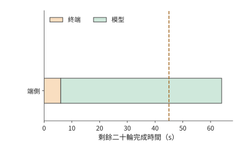

*圖 12-28：端側：終端工作 6 s，模型計算 58.0 s，共 64.0 s。三圖共用 45 s 期限線和同一橫軸，顏色分別彙總二十輪同類工作的耗時。*

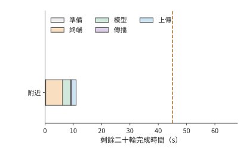

*圖 12-29：附近工作站（RTX PRO 6000）：準備 0.27 s，二十輪終端 6 s、模型 2.7 s、傳播 0.4 s、上傳 1.6 s，共 11.0 s，滿足 45 s 期限。虛線表示 45 s 完成期限。*

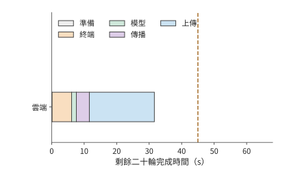

*圖 12-30：雲端（H100 SXM）：準備 0.14 s，二十輪終端 6 s、模型 1.5 s、傳播 4 s、上傳 20 s，共 31.6 s。計算更快而傳輸更久，比附近工作站慢約 20.6 s，仍在期限之內。虛線表示 45 s 完成期限。*

45 秒期限先排除端側：端側能耗最低，卻需要 64.0 秒。附近工作站和雲端都能按時完成，接著比較能耗：雲端約 1.12 kJ，附近工作站約 1.81 kJ。H100 的額定功率比 RTX PRO 6000 高，每輪的忙碌時間卻只有後者的一半多，能耗反而更低。因此，在能按時完成的方案中，能耗最低的是雲端方案。

端側一行還要按第 12.1.5 節核對電池。表中二十輪的 518–680 J 佔一次充電的比例需要折算。iPhone 16 Pro 的規格頁只給出最長 27 小時影片播放，沒有電池的瓦時數，所以改用 MELTing Point 的實測折算：一次充電可完成約 490–590 個提示，20 輪相當於 20 個提示，約佔一次充電的 3.4%–4.1%。[^melt] 電池不排除端側方案，排除端側的是 64.0 秒的完成時間。

雲端方案對上行速率的依賴可以定量表示。只改變雲端路徑的上行速率 $b$，單位 Mbit/s，其他參數保持不變，雲端完成時間為

$$
T_{\mathrm{cloud}}(b)=11.6+\frac{128}{b}\ \mathrm{s}.
$$

11.6 秒來自一次準備和二十輪非上傳工作，128 Mbit 是二十張截圖的總上傳量。滿足期限需要 $b\ge128/33.4\approx3.8$ Mbit/s（圖 12-31）。但無法比附近工作站更快：即使上傳瞬間完成，雲端也要 11.6 秒，仍比附近的 11.0 秒慢。原因在於每輪 0.2 秒的往返傳播：它比附近工作站每輪的傳播與上傳之和（0.1 秒）多出 0.1 秒，超過了 H100 每輪節省的約 0.064 秒模型時間。

反解頻寬門檻前必須先檢查固定時間。若期限為 $D$，這裡的門檻為 $b_{\min}=128/(D-11.6)$ Mbit/s，只在 $D>11.6$ 秒時有意義。當 $D\le11.6$ 秒時，即使上傳頻寬無限大，固定時間也已經用完期限，不存在有限的頻寬門檻；不能把公式算出的零、負數或除零錯誤解釋為可行頻寬。

「追不上」這一結論依賴讀取下界的口徑。實驗 8-1 在 RTX PRO 6000 上測得 batch 1、8K decode 每步 25.83 ms，是讀取下界 9.12 ms 的約 2.83 倍，多出的主要是每步的固定開銷。把兩張 GPU 的模型時間都按該倍數放大，附近工作站為 16.04 秒，雲端不含上傳為 14.29 秒，兩者相差 1.75 秒；上行超過 $128/1.75\approx73$ Mbit/s 後雲端才更快。[^edge-tiers]

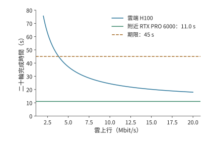

*圖 12-31：雲路徑上行改變完整任務的部署選擇。剩餘 20 輪每輪上傳 0.8 MB，雲端準備 0.14 秒，每輪其餘工作合計約 0.57 秒，因此總時間為 11.6+128/b 秒；附近工作站為 11.0 秒，期限為 45 秒。本例保持模型、處理時間和其他網路參數不變，忽略排隊與故障。約 3.8 Mbit/s 起雲方案可滿足期限；上行再高，雲端也不低於 11.6 秒，始終慢於附近工作站。*

接近期限時，還要計算能為額外開銷留出多少時間。原上行 6.4 Mbit/s 時，雲端任務比期限提前約 13.4 秒完成；上行降到 4 Mbit/s，時間約為 43.6 秒，只剩約 1.4 秒餘量；降到 3.5 Mbit/s，約為 48.2 秒，已經超期。若要求 99% 的任務按時，就需要分析任務完成時間的機率分佈。由於每輪速率 $b_i$ 可以不同，包含上傳在內的總時間應寫為

$$
T=11.6+\sum_{i=1}^{20}\frac{6.4}{b_i}.
$$

設每輪速率在其上傳期間恆定，十輪 6 Mbit/s、十輪 10 Mbit/s 的平均速率也是 8 Mbit/s，任務卻約需 28.7 秒，比全程 8 Mbit/s 的 27.6 秒慢。傳送時間與速率成反比，慢的幾輪多出的等待大於快的幾輪節省的等待。平臺應根據整個任務的上傳時間分佈，判斷是否滿足 $P(T\le45\ \mathrm{s})\ge0.99$，還要考慮網路持續變慢時，相鄰多輪會一起受到影響。

以上部署選擇主要受截圖上傳時間影響。換成輸入較小、字首重複較多的文字任務，最佳化重點會轉向計算複用。保留會話狀態就能減少這些重複計算。考慮一條文字 Agent 會話：逐輪重送字首合計約 66 KB，保留狀態後只送約 10 KB，回覆均約 2.5 KB。在 333 Mbit/s 上，少傳約 56 KB 只節省 1.3 ms。[^region-trace] 與截圖的 16 MB 上傳相比，這裡的主要收益來自少做字首計算。

同一會話的矩陣計算量從約 $3.0\times10^{14}$ 降至 $6.0\times10^{13}$ FLOPs。在雲端 H100 SXM 上按 989.4 TFLOP/s 計，保留狀態節省約 0.239 GPU 秒。儲存的約 465 MB 狀態持續佔用視訊記憶體；按其在 H100 80 GB 視訊記憶體中所佔的比例折算，每儲存 1 秒相當於佔用 $0.465/80\approx0.0058$ GPU 秒。兩者相除：狀態儲存約 41 秒之後，佔用的視訊記憶體就會抵消本次節省的計算。這種盈虧平衡的計算方法與第 12.2.3 節的遷移時間比較相同：複用收益必須覆蓋儲存或搬移狀態的成本。

儲存狀態既能減少正常執行中的重複計算，也能減少故障後的重做。以選定的雲端方案為例，比較同一次斷連在兩種進度儲存方式下的開銷。雲端完成一輪任務約需 1.57 秒。設第十輪已執行完，但確認尚未返回時連線中斷，恢復連線需要 1 秒。若前九輪進度已經提交，只重做未確認的第十輪，額外約需 2.57 秒，任務由 31.6 秒增至 34.2 秒；若十輪都要重做，額外約需 16.7 秒，任務變為 48.3 秒，超過期限。仍然使用同一臺伺服器，能否保留進度卻決定了任務能否按時完成。附近工作站每輪只需約 0.54 秒，即使丟失十輪進度，也只要 17.4 秒；期限餘量更大的方案，對故障也更寬容。

圖 12-32 和圖 12-33 標出了兩種恢復方式的差異所在：相同的斷連事件之後，一種只重複最後一輪，另一種重複此前十輪。恢復開銷有多大，首先取決於哪些結果已經可靠儲存。

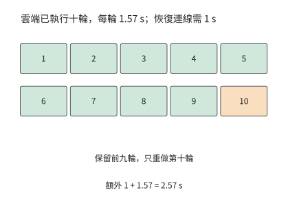

*圖 12-32：保留前九輪提交記錄（綠色），只重做未確認的第十輪（橙色）。雲端每輪 1.57 s，恢復連線 1 s，增加 2.57 s，總時間為 34.2 s。此例採用可安全重放的操作；已提交的外部操作則先查詢其結果。*

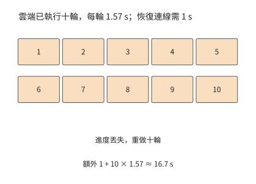

*圖 12-33：丟失十輪進度時，恢復連線後重做十輪，額外 1＋10×1.57≈16.7 s，總任務從 31.6 s 延至 48.3 s，超過 45 s 期限。*

以上比較的是一次已發生的斷連。若要估計大量任務的平均成本，還要把失敗發生的機率計入：重試也會增加成本。每次嘗試獨立、成功率為 $p$，失敗後全部重試且每次收費 $C$，期望成本滿足 $E=C+(1-p)E$，所以 $E=C/p$。99% 成功率對應約 $1.01C$，80% 對應 $1.25C$。儲存進度可以把整項重試變成區域性重做，直接降低每次失敗追加的時間和成本。

### 12.5.3 何時需要更換部署方案

綜合第 12.5.2 節的時間、能耗與恢復比較，本例應把剩餘二十輪放到雲端：31.6 秒完成，能耗約 1.12 kJ。與繼續使用原服務的 70 秒相比，節省約 38.4 秒。終端繼續採集並執行操作，雲端的 H100 負責模型判斷，每輪只傳輸截圖和控制結果。

這一決定來自對三種部署方案的逐項比較：端側先因超期被排除，附近工作站和雲端都能按時完成，其中雲端的能耗更低。第 12.1 至 12.2 節的壓縮、特徵與狀態分析則給出了進一步改進的方法：壓縮截圖可以減少上傳時間，上傳完整特徵會增加傳輸時間，保留已提交的進度則可以減少恢復後的重複工作。

| 條件變化 | 結果 | 決策 |
|---|---|---|
| 原雲端路徑的上行速率為 6.4 Mbit/s | 雲端 31.6 s、約 1.12 kJ；附近 11.0 s、約 1.81 kJ | 兩者都按時，使用能耗更低的雲端 |
| 雲端路徑的上行速率降至 3.5 Mbit/s | 雲端約 48.2 s | 雲端超期，改用附近工作站 |
| 雲端路徑的上行速率無論多高 | 雲端不少於 11.6 s | 始終慢於附近工作站；更緊的期限只能由附近工作站滿足 |
| 雲端發生一次斷連，保留前九輪進度並重做第十輪 | 34.2 s | 仍在期限內 |
| 同次斷連丟失十輪進度 | 48.3 s | 超期；需要改進進度儲存機制，或改用附近工作站 |

任務執行期間更換裝置，還需要遷移會話狀態。第 12.2 節的 64 MiB 會話需要約 7.7 秒準備，每輪快 0.4 秒，20 輪只淨節省約 0.3 秒。若頻寬改善只持續十輪就恢復原狀，這次遷移會淨損失約 3.7 秒。因此，平臺應把預計的持續收益與切換成本放在一起比較：預計節省的時間足以抵消遷移準備並留有餘量應對額外開銷時，才遷移狀態。在一段時間內繼續使用同一臺裝置，可以避免在臨界頻寬附近反覆遷移狀態。

第 1 章透過容量、運算和讀取時間判斷加速器能否承載模型；本章進一步分析通訊、執行順序和恢復過程，判斷部署方案能否按時完成任務。選擇部署方案時，需要依次回答：任務包含哪些工作，哪些步驟必須等待，實際執行還會增加哪些開銷，以及條件變化後哪種方案更合適。

### 12.5.4 資源條件變化後的系統調整

以上部署比較固定了模型，只改變執行位置；反過來，固定任務流程、只加速模型，完整任務的收益同樣有限。設一次固定軌跡中，模型執行合計 8 秒，工具與網路等不可重疊部分合計 2 秒。即使模型整體加速 10 倍，任務也只能從 10 秒降至 2.8 秒，加速比約為 3.57；[^core-calculation] 模型耗時趨近於零時，下界仍是 2 秒（圖 12-34）。

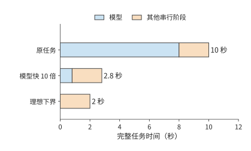

*圖 12-34：固定任務軌跡中的加速上限。模型從 8 秒縮短至 0.8 秒，其他序列階段保持 2 秒；第三行表示模型時間趨近於零的理想下界。*

要繼續縮短剩餘兩秒，可以改變系統組織。把執行移到本地可減少網路往返，保留環境可減少建立等待；相應增加的本地裝置與駐留空間，則進入新的成本預算。第 12.5.2 節的部署算例已經給出比較方法：先求滿足質量與期限的方案，再比較每個完成任務的總成本。

同樣的思路也出現在模型設計中：DeepSeek V4 到 V4.1 就是模型側的同類調整。跨層共享減少全域性 KV 的重複儲存，使模型可以用更細的粒度儲存歷史資訊；CED 減少輸入階段反覆經過解碼器的工作，快取恢復則縮短多輪會話重新開始的路徑。[^v41-case] 這些改變分別作用於容量、輸入計算和恢復等待，可以沿同一任務逐項計入預算。

從片上儲存到端邊雲，設計選擇始終依賴對完整執行過程的瞭解。注意力的歸約關係使中間矩陣可以按塊處理，重複的模型結構使執行計劃可以複用，字首與分支關係使上下文可以共享，工具等待則為狀態換出和環境準備提供了時間。每一項改進都利用模型或任務的資訊，指導其他層次的設計，重新安排資料存放位置、計算劃分和交接方式。

## 練習

練習按計算、改變條件和解釋機制遞進。12-2、12-3、12-7 為核心練習。未另說明的數值沿用正文教學條件。

**12-1　圖片精修的傳輸與計算預算〔延伸，★〕。**

(a) 上行速率分別取 10、20、100 Mbit/s，計算三種方案的完成時間：保持原方案、將影象處理速度提高到原來的十倍，以及將輸入大小減半。輸入壓縮所增加的編解碼耗時仍為 0.15 秒。

(b) 求壓縮節省的傳輸時間恰好等於新增編解碼時間時的上行速率。再以原圖大小和 20 Mbit/s 上行速率為條件：若原有的 0.3 秒處理時間中只有 0.2 秒可以加速，將這部分的執行速度提高到原來的十倍後，任務總耗時是多少？

(c) 把影象分為三個可獨立處理的塊，畫出上傳、處理與回傳的重疊。標出限制任務耗時進一步縮短的步驟。

**12-2　截圖壓縮節省的傳輸時間能否抵消額外互動〔核心，★〕。**

(a) 將每輪截圖從 0.8 MB 壓縮到 0.2 MB，每輪新增 30 ms 編碼時間。復算完成 30 輪截圖任務總共能節省多少時間。

(b) 壓縮後需要 38 輪時，任務是否更快？求壓縮方案仍比原圖 30 輪方案更快時，最多允許執行多少輪。

(c) 將每輪 RTT 增加 100 ms，分別計算原圖 30 輪和壓縮圖 38 輪的總時間。解釋為什麼同一個 RTT 變化會產生不同的任務耗時增量。

(d) 為截圖版本與操作編號設計記錄欄位，說明怎樣識別壓縮導致的糾錯輪次與舊狀態導致的無效輪次。

**12-3　視覺編碼位置與狀態遷移如何影響互動耗時〔核心，★〕。**

(a) 一張圖片佔 0.8 MB，編碼後得到形狀為 $[400,10240]$ 的 BF16 特徵張量，上行頻寬為 6.4 Mbit/s。視覺編碼需要 1.31 TFLOPs 矩陣運算；本地在 RTX 4090 上編碼，遠端在 H100 SXM 上編碼，均按 BF16 稠密峰值（165.2、989.4 TFLOP/s）求編碼時間下界。比較本地編碼後上傳特徵與上傳原圖後在遠端編碼的總耗時。

(b) 將鏈路 (Link)改為一個 400 Gbit/s 的 ConnectX-7 埠（每方向 50 GB/s），以直接上傳原圖為基準，求上傳視覺特徵多花多少傳輸時間；與 (a) 中兩張卡的編碼時間之差比較，判斷此時哪一項決定編碼器的位置。

(c) 遷移需要以 80 Mbit/s 傳輸 64 MiB 狀態，再用 1 秒恢復；遷移後每輪執行時間縮短 0.4 秒。分別求剩餘 10、20、40 輪時淨節省的時間。若恢復時間再增加 1 秒，至少還需執行多少輪，才能收回遷移耗時？

(d) 分別說明儲存圖片、視覺特徵和語言 KV 後，從何處開始重算；說明已提交的操作結果怎樣進入恢復過程。

**12-4　連線複用與多流傳輸〔延伸，★〕。**

(a) RTT 為 200 ms，任務共 30 輪，每次建鏈需額外兩次往返。計算每輪新建連線與全程複用連線的時間差。

(b) 分別計算立即確認與聚合 ACK 兩種方案中，圖片、包頭和 ACK 合計傳輸的位元組數，解釋為什麼實際傳輸的位元組更少，請求完成時間反而可能更長。

(c) 比較傳送優先順序與圖 12-20 的逐流交付：分別指出資源使用時段和等待依賴發生了什麼變化。

(d) 設計一組只改變連線複用方式、其他條件相同的對照實驗，列出起止事件及用於解釋時間變化的中間事件。

**12-5　ACK 頻率與空口效率〔延伸，★〕。**

(a) 一次資料幀交換耗時 302 μs，一次確認幀交換耗時 134 μs。共發生 30,800 次資料幀交換，原先每次都單獨確認。將 ACK 數量減半後，能釋放多少空口時間？

(b) 畫出傳送方因等待聚合 ACK 而暫停傳送的時間線，解釋釋放空口與提前交付之間的關係。

(c) PCM 播放所需速率為 256 kbit/s、實際接收速率為 130 kbit/s、初始緩衝 60 ms，求耗盡時刻。保持接收速率和 60 ms 初始音訊時長不變，將取樣率從 16 kHz 改為 24 kHz，求新的耗盡時刻。

**12-6　雙路徑的分流與備份〔延伸，★〕。**

(a) 30 MB 經 20 與 10 Mbit/s 兩路分流，推導使兩路同時完成的比例與時間。

(b) 加入 24 Mbit/s 共同出口，求新的傳輸時間下界，並指出提高哪一段鏈路 (Link)的頻寬能夠降低這一下界。

(c) 兩條接入路徑的失敗機率分別為 0.1、0.05，共同端點的失敗機率為 0.02。按正文的獨立故障假設，求向兩路各傳送一份完整副本後，任務仍然失敗的機率；兩條接入路徑完全可靠後，該機率是多少？

(d) 將八塊音訊各複製一份，每塊為 640 bytes，求新增的傳輸位元組數，並說明接收方怎樣避免重複播放。

**12-7　用單因素實驗區分連線準備、視窗與傳輸延遲〔核心，★★〕。**

(a) 分別計算每次新建連線和調優後保持連線這兩組實驗中，直接路徑與 Queqiao 路徑耗時中位數的比值，說明「主要差距來自連線準備與傳送等待」這一解釋給出了什麼預測。

(b) 設資料量約為 355 KB，傳輸速率為 333 Mbit/s，RTT 為 200 ms，處理耗時為 30 ms，求理想完成時間。與最初約一秒的實測耗時比較，估算還有多少等待時間需要解釋。

(c) 設計視窗大小的單因素實驗，說明如何交替執行不同視窗配置，以及應觀察到怎樣的在途資料量、ACK 與傳送時序，才能支援「視窗限制了傳輸速度」的解釋。

(d) 使用配套音訊記錄，畫出一個塊從生成到播放的各個時刻，說明如何區分生成不及時、傳輸延遲與本地排程等待。

**12-8　上行頻寬與故障恢復如何改變跨地域部署的時間和能耗〔延伸，★★〕。**

(a) 復算剩餘二十輪任務在三種部署方案下的時間與能耗，再求雲端按期完成所需的上行頻寬，並說明為什麼上行再高，雲端也追不上附近工作站。

(b) 改為剩餘十輪、期限 23 秒，選擇按時且能耗最低的方案；再把期限收緊到 15 秒，重新選擇。

(c) 二十輪互動中，十輪的上行速率為 6 Mbit/s，另外十輪為 10 Mbit/s，求雲端的總時間，與恆定 8 Mbit/s 比較並解釋差額。

(d) 對十輪任務、期限 23 秒，設第八輪剛執行完就發生連線中斷，恢復連線需要 2 秒。分別考慮兩種恢復情況：已保留前七輪的進度，只需重做第八輪；前八輪的進度全部丟失，需要全部重做。計算兩種情況下完成剩餘工作所需的時間，以及整項任務的總耗時。

本小題僅假設遠端服務發生斷連，端側方案仍正常執行。遠端服務在斷連期間保留執行狀態，連線恢復後繼續使用，因此不必重新準備；任務進度則按上述兩種情況分別恢復。重做的輪次要再計一次模型能耗。重新選擇滿足期限且能耗最低的方案。

**12-9　端側裝置的頻寬、容量與能耗預算〔延伸，★〕。**

(a) 四條 x16 LPDDR5X 通道、每引腳 10.6 Gbit/s，求合計頻寬；再求 Qwen3-8B BF16 單請求 8K decode（每步讀取權重 15.14 GB、KV 1.21 GB）的每步時間下界與 token/s 上限。

(b) 權重按 q4_0 量化（每 32 個值從 64 bytes 變為 18 bytes）後，重算每步下界與 token/s 上限；在 12 GB 記憶體、預留 4 GB 的手機上，求扣除權重後剩餘的空間、可容納的 8K 請求條數，以及單條請求上下文的最大 token 數。

(c) 每 token 能耗取 0.576–0.756 J、持續功率上限 13.8 W，求僅由功率約束給出的 token/s 上限範圍；分別與 BF16 和 q4_0 的頻寬上限比較，指出哪個約束先起作用。

**12-10　丟包、重傳與編碼冗餘〔延伸，★★〕。**

(a) MSS 1,448 bytes、RTT 0.2 s，分別求丟包率 14% 與 3.6% 下的 Mathis 上界，以及 354,640 bytes 在兩個上界下僅傳送所需的時間。

(b) 245 個報文各以 14% 獨立丟失，求期望丟失數。每輪用一個 RTT 做理想的選擇性重傳，重傳的報文仍以機率 $p$ 再丟，於是每個報文需要的傳送輪數服從成功率 $1-p$ 的幾何分佈，全部 245 個報文在 $n$ 輪內送達的機率為 $(1-p^n)^{245}$。序列預算為 238.5 ms，每多一輪加一個 RTT；求完成時間的期望值，再取輪數分佈的第 99 百分位得到 p99。

(c) 99.9% 成功率下，兩種丟包率各需多少修復包、冗餘比例是多少？求加上冗餘後的完成時間，並與對應的重傳 p99 比較。

(d) 說明冗餘比例為什麼應隨測得的丟包率調整，而不是固定取 25.7%：從達不到成功率目標與浪費傳送頻寬兩個方向說明理由。

[^phone]: [Snapdragon 8 Elite 產品簡介](../references/files/specs/qualcomm-8elite-brief.pdf)與[第五代簡介](../references/files/specs/qualcomm-8elite-gen5-brief.pdf)：支援 LPDDR5X 最高 5,300 MHz、容量最大 24 GB，未給匯流排寬度。[Micron LPDDR5X 產品頁](../references/files/specs/micron-lpddr5x-page.md)：最高速率檔 10.7 Gbit/s，JEDEC 標準為 x16 單通道器件，1γ 工藝新增 6／12／24 GB 容量選項，另有面向旗艦手機的 16 GB 器件；[Samsung LPDDR5X 產品頁](../references/files/specs/samsung-lpddr5x-page.md)同為最高 10.7 Gbit/s。[Apple iPhone 16 Pro 規格頁](../references/files/specs/apple-iphone16-pro-specs.md)不公佈記憶體容量與速率。

[^phone-ledger]: [端側匯流排與能耗分賬](../calculations/results/energy-ledger-book.md)：通道數按四條 x16 計（`declared_phone_channels_x16=4`；SoC 簡介未給匯流排寬度），每引腳取 SoC 支援的 10.6 Gbit/s，合計 84.8 GB/s；15,136,819,200 bytes 權重與 1,207,959,552 bytes KV 直接讀取[單請求 8K decode 結果](../calculations/results/qwen3-8b-decode-b1-s8192.json)。

[^melt]: [MELTing Point: Mobile Evaluation of Language Transformers](../references/files/papers/melting-point.pdf)，arXiv 2403.12844，§5.2.2 與附錄表 5：每 token 0.16／0.20／0.21 mWh；iPhone 14 Pro 持續功率最高 13.8 W、瞬時超過 18 W，Galaxy S23 持續低於 8.5 W；iPhone 14 Pro 上 Zephyr-3B q4_k 為 14.8 token/s、Llama-2 7B q3_k 為 6.0 token/s；一次充電可執行 490.05–590.93 個提示（S23 為 542.78）。提取值逐行核對見[數值提取表](../research/gap-plan-2026-09-11/sources-extract.json)。

[^mathis]: [Mathis 等，The Macroscopic Behavior of the TCP Congestion Avoidance Algorithm](../references/files/papers/mathis-tcp-model.pdf)，ACM CCR 1997。式 (3)：$BW=(MSS/RTT)\cdot C/\sqrt{p}$；週期性丟包、每包確認時 $C=\sqrt{3/2}\approx1.22$，隨機丟包時 1.31；式 (4) 給出更簡的上界。

[^bbr]: [BBR Congestion Control，IETF 草案 draft-cardwell-iccrg-bbr-congestion-control-02](../references/files/standards/bbr-ietf-draft.txt)：BBR.max_bw 為近期頻寬樣本的視窗最大值，BBR.min_rtt 為視窗最小 RTT 樣本，BBR.bdp 為兩者之積；Startup 的 pacing 增益為 $4\ln2\approx2.77$、cwnd_gain 為 2，ProbeBW_UP 的 pacing 增益為 1.25。

[^wan-loss]: [14% 丟包](../calculations/results/wan-loss-model-book.md)與[3.6% 丟包](../calculations/results/wan-loss-model-p036.md)兩檔計算。路徑參數取自[鵲橋路徑記錄](../references/author-context/queqiao-168ff4b/PATH-CHARACTER-DC-20260826.md)：往返 199–207 ms、容量膝點約 333 Mbit/s、Irvine 發往貴陽的下載方向丟包約 14%（另一時段 3.6%），貴陽發往 Irvine 的 41,663 個報文零丟包、MSS 1,448 bytes、固定檔案 354,640 bytes；模型時間取固定檔案複測一節的約 30 ms，與實測相符：調優後的中位數 236.5 ms 減去同期最短往返 197 ms 和傳送 8.5 ms，模型時間不超過約 31 ms，記錄前文的 38 ms 來自輪換八個檔案的早期測試；FEC 符號大小取 MSS，塊恢復成功率目標取 99.9%。重傳模型每輪一次理想選擇性重傳，不計視窗收縮與超時重傳，是有利於 TCP 的下界。

[^raw]: [RAW 圖片精修案例與條件預算](../case-studies/raw-retouching.md)。算例設原圖 30 MB、成片 5 MB、影象處理耗時 0.3 秒。

[^stream]: 分三塊的兩種計算分別為 12.8 s 與 12.36 s，正文以約 0.4 s 差額解釋重疊收益；額外預覽另增編碼與傳輸。來源：[整圖屏障](../calculations/results/image-stream-whole-image-without-preview.md)、[獨立分塊](../calculations/results/image-stream-independent-blocks-without-preview.md)及[額外預覽](../calculations/results/image-stream-independent-blocks-with-preview.md)。

[^audio]: [音訊塊時序計算](../calculations/results/audio-timing-base.md)，輸入幀與輸出音訊塊一一對應是該模型的簡化，用於說明逐塊處理與按序播放的依賴。

[^author]: [筆者的材料與技術判斷](../case-studies/author-context-and-design.md)。AOI 與 Latent Bridge 用於說明應觀察哪些介面資訊，以及裝置之間應傳遞什麼資料。

[^ec]: [固定視覺形狀與完整 EC／KV 計算](../calculations/results/multimodal-cache-single.md)、[多模態階段放置案例](../case-studies/multimodal-stage-placement.md)。固定視覺變體、DeepStack 及語言狀態分別計量。

[^encode-place]: [編碼位置與端邊雲三檔的裝置計算](../calculations/results/edge-tiers-agent-book.md)：視覺編碼的矩陣工作量取自[單圖視覺編碼結果](../calculations/results/vision-encoding-single.md)，峰值取自硬體參數列；[ConnectX-7 資料手冊](../references/files/specs/nvidia-connectx7-datasheet.pdf)：單埠速率至 400 Gbit/s。

[^ec-test]: [Qwen3-VL-8B CPU 編碼與本機 TCP 傳輸實驗](../experiments/ch12/12-03/README.md)。輸入為 256×256 的合成測試影象，完整 EC 約 2 MiB，PNG 約 3.4 KiB；8 次傳輸前後的資料逐位一致。編碼在傳輸計時開始前完成，所列時間對應特徵傳輸階段。

[^dense]: [Qwen3-8B TP=2、PP=4 的逐操作通訊量計算](../calculations/results/dense-comm-qwen8-tp2-pp4-t1.md)。36 層各有兩次輸出歸約，共產生 72 次通訊啟動；嵌入、階段啟用、logits 與 token 返回還會增加通訊。

[^survey]: [FlexSP／llm.npu 論文與實現資料](../references/framework-history/2026-09-09/sequence-and-npu/NOTES.md)。

[^quic]: [RFC 9000：QUIC 傳輸](../references/files/standards/rfc9000.txt)，§2、§7、§9、§13；[RFC 9001：TLS](../references/outline-checks/2026-09-07/rfc9001.txt)；[RFC 9114：HTTP/3](../references/outline-checks/2026-09-07/edge-media/rfc9114.txt)；[RFC 9221：不可靠 Datagram](../references/outline-checks/2026-09-07/rfc9221.txt)。HTTP/3 規定了如何在 QUIC 上傳輸 HTTP 請求和響應。

[^closed]: 精確分包為上傳 25,685 包、下載 4,281 包；共 29,966 個資料包和同數 ACK，網路實際傳輸 39,554,832 bytes，完整響應 14.36339008 s。來源：[完整圖片參考閉環](../calculations/results/closed-loop-book-30mb-5mb.md)。

[^ack]: 同一填充條件下，立即 ACK 為 39,555,120 bytes／14.52103724 s，聚合 ACK 為 38,177,328 bytes／14.564459796 s，差約 1.38 MB 和 43.4 ms。來源：[立即 ACK 的 NewReno 對照](../calculations/results/controller-loop-book-newreno.md)、[聚合 ACK 對照](../calculations/results/ack-policy-book-newreno.md)及[CUBIC 控制階段記錄](../calculations/results/controller-loop-book-cubic_hystart.md)。

[^media]: [FIFO](../calculations/results/shared-media-schedule-fifo.md)與[音訊優先](../calculations/results/shared-media-schedule-priority.md)；固定傳送記錄的[整體有序](../calculations/results/shared-media-hol-connection.md)與[逐流交付](../calculations/results/shared-media-hol-per_stream.md)。分別考察傳送排程和接收方交付依賴的影響。

[^http]: [本地 TCP／HTTP3 傳輸](../experiments/ch12/12-04/loopback/README.md)與[HTTP3 單連線多流](../experiments/ch12/12-04/h3-multistream/README.md)。

[^air]: [共享空口圖片計算](../calculations/results/shared-airtime-image-baseline.md)。資料與 MAC ACK 分別採用 OFDM 54／6 Mbit/s，不使用幀聚合；接入等待取 SIFS 16 μs 加兩個 9 μs 時隙，即 802.11a OFDM 的 DIFS 34 μs，不計隨機退避；MAC 層與端到端確認分別計量。

[^wireless-survey]: [計算機網路的新黃金時代（三）](../references/files/documents/network-golden-3.md)，介紹 TACK、Link Turbo 與代理部署的歷史背景。

[^mixed]: [媒體優先與聚合 ACK 的混合反饋計算](../calculations/results/media-feedback-mixed-priority-aggregate.md)及同目錄 FIFO／立即 ACK 對照。模型處理時間和預定播放時刻由算例設定。

[^dual]: [雙程式雙 TCP 連線實驗](../experiments/ch12/12-06/README.md)：實驗透過雙程序、雙 TCP 連線模擬兩條傳輸路徑，30 次正式嘗試包含共同端點失敗的情況。

[^queqiao-readme]: 系統定位與跨資料中心動機見 [Queqiao README 固定歸檔](../references/author-context/queqiao-496ca627/README.md)，對應 [GitHub 提交 `496ca627`](https://github.com/bojieli/queqiao/blob/496ca6278e359c02b5107dfab77c6a3db585f80d/README.md)，讀取於 2026-09-10。系統介紹依據此版本，效能對照資料來自提交 `168ff4b`。

[^queqiao]: [固定歸檔的路徑記錄](../references/author-context/queqiao-168ff4b/PATH-CHARACTER-DC-20260826.md)與[設計記錄](../references/author-context/queqiao-168ff4b/DESIGN-DC-PROFILE.md)，來自提交 `168ff4b`。檔案、調優設定和計時起止點均採用原記錄中的定義。

[^queqiao-calc]: 新建連線的直接／Queqiao p50 為 1185.3／301.6 ms，調優保持連線為 240.9／236.5 ms；兩個中位數之比分別約 3.93／1.019。逐輪計算耗時比再取中位數，結果分別為 3.96／1.03。來源：[Queqiao 同條件統計](../calculations/results/queqiao-records-conditions.md)。

[^physical]: 8 次完整接收測試中，收到的 PCM 與播放回撥讀取的 PCM 均逐位一致，播放回撥累計有 360–1440 ms 無法取得足夠音訊樣本；實驗使用靜音輸出裝置，記錄包含接收與播放回撥事件。另有 3 次請求在首個播放回撥之前取消，接收位元組、連線關閉事件和遠端 EOF 記錄了取消過程。完整四輪資料見[配套證據說明](ch12/evidence-notes.md)。來源：[顯式物理介面繫結的音訊實驗](../experiments/ch12/12-07/audio-physical/README.md)，固定提交 `496ca627`，基線含 socket 繫結適配。

[^region]: [計算機網路的新黃金時代（二）](../references/files/documents/network-golden-2.md)的雲際網路與 Regionless 討論。本章的地域方案用裝置能耗和 GPU 時間衡量成本。

[^region-trace]: 同一模型、token 序列與輪次的重放，傳入服務端的資料量分別為 66,207／10,193 bytes，返回客戶端的資料量均為 2,527 bytes。矩陣工作量分別為 296,505,803,538,432 與 60,380,764,176,384 FLOPs，除以 H100 SXM 的 BF16 稠密峰值得到 GPU 時間下界；狀態 465,371,136 bytes，按其佔 80 GB 視訊記憶體的比例折算駐留時間，約 41.0 s 後抵消省下的 0.239 GPU 秒。來源：[固定 Agent 軌跡的地域放置](../calculations/results/region-placement-agent-session.md)，位元組與 token 來自原軌跡。

[^edge-tiers]: [端邊雲三檔的裝置計算](../calculations/results/edge-tiers-agent-book.md)。每步讀取量取[單請求 8K decode 結果](../calculations/results/qwen3-8b-decode-b1-s8192.md)的權重與 KV，權重按 q4_0 每 32 個值 18 bytes 重排；手機匯流排取[端側匯流排與能耗分賬](../calculations/results/energy-ledger-book.md)；頻寬、BF16 稠密峰值與額定功率取自[硬體參數列](../calculations/results/hardware.md)；實測倍數取自[實驗 8-1 的效率表](../experiments/ch08/08-01/efficiency.json)中 batch 1、8K 一行。結果檔案同時列出十輪、收緊期限與斷連恢復的全部情形。

[^core-calculation]: 本章條件比較的[逐項復算](../calculations/results/core-principles.json)與[計算程式](../calculations/core_principles.py)。

[^v41-case]: [DeepSeek V4.1 官方技術報告](../calculations/sources/deepseek-v4.1-flash/DeepSeek_V41_Tech_Report.pdf)，第 1、2、3 節與第 6 節；[跨章會話的固定條件與復算](../calculations/results/v41-throughline.json)。

## 本章小結

完整互動應從三個層次分析。先根據資料量、計算量和傳播距離求出各步驟所需時間，再根據執行依賴確定哪些耗時需要相加、哪些步驟可以重疊，最後加入連線、視窗、競爭和恢復來解釋實際等待。圖片的 12.8 秒完成時間、語音的逐塊遞推和 Agent 的逐輪累積，分別展示了這三個層次如何配合。端側本身也用同一套方法展開：記憶體頻寬給出每秒 token 的上限，容量決定能容納的模型與上下文，能耗與電池決定能持續多久。

模型分工改變了跨裝置傳輸的資料形式和次數。把計算移到端側，可能把緊湊圖片換成更大的特徵；把模型拆到多個裝置，可能把一次傳輸換成逐層同步。比較時先扣除兩種方案中相同的耗時，再比較節省的計算時間與增加的通訊時間，便能找到收益來自哪裡。

複用把一次準備的開銷分攤到後續呼叫。遷移、連線預熱、圖編譯與狀態儲存，都可以根據準備成本和每次節省的時間，求出至少需要使用多少次才划算。預期節省的時間或成本，還要留出一部分來應對波動和恢復帶來的開銷。

設計實驗時，也可以沿用同一套時間模型。固定輸入和計時的起止點，記錄各階段的等待，再逐項改變設定，檢查總時間的變化能否由具體階段的變化解釋。Queqiao 的基線修正展示了這一過程：調優消除大部分額外等待後，進一步改善效能就需要縮短傳播時間。丟包也不一定意味著擁塞：在隨機丟包的路徑上，用丟包反推頻寬會低估可用速率約三個數量級；直接測量頻寬，再按測得的丟包率安排編碼冗餘，才能把完成時間壓回序列預算附近。

最終選擇先滿足質量和期限，再比較成本。即使平均計算速度和傳輸速率足夠，任務仍可能因慢速輪次或丟失進度超期；按時完成的機率與恢復後的重做量，因而是部署模型的組成部分。

回到第 1 章提出的模型應用：開發者透過上下文表達任務，執行系統據此安排計算、儲存狀態並傳輸資料。現在，保留一段歷史、增加一個候選分支、提前準備工具環境或遷移一次會話，都有了可以追蹤的資源代價。理解這些代價，也就能夠識別哪些通用執行開銷可以利用應用資訊消除，並根據任務質量、完成時間和總成本選擇實現方式。這是學習 AI Infra 帶來的系統設計能力。
