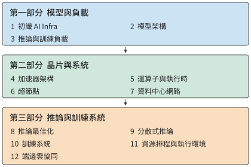

# 前言

我的上一本著作《深入理解 AI Agent》討論 Agent 的架構設計與工程實務。在與讀者交流、解答問題的過程中，我愈發意識到，要開發好基於模型的應用，還需要理解這類應用賴以執行的基礎設施。一方面是模型本身：模型怎樣處理輸入、生成輸出，並根據上下文與環境互動。另一方面是模型的執行系統：參數和上下文狀態存在哪裡，計算怎樣執行，多個加速器怎樣協作，以及模型呼叫怎樣與工具程式銜接。本書由此而來，討論支撐模型訓練與推論的基礎設施——AI Infra。

要理解應用開發者為什麼也需要這些底層知識，可以看一個熟悉的類比。大多數軟體工程師不需要親自開發作業系統、編譯器和晶片，但仍然需要學習作業系統、編譯原理和計算機組織與結構。這些知識幫助我們理解程式所依賴的抽象，以及抽象背後的實現。申請一塊記憶體、讀取一個檔案、呼叫一個函式，看起來只是簡單的操作，卻各有資源與時間代價。理解這些代價，才能解釋程式為什麼慢，以及怎樣改進。基於模型開發應用，同樣需要這樣的基礎。選擇多大的模型、保留多長的上下文、允許多少條請求同時執行、把任務放在本地還是雲端，都會改變系統需要完成的工作。

## 程式設計抽象上移：從作業系統到模型上下文

我在微軟亞洲研究院與中科大聯合培養讀博期間，做的是計算機系統研究，很自然地習慣了從作業系統、編譯器和硬體的分工來理解應用。這一領域的兩大頂級會議 SOSP（作業系統原理研討會）和 OSDI（作業系統設計與實現），名字裡都包括「OS」，也就是作業系統。傳統作業系統需要支撐多種多樣的應用，編譯器和硬體則為事先未知的程式提供通用能力。以往我們做系統最佳化時，總要考慮可程式性與效能的權衡取捨，為了極致效能犧牲可程式性往往不是好的選擇。

但如今 LLM 就是最重要的應用，在 AI 推論和訓練系統中，從運算子執行到分散式排程都可以為特定的模型和加速器架構最佳化，從而為跨層聯合最佳化開啟了新的空間。我認為，**程式設計抽象從作業系統到模型上下文的遷移，是計算機系統領域數十年來最重要的變化之一。** 從某種意義上說，**模型成了 LLM 時代的作業系統，而 AI Infra 成了 LLM 時代的計算機組織與結構**。《計算機組織與結構：量化研究方法》是我在組織結構領域的入門書，而目前 AI Infra 領域還缺少這樣一本從硬體約束和模型架構出發，量化推導系統設計的書。這就是我寫作本書的動機。

## 從數量級估算到系統設計

早年做資料中心加速時，無論面對的是模型推論、網路處理，還是儲存存取，我都會先做一遍數量級估算：一項任務要完成多少計算，讀寫多少資料？需要駐留的資料，視訊記憶體裝得下嗎？儲存和互聯頻寬能否滿足資料供給需求？計算、讀寫和必須序列執行的步驟，分別給出了怎樣的耗時下界？Jeff Dean 所倡導的 back-of-the-envelope estimation，也就是用紙筆做粗略估算，體現的正是這種習慣。幾步計算往往就能幫助我們判斷一個方向是否值得繼續，以及應該先解決哪個問題。

推動我動筆的還有一個更直接的原因。在與 AI Infra 從業者交流時，我發現，不少人熟悉模型和框架，卻還沒有形成對容量、頻寬、算力和延遲的數量級直覺。面對一個設計，能夠說出所用的技術，與能夠判斷它是否可行、效能大致能達到什麼水平，是兩種不同的能力。我希望這本書能幫助讀者建立後一種能力。

在數量級估算上，不僅人容易犯錯，AI 也一樣。最近，我嘗試讓 GPT-6 Astra、Claude Fable 5.1 等模型幫忙估算模型推論或訓練系統，或者新晶片架構的效能。這些模型能列出公式，算出看似精確的數字，卻仍會漏掉決定結果的基本約束：有時只算權重讀取，忘了注意力還要讀取 KV 快取；有時估算了讀取時間，卻沒有檢查權重、KV 快取和執行時工作區合計是否放得進視訊記憶體；有時按峰值算力推算速度，卻沒有檢查儲存頻寬能否持續供給資料；有時把工作量平均分給多張卡，卻遺漏卡間通訊；還有時算出了很高的吞吐量，卻沒有考慮序列依賴與通訊往返的延遲。漏掉這些約束中的任何一項，結論都可能偏離幾倍甚至幾個數量級。

因此，我希望貫穿本書的方法是：**從約束推導設計。** 先明確任務與品質要求，再列出計算、儲存、通訊和依賴關係，檢查視訊記憶體等儲存資源的容量是否足夠、儲存和互聯頻寬是否滿足計算的資料需求、哪些依賴造成的等待無法消除，然後討論模型怎樣分工、狀態放在哪裡、執行如何組織。把已知的基本約束逐一納入，才能排除明顯不可能的方案；實際系統中的開銷和變化，則要繼續用測量來校正。估算不必一開始就精確，但必須知道自己算進了什麼，還有什麼沒有算進去。

## 從運算子加速到萬卡互聯

約束是設計之源。2016 年，我在微軟亞洲研究院實習時，和團隊一起探索用 FPGA 加速微軟 Bing 搜尋排序所用的深度神經網路。模型權重反覆從片外記憶體搬進晶片，限制了計算速度。我想到，能否把模型拆到多塊 FPGA，讓各部分留在各自的片上儲存中，只透過高速網路傳遞中間結果？我興奮地把想法告訴徐寧儀老師，他說，這叫「模型並行」。計算放在哪裡、資料怎樣流動、專用化能省下什麼，已經是我當時反覆思考的問題。那幾年，導師張霖濤博士反覆叮囑：最佳化一定要做到物理所允許的極限。後來我在 KV-Direct 論文中寫下 "close to the physical limits of the underlying hardware"，也由此養成了一個習慣：先按第一性原理算出硬體允許的上限，再看系統離上限還有多遠。這個習慣貫穿了我後來的工作，也貫穿本書。

2019 年加入華為後，我參與了深度學習框架 MindSpore 的自動運算子生成專案 AKG。這項工作延續了此前的軟硬體協同思路：把模型計算轉換為適合昇騰 NPU 執行的程式，由編譯器安排資料分塊、儲存和執行順序。我還記得，為了融合 softmax 運算子，我到處尋找合適的演算法。讀到 NVIDIA 在 2018 年發表的線上 softmax 研究後，我終於找到了實現融合的辦法。再後來我才意識到，自己當時竟然摸到了後來注意力演算法 FlashAttention 的一條核心思路：把線上歸約與分塊、融合結合起來，減少中間結果的儲存和讀寫。

到了 2020 年，我加入 Unified Bus（UB，統一互聯）專案，開始研究更大規模的加速器協作：怎樣讓成千上萬個處理器高效地共同完成一項計算？

最早在華為內部推動這件事時，我們遇到了不少來自其他部門的質疑。當時有人問：「現在模型最多就八卡訓練，你搞一個萬卡的，什麼時候才能有一萬張卡啊？」那時候，整個公司都沒有一萬張卡。對習慣了單機多卡訓練的人來說，為萬卡規模設計互聯，確實離眼前的需求很遠。

我們之所以作出這一判斷，是因為看到了另一組證據。2019 年，譚焜博士把 AI 算力需求的發展趨勢畫成散點圖，看到需求的增長遠快於單晶片能力的提升，於是推動了面向上萬張卡的高效能互聯研究。2020 年我加入專案，GPT-3 論文的發表又為這一方向提供了新的論據。如果模型訓練需要的計算量繼續這樣增長，就必須讓更多加速器協同工作；互聯架構的研究和實現需要時間，等需求完全顯現以後再開始，很可能已經來不及。

如今，UB 已應用於昇騰 910C 和 950 系統。截至本書寫作時，基於 UB 的 NPU AI 訓練叢集架構是國內唯一支援萬卡以上規模的架構。今天回頭看，萬卡訓練的必要性已經不難理解。系統設計需要同時看清眼前的負載和正在變化的條件。八張卡能夠完成當時熟悉的任務，是一種實際經驗；更大的計算需求會推動更大規模的協作，是對未來的判斷。要說服別人，就需要把這一判斷所依賴的趨勢、資源和代價講清楚。

從模型推論加速到 AKG，再到 UB，這些工作跨越了不同的尺度，我反覆遇到的卻是相通的問題：計算需要的資料在哪裡，資料搬移的開銷是否壓過了必要的計算？如果修改系統和應用的抽象，讓系統掌握更多來自應用的資訊，是否可以降低資料搬移的開銷？

2023 年離開華為創業以後，這些問題又以另一種方式出現在我面前。我們做的 Agent 需要與人即時語音互動。使用者說完一句話，要等多久才能聽到回答？一通電話持續半個小時，服務成本又是多少？

2024 年，我們在 GPT-4o 釋出之前就推出了即時語音互動。後來與基於 GPT-4o 的即時語音 API 比較，我們的執行成本約為呼叫它的百分之一。我還記得，2023 年底第一個語音電話演示的延遲高達 5 秒。我們把整條互動管線拆開，先估算模型一次推理需要多少計算、讀取多少資料，再不斷改進；隨後繼續最佳化網路傳輸、資料庫訪問等等。延遲就這樣從 5 秒降到 2.5 秒、1 秒，後來做到約 500—600 毫秒。

這段經歷讓我認識到，應用開發與基礎設施之間有很直接的聯絡。同樣是即時語音，延遲相差幾倍，產品體驗就可能完全不同；成本相差一個數量級，能夠支援的商業模式也會隨之改變。

## 我希望這本書講清楚什麼

應用與基礎設施之間的這種聯絡，在模型研發內部同樣存在。在優秀的基礎模型團隊中，我越來越常看到一種跨越分工的工作方式：**最懂 Infra 的人做演算法，最懂演算法的人做資料，最懂資料的人做 Infra。** 這句話表達的是一種相互理解的深度。演算法設計者知道硬體的容量、頻寬和通訊限制，才能在模型結構中利用這些條件；資料工作者理解模型怎樣學習，才能判斷哪些樣本和訓練任務最有價值；Infra 工程師瞭解資料的組織、長度和使用過程，才能把系統資源真正用在有效的訓練與推論上。

近年來的模型設計中已經出現了這種跨層配合。DeepSeek V4 和 V4.1 是很好的例子。V4 在模型架構中就充分考慮了 Infra 的效率：將區域性視窗、上下文壓縮和稀疏選擇結合起來，減少長上下文需要儲存的狀態和反覆讀取的資料。視訊記憶體容量、儲存頻寬與計算之間的約束，直接影響了模型怎樣表示和使用上下文。

V4.1 Flash 更進一步，用非對稱的因果編碼器—解碼器（Causal Encoder-Decoder，CED）架構重新劃分理解與生成的職責，針對 Agent 輸入多、輸出相對少的負載重新安排計算投入（見第 1.1.3 節），說明系統效率的要求能夠推動模型架構本身的創新。

我希望讀者也能建立這種跨層理解：看到一種模型結構時，能想到它要求加速器做哪些工作；看到一種硬體能力時，能判斷怎樣改變模型與執行方式，才能真正把它用起來。

貫穿這些分析的一條線索，是**資料搬移**。計算單元需要取得權重和中間結果，多個加速器需要交換各自算出的資料，遠端服務需要接收輸入並返回結果。我們看到的是模型在生成答案，底層發生的卻是一次次讀取、計算、儲存和交接。資料放在哪裡、重複使用多少次、需要經過哪些介面、後續工作是否必須等待，都會影響執行效率。

因此，本書反覆追問五個問題：**搬什麼、搬多少、搬幾次、經過哪裡、誰必須等它。** 從晶片上的儲存層次，到超節點（透過高頻寬互聯緊密協作的一組加速器）和資料中心網路，再到終端、邊緣與雲（端邊雲）之間的任務分工，這五個問題都能幫助我們找到需要計算的量。保留資料可以減少重複計算，卻會佔用容量；擴大並行規模可以分擔工作，卻會增加通訊；減少傳輸可能需要更多本地計算，也可能改變結果質量。

要回答這五個問題，就需要把每個量都算出來，這也是本書採用「量化分析與系統設計」作為副標題的原因。《計算機組織與結構：量化研究方法》為這種分析方式提供了很好的示範。本書也希望把前面所說的估算習慣落實到每一層設計中：從模型的工作量出發，對照資源約束，解釋為什麼選擇一種執行方式，以及條件改變以後應該如何重新選擇。

## 全書結構

十二章按照「理解工作需求—認識執行資源—組織完整系統」的順序展開，如圖 0-1 所示。第一部分是模型與負載（第 1—3 章），建立分析方法，說明計算量、資料量和任務依賴從哪裡來。第二部分是晶片與系統（第 4—7 章），從單加速器執行走向多加速器協作，說明資源怎樣承擔這些工作。第三部分是推論與訓練系統（第 8—12 章），研究如何組織請求、模型狀態和訓練過程，並延伸到任務執行環境與端邊雲部署。

*圖 0-1　全書結構與閱讀順序。前一部分為後一部分提供分析依據；進入服務與部署之後，還要根據任務質量、完成時間和成本，重新檢查模型與資源選擇。*

下面是每章要回答的主要問題。你可以先在這裡找到自己關心的問題，再看看前面的章節為它提供了哪些基礎。

**第一部分：模型與負載**

- **第 1 章 初識 AI Infra**：如何認識系統全景，並用幾個關鍵數字估算一次模型執行？
- **第 2 章 模型架構**：模型的計算、參數和上下文狀態如何形成資源需求？
- **第 3 章 推論與訓練負載**：請求到達、多輪呼叫、多模態輸入和訓練過程如何改變資源需求與等待時間？

**第二部分：晶片與系統**

- **第 4 章 加速器架構**：晶片的計算、儲存和資料通路如何配合，適合什麼負載？
- **第 5 章 運算子與執行時**：如何組織運算子與執行過程，減少重複讀寫、提交和等待？
- **第 6 章 超節點**：模型如何在多個加速器間分工，協作規模應當多大？
- **第 7 章 資料中心網路**：資料如何跨加速器傳輸，交接規則、擁塞和故障如何影響計算？

**第三部分：推論與訓練系統**

- **第 8 章 推理最佳化**：如何安排批處理、請求和快取，提高給定加速器組合的服務效率？
- **第 9 章 分散式推論**：計算與狀態應當放在哪裡，如何組織分工、共享和擴縮容？
- **第 10 章 訓練系統**：如何安排訓練狀態、通訊與恢復，在期限內取得有效訓練進展？
- **第 11 章 資源排程與執行環境**：如何把模型服務、工具環境和共享資源組織成完整的任務系統？
- **第 12 章 端邊雲協同**：如何結合實際傳輸與互動要求，選擇任務在端、邊、雲的部署位置？

隨著閱讀推進，對同一個問題的分析會不斷加入新的條件：最初只考慮權重容量，後來還要計算上下文狀態；最初比較單次執行，後來還要面對並行、交接和故障恢復。我希望你能跟著這些變化，回頭檢查自己在前面作出的判斷。這也是我把模型、晶片、網路和服務系統放在一本書裡講的原因：它們共同決定了一項任務怎樣完成。

## 如何閱讀本書

如果你希望從頭建立系統認識，我建議先讀第 1—3 章，學會估算一次執行，弄清模型與負載提出了哪些需求，再依次閱讀後面兩部分。不同背景的讀者，也可以在這一共同基礎上選擇自己的重點。

- **模型與應用開發者**可以重點閱讀第 8、9 章的推論服務，以及第 11、12 章的任務環境和部署。遇到容量、運算子或通訊問題時，再回到第 4—7 章追蹤原因。
- **系統與網路工程師**可以重點閱讀第 5—7 章的執行與加速器協作，再看第 9、10 章，檢查這些機制如何影響分散式推論和訓練。
- **晶片與組織結構工程師**可以重點閱讀第 4—7 章，並結合後續章節的任務算例，檢查自己熟悉的硬體指標如何轉化為實際的服務能力。

無論選擇哪條閱讀路徑，我都尤其建議你在看答案之前，先自己估一下。拿一張紙，寫下資料量、處理能力和必須等待的步驟，通常就能發現一些值得追問的地方。如果結果與書中不同，先檢查雙方是否使用了相同的條件；如果條件相同，就繼續尋找漏算或重複計算的工作。這種來回檢查，往往比直接記住一個結論更有收穫。

書中的練習分為核心與延伸，核心練習幫助你完成本章的主要推導，延伸練習可按興趣和專案需要選擇。配套實驗、計算工具與參考資料整理在本書的開源倉庫中：

**配套開源倉庫：** [https://github.com/bojieli/ai-infra-book](https://github.com/bojieli/ai-infra-book)

倉庫中有三類材料，建議與正文配合使用：

- **實驗與計算。** 按章節組織的實驗提供執行說明、輸入條件和結果記錄；配套計算工具可以幫助你復算書中的數字，或換一組條件，觀察結論怎樣變化。
- **論文與技術資料。** 相關論文、開源軟體和官方技術文件的索引與來源記錄，便於沿著書中的問題繼續閱讀，並核對具體論據。
- **晶片與模型參數列。** 彙集調研中整理的硬體規格與模型配置，包括算力、儲存容量與頻寬、互聯能力，以及模型層數、維度、混合專家模型的專家配置和上下文狀態等估算所需的資訊。參數列與來源、計算工具配合使用，幫助你檢查數字的適用條件，再將它們代入自己的分析。

可以從倉庫首頁進入實驗、量化計算和參考資料目錄，按各專案的說明執行。需要特定加速器的實驗會註明環境和加速器條件；沒有相應加速器時，也可以先分析已有記錄，再改變輸入重新計算。模型和硬體不斷更新，這些材料也會隨書稿繼續補充和修訂。

讀這本書時，你也可以帶著自己的模型、機器和業務問題。把書裡的輸入替換掉，看看結論是否改變，再決定下一步值得測什麼。我希望這些例子能夠成為你分析自己問題的起點。

## 前置知識

本書面向有程式設計經驗、希望理解模型執行與系統設計的讀者。下面幾項基礎會幫助你跟上書中的推導和實驗。

- **程式設計與工具。** 能讀懂和修改簡單的 Python 程式，熟悉命令列和基本的依賴安裝。基礎練習從手算、小指令碼和已有實驗記錄開始，使用特定加速器的實驗會另行說明條件。
- **數學。** 理解向量、矩陣乘法和基本代數，會做單位換算。平均值與機率的基本知識有助於分析負載和等待；導數與梯度的直覺有助於閱讀訓練章節。
- **計算機系統。** 瞭解程序、記憶體、檔案與網路通訊的基本用途。模型結構、並行方式和專用硬體機制會隨問題逐步介紹。

如果你已經呼叫過模型 API，或者在自己的機器上執行過一個模型，可以把這些經驗帶進書裡的算例：為什麼長上下文變慢，為什麼增加並行後每個人等得更久，為什麼換了加速器卻沒有得到預期的加速？這些都是很好的閱讀起點。

不必等到熟悉所有層次才開始閱讀。做系統研究和工程實務時，我一直需要圍繞具體問題，學習相鄰層次的知識。遇到陌生的概念，可以先抓住它要解決的問題，再回來看實現細節。

我希望你讀完後，面對一個新模型、一款新加速器或一種新的部署要求，能夠畫出執行過程，算出幾個關鍵數字，指出最需要驗證的假設，並根據觀察修改自己的選擇。你的結論可以與書中不同；能夠說明差異來自哪裡，本身就是理解系統的表現。

## 致謝

首先，感謝 GPT-6 Astra 模型。很久以前，我就想寫這樣一本書，把這些年對計算機系統和 AI Infra 的思考整理下來，卻一直沒有找到足夠的時間。前段時間，我終於把自己的思考蒸餾成了一份提綱。GPT-6 Astra 釋出後，我讓 Agent 連續工作了一週，幫助我調研模型相關的論文、梳理開源軟體的進展、做實驗，再逐步寫成書。目前你看到的版本還只是初稿。我還在不斷蒸餾自己的想法，修改書中的內容。

感謝這些年在網路、系統和 AI Infra 領域與我一起做研究、合作發表論文的各位合作者。也感謝在微軟、華為工作期間，在可程式設計網路卡加速、運算子生成、Unified Bus 大規模網路互聯等專案中給予我指導、與我並肩工作的領導、專家和同事。這裡無法一一列舉大家的名字，但從提出假設、理論分析、實驗驗證，到真正做成生產級的系統，我從大家身上學到了太多。這本書裡的許多思考，都離不開那些一起討論、推導、實驗和解決問題的日子。

最後，要感謝我的太太孟佳穎。和寫《深入理解 AI Agent》時一樣，她始終支援我把想做的事情做完。這幾天，她還把自己的 Codex token 額度讓給了我，讓我有充足的 token 推進這本書的寫作。
