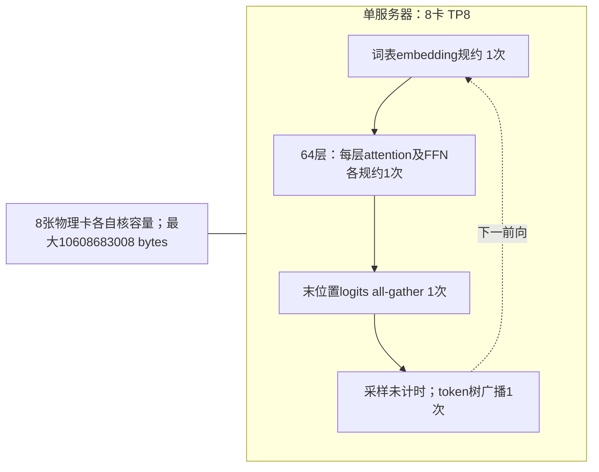
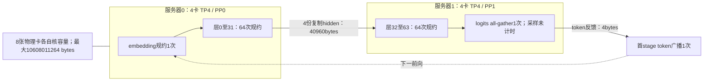

# 图1-6草案：相同8卡与请求，不同组织

两图均是当代Qwen3-32B教学配置。每卡24×10⁹bytes、显式workspace2GiB，BF16权重/KV；每次只处理batch1的一个新token，重复32次。节点标通信事件数，不能当作时间比例图。

跨服务器hidden与token反馈串行使用一个声明共享出口，每前向2次启动、40964bytes。内部collective按独立有向环边预算；两个服务器仍处于同一条单微批依赖链。对应默认完整预算与逐层消息见ub-scope-qwen32-default.md。正式制图需遵循全书图形流程，本图稿尚非已验收图片。
