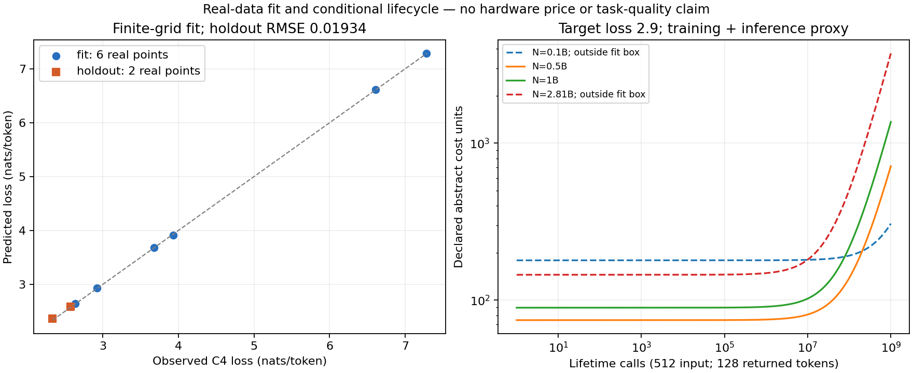

# 真实C4拟合的条件生命周期连接

原8点主拟合与四项坐标/网格敏感性分别复用既有scaling_law.lifecycle，不按留出误差选择成本更低的law。固定目标loss2.9、输入512/返回128（额外decode127）、相同抽象cost-unit/FLOP；不是价格、吞吐或任务质量实测。

| N | 目标D | 训练代理FLOPs | 超出拟合框 |
|---:|---:|---:|---|
|1e+08|2.98579e+11|1.79147e+20|True|
|5e+08|2.48196e+10|7.44588e+19|False|
|1e+09|1.48956e+10|8.93739e+19|False|
|2.81e+09|8.59527e+09|1.44916e+20|True|

0.1B与0.5B在本代理条件下约2.0479亿次调用交叉，但0.1B所需D约298.6B，已超过拟合D上界约3.28倍；不能把这条交叉直接写成部署建议。每条非负交叉已代回两条成本直线核对，误差阈值1e-12。原始图同时展示真实fit/holdout点与条件费用曲线，PNG/SVG已检查。

候选尚未接公共CLI/正文；数据绑定、输入、逐敏感性结果与图脚本均在此目录。保留原实验真实泛化/质量与完整硬件成本边界。
