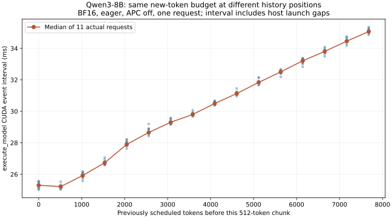

# 8-2：相同块长、不同历史位置的实际执行

固定 Qwen3-8B，在 RTX PRO 6000 上执行 11 次单请求 8192-token prefill。每次确实形成16个512-token块，首块与末块 `execute_model` CUDA event区间的中位数分别为 **25.301／35.070 ms**；按每次请求配对的末块／首块比值中位数为 **1.388**。相同新token预算并不对应相同执行时间。

## 输入与执行

执行前方案保存在 PROTOCOL.md。输入是完整保存在 inputs.json 的8192个有效合成Qwen token，来自先前统一APC实验的长输入；来源哈希见 input-provenance。此次实际执行未复用旧计时结果。目标模型revision为 `b968826d9c46dd6066d109eabc6255188de91218`，BF16、eager、APC关闭、单活跃请求、512调度token预算，完整配置及实装vLLM/Torch/Triton版本随原始结果保存。

引擎先热身一次，然后11次正式完整请求，每次强制生成1token。worker包装已安装引擎的 model_runner.execute_model，在调用前后记录CUDA event与主机调用时间。每次试验重置逐请求累计，在每次实际调度后增加实际新token数；一个试验内验证相同内部请求ID、0至7680的历史位置和16个512块。vLLM会在客户端ID后追加内部后缀，分析按实际ID追踪，不假定两者字符串完全相同。初版离线断言因此失败，修正ID关联后复核原始记录，没有重复GPU执行或更改记录。

CUDA event在全部请求结束后统一同步读取，不在每块后强制同步。每次还有1次空execute调用，合计11次，单列并排除。11次正式输出token全部相同，缓存命中均为0或未报告值，APC配置明确关闭。

## 观察与边界



全部176个样本与逐位置最小／中位／最大值在 results/summary.json，worker原始记录在 results/run-v1/raw.json。历史0、4096、7680位置的区间中位数分别约25.301、30.496、35.070毫秒。

计时涵盖完整模型execute_model路径，可能包含主机提交间隙；其外的采样／logits处理不计入。不能将其称为纯attention kernel时间，也不能推断DRAM访问比。历史位置还与输入内容、末块处理、执行顺序同时变化，本试验确认实际逐块时间差异，不独立识别每项原因。11次为同引擎重复，不是跨进程独立硬件复测；原有GPU服务保留，不宣称独占。

此次只补足8-2的同块不同历史要求。混合请求等待／ITL已有父目录记录；主机提交trace、图缓冲以及结构化／视觉等变体仍需各自证据，不能用本图替代。calculations中的注意力配对数和教学调度未重算或修改。

## 独立复现

完整输入、配置、worker、原始结果和分析均在本目录。离线分析不需GPU：

```sh
python analyze.py
python plot.py
```

画图需Matplotlib。实际重跑需相同模型缓存和记录中的vLLM环境，在本目录运行：

```sh
/home/ubuntu/vllm023-venv/bin/python run.py --output results/run-v2
```

程序拒绝覆盖旧输出。分析新版本时在目录副本中改分析输入路径，保留现有run-v1和manifest作对照。运行结束已确认引擎退出，无需停止其他服务。
