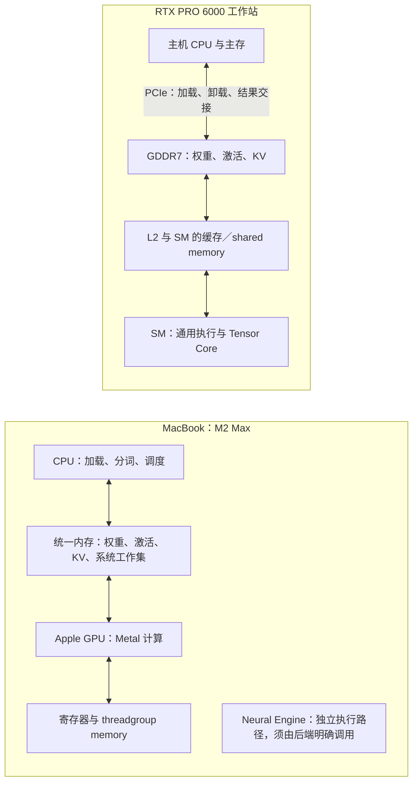

# MacBook 与 RTX PRO 6000：从存储组织到本地推理

核对日期：2026-09-06。本文是第 4、5、8、12 章的贯穿案例设计。设备配置已确认；性能数字尚待按本文件的条件实测。公式算例为本书推导，不能标为设备测试结果。

## 设备与问题

作者确认使用当前 MacBook Pro：**M2 Max、12 核 CPU、38 核 GPU、96 GB 统一内存**。另一实验平台为 **RTX PRO 6000 Blackwell Workstation Edition，600 W**。早先口述的 M2 Pro 保留为同代规格参照，不用它标注当前机器的实验。RTX 机器的主机 CPU、内存、操作系统和驱动在正式测量前登记。

| 项目 | M2 Pro（规格参照） | M2 Max（当前实机） | RTX PRO 6000（选定实验卡） |
| --- | --- | --- | --- |
| 器件与平台 | Apple SoC | MacBook Pro 中的 Apple SoC | Blackwell GB202 独立 GPU，Workstation Edition |
| GPU 配置 | 最高 19 核 | 38 核 | 188 SM、第五代 Tensor Core |
| 内存 | 最高 32 GB 统一内存 | 96 GB 统一内存 | 96 GB GDDR7，支持 ECC |
| 标称带宽 | 200 GB/s | 400 GB/s | 1,792 GB/s |
| CPU／GPU 之间 | 共享系统内存 | 共享系统内存 | 主机内存与显存分开，卡接口为 PCIe 5.0 ×16 |
| 功率计量 | 以实测整机边界登记 | 以实测整机边界登记 | 600 W 是板卡功率规格；整机能耗另测 |
| 主要软件路径 | Metal GPU；是否使用 ANE 另核 | Ollama 的实际 runner／Metal 后端；MLX 作同机对照 | CUDA 后端；按实际模型核对量化与 Tensor Core 路径 |

Apple 的“GPU 核”、NVIDIA 的 SM 和 CUDA Core 计数不处于相同粒度，不能用核数直接计算性能比。[Apple 发布资料](../references/files/specs/apple-m2-pro-max.html)给出容量与带宽；RTX 参数见[产品数据表](../references/files/specs/nvidia-rtx-pro6000-spec.pdf)和[架构白皮书表 1](../references/files/specs/nvidia-rtx-blackwell-pro.pdf)。M2 Max 的配置来自本机只读检测及作者确认，不登记序列号或设备唯一标识。

## 第 4 章：沿同一计算追踪数据

先由第 2 章给出矩阵乘和注意力的数学依赖，再由第 3 章给出 prefill、单请求 decode 和批量 decode 的形状；本章分别画出以下路径。

图是计算与存储的功能示意，不代表片上物理布局或完整缓存一致性协议。CPU 和 GPU 共享物理内存，可以省去部分重复缓冲与显式跨设备拷贝，但 GPU 仍要从内存读取权重与 KV，写回输出。CPU、GPU、操作系统还会竞争容量和带宽。统一内存解决了一部分数据交接问题，不会消除内存访问成本。

Apple GPU 也有执行分组、片上存储与同步责任。Metal 的 `shared`、`private` 等资源模式决定访问范围；`private` 并不表示芯片旁另有一套独立显存。即使缓冲可以直接共享，应用仍须遵守 CPU／GPU 访问时序。依据为 [Metal 资源模式文档的官方数据原件](../references/files/documents/apple-metal-memory.json)。[WWDC20 架构说明](../references/files/documents/apple-gpu-architecture.html)中的 tile rendering 用来解释图形侧设计背景，不将图形 tile memory 的收益直接写成 LLM 收益。

NVIDIA 侧从 GDDR7、L2、SM 内存储到 Tensor Core 追踪供数。缓存由硬件承担部分管理，优化后的 CUDA 算子仍可能显式使用 shared memory、异步搬运和同步。Apple Metal 和 CUDA 都需要布局、分块和依赖管理；比较的是责任落在程序、编译器还是硬件，以及为达到相近效率需要多少调优。

矩阵计算要区分三个对象：Apple GPU 经 Metal 暴露的 SIMD-group 矩阵操作、独立的 Apple Neural Engine，以及 NVIDIA Tensor Core。当前 GPU 推理不能把 Neural Engine 的 TOPS 加进 GPU 峰值。RTX Blackwell 的 FP4／FP6／FP8 等能力还要核对对应内核；GGUF 的某种 4-bit 权重量化不等于直接执行 Tensor Core 原生 FP4 指令。

RTX PRO 6000 的 compute capability 为 12.0，见 [Ollama 硬件支持表](../references/files/documents/ollama-hardware.html)。其 GB202／GDDR7 配置与 B200 的数据中心 Blackwell 分别取证；不能把 B200 的 HBM、NVLink 或特定矩阵指令／存储机制全部移用到这张工作站卡。

## 用性能模型解释差异

“Mac 推理性能较低”要展开为可检验的问题。

| 负载 | 首先检查的约束 | 如何解释实测 |
| --- | --- | --- |
| 长输入 prefill | 大矩阵的有效吞吐、注意力实现、精度和分块 | 比较实际算子时间与达到的吞吐，不能拿 ANE TOPS 对比 RTX 的稀疏低精度峰值 |
| 短上下文、batch=1 decode | 大权重的重复读取、量化解码、小算子与提交 | 若权重读取占主要部分，带宽差异有解释力；小模型可能受启动或计算约束 |
| 长上下文 decode | KV 字节、注意力读写、缓存与并发容量 | 记录 GQA／MLA 等模型结构，不能只用权重大小推算 |
| 多请求 decode | 批量带来的权重复用、KV 容量、调度与排队 | 批量变大后计算占比可能上升；单请求速度和总吞吐分别报告 |
| 接近内存上限 | 系统工作集、GPU 工作集建议值、交换与回退 | 96 GB 共享内存和 96 GB 独立显存的可用模型容量并不相等 |
| 持续运行 | 温度、频率、功率模式和后台任务 | 短时峰值、持续性能及每任务能耗分别记录 |

条件式算例：假设一次单请求 decode 恰好从芯片外内存读取 **4 GiB** 数据，全部来自权重，忽略 KV、激活、量化转换、计算和提交，也无跨步缓存命中。用十进制 GB/s 带宽计算这一项的理想服务时间：

| 设备 | 算式 | 理想服务时间 |
| --- | --- | --- |
| M2 Pro | 4 × 2³⁰ ÷ (200 × 10⁹) | 21.47 ms |
| M2 Max | 4 × 2³⁰ ÷ (400 × 10⁹) | 10.74 ms |
| RTX PRO 6000 | 4 × 2³⁰ ÷ (1,792 × 10⁹) | 2.40 ms |

RTX／M2 Max 的标称带宽比为 **4.48**；RTX／M2 Pro 为 **8.96**。这两个比值只是上述流量模型的输入，不是实测 token/s 加速比。大模型在 Mac 上能够驻留、是否比发生卸载的另一系统更快，以及每瓦能完成多少任务，都是另外需要测量的问题。

## 第 5 章：Ollama 的适配具体发生在哪一层

Ollama 承担模型管理、请求服务、加载和运行实例调度；实际张量计算依赖选中的 runner 和计算后端。当前本机客户端版本为 **0.20.7**，源码参考固定在提交 `8d0dcf4b6daf8d7833c8b55108e5b45063795e57`。下面的源码证据对应其随附的 **ggml Metal 路径**，正式实验仍须记录日志证明目标模型确实选择了这条路径。

| 适配工作 | 具体依据与机制 | 要测量的影响 |
| --- | --- | --- |
| 发现设备与内存预算 | [设备发现代码](../references/files/documents/ollama-metal-device.txt)读取 Metal `recommendedMaxWorkingSetSize` 与系统内存 | 可装载的权重、KV 和工作缓冲；建议工作集不是固定的物理容量比例 |
| 利用共享缓冲 | [ggml Metal 设备代码](../references/files/documents/ollama-ggml-metal-memory.txt)识别统一内存，并有 `newBufferWithBytesNoCopy`、shared storage 的缓冲路径 | 哪些拷贝被省掉，哪些转换／写入仍发生；加载与稳态分别计时 |
| 执行量化矩阵运算 | [Metal 内核](../references/files/documents/ollama-ggml-metal-kernels.txt)包含量化块解码、矩阵—向量及矩阵—矩阵实现，使用线程组／SIMD-group 协作 | 减少权重流量的收益，与解量化、布局和形状效率的成本 |
| 组织命令与同步 | 根据实际 runner 追踪计算图、Metal 命令提交、CPU 等待及缓冲寿命 | 小算子提交、批次变化和同步是否成为瓶颈；不把 Metal 命令缓冲称作 CUDA Graph |
| 决定驻留与回退 | 核对 GPU 层数、模型与 KV 驻留位置和 CPU 回退；未支持的路径按日志解释 | 能运行和充分利用 GPU 是不同结果；统一内存不能替代算子支持 |

当前 [Ollama 开发文档](../references/files/documents/ollama.html)还出现 MLX 相关路径，因此不把所有版本、模型的 Ollama 都概括为同一个 llama.cpp runner。Ollama、llama.cpp、ggml、MLX、Metal 和 Core ML 分别说明所在层次；不能把底层项目实现的所有内核都归为 Ollama 独立开发，也不能由“Apple Silicon 加速”推断使用了 Neural Engine。

## 第 8 章：配对实验与记录

第一组先在两平台使用同一个稠密模型、同一 GGUF 文件校验值、相同量化和请求集，比较软件与硬件的组合。Qwen3-4B 可作起点；本机已有该模型缓存，正式运行前固定模型摘要与参数。不能仅凭相同模型名称认定权重和模板相同。

| 实验 | 控制条件与扫描项 | 输出 |
| --- | --- | --- |
| 阶段差异 | 单请求；实际分词后约 512／2,048／8,192 输入 token；固定输出上限，记录实际输出数 | prefill、decode 分阶段速率，客户端 TTFT、逐 token 间隔、完整延迟 |
| 批量与容量 | 同请求集；并发 1／4／8；记录运行时实际批次，超容量配置记为不可行 | 吞吐—延迟曲线、KV／工作缓冲占用、CPU 回退 |
| 量化与质量 | 固定原始权重、校准资料和质量集，比较选定的低比特与较高精度版本 | 质量差异、文件与运行字节、阶段时间；不预设 4-bit 必然更快 |
| 本机后端 | M2 Max 上比较 Ollama 所选 Metal 路径与 MLX-LM | 各自权重转换、量化、模板和缓存策略；不满足同条件时，标为软件方案比较 |
| 持续执行 | 外接电源，固定系统功率模式和后台负载；冷加载、预热及持续段分开 | 持续性能、温度／频率、系统内存压力；功率可采集时再算能耗 |

Ollama [Generate API](../references/files/documents/ollama-api-generate.md)返回 `prompt_eval_count`、`prompt_eval_duration`、`eval_count`、`eval_duration` 等字段，duration 单位为纳秒。阶段速率分别按 token 数除以相应时间计算。API 内部计时不能直接当作客户端 TTFT：还须用流式响应记录发出请求、收到首个生成 token 和后续 token 的时刻，并说明 thinking token 是否计入。

预热和重复测量不得无意复用同一 prompt 的 KV，从而把缓存命中当作 prefill 加速。分开测全新前缀与明确比例的共享前缀；记录实际参与 prompt evaluation 的 token 数。每组至少进行 3 次独立重复并保留原始记录；中位数与范围适合起步实验，尾延迟结论需要足够请求样本。模型、KV、图缓冲及页缓存的“热”状态分别登记。

正式结果同时保存设备与系统版本、后端和构建版本、模型校验值、参数、公开输入、原始响应统计、日志及测量边界。CUDA／Metal 都以完成时刻计时；MLX 的惰性执行需显式完成求值和同步。600 W 板卡规格不能直接当作实际平均功率，也不能与 Mac 的整机功率相除作为能效。

第 12 章将本地阶段时间与远程调用的网络、排队和隐私／离线需求共同分析；第 13 章再用质量、容量、时延、吞吐与整机能耗选择方案。当前仅完成配置核对、架构解释和实验设计，尚未形成任何两机性能排名。
