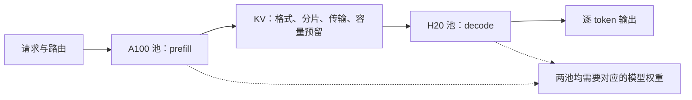
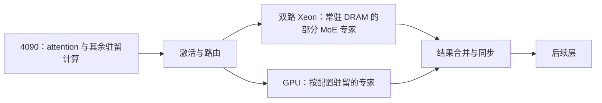

# 异构推理的两种切分：A100／H20 与 KTransformers

核对日期：2026-09-06。第 9 章分别用 **A100 做 prefill、H20 做 decode** 和 **RTX 4090＋双路 Xeon Gold 6454S 的 KTransformers** 讲解 PD 与 AF 分离。第 4 章先建立设备供给，第 5 章解释具体内核和异步执行，第 8 章给出同实例基线。

## 首先明确切分的对象

| 比较项 | PD：prefill／decode | AF：attention／FFN |
| --- | --- | --- |
| 切分位置 | 一次请求的两个执行阶段 | 模型层内的两类计算 |
| 两侧的工作 | 都执行模型的 attention 和 FFN，输入形状不同 | 依据具体放置分别执行 attention、FFN 或 MoE 专家 |
| 主要交接数据 | prefill 产生的 KV 及其元数据；后续另计迁移或缓存复用 | 每层的激活、路由与专家结果；按实现决定是否合并或复用 |
| 交接频率 | 基本方案每个请求一次阶段交接，可按层／块流水传输 | 每一步、每个相关层反复交接 |
| 容易新增的瓶颈 | KV 带宽、队列失衡、接收端容量和格式转换 | 细粒度启动、同步、专家尾部及跨设备依赖 |
| 案例范围 | A100／H20 两类资源池 | 4090／双路 Xeon 同机异构是起点，另行分析跨机 AF 池化 |

prefill 和 decode 都属于推理。A100 的角色不能只写成“计算”，H20 的角色也不能写成涵盖整个推理的“推理卡”。PD 与 AF 可以组合，组合后仍须逐一核算两类边界的状态和流量。

## 第 9.2 节：A100 prefill＋H20 decode



教学规格参照先选 **A100 80 GB SXM**；40 GB、80 GB PCIe 的内存与互联不同，不混在一个配置里。[A100 产品数据表](../references/files/specs/nvidia-a100-80-spec.pdf)提供规格依据。[NVIDIA AI Enterprise 6.2](../references/files/specs/nvidia-h20-vgpu.html)确认 H20 SXM5 96 GB 型号，但并不提供完整的 H20 算力与带宽表。H20 的精确资源上限需取得对应产品原件或实机信息后再填，不从 H100 规格或二手对比图推导一个确定值。

案例的待验证假设是：在所选精度和请求分布下，A100 适合承担计算较密集的 prefill，H20 的存储供给适合承担受权重／KV 访问约束的 decode。先分别测两种卡的 prefill 和 decode，确认有效性能的互补，再讨论分离。长上下文注意力、大批量 decode、不同量化内核都可能改变这个匹配；并非所有 prefill 都只受算力限制，也并非所有 decode 都只受带宽限制。

### 先复算 KV 交接，再求收益条件

对所有层均采用相同 GQA 配置的教学模型，设层数为 `L`、输入长度为 `S`、KV 头数为 `Hkv`、每头维度为 `d`、每元素字节为 `b`。不计对齐、量化元数据和已有缓存命中时：

```
KV 字节 = 2 × L × S × Hkv × d × b
```

取 `L=32、S=8,192、Hkv=8、d=128、b=2`，得到 **1 GiB**。若跨池路径的实测有效单向带宽为 **25 GB/s**，仅传输这一有效载荷就需要 **42.95 ms**；还需核算启动、布局／分片转换、排队和接收端准备。这是人为给定条件的算例，不是 A100／H20 集群实测。MLA、滑动窗口与混合注意力须从实际状态布局重新推导，不能直接套此式。

以相同首 token 产生／交付约定比较，无流水的简化关键路径为：

```
T分离 = QP + TP,A100 + TKv交接 + QD + TD,H20
T共置 = Q共置 + T共置执行
```

这里 `TD,H20` 是所计输出段的总 decode 时间，随上下文和批次变化，不能无条件用固定 TPOT 乘输出长度。若逐层传输与计算重叠，应从依赖图计算暴露在关键路径上的部分，而不是把全部传输时间再加一次。首 token 可以由 prefill 侧产生，因此 TTFT、第一次后续 token 间隔和完整请求时延需要分别记录。

零排队、同卡数与相同测量口径下，阶段执行节省必须超过暴露的 KV 交接及额外调度成本，完整请求才会更快。在线服务还可能主要获得干扰隔离和吞吐收益，单个请求延迟不一定下降。

### 资源池的配比与实验

把每个 prefill／decode 实例在给定长度分布和 SLO 下的处理能力都换算为 requests/s，记为 `μP`、`μD`；每个请求平均需跨池传输 `E[Vkv]` 字节。在一条共享瓶颈路径的简化模型下：

```
λ < min(nP × μP, nD × μD, B链路有效 / E[Vkv])
```

这是稳定性的必要容量约束，不是尾延迟保证。若每实例含多张卡，`nP／nD` 计实例，费用和容量另按实际卡数核算。不能直接拿“prefill tokens/s”和“decode tokens/s”相除决定卡数；两侧处理的 token 数和驻留时间不同。

实验至少包含四种部署：相同资源预算下的共置、同构 PD、A100→H20 异构 PD，以及反向分配的对照。在短入短出、长入短出、短入长出和长入长出上扫描到达率、P:D 配比、前缀命中率和有效网络带宽。报告 TTFT、逐 token 间隔、完整延迟、SLO 内吞吐、两池利用率和 KV 瞬时占用；卡数预算与费用预算分开比较。

A100 和 H20 上的模型／adapter 身份、token 位置、KV 数据类型、量化 scale、布局、分页及 TP 分片必须一致或有经验证的转换路径。不能因为两侧都使用 CUDA 就假定 KV 可直接消费，也不能因为都属于 NVIDIA 就假定跨代设备能直接 NVLink 互联。跨主机按 NIC、PCIe、RDMA 或 host staging 的真实路径测量；两边可能同时保留源和目的 KV，取消与失败时还要明确释放责任。

机制材料采用 [DistServe](../references/files/papers/distserve.pdf)、[Splitwise](../references/files/papers/splitwise.pdf)、[Mooncake](../references/files/papers/mooncake.pdf)；异构交接的表示与所有权问题参考[固定 v1 研究](../references/files/papers/heterogeneous-pd.pdf)。该研究的生产例是 C600＋Hopper，不把它标作 A100＋H20 的测量。另用 [Bullet](../references/files/papers/bullet.pdf)中 A100／H20 的微基准及同卡协作，检验“必须分离才高效”的假设；其图 8a 是 memory-copy 微基准，不是异构 PD 吞吐。

## 第 9.3 节：4090＋双路 Xeon，以 KTransformers 展开 AF

KTransformers 适合作为 MoE 异构执行的具体起点。先在图上标明 attention、路由、共享专家、routed experts、其他 dense 层以及 KV 分别放在哪里，再讨论 AF。不能将它概括为“所有 attention 在 GPU、所有 FFN 永远在 CPU”：版本和配置可以让热点专家留在 GPU，也可在 prefill／decode 选择不同执行方式。



此图表示一种专家放置方式。CPU 上就地计算专家，只在边界传递激活与结果，可减少把大权重反复送过 PCIe 的需求；交换条件是消耗 CPU 运算和 DRAM 带宽，并可能使 GPU 等待。把 CPU 当成被动权重仓库、每次加载专家到 GPU，则是另一种方案，必须单列。

### 重点解释四个实现选择

1. **算术强度与 CPU 内核。** 每位专家接收较多 token 时可以复用权重；单 token decode 的矩阵—向量计算有不同的收益条件。历史 [v0.3 设计说明](../references/files/documents/kt-amx.md)对照 Intel AMX 与 AVX-512，讨论 tile 形状、预排布、解量化和线程任务；不把某个调度阈值当作跨版本常量。
2. **内存通道与 NUMA。** 核数增加不保证带宽同比增加。用专家权重的归属、线程绑核、socket 内／跨 socket 流量解释性能，保留 DIMM 数、频率和实际带宽；不能用 Mac 的统一内存代替服务器 NUMA 模型。
3. **异步提交与同步。** 用 CPU／GPU 时间线说明队列、事件、图执行和等待，检查减少 host 调度后剩余的跨设备依赖。任何 expert deferral 等改变计算时序或近似行为的选项都单独记录，并检查质量。
4. **专家放置与阶段变化。** 固定 GPU 专家比例、热点分布、prefill 长度及并发，测 CPU 尾部、GPU 空闲和传输；高复用的 prefill 与低并发 decode 不必使用同一放置。

对一个简化的 CPU 专家分支，若共有 `L` 个相关层、`S` 个处理 token、激活宽度 `h`、元素字宽 `b`，并且每层只把完整激活发往 CPU 一次、CPU 合并专家结果后返回一次，则有效载荷为：

```
V激活 = 2 × L × S × h × b
```

取 `L=32、S=1、h=4,096、b=2`，每个 decode 步为 **0.5 MiB**，但简单逐层实现含 **64 次有方向的数据交接**。字节少不意味着开销可忽略；若每次串行交接的启动与同步合计 `α`，仅此项约为 `64α`。多专家目的端、token 重排、独立结果回传、权重迁移会改变这项字节数和交接次数，正式推导需按真实实现展开。

在单层中，只有 CPU／GPU 分支确实能并行启动时，才可用 `max(TCPU分支, TGPU分支)` 给出分支部分的理想下界；attention→专家→下一层的串行依赖仍然存在。跨机 AF 再加入网络启动、批次聚合、路由倾斜及故障，不能把本地 PCIe 案例的时间直接外推。

### Xeon 配置与证据范围

AF 主案例采用公开文档中的 **RTX 4090 24 GB＋双路 Intel Xeon Gold 6454S**。以固定提交 `31985f40bcc40da08107efdb1f81bf88cb38c6b2` 的 KT-Kernel 文档为实现参照，重点讲解 Intel AMX／AVX-512、内存通道、NUMA 和 CPU／GPU 异步协作。

| 证据 | 对应配置与用途 | 引用边界 |
| --- | --- | --- |
| [KT-Kernel README](../references/files/documents/kt-kernel-guide.md) | RTX 4090 24 GB＋双 Xeon Gold 6454S；合计 64 个物理核、128 个逻辑线程，示例记录 2 个 NUMA 节点 | 作为主案例的公开配置与启动参照；实际内存容量、DIMM 布置、频率、NUMA 设置及软件版本仍须登记 |
| [v0.3 AMX 设计说明](../references/files/documents/kt-amx.md) | 解释 AMX 与 AVX-512 的任务选择、权重重排、缓存分块和动态调度 | 历史内核机制与当前提交分别核对，性能数字保留原模型、精度和硬件条件 |
| [SOSP 2025 论文 §6.1](../references/files/papers/ktransformers-paper.pdf) | 双 Xeon Platinum 8452Y，GPU 为 A100 40 GB 或 RTX 4080 16 GB | 用于解释机制和研究结果；该论文的测量不能直接标为 4090＋6454S 的性能 |

实际复现先固定内存通道与 DIMM 配置、线程绑核、专家权重的 NUMA 归属、驱动和 KTransformers 提交，再验证算子正确性、完整模型质量及服务时间线。物理核、逻辑线程、socket 和 NUMA 节点分别记录；同时比较 AMX 与适用的 AVX-512 路径，解释不同算术强度下的收益。

## 实验交付

PD 交付资源池图、KV 字节复算、真实网络路径、四类负载下的配比与收益边界；AF 交付模型算子放置图、每层激活与专家权重的流量、NUMA 配置、CPU／GPU 时间线及质量结果。所有对照保留同一模型版本、精度与可比服务目标。

当前完成机制取证与条件式算例，尚无本书的 A100／H20 集群测量，也没有本书的 4090＋双路 Xeon Gold 6454S 完整运行记录。公开论文、项目演示和本书实验分别标注，后续只用原始记录填入实测数字。
