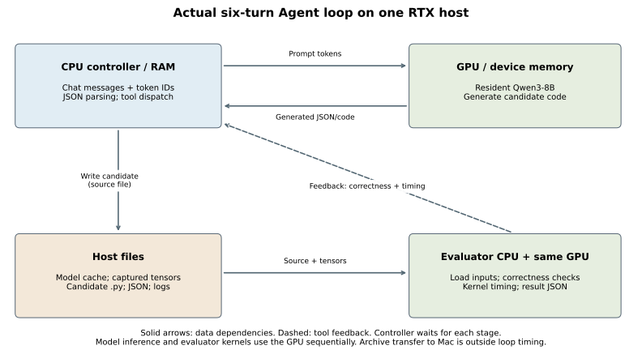
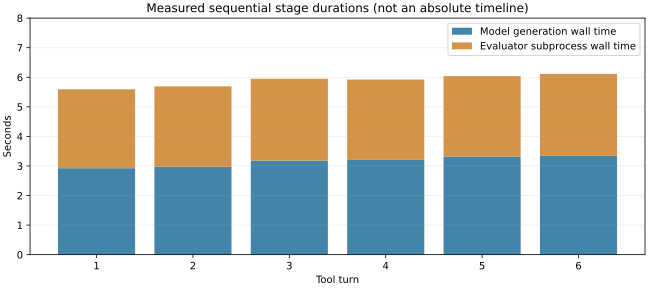

# 1-1 一次真实Agent任务的计算、数据与等待

本实验分析5-6已经实跑的Qwen3-8B六轮工具调用记录，不重复启动模型。模型通过提示接收“提交候选算子”的要求，输出JSON代码；CPU控制程序解析代码，写入文件，并通过OS子进程调用GPU验证器，再把反馈交给下一轮模型。六次验证通过，但代码AST始终与起始实现相同，任务没有发现新优化。



## 实际资源定位

| 物理层次 | 本轨迹中的位置与证据 |
|---|---|
| 集群／超节点 | 核心循环只使用一台RTX主机，没有多节点、跨超节点或GPU—GPU交换记录，不虚构这些链路。 |
| 主机 | Python控制器、文件系统和验证子进程在RTX主机；本地Mac只接收归档并离线分析，不在循环计时内。 |
| 加速卡／显存 | 同一RTX GPU先生成代码，再执行验证内核。Qwen权重/KV在模型worker显存驻留，验证器有独立设备张量和输出。 |
| 芯片内部 | Triton候选与原生核在GPU执行。记录没有逐次寄存器、片上缓存或显存流量计数，不能由张量大小推断真实DRAM字节。 |

图中GPU推理和验证器使用同一张卡，不是两张GPU。箭头表示数据依赖，不是实测链路带宽；设备传输、文件I/O和进程通信的逐项字节/延迟未采集。分析结果将实际记录与源码说明分开标明。

## 软件全栈与接口边界

| 教学层 | 本任务的实际活动 |
|---|---|
| 应用与任务 | 提示要求优化固定SwiGLU；成功标准包括候选变化、正确性和性能，而非仅生成可解析JSON。 |
| 模型与负载 | Qwen3-8B处理逐轮增长的messages/token IDs，返回完整候选代码；全部输入输出token IDs可查。 |
| 推理与训练系统 | vLLM引擎执行生成请求；本任务没有训练。 |
| 算子与运行时 | PyTorch/Triton验证候选、原生参考及CUDA Graph计时，固定容差，候选不能改验证条件。 |
| 处理器与存储 | CPU构造上下文/解析JSON/启动工具；GPU运行模型和内核；主机文件保存候选、输入和结果。 |
| 互联与数据中心 | 实际设备张量搬移与控制器/worker通信发生在同一主机；没有观测到数据中心网络参与核心循环。 |

通过模型接口表达的是目标、约束、候选请求和反馈。创建文件、装载Torch、创建进程、执行GPU程序与保存日志仍由通用OS环境完成。模型输出的代码本身不会自动执行；控制器先验证接口，再发起工具。`agent_guard.py`只是接口限制，不是可靠安全沙箱。

## 等待与实测时间



六轮模型生成墙钟合计18.935625秒，工具子进程墙钟16.372630秒；整个循环35.417244秒，剩余0.108989秒是其他控制/记录活动。引擎准备7.819425秒单列。每轮模型生成结束后才启动工具，工具结束并反馈后才构造下一轮请求；这两个依赖是实际顺序，不能假设可直接重叠。

验证器CUDA event窗口合计4.310061秒，是工具墙钟内部的嵌套观察，不能再加到16.372630秒上。该event窗口还可能覆盖编译/主机等待，并非GPU忙碌时间；不能据此计算GPU利用率。子进程外层墙钟与event窗口的差也不是纯CPU计算或纯I/O。

`results/analysis.json`保存每轮prompt/output token数、候选UTF-8源码字节、阶段时长、资源/边界映射及证据。源码字节只代表文件内容大小，不是实际磁盘/网络传输量；token IDs数量也不直接代表传输字节。原始generation事件保留，但阶段图只展示时长，不伪造未记录的绝对子进程时间戳。

## 独立复现与核对

```sh
python3 analyze.py
python3 plot.py
```

分析只需Python标准库；绘图需Matplotlib。`evidence/`自带6轮完整消息、生成事件、工具结果、运行配置、源码和日志，`provenance.json`逐文件固定原5-6来源与SHA256。运行不依赖相邻实验目录、GPU或计算项目。`analyze.py`核对会话连续性、前一轮输出/反馈确实进入下一轮、候选哈希和AST、成功工具结果及成本合计。`manifest.json`封存原始证据、分析、图和脚本。

本项正文及扩写所要求的轨迹资源、软件栈、模型/OS边界和等待分析已交付，标记measurement_complete；并不表示Agent优化成功，也不代替全书图1-1的完整集群/芯片通用架构图。全书最后与其他session增补的统一复核尚未进行。
