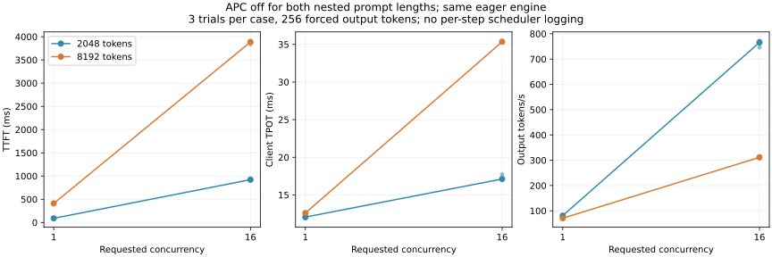

# 1-4 统一关闭APC的实际补测

这是README中“最小补测”的执行结果；此前已封存的README和原始分析保留原样。此次确实运行两组嵌套输入：短输入严格等于对应8192-token长输入的前2048token，两组APC均关闭。固定原Qwen3-8B/vLLM0.23/eager、BF16、24GiB KV预算、4096调度token上限；只关闭逐步日志观察，不更换后端或安装软件。

## 无逐步观测的正式请求

两种长度×并发1/16，每组1次预热、3轮正式批次，轮内随机配置顺序；每请求强制256输出。共136请求，其中102正式。所有输入哈希、长度、零/空缓存计数、输出长度、递增事件和JSONL完整性通过核对；同输入跨本轮并发/重复没有输出token差异。这不是自然结束任务或任务质量评估。

| 输入长度／请求并发 | TTFT中位数 ms | 客户端TPOT中位数 ms | 含prefill输出token/s |
|---|---:|---:|---:|
| 2048／1 | 89.953 | 12.055 | 80.880 |
| 2048／16 | 922.375 | 17.116 | 765.835 |
| 8192／1 | 410.892 | 12.593 | 70.670 |
| 8192／16 | 3885.533 | 35.345 | 311.407 |



客户端TPOT仍为首末交付间隔/255。增加并发后长历史的代价明显增加，不支持权重项近似不变就推断decode时长不变。更长prefill也明显影响完整请求吞吐；不能只看token吞吐忽略TTFT。三轮不是跨独立运行的稳定SLO统计。

短输入前2048token在部分请求间相同，但APC关闭，因此没有跨请求前缀复用。请求通过asyncio同时提交并发上限，不声明每一步都恰好满批；正式路径没有采每步占用/抢占。与旧8-1数据相比，还改变了输入构造、APC和日志观察，所以不能把跨轮差值全部算成“去掉观测的收益”。

## 单独执行GPU步骤审计

正式引擎退出后，另启动同配置引擎，对4组分别预热2输出token，再审计256输出token。worker仅在这轮包裹execute_model：前后记录CUDA event与host时间，不逐步同步，末尾统一取结果；另保存实际调度的每请求token数。此轮输出也逐请求匹配正式trial0。

| 长度／并发 | 全部模型调用 | 满批每请求1token调用 | 该组event中位数 ms | 其他非空调用／空调用 |
|---|---:|---:|---:|---:|
| 2048／1 | 257 | 255 | 10.735 | 1／1 |
| 2048／16 | 265 | 247 | 13.983 | 17／1 |
| 8192／1 | 258 | 255 | 11.474 | 2／1 |
| 8192／16 | 289 | 224 | 23.323 | 64／1 |

满批decode是从真实调度字典筛选“活跃请求数等于batch且每请求恰好1token”，不是从请求参数猜测。长输入/并发16存在更多chunked prefill、混合及非满批工作，不能将所有输出步骤看成224个满批decode的重复。

这些event包围execute_model，含主机提交造成的设备空隙，且不包含方法外的logits/采样等阶段。客户端TPOT包含不同阶段、来自另一次运行，因此**不能将35.345减23.323并命名为CPU开销**。当前数据足以指出“稳定满批decode时长≠请求TPOT”的遗漏；细分GPU DRAM、CPU和等待的因果占比仍未知。

## 修正后的选择

在已测RTX配置中，低交付延迟偏向低并发，追求吞吐需接受TTFT/TPOT增加；长输入不能照搬短输入的batch选择。不根据这台设备的记录排名Mac/H100，也不把教学窗口参数用作本卡精确时间。题目主路径中的同模型实测、遗漏项、长度/并发变化和补测已覆盖；独立设备比较未有证据，可选attention计数器曲线仍待，本项总体保持partial并明确范围。

## 独立运行与验证

```sh
/home/ubuntu/vllm023-venv/bin/python run_followup.py --output results/new-apc-off
/home/ubuntu/vllm023-venv/bin/python run_steps.py --output results/new-step-audit
python3 analyze_followup.py
python3 analyze_steps.py
python3 plot_followup.py
```

使用目录自带followup-inputs/config和已有固定模型缓存。两个运行应串行，输出目录必须不存在；分析默认读取交付的apc-off-v1/step-audit-v1。新脚本/配置/全部原始事件/调度元数据/输出/日志和图由followup-manifest封存，旧manifest保持有效。两引擎正常退出，未清理其他服务，calculations未执行或改动。
