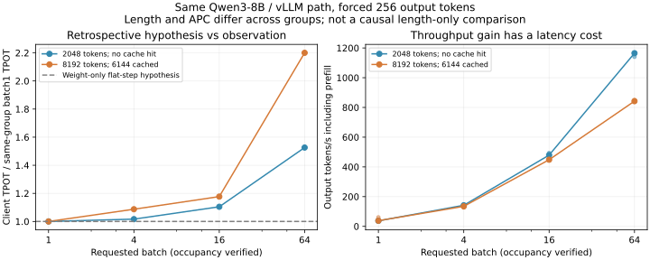

# 1-4 估算、观察与条件变化（部分交付）

本批使用已经完成的8-1 Qwen3-8B/vLLM真实请求记录，检验“只读一遍权重即可预测批量解码”的简化判断。另一个任务的两份Qwen逻辑前向账和KV访存窗口算例仅只读复制；未重新实现或运行计算。模型revision、BF16、输入/输出、引擎源码和实际批量占用均核对。

## 预测与适用条件

已有计算在history8192、batch1/64时，权重每算子读一次的逻辑字节分别15,136,819,200和15,137,335,296，接近不变；对应KV attention唯一载荷从1,208,107,008增至77,318,848,512字节。因此，仅保留权重项的简化模型会预期整批decode步耗时近似不变、批量吞吐持续提高，但它忽略了随活跃请求增加的KV和计算。

这是读者对配套记录作的回顾性简化假设，不冒充提前封存的定量预测。逻辑字节不是实际DRAM流量，不能将驻留权重大小或GQA逻辑载荷直接除以某峰值后当测量。现有window-qwen3-8b-n4096使用教学接口条件，predicted_decode_seconds为null，不能拿它冒充RTX延迟预测。history8192的单步账也不等于生成256token的完整历史序列。

## 同路径观察

实际请求来自同一RTX PRO 6000 Blackwell、Qwen3-8B、vLLM0.23、eager引擎。每形状/批量3轮正式批次，每请求强制256输出token；分析核对所有510个正式请求输入哈希/长度、输出数量、递增事件和缓存命中，以及24批记录。调度日志确认实际达到batch1/4/16/64，全部未观测到抢占。

| 输入组／batch | 输出token/s | 客户端TPOT ms | TTFT ms |
|---|---:|---:|---:|
| 2048／1 | 37.31 | 26.53 | 96.27 |
| 2048／4 | 141.73 | 26.97 | 332.68 |
| 2048／16 | 479.33 | 29.30 | 943.57 |
| 2048／64 | 1164.94 | 40.48 | 3285.93 |
| 8192且命中6144前缀／1 | 37.98 | 25.91 | 133.16 |
| 8192且命中6144前缀／4 | 134.70 | 28.16 | 374.64 |
| 8192且命中6144前缀／16 | 448.43 | 30.49 | 1241.45 |
| 8192且命中6144前缀／64 | 842.39 | 57.01 | 4430.59 |



TPOT是单请求首末输出事件间隔除以255，再做批内/轮间中位数，不是GPU单步时长或全池ITL p95。吞吐包含prefill，排除长前缀种子请求和初始化；不能直接用decode权重模型预测完整请求吞吐。图左按各组batch1归一化，虚线表示回顾性的平坦decode假设，没有拟合硬件峰值。

## 修正决定与最小补测

增加并发确实提高本路径吞吐，但延迟也增长；不能仅凭权重复用选batch64。修正后的决定是保留已验证可运行的RTX路径，根据TTFT/TPOT要求在实测batch1/4/16/64间选择。此记录没有第二设备的同路径/质量证据，因此不能宣称Mac更慢、替用户确定跨设备优胜者，或给出未经测量的稳定SLO容量。

至少遗漏了KV增长、attention等额外GPU工作、主机提交与逐步调度观测开销。未发生抢占可排除本次观察中的抢占解释，但没有DRAM计数，不能把全部增长归因于KV。两组同时改变长度和APC命中，短组每请求0命中、长组6144命中；这不是纯长度因果实验。

最小补测：同模型/backend/eager模式，固定batch后将2048/8192两组APC统一关闭；减少逐步调度记录，在相同客户端TPOT之外采轻量GPU步骤时间，再比较batch变化。该实际补测尚未运行，1-4保持partial。可选attention逻辑字节/计数器/带宽延迟曲线尚未覆盖，不由这张图冒充完成。

## 独立复现

```sh
python3 analyze.py
python3 plot.py
```

分析只需标准库，绘图需Matplotlib；全部原始请求、调度记录、输入、引擎配置/源码和只读计算结果已复制到evidence。provenance固定每份原始来源和哈希；运行不读取相邻目录、不启动GPU也不调用calculations。manifest封存所有脚本、数据、图与结果。书中只给简洁观察，限定条件以此README为准。
