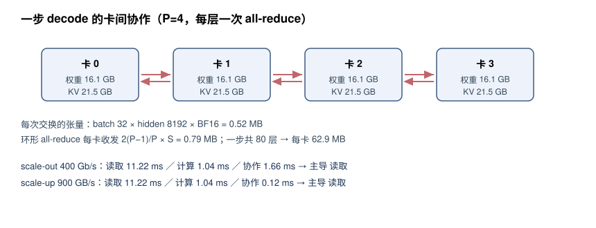

# 实验 1-7 结果：多卡容量与互联

教学模型：80 层、隐藏维 8192，按 12·L·H² 计 64.4 B 参数；8 bit 权重，batch=32，历史 8192 token。

## 逐卡驻留

| 卡数 | 每卡权重 | 每卡 KV | 每卡合计 | 80 GB 放得下 | 余量 |
| ---: | ---: | ---: | ---: | :---: | ---: |
| 1 | 64.4 GB | 85.9 GB | 150.3 GB | 否 | -70.3 GB |
| 2 | 32.2 GB | 42.9 GB | 75.2 GB | 是 | +4.8 GB |
| 4 | 16.1 GB | 21.5 GB | 37.6 GB | 是 | +42.4 GB |
| 8 | 8.1 GB | 10.7 GB | 18.8 GB | 是 | +61.2 GB |
| 16 | 4.0 GB | 5.4 GB | 9.4 GB | 是 | +70.6 GB |
| 32 | 2.0 GB | 2.7 GB | 4.7 GB | 是 | +75.3 GB |

## 每步协作的数据量

| 卡数 | 每步交换次数 | 单次张量 | 每卡每次收发 | 每卡每步合计 |
| ---: | ---: | ---: | ---: | ---: |
| 1 | 0 | — | — | 0 |
| 2 | 80 | 0.52 MB | 0.52 MB | 41.9 MB |
| 4 | 80 | 0.52 MB | 0.79 MB | 62.9 MB |
| 8 | 80 | 0.52 MB | 0.92 MB | 73.4 MB |
| 16 | 80 | 0.52 MB | 0.98 MB | 78.6 MB |
| 32 | 80 | 0.52 MB | 1.02 MB | 81.3 MB |

## 一步 decode 的三项时间

| 卡数 | 互联 | 容量 | 读取 | 计算 | 协作 | 重叠下界 | 主导 |
| ---: | --- | :---: | ---: | ---: | ---: | ---: | --- |
| 1 | scale-out 400 Gb/s | 不通过 | 44.87 ms | 4.17 ms | 0.00 ms | 44.87 ms | 读取 |
| 1 | scale-up 900 GB/s | 不通过 | 44.87 ms | 4.17 ms | 0.00 ms | 44.87 ms | 读取 |
| 2 | scale-out 400 Gb/s | 通过 | 22.44 ms | 2.08 ms | 1.24 ms | 22.44 ms | 读取 |
| 2 | scale-up 900 GB/s | 通过 | 22.44 ms | 2.08 ms | 0.09 ms | 22.44 ms | 读取 |
| 4 | scale-out 400 Gb/s | 通过 | 11.22 ms | 1.04 ms | 1.66 ms | 11.22 ms | 读取 |
| 4 | scale-up 900 GB/s | 通过 | 11.22 ms | 1.04 ms | 0.12 ms | 11.22 ms | 读取 |
| 8 | scale-out 400 Gb/s | 通过 | 5.61 ms | 0.52 ms | 1.87 ms | 5.61 ms | 读取 |
| 8 | scale-up 900 GB/s | 通过 | 5.61 ms | 0.52 ms | 0.13 ms | 5.61 ms | 读取 |
| 16 | scale-out 400 Gb/s | 通过 | 2.80 ms | 0.26 ms | 1.97 ms | 2.80 ms | 读取 |
| 16 | scale-up 900 GB/s | 通过 | 2.80 ms | 0.26 ms | 0.14 ms | 2.80 ms | 读取 |
| 32 | scale-out 400 Gb/s | 通过 | 1.40 ms | 0.13 ms | 2.03 ms | 2.03 ms | 协作 |
| 32 | scale-up 900 GB/s | 通过 | 1.40 ms | 0.13 ms | 0.14 ms | 1.40 ms | 读取 |

