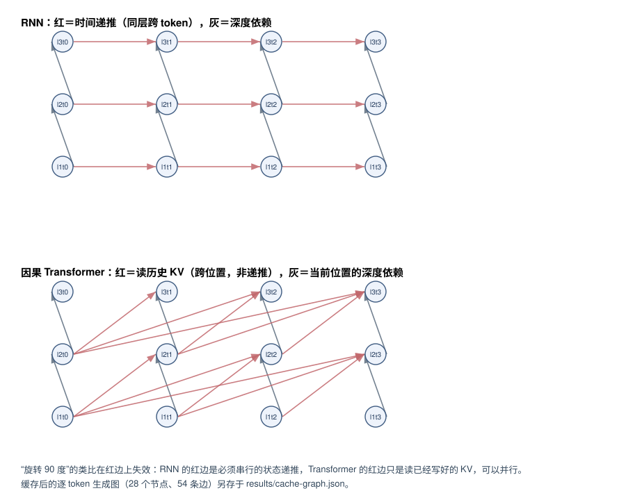

# 实验 2-1：序列计算的依赖与并行

对应正文 2.1。在四个 token、三层的固定教学模型上标出 RNN 与因果 Transformer 的依赖边，检验“旋转 90 度”类比在哪些边上失效；分别数已知输入与新生成一个 token 的矩阵工作和状态，并验证缓存前后同一模型的结果一致。

## 独立运行

只需 Python 3.8+ 标准库：

```bash
python3 run.py    # 写出 results/sequence.json、.md、cache-graph.json 和 dependencies.svg
```

数值取自本书统一计算项目已复算的 `calculations/results/sequence-dependencies-book.json`（固定教学权重、FP64、完整导出、自带一致性检查）。本实验不重算这些数字，只做本题需要的整理、判断与绘图。若该文件不存在，先在仓库根目录运行 `python3 calculations/calc.py reproduce`。

## 结果

**依赖边**

| 模型 | 跨 token 的边 | 条数 | 能否并行 |
| --- | --- | ---: | --- |
| RNN | 状态递推 | 9 | 否，必须串行 |
| Transformer | 读历史 KV | 12 | 是，前缀写好后可并行读 |

**“旋转 90 度”在哪失效**：类比只在**深度方向**成立——两者都逐层加深、参数按层共享。在**时间方向**失效：RNN 的跨 token 边是状态递推，第 t 步必须等第 t−1 步算完；Transformer 的跨 token 边只是读已经写好的 KV。这一条差别决定了已知输入能否一次处理。

**矩阵工作**

| 场景 | RNN | Transformer | 其中注意力 |
| --- | ---: | ---: | ---: |
| 四个已知 token 一次处理 | 768 | 3,552 | 480 |
| 四个前缀各重算一次 | 1,920 | 8,640 | 960 |
| 新生成第 5 个 token（重算前缀） | 960 | 4,560 | 720 |
| 新生成第 5 个 token（复用状态） | 192 | 1,008 | 240 |

复用状态把新生成一个 token 的工作降到重算前缀的 1/5（RNN 192 vs 960）和 1/4.5（Transformer 1,008 vs 4,560）。注意 Transformer 的注意力项从 720 降到 240——省掉的是对已有前缀重新算 QK/PV 的部分，不是全部。

**状态**

| 模型 | 5 token 后常驻 | 随长度增长 | 下一 token 要读 |
| --- | ---: | :---: | ---: |
| RNN | 96 B | 否，定长 | 96 B |
| Transformer | 960 B | 是 | 960 B |

这是两类模型最根本的分歧：RNN 的状态定长，读取量与历史长度无关；Transformer 的 KV 随 token 数线性增长，每一步都要重读整段历史。全书后面关于 KV 容量、前缀缓存、压缩与分页的所有问题都从这一行开始。

**缓存一致性**：10 项检查全部通过，最大绝对误差 **0**。同一模型缓存与不缓存的输出逐位相同——缓存改变的是工作量，不是结果。



完整数值见 [results/sequence.md](results/sequence.md)。

## 限制

- 教学模型宽 4、3 层、FP64，用于把依赖关系数清楚，不代表真实模型的比例。Qwen3-8B 的逐层实数见实验 2-2。
- FLOPs 是所声明算子图的逻辑计数，不含非矩阵操作的实现开销，也不是执行时间。
- 字节是逻辑载荷，不是实际 HBM 流量。
- “能否并行”指依赖图允许的并行，不代表某个实现真的并行执行了。
