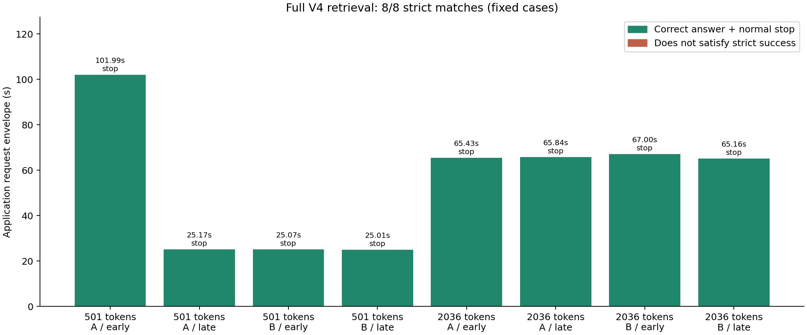
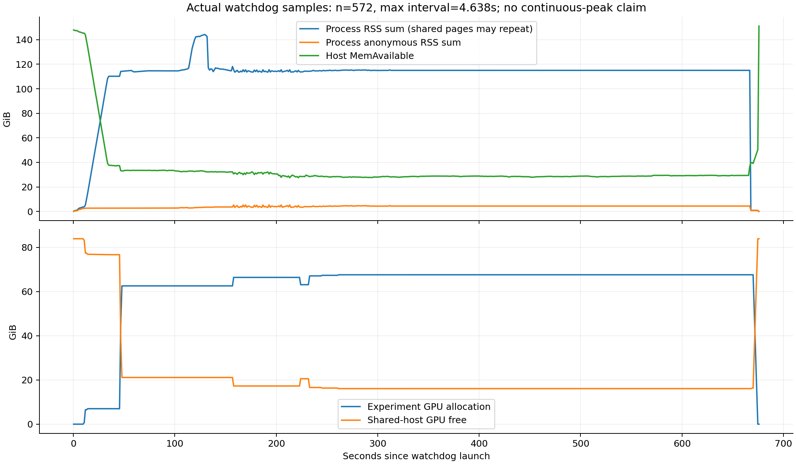

# 2-5：完整 V4 固定文本检索实跑

原43层 DeepSeek-V4-Flash-0731 在 RTX PRO 6000 上完成八道固定自然文本检索，**8/8 正常停止并精确答对**。实际输入为501/2036 tokens，每档包含两个答案及early/late位置。使用110GiB CPUoffload与显式私有偏置引用适配；不是未经修改的官方完整模型路径。

原专家M8严格FP64逐元素门槛的10/32768失败仍未放行。本次仅证明此模型快照、部署配置和固定八题的真实检索输出，不代表一般语言质量、长上下文能力、K3匹配比较、最低资源需求或生产性能。

## 实际结果

| 实际输入token | 内容 / 位置 | 应用请求耗时(s) | 结果 |
|---:|---|---:|---|
| 501 | A / early | 101.995 | 正常停止、精确匹配 |
| 501 | A / late | 25.174 | 正常停止、精确匹配 |
| 501 | B / early | 25.072 | 正常停止、精确匹配 |
| 501 | B / late | 25.012 | 正常停止、精确匹配 |
| 2036 | A / early | 65.429 | 正常停止、精确匹配 |
| 2036 | A / late | 65.838 | 正常停止、精确匹配 |
| 2036 | B / early | 67.002 | 正常停止、精确匹配 |
| 2036 | B / late | 65.156 | 正常停止、精确匹配 |

引擎构造耗时222.698s；八个应用请求区间合计440.678s。首题含首次执行和潜在按需编译，不能与后续题当作同等暖态。请求区间从请求前记录写盘之前开始，到generate返回结束，包含记录开销，不是纯GPU/prefill/decode或独立offload耗时。没有零offload对照或传输profiler，相关单独开销为null。



监控572个真实样本，间隔中位1.165s、最大4.638s。自身GPU allocation采样峰69260MiB；全进程RSS合计峰154867884032bytes，含共享映射重复计数，不能当作独占物理内存。全机MemAvailable最低29545529344bytes、GPU空闲最低16478MiB；共享主机条件下不声称连续峰值、独占吞吐或最小运行容量。



## 版本、题目与兼容适配

固定快照revision `7872f01b1d1fe23eabc4c98b48bffcef5a386062`，保留原43层及完整config/compress_ratios，不截断、不改checkpoint、不复制155GiB权重。48个原分片的metadata/stat与索引核对不是完整payload SHA证明。原tokenizer无chat_template，冻结输入使用缓存官方encoder的thinking_mode="chat"。题集SHA为`5ee234c3ebff4a28287b39bb3d808253d3ed9979850e937ebd47d4403d072dc7`。

SG0.5.13.post1 / Torch2.11cu130 / CUDA13.0，BF16、SM120 MXFP4原专家fallback、FP8 KV、context/token pool4096、chunk256、单请求、greedy、最多32输出tokens、禁用CUDA graph/radix。实际池日志保存full/SWA4096、c4=1024、c128=32及状态池，不能用配置意图代替这些实际记录。

[私有适配](compatibility/README.md)仅在OffloaderV1的functional_call期间，把TopKConfig中普通字段保存的bias别名指向已经搬运的同一参数，finally恢复；不额外复制、不改变数学。CPU对照与4组实际GPU fused-gate对照的IDs/weights均逐位一致。完整运行的scheduler实际记录了cpu→cuda:0引用替换及源码SHA，见runs下compatibility-records。小对照不是完整模型数值放行。

## 独立核验和复现

原始输入、响应、token IDs、完整server info、监控和退出记录均在 [成功运行目录](runs/cpu110-bias-alias-004/)。模型正常退出0、无残留；八题输入重新分词、输出解码及token计数/结束信息全部一致。BASE分析器在临时副本评分，不覆盖退出时scores；主agent本地重算报告与远端逐字一致。详见 [token核验](runs/cpu110-bias-alias-004/token-verification.json) 和 [分析报告](runs/cpu110-bias-alias-004/offline-analysis/REPORT.md)。

离线分析只需Python标准库；绘图需要Matplotlib。以下命令写入新的派生目录，不重跑模型：

```sh
python3 -B analyze.py --out runs/cpu110-bias-alias-004 --destination review-new
```

真实独立重跑使用原RTX缓存和私有SG环境，输出名称必须从未存在。入口重新核对依赖、安装源码、原小metadata、分片stat与冻结题目；新建私有编译缓存及短IPC目录，不改共享环境：

```sh
/home/ubuntu/ai-infra-book-experiments/tools/sglang0513-venv/bin/python -B reproduce.py --name rerun-new --execute-after-rl
```

当前运行护栏为启动主存140GiB/GPU80GiB，自身RSS合计175GiB/GPU78GiB，全机主存24GiB/GPU4GiB；只通过唯一token、出生时间与pidfd管理自身子树。这些护栏不是内核硬限额。已按用户授权核实身份并停止原QwenVL服务释放显存，见 [service-release.json](service-release.json)；其他四个原GPU服务保留。排障的旧失败目录在成功后删除，只保留此最终实际运行；故意未适配的GPU小对照是科学负对照，保留。

完整方法见 [PROTOCOL.md](PROTOCOL.md)。calculations只读，第一轮其他实验仍未全部完成，最终跨session增补与论文复核尚未开始。
