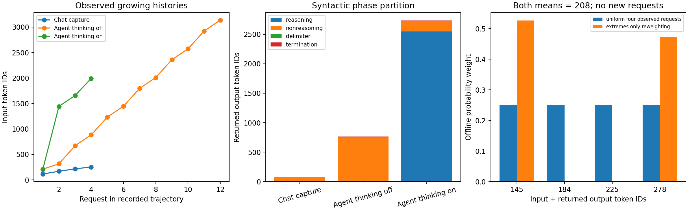

# 2-8：固定 Chat 与 Agent 请求画像

本项完成固定受控轨迹的离线画像，不新增模型请求。复用第 9-9 项 4 次 Chat 采集及 24 次路由重放、第 3-4 项 thinking 关闭的 12 轮和开启的 4 轮真实 Agent。每份完整消息、token IDs、输出、工具结果与必要的原生 worker 日志均独立复制并记录来源 SHA。它们是人工任务夹具，不能代表生产 Chat/Agent 的总体分布。

## 长度和输出阶段

| 轨迹 | 请求数 | 累计输入 | 累计返回输出 ID | reasoning 阶段 | 非 reasoning 阶段 | think 分隔符 | EOS |
|---|---:|---:|---:|---:|---:|---:|---:|
| Chat 采集 | 4 | 753 | 79 | 0 | 75 | 0 | 4 |
| Agent thinking 关闭 | 12 | 19,556 | 765 | 0 | 753 | 0 | 12 |
| Agent thinking 开启 | 4 | 5,297 | 2,733 | 2,549 | 174 | 7 | 3 |

Chat 每个重放组的输入、输出数量与采集一致，六个组独立保留。没有将重放当作另外 24 条自然产生的对话。输入长度范围分别为 Chat 116–252、Agent 关闭 210–3,136、开启 206–1,992；累计输入重复计入历史，不能等同唯一语义内容。

阶段使用固定 Qwen3-8B 快照的实际 tokenizer 配置：`<think>` 为 151667、`</think>` 为 151668、`<|im_end|>` 为 151645。按生成流中的显式标记切换阶段，分隔符与 EOS 单列；开启 thinking 的截断首轮未见结束符，其阶段内 token 仍计入消耗。关闭模式由保存的配置/模板确认，不能依据文本是否“像思考”分类。所有阶段相加严格等于返回 ID 数；这是语法阶段分类，不保证每个阶段内 token 的语义性质。未知类别保留字段，本批为 0。

与第 3-4 项旧统计的口径区别是显式扣除起始分隔符和 EOS：旧“结束符之前”2,553 = 此处 reasoning 2,549 + 4 个起始标记；旧“结束符之后”177 = 非 reasoning 174 + EOS 3。不是原始输出变化。Chat completion_tokens 与返回 IDs 数逐条相等，本批均包括 EOS。

## 缓存与间隔

| 轨迹/路由（每轮） | 至少命中一个 token 的请求比例 | 各请求缓存比例的算术平均 | 按输入 token 加权缓存比例 |
|---|---:|---:|---:|
| Chat 采集、cache-aware 重放 | 75.000% | 56.692% | 64.940% |
| Chat round-robin、power-of-two 重放 | 50.000% | 29.173% | 36.653% |
| Agent thinking 关闭 | 91.667% | 71.812% | 83.371% |
| Agent thinking 开启 | 75.000% | 66.538% | 84.576% |

三种口径分别为 `count(cached>0)/requests`、`mean(cached/input)`、`sum(cached)/sum(input)`。缓存值直接取实际引擎响应，Chat worker 归属以原生 received/finished 日志复核，不用文本相似度或离线赋权预测命中。

复用间隔定义为同组内“前次同 worker 请求完成至当前发送”的差，第一次访问为 null。Chat 采集中位为 0.747 ms；Agent 关闭/开启为 62.332/9.871 ms。完整逐请求和每组分布见 summary.json。Chat 是控制器立即续发间隔，不是人类 think time；Agent 间隔包括实际工具执行和控制器开销，不是单独工具时间。它不是两次访问某个 KV block 的精确间隔，更不是 KV 驻留时长；缺失的逐 block 生命周期不作推断。

Agent 关闭时工具动作是读文件 1 次、写文件 5 次、测试 6 次，工具调用墙钟合计 0.476 s。开启时是无效动作 1 次、写文件 1 次、测试 1 次、finish 1 次，合计 0.078 s；无效截断与 finish 控制动作不能记作两个成功外部工具调用。完整依赖链通过前轮 assistant 输出和工具结果拼接逐轮核验。

Chat 使用 SGLang，Agent 使用 vLLM；采样任务、轨迹长度、控制器和执行时间不同，不作性能因果对照。较高缓存比例不证明更高任务质量。原 Agent 关闭轨迹预算耗尽；开启轨迹原任务检查通过，但额外别名隔离检查仍有失败，原始 final 和 independent-checks-v2 均保留。

## 相同平均值，不同分布

只在 Chat 四个既有请求的“输入 IDs + 返回输出 IDs”长度 `[145,184,225,278]` 上做离线概率赋权：

| 离线分布 | 四个长度的权重 | 平均长度 | 长度方差 |
|---|---|---:|---:|
| 原四请求等权 | 1/4、1/4、1/4、1/4 | 208 | 2,433.5 |
| 仅两端加权 | 10/19、0、0、9/19 | 208 | 4,410 |

使用 Fraction 精确验证平均值相等；第二项不是实际执行的新队列，不保持原多轮依赖，不能给它填新的缓存命中、延迟或资源实测。结果对应字段保持 null。此对照只证明一个平均长度不能恢复尾部和分布，未调用或复制 C14 资源模型，也不据方差直接计算 GPU 成本。结构选择还需输入/输出阶段划分、依赖、缓存身份与驻留证据。

## 独立复算

在本目录运行 `python3 analyze.py`，只需要标准库。脚本验证全部复制件 SHA、Chat 消息链和引擎长度、worker 完成日志、Agent 完整依赖链、源脚本哈希和 token 分区守恒，然后写 summary.json。`python3 plot.py` 需要 Matplotlib，生成上图；图已实际渲染检查。

`sources/` 保存原始记录、原运行脚本及 tokenizer_config，`source-index.json` 记录只读来源绝对路径与哈希；复算使用本目录相对路径，不依赖原目录或 RTX。复制的 run.py 只作源身份依据，当前实验的入口为 analyze.py，不需要运行模型或 GPU。`manifest.json` 封存本目录文件。

本项没有重新执行请求，也没有修改已封存的原实验、正文、PROGRESS、inventory 或 calculations。该固定夹具画像不替代未来真实生产轨迹与跨 session 论文增补复核。
