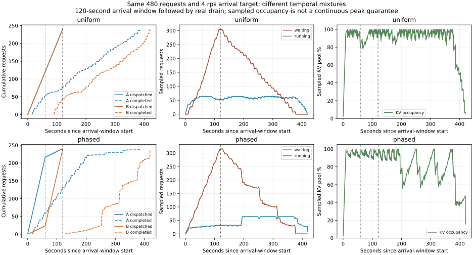

# 3-2 相同请求总量、不同时间分布（时段回放已完成）

真实执行题目两分钟4requests/s的教学变体。每份480请求，A8192输入/256输出，B1024输入/2048输出，各240个；均匀组每60秒A/B各120，时段组前60秒216/24、后60秒24/216。两份使用相同逐请求输入与输出长度，仅排列/到达位置不同。workloads.json逐项保存绝对目标到达秒数；inputs.json完整保存token IDs。

这是依照固定教学规格构造的负载，不宣称运行了ServeGen或重建生产客户、多轮关联。相关平均需求和PD流体计算已由其他任务负责，本实验不重算，也不将2P3D等教学假设当RTX单卡配置。实际是一个Qwen3-8B/vLLM0.23/eager实例，24GiB KV预算、最多64序列、APC关闭。

每组按0、0.25、…119.75秒的绝对时刻创建请求，不等待上一请求结束、不因队列长度降发送速率。记录真正dispatch时刻及相对目标的lag；“计划4rps”须由最终到达记录核对。120秒到达窗口结束后继续等待所有请求完成，不能截断高延迟请求。组间等待全部排空，并分别预热A/B各8输出token。

输出使用greedy、ignore_eos=True强制指定长度，表示固定生成工作量，不是自然结束或任务质量。完整输出token、所有客户端流事件、首次queued/scheduled时间保留。记录的排队时间是初次调度等待，不含后续抢占等待；后者保留发生计数。p95使用480请求最近秩分位数，单轮不当作稳定SLO。

自定义logger每100ms最多写一次运行/等待数和KV池占用，抢占事件例外逐次记录；每次回调累加抢占次数。KV峰值是采样到的池占用率，既不是整卡显存峰值，也不是逐连续时刻最大值。pmon按1秒记录GPU活动，未声称独占。主机logger及客户端事件有观测开销，完整原始日志允许后续核查。

运行和离线分析入口：

```sh
/home/ubuntu/vllm023-venv/bin/python run.py --output results/new-arrival
python3 analyze.py
python3 plot.py
```

目录自带全部输入和配置，模型使用RTX已有固定缓存，不依赖相邻实验模块。分析/绘图默认读取已交付的arrival-v1；分析要求两组全部完成且status=passed，运行中不会输出部分p95冒充最终结果。两份回放及排空已完成，完整结果如下。


## 实际到达、排空与尾部结果

两组均480/480请求完成，每个60秒窗口实际dispatch240个。A/B各240，全部逐请求输入哈希一致、输出256/2048符合固定工作量；对应任务的完整输出token跨两组也全部一致。两组实际最后dispatch分别119.750222/119.751219秒。dispatch lag p95为1.856/1.951ms，最大3.186/163.353ms；目标4rps并不表示每次发送间隔都完美等于250ms，原始dispatch记录完整保留。

| 指标 | 均匀混合 | 前9:1、后1:9 |
|---|---:|---:|
| 完整请求p95 s | 299.383 | 299.420 |
| TTFT p95 s | 242.918 | 258.871 |
| 初次调度等待p95 s | 242.418 | 258.404 |
| 最后完成相对起点 s | 419.846 | 418.679 |
| 120秒后仍需排空 s | 299.846 | 298.679 |
| 第120秒未完成请求 | 359 | 349 |
| 采样等待队列峰值 | 305 | 316 |
| 采样运行请求峰值 | 64 | 64 |
| 采样KV池占用峰值 | 100% | 100% |
| 抢占事件数 | 62 | 24 |



两组的总排空时间和完整请求p95接近，不能写成“改变时段比例使所有指标都恶化”。但TTFT、等待轨迹和抢占次数不同：时段组在前段长输入集中时常只有约30条请求运行，后段释放状态后升至64，KV压力随时间变化。抢占计数是事件数，不是被抢占的独立请求数。

每10秒实际发送/完成/未完成量也保存到summary。两组前30秒都发120个，仅分别完成19/20个；第120秒仍有359/349个未完成。这包括正在运行与等待的请求，不等同于纯排队长度。采样等待队列和后续真实排空共同证明：此单GPU固定配置下，4rps持续到达形成了积压。不能用教学PD池的13秒流体排空预测这里约299秒的实际排空。

已读取并封存安装版本的`stats.py.snapshot`：queued/scheduled/first/last token为engine core单调时间；scheduled_ts只记录首次调度，明确忽略后续抢占。因此表中初次等待不冒充全部排队耗时。TTFT和完整请求从客户端实际dispatch起算，计划发送迟到单列，不混入不同主机时钟。

采样最后一条记录不一定刚好落在全部请求释放后，不能据最终KV样本非零认定泄漏；实际480完成及引擎正常shutdown另有记录。没有持续GPU硬件内存计数，KV占用只按引擎池语义解释。

## 范围与可复核交付

两组在同一引擎顺序执行，均匀组先、时段组后；每组各一次，没有反序重复，因此不将本次差值作为跨独立运行置信结论。强制生成的合成token输入只用于受控系统负载，不测试任务质量，也不是生产客户分布。固定教学两分钟变体和实际同均值回放已交付；ServeGen客户生成、多轮关联以及更广的分布变体未执行，整体3-2保持partial。

`analyze.py`核对源码/输入、全部960完成、dispatch与完成记录身份一致、每窗A/B数量、时间单调和所有输出，再计算最近秩p95。`workload-spec.snapshot.md`与运行前记录的规格哈希一致；完整源码、输入、日志、结果及图由manifest封存。输出图已目视检查。两个模型回放全部结束，GPU空闲显存恢复到86184MiB，原服务未停止，calculations未执行或修改。
