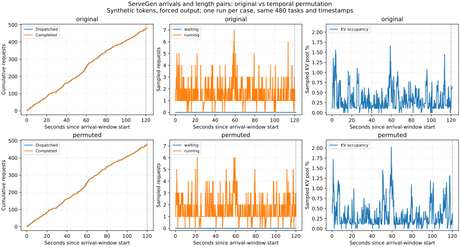

# 3-2：ServeGen 生成请求的真实模型回放

本实验将固定 ServeGen 生成请求接入 RTX PRO 6000 上的 Qwen3-8B，比较原始时序与完整长度配对的时间置换。它补足生成入口到实际执行的证据，不代表生产内容、多轮缓存或模型质量测试。

## 执行前固定的控制条件

`PROTOCOL.md`、`input-provenance.json` 固定方案。原始请求来自 ServeGen revision `d70c8b2d5bc45f4b60a146fbc43dc5523f871c8b` 的公开 m-small chunk0、窗口337800、种子302，保留原始480个请求与120秒内时间戳。`source-requests.json` 保存原件，来源SHA256见 provenance；生成器源码与字段审计另见[相邻独立实验](../servegen/README.md)。

原始组按生成顺序执行；置换组以 Python Random(303) 打乱完整任务配对，到达时间不变。输入长度与输出长度不拆开重配，每个任务两组使用完全相同 token 输入。适配器截取已保存的有效合成 Qwen token 序列，以4000+原始请求编号作为首 token，全部完整输入保存在 inputs.json。该方法不恢复匿名生产内容或前缀，不用这些输出评估质量。

同一引擎先 original、后 permuted，每组前两次8-token热身不计正式结果。BF16、eager、APC关闭、24GiB KV池、最多64活跃序列、4096调度token预算，固定Qwen模型revision `b968826d9c46dd6066d109eabc6255188de91218`。完整参数见 engine-config，实装软件版本见 runtime-versions。贪心且 ignore_eos 强制达到声明输出长度。

按绝对deadline开放到达，不使用客户端并发门限；记录实际dispatch与偏差，120秒到达窗口结束后等待所有请求完成。记录客户端每次输出事件、全部输出token、引擎初次queued/scheduled指标及约10Hz调度采样（另保留抢占事件）。初次排队不包含抢占后的额外等待，采样峰值不是连续真实峰值保证。GPU原有服务仍运行，pmon记录只用于观测，不证明独占。

## 结果与复核

| 实际指标 | 原始顺序 | 配对置换 |
|---|---:|---:|
| 完成请求 | 480 | 480 |
| 请求完成延迟 p95 | 0.786366 s | 0.801411 s |
| TTFT p95 | 38.781 ms | 42.989 ms |
| 初次引擎排队 p95 | 30.684 μs | 37.768 μs |
| dispatch偏差 p95／最大 | 1.764／2.483 ms | 1.636／2.440 ms |
| 最后完成（相对窗口开始） | 121.478538 s | 120.197175 s |
| 采样等待／运行峰值 | 0／7 | 0／6 |
| 采样KV池占用峰值 | 1.667% | 2.024% |
| 抢占事件 | 0 | 0 |

所有480个配对任务的完整输出token相同。两组最后一次实际发送都略晚于120秒（约0.55毫秒），所以“120秒时已发送但未完成2个”不含尚未发送的最后任务，不能用480减该数当作已完成数。该负载没有明显排队压力，不能据此否定时序在重负载下的重要性；与父目录的长请求教学负载分开解释。

完整数值见 results/summary.json，时间线见下图。每组仅一次且固定顺序，不用小差异宣称稳定性能胜负；这是实际回放的功能与测量证据。生成器只取一个公开客户窗口，也不能推广为完整生产客户分布。



`analyze.py` 核对执行时源码和输入哈希、全部960条发送／完成记录、同一请求集合、相同时间戳、输入长度和强制输出数、事件顺序、初次排队及逐任务输出差异。p95采用最近秩，不拟合服务时间或模拟排队。

```sh
python analyze.py
python plot.py
```

离线分析仅需Python标准库，画图需Matplotlib。独立实际重跑需相同模型缓存及 engine-config 指定环境，在本目录执行：

```sh
/home/ubuntu/vllm023-venv/bin/python run.py --output results/replay-v2
```

程序拒绝覆盖已有输出。新版本分析应在目录副本中将分析输入路径改到 replay-v2，保留现有原始结果和manifest。无需相邻目录输入即可实际回放；相邻链接用于说明来源。当前多轮客户身份／缓存适配仍待，最终跨session论文增补复核尚未开始。
