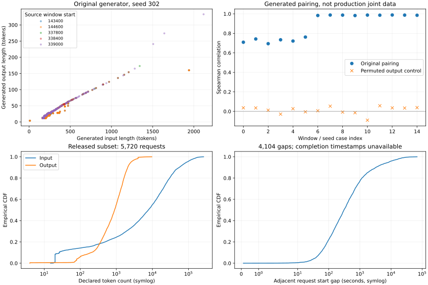

# 3-2：ServeGen 固定版本生成入口与公开多轮记录

本目录实际执行作者原始生成器，并核对公开多轮数据的可回放字段。它是 3-2 的新增独立证据；父目录已封存的 960 请求 GPU 实验使用教学构造，不能称为本目录 ServeGen 请求的 GPU 回放。当前尚未将这些生成请求接入模型，也未完成客户多轮缓存实验。

## 固定输入与方法

采用 Alibaba ServeGen revision `d70c8b2d5bc45f4b60a146fbc43dc5523f871c8b`，不是对论文实验版本的声明。`sources.json` 保存七个原始源码／数据文件的固定 URL、字节数、Git blob SHA1 与 SHA256；vendor 文件未修改。仅选择公开 `language/m-small/chunk-0`，加载结果只有客户 0，不代表完整客户池。原始 loader 使用 eval，调用前先以 literal_eval 验证全部被求值字符串为有限数值字典。

五个活跃 600 秒源窗口起点为 143400、144600、337800、338400、339000。每窗口截取前 120 秒，目标 4 请求／秒，各执行种子 302、303、304。原始 Gamma／Weibull 到达和字段采样保持不变，全部生成请求存入 `results/window-*.json`。NumPy 2.5.3、SciPy 1.18.1；运行脚本哈希记录在 summary 中。

15 组目标各 480 请求，10 组生成 480、5 组生成 479，共 7,195。IAT 总和归一化到 120 秒后，浮点累计末值可能略小于 120，因此原始 `< window_end` 过滤有不同计数；没有补齐或裁剪。实际首末时间、过滤前末值和 IAT 总和均保存。

生成输入／输出长度的 Spearman 相关系数约 0.694–0.988；同一输入与独立打乱后的输出配对约 −0.091–0.058。源码 `_sample_data_batch` 对不同边缘 CDF 使用同一随机分位数，这是生成器的配对行为，**不能作为生产数据原本的联合分布证据**。打乱只是负对照，也不是生产真值。生成 Request 只有 request_id、timestamp、data，没有会话 ID、客户 ID 或前缀身份。

## 公开多轮子集

`conversations-source.json` 固定同版本 `conversations_hashed.json` 的来源和哈希；本地保存原始 50,475,041 字节。按匿名标识处理数组，不解码内容，不推断标识编码粒度。`audit_conversations.py` 检查字段、连续轮号、会话内时间顺序和声明长度，并保存逐请求／逐相邻轮记录。

| 检查项 | 结果 |
|---|---:|
| 会话／请求／相邻轮对 | 1,616／5,720／4,104 |
| 会话轮数：最小／中位／最大 | 2／2／45 |
| 声明输入 token：中位／p95 | 7,745／90,674 |
| 声明输出 token：中位／p95 | 891.5／2,557 |
| 相邻请求开始时间差：中位／p95 | 308.316／8,600.168 秒 |
| 输入标识数组长度与声明 token 数不同 | 5,720／5,720 |
| 输出标识数组长度与声明 token 数不同 | 0／5,720 |
| 输入标识数组有非零公共前缀的相邻轮对 | 512／4,104 |

p95 使用最近秩。会话索引只是本地归档编号；这是公开子集，不作全生产总体推断。记录缺少请求完成时间，因此开始时间差不等于思考、工具或等待时长。标识公共前缀长度不等于可复用 token、KV 字节或实际命中，不能把整数数组直接送入 Qwen 当作有效语义输入。



## 离线复核与独立重跑

在本目录运行，环境需 NumPy 2.5.3、SciPy 1.18.1；画图另需 Matplotlib。源文件、全部原始数据和结果已经随目录保存，复核无需下载或 GPU。

```sh
python verify.py
python plot.py
```

`verify.py` 验证来源哈希、窗口／种子覆盖、请求序号／时间边界、原始与打乱相关性、公开记录覆盖及封存清单。`audit_conversations.py` 可重建多轮字段审计文件。需要重新执行生成器时，将本目录复制到新位置并移走副本的 results 与 manifest，再运行 `python run.py`、`python audit_conversations.py`、`python plot.py`、`python verify.py`；生成器拒绝覆盖已有 results。保留当前封存结果用于比较，不能用重跑结果覆盖原始证据。

本次无需 GPU，未处理已有服务，未执行或修改 calculations。完整客户池、多轮身份／前缀适配和实际模型回放仍待；完成第一轮全部实验后，还需按用户要求对照另一个 session 最终实验增补与论文比较进行复核。
