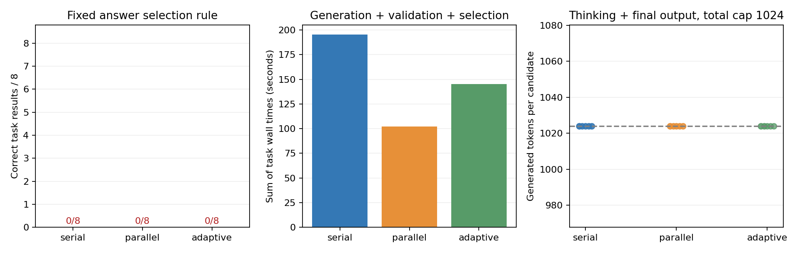

# 3-3 真实候选生成：串行、并行和按题目规模分配

状态：1024上限首批实测完成，3-3整体仍partial。固定Qwen3-8B快照，四题、两轮、三策略24组44个真实候选；参数与选择规则在运行前写入PROTOCOL.md。全部原始记录已拷回、通过离线校验；引擎和控制器正常退出，gpu-after.txt只剩原有四项服务。

## 本批结果

| 策略 | 请求数 | 正确任务/8 | 输入token | 输出token | 八任务耗时和（秒） |
|---|---:|---:|---:|---:|---:|
| 串行 | 16 | 0 | 1324 | 16384 | 195.498 |
| 并行 | 16 | 0 | 1324 | 16384 | 102.098 |
| 自适应 | 12 | 0 | 1034 | 12288 | 145.133 |

所有44个候选均生成1024token后length终止，没有thinking结束后的合规JSON答案；不是模型给出44个错误整数。三策略都未达到可用质量门槛，因此每个正确结果的token/时间均为null，费用也未知。不将并行更短的失败耗时称为成功任务收益；自适应少请求也未取得正确结果。当前需要更宽预算或其他生成设置补测，不能靠此批完成同质量比较。

16对串并行候选输入token全部相同，输出token全部不同，详见paired-output-checks.json。固定seed并未实现跨调度输出一致；本批没有定位差异的底层原因，不把它归为确定的单一浮点算子。输出长度相同仅因全都达到上限。解析/选择/评分耗时总和各不足0.1ms；真值预计算在计时前执行，两个oracle只用于评分而非运行中的搜索工具。

完整source哈希、24组顺序、44候选输入/输出/文本/事件及引擎metrics检查通过，所有APC命中为0。原始思考文本仍保存，未把其中暂定数字当最终答案。图已目视核验；manifest封存文档、源码、原始数据、摘要和图。

## 工作负载与质量门槛

四道有限集合子集计数题；元素数6/8/12/14，答案分别3/8/100/302。tasks.py用独立枚举与动态规划一致性验证，不将答案放进模型输入。任务集合是人工受控小题集，不是公开推理榜单，元素数只是事先固定的难度代理，未经模型难度标定。

串行策略依次生成两个独立候选，不携带前一回答继续推理。并行策略在一个GPU引擎同时提交两个候选，不是两张GPU。自适应策略对<=8元素的题只生成一个候选，其余依次生成两个；不是根据当前答案质量增加预算。每候选thinking开启、temperature0.6、top_p0.95，总输出上限1024。相同候选位置/轮次使用相同随机seed；调度仍可能改变浮点路径和输出，需要从记录核对。

最终答案严格解析thinking结束后的JSON整数count。有效候选多数投票，平票取较小候选索引，全无效失败；不使用真值从候选中挑正确者。选择后才对照真值评分，保留所有失败生成、解析成本、选择和评分时间。不能把存在一个正确候选直接算作最终成功。

## 测量口径

每组时间从首次调用前到选择及评分后，包含该组候选生成和实际验证。跨组顺序运行，sum(task wall)不是单个用户的延迟或整个实验的连续墙钟，模型加载、oracle预计算和组间落盘不计入。CPU验证很轻，不能推广为代码运行/定理证明的验证成本。

完整input_ids/output_ids与流式事件保存生成过程；输入+输出的逻辑长度不等于实际KV块或物理内存驻留。引擎使用6GiB KV预算、最多两个序列、APC关闭、eager执行；预算是配置，不是实测峰值。没有采集GPU能耗或付费API账单，费用保持null。总生成上限包含thinking和最终答案，不当作独立reasoning额度。

## 独立运行

Linux、vLLM0.23.0/Torch2.11.0+cu130，已缓存相同模型快照。在独立目录副本运行，results存在则拒绝覆盖：

    /home/ubuntu/vllm023-venv/bin/python run.py --model /home/ubuntu/.cache/huggingface/hub/models--Qwen--Qwen3-8B/snapshots/b968826d9c46dd6066d109eabc6255188de91218
    python3 analyze.py
    python3 plot.py

分析需要标准库，绘图额外需要Matplotlib。analyze.py要求24组完整，验证44候选、源码哈希、时间关系、策略预算、原文本重新解析、固定选择规则和真值。summary、图和串并行配对输出检查均已生成。只有四题两轮，不给出普适质量结论；同质量门槛如果未达到，正确结果成本应保留缺口，不能靠缩小任务集报成功。

本项不触碰calculations或其计算任务，不终止已有GPU服务。更宽预算、更多题目、实测状态/硬件资源和最终跨session论文复核仍待。
