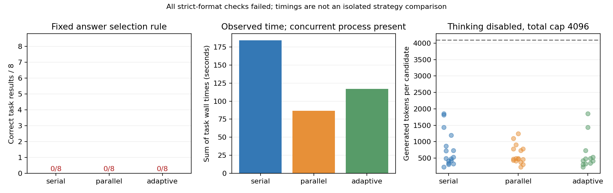

# 3-3：关闭 thinking 的真实诊断

本批 24 组、44 个候选全部执行完，运行退出码 0。关闭 thinking 后，所有候选在 229–1,850 输出 token 内自然 stop，没有达到 4,096 上限；但全部输出都不符合“全段严格 JSON”要求，三策略主检查均为 0/8。自然结束不能等同可直接使用的正确答案。

本批是在此前 thinking 开启的 1,024/4,096 预算截断结果之后追加的诊断。它改变 thinking 模式、聊天模板和解析，不是仅改变预算的对照。四题、两轮、策略、种子、顺序、APC-off 和其余引擎设置保持；运行前约束见 PROTOCOL.md。该文件保留“尚未运行”的准备时点描述，最终执行状态以本 README、exit-code.txt 和完整 raw.jsonl 为准。

## 主评分与实际消耗

| 策略 | 候选数 | 合规且正确任务数 | 累计输入 token | 累计输出 token | 八组观测耗时之和 |
|---|---:|---:|---:|---:|---:|
| serial | 16 | 0/8 | 1,388 | 12,173 | 184.210 s |
| parallel | 16 | 0/8 | 1,388 | 9,695 | 86.791 s |
| adaptive | 12 | 0/8 | 1,082 | 7,566 | 116.804 s |

所有请求缓存 token 为 0。输出共 29,434 IDs，其中 29,390 个位于非 thinking 输出阶段、44 个 EOS，无生成的 think 分隔符；这只是显式标记的语法分区，不能声称普通文本中没有推理解释。串并行同种子 16 对候选输入 IDs 全部相同，输出 IDs 仅 1 对相同，所以不能把完成时间差当作等输出工作量比较。

主解析器对整个输出执行严格 JSON 解析，仅接受整数 count 字段。所有 44 次均为 JSONDecodeError。初始 eight/serial 组的两个输出尾部分别有代码围栏包裹的 count=8 和 count=5，前面均有长解释；它们不是“完全没有数值”，但按原接口约定仍失败。完整尾部形态与错误类型见 candidate-diagnostics.json，未剥离文字去修改主评分。

耗时从每组开始至选择和评分完成，保留模型交付、验证和选择的各自时间；不包含模型加载。正确任务为 0，主成功成本保持 null。没有费用或能耗实测。更重要的是下述外来进程重叠使这些时延不具备独占 GPU 条件，不能据表声称策略单独导致加速。

## 后验语义诊断：与主评分分开

按运行中提出并写入独立脚本的后验规则，只接受全文唯一的完整顶层 JSON 对象，且必须位于末尾，或仅由末尾一个标准 json/无语言代码围栏包裹。对象只能有整数 count。多对象、重复键、非整数、尾随内容、未闭合思考区和不合规围栏拒绝。此前解释文本允许存在；真值不用于挑选对象或候选。提取后仍按原多数投票、平票优先第一个候选。

| 策略 | 可提取候选数 | 后验投票数值正确任务 | 主格式合规且正确任务 |
|---|---:|---:|---:|
| serial | 4/16 | 1/8 | 0/8 |
| parallel | 4/16 | 2/8 | 0/8 |
| adaptive | 3/12 | 1/8 | 0/8 |

44 候选中 11 个接受末尾单一 JSON 围栏，19 个因多 JSON 对象拒绝，14 个因尾随内容或非标准围栏拒绝；11 个接受者中 4 个数值正确。较宽松的“有完整末尾 JSON 围栏”形态检查标出 21 个，独立提取还要求全文唯一，故不能混用两个数量。每个候选的值、接受/拒绝原因、数值正确与主格式合规维度在 posterior-semantic.json 中完整保留。

此后验诊断只解释失败构成，不替代主评分，不是预注册的成功率或成功成本；没有为此重跑模型。它还表明格式放宽也不能将本批全部失败转成正确答案。两组解析测试覆盖支持形式和歧义拒绝；它们验证提取规则，不证明模型正确率。

## 实际观察到的并发进程

执行前 gpu-before.txt 仅原有四个服务；本实验 engine PID 为 3601362，01:21:33 UTC 完成 shutdown，随后 /proc 观察确认已不存在。gpu-after.txt 除原四服务外出现新的 PID 3614304、49,664 MiB。只读 ps 表明其父 PID3613078 为 OpenRealtime 工作树中启动 qwen-fast 服务的命令，父进程 01:17:52、新 engine 01:18:09 UTC 启动。没有判断其操作者，也没有终止该服务。

process-clock-observation.json 保存 /proc 的启动 tick、HZ 和同次 wall/MONOTONIC/BOOTTIME 读数。analyze_overlap.py 以 BOOTTIME 与 MONOTONIC 的观测差换算到请求时钟；tick 分辨率 10 ms，观测两时钟差约 4 μs。组 11 横跨新 engine 的出生时刻，组 12–23 在其后，共 23 个候选结束晚于该时刻；父进程从组 9 起重叠，共 27 个候选结束晚于父进程出生。

这是进程生命周期重叠证据，没有对应的逐进程 GPU kernel/utilization trace，不能确定每个请求实际竞争程度。主表保留完整原始耗时，但不称 GPU 独占、受控策略时延或把竞争归因成某项内核影响；也不截取前半段重新制造更有利结果。按主 agent 要求归档，不因该重叠重跑整批。



## 复算、运行与证据

本目录独立离线复算：

```sh
python3 analyze.py
python3 posterior_semantic.py
python3 analyze_overlap.py
python3 -m unittest discover -s . -p test_extraction.py
python3 plot.py
```

除 plot.py 需要 Matplotlib，其余仅标准库。图已实际渲染检查。分析验证运行源码哈希、四题枚举/DP真值、24组44候选、完整消息与时序、APC零命中、严格解析结果、选择规则、串并行输入配对、输出 token 分区守恒。原始错误与输出从未改写。

重新运行模型须在新独立副本中、RTX GPU 窗口协调完成且没有 results 时使用固定 vLLM 环境执行 PROTOCOL 中命令；本次结果不可覆盖。run.py 自带 TASKS/工具真值验证并保存全部数据，不依赖 calculations。

results 保存任务、环境与源码哈希、顺序、tokenizer 标记和完整 raw；run.log、exit-code.txt、GPU前后快照与进程时钟原件保留实际运行边界。baseline.json 封存准备阶段与原 wide-budget 源码身份；manifest.json 封存本目录交付文件。原实验、正文、PROGRESS 和 inventory 未修改。第 3-3 项同质量可靠策略比较仍未由本批证明，未来结构化输出或任务设计调整需另开明确实验。
