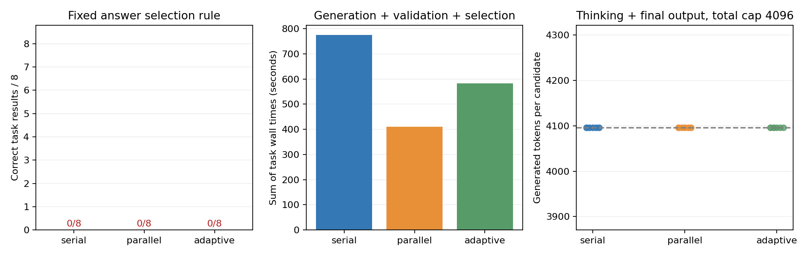

# 3-3 更宽总输出预算：4096仍未完成思考

本补测完成四题、两轮、三策略24组44候选，全部4096token length终止、未见思考结束标记；三策略各0/8，没有合规最终答案。全部原始记录已拷回并通过独立分析，控制器/引擎已退出；3-3整体仍partial。

| 策略 | 请求 | 输入token | 输出token | 八任务耗时和（秒） | 正确任务 |
|---|---:|---:|---:|---:|---:|
| 串行 | 16 | 1324 | 65536 | 775.587 | 0/8 |
| 并行 | 16 | 1324 | 65536 | 410.962 | 0/8 |
| 按规模分配 | 12 | 1034 | 49152 | 582.915 | 0/8 |

首批1024上限全部截断，本批只将每候选总上限改为4096；运行源码反向替换后SHA与原件完全相同，tasks.py也逐字一致。题目、seed、顺序、引擎配置和选择规则不变。看到首批结果后追加的诊断不是独立盲测，不将两批合并掩盖失败。总上限同时包含thinking和最终输出，不是独立reasoning配额。

candidate-diagnostics.json从原文重新区分思考未结束、最终JSON不合法、整数错误和正确候选；本批44个全属思考未结束，不是44个错误整数。首组原文仍在反复枚举和检查子集；不从中抽临时数字凑最终答案。正确定义不变，每正确结果的token/时间及费用均为null，不把并行较短的失败耗时解释为正确任务收益。

16对串并行候选输入token全部相同，输出token全部不同；相同seed未获得跨调度输出一致。没有定位底层原因，也不把输出长度相同当生成内容相同。所有APC命中为0。验证/选择/评分极轻，真值由独立穷举和DP预先产生，不计入任务计时，更不用于选择或分配候选。

## 方法与复现

串行依次生成两个独立候选，不携反馈续推。并行在同一GPU引擎同时提交两个。按规模分配对元素数<=8一个候选，其他题串行两个；难度代理预先固定，未依据当前答案质量追加。有效严格JSON多数投票，平票第一个，无有效候选失败。

Linux、vLLM0.23/Torch2.11+cu130与同Qwen3-8B快照；独立目录副本执行，results存在则拒绝覆盖：

    /home/ubuntu/vllm023-venv/bin/python run.py --model /home/ubuntu/.cache/huggingface/hub/models--Qwen--Qwen3-8B/snapshots/b968826d9c46dd6066d109eabc6255188de91218
    python3 analyze.py
    python3 plot.py

分析只需标准库，绘图需Matplotlib。完整input_ids/output_ids、思考文本、流事件、停止原因、引擎metrics与选择/评分时间保留。baseline.json绑定原运行源码和父manifest；分析器验证唯一源码变更、全部24组/44候选、重新解析和两个oracle。图已目视检查，manifest封存全部结果和说明。

任务耗时从首次调用前到评分后，包含全部候选与验证，不包括模型加载、oracle准备、组间写盘；表为八组耗时之和，不是某个用户延迟或连续批次墙钟。逻辑token不是实际KV块驻留；6GiB是配置预算而非实测峰值。无GPU核时、能耗、账单、真实质量基准或生产SLO结论。

会话17828正常exit0；原控制器3426351/Engine3426497已独立确认不存在，随后GPU窗口转交5-8。observation.json记录完成与历史观察，不代表GPU当前空闲。原服务与calculations未改；原1024封存不变。其他生成设置、同质量比较、实际状态资源和最终跨session增补复核仍待，不能由本批判定第3-3或全书完成。
