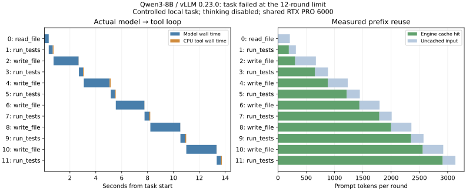
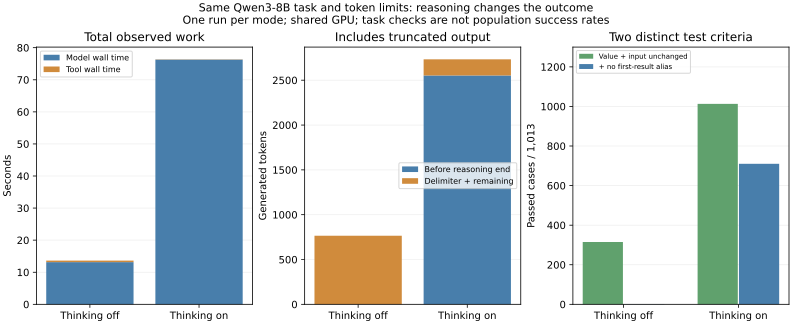

# 3-4 代码Agent的模型、工具与状态（两条真实轨迹）

现有关闭／开启thinking两条实际轨迹。下文“首轮”指关闭thinking的原始失败记录，保留不变；新增对照见“Reasoning对照”。两次使用相同任务、工具、模型、引擎配置、每轮1200输出token和12轮上限。

本目录实际运行Qwen3-8B BF16／vLLM0.23.0的模型—工具循环。模型自己选择读取、修改与运行测试；控制器不替模型修改代码。任务是修复区间合并函数：正确合并嵌套与端点相接的区间，同时不改变输入及其嵌套列表。这是可重复的人工任务夹具，不是生产用户轨迹。

**首轮结果是失败**：12轮预算内，模型读文件1次、改写5次、运行测试6次，仍未修好输入被修改的问题，也未主动提交finish。最后可见测试仅2/6通过；独立测试的返回值／调用后输入不变检查通过315/1013，再加“修改首个输出子列表不影响输入”的额外检查后为1/1013。两层条件分别记录，额外隔离条件不混入原任务通过数。所有失败与重复尝试均保留，不将累计生成token算作成功任务产出。

## 实际时序与缓存

| 记录项 | 本次观察 |
|---|---:|
| 模型调用 | 12轮 |
| 累计输入token，包含多轮重复历史 | 19,556 |
| 引擎报告命中的输入token | 16,304，约83.4% |
| 未命中的输入token | 3,252 |
| 累计输出token | 765 |
| 模型调用墙钟时间之和 | 13.156 s |
| 工具调用墙钟时间之和 | 0.476 s |
| 从首轮准备到最终验证结束 | 13.803 s |

模型墙钟包含引擎调度和交付，不是GPU活跃核时；工具位于同一主机CPU，测试在受限子进程执行。记录中的`tool_parent_cpu_s`只包括父进程，不能当作测试子进程的CPU核时。初始化模型与初始化后基线测试不包含在上述任务时段内，最后一次自动验证包含在完整elapsed中。



前缀缓存开启，命中来自实际`RequestOutput.num_cached_tokens`，没有用文本相似度冒充命中。每轮完整messages、token ID、输出交付事件、引擎metrics、工具输入输出、文件SHA256均保存在`rounds.jsonl`。输入减命中得到的是本轮未缓存部分，不能全部称为新增语义内容。思考模式关闭，没有单独测得的reasoning输出。高命中降低重算机会，但没有纠正代码错误。

## 独立运行

使用Linux环境的vLLM0.23.0／Torch2.11.0+cu130及其Transformers依赖，可复用已有Qwen3-8B本地快照。模型固定revision：`b968826d9c46dd6066d109eabc6255188de91218`。运行需要约模型权重加6GiB KV及工作区的GPU空间，启动显存比例显式设为0.30。原生采样器、greedy、每轮最多1200输出token、最多12轮、eager、关闭异步调度；固定同一请求的缓存身份。

```bash
python run.py --model /path/to/Qwen3-8B/snapshot --output results
python analyze.py
python evaluate.py  # 在Linux执行，CPU/地址空间资源限制与实跑一致
python plot.py     # matplotlib；可在Mac绘图
python verify.py   # 标准Python离线核对交付记录
```

`run.py`要求新目录，自己生成输入文件、可见测试与工作空间，不依赖邻近实验。只有`intervals.py`可修改；工具限于读指定文件、写该文件、运行固定测试及结束。模型生成代码经过AST限制，测试有时间和地址空间上限。独立测试脚本没有提供给模型，采用区间相交图的连通分量作为参考，穷举小区间对并加入固定种子的长列表，避免与常见排序折叠实现逐行重复。

正式运行显式设置启动显存比例及`return_dict=False`，并核对整数token列表；12轮Agent尝试均来自有效生成。本地Mac的地址空间限制接口与Linux不同，因此独立代码测试在远端Linux执行，未绕过限制跑生成代码。

## Reasoning对照

`run_reasoning.py`独立运行同一循环，仅开启模型thinking并按`</think>`分隔工具JSON。实际四轮分别是：输出达到1200上限而没有工具指令、写文件、运行测试、finish。第一轮截断及其返回错误完整保留，没有免费丢弃该轮；模型跳过了提示要求的“先读文件”，此流程偏差单列。

| 观察 | Thinking关闭 | Thinking开启 |
|---|---:|---:|
| 实际轮次 | 12，上限耗尽 | 4，主动结束 |
| 模型墙钟之和 | 13.156 s | 76.294 s |
| 工具墙钟之和 | 0.476 s | 0.078 s |
| 总输出token | 765 | 2733 |
| thinking结束符之前的生成token | 0 | 2553，含截断首轮 |
| thinking结束符／其后token | 0／765 | 3／177 |
| 可见测试 | 2/6 | 6/6 |
| 独立返回值＋调用后输入不变 | 315/1013 | 1013/1013 |
| 加测首个返回子列表无别名 | 1/1013 | 710/1013 |

开启thinking后，原任务的返回值及调用时不修改输入两个要求在所有独立用例中通过；但303个用例中，调用者之后修改返回值会影响输入，说明还未实现完全的可变对象隔离。这里不是把额外测试偷换成原任务失败：`independent-checks-v2.json`明确拆分两层条件，旧的合并统计原样留存。



新增运行与复核（Linux，当前目录）：

```bash
python run_reasoning.py --model /path/to/Qwen3-8B/snapshot --output reasoning-results
python evaluate.py reasoning-results
python compare_reasoning.py
python plot_reasoning.py
python verify_reasoning.py
```

`evaluate.py`现在写`independent-checks-v2.json`，旧合并检查记录未覆盖。新manifest覆盖两份v2报告、reasoning原始轨迹及评价脚本。`compare_reasoning.py`核对引擎配置和首轮任务messages一致，逐token分解输出；2553+3+177=2733，不能将reasoning重复加到总output。历史thinking是否进入后续模板由实际tokenizer处理，每轮实际input ID与命中记录均保留。

本次每种模式只跑一个任务，shared GPU且未交错重复，不据此估计一般成功率，也不把76秒和13秒之比当作同工作量推理速度比较。配置预算相同，实际模型行为、轮数、历史与缓存内容自然不同。

## 剩余范围

两条串行轨迹可作为后续缓存、重试和任务评估的真实输入，但不代表完整Agent基准或一般模型能力。已有满足返回值与调用不变要求的任务记录和reasoning输出计量；仍需更多任务、并行工具／多候选对照、实际KV块驻留与释放记录。关键路径替换与KV预算由计算任务C16负责，本目录不复制其计算；后续复用原始数据时，每个实验应带上独立输入副本和来源哈希。

当前标记部分交付，书中只写本次观察。全书第一轮后的实验增补和论文复核仍需完成。
