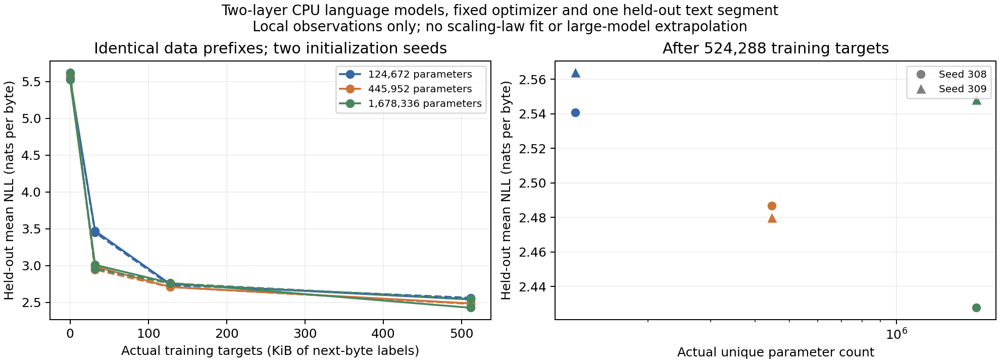

# 3-8：固定文本上的小模型真实训练

六次CPU训练已完成：三个实际参数规模、每个两个初始化seed，每次512次AdamW更新、524,288个next-byte训练目标。24个正式检查点全部重新加载核验，连同smoke共有3261项检查通过；模型参数、梯度、Adam状态与原始逐步日志均已保存。这完成原题的可选局部实训部分，论文点拟合和生命周期费用由另一任务负责，本目录未重复实现。

在这段固定留出文本上，六次训练的损失都低于初始化，但增大模型没有在两个seed下都得到更低损失：seed309的最大模型为2.548 nats/byte，中等模型为2.480。有限训练数据、固定优化器和两个seed不足以支持“参数更大一定更好”、论文指数或大模型外推。

| 实际参数 N | seed | 初始化留出损失 | 524,288目标后损失 | 实际训练运算＋更新墙钟 s |
|---:|---:|---:|---:|---:|
|124,672|308|5.553565|2.540932|3.585|
|124,672|309|5.531342|2.563800|3.615|
|445,952|308|5.596336|2.486777|5.962|
|445,952|309|5.608382|2.479737|5.974|
|1,678,336|308|5.525924|2.427666|10.437|
|1,678,336|309|5.619414|2.548023|10.967|

损失为相同8192个留出目标的平均自然对数交叉熵，越低越好。墙钟只是本机各训练步的实测区间之和，包含forward/backward/optimizer，不包含评估和保存；不是纯算子计时、排他CPU性能或任何GPU对照。总正式任务从启动到退出43.800秒，采样进程树RSS峰值427196416字节。



曲线保留初始化以及32/128/512步全部点，右图圆点为seed308、三角为seed309；没有拟合平滑曲线或挑选最好seed。

## 数据与固定条件

数据来自[作者char-rnn仓库的固定文件](https://github.com/karpathy/char-rnn/blob/6f9487a6fe5b420b7ca9afb0d7c078e37c1d1b4e/data/tinyshakespeare/input.txt)，实际保存1,115,394字节，[来源及完整SHA](data/source.json)随目录交付。使用原始UTF-8字节、词表256；D表示实际训练目标字节数，不是subword token或文档数。没有下载模型权重，模型从固定随机初始化进行真实自回归语言建模训练。

[执行前协议](PROTOCOL.md)固定两层pre-norm causal Transformer、4头、宽度64/128/256、FFN4d、learned position128、共享输入输出embedding、无dropout、CPU FP32。AdamW学习率0.001、betas(0.9,0.95)、eps1e-8、weight_decay0.01、梯度范数裁剪1.0；所有参数采用同样衰减。没有为不同规模调参。

每步8×128目标，训练连续使用相同文本前缀；不同训练块的目标位置不重复，上下文在块边界重置。最大训练目标位置524288。留出从floor(0.9×文件字节数)=1,003,854开始，固定8192目标，与训练前缀不交叠。这是单一连续短片段，文本分布和片段选择限制了泛化结论；没有多文档验证集或测试集调参。初始化seed308/309、六次运行顺序以seed308预先打乱；所有运行采用同一数据顺序。

本机M2 Max、Torch2.14 CPU、intra4/inter1、库线程4，不使用MPS/GPU，Mac没有硬核独占。正式六次串行；独立smoke仅两步／256留出目标，不合入曲线。自身session watchdog限制8GiB RSS／20分钟，只管理自己的进程。所有记录均来自实际运行，没有模拟吞吐或借用其他实验的训练曲线。

## 证据与复现

[run.py](run.py)、[model.py](model.py)、[launch.py](launch.py)与data构成独立执行目录。逐步记录见formal各run下steps.jsonl；完整模型及逐目标损失见checkpoint文件；最终Adam状态／RNG见optimizer-final.pt。环境、执行前源码SHA和数据顺序见[environment.json](formal/environment.json)，汇总见[analysis.json](analysis.json)。训练参数更新不等同于质量提升，两者分别核验和报告。

使用相同已测试Torch2.14 CPU环境，在复制出的新目录运行源码和data；smoke/formal输出名必须不存在：

```sh
python -B launch.py --name smoke --smoke
python -B launch.py --name formal
python -B analyze.py
python plot.py
```

`analyze.py`不重新训练：重新加载smoke与formal所有检查点，复算完整留出损失、检查保存的前128目标完整logits/labels，并用FP64 logsumexp独立验证其交叉熵（2e-6绝对容差）；另检查实际参数数量、训练目标位置、梯度非零且有限、512步Adam状态、参数SHA变化和计时和。原正式重新加载全部逐目标损失与原记录一致。`plot.py`需要Matplotlib，按原始检查点画图；两图面已目视核验。离线脚本会写派生JSON／图，核验封存数据时宜在副本运行。

完整科学记录与复现文件由manifest逐项SHA封存。费用、实际能耗和跨硬件吞吐没有测量，不补零或推算；本结果不证明Kaplan／Chinchilla关系，也不替代由calculations负责的论文数据拟合和预算分析。全书第一轮及最后跨session审计仍未完成。
