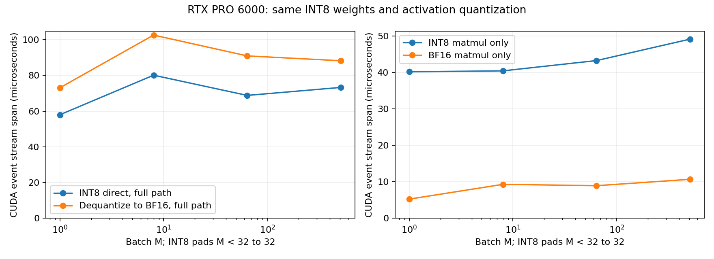

# 4-2 RTX INT8直算与反量化矩阵路径

本子实验实际完成RTX PRO6000 Blackwell、Torch2.11.0+cu130上的两条INT8权重路径。固定随机K2048/N768矩阵，形状来自已有Qwen3-VL-30B-A3B配置，只取形状，不用训练权重。每列权重scale、每行激活scale、对称INT8；一条INT8矩阵乘后scale，另一条每次反量化为BF16后矩阵乘。两者共享同一量化数据，BF16路径有额外舍入。

[Apple 4-bit实测](apple/README.md)使用不同量化格式与计时范围，单独保存，不与此表相除作设备速度比。

## 本次结果

以下为9轮、每轮20次调用的CUDA event stream span中位，单位微秒。每条计时前同步，固定输入并使用预热后的分配器。此时间包含stream上的提交间隙，不等于纯kernel活跃时间。

| batch | INT8完整路径 | 反量化BF16完整路径 | INT8矩阵本体 | BF16矩阵本体 |
|---|---:|---:|---:|---:|
| 1 | 57.96 | 73.05 | 40.20 | 5.26 |
| 8 | 80.09 | 102.56 | 40.45 | 9.31 |
| 64 | 68.78 | 90.89 | 43.27 | 8.94 |
| 512 | 73.25 | 88.18 | 49.17 | 10.70 |

本次直算完整路径中位较低，但INT8矩阵本体调用并未比BF16本体快。完整路径包含激活量化、padding、输出cast/scale；反量化路径还逐次展开权重。常驻BF16矩阵本体不支付每次权重转换，需额外展开存储，不能把它与完整INT8路径冒充相同范围。分离阶段中位不能相加替代整条路径，未定位差异的纯kernel/调度原因，不据本表推算厂商峰值兑现率。

4形状×6阶段×9轮=216条正式样本，每样本20次调用；另有独立数值与插桩轮次。主机墙钟、全部min/max及独立activation quant/pad、weight dequant阶段见results/summary.json。4份Torch profiler原始trace分别记录两条完整路径，含30/31/29/28个kernel事件；这些插桩运行不计入性能样本，不凭API名称推断实际tensor-core类型或传输字节。

## 数值、填充和存储

整数矩阵结果对同一INT8输入/权重的GPU FP64矩阵乘转换参考逐元素精确一致，覆盖全部padded行。整数累加范围在INT32和FP64精确整数范围内。两条完整路径对未量化原FP32矩阵的相对L2均小于预先固定2%门槛，本次最大1.2332%。这只针对随机数值夹具，不代表模型任务质量通过。

每形状保存输入、原权重、量化权重、scale、FP32参考及两输出.pt；整数差异和质量结果在assert前落盘。失败写failure.json并非零退出。根据Torch接口的行数约束，将输入填充到至少32行；M1/8小检查通过后开始正式运行，数值阈值保持不变。

INT8权重1572864 bytes，FP32列scale3072 bytes，BF16展开权重3145728 bytes。M1也需32行量化输入65536 bytes及INT32输出98304 bytes；额外填充计入完整路径。nbytes是实际数组容量，不是实测DRAM流量。脚本同时保留不同表示用于对照，不把它当任一最小部署容量；未采集完整工作区峰值。

## 复现与边界

在独立副本、相同专用Torch环境执行，输出目录存在则拒绝覆盖：

    /home/ubuntu/vllm023-venv/bin/python run.py --smoke --output smoke-new
    /home/ubuntu/vllm023-venv/bin/python run.py --output results-new
    python3 analyze.py --output results-new

默认plot.py绘制已保存results，需Matplotlib。analyze.py验证运行源码SHA、四形状、数值状态、各阶段完整重复与实际trace范围，manifest封存原始数组/trace/日志/代码/图。_int_mm为版本相关私有接口，首先做smoke不能省略。源形状配置摘要与SHA在shape-source.json。

E2E仅指输入与量化权重已驻留GPU后的算子链，不含初始权重量化、H2D、专家路由或模型流程；没有测初始离线打包耗时。量化、转换和矩阵输出逐次创建，allocator可能复用存储，不宣称零分配。无独占后台/频率控制、跨运行置信区间、能耗或真实模型质量证据；该实验整体仍partial。原服务未终止，gpu-after只保留原四服务，后续GPU交接另行安排。calculations未动；最终跨session论文复核仍待首轮全部实验完成。
