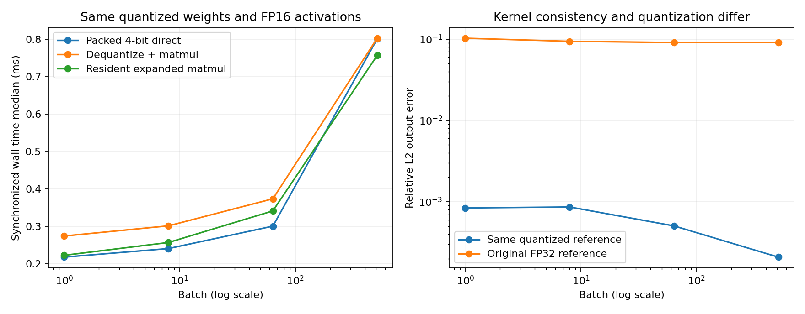

# 4-2 Apple GPU 的两条低比特矩阵路径（实际运行）

Apple M2 Max、MLX/MLX Metal 0.32.2，真实GPU执行4-bit affine量化矩阵乘。随机768×2048权重和batch1／8／64／512激活，group_size64，输入FP16，输出FP16。此夹具不是训练权重、真实专家路由或完整模型。

共26条件，每条件5次预热、30次正式同步计时，共780条正式记录。20份单独数值检查输出全部通过运行前固定门槛；独立解包还原与MLX反量化逐位相同。正式重复用于计时，数值验证在随后单独执行并保存完整输出，没有宣称逐次验证780份输出。

## 结果

以下中位数单位ms，每次建新运算图，并在eval和synchronize完成后停止计时；包含Python调度及GPU同步，不是纯kernel时间。

| batch | 直接4-bit | 反量化+matmul | 常驻展开matmul | 激活转换+直接4-bit | 激活转换+反量化+matmul |
|---:|---:|---:|---:|---:|---:|
| 1 | 0.218 | 0.274 | 0.223 | 0.230 | 0.269 |
| 8 | 0.241 | 0.302 | 0.257 | 0.263 | 0.312 |
| 64 | 0.301 | 0.374 | 0.342 | 0.323 | 0.397 |
| 512 | 0.802 | 0.803 | 0.757 | 0.837 | 0.831 |

小batch下直接路径较低，大batch512相对每次反量化路径的中位差仅约0.002ms，不能认为仍有稳定优势。常驻展开省去重复反量化，但需要额外展开权重容量。不同路径的max也保留在summary.json，不把单次异常删掉或据此改阈值。

离线quantize（打包及scale/bias生成合并API）中位0.325ms；单独dequantize为0.244ms；激活转换随batch为0.202／0.205／0.205／0.227ms。没有独立测到内部scale生成kernel，不能将合并API拆造内部阶段时间。单独阶段包含各自同步开销，不能把这些中位数相加代替实际端到端路径。



## 精度和存储

quantized_matmul、每次反量化matmul、常驻展开matmul以及两条带转换路径均与相同FP16反量化权重和FP16激活的CPU NumPy FP64矩阵乘参考比较，逐元素固定atol=.01、rtol=.01，20/20通过。独立用uint32的每4-bit nibble解包、FP32 scale/bias运算再舍入FP16，与MLX反量化数组最大误差为0。

直接路径相对同量化参考的relative L2为0.00021–0.00086；对原FP32夹具参考则约0.091–0.102。后者包含权重量化、输入舍入及计算误差，不能混同于kernel一致性。没有模型质量门槛或模型评测；通过同量化参考不等于量化后任务质量合格。各batch的max_abs、RMSE和relative L2全部在quality.json中。

768×2048权重packed数据786432 bytes，scales和biases各49152 bytes，合计884736 bytes；FP16展开矩阵3145728 bytes。实际nbytes分别记录在environment.json。此脚本同时保留原权重、展开权重和输入，以便公平复用及验证，不能把本进程active memory当成“只装直接路径”的最小驻留。

每条timings.jsonl另有MLX active_before/after、peak与cache计数。直接路径batch1/8/64/512的峰值相对active_before中位增量分别1536／12288／884736／786432 bytes；每次反量化+matmul分别3147264／3354624／3637248／7077888 bytes。这是框架分配器记录，含临时数组与输出，并非物理GPU总内存或系统RSS。没有根据数组字节数推算带宽冒充实测。

## API依据与独立运行

已核对安装版本自身docstrings并完整保存installed-api.txt。官方接口说明：[quantize](https://ml-explore.github.io/mlx/build/html/python/_autosummary/mlx.core.quantize.html)、[quantized_matmul](https://ml-explore.github.io/mlx/build/html/python/_autosummary/mlx.core.quantized_matmul.html)、[dequantize](https://ml-explore.github.io/mlx/build/html/python/_autosummary/mlx.core.dequantize.html)。本实验显式设置affine、4bit、group64、transpose=True和GPU设备；不是依赖未记录默认量化模式。

运行前固定协议在PROTOCOL.md，小检查在probe.py/probe.json。完整输入、打包权重、scale/bias、MLX展开权重和各路径输出分别保存于inputs.npz和outputs.npz；独立解包结果另存。run.py哈希绑定environment.json，analyze.py可离线从原始输入重新计算参考和统计，数值失败写入quality.json，不会放宽门槛后重试。

```bash
# 在新复制的目录运行，保留封存原件，results必须不存在。
python3 -m venv .venv
.venv/bin/pip install -r requirements.txt
.venv/bin/python probe.py
.venv/bin/python run.py
.venv/bin/python analyze.py
# 绘图另装matplotlib，本次用3.10.6。
python3 plot.py
```

本次Python3.14.7、macOS26.6.2；隔离安装未修改共享依赖，未访问RTX GPU或calculations。预热排除了首次编译，正式记录为单进程单轮测量中的交错重复，不包含跨进程冷启动和独立多轮置信区间。没有固定GPU频率、独占主机后台或测功率，不能外推真实模型吞吐、总能耗或另一设备路径的速度比。4-2仍需其他硬件与真实模型矩阵范围的核验。
