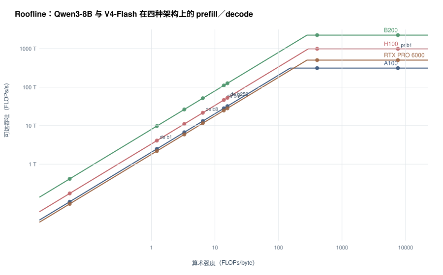

# 实验 4-5 结果：batch 与架构性能

## 真实组合下的算术强度与主导资源

| 模型 | 阶段 | batch | 算术强度 | H100 脊点 | A100 | H100 | B200 | RTX PRO 6000 |
| --- | --- | ---: | ---: | ---: | --- | --- | --- | --- |
| deepseek-v4-flash | decode | 1 | 0.1 | 295.3 | 访存 278.93 ms | 访存 169.77 ms | 访存 71.09 ms | 访存 317.38 ms |
| deepseek-v4-flash | decode | 64 | 3.3 | 295.3 | 访存 281.22 ms | 访存 171.17 ms | 访存 71.68 ms | 访存 319.99 ms |
| deepseek-v4-flash | prefill | 1 | 406.4 | 295.3 | 计算 740.79 ms | 计算 233.60 ms | 计算 102.72 ms | 计算 458.76 ms |
| qwen3-8b | decode | 1 | 1.2 | 295.3 | 访存 8.02 ms | 访存 4.88 ms | 访存 2.04 ms | 访存 9.12 ms |
| qwen3-8b | decode | 8 | 6.4 | 295.3 | 访存 12.16 ms | 访存 7.40 ms | 访存 3.10 ms | 访存 13.84 ms |
| qwen3-8b | decode | 64 | 13.8 | 295.3 | 访存 45.35 ms | 访存 27.60 ms | 访存 11.56 ms | 访存 51.60 ms |
| qwen3-8b | decode | 256 | 15.8 | 295.3 | 访存 159.12 ms | 访存 96.85 ms | 访存 40.56 ms | 访存 181.06 ms |
| qwen3-8b | prefill | 1 | 7582.0 | 295.3 | 计算 428.19 ms | 计算 135.03 ms | 计算 59.38 ms | 计算 265.17 ms |

## 单因子改动：只改矩阵吞吐 / 只改存储带宽（H100）

| 模型 | 阶段 | batch | 真实组合 | 矩阵吞吐减半 | 存储带宽减半 |
| --- | --- | ---: | ---: | ---: | ---: |
| deepseek-v4-flash | decode | 1 | 169.77 ms | 169.77 ms | 339.55 ms |
| deepseek-v4-flash | decode | 64 | 171.17 ms | 171.17 ms | 342.34 ms |
| deepseek-v4-flash | prefill | 1 | 233.60 ms | 467.20 ms | 339.55 ms |
| qwen3-8b | decode | 1 | 4.88 ms | 4.88 ms | 9.76 ms |
| qwen3-8b | decode | 8 | 7.40 ms | 7.40 ms | 14.81 ms |
| qwen3-8b | decode | 64 | 27.60 ms | 27.60 ms | 55.20 ms |
| qwen3-8b | decode | 256 | 96.85 ms | 96.85 ms | 193.70 ms |
| qwen3-8b | prefill | 1 | 135.03 ms | 270.05 ms | 135.03 ms |

## 非矩阵工作（不折算成矩阵吞吐）

| 模型 | 阶段 | batch | 标量 GFLOPs | 特殊函数原语次数 |
| --- | --- | ---: | ---: | ---: |
| deepseek-v4-flash | decode | 1 | 0.66 | 8.718e+06 |
| deepseek-v4-flash | decode | 64 | 42.26 | 5.58e+08 |
| deepseek-v4-flash | prefill | 1 | 5410.71 | 7.215e+10 |
| qwen3-8b | decode | 1 | 0.04 | 2.929e+07 |
| qwen3-8b | decode | 8 | 0.34 | 2.343e+08 |
| qwen3-8b | decode | 64 | 2.71 | 1.875e+09 |
| qwen3-8b | decode | 256 | 10.83 | 7.499e+09 |
| qwen3-8b | prefill | 1 | 191.92 | 1.626e+11 |

