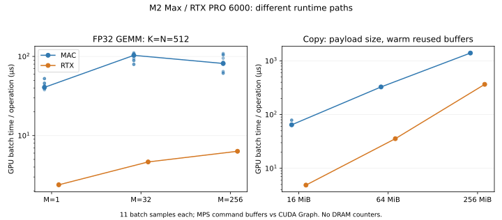
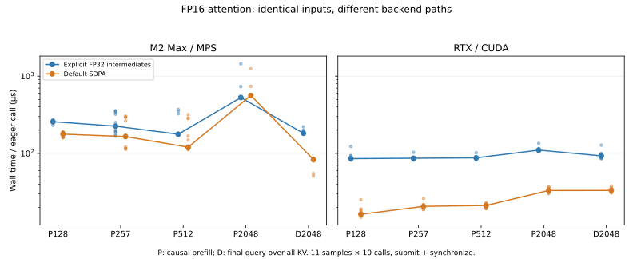
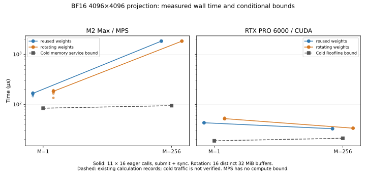

# 4-6 Mac 与 RTX：矩阵、复制与注意力测量（第一轮测量交付）

同一 FP32 输入在 M2 Max 的 MPS 与 RTX PRO 6000 Blackwell 的 Torch/CUDA 路径上实际执行。矩阵逐元素对照 FP64，复制逐字节核验，全部通过。本目录已补注意力切片，见下文；指定昇腾论文算子记录已补，见[公开记录](paper/README.md)；形状／接口精度匹配的投影对照已补，见末节；RTX缓存与执行路径实证见末节；Mac内部路径仍有明确限制。

| 测量 | M2 Max GPU 中位数 µs | RTX GPU 中位数 µs |
|---|---:|---:|
| GEMM M=1 | 40.712 | 2.386 |
| GEMM M=32 | 103.307 | 4.643 |
| GEMM M=256 | 81.541 | 6.333 |
| 复制 16 MiB | 64.513 | 4.872 |
| 复制 64 MiB | 327.175 | 35.611 |
| 复制 256 MiB | 1398.538 | 365.496 |



矩阵 K=N=512；固定整数生成器构造两端相同的二进制有限小数输入。该输入的乘积与累加范围可精确表示，最大误差为零并不证明一般 FP32 输入都无舍入误差。RTX 禁用 TF32，Mac 使用 MPSMatrixMultiplication `.float32`。

Mac 每批编码50次乘法或20次复制，再提交同一 Metal command buffer；RTX 捕获相同次数操作的 CUDA Graph 后回放。各11个正式批次；预热次数见独立源码。GPU 时间取整个批次时间除以操作次数，包含该批次内部间隙，不是单 kernel 时间。Mac 墙钟含编码、提交和等待，RTX 墙钟不含图构建，因此墙钟不能直接解释为硬件差异。形状顺序固定、未进行跨轮交错，M=32 比 M=256 慢的现象尚未完成路径归因；不据此推广单调关系或稳定速度比。

复制在预热复用的源、目的缓冲区之间进行。Mac 为共享存储 Metal blit，RTX 为设备张量 copy；不是主机到设备传输。256 MiB 载荷速率分别191.94与734.44 GB/s；这是载荷字节除以 GPU 时间。逻辑读写字节可记为两倍载荷，但没有实际 DRAM/L2 计数器，尤其较小缓冲区可能命中缓存，不能把速率当成外存带宽。GPU 有其他驻留服务，不是独占运行。

## 复现与产物

在 Mac 本目录执行（输出目录必须不存在）：

```sh
swiftc -O -framework Metal -framework MetalPerformanceShaders mac.swift -o mac-runner
./mac-runner results/new-mac
```

在具有 Torch/CUDA 的 RTX 主机本目录执行：

```sh
python3 rtx.py --output results/new-rtx
```

分析与离线验证无需 GPU；绘图需 matplotlib：

```sh
python3 analyze.py
python3 plot.py
python3 verify.py
```

默认分析读取封存的 `results/mac` 与 `results/rtx`，重跑使用新目录并单独比较，不覆盖原记录。各端 environment.json 保存设备与接口口径。Mac build.json 在本轮运行后记录编译命令、工具版本和源码／二进制哈希；未声称它是运行前的签名。raw-manifest.json 封存源码、环境和原始测量，verify.py 校验哈希、配置覆盖、样本、数值检查记录与摘要。分析脚本不重复计算任务的理论预测。

## 注意力补测

两端均使用 Torch 2.10 和同一 FP16 Q/K/V，形状 B=H=1、D=128，四个 causal prefill 长度128/257/512/2048，以及2048长度上的最后一个 query。decode允许访问全部已存在的KV，因此该调用显式使用 `is_causal=False`。输入、输出和CPU FP64参考张量均保留在各端 `tensors.npz`，不只是保存“通过”标记。

| 形状 | MPS显式链 µs | MPS默认SDPA µs | CUDA显式链 µs | CUDA默认SDPA µs |
|---|---:|---:|---:|---:|
| prefill 128 | 257.442 | 177.700 | 85.576 | 16.327 |
| prefill 257 | 225.421 | 165.188 | 86.557 | 20.646 |
| prefill 512 | 177.200 | 120.475 | 87.619 | 21.223 |
| prefill 2048 | 529.142 | 562.992 | 110.410 | 33.139 |
| decode 2048 | 182.354 | 83.217 | 92.911 | 33.208 |



以上为**含主机提交和设备同步的墙钟中位数**，不能与前表 GPU command buffer/event 时间拼接。每路径预热5次；每形状11轮，每轮随机路径顺序，各执行10次eager调用。形状顺序固定，较小形状仍可能有较高主机开销，图保留所有离群样本，不作独占机器或跨轮稳定速度比声明。

显式链把Q/K/V提升到FP32完成score、softmax和value乘法，再转回FP16；默认SDPA输入输出FP16，内部算法由后端选择。512长度的CPU profiler记录显示Mac选择 `aten::_scaled_dot_product_attention_math_for_mps`，RTX选择 `aten::_scaled_dot_product_flash_attention`。这证实该形状的调度路径，不等于GPU kernel trace，也不证明其他形状内部完全相同。不能将差异全归于芯片，更不能将Mac这条math路径当成优化Metal attention的性能上限。未开启MPS CPU fallback。两种路径的中间精度和物化策略不同，比较的是可运行实现组合。

全部20份输出对CPU FP64参考通过预先设定的 `atol=.002, rtol=.01` 检查，最大绝对误差低于0.000288。每端四个prefill的未来V扰动不改变前半段输出，因果检查通过。离线分析另外用NumPy显式FP64 softmax重新计算参考，核对双端输入逐字节一致，并验证decode参考等于完整prefill参考的最后一行。固定合成输入不是模型质量测试，不能替代真实Q/K分布、更多头数、极端值或长上下文测试。

独立复现（本目录，输出目录必须不存在；Mac环境为Python3.12＋torch2.10.0，完整包版本见记录）：

```sh
python3 attention.py --device mps --output results/new-attention-mps
# RTX主机使用相同源码
python3 attention.py --device cuda --output results/new-attention-cuda
python3 analyze_attention.py
python3 plot_attention.py
python3 verify_attention.py
```

离线分析／验证需NumPy，绘图需matplotlib；验证无需Torch或GPU。原矩阵／复制的raw-manifest保持不变，注意力新增文件独立封存在attention-manifest。PNG／SVG／PDF均已生成，PNG已目视检查。两端本轮进程正常结束，未停止任何原有GPU服务。现在矩阵、复制和注意力均有实际测量，**匹配投影对照见末节，缓存与内部路径限制单列**；昇腾论文记录见[独立分析](paper/README.md)。`results/prediction-compatibility.json`只读封存设备匹配的4个预测条件：其BF16 Q投影为K=N4096，现有FP32小矩阵为K=N512，且预测假设冷内存，与预热复用不同。原小矩阵不可直接与其相除解释效率；末节已新增匹配形状的测量，不重复计算任务。

## 与现有Q投影预测匹配的BF16测量

补测 K=N=4096、M=1/256，输入输出BF16、beta=0，与封存预测的形状和接口精度匹配。输入为可复现合成张量，不是读取Qwen权重的模型质量测试。CUDA关闭BF16 reduced-precision reduction；MPS接口未提供独立的内部累加精度证明，因此不宣称它的实现完整满足预测中的FP32累加合同。

每个设备各分配16个独立32 MiB权重缓冲区，内容相同、地址不同。复用组每次访问第0份；轮换组依次访问全部16份，共512 MiB。各路径预热3批，然后11轮随机路径顺序，每批16次eager GEMM。输入／权重已上传，墙钟只计提交、执行和同步，不含CPU参考、初始化或数据上传。

| M | Mac复用／轮换墙钟 µs | RTX复用／轮换墙钟 µs | Mac内存服务下界 µs | RTX Roofline下界 µs |
|---|---:|---:|---:|---:|
| 1 | 165.987 / 182.651 | 42.918 / 51.866 | 83.927 | 18.734 |
| 256 | 1835.375 / 1835.224 | 32.649 / 33.478 | 94.372 | 21.065 |



下界直接读取本目录此前封存的计算结果；未重跑或修改计算任务。Mac预测没有匹配的算力峰值，只提供内存服务下界，不能称为完整Roofline。图中的虚线对应冷内存各读取一次假设；实测没有DRAM计数器，不能把16地址轮换等同于已经证实的冷内存。CUDA event批次时间也已保存，但同样含主机提交造成的执行间隙。

本批所有墙钟中位数高于相应条件式下界；这并不验证下界对任意缓存状态都适用，也不能通过相除取得“硬件利用率”。RTX M=1轮换组较慢、M=256两组接近，与缓存复用影响随形状变化的解释相容，但还缺实际缓存流量与kernel路径来确定归因。Mac M=256远高于仅内存服务下界，说明该单一约束不足以预测完成时间；不能因此宣称内存没有作用，或将差距全归于某一个单元。保留提交、路径、缓存和内部精度的未决项。

运行时每形状检查全部16个权重缓冲区，共64份输出检查，通过预设`atol=.01, rtol=.01`的FP64参考要求。原始NPZ保存完整激活、权重、FP64参考和第0/15份权重的输出；离线NumPy重新计算，双端输入逐字节一致。最大绝对误差0.0625，不是零误差；相对容差与BF16输出条件同时报告。两端进程正常结束，无GPU服务清理。

在本目录复现（Torch和NumPy；输出目录须不存在）：

```sh
python3 projection.py --device mps --output results/new-projection-mps
# RTX主机
python3 projection.py --device cuda --output results/new-projection-cuda
# 离线分析需NumPy；绘图另需matplotlib
python3 analyze_projection.py
python3 plot_projection.py
python3 verify_projection.py
```

`projection-manifest.json`封存源码、日志、张量、环境及预测快照，原矩阵／注意力清单不变。已完成形状与接口精度匹配后的限定对照；该阶段未验证严格冷内存／GPU执行路径与MPS内部累加；随后RTX计数器证据及修正结论见末节。

## RTX实际DRAM/L2与执行路径

新增Nsight Compute 2026.2.1四份原始报告，目标输入与正式投影测量逐项哈希一致。目标均为第0份权重：先预热10次，再执行15个前驱GEMM；复用组前驱访问第0份，轮换组访问第1–15份，最后只捕获一次第0份计算。采用application replay、cache-control none、clock-control none，不强制清缓存。下表为目标调用各kernel计数之和，单位为**实际字节**，不是逻辑张量字节估算。

| M / 前驱访问 | DRAM读取 B | DRAM写入 B | L2请求 B | kernel数 |
|---|---:|---:|---:|---:|
| 1 / 复用 | 33,554,688 | 404,224 | 34,372,832 | 1 |
| 1 / 轮换 | 33,554,688 | 0 | 34,372,832 | 1 |
| 256 / 复用 | 256 | 510,464 | 154,094,336 | 2 |
| 256 / 轮换 | 33,607,936 | 3,072 | 154,094,336 | 2 |

**这组证据修正了仅凭耗时提出的缓存解释。** M=1两种前史的DRAM读取相同，所以常规计时的差值不能直接归于权重命中率。M=256复用与轮换的DRAM读取才有明显差异；L2请求量保持相同也表明L2请求与外存传输不是同一指标。单次计数器捕获不是重复分布，不能将差值推广为精确稳定收益。

实际kernel名称记录显示M=1进入cuBLAS GEMV；M=256进入`cutlass_80_tensorop_s16816gemm_bf16_128x128_32x4_nn_align8`及`cublasLt::splitKreduce_kernel`。设备是SM120，这个kernel符号不能被解释成“机器变成SM80”，也不能仅凭设备峰值假定选中了最理想的新架构算子。投影资源下界未计split-K中间流量与第二次执行；当前路径证据解释了为什么形状和接口精度匹配仍不足以预测整段执行。

采样期DRAM写入可能包含此前脏缓存行的回写，零写入不等于没有输出。轮换M=256的读取约为一份权重，但并非所有输入输出都严格冷读写一次；因此仍不宣称验证了完整冷内存合同。计数器kernel耗时受采集影响，留在JSON中，不替代11轮常规墙钟。Mac没有对应硬件计数器证据；MPS内部累加机制的限制继续保留。

采集需现有Nsight Compute及GPU计数器权限，本环境沿用已授权的`sudo -n`，不修改驱动设置。可在RTX本目录运行：

```sh
python3 collect_counters.py --ncu /path/to/ncu --output results/new-projection-counters
python3 analyze_counters.py
python3 verify_counters.py
```

默认离线分析读取封存的`results/projection-counters`；CSV包含metric单位，分析验证单位和源文件、输入哈希。采集脚本拒绝已有输出目录，避免重复覆盖。原始`.ncu-rep`、CSV、日志和collection.json均封存于counter-manifest。全部采集正常结束，未停止其他GPU服务。

4-6现已交付第一轮要求的小矩阵、复制、注意力、匹配投影预测对照和指定昇腾记录。上述测量限制不隐藏，也不扩张为尚未完成的完整模型或三家硬件同条件复现；最终仍须参加全书第一轮结束后的跨session增补复核。
