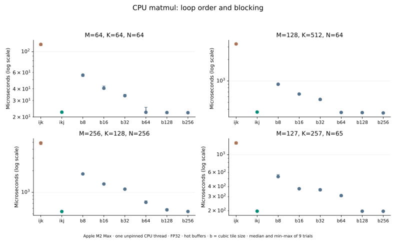

# 实验 5-1：矩阵循环与分块实测

已在本地 Apple M2 Max 上运行。对同一行主序 FP32 矩阵乘比较 `i-j-k`、`i-k-j` 和 `ii-jj-kk-i-k-j` 分块，检查循环顺序与块大小在真实 CPU 上的影响。每项输出都与独立 FP64 参考逐元素校验。

本目录只交付实际执行部分；实验的逻辑访问计数、Qwen3 大矩阵容量与 bank 模型由 `calculations/` 的 C25 工作包负责，不复制其实现。小矩阵 CPU 时间不用于宣称 Qwen3 GPU 性能。

## 独立运行

需要 Python 3 标准库和 Clang 或 GCC，无 NumPy／BLAS／GPU 依赖。可从任意工作目录执行：

```bash
python3 run.py
python3 verify.py
# 可选绘图，需要 matplotlib==3.10.6
python3 plot.py
```

`CC` 可选择其他编译器。脚本按自身路径查找 `matmul.c`，所有产物写入自身的 `results/`；无需先运行任何相邻实验。换编译器／CPU 后会重测，不能期待相同时间。

## 实测结果

| M×K×N | i-j-k | i-k-j | 32 分块 | 256 分块 |
|---|---:|---:|---:|---:|
| 64×64×64 | 119.87 μs | 22.52 μs | 33.81 μs | 22.21 μs |
| 128×512×64 | 3,309.50 μs | 365.59 μs | 550.39 μs | 355.29 μs |
| 256×128×256 | 4,870.67 μs | 540.11 μs | 1,107.54 μs | 540.59 μs |
| 127×257×65 | 1,398.30 μs | 198.21 μs | 365.46 μs | 197.70 μs |



把内层改为沿连续的 j 方向访问后，这四组小矩阵快约 5.3–9.1 倍。继续拆成小块没有带来额外收益；32 分块反而比未分块 `i-k-j` 慢。较大的块逐渐接近原循环，最小中位数之间的小差别不宜宣称稳定胜负。

本次没有观察到明确的“换形状后换成更小块最优”。在所测矩阵和 8–256 范围内，最佳分块常接近整行／整矩阵宽度，不能由此给大矩阵推荐 256。分块的循环与边界开销、连续访问和向量化都在起作用；本实验没有缓存 miss 计数器，不能把时间差单独归因于某级缓存容量。

## 测量方法与限制

- 本地 Apple M2 Max，单 CPU 线程，线程不绑核，机器同时运行其他任务。未控制频率，未证明在性能核独占运行。系统、编译器完整版本保存在 `results.json`。
- `-O3 -std=c11 -ffp-contract=off`；不使用 fast-math 或多线程 BLAS。`compiler.log` 保存向量化诊断，`matmul.s` 保存实际 ARM 汇编。三种循环均由编译器处理，不把源码循环数当机器指令数。
- 固定种子、四种形状（包括非整除尾块），FP32 计算对照 FP64 累加，容差 `atol=1e-4, rtol=1e-5`。每个候选先检查全部输出；失败立即退出，不输出成功结果。
- 预热后校准每轮约 15 ms，9 轮内随机排列 8 个候选，保存所有 288 个样本。时间包含清零输出，输入与缓冲重复使用，不主动刷新缓存。输出被读取以避免无用计算消除。
- 每个候选使用完整输入输出；`blocked` 的 tile 超出某个维度时截断。因而小矩阵的大块可能退化为接近未分块循环，这也是大块之间差异较小的原因。

`provenance.json` 校验源码、原始数据、结果及编译记录。离线 `verify.py` 只检查记录完整性；真正数值验证随 `run.py` 中的程序执行，不把离线检查冒充再次实跑。
