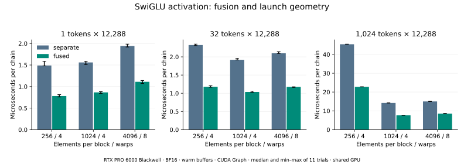

# 实验 5-2：融合的流量与资源占用

已在 RTX PRO 6000 Blackwell 上运行。选择 Qwen3-8B FFN 中的 SiLU→逐元素乘链，宽度 12,288；输入为固定种子的随机 BF16 激活，不加载模型权重。比较两个 Triton kernel 与一个融合 kernel，保持中间 BF16 舍入语义相同。

本目录独立运行，不读取其他实验或 `calculations/` 的运行产物。容量模型与选做 FIFO／布局算例由 `calculations/` 维护，本实验只附实测所需的张量字节计数。

## 运行

环境：Linux、CUDA GPU（实测 SM120）、Python 3、PyTorch 2.10.0+cu128、Triton 3.6.0。绘图另需 Matplotlib 3.10.6。

```bash
python3 run.py
python3 plot.py
```

可从任意工作目录用脚本绝对路径执行，默认产物写入本目录 `results/`。`--out` 可另存一次测量，`--trials` 与 `--repeats` 控制重复次数。GPU 环境的 PyTorch 需使用对应 CUDA 构建；`requirements.txt` 记录版本，不替代 CUDA 环境安装。

## 结果

以下采用同一 block=1024、4 warps，比对相同调度参数，时间为图重放每条链的中位数。

| token 数 | 分离执行 | 融合执行 | 加速比 |
|---:|---:|---:|---:|
| 1 | 1.560 μs | 0.865 μs | 1.80× |
| 32 | 1.920 μs | 1.036 μs | 1.85× |
| 1,024 | 14.199 μs | 7.679 μs | 1.85× |



1,024-token 情况减少一份 24 MiB 的中间张量；逻辑接口读写从 120 MiB 降至 72 MiB。该参数下融合内核使用每线程 27 个寄存器，分离的两个内核分别为 25、22 个；三者 shared memory 与 spill 均为零。寄存器不能跨两个顺序执行的 kernel 相加。

256／1,024／4,096 元素块均已测量。小张量采用 256 元素块较快；1,024-token 张量采用 1,024 元素块较快。最大块并未胜出，单纯扩大每块工作量不能保证收益。这次测得融合在所有已覆盖形状中更快，没有测到融合亏损的反例。

## 计时与边界

- 每种形状先编译、校验与预热 20 次；11 轮随机排列候选，每轮 100 次调用，保留全部时间样本。
- 同时记录普通 Python 提交和 CUDA Graph 重放。普通提交的 CUDA event 区间包含 CPU 来不及提交导致的设备空闲，不能全部解释成 kernel 时间。图重放预先捕获 100 次调用，再测一次重放并除以 100；捕获成本不在稳态时间里。
- `first_call_ms` 包含首次调用、可能发生的编译／缓存读取及同步，只是环境记录，不能当作纯编译成本。
- 重用固定缓冲，不刷新 L2。此卡 L2 为 128 MiB，因此逻辑接口字节不能当作实测显存流量，也不能用这组数据推整卡 DRAM 带宽。没有硬件流量计数器记录。
- GPU 是共享设备，其他服务未停止；无锁频或独占保证。原始记录保留测量前后显存、利用率、温度、功率与时钟快照。这些快照不能证明整个窗口无干扰。
- `required_tensor_bytes` 是实现所需输入、输出和中间张量的存活字节；交错计时程序还持有验证张量及另一条路径的缓冲，不能把该字段当作进程显存峰值。

## 正确性与可追溯性

对独立 PyTorch FP32 SiLU、BF16 中间舍入参考校验全部性能候选，容差 `rtol=0.016, atol=0.002`。另用长度 1／257／12,289、gate 范围 −40 到 40 检查尾块与大幅值，并要求两种 Triton 路径逐位相同。这只覆盖有限数值与本链，不证明完整 Qwen3 生成质量。

`results.json` 保存环境、18 个性能候选、每轮样本、9 项边界检查及寄存器／共享内存／spill；三份 PTX 保留融合内核的生成代码。`provenance.json` 对运行脚本及原始结果做 SHA256 记录，`verify.py` 离线检查哈希与测量完整性。

本结果证明当前链和形状下的局部收益，模型级请求加速留给实验 5-9。
