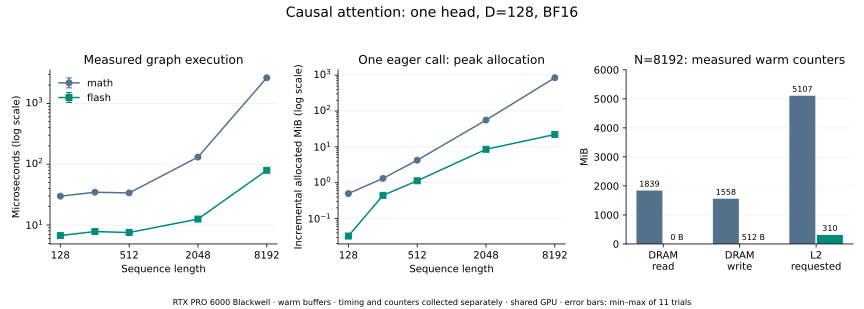

# 实验 5-3：实际 attention 后端的时间与访问

已在 RTX PRO 6000 Blackwell 上运行 PyTorch 的数学后端与 FlashAttention 后端，固定 BF16 输入输出、因果注意力、batch=1、单头、head_dim=128。五种长度覆盖短输入、非整除长度与 8192-token 历史；同时保留数值验证、峰值分配、普通调用／图执行时间和 Nsight Compute 硬件计数。

本目录负责实际 GPU 实验。在线 Softmax 小程序、三种 tile 的访问／缩放计数、预取槽和容量模型归 `calculations/` 的 C27，不重复实现。这里的实测不等同于该教学模型的 304／204 MiB 接口计数。

## 独立运行

需要 Linux CUDA GPU、PyTorch 2.10.0+cu128；绘图另需 Matplotlib 3.10.6。计数器采集使用 Nsight Compute 2026.2.1（包版本 2026.2.1.5-1，CLI 报告 2026.2.1.0）。

```bash
python3 run.py
NCU=/path/to/ncu python3 profile.py
python3 analyze.py
python3 plot.py
python3 seal.py
python3 verify.py
```

RTX 的驱动限制普通用户访问计数器；本次使用已有的免密 sudo，仅将采集命令改为 `NCU=/path/to/ncu python3 profile.py --sudo`。没有修改驱动的权限开关、锁频或停止原有服务。无计数器权限的机器仍可执行 `run.py`，但不能据此声称完成硬件流量采集。

`bash setup_ncu.sh /your/private/tool-directory` 从固定 NVIDIA CUDA 仓库地址下载包，核验 SHA256 后私有解压，不安装或更换系统驱动。脚本打印 `NCU` 路径。本次远端路径是 `/home/ubuntu/ai-infra-book-experiments/tools/ncu/extracted/opt/nvidia/nsight-compute/2026.2.1/ncu`。

所有输入和产物路径相对于本实验目录，不依赖其他实验。默认 11 轮、每轮 10 次调用；可用 `--trials`／`--repeats` 修改。`profile.py --resume` 仅用于同一未改动源码的采集中断后续接，不可用来复用旧版本报告。

## 时间与分配

以下为 CUDA Graph 内重复执行的每次 attention 中位数；图只减少主机提交干扰，两个后端都使用同一模式。

| 长度 | 数学后端 | Flash 后端 | 数学后端新增分配峰值 | Flash 新增分配峰值 |
|---:|---:|---:|---:|---:|
| 128 | 29.81 μs | 6.70 μs | 0.500 MiB | 0.033 MiB |
| 257 | 34.56 μs | 7.80 μs | 1.324 MiB | 0.445 MiB |
| 512 | 33.67 μs | 7.51 μs | 4.251 MiB | 1.136 MiB |
| 2048 | 131.03 μs | 12.52 μs | 56.002 MiB | 8.571 MiB |
| 8192 | 2642.23 μs | 79.48 μs | 848.008 MiB | 22.188 MiB |



长序列下，避免完整分数／概率矩阵的路径显著减少分配与执行时间。这个对照同时改变物化、内部中间精度与执行路径，不是只删除一次写回的单因素实验。输入输出同为 BF16，不能推断内部格式和舍入完全相同。

8192 长度的原始记录显示 Flash 路径实际运行 `flash_fwd_splitkv_kernel` 和 `flash_fwd_splitkv_combine_kernel` 两个 kernel，仍有部分结果及合并工作区。数学路径为 20 个 kernel，包含转换、掩码、归约和矩阵运算。不能由 FlashAttention 名称推断只有一个 kernel 或不需要中间空间。

峰值数字是在 Q/K/V 已驻留、后端已预热后，一次 eager 调用的 **PyTorch allocated 增量峰值**，包含输出及后端临时分配；不含输入、不等于缓存 allocator 的 reserved，也不代表进程或整个 GPU 的总显存。图执行的私有内存池另有寿命，未用该峰值冒充其总开销。

## 硬件计数与缓存

六份原始 `.ncu-rep` 覆盖长度 512／2048／8192 的两个后端。Nsight 从一次 eager 调用的所有 kernel 中收集 DRAM 读／写字节与 L2 请求字节；每次调用前执行五次预热。使用 application replay，`cache-control=none`、`clock-control=none`；没有每个 kernel 前清缓存，也没有将计数器采集时间当作无分析器性能。

8192 长度的本次计数：

| 后端 | DRAM 读 | DRAM 写 | L2 请求字节 |
|---|---:|---:|---:|
| 数学 | 1,928,538,880 B | 1,633,547,776 B | 5,355,065,824 B |
| Flash | 0 B | 512 B | 324,883,680 B |

Flash 的零 DRAM 读取是**热缓存、采样 kernel 范围内**的记录。其 Q/K/V 可留在该卡的 L2 中，L2 仍处理约 310 MiB 请求；输出或临时缓存行的后续写回也可能发生在采样 kernel 之后。这不表示算法不读数据，不能推广成冷启动 DRAM 流量，更不能将零字节换算成带宽结论。

实际 metric 为 `dram__bytes_op_read.sum`、`dram__bytes_op_write.sum`、`lts__t_bytes.sum`、`gpu__time_duration.sum`，名字按所装版本的设备查询核对。`analyze.py` 核验 CSV 的 byte／ns 单位，逐 kernel 求和；L2 是请求字节，不将它称作外部显存读写。

尚未采集 shared-memory 指令、矩阵与 Softmax 的逐阶段周期；不把现有 DRAM/L2 记录解释成这些指标。全模型 GQA、并发请求和服务性能也不在本次单头范围内。

## 正确性与测量边界

- 强制 `SDPBackend.MATH` 或 `SDPBackend.FLASH_ATTENTION`，不允许悄悄回退到别的后端；原始计数器报告的 kernel 名称再次确认真实执行路径。
- 独立参考显式执行 FP32 QKᵀ、因果 mask、Softmax 和乘 V，禁用 TF32。五种长度的 eager 与捕获输出均用 `rtol=0.02, atol=0.008` 校验，初始测试最大绝对误差约 0.00764。
- 另对长度 1／17／129、Q/K 缩放 0／1／6 的两种后端执行 18 项检查，容差为 `rtol=0.03, atol=0.016`；每例首个因果位置还要求与 V 的首行逐位相同。最大绝对误差约 0.00775。不会把容差通过写成所有输出逐位相同。
- 每种长度重置种子 `503+length`，计时与计数器进程使用同一输入。无分析器计时中，每轮随机排列 eager／图与后端组合，保存全部样本。普通调用包含 Python 后端上下文设置和提交间隙；小张量应结合图计时阅读。
- GPU 与原有服务共享，未锁频或保证独占，保留运行前后显存、温度、功率、利用率与时钟。当前形状的输入重复使用，不主动冲刷缓存。不能把这组结果直接当作完整 Qwen3 模型或另一设备的加速比。

## 原始证据

`results.json` 保存 10 组时间／分配配置、220 个时间样本及 18 项边界检查；`counters/` 保留六份原始报告、CSV、采集日志、完整命令与版本；`traffic.json` 保存逐 kernel 的四个指标。SVG／PNG 从上述记录生成，未把理论曲线画成测量点。

`seal.py` 生成当前源码与结果哈希，`verify.py` 离线复算 CSV 汇总并检查覆盖。封存不替代实跑；修改源码后应重跑相关采集，再分析、绘图与封存。
