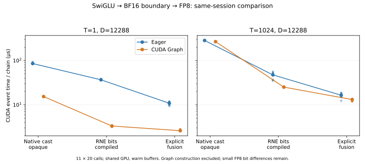

# 5-4 模型算子与融合：Qwen形状FP8链（部分交付）

实际执行Qwen3-8B中间宽度12288的SwiGLU→FP8链，T=1/1024。输入为固定随机BF16激活，不是整模型质量评估。比较编译后仍不透明的custom op、编译器可见表达、显式Triton融合。逻辑流量和模型清单由既有计算任务负责，本目录不重复推演。

预定数值合同为FP32 SiLU和乘法、BF16中间舍入、再转FP32按整行absmax/448取尺度（最小1e-8）、饱和cast至E4M3FN。运行时采用atol=.04/rtol=.15的宽松反量化误差筛查，**这不是严格等价判定**；同时逐元素比较FP8位模式和尺度，保留失败证据。

| 第一轮 | T=1 中位数µs / kernel数 | T=1024 中位数µs / kernel数 |
|---|---:|---:|
| opaque custom op | 86.027 / 13 | 290.198 / 13 |
| 编译器可见表达 | 36.094 / 3 | 33.694 / 1 |
| 显式融合 | 10.494 / 1 | 13.883 / 1 |

CUDA event测量11轮，每批20调用，各路径预热5次，轮内随机路径顺序。包含主机提交间隙，非纯kernel延迟；单次Torch profiler CUDA trace用于核对真实kernel数，与正式计时分开。输入预热复用、共享GPU。首次调用时间另存，包含编译／缓存／运行，不能当成纯编译成本或将两种形状的首调用直接相加。

**编译器可见路径未通过严格数值合同。** T=1有455个FP8元素不同，T=1024有264666个不同，尺度也有变化；不能把表中速度写成保持原数值语义的等价融合收益。显式融合分别0/25个FP8元素不同，尺度与参考相同；T=1024最大反量化差约0.0000526，仍不宣称逐位一致。

追加`strict.py`启用已安装Inductor的`emulate_precision_casts=True`实际复跑，差异数量与尺度差没有改变。完整生成代码和日志保存在`results/strict/generated`、strict.log；生成代码在输入附近保留BF16 cast，但乘法结果到absmax／FP8路径未体现预定的中间BF16舍入。这是针对当前生成代码的观察，尚未完成编译器变换定位或修复。后续需要保留正确舍入边界的实现再做严格对照，不能以开关名称当作验证。

两轮原始输入、参考FP8／尺度、三路径输出保存在t*-tensors.pt；仅加载本目录自产可信文件，离线使用`torch.load(..., weights_only=True)`。尚待独立高精度参考、完整边界输入、寄存器/DRAM/L2、正确数值合同下的性能对照；V4-Flash链及自动归约变体也未交付。5-4保持部分完成。

在RTX本目录执行（Torch2.10.0+cu128、Triton3.6.0；输出目录必须不存在）：

```sh
python3 run.py --output results/new-first
TORCH_LOGS=output_code python3 strict.py --output results/new-strict
python3 analyze.py
```

默认分析读取封存的first/strict，核对源码哈希、样本和实际CUDA trace；不把分析通过冒充数值等价。独立目录无需其他实验源码。两轮正常退出，无原GPU服务清理；未修改共享Torch安装。原始结果与源码封存到raw-manifest.json。

## 显式BF16位舍入控制

`run_round.py`保留前两轮源码与结果，新增有限FP32值的BF16 round-to-nearest-even位表达：根据被保留部分最低位处理平局，再清除低16位。生成代码见`results/round/generated`；这里不依赖编译器将相邻dtype转换自动保留。非有限输入不在此表达的验证范围，不推广为通用cast替代。

独立`check_rounding.py`覆盖每个BF16高16位组合对应的FP32舍入中点及上下各一个FP32 ULP，再加入200000个随机位模式，过滤NaN/Inf后共395019例。GPU编译表达与CPU原生BF16转换逐位一致，包括符号零与舍入溢出。原始输入和预期／实际位结果保存，`verify_round.py`在CPU重新验证。

整链输入及参考FP8/尺度与第一轮逐字节一致。编译路径T=1/1024的FP8差异降至0/25，尺度差均为0；显式融合同样为0/25。独立CPU FP64表达先舍入至BF16再量化，T=1与全部路径相同；T=1024与各路径最大反量化差约0.553571、RMSE约0.001009。最大误差受量化边界影响，不能只报告小RMSE来隐藏个别差异。相对于原FP32独立实现的差异与相对于FP64表达的差异是不同指标，完整结果见`round-verification.json`。这些比较不证明模型质量等价。

| 位舍入轮次 | T=1 中位数µs / kernel数 | T=1024 中位数µs / kernel数 |
|---|---:|---:|
| 不透明整数舍入表达 | 355.493 / 16 | 376.704 / 16 |
| 编译器可见整数舍入表达 | 64.974 / 3 | 61.549 / 1 |
| 显式Triton融合 | 19.232 / 1 | 21.781 / 1 |

本轮不透明路径也执行整数位操作，因此为16个kernel，不同于原生cast基线13个。整体计时相对前两轮偏移，且未交错不同轮次，不能将跨轮数值相减归于修复成本。表仅给出本轮同批路径对照，首次调用成本单列于原始JSON。BF16边界得到了独立验证，但近似指数与量化边界仍导致25处位差，不写成完全逐位等价。

```sh
python3 run_round.py --output results/new-round
python3 check_rounding.py --output results/new-rounding-check
# 离线读取默认封存结果，需Torch与NumPy，无GPU要求
python3 verify_round.py
```

新增`round-manifest.json`封存控制源码、生成代码、日志、完整张量与验证摘要，前两轮raw-manifest不覆盖。5-4仍待原生cast基线与正确边界表达的充分交错计时、寄存器/DRAM/L2证据、更多输入合同、V4链与自动归约实际后端；没有据本控制将整题标为完成。

## 原生cast基线、正确边界与Graph同轮对照

`compare.py`将不透明基线恢复为原生BF16 cast，编译器可见路径继续使用经验证的RNE位边界，显式Triton路径不变。每形状在同一轮随机交错三路径×eager/Graph，11轮、每批20调用。Graph捕获20次调用后预热3次，构建不计入回放时间。三路径及两种提交方式均验证输出与尺度；全部输入和参考与最初第一轮逐字节相同。

| T / 路径 | eager中位数µs | Graph中位数µs | eager trace kernel数 |
|---|---:|---:|---:|
| 1 / 原生cast独立 | 85.528 | 15.365 | 13 |
| 1 / 编译可见RNE | 36.706 | 3.312 | 3 |
| 1 / 显式融合 | 10.846 | 2.600 | 1 |
| 1024 / 原生cast独立 | 284.400 | 267.861 | 13 |
| 1024 / 编译可见RNE | 47.392 | 25.102 | 1 |
| 1024 / 显式融合 | 16.453 | 13.149 | 1 |



小形状中Graph大幅降低含主机提交间隙的event时间，说明eager差距不能全解释为算子执行效率。大形状独立路径的Graph收益较小，融合收益仍在。编译路径与显式路径T=1024同为一个kernel，Graph时间仍不同；启动数不足以解释完成时间，寄存器、重读与归约安排须用实际代码和计数器继续核对。表中kernel数来自单次eager CUDA trace，不冒充Graph回放的独立kernel trace。

T=1三路径与参考FP8逐位一致；T=1024独立基线差0、编译与显式各差25，尺度全部相同，Graph与eager差异计数一致。仍保留近似指数和量化边界误差，不宣称普遍逐位等价或整模型质量结论。主机与GPU共享、warm buffers；本轮不能与前轮直接相减解释修复成本。

`model-config.json`只读复制已固定的Qwen3-8B配置，`model-source.json`保存来源哈希，校验`intermediate_size=12288`；没有运行计算任务。复现：

```sh
python3 compare.py --output results/new-compare
python3 analyze_compare.py
python3 verify_compare.py
python3 plot_compare.py
```

离线验证需Torch/NumPy，无GPU要求；绘图需matplotlib。原始输出、trace、日志与源码封存在compare-manifest，旧清单不覆盖，PNG已目视检查。5-4仍为部分交付，继续补寄存器/访存、V4链与其他要求。

## 实际DRAM、L2与寄存器

六份Nsight Compute 2026.2.1原始报告直接复用`compare`的输入，每条链预热5次后捕获一次完整调用；application replay、cache-control none、clock-control none。独立路径调用同一opaque custom op，核对实际13个GPU kernel，不把其CPU编译包装成本算作新算子。源码、输入哈希、尺度及FP8差异数量与正式对照一致。

| T / 路径 | DRAM读 B | DRAM写 B | L2请求 B | 寄存器/线程 |
|---|---:|---:|---:|---|
| 1 / 独立 | 0 | 0 | 3,140,704 | 各kernel为21–40 |
| 1 / 编译 | 0 | 0 | 364,640 | 30 / 16 / 16 |
| 1 / 显式 | 0 | 0 | 424,000 | 64 |
| 1024 / 独立 | 77,936,896 | 263,532,800 | 973,935,552 | 各kernel为21–40 |
| 1024 / 编译 | 1,325,312 | 238,336 | 71,301,408 | 30 |
| 1024 / 显式 | 0 | 0 | 75,703,712 | 64 |

计数是完整链各kernel的求和，但寄存器是每线程配置，**不跨kernel求和**。全部kernel名称、各项值和单位保存在traffic.json与CSV。T=1三路径DRAM均为零，证明本次热缓存采样不适合用逻辑字节直接声称外存节省。T=1024独立链大量中间读写进入DRAM，两条融合路径的外存流量显著较小；但缓存脏行回写可能落在后续kernel，不能将这些数字视为算法必须搬运的总字节。

显式融合每线程64寄存器，高于编译的30，L2请求也略高，而前述同轮Graph时间仍更短。当前证据否定“寄存器越少或L2字节越少就一定更快”的简单解释；寄存器本身不是实际占用率、spill或调度效率。不能仅凭这两个计数确定时间差原因。NCU耗时另存，不与未插桩计时合并。

```sh
python3 collect_counters.py --ncu /path/to/ncu --output results/new-counters
python3 analyze_counters.py
python3 verify_counters.py
```

采集要求CUDA计数器权限，使用已有`sudo -n`而不修改驱动；输出目录必须不存在。离线分析需标准Python，输入身份复核另需Torch/NumPy。counter-manifest封存六份报告、CSV、日志和控制源码，先前清单不覆盖。进程正常退出，未停止已有GPU服务。

Qwen这条链已具备数值边界、三实现同轮eager/Graph、真实trace、DRAM/L2及寄存器证据；V4-Flash链和自动归约指定后端变体尚未完成，5-4继续保持部分交付。

## V4-Flash子链补测

已交付固定Expert.forward的裁剪→SiLU→up乘法→路由权重→BF16子链，原路径与两种合法融合的trace/数值/同轮eager与Graph见[V4独立记录](v4/README.md)。其数值合同与Qwen FP8链不同，未将整行FP8方案套用于V4专家。指定自动归约后端等其余要求仍待。

## 指定自动归约生成源码的后端复核

已在TileLang0.1.8/CUDA12.8执行未修改的作者量化与注意力生成示例。量化块顺序改变输出，全零产生NaN；注意力跨块交换产生一个FP16 ULP差异，均保留原始证据。[独立运行与限定结论](redfuser/README.md)。这不等于运行RedFuser生成器或复现论文性能；其他扩展范围仍需最终对账。
