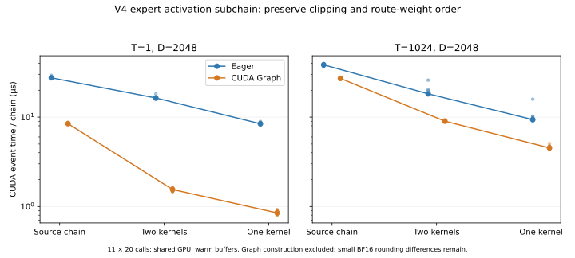

# V4-Flash专家激活子链：裁剪、SiLU与路由权重

固定配置为intermediate width 2048、swiglu_limit=10。run.py直接从封存model.py.snapshot提取Expert.forward的AST执行；w1/w3注入已生成的BF16投影输出，w2设为identity，只测这两次投影之间的激活子链。它不是完整专家、量化GEMM、路由或全模型推理。来源快照、哈希和限定范围见sources.json；未修改或运行计算工作包。

原实现先将gate/up转FP32，gate仅裁剪上界10，up裁剪到[-10,10]，再SiLU(gate)×up×路由权重，最后转BF16。两种融合分别为“裁剪物化FP32＋其余融合”的两kernel，以及全部合为一个kernel；没有移动最终舍入边界。

| T / 路径 | eager µs | Graph µs | 实际eager kernel数 |
|---|---:|---:|---:|
| 1 / 原路径 | 27.547 | 8.446 | 8 |
| 1 / 两kernel | 16.373 | 1.549 | 2 |
| 1 / 单kernel | 8.422 | 0.848 | 1 |
| 1024 / 原路径 | 38.490 | 27.112 | 8 |
| 1024 / 两kernel | 18.229 | 9.002 | 2 |
| 1024 / 单kernel | 9.374 | 4.525 | 1 |



11轮随机交错三路径和eager/Graph，每批20次调用；预热5次，Graph捕获20调用后预热3回放，构建不计入回放。Torch2.10/CUDA、Triton3.6，warm buffers，共享RTX PRO 6000；event eager含主机提交间隙。原始CUDA trace核对8/2/1 kernel，Graph未另采kernel trace。预分配融合缓冲与原路径分配行为不同，是实现的一部分；首次调用时间保留，不视为纯编译成本。

固定随机输入std=12以覆盖裁剪区域，首行额外放置-20/-10/0/10/20边界，路由权重在[0,1.5)。输入、路由权重、原路径与两种融合输出均保存。T=1两融合逐位相同；T=1024各有37个BF16元素不同，数值按预设atol=.125/rtol=.02验证，不能宣称普遍逐位等价。独立CPU FP64表达复核通过；其最终BF16与原FP32路径的最大差为0／0.125。近似指数与量化边界影响保留，未做完整模型质量评价。

两项语义负对照在CPU对同一输入计算：错误的gate双向裁剪产生413／422386个不同元素；提前转BF16后再乘路由权重产生517／498797个不同元素。因此这些变换不属于当前固定合同的合法融合。负对照只用于数值辨别，没有当作GPU性能变体。

在本目录独立运行：

```sh
python3 run.py --output results/new-run
python3 analyze.py
python3 verify.py
python3 plot.py
```

运行需Torch/Triton/CUDA；离线验证需Torch，绘图需matplotlib。验证读取自产可信PT文件并使用weights_only=True。输出目录必须不存在，默认分析读取封存first。模型完整快照只提取函数，不导入其外部kernel依赖。原始trace、张量、日志、源码与固定配置均封存于manifest.json；PNG已目视检查。本子链测量已交付，不替代5-4尚待的其他模型逻辑清单、计算工作包或指定自动归约后端。
