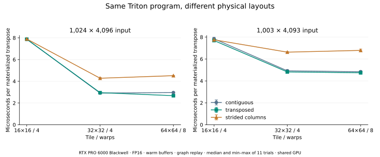

# 实验 5-5：同一分块程序的编译结果

已在 RTX PRO 6000 Blackwell 的 Triton 3.6.0 后端运行。同一转置程序处理连续输入、转置视图和隔列输入，比较 16×16、32×32、64×64 块；保存 TTIR、TTGIR、LLVM IR、PTX、实际 cubin 与反汇编 SASS。

## 独立运行

需要 CUDA GPU、PyTorch 2.10.0+cu128、Triton 3.6.0。默认 `run.py` 会重新执行全部候选，所有文件写入脚本自己的 `results/`，不依赖其他实验。

```bash
python3 run.py
python3 disassemble.py
python3 verify.py
# 可选，需要 matplotlib==3.10.6
python3 plot.py
```

`disassemble.py` 使用本次 Triton 安装自带的 `nvdisasm`，其路径与版本保存于 `disassembly.json`。它只是反汇编已生成的 cubin，不再执行 GPU。`verify.py` 可在没有 GPU 的电脑上复核记录与代码；不能将离线验证当作重新测量。

## 编译器实际做了什么

源程序只表达行列索引、步长、mask、load 和 store，没有手写共享内存或同步。固定 1,024×4,096、32×32 块的真实生成代码如下。

1. **连续输入**：TTGIR 增加一次 `ttg.convert_layout`，将读入与写出使用的线程布局转换。PTX 包含 `st.shared.v4.b32`、`bar.sync` 与 `ldmatrix.sync.aligned.m8n8.x4.trans.shared.b16`；最终 SASS 保留 `LDSM`。这个矩阵加载指令在这里用于布局转置，不是在做矩阵乘。编译元数据记录每块 2,048 B 共享内存、每线程 17 个寄存器，无 spill。
2. **转置视图**：源代码不变，但输入步长变成 `[1,1024]`，输出仍是新分配的连续矩阵。TTGIR 不再需要上述布局转换；共享内存为零。这里确实运行了复制 kernel，没有利用框架的 view 操作跳过数据物化。
3. **隔列输入**：输入步长 `[8192,2]`，共享内存也是零，但 PTX 采用多条 `ld.global.b16`，而连续输入用向量加载。没有共享内存不表示数据通路更快；不能仅凭指令文本推算真实显存事务数。

可直接对照 `results/code/m1024-n4096-contiguous-t32-w4.*` 与另外两个 layout 的文件。所有阶段共 108 份代码产物，`provenance.json` 保存原始代码与生成文件哈希。

## 结果

下面比较相同 32×32 块、4 warps 的执行时间：

| 输入形状 | 连续 | 转置视图 | 隔列输入 |
|---|---:|---:|---:|
| 1,024×4,096 | 2.917 μs | 2.951 μs | 4.281 μs |
| 1,003×4,093 | 4.922 μs | 4.820 μs | 6.626 μs |



完整形状的连续输入从 16×16 块改为 32×32，时间从 7.87 μs 降至 2.92 μs；64×64 没有继续改善。编译器会完成布局转换，但块大小、步长和尾块仍影响结果。非整除形状虽然元素略少，却不一定更快；本次生成代码也显示其寄存器和边界处理发生变化，不能用单一元素数预测时间。

## 方法与边界

- FP16 随机输入，固定种子；同一形状的三种物理布局持有相同逻辑元素。输出均为新分配的连续 `X.T`，18 个候选全部要求与 PyTorch 转置结果逐位相同，图重放后再次校验。
- 另对 1×1、3×67、65×2 的三种布局与三种块运行 27 项边界检查，输出先填 NaN，以暴露遗漏写入。此处只有数据移动，不需要放宽数值容差。
- 预热 20 次，每图捕获 100 次调用；11 轮随机排列同一形状／布局下的块候选，CUDA event 计量重放时间。保留每轮样本，图上误差线为最小至最大值。
- 固定输入输出反复使用，热缓存条件，不主动清 L2；这些小工作集不代表大矩阵 DRAM 带宽。没有硬件事务计数器，不把逻辑字节除以时间称作显存带宽。
- 与其他驻留服务共享 GPU，未锁频或独占。环境保存前后快照；快照不能证明整段运行无竞争。不同布局分组执行，不把微小差异当稳定排名。
- 首次调用计时包括 JIT／缓存／模块载入和同步，缓存可能已经存在；不作为冷编译时间或特化摊销结果。实验 5-7 的计算任务仍由 `calculations/` 负责。
- 代码文本中的出现次数只是编译输出检查，尤其 PTX 的 `ldmatrix` 也访问共享内存，不能仅统计 `ld.shared` 字符串就认定没有共享读。资源使用以编译元数据和完整指令对照为准。

本实验选定 Triton→SM120 一条后端；没有运行 Ascend C／Metal，也不推断它们会生成相同指令。
