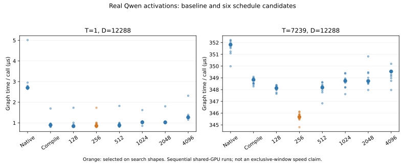
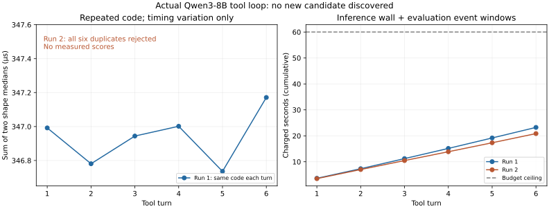
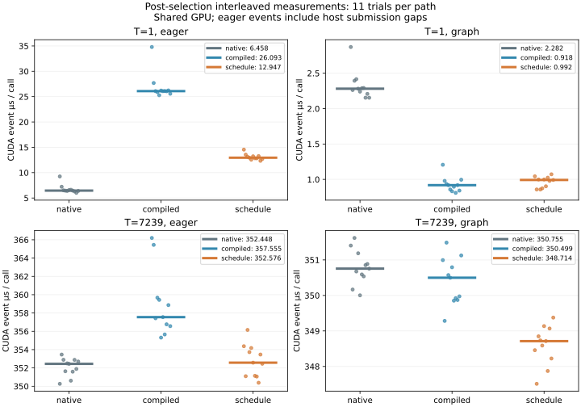

# 5-6 真实模型热点与优化输入（进行中）

本目录开始处理实际模型trace→固定验证→等预算搜索／Agent→候选选择链路。当前已完成热点与激活采样、固定协议、默认编译和六个schedule首轮及留出验证，**真实Agent两轮未找到新候选，稳定请求级收益仍待**。

复用8-8已采集的Qwen3-8B BF16/vLLM0.23/Triton attention/eager trace，输入为7239-token prefill及一个decode step。SwiGLU实际72次调用，kernel时间合计11,282.479µs，采集区间476.918757ms。其余请求与模型工作占主要时间，局部倍数不可直接换成请求倍数。原始报告仍在8-8目录，trace-evidence.json只读封存提取记录和来源哈希，不重复采集同一性能基线。

独立采样使用同一固定模型配置和完整token输入；加载后给36个SiluAndMul实例安装观测包装，调用原生方法再保存数据，不替换数值实现。实际记录36层×prefill/decode共72次，形状分别[7239,24576]→[7239,12288]及[1,24576]→[1,12288]，BF16；首层完整输入与原生输出保存为两个PT文件，其他层只记录调用元数据。不是所有层的数值覆盖，也不能将首层分布视为所有层的完整代表。

采样的CPU拷贝、磁盘保存会扰动执行，因此capture.log中的耗时不能当作优化前性能。原性能来自此前未安装本观测包装的Nsight报告。采样请求输出token为[4913,74]，引擎已正常退出；运行记录、配置和源码哈希在capture.json。其余GPU服务未操作。

在RTX本目录复现，使用已有兼容vLLM环境、固定模型缓存路径（见engine-config.json）：

```sh
/home/ubuntu/vllm023-venv/bin/python capture.py --output results/new-capture
python3 verify_capture.py
```

输出目录必须不存在。离线验证需要Torch，只加载本目录自产可信PT并使用weights_only=True。验证检查72次层调用、形状、完整输入输出、有限性及哈希；不把验证通过冒充候选正确性或全书完成。后续需固定不可被候选修改的参考与容差、留出形状／边界、候选及GPU时间预算，再运行默认编译、schedule搜索及真实工具调用Agent；独占计时窗口／并发片段和5-9实际替换也仍待完成。

本批完整数据已取回并离线通过verify_capture；capture-manifest封存全部输入输出、源码、配置、日志与trace提取。installed.json和activation.py.snapshot另固定当前vLLM激活层源码与原生库哈希，采样后记录，不冒充运行前签名。

## 固定协议与schedule首轮

protocol.json在搜索前固定参考、容差、形状、评分、最多6候选和60秒计时窗口上限。参考为当前原生`torch.ops._C.silu_and_mul`，两种训练形状均先确认与模型采样逐位一致。候选要求BF16同形状输出、输入不变，atol=rtol=0.0078125且没有容差外元素；该合同允许BF16数值差异，不代表逐位等价或请求质量不变。默认编译和原生基线不占候选数；候选预算累计CUDA event窗口包含编译／主机间隙，是保守墙钟式计量，不是纯GPU活跃时间。

最终 evaluate_v2 使用已核对的 torch.ops 注册入口，search_schedule_v2 在基线不通过时立即停止；参考语义与 protocol 保持一致。原生、默认编译及6个 schedule 均通过，完整记录见 results/schedule-search-v2。

| 路径 | T=1 Graph µs | T=7239 Graph µs |
|---|---:|---:|
| 原生 | 2.701 | 351.824 |
| 默认编译 | 0.893 | 348.832 |
| block128 / 4warps | 0.838 | 348.125 |
| block256 / 4warps | 0.854 | 345.674 |
| block512 / 4warps | 0.880 | 348.182 |
| block1024 / 4warps | 1.027 | 348.742 |
| block2048 / 8warps | 1.024 | 348.733 |
| block4096 / 8warps | 1.267 | 349.546 |



每形状5次预热，图内10调用、预热3回放，11个正式批次；按两种形状各36次的trace频数等权相加选择，block256胜出。全部6候选累计event窗口4.965110秒。各候选顺序运行，没有跨候选随机交错；gpu-activity.log只覆盖部分时段，因此**不宣称已满足独占计时窗口要求**。细小prefill差值须再测，未将此选择认定为稳定胜者，也未接入服务。

编译及全部schedule的T=1／7239分别有3242／23463111个BF16元素与原生不同，但在预设容差内。该差异计数不隐藏，后续必须检查候选精度和请求级输出；不能因局部速度变好就自动接受模型变化。

选择后才检查留出形状17／257／4096，以及包含±80、±20、±10、±1、0的边界和全零输入，五项均通过同一容差、输入不变和输出不别名检查；非零样例中的恒零错误候选被拒绝。留出的是形状，数据是原prefill的行切片，不能声称独立数据泛化。heldout.py、选定摘要哈希、各项误差与输入哈希在schedule-heldout.json中。

复现使用v2入口（默认结果目录须不存在）：

```sh
/home/ubuntu/vllm023-venv/bin/python search_schedule_v2.py
python3 summarize_search.py
/home/ubuntu/vllm023-venv/bin/python heldout.py --output results/new-heldout.json
python3 plot_search.py
```

search-manifest封存协议、harness源码、正式结果及留出验证。图已目视检查。真实工具调用Agent、完整时段活动监测／交错复测、并发片段、优化成本摊销和5-9接入仍待，5-6保持部分交付。


## 真实工具调用 Agent：两轮负结果

固定本地Qwen3-8B、BF16、temperature=0、关闭thinking，由模型提交完整Python/Triton模块；工具读取固定protocol，先验证再计时，并将逐形状误差、原始时间和评分返回下一轮。每轮保存完整messages、输入/输出token IDs、输出文本、生成事件、候选源码和工具结果。Agent看到的是搜索形状、起始核以及原trace的热点汇总，没有看到留出结果；本次尚未向其返回新候选的Nsight计数反馈。

第一轮6次全部通过局部容差，但候选只有空白差异，Python AST与起始block256/4warps完全相同。评分在346.736–347.171µs波动，按协议记录的第5次“选择”只是同一代码的一次较低读数，**没有发现新内核或证明收益**。选择后17/257/4096及边界/全零5项验证通过；这仍只覆盖原prefill切片和合成边界，不是模型质量结论。

第二轮保留同一数值协议，额外要求实际改动并拒绝重复AST。模型6次均声称将参数改成256/4，但这正是起始值；六次都在计时前拒绝，无有效新候选。两轮是分别记录的提示/工具策略尝试，不能把合计12次包装成单次6候选预算，也不能选较好一轮冒充预注册单次结果。

| 运行 | 模型生成墙钟 s | 候选CUDA event窗口 s | 保守计费 s | 循环实际墙钟 s | 引擎启动 s |
|---|---:|---:|---:|---:|---:|
| 第一轮 | 18.936 | 4.310 | 23.246 | 35.417 | 7.819 |
| 第二轮 | 20.862 | 0 | 20.862 | 20.936 | 7.837 |

两轮各最多6次、各60秒上限；本次将模型生成墙钟也保守计入预算，独立列出子进程导入等未计入event的墙钟及引擎准备成本。与schedule共享预算上限，不是实际消耗完全相同。两轮都有可用剩余时间，但已用完候选次数；未扩大次数追求成功。模型计时期间不调用候选，候选计时期间模型仅驻留显存。pmon保存活动采样，不能证明连续独占或排除所有短暂外部工作；不据此比较跨轮微小时差。AST检查是执行接口约束，不是可靠的安全沙箱。



`verify_agent.py`离线核对连续会话确实含上一轮输出和工具反馈、源码/协议哈希、真实代码相同、评分/选择/计费及留出结果。`agent-manifest.json`封存本批产物。两轮模型及验证进程正常退出，未终止原服务。复现使用新目录：

```sh
/home/ubuntu/vllm023-venv/bin/python run_agent.py --output results/new-agent-v1
/home/ubuntu/vllm023-venv/bin/python run_agent_v2.py --output results/new-agent-v2
/home/ubuntu/vllm023-venv/bin/python heldout_agent.py --search results/new-agent-v1 --output results/new-agent-heldout.json
python3 verify_agent.py
python3 plot_agent.py
```

最后两个命令复核/绘制已封存的v1/v2记录；不是自动接受任意新输出。5-6仍为partial：实际修改代码的成功候选、候选profiler反馈、交错与并发验证、稳定收益/摊销和5-9请求接入尚待。本次负结果不证明更大模型、thinking或其他提示也会失败。


## 选择后的同轮交错复测

`compare.py`在模型退出后固定此前选定block256/4warps，不重新选择。两种原始形状×原生/默认编译/选定schedule×eager/Graph，每组11轮、每批10次；每轮随机排列6种配置，共132批。Graph构建、首次编译和各路径5次预热均在正式计时外，记录准备时间；输入与原生采样位同，候选容差、输入不变及输出不别名验证继续通过。另在计时后采集6份Torch profiler trace，实际每路径/形状均只有一个kernel。

| 形状／提交 | 原生 µs | 默认编译 µs | 选定schedule µs |
|---|---:|---:|---:|
| T1 eager | 6.458 | 26.093 | 12.947 |
| T1 Graph | 2.282 | 0.918 | 0.992 |
| T7239 eager | 352.448 | 357.555 | 352.576 |
| T7239 Graph | 350.755 | 350.499 | 348.714 |

表为CUDA event批次中位数。eager event窗口包含CPU提交导致的GPU空隙，不是纯kernel时长；同步墙钟另存。T1 schedule相对原生的Graph配对节省中位数1.386µs，11/11为正，但eager反而慢6.336µs，0/11为正。T7239 Graph节省2.598µs、11/11为正；eager节省−0.531µs、只有4/11为正。不能把Graph局部收益移用到原eager模型。schedule相对默认编译的T1 Graph也仅4/11更快，不证明它普遍胜出。



`analyze_compare.py`校验132批覆盖、固定选择/协议/源码哈希与6份trace，保存逐轮配对差值。11轮是同次运行内的配对观察，不是跨独立运行的置信结论。全程启动pmon采样，但1秒采样无法排除短暂争用，因此仍不作独占声明。`interleaved-manifest.json`封存本批源码、数据、trace、日志、摘要及图。

```sh
/home/ubuntu/vllm023-venv/bin/python compare.py --output results/new-interleaved
python3 analyze_compare.py
python3 plot_compare.py
```

分析/绘图入口默认读取已交付的interleaved-v1记录。实际请求接入的首轮已在独立[5-9目录](../05-09/README.md)交付；阶段trace、并发争用、优化摊销等剩余范围仍未完成。
