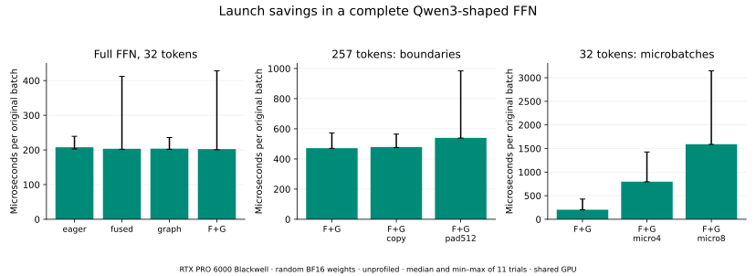
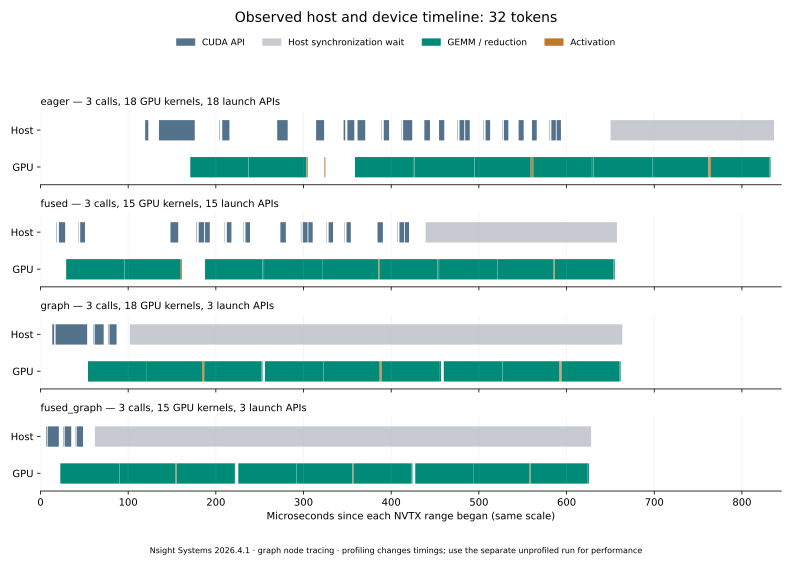

# 实验 5-8：图重放、融合与完整 FFN

已在 RTX PRO 6000 Blackwell 实跑 Qwen3-8B 形状的 FFN 链，比较 eager、激活融合、CUDA Graph 与组合执行，并补测输入复制、257→512 padding 和微批拆分。另用 Nsight Systems 保存主机／设备原始时间线。

这里使用固定种子的随机 BF16 权重，三个矩阵尺寸为 `[4096,12288]`、`[4096,12288]`、`[12288,4096]`；覆盖一条完整 FFN，不包含注意力、残差、整个模型或请求质量评测。实验不读取相邻目录，不复制计算项目的摊销扫描。

## 独立运行

需要 Linux CUDA GPU、PyTorch 2.10.0+cu128、Triton 3.6.0；绘图需要 Matplotlib 3.10.6。Nsight Systems 本次使用 2026.4.1.191。

```bash
python3 run.py
# NSYS 指向已安装的新版本可执行文件
NSYS=/path/to/nsys python3 profile.py
python3 analyze.py
python3 plot.py
python3 seal.py
python3 verify.py
```

脚本从任意工作目录启动都把结果写入自身 `results/`。`--trials`、`--repeats` 可修改测量次数，默认 11×20。`profile.py` 单独执行采集，不覆盖 `run.py` 的无分析器计时；`analyze.py` 和 `verify.py` 仅需 Python 标准库，绘图、复核不需要 GPU。

如需安装分析器，可运行 `bash setup_nsys.sh /your/private/tool-directory`，将打印的路径赋给 `NSYS`。脚本从 [NVIDIA 官方下载入口](https://developer.nvidia.com/nsight-systems/get-started)下载固定 CLI 包，核验 SHA256 后用 `dpkg-deb -x` 私有解压，不修改驱动或系统软件包。本次安装位于远端 `/home/ubuntu/ai-infra-book-experiments/tools/nsys/`。

## 无分析器计时结果

| 原始 token 数 | eager | 融合 | 图 | 融合＋图 |
|---:|---:|---:|---:|---:|
| 1 | 243.25 μs | 242.00 μs | 240.75 μs | 239.44 μs |
| 32 | 207.73 μs | 203.33 μs | 203.68 μs | 202.50 μs |
| 257 | 478.74 μs | 475.80 μs | 473.56 μs | 471.48 μs |

图重放明显减少主机提交，但本组完整链的中位数接近。32-token 例子中，主机提交中位数从 eager 的 61.29 μs 降至图模式的 4.07 μs；GPU 区间并没有同比缩短。主机提交与 GPU 工作能够重叠，二者不能相加当作完成时间。



同一 257-token 输入，融合图的精确形状为 471.48 μs，加入输入复制为 479.10 μs，补齐到 512 为 539.78 μs。复制与补齐均单独列项，不能把图提交时间当作完整边界代价。

同一批 32 个 token，融合图整批为 202.50 μs，分成 4／8 个顺序微批后为 796.28／1,590.70 μs。这里只改变同一设备上的顺序拆分，没有引入跨设备流水；重复启动、小矩阵执行与可能的权重重读共同影响结果，未测硬件访存计数，不能把全部损失归因于启动次数。

**测量存在明显长尾。** GPU 与已有服务共享，未锁频或绑 CPU；例如 32-token 融合图的 11 个样本中有一次约 428 μs，而中位数约 202 μs。图保留全部最小—最大范围，没有删掉慢样本。几个微秒的中位数差不足以证明稳定排名，本实验的直接结论是提交与设备工作要分别看。

## 原始时间线



Nsight 采集使用 `cuda,nvtx`、CUDA Graph node trace、CUDA Profiler API 范围控制，关闭 CPU sampling／context-switch sampling。每个 NVTX 范围执行同一 32-token 链三次，最后同步；采集顺序固定。两种运行的权重与形状相同，随机激活在各运行中生成，不把采集样本当作配对性能试验。

| 三次调用的实际记录 | 主机启动 API 数 | GPU kernel 数 |
|---|---:|---:|
| eager | 18 | 18 |
| 融合 | 15 | 15 |
| 图 | 3 | 18 |
| 融合＋图 | 3 | 15 |

三个 GEMM 并不必然只对应三个 kernel；本次 cuBLAS 路径还有 `splitKreduce_kernel`。图减少主机提交而保留内部 kernel，融合才消除了部分节点。8 个微批的融合图三次执行发起 24 次图提交，实际执行 168 个 kernel。

`timeline.nsys-rep` 原件仅保留在本地；公开的 `timeline.sqlite` 已移除采集环境中的凭据，原件与公开版哈希见 [归档说明](trace-publication.json)。性能事件保持不变，`trace-analysis.json` 保存每条 API、kernel、copy 及范围。分析中的未覆盖设备间隔仅指本进程没有被采到 kernel／copy 的区间，不能证明整个 GPU 空闲。开启采集改变时间，性能表来自另一次未开启分析器的运行。

## 捕获、缓冲与输入更新

- 所有 GEMM 与 Triton JIT 先预热，再记录捕获、实例化、首次 replay 与同步的合计时间；不将其称作纯编译成本。各图实测准备耗时保存在原始 JSON，约为毫秒量级，未做重复冷启动分布。计算项目可读取这些带条件的输入，本目录不另算复用阈值。
- 三组权重共 288 MiB。32-token 的输入／输出／中间张量合计，分离路径为 3.5 MiB，融合路径为 2.75 MiB；不含权重、外部原始输入、验证张量或库工作区。
- 257→512 融合图的上述存活张量从约 22.09 MiB 增至 44 MiB。复制输入另有一份外部输入，payload 字节与读写流量不是同一口径。
- `pytorch_allocated_graph_delta_bytes` 只是捕获前后 PyTorch allocated 计数的差值。首个图还分配了库相关空间，后续图可能复用资源；零差值不表示图没有内存代价，也不等于驱动层的全部图内存。预留缓冲与这个差值分开报告。
- 对 21 个候选先验证原始输入，再分别改为负输入、零输入、恢复输入，共记录 63 项更新检查；固定缓冲和外部复制边界均覆盖。padding 区保持零，输出只取原始 token 数。
- 独立 FP32 完整 FFN 参考禁用 TF32，容差 `rtol=0.04, atol=0.025`；同精度 BF16 eager 再用 `rtol=0.02, atol=0.008` 比较。本次初始输入最大绝对误差约 0.0181。零输入要求输出严格为零。这些检查只验证本算子链，不证明语言模型生成质量。

## Persistent 路径的同条件论文对照

为满足题目中的 MPK 补充案例，单独保存并核读 [MPK v2](https://arxiv.org/html/2512.22219v2)的本地正文快照与 `sources/paper-case.json`。论文中同一 Qwen3-8B／A100、batch=1 的完整模型 decode，作者报告 vLLM／SGLang 为 14.5 ms/token，MPK 为 12.5 ms/token。这是论文内同模型、同硬件的比较，不是本书重测。

附录给出的单卡复现目标是 A100、H100 SXM、B200；其软件与协议包括 CUDA 12.8、PyTorch 2.7、64-token prompt、1024-token greedy decode、四次预热后五次运行取中位数。本文将该条件与本地 RTX、随机 FFN、PyTorch 2.10 明确分开。没有把 B200 和 RTX 的 Blackwell 名称视为相同执行后端，也没有在 RTX 上宣称完成 MPK 实跑。

该案例解释为什么 persistent 执行还可能消除 kernel 边界、集成设备调度与细粒度流水；它不只等价于减少一次 Python 调用。论文的完整模型收益不能乘到本实验局部链的速度变化上。后续最终论文复核若要求新增可运行的匹配平台对照，仍需另行补测。

## 验证与产物

`results.json` 保留 21 个候选的全部样本、主机提交、准备时间、缓冲与数值检查；`profile.log`／`profile.json` 保留命令、工具版本和采集日志。`seal.py` 对代码、源证据、原始与派生结果生成哈希，`verify.py` 对照原始 SQLite 检查图启动、kernel 数与复制字节，并验证论文记录保持作者报告身份。

重新封存只记录当前文件，不能代替重新执行；源码改动后应从 `run.py` 和 `profile.py` 开始重跑，再分析、绘图、封存。
