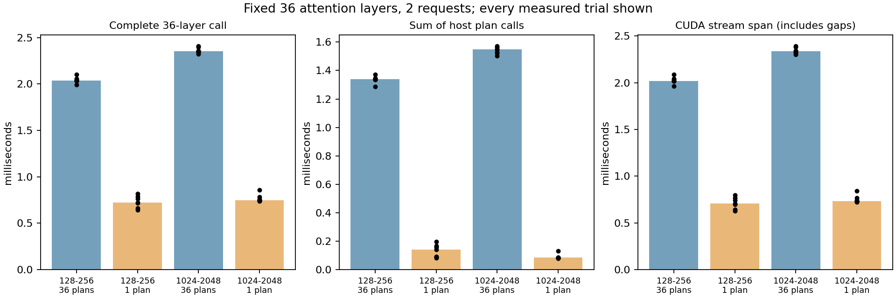

# 5-8 FlashInfer计划复用：实际28组对照

RTX PRO 6000、FlashInfer0.6.12／Torch2.11.0+cu130，完成两组长度×两策略×七轮随机交错。每组均执行相同36层GQA attention。36次plan改成一次plan复用后，本次完整调用中位数下降；全部28组与初始FlashInfer输出逐位相同，并通过独立FP32显式GQA参考。

| 两请求长度 | 策略 | 完整墙钟中位ms | 主机plan调用和中位ms | CUDA stream span中位ms |
|---|---|---:|---:|---:|
|128／256|每层plan|2.036|1.341|2.020|
|128／256|一次plan|0.724|0.142|0.708|
|1024／2048|每层plan|2.352|1.548|2.337|
|1024／2048|一次plan|0.748|0.084|0.733|

这是固定随机独立层Q/K/V、batch2、BF16、32Q头／8KV头、head_dim128、page16的受控attention调用，不含真实模型权重、完整层依赖和任务质量。CUDA-core decode，非Tensor Core/FA2性能。采用Graph兼容固定metadata缓冲，但没有捕获CUDA Graph。正式窗口包含Python循环、计时及提交开销，stream span包含主机间隙，不称纯kernel时间。原服务仍驻留，未锁频，不外推生产p95或全模型加速。

## 复制与规划边界

plan主机时间包含Python逻辑、三份输入metadata复制和native planner，不等于纯CPU规划。另行插桩的四份Torch profiler原始trace保留CPU/GPU范围及CUPTI复制事件：

|长度|策略|实际kernel数|实际HtoD复制数|复制payload总B|
|---|---|---:|---:|---:|
|128／256|每层plan|72|144|103932|
|128／256|一次plan|72|4|2887|
|1024／2048|每层plan|72|144|128124|
|1024／2048|一次plan|72|4|3559|

两个策略run数量同为36，实际kernel均72；计划复用减少重复规划及其复制，不能仅凭图提交数量解释。trace中的GPU user_annotation与CPU user_annotation分开，分析只将后者登记为主机范围。CUPTI复制时长求和不是关键路径，插桩轮次不并入正式计时。

独立copy control每组只复制三份用户metadata各36次，共108次：短／长长度payload4176／28368B，七轮墙钟中位均约0.391ms。这不含native planner的私有metadata，不能从plan时间里相减得到纯规划，也不是PCIe物理带宽测试。

## 正确性与metadata变化

独立FP32参考显式展开页表、GQA、QK、softmax、V，不调用FlashInfer或SDPA，禁用TF32。两长度最大绝对误差约0.003027／0.001109，固定atol0.005、rtol0.02全部通过；容差通过与相对初始输出逐位一致是两个不同检查。

另保存全零Q/K、末页第2–16 token的V=8的确定性输入。只建立新的CPU metadata、把末页有效长度16改为1而不replan时，旧wrapper仍使用旧长度，与新参考最大差0.9375／0.1171875；重新plan后差为0；恢复旧plan后逐位恢复旧输出。因此同形状新对象不会自动改变已绑定状态，修改metadata后需要正确更新计划。此检查没有修改库代码，不证明V4/K3不同层型可共用计划。

## 工具链与运行

最终通过独立 tools/flashinfer-cuda130 提供 nvcc/crt/nvvm13.0.88 和 runtime13.0.96，显式设置 CUDA_HOME；28组正式记录完成并通过预定数值检查。toolchain.json 保存 nvcc/header/runtime/cicc/libdevice 哈希，compiled-module.json 和 build.ninja 保存编译工件身份。module-ldd.txt 是普通 shell 下的独立检查，其中 libcudart 未在默认搜索路径找到；实际加载执行由正式记录证实，shell ldd 不作为运行进程的动态库映射证明。

在相同专用环境和匹配工具链的独立副本中执行：

    sh launch.sh --output results
    python3 analyze.py
    python3 plot.py
    python3 seal.py

results存在拒绝覆盖。模型配置、安装decode.py、输入和参考在本目录，执行强制核对源码hash。绘图需Matplotlib；分析只需标准Python。工具链可用pip的--target新目录一次安装上述四个固定包，lib64指向lib、lib/libcudart.so指向libcudart.so.13；只在新私有目录操作。

完整输入/参考/初始输出、metadata变更张量、28组计时、四份trace、copy control、JIT失败与安装日志、运行前后GPU进程均封存。首次JIT/启动另列，不进热态表。成功会话exit0，gpu-after仅原四服务，未停止旧任务。旧5-8封存件、calculations、正文及共享进展未修改。该项只补FlashInfer计划变体；其余5-8扩展和首轮全部完成后的最终复核保留。
