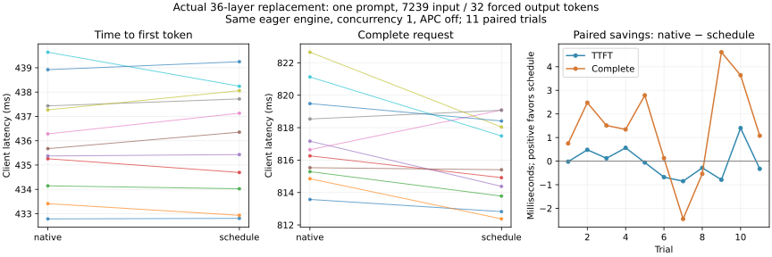
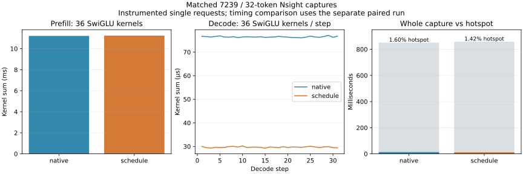

# 5-9 原引擎内的真实算子替换（部分交付）

在同一Qwen3-8B/vLLM0.23引擎内实际切换36层SwiGLU，原生与5-6选定schedule进行11对完整请求测试。固定7239-token输入、强制32个输出token、并发1、eager模式、BF16、APC关闭。替换没有带来明确TTFT收益；完整请求的微小差异仍不足以认定稳定部署收益。

| 路径 | TTFT中位数 ms | 完整请求中位数 ms | 每请求平均客户端ITL的中位数 ms | 单请求输出token/s |
|---|---:|---:|---:|---:|
| 原生 | 435.674 | 816.640 | 12.293 | 39.185 |
| schedule | 436.353 | 815.406 | 12.250 | 39.244 |

按同轮配对计算，TTFT节省中位数−0.059ms，只有4/11对为正；总时延节省中位数1.343ms，9/11对为正。配对差值的中位数不等于两组中位数相减。完整请求退化的两对也保留，不选择有利轮次。输出吞吐为32/单请求时延，**不是饱和服务吞吐**。



## 固定路径与正确性证据

`candidate.py`是5-6已选定block256/4warps代码的原样独立副本，不是Agent生成的新实现。`selection-provenance.json`记录原选择、容差协议、留出及交错复测的来源哈希。目录自带代码、输入、配置，运行不依赖相邻实验的Python模块或数据；模型路径指向机器已有固定缓存。

worker加载后定位36个SiluAndMul，保存各层原生`SiluAndMul.forward_cuda`。切换原生时恢复原方法，切换schedule时直接绑定`candidate.run`。测量前每路径额外执行一次2-token审计请求：各72条记录，36层均有[7239,24576] prefill及[1,24576] decode，BF16；两条路径输出都为[4913,74]。正式测量关闭计数包装，切换RPC位于请求计时外，并保存36层实际绑定方法身份。

两模式各2次32-token预热，随后每轮随机原生/schedule先后顺序。共2个审计、4个预热、22个正式请求。全部11对正式输出的32个token逐位相同，每模式跨11轮也相同；验证器核对完整token IDs和每次32条递增输出事件。这只证明本提示的输出一致，不证明所有层数值位同或通用模型质量。ignore_eos=True用于固定工作量，不能冒充自然结束的任务完成时间。

## 计时口径与局限

客户端使用同一单调时钟记录TTFT、完整请求和全部累计token事件；本次每条事件恰新增1token，ITL来自相邻客户端事件，仍不等同于GPU kernel边界。APC关闭、图模式固定eager、引擎不重启、请求完成后再切换。KV物理页不承诺清零或严格冷缓存，只固定相同管理策略并做预热。

整个进程约30.215秒，其中引擎启动6.888秒，准备/审计/预热未计入正式请求。原有服务驻留，pmon采样保存，未证明连续独占，不对1ms量级差异作强因果结论。引擎正常退出，未停止其他GPU服务。

5-6交错微基准显示schedule在Graph内更快，但eager单token更慢，长prefill无一致eager收益。这能解释为何不能用Graph加速比预测本实验；不能据此把完整请求的全部变化归因于某项开销。此前缺少的固定32-token替换前后trace已补入，采集范围与警告另见下文；等待成因、跨独立运行稳定性、并发与其他形状、基于稳态收益的成本摊销仍待验证，因此5-9保持partial。此前2-token trace与本32-token请求不直接混算Amdahl上限。

## 复现与离线核对

使用RTX已有vLLM环境和engine-config.json中的固定模型缓存：

```sh
/home/ubuntu/vllm023-venv/bin/python run.py --output results/new-paired
python3 analyze.py
python3 plot.py
```

运行输出目录必须不存在。分析和绘图默认读取已交付的paired-eager-v1；对新实验修改读取路径并另存结果。`analyze.py`核对源码哈希、36层绑定、审计形状、正式覆盖、JSONL完整性、逐对token一致性与计时摘要。`results/manifest.json`封存源码、协议、全部原始事件/日志、摘要和图；SVG/PNG已目视检查。无需重新下载模型或修改共享软件安装。


## 同口径完整Nsight trace与阶段解释

新增原生/schedule各一份7239输入、强制32输出的完整Nsight Systems采集，每模式独立启动同配置引擎并预热2请求。trace-only worker包裹execute_model添加NVTX；CUDA profiler开关在实际worker内，收集器跟踪fork。两份输出与先前正式计时的对应路径token IDs完全一致。原始 nsys-rep 仅保留在本地；仓库公开脱敏后的 SQLite、命令/工具版本、模型输出及源码哈希。脱敏仅修改环境信息中的凭据字符串，性能事件保持不变；原件与公开版哈希见 [归档说明](trace-publication.json)。

每份共16,703个kernel，全部找到同进程CUDA launch关联。按launch的CPU时间和线程归入execute_model NVTX范围，不能按GPU结束时间直接截断异步范围。实有33个host调用：前32个各含36次SwiGLU，最后1个没有kernel；另352个kernel的launch在execute_model范围外，包括每输出一次的GEMV、采样和状态更新，不是漏采。分析保留全部kernel名称、时间、stream、关联ID和阶段，1152个SwiGLU均准确归入32个有效步骤。

| 已采集部分 | 原生 | schedule |
|---|---:|---:|
| Prefill SwiGLU，36次，ms | 11.218659 | 11.244366 |
| 31步decode SwiGLU，1116次，ms | 2.369803 | 0.920376 |
| 全部SwiGLU kernel合计 ms | 13.588462 | 12.164742 |
| NVTX采集区间 ms | 850.848989 | 858.255992 |
| SwiGLU合计／采集区间 | 1.597% | 1.417% |
| 已观测kernel/copy/memset区间并集 ms | 794.342607 | 795.671638 |
| 区间内未覆盖上述GPU活动的时间 ms | 56.506382 | 62.584354 |



替换主要缩短decode的激活kernel，prefill几乎不变。每步36个decode激活约从76µs降至30µs，但完整请求中其余工作占主要部分。两份profile的总区间本身与独立计时轮不同，且这里只各采一次；不能把profile总时延相减作为性能回归结论，也不能把profile中的1.424ms热点差直接等同于无profile配对节省。

若额外假设所有其余时间固定、完全消除原生SwiGLU的全部13.588ms，基于本采集区间得到的理想加速仅约1.01623倍。这是条件化的零成本上限示例，未验证依赖关键路径或实际可消除的主机提交开销，不能当稳定服务收益预测。微基准Graph分数不用于eager请求上限。

两条路径的热点均在stream7，热点与本进程其余已采集kernel/copy/memset的时间区间交集为0。本记录不存在需要重放的内部热点并发片段；这不覆盖其他服务或不同并发负载。空隙只标为“未观测GPU活动”，不凭此认定全是Python、CPU调度或通信等待。Nsight未开启CPU采样，这些原因仍需不同证据。

`analyze_profiles.py`只读SQLite核对关联、调用数、源哈希、输出一致性和区间并集；`profiles/manifest.json`封存本批资料。`plot_profiles.py`离线重绘，图已目视检查。复现须先给新采集选择未存在的目录，当前collect_profiles.py默认保护已交付profiles：

```sh
NSYS=/path/to/nsys /home/ubuntu/vllm023-venv/bin/python collect_profiles.py
python3 analyze_profiles.py
python3 plot_profiles.py
```

全模型替换与同口径trace已补齐；其他形状/并发、跨独立运行稳定性、优化成本的可验证摊销等仍未完成，保持partial。不因条件上限或本轮图表完成就将全书实验标记完成。
