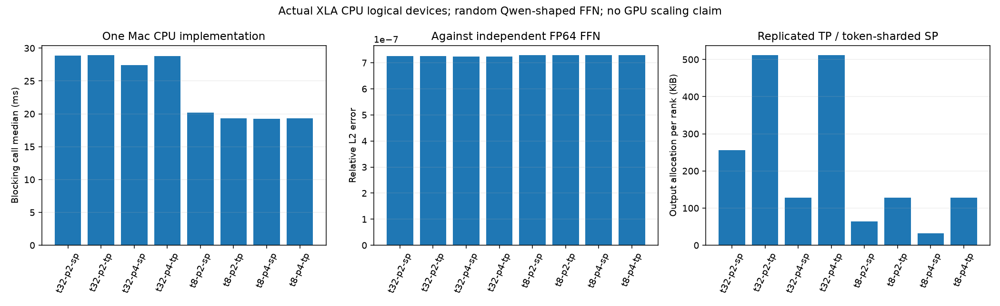

# 6-2：JAX TP/SP 的实际 FFN 路径

已完成微型预检和完整 Qwen3-8B FFN 形状的实际执行，两批各8配置、40个计时样本，全部通过预设FP64参考检查。控制器确认Mac32K进程退出后才启动，五个步骤全部exit0，完整边界在execution.jsonl。

正式执行4096→12288→4096的gate/up/SiLU/down子层，输入8或32token、2或4个CPU logical devices。所有输出最大绝对误差不超过2.020e-6、相对L2不超过7.300e-7；同token数及分片数的TP/SP四对输出逐位相同。随机FP32权重原件已保存，这不是训练权重或完整Transformer层，也不衡量模型质量。

| 输入token | CPU分片 | TP阻塞中位 | SP阻塞中位 | TP/SP每rank输出 |
|---:|---:|---:|---:|---:|
| 8 | 2 | 19.338ms | 20.192ms | 128/64KiB |
| 8 | 4 | 19.322ms | 19.275ms | 128/32KiB |
| 32 | 2 | 28.960ms | 28.837ms | 512/256KiB |
| 32 | 4 | 28.805ms | 27.447ms | 512/128KiB |

TP在gate/up列分片、down行分片后执行一次all-reduce；SP在同样投影前all-gather token，结束reduce-scatter。StableHLO中每配置原语数量核验通过，4-rank运行trace也分别包含四rank的psum_invariant、all_gather和reduce_scatter事件，不能把静态IR独自当作运行证据。每rank实际输出分配随SP切分减少，不等于整层峰值或链路流量下降。

CPU设备共享一台M2 Max，未隔离CPU频率和全部后台服务；五次热调用包含分配与框架调度，编译/输入放置/取回在计时外。没有作CPU设备数的加速结论，更不能推广八卡GPU或跨机性能。首次编译和权重原件保留，trace是计时之外的另一次调用。



独立环境固定 JAX 0.11.1，依赖见 requirements.txt。运行：

```sh
python3 -m venv .venv
.venv/bin/python -m pip install -r requirements.txt
.venv/bin/python run.py --smoke --output smoke
.venv/bin/python analyze.py smoke
.venv/bin/python run.py --output results
.venv/bin/python analyze.py results
.venv/bin/python plot.py results
```

已有输出目录拒绝覆盖。每次运行保存输入权重、完整输出、FP64参考、逐rank分片、编译IR、阻塞计时与两份运行trace。失败写 failure.json 后非零退出。完整协议见 PROTOCOL.md；本目录不运行 calculations 中的估算。

模型形状来自官方 Qwen3-8B 配置的已归档副本 model-config.json（4096→12288→4096）。权重是固定随机样本，验证 FFN 算子与分片路径，不是语言模型输出质量。CPU logical devices 共享一台 Mac，不代表独立 GPU 或网络链路。

实现参考 [JAX 官方 shard_map 文档](https://docs.jax.dev/en/latest/notebooks/shard_map.html)，固定 jax-v0.11.1 文档源码及安装包 shard_map 源码保存在 sources/（网页直接下载返回403，改用官方版本仓库源码，失败也已记录），与版本、SHA 一起归档。仅引用集合通信接口的用途，运行结果由本目录另行测量。
