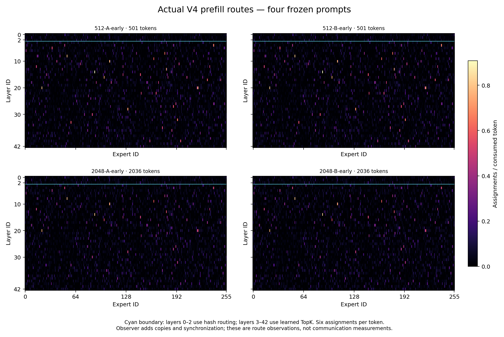
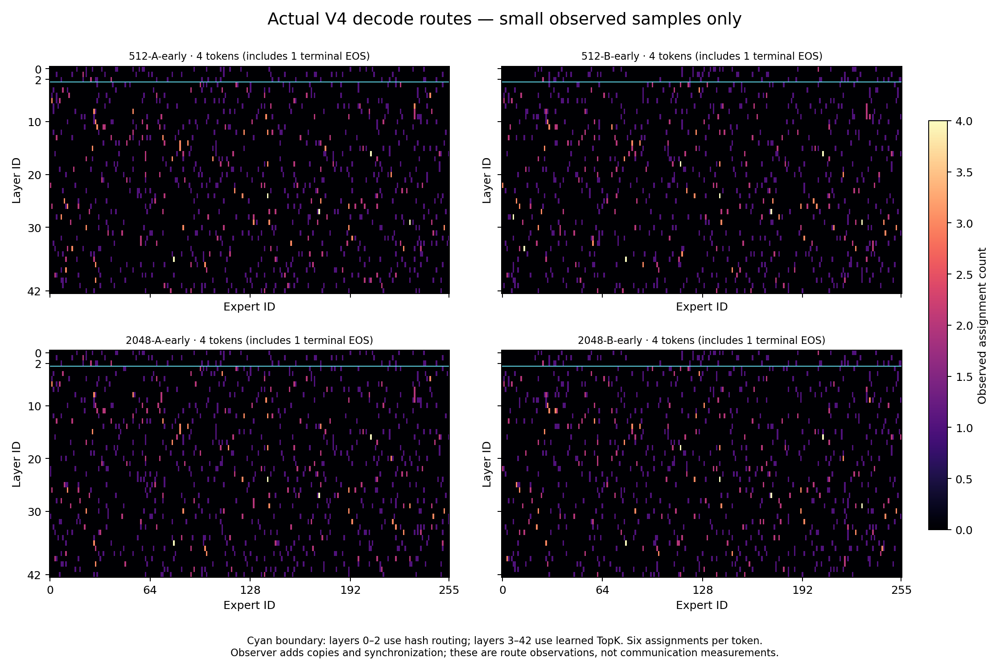

# 实验 6-3：MoE 结构与并行选择

对应正文 6.2 的核心练习（进阶）。对 Qwen3-235B-A22B（第一组）与 V4-Flash／V4-Pro／Kimi K3（第二组）扫描 EP、TP、PP 与副本，逐项统计权重驻留、每 token 的专家读取、dispatch／combine 与最忙设备；再分别改变 prefill 长度、decode batch、互联带宽与延迟。

## 独立运行

```bash
python3 parallel_scan.py    # 现场调用 calculations/calc.py，产物写入 results/
```

（本目录的 `run.py` 是原有的真实路由采集入口，需 GPU 与引擎环境；并行选择的扫描单独放在 `parallel_scan.py`，只需标准库。）

只需 Python 3.8+ 标准库。互联速率与启动时间是**声明输入**。

## 第一组：Qwen3-235B-A22B 的八卡切分

| TP×EP×PP | BF16 八卡物理权重 | BF16 最大并发 | 4bit 最大并发 |
| --- | ---: | ---: | ---: |
| 1×8×1（纯 EP） | **582.1 GB** | **3** | 36 |
| 2×4×1 | 518.6 GB | 16 | 76 |
| 4×2×1 | 486.8 GB | 43 | 156 |
| 8×1×1（纯 TP） | **471.7 GB** | **47** | 158 |
| 2×2×2 | 486.4 GB | 43 | 156 |

**纯 EP 的物理权重比纯 TP 多 110 GB（+23%）**，可并发请求数只有 1/16（3 对 47）。原因是 EP 只切专家，注意力、嵌入与输出头在每个 rank 上各留一份；TP 则把这些也切开。这是 MoE 并行里最容易忽略的一笔账——**EP 省的是专家权重的重复，不是全部权重的重复**。

## dispatch／combine：路由分布是关键

| 互联 | 每 rank token | 路由 | 最忙 rank 接收 | dispatch+combine |
| --- | ---: | --- | ---: | ---: |
| 机内 450 GB/s | 64 | balanced | 3.50 MiB | 0.058 ms |
| 机内 450 GB/s | 64 | **hotspot** | **28.00 MiB** | **0.172 ms** |
| 机内 450 GB/s | 1,024 | balanced | 56.00 MiB | 0.303 ms |
| 机内 450 GB/s | 1,024 | **hotspot** | **448.00 MiB** | **2.130 ms** |
| scale-out 50 GB/s | 1,024 | balanced | 56.00 MiB | 2.419 ms |
| scale-out 50 GB/s | 1,024 | **hotspot** | 448.00 MiB | **18.860 ms** |
| scale-out、启动 20 μs | 1 | balanced | 0.05 MiB | 0.282 ms |

三条判断：

1. **总发送字节与路由分布无关，最忙 rank 的接收量完全取决于它**。1,024 token/rank 时两种路由都发 448 MiB，但均匀路由下每个 rank 只收 56 MiB，热点路由下有一个 rank 要收全部 448 MiB——**8 倍**，时间差 7 倍（0.303 对 2.130 ms）。集合通信的代价由最忙设备决定，不由总量决定。
2. **换互联改变的是斜率，不是形状**。450 GB/s 换成 50 GB/s，所有大消息场景等比变慢约 9 倍；热点与均匀的比值不变。**互联带宽治不了路由倾斜。**
3. **小消息由启动时间决定**。每 rank 1 个 token 时，把启动从 5 μs 提到 20 μs 使时间从 0.072 涨到 0.282 ms（3.9 倍），而带宽完全没变。decode 阶段的 MoE dispatch 正在这个区间。

## 第二组：V4-Flash／V4-Pro／K3（batch=64）

| 模型 | 路由 | FFN TFLOPs | 每层专家并集 | 批内权重载荷 |
| --- | --- | ---: | ---: | ---: |
| V4-Flash | balanced | 0.975 | 256 | 518.1 GiB |
| V4-Flash | concentrated | 0.975 | **6** | **14.2 GiB** |
| V4-Pro | balanced | 3.632 | 384 | 2,890.1 GiB |
| V4-Pro | concentrated | 3.632 | 6 | 52.9 GiB |
| K3 | balanced | 8.553 | 896 | 5,105.4 GiB |
| K3 | concentrated | 8.553 | 16 | 124.5 GiB |

同样的计算量，权重载荷相差 36–55 倍（详见实验 2-6）。**这决定了并行选择：路由集中时 EP 的专家权重载荷很小，切分收益有限；路由均匀时 EP 才真正必要。**而路由分布不是设计者能选的输入，只能测——这正是本目录另一份实跑要回答的问题。

## 实际路由观测

真实 V4 路由采集（见本目录 `runs/routes-001/` 与文末保留的原始记录）完成一次完整模型路由采集：36 个完整模型 forward、1,548 条层级路由记录，覆盖全部 43 层；5,090 个实际输入 token 产生 218,870 个有效 token-layer 行、1,313,220 个专家 assignment。每行选中 6 个专家，padding 为 0，重复专家 ID 行数为 0；前 3 层实际使用 HashTopK，其余 40 层使用 TopK。四题输出与封存的 2-5 参考逐项一致。**这是真实已训练模型选择的专家，不是均匀或集中的模拟路由。**

完整数值见 [results/moe-parallel.md](results/moe-parallel.md)。

## 限制

- 均匀／热点路由是声明输入；真实分布见上面的实际采集。
- 权重载荷按统一 2 字节口径，不等于 V4／K3 的实际混合量化存储。
- dispatch／combine 时间是端点服务下界＋成对模型，不含拥塞、调度与内核开销。
- 未知字段（实测 HBM、真实 all-to-all 时间）保持为 null。


---

## 原始路由采集记录（原 README 保留）

# 6-3：真实 V4 专家路由观测

已完成一次完整模型路由采集，最终成功记录为 `runs/routes-001/`。四题输出 token、文本及结束原因与封存的 2-5 参考逐项一致，四题答案均正确。模型保留原 43 层；本实验采集真实已训练模型选择的专家，没有生成均匀或集中路由模拟数据。

## 实际结果

| 冻结题目 | Prefill 有效 token | 实际 decode token | Prefill 批次 | Decode 批次 | 输出对照 |
|---|---:|---:|---:|---:|---|
| 512-A-early | 501 | 4 | 2 | 4 | 逐项一致 |
| 512-B-early | 501 | 4 | 2 | 4 | 逐项一致 |
| 2048-A-early | 2036 | 4 | 8 | 4 | 逐项一致 |
| 2048-B-early | 2036 | 4 | 8 | 4 | 逐项一致 |

共 36 个完整模型 forward、1548 个层级路由记录，每批完整覆盖 43 层。总计 5090 个实际输入 token（5074 个 prompt token，加 16 个 decode token），218870 个有效 token-layer 行，1313220 个专家 assignment。每行选中 6 个专家；本次 padding 为 0，出现重复专家 ID 的行数为 0。没有预设学习到的 hash 表必须无重复。前 3 层实际使用 HashTopK，其余 40 层实际使用 TopK。

**四个 decode token 中包含一次额外的终止 EOS forward。** 每题返回 4 个 token，最后一个是 EOS 1；实际路由记录显示四个返回 token 都被消费，末次位置为 504 或 2039。它与只需消费前三个返回 token 的通常序列推导不同。保存的 `reference/scheduler.py` 中 overlap 循环先发射当前批次，再处理上一批结果，与这个现象一致。分析器严格核对真实 input IDs、连续 positions、题目 ID、请求起止时间及源码 SHA，没有删掉额外计算以迎合原预期。EOS 之后没有返回新 token；本观察器只记录路由，未记录额外 forward 的最终 logits 或采样值，不能声称知道该下一 token 的值。

初始化实际耗时 259.723 秒。四题带观察器的请求墙钟分别为 93.595、25.244、65.229、65.941 秒。watchdog 采样的任务 GPU 峰值为 69260 MiB，进程树及协调进程 RSS 峰值为 149709074432 字节。这些是共享主机上的观察运行数据，不是无扰动性能基线。supervisor 实际 exit 0、reason 为 null、无存活后代。

## 图与原始证据



Prefill 图按每层实际有效 token 数归一化，单位是 assignments/token，每层所有专家之和为 6。不同专家的选中频率确有差异；四题各自最高单元格为 0.9082、0.9022、0.7972、0.8153 assignments/token。这仅描述这四个冻结输入，不能外推工作负载分布。



Decode 独立展示原始整数计数，每题只有 4 个实际输入 token，图中明确包括 1 个终止 EOS；不把这个小样本当作稳定分布。两图同时提供 SVG。

- `runs/routes-001/routes/*-batches.jsonl`：全量实际 IDs/weights、input IDs、positions、有效 token 数、层号、模式和时间边界。
- `runs/routes-001/route-analysis.json`：各题/阶段/层的 256 个原始计数、padding、重复 ID 行数、token 映射和 EOS 核对。
- `runs/routes-001/requests.json`：真实响应；`reference/requests.json`：原 2-5 成功响应。
- `runs/routes-001/routes/*-installed.json`：模型工作进程安装观察器时的源码 SHA。
- `runs/routes-001/compatibility-records/`：私有 bias 别名适配的每进程安装及首次修复记录。
- `runs/routes-001/plots/manifest.json`：分析输入 SHA 与图文件 SHA。
- `manifest.json`：本独立实验的文件校验清单。

## 方法与复现

模型为缓存的 DeepSeek V4 Flash revision `7872f01b1d1fe23eabc4c98b48bffcef5a386062`；固定 43 层、BF16、CPU offload 110 GiB、上下文 4096、chunked prefill 256、单请求、greedy，关闭 CUDA graph 与 radix cache。四题是 2-5 的 501/2036 token × A/B early 子集，没有改题。完整原始八题 SHA、复制源码 SHA、模型元数据和依赖证据保存在本目录。

运行明确使用私有 `offload_alias.py` 修复：官方 OffloaderV1 的 functional_call 替换注册参数时，临时同步 TopKConfig 的 correction-bias 别名。未改共享环境、参数值或路由数学；这是有明确兼容适配的运行，不称为完全无修改的官方路径。原 2-5 的严格专家数值检查限制仍然保留，本次输出一致不代表全模型数值正确性已获证明。

观察器包装实际模型、decoder layer、TopK 与 HashTopK 的 forward。原函数照常执行；随后只克隆小型 IDs/weights 和批次 input IDs/positions，每个完整模型 forward 后同步并序列化。有效 token 依据真实 ForwardBatch CPU 字段，并与可选 GPU 字段交叉检查。路由统计只使用有效前缀。

用固定私有 SGLang Python，由 root 在 RTX Pro 上统一调度：

```sh
python -B reproduce.py --name routes-002 --execute-after-rl
python -B analyze.py --out runs/routes-002
python -B score.py --out runs/routes-002
```

`--execute-after-rl` 是继承的显式调度 guard 名称。成功 JIT seed 已复制到本实验 `cache-seed/`，不依赖 2-5 的缓存目录。权重保持使用机器已有缓存。用含 Matplotlib/NumPy 的绘图环境运行：

```sh
python plot.py --out runs/routes-001
```

运行快照保持当时执行的脚本，BASE 分析脚本是执行后完善的验证程序；BASE score 的 scope 文案已修为 four_fixed，原运行脚本快照的 eight_fixed 文案不作为题目数量依据。重新运行时必须重新验证；分析器当前对这次已观察到的 EOS 额外 forward 做精确核对，不默默接受其他轨迹。

## 范围

克隆、CUDA events、每批同步和写盘会扰动调度。路由 CUDA event 区间不是 dispatch、expert GEMM、combine 或通信时间；host 区间也可能包含编译/发射开销。没有 EP 映射、跨 GPU/主机通信、容量费用模型、人工路由干预或质量提升结论。`calculations/` 完全未动。四题实际路由仅补充 6-3 的训练模型观测部分，不能替代该实验其余多设备与受控路由比较。
