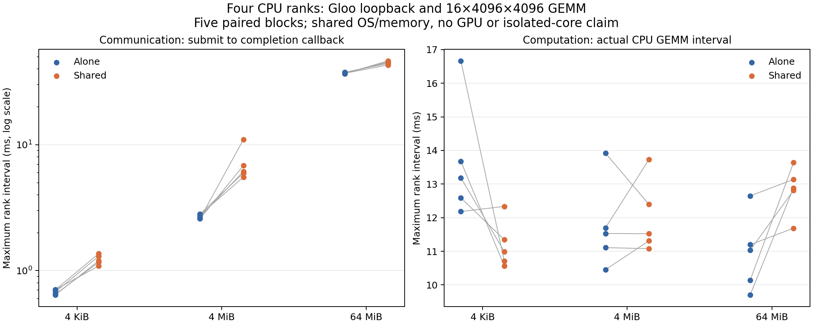
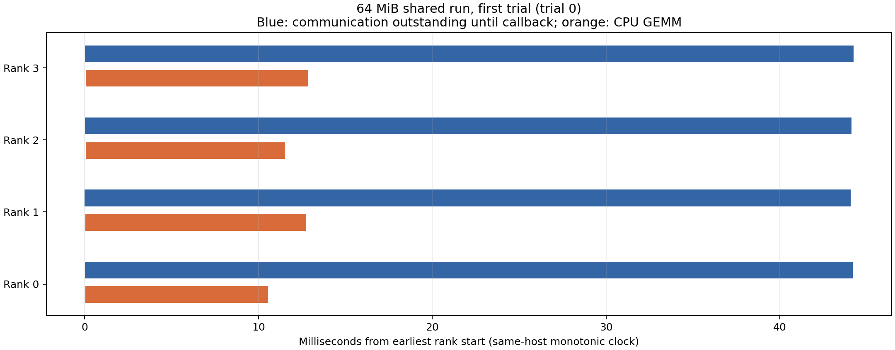

# 6-5：四进程实际通信与计算并行

M2 Max 上四个 Gloo rank 的正式对照已完成：三个消息大小、三种运行方式、五个随机配对区组，共45组／180条rank记录。另有9组预热和3组独立smoke；不纳入正式统计。228条记录的输出与时间关系核验通过，保存的8份完整矩阵经重新生成输入、独立FP64矩阵乘复核，全部零差。

实际并行不能直接视为通信免费：4 MiB 消息的通信可观测区间中位数由2.674 ms增至6.141 ms；64 MiB由36.919 ms增至45.209 ms，同时计算区间由11.031 ms增至12.885 ms。这是同机共享OS／主存条件下的观察；五对样本不足以证明独占硬件上的稳定收益，也没有硬件计数器支持具体带宽归因。

## 固定协议与测量

执行前的[协议](PROTOCOL.md)固定Torch2.14 CPU、TCP loopback、四独立进程、每rank intra/inter-op各2线程。Mac没有CPU硬亲和，线程限制不是独占核心。各rank实际计算 `[16,4096] @ [4096,4096]` FP32矩阵乘，输入为固定seed的小整数除16，参考为CPU FP64；该输入与规模可精确表示，验收零容差。这是合成投影控制，没有训练权重或完整模型。

comm-only只运行实际异步all_reduce SUM；compute-only只执行GEMM；shared提交异步归约后立即计算并最终等待完成。每组先barrier、重新填充通信输入；校验不计入执行窗口。future回调记录主机可见完成，可能晚于实际通信完成。60条正式shared rank记录都存在正的可观测区间重叠，不能把它当作物理链路或GPU重叠证明。

组墙钟从最早rank开始到最晚rank结束；下表通信和计算分别先取组内最大rank区间，再取五组中位数。CPU时间是各rank进程的线程CPU消耗之和。`paired.json`中的独立运行墙钟相加只是两次测量之和，没有实跑“先通信再计算”的串行调度，不能据此报告直接串行基线加速比。

| 消息 | 方式 | 组墙钟 ms | 通信可见区间 ms | 计算区间 ms |
|---|---|---:|---:|---:|
|4 KiB|通信独立|0.711|0.676|—|
|4 KiB|计算独立|13.215|—|13.188|
|4 KiB|并行|11.039|1.197|10.995|
|4 MiB|通信独立|2.726|2.674|—|
|4 MiB|计算独立|11.538|—|11.531|
|4 MiB|并行|11.582|6.141|11.523|
|64 MiB|通信独立|36.956|36.919|—|
|64 MiB|计算独立|11.079|—|11.031|
|64 MiB|并行|45.242|45.209|12.885|





时间线固定采用64 MiB shared的trial 0。蓝色为提交到完成回调，橙色为实际GEMM；同机单调时钟对齐。完整机器环境、源码SHA、各rank输入身份和实际输出见[formal](formal/)，汇总见[analysis.json](analysis.json)、[groups.json](groups.json)、[paired.json](paired.json)。

## 复现与校验

在仓库根目录、安装Torch2.14 CPU的Mac环境运行；必须选择不存在的输出名：

```sh
experiments/tools/collective-cpu-venv/bin/python -B experiments/ch06/06-05/launch.py --name new-smoke --smoke
experiments/tools/collective-cpu-venv/bin/python -B experiments/ch06/06-05/launch.py --name new-formal
```

离线复核原始封存数据：`analyze.py`检查原始smoke/formal日志，`verify_tensors.py`重新生成矩阵并检查完整保存输出。它们在本目录写派生JSON，复核时应使用目录副本；`plot.py`需NumPy／Matplotlib，读取派生记录重画图。原执行和独立张量复核均已exit0，两图经目视检查。watchdog只监控自己的新进程session，8 GiB RSS／10分钟上限，正式峰值2294661120字节，正常退出。

本结果补充CPU实跑记录。原题涉及的GPU集合通信、融合allreduce/RMSNorm、跨机拓扑及模型收益仍未验证；没有执行或修改其他任务的calculations。
