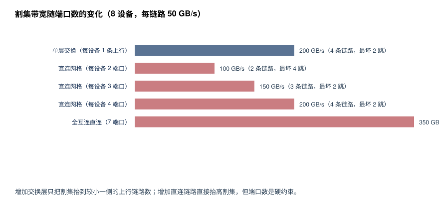

# 实验 6-6：拓扑与割集带宽

对应正文 6.3。增加交换层还是增加直连链路？给定端口数和流量矩阵，构造两种可行拓扑并比较割集与路径。

## 独立运行

```bash
python3 run.py    # 写出 results/topology.{json,md,svg}
```

只需 Python 3.8+ 标准库；SVG 自绘。统一计算项目未覆盖这一拓扑构造问题，因此本实验**独立实现**：割集带宽由**穷举全部 254 个非平凡二分**求最小值（不用近似），跳数由 BFS 直径求得，每一步都可手算核对。

## 设定

8 个设备，每条链路单向 50 GB/s，交换机 16 端口（内部按无阻塞假设），交换跳 700 ns／直连跳 300 ns。流量为**全对全等量，每对 16 GB/s**，因此穿过均衡二分的需求是 4×4×16 = 256 GB/s。

## 结果

| 拓扑 | 每设备端口 | 链路数 | 最小割 | 割上链路 | 最坏跳数 | 跳时延 | 够用 | 收敛比 |
| --- | ---: | ---: | ---: | ---: | ---: | ---: | :---: | ---: |
| 单层交换（每设备 1 条上行） | 1 | 8 | 200 GB/s | 4 | 2 | 1.4 μs | **否** | 1.28 |
| 直连网格（2 端口） | 2 | 8 | 100 GB/s | 2 | 4 | 1.2 μs | **否** | 2.56 |
| 直连网格（3 端口） | 3 | 12 | 150 GB/s | 3 | 2 | 0.6 μs | **否** | 1.71 |
| 直连网格（4 端口） | 4 | 16 | 200 GB/s | 4 | 2 | **0.6 μs** | **否** | 1.28 |
| 全互连直连（7 端口） | 7 | 28 | **350 GB/s** | 7 | **1** | **0.3 μs** | **是** | 0.73 |

三条判断：

1. **同样的割集带宽，跳数可以差一倍多**。单层交换与 4 端口直连网格的最小割都是 200 GB/s（都不够），但直连网格的最坏路径是 0.6 μs 而交换方案是 1.4 μs——交换机多了一跳，且每跳更贵。对小消息为主的负载（见实验 6-4，decode 的 all-reduce 载荷很小），这一项比割集更重要。
2. **增加交换层不抬高割集，只是把端口集中起来**。单层交换里每设备只用 1 个端口，割集被"较小一侧的上行链路数"卡死在 4 条。要抬高它必须加上行链路（每设备用更多端口连交换机），那就等于把端口预算花在交换而不是直连上——**两者争的是同一份端口预算**。
3. **端口数是硬约束**。从 2 端口到 7 端口，割集从 100 涨到 350 GB/s（3.5×），链路数从 8 涨到 28（3.5×），跳数从 4 降到 1。全互连是 8 设备这个规模下唯一满足本流量的方案；但它需要每设备 7 个端口，扩到 16 设备就要 15 个端口——**全互连不可扩展，这正是超节点需要交换层的原因**。

一句话：**交换层买的是可扩展性和端口复用，直连买的是割集带宽和低跳数**。选择取决于设备数量、端口预算和消息大小分布，而不是单一指标。



完整数值见 [results/topology.md](results/topology.md)。

## 限制

- 交换机按内部无阻塞假设；真实交换芯片的缓冲、调度与 HOL 阻塞不在内。
- 割集是**必要条件**：割集够不代表实际能达到，路由、拥塞控制与流量不均都会降低有效带宽。第 7 章给出实测的割集与反馈队列。
- 跳时延是声明输入，不是实测。链路带宽为单向有效值，未计协议开销。
- 直连网格用「环＋弦」构造的正则图，不是最优拓扑；同端口数下存在割集更好的构造。
