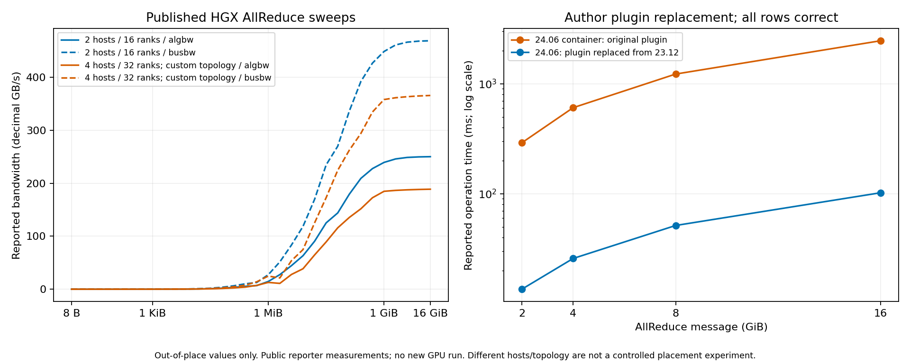

# 实验 7-3：公开集合通信原记录核验

本目录完成原题“用公开集合通信记录检验剩余选择”的**公开证据解析与可比性核查**。2026-09-09 下载官方项目仓库中的实际用户测试原文和附件，逐行解析 8 次公开运行、88 条消息记录（176 个原位/非原位模式记录），294 项校验通过。没有执行新的 GPU 通信，也没有重算第 6 章或 calculations 的拓扑、字节、轮次、尾部、期限和费用模型。

证据足以核查 AllReduce 的真实消息大小、rank 分组、软件条件和带宽口径；**不足以完成 TP／PP／DP／EP 候选的实测优劣验证**。尤其不能用两机的一条 AllReduce 曲线验证八 rank 的模型放置、AllGather、ReduceScatter、专家交换或多 NIC 中继。原题这些完整放置要求仍需对应工作负载与拓扑的测量。



| 记录 | 消息点 / rank | 正确性 | 可用范围 |
|---|---:|---|---|
| hgx2 | 32 / 16 | 所有行 0 错误，footer OK | 2 台 Dell HGX XE9680，每机 8 H100 与 8 CX7 IB 400Gbps；8B 至 16GiB |
| hgx4 | 32 / 32 | 所有行 0 错误，footer OK | 4 台、每机 8 H100；显式自定义 NCCL_TOPO_FILE，XML 未随帖提供 |
| plugin_swap_0 / 1 | 各 4 / 16 | 所有行 0 错误，footer OK | 同一作者报告替换网络插件前后；2GiB 至 16GiB，不能归因为放置变化 |
| corrupt_0 / 1 | 各 4 / 16 | 两次 footer 均 FAILED，错误计数非零 | 排除出有效性能图；保留为科学证据筛选反例 |
| attachment_23.12 / 24.06 | 各 4 / 16 | 行错误为 0，但无完成 footer | 仅支持条件化观察与部分 channel/NIC 路径检查，不升级为完整成功运行 |

主要出处：[NVIDIA/nccl-tests #309 正文](https://github.com/NVIDIA/nccl-tests/issues/309)、[同一作者的四节点原日志](https://github.com/NVIDIA/nccl-tests/issues/309#issuecomment-2904845294)、[NVIDIA/nccl #1403 后续正确性通过的插件替换日志](https://github.com/NVIDIA/nccl/issues/1403#issuecomment-2290434940)。这些是官方项目中**用户提交的原始测量**，不是 NVIDIA 官方基准认证。两组其他用户的后续 #309 跟帖没有混入同一硬件比较。完整 API 响应保留在 sources 中。

在 16GiB 非原位点，hgx2 为 68,652us、algbw 250.24GB/s、busbw 469.21GB/s；hgx4 为 90,986us、188.82GB/s、365.84GB/s。这是消息和 collective 相同而 rank、机器、拓扑配置同时不同的公开观察，不能解释成纯扩容成本或某种层次化实现的因果效果。四节点命令主机顺序与实际 rank banner 顺序也不同；[rank-layout.json](rank-layout.json)采用实际 banner，不按 mpirun 文本臆造分配。

插件对照在 16GiB 非原位点为 2,458,945us 与 102,194us。作者报告在同一 24.06 容器中换入 23.12 的 libnccl-net.so；缺少插件二进制 SHA、完整环境 diff、重复测量和交换机遥测，因此结果只支持“网络软件条件可显著影响同形通信”，不证明 ECE 是唯一原因。正文先前“改善”的两个结果均数据损坏，[维护者明确要求先修复正确性](https://github.com/NVIDIA/nccl/issues/1403#issuecomment-2289073804)。它们是有解释价值的负面原始证据，不是本地被成功替代的启动调试失败。

带宽核验依照固定源码版本的 AllReduceGetBw：algbw = size/time，busbw = algbw × 2(n−1)/n。这里只核对原日志报告口径，未把因子当作实际每条链路的字节模型。16 rank 的因子为 1.875，32 rank 为 1.9375。程序按打印小数位计算时间舍入区间，并与两个带宽各 ±0.005GB/s 的区间求交；不能用已舍入 algbw 精确乘因子后要求文本完全相等。时间以日志的 **us** 表头和源码为准；PERFORMANCE.md 开头将时间写作 ms，与这些实际表头不一致。GB/s 是十进制，消息列字节不变。源码快照只用于口径复核，**实际运行的 nccl-tests commit 未公开**。

[官方口径说明](https://github.com/NVIDIA/nccl-tests/blob/b4d5beebca8a76cf01335f724d154b9b9d394d96/doc/PERFORMANCE.md)与[源码](https://github.com/NVIDIA/nccl-tests/blob/b4d5beebca8a76cf01335f724d154b9b9d394d96/src/all_reduce.cu)已按 commit 下载并记录 SHA。归一化 busbw 不是某张 IB NIC 的测得发送速率；NVLS/NVLSTree 的实际算法仍需 tuning 日志才能确认。#309 的 NCCL_DEBUG=VERSION 只显示 2.26.2+cuda12.8，不提供每个消息点的算法选择。原文的 ib_send_bw “396 GB/s”与400Gbps规格表述冲突，未采用该数字、未默默更改单元。

两份 #1403 附件保存了 16 rank communicator 的 channel send/receive 与 GDRDMA 记录，接口列表含 mlx5_0、mlx5_1、mlx5_4、mlx5_5 及 mlx5_bond_0；bond 不能算成第五张独立物理 NIC。只有偶数 rank 的本地 Init COMPLETE，不能冒充两机完整设备拓扑或真实流量 trace。详见 [channel-evidence.json](channel-evidence.json) 与 [runs.json](runs.json)。记录仅是连接建立，不是每条链路按时间采样的负载。

也核查了 [DeepEP 官方仓库](https://github.com/deepseek-ai/DeepEP)及[真实 tuning 输出 #633](https://github.com/deepseek-ai/DeepEP/issues/633)。该报告称在八卡机器中使用两张 H100、100 SM，提供 chunk 与微秒/GB/s；但缺少准确运行 commit、完整命令、token/hidden/routing 输入和带宽计数定义绑定。README 汇总表也不是逐次原始日志。因此冻结来源供复核，未把它合并为本实验 EP 或跨机放置曲线，未从曲线图数字化或理论峰值生成点。

原题定位：outlines/07-数据中心网络.md 的实验 7-3；扩写 outlines/extensions/07-数据中心网络.md 的实验 7-3 进一步要求八 rank 到两台服务器的实际消息映射与多 NIC 变体。本目录没有访问或更改另一 session 的研究数据。

复现全部离线解析与图：

```sh
python3 -B experiments/ch07/07-03/analyze.py
experiments/.venv/bin/python -B experiments/ch07/07-03/plot.py
python3 -B experiments/ch07/07-03/review.py
```

sources/index.json 保存原始 URL、下载 UTC、SHA256；JSON 还保留 created_at/updated_at。raw/ 是选定正文/跟帖代码块的逐字提取，runs.json 提供原文行偏移和永久评论链接；rows.csv 的 source+line 可逐项回查。两个绘图面板都使用通过完整正确性条件的原始非原位记录，未选择最优重复、未添加误差条，图片已经实际打开检查。manifest.sha256 覆盖最终源、脚本、派生产物和图。
